cola Report for Consensus Partitioning
==================

**Date**: 2019-12-06 19:19:42 CET, **cola version**: 1.3.2

----------------------------------------------------------------

<style type='text/css'>

body, td, th {
   font-family: Arial,Helvetica,sans-serif;
   background-color: white;
   font-size: 13px;
  max-width: 800px;
  margin: auto;
  margin-left:210px;
  padding: 0px 10px 0px 10px;
  border-left: 1px solid #EEEEEE;
  line-height: 150%;
}

tt, code, pre {
   font-family: 'DejaVu Sans Mono', 'Droid Sans Mono', 'Lucida Console', Consolas, Monaco, 

monospace;
}

h1 {
   font-size:2.2em;
}

h2 {
   font-size:1.8em;
}

h3 {
   font-size:1.4em;
}

h4 {
   font-size:1.0em;
}

h5 {
   font-size:0.9em;
}

h6 {
   font-size:0.8em;
}

a {
  text-decoration: none;
  color: #0366d6;
}

a:hover {
  text-decoration: underline;
}

a:visited {
   color: #0366d6;
}

pre, img {
  max-width: 100%;
}
pre {
  overflow-x: auto;
}
pre code {
   display: block; padding: 0.5em;
}

code {
  font-size: 92%;
  border: 1px solid #ccc;
}

code[class] {
  background-color: #F8F8F8;
}

table, td, th {
  border: 1px solid #ccc;
}

blockquote {
   color:#666666;
   margin:0;
   padding-left: 1em;
   border-left: 0.5em #EEE solid;
}

hr {
   height: 0px;
   border-bottom: none;
   border-top-width: thin;
   border-top-style: dotted;
   border-top-color: #999999;
}

@media print {
   * {
      background: transparent !important;
      color: black !important;
      filter:none !important;
      -ms-filter: none !important;
   }

   body {
      font-size:12pt;
      max-width:100%;
   }

   a, a:visited {
      text-decoration: underline;
   }

   hr {
      visibility: hidden;
      page-break-before: always;
   }

   pre, blockquote {
      padding-right: 1em;
      page-break-inside: avoid;
   }

   tr, img {
      page-break-inside: avoid;
   }

   img {
      max-width: 100% !important;
   }

   @page :left {
      margin: 15mm 20mm 15mm 10mm;
   }

   @page :right {
      margin: 15mm 10mm 15mm 20mm;
   }

   p, h2, h3 {
      orphans: 3; widows: 3;
   }

   h2, h3 {
      page-break-after: avoid;
   }
}
</style>


## Summary


All available functions which can be applied to this `res_list` object:


```r
res_list
```

```
#> A 'ConsensusPartitionList' object with 24 methods.
#>   On a matrix with 15185 rows and 159 columns.
#>   Top rows are extracted by 'SD, CV, MAD, ATC' methods.
#>   Subgroups are detected by 'hclust, kmeans, skmeans, pam, mclust, NMF' method.
#>   Number of partitions are tried for k = 2, 3, 4, 5, 6.
#>   Performed in total 30000 partitions by row resampling.
#> 
#> Following methods can be applied to this 'ConsensusPartitionList' object:
#>  [1] "cola_report"           "collect_classes"       "collect_plots"         "collect_stats"        
#>  [5] "colnames"              "functional_enrichment" "get_anno_col"          "get_anno"             
#>  [9] "get_classes"           "get_matrix"            "get_membership"        "get_stats"            
#> [13] "is_best_k"             "is_stable_k"           "ncol"                  "nrow"                 
#> [17] "rownames"              "show"                  "suggest_best_k"        "test_to_known_factors"
#> [21] "top_rows_heatmap"      "top_rows_overlap"     
#> 
#> You can get result for a single method by, e.g. object["SD", "hclust"] or object["SD:hclust"]
#> or a subset of methods by object[c("SD", "CV")], c("hclust", "kmeans")]
```

The call of `run_all_consensus_partition_methods()` was:


```
#> run_all_consensus_partition_methods(data = mat, mc.cores = 4)
```

Dimension of the input matrix:


```r
mat = get_matrix(res_list)
dim(mat)
```

```
#> [1] 15185   159
```

### Density distribution

The density distribution for each sample is visualized as in one column in the
following heatmap. The clustering is based on the distance which is the
Kolmogorov-Smirnov statistic between two distributions.


```r
library(ComplexHeatmap)
densityHeatmap(mat, ylab = "value", cluster_columns = TRUE, show_column_names = FALSE,
    mc.cores = 4)
```


### Suggest the best k


Folowing table shows the best `k` (number of partitions) for each combination
of top-value methods and partition methods. Clicking on the method name in
the table goes to the section for a single combination of methods.

[The cola vignette](http://bioconductor.org/packages/devel/bioc/vignettes/cola/inst/doc/cola.html#toc_13)
explains the definition of the metrics used for determining the best
number of partitions.


```r
suggest_best_k(res_list)
```


|                            | The best k| 1-PAC| Mean silhouette| Concordance|   |Optional k |
|:---------------------------|----------:|-----:|---------------:|-----------:|:--|:----------|
|[SD:kmeans](#SD-kmeans)     |          2| 1.000|           0.982|       0.986|** |           |
|[SD:mclust](#SD-mclust)     |          2| 1.000|           1.000|       1.000|** |           |
|[SD:NMF](#SD-NMF)           |          2| 1.000|           1.000|       1.000|** |           |
|[CV:mclust](#CV-mclust)     |          2| 1.000|           1.000|       1.000|** |           |
|[MAD:hclust](#MAD-hclust)   |          6| 1.000|           0.984|       0.986|** |2,3,4,5    |
|[MAD:kmeans](#MAD-kmeans)   |          2| 1.000|           1.000|       1.000|** |           |
|[MAD:skmeans](#MAD-skmeans) |          4| 1.000|           0.991|       0.992|** |2,3        |
|[MAD:mclust](#MAD-mclust)   |          2| 1.000|           1.000|       1.000|** |           |
|[MAD:NMF](#MAD-NMF)         |          2| 1.000|           1.000|       1.000|** |           |
|[ATC:kmeans](#ATC-kmeans)   |          2| 1.000|           1.000|       1.000|** |           |
|[ATC:pam](#ATC-pam)         |          4| 1.000|           0.983|       0.993|** |2          |
|[ATC:NMF](#ATC-NMF)         |          2| 1.000|           1.000|       1.000|** |           |
|[CV:skmeans](#CV-skmeans)   |          6| 0.995|           0.989|       0.976|** |2,4,5      |
|[ATC:hclust](#ATC-hclust)   |          6| 0.968|           0.976|       0.983|** |2,3,4,5    |
|[ATC:skmeans](#ATC-skmeans) |          5| 0.949|           0.974|       0.959|*  |2,3,4      |
|[MAD:pam](#MAD-pam)         |          5| 0.930|           0.895|       0.924|*  |2,4        |
|[SD:hclust](#SD-hclust)     |          6| 0.926|           0.951|       0.954|*  |2,3,4,5    |
|[SD:pam](#SD-pam)           |          6| 0.924|           0.881|       0.914|*  |2,4,5      |
|[CV:pam](#CV-pam)           |          6| 0.920|           0.968|       0.966|*  |2          |
|[SD:skmeans](#SD-skmeans)   |          6| 0.911|           0.913|       0.890|*  |2,3,4      |
|[ATC:mclust](#ATC-mclust)   |          5| 0.902|           0.910|       0.941|*  |2          |
|[CV:hclust](#CV-hclust)     |          5| 0.859|           0.934|       0.935|   |           |
|[CV:NMF](#CV-NMF)           |          2| 0.725|           0.893|       0.946|   |           |
|[CV:kmeans](#CV-kmeans)     |          2| 0.426|           0.719|       0.852|   |           |

\*\*: 1-PAC > 0.95, \*: 1-PAC > 0.9


### CDF of consensus matrices

Cumulative distribution function curves of consensus matrix for all methods.


```r
collect_plots(res_list, fun = plot_ecdf)
```


### Consensus heatmap

Consensus heatmaps for all methods. ([What is a consensus heatmap?](http://bioconductor.org/packages/devel/bioc/vignettes/cola/inst/doc/cola.html#toc_9))


<style type='text/css'>


.ui-helper-hidden {
	display: none;
}
.ui-helper-hidden-accessible {
	border: 0;
	clip: rect(0 0 0 0);
	height: 1px;
	margin: -1px;
	overflow: hidden;
	padding: 0;
	position: absolute;
	width: 1px;
}
.ui-helper-reset {
	margin: 0;
	padding: 0;
	border: 0;
	outline: 0;
	line-height: 1.3;
	text-decoration: none;
	font-size: 100%;
	list-style: none;
}
.ui-helper-clearfix:before,
.ui-helper-clearfix:after {
	content: "";
	display: table;
	border-collapse: collapse;
}
.ui-helper-clearfix:after {
	clear: both;
}
.ui-helper-zfix {
	width: 100%;
	height: 100%;
	top: 0;
	left: 0;
	position: absolute;
	opacity: 0;
	filter:Alpha(Opacity=0); 
}

.ui-front {
	z-index: 100;
}


.ui-state-disabled {
	cursor: default !important;
	pointer-events: none;
}


.ui-icon {
	display: inline-block;
	vertical-align: middle;
	margin-top: -.25em;
	position: relative;
	text-indent: -99999px;
	overflow: hidden;
	background-repeat: no-repeat;
}

.ui-widget-icon-block {
	left: 50%;
	margin-left: -8px;
	display: block;
}


.ui-widget-overlay {
	position: fixed;
	top: 0;
	left: 0;
	width: 100%;
	height: 100%;
}
.ui-accordion .ui-accordion-header {
	display: block;
	cursor: pointer;
	position: relative;
	margin: 2px 0 0 0;
	padding: .5em .5em .5em .7em;
	font-size: 100%;
}
.ui-accordion .ui-accordion-content {
	padding: 1em 2.2em;
	border-top: 0;
	overflow: auto;
}
.ui-autocomplete {
	position: absolute;
	top: 0;
	left: 0;
	cursor: default;
}
.ui-menu {
	list-style: none;
	padding: 0;
	margin: 0;
	display: block;
	outline: 0;
}
.ui-menu .ui-menu {
	position: absolute;
}
.ui-menu .ui-menu-item {
	margin: 0;
	cursor: pointer;
	
	list-style-image: url("data:image/gif;base64,R0lGODlhAQABAIAAAAAAAP///yH5BAEAAAAALAAAAAABAAEAAAIBRAA7");
}
.ui-menu .ui-menu-item-wrapper {
	position: relative;
	padding: 3px 1em 3px .4em;
}
.ui-menu .ui-menu-divider {
	margin: 5px 0;
	height: 0;
	font-size: 0;
	line-height: 0;
	border-width: 1px 0 0 0;
}
.ui-menu .ui-state-focus,
.ui-menu .ui-state-active {
	margin: -1px;
}


.ui-menu-icons {
	position: relative;
}
.ui-menu-icons .ui-menu-item-wrapper {
	padding-left: 2em;
}


.ui-menu .ui-icon {
	position: absolute;
	top: 0;
	bottom: 0;
	left: .2em;
	margin: auto 0;
}


.ui-menu .ui-menu-icon {
	left: auto;
	right: 0;
}
.ui-button {
	padding: .4em 1em;
	display: inline-block;
	position: relative;
	line-height: normal;
	margin-right: .1em;
	cursor: pointer;
	vertical-align: middle;
	text-align: center;
	-webkit-user-select: none;
	-moz-user-select: none;
	-ms-user-select: none;
	user-select: none;

	
	overflow: visible;
}

.ui-button,
.ui-button:link,
.ui-button:visited,
.ui-button:hover,
.ui-button:active {
	text-decoration: none;
}


.ui-button-icon-only {
	width: 2em;
	box-sizing: border-box;
	text-indent: -9999px;
	white-space: nowrap;
}


input.ui-button.ui-button-icon-only {
	text-indent: 0;
}


.ui-button-icon-only .ui-icon {
	position: absolute;
	top: 50%;
	left: 50%;
	margin-top: -8px;
	margin-left: -8px;
}

.ui-button.ui-icon-notext .ui-icon {
	padding: 0;
	width: 2.1em;
	height: 2.1em;
	text-indent: -9999px;
	white-space: nowrap;

}

input.ui-button.ui-icon-notext .ui-icon {
	width: auto;
	height: auto;
	text-indent: 0;
	white-space: normal;
	padding: .4em 1em;
}


input.ui-button::-moz-focus-inner,
button.ui-button::-moz-focus-inner {
	border: 0;
	padding: 0;
}
.ui-controlgroup {
	vertical-align: middle;
	display: inline-block;
}
.ui-controlgroup > .ui-controlgroup-item {
	float: left;
	margin-left: 0;
	margin-right: 0;
}
.ui-controlgroup > .ui-controlgroup-item:focus,
.ui-controlgroup > .ui-controlgroup-item.ui-visual-focus {
	z-index: 9999;
}
.ui-controlgroup-vertical > .ui-controlgroup-item {
	display: block;
	float: none;
	width: 100%;
	margin-top: 0;
	margin-bottom: 0;
	text-align: left;
}
.ui-controlgroup-vertical .ui-controlgroup-item {
	box-sizing: border-box;
}
.ui-controlgroup .ui-controlgroup-label {
	padding: .4em 1em;
}
.ui-controlgroup .ui-controlgroup-label span {
	font-size: 80%;
}
.ui-controlgroup-horizontal .ui-controlgroup-label + .ui-controlgroup-item {
	border-left: none;
}
.ui-controlgroup-vertical .ui-controlgroup-label + .ui-controlgroup-item {
	border-top: none;
}
.ui-controlgroup-horizontal .ui-controlgroup-label.ui-widget-content {
	border-right: none;
}
.ui-controlgroup-vertical .ui-controlgroup-label.ui-widget-content {
	border-bottom: none;
}


.ui-controlgroup-vertical .ui-spinner-input {

	
	width: 75%;
	width: calc( 100% - 2.4em );
}
.ui-controlgroup-vertical .ui-spinner .ui-spinner-up {
	border-top-style: solid;
}

.ui-checkboxradio-label .ui-icon-background {
	box-shadow: inset 1px 1px 1px #ccc;
	border-radius: .12em;
	border: none;
}
.ui-checkboxradio-radio-label .ui-icon-background {
	width: 16px;
	height: 16px;
	border-radius: 1em;
	overflow: visible;
	border: none;
}
.ui-checkboxradio-radio-label.ui-checkboxradio-checked .ui-icon,
.ui-checkboxradio-radio-label.ui-checkboxradio-checked:hover .ui-icon {
	background-image: none;
	width: 8px;
	height: 8px;
	border-width: 4px;
	border-style: solid;
}
.ui-checkboxradio-disabled {
	pointer-events: none;
}
.ui-datepicker {
	width: 17em;
	padding: .2em .2em 0;
	display: none;
}
.ui-datepicker .ui-datepicker-header {
	position: relative;
	padding: .2em 0;
}
.ui-datepicker .ui-datepicker-prev,
.ui-datepicker .ui-datepicker-next {
	position: absolute;
	top: 2px;
	width: 1.8em;
	height: 1.8em;
}
.ui-datepicker .ui-datepicker-prev-hover,
.ui-datepicker .ui-datepicker-next-hover {
	top: 1px;
}
.ui-datepicker .ui-datepicker-prev {
	left: 2px;
}
.ui-datepicker .ui-datepicker-next {
	right: 2px;
}
.ui-datepicker .ui-datepicker-prev-hover {
	left: 1px;
}
.ui-datepicker .ui-datepicker-next-hover {
	right: 1px;
}
.ui-datepicker .ui-datepicker-prev span,
.ui-datepicker .ui-datepicker-next span {
	display: block;
	position: absolute;
	left: 50%;
	margin-left: -8px;
	top: 50%;
	margin-top: -8px;
}
.ui-datepicker .ui-datepicker-title {
	margin: 0 2.3em;
	line-height: 1.8em;
	text-align: center;
}
.ui-datepicker .ui-datepicker-title select {
	font-size: 1em;
	margin: 1px 0;
}
.ui-datepicker select.ui-datepicker-month,
.ui-datepicker select.ui-datepicker-year {
	width: 45%;
}
.ui-datepicker table {
	width: 100%;
	font-size: .9em;
	border-collapse: collapse;
	margin: 0 0 .4em;
}
.ui-datepicker th {
	padding: .7em .3em;
	text-align: center;
	font-weight: bold;
	border: 0;
}
.ui-datepicker td {
	border: 0;
	padding: 1px;
}
.ui-datepicker td span,
.ui-datepicker td a {
	display: block;
	padding: .2em;
	text-align: right;
	text-decoration: none;
}
.ui-datepicker .ui-datepicker-buttonpane {
	background-image: none;
	margin: .7em 0 0 0;
	padding: 0 .2em;
	border-left: 0;
	border-right: 0;
	border-bottom: 0;
}
.ui-datepicker .ui-datepicker-buttonpane button {
	float: right;
	margin: .5em .2em .4em;
	cursor: pointer;
	padding: .2em .6em .3em .6em;
	width: auto;
	overflow: visible;
}
.ui-datepicker .ui-datepicker-buttonpane button.ui-datepicker-current {
	float: left;
}


.ui-datepicker.ui-datepicker-multi {
	width: auto;
}
.ui-datepicker-multi .ui-datepicker-group {
	float: left;
}
.ui-datepicker-multi .ui-datepicker-group table {
	width: 95%;
	margin: 0 auto .4em;
}
.ui-datepicker-multi-2 .ui-datepicker-group {
	width: 50%;
}
.ui-datepicker-multi-3 .ui-datepicker-group {
	width: 33.3%;
}
.ui-datepicker-multi-4 .ui-datepicker-group {
	width: 25%;
}
.ui-datepicker-multi .ui-datepicker-group-last .ui-datepicker-header,
.ui-datepicker-multi .ui-datepicker-group-middle .ui-datepicker-header {
	border-left-width: 0;
}
.ui-datepicker-multi .ui-datepicker-buttonpane {
	clear: left;
}
.ui-datepicker-row-break {
	clear: both;
	width: 100%;
	font-size: 0;
}


.ui-datepicker-rtl {
	direction: rtl;
}
.ui-datepicker-rtl .ui-datepicker-prev {
	right: 2px;
	left: auto;
}
.ui-datepicker-rtl .ui-datepicker-next {
	left: 2px;
	right: auto;
}
.ui-datepicker-rtl .ui-datepicker-prev:hover {
	right: 1px;
	left: auto;
}
.ui-datepicker-rtl .ui-datepicker-next:hover {
	left: 1px;
	right: auto;
}
.ui-datepicker-rtl .ui-datepicker-buttonpane {
	clear: right;
}
.ui-datepicker-rtl .ui-datepicker-buttonpane button {
	float: left;
}
.ui-datepicker-rtl .ui-datepicker-buttonpane button.ui-datepicker-current,
.ui-datepicker-rtl .ui-datepicker-group {
	float: right;
}
.ui-datepicker-rtl .ui-datepicker-group-last .ui-datepicker-header,
.ui-datepicker-rtl .ui-datepicker-group-middle .ui-datepicker-header {
	border-right-width: 0;
	border-left-width: 1px;
}


.ui-datepicker .ui-icon {
	display: block;
	text-indent: -99999px;
	overflow: hidden;
	background-repeat: no-repeat;
	left: .5em;
	top: .3em;
}
.ui-dialog {
	position: absolute;
	top: 0;
	left: 0;
	padding: .2em;
	outline: 0;
}
.ui-dialog .ui-dialog-titlebar {
	padding: .4em 1em;
	position: relative;
}
.ui-dialog .ui-dialog-title {
	float: left;
	margin: .1em 0;
	white-space: nowrap;
	width: 90%;
	overflow: hidden;
	text-overflow: ellipsis;
}
.ui-dialog .ui-dialog-titlebar-close {
	position: absolute;
	right: .3em;
	top: 50%;
	width: 20px;
	margin: -10px 0 0 0;
	padding: 1px;
	height: 20px;
}
.ui-dialog .ui-dialog-content {
	position: relative;
	border: 0;
	padding: .5em 1em;
	background: none;
	overflow: auto;
}
.ui-dialog .ui-dialog-buttonpane {
	text-align: left;
	border-width: 1px 0 0 0;
	background-image: none;
	margin-top: .5em;
	padding: .3em 1em .5em .4em;
}
.ui-dialog .ui-dialog-buttonpane .ui-dialog-buttonset {
	float: right;
}
.ui-dialog .ui-dialog-buttonpane button {
	margin: .5em .4em .5em 0;
	cursor: pointer;
}
.ui-dialog .ui-resizable-n {
	height: 2px;
	top: 0;
}
.ui-dialog .ui-resizable-e {
	width: 2px;
	right: 0;
}
.ui-dialog .ui-resizable-s {
	height: 2px;
	bottom: 0;
}
.ui-dialog .ui-resizable-w {
	width: 2px;
	left: 0;
}
.ui-dialog .ui-resizable-se,
.ui-dialog .ui-resizable-sw,
.ui-dialog .ui-resizable-ne,
.ui-dialog .ui-resizable-nw {
	width: 7px;
	height: 7px;
}
.ui-dialog .ui-resizable-se {
	right: 0;
	bottom: 0;
}
.ui-dialog .ui-resizable-sw {
	left: 0;
	bottom: 0;
}
.ui-dialog .ui-resizable-ne {
	right: 0;
	top: 0;
}
.ui-dialog .ui-resizable-nw {
	left: 0;
	top: 0;
}
.ui-draggable .ui-dialog-titlebar {
	cursor: move;
}
.ui-draggable-handle {
	-ms-touch-action: none;
	touch-action: none;
}
.ui-resizable {
	position: relative;
}
.ui-resizable-handle {
	position: absolute;
	font-size: 0.1px;
	display: block;
	-ms-touch-action: none;
	touch-action: none;
}
.ui-resizable-disabled .ui-resizable-handle,
.ui-resizable-autohide .ui-resizable-handle {
	display: none;
}
.ui-resizable-n {
	cursor: n-resize;
	height: 7px;
	width: 100%;
	top: -5px;
	left: 0;
}
.ui-resizable-s {
	cursor: s-resize;
	height: 7px;
	width: 100%;
	bottom: -5px;
	left: 0;
}
.ui-resizable-e {
	cursor: e-resize;
	width: 7px;
	right: -5px;
	top: 0;
	height: 100%;
}
.ui-resizable-w {
	cursor: w-resize;
	width: 7px;
	left: -5px;
	top: 0;
	height: 100%;
}
.ui-resizable-se {
	cursor: se-resize;
	width: 12px;
	height: 12px;
	right: 1px;
	bottom: 1px;
}
.ui-resizable-sw {
	cursor: sw-resize;
	width: 9px;
	height: 9px;
	left: -5px;
	bottom: -5px;
}
.ui-resizable-nw {
	cursor: nw-resize;
	width: 9px;
	height: 9px;
	left: -5px;
	top: -5px;
}
.ui-resizable-ne {
	cursor: ne-resize;
	width: 9px;
	height: 9px;
	right: -5px;
	top: -5px;
}
.ui-progressbar {
	height: 2em;
	text-align: left;
	overflow: hidden;
}
.ui-progressbar .ui-progressbar-value {
	margin: -1px;
	height: 100%;
}
.ui-progressbar .ui-progressbar-overlay {
	background: url("data:image/gif;base64,R0lGODlhKAAoAIABAAAAAP///yH/C05FVFNDQVBFMi4wAwEAAAAh+QQJAQABACwAAAAAKAAoAAACkYwNqXrdC52DS06a7MFZI+4FHBCKoDeWKXqymPqGqxvJrXZbMx7Ttc+w9XgU2FB3lOyQRWET2IFGiU9m1frDVpxZZc6bfHwv4c1YXP6k1Vdy292Fb6UkuvFtXpvWSzA+HycXJHUXiGYIiMg2R6W459gnWGfHNdjIqDWVqemH2ekpObkpOlppWUqZiqr6edqqWQAAIfkECQEAAQAsAAAAACgAKAAAApSMgZnGfaqcg1E2uuzDmmHUBR8Qil95hiPKqWn3aqtLsS18y7G1SzNeowWBENtQd+T1JktP05nzPTdJZlR6vUxNWWjV+vUWhWNkWFwxl9VpZRedYcflIOLafaa28XdsH/ynlcc1uPVDZxQIR0K25+cICCmoqCe5mGhZOfeYSUh5yJcJyrkZWWpaR8doJ2o4NYq62lAAACH5BAkBAAEALAAAAAAoACgAAAKVDI4Yy22ZnINRNqosw0Bv7i1gyHUkFj7oSaWlu3ovC8GxNso5fluz3qLVhBVeT/Lz7ZTHyxL5dDalQWPVOsQWtRnuwXaFTj9jVVh8pma9JjZ4zYSj5ZOyma7uuolffh+IR5aW97cHuBUXKGKXlKjn+DiHWMcYJah4N0lYCMlJOXipGRr5qdgoSTrqWSq6WFl2ypoaUAAAIfkECQEAAQAsAAAAACgAKAAAApaEb6HLgd/iO7FNWtcFWe+ufODGjRfoiJ2akShbueb0wtI50zm02pbvwfWEMWBQ1zKGlLIhskiEPm9R6vRXxV4ZzWT2yHOGpWMyorblKlNp8HmHEb/lCXjcW7bmtXP8Xt229OVWR1fod2eWqNfHuMjXCPkIGNileOiImVmCOEmoSfn3yXlJWmoHGhqp6ilYuWYpmTqKUgAAIfkECQEAAQAsAAAAACgAKAAAApiEH6kb58biQ3FNWtMFWW3eNVcojuFGfqnZqSebuS06w5V80/X02pKe8zFwP6EFWOT1lDFk8rGERh1TTNOocQ61Hm4Xm2VexUHpzjymViHrFbiELsefVrn6XKfnt2Q9G/+Xdie499XHd2g4h7ioOGhXGJboGAnXSBnoBwKYyfioubZJ2Hn0RuRZaflZOil56Zp6iioKSXpUAAAh+QQJAQABACwAAAAAKAAoAAACkoQRqRvnxuI7kU1a1UU5bd5tnSeOZXhmn5lWK3qNTWvRdQxP8qvaC+/yaYQzXO7BMvaUEmJRd3TsiMAgswmNYrSgZdYrTX6tSHGZO73ezuAw2uxuQ+BbeZfMxsexY35+/Qe4J1inV0g4x3WHuMhIl2jXOKT2Q+VU5fgoSUI52VfZyfkJGkha6jmY+aaYdirq+lQAACH5BAkBAAEALAAAAAAoACgAAAKWBIKpYe0L3YNKToqswUlvznigd4wiR4KhZrKt9Upqip61i9E3vMvxRdHlbEFiEXfk9YARYxOZZD6VQ2pUunBmtRXo1Lf8hMVVcNl8JafV38aM2/Fu5V16Bn63r6xt97j09+MXSFi4BniGFae3hzbH9+hYBzkpuUh5aZmHuanZOZgIuvbGiNeomCnaxxap2upaCZsq+1kAACH5BAkBAAEALAAAAAAoACgAAAKXjI8By5zf4kOxTVrXNVlv1X0d8IGZGKLnNpYtm8Lr9cqVeuOSvfOW79D9aDHizNhDJidFZhNydEahOaDH6nomtJjp1tutKoNWkvA6JqfRVLHU/QUfau9l2x7G54d1fl995xcIGAdXqMfBNadoYrhH+Mg2KBlpVpbluCiXmMnZ2Sh4GBqJ+ckIOqqJ6LmKSllZmsoq6wpQAAAh+QQJAQABACwAAAAAKAAoAAAClYx/oLvoxuJDkU1a1YUZbJ59nSd2ZXhWqbRa2/gF8Gu2DY3iqs7yrq+xBYEkYvFSM8aSSObE+ZgRl1BHFZNr7pRCavZ5BW2142hY3AN/zWtsmf12p9XxxFl2lpLn1rseztfXZjdIWIf2s5dItwjYKBgo9yg5pHgzJXTEeGlZuenpyPmpGQoKOWkYmSpaSnqKileI2FAAACH5BAkBAAEALAAAAAAoACgAAAKVjB+gu+jG4kORTVrVhRlsnn2dJ3ZleFaptFrb+CXmO9OozeL5VfP99HvAWhpiUdcwkpBH3825AwYdU8xTqlLGhtCosArKMpvfa1mMRae9VvWZfeB2XfPkeLmm18lUcBj+p5dnN8jXZ3YIGEhYuOUn45aoCDkp16hl5IjYJvjWKcnoGQpqyPlpOhr3aElaqrq56Bq7VAAAOw==");
	height: 100%;
	filter: alpha(opacity=25); 
	opacity: 0.25;
}
.ui-progressbar-indeterminate .ui-progressbar-value {
	background-image: none;
}
.ui-selectable {
	-ms-touch-action: none;
	touch-action: none;
}
.ui-selectable-helper {
	position: absolute;
	z-index: 100;
	border: 1px dotted black;
}
.ui-selectmenu-menu {
	padding: 0;
	margin: 0;
	position: absolute;
	top: 0;
	left: 0;
	display: none;
}
.ui-selectmenu-menu .ui-menu {
	overflow: auto;
	overflow-x: hidden;
	padding-bottom: 1px;
}
.ui-selectmenu-menu .ui-menu .ui-selectmenu-optgroup {
	font-size: 1em;
	font-weight: bold;
	line-height: 1.5;
	padding: 2px 0.4em;
	margin: 0.5em 0 0 0;
	height: auto;
	border: 0;
}
.ui-selectmenu-open {
	display: block;
}
.ui-selectmenu-text {
	display: block;
	margin-right: 20px;
	overflow: hidden;
	text-overflow: ellipsis;
}
.ui-selectmenu-button.ui-button {
	text-align: left;
	white-space: nowrap;
	width: 14em;
}
.ui-selectmenu-icon.ui-icon {
	float: right;
	margin-top: 0;
}
.ui-slider {
	position: relative;
	text-align: left;
}
.ui-slider .ui-slider-handle {
	position: absolute;
	z-index: 2;
	width: 1.2em;
	height: 1.2em;
	cursor: default;
	-ms-touch-action: none;
	touch-action: none;
}
.ui-slider .ui-slider-range {
	position: absolute;
	z-index: 1;
	font-size: .7em;
	display: block;
	border: 0;
	background-position: 0 0;
}


.ui-slider.ui-state-disabled .ui-slider-handle,
.ui-slider.ui-state-disabled .ui-slider-range {
	filter: inherit;
}

.ui-slider-horizontal {
	height: .8em;
}
.ui-slider-horizontal .ui-slider-handle {
	top: -.3em;
	margin-left: -.6em;
}
.ui-slider-horizontal .ui-slider-range {
	top: 0;
	height: 100%;
}
.ui-slider-horizontal .ui-slider-range-min {
	left: 0;
}
.ui-slider-horizontal .ui-slider-range-max {
	right: 0;
}

.ui-slider-vertical {
	width: .8em;
	height: 100px;
}
.ui-slider-vertical .ui-slider-handle {
	left: -.3em;
	margin-left: 0;
	margin-bottom: -.6em;
}
.ui-slider-vertical .ui-slider-range {
	left: 0;
	width: 100%;
}
.ui-slider-vertical .ui-slider-range-min {
	bottom: 0;
}
.ui-slider-vertical .ui-slider-range-max {
	top: 0;
}
.ui-sortable-handle {
	-ms-touch-action: none;
	touch-action: none;
}
.ui-spinner {
	position: relative;
	display: inline-block;
	overflow: hidden;
	padding: 0;
	vertical-align: middle;
}
.ui-spinner-input {
	border: none;
	background: none;
	color: inherit;
	padding: .222em 0;
	margin: .2em 0;
	vertical-align: middle;
	margin-left: .4em;
	margin-right: 2em;
}
.ui-spinner-button {
	width: 1.6em;
	height: 50%;
	font-size: .5em;
	padding: 0;
	margin: 0;
	text-align: center;
	position: absolute;
	cursor: default;
	display: block;
	overflow: hidden;
	right: 0;
}

.ui-spinner a.ui-spinner-button {
	border-top-style: none;
	border-bottom-style: none;
	border-right-style: none;
}
.ui-spinner-up {
	top: 0;
}
.ui-spinner-down {
	bottom: 0;
}
.ui-tabs {
	position: relative;
	padding: .2em;
}
.ui-tabs .ui-tabs-nav {
	margin: 0;
	padding: .2em .2em 0;
}
.ui-tabs .ui-tabs-nav li {
	list-style: none;
	float: left;
	position: relative;
	top: 0;
	margin: 1px .2em 0 0;
	border-bottom-width: 0;
	padding: 0;
	white-space: nowrap;
}
.ui-tabs .ui-tabs-nav .ui-tabs-anchor {
	float: left;
	padding: .5em 1em;
	text-decoration: none;
}
.ui-tabs .ui-tabs-nav li.ui-tabs-active {
	margin-bottom: -1px;
	padding-bottom: 1px;
}
.ui-tabs .ui-tabs-nav li.ui-tabs-active .ui-tabs-anchor,
.ui-tabs .ui-tabs-nav li.ui-state-disabled .ui-tabs-anchor,
.ui-tabs .ui-tabs-nav li.ui-tabs-loading .ui-tabs-anchor {
	cursor: text;
}
.ui-tabs-collapsible .ui-tabs-nav li.ui-tabs-active .ui-tabs-anchor {
	cursor: pointer;
}
.ui-tabs .ui-tabs-panel {
	display: block;
	border-width: 0;
	padding: 1em 1.4em;
	background: none;
}
.ui-tooltip {
	padding: 8px;
	position: absolute;
	z-index: 9999;
	max-width: 300px;
}
body .ui-tooltip {
	border-width: 2px;
}

.ui-widget {
	font-family: Arial,Helvetica,sans-serif;
	font-size: 1em;
}
.ui-widget .ui-widget {
	font-size: 1em;
}
.ui-widget input,
.ui-widget select,
.ui-widget textarea,
.ui-widget button {
	font-family: Arial,Helvetica,sans-serif;
	font-size: 1em;
}
.ui-widget.ui-widget-content {
	border: 1px solid #c5c5c5;
}
.ui-widget-content {
	border: 1px solid #dddddd;
	background: #ffffff;
	color: #333333;
}
.ui-widget-content a {
	color: #333333;
}
.ui-widget-header {
	border: 1px solid #dddddd;
	background: #e9e9e9;
	color: #333333;
	font-weight: bold;
}
.ui-widget-header a {
	color: #333333;
}


.ui-state-default,
.ui-widget-content .ui-state-default,
.ui-widget-header .ui-state-default,
.ui-button,


html .ui-button.ui-state-disabled:hover,
html .ui-button.ui-state-disabled:active {
	border: 1px solid #c5c5c5;
	background: #f6f6f6;
	font-weight: normal;
	color: #454545;
}
.ui-state-default a,
.ui-state-default a:link,
.ui-state-default a:visited,
a.ui-button,
a:link.ui-button,
a:visited.ui-button,
.ui-button {
	color: #454545;
	text-decoration: none;
}
.ui-state-hover,
.ui-widget-content .ui-state-hover,
.ui-widget-header .ui-state-hover,
.ui-state-focus,
.ui-widget-content .ui-state-focus,
.ui-widget-header .ui-state-focus,
.ui-button:hover,
.ui-button:focus {
	border: 1px solid #cccccc;
	background: #ededed;
	font-weight: normal;
	color: #2b2b2b;
}
.ui-state-hover a,
.ui-state-hover a:hover,
.ui-state-hover a:link,
.ui-state-hover a:visited,
.ui-state-focus a,
.ui-state-focus a:hover,
.ui-state-focus a:link,
.ui-state-focus a:visited,
a.ui-button:hover,
a.ui-button:focus {
	color: #2b2b2b;
	text-decoration: none;
}

.ui-visual-focus {
	box-shadow: 0 0 3px 1px rgb(94, 158, 214);
}
.ui-state-active,
.ui-widget-content .ui-state-active,
.ui-widget-header .ui-state-active,
a.ui-button:active,
.ui-button:active,
.ui-button.ui-state-active:hover {
	border: 1px solid #003eff;
	background: #007fff;
	font-weight: normal;
	color: #ffffff;
}
.ui-icon-background,
.ui-state-active .ui-icon-background {
	border: #003eff;
	background-color: #ffffff;
}
.ui-state-active a,
.ui-state-active a:link,
.ui-state-active a:visited {
	color: #ffffff;
	text-decoration: none;
}


.ui-state-highlight,
.ui-widget-content .ui-state-highlight,
.ui-widget-header .ui-state-highlight {
	border: 1px solid #dad55e;
	background: #fffa90;
	color: #777620;
}
.ui-state-checked {
	border: 1px solid #dad55e;
	background: #fffa90;
}
.ui-state-highlight a,
.ui-widget-content .ui-state-highlight a,
.ui-widget-header .ui-state-highlight a {
	color: #777620;
}
.ui-state-error,
.ui-widget-content .ui-state-error,
.ui-widget-header .ui-state-error {
	border: 1px solid #f1a899;
	background: #fddfdf;
	color: #5f3f3f;
}
.ui-state-error a,
.ui-widget-content .ui-state-error a,
.ui-widget-header .ui-state-error a {
	color: #5f3f3f;
}
.ui-state-error-text,
.ui-widget-content .ui-state-error-text,
.ui-widget-header .ui-state-error-text {
	color: #5f3f3f;
}
.ui-priority-primary,
.ui-widget-content .ui-priority-primary,
.ui-widget-header .ui-priority-primary {
	font-weight: bold;
}
.ui-priority-secondary,
.ui-widget-content .ui-priority-secondary,
.ui-widget-header .ui-priority-secondary {
	opacity: .7;
	filter:Alpha(Opacity=70); 
	font-weight: normal;
}
.ui-state-disabled,
.ui-widget-content .ui-state-disabled,
.ui-widget-header .ui-state-disabled {
	opacity: .35;
	filter:Alpha(Opacity=35); 
	background-image: none;
}
.ui-state-disabled .ui-icon {
	filter:Alpha(Opacity=35); 
}


.ui-icon {
	width: 16px;
	height: 16px;
}
.ui-icon,
.ui-widget-content .ui-icon {
	background-image: url("images/ui-icons_444444_256x240.png");
}
.ui-widget-header .ui-icon {
	background-image: url("images/ui-icons_444444_256x240.png");
}
.ui-state-hover .ui-icon,
.ui-state-focus .ui-icon,
.ui-button:hover .ui-icon,
.ui-button:focus .ui-icon {
	background-image: url("images/ui-icons_555555_256x240.png");
}
.ui-state-active .ui-icon,
.ui-button:active .ui-icon {
	background-image: url("images/ui-icons_ffffff_256x240.png");
}
.ui-state-highlight .ui-icon,
.ui-button .ui-state-highlight.ui-icon {
	background-image: url("images/ui-icons_777620_256x240.png");
}
.ui-state-error .ui-icon,
.ui-state-error-text .ui-icon {
	background-image: url("images/ui-icons_cc0000_256x240.png");
}
.ui-button .ui-icon {
	background-image: url("images/ui-icons_777777_256x240.png");
}


.ui-icon-blank { background-position: 16px 16px; }
.ui-icon-caret-1-n { background-position: 0 0; }
.ui-icon-caret-1-ne { background-position: -16px 0; }
.ui-icon-caret-1-e { background-position: -32px 0; }
.ui-icon-caret-1-se { background-position: -48px 0; }
.ui-icon-caret-1-s { background-position: -65px 0; }
.ui-icon-caret-1-sw { background-position: -80px 0; }
.ui-icon-caret-1-w { background-position: -96px 0; }
.ui-icon-caret-1-nw { background-position: -112px 0; }
.ui-icon-caret-2-n-s { background-position: -128px 0; }
.ui-icon-caret-2-e-w { background-position: -144px 0; }
.ui-icon-triangle-1-n { background-position: 0 -16px; }
.ui-icon-triangle-1-ne { background-position: -16px -16px; }
.ui-icon-triangle-1-e { background-position: -32px -16px; }
.ui-icon-triangle-1-se { background-position: -48px -16px; }
.ui-icon-triangle-1-s { background-position: -65px -16px; }
.ui-icon-triangle-1-sw { background-position: -80px -16px; }
.ui-icon-triangle-1-w { background-position: -96px -16px; }
.ui-icon-triangle-1-nw { background-position: -112px -16px; }
.ui-icon-triangle-2-n-s { background-position: -128px -16px; }
.ui-icon-triangle-2-e-w { background-position: -144px -16px; }
.ui-icon-arrow-1-n { background-position: 0 -32px; }
.ui-icon-arrow-1-ne { background-position: -16px -32px; }
.ui-icon-arrow-1-e { background-position: -32px -32px; }
.ui-icon-arrow-1-se { background-position: -48px -32px; }
.ui-icon-arrow-1-s { background-position: -65px -32px; }
.ui-icon-arrow-1-sw { background-position: -80px -32px; }
.ui-icon-arrow-1-w { background-position: -96px -32px; }
.ui-icon-arrow-1-nw { background-position: -112px -32px; }
.ui-icon-arrow-2-n-s { background-position: -128px -32px; }
.ui-icon-arrow-2-ne-sw { background-position: -144px -32px; }
.ui-icon-arrow-2-e-w { background-position: -160px -32px; }
.ui-icon-arrow-2-se-nw { background-position: -176px -32px; }
.ui-icon-arrowstop-1-n { background-position: -192px -32px; }
.ui-icon-arrowstop-1-e { background-position: -208px -32px; }
.ui-icon-arrowstop-1-s { background-position: -224px -32px; }
.ui-icon-arrowstop-1-w { background-position: -240px -32px; }
.ui-icon-arrowthick-1-n { background-position: 1px -48px; }
.ui-icon-arrowthick-1-ne { background-position: -16px -48px; }
.ui-icon-arrowthick-1-e { background-position: -32px -48px; }
.ui-icon-arrowthick-1-se { background-position: -48px -48px; }
.ui-icon-arrowthick-1-s { background-position: -64px -48px; }
.ui-icon-arrowthick-1-sw { background-position: -80px -48px; }
.ui-icon-arrowthick-1-w { background-position: -96px -48px; }
.ui-icon-arrowthick-1-nw { background-position: -112px -48px; }
.ui-icon-arrowthick-2-n-s { background-position: -128px -48px; }
.ui-icon-arrowthick-2-ne-sw { background-position: -144px -48px; }
.ui-icon-arrowthick-2-e-w { background-position: -160px -48px; }
.ui-icon-arrowthick-2-se-nw { background-position: -176px -48px; }
.ui-icon-arrowthickstop-1-n { background-position: -192px -48px; }
.ui-icon-arrowthickstop-1-e { background-position: -208px -48px; }
.ui-icon-arrowthickstop-1-s { background-position: -224px -48px; }
.ui-icon-arrowthickstop-1-w { background-position: -240px -48px; }
.ui-icon-arrowreturnthick-1-w { background-position: 0 -64px; }
.ui-icon-arrowreturnthick-1-n { background-position: -16px -64px; }
.ui-icon-arrowreturnthick-1-e { background-position: -32px -64px; }
.ui-icon-arrowreturnthick-1-s { background-position: -48px -64px; }
.ui-icon-arrowreturn-1-w { background-position: -64px -64px; }
.ui-icon-arrowreturn-1-n { background-position: -80px -64px; }
.ui-icon-arrowreturn-1-e { background-position: -96px -64px; }
.ui-icon-arrowreturn-1-s { background-position: -112px -64px; }
.ui-icon-arrowrefresh-1-w { background-position: -128px -64px; }
.ui-icon-arrowrefresh-1-n { background-position: -144px -64px; }
.ui-icon-arrowrefresh-1-e { background-position: -160px -64px; }
.ui-icon-arrowrefresh-1-s { background-position: -176px -64px; }
.ui-icon-arrow-4 { background-position: 0 -80px; }
.ui-icon-arrow-4-diag { background-position: -16px -80px; }
.ui-icon-extlink { background-position: -32px -80px; }
.ui-icon-newwin { background-position: -48px -80px; }
.ui-icon-refresh { background-position: -64px -80px; }
.ui-icon-shuffle { background-position: -80px -80px; }
.ui-icon-transfer-e-w { background-position: -96px -80px; }
.ui-icon-transferthick-e-w { background-position: -112px -80px; }
.ui-icon-folder-collapsed { background-position: 0 -96px; }
.ui-icon-folder-open { background-position: -16px -96px; }
.ui-icon-document { background-position: -32px -96px; }
.ui-icon-document-b { background-position: -48px -96px; }
.ui-icon-note { background-position: -64px -96px; }
.ui-icon-mail-closed { background-position: -80px -96px; }
.ui-icon-mail-open { background-position: -96px -96px; }
.ui-icon-suitcase { background-position: -112px -96px; }
.ui-icon-comment { background-position: -128px -96px; }
.ui-icon-person { background-position: -144px -96px; }
.ui-icon-print { background-position: -160px -96px; }
.ui-icon-trash { background-position: -176px -96px; }
.ui-icon-locked { background-position: -192px -96px; }
.ui-icon-unlocked { background-position: -208px -96px; }
.ui-icon-bookmark { background-position: -224px -96px; }
.ui-icon-tag { background-position: -240px -96px; }
.ui-icon-home { background-position: 0 -112px; }
.ui-icon-flag { background-position: -16px -112px; }
.ui-icon-calendar { background-position: -32px -112px; }
.ui-icon-cart { background-position: -48px -112px; }
.ui-icon-pencil { background-position: -64px -112px; }
.ui-icon-clock { background-position: -80px -112px; }
.ui-icon-disk { background-position: -96px -112px; }
.ui-icon-calculator { background-position: -112px -112px; }
.ui-icon-zoomin { background-position: -128px -112px; }
.ui-icon-zoomout { background-position: -144px -112px; }
.ui-icon-search { background-position: -160px -112px; }
.ui-icon-wrench { background-position: -176px -112px; }
.ui-icon-gear { background-position: -192px -112px; }
.ui-icon-heart { background-position: -208px -112px; }
.ui-icon-star { background-position: -224px -112px; }
.ui-icon-link { background-position: -240px -112px; }
.ui-icon-cancel { background-position: 0 -128px; }
.ui-icon-plus { background-position: -16px -128px; }
.ui-icon-plusthick { background-position: -32px -128px; }
.ui-icon-minus { background-position: -48px -128px; }
.ui-icon-minusthick { background-position: -64px -128px; }
.ui-icon-close { background-position: -80px -128px; }
.ui-icon-closethick { background-position: -96px -128px; }
.ui-icon-key { background-position: -112px -128px; }
.ui-icon-lightbulb { background-position: -128px -128px; }
.ui-icon-scissors { background-position: -144px -128px; }
.ui-icon-clipboard { background-position: -160px -128px; }
.ui-icon-copy { background-position: -176px -128px; }
.ui-icon-contact { background-position: -192px -128px; }
.ui-icon-image { background-position: -208px -128px; }
.ui-icon-video { background-position: -224px -128px; }
.ui-icon-script { background-position: -240px -128px; }
.ui-icon-alert { background-position: 0 -144px; }
.ui-icon-info { background-position: -16px -144px; }
.ui-icon-notice { background-position: -32px -144px; }
.ui-icon-help { background-position: -48px -144px; }
.ui-icon-check { background-position: -64px -144px; }
.ui-icon-bullet { background-position: -80px -144px; }
.ui-icon-radio-on { background-position: -96px -144px; }
.ui-icon-radio-off { background-position: -112px -144px; }
.ui-icon-pin-w { background-position: -128px -144px; }
.ui-icon-pin-s { background-position: -144px -144px; }
.ui-icon-play { background-position: 0 -160px; }
.ui-icon-pause { background-position: -16px -160px; }
.ui-icon-seek-next { background-position: -32px -160px; }
.ui-icon-seek-prev { background-position: -48px -160px; }
.ui-icon-seek-end { background-position: -64px -160px; }
.ui-icon-seek-start { background-position: -80px -160px; }

.ui-icon-seek-first { background-position: -80px -160px; }
.ui-icon-stop { background-position: -96px -160px; }
.ui-icon-eject { background-position: -112px -160px; }
.ui-icon-volume-off { background-position: -128px -160px; }
.ui-icon-volume-on { background-position: -144px -160px; }
.ui-icon-power { background-position: 0 -176px; }
.ui-icon-signal-diag { background-position: -16px -176px; }
.ui-icon-signal { background-position: -32px -176px; }
.ui-icon-battery-0 { background-position: -48px -176px; }
.ui-icon-battery-1 { background-position: -64px -176px; }
.ui-icon-battery-2 { background-position: -80px -176px; }
.ui-icon-battery-3 { background-position: -96px -176px; }
.ui-icon-circle-plus { background-position: 0 -192px; }
.ui-icon-circle-minus { background-position: -16px -192px; }
.ui-icon-circle-close { background-position: -32px -192px; }
.ui-icon-circle-triangle-e { background-position: -48px -192px; }
.ui-icon-circle-triangle-s { background-position: -64px -192px; }
.ui-icon-circle-triangle-w { background-position: -80px -192px; }
.ui-icon-circle-triangle-n { background-position: -96px -192px; }
.ui-icon-circle-arrow-e { background-position: -112px -192px; }
.ui-icon-circle-arrow-s { background-position: -128px -192px; }
.ui-icon-circle-arrow-w { background-position: -144px -192px; }
.ui-icon-circle-arrow-n { background-position: -160px -192px; }
.ui-icon-circle-zoomin { background-position: -176px -192px; }
.ui-icon-circle-zoomout { background-position: -192px -192px; }
.ui-icon-circle-check { background-position: -208px -192px; }
.ui-icon-circlesmall-plus { background-position: 0 -208px; }
.ui-icon-circlesmall-minus { background-position: -16px -208px; }
.ui-icon-circlesmall-close { background-position: -32px -208px; }
.ui-icon-squaresmall-plus { background-position: -48px -208px; }
.ui-icon-squaresmall-minus { background-position: -64px -208px; }
.ui-icon-squaresmall-close { background-position: -80px -208px; }
.ui-icon-grip-dotted-vertical { background-position: 0 -224px; }
.ui-icon-grip-dotted-horizontal { background-position: -16px -224px; }
.ui-icon-grip-solid-vertical { background-position: -32px -224px; }
.ui-icon-grip-solid-horizontal { background-position: -48px -224px; }
.ui-icon-gripsmall-diagonal-se { background-position: -64px -224px; }
.ui-icon-grip-diagonal-se { background-position: -80px -224px; }


.ui-corner-all,
.ui-corner-top,
.ui-corner-left,
.ui-corner-tl {
	border-top-left-radius: 3px;
}
.ui-corner-all,
.ui-corner-top,
.ui-corner-right,
.ui-corner-tr {
	border-top-right-radius: 3px;
}
.ui-corner-all,
.ui-corner-bottom,
.ui-corner-left,
.ui-corner-bl {
	border-bottom-left-radius: 3px;
}
.ui-corner-all,
.ui-corner-bottom,
.ui-corner-right,
.ui-corner-br {
	border-bottom-right-radius: 3px;
}


.ui-widget-overlay {
	background: #aaaaaa;
	opacity: .3;
	filter: Alpha(Opacity=30); 
}
.ui-widget-shadow {
	-webkit-box-shadow: 0px 0px 5px #666666;
	box-shadow: 0px 0px 5px #666666;
} 
</style>
<script src='js/jquery-1.12.4.js'></script>
<script src='js/jquery-ui.js'></script>

<script>
$( function() {
	$( '#tabs-collect-consensus-heatmap' ).tabs();
} );
</script>
<div id='tabs-collect-consensus-heatmap'>
<ul>
<li><a href='#tab-collect-consensus-heatmap-1'>k = 2</a></li>
<li><a href='#tab-collect-consensus-heatmap-2'>k = 3</a></li>
<li><a href='#tab-collect-consensus-heatmap-3'>k = 4</a></li>
<li><a href='#tab-collect-consensus-heatmap-4'>k = 5</a></li>
<li><a href='#tab-collect-consensus-heatmap-5'>k = 6</a></li>
</ul>
<div id='tab-collect-consensus-heatmap-1'>
<pre><code class="r">collect_plots(res_list, k = 2, fun = consensus_heatmap, mc.cores = 4)
</code></pre>

<p></p>

</div>
<div id='tab-collect-consensus-heatmap-2'>
<pre><code class="r">collect_plots(res_list, k = 3, fun = consensus_heatmap, mc.cores = 4)
</code></pre>

<p></p>

</div>
<div id='tab-collect-consensus-heatmap-3'>
<pre><code class="r">collect_plots(res_list, k = 4, fun = consensus_heatmap, mc.cores = 4)
</code></pre>

<p></p>

</div>
<div id='tab-collect-consensus-heatmap-4'>
<pre><code class="r">collect_plots(res_list, k = 5, fun = consensus_heatmap, mc.cores = 4)
</code></pre>

<p></p>

</div>
<div id='tab-collect-consensus-heatmap-5'>
<pre><code class="r">collect_plots(res_list, k = 6, fun = consensus_heatmap, mc.cores = 4)
</code></pre>

<p></p>

</div>
</div>


### Membership heatmap

Membership heatmaps for all methods. ([What is a membership heatmap?](http://bioconductor.org/packages/devel/bioc/vignettes/cola/inst/doc/cola.html#toc_12))


<script>
$( function() {
	$( '#tabs-collect-membership-heatmap' ).tabs();
} );
</script>
<div id='tabs-collect-membership-heatmap'>
<ul>
<li><a href='#tab-collect-membership-heatmap-1'>k = 2</a></li>
<li><a href='#tab-collect-membership-heatmap-2'>k = 3</a></li>
<li><a href='#tab-collect-membership-heatmap-3'>k = 4</a></li>
<li><a href='#tab-collect-membership-heatmap-4'>k = 5</a></li>
<li><a href='#tab-collect-membership-heatmap-5'>k = 6</a></li>
</ul>
<div id='tab-collect-membership-heatmap-1'>
<pre><code class="r">collect_plots(res_list, k = 2, fun = membership_heatmap, mc.cores = 4)
</code></pre>

<p></p>

</div>
<div id='tab-collect-membership-heatmap-2'>
<pre><code class="r">collect_plots(res_list, k = 3, fun = membership_heatmap, mc.cores = 4)
</code></pre>

<p></p>

</div>
<div id='tab-collect-membership-heatmap-3'>
<pre><code class="r">collect_plots(res_list, k = 4, fun = membership_heatmap, mc.cores = 4)
</code></pre>

<p></p>

</div>
<div id='tab-collect-membership-heatmap-4'>
<pre><code class="r">collect_plots(res_list, k = 5, fun = membership_heatmap, mc.cores = 4)
</code></pre>

<p></p>

</div>
<div id='tab-collect-membership-heatmap-5'>
<pre><code class="r">collect_plots(res_list, k = 6, fun = membership_heatmap, mc.cores = 4)
</code></pre>

<p></p>

</div>
</div>


### Signature heatmap

Signature heatmaps for all methods. ([What is a signature heatmap?](http://bioconductor.org/packages/devel/bioc/vignettes/cola/inst/doc/cola.html#toc_22))


Note in following heatmaps, rows are scaled.


<script>
$( function() {
	$( '#tabs-collect-get-signatures' ).tabs();
} );
</script>
<div id='tabs-collect-get-signatures'>
<ul>
<li><a href='#tab-collect-get-signatures-1'>k = 2</a></li>
<li><a href='#tab-collect-get-signatures-2'>k = 3</a></li>
<li><a href='#tab-collect-get-signatures-3'>k = 4</a></li>
<li><a href='#tab-collect-get-signatures-4'>k = 5</a></li>
<li><a href='#tab-collect-get-signatures-5'>k = 6</a></li>
</ul>
<div id='tab-collect-get-signatures-1'>
<pre><code class="r">collect_plots(res_list, k = 2, fun = get_signatures, mc.cores = 4)
</code></pre>

<p></p>

</div>
<div id='tab-collect-get-signatures-2'>
<pre><code class="r">collect_plots(res_list, k = 3, fun = get_signatures, mc.cores = 4)
</code></pre>

<p></p>

</div>
<div id='tab-collect-get-signatures-3'>
<pre><code class="r">collect_plots(res_list, k = 4, fun = get_signatures, mc.cores = 4)
</code></pre>

<p></p>

</div>
<div id='tab-collect-get-signatures-4'>
<pre><code class="r">collect_plots(res_list, k = 5, fun = get_signatures, mc.cores = 4)
</code></pre>

<p></p>

</div>
<div id='tab-collect-get-signatures-5'>
<pre><code class="r">collect_plots(res_list, k = 6, fun = get_signatures, mc.cores = 4)
</code></pre>

<p></p>

</div>
</div>


### Statistics table

The statistics used for measuring the stability of consensus partitioning.
([How are they
defined?](http://bioconductor.org/packages/devel/bioc/vignettes/cola/inst/doc/cola.html#toc_13))


<script>
$( function() {
	$( '#tabs-get-stats-from-consensus-partition-list' ).tabs();
} );
</script>
<div id='tabs-get-stats-from-consensus-partition-list'>
<ul>
<li><a href='#tab-get-stats-from-consensus-partition-list-1'>k = 2</a></li>
<li><a href='#tab-get-stats-from-consensus-partition-list-2'>k = 3</a></li>
<li><a href='#tab-get-stats-from-consensus-partition-list-3'>k = 4</a></li>
<li><a href='#tab-get-stats-from-consensus-partition-list-4'>k = 5</a></li>
<li><a href='#tab-get-stats-from-consensus-partition-list-5'>k = 6</a></li>
</ul>
<div id='tab-get-stats-from-consensus-partition-list-1'>
<pre><code class="r">get_stats(res_list, k = 2)
</code></pre>

<pre><code>#&gt;             k 1-PAC mean_silhouette concordance area_increased  Rand Jaccard
#&gt; SD:NMF      2 1.000           1.000       1.000          0.504 0.497   0.497
#&gt; CV:NMF      2 0.725           0.893       0.946          0.494 0.503   0.503
#&gt; MAD:NMF     2 1.000           1.000       1.000          0.504 0.497   0.497
#&gt; ATC:NMF     2 1.000           1.000       1.000          0.504 0.497   0.497
#&gt; SD:skmeans  2 1.000           1.000       1.000          0.504 0.497   0.497
#&gt; CV:skmeans  2 1.000           0.982       0.986          0.504 0.497   0.497
#&gt; MAD:skmeans 2 1.000           1.000       1.000          0.504 0.497   0.497
#&gt; ATC:skmeans 2 1.000           1.000       1.000          0.504 0.497   0.497
#&gt; SD:mclust   2 1.000           1.000       1.000          0.504 0.497   0.497
#&gt; CV:mclust   2 1.000           1.000       1.000          0.504 0.497   0.497
#&gt; MAD:mclust  2 1.000           1.000       1.000          0.504 0.497   0.497
#&gt; ATC:mclust  2 1.000           1.000       1.000          0.504 0.497   0.497
#&gt; SD:kmeans   2 1.000           0.982       0.986          0.504 0.497   0.497
#&gt; CV:kmeans   2 0.426           0.719       0.852          0.497 0.497   0.497
#&gt; MAD:kmeans  2 1.000           1.000       1.000          0.504 0.497   0.497
#&gt; ATC:kmeans  2 1.000           1.000       1.000          0.504 0.497   0.497
#&gt; SD:pam      2 1.000           1.000       1.000          0.504 0.497   0.497
#&gt; CV:pam      2 1.000           1.000       1.000          0.504 0.497   0.497
#&gt; MAD:pam     2 1.000           1.000       1.000          0.504 0.497   0.497
#&gt; ATC:pam     2 1.000           1.000       1.000          0.504 0.497   0.497
#&gt; SD:hclust   2 1.000           0.958       0.960          0.502 0.497   0.497
#&gt; CV:hclust   2 0.515           0.767       0.909          0.471 0.519   0.519
#&gt; MAD:hclust  2 1.000           1.000       1.000          0.504 0.497   0.497
#&gt; ATC:hclust  2 1.000           1.000       1.000          0.504 0.497   0.497
</code></pre>

</div>
<div id='tab-get-stats-from-consensus-partition-list-2'>
<pre><code class="r">get_stats(res_list, k = 3)
</code></pre>

<pre><code>#&gt;             k 1-PAC mean_silhouette concordance area_increased  Rand Jaccard
#&gt; SD:NMF      3 0.680           0.771       0.883          0.288 0.783   0.589
#&gt; CV:NMF      3 0.568           0.711       0.808          0.327 0.671   0.438
#&gt; MAD:NMF     3 0.754           0.810       0.893          0.280 0.783   0.589
#&gt; ATC:NMF     3 0.770           0.894       0.947          0.297 0.783   0.589
#&gt; SD:skmeans  3 1.000           0.992       0.988          0.236 0.882   0.762
#&gt; CV:skmeans  3 0.879           0.897       0.947          0.317 0.763   0.557
#&gt; MAD:skmeans 3 1.000           0.992       0.984          0.235 0.882   0.762
#&gt; ATC:skmeans 3 0.920           0.914       0.955          0.185 0.924   0.846
#&gt; SD:mclust   3 0.784           0.825       0.892          0.221 0.906   0.811
#&gt; CV:mclust   3 0.666           0.732       0.816          0.218 0.878   0.754
#&gt; MAD:mclust  3 0.734           0.866       0.911          0.215 0.906   0.811
#&gt; ATC:mclust  3 0.811           0.914       0.888          0.189 0.904   0.808
#&gt; SD:kmeans   3 0.633           0.756       0.750          0.257 1.000   1.000
#&gt; CV:kmeans   3 0.516           0.593       0.790          0.316 0.702   0.470
#&gt; MAD:kmeans  3 0.670           0.353       0.761          0.243 0.976   0.952
#&gt; ATC:kmeans  3 0.753           0.492       0.801          0.237 0.954   0.908
#&gt; SD:pam      3 0.751           0.910       0.829          0.246 0.877   0.753
#&gt; CV:pam      3 0.873           0.976       0.986          0.251 0.877   0.753
#&gt; MAD:pam     3 0.751           0.901       0.812          0.246 0.877   0.753
#&gt; ATC:pam     3 0.749           0.910       0.835          0.240 0.878   0.754
#&gt; SD:hclust   3 0.920           0.949       0.965          0.247 0.882   0.762
#&gt; CV:hclust   3 0.577           0.700       0.789          0.368 0.780   0.605
#&gt; MAD:hclust  3 1.000           0.996       0.997          0.235 0.882   0.762
#&gt; ATC:hclust  3 1.000           0.998       0.999          0.152 0.924   0.846
</code></pre>

</div>
<div id='tab-get-stats-from-consensus-partition-list-3'>
<pre><code class="r">get_stats(res_list, k = 4)
</code></pre>

<pre><code>#&gt;             k 1-PAC mean_silhouette concordance area_increased  Rand Jaccard
#&gt; SD:NMF      4 0.869           0.961       0.896         0.0843 0.765   0.435
#&gt; CV:NMF      4 0.690           0.838       0.853         0.1227 0.877   0.657
#&gt; MAD:NMF     4 0.829           0.930       0.854         0.0865 0.765   0.435
#&gt; ATC:NMF     4 0.750           0.804       0.894         0.0169 0.872   0.691
#&gt; SD:skmeans  4 1.000           0.995       0.996         0.1953 0.878   0.677
#&gt; CV:skmeans  4 1.000           0.994       0.996         0.1221 0.800   0.495
#&gt; MAD:skmeans 4 1.000           0.991       0.992         0.1951 0.878   0.677
#&gt; ATC:skmeans 4 0.920           0.907       0.953         0.2035 0.878   0.709
#&gt; SD:mclust   4 0.697           0.718       0.809         0.1263 0.934   0.836
#&gt; CV:mclust   4 0.553           0.542       0.729         0.1356 0.858   0.672
#&gt; MAD:mclust  4 0.668           0.769       0.830         0.1275 0.934   0.836
#&gt; ATC:mclust  4 0.839           0.932       0.919         0.1537 0.906   0.766
#&gt; SD:kmeans   4 0.629           0.716       0.754         0.1201 0.758   0.513
#&gt; CV:kmeans   4 0.662           0.765       0.829         0.1187 0.890   0.684
#&gt; MAD:kmeans  4 0.642           0.754       0.771         0.1316 0.755   0.497
#&gt; ATC:kmeans  4 0.660           0.876       0.809         0.1207 0.775   0.516
#&gt; SD:pam      4 1.000           0.996       0.998         0.1984 0.874   0.663
#&gt; CV:pam      4 0.764           0.917       0.925         0.1789 0.878   0.673
#&gt; MAD:pam     4 1.000           0.997       0.997         0.1978 0.874   0.663
#&gt; ATC:pam     4 1.000           0.983       0.993         0.1959 0.877   0.673
#&gt; SD:hclust   4 0.920           0.970       0.981         0.1897 0.878   0.677
#&gt; CV:hclust   4 0.781           0.895       0.937         0.1558 0.878   0.676
#&gt; MAD:hclust  4 1.000           0.990       0.993         0.1964 0.878   0.677
#&gt; ATC:hclust  4 1.000           0.998       0.999         0.2105 0.878   0.709
</code></pre>

</div>
<div id='tab-get-stats-from-consensus-partition-list-4'>
<pre><code class="r">get_stats(res_list, k = 5)
</code></pre>

<pre><code>#&gt;             k 1-PAC mean_silhouette concordance area_increased  Rand Jaccard
#&gt; SD:NMF      5 0.786           0.903       0.883         0.0331 1.000   1.000
#&gt; CV:NMF      5 0.891           0.905       0.922         0.0230 1.000   1.000
#&gt; MAD:NMF     5 0.779           0.887       0.848         0.0300 1.000   1.000
#&gt; ATC:NMF     5 0.595           0.575       0.824         0.0577 0.940   0.838
#&gt; SD:skmeans  5 0.879           0.898       0.883         0.0542 0.959   0.841
#&gt; CV:skmeans  5 1.000           0.990       0.984         0.0544 0.959   0.841
#&gt; MAD:skmeans 5 0.838           0.373       0.623         0.0548 0.837   0.486
#&gt; ATC:skmeans 5 0.949           0.974       0.959         0.0531 0.939   0.795
#&gt; SD:mclust   5 0.657           0.502       0.758         0.1166 0.878   0.637
#&gt; CV:mclust   5 0.566           0.413       0.649         0.0953 0.739   0.380
#&gt; MAD:mclust  5 0.715           0.698       0.794         0.1211 0.884   0.656
#&gt; ATC:mclust  5 0.902           0.910       0.941         0.0976 0.933   0.782
#&gt; SD:kmeans   5 0.659           0.649       0.722         0.0735 0.918   0.724
#&gt; CV:kmeans   5 0.720           0.422       0.604         0.0600 0.874   0.590
#&gt; MAD:kmeans  5 0.664           0.672       0.712         0.0793 0.918   0.725
#&gt; ATC:kmeans  5 0.592           0.679       0.700         0.0665 0.959   0.841
#&gt; SD:pam      5 0.928           0.907       0.927         0.0253 0.896   0.644
#&gt; CV:pam      5 0.866           0.921       0.939         0.0376 0.976   0.905
#&gt; MAD:pam     5 0.930           0.895       0.924         0.0269 0.896   0.644
#&gt; ATC:pam     5 0.852           0.775       0.871         0.0505 0.983   0.932
#&gt; SD:hclust   5 0.920           0.951       0.958         0.0537 0.959   0.841
#&gt; CV:hclust   5 0.859           0.934       0.935         0.0520 0.962   0.850
#&gt; MAD:hclust  5 1.000           0.984       0.984         0.0546 0.959   0.841
#&gt; ATC:hclust  5 1.000           0.999       0.999         0.1154 0.918   0.727
</code></pre>

</div>
<div id='tab-get-stats-from-consensus-partition-list-5'>
<pre><code class="r">get_stats(res_list, k = 6)
</code></pre>

<pre><code>#&gt;             k 1-PAC mean_silhouette concordance area_increased  Rand Jaccard
#&gt; SD:NMF      6 0.760           0.879       0.892         0.0340 1.000   1.000
#&gt; CV:NMF      6 0.854           0.893       0.914         0.0195 1.000   1.000
#&gt; MAD:NMF     6 0.684           0.818       0.851         0.0315 0.988   0.953
#&gt; ATC:NMF     6 0.612           0.633       0.755         0.0814 0.838   0.545
#&gt; SD:skmeans  6 0.911           0.913       0.890         0.0499 0.920   0.660
#&gt; CV:skmeans  6 0.995           0.989       0.976         0.0484 0.959   0.811
#&gt; MAD:skmeans 6 0.859           0.888       0.907         0.0501 0.838   0.415
#&gt; ATC:skmeans 6 0.870           0.885       0.905         0.0299 1.000   1.000
#&gt; SD:mclust   6 0.731           0.529       0.706         0.0430 0.871   0.509
#&gt; CV:mclust   6 0.677           0.579       0.720         0.0384 0.792   0.380
#&gt; MAD:mclust  6 0.755           0.686       0.789         0.0510 0.944   0.751
#&gt; ATC:mclust  6 0.779           0.841       0.845         0.0408 0.979   0.913
#&gt; SD:kmeans   6 0.750           0.607       0.662         0.0469 0.861   0.546
#&gt; CV:kmeans   6 0.758           0.649       0.692         0.0409 0.869   0.541
#&gt; MAD:kmeans  6 0.717           0.520       0.612         0.0362 0.875   0.558
#&gt; ATC:kmeans  6 0.573           0.726       0.720         0.0535 0.925   0.707
#&gt; SD:pam      6 0.924           0.881       0.914         0.0268 0.894   0.619
#&gt; CV:pam      6 0.920           0.968       0.966         0.0523 0.959   0.821
#&gt; MAD:pam     6 0.860           0.866       0.908         0.0277 0.894   0.619
#&gt; ATC:pam     6 0.857           0.746       0.870         0.0465 0.917   0.677
#&gt; SD:hclust   6 0.926           0.951       0.954         0.0508 0.959   0.811
#&gt; CV:hclust   6 0.838           0.923       0.937         0.0518 0.959   0.812
#&gt; MAD:hclust  6 1.000           0.984       0.986         0.0519 0.959   0.811
#&gt; ATC:hclust  6 0.968           0.976       0.983         0.0527 0.959   0.812
</code></pre>

</div>
</div>

Following heatmap plots the partition for each combination of methods and the
lightness correspond to the silhouette scores for samples in each method. On
top the consensus subgroup is inferred from all methods by taking the mean
silhouette scores as weight.


<script>
$( function() {
	$( '#tabs-collect-stats-from-consensus-partition-list' ).tabs();
} );
</script>
<div id='tabs-collect-stats-from-consensus-partition-list'>
<ul>
<li><a href='#tab-collect-stats-from-consensus-partition-list-1'>k = 2</a></li>
<li><a href='#tab-collect-stats-from-consensus-partition-list-2'>k = 3</a></li>
<li><a href='#tab-collect-stats-from-consensus-partition-list-3'>k = 4</a></li>
<li><a href='#tab-collect-stats-from-consensus-partition-list-4'>k = 5</a></li>
<li><a href='#tab-collect-stats-from-consensus-partition-list-5'>k = 6</a></li>
</ul>
<div id='tab-collect-stats-from-consensus-partition-list-1'>
<pre><code class="r">collect_stats(res_list, k = 2)
</code></pre>

<p></p>

</div>
<div id='tab-collect-stats-from-consensus-partition-list-2'>
<pre><code class="r">collect_stats(res_list, k = 3)
</code></pre>

<p></p>

</div>
<div id='tab-collect-stats-from-consensus-partition-list-3'>
<pre><code class="r">collect_stats(res_list, k = 4)
</code></pre>

<p></p>

</div>
<div id='tab-collect-stats-from-consensus-partition-list-4'>
<pre><code class="r">collect_stats(res_list, k = 5)
</code></pre>

<p></p>

</div>
<div id='tab-collect-stats-from-consensus-partition-list-5'>
<pre><code class="r">collect_stats(res_list, k = 6)
</code></pre>

<p></p>

</div>
</div>

### Partition from all methods


Collect partitions from all methods:


<script>
$( function() {
	$( '#tabs-collect-classes-from-consensus-partition-list' ).tabs();
} );
</script>
<div id='tabs-collect-classes-from-consensus-partition-list'>
<ul>
<li><a href='#tab-collect-classes-from-consensus-partition-list-1'>k = 2</a></li>
<li><a href='#tab-collect-classes-from-consensus-partition-list-2'>k = 3</a></li>
<li><a href='#tab-collect-classes-from-consensus-partition-list-3'>k = 4</a></li>
<li><a href='#tab-collect-classes-from-consensus-partition-list-4'>k = 5</a></li>
<li><a href='#tab-collect-classes-from-consensus-partition-list-5'>k = 6</a></li>
</ul>
<div id='tab-collect-classes-from-consensus-partition-list-1'>
<pre><code class="r">collect_classes(res_list, k = 2)
</code></pre>

<p></p>

</div>
<div id='tab-collect-classes-from-consensus-partition-list-2'>
<pre><code class="r">collect_classes(res_list, k = 3)
</code></pre>

<p></p>

</div>
<div id='tab-collect-classes-from-consensus-partition-list-3'>
<pre><code class="r">collect_classes(res_list, k = 4)
</code></pre>

<p></p>

</div>
<div id='tab-collect-classes-from-consensus-partition-list-4'>
<pre><code class="r">collect_classes(res_list, k = 5)
</code></pre>

<p></p>

</div>
<div id='tab-collect-classes-from-consensus-partition-list-5'>
<pre><code class="r">collect_classes(res_list, k = 6)
</code></pre>

<p></p>

</div>
</div>


### Top rows overlap


Overlap of top rows from different top-row methods:


<script>
$( function() {
	$( '#tabs-top-rows-overlap-by-euler' ).tabs();
} );
</script>
<div id='tabs-top-rows-overlap-by-euler'>
<ul>
<li><a href='#tab-top-rows-overlap-by-euler-1'>top_n = 1000</a></li>
<li><a href='#tab-top-rows-overlap-by-euler-2'>top_n = 2000</a></li>
<li><a href='#tab-top-rows-overlap-by-euler-3'>top_n = 3000</a></li>
<li><a href='#tab-top-rows-overlap-by-euler-4'>top_n = 4000</a></li>
<li><a href='#tab-top-rows-overlap-by-euler-5'>top_n = 5000</a></li>
</ul>
<div id='tab-top-rows-overlap-by-euler-1'>
<pre><code class="r">top_rows_overlap(res_list, top_n = 1000, method = &quot;euler&quot;)
</code></pre>

<p></p>

</div>
<div id='tab-top-rows-overlap-by-euler-2'>
<pre><code class="r">top_rows_overlap(res_list, top_n = 2000, method = &quot;euler&quot;)
</code></pre>

<p></p>

</div>
<div id='tab-top-rows-overlap-by-euler-3'>
<pre><code class="r">top_rows_overlap(res_list, top_n = 3000, method = &quot;euler&quot;)
</code></pre>

<p></p>

</div>
<div id='tab-top-rows-overlap-by-euler-4'>
<pre><code class="r">top_rows_overlap(res_list, top_n = 4000, method = &quot;euler&quot;)
</code></pre>

<p></p>

</div>
<div id='tab-top-rows-overlap-by-euler-5'>
<pre><code class="r">top_rows_overlap(res_list, top_n = 5000, method = &quot;euler&quot;)
</code></pre>

<p></p>

</div>
</div>

Also visualize the correspondance of rankings between different top-row methods:


<script>
$( function() {
	$( '#tabs-top-rows-overlap-by-correspondance' ).tabs();
} );
</script>
<div id='tabs-top-rows-overlap-by-correspondance'>
<ul>
<li><a href='#tab-top-rows-overlap-by-correspondance-1'>top_n = 1000</a></li>
<li><a href='#tab-top-rows-overlap-by-correspondance-2'>top_n = 2000</a></li>
<li><a href='#tab-top-rows-overlap-by-correspondance-3'>top_n = 3000</a></li>
<li><a href='#tab-top-rows-overlap-by-correspondance-4'>top_n = 4000</a></li>
<li><a href='#tab-top-rows-overlap-by-correspondance-5'>top_n = 5000</a></li>
</ul>
<div id='tab-top-rows-overlap-by-correspondance-1'>
<pre><code class="r">top_rows_overlap(res_list, top_n = 1000, method = &quot;correspondance&quot;)
</code></pre>

<p></p>

</div>
<div id='tab-top-rows-overlap-by-correspondance-2'>
<pre><code class="r">top_rows_overlap(res_list, top_n = 2000, method = &quot;correspondance&quot;)
</code></pre>

<p></p>

</div>
<div id='tab-top-rows-overlap-by-correspondance-3'>
<pre><code class="r">top_rows_overlap(res_list, top_n = 3000, method = &quot;correspondance&quot;)
</code></pre>

<p></p>

</div>
<div id='tab-top-rows-overlap-by-correspondance-4'>
<pre><code class="r">top_rows_overlap(res_list, top_n = 4000, method = &quot;correspondance&quot;)
</code></pre>

<p></p>

</div>
<div id='tab-top-rows-overlap-by-correspondance-5'>
<pre><code class="r">top_rows_overlap(res_list, top_n = 5000, method = &quot;correspondance&quot;)
</code></pre>

<p>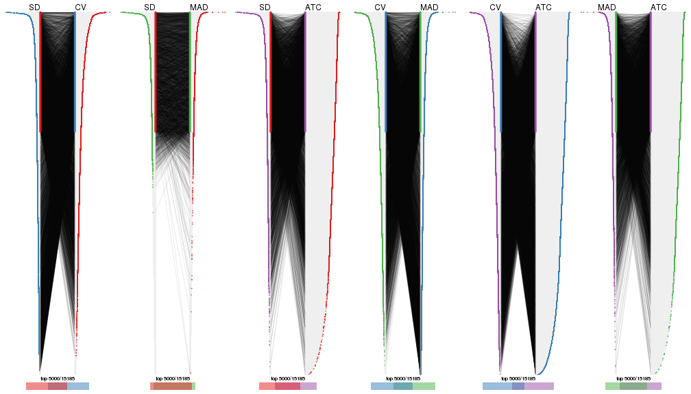</p>

</div>
</div>


Heatmaps of the top rows:


<script>
$( function() {
	$( '#tabs-top-rows-heatmap' ).tabs();
} );
</script>
<div id='tabs-top-rows-heatmap'>
<ul>
<li><a href='#tab-top-rows-heatmap-1'>top_n = 1000</a></li>
<li><a href='#tab-top-rows-heatmap-2'>top_n = 2000</a></li>
<li><a href='#tab-top-rows-heatmap-3'>top_n = 3000</a></li>
<li><a href='#tab-top-rows-heatmap-4'>top_n = 4000</a></li>
<li><a href='#tab-top-rows-heatmap-5'>top_n = 5000</a></li>
</ul>
<div id='tab-top-rows-heatmap-1'>
<pre><code class="r">top_rows_heatmap(res_list, top_n = 1000)
</code></pre>

<p></p>

</div>
<div id='tab-top-rows-heatmap-2'>
<pre><code class="r">top_rows_heatmap(res_list, top_n = 2000)
</code></pre>

<p></p>

</div>
<div id='tab-top-rows-heatmap-3'>
<pre><code class="r">top_rows_heatmap(res_list, top_n = 3000)
</code></pre>

<p></p>

</div>
<div id='tab-top-rows-heatmap-4'>
<pre><code class="r">top_rows_heatmap(res_list, top_n = 4000)
</code></pre>

<p></p>

</div>
<div id='tab-top-rows-heatmap-5'>
<pre><code class="r">top_rows_heatmap(res_list, top_n = 5000)
</code></pre>

<p></p>

</div>
</div>


 
## Results for each method


---------------------------------------------------


### SD:hclust*


The object with results only for a single top-value method and a single partition method 
can be extracted as:

```r
res = res_list["SD", "hclust"]
# you can also extract it by
# res = res_list["SD:hclust"]
```

A summary of `res` and all the functions that can be applied to it:

```r
res
```

```
#> A 'ConsensusPartition' object with k = 2, 3, 4, 5, 6.
#>   On a matrix with 15185 rows and 159 columns.
#>   Top rows (1000, 2000, 3000, 4000, 5000) are extracted by 'SD' method.
#>   Subgroups are detected by 'hclust' method.
#>   Performed in total 1250 partitions by row resampling.
#>   Best k for subgroups seems to be 6.
#> 
#> Following methods can be applied to this 'ConsensusPartition' object:
#>  [1] "cola_report"             "collect_classes"         "collect_plots"          
#>  [4] "collect_stats"           "colnames"                "compare_signatures"     
#>  [7] "consensus_heatmap"       "dimension_reduction"     "functional_enrichment"  
#> [10] "get_anno_col"            "get_anno"                "get_classes"            
#> [13] "get_consensus"           "get_matrix"              "get_membership"         
#> [16] "get_param"               "get_signatures"          "get_stats"              
#> [19] "is_best_k"               "is_stable_k"             "membership_heatmap"     
#> [22] "ncol"                    "nrow"                    "plot_ecdf"              
#> [25] "rownames"                "select_partition_number" "show"                   
#> [28] "suggest_best_k"          "test_to_known_factors"
```

`collect_plots()` function collects all the plots made from `res` for all `k` (number of partitions)
into one single page to provide an easy and fast comparison between different `k`.

```r
collect_plots(res)
```


The plots are:

- The first row: a plot of the ECDF (Empirical cumulative distribution
  function) curves of the consensus matrix for each `k` and the heatmap of
  predicted classes for each `k`.
- The second row: heatmaps of the consensus matrix for each `k`.
- The third row: heatmaps of the membership matrix for each `k`.
- The fouth row: heatmaps of the signatures for each `k`.

All the plots in panels can be made by individual functions and they are
plotted later in this section.

`select_partition_number()` produces several plots showing different
statistics for choosing "optimized" `k`. There are following statistics:

- ECDF curves of the consensus matrix for each `k`;
- 1-PAC. [The PAC
  score](https://en.wikipedia.org/wiki/Consensus_clustering#Over-interpretation_potential_of_consensus_clustering)
  measures the proportion of the ambiguous subgrouping.
- Mean silhouette score.
- Concordance. The mean probability of fiting the consensus class ids in all
  partitions.
- Area increased. Denote $A_k$ as the area under the ECDF curve for current
  `k`, the area increased is defined as $A_k - A_{k-1}$.
- Rand index. The percent of pairs of samples that are both in a same cluster
  or both are not in a same cluster in the partition of k and k-1.
- Jaccard index. The ratio of pairs of samples are both in a same cluster in
  the partition of k and k-1 and the pairs of samples are both in a same
  cluster in the partition k or k-1.

The detailed explanations of these statistics can be found in [the cola
vignette](http://bioconductor.org/packages/devel/bioc/vignettes/cola/inst/doc/cola.html#toc_13).

Generally speaking, lower PAC score, higher mean silhouette score or higher
concordance corresponds to better partition. Rand index and Jaccard index
measure how similar the current partition is compared to partition with `k-1`.
If they are too similar, we won't accept `k` is better than `k-1`.

```r
select_partition_number(res)
```


The numeric values for all these statistics can be obtained by `get_stats()`.

```r
get_stats(res)
```

```
#>   k 1-PAC mean_silhouette concordance area_increased  Rand Jaccard
#> 2 2 1.000           0.958       0.960         0.5019 0.497   0.497
#> 3 3 0.920           0.949       0.965         0.2468 0.882   0.762
#> 4 4 0.920           0.970       0.981         0.1897 0.878   0.677
#> 5 5 0.920           0.951       0.958         0.0537 0.959   0.841
#> 6 6 0.926           0.951       0.954         0.0508 0.959   0.811
```

`suggest_best_k()` suggests the best $k$ based on these statistics. The rules are as follows:

- All $k$ with Jaccard index larger than 0.95 are removed because the increase of
  the partition number does not provides enough extra information. If all $k$ are removed,
  the best $k$ is assigned by `NA`.
- For $k$ with 1-PAC larger than 0.9, the maximal $k$ is taken as the "best k". Other $k$ is called "optional k".
- If it does not fit the second rule. The $k$ with the highest vote of highest
  1-PAC, mean silhouette and concordance is taken as the "best k".

```r
suggest_best_k(res)
```

```
#> [1] 6
#> attr(,"optional")
#> [1] 2 3 4 5
```

There is also optional best $k$ = 2 3 4 5 that is worth to check.

Following shows the table of the partitions (You need to click the **show/hide
code output** link to see it). The membership matrix (columns with name `p*`)
is inferred by
[`clue::cl_consensus()`](https://www.rdocumentation.org/link/cl_consensus?package=clue)
function with the `SE` method. Basically the value in the membership matrix
represents the probability to belong to a certain group. The finall class
label for an item is determined with the group with highest probability it
belongs to.

In `get_classes()` function, the entropy is calculated from the membership
matrix and the silhouette score is calculated from the consensus matrix.


<script>
$( function() {
	$( '#tabs-SD-hclust-get-classes' ).tabs();
} );
</script>
<div id='tabs-SD-hclust-get-classes'>
<ul>
<li><a href='#tab-SD-hclust-get-classes-1'>k = 2</a></li>
<li><a href='#tab-SD-hclust-get-classes-2'>k = 3</a></li>
<li><a href='#tab-SD-hclust-get-classes-3'>k = 4</a></li>
<li><a href='#tab-SD-hclust-get-classes-4'>k = 5</a></li>
<li><a href='#tab-SD-hclust-get-classes-5'>k = 6</a></li>
</ul>

<div id='tab-SD-hclust-get-classes-1'>
<p><a id='tab-SD-hclust-get-classes-1-a' style='color:#0366d6' href='#'>show/hide code output</a></p>
<pre><code class="r">cbind(get_classes(res, k = 2), get_membership(res, k = 2))
</code></pre>

<pre><code>#&gt;            class entropy silhouette   p1   p2
#&gt; SRR1706767     1   0.000      0.947 1.00 0.00
#&gt; SRR1706768     1   0.000      0.947 1.00 0.00
#&gt; SRR1706769     1   0.000      0.947 1.00 0.00
#&gt; SRR1706770     1   0.000      0.947 1.00 0.00
#&gt; SRR1706771     1   0.000      0.947 1.00 0.00
#&gt; SRR1706772     1   0.000      0.947 1.00 0.00
#&gt; SRR1706773     1   0.000      0.947 1.00 0.00
#&gt; SRR1706774     1   0.000      0.947 1.00 0.00
#&gt; SRR1706775     1   0.402      0.965 0.92 0.08
#&gt; SRR1706776     1   0.402      0.965 0.92 0.08
#&gt; SRR1706777     1   0.402      0.965 0.92 0.08
#&gt; SRR1706778     1   0.402      0.965 0.92 0.08
#&gt; SRR1706779     1   0.402      0.965 0.92 0.08
#&gt; SRR1706780     1   0.402      0.965 0.92 0.08
#&gt; SRR1706781     1   0.402      0.965 0.92 0.08
#&gt; SRR1706782     1   0.402      0.965 0.92 0.08
#&gt; SRR1706783     1   0.402      0.965 0.92 0.08
#&gt; SRR1706784     1   0.402      0.965 0.92 0.08
#&gt; SRR1706785     1   0.402      0.965 0.92 0.08
#&gt; SRR1706786     1   0.402      0.965 0.92 0.08
#&gt; SRR1706787     1   0.000      0.947 1.00 0.00
#&gt; SRR1706788     1   0.000      0.947 1.00 0.00
#&gt; SRR1706789     1   0.000      0.947 1.00 0.00
#&gt; SRR1706790     1   0.000      0.947 1.00 0.00
#&gt; SRR1706791     1   0.000      0.947 1.00 0.00
#&gt; SRR1706792     1   0.000      0.947 1.00 0.00
#&gt; SRR1706793     1   0.000      0.947 1.00 0.00
#&gt; SRR1706794     1   0.000      0.947 1.00 0.00
#&gt; SRR1706795     1   0.402      0.965 0.92 0.08
#&gt; SRR1706796     1   0.402      0.965 0.92 0.08
#&gt; SRR1706797     1   0.402      0.965 0.92 0.08
#&gt; SRR1706798     1   0.402      0.965 0.92 0.08
#&gt; SRR1706799     1   0.402      0.965 0.92 0.08
#&gt; SRR1706800     1   0.402      0.965 0.92 0.08
#&gt; SRR1706801     1   0.402      0.965 0.92 0.08
#&gt; SRR1706802     1   0.402      0.965 0.92 0.08
#&gt; SRR1706803     1   0.402      0.965 0.92 0.08
#&gt; SRR1706804     1   0.402      0.965 0.92 0.08
#&gt; SRR1706805     1   0.402      0.965 0.92 0.08
#&gt; SRR1706806     1   0.402      0.965 0.92 0.08
#&gt; SRR1706811     1   0.000      0.947 1.00 0.00
#&gt; SRR1706812     1   0.000      0.947 1.00 0.00
#&gt; SRR1706813     1   0.000      0.947 1.00 0.00
#&gt; SRR1706814     1   0.000      0.947 1.00 0.00
#&gt; SRR1706807     1   0.000      0.947 1.00 0.00
#&gt; SRR1706808     1   0.000      0.947 1.00 0.00
#&gt; SRR1706809     1   0.000      0.947 1.00 0.00
#&gt; SRR1706810     1   0.000      0.947 1.00 0.00
#&gt; SRR1706815     1   0.402      0.965 0.92 0.08
#&gt; SRR1706816     1   0.402      0.965 0.92 0.08
#&gt; SRR1706817     1   0.402      0.965 0.92 0.08
#&gt; SRR1706818     1   0.402      0.965 0.92 0.08
#&gt; SRR1706819     1   0.402      0.965 0.92 0.08
#&gt; SRR1706820     1   0.402      0.965 0.92 0.08
#&gt; SRR1706821     1   0.402      0.965 0.92 0.08
#&gt; SRR1706822     1   0.402      0.965 0.92 0.08
#&gt; SRR1706823     1   0.402      0.965 0.92 0.08
#&gt; SRR1706824     1   0.402      0.965 0.92 0.08
#&gt; SRR1706825     1   0.402      0.965 0.92 0.08
#&gt; SRR1706826     1   0.402      0.965 0.92 0.08
#&gt; SRR1706827     1   0.000      0.947 1.00 0.00
#&gt; SRR1706828     1   0.000      0.947 1.00 0.00
#&gt; SRR1706829     1   0.000      0.947 1.00 0.00
#&gt; SRR1706830     1   0.000      0.947 1.00 0.00
#&gt; SRR1706835     1   0.402      0.965 0.92 0.08
#&gt; SRR1706836     1   0.402      0.965 0.92 0.08
#&gt; SRR1706837     1   0.402      0.965 0.92 0.08
#&gt; SRR1706838     1   0.402      0.965 0.92 0.08
#&gt; SRR1706831     1   0.000      0.947 1.00 0.00
#&gt; SRR1706832     1   0.000      0.947 1.00 0.00
#&gt; SRR1706833     1   0.000      0.947 1.00 0.00
#&gt; SRR1706834     1   0.000      0.947 1.00 0.00
#&gt; SRR1706839     1   0.402      0.965 0.92 0.08
#&gt; SRR1706840     1   0.402      0.965 0.92 0.08
#&gt; SRR1706841     1   0.402      0.965 0.92 0.08
#&gt; SRR1706842     1   0.402      0.965 0.92 0.08
#&gt; SRR1706847     2   0.402      0.947 0.08 0.92
#&gt; SRR1706848     2   0.402      0.947 0.08 0.92
#&gt; SRR1706849     2   0.402      0.947 0.08 0.92
#&gt; SRR1706850     2   0.402      0.947 0.08 0.92
#&gt; SRR1706843     1   0.402      0.965 0.92 0.08
#&gt; SRR1706844     1   0.402      0.965 0.92 0.08
#&gt; SRR1706845     1   0.402      0.965 0.92 0.08
#&gt; SRR1706846     1   0.402      0.965 0.92 0.08
#&gt; SRR1706851     2   0.402      0.947 0.08 0.92
#&gt; SRR1706852     2   0.402      0.947 0.08 0.92
#&gt; SRR1706853     2   0.402      0.947 0.08 0.92
#&gt; SRR1706854     2   0.402      0.947 0.08 0.92
#&gt; SRR1706855     2   0.000      0.965 0.00 1.00
#&gt; SRR1706856     2   0.000      0.965 0.00 1.00
#&gt; SRR1706857     2   0.000      0.965 0.00 1.00
#&gt; SRR1706858     2   0.000      0.965 0.00 1.00
#&gt; SRR1706859     2   0.000      0.965 0.00 1.00
#&gt; SRR1706860     2   0.000      0.965 0.00 1.00
#&gt; SRR1706861     2   0.000      0.965 0.00 1.00
#&gt; SRR1706862     2   0.000      0.965 0.00 1.00
#&gt; SRR1706867     2   0.402      0.947 0.08 0.92
#&gt; SRR1706869     2   0.402      0.947 0.08 0.92
#&gt; SRR1706870     2   0.402      0.947 0.08 0.92
#&gt; SRR1706863     2   0.000      0.965 0.00 1.00
#&gt; SRR1706864     2   0.000      0.965 0.00 1.00
#&gt; SRR1706865     2   0.000      0.965 0.00 1.00
#&gt; SRR1706866     2   0.000      0.965 0.00 1.00
#&gt; SRR1706871     2   0.402      0.947 0.08 0.92
#&gt; SRR1706872     2   0.402      0.947 0.08 0.92
#&gt; SRR1706873     2   0.402      0.947 0.08 0.92
#&gt; SRR1706874     2   0.402      0.947 0.08 0.92
#&gt; SRR1706879     2   0.000      0.965 0.00 1.00
#&gt; SRR1706880     2   0.000      0.965 0.00 1.00
#&gt; SRR1706881     2   0.000      0.965 0.00 1.00
#&gt; SRR1706882     2   0.000      0.965 0.00 1.00
#&gt; SRR1706883     2   0.000      0.965 0.00 1.00
#&gt; SRR1706884     2   0.000      0.965 0.00 1.00
#&gt; SRR1706885     2   0.000      0.965 0.00 1.00
#&gt; SRR1706886     2   0.000      0.965 0.00 1.00
#&gt; SRR1706875     2   0.000      0.965 0.00 1.00
#&gt; SRR1706876     2   0.000      0.965 0.00 1.00
#&gt; SRR1706877     2   0.000      0.965 0.00 1.00
#&gt; SRR1706878     2   0.000      0.965 0.00 1.00
#&gt; SRR1706887     2   0.402      0.947 0.08 0.92
#&gt; SRR1706888     2   0.402      0.947 0.08 0.92
#&gt; SRR1706889     2   0.402      0.947 0.08 0.92
#&gt; SRR1706890     2   0.402      0.947 0.08 0.92
#&gt; SRR1706891     2   0.402      0.947 0.08 0.92
#&gt; SRR1706892     2   0.402      0.947 0.08 0.92
#&gt; SRR1706893     2   0.402      0.947 0.08 0.92
#&gt; SRR1706894     2   0.402      0.947 0.08 0.92
#&gt; SRR1706895     2   0.000      0.965 0.00 1.00
#&gt; SRR1706896     2   0.000      0.965 0.00 1.00
#&gt; SRR1706897     2   0.000      0.965 0.00 1.00
#&gt; SRR1706898     2   0.000      0.965 0.00 1.00
#&gt; SRR1706899     2   0.000      0.965 0.00 1.00
#&gt; SRR1706900     2   0.000      0.965 0.00 1.00
#&gt; SRR1706901     2   0.000      0.965 0.00 1.00
#&gt; SRR1706902     2   0.000      0.965 0.00 1.00
#&gt; SRR1706907     2   0.402      0.947 0.08 0.92
#&gt; SRR1706908     2   0.402      0.947 0.08 0.92
#&gt; SRR1706909     2   0.402      0.947 0.08 0.92
#&gt; SRR1706910     2   0.402      0.947 0.08 0.92
#&gt; SRR1706903     2   0.000      0.965 0.00 1.00
#&gt; SRR1706904     2   0.000      0.965 0.00 1.00
#&gt; SRR1706905     2   0.000      0.965 0.00 1.00
#&gt; SRR1706906     2   0.000      0.965 0.00 1.00
#&gt; SRR1706911     2   0.402      0.947 0.08 0.92
#&gt; SRR1706912     2   0.402      0.947 0.08 0.92
#&gt; SRR1706913     2   0.402      0.947 0.08 0.92
#&gt; SRR1706914     2   0.402      0.947 0.08 0.92
#&gt; SRR1706919     2   0.000      0.965 0.00 1.00
#&gt; SRR1706920     2   0.000      0.965 0.00 1.00
#&gt; SRR1706921     2   0.000      0.965 0.00 1.00
#&gt; SRR1706922     2   0.000      0.965 0.00 1.00
#&gt; SRR1706915     2   0.000      0.965 0.00 1.00
#&gt; SRR1706916     2   0.000      0.965 0.00 1.00
#&gt; SRR1706917     2   0.000      0.965 0.00 1.00
#&gt; SRR1706918     2   0.000      0.965 0.00 1.00
#&gt; SRR1706923     2   0.000      0.965 0.00 1.00
#&gt; SRR1706924     2   0.000      0.965 0.00 1.00
#&gt; SRR1706925     2   0.000      0.965 0.00 1.00
#&gt; SRR1706926     2   0.000      0.965 0.00 1.00
</code></pre>

<script>
$('#tab-SD-hclust-get-classes-1-a').parent().next().next().hide();
$('#tab-SD-hclust-get-classes-1-a').click(function(){
  $('#tab-SD-hclust-get-classes-1-a').parent().next().next().toggle();
  return(false);
});
</script>
</div>

<div id='tab-SD-hclust-get-classes-2'>
<p><a id='tab-SD-hclust-get-classes-2-a' style='color:#0366d6' href='#'>show/hide code output</a></p>
<pre><code class="r">cbind(get_classes(res, k = 3), get_membership(res, k = 3))
</code></pre>

<pre><code>#&gt;            class entropy silhouette   p1    p2    p3
#&gt; SRR1706767     1   0.254      0.947 0.92 0.000 0.080
#&gt; SRR1706768     1   0.254      0.947 0.92 0.000 0.080
#&gt; SRR1706769     1   0.254      0.947 0.92 0.000 0.080
#&gt; SRR1706770     1   0.254      0.947 0.92 0.000 0.080
#&gt; SRR1706771     1   0.254      0.947 0.92 0.000 0.080
#&gt; SRR1706772     1   0.254      0.947 0.92 0.000 0.080
#&gt; SRR1706773     1   0.254      0.947 0.92 0.000 0.080
#&gt; SRR1706774     1   0.254      0.947 0.92 0.000 0.080
#&gt; SRR1706775     1   0.000      0.966 1.00 0.000 0.000
#&gt; SRR1706776     1   0.000      0.966 1.00 0.000 0.000
#&gt; SRR1706777     1   0.000      0.966 1.00 0.000 0.000
#&gt; SRR1706778     1   0.000      0.966 1.00 0.000 0.000
#&gt; SRR1706779     1   0.000      0.966 1.00 0.000 0.000
#&gt; SRR1706780     1   0.000      0.966 1.00 0.000 0.000
#&gt; SRR1706781     1   0.000      0.966 1.00 0.000 0.000
#&gt; SRR1706782     1   0.000      0.966 1.00 0.000 0.000
#&gt; SRR1706783     1   0.000      0.966 1.00 0.000 0.000
#&gt; SRR1706784     1   0.000      0.966 1.00 0.000 0.000
#&gt; SRR1706785     1   0.000      0.966 1.00 0.000 0.000
#&gt; SRR1706786     1   0.000      0.966 1.00 0.000 0.000
#&gt; SRR1706787     1   0.254      0.947 0.92 0.000 0.080
#&gt; SRR1706788     1   0.254      0.947 0.92 0.000 0.080
#&gt; SRR1706789     1   0.254      0.947 0.92 0.000 0.080
#&gt; SRR1706790     1   0.254      0.947 0.92 0.000 0.080
#&gt; SRR1706791     1   0.254      0.947 0.92 0.000 0.080
#&gt; SRR1706792     1   0.254      0.947 0.92 0.000 0.080
#&gt; SRR1706793     1   0.254      0.947 0.92 0.000 0.080
#&gt; SRR1706794     1   0.254      0.947 0.92 0.000 0.080
#&gt; SRR1706795     1   0.000      0.966 1.00 0.000 0.000
#&gt; SRR1706796     1   0.000      0.966 1.00 0.000 0.000
#&gt; SRR1706797     1   0.000      0.966 1.00 0.000 0.000
#&gt; SRR1706798     1   0.000      0.966 1.00 0.000 0.000
#&gt; SRR1706799     1   0.000      0.966 1.00 0.000 0.000
#&gt; SRR1706800     1   0.000      0.966 1.00 0.000 0.000
#&gt; SRR1706801     1   0.000      0.966 1.00 0.000 0.000
#&gt; SRR1706802     1   0.000      0.966 1.00 0.000 0.000
#&gt; SRR1706803     1   0.000      0.966 1.00 0.000 0.000
#&gt; SRR1706804     1   0.000      0.966 1.00 0.000 0.000
#&gt; SRR1706805     1   0.000      0.966 1.00 0.000 0.000
#&gt; SRR1706806     1   0.000      0.966 1.00 0.000 0.000
#&gt; SRR1706811     1   0.254      0.947 0.92 0.000 0.080
#&gt; SRR1706812     1   0.254      0.947 0.92 0.000 0.080
#&gt; SRR1706813     1   0.254      0.947 0.92 0.000 0.080
#&gt; SRR1706814     1   0.254      0.947 0.92 0.000 0.080
#&gt; SRR1706807     1   0.254      0.947 0.92 0.000 0.080
#&gt; SRR1706808     1   0.254      0.947 0.92 0.000 0.080
#&gt; SRR1706809     1   0.254      0.947 0.92 0.000 0.080
#&gt; SRR1706810     1   0.254      0.947 0.92 0.000 0.080
#&gt; SRR1706815     1   0.000      0.966 1.00 0.000 0.000
#&gt; SRR1706816     1   0.000      0.966 1.00 0.000 0.000
#&gt; SRR1706817     1   0.000      0.966 1.00 0.000 0.000
#&gt; SRR1706818     1   0.000      0.966 1.00 0.000 0.000
#&gt; SRR1706819     1   0.000      0.966 1.00 0.000 0.000
#&gt; SRR1706820     1   0.000      0.966 1.00 0.000 0.000
#&gt; SRR1706821     1   0.000      0.966 1.00 0.000 0.000
#&gt; SRR1706822     1   0.000      0.966 1.00 0.000 0.000
#&gt; SRR1706823     1   0.000      0.966 1.00 0.000 0.000
#&gt; SRR1706824     1   0.000      0.966 1.00 0.000 0.000
#&gt; SRR1706825     1   0.000      0.966 1.00 0.000 0.000
#&gt; SRR1706826     1   0.000      0.966 1.00 0.000 0.000
#&gt; SRR1706827     1   0.254      0.947 0.92 0.000 0.080
#&gt; SRR1706828     1   0.254      0.947 0.92 0.000 0.080
#&gt; SRR1706829     1   0.254      0.947 0.92 0.000 0.080
#&gt; SRR1706830     1   0.254      0.947 0.92 0.000 0.080
#&gt; SRR1706835     1   0.000      0.966 1.00 0.000 0.000
#&gt; SRR1706836     1   0.000      0.966 1.00 0.000 0.000
#&gt; SRR1706837     1   0.000      0.966 1.00 0.000 0.000
#&gt; SRR1706838     1   0.000      0.966 1.00 0.000 0.000
#&gt; SRR1706831     1   0.254      0.947 0.92 0.000 0.080
#&gt; SRR1706832     1   0.254      0.947 0.92 0.000 0.080
#&gt; SRR1706833     1   0.254      0.947 0.92 0.000 0.080
#&gt; SRR1706834     1   0.254      0.947 0.92 0.000 0.080
#&gt; SRR1706839     1   0.000      0.966 1.00 0.000 0.000
#&gt; SRR1706840     1   0.000      0.966 1.00 0.000 0.000
#&gt; SRR1706841     1   0.000      0.966 1.00 0.000 0.000
#&gt; SRR1706842     1   0.000      0.966 1.00 0.000 0.000
#&gt; SRR1706847     3   0.000      1.000 0.00 0.000 1.000
#&gt; SRR1706848     3   0.000      1.000 0.00 0.000 1.000
#&gt; SRR1706849     3   0.000      1.000 0.00 0.000 1.000
#&gt; SRR1706850     3   0.000      1.000 0.00 0.000 1.000
#&gt; SRR1706843     1   0.000      0.966 1.00 0.000 0.000
#&gt; SRR1706844     1   0.000      0.966 1.00 0.000 0.000
#&gt; SRR1706845     1   0.000      0.966 1.00 0.000 0.000
#&gt; SRR1706846     1   0.000      0.966 1.00 0.000 0.000
#&gt; SRR1706851     3   0.000      1.000 0.00 0.000 1.000
#&gt; SRR1706852     3   0.000      1.000 0.00 0.000 1.000
#&gt; SRR1706853     3   0.000      1.000 0.00 0.000 1.000
#&gt; SRR1706854     3   0.000      1.000 0.00 0.000 1.000
#&gt; SRR1706855     2   0.450      0.833 0.00 0.804 0.196
#&gt; SRR1706856     2   0.450      0.833 0.00 0.804 0.196
#&gt; SRR1706857     2   0.450      0.833 0.00 0.804 0.196
#&gt; SRR1706858     2   0.450      0.833 0.00 0.804 0.196
#&gt; SRR1706859     2   0.000      0.932 0.00 1.000 0.000
#&gt; SRR1706860     2   0.000      0.932 0.00 1.000 0.000
#&gt; SRR1706861     2   0.000      0.932 0.00 1.000 0.000
#&gt; SRR1706862     2   0.000      0.932 0.00 1.000 0.000
#&gt; SRR1706867     3   0.000      1.000 0.00 0.000 1.000
#&gt; SRR1706869     3   0.000      1.000 0.00 0.000 1.000
#&gt; SRR1706870     3   0.000      1.000 0.00 0.000 1.000
#&gt; SRR1706863     2   0.000      0.932 0.00 1.000 0.000
#&gt; SRR1706864     2   0.000      0.932 0.00 1.000 0.000
#&gt; SRR1706865     2   0.000      0.932 0.00 1.000 0.000
#&gt; SRR1706866     2   0.000      0.932 0.00 1.000 0.000
#&gt; SRR1706871     3   0.000      1.000 0.00 0.000 1.000
#&gt; SRR1706872     3   0.000      1.000 0.00 0.000 1.000
#&gt; SRR1706873     3   0.000      1.000 0.00 0.000 1.000
#&gt; SRR1706874     3   0.000      1.000 0.00 0.000 1.000
#&gt; SRR1706879     2   0.000      0.932 0.00 1.000 0.000
#&gt; SRR1706880     2   0.000      0.932 0.00 1.000 0.000
#&gt; SRR1706881     2   0.000      0.932 0.00 1.000 0.000
#&gt; SRR1706882     2   0.000      0.932 0.00 1.000 0.000
#&gt; SRR1706883     2   0.000      0.932 0.00 1.000 0.000
#&gt; SRR1706884     2   0.000      0.932 0.00 1.000 0.000
#&gt; SRR1706885     2   0.000      0.932 0.00 1.000 0.000
#&gt; SRR1706886     2   0.000      0.932 0.00 1.000 0.000
#&gt; SRR1706875     2   0.450      0.833 0.00 0.804 0.196
#&gt; SRR1706876     2   0.450      0.833 0.00 0.804 0.196
#&gt; SRR1706877     2   0.450      0.833 0.00 0.804 0.196
#&gt; SRR1706878     2   0.450      0.833 0.00 0.804 0.196
#&gt; SRR1706887     3   0.000      1.000 0.00 0.000 1.000
#&gt; SRR1706888     3   0.000      1.000 0.00 0.000 1.000
#&gt; SRR1706889     3   0.000      1.000 0.00 0.000 1.000
#&gt; SRR1706890     3   0.000      1.000 0.00 0.000 1.000
#&gt; SRR1706891     3   0.000      1.000 0.00 0.000 1.000
#&gt; SRR1706892     3   0.000      1.000 0.00 0.000 1.000
#&gt; SRR1706893     3   0.000      1.000 0.00 0.000 1.000
#&gt; SRR1706894     3   0.000      1.000 0.00 0.000 1.000
#&gt; SRR1706895     2   0.412      0.853 0.00 0.832 0.168
#&gt; SRR1706896     2   0.412      0.853 0.00 0.832 0.168
#&gt; SRR1706897     2   0.412      0.853 0.00 0.832 0.168
#&gt; SRR1706898     2   0.412      0.853 0.00 0.832 0.168
#&gt; SRR1706899     2   0.000      0.932 0.00 1.000 0.000
#&gt; SRR1706900     2   0.000      0.932 0.00 1.000 0.000
#&gt; SRR1706901     2   0.000      0.932 0.00 1.000 0.000
#&gt; SRR1706902     2   0.000      0.932 0.00 1.000 0.000
#&gt; SRR1706907     3   0.000      1.000 0.00 0.000 1.000
#&gt; SRR1706908     3   0.000      1.000 0.00 0.000 1.000
#&gt; SRR1706909     3   0.000      1.000 0.00 0.000 1.000
#&gt; SRR1706910     3   0.000      1.000 0.00 0.000 1.000
#&gt; SRR1706903     2   0.000      0.932 0.00 1.000 0.000
#&gt; SRR1706904     2   0.000      0.932 0.00 1.000 0.000
#&gt; SRR1706905     2   0.000      0.932 0.00 1.000 0.000
#&gt; SRR1706906     2   0.000      0.932 0.00 1.000 0.000
#&gt; SRR1706911     3   0.000      1.000 0.00 0.000 1.000
#&gt; SRR1706912     3   0.000      1.000 0.00 0.000 1.000
#&gt; SRR1706913     3   0.000      1.000 0.00 0.000 1.000
#&gt; SRR1706914     3   0.000      1.000 0.00 0.000 1.000
#&gt; SRR1706919     2   0.000      0.932 0.00 1.000 0.000
#&gt; SRR1706920     2   0.000      0.932 0.00 1.000 0.000
#&gt; SRR1706921     2   0.000      0.932 0.00 1.000 0.000
#&gt; SRR1706922     2   0.000      0.932 0.00 1.000 0.000
#&gt; SRR1706915     2   0.450      0.833 0.00 0.804 0.196
#&gt; SRR1706916     2   0.450      0.833 0.00 0.804 0.196
#&gt; SRR1706917     2   0.450      0.833 0.00 0.804 0.196
#&gt; SRR1706918     2   0.450      0.833 0.00 0.804 0.196
#&gt; SRR1706923     2   0.000      0.932 0.00 1.000 0.000
#&gt; SRR1706924     2   0.000      0.932 0.00 1.000 0.000
#&gt; SRR1706925     2   0.000      0.932 0.00 1.000 0.000
#&gt; SRR1706926     2   0.000      0.932 0.00 1.000 0.000
</code></pre>

<script>
$('#tab-SD-hclust-get-classes-2-a').parent().next().next().hide();
$('#tab-SD-hclust-get-classes-2-a').click(function(){
  $('#tab-SD-hclust-get-classes-2-a').parent().next().next().toggle();
  return(false);
});
</script>
</div>

<div id='tab-SD-hclust-get-classes-3'>
<p><a id='tab-SD-hclust-get-classes-3-a' style='color:#0366d6' href='#'>show/hide code output</a></p>
<pre><code class="r">cbind(get_classes(res, k = 4), get_membership(res, k = 4))
</code></pre>

<pre><code>#&gt;            class entropy silhouette    p1    p2    p3    p4
#&gt; SRR1706767     4  0.0000      1.000 0.000 0.000 0.000 1.000
#&gt; SRR1706768     4  0.0000      1.000 0.000 0.000 0.000 1.000
#&gt; SRR1706769     4  0.0000      1.000 0.000 0.000 0.000 1.000
#&gt; SRR1706770     4  0.0000      1.000 0.000 0.000 0.000 1.000
#&gt; SRR1706771     4  0.0000      1.000 0.000 0.000 0.000 1.000
#&gt; SRR1706772     4  0.0000      1.000 0.000 0.000 0.000 1.000
#&gt; SRR1706773     4  0.0000      1.000 0.000 0.000 0.000 1.000
#&gt; SRR1706774     4  0.0000      1.000 0.000 0.000 0.000 1.000
#&gt; SRR1706775     1  0.0188      0.997 0.996 0.000 0.000 0.004
#&gt; SRR1706776     1  0.0188      0.997 0.996 0.000 0.000 0.004
#&gt; SRR1706777     1  0.0188      0.997 0.996 0.000 0.000 0.004
#&gt; SRR1706778     1  0.0188      0.997 0.996 0.000 0.000 0.004
#&gt; SRR1706779     1  0.0000      0.999 1.000 0.000 0.000 0.000
#&gt; SRR1706780     1  0.0000      0.999 1.000 0.000 0.000 0.000
#&gt; SRR1706781     1  0.0000      0.999 1.000 0.000 0.000 0.000
#&gt; SRR1706782     1  0.0000      0.999 1.000 0.000 0.000 0.000
#&gt; SRR1706783     1  0.0000      0.999 1.000 0.000 0.000 0.000
#&gt; SRR1706784     1  0.0000      0.999 1.000 0.000 0.000 0.000
#&gt; SRR1706785     1  0.0000      0.999 1.000 0.000 0.000 0.000
#&gt; SRR1706786     1  0.0000      0.999 1.000 0.000 0.000 0.000
#&gt; SRR1706787     4  0.0000      1.000 0.000 0.000 0.000 1.000
#&gt; SRR1706788     4  0.0000      1.000 0.000 0.000 0.000 1.000
#&gt; SRR1706789     4  0.0000      1.000 0.000 0.000 0.000 1.000
#&gt; SRR1706790     4  0.0000      1.000 0.000 0.000 0.000 1.000
#&gt; SRR1706791     4  0.0000      1.000 0.000 0.000 0.000 1.000
#&gt; SRR1706792     4  0.0000      1.000 0.000 0.000 0.000 1.000
#&gt; SRR1706793     4  0.0000      1.000 0.000 0.000 0.000 1.000
#&gt; SRR1706794     4  0.0000      1.000 0.000 0.000 0.000 1.000
#&gt; SRR1706795     1  0.0188      0.997 0.996 0.000 0.000 0.004
#&gt; SRR1706796     1  0.0188      0.997 0.996 0.000 0.000 0.004
#&gt; SRR1706797     1  0.0188      0.997 0.996 0.000 0.000 0.004
#&gt; SRR1706798     1  0.0188      0.997 0.996 0.000 0.000 0.004
#&gt; SRR1706799     1  0.0000      0.999 1.000 0.000 0.000 0.000
#&gt; SRR1706800     1  0.0000      0.999 1.000 0.000 0.000 0.000
#&gt; SRR1706801     1  0.0000      0.999 1.000 0.000 0.000 0.000
#&gt; SRR1706802     1  0.0000      0.999 1.000 0.000 0.000 0.000
#&gt; SRR1706803     1  0.0000      0.999 1.000 0.000 0.000 0.000
#&gt; SRR1706804     1  0.0000      0.999 1.000 0.000 0.000 0.000
#&gt; SRR1706805     1  0.0000      0.999 1.000 0.000 0.000 0.000
#&gt; SRR1706806     1  0.0000      0.999 1.000 0.000 0.000 0.000
#&gt; SRR1706811     4  0.0000      1.000 0.000 0.000 0.000 1.000
#&gt; SRR1706812     4  0.0000      1.000 0.000 0.000 0.000 1.000
#&gt; SRR1706813     4  0.0000      1.000 0.000 0.000 0.000 1.000
#&gt; SRR1706814     4  0.0000      1.000 0.000 0.000 0.000 1.000
#&gt; SRR1706807     4  0.0000      1.000 0.000 0.000 0.000 1.000
#&gt; SRR1706808     4  0.0000      1.000 0.000 0.000 0.000 1.000
#&gt; SRR1706809     4  0.0000      1.000 0.000 0.000 0.000 1.000
#&gt; SRR1706810     4  0.0000      1.000 0.000 0.000 0.000 1.000
#&gt; SRR1706815     1  0.0188      0.997 0.996 0.000 0.000 0.004
#&gt; SRR1706816     1  0.0188      0.997 0.996 0.000 0.000 0.004
#&gt; SRR1706817     1  0.0188      0.997 0.996 0.000 0.000 0.004
#&gt; SRR1706818     1  0.0188      0.997 0.996 0.000 0.000 0.004
#&gt; SRR1706819     1  0.0000      0.999 1.000 0.000 0.000 0.000
#&gt; SRR1706820     1  0.0000      0.999 1.000 0.000 0.000 0.000
#&gt; SRR1706821     1  0.0000      0.999 1.000 0.000 0.000 0.000
#&gt; SRR1706822     1  0.0000      0.999 1.000 0.000 0.000 0.000
#&gt; SRR1706823     1  0.0000      0.999 1.000 0.000 0.000 0.000
#&gt; SRR1706824     1  0.0000      0.999 1.000 0.000 0.000 0.000
#&gt; SRR1706825     1  0.0000      0.999 1.000 0.000 0.000 0.000
#&gt; SRR1706826     1  0.0000      0.999 1.000 0.000 0.000 0.000
#&gt; SRR1706827     4  0.0000      1.000 0.000 0.000 0.000 1.000
#&gt; SRR1706828     4  0.0000      1.000 0.000 0.000 0.000 1.000
#&gt; SRR1706829     4  0.0000      1.000 0.000 0.000 0.000 1.000
#&gt; SRR1706830     4  0.0000      1.000 0.000 0.000 0.000 1.000
#&gt; SRR1706835     1  0.0188      0.997 0.996 0.000 0.000 0.004
#&gt; SRR1706836     1  0.0188      0.997 0.996 0.000 0.000 0.004
#&gt; SRR1706837     1  0.0188      0.997 0.996 0.000 0.000 0.004
#&gt; SRR1706838     1  0.0188      0.997 0.996 0.000 0.000 0.004
#&gt; SRR1706831     4  0.0000      1.000 0.000 0.000 0.000 1.000
#&gt; SRR1706832     4  0.0000      1.000 0.000 0.000 0.000 1.000
#&gt; SRR1706833     4  0.0000      1.000 0.000 0.000 0.000 1.000
#&gt; SRR1706834     4  0.0000      1.000 0.000 0.000 0.000 1.000
#&gt; SRR1706839     1  0.0000      0.999 1.000 0.000 0.000 0.000
#&gt; SRR1706840     1  0.0000      0.999 1.000 0.000 0.000 0.000
#&gt; SRR1706841     1  0.0000      0.999 1.000 0.000 0.000 0.000
#&gt; SRR1706842     1  0.0000      0.999 1.000 0.000 0.000 0.000
#&gt; SRR1706847     3  0.0000      1.000 0.000 0.000 1.000 0.000
#&gt; SRR1706848     3  0.0000      1.000 0.000 0.000 1.000 0.000
#&gt; SRR1706849     3  0.0000      1.000 0.000 0.000 1.000 0.000
#&gt; SRR1706850     3  0.0000      1.000 0.000 0.000 1.000 0.000
#&gt; SRR1706843     1  0.0000      0.999 1.000 0.000 0.000 0.000
#&gt; SRR1706844     1  0.0000      0.999 1.000 0.000 0.000 0.000
#&gt; SRR1706845     1  0.0000      0.999 1.000 0.000 0.000 0.000
#&gt; SRR1706846     1  0.0000      0.999 1.000 0.000 0.000 0.000
#&gt; SRR1706851     3  0.0000      1.000 0.000 0.000 1.000 0.000
#&gt; SRR1706852     3  0.0000      1.000 0.000 0.000 1.000 0.000
#&gt; SRR1706853     3  0.0000      1.000 0.000 0.000 1.000 0.000
#&gt; SRR1706854     3  0.0000      1.000 0.000 0.000 1.000 0.000
#&gt; SRR1706855     2  0.3569      0.833 0.000 0.804 0.196 0.000
#&gt; SRR1706856     2  0.3569      0.833 0.000 0.804 0.196 0.000
#&gt; SRR1706857     2  0.3569      0.833 0.000 0.804 0.196 0.000
#&gt; SRR1706858     2  0.3569      0.833 0.000 0.804 0.196 0.000
#&gt; SRR1706859     2  0.0000      0.932 0.000 1.000 0.000 0.000
#&gt; SRR1706860     2  0.0000      0.932 0.000 1.000 0.000 0.000
#&gt; SRR1706861     2  0.0000      0.932 0.000 1.000 0.000 0.000
#&gt; SRR1706862     2  0.0000      0.932 0.000 1.000 0.000 0.000
#&gt; SRR1706867     3  0.0000      1.000 0.000 0.000 1.000 0.000
#&gt; SRR1706869     3  0.0000      1.000 0.000 0.000 1.000 0.000
#&gt; SRR1706870     3  0.0000      1.000 0.000 0.000 1.000 0.000
#&gt; SRR1706863     2  0.0000      0.932 0.000 1.000 0.000 0.000
#&gt; SRR1706864     2  0.0000      0.932 0.000 1.000 0.000 0.000
#&gt; SRR1706865     2  0.0000      0.932 0.000 1.000 0.000 0.000
#&gt; SRR1706866     2  0.0000      0.932 0.000 1.000 0.000 0.000
#&gt; SRR1706871     3  0.0000      1.000 0.000 0.000 1.000 0.000
#&gt; SRR1706872     3  0.0000      1.000 0.000 0.000 1.000 0.000
#&gt; SRR1706873     3  0.0000      1.000 0.000 0.000 1.000 0.000
#&gt; SRR1706874     3  0.0000      1.000 0.000 0.000 1.000 0.000
#&gt; SRR1706879     2  0.0000      0.932 0.000 1.000 0.000 0.000
#&gt; SRR1706880     2  0.0000      0.932 0.000 1.000 0.000 0.000
#&gt; SRR1706881     2  0.0000      0.932 0.000 1.000 0.000 0.000
#&gt; SRR1706882     2  0.0000      0.932 0.000 1.000 0.000 0.000
#&gt; SRR1706883     2  0.0000      0.932 0.000 1.000 0.000 0.000
#&gt; SRR1706884     2  0.0000      0.932 0.000 1.000 0.000 0.000
#&gt; SRR1706885     2  0.0000      0.932 0.000 1.000 0.000 0.000
#&gt; SRR1706886     2  0.0000      0.932 0.000 1.000 0.000 0.000
#&gt; SRR1706875     2  0.3569      0.833 0.000 0.804 0.196 0.000
#&gt; SRR1706876     2  0.3569      0.833 0.000 0.804 0.196 0.000
#&gt; SRR1706877     2  0.3569      0.833 0.000 0.804 0.196 0.000
#&gt; SRR1706878     2  0.3569      0.833 0.000 0.804 0.196 0.000
#&gt; SRR1706887     3  0.0000      1.000 0.000 0.000 1.000 0.000
#&gt; SRR1706888     3  0.0000      1.000 0.000 0.000 1.000 0.000
#&gt; SRR1706889     3  0.0000      1.000 0.000 0.000 1.000 0.000
#&gt; SRR1706890     3  0.0000      1.000 0.000 0.000 1.000 0.000
#&gt; SRR1706891     3  0.0000      1.000 0.000 0.000 1.000 0.000
#&gt; SRR1706892     3  0.0000      1.000 0.000 0.000 1.000 0.000
#&gt; SRR1706893     3  0.0000      1.000 0.000 0.000 1.000 0.000
#&gt; SRR1706894     3  0.0000      1.000 0.000 0.000 1.000 0.000
#&gt; SRR1706895     2  0.3266      0.853 0.000 0.832 0.168 0.000
#&gt; SRR1706896     2  0.3266      0.853 0.000 0.832 0.168 0.000
#&gt; SRR1706897     2  0.3266      0.853 0.000 0.832 0.168 0.000
#&gt; SRR1706898     2  0.3266      0.853 0.000 0.832 0.168 0.000
#&gt; SRR1706899     2  0.0000      0.932 0.000 1.000 0.000 0.000
#&gt; SRR1706900     2  0.0000      0.932 0.000 1.000 0.000 0.000
#&gt; SRR1706901     2  0.0000      0.932 0.000 1.000 0.000 0.000
#&gt; SRR1706902     2  0.0000      0.932 0.000 1.000 0.000 0.000
#&gt; SRR1706907     3  0.0000      1.000 0.000 0.000 1.000 0.000
#&gt; SRR1706908     3  0.0000      1.000 0.000 0.000 1.000 0.000
#&gt; SRR1706909     3  0.0000      1.000 0.000 0.000 1.000 0.000
#&gt; SRR1706910     3  0.0000      1.000 0.000 0.000 1.000 0.000
#&gt; SRR1706903     2  0.0000      0.932 0.000 1.000 0.000 0.000
#&gt; SRR1706904     2  0.0000      0.932 0.000 1.000 0.000 0.000
#&gt; SRR1706905     2  0.0000      0.932 0.000 1.000 0.000 0.000
#&gt; SRR1706906     2  0.0000      0.932 0.000 1.000 0.000 0.000
#&gt; SRR1706911     3  0.0000      1.000 0.000 0.000 1.000 0.000
#&gt; SRR1706912     3  0.0000      1.000 0.000 0.000 1.000 0.000
#&gt; SRR1706913     3  0.0000      1.000 0.000 0.000 1.000 0.000
#&gt; SRR1706914     3  0.0000      1.000 0.000 0.000 1.000 0.000
#&gt; SRR1706919     2  0.0000      0.932 0.000 1.000 0.000 0.000
#&gt; SRR1706920     2  0.0000      0.932 0.000 1.000 0.000 0.000
#&gt; SRR1706921     2  0.0000      0.932 0.000 1.000 0.000 0.000
#&gt; SRR1706922     2  0.0000      0.932 0.000 1.000 0.000 0.000
#&gt; SRR1706915     2  0.3569      0.833 0.000 0.804 0.196 0.000
#&gt; SRR1706916     2  0.3569      0.833 0.000 0.804 0.196 0.000
#&gt; SRR1706917     2  0.3569      0.833 0.000 0.804 0.196 0.000
#&gt; SRR1706918     2  0.3569      0.833 0.000 0.804 0.196 0.000
#&gt; SRR1706923     2  0.0000      0.932 0.000 1.000 0.000 0.000
#&gt; SRR1706924     2  0.0000      0.932 0.000 1.000 0.000 0.000
#&gt; SRR1706925     2  0.0000      0.932 0.000 1.000 0.000 0.000
#&gt; SRR1706926     2  0.0000      0.932 0.000 1.000 0.000 0.000
</code></pre>

<script>
$('#tab-SD-hclust-get-classes-3-a').parent().next().next().hide();
$('#tab-SD-hclust-get-classes-3-a').click(function(){
  $('#tab-SD-hclust-get-classes-3-a').parent().next().next().toggle();
  return(false);
});
</script>
</div>

<div id='tab-SD-hclust-get-classes-4'>
<p><a id='tab-SD-hclust-get-classes-4-a' style='color:#0366d6' href='#'>show/hide code output</a></p>
<pre><code class="r">cbind(get_classes(res, k = 5), get_membership(res, k = 5))
</code></pre>

<pre><code>#&gt;            class entropy silhouette    p1    p2    p3    p4    p5
#&gt; SRR1706767     4  0.0000      1.000 0.000 0.000 0.000 1.000 0.000
#&gt; SRR1706768     4  0.0000      1.000 0.000 0.000 0.000 1.000 0.000
#&gt; SRR1706769     4  0.0000      1.000 0.000 0.000 0.000 1.000 0.000
#&gt; SRR1706770     4  0.0000      1.000 0.000 0.000 0.000 1.000 0.000
#&gt; SRR1706771     4  0.0000      1.000 0.000 0.000 0.000 1.000 0.000
#&gt; SRR1706772     4  0.0000      1.000 0.000 0.000 0.000 1.000 0.000
#&gt; SRR1706773     4  0.0000      1.000 0.000 0.000 0.000 1.000 0.000
#&gt; SRR1706774     4  0.0000      1.000 0.000 0.000 0.000 1.000 0.000
#&gt; SRR1706775     1  0.0162      0.997 0.996 0.000 0.000 0.004 0.000
#&gt; SRR1706776     1  0.0162      0.997 0.996 0.000 0.000 0.004 0.000
#&gt; SRR1706777     1  0.0162      0.997 0.996 0.000 0.000 0.004 0.000
#&gt; SRR1706778     1  0.0162      0.997 0.996 0.000 0.000 0.004 0.000
#&gt; SRR1706779     1  0.0000      0.998 1.000 0.000 0.000 0.000 0.000
#&gt; SRR1706780     1  0.0000      0.998 1.000 0.000 0.000 0.000 0.000
#&gt; SRR1706781     1  0.0000      0.998 1.000 0.000 0.000 0.000 0.000
#&gt; SRR1706782     1  0.0000      0.998 1.000 0.000 0.000 0.000 0.000
#&gt; SRR1706783     1  0.0000      0.998 1.000 0.000 0.000 0.000 0.000
#&gt; SRR1706784     1  0.0000      0.998 1.000 0.000 0.000 0.000 0.000
#&gt; SRR1706785     1  0.0000      0.998 1.000 0.000 0.000 0.000 0.000
#&gt; SRR1706786     1  0.0000      0.998 1.000 0.000 0.000 0.000 0.000
#&gt; SRR1706787     4  0.0000      1.000 0.000 0.000 0.000 1.000 0.000
#&gt; SRR1706788     4  0.0000      1.000 0.000 0.000 0.000 1.000 0.000
#&gt; SRR1706789     4  0.0000      1.000 0.000 0.000 0.000 1.000 0.000
#&gt; SRR1706790     4  0.0000      1.000 0.000 0.000 0.000 1.000 0.000
#&gt; SRR1706791     4  0.0000      1.000 0.000 0.000 0.000 1.000 0.000
#&gt; SRR1706792     4  0.0000      1.000 0.000 0.000 0.000 1.000 0.000
#&gt; SRR1706793     4  0.0000      1.000 0.000 0.000 0.000 1.000 0.000
#&gt; SRR1706794     4  0.0000      1.000 0.000 0.000 0.000 1.000 0.000
#&gt; SRR1706795     1  0.0162      0.997 0.996 0.000 0.000 0.004 0.000
#&gt; SRR1706796     1  0.0162      0.997 0.996 0.000 0.000 0.004 0.000
#&gt; SRR1706797     1  0.0162      0.997 0.996 0.000 0.000 0.004 0.000
#&gt; SRR1706798     1  0.0162      0.997 0.996 0.000 0.000 0.004 0.000
#&gt; SRR1706799     1  0.0000      0.998 1.000 0.000 0.000 0.000 0.000
#&gt; SRR1706800     1  0.0000      0.998 1.000 0.000 0.000 0.000 0.000
#&gt; SRR1706801     1  0.0000      0.998 1.000 0.000 0.000 0.000 0.000
#&gt; SRR1706802     1  0.0000      0.998 1.000 0.000 0.000 0.000 0.000
#&gt; SRR1706803     1  0.0000      0.998 1.000 0.000 0.000 0.000 0.000
#&gt; SRR1706804     1  0.0000      0.998 1.000 0.000 0.000 0.000 0.000
#&gt; SRR1706805     1  0.0000      0.998 1.000 0.000 0.000 0.000 0.000
#&gt; SRR1706806     1  0.0000      0.998 1.000 0.000 0.000 0.000 0.000
#&gt; SRR1706811     4  0.0000      1.000 0.000 0.000 0.000 1.000 0.000
#&gt; SRR1706812     4  0.0000      1.000 0.000 0.000 0.000 1.000 0.000
#&gt; SRR1706813     4  0.0000      1.000 0.000 0.000 0.000 1.000 0.000
#&gt; SRR1706814     4  0.0000      1.000 0.000 0.000 0.000 1.000 0.000
#&gt; SRR1706807     4  0.0000      1.000 0.000 0.000 0.000 1.000 0.000
#&gt; SRR1706808     4  0.0000      1.000 0.000 0.000 0.000 1.000 0.000
#&gt; SRR1706809     4  0.0000      1.000 0.000 0.000 0.000 1.000 0.000
#&gt; SRR1706810     4  0.0000      1.000 0.000 0.000 0.000 1.000 0.000
#&gt; SRR1706815     1  0.0162      0.997 0.996 0.000 0.000 0.004 0.000
#&gt; SRR1706816     1  0.0162      0.997 0.996 0.000 0.000 0.004 0.000
#&gt; SRR1706817     1  0.0162      0.997 0.996 0.000 0.000 0.004 0.000
#&gt; SRR1706818     1  0.0162      0.997 0.996 0.000 0.000 0.004 0.000
#&gt; SRR1706819     1  0.0000      0.998 1.000 0.000 0.000 0.000 0.000
#&gt; SRR1706820     1  0.0000      0.998 1.000 0.000 0.000 0.000 0.000
#&gt; SRR1706821     1  0.0000      0.998 1.000 0.000 0.000 0.000 0.000
#&gt; SRR1706822     1  0.0000      0.998 1.000 0.000 0.000 0.000 0.000
#&gt; SRR1706823     1  0.0000      0.998 1.000 0.000 0.000 0.000 0.000
#&gt; SRR1706824     1  0.0000      0.998 1.000 0.000 0.000 0.000 0.000
#&gt; SRR1706825     1  0.0000      0.998 1.000 0.000 0.000 0.000 0.000
#&gt; SRR1706826     1  0.0000      0.998 1.000 0.000 0.000 0.000 0.000
#&gt; SRR1706827     4  0.0000      1.000 0.000 0.000 0.000 1.000 0.000
#&gt; SRR1706828     4  0.0000      1.000 0.000 0.000 0.000 1.000 0.000
#&gt; SRR1706829     4  0.0000      1.000 0.000 0.000 0.000 1.000 0.000
#&gt; SRR1706830     4  0.0000      1.000 0.000 0.000 0.000 1.000 0.000
#&gt; SRR1706835     1  0.0162      0.997 0.996 0.000 0.000 0.004 0.000
#&gt; SRR1706836     1  0.0162      0.997 0.996 0.000 0.000 0.004 0.000
#&gt; SRR1706837     1  0.0162      0.997 0.996 0.000 0.000 0.004 0.000
#&gt; SRR1706838     1  0.0162      0.997 0.996 0.000 0.000 0.004 0.000
#&gt; SRR1706831     4  0.0000      1.000 0.000 0.000 0.000 1.000 0.000
#&gt; SRR1706832     4  0.0000      1.000 0.000 0.000 0.000 1.000 0.000
#&gt; SRR1706833     4  0.0000      1.000 0.000 0.000 0.000 1.000 0.000
#&gt; SRR1706834     4  0.0000      1.000 0.000 0.000 0.000 1.000 0.000
#&gt; SRR1706839     1  0.0000      0.998 1.000 0.000 0.000 0.000 0.000
#&gt; SRR1706840     1  0.0000      0.998 1.000 0.000 0.000 0.000 0.000
#&gt; SRR1706841     1  0.0000      0.998 1.000 0.000 0.000 0.000 0.000
#&gt; SRR1706842     1  0.0000      0.998 1.000 0.000 0.000 0.000 0.000
#&gt; SRR1706847     3  0.0000      0.893 0.000 0.000 1.000 0.000 0.000
#&gt; SRR1706848     3  0.0000      0.893 0.000 0.000 1.000 0.000 0.000
#&gt; SRR1706849     3  0.0000      0.893 0.000 0.000 1.000 0.000 0.000
#&gt; SRR1706850     3  0.0000      0.893 0.000 0.000 1.000 0.000 0.000
#&gt; SRR1706843     1  0.0000      0.998 1.000 0.000 0.000 0.000 0.000
#&gt; SRR1706844     1  0.0000      0.998 1.000 0.000 0.000 0.000 0.000
#&gt; SRR1706845     1  0.0000      0.998 1.000 0.000 0.000 0.000 0.000
#&gt; SRR1706846     1  0.0000      0.998 1.000 0.000 0.000 0.000 0.000
#&gt; SRR1706851     3  0.3143      0.894 0.000 0.204 0.796 0.000 0.000
#&gt; SRR1706852     3  0.3143      0.894 0.000 0.204 0.796 0.000 0.000
#&gt; SRR1706853     3  0.3143      0.894 0.000 0.204 0.796 0.000 0.000
#&gt; SRR1706854     3  0.3143      0.894 0.000 0.204 0.796 0.000 0.000
#&gt; SRR1706855     2  0.0290      0.866 0.000 0.992 0.000 0.000 0.008
#&gt; SRR1706856     2  0.0290      0.866 0.000 0.992 0.000 0.000 0.008
#&gt; SRR1706857     2  0.0290      0.866 0.000 0.992 0.000 0.000 0.008
#&gt; SRR1706858     2  0.0290      0.866 0.000 0.992 0.000 0.000 0.008
#&gt; SRR1706859     2  0.3143      0.862 0.000 0.796 0.000 0.000 0.204
#&gt; SRR1706860     2  0.3143      0.862 0.000 0.796 0.000 0.000 0.204
#&gt; SRR1706861     2  0.3143      0.862 0.000 0.796 0.000 0.000 0.204
#&gt; SRR1706862     2  0.3143      0.862 0.000 0.796 0.000 0.000 0.204
#&gt; SRR1706867     3  0.0000      0.893 0.000 0.000 1.000 0.000 0.000
#&gt; SRR1706869     3  0.0000      0.893 0.000 0.000 1.000 0.000 0.000
#&gt; SRR1706870     3  0.0000      0.893 0.000 0.000 1.000 0.000 0.000
#&gt; SRR1706863     5  0.0000      1.000 0.000 0.000 0.000 0.000 1.000
#&gt; SRR1706864     5  0.0000      1.000 0.000 0.000 0.000 0.000 1.000
#&gt; SRR1706865     5  0.0000      1.000 0.000 0.000 0.000 0.000 1.000
#&gt; SRR1706866     5  0.0000      1.000 0.000 0.000 0.000 0.000 1.000
#&gt; SRR1706871     3  0.3143      0.894 0.000 0.204 0.796 0.000 0.000
#&gt; SRR1706872     3  0.3143      0.894 0.000 0.204 0.796 0.000 0.000
#&gt; SRR1706873     3  0.3143      0.894 0.000 0.204 0.796 0.000 0.000
#&gt; SRR1706874     3  0.3143      0.894 0.000 0.204 0.796 0.000 0.000
#&gt; SRR1706879     2  0.3143      0.862 0.000 0.796 0.000 0.000 0.204
#&gt; SRR1706880     2  0.3143      0.862 0.000 0.796 0.000 0.000 0.204
#&gt; SRR1706881     2  0.3143      0.862 0.000 0.796 0.000 0.000 0.204
#&gt; SRR1706882     2  0.3143      0.862 0.000 0.796 0.000 0.000 0.204
#&gt; SRR1706883     5  0.0000      1.000 0.000 0.000 0.000 0.000 1.000
#&gt; SRR1706884     5  0.0000      1.000 0.000 0.000 0.000 0.000 1.000
#&gt; SRR1706885     5  0.0000      1.000 0.000 0.000 0.000 0.000 1.000
#&gt; SRR1706886     5  0.0000      1.000 0.000 0.000 0.000 0.000 1.000
#&gt; SRR1706875     2  0.0290      0.866 0.000 0.992 0.000 0.000 0.008
#&gt; SRR1706876     2  0.0290      0.866 0.000 0.992 0.000 0.000 0.008
#&gt; SRR1706877     2  0.0290      0.866 0.000 0.992 0.000 0.000 0.008
#&gt; SRR1706878     2  0.0290      0.866 0.000 0.992 0.000 0.000 0.008
#&gt; SRR1706887     3  0.0000      0.893 0.000 0.000 1.000 0.000 0.000
#&gt; SRR1706888     3  0.0000      0.893 0.000 0.000 1.000 0.000 0.000
#&gt; SRR1706889     3  0.0000      0.893 0.000 0.000 1.000 0.000 0.000
#&gt; SRR1706890     3  0.0000      0.893 0.000 0.000 1.000 0.000 0.000
#&gt; SRR1706891     3  0.2891      0.898 0.000 0.176 0.824 0.000 0.000
#&gt; SRR1706892     3  0.2891      0.898 0.000 0.176 0.824 0.000 0.000
#&gt; SRR1706893     3  0.2891      0.898 0.000 0.176 0.824 0.000 0.000
#&gt; SRR1706894     3  0.2891      0.898 0.000 0.176 0.824 0.000 0.000
#&gt; SRR1706895     2  0.0963      0.870 0.000 0.964 0.000 0.000 0.036
#&gt; SRR1706896     2  0.0963      0.870 0.000 0.964 0.000 0.000 0.036
#&gt; SRR1706897     2  0.0963      0.870 0.000 0.964 0.000 0.000 0.036
#&gt; SRR1706898     2  0.0963      0.870 0.000 0.964 0.000 0.000 0.036
#&gt; SRR1706899     2  0.3143      0.862 0.000 0.796 0.000 0.000 0.204
#&gt; SRR1706900     2  0.3143      0.862 0.000 0.796 0.000 0.000 0.204
#&gt; SRR1706901     2  0.3143      0.862 0.000 0.796 0.000 0.000 0.204
#&gt; SRR1706902     2  0.3143      0.862 0.000 0.796 0.000 0.000 0.204
#&gt; SRR1706907     3  0.0000      0.893 0.000 0.000 1.000 0.000 0.000
#&gt; SRR1706908     3  0.0000      0.893 0.000 0.000 1.000 0.000 0.000
#&gt; SRR1706909     3  0.0000      0.893 0.000 0.000 1.000 0.000 0.000
#&gt; SRR1706910     3  0.0000      0.893 0.000 0.000 1.000 0.000 0.000
#&gt; SRR1706903     5  0.0000      1.000 0.000 0.000 0.000 0.000 1.000
#&gt; SRR1706904     5  0.0000      1.000 0.000 0.000 0.000 0.000 1.000
#&gt; SRR1706905     5  0.0000      1.000 0.000 0.000 0.000 0.000 1.000
#&gt; SRR1706906     5  0.0000      1.000 0.000 0.000 0.000 0.000 1.000
#&gt; SRR1706911     3  0.3143      0.894 0.000 0.204 0.796 0.000 0.000
#&gt; SRR1706912     3  0.3143      0.894 0.000 0.204 0.796 0.000 0.000
#&gt; SRR1706913     3  0.3143      0.894 0.000 0.204 0.796 0.000 0.000
#&gt; SRR1706914     3  0.3143      0.894 0.000 0.204 0.796 0.000 0.000
#&gt; SRR1706919     2  0.3143      0.862 0.000 0.796 0.000 0.000 0.204
#&gt; SRR1706920     2  0.3143      0.862 0.000 0.796 0.000 0.000 0.204
#&gt; SRR1706921     2  0.3143      0.862 0.000 0.796 0.000 0.000 0.204
#&gt; SRR1706922     2  0.3143      0.862 0.000 0.796 0.000 0.000 0.204
#&gt; SRR1706915     2  0.0290      0.866 0.000 0.992 0.000 0.000 0.008
#&gt; SRR1706916     2  0.0290      0.866 0.000 0.992 0.000 0.000 0.008
#&gt; SRR1706917     2  0.0290      0.866 0.000 0.992 0.000 0.000 0.008
#&gt; SRR1706918     2  0.0290      0.866 0.000 0.992 0.000 0.000 0.008
#&gt; SRR1706923     5  0.0000      1.000 0.000 0.000 0.000 0.000 1.000
#&gt; SRR1706924     5  0.0000      1.000 0.000 0.000 0.000 0.000 1.000
#&gt; SRR1706925     5  0.0000      1.000 0.000 0.000 0.000 0.000 1.000
#&gt; SRR1706926     5  0.0000      1.000 0.000 0.000 0.000 0.000 1.000
</code></pre>

<script>
$('#tab-SD-hclust-get-classes-4-a').parent().next().next().hide();
$('#tab-SD-hclust-get-classes-4-a').click(function(){
  $('#tab-SD-hclust-get-classes-4-a').parent().next().next().toggle();
  return(false);
});
</script>
</div>

<div id='tab-SD-hclust-get-classes-5'>
<p><a id='tab-SD-hclust-get-classes-5-a' style='color:#0366d6' href='#'>show/hide code output</a></p>
<pre><code class="r">cbind(get_classes(res, k = 6), get_membership(res, k = 6))
</code></pre>

<pre><code>#&gt;            class entropy silhouette    p1    p2    p3    p4    p5    p6
#&gt; SRR1706767     4  0.0000      0.998 0.000 0.000 0.000 1.000 0.000 0.000
#&gt; SRR1706768     4  0.0000      0.998 0.000 0.000 0.000 1.000 0.000 0.000
#&gt; SRR1706769     4  0.0000      0.998 0.000 0.000 0.000 1.000 0.000 0.000
#&gt; SRR1706770     4  0.0000      0.998 0.000 0.000 0.000 1.000 0.000 0.000
#&gt; SRR1706771     4  0.0146      0.998 0.000 0.000 0.000 0.996 0.004 0.000
#&gt; SRR1706772     4  0.0146      0.998 0.000 0.000 0.000 0.996 0.004 0.000
#&gt; SRR1706773     4  0.0146      0.998 0.000 0.000 0.000 0.996 0.004 0.000
#&gt; SRR1706774     4  0.0146      0.998 0.000 0.000 0.000 0.996 0.004 0.000
#&gt; SRR1706775     5  0.0000      0.997 0.000 0.000 0.000 0.000 1.000 0.000
#&gt; SRR1706776     5  0.0000      0.997 0.000 0.000 0.000 0.000 1.000 0.000
#&gt; SRR1706777     5  0.0000      0.997 0.000 0.000 0.000 0.000 1.000 0.000
#&gt; SRR1706778     5  0.0000      0.997 0.000 0.000 0.000 0.000 1.000 0.000
#&gt; SRR1706779     5  0.0146      0.997 0.004 0.000 0.000 0.000 0.996 0.000
#&gt; SRR1706780     5  0.0146      0.997 0.004 0.000 0.000 0.000 0.996 0.000
#&gt; SRR1706781     5  0.0146      0.997 0.004 0.000 0.000 0.000 0.996 0.000
#&gt; SRR1706782     5  0.0146      0.997 0.004 0.000 0.000 0.000 0.996 0.000
#&gt; SRR1706783     1  0.1007      1.000 0.956 0.000 0.000 0.000 0.044 0.000
#&gt; SRR1706784     1  0.1007      1.000 0.956 0.000 0.000 0.000 0.044 0.000
#&gt; SRR1706785     1  0.1007      1.000 0.956 0.000 0.000 0.000 0.044 0.000
#&gt; SRR1706786     1  0.1007      1.000 0.956 0.000 0.000 0.000 0.044 0.000
#&gt; SRR1706787     4  0.0000      0.998 0.000 0.000 0.000 1.000 0.000 0.000
#&gt; SRR1706788     4  0.0000      0.998 0.000 0.000 0.000 1.000 0.000 0.000
#&gt; SRR1706789     4  0.0000      0.998 0.000 0.000 0.000 1.000 0.000 0.000
#&gt; SRR1706790     4  0.0000      0.998 0.000 0.000 0.000 1.000 0.000 0.000
#&gt; SRR1706791     4  0.0146      0.998 0.000 0.000 0.000 0.996 0.004 0.000
#&gt; SRR1706792     4  0.0146      0.998 0.000 0.000 0.000 0.996 0.004 0.000
#&gt; SRR1706793     4  0.0146      0.998 0.000 0.000 0.000 0.996 0.004 0.000
#&gt; SRR1706794     4  0.0146      0.998 0.000 0.000 0.000 0.996 0.004 0.000
#&gt; SRR1706795     5  0.0000      0.997 0.000 0.000 0.000 0.000 1.000 0.000
#&gt; SRR1706796     5  0.0000      0.997 0.000 0.000 0.000 0.000 1.000 0.000
#&gt; SRR1706797     5  0.0000      0.997 0.000 0.000 0.000 0.000 1.000 0.000
#&gt; SRR1706798     5  0.0000      0.997 0.000 0.000 0.000 0.000 1.000 0.000
#&gt; SRR1706799     5  0.0146      0.997 0.004 0.000 0.000 0.000 0.996 0.000
#&gt; SRR1706800     5  0.0146      0.997 0.004 0.000 0.000 0.000 0.996 0.000
#&gt; SRR1706801     5  0.0146      0.997 0.004 0.000 0.000 0.000 0.996 0.000
#&gt; SRR1706802     5  0.0146      0.997 0.004 0.000 0.000 0.000 0.996 0.000
#&gt; SRR1706803     1  0.1007      1.000 0.956 0.000 0.000 0.000 0.044 0.000
#&gt; SRR1706804     1  0.1007      1.000 0.956 0.000 0.000 0.000 0.044 0.000
#&gt; SRR1706805     1  0.1007      1.000 0.956 0.000 0.000 0.000 0.044 0.000
#&gt; SRR1706806     1  0.1007      1.000 0.956 0.000 0.000 0.000 0.044 0.000
#&gt; SRR1706811     4  0.0146      0.998 0.000 0.000 0.000 0.996 0.004 0.000
#&gt; SRR1706812     4  0.0146      0.998 0.000 0.000 0.000 0.996 0.004 0.000
#&gt; SRR1706813     4  0.0146      0.998 0.000 0.000 0.000 0.996 0.004 0.000
#&gt; SRR1706814     4  0.0146      0.998 0.000 0.000 0.000 0.996 0.004 0.000
#&gt; SRR1706807     4  0.0000      0.998 0.000 0.000 0.000 1.000 0.000 0.000
#&gt; SRR1706808     4  0.0000      0.998 0.000 0.000 0.000 1.000 0.000 0.000
#&gt; SRR1706809     4  0.0000      0.998 0.000 0.000 0.000 1.000 0.000 0.000
#&gt; SRR1706810     4  0.0000      0.998 0.000 0.000 0.000 1.000 0.000 0.000
#&gt; SRR1706815     5  0.0000      0.997 0.000 0.000 0.000 0.000 1.000 0.000
#&gt; SRR1706816     5  0.0000      0.997 0.000 0.000 0.000 0.000 1.000 0.000
#&gt; SRR1706817     5  0.0000      0.997 0.000 0.000 0.000 0.000 1.000 0.000
#&gt; SRR1706818     5  0.0000      0.997 0.000 0.000 0.000 0.000 1.000 0.000
#&gt; SRR1706819     5  0.0146      0.997 0.004 0.000 0.000 0.000 0.996 0.000
#&gt; SRR1706820     5  0.0146      0.997 0.004 0.000 0.000 0.000 0.996 0.000
#&gt; SRR1706821     5  0.0146      0.997 0.004 0.000 0.000 0.000 0.996 0.000
#&gt; SRR1706822     5  0.0146      0.997 0.004 0.000 0.000 0.000 0.996 0.000
#&gt; SRR1706823     1  0.1007      1.000 0.956 0.000 0.000 0.000 0.044 0.000
#&gt; SRR1706824     1  0.1007      1.000 0.956 0.000 0.000 0.000 0.044 0.000
#&gt; SRR1706825     1  0.1007      1.000 0.956 0.000 0.000 0.000 0.044 0.000
#&gt; SRR1706826     1  0.1007      1.000 0.956 0.000 0.000 0.000 0.044 0.000
#&gt; SRR1706827     4  0.0000      0.998 0.000 0.000 0.000 1.000 0.000 0.000
#&gt; SRR1706828     4  0.0000      0.998 0.000 0.000 0.000 1.000 0.000 0.000
#&gt; SRR1706829     4  0.0000      0.998 0.000 0.000 0.000 1.000 0.000 0.000
#&gt; SRR1706830     4  0.0000      0.998 0.000 0.000 0.000 1.000 0.000 0.000
#&gt; SRR1706835     5  0.0000      0.997 0.000 0.000 0.000 0.000 1.000 0.000
#&gt; SRR1706836     5  0.0000      0.997 0.000 0.000 0.000 0.000 1.000 0.000
#&gt; SRR1706837     5  0.0000      0.997 0.000 0.000 0.000 0.000 1.000 0.000
#&gt; SRR1706838     5  0.0000      0.997 0.000 0.000 0.000 0.000 1.000 0.000
#&gt; SRR1706831     4  0.0146      0.998 0.000 0.000 0.000 0.996 0.004 0.000
#&gt; SRR1706832     4  0.0146      0.998 0.000 0.000 0.000 0.996 0.004 0.000
#&gt; SRR1706833     4  0.0146      0.998 0.000 0.000 0.000 0.996 0.004 0.000
#&gt; SRR1706834     4  0.0146      0.998 0.000 0.000 0.000 0.996 0.004 0.000
#&gt; SRR1706839     5  0.0146      0.997 0.004 0.000 0.000 0.000 0.996 0.000
#&gt; SRR1706840     5  0.0146      0.997 0.004 0.000 0.000 0.000 0.996 0.000
#&gt; SRR1706841     5  0.0146      0.997 0.004 0.000 0.000 0.000 0.996 0.000
#&gt; SRR1706842     5  0.0146      0.997 0.004 0.000 0.000 0.000 0.996 0.000
#&gt; SRR1706847     3  0.0000      0.892 0.000 0.000 1.000 0.000 0.000 0.000
#&gt; SRR1706848     3  0.0000      0.892 0.000 0.000 1.000 0.000 0.000 0.000
#&gt; SRR1706849     3  0.0000      0.892 0.000 0.000 1.000 0.000 0.000 0.000
#&gt; SRR1706850     3  0.0000      0.892 0.000 0.000 1.000 0.000 0.000 0.000
#&gt; SRR1706843     1  0.1007      1.000 0.956 0.000 0.000 0.000 0.044 0.000
#&gt; SRR1706844     1  0.1007      1.000 0.956 0.000 0.000 0.000 0.044 0.000
#&gt; SRR1706845     1  0.1007      1.000 0.956 0.000 0.000 0.000 0.044 0.000
#&gt; SRR1706846     1  0.1007      1.000 0.956 0.000 0.000 0.000 0.044 0.000
#&gt; SRR1706851     3  0.3012      0.893 0.008 0.000 0.796 0.000 0.000 0.196
#&gt; SRR1706852     3  0.3012      0.893 0.008 0.000 0.796 0.000 0.000 0.196
#&gt; SRR1706853     3  0.3012      0.893 0.008 0.000 0.796 0.000 0.000 0.196
#&gt; SRR1706854     3  0.3012      0.893 0.008 0.000 0.796 0.000 0.000 0.196
#&gt; SRR1706855     6  0.0000      0.871 0.000 0.000 0.000 0.000 0.000 1.000
#&gt; SRR1706856     6  0.0000      0.871 0.000 0.000 0.000 0.000 0.000 1.000
#&gt; SRR1706857     6  0.0000      0.871 0.000 0.000 0.000 0.000 0.000 1.000
#&gt; SRR1706858     6  0.0000      0.871 0.000 0.000 0.000 0.000 0.000 1.000
#&gt; SRR1706859     6  0.2762      0.855 0.000 0.196 0.000 0.000 0.000 0.804
#&gt; SRR1706860     6  0.2762      0.855 0.000 0.196 0.000 0.000 0.000 0.804
#&gt; SRR1706861     6  0.2762      0.855 0.000 0.196 0.000 0.000 0.000 0.804
#&gt; SRR1706862     6  0.2762      0.855 0.000 0.196 0.000 0.000 0.000 0.804
#&gt; SRR1706867     3  0.0000      0.892 0.000 0.000 1.000 0.000 0.000 0.000
#&gt; SRR1706869     3  0.0000      0.892 0.000 0.000 1.000 0.000 0.000 0.000
#&gt; SRR1706870     3  0.0000      0.892 0.000 0.000 1.000 0.000 0.000 0.000
#&gt; SRR1706863     2  0.0000      1.000 0.000 1.000 0.000 0.000 0.000 0.000
#&gt; SRR1706864     2  0.0000      1.000 0.000 1.000 0.000 0.000 0.000 0.000
#&gt; SRR1706865     2  0.0000      1.000 0.000 1.000 0.000 0.000 0.000 0.000
#&gt; SRR1706866     2  0.0000      1.000 0.000 1.000 0.000 0.000 0.000 0.000
#&gt; SRR1706871     3  0.3012      0.893 0.008 0.000 0.796 0.000 0.000 0.196
#&gt; SRR1706872     3  0.3012      0.893 0.008 0.000 0.796 0.000 0.000 0.196
#&gt; SRR1706873     3  0.3012      0.893 0.008 0.000 0.796 0.000 0.000 0.196
#&gt; SRR1706874     3  0.3012      0.893 0.008 0.000 0.796 0.000 0.000 0.196
#&gt; SRR1706879     6  0.2762      0.855 0.000 0.196 0.000 0.000 0.000 0.804
#&gt; SRR1706880     6  0.2762      0.855 0.000 0.196 0.000 0.000 0.000 0.804
#&gt; SRR1706881     6  0.2762      0.855 0.000 0.196 0.000 0.000 0.000 0.804
#&gt; SRR1706882     6  0.2762      0.855 0.000 0.196 0.000 0.000 0.000 0.804
#&gt; SRR1706883     2  0.0000      1.000 0.000 1.000 0.000 0.000 0.000 0.000
#&gt; SRR1706884     2  0.0000      1.000 0.000 1.000 0.000 0.000 0.000 0.000
#&gt; SRR1706885     2  0.0000      1.000 0.000 1.000 0.000 0.000 0.000 0.000
#&gt; SRR1706886     2  0.0000      1.000 0.000 1.000 0.000 0.000 0.000 0.000
#&gt; SRR1706875     6  0.0000      0.871 0.000 0.000 0.000 0.000 0.000 1.000
#&gt; SRR1706876     6  0.0000      0.871 0.000 0.000 0.000 0.000 0.000 1.000
#&gt; SRR1706877     6  0.0000      0.871 0.000 0.000 0.000 0.000 0.000 1.000
#&gt; SRR1706878     6  0.0000      0.871 0.000 0.000 0.000 0.000 0.000 1.000
#&gt; SRR1706887     3  0.0000      0.892 0.000 0.000 1.000 0.000 0.000 0.000
#&gt; SRR1706888     3  0.0000      0.892 0.000 0.000 1.000 0.000 0.000 0.000
#&gt; SRR1706889     3  0.0000      0.892 0.000 0.000 1.000 0.000 0.000 0.000
#&gt; SRR1706890     3  0.0000      0.892 0.000 0.000 1.000 0.000 0.000 0.000
#&gt; SRR1706891     3  0.2778      0.897 0.008 0.000 0.824 0.000 0.000 0.168
#&gt; SRR1706892     3  0.2778      0.897 0.008 0.000 0.824 0.000 0.000 0.168
#&gt; SRR1706893     3  0.2778      0.897 0.008 0.000 0.824 0.000 0.000 0.168
#&gt; SRR1706894     3  0.2778      0.897 0.008 0.000 0.824 0.000 0.000 0.168
#&gt; SRR1706895     6  0.1007      0.868 0.044 0.000 0.000 0.000 0.000 0.956
#&gt; SRR1706896     6  0.1007      0.868 0.044 0.000 0.000 0.000 0.000 0.956
#&gt; SRR1706897     6  0.1007      0.868 0.044 0.000 0.000 0.000 0.000 0.956
#&gt; SRR1706898     6  0.1007      0.868 0.044 0.000 0.000 0.000 0.000 0.956
#&gt; SRR1706899     6  0.3354      0.855 0.036 0.168 0.000 0.000 0.000 0.796
#&gt; SRR1706900     6  0.3354      0.855 0.036 0.168 0.000 0.000 0.000 0.796
#&gt; SRR1706901     6  0.3354      0.855 0.036 0.168 0.000 0.000 0.000 0.796
#&gt; SRR1706902     6  0.3354      0.855 0.036 0.168 0.000 0.000 0.000 0.796
#&gt; SRR1706907     3  0.0000      0.892 0.000 0.000 1.000 0.000 0.000 0.000
#&gt; SRR1706908     3  0.0000      0.892 0.000 0.000 1.000 0.000 0.000 0.000
#&gt; SRR1706909     3  0.0000      0.892 0.000 0.000 1.000 0.000 0.000 0.000
#&gt; SRR1706910     3  0.0000      0.892 0.000 0.000 1.000 0.000 0.000 0.000
#&gt; SRR1706903     2  0.0000      1.000 0.000 1.000 0.000 0.000 0.000 0.000
#&gt; SRR1706904     2  0.0000      1.000 0.000 1.000 0.000 0.000 0.000 0.000
#&gt; SRR1706905     2  0.0000      1.000 0.000 1.000 0.000 0.000 0.000 0.000
#&gt; SRR1706906     2  0.0000      1.000 0.000 1.000 0.000 0.000 0.000 0.000
#&gt; SRR1706911     3  0.3012      0.893 0.008 0.000 0.796 0.000 0.000 0.196
#&gt; SRR1706912     3  0.3012      0.893 0.008 0.000 0.796 0.000 0.000 0.196
#&gt; SRR1706913     3  0.3012      0.893 0.008 0.000 0.796 0.000 0.000 0.196
#&gt; SRR1706914     3  0.3012      0.893 0.008 0.000 0.796 0.000 0.000 0.196
#&gt; SRR1706919     6  0.2762      0.855 0.000 0.196 0.000 0.000 0.000 0.804
#&gt; SRR1706920     6  0.2762      0.855 0.000 0.196 0.000 0.000 0.000 0.804
#&gt; SRR1706921     6  0.2762      0.855 0.000 0.196 0.000 0.000 0.000 0.804
#&gt; SRR1706922     6  0.2762      0.855 0.000 0.196 0.000 0.000 0.000 0.804
#&gt; SRR1706915     6  0.0000      0.871 0.000 0.000 0.000 0.000 0.000 1.000
#&gt; SRR1706916     6  0.0000      0.871 0.000 0.000 0.000 0.000 0.000 1.000
#&gt; SRR1706917     6  0.0000      0.871 0.000 0.000 0.000 0.000 0.000 1.000
#&gt; SRR1706918     6  0.0000      0.871 0.000 0.000 0.000 0.000 0.000 1.000
#&gt; SRR1706923     2  0.0000      1.000 0.000 1.000 0.000 0.000 0.000 0.000
#&gt; SRR1706924     2  0.0000      1.000 0.000 1.000 0.000 0.000 0.000 0.000
#&gt; SRR1706925     2  0.0000      1.000 0.000 1.000 0.000 0.000 0.000 0.000
#&gt; SRR1706926     2  0.0000      1.000 0.000 1.000 0.000 0.000 0.000 0.000
</code></pre>

<script>
$('#tab-SD-hclust-get-classes-5-a').parent().next().next().hide();
$('#tab-SD-hclust-get-classes-5-a').click(function(){
  $('#tab-SD-hclust-get-classes-5-a').parent().next().next().toggle();
  return(false);
});
</script>
</div>
</div>

Heatmaps for the consensus matrix. It visualizes the probability of two
samples to be in a same group.


<script>
$( function() {
	$( '#tabs-SD-hclust-consensus-heatmap' ).tabs();
} );
</script>
<div id='tabs-SD-hclust-consensus-heatmap'>
<ul>
<li><a href='#tab-SD-hclust-consensus-heatmap-1'>k = 2</a></li>
<li><a href='#tab-SD-hclust-consensus-heatmap-2'>k = 3</a></li>
<li><a href='#tab-SD-hclust-consensus-heatmap-3'>k = 4</a></li>
<li><a href='#tab-SD-hclust-consensus-heatmap-4'>k = 5</a></li>
<li><a href='#tab-SD-hclust-consensus-heatmap-5'>k = 6</a></li>
</ul>
<div id='tab-SD-hclust-consensus-heatmap-1'>
<pre><code class="r">consensus_heatmap(res, k = 2)
</code></pre>

<p></p>

</div>
<div id='tab-SD-hclust-consensus-heatmap-2'>
<pre><code class="r">consensus_heatmap(res, k = 3)
</code></pre>

<p></p>

</div>
<div id='tab-SD-hclust-consensus-heatmap-3'>
<pre><code class="r">consensus_heatmap(res, k = 4)
</code></pre>

<p></p>

</div>
<div id='tab-SD-hclust-consensus-heatmap-4'>
<pre><code class="r">consensus_heatmap(res, k = 5)
</code></pre>

<p></p>

</div>
<div id='tab-SD-hclust-consensus-heatmap-5'>
<pre><code class="r">consensus_heatmap(res, k = 6)
</code></pre>

<p></p>

</div>
</div>

Heatmaps for the membership of samples in all partitions to see how consistent they are:


<script>
$( function() {
	$( '#tabs-SD-hclust-membership-heatmap' ).tabs();
} );
</script>
<div id='tabs-SD-hclust-membership-heatmap'>
<ul>
<li><a href='#tab-SD-hclust-membership-heatmap-1'>k = 2</a></li>
<li><a href='#tab-SD-hclust-membership-heatmap-2'>k = 3</a></li>
<li><a href='#tab-SD-hclust-membership-heatmap-3'>k = 4</a></li>
<li><a href='#tab-SD-hclust-membership-heatmap-4'>k = 5</a></li>
<li><a href='#tab-SD-hclust-membership-heatmap-5'>k = 6</a></li>
</ul>
<div id='tab-SD-hclust-membership-heatmap-1'>
<pre><code class="r">membership_heatmap(res, k = 2)
</code></pre>

<p></p>

</div>
<div id='tab-SD-hclust-membership-heatmap-2'>
<pre><code class="r">membership_heatmap(res, k = 3)
</code></pre>

<p></p>

</div>
<div id='tab-SD-hclust-membership-heatmap-3'>
<pre><code class="r">membership_heatmap(res, k = 4)
</code></pre>

<p></p>

</div>
<div id='tab-SD-hclust-membership-heatmap-4'>
<pre><code class="r">membership_heatmap(res, k = 5)
</code></pre>

<p>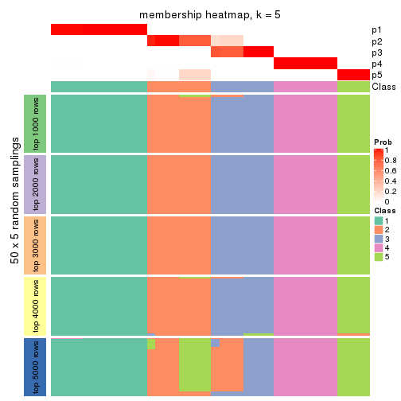</p>

</div>
<div id='tab-SD-hclust-membership-heatmap-5'>
<pre><code class="r">membership_heatmap(res, k = 6)
</code></pre>

<p></p>

</div>
</div>

As soon as we have had the classes for columns, we can look for signatures
which are significantly different between classes which can be candidate marks
for certain classes. Following are the heatmaps for signatures.


Signature heatmaps where rows are scaled:


<script>
$( function() {
	$( '#tabs-SD-hclust-get-signatures' ).tabs();
} );
</script>
<div id='tabs-SD-hclust-get-signatures'>
<ul>
<li><a href='#tab-SD-hclust-get-signatures-1'>k = 2</a></li>
<li><a href='#tab-SD-hclust-get-signatures-2'>k = 3</a></li>
<li><a href='#tab-SD-hclust-get-signatures-3'>k = 4</a></li>
<li><a href='#tab-SD-hclust-get-signatures-4'>k = 5</a></li>
<li><a href='#tab-SD-hclust-get-signatures-5'>k = 6</a></li>
</ul>
<div id='tab-SD-hclust-get-signatures-1'>
<pre><code class="r">get_signatures(res, k = 2)
</code></pre>

<p></p>

</div>
<div id='tab-SD-hclust-get-signatures-2'>
<pre><code class="r">get_signatures(res, k = 3)
</code></pre>

<p></p>

</div>
<div id='tab-SD-hclust-get-signatures-3'>
<pre><code class="r">get_signatures(res, k = 4)
</code></pre>

<p></p>

</div>
<div id='tab-SD-hclust-get-signatures-4'>
<pre><code class="r">get_signatures(res, k = 5)
</code></pre>

<p></p>

</div>
<div id='tab-SD-hclust-get-signatures-5'>
<pre><code class="r">get_signatures(res, k = 6)
</code></pre>

<p></p>

</div>
</div>


Signature heatmaps where rows are not scaled:


<script>
$( function() {
	$( '#tabs-SD-hclust-get-signatures-no-scale' ).tabs();
} );
</script>
<div id='tabs-SD-hclust-get-signatures-no-scale'>
<ul>
<li><a href='#tab-SD-hclust-get-signatures-no-scale-1'>k = 2</a></li>
<li><a href='#tab-SD-hclust-get-signatures-no-scale-2'>k = 3</a></li>
<li><a href='#tab-SD-hclust-get-signatures-no-scale-3'>k = 4</a></li>
<li><a href='#tab-SD-hclust-get-signatures-no-scale-4'>k = 5</a></li>
<li><a href='#tab-SD-hclust-get-signatures-no-scale-5'>k = 6</a></li>
</ul>
<div id='tab-SD-hclust-get-signatures-no-scale-1'>
<pre><code class="r">get_signatures(res, k = 2, scale_rows = FALSE)
</code></pre>

<p></p>

</div>
<div id='tab-SD-hclust-get-signatures-no-scale-2'>
<pre><code class="r">get_signatures(res, k = 3, scale_rows = FALSE)
</code></pre>

<p>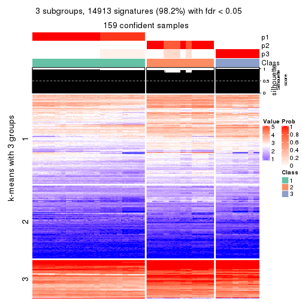</p>

</div>
<div id='tab-SD-hclust-get-signatures-no-scale-3'>
<pre><code class="r">get_signatures(res, k = 4, scale_rows = FALSE)
</code></pre>

<p></p>

</div>
<div id='tab-SD-hclust-get-signatures-no-scale-4'>
<pre><code class="r">get_signatures(res, k = 5, scale_rows = FALSE)
</code></pre>

<p></p>

</div>
<div id='tab-SD-hclust-get-signatures-no-scale-5'>
<pre><code class="r">get_signatures(res, k = 6, scale_rows = FALSE)
</code></pre>

<p></p>

</div>
</div>


Compare the overlap of signatures from different k:

```r
compare_signatures(res)
```


`get_signature()` returns a data frame invisibly. TO get the list of signatures, the function
call should be assigned to a variable explicitly. In following code, if `plot` argument is set
to `FALSE`, no heatmap is plotted while only the differential analysis is performed.

```r
# code only for demonstration
tb = get_signature(res, k = ..., plot = FALSE)
```

An example of the output of `tb` is:

```
#>   which_row         fdr    mean_1    mean_2 scaled_mean_1 scaled_mean_2 km
#> 1        38 0.042760348  8.373488  9.131774    -0.5533452     0.5164555  1
#> 2        40 0.018707592  7.106213  8.469186    -0.6173731     0.5762149  1
#> 3        55 0.019134737 10.221463 11.207825    -0.6159697     0.5749050  1
#> 4        59 0.006059896  5.921854  7.869574    -0.6899429     0.6439467  1
#> 5        60 0.018055526  8.928898 10.211722    -0.6204761     0.5791110  1
#> 6        98 0.009384629 15.714769 14.887706     0.6635654    -0.6193277  2
...
```

The columns in `tb` are:

1. `which_row`: row indices corresponding to the input matrix.
2. `fdr`: FDR for the differential test. 
3. `mean_x`: The mean value in group x.
4. `scaled_mean_x`: The mean value in group x after rows are scaled.
5. `km`: Row groups if k-means clustering is applied to rows.


UMAP plot which shows how samples are separated.


<script>
$( function() {
	$( '#tabs-SD-hclust-dimension-reduction' ).tabs();
} );
</script>
<div id='tabs-SD-hclust-dimension-reduction'>
<ul>
<li><a href='#tab-SD-hclust-dimension-reduction-1'>k = 2</a></li>
<li><a href='#tab-SD-hclust-dimension-reduction-2'>k = 3</a></li>
<li><a href='#tab-SD-hclust-dimension-reduction-3'>k = 4</a></li>
<li><a href='#tab-SD-hclust-dimension-reduction-4'>k = 5</a></li>
<li><a href='#tab-SD-hclust-dimension-reduction-5'>k = 6</a></li>
</ul>
<div id='tab-SD-hclust-dimension-reduction-1'>
<pre><code class="r">dimension_reduction(res, k = 2, method = &quot;UMAP&quot;)
</code></pre>

<p></p>

</div>
<div id='tab-SD-hclust-dimension-reduction-2'>
<pre><code class="r">dimension_reduction(res, k = 3, method = &quot;UMAP&quot;)
</code></pre>

<p></p>

</div>
<div id='tab-SD-hclust-dimension-reduction-3'>
<pre><code class="r">dimension_reduction(res, k = 4, method = &quot;UMAP&quot;)
</code></pre>

<p></p>

</div>
<div id='tab-SD-hclust-dimension-reduction-4'>
<pre><code class="r">dimension_reduction(res, k = 5, method = &quot;UMAP&quot;)
</code></pre>

<p></p>

</div>
<div id='tab-SD-hclust-dimension-reduction-5'>
<pre><code class="r">dimension_reduction(res, k = 6, method = &quot;UMAP&quot;)
</code></pre>

<p>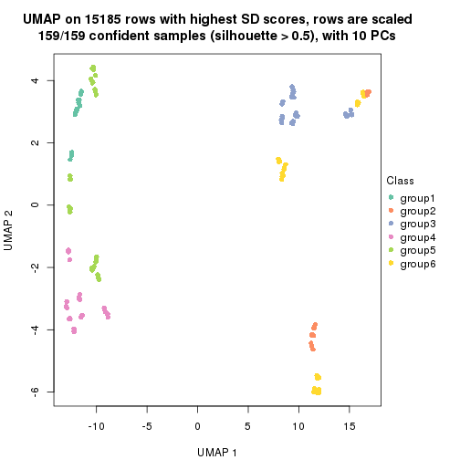</p>

</div>
</div>


Following heatmap shows how subgroups are split when increasing `k`:

```r
collect_classes(res)
```


If matrix rows can be associated to genes, consider to use `GO_Enrichment(res,
...)` to perform function enrichment for the signature genes.


 

---------------------------------------------------


### SD:kmeans**


The object with results only for a single top-value method and a single partition method 
can be extracted as:

```r
res = res_list["SD", "kmeans"]
# you can also extract it by
# res = res_list["SD:kmeans"]
```

A summary of `res` and all the functions that can be applied to it:

```r
res
```

```
#> A 'ConsensusPartition' object with k = 2, 3, 4, 5, 6.
#>   On a matrix with 15185 rows and 159 columns.
#>   Top rows (1000, 2000, 3000, 4000, 5000) are extracted by 'SD' method.
#>   Subgroups are detected by 'kmeans' method.
#>   Performed in total 1250 partitions by row resampling.
#>   Best k for subgroups seems to be 2.
#> 
#> Following methods can be applied to this 'ConsensusPartition' object:
#>  [1] "cola_report"             "collect_classes"         "collect_plots"          
#>  [4] "collect_stats"           "colnames"                "compare_signatures"     
#>  [7] "consensus_heatmap"       "dimension_reduction"     "functional_enrichment"  
#> [10] "get_anno_col"            "get_anno"                "get_classes"            
#> [13] "get_consensus"           "get_matrix"              "get_membership"         
#> [16] "get_param"               "get_signatures"          "get_stats"              
#> [19] "is_best_k"               "is_stable_k"             "membership_heatmap"     
#> [22] "ncol"                    "nrow"                    "plot_ecdf"              
#> [25] "rownames"                "select_partition_number" "show"                   
#> [28] "suggest_best_k"          "test_to_known_factors"
```

`collect_plots()` function collects all the plots made from `res` for all `k` (number of partitions)
into one single page to provide an easy and fast comparison between different `k`.

```r
collect_plots(res)
```


The plots are:

- The first row: a plot of the ECDF (Empirical cumulative distribution
  function) curves of the consensus matrix for each `k` and the heatmap of
  predicted classes for each `k`.
- The second row: heatmaps of the consensus matrix for each `k`.
- The third row: heatmaps of the membership matrix for each `k`.
- The fouth row: heatmaps of the signatures for each `k`.

All the plots in panels can be made by individual functions and they are
plotted later in this section.

`select_partition_number()` produces several plots showing different
statistics for choosing "optimized" `k`. There are following statistics:

- ECDF curves of the consensus matrix for each `k`;
- 1-PAC. [The PAC
  score](https://en.wikipedia.org/wiki/Consensus_clustering#Over-interpretation_potential_of_consensus_clustering)
  measures the proportion of the ambiguous subgrouping.
- Mean silhouette score.
- Concordance. The mean probability of fiting the consensus class ids in all
  partitions.
- Area increased. Denote $A_k$ as the area under the ECDF curve for current
  `k`, the area increased is defined as $A_k - A_{k-1}$.
- Rand index. The percent of pairs of samples that are both in a same cluster
  or both are not in a same cluster in the partition of k and k-1.
- Jaccard index. The ratio of pairs of samples are both in a same cluster in
  the partition of k and k-1 and the pairs of samples are both in a same
  cluster in the partition k or k-1.

The detailed explanations of these statistics can be found in [the cola
vignette](http://bioconductor.org/packages/devel/bioc/vignettes/cola/inst/doc/cola.html#toc_13).

Generally speaking, lower PAC score, higher mean silhouette score or higher
concordance corresponds to better partition. Rand index and Jaccard index
measure how similar the current partition is compared to partition with `k-1`.
If they are too similar, we won't accept `k` is better than `k-1`.

```r
select_partition_number(res)
```


The numeric values for all these statistics can be obtained by `get_stats()`.

```r
get_stats(res)
```

```
#>   k 1-PAC mean_silhouette concordance area_increased  Rand Jaccard
#> 2 2 1.000           0.982       0.986         0.5036 0.497   0.497
#> 3 3 0.633           0.756       0.750         0.2566 1.000   1.000
#> 4 4 0.629           0.716       0.754         0.1201 0.758   0.513
#> 5 5 0.659           0.649       0.722         0.0735 0.918   0.724
#> 6 6 0.750           0.607       0.662         0.0469 0.861   0.546
```

`suggest_best_k()` suggests the best $k$ based on these statistics. The rules are as follows:

- All $k$ with Jaccard index larger than 0.95 are removed because the increase of
  the partition number does not provides enough extra information. If all $k$ are removed,
  the best $k$ is assigned by `NA`.
- For $k$ with 1-PAC larger than 0.9, the maximal $k$ is taken as the "best k". Other $k$ is called "optional k".
- If it does not fit the second rule. The $k$ with the highest vote of highest
  1-PAC, mean silhouette and concordance is taken as the "best k".

```r
suggest_best_k(res)
```

```
#> [1] 2
```


Following shows the table of the partitions (You need to click the **show/hide
code output** link to see it). The membership matrix (columns with name `p*`)
is inferred by
[`clue::cl_consensus()`](https://www.rdocumentation.org/link/cl_consensus?package=clue)
function with the `SE` method. Basically the value in the membership matrix
represents the probability to belong to a certain group. The finall class
label for an item is determined with the group with highest probability it
belongs to.

In `get_classes()` function, the entropy is calculated from the membership
matrix and the silhouette score is calculated from the consensus matrix.


<script>
$( function() {
	$( '#tabs-SD-kmeans-get-classes' ).tabs();
} );
</script>
<div id='tabs-SD-kmeans-get-classes'>
<ul>
<li><a href='#tab-SD-kmeans-get-classes-1'>k = 2</a></li>
<li><a href='#tab-SD-kmeans-get-classes-2'>k = 3</a></li>
<li><a href='#tab-SD-kmeans-get-classes-3'>k = 4</a></li>
<li><a href='#tab-SD-kmeans-get-classes-4'>k = 5</a></li>
<li><a href='#tab-SD-kmeans-get-classes-5'>k = 6</a></li>
</ul>

<div id='tab-SD-kmeans-get-classes-1'>
<p><a id='tab-SD-kmeans-get-classes-1-a' style='color:#0366d6' href='#'>show/hide code output</a></p>
<pre><code class="r">cbind(get_classes(res, k = 2), get_membership(res, k = 2))
</code></pre>

<pre><code>#&gt;            class entropy silhouette    p1    p2
#&gt; SRR1706767     1   0.000      0.985 1.000 0.000
#&gt; SRR1706768     1   0.000      0.985 1.000 0.000
#&gt; SRR1706769     1   0.000      0.985 1.000 0.000
#&gt; SRR1706770     1   0.000      0.985 1.000 0.000
#&gt; SRR1706771     1   0.000      0.985 1.000 0.000
#&gt; SRR1706772     1   0.000      0.985 1.000 0.000
#&gt; SRR1706773     1   0.000      0.985 1.000 0.000
#&gt; SRR1706774     1   0.000      0.985 1.000 0.000
#&gt; SRR1706775     1   0.000      0.985 1.000 0.000
#&gt; SRR1706776     1   0.000      0.985 1.000 0.000
#&gt; SRR1706777     1   0.000      0.985 1.000 0.000
#&gt; SRR1706778     1   0.000      0.985 1.000 0.000
#&gt; SRR1706779     1   0.224      0.977 0.964 0.036
#&gt; SRR1706780     1   0.224      0.977 0.964 0.036
#&gt; SRR1706781     1   0.224      0.977 0.964 0.036
#&gt; SRR1706782     1   0.224      0.977 0.964 0.036
#&gt; SRR1706783     1   0.224      0.977 0.964 0.036
#&gt; SRR1706784     1   0.224      0.977 0.964 0.036
#&gt; SRR1706785     1   0.224      0.977 0.964 0.036
#&gt; SRR1706786     1   0.224      0.977 0.964 0.036
#&gt; SRR1706787     1   0.000      0.985 1.000 0.000
#&gt; SRR1706788     1   0.000      0.985 1.000 0.000
#&gt; SRR1706789     1   0.000      0.985 1.000 0.000
#&gt; SRR1706790     1   0.000      0.985 1.000 0.000
#&gt; SRR1706791     1   0.000      0.985 1.000 0.000
#&gt; SRR1706792     1   0.000      0.985 1.000 0.000
#&gt; SRR1706793     1   0.000      0.985 1.000 0.000
#&gt; SRR1706794     1   0.000      0.985 1.000 0.000
#&gt; SRR1706795     1   0.000      0.985 1.000 0.000
#&gt; SRR1706796     1   0.000      0.985 1.000 0.000
#&gt; SRR1706797     1   0.000      0.985 1.000 0.000
#&gt; SRR1706798     1   0.000      0.985 1.000 0.000
#&gt; SRR1706799     1   0.224      0.977 0.964 0.036
#&gt; SRR1706800     1   0.224      0.977 0.964 0.036
#&gt; SRR1706801     1   0.224      0.977 0.964 0.036
#&gt; SRR1706802     1   0.224      0.977 0.964 0.036
#&gt; SRR1706803     1   0.224      0.977 0.964 0.036
#&gt; SRR1706804     1   0.224      0.977 0.964 0.036
#&gt; SRR1706805     1   0.224      0.977 0.964 0.036
#&gt; SRR1706806     1   0.224      0.977 0.964 0.036
#&gt; SRR1706811     1   0.000      0.985 1.000 0.000
#&gt; SRR1706812     1   0.000      0.985 1.000 0.000
#&gt; SRR1706813     1   0.000      0.985 1.000 0.000
#&gt; SRR1706814     1   0.000      0.985 1.000 0.000
#&gt; SRR1706807     1   0.000      0.985 1.000 0.000
#&gt; SRR1706808     1   0.000      0.985 1.000 0.000
#&gt; SRR1706809     1   0.000      0.985 1.000 0.000
#&gt; SRR1706810     1   0.000      0.985 1.000 0.000
#&gt; SRR1706815     1   0.000      0.985 1.000 0.000
#&gt; SRR1706816     1   0.000      0.985 1.000 0.000
#&gt; SRR1706817     1   0.000      0.985 1.000 0.000
#&gt; SRR1706818     1   0.000      0.985 1.000 0.000
#&gt; SRR1706819     1   0.224      0.977 0.964 0.036
#&gt; SRR1706820     1   0.224      0.977 0.964 0.036
#&gt; SRR1706821     1   0.224      0.977 0.964 0.036
#&gt; SRR1706822     1   0.224      0.977 0.964 0.036
#&gt; SRR1706823     1   0.224      0.977 0.964 0.036
#&gt; SRR1706824     1   0.224      0.977 0.964 0.036
#&gt; SRR1706825     1   0.224      0.977 0.964 0.036
#&gt; SRR1706826     1   0.224      0.977 0.964 0.036
#&gt; SRR1706827     1   0.000      0.985 1.000 0.000
#&gt; SRR1706828     1   0.000      0.985 1.000 0.000
#&gt; SRR1706829     1   0.000      0.985 1.000 0.000
#&gt; SRR1706830     1   0.000      0.985 1.000 0.000
#&gt; SRR1706835     1   0.000      0.985 1.000 0.000
#&gt; SRR1706836     1   0.000      0.985 1.000 0.000
#&gt; SRR1706837     1   0.000      0.985 1.000 0.000
#&gt; SRR1706838     1   0.000      0.985 1.000 0.000
#&gt; SRR1706831     1   0.000      0.985 1.000 0.000
#&gt; SRR1706832     1   0.000      0.985 1.000 0.000
#&gt; SRR1706833     1   0.000      0.985 1.000 0.000
#&gt; SRR1706834     1   0.000      0.985 1.000 0.000
#&gt; SRR1706839     1   0.224      0.977 0.964 0.036
#&gt; SRR1706840     1   0.224      0.977 0.964 0.036
#&gt; SRR1706841     1   0.224      0.977 0.964 0.036
#&gt; SRR1706842     1   0.224      0.977 0.964 0.036
#&gt; SRR1706847     2   0.224      0.977 0.036 0.964
#&gt; SRR1706848     2   0.224      0.977 0.036 0.964
#&gt; SRR1706849     2   0.224      0.977 0.036 0.964
#&gt; SRR1706850     2   0.224      0.977 0.036 0.964
#&gt; SRR1706843     1   0.224      0.977 0.964 0.036
#&gt; SRR1706844     1   0.224      0.977 0.964 0.036
#&gt; SRR1706845     1   0.224      0.977 0.964 0.036
#&gt; SRR1706846     1   0.224      0.977 0.964 0.036
#&gt; SRR1706851     2   0.224      0.977 0.036 0.964
#&gt; SRR1706852     2   0.224      0.977 0.036 0.964
#&gt; SRR1706853     2   0.224      0.977 0.036 0.964
#&gt; SRR1706854     2   0.224      0.977 0.036 0.964
#&gt; SRR1706855     2   0.000      0.985 0.000 1.000
#&gt; SRR1706856     2   0.000      0.985 0.000 1.000
#&gt; SRR1706857     2   0.000      0.985 0.000 1.000
#&gt; SRR1706858     2   0.000      0.985 0.000 1.000
#&gt; SRR1706859     2   0.000      0.985 0.000 1.000
#&gt; SRR1706860     2   0.000      0.985 0.000 1.000
#&gt; SRR1706861     2   0.000      0.985 0.000 1.000
#&gt; SRR1706862     2   0.000      0.985 0.000 1.000
#&gt; SRR1706867     2   0.224      0.977 0.036 0.964
#&gt; SRR1706869     2   0.224      0.977 0.036 0.964
#&gt; SRR1706870     2   0.224      0.977 0.036 0.964
#&gt; SRR1706863     2   0.000      0.985 0.000 1.000
#&gt; SRR1706864     2   0.000      0.985 0.000 1.000
#&gt; SRR1706865     2   0.000      0.985 0.000 1.000
#&gt; SRR1706866     2   0.000      0.985 0.000 1.000
#&gt; SRR1706871     2   0.224      0.977 0.036 0.964
#&gt; SRR1706872     2   0.224      0.977 0.036 0.964
#&gt; SRR1706873     2   0.224      0.977 0.036 0.964
#&gt; SRR1706874     2   0.224      0.977 0.036 0.964
#&gt; SRR1706879     2   0.000      0.985 0.000 1.000
#&gt; SRR1706880     2   0.000      0.985 0.000 1.000
#&gt; SRR1706881     2   0.000      0.985 0.000 1.000
#&gt; SRR1706882     2   0.000      0.985 0.000 1.000
#&gt; SRR1706883     2   0.000      0.985 0.000 1.000
#&gt; SRR1706884     2   0.000      0.985 0.000 1.000
#&gt; SRR1706885     2   0.000      0.985 0.000 1.000
#&gt; SRR1706886     2   0.000      0.985 0.000 1.000
#&gt; SRR1706875     2   0.000      0.985 0.000 1.000
#&gt; SRR1706876     2   0.000      0.985 0.000 1.000
#&gt; SRR1706877     2   0.000      0.985 0.000 1.000
#&gt; SRR1706878     2   0.000      0.985 0.000 1.000
#&gt; SRR1706887     2   0.224      0.977 0.036 0.964
#&gt; SRR1706888     2   0.224      0.977 0.036 0.964
#&gt; SRR1706889     2   0.224      0.977 0.036 0.964
#&gt; SRR1706890     2   0.224      0.977 0.036 0.964
#&gt; SRR1706891     2   0.224      0.977 0.036 0.964
#&gt; SRR1706892     2   0.224      0.977 0.036 0.964
#&gt; SRR1706893     2   0.224      0.977 0.036 0.964
#&gt; SRR1706894     2   0.224      0.977 0.036 0.964
#&gt; SRR1706895     2   0.000      0.985 0.000 1.000
#&gt; SRR1706896     2   0.000      0.985 0.000 1.000
#&gt; SRR1706897     2   0.000      0.985 0.000 1.000
#&gt; SRR1706898     2   0.000      0.985 0.000 1.000
#&gt; SRR1706899     2   0.000      0.985 0.000 1.000
#&gt; SRR1706900     2   0.000      0.985 0.000 1.000
#&gt; SRR1706901     2   0.000      0.985 0.000 1.000
#&gt; SRR1706902     2   0.000      0.985 0.000 1.000
#&gt; SRR1706907     2   0.224      0.977 0.036 0.964
#&gt; SRR1706908     2   0.224      0.977 0.036 0.964
#&gt; SRR1706909     2   0.224      0.977 0.036 0.964
#&gt; SRR1706910     2   0.224      0.977 0.036 0.964
#&gt; SRR1706903     2   0.000      0.985 0.000 1.000
#&gt; SRR1706904     2   0.000      0.985 0.000 1.000
#&gt; SRR1706905     2   0.000      0.985 0.000 1.000
#&gt; SRR1706906     2   0.000      0.985 0.000 1.000
#&gt; SRR1706911     2   0.224      0.977 0.036 0.964
#&gt; SRR1706912     2   0.224      0.977 0.036 0.964
#&gt; SRR1706913     2   0.224      0.977 0.036 0.964
#&gt; SRR1706914     2   0.224      0.977 0.036 0.964
#&gt; SRR1706919     2   0.000      0.985 0.000 1.000
#&gt; SRR1706920     2   0.000      0.985 0.000 1.000
#&gt; SRR1706921     2   0.000      0.985 0.000 1.000
#&gt; SRR1706922     2   0.000      0.985 0.000 1.000
#&gt; SRR1706915     2   0.000      0.985 0.000 1.000
#&gt; SRR1706916     2   0.000      0.985 0.000 1.000
#&gt; SRR1706917     2   0.000      0.985 0.000 1.000
#&gt; SRR1706918     2   0.000      0.985 0.000 1.000
#&gt; SRR1706923     2   0.000      0.985 0.000 1.000
#&gt; SRR1706924     2   0.000      0.985 0.000 1.000
#&gt; SRR1706925     2   0.000      0.985 0.000 1.000
#&gt; SRR1706926     2   0.000      0.985 0.000 1.000
</code></pre>

<script>
$('#tab-SD-kmeans-get-classes-1-a').parent().next().next().hide();
$('#tab-SD-kmeans-get-classes-1-a').click(function(){
  $('#tab-SD-kmeans-get-classes-1-a').parent().next().next().toggle();
  return(false);
});
</script>
</div>

<div id='tab-SD-kmeans-get-classes-2'>
<p><a id='tab-SD-kmeans-get-classes-2-a' style='color:#0366d6' href='#'>show/hide code output</a></p>
<pre><code class="r">cbind(get_classes(res, k = 3), get_membership(res, k = 3))
</code></pre>

<pre><code>#&gt;            class entropy silhouette    p1    p2    p3
#&gt; SRR1706767     1  0.2939      0.718 0.916 0.012 0.072
#&gt; SRR1706768     1  0.2939      0.718 0.916 0.012 0.072
#&gt; SRR1706769     1  0.2939      0.718 0.916 0.012 0.072
#&gt; SRR1706770     1  0.2939      0.718 0.916 0.012 0.072
#&gt; SRR1706771     1  0.0000      0.761 1.000 0.000 0.000
#&gt; SRR1706772     1  0.0000      0.761 1.000 0.000 0.000
#&gt; SRR1706773     1  0.0000      0.761 1.000 0.000 0.000
#&gt; SRR1706774     1  0.0000      0.761 1.000 0.000 0.000
#&gt; SRR1706775     1  0.5553      0.810 0.724 0.004 0.272
#&gt; SRR1706776     1  0.5553      0.810 0.724 0.004 0.272
#&gt; SRR1706777     1  0.5553      0.810 0.724 0.004 0.272
#&gt; SRR1706778     1  0.5553      0.810 0.724 0.004 0.272
#&gt; SRR1706779     1  0.6483      0.792 0.544 0.004 0.452
#&gt; SRR1706780     1  0.6483      0.792 0.544 0.004 0.452
#&gt; SRR1706781     1  0.6483      0.792 0.544 0.004 0.452
#&gt; SRR1706782     1  0.6483      0.792 0.544 0.004 0.452
#&gt; SRR1706783     1  0.6305      0.781 0.516 0.000 0.484
#&gt; SRR1706784     1  0.6305      0.781 0.516 0.000 0.484
#&gt; SRR1706785     1  0.6305      0.781 0.516 0.000 0.484
#&gt; SRR1706786     1  0.6305      0.781 0.516 0.000 0.484
#&gt; SRR1706787     1  0.2939      0.718 0.916 0.012 0.072
#&gt; SRR1706788     1  0.2939      0.718 0.916 0.012 0.072
#&gt; SRR1706789     1  0.2939      0.718 0.916 0.012 0.072
#&gt; SRR1706790     1  0.2939      0.718 0.916 0.012 0.072
#&gt; SRR1706791     1  0.0000      0.761 1.000 0.000 0.000
#&gt; SRR1706792     1  0.0000      0.761 1.000 0.000 0.000
#&gt; SRR1706793     1  0.0000      0.761 1.000 0.000 0.000
#&gt; SRR1706794     1  0.0000      0.761 1.000 0.000 0.000
#&gt; SRR1706795     1  0.5553      0.810 0.724 0.004 0.272
#&gt; SRR1706796     1  0.5553      0.810 0.724 0.004 0.272
#&gt; SRR1706797     1  0.5553      0.810 0.724 0.004 0.272
#&gt; SRR1706798     1  0.5553      0.810 0.724 0.004 0.272
#&gt; SRR1706799     1  0.6483      0.792 0.544 0.004 0.452
#&gt; SRR1706800     1  0.6483      0.792 0.544 0.004 0.452
#&gt; SRR1706801     1  0.6483      0.792 0.544 0.004 0.452
#&gt; SRR1706802     1  0.6483      0.792 0.544 0.004 0.452
#&gt; SRR1706803     1  0.6305      0.781 0.516 0.000 0.484
#&gt; SRR1706804     1  0.6305      0.781 0.516 0.000 0.484
#&gt; SRR1706805     1  0.6305      0.781 0.516 0.000 0.484
#&gt; SRR1706806     1  0.6305      0.781 0.516 0.000 0.484
#&gt; SRR1706811     1  0.0000      0.761 1.000 0.000 0.000
#&gt; SRR1706812     1  0.0000      0.761 1.000 0.000 0.000
#&gt; SRR1706813     1  0.0000      0.761 1.000 0.000 0.000
#&gt; SRR1706814     1  0.0000      0.761 1.000 0.000 0.000
#&gt; SRR1706807     1  0.2939      0.718 0.916 0.012 0.072
#&gt; SRR1706808     1  0.2939      0.718 0.916 0.012 0.072
#&gt; SRR1706809     1  0.2939      0.718 0.916 0.012 0.072
#&gt; SRR1706810     1  0.2939      0.718 0.916 0.012 0.072
#&gt; SRR1706815     1  0.5553      0.810 0.724 0.004 0.272
#&gt; SRR1706816     1  0.5553      0.810 0.724 0.004 0.272
#&gt; SRR1706817     1  0.5553      0.810 0.724 0.004 0.272
#&gt; SRR1706818     1  0.5553      0.810 0.724 0.004 0.272
#&gt; SRR1706819     1  0.6483      0.792 0.544 0.004 0.452
#&gt; SRR1706820     1  0.6483      0.792 0.544 0.004 0.452
#&gt; SRR1706821     1  0.6483      0.792 0.544 0.004 0.452
#&gt; SRR1706822     1  0.6483      0.792 0.544 0.004 0.452
#&gt; SRR1706823     1  0.6305      0.781 0.516 0.000 0.484
#&gt; SRR1706824     1  0.6305      0.781 0.516 0.000 0.484
#&gt; SRR1706825     1  0.6305      0.781 0.516 0.000 0.484
#&gt; SRR1706826     1  0.6305      0.781 0.516 0.000 0.484
#&gt; SRR1706827     1  0.2939      0.718 0.916 0.012 0.072
#&gt; SRR1706828     1  0.2939      0.718 0.916 0.012 0.072
#&gt; SRR1706829     1  0.2939      0.718 0.916 0.012 0.072
#&gt; SRR1706830     1  0.2939      0.718 0.916 0.012 0.072
#&gt; SRR1706835     1  0.5553      0.810 0.724 0.004 0.272
#&gt; SRR1706836     1  0.5553      0.810 0.724 0.004 0.272
#&gt; SRR1706837     1  0.5553      0.810 0.724 0.004 0.272
#&gt; SRR1706838     1  0.5553      0.810 0.724 0.004 0.272
#&gt; SRR1706831     1  0.0000      0.761 1.000 0.000 0.000
#&gt; SRR1706832     1  0.0000      0.761 1.000 0.000 0.000
#&gt; SRR1706833     1  0.0000      0.761 1.000 0.000 0.000
#&gt; SRR1706834     1  0.0000      0.761 1.000 0.000 0.000
#&gt; SRR1706839     1  0.6483      0.792 0.544 0.004 0.452
#&gt; SRR1706840     1  0.6483      0.792 0.544 0.004 0.452
#&gt; SRR1706841     1  0.6483      0.792 0.544 0.004 0.452
#&gt; SRR1706842     1  0.6483      0.792 0.544 0.004 0.452
#&gt; SRR1706847     2  0.6324      0.587 0.160 0.764 0.076
#&gt; SRR1706848     2  0.6324      0.587 0.160 0.764 0.076
#&gt; SRR1706849     2  0.6324      0.587 0.160 0.764 0.076
#&gt; SRR1706850     2  0.6324      0.587 0.160 0.764 0.076
#&gt; SRR1706843     1  0.6305      0.781 0.516 0.000 0.484
#&gt; SRR1706844     1  0.6305      0.781 0.516 0.000 0.484
#&gt; SRR1706845     1  0.6305      0.781 0.516 0.000 0.484
#&gt; SRR1706846     1  0.6305      0.781 0.516 0.000 0.484
#&gt; SRR1706851     2  0.0000      0.741 0.000 1.000 0.000
#&gt; SRR1706852     2  0.0000      0.741 0.000 1.000 0.000
#&gt; SRR1706853     2  0.0000      0.741 0.000 1.000 0.000
#&gt; SRR1706854     2  0.0000      0.741 0.000 1.000 0.000
#&gt; SRR1706855     2  0.5327      0.799 0.000 0.728 0.272
#&gt; SRR1706856     2  0.5327      0.799 0.000 0.728 0.272
#&gt; SRR1706857     2  0.5327      0.799 0.000 0.728 0.272
#&gt; SRR1706858     2  0.5327      0.799 0.000 0.728 0.272
#&gt; SRR1706859     2  0.6244      0.788 0.000 0.560 0.440
#&gt; SRR1706860     2  0.6244      0.788 0.000 0.560 0.440
#&gt; SRR1706861     2  0.6244      0.788 0.000 0.560 0.440
#&gt; SRR1706862     2  0.6244      0.788 0.000 0.560 0.440
#&gt; SRR1706867     2  0.6324      0.587 0.160 0.764 0.076
#&gt; SRR1706869     2  0.6324      0.587 0.160 0.764 0.076
#&gt; SRR1706870     2  0.6324      0.587 0.160 0.764 0.076
#&gt; SRR1706863     2  0.6299      0.776 0.000 0.524 0.476
#&gt; SRR1706864     2  0.6299      0.776 0.000 0.524 0.476
#&gt; SRR1706865     2  0.6299      0.776 0.000 0.524 0.476
#&gt; SRR1706866     2  0.6299      0.776 0.000 0.524 0.476
#&gt; SRR1706871     2  0.0000      0.741 0.000 1.000 0.000
#&gt; SRR1706872     2  0.0000      0.741 0.000 1.000 0.000
#&gt; SRR1706873     2  0.0000      0.741 0.000 1.000 0.000
#&gt; SRR1706874     2  0.0000      0.741 0.000 1.000 0.000
#&gt; SRR1706879     2  0.6244      0.788 0.000 0.560 0.440
#&gt; SRR1706880     2  0.6244      0.788 0.000 0.560 0.440
#&gt; SRR1706881     2  0.6244      0.788 0.000 0.560 0.440
#&gt; SRR1706882     2  0.6244      0.788 0.000 0.560 0.440
#&gt; SRR1706883     2  0.6299      0.776 0.000 0.524 0.476
#&gt; SRR1706884     2  0.6299      0.776 0.000 0.524 0.476
#&gt; SRR1706885     2  0.6299      0.776 0.000 0.524 0.476
#&gt; SRR1706886     2  0.6299      0.776 0.000 0.524 0.476
#&gt; SRR1706875     2  0.5327      0.799 0.000 0.728 0.272
#&gt; SRR1706876     2  0.5327      0.799 0.000 0.728 0.272
#&gt; SRR1706877     2  0.5327      0.799 0.000 0.728 0.272
#&gt; SRR1706878     2  0.5327      0.799 0.000 0.728 0.272
#&gt; SRR1706887     2  0.6488      0.584 0.160 0.756 0.084
#&gt; SRR1706888     2  0.6488      0.584 0.160 0.756 0.084
#&gt; SRR1706889     2  0.6488      0.584 0.160 0.756 0.084
#&gt; SRR1706890     2  0.6488      0.584 0.160 0.756 0.084
#&gt; SRR1706891     2  0.0424      0.740 0.000 0.992 0.008
#&gt; SRR1706892     2  0.0424      0.740 0.000 0.992 0.008
#&gt; SRR1706893     2  0.0424      0.740 0.000 0.992 0.008
#&gt; SRR1706894     2  0.0424      0.740 0.000 0.992 0.008
#&gt; SRR1706895     2  0.5397      0.798 0.000 0.720 0.280
#&gt; SRR1706896     2  0.5397      0.798 0.000 0.720 0.280
#&gt; SRR1706897     2  0.5397      0.798 0.000 0.720 0.280
#&gt; SRR1706898     2  0.5397      0.798 0.000 0.720 0.280
#&gt; SRR1706899     2  0.6260      0.787 0.000 0.552 0.448
#&gt; SRR1706900     2  0.6260      0.787 0.000 0.552 0.448
#&gt; SRR1706901     2  0.6260      0.787 0.000 0.552 0.448
#&gt; SRR1706902     2  0.6260      0.787 0.000 0.552 0.448
#&gt; SRR1706907     2  0.6324      0.587 0.160 0.764 0.076
#&gt; SRR1706908     2  0.6324      0.587 0.160 0.764 0.076
#&gt; SRR1706909     2  0.6324      0.587 0.160 0.764 0.076
#&gt; SRR1706910     2  0.6324      0.587 0.160 0.764 0.076
#&gt; SRR1706903     2  0.6305      0.774 0.000 0.516 0.484
#&gt; SRR1706904     2  0.6305      0.774 0.000 0.516 0.484
#&gt; SRR1706905     2  0.6305      0.774 0.000 0.516 0.484
#&gt; SRR1706906     2  0.6305      0.774 0.000 0.516 0.484
#&gt; SRR1706911     2  0.0000      0.741 0.000 1.000 0.000
#&gt; SRR1706912     2  0.0000      0.741 0.000 1.000 0.000
#&gt; SRR1706913     2  0.0000      0.741 0.000 1.000 0.000
#&gt; SRR1706914     2  0.0000      0.741 0.000 1.000 0.000
#&gt; SRR1706919     2  0.6244      0.788 0.000 0.560 0.440
#&gt; SRR1706920     2  0.6244      0.788 0.000 0.560 0.440
#&gt; SRR1706921     2  0.6244      0.788 0.000 0.560 0.440
#&gt; SRR1706922     2  0.6244      0.788 0.000 0.560 0.440
#&gt; SRR1706915     2  0.5327      0.799 0.000 0.728 0.272
#&gt; SRR1706916     2  0.5327      0.799 0.000 0.728 0.272
#&gt; SRR1706917     2  0.5327      0.799 0.000 0.728 0.272
#&gt; SRR1706918     2  0.5327      0.799 0.000 0.728 0.272
#&gt; SRR1706923     2  0.6299      0.776 0.000 0.524 0.476
#&gt; SRR1706924     2  0.6299      0.776 0.000 0.524 0.476
#&gt; SRR1706925     2  0.6299      0.776 0.000 0.524 0.476
#&gt; SRR1706926     2  0.6299      0.776 0.000 0.524 0.476
</code></pre>

<script>
$('#tab-SD-kmeans-get-classes-2-a').parent().next().next().hide();
$('#tab-SD-kmeans-get-classes-2-a').click(function(){
  $('#tab-SD-kmeans-get-classes-2-a').parent().next().next().toggle();
  return(false);
});
</script>
</div>

<div id='tab-SD-kmeans-get-classes-3'>
<p><a id='tab-SD-kmeans-get-classes-3-a' style='color:#0366d6' href='#'>show/hide code output</a></p>
<pre><code class="r">cbind(get_classes(res, k = 4), get_membership(res, k = 4))
</code></pre>

<pre><code>#&gt;            class entropy silhouette    p1    p2    p3    p4
#&gt; SRR1706767     4  0.5986    0.92509 0.256 0.072 0.004 0.668
#&gt; SRR1706768     4  0.5986    0.92509 0.256 0.072 0.004 0.668
#&gt; SRR1706769     4  0.5986    0.92509 0.256 0.072 0.004 0.668
#&gt; SRR1706770     4  0.5986    0.92509 0.256 0.072 0.004 0.668
#&gt; SRR1706771     4  0.4277    0.92171 0.280 0.000 0.000 0.720
#&gt; SRR1706772     4  0.4277    0.92171 0.280 0.000 0.000 0.720
#&gt; SRR1706773     4  0.4277    0.92171 0.280 0.000 0.000 0.720
#&gt; SRR1706774     4  0.4277    0.92171 0.280 0.000 0.000 0.720
#&gt; SRR1706775     1  0.5088    0.51871 0.688 0.024 0.000 0.288
#&gt; SRR1706776     1  0.5088    0.51871 0.688 0.024 0.000 0.288
#&gt; SRR1706777     1  0.5088    0.51871 0.688 0.024 0.000 0.288
#&gt; SRR1706778     1  0.5088    0.51871 0.688 0.024 0.000 0.288
#&gt; SRR1706779     1  0.0000    0.80928 1.000 0.000 0.000 0.000
#&gt; SRR1706780     1  0.0000    0.80928 1.000 0.000 0.000 0.000
#&gt; SRR1706781     1  0.0000    0.80928 1.000 0.000 0.000 0.000
#&gt; SRR1706782     1  0.0000    0.80928 1.000 0.000 0.000 0.000
#&gt; SRR1706783     1  0.2174    0.79714 0.928 0.052 0.020 0.000
#&gt; SRR1706784     1  0.2174    0.79714 0.928 0.052 0.020 0.000
#&gt; SRR1706785     1  0.2174    0.79714 0.928 0.052 0.020 0.000
#&gt; SRR1706786     1  0.2174    0.79714 0.928 0.052 0.020 0.000
#&gt; SRR1706787     4  0.5986    0.92509 0.256 0.072 0.004 0.668
#&gt; SRR1706788     4  0.5986    0.92509 0.256 0.072 0.004 0.668
#&gt; SRR1706789     4  0.5986    0.92509 0.256 0.072 0.004 0.668
#&gt; SRR1706790     4  0.5986    0.92509 0.256 0.072 0.004 0.668
#&gt; SRR1706791     4  0.4277    0.92171 0.280 0.000 0.000 0.720
#&gt; SRR1706792     4  0.4277    0.92171 0.280 0.000 0.000 0.720
#&gt; SRR1706793     4  0.4277    0.92171 0.280 0.000 0.000 0.720
#&gt; SRR1706794     4  0.4277    0.92171 0.280 0.000 0.000 0.720
#&gt; SRR1706795     1  0.5088    0.51871 0.688 0.024 0.000 0.288
#&gt; SRR1706796     1  0.5088    0.51871 0.688 0.024 0.000 0.288
#&gt; SRR1706797     1  0.5088    0.51871 0.688 0.024 0.000 0.288
#&gt; SRR1706798     1  0.5088    0.51871 0.688 0.024 0.000 0.288
#&gt; SRR1706799     1  0.0000    0.80928 1.000 0.000 0.000 0.000
#&gt; SRR1706800     1  0.0000    0.80928 1.000 0.000 0.000 0.000
#&gt; SRR1706801     1  0.0000    0.80928 1.000 0.000 0.000 0.000
#&gt; SRR1706802     1  0.0000    0.80928 1.000 0.000 0.000 0.000
#&gt; SRR1706803     1  0.2174    0.79714 0.928 0.052 0.020 0.000
#&gt; SRR1706804     1  0.2174    0.79714 0.928 0.052 0.020 0.000
#&gt; SRR1706805     1  0.2174    0.79714 0.928 0.052 0.020 0.000
#&gt; SRR1706806     1  0.2174    0.79714 0.928 0.052 0.020 0.000
#&gt; SRR1706811     4  0.4804    0.91445 0.276 0.016 0.000 0.708
#&gt; SRR1706812     4  0.4804    0.91445 0.276 0.016 0.000 0.708
#&gt; SRR1706813     4  0.4804    0.91445 0.276 0.016 0.000 0.708
#&gt; SRR1706814     4  0.4804    0.91445 0.276 0.016 0.000 0.708
#&gt; SRR1706807     4  0.6144    0.91765 0.252 0.084 0.004 0.660
#&gt; SRR1706808     4  0.6144    0.91765 0.252 0.084 0.004 0.660
#&gt; SRR1706809     4  0.6144    0.91765 0.252 0.084 0.004 0.660
#&gt; SRR1706810     4  0.6144    0.91765 0.252 0.084 0.004 0.660
#&gt; SRR1706815     1  0.5511    0.51370 0.676 0.036 0.004 0.284
#&gt; SRR1706816     1  0.5511    0.51370 0.676 0.036 0.004 0.284
#&gt; SRR1706817     1  0.5511    0.51370 0.676 0.036 0.004 0.284
#&gt; SRR1706818     1  0.5511    0.51370 0.676 0.036 0.004 0.284
#&gt; SRR1706819     1  0.0712    0.80646 0.984 0.008 0.004 0.004
#&gt; SRR1706820     1  0.0712    0.80646 0.984 0.008 0.004 0.004
#&gt; SRR1706821     1  0.0712    0.80646 0.984 0.008 0.004 0.004
#&gt; SRR1706822     1  0.0712    0.80646 0.984 0.008 0.004 0.004
#&gt; SRR1706823     1  0.2629    0.79228 0.912 0.060 0.024 0.004
#&gt; SRR1706824     1  0.2629    0.79228 0.912 0.060 0.024 0.004
#&gt; SRR1706825     1  0.2629    0.79228 0.912 0.060 0.024 0.004
#&gt; SRR1706826     1  0.2629    0.79228 0.912 0.060 0.024 0.004
#&gt; SRR1706827     4  0.5986    0.92509 0.256 0.072 0.004 0.668
#&gt; SRR1706828     4  0.5986    0.92509 0.256 0.072 0.004 0.668
#&gt; SRR1706829     4  0.5986    0.92509 0.256 0.072 0.004 0.668
#&gt; SRR1706830     4  0.5986    0.92509 0.256 0.072 0.004 0.668
#&gt; SRR1706835     1  0.5088    0.51871 0.688 0.024 0.000 0.288
#&gt; SRR1706836     1  0.5088    0.51871 0.688 0.024 0.000 0.288
#&gt; SRR1706837     1  0.5088    0.51871 0.688 0.024 0.000 0.288
#&gt; SRR1706838     1  0.5088    0.51871 0.688 0.024 0.000 0.288
#&gt; SRR1706831     4  0.4277    0.92171 0.280 0.000 0.000 0.720
#&gt; SRR1706832     4  0.4277    0.92171 0.280 0.000 0.000 0.720
#&gt; SRR1706833     4  0.4277    0.92171 0.280 0.000 0.000 0.720
#&gt; SRR1706834     4  0.4277    0.92171 0.280 0.000 0.000 0.720
#&gt; SRR1706839     1  0.0000    0.80928 1.000 0.000 0.000 0.000
#&gt; SRR1706840     1  0.0000    0.80928 1.000 0.000 0.000 0.000
#&gt; SRR1706841     1  0.0000    0.80928 1.000 0.000 0.000 0.000
#&gt; SRR1706842     1  0.0000    0.80928 1.000 0.000 0.000 0.000
#&gt; SRR1706847     3  0.3356    0.66182 0.000 0.000 0.824 0.176
#&gt; SRR1706848     3  0.3356    0.66182 0.000 0.000 0.824 0.176
#&gt; SRR1706849     3  0.3356    0.66182 0.000 0.000 0.824 0.176
#&gt; SRR1706850     3  0.3356    0.66182 0.000 0.000 0.824 0.176
#&gt; SRR1706843     1  0.2174    0.79714 0.928 0.052 0.020 0.000
#&gt; SRR1706844     1  0.2174    0.79714 0.928 0.052 0.020 0.000
#&gt; SRR1706845     1  0.2174    0.79714 0.928 0.052 0.020 0.000
#&gt; SRR1706846     1  0.2174    0.79714 0.928 0.052 0.020 0.000
#&gt; SRR1706851     3  0.1706    0.68572 0.000 0.036 0.948 0.016
#&gt; SRR1706852     3  0.1706    0.68572 0.000 0.036 0.948 0.016
#&gt; SRR1706853     3  0.1706    0.68572 0.000 0.036 0.948 0.016
#&gt; SRR1706854     3  0.1706    0.68572 0.000 0.036 0.948 0.016
#&gt; SRR1706855     3  0.5861   -0.00437 0.000 0.476 0.492 0.032
#&gt; SRR1706856     3  0.5861   -0.00437 0.000 0.476 0.492 0.032
#&gt; SRR1706857     3  0.5861   -0.00437 0.000 0.476 0.492 0.032
#&gt; SRR1706858     3  0.5861   -0.00437 0.000 0.476 0.492 0.032
#&gt; SRR1706859     2  0.3486    0.92225 0.000 0.812 0.188 0.000
#&gt; SRR1706860     2  0.3486    0.92225 0.000 0.812 0.188 0.000
#&gt; SRR1706861     2  0.3486    0.92225 0.000 0.812 0.188 0.000
#&gt; SRR1706862     2  0.3486    0.92225 0.000 0.812 0.188 0.000
#&gt; SRR1706867     3  0.3311    0.66227 0.000 0.000 0.828 0.172
#&gt; SRR1706869     3  0.3311    0.66227 0.000 0.000 0.828 0.172
#&gt; SRR1706870     3  0.3311    0.66227 0.000 0.000 0.828 0.172
#&gt; SRR1706863     2  0.4875    0.92506 0.000 0.772 0.160 0.068
#&gt; SRR1706864     2  0.4875    0.92506 0.000 0.772 0.160 0.068
#&gt; SRR1706865     2  0.4875    0.92506 0.000 0.772 0.160 0.068
#&gt; SRR1706866     2  0.4875    0.92506 0.000 0.772 0.160 0.068
#&gt; SRR1706871     3  0.1118    0.68914 0.000 0.036 0.964 0.000
#&gt; SRR1706872     3  0.1118    0.68914 0.000 0.036 0.964 0.000
#&gt; SRR1706873     3  0.1118    0.68914 0.000 0.036 0.964 0.000
#&gt; SRR1706874     3  0.1118    0.68914 0.000 0.036 0.964 0.000
#&gt; SRR1706879     2  0.3486    0.92225 0.000 0.812 0.188 0.000
#&gt; SRR1706880     2  0.3486    0.92225 0.000 0.812 0.188 0.000
#&gt; SRR1706881     2  0.3486    0.92225 0.000 0.812 0.188 0.000
#&gt; SRR1706882     2  0.3486    0.92225 0.000 0.812 0.188 0.000
#&gt; SRR1706883     2  0.4875    0.92506 0.000 0.772 0.160 0.068
#&gt; SRR1706884     2  0.4875    0.92506 0.000 0.772 0.160 0.068
#&gt; SRR1706885     2  0.4875    0.92506 0.000 0.772 0.160 0.068
#&gt; SRR1706886     2  0.4875    0.92506 0.000 0.772 0.160 0.068
#&gt; SRR1706875     3  0.5861   -0.00437 0.000 0.476 0.492 0.032
#&gt; SRR1706876     3  0.5861   -0.00437 0.000 0.476 0.492 0.032
#&gt; SRR1706877     3  0.5861   -0.00437 0.000 0.476 0.492 0.032
#&gt; SRR1706878     3  0.5861   -0.00437 0.000 0.476 0.492 0.032
#&gt; SRR1706887     3  0.3356    0.66181 0.000 0.000 0.824 0.176
#&gt; SRR1706888     3  0.3356    0.66181 0.000 0.000 0.824 0.176
#&gt; SRR1706889     3  0.3356    0.66181 0.000 0.000 0.824 0.176
#&gt; SRR1706890     3  0.3356    0.66181 0.000 0.000 0.824 0.176
#&gt; SRR1706891     3  0.1305    0.68887 0.000 0.036 0.960 0.004
#&gt; SRR1706892     3  0.1305    0.68887 0.000 0.036 0.960 0.004
#&gt; SRR1706893     3  0.1305    0.68887 0.000 0.036 0.960 0.004
#&gt; SRR1706894     3  0.1305    0.68887 0.000 0.036 0.960 0.004
#&gt; SRR1706895     3  0.6209    0.00593 0.000 0.456 0.492 0.052
#&gt; SRR1706896     3  0.6209    0.00593 0.000 0.456 0.492 0.052
#&gt; SRR1706897     3  0.6209    0.00593 0.000 0.456 0.492 0.052
#&gt; SRR1706898     3  0.6209    0.00593 0.000 0.456 0.492 0.052
#&gt; SRR1706899     2  0.4459    0.90743 0.000 0.780 0.188 0.032
#&gt; SRR1706900     2  0.4459    0.90743 0.000 0.780 0.188 0.032
#&gt; SRR1706901     2  0.4459    0.90743 0.000 0.780 0.188 0.032
#&gt; SRR1706902     2  0.4459    0.90743 0.000 0.780 0.188 0.032
#&gt; SRR1706907     3  0.3311    0.66227 0.000 0.000 0.828 0.172
#&gt; SRR1706908     3  0.3311    0.66227 0.000 0.000 0.828 0.172
#&gt; SRR1706909     3  0.3311    0.66227 0.000 0.000 0.828 0.172
#&gt; SRR1706910     3  0.3311    0.66227 0.000 0.000 0.828 0.172
#&gt; SRR1706903     2  0.5204    0.91440 0.000 0.752 0.160 0.088
#&gt; SRR1706904     2  0.5204    0.91440 0.000 0.752 0.160 0.088
#&gt; SRR1706905     2  0.5204    0.91440 0.000 0.752 0.160 0.088
#&gt; SRR1706906     2  0.5204    0.91440 0.000 0.752 0.160 0.088
#&gt; SRR1706911     3  0.1118    0.68914 0.000 0.036 0.964 0.000
#&gt; SRR1706912     3  0.1118    0.68914 0.000 0.036 0.964 0.000
#&gt; SRR1706913     3  0.1118    0.68914 0.000 0.036 0.964 0.000
#&gt; SRR1706914     3  0.1118    0.68914 0.000 0.036 0.964 0.000
#&gt; SRR1706919     2  0.3486    0.92225 0.000 0.812 0.188 0.000
#&gt; SRR1706920     2  0.3486    0.92225 0.000 0.812 0.188 0.000
#&gt; SRR1706921     2  0.3486    0.92225 0.000 0.812 0.188 0.000
#&gt; SRR1706922     2  0.3486    0.92225 0.000 0.812 0.188 0.000
#&gt; SRR1706915     3  0.5861   -0.00437 0.000 0.476 0.492 0.032
#&gt; SRR1706916     3  0.5861   -0.00437 0.000 0.476 0.492 0.032
#&gt; SRR1706917     3  0.5861   -0.00437 0.000 0.476 0.492 0.032
#&gt; SRR1706918     3  0.5861   -0.00437 0.000 0.476 0.492 0.032
#&gt; SRR1706923     2  0.4875    0.92506 0.000 0.772 0.160 0.068
#&gt; SRR1706924     2  0.4875    0.92506 0.000 0.772 0.160 0.068
#&gt; SRR1706925     2  0.4875    0.92506 0.000 0.772 0.160 0.068
#&gt; SRR1706926     2  0.4875    0.92506 0.000 0.772 0.160 0.068
</code></pre>

<script>
$('#tab-SD-kmeans-get-classes-3-a').parent().next().next().hide();
$('#tab-SD-kmeans-get-classes-3-a').click(function(){
  $('#tab-SD-kmeans-get-classes-3-a').parent().next().next().toggle();
  return(false);
});
</script>
</div>

<div id='tab-SD-kmeans-get-classes-4'>
<p><a id='tab-SD-kmeans-get-classes-4-a' style='color:#0366d6' href='#'>show/hide code output</a></p>
<pre><code class="r">cbind(get_classes(res, k = 5), get_membership(res, k = 5))
</code></pre>

<pre><code>#&gt;            class entropy silhouette    p1    p2    p3    p4    p5
#&gt; SRR1706767     4  0.3661      0.657 0.000 0.000 0.000 0.724 0.276
#&gt; SRR1706768     4  0.3661      0.657 0.000 0.000 0.000 0.724 0.276
#&gt; SRR1706769     4  0.3661      0.657 0.000 0.000 0.000 0.724 0.276
#&gt; SRR1706770     4  0.3661      0.657 0.000 0.000 0.000 0.724 0.276
#&gt; SRR1706771     4  0.0955      0.695 0.000 0.004 0.000 0.968 0.028
#&gt; SRR1706772     4  0.0955      0.695 0.000 0.004 0.000 0.968 0.028
#&gt; SRR1706773     4  0.0955      0.695 0.000 0.004 0.000 0.968 0.028
#&gt; SRR1706774     4  0.0955      0.695 0.000 0.004 0.000 0.968 0.028
#&gt; SRR1706775     4  0.6716      0.265 0.292 0.024 0.000 0.524 0.160
#&gt; SRR1706776     4  0.6716      0.265 0.292 0.024 0.000 0.524 0.160
#&gt; SRR1706777     4  0.6716      0.265 0.292 0.024 0.000 0.524 0.160
#&gt; SRR1706778     4  0.6716      0.265 0.292 0.024 0.000 0.524 0.160
#&gt; SRR1706779     1  0.5052      0.886 0.728 0.012 0.000 0.144 0.116
#&gt; SRR1706780     1  0.5052      0.886 0.728 0.012 0.000 0.144 0.116
#&gt; SRR1706781     1  0.5052      0.886 0.728 0.012 0.000 0.144 0.116
#&gt; SRR1706782     1  0.5052      0.886 0.728 0.012 0.000 0.144 0.116
#&gt; SRR1706783     1  0.3351      0.889 0.836 0.028 0.000 0.132 0.004
#&gt; SRR1706784     1  0.3351      0.889 0.836 0.028 0.000 0.132 0.004
#&gt; SRR1706785     1  0.3351      0.889 0.836 0.028 0.000 0.132 0.004
#&gt; SRR1706786     1  0.3351      0.889 0.836 0.028 0.000 0.132 0.004
#&gt; SRR1706787     4  0.3480      0.662 0.000 0.000 0.000 0.752 0.248
#&gt; SRR1706788     4  0.3480      0.662 0.000 0.000 0.000 0.752 0.248
#&gt; SRR1706789     4  0.3480      0.662 0.000 0.000 0.000 0.752 0.248
#&gt; SRR1706790     4  0.3480      0.662 0.000 0.000 0.000 0.752 0.248
#&gt; SRR1706791     4  0.0000      0.698 0.000 0.000 0.000 1.000 0.000
#&gt; SRR1706792     4  0.0000      0.698 0.000 0.000 0.000 1.000 0.000
#&gt; SRR1706793     4  0.0000      0.698 0.000 0.000 0.000 1.000 0.000
#&gt; SRR1706794     4  0.0000      0.698 0.000 0.000 0.000 1.000 0.000
#&gt; SRR1706795     4  0.6637      0.267 0.292 0.020 0.000 0.528 0.160
#&gt; SRR1706796     4  0.6637      0.267 0.292 0.020 0.000 0.528 0.160
#&gt; SRR1706797     4  0.6637      0.267 0.292 0.020 0.000 0.528 0.160
#&gt; SRR1706798     4  0.6637      0.267 0.292 0.020 0.000 0.528 0.160
#&gt; SRR1706799     1  0.5006      0.887 0.732 0.012 0.000 0.144 0.112
#&gt; SRR1706800     1  0.5006      0.887 0.732 0.012 0.000 0.144 0.112
#&gt; SRR1706801     1  0.5006      0.887 0.732 0.012 0.000 0.144 0.112
#&gt; SRR1706802     1  0.5006      0.887 0.732 0.012 0.000 0.144 0.112
#&gt; SRR1706803     1  0.3264      0.890 0.840 0.024 0.000 0.132 0.004
#&gt; SRR1706804     1  0.3264      0.890 0.840 0.024 0.000 0.132 0.004
#&gt; SRR1706805     1  0.3264      0.890 0.840 0.024 0.000 0.132 0.004
#&gt; SRR1706806     1  0.3264      0.890 0.840 0.024 0.000 0.132 0.004
#&gt; SRR1706811     4  0.0671      0.696 0.004 0.000 0.000 0.980 0.016
#&gt; SRR1706812     4  0.0671      0.696 0.004 0.000 0.000 0.980 0.016
#&gt; SRR1706813     4  0.0671      0.696 0.004 0.000 0.000 0.980 0.016
#&gt; SRR1706814     4  0.0671      0.696 0.004 0.000 0.000 0.980 0.016
#&gt; SRR1706807     4  0.3662      0.660 0.004 0.000 0.000 0.744 0.252
#&gt; SRR1706808     4  0.3662      0.660 0.004 0.000 0.000 0.744 0.252
#&gt; SRR1706809     4  0.3662      0.660 0.004 0.000 0.000 0.744 0.252
#&gt; SRR1706810     4  0.3662      0.660 0.004 0.000 0.000 0.744 0.252
#&gt; SRR1706815     4  0.6771      0.264 0.284 0.024 0.000 0.520 0.172
#&gt; SRR1706816     4  0.6771      0.264 0.284 0.024 0.000 0.520 0.172
#&gt; SRR1706817     4  0.6771      0.264 0.284 0.024 0.000 0.520 0.172
#&gt; SRR1706818     4  0.6771      0.264 0.284 0.024 0.000 0.520 0.172
#&gt; SRR1706819     1  0.5199      0.882 0.720 0.016 0.000 0.140 0.124
#&gt; SRR1706820     1  0.5199      0.882 0.720 0.016 0.000 0.140 0.124
#&gt; SRR1706821     1  0.5199      0.882 0.720 0.016 0.000 0.140 0.124
#&gt; SRR1706822     1  0.5199      0.882 0.720 0.016 0.000 0.140 0.124
#&gt; SRR1706823     1  0.3648      0.881 0.828 0.020 0.000 0.128 0.024
#&gt; SRR1706824     1  0.3648      0.881 0.828 0.020 0.000 0.128 0.024
#&gt; SRR1706825     1  0.3648      0.881 0.828 0.020 0.000 0.128 0.024
#&gt; SRR1706826     1  0.3648      0.881 0.828 0.020 0.000 0.128 0.024
#&gt; SRR1706827     4  0.3480      0.662 0.000 0.000 0.000 0.752 0.248
#&gt; SRR1706828     4  0.3480      0.662 0.000 0.000 0.000 0.752 0.248
#&gt; SRR1706829     4  0.3480      0.662 0.000 0.000 0.000 0.752 0.248
#&gt; SRR1706830     4  0.3480      0.662 0.000 0.000 0.000 0.752 0.248
#&gt; SRR1706835     4  0.6637      0.267 0.292 0.020 0.000 0.528 0.160
#&gt; SRR1706836     4  0.6637      0.267 0.292 0.020 0.000 0.528 0.160
#&gt; SRR1706837     4  0.6637      0.267 0.292 0.020 0.000 0.528 0.160
#&gt; SRR1706838     4  0.6637      0.267 0.292 0.020 0.000 0.528 0.160
#&gt; SRR1706831     4  0.0000      0.698 0.000 0.000 0.000 1.000 0.000
#&gt; SRR1706832     4  0.0000      0.698 0.000 0.000 0.000 1.000 0.000
#&gt; SRR1706833     4  0.0000      0.698 0.000 0.000 0.000 1.000 0.000
#&gt; SRR1706834     4  0.0000      0.698 0.000 0.000 0.000 1.000 0.000
#&gt; SRR1706839     1  0.5006      0.887 0.732 0.012 0.000 0.144 0.112
#&gt; SRR1706840     1  0.5006      0.887 0.732 0.012 0.000 0.144 0.112
#&gt; SRR1706841     1  0.5006      0.887 0.732 0.012 0.000 0.144 0.112
#&gt; SRR1706842     1  0.5006      0.887 0.732 0.012 0.000 0.144 0.112
#&gt; SRR1706847     3  0.4108      0.602 0.008 0.000 0.684 0.000 0.308
#&gt; SRR1706848     3  0.4108      0.602 0.008 0.000 0.684 0.000 0.308
#&gt; SRR1706849     3  0.4108      0.602 0.008 0.000 0.684 0.000 0.308
#&gt; SRR1706850     3  0.4108      0.602 0.008 0.000 0.684 0.000 0.308
#&gt; SRR1706843     1  0.3193      0.890 0.840 0.028 0.000 0.132 0.000
#&gt; SRR1706844     1  0.3193      0.890 0.840 0.028 0.000 0.132 0.000
#&gt; SRR1706845     1  0.3193      0.890 0.840 0.028 0.000 0.132 0.000
#&gt; SRR1706846     1  0.3193      0.890 0.840 0.028 0.000 0.132 0.000
#&gt; SRR1706851     3  0.0671      0.657 0.000 0.016 0.980 0.000 0.004
#&gt; SRR1706852     3  0.0671      0.657 0.000 0.016 0.980 0.000 0.004
#&gt; SRR1706853     3  0.0671      0.657 0.000 0.016 0.980 0.000 0.004
#&gt; SRR1706854     3  0.0671      0.657 0.000 0.016 0.980 0.000 0.004
#&gt; SRR1706855     3  0.5562      0.182 0.020 0.452 0.496 0.000 0.032
#&gt; SRR1706856     3  0.5562      0.182 0.020 0.452 0.496 0.000 0.032
#&gt; SRR1706857     3  0.5562      0.182 0.020 0.452 0.496 0.000 0.032
#&gt; SRR1706858     3  0.5562      0.182 0.020 0.452 0.496 0.000 0.032
#&gt; SRR1706859     2  0.2280      0.828 0.000 0.880 0.120 0.000 0.000
#&gt; SRR1706860     2  0.2280      0.828 0.000 0.880 0.120 0.000 0.000
#&gt; SRR1706861     2  0.2280      0.828 0.000 0.880 0.120 0.000 0.000
#&gt; SRR1706862     2  0.2280      0.828 0.000 0.880 0.120 0.000 0.000
#&gt; SRR1706867     3  0.4009      0.601 0.004 0.000 0.684 0.000 0.312
#&gt; SRR1706869     3  0.4009      0.601 0.004 0.000 0.684 0.000 0.312
#&gt; SRR1706870     3  0.4009      0.601 0.004 0.000 0.684 0.000 0.312
#&gt; SRR1706863     2  0.5341      0.841 0.044 0.724 0.080 0.000 0.152
#&gt; SRR1706864     2  0.5341      0.841 0.044 0.724 0.080 0.000 0.152
#&gt; SRR1706865     2  0.5341      0.841 0.044 0.724 0.080 0.000 0.152
#&gt; SRR1706866     2  0.5341      0.841 0.044 0.724 0.080 0.000 0.152
#&gt; SRR1706871     3  0.0510      0.657 0.000 0.016 0.984 0.000 0.000
#&gt; SRR1706872     3  0.0510      0.657 0.000 0.016 0.984 0.000 0.000
#&gt; SRR1706873     3  0.0510      0.657 0.000 0.016 0.984 0.000 0.000
#&gt; SRR1706874     3  0.0510      0.657 0.000 0.016 0.984 0.000 0.000
#&gt; SRR1706879     2  0.2280      0.828 0.000 0.880 0.120 0.000 0.000
#&gt; SRR1706880     2  0.2280      0.828 0.000 0.880 0.120 0.000 0.000
#&gt; SRR1706881     2  0.2280      0.828 0.000 0.880 0.120 0.000 0.000
#&gt; SRR1706882     2  0.2280      0.828 0.000 0.880 0.120 0.000 0.000
#&gt; SRR1706883     2  0.5341      0.841 0.044 0.724 0.080 0.000 0.152
#&gt; SRR1706884     2  0.5341      0.841 0.044 0.724 0.080 0.000 0.152
#&gt; SRR1706885     2  0.5341      0.841 0.044 0.724 0.080 0.000 0.152
#&gt; SRR1706886     2  0.5341      0.841 0.044 0.724 0.080 0.000 0.152
#&gt; SRR1706875     3  0.5559      0.187 0.020 0.448 0.500 0.000 0.032
#&gt; SRR1706876     3  0.5559      0.187 0.020 0.448 0.500 0.000 0.032
#&gt; SRR1706877     3  0.5559      0.187 0.020 0.448 0.500 0.000 0.032
#&gt; SRR1706878     3  0.5559      0.187 0.020 0.448 0.500 0.000 0.032
#&gt; SRR1706887     3  0.4792      0.595 0.020 0.012 0.656 0.000 0.312
#&gt; SRR1706888     3  0.4792      0.595 0.020 0.012 0.656 0.000 0.312
#&gt; SRR1706889     3  0.4792      0.595 0.020 0.012 0.656 0.000 0.312
#&gt; SRR1706890     3  0.4792      0.595 0.020 0.012 0.656 0.000 0.312
#&gt; SRR1706891     3  0.1997      0.652 0.016 0.028 0.932 0.000 0.024
#&gt; SRR1706892     3  0.1997      0.652 0.016 0.028 0.932 0.000 0.024
#&gt; SRR1706893     3  0.1997      0.652 0.016 0.028 0.932 0.000 0.024
#&gt; SRR1706894     3  0.1997      0.652 0.016 0.028 0.932 0.000 0.024
#&gt; SRR1706895     3  0.6415      0.181 0.044 0.424 0.468 0.000 0.064
#&gt; SRR1706896     3  0.6415      0.181 0.044 0.424 0.468 0.000 0.064
#&gt; SRR1706897     3  0.6415      0.181 0.044 0.424 0.468 0.000 0.064
#&gt; SRR1706898     3  0.6415      0.181 0.044 0.424 0.468 0.000 0.064
#&gt; SRR1706899     2  0.4349      0.784 0.036 0.800 0.108 0.000 0.056
#&gt; SRR1706900     2  0.4349      0.784 0.036 0.800 0.108 0.000 0.056
#&gt; SRR1706901     2  0.4349      0.784 0.036 0.800 0.108 0.000 0.056
#&gt; SRR1706902     2  0.4349      0.784 0.036 0.800 0.108 0.000 0.056
#&gt; SRR1706907     3  0.3876      0.601 0.000 0.000 0.684 0.000 0.316
#&gt; SRR1706908     3  0.3876      0.601 0.000 0.000 0.684 0.000 0.316
#&gt; SRR1706909     3  0.3876      0.601 0.000 0.000 0.684 0.000 0.316
#&gt; SRR1706910     3  0.3876      0.601 0.000 0.000 0.684 0.000 0.316
#&gt; SRR1706903     2  0.5642      0.818 0.064 0.700 0.068 0.000 0.168
#&gt; SRR1706904     2  0.5642      0.818 0.064 0.700 0.068 0.000 0.168
#&gt; SRR1706905     2  0.5642      0.818 0.064 0.700 0.068 0.000 0.168
#&gt; SRR1706906     2  0.5642      0.818 0.064 0.700 0.068 0.000 0.168
#&gt; SRR1706911     3  0.0510      0.657 0.000 0.016 0.984 0.000 0.000
#&gt; SRR1706912     3  0.0510      0.657 0.000 0.016 0.984 0.000 0.000
#&gt; SRR1706913     3  0.0510      0.657 0.000 0.016 0.984 0.000 0.000
#&gt; SRR1706914     3  0.0510      0.657 0.000 0.016 0.984 0.000 0.000
#&gt; SRR1706919     2  0.2280      0.828 0.000 0.880 0.120 0.000 0.000
#&gt; SRR1706920     2  0.2280      0.828 0.000 0.880 0.120 0.000 0.000
#&gt; SRR1706921     2  0.2280      0.828 0.000 0.880 0.120 0.000 0.000
#&gt; SRR1706922     2  0.2280      0.828 0.000 0.880 0.120 0.000 0.000
#&gt; SRR1706915     3  0.5559      0.187 0.020 0.448 0.500 0.000 0.032
#&gt; SRR1706916     3  0.5559      0.187 0.020 0.448 0.500 0.000 0.032
#&gt; SRR1706917     3  0.5559      0.187 0.020 0.448 0.500 0.000 0.032
#&gt; SRR1706918     3  0.5559      0.187 0.020 0.448 0.500 0.000 0.032
#&gt; SRR1706923     2  0.5341      0.841 0.044 0.724 0.080 0.000 0.152
#&gt; SRR1706924     2  0.5341      0.841 0.044 0.724 0.080 0.000 0.152
#&gt; SRR1706925     2  0.5341      0.841 0.044 0.724 0.080 0.000 0.152
#&gt; SRR1706926     2  0.5341      0.841 0.044 0.724 0.080 0.000 0.152
</code></pre>

<script>
$('#tab-SD-kmeans-get-classes-4-a').parent().next().next().hide();
$('#tab-SD-kmeans-get-classes-4-a').click(function(){
  $('#tab-SD-kmeans-get-classes-4-a').parent().next().next().toggle();
  return(false);
});
</script>
</div>

<div id='tab-SD-kmeans-get-classes-5'>
<p><a id='tab-SD-kmeans-get-classes-5-a' style='color:#0366d6' href='#'>show/hide code output</a></p>
<pre><code class="r">cbind(get_classes(res, k = 6), get_membership(res, k = 6))
</code></pre>

<pre><code>#&gt;            class entropy silhouette    p1    p2    p3    p4 p5    p6
#&gt; SRR1706767     4  0.6584     0.7987 0.068 0.052 0.076 0.584 NA 0.000
#&gt; SRR1706768     4  0.6584     0.7987 0.068 0.052 0.076 0.584 NA 0.000
#&gt; SRR1706769     4  0.6584     0.7987 0.068 0.052 0.076 0.584 NA 0.000
#&gt; SRR1706770     4  0.6584     0.7987 0.068 0.052 0.076 0.584 NA 0.000
#&gt; SRR1706771     4  0.2604     0.7894 0.080 0.008 0.008 0.884 NA 0.000
#&gt; SRR1706772     4  0.2604     0.7894 0.080 0.008 0.008 0.884 NA 0.000
#&gt; SRR1706773     4  0.2604     0.7894 0.080 0.008 0.008 0.884 NA 0.000
#&gt; SRR1706774     4  0.2604     0.7894 0.080 0.008 0.008 0.884 NA 0.000
#&gt; SRR1706775     1  0.6715     0.4010 0.500 0.076 0.036 0.324 NA 0.000
#&gt; SRR1706776     1  0.6715     0.4010 0.500 0.076 0.036 0.324 NA 0.000
#&gt; SRR1706777     1  0.6715     0.4010 0.500 0.076 0.036 0.324 NA 0.000
#&gt; SRR1706778     1  0.6715     0.4010 0.500 0.076 0.036 0.324 NA 0.000
#&gt; SRR1706779     1  0.0146     0.6733 0.996 0.000 0.004 0.000 NA 0.000
#&gt; SRR1706780     1  0.0146     0.6733 0.996 0.000 0.004 0.000 NA 0.000
#&gt; SRR1706781     1  0.0146     0.6733 0.996 0.000 0.004 0.000 NA 0.000
#&gt; SRR1706782     1  0.0146     0.6733 0.996 0.000 0.004 0.000 NA 0.000
#&gt; SRR1706783     1  0.4101     0.6165 0.632 0.008 0.008 0.000 NA 0.000
#&gt; SRR1706784     1  0.4101     0.6165 0.632 0.008 0.008 0.000 NA 0.000
#&gt; SRR1706785     1  0.4101     0.6165 0.632 0.008 0.008 0.000 NA 0.000
#&gt; SRR1706786     1  0.4101     0.6165 0.632 0.008 0.008 0.000 NA 0.000
#&gt; SRR1706787     4  0.6296     0.8062 0.068 0.040 0.072 0.612 NA 0.000
#&gt; SRR1706788     4  0.6296     0.8062 0.068 0.040 0.072 0.612 NA 0.000
#&gt; SRR1706789     4  0.6296     0.8062 0.068 0.040 0.072 0.612 NA 0.000
#&gt; SRR1706790     4  0.6296     0.8062 0.068 0.040 0.072 0.612 NA 0.000
#&gt; SRR1706791     4  0.1556     0.7954 0.080 0.000 0.000 0.920 NA 0.000
#&gt; SRR1706792     4  0.1556     0.7954 0.080 0.000 0.000 0.920 NA 0.000
#&gt; SRR1706793     4  0.1556     0.7954 0.080 0.000 0.000 0.920 NA 0.000
#&gt; SRR1706794     4  0.1556     0.7954 0.080 0.000 0.000 0.920 NA 0.000
#&gt; SRR1706795     1  0.6588     0.3991 0.500 0.076 0.032 0.336 NA 0.000
#&gt; SRR1706796     1  0.6588     0.3991 0.500 0.076 0.032 0.336 NA 0.000
#&gt; SRR1706797     1  0.6588     0.3991 0.500 0.076 0.032 0.336 NA 0.000
#&gt; SRR1706798     1  0.6588     0.3991 0.500 0.076 0.032 0.336 NA 0.000
#&gt; SRR1706799     1  0.0000     0.6735 1.000 0.000 0.000 0.000 NA 0.000
#&gt; SRR1706800     1  0.0000     0.6735 1.000 0.000 0.000 0.000 NA 0.000
#&gt; SRR1706801     1  0.0000     0.6735 1.000 0.000 0.000 0.000 NA 0.000
#&gt; SRR1706802     1  0.0000     0.6735 1.000 0.000 0.000 0.000 NA 0.000
#&gt; SRR1706803     1  0.3659     0.6165 0.636 0.000 0.000 0.000 NA 0.000
#&gt; SRR1706804     1  0.3659     0.6165 0.636 0.000 0.000 0.000 NA 0.000
#&gt; SRR1706805     1  0.3659     0.6165 0.636 0.000 0.000 0.000 NA 0.000
#&gt; SRR1706806     1  0.3659     0.6165 0.636 0.000 0.000 0.000 NA 0.000
#&gt; SRR1706811     4  0.2505     0.7853 0.080 0.012 0.004 0.888 NA 0.000
#&gt; SRR1706812     4  0.2505     0.7853 0.080 0.012 0.004 0.888 NA 0.000
#&gt; SRR1706813     4  0.2505     0.7853 0.080 0.012 0.004 0.888 NA 0.000
#&gt; SRR1706814     4  0.2505     0.7853 0.080 0.012 0.004 0.888 NA 0.000
#&gt; SRR1706807     4  0.6537     0.8013 0.068 0.052 0.080 0.596 NA 0.000
#&gt; SRR1706808     4  0.6537     0.8013 0.068 0.052 0.080 0.596 NA 0.000
#&gt; SRR1706809     4  0.6537     0.8013 0.068 0.052 0.080 0.596 NA 0.000
#&gt; SRR1706810     4  0.6537     0.8013 0.068 0.052 0.080 0.596 NA 0.000
#&gt; SRR1706815     1  0.7110     0.3861 0.464 0.092 0.036 0.320 NA 0.000
#&gt; SRR1706816     1  0.7110     0.3861 0.464 0.092 0.036 0.320 NA 0.000
#&gt; SRR1706817     1  0.7110     0.3861 0.464 0.092 0.036 0.320 NA 0.000
#&gt; SRR1706818     1  0.7110     0.3861 0.464 0.092 0.036 0.320 NA 0.000
#&gt; SRR1706819     1  0.1977     0.6615 0.920 0.040 0.008 0.000 NA 0.000
#&gt; SRR1706820     1  0.1977     0.6615 0.920 0.040 0.008 0.000 NA 0.000
#&gt; SRR1706821     1  0.1977     0.6615 0.920 0.040 0.008 0.000 NA 0.000
#&gt; SRR1706822     1  0.1977     0.6615 0.920 0.040 0.008 0.000 NA 0.000
#&gt; SRR1706823     1  0.4528     0.6052 0.588 0.020 0.012 0.000 NA 0.000
#&gt; SRR1706824     1  0.4528     0.6052 0.588 0.020 0.012 0.000 NA 0.000
#&gt; SRR1706825     1  0.4528     0.6052 0.588 0.020 0.012 0.000 NA 0.000
#&gt; SRR1706826     1  0.4528     0.6052 0.588 0.020 0.012 0.000 NA 0.000
#&gt; SRR1706827     4  0.6272     0.8062 0.068 0.040 0.068 0.612 NA 0.000
#&gt; SRR1706828     4  0.6272     0.8062 0.068 0.040 0.068 0.612 NA 0.000
#&gt; SRR1706829     4  0.6272     0.8062 0.068 0.040 0.068 0.612 NA 0.000
#&gt; SRR1706830     4  0.6272     0.8062 0.068 0.040 0.068 0.612 NA 0.000
#&gt; SRR1706835     1  0.6588     0.3991 0.500 0.076 0.032 0.336 NA 0.000
#&gt; SRR1706836     1  0.6588     0.3991 0.500 0.076 0.032 0.336 NA 0.000
#&gt; SRR1706837     1  0.6588     0.3991 0.500 0.076 0.032 0.336 NA 0.000
#&gt; SRR1706838     1  0.6588     0.3991 0.500 0.076 0.032 0.336 NA 0.000
#&gt; SRR1706831     4  0.1556     0.7954 0.080 0.000 0.000 0.920 NA 0.000
#&gt; SRR1706832     4  0.1556     0.7954 0.080 0.000 0.000 0.920 NA 0.000
#&gt; SRR1706833     4  0.1556     0.7954 0.080 0.000 0.000 0.920 NA 0.000
#&gt; SRR1706834     4  0.1556     0.7954 0.080 0.000 0.000 0.920 NA 0.000
#&gt; SRR1706839     1  0.0000     0.6735 1.000 0.000 0.000 0.000 NA 0.000
#&gt; SRR1706840     1  0.0000     0.6735 1.000 0.000 0.000 0.000 NA 0.000
#&gt; SRR1706841     1  0.0000     0.6735 1.000 0.000 0.000 0.000 NA 0.000
#&gt; SRR1706842     1  0.0000     0.6735 1.000 0.000 0.000 0.000 NA 0.000
#&gt; SRR1706847     3  0.3191     0.9643 0.000 0.000 0.812 0.012 NA 0.164
#&gt; SRR1706848     3  0.3191     0.9643 0.000 0.000 0.812 0.012 NA 0.164
#&gt; SRR1706849     3  0.3191     0.9643 0.000 0.000 0.812 0.012 NA 0.164
#&gt; SRR1706850     3  0.3191     0.9643 0.000 0.000 0.812 0.012 NA 0.164
#&gt; SRR1706843     1  0.3782     0.6165 0.636 0.004 0.000 0.000 NA 0.000
#&gt; SRR1706844     1  0.3782     0.6165 0.636 0.004 0.000 0.000 NA 0.000
#&gt; SRR1706845     1  0.3782     0.6165 0.636 0.004 0.000 0.000 NA 0.000
#&gt; SRR1706846     1  0.3782     0.6165 0.636 0.004 0.000 0.000 NA 0.000
#&gt; SRR1706851     6  0.5337     0.1455 0.000 0.000 0.396 0.008 NA 0.512
#&gt; SRR1706852     6  0.5337     0.1455 0.000 0.000 0.396 0.008 NA 0.512
#&gt; SRR1706853     6  0.5337     0.1455 0.000 0.000 0.396 0.008 NA 0.512
#&gt; SRR1706854     6  0.5337     0.1455 0.000 0.000 0.396 0.008 NA 0.512
#&gt; SRR1706855     6  0.0665     0.5141 0.000 0.004 0.000 0.008 NA 0.980
#&gt; SRR1706856     6  0.0665     0.5141 0.000 0.004 0.000 0.008 NA 0.980
#&gt; SRR1706857     6  0.0665     0.5141 0.000 0.004 0.000 0.008 NA 0.980
#&gt; SRR1706858     6  0.0665     0.5141 0.000 0.004 0.000 0.008 NA 0.980
#&gt; SRR1706859     2  0.5448     0.7518 0.000 0.468 0.000 0.008 NA 0.432
#&gt; SRR1706860     2  0.5448     0.7518 0.000 0.468 0.000 0.008 NA 0.432
#&gt; SRR1706861     2  0.5448     0.7518 0.000 0.468 0.000 0.008 NA 0.432
#&gt; SRR1706862     2  0.5448     0.7518 0.000 0.468 0.000 0.008 NA 0.432
#&gt; SRR1706867     3  0.2982     0.9693 0.000 0.000 0.820 0.004 NA 0.164
#&gt; SRR1706869     3  0.2982     0.9693 0.000 0.000 0.820 0.004 NA 0.164
#&gt; SRR1706870     3  0.2982     0.9693 0.000 0.000 0.820 0.004 NA 0.164
#&gt; SRR1706863     2  0.2996     0.8241 0.000 0.772 0.000 0.000 NA 0.228
#&gt; SRR1706864     2  0.2996     0.8241 0.000 0.772 0.000 0.000 NA 0.228
#&gt; SRR1706865     2  0.2996     0.8241 0.000 0.772 0.000 0.000 NA 0.228
#&gt; SRR1706866     2  0.2996     0.8241 0.000 0.772 0.000 0.000 NA 0.228
#&gt; SRR1706871     6  0.5312     0.1377 0.000 0.000 0.408 0.008 NA 0.504
#&gt; SRR1706872     6  0.5312     0.1377 0.000 0.000 0.408 0.008 NA 0.504
#&gt; SRR1706873     6  0.5312     0.1377 0.000 0.000 0.408 0.008 NA 0.504
#&gt; SRR1706874     6  0.5312     0.1377 0.000 0.000 0.408 0.008 NA 0.504
#&gt; SRR1706879     2  0.5316     0.7526 0.000 0.468 0.000 0.004 NA 0.440
#&gt; SRR1706880     2  0.5316     0.7526 0.000 0.468 0.000 0.004 NA 0.440
#&gt; SRR1706881     2  0.5316     0.7526 0.000 0.468 0.000 0.004 NA 0.440
#&gt; SRR1706882     2  0.5316     0.7526 0.000 0.468 0.000 0.004 NA 0.440
#&gt; SRR1706883     2  0.2996     0.8241 0.000 0.772 0.000 0.000 NA 0.228
#&gt; SRR1706884     2  0.2996     0.8241 0.000 0.772 0.000 0.000 NA 0.228
#&gt; SRR1706885     2  0.2996     0.8241 0.000 0.772 0.000 0.000 NA 0.228
#&gt; SRR1706886     2  0.2996     0.8241 0.000 0.772 0.000 0.000 NA 0.228
#&gt; SRR1706875     6  0.0000     0.5215 0.000 0.000 0.000 0.000 NA 1.000
#&gt; SRR1706876     6  0.0000     0.5215 0.000 0.000 0.000 0.000 NA 1.000
#&gt; SRR1706877     6  0.0000     0.5215 0.000 0.000 0.000 0.000 NA 1.000
#&gt; SRR1706878     6  0.0000     0.5215 0.000 0.000 0.000 0.000 NA 1.000
#&gt; SRR1706887     3  0.3649     0.9479 0.000 0.012 0.804 0.012 NA 0.148
#&gt; SRR1706888     3  0.3649     0.9479 0.000 0.012 0.804 0.012 NA 0.148
#&gt; SRR1706889     3  0.3649     0.9479 0.000 0.012 0.804 0.012 NA 0.148
#&gt; SRR1706890     3  0.3649     0.9479 0.000 0.012 0.804 0.012 NA 0.148
#&gt; SRR1706891     6  0.5980     0.0943 0.000 0.016 0.408 0.012 NA 0.464
#&gt; SRR1706892     6  0.5980     0.0943 0.000 0.016 0.408 0.012 NA 0.464
#&gt; SRR1706893     6  0.5980     0.0943 0.000 0.016 0.408 0.012 NA 0.464
#&gt; SRR1706894     6  0.5980     0.0943 0.000 0.016 0.408 0.012 NA 0.464
#&gt; SRR1706895     6  0.2645     0.4873 0.000 0.020 0.012 0.004 NA 0.880
#&gt; SRR1706896     6  0.2645     0.4873 0.000 0.020 0.012 0.004 NA 0.880
#&gt; SRR1706897     6  0.2645     0.4873 0.000 0.020 0.012 0.004 NA 0.880
#&gt; SRR1706898     6  0.2645     0.4873 0.000 0.020 0.012 0.004 NA 0.880
#&gt; SRR1706899     6  0.6269    -0.6499 0.000 0.404 0.012 0.008 NA 0.408
#&gt; SRR1706900     6  0.6269    -0.6499 0.000 0.404 0.012 0.008 NA 0.408
#&gt; SRR1706901     6  0.6269    -0.6499 0.000 0.404 0.012 0.008 NA 0.408
#&gt; SRR1706902     6  0.6269    -0.6499 0.000 0.404 0.012 0.008 NA 0.408
#&gt; SRR1706907     3  0.2491     0.9708 0.000 0.000 0.836 0.000 NA 0.164
#&gt; SRR1706908     3  0.2491     0.9708 0.000 0.000 0.836 0.000 NA 0.164
#&gt; SRR1706909     3  0.2491     0.9708 0.000 0.000 0.836 0.000 NA 0.164
#&gt; SRR1706910     3  0.2491     0.9708 0.000 0.000 0.836 0.000 NA 0.164
#&gt; SRR1706903     2  0.4389     0.7916 0.000 0.736 0.012 0.016 NA 0.200
#&gt; SRR1706904     2  0.4389     0.7916 0.000 0.736 0.012 0.016 NA 0.200
#&gt; SRR1706905     2  0.4389     0.7916 0.000 0.736 0.012 0.016 NA 0.200
#&gt; SRR1706906     2  0.4389     0.7916 0.000 0.736 0.012 0.016 NA 0.200
#&gt; SRR1706911     6  0.5312     0.1377 0.000 0.000 0.408 0.008 NA 0.504
#&gt; SRR1706912     6  0.5312     0.1377 0.000 0.000 0.408 0.008 NA 0.504
#&gt; SRR1706913     6  0.5312     0.1377 0.000 0.000 0.408 0.008 NA 0.504
#&gt; SRR1706914     6  0.5312     0.1377 0.000 0.000 0.408 0.008 NA 0.504
#&gt; SRR1706919     2  0.5316     0.7526 0.000 0.468 0.000 0.004 NA 0.440
#&gt; SRR1706920     2  0.5316     0.7526 0.000 0.468 0.000 0.004 NA 0.440
#&gt; SRR1706921     2  0.5316     0.7526 0.000 0.468 0.000 0.004 NA 0.440
#&gt; SRR1706922     2  0.5316     0.7526 0.000 0.468 0.000 0.004 NA 0.440
#&gt; SRR1706915     6  0.0000     0.5215 0.000 0.000 0.000 0.000 NA 1.000
#&gt; SRR1706916     6  0.0000     0.5215 0.000 0.000 0.000 0.000 NA 1.000
#&gt; SRR1706917     6  0.0000     0.5215 0.000 0.000 0.000 0.000 NA 1.000
#&gt; SRR1706918     6  0.0000     0.5215 0.000 0.000 0.000 0.000 NA 1.000
#&gt; SRR1706923     2  0.2996     0.8241 0.000 0.772 0.000 0.000 NA 0.228
#&gt; SRR1706924     2  0.2996     0.8241 0.000 0.772 0.000 0.000 NA 0.228
#&gt; SRR1706925     2  0.2996     0.8241 0.000 0.772 0.000 0.000 NA 0.228
#&gt; SRR1706926     2  0.2996     0.8241 0.000 0.772 0.000 0.000 NA 0.228
</code></pre>

<script>
$('#tab-SD-kmeans-get-classes-5-a').parent().next().next().hide();
$('#tab-SD-kmeans-get-classes-5-a').click(function(){
  $('#tab-SD-kmeans-get-classes-5-a').parent().next().next().toggle();
  return(false);
});
</script>
</div>
</div>

Heatmaps for the consensus matrix. It visualizes the probability of two
samples to be in a same group.


<script>
$( function() {
	$( '#tabs-SD-kmeans-consensus-heatmap' ).tabs();
} );
</script>
<div id='tabs-SD-kmeans-consensus-heatmap'>
<ul>
<li><a href='#tab-SD-kmeans-consensus-heatmap-1'>k = 2</a></li>
<li><a href='#tab-SD-kmeans-consensus-heatmap-2'>k = 3</a></li>
<li><a href='#tab-SD-kmeans-consensus-heatmap-3'>k = 4</a></li>
<li><a href='#tab-SD-kmeans-consensus-heatmap-4'>k = 5</a></li>
<li><a href='#tab-SD-kmeans-consensus-heatmap-5'>k = 6</a></li>
</ul>
<div id='tab-SD-kmeans-consensus-heatmap-1'>
<pre><code class="r">consensus_heatmap(res, k = 2)
</code></pre>

<p></p>

</div>
<div id='tab-SD-kmeans-consensus-heatmap-2'>
<pre><code class="r">consensus_heatmap(res, k = 3)
</code></pre>

<p></p>

</div>
<div id='tab-SD-kmeans-consensus-heatmap-3'>
<pre><code class="r">consensus_heatmap(res, k = 4)
</code></pre>

<p></p>

</div>
<div id='tab-SD-kmeans-consensus-heatmap-4'>
<pre><code class="r">consensus_heatmap(res, k = 5)
</code></pre>

<p></p>

</div>
<div id='tab-SD-kmeans-consensus-heatmap-5'>
<pre><code class="r">consensus_heatmap(res, k = 6)
</code></pre>

<p></p>

</div>
</div>

Heatmaps for the membership of samples in all partitions to see how consistent they are:


<script>
$( function() {
	$( '#tabs-SD-kmeans-membership-heatmap' ).tabs();
} );
</script>
<div id='tabs-SD-kmeans-membership-heatmap'>
<ul>
<li><a href='#tab-SD-kmeans-membership-heatmap-1'>k = 2</a></li>
<li><a href='#tab-SD-kmeans-membership-heatmap-2'>k = 3</a></li>
<li><a href='#tab-SD-kmeans-membership-heatmap-3'>k = 4</a></li>
<li><a href='#tab-SD-kmeans-membership-heatmap-4'>k = 5</a></li>
<li><a href='#tab-SD-kmeans-membership-heatmap-5'>k = 6</a></li>
</ul>
<div id='tab-SD-kmeans-membership-heatmap-1'>
<pre><code class="r">membership_heatmap(res, k = 2)
</code></pre>

<p></p>

</div>
<div id='tab-SD-kmeans-membership-heatmap-2'>
<pre><code class="r">membership_heatmap(res, k = 3)
</code></pre>

<p></p>

</div>
<div id='tab-SD-kmeans-membership-heatmap-3'>
<pre><code class="r">membership_heatmap(res, k = 4)
</code></pre>

<p></p>

</div>
<div id='tab-SD-kmeans-membership-heatmap-4'>
<pre><code class="r">membership_heatmap(res, k = 5)
</code></pre>

<p></p>

</div>
<div id='tab-SD-kmeans-membership-heatmap-5'>
<pre><code class="r">membership_heatmap(res, k = 6)
</code></pre>

<p></p>

</div>
</div>

As soon as we have had the classes for columns, we can look for signatures
which are significantly different between classes which can be candidate marks
for certain classes. Following are the heatmaps for signatures.


Signature heatmaps where rows are scaled:


<script>
$( function() {
	$( '#tabs-SD-kmeans-get-signatures' ).tabs();
} );
</script>
<div id='tabs-SD-kmeans-get-signatures'>
<ul>
<li><a href='#tab-SD-kmeans-get-signatures-1'>k = 2</a></li>
<li><a href='#tab-SD-kmeans-get-signatures-2'>k = 3</a></li>
<li><a href='#tab-SD-kmeans-get-signatures-3'>k = 4</a></li>
<li><a href='#tab-SD-kmeans-get-signatures-4'>k = 5</a></li>
<li><a href='#tab-SD-kmeans-get-signatures-5'>k = 6</a></li>
</ul>
<div id='tab-SD-kmeans-get-signatures-1'>
<pre><code class="r">get_signatures(res, k = 2)
</code></pre>

<p></p>

</div>
<div id='tab-SD-kmeans-get-signatures-2'>
<pre><code class="r">get_signatures(res, k = 3)
</code></pre>

<p></p>

</div>
<div id='tab-SD-kmeans-get-signatures-3'>
<pre><code class="r">get_signatures(res, k = 4)
</code></pre>

<p></p>

</div>
<div id='tab-SD-kmeans-get-signatures-4'>
<pre><code class="r">get_signatures(res, k = 5)
</code></pre>

<p></p>

</div>
<div id='tab-SD-kmeans-get-signatures-5'>
<pre><code class="r">get_signatures(res, k = 6)
</code></pre>

<p></p>

</div>
</div>


Signature heatmaps where rows are not scaled:


<script>
$( function() {
	$( '#tabs-SD-kmeans-get-signatures-no-scale' ).tabs();
} );
</script>
<div id='tabs-SD-kmeans-get-signatures-no-scale'>
<ul>
<li><a href='#tab-SD-kmeans-get-signatures-no-scale-1'>k = 2</a></li>
<li><a href='#tab-SD-kmeans-get-signatures-no-scale-2'>k = 3</a></li>
<li><a href='#tab-SD-kmeans-get-signatures-no-scale-3'>k = 4</a></li>
<li><a href='#tab-SD-kmeans-get-signatures-no-scale-4'>k = 5</a></li>
<li><a href='#tab-SD-kmeans-get-signatures-no-scale-5'>k = 6</a></li>
</ul>
<div id='tab-SD-kmeans-get-signatures-no-scale-1'>
<pre><code class="r">get_signatures(res, k = 2, scale_rows = FALSE)
</code></pre>

<p></p>

</div>
<div id='tab-SD-kmeans-get-signatures-no-scale-2'>
<pre><code class="r">get_signatures(res, k = 3, scale_rows = FALSE)
</code></pre>

<p></p>

</div>
<div id='tab-SD-kmeans-get-signatures-no-scale-3'>
<pre><code class="r">get_signatures(res, k = 4, scale_rows = FALSE)
</code></pre>

<p></p>

</div>
<div id='tab-SD-kmeans-get-signatures-no-scale-4'>
<pre><code class="r">get_signatures(res, k = 5, scale_rows = FALSE)
</code></pre>

<p></p>

</div>
<div id='tab-SD-kmeans-get-signatures-no-scale-5'>
<pre><code class="r">get_signatures(res, k = 6, scale_rows = FALSE)
</code></pre>

<p></p>

</div>
</div>


Compare the overlap of signatures from different k:

```r
compare_signatures(res)
```


`get_signature()` returns a data frame invisibly. TO get the list of signatures, the function
call should be assigned to a variable explicitly. In following code, if `plot` argument is set
to `FALSE`, no heatmap is plotted while only the differential analysis is performed.

```r
# code only for demonstration
tb = get_signature(res, k = ..., plot = FALSE)
```

An example of the output of `tb` is:

```
#>   which_row         fdr    mean_1    mean_2 scaled_mean_1 scaled_mean_2 km
#> 1        38 0.042760348  8.373488  9.131774    -0.5533452     0.5164555  1
#> 2        40 0.018707592  7.106213  8.469186    -0.6173731     0.5762149  1
#> 3        55 0.019134737 10.221463 11.207825    -0.6159697     0.5749050  1
#> 4        59 0.006059896  5.921854  7.869574    -0.6899429     0.6439467  1
#> 5        60 0.018055526  8.928898 10.211722    -0.6204761     0.5791110  1
#> 6        98 0.009384629 15.714769 14.887706     0.6635654    -0.6193277  2
...
```

The columns in `tb` are:

1. `which_row`: row indices corresponding to the input matrix.
2. `fdr`: FDR for the differential test. 
3. `mean_x`: The mean value in group x.
4. `scaled_mean_x`: The mean value in group x after rows are scaled.
5. `km`: Row groups if k-means clustering is applied to rows.


UMAP plot which shows how samples are separated.


<script>
$( function() {
	$( '#tabs-SD-kmeans-dimension-reduction' ).tabs();
} );
</script>
<div id='tabs-SD-kmeans-dimension-reduction'>
<ul>
<li><a href='#tab-SD-kmeans-dimension-reduction-1'>k = 2</a></li>
<li><a href='#tab-SD-kmeans-dimension-reduction-2'>k = 3</a></li>
<li><a href='#tab-SD-kmeans-dimension-reduction-3'>k = 4</a></li>
<li><a href='#tab-SD-kmeans-dimension-reduction-4'>k = 5</a></li>
<li><a href='#tab-SD-kmeans-dimension-reduction-5'>k = 6</a></li>
</ul>
<div id='tab-SD-kmeans-dimension-reduction-1'>
<pre><code class="r">dimension_reduction(res, k = 2, method = &quot;UMAP&quot;)
</code></pre>

<p></p>

</div>
<div id='tab-SD-kmeans-dimension-reduction-2'>
<pre><code class="r">dimension_reduction(res, k = 3, method = &quot;UMAP&quot;)
</code></pre>

<p></p>

</div>
<div id='tab-SD-kmeans-dimension-reduction-3'>
<pre><code class="r">dimension_reduction(res, k = 4, method = &quot;UMAP&quot;)
</code></pre>

<p></p>

</div>
<div id='tab-SD-kmeans-dimension-reduction-4'>
<pre><code class="r">dimension_reduction(res, k = 5, method = &quot;UMAP&quot;)
</code></pre>

<p></p>

</div>
<div id='tab-SD-kmeans-dimension-reduction-5'>
<pre><code class="r">dimension_reduction(res, k = 6, method = &quot;UMAP&quot;)
</code></pre>

<p></p>

</div>
</div>


Following heatmap shows how subgroups are split when increasing `k`:

```r
collect_classes(res)
```


If matrix rows can be associated to genes, consider to use `GO_Enrichment(res,
...)` to perform function enrichment for the signature genes.


 

---------------------------------------------------


### SD:skmeans*


The object with results only for a single top-value method and a single partition method 
can be extracted as:

```r
res = res_list["SD", "skmeans"]
# you can also extract it by
# res = res_list["SD:skmeans"]
```

A summary of `res` and all the functions that can be applied to it:

```r
res
```

```
#> A 'ConsensusPartition' object with k = 2, 3, 4, 5, 6.
#>   On a matrix with 15185 rows and 159 columns.
#>   Top rows (1000, 2000, 3000, 4000, 5000) are extracted by 'SD' method.
#>   Subgroups are detected by 'skmeans' method.
#>   Performed in total 1250 partitions by row resampling.
#>   Best k for subgroups seems to be 6.
#> 
#> Following methods can be applied to this 'ConsensusPartition' object:
#>  [1] "cola_report"             "collect_classes"         "collect_plots"          
#>  [4] "collect_stats"           "colnames"                "compare_signatures"     
#>  [7] "consensus_heatmap"       "dimension_reduction"     "functional_enrichment"  
#> [10] "get_anno_col"            "get_anno"                "get_classes"            
#> [13] "get_consensus"           "get_matrix"              "get_membership"         
#> [16] "get_param"               "get_signatures"          "get_stats"              
#> [19] "is_best_k"               "is_stable_k"             "membership_heatmap"     
#> [22] "ncol"                    "nrow"                    "plot_ecdf"              
#> [25] "rownames"                "select_partition_number" "show"                   
#> [28] "suggest_best_k"          "test_to_known_factors"
```

`collect_plots()` function collects all the plots made from `res` for all `k` (number of partitions)
into one single page to provide an easy and fast comparison between different `k`.

```r
collect_plots(res)
```


The plots are:

- The first row: a plot of the ECDF (Empirical cumulative distribution
  function) curves of the consensus matrix for each `k` and the heatmap of
  predicted classes for each `k`.
- The second row: heatmaps of the consensus matrix for each `k`.
- The third row: heatmaps of the membership matrix for each `k`.
- The fouth row: heatmaps of the signatures for each `k`.

All the plots in panels can be made by individual functions and they are
plotted later in this section.

`select_partition_number()` produces several plots showing different
statistics for choosing "optimized" `k`. There are following statistics:

- ECDF curves of the consensus matrix for each `k`;
- 1-PAC. [The PAC
  score](https://en.wikipedia.org/wiki/Consensus_clustering#Over-interpretation_potential_of_consensus_clustering)
  measures the proportion of the ambiguous subgrouping.
- Mean silhouette score.
- Concordance. The mean probability of fiting the consensus class ids in all
  partitions.
- Area increased. Denote $A_k$ as the area under the ECDF curve for current
  `k`, the area increased is defined as $A_k - A_{k-1}$.
- Rand index. The percent of pairs of samples that are both in a same cluster
  or both are not in a same cluster in the partition of k and k-1.
- Jaccard index. The ratio of pairs of samples are both in a same cluster in
  the partition of k and k-1 and the pairs of samples are both in a same
  cluster in the partition k or k-1.

The detailed explanations of these statistics can be found in [the cola
vignette](http://bioconductor.org/packages/devel/bioc/vignettes/cola/inst/doc/cola.html#toc_13).

Generally speaking, lower PAC score, higher mean silhouette score or higher
concordance corresponds to better partition. Rand index and Jaccard index
measure how similar the current partition is compared to partition with `k-1`.
If they are too similar, we won't accept `k` is better than `k-1`.

```r
select_partition_number(res)
```


The numeric values for all these statistics can be obtained by `get_stats()`.

```r
get_stats(res)
```

```
#>   k 1-PAC mean_silhouette concordance area_increased  Rand Jaccard
#> 2 2 1.000           1.000       1.000         0.5036 0.497   0.497
#> 3 3 1.000           0.992       0.988         0.2361 0.882   0.762
#> 4 4 1.000           0.995       0.996         0.1953 0.878   0.677
#> 5 5 0.879           0.898       0.883         0.0542 0.959   0.841
#> 6 6 0.911           0.913       0.890         0.0499 0.920   0.660
```

`suggest_best_k()` suggests the best $k$ based on these statistics. The rules are as follows:

- All $k$ with Jaccard index larger than 0.95 are removed because the increase of
  the partition number does not provides enough extra information. If all $k$ are removed,
  the best $k$ is assigned by `NA`.
- For $k$ with 1-PAC larger than 0.9, the maximal $k$ is taken as the "best k". Other $k$ is called "optional k".
- If it does not fit the second rule. The $k$ with the highest vote of highest
  1-PAC, mean silhouette and concordance is taken as the "best k".

```r
suggest_best_k(res)
```

```
#> [1] 6
#> attr(,"optional")
#> [1] 2 3 4
```

There is also optional best $k$ = 2 3 4 that is worth to check.

Following shows the table of the partitions (You need to click the **show/hide
code output** link to see it). The membership matrix (columns with name `p*`)
is inferred by
[`clue::cl_consensus()`](https://www.rdocumentation.org/link/cl_consensus?package=clue)
function with the `SE` method. Basically the value in the membership matrix
represents the probability to belong to a certain group. The finall class
label for an item is determined with the group with highest probability it
belongs to.

In `get_classes()` function, the entropy is calculated from the membership
matrix and the silhouette score is calculated from the consensus matrix.


<script>
$( function() {
	$( '#tabs-SD-skmeans-get-classes' ).tabs();
} );
</script>
<div id='tabs-SD-skmeans-get-classes'>
<ul>
<li><a href='#tab-SD-skmeans-get-classes-1'>k = 2</a></li>
<li><a href='#tab-SD-skmeans-get-classes-2'>k = 3</a></li>
<li><a href='#tab-SD-skmeans-get-classes-3'>k = 4</a></li>
<li><a href='#tab-SD-skmeans-get-classes-4'>k = 5</a></li>
<li><a href='#tab-SD-skmeans-get-classes-5'>k = 6</a></li>
</ul>

<div id='tab-SD-skmeans-get-classes-1'>
<p><a id='tab-SD-skmeans-get-classes-1-a' style='color:#0366d6' href='#'>show/hide code output</a></p>
<pre><code class="r">cbind(get_classes(res, k = 2), get_membership(res, k = 2))
</code></pre>

<pre><code>#&gt;            class entropy silhouette p1 p2
#&gt; SRR1706767     1       0          1  1  0
#&gt; SRR1706768     1       0          1  1  0
#&gt; SRR1706769     1       0          1  1  0
#&gt; SRR1706770     1       0          1  1  0
#&gt; SRR1706771     1       0          1  1  0
#&gt; SRR1706772     1       0          1  1  0
#&gt; SRR1706773     1       0          1  1  0
#&gt; SRR1706774     1       0          1  1  0
#&gt; SRR1706775     1       0          1  1  0
#&gt; SRR1706776     1       0          1  1  0
#&gt; SRR1706777     1       0          1  1  0
#&gt; SRR1706778     1       0          1  1  0
#&gt; SRR1706779     1       0          1  1  0
#&gt; SRR1706780     1       0          1  1  0
#&gt; SRR1706781     1       0          1  1  0
#&gt; SRR1706782     1       0          1  1  0
#&gt; SRR1706783     1       0          1  1  0
#&gt; SRR1706784     1       0          1  1  0
#&gt; SRR1706785     1       0          1  1  0
#&gt; SRR1706786     1       0          1  1  0
#&gt; SRR1706787     1       0          1  1  0
#&gt; SRR1706788     1       0          1  1  0
#&gt; SRR1706789     1       0          1  1  0
#&gt; SRR1706790     1       0          1  1  0
#&gt; SRR1706791     1       0          1  1  0
#&gt; SRR1706792     1       0          1  1  0
#&gt; SRR1706793     1       0          1  1  0
#&gt; SRR1706794     1       0          1  1  0
#&gt; SRR1706795     1       0          1  1  0
#&gt; SRR1706796     1       0          1  1  0
#&gt; SRR1706797     1       0          1  1  0
#&gt; SRR1706798     1       0          1  1  0
#&gt; SRR1706799     1       0          1  1  0
#&gt; SRR1706800     1       0          1  1  0
#&gt; SRR1706801     1       0          1  1  0
#&gt; SRR1706802     1       0          1  1  0
#&gt; SRR1706803     1       0          1  1  0
#&gt; SRR1706804     1       0          1  1  0
#&gt; SRR1706805     1       0          1  1  0
#&gt; SRR1706806     1       0          1  1  0
#&gt; SRR1706811     1       0          1  1  0
#&gt; SRR1706812     1       0          1  1  0
#&gt; SRR1706813     1       0          1  1  0
#&gt; SRR1706814     1       0          1  1  0
#&gt; SRR1706807     1       0          1  1  0
#&gt; SRR1706808     1       0          1  1  0
#&gt; SRR1706809     1       0          1  1  0
#&gt; SRR1706810     1       0          1  1  0
#&gt; SRR1706815     1       0          1  1  0
#&gt; SRR1706816     1       0          1  1  0
#&gt; SRR1706817     1       0          1  1  0
#&gt; SRR1706818     1       0          1  1  0
#&gt; SRR1706819     1       0          1  1  0
#&gt; SRR1706820     1       0          1  1  0
#&gt; SRR1706821     1       0          1  1  0
#&gt; SRR1706822     1       0          1  1  0
#&gt; SRR1706823     1       0          1  1  0
#&gt; SRR1706824     1       0          1  1  0
#&gt; SRR1706825     1       0          1  1  0
#&gt; SRR1706826     1       0          1  1  0
#&gt; SRR1706827     1       0          1  1  0
#&gt; SRR1706828     1       0          1  1  0
#&gt; SRR1706829     1       0          1  1  0
#&gt; SRR1706830     1       0          1  1  0
#&gt; SRR1706835     1       0          1  1  0
#&gt; SRR1706836     1       0          1  1  0
#&gt; SRR1706837     1       0          1  1  0
#&gt; SRR1706838     1       0          1  1  0
#&gt; SRR1706831     1       0          1  1  0
#&gt; SRR1706832     1       0          1  1  0
#&gt; SRR1706833     1       0          1  1  0
#&gt; SRR1706834     1       0          1  1  0
#&gt; SRR1706839     1       0          1  1  0
#&gt; SRR1706840     1       0          1  1  0
#&gt; SRR1706841     1       0          1  1  0
#&gt; SRR1706842     1       0          1  1  0
#&gt; SRR1706847     2       0          1  0  1
#&gt; SRR1706848     2       0          1  0  1
#&gt; SRR1706849     2       0          1  0  1
#&gt; SRR1706850     2       0          1  0  1
#&gt; SRR1706843     1       0          1  1  0
#&gt; SRR1706844     1       0          1  1  0
#&gt; SRR1706845     1       0          1  1  0
#&gt; SRR1706846     1       0          1  1  0
#&gt; SRR1706851     2       0          1  0  1
#&gt; SRR1706852     2       0          1  0  1
#&gt; SRR1706853     2       0          1  0  1
#&gt; SRR1706854     2       0          1  0  1
#&gt; SRR1706855     2       0          1  0  1
#&gt; SRR1706856     2       0          1  0  1
#&gt; SRR1706857     2       0          1  0  1
#&gt; SRR1706858     2       0          1  0  1
#&gt; SRR1706859     2       0          1  0  1
#&gt; SRR1706860     2       0          1  0  1
#&gt; SRR1706861     2       0          1  0  1
#&gt; SRR1706862     2       0          1  0  1
#&gt; SRR1706867     2       0          1  0  1
#&gt; SRR1706869     2       0          1  0  1
#&gt; SRR1706870     2       0          1  0  1
#&gt; SRR1706863     2       0          1  0  1
#&gt; SRR1706864     2       0          1  0  1
#&gt; SRR1706865     2       0          1  0  1
#&gt; SRR1706866     2       0          1  0  1
#&gt; SRR1706871     2       0          1  0  1
#&gt; SRR1706872     2       0          1  0  1
#&gt; SRR1706873     2       0          1  0  1
#&gt; SRR1706874     2       0          1  0  1
#&gt; SRR1706879     2       0          1  0  1
#&gt; SRR1706880     2       0          1  0  1
#&gt; SRR1706881     2       0          1  0  1
#&gt; SRR1706882     2       0          1  0  1
#&gt; SRR1706883     2       0          1  0  1
#&gt; SRR1706884     2       0          1  0  1
#&gt; SRR1706885     2       0          1  0  1
#&gt; SRR1706886     2       0          1  0  1
#&gt; SRR1706875     2       0          1  0  1
#&gt; SRR1706876     2       0          1  0  1
#&gt; SRR1706877     2       0          1  0  1
#&gt; SRR1706878     2       0          1  0  1
#&gt; SRR1706887     2       0          1  0  1
#&gt; SRR1706888     2       0          1  0  1
#&gt; SRR1706889     2       0          1  0  1
#&gt; SRR1706890     2       0          1  0  1
#&gt; SRR1706891     2       0          1  0  1
#&gt; SRR1706892     2       0          1  0  1
#&gt; SRR1706893     2       0          1  0  1
#&gt; SRR1706894     2       0          1  0  1
#&gt; SRR1706895     2       0          1  0  1
#&gt; SRR1706896     2       0          1  0  1
#&gt; SRR1706897     2       0          1  0  1
#&gt; SRR1706898     2       0          1  0  1
#&gt; SRR1706899     2       0          1  0  1
#&gt; SRR1706900     2       0          1  0  1
#&gt; SRR1706901     2       0          1  0  1
#&gt; SRR1706902     2       0          1  0  1
#&gt; SRR1706907     2       0          1  0  1
#&gt; SRR1706908     2       0          1  0  1
#&gt; SRR1706909     2       0          1  0  1
#&gt; SRR1706910     2       0          1  0  1
#&gt; SRR1706903     2       0          1  0  1
#&gt; SRR1706904     2       0          1  0  1
#&gt; SRR1706905     2       0          1  0  1
#&gt; SRR1706906     2       0          1  0  1
#&gt; SRR1706911     2       0          1  0  1
#&gt; SRR1706912     2       0          1  0  1
#&gt; SRR1706913     2       0          1  0  1
#&gt; SRR1706914     2       0          1  0  1
#&gt; SRR1706919     2       0          1  0  1
#&gt; SRR1706920     2       0          1  0  1
#&gt; SRR1706921     2       0          1  0  1
#&gt; SRR1706922     2       0          1  0  1
#&gt; SRR1706915     2       0          1  0  1
#&gt; SRR1706916     2       0          1  0  1
#&gt; SRR1706917     2       0          1  0  1
#&gt; SRR1706918     2       0          1  0  1
#&gt; SRR1706923     2       0          1  0  1
#&gt; SRR1706924     2       0          1  0  1
#&gt; SRR1706925     2       0          1  0  1
#&gt; SRR1706926     2       0          1  0  1
</code></pre>

<script>
$('#tab-SD-skmeans-get-classes-1-a').parent().next().next().hide();
$('#tab-SD-skmeans-get-classes-1-a').click(function(){
  $('#tab-SD-skmeans-get-classes-1-a').parent().next().next().toggle();
  return(false);
});
</script>
</div>

<div id='tab-SD-skmeans-get-classes-2'>
<p><a id='tab-SD-skmeans-get-classes-2-a' style='color:#0366d6' href='#'>show/hide code output</a></p>
<pre><code class="r">cbind(get_classes(res, k = 3), get_membership(res, k = 3))
</code></pre>

<pre><code>#&gt;            class entropy silhouette    p1    p2    p3
#&gt; SRR1706767     1  0.0592      0.987 0.988 0.000 0.012
#&gt; SRR1706768     1  0.0592      0.987 0.988 0.000 0.012
#&gt; SRR1706769     1  0.0592      0.987 0.988 0.000 0.012
#&gt; SRR1706770     1  0.0592      0.987 0.988 0.000 0.012
#&gt; SRR1706771     1  0.0592      0.987 0.988 0.000 0.012
#&gt; SRR1706772     1  0.0592      0.987 0.988 0.000 0.012
#&gt; SRR1706773     1  0.0592      0.987 0.988 0.000 0.012
#&gt; SRR1706774     1  0.0592      0.987 0.988 0.000 0.012
#&gt; SRR1706775     1  0.0000      0.988 1.000 0.000 0.000
#&gt; SRR1706776     1  0.0000      0.988 1.000 0.000 0.000
#&gt; SRR1706777     1  0.0000      0.988 1.000 0.000 0.000
#&gt; SRR1706778     1  0.0000      0.988 1.000 0.000 0.000
#&gt; SRR1706779     1  0.0892      0.986 0.980 0.000 0.020
#&gt; SRR1706780     1  0.0892      0.986 0.980 0.000 0.020
#&gt; SRR1706781     1  0.0892      0.986 0.980 0.000 0.020
#&gt; SRR1706782     1  0.0892      0.986 0.980 0.000 0.020
#&gt; SRR1706783     1  0.0892      0.986 0.980 0.000 0.020
#&gt; SRR1706784     1  0.0892      0.986 0.980 0.000 0.020
#&gt; SRR1706785     1  0.0892      0.986 0.980 0.000 0.020
#&gt; SRR1706786     1  0.0892      0.986 0.980 0.000 0.020
#&gt; SRR1706787     1  0.0592      0.987 0.988 0.000 0.012
#&gt; SRR1706788     1  0.0592      0.987 0.988 0.000 0.012
#&gt; SRR1706789     1  0.0592      0.987 0.988 0.000 0.012
#&gt; SRR1706790     1  0.0592      0.987 0.988 0.000 0.012
#&gt; SRR1706791     1  0.0592      0.987 0.988 0.000 0.012
#&gt; SRR1706792     1  0.0592      0.987 0.988 0.000 0.012
#&gt; SRR1706793     1  0.0592      0.987 0.988 0.000 0.012
#&gt; SRR1706794     1  0.0592      0.987 0.988 0.000 0.012
#&gt; SRR1706795     1  0.0000      0.988 1.000 0.000 0.000
#&gt; SRR1706796     1  0.0000      0.988 1.000 0.000 0.000
#&gt; SRR1706797     1  0.0000      0.988 1.000 0.000 0.000
#&gt; SRR1706798     1  0.0000      0.988 1.000 0.000 0.000
#&gt; SRR1706799     1  0.0892      0.986 0.980 0.000 0.020
#&gt; SRR1706800     1  0.0892      0.986 0.980 0.000 0.020
#&gt; SRR1706801     1  0.0892      0.986 0.980 0.000 0.020
#&gt; SRR1706802     1  0.0892      0.986 0.980 0.000 0.020
#&gt; SRR1706803     1  0.0892      0.986 0.980 0.000 0.020
#&gt; SRR1706804     1  0.0892      0.986 0.980 0.000 0.020
#&gt; SRR1706805     1  0.0892      0.986 0.980 0.000 0.020
#&gt; SRR1706806     1  0.0892      0.986 0.980 0.000 0.020
#&gt; SRR1706811     1  0.0592      0.987 0.988 0.000 0.012
#&gt; SRR1706812     1  0.0592      0.987 0.988 0.000 0.012
#&gt; SRR1706813     1  0.0592      0.987 0.988 0.000 0.012
#&gt; SRR1706814     1  0.0592      0.987 0.988 0.000 0.012
#&gt; SRR1706807     1  0.0592      0.987 0.988 0.000 0.012
#&gt; SRR1706808     1  0.0592      0.987 0.988 0.000 0.012
#&gt; SRR1706809     1  0.0592      0.987 0.988 0.000 0.012
#&gt; SRR1706810     1  0.0592      0.987 0.988 0.000 0.012
#&gt; SRR1706815     1  0.0000      0.988 1.000 0.000 0.000
#&gt; SRR1706816     1  0.0000      0.988 1.000 0.000 0.000
#&gt; SRR1706817     1  0.0000      0.988 1.000 0.000 0.000
#&gt; SRR1706818     1  0.0000      0.988 1.000 0.000 0.000
#&gt; SRR1706819     1  0.0892      0.986 0.980 0.000 0.020
#&gt; SRR1706820     1  0.0892      0.986 0.980 0.000 0.020
#&gt; SRR1706821     1  0.0892      0.986 0.980 0.000 0.020
#&gt; SRR1706822     1  0.0892      0.986 0.980 0.000 0.020
#&gt; SRR1706823     1  0.0892      0.986 0.980 0.000 0.020
#&gt; SRR1706824     1  0.0892      0.986 0.980 0.000 0.020
#&gt; SRR1706825     1  0.0892      0.986 0.980 0.000 0.020
#&gt; SRR1706826     1  0.0892      0.986 0.980 0.000 0.020
#&gt; SRR1706827     1  0.0592      0.987 0.988 0.000 0.012
#&gt; SRR1706828     1  0.0592      0.987 0.988 0.000 0.012
#&gt; SRR1706829     1  0.0592      0.987 0.988 0.000 0.012
#&gt; SRR1706830     1  0.0592      0.987 0.988 0.000 0.012
#&gt; SRR1706835     1  0.0000      0.988 1.000 0.000 0.000
#&gt; SRR1706836     1  0.0000      0.988 1.000 0.000 0.000
#&gt; SRR1706837     1  0.0000      0.988 1.000 0.000 0.000
#&gt; SRR1706838     1  0.0000      0.988 1.000 0.000 0.000
#&gt; SRR1706831     1  0.0592      0.987 0.988 0.000 0.012
#&gt; SRR1706832     1  0.0592      0.987 0.988 0.000 0.012
#&gt; SRR1706833     1  0.0592      0.987 0.988 0.000 0.012
#&gt; SRR1706834     1  0.0592      0.987 0.988 0.000 0.012
#&gt; SRR1706839     1  0.0892      0.986 0.980 0.000 0.020
#&gt; SRR1706840     1  0.0892      0.986 0.980 0.000 0.020
#&gt; SRR1706841     1  0.0892      0.986 0.980 0.000 0.020
#&gt; SRR1706842     1  0.0892      0.986 0.980 0.000 0.020
#&gt; SRR1706847     3  0.0892      0.992 0.000 0.020 0.980
#&gt; SRR1706848     3  0.0892      0.992 0.000 0.020 0.980
#&gt; SRR1706849     3  0.0892      0.992 0.000 0.020 0.980
#&gt; SRR1706850     3  0.0892      0.992 0.000 0.020 0.980
#&gt; SRR1706843     1  0.0892      0.986 0.980 0.000 0.020
#&gt; SRR1706844     1  0.0892      0.986 0.980 0.000 0.020
#&gt; SRR1706845     1  0.0892      0.986 0.980 0.000 0.020
#&gt; SRR1706846     1  0.0892      0.986 0.980 0.000 0.020
#&gt; SRR1706851     3  0.1289      0.993 0.000 0.032 0.968
#&gt; SRR1706852     3  0.1289      0.993 0.000 0.032 0.968
#&gt; SRR1706853     3  0.1289      0.993 0.000 0.032 0.968
#&gt; SRR1706854     3  0.1289      0.993 0.000 0.032 0.968
#&gt; SRR1706855     2  0.0000      1.000 0.000 1.000 0.000
#&gt; SRR1706856     2  0.0000      1.000 0.000 1.000 0.000
#&gt; SRR1706857     2  0.0000      1.000 0.000 1.000 0.000
#&gt; SRR1706858     2  0.0000      1.000 0.000 1.000 0.000
#&gt; SRR1706859     2  0.0000      1.000 0.000 1.000 0.000
#&gt; SRR1706860     2  0.0000      1.000 0.000 1.000 0.000
#&gt; SRR1706861     2  0.0000      1.000 0.000 1.000 0.000
#&gt; SRR1706862     2  0.0000      1.000 0.000 1.000 0.000
#&gt; SRR1706867     3  0.0892      0.992 0.000 0.020 0.980
#&gt; SRR1706869     3  0.0892      0.992 0.000 0.020 0.980
#&gt; SRR1706870     3  0.0892      0.992 0.000 0.020 0.980
#&gt; SRR1706863     2  0.0000      1.000 0.000 1.000 0.000
#&gt; SRR1706864     2  0.0000      1.000 0.000 1.000 0.000
#&gt; SRR1706865     2  0.0000      1.000 0.000 1.000 0.000
#&gt; SRR1706866     2  0.0000      1.000 0.000 1.000 0.000
#&gt; SRR1706871     3  0.1289      0.993 0.000 0.032 0.968
#&gt; SRR1706872     3  0.1289      0.993 0.000 0.032 0.968
#&gt; SRR1706873     3  0.1289      0.993 0.000 0.032 0.968
#&gt; SRR1706874     3  0.1289      0.993 0.000 0.032 0.968
#&gt; SRR1706879     2  0.0000      1.000 0.000 1.000 0.000
#&gt; SRR1706880     2  0.0000      1.000 0.000 1.000 0.000
#&gt; SRR1706881     2  0.0000      1.000 0.000 1.000 0.000
#&gt; SRR1706882     2  0.0000      1.000 0.000 1.000 0.000
#&gt; SRR1706883     2  0.0000      1.000 0.000 1.000 0.000
#&gt; SRR1706884     2  0.0000      1.000 0.000 1.000 0.000
#&gt; SRR1706885     2  0.0000      1.000 0.000 1.000 0.000
#&gt; SRR1706886     2  0.0000      1.000 0.000 1.000 0.000
#&gt; SRR1706875     2  0.0000      1.000 0.000 1.000 0.000
#&gt; SRR1706876     2  0.0000      1.000 0.000 1.000 0.000
#&gt; SRR1706877     2  0.0000      1.000 0.000 1.000 0.000
#&gt; SRR1706878     2  0.0000      1.000 0.000 1.000 0.000
#&gt; SRR1706887     3  0.0892      0.992 0.000 0.020 0.980
#&gt; SRR1706888     3  0.0892      0.992 0.000 0.020 0.980
#&gt; SRR1706889     3  0.0892      0.992 0.000 0.020 0.980
#&gt; SRR1706890     3  0.0892      0.992 0.000 0.020 0.980
#&gt; SRR1706891     3  0.1289      0.993 0.000 0.032 0.968
#&gt; SRR1706892     3  0.1289      0.993 0.000 0.032 0.968
#&gt; SRR1706893     3  0.1289      0.993 0.000 0.032 0.968
#&gt; SRR1706894     3  0.1289      0.993 0.000 0.032 0.968
#&gt; SRR1706895     2  0.0000      1.000 0.000 1.000 0.000
#&gt; SRR1706896     2  0.0000      1.000 0.000 1.000 0.000
#&gt; SRR1706897     2  0.0000      1.000 0.000 1.000 0.000
#&gt; SRR1706898     2  0.0000      1.000 0.000 1.000 0.000
#&gt; SRR1706899     2  0.0000      1.000 0.000 1.000 0.000
#&gt; SRR1706900     2  0.0000      1.000 0.000 1.000 0.000
#&gt; SRR1706901     2  0.0000      1.000 0.000 1.000 0.000
#&gt; SRR1706902     2  0.0000      1.000 0.000 1.000 0.000
#&gt; SRR1706907     3  0.0892      0.992 0.000 0.020 0.980
#&gt; SRR1706908     3  0.0892      0.992 0.000 0.020 0.980
#&gt; SRR1706909     3  0.0892      0.992 0.000 0.020 0.980
#&gt; SRR1706910     3  0.0892      0.992 0.000 0.020 0.980
#&gt; SRR1706903     2  0.0000      1.000 0.000 1.000 0.000
#&gt; SRR1706904     2  0.0000      1.000 0.000 1.000 0.000
#&gt; SRR1706905     2  0.0000      1.000 0.000 1.000 0.000
#&gt; SRR1706906     2  0.0000      1.000 0.000 1.000 0.000
#&gt; SRR1706911     3  0.1289      0.993 0.000 0.032 0.968
#&gt; SRR1706912     3  0.1289      0.993 0.000 0.032 0.968
#&gt; SRR1706913     3  0.1289      0.993 0.000 0.032 0.968
#&gt; SRR1706914     3  0.1289      0.993 0.000 0.032 0.968
#&gt; SRR1706919     2  0.0000      1.000 0.000 1.000 0.000
#&gt; SRR1706920     2  0.0000      1.000 0.000 1.000 0.000
#&gt; SRR1706921     2  0.0000      1.000 0.000 1.000 0.000
#&gt; SRR1706922     2  0.0000      1.000 0.000 1.000 0.000
#&gt; SRR1706915     2  0.0000      1.000 0.000 1.000 0.000
#&gt; SRR1706916     2  0.0000      1.000 0.000 1.000 0.000
#&gt; SRR1706917     2  0.0000      1.000 0.000 1.000 0.000
#&gt; SRR1706918     2  0.0000      1.000 0.000 1.000 0.000
#&gt; SRR1706923     2  0.0000      1.000 0.000 1.000 0.000
#&gt; SRR1706924     2  0.0000      1.000 0.000 1.000 0.000
#&gt; SRR1706925     2  0.0000      1.000 0.000 1.000 0.000
#&gt; SRR1706926     2  0.0000      1.000 0.000 1.000 0.000
</code></pre>

<script>
$('#tab-SD-skmeans-get-classes-2-a').parent().next().next().hide();
$('#tab-SD-skmeans-get-classes-2-a').click(function(){
  $('#tab-SD-skmeans-get-classes-2-a').parent().next().next().toggle();
  return(false);
});
</script>
</div>

<div id='tab-SD-skmeans-get-classes-3'>
<p><a id='tab-SD-skmeans-get-classes-3-a' style='color:#0366d6' href='#'>show/hide code output</a></p>
<pre><code class="r">cbind(get_classes(res, k = 4), get_membership(res, k = 4))
</code></pre>

<pre><code>#&gt;            class entropy silhouette    p1 p2 p3    p4
#&gt; SRR1706767     4   0.000      0.988 0.000  0  0 1.000
#&gt; SRR1706768     4   0.000      0.988 0.000  0  0 1.000
#&gt; SRR1706769     4   0.000      0.988 0.000  0  0 1.000
#&gt; SRR1706770     4   0.000      0.988 0.000  0  0 1.000
#&gt; SRR1706771     4   0.000      0.988 0.000  0  0 1.000
#&gt; SRR1706772     4   0.000      0.988 0.000  0  0 1.000
#&gt; SRR1706773     4   0.000      0.988 0.000  0  0 1.000
#&gt; SRR1706774     4   0.000      0.988 0.000  0  0 1.000
#&gt; SRR1706775     4   0.112      0.975 0.036  0  0 0.964
#&gt; SRR1706776     4   0.112      0.975 0.036  0  0 0.964
#&gt; SRR1706777     4   0.112      0.975 0.036  0  0 0.964
#&gt; SRR1706778     4   0.112      0.975 0.036  0  0 0.964
#&gt; SRR1706779     1   0.000      1.000 1.000  0  0 0.000
#&gt; SRR1706780     1   0.000      1.000 1.000  0  0 0.000
#&gt; SRR1706781     1   0.000      1.000 1.000  0  0 0.000
#&gt; SRR1706782     1   0.000      1.000 1.000  0  0 0.000
#&gt; SRR1706783     1   0.000      1.000 1.000  0  0 0.000
#&gt; SRR1706784     1   0.000      1.000 1.000  0  0 0.000
#&gt; SRR1706785     1   0.000      1.000 1.000  0  0 0.000
#&gt; SRR1706786     1   0.000      1.000 1.000  0  0 0.000
#&gt; SRR1706787     4   0.000      0.988 0.000  0  0 1.000
#&gt; SRR1706788     4   0.000      0.988 0.000  0  0 1.000
#&gt; SRR1706789     4   0.000      0.988 0.000  0  0 1.000
#&gt; SRR1706790     4   0.000      0.988 0.000  0  0 1.000
#&gt; SRR1706791     4   0.000      0.988 0.000  0  0 1.000
#&gt; SRR1706792     4   0.000      0.988 0.000  0  0 1.000
#&gt; SRR1706793     4   0.000      0.988 0.000  0  0 1.000
#&gt; SRR1706794     4   0.000      0.988 0.000  0  0 1.000
#&gt; SRR1706795     4   0.112      0.975 0.036  0  0 0.964
#&gt; SRR1706796     4   0.112      0.975 0.036  0  0 0.964
#&gt; SRR1706797     4   0.112      0.975 0.036  0  0 0.964
#&gt; SRR1706798     4   0.112      0.975 0.036  0  0 0.964
#&gt; SRR1706799     1   0.000      1.000 1.000  0  0 0.000
#&gt; SRR1706800     1   0.000      1.000 1.000  0  0 0.000
#&gt; SRR1706801     1   0.000      1.000 1.000  0  0 0.000
#&gt; SRR1706802     1   0.000      1.000 1.000  0  0 0.000
#&gt; SRR1706803     1   0.000      1.000 1.000  0  0 0.000
#&gt; SRR1706804     1   0.000      1.000 1.000  0  0 0.000
#&gt; SRR1706805     1   0.000      1.000 1.000  0  0 0.000
#&gt; SRR1706806     1   0.000      1.000 1.000  0  0 0.000
#&gt; SRR1706811     4   0.000      0.988 0.000  0  0 1.000
#&gt; SRR1706812     4   0.000      0.988 0.000  0  0 1.000
#&gt; SRR1706813     4   0.000      0.988 0.000  0  0 1.000
#&gt; SRR1706814     4   0.000      0.988 0.000  0  0 1.000
#&gt; SRR1706807     4   0.000      0.988 0.000  0  0 1.000
#&gt; SRR1706808     4   0.000      0.988 0.000  0  0 1.000
#&gt; SRR1706809     4   0.000      0.988 0.000  0  0 1.000
#&gt; SRR1706810     4   0.000      0.988 0.000  0  0 1.000
#&gt; SRR1706815     4   0.112      0.975 0.036  0  0 0.964
#&gt; SRR1706816     4   0.112      0.975 0.036  0  0 0.964
#&gt; SRR1706817     4   0.112      0.975 0.036  0  0 0.964
#&gt; SRR1706818     4   0.112      0.975 0.036  0  0 0.964
#&gt; SRR1706819     1   0.000      1.000 1.000  0  0 0.000
#&gt; SRR1706820     1   0.000      1.000 1.000  0  0 0.000
#&gt; SRR1706821     1   0.000      1.000 1.000  0  0 0.000
#&gt; SRR1706822     1   0.000      1.000 1.000  0  0 0.000
#&gt; SRR1706823     1   0.000      1.000 1.000  0  0 0.000
#&gt; SRR1706824     1   0.000      1.000 1.000  0  0 0.000
#&gt; SRR1706825     1   0.000      1.000 1.000  0  0 0.000
#&gt; SRR1706826     1   0.000      1.000 1.000  0  0 0.000
#&gt; SRR1706827     4   0.000      0.988 0.000  0  0 1.000
#&gt; SRR1706828     4   0.000      0.988 0.000  0  0 1.000
#&gt; SRR1706829     4   0.000      0.988 0.000  0  0 1.000
#&gt; SRR1706830     4   0.000      0.988 0.000  0  0 1.000
#&gt; SRR1706835     4   0.112      0.975 0.036  0  0 0.964
#&gt; SRR1706836     4   0.112      0.975 0.036  0  0 0.964
#&gt; SRR1706837     4   0.112      0.975 0.036  0  0 0.964
#&gt; SRR1706838     4   0.112      0.975 0.036  0  0 0.964
#&gt; SRR1706831     4   0.000      0.988 0.000  0  0 1.000
#&gt; SRR1706832     4   0.000      0.988 0.000  0  0 1.000
#&gt; SRR1706833     4   0.000      0.988 0.000  0  0 1.000
#&gt; SRR1706834     4   0.000      0.988 0.000  0  0 1.000
#&gt; SRR1706839     1   0.000      1.000 1.000  0  0 0.000
#&gt; SRR1706840     1   0.000      1.000 1.000  0  0 0.000
#&gt; SRR1706841     1   0.000      1.000 1.000  0  0 0.000
#&gt; SRR1706842     1   0.000      1.000 1.000  0  0 0.000
#&gt; SRR1706847     3   0.000      1.000 0.000  0  1 0.000
#&gt; SRR1706848     3   0.000      1.000 0.000  0  1 0.000
#&gt; SRR1706849     3   0.000      1.000 0.000  0  1 0.000
#&gt; SRR1706850     3   0.000      1.000 0.000  0  1 0.000
#&gt; SRR1706843     1   0.000      1.000 1.000  0  0 0.000
#&gt; SRR1706844     1   0.000      1.000 1.000  0  0 0.000
#&gt; SRR1706845     1   0.000      1.000 1.000  0  0 0.000
#&gt; SRR1706846     1   0.000      1.000 1.000  0  0 0.000
#&gt; SRR1706851     3   0.000      1.000 0.000  0  1 0.000
#&gt; SRR1706852     3   0.000      1.000 0.000  0  1 0.000
#&gt; SRR1706853     3   0.000      1.000 0.000  0  1 0.000
#&gt; SRR1706854     3   0.000      1.000 0.000  0  1 0.000
#&gt; SRR1706855     2   0.000      1.000 0.000  1  0 0.000
#&gt; SRR1706856     2   0.000      1.000 0.000  1  0 0.000
#&gt; SRR1706857     2   0.000      1.000 0.000  1  0 0.000
#&gt; SRR1706858     2   0.000      1.000 0.000  1  0 0.000
#&gt; SRR1706859     2   0.000      1.000 0.000  1  0 0.000
#&gt; SRR1706860     2   0.000      1.000 0.000  1  0 0.000
#&gt; SRR1706861     2   0.000      1.000 0.000  1  0 0.000
#&gt; SRR1706862     2   0.000      1.000 0.000  1  0 0.000
#&gt; SRR1706867     3   0.000      1.000 0.000  0  1 0.000
#&gt; SRR1706869     3   0.000      1.000 0.000  0  1 0.000
#&gt; SRR1706870     3   0.000      1.000 0.000  0  1 0.000
#&gt; SRR1706863     2   0.000      1.000 0.000  1  0 0.000
#&gt; SRR1706864     2   0.000      1.000 0.000  1  0 0.000
#&gt; SRR1706865     2   0.000      1.000 0.000  1  0 0.000
#&gt; SRR1706866     2   0.000      1.000 0.000  1  0 0.000
#&gt; SRR1706871     3   0.000      1.000 0.000  0  1 0.000
#&gt; SRR1706872     3   0.000      1.000 0.000  0  1 0.000
#&gt; SRR1706873     3   0.000      1.000 0.000  0  1 0.000
#&gt; SRR1706874     3   0.000      1.000 0.000  0  1 0.000
#&gt; SRR1706879     2   0.000      1.000 0.000  1  0 0.000
#&gt; SRR1706880     2   0.000      1.000 0.000  1  0 0.000
#&gt; SRR1706881     2   0.000      1.000 0.000  1  0 0.000
#&gt; SRR1706882     2   0.000      1.000 0.000  1  0 0.000
#&gt; SRR1706883     2   0.000      1.000 0.000  1  0 0.000
#&gt; SRR1706884     2   0.000      1.000 0.000  1  0 0.000
#&gt; SRR1706885     2   0.000      1.000 0.000  1  0 0.000
#&gt; SRR1706886     2   0.000      1.000 0.000  1  0 0.000
#&gt; SRR1706875     2   0.000      1.000 0.000  1  0 0.000
#&gt; SRR1706876     2   0.000      1.000 0.000  1  0 0.000
#&gt; SRR1706877     2   0.000      1.000 0.000  1  0 0.000
#&gt; SRR1706878     2   0.000      1.000 0.000  1  0 0.000
#&gt; SRR1706887     3   0.000      1.000 0.000  0  1 0.000
#&gt; SRR1706888     3   0.000      1.000 0.000  0  1 0.000
#&gt; SRR1706889     3   0.000      1.000 0.000  0  1 0.000
#&gt; SRR1706890     3   0.000      1.000 0.000  0  1 0.000
#&gt; SRR1706891     3   0.000      1.000 0.000  0  1 0.000
#&gt; SRR1706892     3   0.000      1.000 0.000  0  1 0.000
#&gt; SRR1706893     3   0.000      1.000 0.000  0  1 0.000
#&gt; SRR1706894     3   0.000      1.000 0.000  0  1 0.000
#&gt; SRR1706895     2   0.000      1.000 0.000  1  0 0.000
#&gt; SRR1706896     2   0.000      1.000 0.000  1  0 0.000
#&gt; SRR1706897     2   0.000      1.000 0.000  1  0 0.000
#&gt; SRR1706898     2   0.000      1.000 0.000  1  0 0.000
#&gt; SRR1706899     2   0.000      1.000 0.000  1  0 0.000
#&gt; SRR1706900     2   0.000      1.000 0.000  1  0 0.000
#&gt; SRR1706901     2   0.000      1.000 0.000  1  0 0.000
#&gt; SRR1706902     2   0.000      1.000 0.000  1  0 0.000
#&gt; SRR1706907     3   0.000      1.000 0.000  0  1 0.000
#&gt; SRR1706908     3   0.000      1.000 0.000  0  1 0.000
#&gt; SRR1706909     3   0.000      1.000 0.000  0  1 0.000
#&gt; SRR1706910     3   0.000      1.000 0.000  0  1 0.000
#&gt; SRR1706903     2   0.000      1.000 0.000  1  0 0.000
#&gt; SRR1706904     2   0.000      1.000 0.000  1  0 0.000
#&gt; SRR1706905     2   0.000      1.000 0.000  1  0 0.000
#&gt; SRR1706906     2   0.000      1.000 0.000  1  0 0.000
#&gt; SRR1706911     3   0.000      1.000 0.000  0  1 0.000
#&gt; SRR1706912     3   0.000      1.000 0.000  0  1 0.000
#&gt; SRR1706913     3   0.000      1.000 0.000  0  1 0.000
#&gt; SRR1706914     3   0.000      1.000 0.000  0  1 0.000
#&gt; SRR1706919     2   0.000      1.000 0.000  1  0 0.000
#&gt; SRR1706920     2   0.000      1.000 0.000  1  0 0.000
#&gt; SRR1706921     2   0.000      1.000 0.000  1  0 0.000
#&gt; SRR1706922     2   0.000      1.000 0.000  1  0 0.000
#&gt; SRR1706915     2   0.000      1.000 0.000  1  0 0.000
#&gt; SRR1706916     2   0.000      1.000 0.000  1  0 0.000
#&gt; SRR1706917     2   0.000      1.000 0.000  1  0 0.000
#&gt; SRR1706918     2   0.000      1.000 0.000  1  0 0.000
#&gt; SRR1706923     2   0.000      1.000 0.000  1  0 0.000
#&gt; SRR1706924     2   0.000      1.000 0.000  1  0 0.000
#&gt; SRR1706925     2   0.000      1.000 0.000  1  0 0.000
#&gt; SRR1706926     2   0.000      1.000 0.000  1  0 0.000
</code></pre>

<script>
$('#tab-SD-skmeans-get-classes-3-a').parent().next().next().hide();
$('#tab-SD-skmeans-get-classes-3-a').click(function(){
  $('#tab-SD-skmeans-get-classes-3-a').parent().next().next().toggle();
  return(false);
});
</script>
</div>

<div id='tab-SD-skmeans-get-classes-4'>
<p><a id='tab-SD-skmeans-get-classes-4-a' style='color:#0366d6' href='#'>show/hide code output</a></p>
<pre><code class="r">cbind(get_classes(res, k = 5), get_membership(res, k = 5))
</code></pre>

<pre><code>#&gt;            class entropy silhouette    p1    p2    p3    p4    p5
#&gt; SRR1706767     4   0.000      1.000 0.000 0.000 0.000 1.000 0.000
#&gt; SRR1706768     4   0.000      1.000 0.000 0.000 0.000 1.000 0.000
#&gt; SRR1706769     4   0.000      1.000 0.000 0.000 0.000 1.000 0.000
#&gt; SRR1706770     4   0.000      1.000 0.000 0.000 0.000 1.000 0.000
#&gt; SRR1706771     4   0.000      1.000 0.000 0.000 0.000 1.000 0.000
#&gt; SRR1706772     4   0.000      1.000 0.000 0.000 0.000 1.000 0.000
#&gt; SRR1706773     4   0.000      1.000 0.000 0.000 0.000 1.000 0.000
#&gt; SRR1706774     4   0.000      1.000 0.000 0.000 0.000 1.000 0.000
#&gt; SRR1706775     5   0.480      1.000 0.028 0.000 0.000 0.368 0.604
#&gt; SRR1706776     5   0.480      1.000 0.028 0.000 0.000 0.368 0.604
#&gt; SRR1706777     5   0.480      1.000 0.028 0.000 0.000 0.368 0.604
#&gt; SRR1706778     5   0.480      1.000 0.028 0.000 0.000 0.368 0.604
#&gt; SRR1706779     1   0.088      0.981 0.968 0.000 0.000 0.000 0.032
#&gt; SRR1706780     1   0.088      0.981 0.968 0.000 0.000 0.000 0.032
#&gt; SRR1706781     1   0.088      0.981 0.968 0.000 0.000 0.000 0.032
#&gt; SRR1706782     1   0.088      0.981 0.968 0.000 0.000 0.000 0.032
#&gt; SRR1706783     1   0.000      0.987 1.000 0.000 0.000 0.000 0.000
#&gt; SRR1706784     1   0.000      0.987 1.000 0.000 0.000 0.000 0.000
#&gt; SRR1706785     1   0.000      0.987 1.000 0.000 0.000 0.000 0.000
#&gt; SRR1706786     1   0.000      0.987 1.000 0.000 0.000 0.000 0.000
#&gt; SRR1706787     4   0.000      1.000 0.000 0.000 0.000 1.000 0.000
#&gt; SRR1706788     4   0.000      1.000 0.000 0.000 0.000 1.000 0.000
#&gt; SRR1706789     4   0.000      1.000 0.000 0.000 0.000 1.000 0.000
#&gt; SRR1706790     4   0.000      1.000 0.000 0.000 0.000 1.000 0.000
#&gt; SRR1706791     4   0.000      1.000 0.000 0.000 0.000 1.000 0.000
#&gt; SRR1706792     4   0.000      1.000 0.000 0.000 0.000 1.000 0.000
#&gt; SRR1706793     4   0.000      1.000 0.000 0.000 0.000 1.000 0.000
#&gt; SRR1706794     4   0.000      1.000 0.000 0.000 0.000 1.000 0.000
#&gt; SRR1706795     5   0.480      1.000 0.028 0.000 0.000 0.368 0.604
#&gt; SRR1706796     5   0.480      1.000 0.028 0.000 0.000 0.368 0.604
#&gt; SRR1706797     5   0.480      1.000 0.028 0.000 0.000 0.368 0.604
#&gt; SRR1706798     5   0.480      1.000 0.028 0.000 0.000 0.368 0.604
#&gt; SRR1706799     1   0.088      0.981 0.968 0.000 0.000 0.000 0.032
#&gt; SRR1706800     1   0.088      0.981 0.968 0.000 0.000 0.000 0.032
#&gt; SRR1706801     1   0.088      0.981 0.968 0.000 0.000 0.000 0.032
#&gt; SRR1706802     1   0.088      0.981 0.968 0.000 0.000 0.000 0.032
#&gt; SRR1706803     1   0.000      0.987 1.000 0.000 0.000 0.000 0.000
#&gt; SRR1706804     1   0.000      0.987 1.000 0.000 0.000 0.000 0.000
#&gt; SRR1706805     1   0.000      0.987 1.000 0.000 0.000 0.000 0.000
#&gt; SRR1706806     1   0.000      0.987 1.000 0.000 0.000 0.000 0.000
#&gt; SRR1706811     4   0.000      1.000 0.000 0.000 0.000 1.000 0.000
#&gt; SRR1706812     4   0.000      1.000 0.000 0.000 0.000 1.000 0.000
#&gt; SRR1706813     4   0.000      1.000 0.000 0.000 0.000 1.000 0.000
#&gt; SRR1706814     4   0.000      1.000 0.000 0.000 0.000 1.000 0.000
#&gt; SRR1706807     4   0.000      1.000 0.000 0.000 0.000 1.000 0.000
#&gt; SRR1706808     4   0.000      1.000 0.000 0.000 0.000 1.000 0.000
#&gt; SRR1706809     4   0.000      1.000 0.000 0.000 0.000 1.000 0.000
#&gt; SRR1706810     4   0.000      1.000 0.000 0.000 0.000 1.000 0.000
#&gt; SRR1706815     5   0.480      1.000 0.028 0.000 0.000 0.368 0.604
#&gt; SRR1706816     5   0.480      1.000 0.028 0.000 0.000 0.368 0.604
#&gt; SRR1706817     5   0.480      1.000 0.028 0.000 0.000 0.368 0.604
#&gt; SRR1706818     5   0.480      1.000 0.028 0.000 0.000 0.368 0.604
#&gt; SRR1706819     1   0.029      0.987 0.992 0.000 0.000 0.000 0.008
#&gt; SRR1706820     1   0.029      0.987 0.992 0.000 0.000 0.000 0.008
#&gt; SRR1706821     1   0.029      0.987 0.992 0.000 0.000 0.000 0.008
#&gt; SRR1706822     1   0.029      0.987 0.992 0.000 0.000 0.000 0.008
#&gt; SRR1706823     1   0.000      0.987 1.000 0.000 0.000 0.000 0.000
#&gt; SRR1706824     1   0.000      0.987 1.000 0.000 0.000 0.000 0.000
#&gt; SRR1706825     1   0.000      0.987 1.000 0.000 0.000 0.000 0.000
#&gt; SRR1706826     1   0.000      0.987 1.000 0.000 0.000 0.000 0.000
#&gt; SRR1706827     4   0.000      1.000 0.000 0.000 0.000 1.000 0.000
#&gt; SRR1706828     4   0.000      1.000 0.000 0.000 0.000 1.000 0.000
#&gt; SRR1706829     4   0.000      1.000 0.000 0.000 0.000 1.000 0.000
#&gt; SRR1706830     4   0.000      1.000 0.000 0.000 0.000 1.000 0.000
#&gt; SRR1706835     5   0.480      1.000 0.028 0.000 0.000 0.368 0.604
#&gt; SRR1706836     5   0.480      1.000 0.028 0.000 0.000 0.368 0.604
#&gt; SRR1706837     5   0.480      1.000 0.028 0.000 0.000 0.368 0.604
#&gt; SRR1706838     5   0.480      1.000 0.028 0.000 0.000 0.368 0.604
#&gt; SRR1706831     4   0.000      1.000 0.000 0.000 0.000 1.000 0.000
#&gt; SRR1706832     4   0.000      1.000 0.000 0.000 0.000 1.000 0.000
#&gt; SRR1706833     4   0.000      1.000 0.000 0.000 0.000 1.000 0.000
#&gt; SRR1706834     4   0.000      1.000 0.000 0.000 0.000 1.000 0.000
#&gt; SRR1706839     1   0.088      0.981 0.968 0.000 0.000 0.000 0.032
#&gt; SRR1706840     1   0.088      0.981 0.968 0.000 0.000 0.000 0.032
#&gt; SRR1706841     1   0.088      0.981 0.968 0.000 0.000 0.000 0.032
#&gt; SRR1706842     1   0.088      0.981 0.968 0.000 0.000 0.000 0.032
#&gt; SRR1706847     3   0.000      0.802 0.000 0.000 1.000 0.000 0.000
#&gt; SRR1706848     3   0.000      0.802 0.000 0.000 1.000 0.000 0.000
#&gt; SRR1706849     3   0.000      0.802 0.000 0.000 1.000 0.000 0.000
#&gt; SRR1706850     3   0.000      0.802 0.000 0.000 1.000 0.000 0.000
#&gt; SRR1706843     1   0.000      0.987 1.000 0.000 0.000 0.000 0.000
#&gt; SRR1706844     1   0.000      0.987 1.000 0.000 0.000 0.000 0.000
#&gt; SRR1706845     1   0.000      0.987 1.000 0.000 0.000 0.000 0.000
#&gt; SRR1706846     1   0.000      0.987 1.000 0.000 0.000 0.000 0.000
#&gt; SRR1706851     3   0.403      0.819 0.000 0.352 0.648 0.000 0.000
#&gt; SRR1706852     3   0.403      0.819 0.000 0.352 0.648 0.000 0.000
#&gt; SRR1706853     3   0.403      0.819 0.000 0.352 0.648 0.000 0.000
#&gt; SRR1706854     3   0.403      0.819 0.000 0.352 0.648 0.000 0.000
#&gt; SRR1706855     2   0.000      0.661 0.000 1.000 0.000 0.000 0.000
#&gt; SRR1706856     2   0.000      0.661 0.000 1.000 0.000 0.000 0.000
#&gt; SRR1706857     2   0.000      0.661 0.000 1.000 0.000 0.000 0.000
#&gt; SRR1706858     2   0.000      0.661 0.000 1.000 0.000 0.000 0.000
#&gt; SRR1706859     2   0.415      0.861 0.000 0.612 0.000 0.000 0.388
#&gt; SRR1706860     2   0.415      0.861 0.000 0.612 0.000 0.000 0.388
#&gt; SRR1706861     2   0.415      0.861 0.000 0.612 0.000 0.000 0.388
#&gt; SRR1706862     2   0.415      0.861 0.000 0.612 0.000 0.000 0.388
#&gt; SRR1706867     3   0.000      0.802 0.000 0.000 1.000 0.000 0.000
#&gt; SRR1706869     3   0.000      0.802 0.000 0.000 1.000 0.000 0.000
#&gt; SRR1706870     3   0.000      0.802 0.000 0.000 1.000 0.000 0.000
#&gt; SRR1706863     2   0.417      0.860 0.000 0.604 0.000 0.000 0.396
#&gt; SRR1706864     2   0.417      0.860 0.000 0.604 0.000 0.000 0.396
#&gt; SRR1706865     2   0.417      0.860 0.000 0.604 0.000 0.000 0.396
#&gt; SRR1706866     2   0.417      0.860 0.000 0.604 0.000 0.000 0.396
#&gt; SRR1706871     3   0.403      0.819 0.000 0.352 0.648 0.000 0.000
#&gt; SRR1706872     3   0.403      0.819 0.000 0.352 0.648 0.000 0.000
#&gt; SRR1706873     3   0.403      0.819 0.000 0.352 0.648 0.000 0.000
#&gt; SRR1706874     3   0.403      0.819 0.000 0.352 0.648 0.000 0.000
#&gt; SRR1706879     2   0.415      0.861 0.000 0.612 0.000 0.000 0.388
#&gt; SRR1706880     2   0.415      0.861 0.000 0.612 0.000 0.000 0.388
#&gt; SRR1706881     2   0.415      0.861 0.000 0.612 0.000 0.000 0.388
#&gt; SRR1706882     2   0.415      0.861 0.000 0.612 0.000 0.000 0.388
#&gt; SRR1706883     2   0.417      0.860 0.000 0.604 0.000 0.000 0.396
#&gt; SRR1706884     2   0.417      0.860 0.000 0.604 0.000 0.000 0.396
#&gt; SRR1706885     2   0.417      0.860 0.000 0.604 0.000 0.000 0.396
#&gt; SRR1706886     2   0.417      0.860 0.000 0.604 0.000 0.000 0.396
#&gt; SRR1706875     2   0.000      0.661 0.000 1.000 0.000 0.000 0.000
#&gt; SRR1706876     2   0.000      0.661 0.000 1.000 0.000 0.000 0.000
#&gt; SRR1706877     2   0.000      0.661 0.000 1.000 0.000 0.000 0.000
#&gt; SRR1706878     2   0.000      0.661 0.000 1.000 0.000 0.000 0.000
#&gt; SRR1706887     3   0.000      0.802 0.000 0.000 1.000 0.000 0.000
#&gt; SRR1706888     3   0.000      0.802 0.000 0.000 1.000 0.000 0.000
#&gt; SRR1706889     3   0.000      0.802 0.000 0.000 1.000 0.000 0.000
#&gt; SRR1706890     3   0.000      0.802 0.000 0.000 1.000 0.000 0.000
#&gt; SRR1706891     3   0.403      0.819 0.000 0.352 0.648 0.000 0.000
#&gt; SRR1706892     3   0.403      0.819 0.000 0.352 0.648 0.000 0.000
#&gt; SRR1706893     3   0.403      0.819 0.000 0.352 0.648 0.000 0.000
#&gt; SRR1706894     3   0.403      0.819 0.000 0.352 0.648 0.000 0.000
#&gt; SRR1706895     2   0.000      0.661 0.000 1.000 0.000 0.000 0.000
#&gt; SRR1706896     2   0.000      0.661 0.000 1.000 0.000 0.000 0.000
#&gt; SRR1706897     2   0.000      0.661 0.000 1.000 0.000 0.000 0.000
#&gt; SRR1706898     2   0.000      0.661 0.000 1.000 0.000 0.000 0.000
#&gt; SRR1706899     2   0.415      0.861 0.000 0.612 0.000 0.000 0.388
#&gt; SRR1706900     2   0.415      0.861 0.000 0.612 0.000 0.000 0.388
#&gt; SRR1706901     2   0.415      0.861 0.000 0.612 0.000 0.000 0.388
#&gt; SRR1706902     2   0.415      0.861 0.000 0.612 0.000 0.000 0.388
#&gt; SRR1706907     3   0.000      0.802 0.000 0.000 1.000 0.000 0.000
#&gt; SRR1706908     3   0.000      0.802 0.000 0.000 1.000 0.000 0.000
#&gt; SRR1706909     3   0.000      0.802 0.000 0.000 1.000 0.000 0.000
#&gt; SRR1706910     3   0.000      0.802 0.000 0.000 1.000 0.000 0.000
#&gt; SRR1706903     2   0.417      0.860 0.000 0.604 0.000 0.000 0.396
#&gt; SRR1706904     2   0.417      0.860 0.000 0.604 0.000 0.000 0.396
#&gt; SRR1706905     2   0.417      0.860 0.000 0.604 0.000 0.000 0.396
#&gt; SRR1706906     2   0.417      0.860 0.000 0.604 0.000 0.000 0.396
#&gt; SRR1706911     3   0.403      0.819 0.000 0.352 0.648 0.000 0.000
#&gt; SRR1706912     3   0.403      0.819 0.000 0.352 0.648 0.000 0.000
#&gt; SRR1706913     3   0.403      0.819 0.000 0.352 0.648 0.000 0.000
#&gt; SRR1706914     3   0.403      0.819 0.000 0.352 0.648 0.000 0.000
#&gt; SRR1706919     2   0.415      0.861 0.000 0.612 0.000 0.000 0.388
#&gt; SRR1706920     2   0.415      0.861 0.000 0.612 0.000 0.000 0.388
#&gt; SRR1706921     2   0.415      0.861 0.000 0.612 0.000 0.000 0.388
#&gt; SRR1706922     2   0.415      0.861 0.000 0.612 0.000 0.000 0.388
#&gt; SRR1706915     2   0.000      0.661 0.000 1.000 0.000 0.000 0.000
#&gt; SRR1706916     2   0.000      0.661 0.000 1.000 0.000 0.000 0.000
#&gt; SRR1706917     2   0.000      0.661 0.000 1.000 0.000 0.000 0.000
#&gt; SRR1706918     2   0.000      0.661 0.000 1.000 0.000 0.000 0.000
#&gt; SRR1706923     2   0.417      0.860 0.000 0.604 0.000 0.000 0.396
#&gt; SRR1706924     2   0.417      0.860 0.000 0.604 0.000 0.000 0.396
#&gt; SRR1706925     2   0.417      0.860 0.000 0.604 0.000 0.000 0.396
#&gt; SRR1706926     2   0.417      0.860 0.000 0.604 0.000 0.000 0.396
</code></pre>

<script>
$('#tab-SD-skmeans-get-classes-4-a').parent().next().next().hide();
$('#tab-SD-skmeans-get-classes-4-a').click(function(){
  $('#tab-SD-skmeans-get-classes-4-a').parent().next().next().toggle();
  return(false);
});
</script>
</div>

<div id='tab-SD-skmeans-get-classes-5'>
<p><a id='tab-SD-skmeans-get-classes-5-a' style='color:#0366d6' href='#'>show/hide code output</a></p>
<pre><code class="r">cbind(get_classes(res, k = 6), get_membership(res, k = 6))
</code></pre>

<pre><code>#&gt;            class entropy silhouette    p1    p2    p3    p4    p5    p6
#&gt; SRR1706767     4  0.0000      0.988 0.000 0.000 0.000 1.000 0.000 0.000
#&gt; SRR1706768     4  0.0000      0.988 0.000 0.000 0.000 1.000 0.000 0.000
#&gt; SRR1706769     4  0.0000      0.988 0.000 0.000 0.000 1.000 0.000 0.000
#&gt; SRR1706770     4  0.0000      0.988 0.000 0.000 0.000 1.000 0.000 0.000
#&gt; SRR1706771     4  0.0692      0.988 0.000 0.000 0.000 0.976 0.020 0.004
#&gt; SRR1706772     4  0.0692      0.988 0.000 0.000 0.000 0.976 0.020 0.004
#&gt; SRR1706773     4  0.0692      0.988 0.000 0.000 0.000 0.976 0.020 0.004
#&gt; SRR1706774     4  0.0692      0.988 0.000 0.000 0.000 0.976 0.020 0.004
#&gt; SRR1706775     5  0.1049      0.999 0.008 0.000 0.000 0.032 0.960 0.000
#&gt; SRR1706776     5  0.1049      0.999 0.008 0.000 0.000 0.032 0.960 0.000
#&gt; SRR1706777     5  0.1049      0.999 0.008 0.000 0.000 0.032 0.960 0.000
#&gt; SRR1706778     5  0.1049      0.999 0.008 0.000 0.000 0.032 0.960 0.000
#&gt; SRR1706779     1  0.3062      0.875 0.816 0.000 0.000 0.000 0.160 0.024
#&gt; SRR1706780     1  0.3062      0.875 0.816 0.000 0.000 0.000 0.160 0.024
#&gt; SRR1706781     1  0.3062      0.875 0.816 0.000 0.000 0.000 0.160 0.024
#&gt; SRR1706782     1  0.3062      0.875 0.816 0.000 0.000 0.000 0.160 0.024
#&gt; SRR1706783     1  0.0000      0.920 1.000 0.000 0.000 0.000 0.000 0.000
#&gt; SRR1706784     1  0.0000      0.920 1.000 0.000 0.000 0.000 0.000 0.000
#&gt; SRR1706785     1  0.0000      0.920 1.000 0.000 0.000 0.000 0.000 0.000
#&gt; SRR1706786     1  0.0000      0.920 1.000 0.000 0.000 0.000 0.000 0.000
#&gt; SRR1706787     4  0.0000      0.988 0.000 0.000 0.000 1.000 0.000 0.000
#&gt; SRR1706788     4  0.0000      0.988 0.000 0.000 0.000 1.000 0.000 0.000
#&gt; SRR1706789     4  0.0000      0.988 0.000 0.000 0.000 1.000 0.000 0.000
#&gt; SRR1706790     4  0.0000      0.988 0.000 0.000 0.000 1.000 0.000 0.000
#&gt; SRR1706791     4  0.0692      0.988 0.000 0.000 0.000 0.976 0.020 0.004
#&gt; SRR1706792     4  0.0692      0.988 0.000 0.000 0.000 0.976 0.020 0.004
#&gt; SRR1706793     4  0.0692      0.988 0.000 0.000 0.000 0.976 0.020 0.004
#&gt; SRR1706794     4  0.0692      0.988 0.000 0.000 0.000 0.976 0.020 0.004
#&gt; SRR1706795     5  0.1049      0.999 0.008 0.000 0.000 0.032 0.960 0.000
#&gt; SRR1706796     5  0.1049      0.999 0.008 0.000 0.000 0.032 0.960 0.000
#&gt; SRR1706797     5  0.1049      0.999 0.008 0.000 0.000 0.032 0.960 0.000
#&gt; SRR1706798     5  0.1049      0.999 0.008 0.000 0.000 0.032 0.960 0.000
#&gt; SRR1706799     1  0.3062      0.875 0.816 0.000 0.000 0.000 0.160 0.024
#&gt; SRR1706800     1  0.3062      0.875 0.816 0.000 0.000 0.000 0.160 0.024
#&gt; SRR1706801     1  0.3062      0.875 0.816 0.000 0.000 0.000 0.160 0.024
#&gt; SRR1706802     1  0.3062      0.875 0.816 0.000 0.000 0.000 0.160 0.024
#&gt; SRR1706803     1  0.0000      0.920 1.000 0.000 0.000 0.000 0.000 0.000
#&gt; SRR1706804     1  0.0000      0.920 1.000 0.000 0.000 0.000 0.000 0.000
#&gt; SRR1706805     1  0.0000      0.920 1.000 0.000 0.000 0.000 0.000 0.000
#&gt; SRR1706806     1  0.0000      0.920 1.000 0.000 0.000 0.000 0.000 0.000
#&gt; SRR1706811     4  0.0692      0.988 0.000 0.000 0.000 0.976 0.020 0.004
#&gt; SRR1706812     4  0.0692      0.988 0.000 0.000 0.000 0.976 0.020 0.004
#&gt; SRR1706813     4  0.0692      0.988 0.000 0.000 0.000 0.976 0.020 0.004
#&gt; SRR1706814     4  0.0692      0.988 0.000 0.000 0.000 0.976 0.020 0.004
#&gt; SRR1706807     4  0.0000      0.988 0.000 0.000 0.000 1.000 0.000 0.000
#&gt; SRR1706808     4  0.0000      0.988 0.000 0.000 0.000 1.000 0.000 0.000
#&gt; SRR1706809     4  0.0000      0.988 0.000 0.000 0.000 1.000 0.000 0.000
#&gt; SRR1706810     4  0.0000      0.988 0.000 0.000 0.000 1.000 0.000 0.000
#&gt; SRR1706815     5  0.1194      0.998 0.008 0.000 0.000 0.032 0.956 0.004
#&gt; SRR1706816     5  0.1194      0.998 0.008 0.000 0.000 0.032 0.956 0.004
#&gt; SRR1706817     5  0.1194      0.998 0.008 0.000 0.000 0.032 0.956 0.004
#&gt; SRR1706818     5  0.1194      0.998 0.008 0.000 0.000 0.032 0.956 0.004
#&gt; SRR1706819     1  0.1572      0.915 0.936 0.000 0.000 0.000 0.036 0.028
#&gt; SRR1706820     1  0.1572      0.915 0.936 0.000 0.000 0.000 0.036 0.028
#&gt; SRR1706821     1  0.1572      0.915 0.936 0.000 0.000 0.000 0.036 0.028
#&gt; SRR1706822     1  0.1572      0.915 0.936 0.000 0.000 0.000 0.036 0.028
#&gt; SRR1706823     1  0.0000      0.920 1.000 0.000 0.000 0.000 0.000 0.000
#&gt; SRR1706824     1  0.0000      0.920 1.000 0.000 0.000 0.000 0.000 0.000
#&gt; SRR1706825     1  0.0000      0.920 1.000 0.000 0.000 0.000 0.000 0.000
#&gt; SRR1706826     1  0.0000      0.920 1.000 0.000 0.000 0.000 0.000 0.000
#&gt; SRR1706827     4  0.0000      0.988 0.000 0.000 0.000 1.000 0.000 0.000
#&gt; SRR1706828     4  0.0000      0.988 0.000 0.000 0.000 1.000 0.000 0.000
#&gt; SRR1706829     4  0.0000      0.988 0.000 0.000 0.000 1.000 0.000 0.000
#&gt; SRR1706830     4  0.0000      0.988 0.000 0.000 0.000 1.000 0.000 0.000
#&gt; SRR1706835     5  0.1049      0.999 0.008 0.000 0.000 0.032 0.960 0.000
#&gt; SRR1706836     5  0.1049      0.999 0.008 0.000 0.000 0.032 0.960 0.000
#&gt; SRR1706837     5  0.1049      0.999 0.008 0.000 0.000 0.032 0.960 0.000
#&gt; SRR1706838     5  0.1049      0.999 0.008 0.000 0.000 0.032 0.960 0.000
#&gt; SRR1706831     4  0.0692      0.988 0.000 0.000 0.000 0.976 0.020 0.004
#&gt; SRR1706832     4  0.0692      0.988 0.000 0.000 0.000 0.976 0.020 0.004
#&gt; SRR1706833     4  0.0692      0.988 0.000 0.000 0.000 0.976 0.020 0.004
#&gt; SRR1706834     4  0.0692      0.988 0.000 0.000 0.000 0.976 0.020 0.004
#&gt; SRR1706839     1  0.3062      0.875 0.816 0.000 0.000 0.000 0.160 0.024
#&gt; SRR1706840     1  0.3062      0.875 0.816 0.000 0.000 0.000 0.160 0.024
#&gt; SRR1706841     1  0.3062      0.875 0.816 0.000 0.000 0.000 0.160 0.024
#&gt; SRR1706842     1  0.3062      0.875 0.816 0.000 0.000 0.000 0.160 0.024
#&gt; SRR1706847     3  0.0000      1.000 0.000 0.000 1.000 0.000 0.000 0.000
#&gt; SRR1706848     3  0.0000      1.000 0.000 0.000 1.000 0.000 0.000 0.000
#&gt; SRR1706849     3  0.0000      1.000 0.000 0.000 1.000 0.000 0.000 0.000
#&gt; SRR1706850     3  0.0000      1.000 0.000 0.000 1.000 0.000 0.000 0.000
#&gt; SRR1706843     1  0.0000      0.920 1.000 0.000 0.000 0.000 0.000 0.000
#&gt; SRR1706844     1  0.0000      0.920 1.000 0.000 0.000 0.000 0.000 0.000
#&gt; SRR1706845     1  0.0000      0.920 1.000 0.000 0.000 0.000 0.000 0.000
#&gt; SRR1706846     1  0.0000      0.920 1.000 0.000 0.000 0.000 0.000 0.000
#&gt; SRR1706851     6  0.4264      0.687 0.000 0.000 0.352 0.000 0.028 0.620
#&gt; SRR1706852     6  0.4264      0.687 0.000 0.000 0.352 0.000 0.028 0.620
#&gt; SRR1706853     6  0.4264      0.687 0.000 0.000 0.352 0.000 0.028 0.620
#&gt; SRR1706854     6  0.4264      0.687 0.000 0.000 0.352 0.000 0.028 0.620
#&gt; SRR1706855     6  0.0937      0.760 0.000 0.040 0.000 0.000 0.000 0.960
#&gt; SRR1706856     6  0.0937      0.760 0.000 0.040 0.000 0.000 0.000 0.960
#&gt; SRR1706857     6  0.0937      0.760 0.000 0.040 0.000 0.000 0.000 0.960
#&gt; SRR1706858     6  0.0937      0.760 0.000 0.040 0.000 0.000 0.000 0.960
#&gt; SRR1706859     2  0.1501      0.958 0.000 0.924 0.000 0.000 0.000 0.076
#&gt; SRR1706860     2  0.1501      0.958 0.000 0.924 0.000 0.000 0.000 0.076
#&gt; SRR1706861     2  0.1501      0.958 0.000 0.924 0.000 0.000 0.000 0.076
#&gt; SRR1706862     2  0.1501      0.958 0.000 0.924 0.000 0.000 0.000 0.076
#&gt; SRR1706867     3  0.0000      1.000 0.000 0.000 1.000 0.000 0.000 0.000
#&gt; SRR1706869     3  0.0000      1.000 0.000 0.000 1.000 0.000 0.000 0.000
#&gt; SRR1706870     3  0.0000      1.000 0.000 0.000 1.000 0.000 0.000 0.000
#&gt; SRR1706863     2  0.0000      0.958 0.000 1.000 0.000 0.000 0.000 0.000
#&gt; SRR1706864     2  0.0000      0.958 0.000 1.000 0.000 0.000 0.000 0.000
#&gt; SRR1706865     2  0.0000      0.958 0.000 1.000 0.000 0.000 0.000 0.000
#&gt; SRR1706866     2  0.0000      0.958 0.000 1.000 0.000 0.000 0.000 0.000
#&gt; SRR1706871     6  0.4289      0.682 0.000 0.000 0.360 0.000 0.028 0.612
#&gt; SRR1706872     6  0.4289      0.682 0.000 0.000 0.360 0.000 0.028 0.612
#&gt; SRR1706873     6  0.4289      0.682 0.000 0.000 0.360 0.000 0.028 0.612
#&gt; SRR1706874     6  0.4289      0.682 0.000 0.000 0.360 0.000 0.028 0.612
#&gt; SRR1706879     2  0.1501      0.958 0.000 0.924 0.000 0.000 0.000 0.076
#&gt; SRR1706880     2  0.1501      0.958 0.000 0.924 0.000 0.000 0.000 0.076
#&gt; SRR1706881     2  0.1501      0.958 0.000 0.924 0.000 0.000 0.000 0.076
#&gt; SRR1706882     2  0.1501      0.958 0.000 0.924 0.000 0.000 0.000 0.076
#&gt; SRR1706883     2  0.0000      0.958 0.000 1.000 0.000 0.000 0.000 0.000
#&gt; SRR1706884     2  0.0000      0.958 0.000 1.000 0.000 0.000 0.000 0.000
#&gt; SRR1706885     2  0.0000      0.958 0.000 1.000 0.000 0.000 0.000 0.000
#&gt; SRR1706886     2  0.0000      0.958 0.000 1.000 0.000 0.000 0.000 0.000
#&gt; SRR1706875     6  0.0937      0.760 0.000 0.040 0.000 0.000 0.000 0.960
#&gt; SRR1706876     6  0.0937      0.760 0.000 0.040 0.000 0.000 0.000 0.960
#&gt; SRR1706877     6  0.0937      0.760 0.000 0.040 0.000 0.000 0.000 0.960
#&gt; SRR1706878     6  0.0937      0.760 0.000 0.040 0.000 0.000 0.000 0.960
#&gt; SRR1706887     3  0.0000      1.000 0.000 0.000 1.000 0.000 0.000 0.000
#&gt; SRR1706888     3  0.0000      1.000 0.000 0.000 1.000 0.000 0.000 0.000
#&gt; SRR1706889     3  0.0000      1.000 0.000 0.000 1.000 0.000 0.000 0.000
#&gt; SRR1706890     3  0.0000      1.000 0.000 0.000 1.000 0.000 0.000 0.000
#&gt; SRR1706891     6  0.4458      0.682 0.000 0.000 0.352 0.000 0.040 0.608
#&gt; SRR1706892     6  0.4458      0.682 0.000 0.000 0.352 0.000 0.040 0.608
#&gt; SRR1706893     6  0.4458      0.682 0.000 0.000 0.352 0.000 0.040 0.608
#&gt; SRR1706894     6  0.4458      0.682 0.000 0.000 0.352 0.000 0.040 0.608
#&gt; SRR1706895     6  0.1151      0.756 0.000 0.032 0.000 0.000 0.012 0.956
#&gt; SRR1706896     6  0.1151      0.756 0.000 0.032 0.000 0.000 0.012 0.956
#&gt; SRR1706897     6  0.1151      0.756 0.000 0.032 0.000 0.000 0.012 0.956
#&gt; SRR1706898     6  0.1151      0.756 0.000 0.032 0.000 0.000 0.012 0.956
#&gt; SRR1706899     2  0.1765      0.948 0.000 0.904 0.000 0.000 0.000 0.096
#&gt; SRR1706900     2  0.1765      0.948 0.000 0.904 0.000 0.000 0.000 0.096
#&gt; SRR1706901     2  0.1765      0.948 0.000 0.904 0.000 0.000 0.000 0.096
#&gt; SRR1706902     2  0.1765      0.948 0.000 0.904 0.000 0.000 0.000 0.096
#&gt; SRR1706907     3  0.0000      1.000 0.000 0.000 1.000 0.000 0.000 0.000
#&gt; SRR1706908     3  0.0000      1.000 0.000 0.000 1.000 0.000 0.000 0.000
#&gt; SRR1706909     3  0.0000      1.000 0.000 0.000 1.000 0.000 0.000 0.000
#&gt; SRR1706910     3  0.0000      1.000 0.000 0.000 1.000 0.000 0.000 0.000
#&gt; SRR1706903     2  0.0146      0.957 0.000 0.996 0.000 0.000 0.000 0.004
#&gt; SRR1706904     2  0.0146      0.957 0.000 0.996 0.000 0.000 0.000 0.004
#&gt; SRR1706905     2  0.0146      0.957 0.000 0.996 0.000 0.000 0.000 0.004
#&gt; SRR1706906     2  0.0146      0.957 0.000 0.996 0.000 0.000 0.000 0.004
#&gt; SRR1706911     6  0.4289      0.682 0.000 0.000 0.360 0.000 0.028 0.612
#&gt; SRR1706912     6  0.4289      0.682 0.000 0.000 0.360 0.000 0.028 0.612
#&gt; SRR1706913     6  0.4289      0.682 0.000 0.000 0.360 0.000 0.028 0.612
#&gt; SRR1706914     6  0.4289      0.682 0.000 0.000 0.360 0.000 0.028 0.612
#&gt; SRR1706919     2  0.1501      0.958 0.000 0.924 0.000 0.000 0.000 0.076
#&gt; SRR1706920     2  0.1501      0.958 0.000 0.924 0.000 0.000 0.000 0.076
#&gt; SRR1706921     2  0.1501      0.958 0.000 0.924 0.000 0.000 0.000 0.076
#&gt; SRR1706922     2  0.1501      0.958 0.000 0.924 0.000 0.000 0.000 0.076
#&gt; SRR1706915     6  0.0937      0.760 0.000 0.040 0.000 0.000 0.000 0.960
#&gt; SRR1706916     6  0.0937      0.760 0.000 0.040 0.000 0.000 0.000 0.960
#&gt; SRR1706917     6  0.0937      0.760 0.000 0.040 0.000 0.000 0.000 0.960
#&gt; SRR1706918     6  0.0937      0.760 0.000 0.040 0.000 0.000 0.000 0.960
#&gt; SRR1706923     2  0.0000      0.958 0.000 1.000 0.000 0.000 0.000 0.000
#&gt; SRR1706924     2  0.0000      0.958 0.000 1.000 0.000 0.000 0.000 0.000
#&gt; SRR1706925     2  0.0000      0.958 0.000 1.000 0.000 0.000 0.000 0.000
#&gt; SRR1706926     2  0.0000      0.958 0.000 1.000 0.000 0.000 0.000 0.000
</code></pre>

<script>
$('#tab-SD-skmeans-get-classes-5-a').parent().next().next().hide();
$('#tab-SD-skmeans-get-classes-5-a').click(function(){
  $('#tab-SD-skmeans-get-classes-5-a').parent().next().next().toggle();
  return(false);
});
</script>
</div>
</div>

Heatmaps for the consensus matrix. It visualizes the probability of two
samples to be in a same group.


<script>
$( function() {
	$( '#tabs-SD-skmeans-consensus-heatmap' ).tabs();
} );
</script>
<div id='tabs-SD-skmeans-consensus-heatmap'>
<ul>
<li><a href='#tab-SD-skmeans-consensus-heatmap-1'>k = 2</a></li>
<li><a href='#tab-SD-skmeans-consensus-heatmap-2'>k = 3</a></li>
<li><a href='#tab-SD-skmeans-consensus-heatmap-3'>k = 4</a></li>
<li><a href='#tab-SD-skmeans-consensus-heatmap-4'>k = 5</a></li>
<li><a href='#tab-SD-skmeans-consensus-heatmap-5'>k = 6</a></li>
</ul>
<div id='tab-SD-skmeans-consensus-heatmap-1'>
<pre><code class="r">consensus_heatmap(res, k = 2)
</code></pre>

<p></p>

</div>
<div id='tab-SD-skmeans-consensus-heatmap-2'>
<pre><code class="r">consensus_heatmap(res, k = 3)
</code></pre>

<p></p>

</div>
<div id='tab-SD-skmeans-consensus-heatmap-3'>
<pre><code class="r">consensus_heatmap(res, k = 4)
</code></pre>

<p></p>

</div>
<div id='tab-SD-skmeans-consensus-heatmap-4'>
<pre><code class="r">consensus_heatmap(res, k = 5)
</code></pre>

<p></p>

</div>
<div id='tab-SD-skmeans-consensus-heatmap-5'>
<pre><code class="r">consensus_heatmap(res, k = 6)
</code></pre>

<p></p>

</div>
</div>

Heatmaps for the membership of samples in all partitions to see how consistent they are:


<script>
$( function() {
	$( '#tabs-SD-skmeans-membership-heatmap' ).tabs();
} );
</script>
<div id='tabs-SD-skmeans-membership-heatmap'>
<ul>
<li><a href='#tab-SD-skmeans-membership-heatmap-1'>k = 2</a></li>
<li><a href='#tab-SD-skmeans-membership-heatmap-2'>k = 3</a></li>
<li><a href='#tab-SD-skmeans-membership-heatmap-3'>k = 4</a></li>
<li><a href='#tab-SD-skmeans-membership-heatmap-4'>k = 5</a></li>
<li><a href='#tab-SD-skmeans-membership-heatmap-5'>k = 6</a></li>
</ul>
<div id='tab-SD-skmeans-membership-heatmap-1'>
<pre><code class="r">membership_heatmap(res, k = 2)
</code></pre>

<p></p>

</div>
<div id='tab-SD-skmeans-membership-heatmap-2'>
<pre><code class="r">membership_heatmap(res, k = 3)
</code></pre>

<p></p>

</div>
<div id='tab-SD-skmeans-membership-heatmap-3'>
<pre><code class="r">membership_heatmap(res, k = 4)
</code></pre>

<p></p>

</div>
<div id='tab-SD-skmeans-membership-heatmap-4'>
<pre><code class="r">membership_heatmap(res, k = 5)
</code></pre>

<p></p>

</div>
<div id='tab-SD-skmeans-membership-heatmap-5'>
<pre><code class="r">membership_heatmap(res, k = 6)
</code></pre>

<p></p>

</div>
</div>

As soon as we have had the classes for columns, we can look for signatures
which are significantly different between classes which can be candidate marks
for certain classes. Following are the heatmaps for signatures.


Signature heatmaps where rows are scaled:


<script>
$( function() {
	$( '#tabs-SD-skmeans-get-signatures' ).tabs();
} );
</script>
<div id='tabs-SD-skmeans-get-signatures'>
<ul>
<li><a href='#tab-SD-skmeans-get-signatures-1'>k = 2</a></li>
<li><a href='#tab-SD-skmeans-get-signatures-2'>k = 3</a></li>
<li><a href='#tab-SD-skmeans-get-signatures-3'>k = 4</a></li>
<li><a href='#tab-SD-skmeans-get-signatures-4'>k = 5</a></li>
<li><a href='#tab-SD-skmeans-get-signatures-5'>k = 6</a></li>
</ul>
<div id='tab-SD-skmeans-get-signatures-1'>
<pre><code class="r">get_signatures(res, k = 2)
</code></pre>

<p></p>

</div>
<div id='tab-SD-skmeans-get-signatures-2'>
<pre><code class="r">get_signatures(res, k = 3)
</code></pre>

<p></p>

</div>
<div id='tab-SD-skmeans-get-signatures-3'>
<pre><code class="r">get_signatures(res, k = 4)
</code></pre>

<p></p>

</div>
<div id='tab-SD-skmeans-get-signatures-4'>
<pre><code class="r">get_signatures(res, k = 5)
</code></pre>

<p></p>

</div>
<div id='tab-SD-skmeans-get-signatures-5'>
<pre><code class="r">get_signatures(res, k = 6)
</code></pre>

<p></p>

</div>
</div>


Signature heatmaps where rows are not scaled:


<script>
$( function() {
	$( '#tabs-SD-skmeans-get-signatures-no-scale' ).tabs();
} );
</script>
<div id='tabs-SD-skmeans-get-signatures-no-scale'>
<ul>
<li><a href='#tab-SD-skmeans-get-signatures-no-scale-1'>k = 2</a></li>
<li><a href='#tab-SD-skmeans-get-signatures-no-scale-2'>k = 3</a></li>
<li><a href='#tab-SD-skmeans-get-signatures-no-scale-3'>k = 4</a></li>
<li><a href='#tab-SD-skmeans-get-signatures-no-scale-4'>k = 5</a></li>
<li><a href='#tab-SD-skmeans-get-signatures-no-scale-5'>k = 6</a></li>
</ul>
<div id='tab-SD-skmeans-get-signatures-no-scale-1'>
<pre><code class="r">get_signatures(res, k = 2, scale_rows = FALSE)
</code></pre>

<p></p>

</div>
<div id='tab-SD-skmeans-get-signatures-no-scale-2'>
<pre><code class="r">get_signatures(res, k = 3, scale_rows = FALSE)
</code></pre>

<p>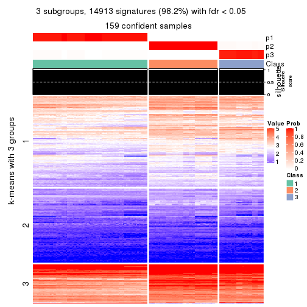</p>

</div>
<div id='tab-SD-skmeans-get-signatures-no-scale-3'>
<pre><code class="r">get_signatures(res, k = 4, scale_rows = FALSE)
</code></pre>

<p></p>

</div>
<div id='tab-SD-skmeans-get-signatures-no-scale-4'>
<pre><code class="r">get_signatures(res, k = 5, scale_rows = FALSE)
</code></pre>

<p></p>

</div>
<div id='tab-SD-skmeans-get-signatures-no-scale-5'>
<pre><code class="r">get_signatures(res, k = 6, scale_rows = FALSE)
</code></pre>

<p></p>

</div>
</div>


Compare the overlap of signatures from different k:

```r
compare_signatures(res)
```


`get_signature()` returns a data frame invisibly. TO get the list of signatures, the function
call should be assigned to a variable explicitly. In following code, if `plot` argument is set
to `FALSE`, no heatmap is plotted while only the differential analysis is performed.

```r
# code only for demonstration
tb = get_signature(res, k = ..., plot = FALSE)
```

An example of the output of `tb` is:

```
#>   which_row         fdr    mean_1    mean_2 scaled_mean_1 scaled_mean_2 km
#> 1        38 0.042760348  8.373488  9.131774    -0.5533452     0.5164555  1
#> 2        40 0.018707592  7.106213  8.469186    -0.6173731     0.5762149  1
#> 3        55 0.019134737 10.221463 11.207825    -0.6159697     0.5749050  1
#> 4        59 0.006059896  5.921854  7.869574    -0.6899429     0.6439467  1
#> 5        60 0.018055526  8.928898 10.211722    -0.6204761     0.5791110  1
#> 6        98 0.009384629 15.714769 14.887706     0.6635654    -0.6193277  2
...
```

The columns in `tb` are:

1. `which_row`: row indices corresponding to the input matrix.
2. `fdr`: FDR for the differential test. 
3. `mean_x`: The mean value in group x.
4. `scaled_mean_x`: The mean value in group x after rows are scaled.
5. `km`: Row groups if k-means clustering is applied to rows.


UMAP plot which shows how samples are separated.


<script>
$( function() {
	$( '#tabs-SD-skmeans-dimension-reduction' ).tabs();
} );
</script>
<div id='tabs-SD-skmeans-dimension-reduction'>
<ul>
<li><a href='#tab-SD-skmeans-dimension-reduction-1'>k = 2</a></li>
<li><a href='#tab-SD-skmeans-dimension-reduction-2'>k = 3</a></li>
<li><a href='#tab-SD-skmeans-dimension-reduction-3'>k = 4</a></li>
<li><a href='#tab-SD-skmeans-dimension-reduction-4'>k = 5</a></li>
<li><a href='#tab-SD-skmeans-dimension-reduction-5'>k = 6</a></li>
</ul>
<div id='tab-SD-skmeans-dimension-reduction-1'>
<pre><code class="r">dimension_reduction(res, k = 2, method = &quot;UMAP&quot;)
</code></pre>

<p></p>

</div>
<div id='tab-SD-skmeans-dimension-reduction-2'>
<pre><code class="r">dimension_reduction(res, k = 3, method = &quot;UMAP&quot;)
</code></pre>

<p></p>

</div>
<div id='tab-SD-skmeans-dimension-reduction-3'>
<pre><code class="r">dimension_reduction(res, k = 4, method = &quot;UMAP&quot;)
</code></pre>

<p></p>

</div>
<div id='tab-SD-skmeans-dimension-reduction-4'>
<pre><code class="r">dimension_reduction(res, k = 5, method = &quot;UMAP&quot;)
</code></pre>

<p></p>

</div>
<div id='tab-SD-skmeans-dimension-reduction-5'>
<pre><code class="r">dimension_reduction(res, k = 6, method = &quot;UMAP&quot;)
</code></pre>

<p></p>

</div>
</div>


Following heatmap shows how subgroups are split when increasing `k`:

```r
collect_classes(res)
```


If matrix rows can be associated to genes, consider to use `GO_Enrichment(res,
...)` to perform function enrichment for the signature genes.


 

---------------------------------------------------


### SD:pam*


The object with results only for a single top-value method and a single partition method 
can be extracted as:

```r
res = res_list["SD", "pam"]
# you can also extract it by
# res = res_list["SD:pam"]
```

A summary of `res` and all the functions that can be applied to it:

```r
res
```

```
#> A 'ConsensusPartition' object with k = 2, 3, 4, 5, 6.
#>   On a matrix with 15185 rows and 159 columns.
#>   Top rows (1000, 2000, 3000, 4000, 5000) are extracted by 'SD' method.
#>   Subgroups are detected by 'pam' method.
#>   Performed in total 1250 partitions by row resampling.
#>   Best k for subgroups seems to be 6.
#> 
#> Following methods can be applied to this 'ConsensusPartition' object:
#>  [1] "cola_report"             "collect_classes"         "collect_plots"          
#>  [4] "collect_stats"           "colnames"                "compare_signatures"     
#>  [7] "consensus_heatmap"       "dimension_reduction"     "functional_enrichment"  
#> [10] "get_anno_col"            "get_anno"                "get_classes"            
#> [13] "get_consensus"           "get_matrix"              "get_membership"         
#> [16] "get_param"               "get_signatures"          "get_stats"              
#> [19] "is_best_k"               "is_stable_k"             "membership_heatmap"     
#> [22] "ncol"                    "nrow"                    "plot_ecdf"              
#> [25] "rownames"                "select_partition_number" "show"                   
#> [28] "suggest_best_k"          "test_to_known_factors"
```

`collect_plots()` function collects all the plots made from `res` for all `k` (number of partitions)
into one single page to provide an easy and fast comparison between different `k`.

```r
collect_plots(res)
```


The plots are:

- The first row: a plot of the ECDF (Empirical cumulative distribution
  function) curves of the consensus matrix for each `k` and the heatmap of
  predicted classes for each `k`.
- The second row: heatmaps of the consensus matrix for each `k`.
- The third row: heatmaps of the membership matrix for each `k`.
- The fouth row: heatmaps of the signatures for each `k`.

All the plots in panels can be made by individual functions and they are
plotted later in this section.

`select_partition_number()` produces several plots showing different
statistics for choosing "optimized" `k`. There are following statistics:

- ECDF curves of the consensus matrix for each `k`;
- 1-PAC. [The PAC
  score](https://en.wikipedia.org/wiki/Consensus_clustering#Over-interpretation_potential_of_consensus_clustering)
  measures the proportion of the ambiguous subgrouping.
- Mean silhouette score.
- Concordance. The mean probability of fiting the consensus class ids in all
  partitions.
- Area increased. Denote $A_k$ as the area under the ECDF curve for current
  `k`, the area increased is defined as $A_k - A_{k-1}$.
- Rand index. The percent of pairs of samples that are both in a same cluster
  or both are not in a same cluster in the partition of k and k-1.
- Jaccard index. The ratio of pairs of samples are both in a same cluster in
  the partition of k and k-1 and the pairs of samples are both in a same
  cluster in the partition k or k-1.

The detailed explanations of these statistics can be found in [the cola
vignette](http://bioconductor.org/packages/devel/bioc/vignettes/cola/inst/doc/cola.html#toc_13).

Generally speaking, lower PAC score, higher mean silhouette score or higher
concordance corresponds to better partition. Rand index and Jaccard index
measure how similar the current partition is compared to partition with `k-1`.
If they are too similar, we won't accept `k` is better than `k-1`.

```r
select_partition_number(res)
```


The numeric values for all these statistics can be obtained by `get_stats()`.

```r
get_stats(res)
```

```
#>   k 1-PAC mean_silhouette concordance area_increased  Rand Jaccard
#> 2 2 1.000           1.000       1.000         0.5036 0.497   0.497
#> 3 3 0.751           0.910       0.829         0.2455 0.877   0.753
#> 4 4 1.000           0.996       0.998         0.1984 0.874   0.663
#> 5 5 0.928           0.907       0.927         0.0253 0.896   0.644
#> 6 6 0.924           0.881       0.914         0.0268 0.894   0.619
```

`suggest_best_k()` suggests the best $k$ based on these statistics. The rules are as follows:

- All $k$ with Jaccard index larger than 0.95 are removed because the increase of
  the partition number does not provides enough extra information. If all $k$ are removed,
  the best $k$ is assigned by `NA`.
- For $k$ with 1-PAC larger than 0.9, the maximal $k$ is taken as the "best k". Other $k$ is called "optional k".
- If it does not fit the second rule. The $k$ with the highest vote of highest
  1-PAC, mean silhouette and concordance is taken as the "best k".

```r
suggest_best_k(res)
```

```
#> [1] 6
#> attr(,"optional")
#> [1] 2 4 5
```

There is also optional best $k$ = 2 4 5 that is worth to check.

Following shows the table of the partitions (You need to click the **show/hide
code output** link to see it). The membership matrix (columns with name `p*`)
is inferred by
[`clue::cl_consensus()`](https://www.rdocumentation.org/link/cl_consensus?package=clue)
function with the `SE` method. Basically the value in the membership matrix
represents the probability to belong to a certain group. The finall class
label for an item is determined with the group with highest probability it
belongs to.

In `get_classes()` function, the entropy is calculated from the membership
matrix and the silhouette score is calculated from the consensus matrix.


<script>
$( function() {
	$( '#tabs-SD-pam-get-classes' ).tabs();
} );
</script>
<div id='tabs-SD-pam-get-classes'>
<ul>
<li><a href='#tab-SD-pam-get-classes-1'>k = 2</a></li>
<li><a href='#tab-SD-pam-get-classes-2'>k = 3</a></li>
<li><a href='#tab-SD-pam-get-classes-3'>k = 4</a></li>
<li><a href='#tab-SD-pam-get-classes-4'>k = 5</a></li>
<li><a href='#tab-SD-pam-get-classes-5'>k = 6</a></li>
</ul>

<div id='tab-SD-pam-get-classes-1'>
<p><a id='tab-SD-pam-get-classes-1-a' style='color:#0366d6' href='#'>show/hide code output</a></p>
<pre><code class="r">cbind(get_classes(res, k = 2), get_membership(res, k = 2))
</code></pre>

<pre><code>#&gt;            class entropy silhouette p1 p2
#&gt; SRR1706767     1       0          1  1  0
#&gt; SRR1706768     1       0          1  1  0
#&gt; SRR1706769     1       0          1  1  0
#&gt; SRR1706770     1       0          1  1  0
#&gt; SRR1706771     1       0          1  1  0
#&gt; SRR1706772     1       0          1  1  0
#&gt; SRR1706773     1       0          1  1  0
#&gt; SRR1706774     1       0          1  1  0
#&gt; SRR1706775     1       0          1  1  0
#&gt; SRR1706776     1       0          1  1  0
#&gt; SRR1706777     1       0          1  1  0
#&gt; SRR1706778     1       0          1  1  0
#&gt; SRR1706779     1       0          1  1  0
#&gt; SRR1706780     1       0          1  1  0
#&gt; SRR1706781     1       0          1  1  0
#&gt; SRR1706782     1       0          1  1  0
#&gt; SRR1706783     1       0          1  1  0
#&gt; SRR1706784     1       0          1  1  0
#&gt; SRR1706785     1       0          1  1  0
#&gt; SRR1706786     1       0          1  1  0
#&gt; SRR1706787     1       0          1  1  0
#&gt; SRR1706788     1       0          1  1  0
#&gt; SRR1706789     1       0          1  1  0
#&gt; SRR1706790     1       0          1  1  0
#&gt; SRR1706791     1       0          1  1  0
#&gt; SRR1706792     1       0          1  1  0
#&gt; SRR1706793     1       0          1  1  0
#&gt; SRR1706794     1       0          1  1  0
#&gt; SRR1706795     1       0          1  1  0
#&gt; SRR1706796     1       0          1  1  0
#&gt; SRR1706797     1       0          1  1  0
#&gt; SRR1706798     1       0          1  1  0
#&gt; SRR1706799     1       0          1  1  0
#&gt; SRR1706800     1       0          1  1  0
#&gt; SRR1706801     1       0          1  1  0
#&gt; SRR1706802     1       0          1  1  0
#&gt; SRR1706803     1       0          1  1  0
#&gt; SRR1706804     1       0          1  1  0
#&gt; SRR1706805     1       0          1  1  0
#&gt; SRR1706806     1       0          1  1  0
#&gt; SRR1706811     1       0          1  1  0
#&gt; SRR1706812     1       0          1  1  0
#&gt; SRR1706813     1       0          1  1  0
#&gt; SRR1706814     1       0          1  1  0
#&gt; SRR1706807     1       0          1  1  0
#&gt; SRR1706808     1       0          1  1  0
#&gt; SRR1706809     1       0          1  1  0
#&gt; SRR1706810     1       0          1  1  0
#&gt; SRR1706815     1       0          1  1  0
#&gt; SRR1706816     1       0          1  1  0
#&gt; SRR1706817     1       0          1  1  0
#&gt; SRR1706818     1       0          1  1  0
#&gt; SRR1706819     1       0          1  1  0
#&gt; SRR1706820     1       0          1  1  0
#&gt; SRR1706821     1       0          1  1  0
#&gt; SRR1706822     1       0          1  1  0
#&gt; SRR1706823     1       0          1  1  0
#&gt; SRR1706824     1       0          1  1  0
#&gt; SRR1706825     1       0          1  1  0
#&gt; SRR1706826     1       0          1  1  0
#&gt; SRR1706827     1       0          1  1  0
#&gt; SRR1706828     1       0          1  1  0
#&gt; SRR1706829     1       0          1  1  0
#&gt; SRR1706830     1       0          1  1  0
#&gt; SRR1706835     1       0          1  1  0
#&gt; SRR1706836     1       0          1  1  0
#&gt; SRR1706837     1       0          1  1  0
#&gt; SRR1706838     1       0          1  1  0
#&gt; SRR1706831     1       0          1  1  0
#&gt; SRR1706832     1       0          1  1  0
#&gt; SRR1706833     1       0          1  1  0
#&gt; SRR1706834     1       0          1  1  0
#&gt; SRR1706839     1       0          1  1  0
#&gt; SRR1706840     1       0          1  1  0
#&gt; SRR1706841     1       0          1  1  0
#&gt; SRR1706842     1       0          1  1  0
#&gt; SRR1706847     2       0          1  0  1
#&gt; SRR1706848     2       0          1  0  1
#&gt; SRR1706849     2       0          1  0  1
#&gt; SRR1706850     2       0          1  0  1
#&gt; SRR1706843     1       0          1  1  0
#&gt; SRR1706844     1       0          1  1  0
#&gt; SRR1706845     1       0          1  1  0
#&gt; SRR1706846     1       0          1  1  0
#&gt; SRR1706851     2       0          1  0  1
#&gt; SRR1706852     2       0          1  0  1
#&gt; SRR1706853     2       0          1  0  1
#&gt; SRR1706854     2       0          1  0  1
#&gt; SRR1706855     2       0          1  0  1
#&gt; SRR1706856     2       0          1  0  1
#&gt; SRR1706857     2       0          1  0  1
#&gt; SRR1706858     2       0          1  0  1
#&gt; SRR1706859     2       0          1  0  1
#&gt; SRR1706860     2       0          1  0  1
#&gt; SRR1706861     2       0          1  0  1
#&gt; SRR1706862     2       0          1  0  1
#&gt; SRR1706867     2       0          1  0  1
#&gt; SRR1706869     2       0          1  0  1
#&gt; SRR1706870     2       0          1  0  1
#&gt; SRR1706863     2       0          1  0  1
#&gt; SRR1706864     2       0          1  0  1
#&gt; SRR1706865     2       0          1  0  1
#&gt; SRR1706866     2       0          1  0  1
#&gt; SRR1706871     2       0          1  0  1
#&gt; SRR1706872     2       0          1  0  1
#&gt; SRR1706873     2       0          1  0  1
#&gt; SRR1706874     2       0          1  0  1
#&gt; SRR1706879     2       0          1  0  1
#&gt; SRR1706880     2       0          1  0  1
#&gt; SRR1706881     2       0          1  0  1
#&gt; SRR1706882     2       0          1  0  1
#&gt; SRR1706883     2       0          1  0  1
#&gt; SRR1706884     2       0          1  0  1
#&gt; SRR1706885     2       0          1  0  1
#&gt; SRR1706886     2       0          1  0  1
#&gt; SRR1706875     2       0          1  0  1
#&gt; SRR1706876     2       0          1  0  1
#&gt; SRR1706877     2       0          1  0  1
#&gt; SRR1706878     2       0          1  0  1
#&gt; SRR1706887     2       0          1  0  1
#&gt; SRR1706888     2       0          1  0  1
#&gt; SRR1706889     2       0          1  0  1
#&gt; SRR1706890     2       0          1  0  1
#&gt; SRR1706891     2       0          1  0  1
#&gt; SRR1706892     2       0          1  0  1
#&gt; SRR1706893     2       0          1  0  1
#&gt; SRR1706894     2       0          1  0  1
#&gt; SRR1706895     2       0          1  0  1
#&gt; SRR1706896     2       0          1  0  1
#&gt; SRR1706897     2       0          1  0  1
#&gt; SRR1706898     2       0          1  0  1
#&gt; SRR1706899     2       0          1  0  1
#&gt; SRR1706900     2       0          1  0  1
#&gt; SRR1706901     2       0          1  0  1
#&gt; SRR1706902     2       0          1  0  1
#&gt; SRR1706907     2       0          1  0  1
#&gt; SRR1706908     2       0          1  0  1
#&gt; SRR1706909     2       0          1  0  1
#&gt; SRR1706910     2       0          1  0  1
#&gt; SRR1706903     2       0          1  0  1
#&gt; SRR1706904     2       0          1  0  1
#&gt; SRR1706905     2       0          1  0  1
#&gt; SRR1706906     2       0          1  0  1
#&gt; SRR1706911     2       0          1  0  1
#&gt; SRR1706912     2       0          1  0  1
#&gt; SRR1706913     2       0          1  0  1
#&gt; SRR1706914     2       0          1  0  1
#&gt; SRR1706919     2       0          1  0  1
#&gt; SRR1706920     2       0          1  0  1
#&gt; SRR1706921     2       0          1  0  1
#&gt; SRR1706922     2       0          1  0  1
#&gt; SRR1706915     2       0          1  0  1
#&gt; SRR1706916     2       0          1  0  1
#&gt; SRR1706917     2       0          1  0  1
#&gt; SRR1706918     2       0          1  0  1
#&gt; SRR1706923     2       0          1  0  1
#&gt; SRR1706924     2       0          1  0  1
#&gt; SRR1706925     2       0          1  0  1
#&gt; SRR1706926     2       0          1  0  1
</code></pre>

<script>
$('#tab-SD-pam-get-classes-1-a').parent().next().next().hide();
$('#tab-SD-pam-get-classes-1-a').click(function(){
  $('#tab-SD-pam-get-classes-1-a').parent().next().next().toggle();
  return(false);
});
</script>
</div>

<div id='tab-SD-pam-get-classes-2'>
<p><a id='tab-SD-pam-get-classes-2-a' style='color:#0366d6' href='#'>show/hide code output</a></p>
<pre><code class="r">cbind(get_classes(res, k = 3), get_membership(res, k = 3))
</code></pre>

<pre><code>#&gt;            class entropy silhouette   p1    p2    p3
#&gt; SRR1706767     1   0.000      0.805 1.00 0.000 0.000
#&gt; SRR1706768     1   0.000      0.805 1.00 0.000 0.000
#&gt; SRR1706769     1   0.000      0.805 1.00 0.000 0.000
#&gt; SRR1706770     1   0.000      0.805 1.00 0.000 0.000
#&gt; SRR1706771     1   0.000      0.805 1.00 0.000 0.000
#&gt; SRR1706772     1   0.000      0.805 1.00 0.000 0.000
#&gt; SRR1706773     1   0.000      0.805 1.00 0.000 0.000
#&gt; SRR1706774     1   0.000      0.805 1.00 0.000 0.000
#&gt; SRR1706775     1   0.604      0.844 0.62 0.000 0.380
#&gt; SRR1706776     1   0.604      0.844 0.62 0.000 0.380
#&gt; SRR1706777     1   0.604      0.844 0.62 0.000 0.380
#&gt; SRR1706778     1   0.604      0.844 0.62 0.000 0.380
#&gt; SRR1706779     1   0.604      0.844 0.62 0.000 0.380
#&gt; SRR1706780     1   0.604      0.844 0.62 0.000 0.380
#&gt; SRR1706781     1   0.604      0.844 0.62 0.000 0.380
#&gt; SRR1706782     1   0.604      0.844 0.62 0.000 0.380
#&gt; SRR1706783     1   0.604      0.844 0.62 0.000 0.380
#&gt; SRR1706784     1   0.604      0.844 0.62 0.000 0.380
#&gt; SRR1706785     1   0.604      0.844 0.62 0.000 0.380
#&gt; SRR1706786     1   0.604      0.844 0.62 0.000 0.380
#&gt; SRR1706787     1   0.000      0.805 1.00 0.000 0.000
#&gt; SRR1706788     1   0.000      0.805 1.00 0.000 0.000
#&gt; SRR1706789     1   0.000      0.805 1.00 0.000 0.000
#&gt; SRR1706790     1   0.000      0.805 1.00 0.000 0.000
#&gt; SRR1706791     1   0.000      0.805 1.00 0.000 0.000
#&gt; SRR1706792     1   0.000      0.805 1.00 0.000 0.000
#&gt; SRR1706793     1   0.000      0.805 1.00 0.000 0.000
#&gt; SRR1706794     1   0.000      0.805 1.00 0.000 0.000
#&gt; SRR1706795     1   0.604      0.844 0.62 0.000 0.380
#&gt; SRR1706796     1   0.604      0.844 0.62 0.000 0.380
#&gt; SRR1706797     1   0.604      0.844 0.62 0.000 0.380
#&gt; SRR1706798     1   0.604      0.844 0.62 0.000 0.380
#&gt; SRR1706799     1   0.604      0.844 0.62 0.000 0.380
#&gt; SRR1706800     1   0.604      0.844 0.62 0.000 0.380
#&gt; SRR1706801     1   0.604      0.844 0.62 0.000 0.380
#&gt; SRR1706802     1   0.604      0.844 0.62 0.000 0.380
#&gt; SRR1706803     1   0.604      0.844 0.62 0.000 0.380
#&gt; SRR1706804     1   0.604      0.844 0.62 0.000 0.380
#&gt; SRR1706805     1   0.604      0.844 0.62 0.000 0.380
#&gt; SRR1706806     1   0.604      0.844 0.62 0.000 0.380
#&gt; SRR1706811     1   0.000      0.805 1.00 0.000 0.000
#&gt; SRR1706812     1   0.000      0.805 1.00 0.000 0.000
#&gt; SRR1706813     1   0.000      0.805 1.00 0.000 0.000
#&gt; SRR1706814     1   0.000      0.805 1.00 0.000 0.000
#&gt; SRR1706807     1   0.000      0.805 1.00 0.000 0.000
#&gt; SRR1706808     1   0.000      0.805 1.00 0.000 0.000
#&gt; SRR1706809     1   0.000      0.805 1.00 0.000 0.000
#&gt; SRR1706810     1   0.000      0.805 1.00 0.000 0.000
#&gt; SRR1706815     1   0.604      0.844 0.62 0.000 0.380
#&gt; SRR1706816     1   0.604      0.844 0.62 0.000 0.380
#&gt; SRR1706817     1   0.604      0.844 0.62 0.000 0.380
#&gt; SRR1706818     1   0.604      0.844 0.62 0.000 0.380
#&gt; SRR1706819     1   0.604      0.844 0.62 0.000 0.380
#&gt; SRR1706820     1   0.604      0.844 0.62 0.000 0.380
#&gt; SRR1706821     1   0.604      0.844 0.62 0.000 0.380
#&gt; SRR1706822     1   0.604      0.844 0.62 0.000 0.380
#&gt; SRR1706823     1   0.604      0.844 0.62 0.000 0.380
#&gt; SRR1706824     1   0.604      0.844 0.62 0.000 0.380
#&gt; SRR1706825     1   0.604      0.844 0.62 0.000 0.380
#&gt; SRR1706826     1   0.604      0.844 0.62 0.000 0.380
#&gt; SRR1706827     1   0.000      0.805 1.00 0.000 0.000
#&gt; SRR1706828     1   0.000      0.805 1.00 0.000 0.000
#&gt; SRR1706829     1   0.000      0.805 1.00 0.000 0.000
#&gt; SRR1706830     1   0.000      0.805 1.00 0.000 0.000
#&gt; SRR1706835     1   0.000      0.805 1.00 0.000 0.000
#&gt; SRR1706836     1   0.000      0.805 1.00 0.000 0.000
#&gt; SRR1706837     1   0.000      0.805 1.00 0.000 0.000
#&gt; SRR1706838     1   0.000      0.805 1.00 0.000 0.000
#&gt; SRR1706831     1   0.000      0.805 1.00 0.000 0.000
#&gt; SRR1706832     1   0.000      0.805 1.00 0.000 0.000
#&gt; SRR1706833     1   0.000      0.805 1.00 0.000 0.000
#&gt; SRR1706834     1   0.000      0.805 1.00 0.000 0.000
#&gt; SRR1706839     1   0.604      0.844 0.62 0.000 0.380
#&gt; SRR1706840     1   0.604      0.844 0.62 0.000 0.380
#&gt; SRR1706841     1   0.604      0.844 0.62 0.000 0.380
#&gt; SRR1706842     1   0.604      0.844 0.62 0.000 0.380
#&gt; SRR1706847     3   0.604      0.994 0.00 0.380 0.620
#&gt; SRR1706848     3   0.604      0.994 0.00 0.380 0.620
#&gt; SRR1706849     3   0.604      0.994 0.00 0.380 0.620
#&gt; SRR1706850     3   0.604      0.994 0.00 0.380 0.620
#&gt; SRR1706843     1   0.604      0.844 0.62 0.000 0.380
#&gt; SRR1706844     1   0.604      0.844 0.62 0.000 0.380
#&gt; SRR1706845     1   0.604      0.844 0.62 0.000 0.380
#&gt; SRR1706846     1   0.604      0.844 0.62 0.000 0.380
#&gt; SRR1706851     3   0.604      0.994 0.00 0.380 0.620
#&gt; SRR1706852     3   0.604      0.994 0.00 0.380 0.620
#&gt; SRR1706853     3   0.604      0.994 0.00 0.380 0.620
#&gt; SRR1706854     3   0.604      0.994 0.00 0.380 0.620
#&gt; SRR1706855     2   0.000      1.000 0.00 1.000 0.000
#&gt; SRR1706856     2   0.000      1.000 0.00 1.000 0.000
#&gt; SRR1706857     2   0.000      1.000 0.00 1.000 0.000
#&gt; SRR1706858     2   0.000      1.000 0.00 1.000 0.000
#&gt; SRR1706859     2   0.000      1.000 0.00 1.000 0.000
#&gt; SRR1706860     2   0.000      1.000 0.00 1.000 0.000
#&gt; SRR1706861     2   0.000      1.000 0.00 1.000 0.000
#&gt; SRR1706862     2   0.000      1.000 0.00 1.000 0.000
#&gt; SRR1706867     3   0.604      0.994 0.00 0.380 0.620
#&gt; SRR1706869     3   0.604      0.994 0.00 0.380 0.620
#&gt; SRR1706870     3   0.604      0.994 0.00 0.380 0.620
#&gt; SRR1706863     2   0.000      1.000 0.00 1.000 0.000
#&gt; SRR1706864     2   0.000      1.000 0.00 1.000 0.000
#&gt; SRR1706865     2   0.000      1.000 0.00 1.000 0.000
#&gt; SRR1706866     2   0.000      1.000 0.00 1.000 0.000
#&gt; SRR1706871     3   0.604      0.994 0.00 0.380 0.620
#&gt; SRR1706872     3   0.604      0.994 0.00 0.380 0.620
#&gt; SRR1706873     3   0.604      0.994 0.00 0.380 0.620
#&gt; SRR1706874     3   0.604      0.994 0.00 0.380 0.620
#&gt; SRR1706879     2   0.000      1.000 0.00 1.000 0.000
#&gt; SRR1706880     2   0.000      1.000 0.00 1.000 0.000
#&gt; SRR1706881     2   0.000      1.000 0.00 1.000 0.000
#&gt; SRR1706882     2   0.000      1.000 0.00 1.000 0.000
#&gt; SRR1706883     2   0.000      1.000 0.00 1.000 0.000
#&gt; SRR1706884     2   0.000      1.000 0.00 1.000 0.000
#&gt; SRR1706885     2   0.000      1.000 0.00 1.000 0.000
#&gt; SRR1706886     2   0.000      1.000 0.00 1.000 0.000
#&gt; SRR1706875     2   0.000      1.000 0.00 1.000 0.000
#&gt; SRR1706876     2   0.000      1.000 0.00 1.000 0.000
#&gt; SRR1706877     2   0.000      1.000 0.00 1.000 0.000
#&gt; SRR1706878     2   0.000      1.000 0.00 1.000 0.000
#&gt; SRR1706887     3   0.604      0.994 0.00 0.380 0.620
#&gt; SRR1706888     3   0.604      0.994 0.00 0.380 0.620
#&gt; SRR1706889     3   0.604      0.994 0.00 0.380 0.620
#&gt; SRR1706890     3   0.604      0.994 0.00 0.380 0.620
#&gt; SRR1706891     3   0.604      0.994 0.00 0.380 0.620
#&gt; SRR1706892     3   0.604      0.994 0.00 0.380 0.620
#&gt; SRR1706893     3   0.604      0.994 0.00 0.380 0.620
#&gt; SRR1706894     3   0.604      0.994 0.00 0.380 0.620
#&gt; SRR1706895     2   0.000      1.000 0.00 1.000 0.000
#&gt; SRR1706896     2   0.000      1.000 0.00 1.000 0.000
#&gt; SRR1706897     2   0.000      1.000 0.00 1.000 0.000
#&gt; SRR1706898     2   0.000      1.000 0.00 1.000 0.000
#&gt; SRR1706899     2   0.000      1.000 0.00 1.000 0.000
#&gt; SRR1706900     2   0.000      1.000 0.00 1.000 0.000
#&gt; SRR1706901     2   0.000      1.000 0.00 1.000 0.000
#&gt; SRR1706902     2   0.000      1.000 0.00 1.000 0.000
#&gt; SRR1706907     3   0.604      0.994 0.00 0.380 0.620
#&gt; SRR1706908     3   0.604      0.994 0.00 0.380 0.620
#&gt; SRR1706909     3   0.604      0.994 0.00 0.380 0.620
#&gt; SRR1706910     3   0.604      0.994 0.00 0.380 0.620
#&gt; SRR1706903     2   0.000      1.000 0.00 1.000 0.000
#&gt; SRR1706904     2   0.000      1.000 0.00 1.000 0.000
#&gt; SRR1706905     2   0.000      1.000 0.00 1.000 0.000
#&gt; SRR1706906     2   0.000      1.000 0.00 1.000 0.000
#&gt; SRR1706911     3   0.604      0.994 0.00 0.380 0.620
#&gt; SRR1706912     3   0.604      0.994 0.00 0.380 0.620
#&gt; SRR1706913     3   0.604      0.994 0.00 0.380 0.620
#&gt; SRR1706914     3   0.604      0.994 0.00 0.380 0.620
#&gt; SRR1706919     2   0.000      1.000 0.00 1.000 0.000
#&gt; SRR1706920     2   0.000      1.000 0.00 1.000 0.000
#&gt; SRR1706921     2   0.000      1.000 0.00 1.000 0.000
#&gt; SRR1706922     2   0.000      1.000 0.00 1.000 0.000
#&gt; SRR1706915     3   0.618      0.944 0.00 0.416 0.584
#&gt; SRR1706916     3   0.618      0.944 0.00 0.416 0.584
#&gt; SRR1706917     3   0.618      0.944 0.00 0.416 0.584
#&gt; SRR1706918     3   0.614      0.962 0.00 0.404 0.596
#&gt; SRR1706923     2   0.000      1.000 0.00 1.000 0.000
#&gt; SRR1706924     2   0.000      1.000 0.00 1.000 0.000
#&gt; SRR1706925     2   0.000      1.000 0.00 1.000 0.000
#&gt; SRR1706926     2   0.000      1.000 0.00 1.000 0.000
</code></pre>

<script>
$('#tab-SD-pam-get-classes-2-a').parent().next().next().hide();
$('#tab-SD-pam-get-classes-2-a').click(function(){
  $('#tab-SD-pam-get-classes-2-a').parent().next().next().toggle();
  return(false);
});
</script>
</div>

<div id='tab-SD-pam-get-classes-3'>
<p><a id='tab-SD-pam-get-classes-3-a' style='color:#0366d6' href='#'>show/hide code output</a></p>
<pre><code class="r">cbind(get_classes(res, k = 4), get_membership(res, k = 4))
</code></pre>

<pre><code>#&gt;            class entropy silhouette    p1    p2    p3    p4
#&gt; SRR1706767     4  0.0000      1.000 0.000 0.000 0.000 1.000
#&gt; SRR1706768     4  0.0000      1.000 0.000 0.000 0.000 1.000
#&gt; SRR1706769     4  0.0000      1.000 0.000 0.000 0.000 1.000
#&gt; SRR1706770     4  0.0000      1.000 0.000 0.000 0.000 1.000
#&gt; SRR1706771     4  0.0000      1.000 0.000 0.000 0.000 1.000
#&gt; SRR1706772     4  0.0000      1.000 0.000 0.000 0.000 1.000
#&gt; SRR1706773     4  0.0000      1.000 0.000 0.000 0.000 1.000
#&gt; SRR1706774     4  0.0000      1.000 0.000 0.000 0.000 1.000
#&gt; SRR1706775     1  0.0188      0.996 0.996 0.000 0.000 0.004
#&gt; SRR1706776     1  0.0188      0.996 0.996 0.000 0.000 0.004
#&gt; SRR1706777     1  0.0188      0.996 0.996 0.000 0.000 0.004
#&gt; SRR1706778     1  0.0000      1.000 1.000 0.000 0.000 0.000
#&gt; SRR1706779     1  0.0000      1.000 1.000 0.000 0.000 0.000
#&gt; SRR1706780     1  0.0000      1.000 1.000 0.000 0.000 0.000
#&gt; SRR1706781     1  0.0000      1.000 1.000 0.000 0.000 0.000
#&gt; SRR1706782     1  0.0000      1.000 1.000 0.000 0.000 0.000
#&gt; SRR1706783     1  0.0000      1.000 1.000 0.000 0.000 0.000
#&gt; SRR1706784     1  0.0000      1.000 1.000 0.000 0.000 0.000
#&gt; SRR1706785     1  0.0000      1.000 1.000 0.000 0.000 0.000
#&gt; SRR1706786     1  0.0000      1.000 1.000 0.000 0.000 0.000
#&gt; SRR1706787     4  0.0000      1.000 0.000 0.000 0.000 1.000
#&gt; SRR1706788     4  0.0000      1.000 0.000 0.000 0.000 1.000
#&gt; SRR1706789     4  0.0000      1.000 0.000 0.000 0.000 1.000
#&gt; SRR1706790     4  0.0000      1.000 0.000 0.000 0.000 1.000
#&gt; SRR1706791     4  0.0000      1.000 0.000 0.000 0.000 1.000
#&gt; SRR1706792     4  0.0000      1.000 0.000 0.000 0.000 1.000
#&gt; SRR1706793     4  0.0000      1.000 0.000 0.000 0.000 1.000
#&gt; SRR1706794     4  0.0000      1.000 0.000 0.000 0.000 1.000
#&gt; SRR1706795     1  0.0000      1.000 1.000 0.000 0.000 0.000
#&gt; SRR1706796     1  0.0000      1.000 1.000 0.000 0.000 0.000
#&gt; SRR1706797     1  0.0000      1.000 1.000 0.000 0.000 0.000
#&gt; SRR1706798     1  0.0000      1.000 1.000 0.000 0.000 0.000
#&gt; SRR1706799     1  0.0000      1.000 1.000 0.000 0.000 0.000
#&gt; SRR1706800     1  0.0000      1.000 1.000 0.000 0.000 0.000
#&gt; SRR1706801     1  0.0000      1.000 1.000 0.000 0.000 0.000
#&gt; SRR1706802     1  0.0000      1.000 1.000 0.000 0.000 0.000
#&gt; SRR1706803     1  0.0000      1.000 1.000 0.000 0.000 0.000
#&gt; SRR1706804     1  0.0000      1.000 1.000 0.000 0.000 0.000
#&gt; SRR1706805     1  0.0000      1.000 1.000 0.000 0.000 0.000
#&gt; SRR1706806     1  0.0000      1.000 1.000 0.000 0.000 0.000
#&gt; SRR1706811     4  0.0000      1.000 0.000 0.000 0.000 1.000
#&gt; SRR1706812     4  0.0000      1.000 0.000 0.000 0.000 1.000
#&gt; SRR1706813     4  0.0000      1.000 0.000 0.000 0.000 1.000
#&gt; SRR1706814     4  0.0000      1.000 0.000 0.000 0.000 1.000
#&gt; SRR1706807     4  0.0000      1.000 0.000 0.000 0.000 1.000
#&gt; SRR1706808     4  0.0000      1.000 0.000 0.000 0.000 1.000
#&gt; SRR1706809     4  0.0000      1.000 0.000 0.000 0.000 1.000
#&gt; SRR1706810     4  0.0000      1.000 0.000 0.000 0.000 1.000
#&gt; SRR1706815     1  0.0000      1.000 1.000 0.000 0.000 0.000
#&gt; SRR1706816     1  0.0000      1.000 1.000 0.000 0.000 0.000
#&gt; SRR1706817     1  0.0000      1.000 1.000 0.000 0.000 0.000
#&gt; SRR1706818     1  0.0000      1.000 1.000 0.000 0.000 0.000
#&gt; SRR1706819     1  0.0000      1.000 1.000 0.000 0.000 0.000
#&gt; SRR1706820     1  0.0000      1.000 1.000 0.000 0.000 0.000
#&gt; SRR1706821     1  0.0000      1.000 1.000 0.000 0.000 0.000
#&gt; SRR1706822     1  0.0000      1.000 1.000 0.000 0.000 0.000
#&gt; SRR1706823     1  0.0000      1.000 1.000 0.000 0.000 0.000
#&gt; SRR1706824     1  0.0000      1.000 1.000 0.000 0.000 0.000
#&gt; SRR1706825     1  0.0000      1.000 1.000 0.000 0.000 0.000
#&gt; SRR1706826     1  0.0000      1.000 1.000 0.000 0.000 0.000
#&gt; SRR1706827     4  0.0000      1.000 0.000 0.000 0.000 1.000
#&gt; SRR1706828     4  0.0000      1.000 0.000 0.000 0.000 1.000
#&gt; SRR1706829     4  0.0000      1.000 0.000 0.000 0.000 1.000
#&gt; SRR1706830     4  0.0000      1.000 0.000 0.000 0.000 1.000
#&gt; SRR1706835     4  0.0000      1.000 0.000 0.000 0.000 1.000
#&gt; SRR1706836     4  0.0000      1.000 0.000 0.000 0.000 1.000
#&gt; SRR1706837     4  0.0000      1.000 0.000 0.000 0.000 1.000
#&gt; SRR1706838     4  0.0000      1.000 0.000 0.000 0.000 1.000
#&gt; SRR1706831     4  0.0000      1.000 0.000 0.000 0.000 1.000
#&gt; SRR1706832     4  0.0000      1.000 0.000 0.000 0.000 1.000
#&gt; SRR1706833     4  0.0000      1.000 0.000 0.000 0.000 1.000
#&gt; SRR1706834     4  0.0000      1.000 0.000 0.000 0.000 1.000
#&gt; SRR1706839     1  0.0000      1.000 1.000 0.000 0.000 0.000
#&gt; SRR1706840     1  0.0000      1.000 1.000 0.000 0.000 0.000
#&gt; SRR1706841     1  0.0000      1.000 1.000 0.000 0.000 0.000
#&gt; SRR1706842     1  0.0000      1.000 1.000 0.000 0.000 0.000
#&gt; SRR1706847     3  0.0000      0.989 0.000 0.000 1.000 0.000
#&gt; SRR1706848     3  0.0000      0.989 0.000 0.000 1.000 0.000
#&gt; SRR1706849     3  0.0000      0.989 0.000 0.000 1.000 0.000
#&gt; SRR1706850     3  0.0000      0.989 0.000 0.000 1.000 0.000
#&gt; SRR1706843     1  0.0000      1.000 1.000 0.000 0.000 0.000
#&gt; SRR1706844     1  0.0000      1.000 1.000 0.000 0.000 0.000
#&gt; SRR1706845     1  0.0000      1.000 1.000 0.000 0.000 0.000
#&gt; SRR1706846     1  0.0000      1.000 1.000 0.000 0.000 0.000
#&gt; SRR1706851     3  0.0000      0.989 0.000 0.000 1.000 0.000
#&gt; SRR1706852     3  0.0000      0.989 0.000 0.000 1.000 0.000
#&gt; SRR1706853     3  0.0000      0.989 0.000 0.000 1.000 0.000
#&gt; SRR1706854     3  0.0000      0.989 0.000 0.000 1.000 0.000
#&gt; SRR1706855     2  0.0000      1.000 0.000 1.000 0.000 0.000
#&gt; SRR1706856     2  0.0000      1.000 0.000 1.000 0.000 0.000
#&gt; SRR1706857     2  0.0000      1.000 0.000 1.000 0.000 0.000
#&gt; SRR1706858     2  0.0000      1.000 0.000 1.000 0.000 0.000
#&gt; SRR1706859     2  0.0000      1.000 0.000 1.000 0.000 0.000
#&gt; SRR1706860     2  0.0000      1.000 0.000 1.000 0.000 0.000
#&gt; SRR1706861     2  0.0000      1.000 0.000 1.000 0.000 0.000
#&gt; SRR1706862     2  0.0000      1.000 0.000 1.000 0.000 0.000
#&gt; SRR1706867     3  0.0000      0.989 0.000 0.000 1.000 0.000
#&gt; SRR1706869     3  0.0000      0.989 0.000 0.000 1.000 0.000
#&gt; SRR1706870     3  0.0000      0.989 0.000 0.000 1.000 0.000
#&gt; SRR1706863     2  0.0000      1.000 0.000 1.000 0.000 0.000
#&gt; SRR1706864     2  0.0000      1.000 0.000 1.000 0.000 0.000
#&gt; SRR1706865     2  0.0000      1.000 0.000 1.000 0.000 0.000
#&gt; SRR1706866     2  0.0000      1.000 0.000 1.000 0.000 0.000
#&gt; SRR1706871     3  0.0000      0.989 0.000 0.000 1.000 0.000
#&gt; SRR1706872     3  0.0000      0.989 0.000 0.000 1.000 0.000
#&gt; SRR1706873     3  0.0000      0.989 0.000 0.000 1.000 0.000
#&gt; SRR1706874     3  0.0000      0.989 0.000 0.000 1.000 0.000
#&gt; SRR1706879     2  0.0000      1.000 0.000 1.000 0.000 0.000
#&gt; SRR1706880     2  0.0000      1.000 0.000 1.000 0.000 0.000
#&gt; SRR1706881     2  0.0000      1.000 0.000 1.000 0.000 0.000
#&gt; SRR1706882     2  0.0000      1.000 0.000 1.000 0.000 0.000
#&gt; SRR1706883     2  0.0000      1.000 0.000 1.000 0.000 0.000
#&gt; SRR1706884     2  0.0000      1.000 0.000 1.000 0.000 0.000
#&gt; SRR1706885     2  0.0000      1.000 0.000 1.000 0.000 0.000
#&gt; SRR1706886     2  0.0000      1.000 0.000 1.000 0.000 0.000
#&gt; SRR1706875     2  0.0000      1.000 0.000 1.000 0.000 0.000
#&gt; SRR1706876     2  0.0000      1.000 0.000 1.000 0.000 0.000
#&gt; SRR1706877     2  0.0000      1.000 0.000 1.000 0.000 0.000
#&gt; SRR1706878     2  0.0000      1.000 0.000 1.000 0.000 0.000
#&gt; SRR1706887     3  0.0000      0.989 0.000 0.000 1.000 0.000
#&gt; SRR1706888     3  0.0000      0.989 0.000 0.000 1.000 0.000
#&gt; SRR1706889     3  0.0000      0.989 0.000 0.000 1.000 0.000
#&gt; SRR1706890     3  0.0000      0.989 0.000 0.000 1.000 0.000
#&gt; SRR1706891     3  0.0000      0.989 0.000 0.000 1.000 0.000
#&gt; SRR1706892     3  0.0000      0.989 0.000 0.000 1.000 0.000
#&gt; SRR1706893     3  0.0000      0.989 0.000 0.000 1.000 0.000
#&gt; SRR1706894     3  0.0000      0.989 0.000 0.000 1.000 0.000
#&gt; SRR1706895     2  0.0000      1.000 0.000 1.000 0.000 0.000
#&gt; SRR1706896     2  0.0000      1.000 0.000 1.000 0.000 0.000
#&gt; SRR1706897     2  0.0000      1.000 0.000 1.000 0.000 0.000
#&gt; SRR1706898     2  0.0000      1.000 0.000 1.000 0.000 0.000
#&gt; SRR1706899     2  0.0000      1.000 0.000 1.000 0.000 0.000
#&gt; SRR1706900     2  0.0000      1.000 0.000 1.000 0.000 0.000
#&gt; SRR1706901     2  0.0000      1.000 0.000 1.000 0.000 0.000
#&gt; SRR1706902     2  0.0000      1.000 0.000 1.000 0.000 0.000
#&gt; SRR1706907     3  0.0000      0.989 0.000 0.000 1.000 0.000
#&gt; SRR1706908     3  0.0000      0.989 0.000 0.000 1.000 0.000
#&gt; SRR1706909     3  0.0000      0.989 0.000 0.000 1.000 0.000
#&gt; SRR1706910     3  0.0000      0.989 0.000 0.000 1.000 0.000
#&gt; SRR1706903     2  0.0000      1.000 0.000 1.000 0.000 0.000
#&gt; SRR1706904     2  0.0000      1.000 0.000 1.000 0.000 0.000
#&gt; SRR1706905     2  0.0000      1.000 0.000 1.000 0.000 0.000
#&gt; SRR1706906     2  0.0000      1.000 0.000 1.000 0.000 0.000
#&gt; SRR1706911     3  0.0000      0.989 0.000 0.000 1.000 0.000
#&gt; SRR1706912     3  0.0000      0.989 0.000 0.000 1.000 0.000
#&gt; SRR1706913     3  0.0000      0.989 0.000 0.000 1.000 0.000
#&gt; SRR1706914     3  0.0000      0.989 0.000 0.000 1.000 0.000
#&gt; SRR1706919     2  0.0000      1.000 0.000 1.000 0.000 0.000
#&gt; SRR1706920     2  0.0000      1.000 0.000 1.000 0.000 0.000
#&gt; SRR1706921     2  0.0000      1.000 0.000 1.000 0.000 0.000
#&gt; SRR1706922     2  0.0000      1.000 0.000 1.000 0.000 0.000
#&gt; SRR1706915     3  0.2281      0.903 0.000 0.096 0.904 0.000
#&gt; SRR1706916     3  0.1940      0.924 0.000 0.076 0.924 0.000
#&gt; SRR1706917     3  0.2216      0.907 0.000 0.092 0.908 0.000
#&gt; SRR1706918     3  0.2011      0.920 0.000 0.080 0.920 0.000
#&gt; SRR1706923     2  0.0000      1.000 0.000 1.000 0.000 0.000
#&gt; SRR1706924     2  0.0000      1.000 0.000 1.000 0.000 0.000
#&gt; SRR1706925     2  0.0000      1.000 0.000 1.000 0.000 0.000
#&gt; SRR1706926     2  0.0000      1.000 0.000 1.000 0.000 0.000
</code></pre>

<script>
$('#tab-SD-pam-get-classes-3-a').parent().next().next().hide();
$('#tab-SD-pam-get-classes-3-a').click(function(){
  $('#tab-SD-pam-get-classes-3-a').parent().next().next().toggle();
  return(false);
});
</script>
</div>

<div id='tab-SD-pam-get-classes-4'>
<p><a id='tab-SD-pam-get-classes-4-a' style='color:#0366d6' href='#'>show/hide code output</a></p>
<pre><code class="r">cbind(get_classes(res, k = 5), get_membership(res, k = 5))
</code></pre>

<pre><code>#&gt;            class entropy silhouette    p1    p2 p3    p4    p5
#&gt; SRR1706767     4  0.0000      1.000 0.000 0.000  0 1.000 0.000
#&gt; SRR1706768     4  0.0000      1.000 0.000 0.000  0 1.000 0.000
#&gt; SRR1706769     4  0.0000      1.000 0.000 0.000  0 1.000 0.000
#&gt; SRR1706770     4  0.0000      1.000 0.000 0.000  0 1.000 0.000
#&gt; SRR1706771     4  0.0000      1.000 0.000 0.000  0 1.000 0.000
#&gt; SRR1706772     4  0.0000      1.000 0.000 0.000  0 1.000 0.000
#&gt; SRR1706773     4  0.0000      1.000 0.000 0.000  0 1.000 0.000
#&gt; SRR1706774     4  0.0000      1.000 0.000 0.000  0 1.000 0.000
#&gt; SRR1706775     1  0.0162      0.996 0.996 0.000  0 0.004 0.000
#&gt; SRR1706776     1  0.0162      0.996 0.996 0.000  0 0.004 0.000
#&gt; SRR1706777     1  0.0162      0.995 0.996 0.000  0 0.004 0.000
#&gt; SRR1706778     1  0.0000      1.000 1.000 0.000  0 0.000 0.000
#&gt; SRR1706779     1  0.0000      1.000 1.000 0.000  0 0.000 0.000
#&gt; SRR1706780     1  0.0000      1.000 1.000 0.000  0 0.000 0.000
#&gt; SRR1706781     1  0.0000      1.000 1.000 0.000  0 0.000 0.000
#&gt; SRR1706782     1  0.0000      1.000 1.000 0.000  0 0.000 0.000
#&gt; SRR1706783     1  0.0000      1.000 1.000 0.000  0 0.000 0.000
#&gt; SRR1706784     1  0.0000      1.000 1.000 0.000  0 0.000 0.000
#&gt; SRR1706785     1  0.0000      1.000 1.000 0.000  0 0.000 0.000
#&gt; SRR1706786     1  0.0000      1.000 1.000 0.000  0 0.000 0.000
#&gt; SRR1706787     4  0.0000      1.000 0.000 0.000  0 1.000 0.000
#&gt; SRR1706788     4  0.0000      1.000 0.000 0.000  0 1.000 0.000
#&gt; SRR1706789     4  0.0000      1.000 0.000 0.000  0 1.000 0.000
#&gt; SRR1706790     4  0.0000      1.000 0.000 0.000  0 1.000 0.000
#&gt; SRR1706791     4  0.0000      1.000 0.000 0.000  0 1.000 0.000
#&gt; SRR1706792     4  0.0000      1.000 0.000 0.000  0 1.000 0.000
#&gt; SRR1706793     4  0.0000      1.000 0.000 0.000  0 1.000 0.000
#&gt; SRR1706794     4  0.0000      1.000 0.000 0.000  0 1.000 0.000
#&gt; SRR1706795     1  0.0000      1.000 1.000 0.000  0 0.000 0.000
#&gt; SRR1706796     1  0.0000      1.000 1.000 0.000  0 0.000 0.000
#&gt; SRR1706797     1  0.0000      1.000 1.000 0.000  0 0.000 0.000
#&gt; SRR1706798     1  0.0000      1.000 1.000 0.000  0 0.000 0.000
#&gt; SRR1706799     1  0.0000      1.000 1.000 0.000  0 0.000 0.000
#&gt; SRR1706800     1  0.0000      1.000 1.000 0.000  0 0.000 0.000
#&gt; SRR1706801     1  0.0000      1.000 1.000 0.000  0 0.000 0.000
#&gt; SRR1706802     1  0.0000      1.000 1.000 0.000  0 0.000 0.000
#&gt; SRR1706803     1  0.0000      1.000 1.000 0.000  0 0.000 0.000
#&gt; SRR1706804     1  0.0000      1.000 1.000 0.000  0 0.000 0.000
#&gt; SRR1706805     1  0.0000      1.000 1.000 0.000  0 0.000 0.000
#&gt; SRR1706806     1  0.0000      1.000 1.000 0.000  0 0.000 0.000
#&gt; SRR1706811     4  0.0000      1.000 0.000 0.000  0 1.000 0.000
#&gt; SRR1706812     4  0.0000      1.000 0.000 0.000  0 1.000 0.000
#&gt; SRR1706813     4  0.0000      1.000 0.000 0.000  0 1.000 0.000
#&gt; SRR1706814     4  0.0000      1.000 0.000 0.000  0 1.000 0.000
#&gt; SRR1706807     4  0.0000      1.000 0.000 0.000  0 1.000 0.000
#&gt; SRR1706808     4  0.0000      1.000 0.000 0.000  0 1.000 0.000
#&gt; SRR1706809     4  0.0000      1.000 0.000 0.000  0 1.000 0.000
#&gt; SRR1706810     4  0.0000      1.000 0.000 0.000  0 1.000 0.000
#&gt; SRR1706815     1  0.0000      1.000 1.000 0.000  0 0.000 0.000
#&gt; SRR1706816     1  0.0000      1.000 1.000 0.000  0 0.000 0.000
#&gt; SRR1706817     1  0.0000      1.000 1.000 0.000  0 0.000 0.000
#&gt; SRR1706818     1  0.0000      1.000 1.000 0.000  0 0.000 0.000
#&gt; SRR1706819     1  0.0000      1.000 1.000 0.000  0 0.000 0.000
#&gt; SRR1706820     1  0.0000      1.000 1.000 0.000  0 0.000 0.000
#&gt; SRR1706821     1  0.0000      1.000 1.000 0.000  0 0.000 0.000
#&gt; SRR1706822     1  0.0000      1.000 1.000 0.000  0 0.000 0.000
#&gt; SRR1706823     1  0.0000      1.000 1.000 0.000  0 0.000 0.000
#&gt; SRR1706824     1  0.0000      1.000 1.000 0.000  0 0.000 0.000
#&gt; SRR1706825     1  0.0000      1.000 1.000 0.000  0 0.000 0.000
#&gt; SRR1706826     1  0.0000      1.000 1.000 0.000  0 0.000 0.000
#&gt; SRR1706827     4  0.0000      1.000 0.000 0.000  0 1.000 0.000
#&gt; SRR1706828     4  0.0000      1.000 0.000 0.000  0 1.000 0.000
#&gt; SRR1706829     4  0.0000      1.000 0.000 0.000  0 1.000 0.000
#&gt; SRR1706830     4  0.0000      1.000 0.000 0.000  0 1.000 0.000
#&gt; SRR1706835     4  0.0000      1.000 0.000 0.000  0 1.000 0.000
#&gt; SRR1706836     4  0.0000      1.000 0.000 0.000  0 1.000 0.000
#&gt; SRR1706837     4  0.0000      1.000 0.000 0.000  0 1.000 0.000
#&gt; SRR1706838     4  0.0000      1.000 0.000 0.000  0 1.000 0.000
#&gt; SRR1706831     4  0.0000      1.000 0.000 0.000  0 1.000 0.000
#&gt; SRR1706832     4  0.0000      1.000 0.000 0.000  0 1.000 0.000
#&gt; SRR1706833     4  0.0000      1.000 0.000 0.000  0 1.000 0.000
#&gt; SRR1706834     4  0.0000      1.000 0.000 0.000  0 1.000 0.000
#&gt; SRR1706839     1  0.0000      1.000 1.000 0.000  0 0.000 0.000
#&gt; SRR1706840     1  0.0000      1.000 1.000 0.000  0 0.000 0.000
#&gt; SRR1706841     1  0.0000      1.000 1.000 0.000  0 0.000 0.000
#&gt; SRR1706842     1  0.0000      1.000 1.000 0.000  0 0.000 0.000
#&gt; SRR1706847     3  0.0000      1.000 0.000 0.000  1 0.000 0.000
#&gt; SRR1706848     3  0.0000      1.000 0.000 0.000  1 0.000 0.000
#&gt; SRR1706849     3  0.0000      1.000 0.000 0.000  1 0.000 0.000
#&gt; SRR1706850     3  0.0000      1.000 0.000 0.000  1 0.000 0.000
#&gt; SRR1706843     1  0.0000      1.000 1.000 0.000  0 0.000 0.000
#&gt; SRR1706844     1  0.0000      1.000 1.000 0.000  0 0.000 0.000
#&gt; SRR1706845     1  0.0000      1.000 1.000 0.000  0 0.000 0.000
#&gt; SRR1706846     1  0.0000      1.000 1.000 0.000  0 0.000 0.000
#&gt; SRR1706851     2  0.4192      0.679 0.000 0.596  0 0.000 0.404
#&gt; SRR1706852     2  0.4192      0.679 0.000 0.596  0 0.000 0.404
#&gt; SRR1706853     2  0.4192      0.679 0.000 0.596  0 0.000 0.404
#&gt; SRR1706854     2  0.4192      0.679 0.000 0.596  0 0.000 0.404
#&gt; SRR1706855     2  0.0000      0.710 0.000 1.000  0 0.000 0.000
#&gt; SRR1706856     2  0.0000      0.710 0.000 1.000  0 0.000 0.000
#&gt; SRR1706857     2  0.0000      0.710 0.000 1.000  0 0.000 0.000
#&gt; SRR1706858     2  0.0000      0.710 0.000 1.000  0 0.000 0.000
#&gt; SRR1706859     2  0.1121      0.645 0.000 0.956  0 0.000 0.044
#&gt; SRR1706860     2  0.1478      0.609 0.000 0.936  0 0.000 0.064
#&gt; SRR1706861     2  0.0794      0.670 0.000 0.972  0 0.000 0.028
#&gt; SRR1706862     2  0.1410      0.617 0.000 0.940  0 0.000 0.060
#&gt; SRR1706867     3  0.0000      1.000 0.000 0.000  1 0.000 0.000
#&gt; SRR1706869     3  0.0000      1.000 0.000 0.000  1 0.000 0.000
#&gt; SRR1706870     3  0.0000      1.000 0.000 0.000  1 0.000 0.000
#&gt; SRR1706863     5  0.4192      1.000 0.000 0.404  0 0.000 0.596
#&gt; SRR1706864     5  0.4192      1.000 0.000 0.404  0 0.000 0.596
#&gt; SRR1706865     5  0.4192      1.000 0.000 0.404  0 0.000 0.596
#&gt; SRR1706866     5  0.4192      1.000 0.000 0.404  0 0.000 0.596
#&gt; SRR1706871     2  0.4192      0.679 0.000 0.596  0 0.000 0.404
#&gt; SRR1706872     2  0.4192      0.679 0.000 0.596  0 0.000 0.404
#&gt; SRR1706873     2  0.4192      0.679 0.000 0.596  0 0.000 0.404
#&gt; SRR1706874     2  0.4192      0.679 0.000 0.596  0 0.000 0.404
#&gt; SRR1706879     2  0.0000      0.710 0.000 1.000  0 0.000 0.000
#&gt; SRR1706880     2  0.0000      0.710 0.000 1.000  0 0.000 0.000
#&gt; SRR1706881     2  0.0000      0.710 0.000 1.000  0 0.000 0.000
#&gt; SRR1706882     2  0.0000      0.710 0.000 1.000  0 0.000 0.000
#&gt; SRR1706883     5  0.4192      1.000 0.000 0.404  0 0.000 0.596
#&gt; SRR1706884     5  0.4192      1.000 0.000 0.404  0 0.000 0.596
#&gt; SRR1706885     5  0.4192      1.000 0.000 0.404  0 0.000 0.596
#&gt; SRR1706886     5  0.4192      1.000 0.000 0.404  0 0.000 0.596
#&gt; SRR1706875     2  0.0000      0.710 0.000 1.000  0 0.000 0.000
#&gt; SRR1706876     2  0.0000      0.710 0.000 1.000  0 0.000 0.000
#&gt; SRR1706877     2  0.0000      0.710 0.000 1.000  0 0.000 0.000
#&gt; SRR1706878     2  0.0000      0.710 0.000 1.000  0 0.000 0.000
#&gt; SRR1706887     3  0.0000      1.000 0.000 0.000  1 0.000 0.000
#&gt; SRR1706888     3  0.0000      1.000 0.000 0.000  1 0.000 0.000
#&gt; SRR1706889     3  0.0000      1.000 0.000 0.000  1 0.000 0.000
#&gt; SRR1706890     3  0.0000      1.000 0.000 0.000  1 0.000 0.000
#&gt; SRR1706891     2  0.4192      0.679 0.000 0.596  0 0.000 0.404
#&gt; SRR1706892     2  0.4192      0.679 0.000 0.596  0 0.000 0.404
#&gt; SRR1706893     2  0.4192      0.679 0.000 0.596  0 0.000 0.404
#&gt; SRR1706894     2  0.4192      0.679 0.000 0.596  0 0.000 0.404
#&gt; SRR1706895     2  0.0162      0.710 0.000 0.996  0 0.000 0.004
#&gt; SRR1706896     2  0.0162      0.710 0.000 0.996  0 0.000 0.004
#&gt; SRR1706897     2  0.0000      0.710 0.000 1.000  0 0.000 0.000
#&gt; SRR1706898     2  0.0162      0.710 0.000 0.996  0 0.000 0.004
#&gt; SRR1706899     2  0.0000      0.710 0.000 1.000  0 0.000 0.000
#&gt; SRR1706900     2  0.0000      0.710 0.000 1.000  0 0.000 0.000
#&gt; SRR1706901     2  0.0000      0.710 0.000 1.000  0 0.000 0.000
#&gt; SRR1706902     2  0.0000      0.710 0.000 1.000  0 0.000 0.000
#&gt; SRR1706907     3  0.0000      1.000 0.000 0.000  1 0.000 0.000
#&gt; SRR1706908     3  0.0000      1.000 0.000 0.000  1 0.000 0.000
#&gt; SRR1706909     3  0.0000      1.000 0.000 0.000  1 0.000 0.000
#&gt; SRR1706910     3  0.0000      1.000 0.000 0.000  1 0.000 0.000
#&gt; SRR1706903     5  0.4192      1.000 0.000 0.404  0 0.000 0.596
#&gt; SRR1706904     5  0.4192      1.000 0.000 0.404  0 0.000 0.596
#&gt; SRR1706905     5  0.4192      1.000 0.000 0.404  0 0.000 0.596
#&gt; SRR1706906     5  0.4192      1.000 0.000 0.404  0 0.000 0.596
#&gt; SRR1706911     2  0.4192      0.679 0.000 0.596  0 0.000 0.404
#&gt; SRR1706912     2  0.4192      0.679 0.000 0.596  0 0.000 0.404
#&gt; SRR1706913     2  0.4192      0.679 0.000 0.596  0 0.000 0.404
#&gt; SRR1706914     2  0.4192      0.679 0.000 0.596  0 0.000 0.404
#&gt; SRR1706919     2  0.0000      0.710 0.000 1.000  0 0.000 0.000
#&gt; SRR1706920     2  0.0000      0.710 0.000 1.000  0 0.000 0.000
#&gt; SRR1706921     2  0.0000      0.710 0.000 1.000  0 0.000 0.000
#&gt; SRR1706922     2  0.0000      0.710 0.000 1.000  0 0.000 0.000
#&gt; SRR1706915     2  0.4060      0.685 0.000 0.640  0 0.000 0.360
#&gt; SRR1706916     2  0.4114      0.683 0.000 0.624  0 0.000 0.376
#&gt; SRR1706917     2  0.4060      0.685 0.000 0.640  0 0.000 0.360
#&gt; SRR1706918     2  0.4074      0.685 0.000 0.636  0 0.000 0.364
#&gt; SRR1706923     5  0.4192      1.000 0.000 0.404  0 0.000 0.596
#&gt; SRR1706924     5  0.4192      1.000 0.000 0.404  0 0.000 0.596
#&gt; SRR1706925     5  0.4192      1.000 0.000 0.404  0 0.000 0.596
#&gt; SRR1706926     5  0.4192      1.000 0.000 0.404  0 0.000 0.596
</code></pre>

<script>
$('#tab-SD-pam-get-classes-4-a').parent().next().next().hide();
$('#tab-SD-pam-get-classes-4-a').click(function(){
  $('#tab-SD-pam-get-classes-4-a').parent().next().next().toggle();
  return(false);
});
</script>
</div>

<div id='tab-SD-pam-get-classes-5'>
<p><a id='tab-SD-pam-get-classes-5-a' style='color:#0366d6' href='#'>show/hide code output</a></p>
<pre><code class="r">cbind(get_classes(res, k = 6), get_membership(res, k = 6))
</code></pre>

<pre><code>#&gt;            class entropy silhouette    p1    p2 p3    p4    p5    p6
#&gt; SRR1706767     4  0.0000      1.000 0.000 0.000  0 1.000 0.000 0.000
#&gt; SRR1706768     4  0.0000      1.000 0.000 0.000  0 1.000 0.000 0.000
#&gt; SRR1706769     4  0.0000      1.000 0.000 0.000  0 1.000 0.000 0.000
#&gt; SRR1706770     4  0.0000      1.000 0.000 0.000  0 1.000 0.000 0.000
#&gt; SRR1706771     5  0.0000      0.955 0.000 0.000  0 0.000 1.000 0.000
#&gt; SRR1706772     5  0.0000      0.955 0.000 0.000  0 0.000 1.000 0.000
#&gt; SRR1706773     5  0.0000      0.955 0.000 0.000  0 0.000 1.000 0.000
#&gt; SRR1706774     5  0.0000      0.955 0.000 0.000  0 0.000 1.000 0.000
#&gt; SRR1706775     5  0.0000      0.955 0.000 0.000  0 0.000 1.000 0.000
#&gt; SRR1706776     5  0.0000      0.955 0.000 0.000  0 0.000 1.000 0.000
#&gt; SRR1706777     5  0.0000      0.955 0.000 0.000  0 0.000 1.000 0.000
#&gt; SRR1706778     5  0.0000      0.955 0.000 0.000  0 0.000 1.000 0.000
#&gt; SRR1706779     5  0.1267      0.926 0.060 0.000  0 0.000 0.940 0.000
#&gt; SRR1706780     5  0.1267      0.926 0.060 0.000  0 0.000 0.940 0.000
#&gt; SRR1706781     5  0.1267      0.926 0.060 0.000  0 0.000 0.940 0.000
#&gt; SRR1706782     5  0.1267      0.926 0.060 0.000  0 0.000 0.940 0.000
#&gt; SRR1706783     1  0.0000      1.000 1.000 0.000  0 0.000 0.000 0.000
#&gt; SRR1706784     1  0.0000      1.000 1.000 0.000  0 0.000 0.000 0.000
#&gt; SRR1706785     1  0.0000      1.000 1.000 0.000  0 0.000 0.000 0.000
#&gt; SRR1706786     1  0.0000      1.000 1.000 0.000  0 0.000 0.000 0.000
#&gt; SRR1706787     4  0.0000      1.000 0.000 0.000  0 1.000 0.000 0.000
#&gt; SRR1706788     4  0.0000      1.000 0.000 0.000  0 1.000 0.000 0.000
#&gt; SRR1706789     4  0.0000      1.000 0.000 0.000  0 1.000 0.000 0.000
#&gt; SRR1706790     4  0.0000      1.000 0.000 0.000  0 1.000 0.000 0.000
#&gt; SRR1706791     5  0.0000      0.955 0.000 0.000  0 0.000 1.000 0.000
#&gt; SRR1706792     5  0.0000      0.955 0.000 0.000  0 0.000 1.000 0.000
#&gt; SRR1706793     5  0.0000      0.955 0.000 0.000  0 0.000 1.000 0.000
#&gt; SRR1706794     5  0.0000      0.955 0.000 0.000  0 0.000 1.000 0.000
#&gt; SRR1706795     5  0.0000      0.955 0.000 0.000  0 0.000 1.000 0.000
#&gt; SRR1706796     5  0.0000      0.955 0.000 0.000  0 0.000 1.000 0.000
#&gt; SRR1706797     5  0.0000      0.955 0.000 0.000  0 0.000 1.000 0.000
#&gt; SRR1706798     5  0.0000      0.955 0.000 0.000  0 0.000 1.000 0.000
#&gt; SRR1706799     5  0.1267      0.926 0.060 0.000  0 0.000 0.940 0.000
#&gt; SRR1706800     5  0.1267      0.926 0.060 0.000  0 0.000 0.940 0.000
#&gt; SRR1706801     5  0.1267      0.926 0.060 0.000  0 0.000 0.940 0.000
#&gt; SRR1706802     5  0.1267      0.926 0.060 0.000  0 0.000 0.940 0.000
#&gt; SRR1706803     1  0.0000      1.000 1.000 0.000  0 0.000 0.000 0.000
#&gt; SRR1706804     1  0.0000      1.000 1.000 0.000  0 0.000 0.000 0.000
#&gt; SRR1706805     1  0.0000      1.000 1.000 0.000  0 0.000 0.000 0.000
#&gt; SRR1706806     1  0.0000      1.000 1.000 0.000  0 0.000 0.000 0.000
#&gt; SRR1706811     5  0.0000      0.955 0.000 0.000  0 0.000 1.000 0.000
#&gt; SRR1706812     5  0.0000      0.955 0.000 0.000  0 0.000 1.000 0.000
#&gt; SRR1706813     5  0.0000      0.955 0.000 0.000  0 0.000 1.000 0.000
#&gt; SRR1706814     5  0.0000      0.955 0.000 0.000  0 0.000 1.000 0.000
#&gt; SRR1706807     4  0.0000      1.000 0.000 0.000  0 1.000 0.000 0.000
#&gt; SRR1706808     4  0.0000      1.000 0.000 0.000  0 1.000 0.000 0.000
#&gt; SRR1706809     4  0.0000      1.000 0.000 0.000  0 1.000 0.000 0.000
#&gt; SRR1706810     4  0.0000      1.000 0.000 0.000  0 1.000 0.000 0.000
#&gt; SRR1706815     5  0.0000      0.955 0.000 0.000  0 0.000 1.000 0.000
#&gt; SRR1706816     5  0.0000      0.955 0.000 0.000  0 0.000 1.000 0.000
#&gt; SRR1706817     5  0.0000      0.955 0.000 0.000  0 0.000 1.000 0.000
#&gt; SRR1706818     5  0.0000      0.955 0.000 0.000  0 0.000 1.000 0.000
#&gt; SRR1706819     5  0.1267      0.926 0.060 0.000  0 0.000 0.940 0.000
#&gt; SRR1706820     5  0.1387      0.920 0.068 0.000  0 0.000 0.932 0.000
#&gt; SRR1706821     5  0.1714      0.900 0.092 0.000  0 0.000 0.908 0.000
#&gt; SRR1706822     5  0.1267      0.926 0.060 0.000  0 0.000 0.940 0.000
#&gt; SRR1706823     1  0.0000      1.000 1.000 0.000  0 0.000 0.000 0.000
#&gt; SRR1706824     1  0.0000      1.000 1.000 0.000  0 0.000 0.000 0.000
#&gt; SRR1706825     1  0.0000      1.000 1.000 0.000  0 0.000 0.000 0.000
#&gt; SRR1706826     1  0.0000      1.000 1.000 0.000  0 0.000 0.000 0.000
#&gt; SRR1706827     4  0.0000      1.000 0.000 0.000  0 1.000 0.000 0.000
#&gt; SRR1706828     4  0.0000      1.000 0.000 0.000  0 1.000 0.000 0.000
#&gt; SRR1706829     4  0.0000      1.000 0.000 0.000  0 1.000 0.000 0.000
#&gt; SRR1706830     4  0.0000      1.000 0.000 0.000  0 1.000 0.000 0.000
#&gt; SRR1706835     5  0.0000      0.955 0.000 0.000  0 0.000 1.000 0.000
#&gt; SRR1706836     5  0.0000      0.955 0.000 0.000  0 0.000 1.000 0.000
#&gt; SRR1706837     5  0.0000      0.955 0.000 0.000  0 0.000 1.000 0.000
#&gt; SRR1706838     5  0.0000      0.955 0.000 0.000  0 0.000 1.000 0.000
#&gt; SRR1706831     5  0.3515      0.549 0.000 0.000  0 0.324 0.676 0.000
#&gt; SRR1706832     5  0.3515      0.549 0.000 0.000  0 0.324 0.676 0.000
#&gt; SRR1706833     5  0.3515      0.549 0.000 0.000  0 0.324 0.676 0.000
#&gt; SRR1706834     5  0.3515      0.549 0.000 0.000  0 0.324 0.676 0.000
#&gt; SRR1706839     5  0.0000      0.955 0.000 0.000  0 0.000 1.000 0.000
#&gt; SRR1706840     5  0.0000      0.955 0.000 0.000  0 0.000 1.000 0.000
#&gt; SRR1706841     5  0.0000      0.955 0.000 0.000  0 0.000 1.000 0.000
#&gt; SRR1706842     5  0.0000      0.955 0.000 0.000  0 0.000 1.000 0.000
#&gt; SRR1706847     3  0.0000      1.000 0.000 0.000  1 0.000 0.000 0.000
#&gt; SRR1706848     3  0.0000      1.000 0.000 0.000  1 0.000 0.000 0.000
#&gt; SRR1706849     3  0.0000      1.000 0.000 0.000  1 0.000 0.000 0.000
#&gt; SRR1706850     3  0.0000      1.000 0.000 0.000  1 0.000 0.000 0.000
#&gt; SRR1706843     1  0.0000      1.000 1.000 0.000  0 0.000 0.000 0.000
#&gt; SRR1706844     1  0.0000      1.000 1.000 0.000  0 0.000 0.000 0.000
#&gt; SRR1706845     1  0.0000      1.000 1.000 0.000  0 0.000 0.000 0.000
#&gt; SRR1706846     1  0.0000      1.000 1.000 0.000  0 0.000 0.000 0.000
#&gt; SRR1706851     6  0.0000      0.679 0.000 0.000  0 0.000 0.000 1.000
#&gt; SRR1706852     6  0.0000      0.679 0.000 0.000  0 0.000 0.000 1.000
#&gt; SRR1706853     6  0.0000      0.679 0.000 0.000  0 0.000 0.000 1.000
#&gt; SRR1706854     6  0.0000      0.679 0.000 0.000  0 0.000 0.000 1.000
#&gt; SRR1706855     6  0.3765      0.710 0.000 0.404  0 0.000 0.000 0.596
#&gt; SRR1706856     6  0.3765      0.710 0.000 0.404  0 0.000 0.000 0.596
#&gt; SRR1706857     6  0.3765      0.710 0.000 0.404  0 0.000 0.000 0.596
#&gt; SRR1706858     6  0.3765      0.710 0.000 0.404  0 0.000 0.000 0.596
#&gt; SRR1706859     6  0.3838      0.645 0.000 0.448  0 0.000 0.000 0.552
#&gt; SRR1706860     6  0.3857      0.609 0.000 0.468  0 0.000 0.000 0.532
#&gt; SRR1706861     6  0.3817      0.670 0.000 0.432  0 0.000 0.000 0.568
#&gt; SRR1706862     6  0.3854      0.617 0.000 0.464  0 0.000 0.000 0.536
#&gt; SRR1706867     3  0.0000      1.000 0.000 0.000  1 0.000 0.000 0.000
#&gt; SRR1706869     3  0.0000      1.000 0.000 0.000  1 0.000 0.000 0.000
#&gt; SRR1706870     3  0.0000      1.000 0.000 0.000  1 0.000 0.000 0.000
#&gt; SRR1706863     2  0.0000      1.000 0.000 1.000  0 0.000 0.000 0.000
#&gt; SRR1706864     2  0.0000      1.000 0.000 1.000  0 0.000 0.000 0.000
#&gt; SRR1706865     2  0.0000      1.000 0.000 1.000  0 0.000 0.000 0.000
#&gt; SRR1706866     2  0.0000      1.000 0.000 1.000  0 0.000 0.000 0.000
#&gt; SRR1706871     6  0.0000      0.679 0.000 0.000  0 0.000 0.000 1.000
#&gt; SRR1706872     6  0.0000      0.679 0.000 0.000  0 0.000 0.000 1.000
#&gt; SRR1706873     6  0.0000      0.679 0.000 0.000  0 0.000 0.000 1.000
#&gt; SRR1706874     6  0.0000      0.679 0.000 0.000  0 0.000 0.000 1.000
#&gt; SRR1706879     6  0.3765      0.710 0.000 0.404  0 0.000 0.000 0.596
#&gt; SRR1706880     6  0.3765      0.710 0.000 0.404  0 0.000 0.000 0.596
#&gt; SRR1706881     6  0.3765      0.710 0.000 0.404  0 0.000 0.000 0.596
#&gt; SRR1706882     6  0.3765      0.710 0.000 0.404  0 0.000 0.000 0.596
#&gt; SRR1706883     2  0.0000      1.000 0.000 1.000  0 0.000 0.000 0.000
#&gt; SRR1706884     2  0.0000      1.000 0.000 1.000  0 0.000 0.000 0.000
#&gt; SRR1706885     2  0.0000      1.000 0.000 1.000  0 0.000 0.000 0.000
#&gt; SRR1706886     2  0.0000      1.000 0.000 1.000  0 0.000 0.000 0.000
#&gt; SRR1706875     6  0.3765      0.710 0.000 0.404  0 0.000 0.000 0.596
#&gt; SRR1706876     6  0.3765      0.710 0.000 0.404  0 0.000 0.000 0.596
#&gt; SRR1706877     6  0.3765      0.710 0.000 0.404  0 0.000 0.000 0.596
#&gt; SRR1706878     6  0.3765      0.710 0.000 0.404  0 0.000 0.000 0.596
#&gt; SRR1706887     3  0.0000      1.000 0.000 0.000  1 0.000 0.000 0.000
#&gt; SRR1706888     3  0.0000      1.000 0.000 0.000  1 0.000 0.000 0.000
#&gt; SRR1706889     3  0.0000      1.000 0.000 0.000  1 0.000 0.000 0.000
#&gt; SRR1706890     3  0.0000      1.000 0.000 0.000  1 0.000 0.000 0.000
#&gt; SRR1706891     6  0.0000      0.679 0.000 0.000  0 0.000 0.000 1.000
#&gt; SRR1706892     6  0.0000      0.679 0.000 0.000  0 0.000 0.000 1.000
#&gt; SRR1706893     6  0.0000      0.679 0.000 0.000  0 0.000 0.000 1.000
#&gt; SRR1706894     6  0.0000      0.679 0.000 0.000  0 0.000 0.000 1.000
#&gt; SRR1706895     6  0.3756      0.710 0.000 0.400  0 0.000 0.000 0.600
#&gt; SRR1706896     6  0.3756      0.710 0.000 0.400  0 0.000 0.000 0.600
#&gt; SRR1706897     6  0.3765      0.710 0.000 0.404  0 0.000 0.000 0.596
#&gt; SRR1706898     6  0.3756      0.710 0.000 0.400  0 0.000 0.000 0.600
#&gt; SRR1706899     6  0.3765      0.710 0.000 0.404  0 0.000 0.000 0.596
#&gt; SRR1706900     6  0.3765      0.710 0.000 0.404  0 0.000 0.000 0.596
#&gt; SRR1706901     6  0.3765      0.710 0.000 0.404  0 0.000 0.000 0.596
#&gt; SRR1706902     6  0.3765      0.710 0.000 0.404  0 0.000 0.000 0.596
#&gt; SRR1706907     3  0.0000      1.000 0.000 0.000  1 0.000 0.000 0.000
#&gt; SRR1706908     3  0.0000      1.000 0.000 0.000  1 0.000 0.000 0.000
#&gt; SRR1706909     3  0.0000      1.000 0.000 0.000  1 0.000 0.000 0.000
#&gt; SRR1706910     3  0.0000      1.000 0.000 0.000  1 0.000 0.000 0.000
#&gt; SRR1706903     2  0.0000      1.000 0.000 1.000  0 0.000 0.000 0.000
#&gt; SRR1706904     2  0.0000      1.000 0.000 1.000  0 0.000 0.000 0.000
#&gt; SRR1706905     2  0.0000      1.000 0.000 1.000  0 0.000 0.000 0.000
#&gt; SRR1706906     2  0.0000      1.000 0.000 1.000  0 0.000 0.000 0.000
#&gt; SRR1706911     6  0.0000      0.679 0.000 0.000  0 0.000 0.000 1.000
#&gt; SRR1706912     6  0.0000      0.679 0.000 0.000  0 0.000 0.000 1.000
#&gt; SRR1706913     6  0.0000      0.679 0.000 0.000  0 0.000 0.000 1.000
#&gt; SRR1706914     6  0.0000      0.679 0.000 0.000  0 0.000 0.000 1.000
#&gt; SRR1706919     6  0.3765      0.710 0.000 0.404  0 0.000 0.000 0.596
#&gt; SRR1706920     6  0.3765      0.710 0.000 0.404  0 0.000 0.000 0.596
#&gt; SRR1706921     6  0.3765      0.710 0.000 0.404  0 0.000 0.000 0.596
#&gt; SRR1706922     6  0.3765      0.710 0.000 0.404  0 0.000 0.000 0.596
#&gt; SRR1706915     6  0.1007      0.685 0.000 0.044  0 0.000 0.000 0.956
#&gt; SRR1706916     6  0.0713      0.683 0.000 0.028  0 0.000 0.000 0.972
#&gt; SRR1706917     6  0.1007      0.685 0.000 0.044  0 0.000 0.000 0.956
#&gt; SRR1706918     6  0.0937      0.685 0.000 0.040  0 0.000 0.000 0.960
#&gt; SRR1706923     2  0.0000      1.000 0.000 1.000  0 0.000 0.000 0.000
#&gt; SRR1706924     2  0.0000      1.000 0.000 1.000  0 0.000 0.000 0.000
#&gt; SRR1706925     2  0.0000      1.000 0.000 1.000  0 0.000 0.000 0.000
#&gt; SRR1706926     2  0.0000      1.000 0.000 1.000  0 0.000 0.000 0.000
</code></pre>

<script>
$('#tab-SD-pam-get-classes-5-a').parent().next().next().hide();
$('#tab-SD-pam-get-classes-5-a').click(function(){
  $('#tab-SD-pam-get-classes-5-a').parent().next().next().toggle();
  return(false);
});
</script>
</div>
</div>

Heatmaps for the consensus matrix. It visualizes the probability of two
samples to be in a same group.


<script>
$( function() {
	$( '#tabs-SD-pam-consensus-heatmap' ).tabs();
} );
</script>
<div id='tabs-SD-pam-consensus-heatmap'>
<ul>
<li><a href='#tab-SD-pam-consensus-heatmap-1'>k = 2</a></li>
<li><a href='#tab-SD-pam-consensus-heatmap-2'>k = 3</a></li>
<li><a href='#tab-SD-pam-consensus-heatmap-3'>k = 4</a></li>
<li><a href='#tab-SD-pam-consensus-heatmap-4'>k = 5</a></li>
<li><a href='#tab-SD-pam-consensus-heatmap-5'>k = 6</a></li>
</ul>
<div id='tab-SD-pam-consensus-heatmap-1'>
<pre><code class="r">consensus_heatmap(res, k = 2)
</code></pre>

<p></p>

</div>
<div id='tab-SD-pam-consensus-heatmap-2'>
<pre><code class="r">consensus_heatmap(res, k = 3)
</code></pre>

<p></p>

</div>
<div id='tab-SD-pam-consensus-heatmap-3'>
<pre><code class="r">consensus_heatmap(res, k = 4)
</code></pre>

<p></p>

</div>
<div id='tab-SD-pam-consensus-heatmap-4'>
<pre><code class="r">consensus_heatmap(res, k = 5)
</code></pre>

<p></p>

</div>
<div id='tab-SD-pam-consensus-heatmap-5'>
<pre><code class="r">consensus_heatmap(res, k = 6)
</code></pre>

<p></p>

</div>
</div>

Heatmaps for the membership of samples in all partitions to see how consistent they are:


<script>
$( function() {
	$( '#tabs-SD-pam-membership-heatmap' ).tabs();
} );
</script>
<div id='tabs-SD-pam-membership-heatmap'>
<ul>
<li><a href='#tab-SD-pam-membership-heatmap-1'>k = 2</a></li>
<li><a href='#tab-SD-pam-membership-heatmap-2'>k = 3</a></li>
<li><a href='#tab-SD-pam-membership-heatmap-3'>k = 4</a></li>
<li><a href='#tab-SD-pam-membership-heatmap-4'>k = 5</a></li>
<li><a href='#tab-SD-pam-membership-heatmap-5'>k = 6</a></li>
</ul>
<div id='tab-SD-pam-membership-heatmap-1'>
<pre><code class="r">membership_heatmap(res, k = 2)
</code></pre>

<p></p>

</div>
<div id='tab-SD-pam-membership-heatmap-2'>
<pre><code class="r">membership_heatmap(res, k = 3)
</code></pre>

<p></p>

</div>
<div id='tab-SD-pam-membership-heatmap-3'>
<pre><code class="r">membership_heatmap(res, k = 4)
</code></pre>

<p></p>

</div>
<div id='tab-SD-pam-membership-heatmap-4'>
<pre><code class="r">membership_heatmap(res, k = 5)
</code></pre>

<p></p>

</div>
<div id='tab-SD-pam-membership-heatmap-5'>
<pre><code class="r">membership_heatmap(res, k = 6)
</code></pre>

<p></p>

</div>
</div>

As soon as we have had the classes for columns, we can look for signatures
which are significantly different between classes which can be candidate marks
for certain classes. Following are the heatmaps for signatures.


Signature heatmaps where rows are scaled:


<script>
$( function() {
	$( '#tabs-SD-pam-get-signatures' ).tabs();
} );
</script>
<div id='tabs-SD-pam-get-signatures'>
<ul>
<li><a href='#tab-SD-pam-get-signatures-1'>k = 2</a></li>
<li><a href='#tab-SD-pam-get-signatures-2'>k = 3</a></li>
<li><a href='#tab-SD-pam-get-signatures-3'>k = 4</a></li>
<li><a href='#tab-SD-pam-get-signatures-4'>k = 5</a></li>
<li><a href='#tab-SD-pam-get-signatures-5'>k = 6</a></li>
</ul>
<div id='tab-SD-pam-get-signatures-1'>
<pre><code class="r">get_signatures(res, k = 2)
</code></pre>

<p></p>

</div>
<div id='tab-SD-pam-get-signatures-2'>
<pre><code class="r">get_signatures(res, k = 3)
</code></pre>

<p></p>

</div>
<div id='tab-SD-pam-get-signatures-3'>
<pre><code class="r">get_signatures(res, k = 4)
</code></pre>

<p></p>

</div>
<div id='tab-SD-pam-get-signatures-4'>
<pre><code class="r">get_signatures(res, k = 5)
</code></pre>

<p></p>

</div>
<div id='tab-SD-pam-get-signatures-5'>
<pre><code class="r">get_signatures(res, k = 6)
</code></pre>

<p></p>

</div>
</div>


Signature heatmaps where rows are not scaled:


<script>
$( function() {
	$( '#tabs-SD-pam-get-signatures-no-scale' ).tabs();
} );
</script>
<div id='tabs-SD-pam-get-signatures-no-scale'>
<ul>
<li><a href='#tab-SD-pam-get-signatures-no-scale-1'>k = 2</a></li>
<li><a href='#tab-SD-pam-get-signatures-no-scale-2'>k = 3</a></li>
<li><a href='#tab-SD-pam-get-signatures-no-scale-3'>k = 4</a></li>
<li><a href='#tab-SD-pam-get-signatures-no-scale-4'>k = 5</a></li>
<li><a href='#tab-SD-pam-get-signatures-no-scale-5'>k = 6</a></li>
</ul>
<div id='tab-SD-pam-get-signatures-no-scale-1'>
<pre><code class="r">get_signatures(res, k = 2, scale_rows = FALSE)
</code></pre>

<p></p>

</div>
<div id='tab-SD-pam-get-signatures-no-scale-2'>
<pre><code class="r">get_signatures(res, k = 3, scale_rows = FALSE)
</code></pre>

<p></p>

</div>
<div id='tab-SD-pam-get-signatures-no-scale-3'>
<pre><code class="r">get_signatures(res, k = 4, scale_rows = FALSE)
</code></pre>

<p></p>

</div>
<div id='tab-SD-pam-get-signatures-no-scale-4'>
<pre><code class="r">get_signatures(res, k = 5, scale_rows = FALSE)
</code></pre>

<p></p>

</div>
<div id='tab-SD-pam-get-signatures-no-scale-5'>
<pre><code class="r">get_signatures(res, k = 6, scale_rows = FALSE)
</code></pre>

<p></p>

</div>
</div>


Compare the overlap of signatures from different k:

```r
compare_signatures(res)
```

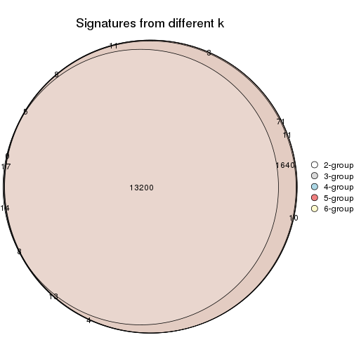

`get_signature()` returns a data frame invisibly. TO get the list of signatures, the function
call should be assigned to a variable explicitly. In following code, if `plot` argument is set
to `FALSE`, no heatmap is plotted while only the differential analysis is performed.

```r
# code only for demonstration
tb = get_signature(res, k = ..., plot = FALSE)
```

An example of the output of `tb` is:

```
#>   which_row         fdr    mean_1    mean_2 scaled_mean_1 scaled_mean_2 km
#> 1        38 0.042760348  8.373488  9.131774    -0.5533452     0.5164555  1
#> 2        40 0.018707592  7.106213  8.469186    -0.6173731     0.5762149  1
#> 3        55 0.019134737 10.221463 11.207825    -0.6159697     0.5749050  1
#> 4        59 0.006059896  5.921854  7.869574    -0.6899429     0.6439467  1
#> 5        60 0.018055526  8.928898 10.211722    -0.6204761     0.5791110  1
#> 6        98 0.009384629 15.714769 14.887706     0.6635654    -0.6193277  2
...
```

The columns in `tb` are:

1. `which_row`: row indices corresponding to the input matrix.
2. `fdr`: FDR for the differential test. 
3. `mean_x`: The mean value in group x.
4. `scaled_mean_x`: The mean value in group x after rows are scaled.
5. `km`: Row groups if k-means clustering is applied to rows.


UMAP plot which shows how samples are separated.


<script>
$( function() {
	$( '#tabs-SD-pam-dimension-reduction' ).tabs();
} );
</script>
<div id='tabs-SD-pam-dimension-reduction'>
<ul>
<li><a href='#tab-SD-pam-dimension-reduction-1'>k = 2</a></li>
<li><a href='#tab-SD-pam-dimension-reduction-2'>k = 3</a></li>
<li><a href='#tab-SD-pam-dimension-reduction-3'>k = 4</a></li>
<li><a href='#tab-SD-pam-dimension-reduction-4'>k = 5</a></li>
<li><a href='#tab-SD-pam-dimension-reduction-5'>k = 6</a></li>
</ul>
<div id='tab-SD-pam-dimension-reduction-1'>
<pre><code class="r">dimension_reduction(res, k = 2, method = &quot;UMAP&quot;)
</code></pre>

<p></p>

</div>
<div id='tab-SD-pam-dimension-reduction-2'>
<pre><code class="r">dimension_reduction(res, k = 3, method = &quot;UMAP&quot;)
</code></pre>

<p></p>

</div>
<div id='tab-SD-pam-dimension-reduction-3'>
<pre><code class="r">dimension_reduction(res, k = 4, method = &quot;UMAP&quot;)
</code></pre>

<p></p>

</div>
<div id='tab-SD-pam-dimension-reduction-4'>
<pre><code class="r">dimension_reduction(res, k = 5, method = &quot;UMAP&quot;)
</code></pre>

<p></p>

</div>
<div id='tab-SD-pam-dimension-reduction-5'>
<pre><code class="r">dimension_reduction(res, k = 6, method = &quot;UMAP&quot;)
</code></pre>

<p></p>

</div>
</div>


Following heatmap shows how subgroups are split when increasing `k`:

```r
collect_classes(res)
```

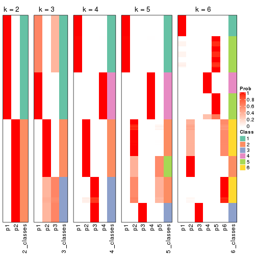


If matrix rows can be associated to genes, consider to use `GO_Enrichment(res,
...)` to perform function enrichment for the signature genes.


 

---------------------------------------------------


### SD:mclust**


The object with results only for a single top-value method and a single partition method 
can be extracted as:

```r
res = res_list["SD", "mclust"]
# you can also extract it by
# res = res_list["SD:mclust"]
```

A summary of `res` and all the functions that can be applied to it:

```r
res
```

```
#> A 'ConsensusPartition' object with k = 2, 3, 4, 5, 6.
#>   On a matrix with 15185 rows and 159 columns.
#>   Top rows (1000, 2000, 3000, 4000, 5000) are extracted by 'SD' method.
#>   Subgroups are detected by 'mclust' method.
#>   Performed in total 1250 partitions by row resampling.
#>   Best k for subgroups seems to be 2.
#> 
#> Following methods can be applied to this 'ConsensusPartition' object:
#>  [1] "cola_report"             "collect_classes"         "collect_plots"          
#>  [4] "collect_stats"           "colnames"                "compare_signatures"     
#>  [7] "consensus_heatmap"       "dimension_reduction"     "functional_enrichment"  
#> [10] "get_anno_col"            "get_anno"                "get_classes"            
#> [13] "get_consensus"           "get_matrix"              "get_membership"         
#> [16] "get_param"               "get_signatures"          "get_stats"              
#> [19] "is_best_k"               "is_stable_k"             "membership_heatmap"     
#> [22] "ncol"                    "nrow"                    "plot_ecdf"              
#> [25] "rownames"                "select_partition_number" "show"                   
#> [28] "suggest_best_k"          "test_to_known_factors"
```

`collect_plots()` function collects all the plots made from `res` for all `k` (number of partitions)
into one single page to provide an easy and fast comparison between different `k`.

```r
collect_plots(res)
```


The plots are:

- The first row: a plot of the ECDF (Empirical cumulative distribution
  function) curves of the consensus matrix for each `k` and the heatmap of
  predicted classes for each `k`.
- The second row: heatmaps of the consensus matrix for each `k`.
- The third row: heatmaps of the membership matrix for each `k`.
- The fouth row: heatmaps of the signatures for each `k`.

All the plots in panels can be made by individual functions and they are
plotted later in this section.

`select_partition_number()` produces several plots showing different
statistics for choosing "optimized" `k`. There are following statistics:

- ECDF curves of the consensus matrix for each `k`;
- 1-PAC. [The PAC
  score](https://en.wikipedia.org/wiki/Consensus_clustering#Over-interpretation_potential_of_consensus_clustering)
  measures the proportion of the ambiguous subgrouping.
- Mean silhouette score.
- Concordance. The mean probability of fiting the consensus class ids in all
  partitions.
- Area increased. Denote $A_k$ as the area under the ECDF curve for current
  `k`, the area increased is defined as $A_k - A_{k-1}$.
- Rand index. The percent of pairs of samples that are both in a same cluster
  or both are not in a same cluster in the partition of k and k-1.
- Jaccard index. The ratio of pairs of samples are both in a same cluster in
  the partition of k and k-1 and the pairs of samples are both in a same
  cluster in the partition k or k-1.

The detailed explanations of these statistics can be found in [the cola
vignette](http://bioconductor.org/packages/devel/bioc/vignettes/cola/inst/doc/cola.html#toc_13).

Generally speaking, lower PAC score, higher mean silhouette score or higher
concordance corresponds to better partition. Rand index and Jaccard index
measure how similar the current partition is compared to partition with `k-1`.
If they are too similar, we won't accept `k` is better than `k-1`.

```r
select_partition_number(res)
```


The numeric values for all these statistics can be obtained by `get_stats()`.

```r
get_stats(res)
```

```
#>   k 1-PAC mean_silhouette concordance area_increased  Rand Jaccard
#> 2 2 1.000           1.000       1.000          0.504 0.497   0.497
#> 3 3 0.784           0.825       0.892          0.221 0.906   0.811
#> 4 4 0.697           0.718       0.809          0.126 0.934   0.836
#> 5 5 0.657           0.502       0.758          0.117 0.878   0.637
#> 6 6 0.731           0.529       0.706          0.043 0.871   0.509
```

`suggest_best_k()` suggests the best $k$ based on these statistics. The rules are as follows:

- All $k$ with Jaccard index larger than 0.95 are removed because the increase of
  the partition number does not provides enough extra information. If all $k$ are removed,
  the best $k$ is assigned by `NA`.
- For $k$ with 1-PAC larger than 0.9, the maximal $k$ is taken as the "best k". Other $k$ is called "optional k".
- If it does not fit the second rule. The $k$ with the highest vote of highest
  1-PAC, mean silhouette and concordance is taken as the "best k".

```r
suggest_best_k(res)
```

```
#> [1] 2
```


Following shows the table of the partitions (You need to click the **show/hide
code output** link to see it). The membership matrix (columns with name `p*`)
is inferred by
[`clue::cl_consensus()`](https://www.rdocumentation.org/link/cl_consensus?package=clue)
function with the `SE` method. Basically the value in the membership matrix
represents the probability to belong to a certain group. The finall class
label for an item is determined with the group with highest probability it
belongs to.

In `get_classes()` function, the entropy is calculated from the membership
matrix and the silhouette score is calculated from the consensus matrix.


<script>
$( function() {
	$( '#tabs-SD-mclust-get-classes' ).tabs();
} );
</script>
<div id='tabs-SD-mclust-get-classes'>
<ul>
<li><a href='#tab-SD-mclust-get-classes-1'>k = 2</a></li>
<li><a href='#tab-SD-mclust-get-classes-2'>k = 3</a></li>
<li><a href='#tab-SD-mclust-get-classes-3'>k = 4</a></li>
<li><a href='#tab-SD-mclust-get-classes-4'>k = 5</a></li>
<li><a href='#tab-SD-mclust-get-classes-5'>k = 6</a></li>
</ul>

<div id='tab-SD-mclust-get-classes-1'>
<p><a id='tab-SD-mclust-get-classes-1-a' style='color:#0366d6' href='#'>show/hide code output</a></p>
<pre><code class="r">cbind(get_classes(res, k = 2), get_membership(res, k = 2))
</code></pre>

<pre><code>#&gt;            class entropy silhouette p1 p2
#&gt; SRR1706767     1       0          1  1  0
#&gt; SRR1706768     1       0          1  1  0
#&gt; SRR1706769     1       0          1  1  0
#&gt; SRR1706770     1       0          1  1  0
#&gt; SRR1706771     1       0          1  1  0
#&gt; SRR1706772     1       0          1  1  0
#&gt; SRR1706773     1       0          1  1  0
#&gt; SRR1706774     1       0          1  1  0
#&gt; SRR1706775     1       0          1  1  0
#&gt; SRR1706776     1       0          1  1  0
#&gt; SRR1706777     1       0          1  1  0
#&gt; SRR1706778     1       0          1  1  0
#&gt; SRR1706779     1       0          1  1  0
#&gt; SRR1706780     1       0          1  1  0
#&gt; SRR1706781     1       0          1  1  0
#&gt; SRR1706782     1       0          1  1  0
#&gt; SRR1706783     1       0          1  1  0
#&gt; SRR1706784     1       0          1  1  0
#&gt; SRR1706785     1       0          1  1  0
#&gt; SRR1706786     1       0          1  1  0
#&gt; SRR1706787     1       0          1  1  0
#&gt; SRR1706788     1       0          1  1  0
#&gt; SRR1706789     1       0          1  1  0
#&gt; SRR1706790     1       0          1  1  0
#&gt; SRR1706791     1       0          1  1  0
#&gt; SRR1706792     1       0          1  1  0
#&gt; SRR1706793     1       0          1  1  0
#&gt; SRR1706794     1       0          1  1  0
#&gt; SRR1706795     1       0          1  1  0
#&gt; SRR1706796     1       0          1  1  0
#&gt; SRR1706797     1       0          1  1  0
#&gt; SRR1706798     1       0          1  1  0
#&gt; SRR1706799     1       0          1  1  0
#&gt; SRR1706800     1       0          1  1  0
#&gt; SRR1706801     1       0          1  1  0
#&gt; SRR1706802     1       0          1  1  0
#&gt; SRR1706803     1       0          1  1  0
#&gt; SRR1706804     1       0          1  1  0
#&gt; SRR1706805     1       0          1  1  0
#&gt; SRR1706806     1       0          1  1  0
#&gt; SRR1706811     1       0          1  1  0
#&gt; SRR1706812     1       0          1  1  0
#&gt; SRR1706813     1       0          1  1  0
#&gt; SRR1706814     1       0          1  1  0
#&gt; SRR1706807     1       0          1  1  0
#&gt; SRR1706808     1       0          1  1  0
#&gt; SRR1706809     1       0          1  1  0
#&gt; SRR1706810     1       0          1  1  0
#&gt; SRR1706815     1       0          1  1  0
#&gt; SRR1706816     1       0          1  1  0
#&gt; SRR1706817     1       0          1  1  0
#&gt; SRR1706818     1       0          1  1  0
#&gt; SRR1706819     1       0          1  1  0
#&gt; SRR1706820     1       0          1  1  0
#&gt; SRR1706821     1       0          1  1  0
#&gt; SRR1706822     1       0          1  1  0
#&gt; SRR1706823     1       0          1  1  0
#&gt; SRR1706824     1       0          1  1  0
#&gt; SRR1706825     1       0          1  1  0
#&gt; SRR1706826     1       0          1  1  0
#&gt; SRR1706827     1       0          1  1  0
#&gt; SRR1706828     1       0          1  1  0
#&gt; SRR1706829     1       0          1  1  0
#&gt; SRR1706830     1       0          1  1  0
#&gt; SRR1706835     1       0          1  1  0
#&gt; SRR1706836     1       0          1  1  0
#&gt; SRR1706837     1       0          1  1  0
#&gt; SRR1706838     1       0          1  1  0
#&gt; SRR1706831     1       0          1  1  0
#&gt; SRR1706832     1       0          1  1  0
#&gt; SRR1706833     1       0          1  1  0
#&gt; SRR1706834     1       0          1  1  0
#&gt; SRR1706839     1       0          1  1  0
#&gt; SRR1706840     1       0          1  1  0
#&gt; SRR1706841     1       0          1  1  0
#&gt; SRR1706842     1       0          1  1  0
#&gt; SRR1706847     2       0          1  0  1
#&gt; SRR1706848     2       0          1  0  1
#&gt; SRR1706849     2       0          1  0  1
#&gt; SRR1706850     2       0          1  0  1
#&gt; SRR1706843     1       0          1  1  0
#&gt; SRR1706844     1       0          1  1  0
#&gt; SRR1706845     1       0          1  1  0
#&gt; SRR1706846     1       0          1  1  0
#&gt; SRR1706851     2       0          1  0  1
#&gt; SRR1706852     2       0          1  0  1
#&gt; SRR1706853     2       0          1  0  1
#&gt; SRR1706854     2       0          1  0  1
#&gt; SRR1706855     2       0          1  0  1
#&gt; SRR1706856     2       0          1  0  1
#&gt; SRR1706857     2       0          1  0  1
#&gt; SRR1706858     2       0          1  0  1
#&gt; SRR1706859     2       0          1  0  1
#&gt; SRR1706860     2       0          1  0  1
#&gt; SRR1706861     2       0          1  0  1
#&gt; SRR1706862     2       0          1  0  1
#&gt; SRR1706867     2       0          1  0  1
#&gt; SRR1706869     2       0          1  0  1
#&gt; SRR1706870     2       0          1  0  1
#&gt; SRR1706863     2       0          1  0  1
#&gt; SRR1706864     2       0          1  0  1
#&gt; SRR1706865     2       0          1  0  1
#&gt; SRR1706866     2       0          1  0  1
#&gt; SRR1706871     2       0          1  0  1
#&gt; SRR1706872     2       0          1  0  1
#&gt; SRR1706873     2       0          1  0  1
#&gt; SRR1706874     2       0          1  0  1
#&gt; SRR1706879     2       0          1  0  1
#&gt; SRR1706880     2       0          1  0  1
#&gt; SRR1706881     2       0          1  0  1
#&gt; SRR1706882     2       0          1  0  1
#&gt; SRR1706883     2       0          1  0  1
#&gt; SRR1706884     2       0          1  0  1
#&gt; SRR1706885     2       0          1  0  1
#&gt; SRR1706886     2       0          1  0  1
#&gt; SRR1706875     2       0          1  0  1
#&gt; SRR1706876     2       0          1  0  1
#&gt; SRR1706877     2       0          1  0  1
#&gt; SRR1706878     2       0          1  0  1
#&gt; SRR1706887     2       0          1  0  1
#&gt; SRR1706888     2       0          1  0  1
#&gt; SRR1706889     2       0          1  0  1
#&gt; SRR1706890     2       0          1  0  1
#&gt; SRR1706891     2       0          1  0  1
#&gt; SRR1706892     2       0          1  0  1
#&gt; SRR1706893     2       0          1  0  1
#&gt; SRR1706894     2       0          1  0  1
#&gt; SRR1706895     2       0          1  0  1
#&gt; SRR1706896     2       0          1  0  1
#&gt; SRR1706897     2       0          1  0  1
#&gt; SRR1706898     2       0          1  0  1
#&gt; SRR1706899     2       0          1  0  1
#&gt; SRR1706900     2       0          1  0  1
#&gt; SRR1706901     2       0          1  0  1
#&gt; SRR1706902     2       0          1  0  1
#&gt; SRR1706907     2       0          1  0  1
#&gt; SRR1706908     2       0          1  0  1
#&gt; SRR1706909     2       0          1  0  1
#&gt; SRR1706910     2       0          1  0  1
#&gt; SRR1706903     2       0          1  0  1
#&gt; SRR1706904     2       0          1  0  1
#&gt; SRR1706905     2       0          1  0  1
#&gt; SRR1706906     2       0          1  0  1
#&gt; SRR1706911     2       0          1  0  1
#&gt; SRR1706912     2       0          1  0  1
#&gt; SRR1706913     2       0          1  0  1
#&gt; SRR1706914     2       0          1  0  1
#&gt; SRR1706919     2       0          1  0  1
#&gt; SRR1706920     2       0          1  0  1
#&gt; SRR1706921     2       0          1  0  1
#&gt; SRR1706922     2       0          1  0  1
#&gt; SRR1706915     2       0          1  0  1
#&gt; SRR1706916     2       0          1  0  1
#&gt; SRR1706917     2       0          1  0  1
#&gt; SRR1706918     2       0          1  0  1
#&gt; SRR1706923     2       0          1  0  1
#&gt; SRR1706924     2       0          1  0  1
#&gt; SRR1706925     2       0          1  0  1
#&gt; SRR1706926     2       0          1  0  1
</code></pre>

<script>
$('#tab-SD-mclust-get-classes-1-a').parent().next().next().hide();
$('#tab-SD-mclust-get-classes-1-a').click(function(){
  $('#tab-SD-mclust-get-classes-1-a').parent().next().next().toggle();
  return(false);
});
</script>
</div>

<div id='tab-SD-mclust-get-classes-2'>
<p><a id='tab-SD-mclust-get-classes-2-a' style='color:#0366d6' href='#'>show/hide code output</a></p>
<pre><code class="r">cbind(get_classes(res, k = 3), get_membership(res, k = 3))
</code></pre>

<pre><code>#&gt;            class entropy silhouette    p1    p2    p3
#&gt; SRR1706767     1  0.0892      0.917 0.980 0.020 0.000
#&gt; SRR1706768     1  0.0892      0.917 0.980 0.020 0.000
#&gt; SRR1706769     1  0.0892      0.917 0.980 0.020 0.000
#&gt; SRR1706770     1  0.0892      0.917 0.980 0.020 0.000
#&gt; SRR1706771     1  0.0000      0.924 1.000 0.000 0.000
#&gt; SRR1706772     1  0.0000      0.924 1.000 0.000 0.000
#&gt; SRR1706773     1  0.0000      0.924 1.000 0.000 0.000
#&gt; SRR1706774     1  0.0000      0.924 1.000 0.000 0.000
#&gt; SRR1706775     1  0.0000      0.924 1.000 0.000 0.000
#&gt; SRR1706776     1  0.0000      0.924 1.000 0.000 0.000
#&gt; SRR1706777     1  0.0000      0.924 1.000 0.000 0.000
#&gt; SRR1706778     1  0.0000      0.924 1.000 0.000 0.000
#&gt; SRR1706779     1  0.0000      0.924 1.000 0.000 0.000
#&gt; SRR1706780     1  0.0000      0.924 1.000 0.000 0.000
#&gt; SRR1706781     1  0.0000      0.924 1.000 0.000 0.000
#&gt; SRR1706782     1  0.0000      0.924 1.000 0.000 0.000
#&gt; SRR1706783     1  0.5882      0.655 0.652 0.348 0.000
#&gt; SRR1706784     1  0.5882      0.655 0.652 0.348 0.000
#&gt; SRR1706785     1  0.5882      0.655 0.652 0.348 0.000
#&gt; SRR1706786     1  0.5882      0.655 0.652 0.348 0.000
#&gt; SRR1706787     1  0.0892      0.917 0.980 0.020 0.000
#&gt; SRR1706788     1  0.0892      0.917 0.980 0.020 0.000
#&gt; SRR1706789     1  0.0892      0.917 0.980 0.020 0.000
#&gt; SRR1706790     1  0.0892      0.917 0.980 0.020 0.000
#&gt; SRR1706791     1  0.0000      0.924 1.000 0.000 0.000
#&gt; SRR1706792     1  0.0000      0.924 1.000 0.000 0.000
#&gt; SRR1706793     1  0.0000      0.924 1.000 0.000 0.000
#&gt; SRR1706794     1  0.0000      0.924 1.000 0.000 0.000
#&gt; SRR1706795     1  0.0000      0.924 1.000 0.000 0.000
#&gt; SRR1706796     1  0.0000      0.924 1.000 0.000 0.000
#&gt; SRR1706797     1  0.0000      0.924 1.000 0.000 0.000
#&gt; SRR1706798     1  0.0000      0.924 1.000 0.000 0.000
#&gt; SRR1706799     1  0.0000      0.924 1.000 0.000 0.000
#&gt; SRR1706800     1  0.0000      0.924 1.000 0.000 0.000
#&gt; SRR1706801     1  0.0000      0.924 1.000 0.000 0.000
#&gt; SRR1706802     1  0.0000      0.924 1.000 0.000 0.000
#&gt; SRR1706803     1  0.5882      0.655 0.652 0.348 0.000
#&gt; SRR1706804     1  0.5882      0.655 0.652 0.348 0.000
#&gt; SRR1706805     1  0.5882      0.655 0.652 0.348 0.000
#&gt; SRR1706806     1  0.5882      0.655 0.652 0.348 0.000
#&gt; SRR1706811     1  0.0000      0.924 1.000 0.000 0.000
#&gt; SRR1706812     1  0.0000      0.924 1.000 0.000 0.000
#&gt; SRR1706813     1  0.0000      0.924 1.000 0.000 0.000
#&gt; SRR1706814     1  0.0000      0.924 1.000 0.000 0.000
#&gt; SRR1706807     1  0.0892      0.917 0.980 0.020 0.000
#&gt; SRR1706808     1  0.0892      0.917 0.980 0.020 0.000
#&gt; SRR1706809     1  0.0892      0.917 0.980 0.020 0.000
#&gt; SRR1706810     1  0.0892      0.917 0.980 0.020 0.000
#&gt; SRR1706815     1  0.0000      0.924 1.000 0.000 0.000
#&gt; SRR1706816     1  0.0000      0.924 1.000 0.000 0.000
#&gt; SRR1706817     1  0.0000      0.924 1.000 0.000 0.000
#&gt; SRR1706818     1  0.0000      0.924 1.000 0.000 0.000
#&gt; SRR1706819     1  0.0000      0.924 1.000 0.000 0.000
#&gt; SRR1706820     1  0.0000      0.924 1.000 0.000 0.000
#&gt; SRR1706821     1  0.0000      0.924 1.000 0.000 0.000
#&gt; SRR1706822     1  0.0000      0.924 1.000 0.000 0.000
#&gt; SRR1706823     1  0.5882      0.655 0.652 0.348 0.000
#&gt; SRR1706824     1  0.5882      0.655 0.652 0.348 0.000
#&gt; SRR1706825     1  0.5882      0.655 0.652 0.348 0.000
#&gt; SRR1706826     1  0.5882      0.655 0.652 0.348 0.000
#&gt; SRR1706827     1  0.0892      0.917 0.980 0.020 0.000
#&gt; SRR1706828     1  0.0892      0.917 0.980 0.020 0.000
#&gt; SRR1706829     1  0.0892      0.917 0.980 0.020 0.000
#&gt; SRR1706830     1  0.0892      0.917 0.980 0.020 0.000
#&gt; SRR1706835     1  0.0000      0.924 1.000 0.000 0.000
#&gt; SRR1706836     1  0.0000      0.924 1.000 0.000 0.000
#&gt; SRR1706837     1  0.0000      0.924 1.000 0.000 0.000
#&gt; SRR1706838     1  0.0000      0.924 1.000 0.000 0.000
#&gt; SRR1706831     1  0.0000      0.924 1.000 0.000 0.000
#&gt; SRR1706832     1  0.0000      0.924 1.000 0.000 0.000
#&gt; SRR1706833     1  0.0000      0.924 1.000 0.000 0.000
#&gt; SRR1706834     1  0.0000      0.924 1.000 0.000 0.000
#&gt; SRR1706839     1  0.0000      0.924 1.000 0.000 0.000
#&gt; SRR1706840     1  0.0000      0.924 1.000 0.000 0.000
#&gt; SRR1706841     1  0.0000      0.924 1.000 0.000 0.000
#&gt; SRR1706842     1  0.0000      0.924 1.000 0.000 0.000
#&gt; SRR1706847     2  0.5905      0.851 0.000 0.648 0.352
#&gt; SRR1706848     2  0.5905      0.851 0.000 0.648 0.352
#&gt; SRR1706849     2  0.5905      0.851 0.000 0.648 0.352
#&gt; SRR1706850     2  0.5905      0.851 0.000 0.648 0.352
#&gt; SRR1706843     1  0.5882      0.655 0.652 0.348 0.000
#&gt; SRR1706844     1  0.5882      0.655 0.652 0.348 0.000
#&gt; SRR1706845     1  0.5882      0.655 0.652 0.348 0.000
#&gt; SRR1706846     1  0.5882      0.655 0.652 0.348 0.000
#&gt; SRR1706851     2  0.6008      0.857 0.000 0.628 0.372
#&gt; SRR1706852     2  0.6008      0.857 0.000 0.628 0.372
#&gt; SRR1706853     2  0.6008      0.857 0.000 0.628 0.372
#&gt; SRR1706854     2  0.6008      0.857 0.000 0.628 0.372
#&gt; SRR1706855     2  0.6008      0.857 0.000 0.628 0.372
#&gt; SRR1706856     2  0.6008      0.857 0.000 0.628 0.372
#&gt; SRR1706857     2  0.6008      0.857 0.000 0.628 0.372
#&gt; SRR1706858     2  0.6008      0.857 0.000 0.628 0.372
#&gt; SRR1706859     2  0.5905      0.853 0.000 0.648 0.352
#&gt; SRR1706860     2  0.5905      0.853 0.000 0.648 0.352
#&gt; SRR1706861     2  0.5905      0.853 0.000 0.648 0.352
#&gt; SRR1706862     2  0.5905      0.853 0.000 0.648 0.352
#&gt; SRR1706867     2  0.5905      0.851 0.000 0.648 0.352
#&gt; SRR1706869     2  0.5905      0.851 0.000 0.648 0.352
#&gt; SRR1706870     2  0.5905      0.851 0.000 0.648 0.352
#&gt; SRR1706863     2  0.1163      0.474 0.000 0.972 0.028
#&gt; SRR1706864     2  0.1163      0.474 0.000 0.972 0.028
#&gt; SRR1706865     2  0.1163      0.474 0.000 0.972 0.028
#&gt; SRR1706866     2  0.1163      0.474 0.000 0.972 0.028
#&gt; SRR1706871     2  0.6008      0.857 0.000 0.628 0.372
#&gt; SRR1706872     2  0.6008      0.857 0.000 0.628 0.372
#&gt; SRR1706873     2  0.6008      0.857 0.000 0.628 0.372
#&gt; SRR1706874     2  0.6008      0.857 0.000 0.628 0.372
#&gt; SRR1706879     2  0.5905      0.853 0.000 0.648 0.352
#&gt; SRR1706880     2  0.5905      0.853 0.000 0.648 0.352
#&gt; SRR1706881     2  0.5905      0.853 0.000 0.648 0.352
#&gt; SRR1706882     2  0.5905      0.853 0.000 0.648 0.352
#&gt; SRR1706883     2  0.1163      0.474 0.000 0.972 0.028
#&gt; SRR1706884     2  0.1163      0.474 0.000 0.972 0.028
#&gt; SRR1706885     2  0.1163      0.474 0.000 0.972 0.028
#&gt; SRR1706886     2  0.1163      0.474 0.000 0.972 0.028
#&gt; SRR1706875     2  0.6008      0.857 0.000 0.628 0.372
#&gt; SRR1706876     2  0.6008      0.857 0.000 0.628 0.372
#&gt; SRR1706877     2  0.6008      0.857 0.000 0.628 0.372
#&gt; SRR1706878     2  0.6008      0.857 0.000 0.628 0.372
#&gt; SRR1706887     3  0.1753      0.832 0.000 0.048 0.952
#&gt; SRR1706888     3  0.1753      0.832 0.000 0.048 0.952
#&gt; SRR1706889     3  0.1753      0.832 0.000 0.048 0.952
#&gt; SRR1706890     3  0.1753      0.832 0.000 0.048 0.952
#&gt; SRR1706891     3  0.0000      0.853 0.000 0.000 1.000
#&gt; SRR1706892     3  0.0000      0.853 0.000 0.000 1.000
#&gt; SRR1706893     3  0.0000      0.853 0.000 0.000 1.000
#&gt; SRR1706894     3  0.0000      0.853 0.000 0.000 1.000
#&gt; SRR1706895     3  0.0000      0.853 0.000 0.000 1.000
#&gt; SRR1706896     3  0.0000      0.853 0.000 0.000 1.000
#&gt; SRR1706897     3  0.0000      0.853 0.000 0.000 1.000
#&gt; SRR1706898     3  0.0000      0.853 0.000 0.000 1.000
#&gt; SRR1706899     3  0.0892      0.847 0.000 0.020 0.980
#&gt; SRR1706900     3  0.0892      0.847 0.000 0.020 0.980
#&gt; SRR1706901     3  0.0892      0.847 0.000 0.020 0.980
#&gt; SRR1706902     3  0.0892      0.847 0.000 0.020 0.980
#&gt; SRR1706907     2  0.5905      0.851 0.000 0.648 0.352
#&gt; SRR1706908     2  0.5905      0.851 0.000 0.648 0.352
#&gt; SRR1706909     2  0.5905      0.851 0.000 0.648 0.352
#&gt; SRR1706910     2  0.5905      0.851 0.000 0.648 0.352
#&gt; SRR1706903     3  0.6126      0.582 0.000 0.400 0.600
#&gt; SRR1706904     3  0.6126      0.582 0.000 0.400 0.600
#&gt; SRR1706905     3  0.6126      0.582 0.000 0.400 0.600
#&gt; SRR1706906     3  0.6126      0.582 0.000 0.400 0.600
#&gt; SRR1706911     2  0.6008      0.857 0.000 0.628 0.372
#&gt; SRR1706912     2  0.6008      0.857 0.000 0.628 0.372
#&gt; SRR1706913     2  0.6008      0.857 0.000 0.628 0.372
#&gt; SRR1706914     2  0.6008      0.857 0.000 0.628 0.372
#&gt; SRR1706919     2  0.5905      0.853 0.000 0.648 0.352
#&gt; SRR1706920     2  0.5905      0.853 0.000 0.648 0.352
#&gt; SRR1706921     2  0.5905      0.853 0.000 0.648 0.352
#&gt; SRR1706922     2  0.5905      0.853 0.000 0.648 0.352
#&gt; SRR1706915     2  0.6008      0.857 0.000 0.628 0.372
#&gt; SRR1706916     2  0.6008      0.857 0.000 0.628 0.372
#&gt; SRR1706917     2  0.6008      0.857 0.000 0.628 0.372
#&gt; SRR1706918     2  0.6008      0.857 0.000 0.628 0.372
#&gt; SRR1706923     2  0.1163      0.474 0.000 0.972 0.028
#&gt; SRR1706924     2  0.1163      0.474 0.000 0.972 0.028
#&gt; SRR1706925     2  0.1163      0.474 0.000 0.972 0.028
#&gt; SRR1706926     2  0.1163      0.474 0.000 0.972 0.028
</code></pre>

<script>
$('#tab-SD-mclust-get-classes-2-a').parent().next().next().hide();
$('#tab-SD-mclust-get-classes-2-a').click(function(){
  $('#tab-SD-mclust-get-classes-2-a').parent().next().next().toggle();
  return(false);
});
</script>
</div>

<div id='tab-SD-mclust-get-classes-3'>
<p><a id='tab-SD-mclust-get-classes-3-a' style='color:#0366d6' href='#'>show/hide code output</a></p>
<pre><code class="r">cbind(get_classes(res, k = 4), get_membership(res, k = 4))
</code></pre>

<pre><code>#&gt;            class entropy silhouette    p1    p2    p3    p4
#&gt; SRR1706767     1  0.4454      0.696 0.692 0.000 0.000 0.308
#&gt; SRR1706768     1  0.4454      0.696 0.692 0.000 0.000 0.308
#&gt; SRR1706769     1  0.4454      0.696 0.692 0.000 0.000 0.308
#&gt; SRR1706770     1  0.4454      0.696 0.692 0.000 0.000 0.308
#&gt; SRR1706771     1  0.0188      0.845 0.996 0.000 0.000 0.004
#&gt; SRR1706772     1  0.0188      0.845 0.996 0.000 0.000 0.004
#&gt; SRR1706773     1  0.0188      0.845 0.996 0.000 0.000 0.004
#&gt; SRR1706774     1  0.0188      0.845 0.996 0.000 0.000 0.004
#&gt; SRR1706775     1  0.0336      0.845 0.992 0.008 0.000 0.000
#&gt; SRR1706776     1  0.0000      0.845 1.000 0.000 0.000 0.000
#&gt; SRR1706777     1  0.0188      0.845 0.996 0.004 0.000 0.000
#&gt; SRR1706778     1  0.1022      0.841 0.968 0.032 0.000 0.000
#&gt; SRR1706779     1  0.1118      0.840 0.964 0.036 0.000 0.000
#&gt; SRR1706780     1  0.1211      0.839 0.960 0.040 0.000 0.000
#&gt; SRR1706781     1  0.1118      0.840 0.964 0.036 0.000 0.000
#&gt; SRR1706782     1  0.1211      0.839 0.960 0.040 0.000 0.000
#&gt; SRR1706783     1  0.6337      0.609 0.568 0.360 0.000 0.072
#&gt; SRR1706784     1  0.6337      0.609 0.568 0.360 0.000 0.072
#&gt; SRR1706785     1  0.6337      0.609 0.568 0.360 0.000 0.072
#&gt; SRR1706786     1  0.6337      0.609 0.568 0.360 0.000 0.072
#&gt; SRR1706787     1  0.4454      0.696 0.692 0.000 0.000 0.308
#&gt; SRR1706788     1  0.4454      0.696 0.692 0.000 0.000 0.308
#&gt; SRR1706789     1  0.4454      0.696 0.692 0.000 0.000 0.308
#&gt; SRR1706790     1  0.4454      0.696 0.692 0.000 0.000 0.308
#&gt; SRR1706791     1  0.0188      0.845 0.996 0.000 0.000 0.004
#&gt; SRR1706792     1  0.0188      0.845 0.996 0.000 0.000 0.004
#&gt; SRR1706793     1  0.0188      0.845 0.996 0.000 0.000 0.004
#&gt; SRR1706794     1  0.0188      0.845 0.996 0.000 0.000 0.004
#&gt; SRR1706795     1  0.1211      0.839 0.960 0.040 0.000 0.000
#&gt; SRR1706796     1  0.1211      0.839 0.960 0.040 0.000 0.000
#&gt; SRR1706797     1  0.1211      0.839 0.960 0.040 0.000 0.000
#&gt; SRR1706798     1  0.1211      0.839 0.960 0.040 0.000 0.000
#&gt; SRR1706799     1  0.1118      0.840 0.964 0.036 0.000 0.000
#&gt; SRR1706800     1  0.1118      0.840 0.964 0.036 0.000 0.000
#&gt; SRR1706801     1  0.1118      0.840 0.964 0.036 0.000 0.000
#&gt; SRR1706802     1  0.1118      0.840 0.964 0.036 0.000 0.000
#&gt; SRR1706803     1  0.6337      0.609 0.568 0.360 0.000 0.072
#&gt; SRR1706804     1  0.6337      0.609 0.568 0.360 0.000 0.072
#&gt; SRR1706805     1  0.6337      0.609 0.568 0.360 0.000 0.072
#&gt; SRR1706806     1  0.6337      0.609 0.568 0.360 0.000 0.072
#&gt; SRR1706811     1  0.0376      0.845 0.992 0.004 0.000 0.004
#&gt; SRR1706812     1  0.0376      0.845 0.992 0.004 0.000 0.004
#&gt; SRR1706813     1  0.0376      0.845 0.992 0.004 0.000 0.004
#&gt; SRR1706814     1  0.0376      0.845 0.992 0.004 0.000 0.004
#&gt; SRR1706807     1  0.4454      0.696 0.692 0.000 0.000 0.308
#&gt; SRR1706808     1  0.4454      0.696 0.692 0.000 0.000 0.308
#&gt; SRR1706809     1  0.4454      0.696 0.692 0.000 0.000 0.308
#&gt; SRR1706810     1  0.4454      0.696 0.692 0.000 0.000 0.308
#&gt; SRR1706815     1  0.0188      0.845 0.996 0.004 0.000 0.000
#&gt; SRR1706816     1  0.0188      0.845 0.996 0.004 0.000 0.000
#&gt; SRR1706817     1  0.0188      0.845 0.996 0.004 0.000 0.000
#&gt; SRR1706818     1  0.0188      0.845 0.996 0.004 0.000 0.000
#&gt; SRR1706819     1  0.0188      0.845 0.996 0.004 0.000 0.000
#&gt; SRR1706820     1  0.0188      0.845 0.996 0.004 0.000 0.000
#&gt; SRR1706821     1  0.0188      0.845 0.996 0.004 0.000 0.000
#&gt; SRR1706822     1  0.0188      0.845 0.996 0.004 0.000 0.000
#&gt; SRR1706823     1  0.6197      0.620 0.604 0.324 0.000 0.072
#&gt; SRR1706824     1  0.6197      0.620 0.604 0.324 0.000 0.072
#&gt; SRR1706825     1  0.6197      0.620 0.604 0.324 0.000 0.072
#&gt; SRR1706826     1  0.6197      0.620 0.604 0.324 0.000 0.072
#&gt; SRR1706827     1  0.4454      0.696 0.692 0.000 0.000 0.308
#&gt; SRR1706828     1  0.4454      0.696 0.692 0.000 0.000 0.308
#&gt; SRR1706829     1  0.4454      0.696 0.692 0.000 0.000 0.308
#&gt; SRR1706830     1  0.4454      0.696 0.692 0.000 0.000 0.308
#&gt; SRR1706835     1  0.0000      0.845 1.000 0.000 0.000 0.000
#&gt; SRR1706836     1  0.0000      0.845 1.000 0.000 0.000 0.000
#&gt; SRR1706837     1  0.0000      0.845 1.000 0.000 0.000 0.000
#&gt; SRR1706838     1  0.0000      0.845 1.000 0.000 0.000 0.000
#&gt; SRR1706831     1  0.0188      0.845 0.996 0.000 0.000 0.004
#&gt; SRR1706832     1  0.0188      0.845 0.996 0.000 0.000 0.004
#&gt; SRR1706833     1  0.0188      0.845 0.996 0.000 0.000 0.004
#&gt; SRR1706834     1  0.0188      0.845 0.996 0.000 0.000 0.004
#&gt; SRR1706839     1  0.1118      0.840 0.964 0.036 0.000 0.000
#&gt; SRR1706840     1  0.1118      0.840 0.964 0.036 0.000 0.000
#&gt; SRR1706841     1  0.1118      0.840 0.964 0.036 0.000 0.000
#&gt; SRR1706842     1  0.1118      0.840 0.964 0.036 0.000 0.000
#&gt; SRR1706847     3  0.6058      0.656 0.000 0.072 0.632 0.296
#&gt; SRR1706848     3  0.6058      0.656 0.000 0.072 0.632 0.296
#&gt; SRR1706849     3  0.6058      0.656 0.000 0.072 0.632 0.296
#&gt; SRR1706850     3  0.6058      0.656 0.000 0.072 0.632 0.296
#&gt; SRR1706843     1  0.6337      0.609 0.568 0.360 0.000 0.072
#&gt; SRR1706844     1  0.6337      0.609 0.568 0.360 0.000 0.072
#&gt; SRR1706845     1  0.6337      0.609 0.568 0.360 0.000 0.072
#&gt; SRR1706846     1  0.6337      0.609 0.568 0.360 0.000 0.072
#&gt; SRR1706851     3  0.0000      0.657 0.000 0.000 1.000 0.000
#&gt; SRR1706852     3  0.0000      0.657 0.000 0.000 1.000 0.000
#&gt; SRR1706853     3  0.0000      0.657 0.000 0.000 1.000 0.000
#&gt; SRR1706854     3  0.0000      0.657 0.000 0.000 1.000 0.000
#&gt; SRR1706855     2  0.4961      0.768 0.000 0.552 0.448 0.000
#&gt; SRR1706856     2  0.4961      0.768 0.000 0.552 0.448 0.000
#&gt; SRR1706857     2  0.4961      0.768 0.000 0.552 0.448 0.000
#&gt; SRR1706858     2  0.4961      0.768 0.000 0.552 0.448 0.000
#&gt; SRR1706859     2  0.4955      0.770 0.000 0.556 0.444 0.000
#&gt; SRR1706860     2  0.4955      0.770 0.000 0.556 0.444 0.000
#&gt; SRR1706861     2  0.4955      0.770 0.000 0.556 0.444 0.000
#&gt; SRR1706862     2  0.4955      0.770 0.000 0.556 0.444 0.000
#&gt; SRR1706867     3  0.6058      0.656 0.000 0.072 0.632 0.296
#&gt; SRR1706869     3  0.6058      0.656 0.000 0.072 0.632 0.296
#&gt; SRR1706870     3  0.6058      0.656 0.000 0.072 0.632 0.296
#&gt; SRR1706863     2  0.1211      0.554 0.000 0.960 0.040 0.000
#&gt; SRR1706864     2  0.1211      0.554 0.000 0.960 0.040 0.000
#&gt; SRR1706865     2  0.1211      0.554 0.000 0.960 0.040 0.000
#&gt; SRR1706866     2  0.1211      0.554 0.000 0.960 0.040 0.000
#&gt; SRR1706871     3  0.0000      0.657 0.000 0.000 1.000 0.000
#&gt; SRR1706872     3  0.0000      0.657 0.000 0.000 1.000 0.000
#&gt; SRR1706873     3  0.0000      0.657 0.000 0.000 1.000 0.000
#&gt; SRR1706874     3  0.0000      0.657 0.000 0.000 1.000 0.000
#&gt; SRR1706879     2  0.4955      0.770 0.000 0.556 0.444 0.000
#&gt; SRR1706880     2  0.4955      0.770 0.000 0.556 0.444 0.000
#&gt; SRR1706881     2  0.4955      0.770 0.000 0.556 0.444 0.000
#&gt; SRR1706882     2  0.4955      0.770 0.000 0.556 0.444 0.000
#&gt; SRR1706883     2  0.1211      0.554 0.000 0.960 0.040 0.000
#&gt; SRR1706884     2  0.1211      0.554 0.000 0.960 0.040 0.000
#&gt; SRR1706885     2  0.1211      0.554 0.000 0.960 0.040 0.000
#&gt; SRR1706886     2  0.1211      0.554 0.000 0.960 0.040 0.000
#&gt; SRR1706875     2  0.4961      0.768 0.000 0.552 0.448 0.000
#&gt; SRR1706876     2  0.4961      0.768 0.000 0.552 0.448 0.000
#&gt; SRR1706877     2  0.4961      0.768 0.000 0.552 0.448 0.000
#&gt; SRR1706878     2  0.4961      0.768 0.000 0.552 0.448 0.000
#&gt; SRR1706887     4  0.2670      0.465 0.000 0.072 0.024 0.904
#&gt; SRR1706888     4  0.2670      0.465 0.000 0.072 0.024 0.904
#&gt; SRR1706889     4  0.2670      0.465 0.000 0.072 0.024 0.904
#&gt; SRR1706890     4  0.2670      0.465 0.000 0.072 0.024 0.904
#&gt; SRR1706891     4  0.5269      0.720 0.000 0.016 0.364 0.620
#&gt; SRR1706892     4  0.5269      0.720 0.000 0.016 0.364 0.620
#&gt; SRR1706893     4  0.5269      0.720 0.000 0.016 0.364 0.620
#&gt; SRR1706894     4  0.5269      0.720 0.000 0.016 0.364 0.620
#&gt; SRR1706895     4  0.5269      0.720 0.000 0.016 0.364 0.620
#&gt; SRR1706896     4  0.5269      0.720 0.000 0.016 0.364 0.620
#&gt; SRR1706897     4  0.5269      0.720 0.000 0.016 0.364 0.620
#&gt; SRR1706898     4  0.5269      0.720 0.000 0.016 0.364 0.620
#&gt; SRR1706899     4  0.5355      0.719 0.000 0.020 0.360 0.620
#&gt; SRR1706900     4  0.5355      0.719 0.000 0.020 0.360 0.620
#&gt; SRR1706901     4  0.5355      0.719 0.000 0.020 0.360 0.620
#&gt; SRR1706902     4  0.5355      0.719 0.000 0.020 0.360 0.620
#&gt; SRR1706907     3  0.6058      0.656 0.000 0.072 0.632 0.296
#&gt; SRR1706908     3  0.6058      0.656 0.000 0.072 0.632 0.296
#&gt; SRR1706909     3  0.6058      0.656 0.000 0.072 0.632 0.296
#&gt; SRR1706910     3  0.6058      0.656 0.000 0.072 0.632 0.296
#&gt; SRR1706903     4  0.5231      0.525 0.000 0.384 0.012 0.604
#&gt; SRR1706904     4  0.5231      0.525 0.000 0.384 0.012 0.604
#&gt; SRR1706905     4  0.5231      0.525 0.000 0.384 0.012 0.604
#&gt; SRR1706906     4  0.5231      0.525 0.000 0.384 0.012 0.604
#&gt; SRR1706911     3  0.0000      0.657 0.000 0.000 1.000 0.000
#&gt; SRR1706912     3  0.0000      0.657 0.000 0.000 1.000 0.000
#&gt; SRR1706913     3  0.0000      0.657 0.000 0.000 1.000 0.000
#&gt; SRR1706914     3  0.0000      0.657 0.000 0.000 1.000 0.000
#&gt; SRR1706919     2  0.4955      0.770 0.000 0.556 0.444 0.000
#&gt; SRR1706920     2  0.4955      0.770 0.000 0.556 0.444 0.000
#&gt; SRR1706921     2  0.4955      0.770 0.000 0.556 0.444 0.000
#&gt; SRR1706922     2  0.4955      0.770 0.000 0.556 0.444 0.000
#&gt; SRR1706915     2  0.4961      0.768 0.000 0.552 0.448 0.000
#&gt; SRR1706916     2  0.4961      0.768 0.000 0.552 0.448 0.000
#&gt; SRR1706917     2  0.4961      0.768 0.000 0.552 0.448 0.000
#&gt; SRR1706918     2  0.4961      0.768 0.000 0.552 0.448 0.000
#&gt; SRR1706923     2  0.1211      0.554 0.000 0.960 0.040 0.000
#&gt; SRR1706924     2  0.1211      0.554 0.000 0.960 0.040 0.000
#&gt; SRR1706925     2  0.1211      0.554 0.000 0.960 0.040 0.000
#&gt; SRR1706926     2  0.1211      0.554 0.000 0.960 0.040 0.000
</code></pre>

<script>
$('#tab-SD-mclust-get-classes-3-a').parent().next().next().hide();
$('#tab-SD-mclust-get-classes-3-a').click(function(){
  $('#tab-SD-mclust-get-classes-3-a').parent().next().next().toggle();
  return(false);
});
</script>
</div>

<div id='tab-SD-mclust-get-classes-4'>
<p><a id='tab-SD-mclust-get-classes-4-a' style='color:#0366d6' href='#'>show/hide code output</a></p>
<pre><code class="r">cbind(get_classes(res, k = 5), get_membership(res, k = 5))
</code></pre>

<pre><code>#&gt;            class entropy silhouette    p1    p2    p3    p4    p5
#&gt; SRR1706767     4  0.5655      0.341 0.112 0.000 0.288 0.600 0.000
#&gt; SRR1706768     4  0.5655      0.341 0.112 0.000 0.288 0.600 0.000
#&gt; SRR1706769     4  0.5655      0.341 0.112 0.000 0.288 0.600 0.000
#&gt; SRR1706770     4  0.5655      0.341 0.112 0.000 0.288 0.600 0.000
#&gt; SRR1706771     4  0.0290      0.512 0.008 0.000 0.000 0.992 0.000
#&gt; SRR1706772     4  0.0000      0.514 0.000 0.000 0.000 1.000 0.000
#&gt; SRR1706773     4  0.0000      0.514 0.000 0.000 0.000 1.000 0.000
#&gt; SRR1706774     4  0.0000      0.514 0.000 0.000 0.000 1.000 0.000
#&gt; SRR1706775     4  0.3796      0.213 0.300 0.000 0.000 0.700 0.000
#&gt; SRR1706776     4  0.3796      0.213 0.300 0.000 0.000 0.700 0.000
#&gt; SRR1706777     4  0.3816      0.206 0.304 0.000 0.000 0.696 0.000
#&gt; SRR1706778     4  0.3895      0.175 0.320 0.000 0.000 0.680 0.000
#&gt; SRR1706779     1  0.4210      0.419 0.588 0.000 0.000 0.412 0.000
#&gt; SRR1706780     1  0.4201      0.421 0.592 0.000 0.000 0.408 0.000
#&gt; SRR1706781     1  0.4210      0.419 0.588 0.000 0.000 0.412 0.000
#&gt; SRR1706782     1  0.4201      0.421 0.592 0.000 0.000 0.408 0.000
#&gt; SRR1706783     1  0.4446      0.652 0.592 0.000 0.000 0.008 0.400
#&gt; SRR1706784     1  0.4446      0.652 0.592 0.000 0.000 0.008 0.400
#&gt; SRR1706785     1  0.4446      0.652 0.592 0.000 0.000 0.008 0.400
#&gt; SRR1706786     1  0.4446      0.652 0.592 0.000 0.000 0.008 0.400
#&gt; SRR1706787     4  0.5655      0.341 0.112 0.000 0.288 0.600 0.000
#&gt; SRR1706788     4  0.5655      0.341 0.112 0.000 0.288 0.600 0.000
#&gt; SRR1706789     4  0.5655      0.341 0.112 0.000 0.288 0.600 0.000
#&gt; SRR1706790     4  0.5655      0.341 0.112 0.000 0.288 0.600 0.000
#&gt; SRR1706791     4  0.0000      0.514 0.000 0.000 0.000 1.000 0.000
#&gt; SRR1706792     4  0.0000      0.514 0.000 0.000 0.000 1.000 0.000
#&gt; SRR1706793     4  0.0162      0.513 0.004 0.000 0.000 0.996 0.000
#&gt; SRR1706794     4  0.0000      0.514 0.000 0.000 0.000 1.000 0.000
#&gt; SRR1706795     4  0.4294     -0.147 0.468 0.000 0.000 0.532 0.000
#&gt; SRR1706796     4  0.4294     -0.147 0.468 0.000 0.000 0.532 0.000
#&gt; SRR1706797     4  0.4294     -0.147 0.468 0.000 0.000 0.532 0.000
#&gt; SRR1706798     4  0.4294     -0.147 0.468 0.000 0.000 0.532 0.000
#&gt; SRR1706799     1  0.4210      0.419 0.588 0.000 0.000 0.412 0.000
#&gt; SRR1706800     1  0.4210      0.419 0.588 0.000 0.000 0.412 0.000
#&gt; SRR1706801     1  0.4210      0.419 0.588 0.000 0.000 0.412 0.000
#&gt; SRR1706802     1  0.4210      0.419 0.588 0.000 0.000 0.412 0.000
#&gt; SRR1706803     1  0.4446      0.652 0.592 0.000 0.000 0.008 0.400
#&gt; SRR1706804     1  0.4446      0.652 0.592 0.000 0.000 0.008 0.400
#&gt; SRR1706805     1  0.4446      0.652 0.592 0.000 0.000 0.008 0.400
#&gt; SRR1706806     1  0.4446      0.652 0.592 0.000 0.000 0.008 0.400
#&gt; SRR1706811     4  0.4302     -0.167 0.480 0.000 0.000 0.520 0.000
#&gt; SRR1706812     4  0.4302     -0.167 0.480 0.000 0.000 0.520 0.000
#&gt; SRR1706813     4  0.4302     -0.167 0.480 0.000 0.000 0.520 0.000
#&gt; SRR1706814     4  0.4302     -0.167 0.480 0.000 0.000 0.520 0.000
#&gt; SRR1706807     1  0.5776      0.272 0.588 0.000 0.288 0.124 0.000
#&gt; SRR1706808     1  0.5776      0.272 0.588 0.000 0.288 0.124 0.000
#&gt; SRR1706809     1  0.5776      0.272 0.588 0.000 0.288 0.124 0.000
#&gt; SRR1706810     1  0.5776      0.272 0.588 0.000 0.288 0.124 0.000
#&gt; SRR1706815     4  0.4302     -0.167 0.480 0.000 0.000 0.520 0.000
#&gt; SRR1706816     4  0.4302     -0.167 0.480 0.000 0.000 0.520 0.000
#&gt; SRR1706817     4  0.4302     -0.167 0.480 0.000 0.000 0.520 0.000
#&gt; SRR1706818     4  0.4302     -0.167 0.480 0.000 0.000 0.520 0.000
#&gt; SRR1706819     4  0.4302     -0.167 0.480 0.000 0.000 0.520 0.000
#&gt; SRR1706820     4  0.4302     -0.167 0.480 0.000 0.000 0.520 0.000
#&gt; SRR1706821     4  0.4302     -0.167 0.480 0.000 0.000 0.520 0.000
#&gt; SRR1706822     4  0.4302     -0.167 0.480 0.000 0.000 0.520 0.000
#&gt; SRR1706823     1  0.6146      0.586 0.468 0.000 0.000 0.132 0.400
#&gt; SRR1706824     1  0.6146      0.586 0.468 0.000 0.000 0.132 0.400
#&gt; SRR1706825     1  0.6146      0.586 0.468 0.000 0.000 0.132 0.400
#&gt; SRR1706826     1  0.6146      0.586 0.468 0.000 0.000 0.132 0.400
#&gt; SRR1706827     4  0.5655      0.341 0.112 0.000 0.288 0.600 0.000
#&gt; SRR1706828     4  0.5655      0.341 0.112 0.000 0.288 0.600 0.000
#&gt; SRR1706829     4  0.5655      0.341 0.112 0.000 0.288 0.600 0.000
#&gt; SRR1706830     4  0.5655      0.341 0.112 0.000 0.288 0.600 0.000
#&gt; SRR1706835     4  0.0794      0.503 0.028 0.000 0.000 0.972 0.000
#&gt; SRR1706836     4  0.1197      0.493 0.048 0.000 0.000 0.952 0.000
#&gt; SRR1706837     4  0.1121      0.496 0.044 0.000 0.000 0.956 0.000
#&gt; SRR1706838     4  0.0880      0.501 0.032 0.000 0.000 0.968 0.000
#&gt; SRR1706831     4  0.0000      0.514 0.000 0.000 0.000 1.000 0.000
#&gt; SRR1706832     4  0.0000      0.514 0.000 0.000 0.000 1.000 0.000
#&gt; SRR1706833     4  0.0000      0.514 0.000 0.000 0.000 1.000 0.000
#&gt; SRR1706834     4  0.0000      0.514 0.000 0.000 0.000 1.000 0.000
#&gt; SRR1706839     1  0.4210      0.419 0.588 0.000 0.000 0.412 0.000
#&gt; SRR1706840     1  0.4210      0.419 0.588 0.000 0.000 0.412 0.000
#&gt; SRR1706841     1  0.4210      0.419 0.588 0.000 0.000 0.412 0.000
#&gt; SRR1706842     1  0.4210      0.419 0.588 0.000 0.000 0.412 0.000
#&gt; SRR1706847     3  0.0000      0.583 0.000 0.000 1.000 0.000 0.000
#&gt; SRR1706848     3  0.0000      0.583 0.000 0.000 1.000 0.000 0.000
#&gt; SRR1706849     3  0.0000      0.583 0.000 0.000 1.000 0.000 0.000
#&gt; SRR1706850     3  0.0000      0.583 0.000 0.000 1.000 0.000 0.000
#&gt; SRR1706843     1  0.4446      0.652 0.592 0.000 0.000 0.008 0.400
#&gt; SRR1706844     1  0.4446      0.652 0.592 0.000 0.000 0.008 0.400
#&gt; SRR1706845     1  0.4446      0.652 0.592 0.000 0.000 0.008 0.400
#&gt; SRR1706846     1  0.4446      0.652 0.592 0.000 0.000 0.008 0.400
#&gt; SRR1706851     3  0.6024      0.624 0.296 0.148 0.556 0.000 0.000
#&gt; SRR1706852     3  0.6024      0.624 0.296 0.148 0.556 0.000 0.000
#&gt; SRR1706853     3  0.6024      0.624 0.296 0.148 0.556 0.000 0.000
#&gt; SRR1706854     3  0.6024      0.624 0.296 0.148 0.556 0.000 0.000
#&gt; SRR1706855     2  0.4249      0.767 0.296 0.688 0.016 0.000 0.000
#&gt; SRR1706856     2  0.4249      0.767 0.296 0.688 0.016 0.000 0.000
#&gt; SRR1706857     2  0.4249      0.767 0.296 0.688 0.016 0.000 0.000
#&gt; SRR1706858     2  0.4249      0.767 0.296 0.688 0.016 0.000 0.000
#&gt; SRR1706859     2  0.3774      0.783 0.296 0.704 0.000 0.000 0.000
#&gt; SRR1706860     2  0.3774      0.783 0.296 0.704 0.000 0.000 0.000
#&gt; SRR1706861     2  0.3774      0.783 0.296 0.704 0.000 0.000 0.000
#&gt; SRR1706862     2  0.3774      0.783 0.296 0.704 0.000 0.000 0.000
#&gt; SRR1706867     3  0.0000      0.583 0.000 0.000 1.000 0.000 0.000
#&gt; SRR1706869     3  0.0000      0.583 0.000 0.000 1.000 0.000 0.000
#&gt; SRR1706870     3  0.0000      0.583 0.000 0.000 1.000 0.000 0.000
#&gt; SRR1706863     2  0.3115      0.535 0.000 0.852 0.112 0.000 0.036
#&gt; SRR1706864     2  0.3115      0.535 0.000 0.852 0.112 0.000 0.036
#&gt; SRR1706865     2  0.3115      0.535 0.000 0.852 0.112 0.000 0.036
#&gt; SRR1706866     2  0.3115      0.535 0.000 0.852 0.112 0.000 0.036
#&gt; SRR1706871     3  0.6024      0.624 0.296 0.148 0.556 0.000 0.000
#&gt; SRR1706872     3  0.6024      0.624 0.296 0.148 0.556 0.000 0.000
#&gt; SRR1706873     3  0.6024      0.624 0.296 0.148 0.556 0.000 0.000
#&gt; SRR1706874     3  0.6024      0.624 0.296 0.148 0.556 0.000 0.000
#&gt; SRR1706879     2  0.3774      0.783 0.296 0.704 0.000 0.000 0.000
#&gt; SRR1706880     2  0.3774      0.783 0.296 0.704 0.000 0.000 0.000
#&gt; SRR1706881     2  0.3774      0.783 0.296 0.704 0.000 0.000 0.000
#&gt; SRR1706882     2  0.3774      0.783 0.296 0.704 0.000 0.000 0.000
#&gt; SRR1706883     2  0.3115      0.535 0.000 0.852 0.112 0.000 0.036
#&gt; SRR1706884     2  0.3115      0.535 0.000 0.852 0.112 0.000 0.036
#&gt; SRR1706885     2  0.3115      0.535 0.000 0.852 0.112 0.000 0.036
#&gt; SRR1706886     2  0.3115      0.535 0.000 0.852 0.112 0.000 0.036
#&gt; SRR1706875     2  0.3774      0.783 0.296 0.704 0.000 0.000 0.000
#&gt; SRR1706876     2  0.3774      0.783 0.296 0.704 0.000 0.000 0.000
#&gt; SRR1706877     2  0.3774      0.783 0.296 0.704 0.000 0.000 0.000
#&gt; SRR1706878     2  0.3774      0.783 0.296 0.704 0.000 0.000 0.000
#&gt; SRR1706887     5  0.4256      0.544 0.000 0.000 0.436 0.000 0.564
#&gt; SRR1706888     5  0.4256      0.544 0.000 0.000 0.436 0.000 0.564
#&gt; SRR1706889     5  0.4256      0.544 0.000 0.000 0.436 0.000 0.564
#&gt; SRR1706890     5  0.4256      0.544 0.000 0.000 0.436 0.000 0.564
#&gt; SRR1706891     5  0.5991      0.774 0.288 0.000 0.148 0.000 0.564
#&gt; SRR1706892     5  0.5991      0.774 0.288 0.000 0.148 0.000 0.564
#&gt; SRR1706893     5  0.5991      0.774 0.288 0.000 0.148 0.000 0.564
#&gt; SRR1706894     5  0.5991      0.774 0.288 0.000 0.148 0.000 0.564
#&gt; SRR1706895     5  0.5991      0.774 0.288 0.000 0.148 0.000 0.564
#&gt; SRR1706896     5  0.5991      0.774 0.288 0.000 0.148 0.000 0.564
#&gt; SRR1706897     5  0.5991      0.774 0.288 0.000 0.148 0.000 0.564
#&gt; SRR1706898     5  0.5991      0.774 0.288 0.000 0.148 0.000 0.564
#&gt; SRR1706899     5  0.5991      0.774 0.288 0.000 0.148 0.000 0.564
#&gt; SRR1706900     5  0.5991      0.774 0.288 0.000 0.148 0.000 0.564
#&gt; SRR1706901     5  0.5991      0.774 0.288 0.000 0.148 0.000 0.564
#&gt; SRR1706902     5  0.5991      0.774 0.288 0.000 0.148 0.000 0.564
#&gt; SRR1706907     3  0.0000      0.583 0.000 0.000 1.000 0.000 0.000
#&gt; SRR1706908     3  0.0000      0.583 0.000 0.000 1.000 0.000 0.000
#&gt; SRR1706909     3  0.0000      0.583 0.000 0.000 1.000 0.000 0.000
#&gt; SRR1706910     3  0.0000      0.583 0.000 0.000 1.000 0.000 0.000
#&gt; SRR1706903     5  0.5991      0.625 0.000 0.288 0.148 0.000 0.564
#&gt; SRR1706904     5  0.5991      0.625 0.000 0.288 0.148 0.000 0.564
#&gt; SRR1706905     5  0.5991      0.625 0.000 0.288 0.148 0.000 0.564
#&gt; SRR1706906     5  0.5991      0.625 0.000 0.288 0.148 0.000 0.564
#&gt; SRR1706911     3  0.6024      0.624 0.296 0.148 0.556 0.000 0.000
#&gt; SRR1706912     3  0.6024      0.624 0.296 0.148 0.556 0.000 0.000
#&gt; SRR1706913     3  0.6024      0.624 0.296 0.148 0.556 0.000 0.000
#&gt; SRR1706914     3  0.6024      0.624 0.296 0.148 0.556 0.000 0.000
#&gt; SRR1706919     2  0.3774      0.783 0.296 0.704 0.000 0.000 0.000
#&gt; SRR1706920     2  0.3774      0.783 0.296 0.704 0.000 0.000 0.000
#&gt; SRR1706921     2  0.3774      0.783 0.296 0.704 0.000 0.000 0.000
#&gt; SRR1706922     2  0.3774      0.783 0.296 0.704 0.000 0.000 0.000
#&gt; SRR1706915     2  0.3774      0.783 0.296 0.704 0.000 0.000 0.000
#&gt; SRR1706916     2  0.3774      0.783 0.296 0.704 0.000 0.000 0.000
#&gt; SRR1706917     2  0.3774      0.783 0.296 0.704 0.000 0.000 0.000
#&gt; SRR1706918     2  0.3774      0.783 0.296 0.704 0.000 0.000 0.000
#&gt; SRR1706923     2  0.3115      0.535 0.000 0.852 0.112 0.000 0.036
#&gt; SRR1706924     2  0.3115      0.535 0.000 0.852 0.112 0.000 0.036
#&gt; SRR1706925     2  0.3115      0.535 0.000 0.852 0.112 0.000 0.036
#&gt; SRR1706926     2  0.3115      0.535 0.000 0.852 0.112 0.000 0.036
</code></pre>

<script>
$('#tab-SD-mclust-get-classes-4-a').parent().next().next().hide();
$('#tab-SD-mclust-get-classes-4-a').click(function(){
  $('#tab-SD-mclust-get-classes-4-a').parent().next().next().toggle();
  return(false);
});
</script>
</div>

<div id='tab-SD-mclust-get-classes-5'>
<p><a id='tab-SD-mclust-get-classes-5-a' style='color:#0366d6' href='#'>show/hide code output</a></p>
<pre><code class="r">cbind(get_classes(res, k = 6), get_membership(res, k = 6))
</code></pre>

<pre><code>#&gt;            class entropy silhouette    p1    p2    p3    p4    p5    p6
#&gt; SRR1706767     4  0.0000    0.62486 0.000 0.000 0.000 1.000 0.000 0.000
#&gt; SRR1706768     4  0.0000    0.62486 0.000 0.000 0.000 1.000 0.000 0.000
#&gt; SRR1706769     4  0.0000    0.62486 0.000 0.000 0.000 1.000 0.000 0.000
#&gt; SRR1706770     4  0.0000    0.62486 0.000 0.000 0.000 1.000 0.000 0.000
#&gt; SRR1706771     4  0.3993    0.61463 0.008 0.000 0.000 0.592 0.400 0.000
#&gt; SRR1706772     4  0.3756    0.62262 0.000 0.000 0.000 0.600 0.400 0.000
#&gt; SRR1706773     4  0.3756    0.62262 0.000 0.000 0.000 0.600 0.400 0.000
#&gt; SRR1706774     4  0.3756    0.62262 0.000 0.000 0.000 0.600 0.400 0.000
#&gt; SRR1706775     5  0.6041   -0.38869 0.344 0.000 0.000 0.256 0.400 0.000
#&gt; SRR1706776     5  0.6047   -0.38450 0.340 0.000 0.000 0.260 0.400 0.000
#&gt; SRR1706777     5  0.6041   -0.38869 0.344 0.000 0.000 0.256 0.400 0.000
#&gt; SRR1706778     5  0.6041   -0.38869 0.344 0.000 0.000 0.256 0.400 0.000
#&gt; SRR1706779     1  0.3890    0.60827 0.596 0.000 0.000 0.004 0.400 0.000
#&gt; SRR1706780     1  0.3756    0.60878 0.600 0.000 0.000 0.000 0.400 0.000
#&gt; SRR1706781     1  0.3890    0.60827 0.596 0.000 0.000 0.004 0.400 0.000
#&gt; SRR1706782     1  0.3756    0.60878 0.600 0.000 0.000 0.000 0.400 0.000
#&gt; SRR1706783     1  0.0000    0.61106 1.000 0.000 0.000 0.000 0.000 0.000
#&gt; SRR1706784     1  0.0000    0.61106 1.000 0.000 0.000 0.000 0.000 0.000
#&gt; SRR1706785     1  0.0000    0.61106 1.000 0.000 0.000 0.000 0.000 0.000
#&gt; SRR1706786     1  0.0000    0.61106 1.000 0.000 0.000 0.000 0.000 0.000
#&gt; SRR1706787     4  0.0000    0.62486 0.000 0.000 0.000 1.000 0.000 0.000
#&gt; SRR1706788     4  0.0000    0.62486 0.000 0.000 0.000 1.000 0.000 0.000
#&gt; SRR1706789     4  0.0000    0.62486 0.000 0.000 0.000 1.000 0.000 0.000
#&gt; SRR1706790     4  0.0000    0.62486 0.000 0.000 0.000 1.000 0.000 0.000
#&gt; SRR1706791     4  0.3756    0.62262 0.000 0.000 0.000 0.600 0.400 0.000
#&gt; SRR1706792     4  0.3756    0.62262 0.000 0.000 0.000 0.600 0.400 0.000
#&gt; SRR1706793     4  0.3756    0.62262 0.000 0.000 0.000 0.600 0.400 0.000
#&gt; SRR1706794     4  0.3756    0.62262 0.000 0.000 0.000 0.600 0.400 0.000
#&gt; SRR1706795     1  0.5368    0.46481 0.488 0.000 0.000 0.112 0.400 0.000
#&gt; SRR1706796     1  0.5368    0.46481 0.488 0.000 0.000 0.112 0.400 0.000
#&gt; SRR1706797     1  0.5368    0.46481 0.488 0.000 0.000 0.112 0.400 0.000
#&gt; SRR1706798     1  0.5368    0.46481 0.488 0.000 0.000 0.112 0.400 0.000
#&gt; SRR1706799     1  0.3890    0.60827 0.596 0.000 0.000 0.004 0.400 0.000
#&gt; SRR1706800     1  0.3890    0.60827 0.596 0.000 0.000 0.004 0.400 0.000
#&gt; SRR1706801     1  0.3890    0.60827 0.596 0.000 0.000 0.004 0.400 0.000
#&gt; SRR1706802     1  0.3890    0.60827 0.596 0.000 0.000 0.004 0.400 0.000
#&gt; SRR1706803     1  0.0000    0.61106 1.000 0.000 0.000 0.000 0.000 0.000
#&gt; SRR1706804     1  0.0000    0.61106 1.000 0.000 0.000 0.000 0.000 0.000
#&gt; SRR1706805     1  0.0000    0.61106 1.000 0.000 0.000 0.000 0.000 0.000
#&gt; SRR1706806     1  0.0000    0.61106 1.000 0.000 0.000 0.000 0.000 0.000
#&gt; SRR1706811     5  0.6759   -0.11248 0.088 0.384 0.000 0.128 0.400 0.000
#&gt; SRR1706812     5  0.6759   -0.11248 0.088 0.384 0.000 0.128 0.400 0.000
#&gt; SRR1706813     5  0.6759   -0.11248 0.088 0.384 0.000 0.128 0.400 0.000
#&gt; SRR1706814     5  0.6759   -0.11248 0.088 0.384 0.000 0.128 0.400 0.000
#&gt; SRR1706807     4  0.5086    0.24528 0.084 0.384 0.000 0.532 0.000 0.000
#&gt; SRR1706808     4  0.5086    0.24528 0.084 0.384 0.000 0.532 0.000 0.000
#&gt; SRR1706809     4  0.5086    0.24528 0.084 0.384 0.000 0.532 0.000 0.000
#&gt; SRR1706810     4  0.5086    0.24528 0.084 0.384 0.000 0.532 0.000 0.000
#&gt; SRR1706815     5  0.6779   -0.09478 0.104 0.384 0.000 0.112 0.400 0.000
#&gt; SRR1706816     5  0.6779   -0.09478 0.104 0.384 0.000 0.112 0.400 0.000
#&gt; SRR1706817     5  0.6779   -0.09478 0.104 0.384 0.000 0.112 0.400 0.000
#&gt; SRR1706818     5  0.6779   -0.09478 0.104 0.384 0.000 0.112 0.400 0.000
#&gt; SRR1706819     5  0.6779   -0.09478 0.104 0.384 0.000 0.112 0.400 0.000
#&gt; SRR1706820     5  0.6779   -0.09478 0.104 0.384 0.000 0.112 0.400 0.000
#&gt; SRR1706821     5  0.6779   -0.09478 0.104 0.384 0.000 0.112 0.400 0.000
#&gt; SRR1706822     5  0.6779   -0.09478 0.104 0.384 0.000 0.112 0.400 0.000
#&gt; SRR1706823     1  0.5443    0.19680 0.492 0.384 0.000 0.124 0.000 0.000
#&gt; SRR1706824     1  0.5443    0.19680 0.492 0.384 0.000 0.124 0.000 0.000
#&gt; SRR1706825     1  0.5443    0.19680 0.492 0.384 0.000 0.124 0.000 0.000
#&gt; SRR1706826     1  0.5443    0.19680 0.492 0.384 0.000 0.124 0.000 0.000
#&gt; SRR1706827     4  0.0000    0.62486 0.000 0.000 0.000 1.000 0.000 0.000
#&gt; SRR1706828     4  0.0000    0.62486 0.000 0.000 0.000 1.000 0.000 0.000
#&gt; SRR1706829     4  0.0000    0.62486 0.000 0.000 0.000 1.000 0.000 0.000
#&gt; SRR1706830     4  0.0000    0.62486 0.000 0.000 0.000 1.000 0.000 0.000
#&gt; SRR1706835     4  0.4634    0.56838 0.044 0.000 0.000 0.556 0.400 0.000
#&gt; SRR1706836     4  0.4845    0.55141 0.060 0.000 0.000 0.540 0.400 0.000
#&gt; SRR1706837     4  0.4845    0.55141 0.060 0.000 0.000 0.540 0.400 0.000
#&gt; SRR1706838     4  0.4634    0.56838 0.044 0.000 0.000 0.556 0.400 0.000
#&gt; SRR1706831     4  0.3756    0.62262 0.000 0.000 0.000 0.600 0.400 0.000
#&gt; SRR1706832     4  0.3756    0.62262 0.000 0.000 0.000 0.600 0.400 0.000
#&gt; SRR1706833     4  0.3756    0.62262 0.000 0.000 0.000 0.600 0.400 0.000
#&gt; SRR1706834     4  0.3756    0.62262 0.000 0.000 0.000 0.600 0.400 0.000
#&gt; SRR1706839     1  0.3890    0.60827 0.596 0.000 0.000 0.004 0.400 0.000
#&gt; SRR1706840     1  0.3890    0.60827 0.596 0.000 0.000 0.004 0.400 0.000
#&gt; SRR1706841     1  0.3890    0.60827 0.596 0.000 0.000 0.004 0.400 0.000
#&gt; SRR1706842     1  0.3890    0.60827 0.596 0.000 0.000 0.004 0.400 0.000
#&gt; SRR1706847     5  0.3756    0.19024 0.000 0.000 0.400 0.000 0.600 0.000
#&gt; SRR1706848     5  0.3756    0.19024 0.000 0.000 0.400 0.000 0.600 0.000
#&gt; SRR1706849     5  0.3756    0.19024 0.000 0.000 0.400 0.000 0.600 0.000
#&gt; SRR1706850     5  0.3756    0.19024 0.000 0.000 0.400 0.000 0.600 0.000
#&gt; SRR1706843     1  0.0000    0.61106 1.000 0.000 0.000 0.000 0.000 0.000
#&gt; SRR1706844     1  0.0000    0.61106 1.000 0.000 0.000 0.000 0.000 0.000
#&gt; SRR1706845     1  0.0000    0.61106 1.000 0.000 0.000 0.000 0.000 0.000
#&gt; SRR1706846     1  0.0000    0.61106 1.000 0.000 0.000 0.000 0.000 0.000
#&gt; SRR1706851     5  0.3851    0.00874 0.000 0.000 0.000 0.000 0.540 0.460
#&gt; SRR1706852     5  0.3851    0.00874 0.000 0.000 0.000 0.000 0.540 0.460
#&gt; SRR1706853     5  0.3851    0.00874 0.000 0.000 0.000 0.000 0.540 0.460
#&gt; SRR1706854     5  0.3851    0.00874 0.000 0.000 0.000 0.000 0.540 0.460
#&gt; SRR1706855     6  0.0865    0.94351 0.000 0.000 0.000 0.000 0.036 0.964
#&gt; SRR1706856     6  0.0865    0.94351 0.000 0.000 0.000 0.000 0.036 0.964
#&gt; SRR1706857     6  0.0865    0.94351 0.000 0.000 0.000 0.000 0.036 0.964
#&gt; SRR1706858     6  0.0865    0.94351 0.000 0.000 0.000 0.000 0.036 0.964
#&gt; SRR1706859     6  0.0000    0.98861 0.000 0.000 0.000 0.000 0.000 1.000
#&gt; SRR1706860     6  0.0000    0.98861 0.000 0.000 0.000 0.000 0.000 1.000
#&gt; SRR1706861     6  0.0000    0.98861 0.000 0.000 0.000 0.000 0.000 1.000
#&gt; SRR1706862     6  0.0000    0.98861 0.000 0.000 0.000 0.000 0.000 1.000
#&gt; SRR1706867     5  0.3756    0.19024 0.000 0.000 0.400 0.000 0.600 0.000
#&gt; SRR1706869     5  0.3756    0.19024 0.000 0.000 0.400 0.000 0.600 0.000
#&gt; SRR1706870     5  0.3756    0.19024 0.000 0.000 0.400 0.000 0.600 0.000
#&gt; SRR1706863     2  0.3717    1.00000 0.000 0.616 0.000 0.000 0.000 0.384
#&gt; SRR1706864     2  0.3717    1.00000 0.000 0.616 0.000 0.000 0.000 0.384
#&gt; SRR1706865     2  0.3717    1.00000 0.000 0.616 0.000 0.000 0.000 0.384
#&gt; SRR1706866     2  0.3717    1.00000 0.000 0.616 0.000 0.000 0.000 0.384
#&gt; SRR1706871     5  0.3851    0.00874 0.000 0.000 0.000 0.000 0.540 0.460
#&gt; SRR1706872     5  0.3851    0.00874 0.000 0.000 0.000 0.000 0.540 0.460
#&gt; SRR1706873     5  0.3851    0.00874 0.000 0.000 0.000 0.000 0.540 0.460
#&gt; SRR1706874     5  0.3851    0.00874 0.000 0.000 0.000 0.000 0.540 0.460
#&gt; SRR1706879     6  0.0000    0.98861 0.000 0.000 0.000 0.000 0.000 1.000
#&gt; SRR1706880     6  0.0000    0.98861 0.000 0.000 0.000 0.000 0.000 1.000
#&gt; SRR1706881     6  0.0000    0.98861 0.000 0.000 0.000 0.000 0.000 1.000
#&gt; SRR1706882     6  0.0000    0.98861 0.000 0.000 0.000 0.000 0.000 1.000
#&gt; SRR1706883     2  0.3717    1.00000 0.000 0.616 0.000 0.000 0.000 0.384
#&gt; SRR1706884     2  0.3717    1.00000 0.000 0.616 0.000 0.000 0.000 0.384
#&gt; SRR1706885     2  0.3717    1.00000 0.000 0.616 0.000 0.000 0.000 0.384
#&gt; SRR1706886     2  0.3717    1.00000 0.000 0.616 0.000 0.000 0.000 0.384
#&gt; SRR1706875     6  0.0000    0.98861 0.000 0.000 0.000 0.000 0.000 1.000
#&gt; SRR1706876     6  0.0000    0.98861 0.000 0.000 0.000 0.000 0.000 1.000
#&gt; SRR1706877     6  0.0000    0.98861 0.000 0.000 0.000 0.000 0.000 1.000
#&gt; SRR1706878     6  0.0000    0.98861 0.000 0.000 0.000 0.000 0.000 1.000
#&gt; SRR1706887     3  0.0000    0.62863 0.000 0.000 1.000 0.000 0.000 0.000
#&gt; SRR1706888     3  0.0000    0.62863 0.000 0.000 1.000 0.000 0.000 0.000
#&gt; SRR1706889     3  0.0000    0.62863 0.000 0.000 1.000 0.000 0.000 0.000
#&gt; SRR1706890     3  0.0000    0.62863 0.000 0.000 1.000 0.000 0.000 0.000
#&gt; SRR1706891     3  0.3351    0.78197 0.000 0.000 0.712 0.000 0.000 0.288
#&gt; SRR1706892     3  0.3351    0.78197 0.000 0.000 0.712 0.000 0.000 0.288
#&gt; SRR1706893     3  0.3351    0.78197 0.000 0.000 0.712 0.000 0.000 0.288
#&gt; SRR1706894     3  0.3351    0.78197 0.000 0.000 0.712 0.000 0.000 0.288
#&gt; SRR1706895     3  0.3351    0.78197 0.000 0.000 0.712 0.000 0.000 0.288
#&gt; SRR1706896     3  0.3351    0.78197 0.000 0.000 0.712 0.000 0.000 0.288
#&gt; SRR1706897     3  0.3351    0.78197 0.000 0.000 0.712 0.000 0.000 0.288
#&gt; SRR1706898     3  0.3351    0.78197 0.000 0.000 0.712 0.000 0.000 0.288
#&gt; SRR1706899     3  0.3351    0.78197 0.000 0.000 0.712 0.000 0.000 0.288
#&gt; SRR1706900     3  0.3351    0.78197 0.000 0.000 0.712 0.000 0.000 0.288
#&gt; SRR1706901     3  0.3351    0.78197 0.000 0.000 0.712 0.000 0.000 0.288
#&gt; SRR1706902     3  0.3351    0.78197 0.000 0.000 0.712 0.000 0.000 0.288
#&gt; SRR1706907     5  0.3756    0.19024 0.000 0.000 0.400 0.000 0.600 0.000
#&gt; SRR1706908     5  0.3756    0.19024 0.000 0.000 0.400 0.000 0.600 0.000
#&gt; SRR1706909     5  0.3756    0.19024 0.000 0.000 0.400 0.000 0.600 0.000
#&gt; SRR1706910     5  0.3756    0.19024 0.000 0.000 0.400 0.000 0.600 0.000
#&gt; SRR1706903     3  0.3747    0.43234 0.000 0.396 0.604 0.000 0.000 0.000
#&gt; SRR1706904     3  0.3747    0.43234 0.000 0.396 0.604 0.000 0.000 0.000
#&gt; SRR1706905     3  0.3747    0.43234 0.000 0.396 0.604 0.000 0.000 0.000
#&gt; SRR1706906     3  0.3747    0.43234 0.000 0.396 0.604 0.000 0.000 0.000
#&gt; SRR1706911     5  0.3851    0.00874 0.000 0.000 0.000 0.000 0.540 0.460
#&gt; SRR1706912     5  0.3851    0.00874 0.000 0.000 0.000 0.000 0.540 0.460
#&gt; SRR1706913     5  0.3851    0.00874 0.000 0.000 0.000 0.000 0.540 0.460
#&gt; SRR1706914     5  0.3851    0.00874 0.000 0.000 0.000 0.000 0.540 0.460
#&gt; SRR1706919     6  0.0000    0.98861 0.000 0.000 0.000 0.000 0.000 1.000
#&gt; SRR1706920     6  0.0000    0.98861 0.000 0.000 0.000 0.000 0.000 1.000
#&gt; SRR1706921     6  0.0000    0.98861 0.000 0.000 0.000 0.000 0.000 1.000
#&gt; SRR1706922     6  0.0000    0.98861 0.000 0.000 0.000 0.000 0.000 1.000
#&gt; SRR1706915     6  0.0000    0.98861 0.000 0.000 0.000 0.000 0.000 1.000
#&gt; SRR1706916     6  0.0000    0.98861 0.000 0.000 0.000 0.000 0.000 1.000
#&gt; SRR1706917     6  0.0000    0.98861 0.000 0.000 0.000 0.000 0.000 1.000
#&gt; SRR1706918     6  0.0000    0.98861 0.000 0.000 0.000 0.000 0.000 1.000
#&gt; SRR1706923     2  0.3717    1.00000 0.000 0.616 0.000 0.000 0.000 0.384
#&gt; SRR1706924     2  0.3717    1.00000 0.000 0.616 0.000 0.000 0.000 0.384
#&gt; SRR1706925     2  0.3717    1.00000 0.000 0.616 0.000 0.000 0.000 0.384
#&gt; SRR1706926     2  0.3717    1.00000 0.000 0.616 0.000 0.000 0.000 0.384
</code></pre>

<script>
$('#tab-SD-mclust-get-classes-5-a').parent().next().next().hide();
$('#tab-SD-mclust-get-classes-5-a').click(function(){
  $('#tab-SD-mclust-get-classes-5-a').parent().next().next().toggle();
  return(false);
});
</script>
</div>
</div>

Heatmaps for the consensus matrix. It visualizes the probability of two
samples to be in a same group.


<script>
$( function() {
	$( '#tabs-SD-mclust-consensus-heatmap' ).tabs();
} );
</script>
<div id='tabs-SD-mclust-consensus-heatmap'>
<ul>
<li><a href='#tab-SD-mclust-consensus-heatmap-1'>k = 2</a></li>
<li><a href='#tab-SD-mclust-consensus-heatmap-2'>k = 3</a></li>
<li><a href='#tab-SD-mclust-consensus-heatmap-3'>k = 4</a></li>
<li><a href='#tab-SD-mclust-consensus-heatmap-4'>k = 5</a></li>
<li><a href='#tab-SD-mclust-consensus-heatmap-5'>k = 6</a></li>
</ul>
<div id='tab-SD-mclust-consensus-heatmap-1'>
<pre><code class="r">consensus_heatmap(res, k = 2)
</code></pre>

<p></p>

</div>
<div id='tab-SD-mclust-consensus-heatmap-2'>
<pre><code class="r">consensus_heatmap(res, k = 3)
</code></pre>

<p></p>

</div>
<div id='tab-SD-mclust-consensus-heatmap-3'>
<pre><code class="r">consensus_heatmap(res, k = 4)
</code></pre>

<p></p>

</div>
<div id='tab-SD-mclust-consensus-heatmap-4'>
<pre><code class="r">consensus_heatmap(res, k = 5)
</code></pre>

<p></p>

</div>
<div id='tab-SD-mclust-consensus-heatmap-5'>
<pre><code class="r">consensus_heatmap(res, k = 6)
</code></pre>

<p></p>

</div>
</div>

Heatmaps for the membership of samples in all partitions to see how consistent they are:


<script>
$( function() {
	$( '#tabs-SD-mclust-membership-heatmap' ).tabs();
} );
</script>
<div id='tabs-SD-mclust-membership-heatmap'>
<ul>
<li><a href='#tab-SD-mclust-membership-heatmap-1'>k = 2</a></li>
<li><a href='#tab-SD-mclust-membership-heatmap-2'>k = 3</a></li>
<li><a href='#tab-SD-mclust-membership-heatmap-3'>k = 4</a></li>
<li><a href='#tab-SD-mclust-membership-heatmap-4'>k = 5</a></li>
<li><a href='#tab-SD-mclust-membership-heatmap-5'>k = 6</a></li>
</ul>
<div id='tab-SD-mclust-membership-heatmap-1'>
<pre><code class="r">membership_heatmap(res, k = 2)
</code></pre>

<p></p>

</div>
<div id='tab-SD-mclust-membership-heatmap-2'>
<pre><code class="r">membership_heatmap(res, k = 3)
</code></pre>

<p></p>

</div>
<div id='tab-SD-mclust-membership-heatmap-3'>
<pre><code class="r">membership_heatmap(res, k = 4)
</code></pre>

<p></p>

</div>
<div id='tab-SD-mclust-membership-heatmap-4'>
<pre><code class="r">membership_heatmap(res, k = 5)
</code></pre>

<p></p>

</div>
<div id='tab-SD-mclust-membership-heatmap-5'>
<pre><code class="r">membership_heatmap(res, k = 6)
</code></pre>

<p></p>

</div>
</div>

As soon as we have had the classes for columns, we can look for signatures
which are significantly different between classes which can be candidate marks
for certain classes. Following are the heatmaps for signatures.


Signature heatmaps where rows are scaled:


<script>
$( function() {
	$( '#tabs-SD-mclust-get-signatures' ).tabs();
} );
</script>
<div id='tabs-SD-mclust-get-signatures'>
<ul>
<li><a href='#tab-SD-mclust-get-signatures-1'>k = 2</a></li>
<li><a href='#tab-SD-mclust-get-signatures-2'>k = 3</a></li>
<li><a href='#tab-SD-mclust-get-signatures-3'>k = 4</a></li>
<li><a href='#tab-SD-mclust-get-signatures-4'>k = 5</a></li>
<li><a href='#tab-SD-mclust-get-signatures-5'>k = 6</a></li>
</ul>
<div id='tab-SD-mclust-get-signatures-1'>
<pre><code class="r">get_signatures(res, k = 2)
</code></pre>

<p></p>

</div>
<div id='tab-SD-mclust-get-signatures-2'>
<pre><code class="r">get_signatures(res, k = 3)
</code></pre>

<p></p>

</div>
<div id='tab-SD-mclust-get-signatures-3'>
<pre><code class="r">get_signatures(res, k = 4)
</code></pre>

<p></p>

</div>
<div id='tab-SD-mclust-get-signatures-4'>
<pre><code class="r">get_signatures(res, k = 5)
</code></pre>

<p></p>

</div>
<div id='tab-SD-mclust-get-signatures-5'>
<pre><code class="r">get_signatures(res, k = 6)
</code></pre>

<p></p>

</div>
</div>


Signature heatmaps where rows are not scaled:


<script>
$( function() {
	$( '#tabs-SD-mclust-get-signatures-no-scale' ).tabs();
} );
</script>
<div id='tabs-SD-mclust-get-signatures-no-scale'>
<ul>
<li><a href='#tab-SD-mclust-get-signatures-no-scale-1'>k = 2</a></li>
<li><a href='#tab-SD-mclust-get-signatures-no-scale-2'>k = 3</a></li>
<li><a href='#tab-SD-mclust-get-signatures-no-scale-3'>k = 4</a></li>
<li><a href='#tab-SD-mclust-get-signatures-no-scale-4'>k = 5</a></li>
<li><a href='#tab-SD-mclust-get-signatures-no-scale-5'>k = 6</a></li>
</ul>
<div id='tab-SD-mclust-get-signatures-no-scale-1'>
<pre><code class="r">get_signatures(res, k = 2, scale_rows = FALSE)
</code></pre>

<p></p>

</div>
<div id='tab-SD-mclust-get-signatures-no-scale-2'>
<pre><code class="r">get_signatures(res, k = 3, scale_rows = FALSE)
</code></pre>

<p></p>

</div>
<div id='tab-SD-mclust-get-signatures-no-scale-3'>
<pre><code class="r">get_signatures(res, k = 4, scale_rows = FALSE)
</code></pre>

<p></p>

</div>
<div id='tab-SD-mclust-get-signatures-no-scale-4'>
<pre><code class="r">get_signatures(res, k = 5, scale_rows = FALSE)
</code></pre>

<p></p>

</div>
<div id='tab-SD-mclust-get-signatures-no-scale-5'>
<pre><code class="r">get_signatures(res, k = 6, scale_rows = FALSE)
</code></pre>

<p></p>

</div>
</div>


Compare the overlap of signatures from different k:

```r
compare_signatures(res)
```


`get_signature()` returns a data frame invisibly. TO get the list of signatures, the function
call should be assigned to a variable explicitly. In following code, if `plot` argument is set
to `FALSE`, no heatmap is plotted while only the differential analysis is performed.

```r
# code only for demonstration
tb = get_signature(res, k = ..., plot = FALSE)
```

An example of the output of `tb` is:

```
#>   which_row         fdr    mean_1    mean_2 scaled_mean_1 scaled_mean_2 km
#> 1        38 0.042760348  8.373488  9.131774    -0.5533452     0.5164555  1
#> 2        40 0.018707592  7.106213  8.469186    -0.6173731     0.5762149  1
#> 3        55 0.019134737 10.221463 11.207825    -0.6159697     0.5749050  1
#> 4        59 0.006059896  5.921854  7.869574    -0.6899429     0.6439467  1
#> 5        60 0.018055526  8.928898 10.211722    -0.6204761     0.5791110  1
#> 6        98 0.009384629 15.714769 14.887706     0.6635654    -0.6193277  2
...
```

The columns in `tb` are:

1. `which_row`: row indices corresponding to the input matrix.
2. `fdr`: FDR for the differential test. 
3. `mean_x`: The mean value in group x.
4. `scaled_mean_x`: The mean value in group x after rows are scaled.
5. `km`: Row groups if k-means clustering is applied to rows.


UMAP plot which shows how samples are separated.


<script>
$( function() {
	$( '#tabs-SD-mclust-dimension-reduction' ).tabs();
} );
</script>
<div id='tabs-SD-mclust-dimension-reduction'>
<ul>
<li><a href='#tab-SD-mclust-dimension-reduction-1'>k = 2</a></li>
<li><a href='#tab-SD-mclust-dimension-reduction-2'>k = 3</a></li>
<li><a href='#tab-SD-mclust-dimension-reduction-3'>k = 4</a></li>
<li><a href='#tab-SD-mclust-dimension-reduction-4'>k = 5</a></li>
<li><a href='#tab-SD-mclust-dimension-reduction-5'>k = 6</a></li>
</ul>
<div id='tab-SD-mclust-dimension-reduction-1'>
<pre><code class="r">dimension_reduction(res, k = 2, method = &quot;UMAP&quot;)
</code></pre>

<p></p>

</div>
<div id='tab-SD-mclust-dimension-reduction-2'>
<pre><code class="r">dimension_reduction(res, k = 3, method = &quot;UMAP&quot;)
</code></pre>

<p></p>

</div>
<div id='tab-SD-mclust-dimension-reduction-3'>
<pre><code class="r">dimension_reduction(res, k = 4, method = &quot;UMAP&quot;)
</code></pre>

<p></p>

</div>
<div id='tab-SD-mclust-dimension-reduction-4'>
<pre><code class="r">dimension_reduction(res, k = 5, method = &quot;UMAP&quot;)
</code></pre>

<p></p>

</div>
<div id='tab-SD-mclust-dimension-reduction-5'>
<pre><code class="r">dimension_reduction(res, k = 6, method = &quot;UMAP&quot;)
</code></pre>

<p></p>

</div>
</div>


Following heatmap shows how subgroups are split when increasing `k`:

```r
collect_classes(res)
```


If matrix rows can be associated to genes, consider to use `GO_Enrichment(res,
...)` to perform function enrichment for the signature genes.


 

---------------------------------------------------


### SD:NMF**


The object with results only for a single top-value method and a single partition method 
can be extracted as:

```r
res = res_list["SD", "NMF"]
# you can also extract it by
# res = res_list["SD:NMF"]
```

A summary of `res` and all the functions that can be applied to it:

```r
res
```

```
#> A 'ConsensusPartition' object with k = 2, 3, 4, 5, 6.
#>   On a matrix with 15185 rows and 159 columns.
#>   Top rows (1000, 2000, 3000, 4000, 5000) are extracted by 'SD' method.
#>   Subgroups are detected by 'NMF' method.
#>   Performed in total 1250 partitions by row resampling.
#>   Best k for subgroups seems to be 2.
#> 
#> Following methods can be applied to this 'ConsensusPartition' object:
#>  [1] "cola_report"             "collect_classes"         "collect_plots"          
#>  [4] "collect_stats"           "colnames"                "compare_signatures"     
#>  [7] "consensus_heatmap"       "dimension_reduction"     "functional_enrichment"  
#> [10] "get_anno_col"            "get_anno"                "get_classes"            
#> [13] "get_consensus"           "get_matrix"              "get_membership"         
#> [16] "get_param"               "get_signatures"          "get_stats"              
#> [19] "is_best_k"               "is_stable_k"             "membership_heatmap"     
#> [22] "ncol"                    "nrow"                    "plot_ecdf"              
#> [25] "rownames"                "select_partition_number" "show"                   
#> [28] "suggest_best_k"          "test_to_known_factors"
```

`collect_plots()` function collects all the plots made from `res` for all `k` (number of partitions)
into one single page to provide an easy and fast comparison between different `k`.

```r
collect_plots(res)
```


The plots are:

- The first row: a plot of the ECDF (Empirical cumulative distribution
  function) curves of the consensus matrix for each `k` and the heatmap of
  predicted classes for each `k`.
- The second row: heatmaps of the consensus matrix for each `k`.
- The third row: heatmaps of the membership matrix for each `k`.
- The fouth row: heatmaps of the signatures for each `k`.

All the plots in panels can be made by individual functions and they are
plotted later in this section.

`select_partition_number()` produces several plots showing different
statistics for choosing "optimized" `k`. There are following statistics:

- ECDF curves of the consensus matrix for each `k`;
- 1-PAC. [The PAC
  score](https://en.wikipedia.org/wiki/Consensus_clustering#Over-interpretation_potential_of_consensus_clustering)
  measures the proportion of the ambiguous subgrouping.
- Mean silhouette score.
- Concordance. The mean probability of fiting the consensus class ids in all
  partitions.
- Area increased. Denote $A_k$ as the area under the ECDF curve for current
  `k`, the area increased is defined as $A_k - A_{k-1}$.
- Rand index. The percent of pairs of samples that are both in a same cluster
  or both are not in a same cluster in the partition of k and k-1.
- Jaccard index. The ratio of pairs of samples are both in a same cluster in
  the partition of k and k-1 and the pairs of samples are both in a same
  cluster in the partition k or k-1.

The detailed explanations of these statistics can be found in [the cola
vignette](http://bioconductor.org/packages/devel/bioc/vignettes/cola/inst/doc/cola.html#toc_13).

Generally speaking, lower PAC score, higher mean silhouette score or higher
concordance corresponds to better partition. Rand index and Jaccard index
measure how similar the current partition is compared to partition with `k-1`.
If they are too similar, we won't accept `k` is better than `k-1`.

```r
select_partition_number(res)
```


The numeric values for all these statistics can be obtained by `get_stats()`.

```r
get_stats(res)
```

```
#>   k 1-PAC mean_silhouette concordance area_increased  Rand Jaccard
#> 2 2 1.000           1.000       1.000         0.5036 0.497   0.497
#> 3 3 0.680           0.771       0.883         0.2882 0.783   0.589
#> 4 4 0.869           0.961       0.896         0.0843 0.765   0.435
#> 5 5 0.786           0.903       0.883         0.0331 1.000   1.000
#> 6 6 0.760           0.879       0.892         0.0340 1.000   1.000
```

`suggest_best_k()` suggests the best $k$ based on these statistics. The rules are as follows:

- All $k$ with Jaccard index larger than 0.95 are removed because the increase of
  the partition number does not provides enough extra information. If all $k$ are removed,
  the best $k$ is assigned by `NA`.
- For $k$ with 1-PAC larger than 0.9, the maximal $k$ is taken as the "best k". Other $k$ is called "optional k".
- If it does not fit the second rule. The $k$ with the highest vote of highest
  1-PAC, mean silhouette and concordance is taken as the "best k".

```r
suggest_best_k(res)
```

```
#> [1] 2
```


Following shows the table of the partitions (You need to click the **show/hide
code output** link to see it). The membership matrix (columns with name `p*`)
is inferred by
[`clue::cl_consensus()`](https://www.rdocumentation.org/link/cl_consensus?package=clue)
function with the `SE` method. Basically the value in the membership matrix
represents the probability to belong to a certain group. The finall class
label for an item is determined with the group with highest probability it
belongs to.

In `get_classes()` function, the entropy is calculated from the membership
matrix and the silhouette score is calculated from the consensus matrix.


<script>
$( function() {
	$( '#tabs-SD-NMF-get-classes' ).tabs();
} );
</script>
<div id='tabs-SD-NMF-get-classes'>
<ul>
<li><a href='#tab-SD-NMF-get-classes-1'>k = 2</a></li>
<li><a href='#tab-SD-NMF-get-classes-2'>k = 3</a></li>
<li><a href='#tab-SD-NMF-get-classes-3'>k = 4</a></li>
<li><a href='#tab-SD-NMF-get-classes-4'>k = 5</a></li>
<li><a href='#tab-SD-NMF-get-classes-5'>k = 6</a></li>
</ul>

<div id='tab-SD-NMF-get-classes-1'>
<p><a id='tab-SD-NMF-get-classes-1-a' style='color:#0366d6' href='#'>show/hide code output</a></p>
<pre><code class="r">cbind(get_classes(res, k = 2), get_membership(res, k = 2))
</code></pre>

<pre><code>#&gt;            class entropy silhouette p1 p2
#&gt; SRR1706767     1       0          1  1  0
#&gt; SRR1706768     1       0          1  1  0
#&gt; SRR1706769     1       0          1  1  0
#&gt; SRR1706770     1       0          1  1  0
#&gt; SRR1706771     1       0          1  1  0
#&gt; SRR1706772     1       0          1  1  0
#&gt; SRR1706773     1       0          1  1  0
#&gt; SRR1706774     1       0          1  1  0
#&gt; SRR1706775     1       0          1  1  0
#&gt; SRR1706776     1       0          1  1  0
#&gt; SRR1706777     1       0          1  1  0
#&gt; SRR1706778     1       0          1  1  0
#&gt; SRR1706779     1       0          1  1  0
#&gt; SRR1706780     1       0          1  1  0
#&gt; SRR1706781     1       0          1  1  0
#&gt; SRR1706782     1       0          1  1  0
#&gt; SRR1706783     1       0          1  1  0
#&gt; SRR1706784     1       0          1  1  0
#&gt; SRR1706785     1       0          1  1  0
#&gt; SRR1706786     1       0          1  1  0
#&gt; SRR1706787     1       0          1  1  0
#&gt; SRR1706788     1       0          1  1  0
#&gt; SRR1706789     1       0          1  1  0
#&gt; SRR1706790     1       0          1  1  0
#&gt; SRR1706791     1       0          1  1  0
#&gt; SRR1706792     1       0          1  1  0
#&gt; SRR1706793     1       0          1  1  0
#&gt; SRR1706794     1       0          1  1  0
#&gt; SRR1706795     1       0          1  1  0
#&gt; SRR1706796     1       0          1  1  0
#&gt; SRR1706797     1       0          1  1  0
#&gt; SRR1706798     1       0          1  1  0
#&gt; SRR1706799     1       0          1  1  0
#&gt; SRR1706800     1       0          1  1  0
#&gt; SRR1706801     1       0          1  1  0
#&gt; SRR1706802     1       0          1  1  0
#&gt; SRR1706803     1       0          1  1  0
#&gt; SRR1706804     1       0          1  1  0
#&gt; SRR1706805     1       0          1  1  0
#&gt; SRR1706806     1       0          1  1  0
#&gt; SRR1706811     1       0          1  1  0
#&gt; SRR1706812     1       0          1  1  0
#&gt; SRR1706813     1       0          1  1  0
#&gt; SRR1706814     1       0          1  1  0
#&gt; SRR1706807     1       0          1  1  0
#&gt; SRR1706808     1       0          1  1  0
#&gt; SRR1706809     1       0          1  1  0
#&gt; SRR1706810     1       0          1  1  0
#&gt; SRR1706815     1       0          1  1  0
#&gt; SRR1706816     1       0          1  1  0
#&gt; SRR1706817     1       0          1  1  0
#&gt; SRR1706818     1       0          1  1  0
#&gt; SRR1706819     1       0          1  1  0
#&gt; SRR1706820     1       0          1  1  0
#&gt; SRR1706821     1       0          1  1  0
#&gt; SRR1706822     1       0          1  1  0
#&gt; SRR1706823     1       0          1  1  0
#&gt; SRR1706824     1       0          1  1  0
#&gt; SRR1706825     1       0          1  1  0
#&gt; SRR1706826     1       0          1  1  0
#&gt; SRR1706827     1       0          1  1  0
#&gt; SRR1706828     1       0          1  1  0
#&gt; SRR1706829     1       0          1  1  0
#&gt; SRR1706830     1       0          1  1  0
#&gt; SRR1706835     1       0          1  1  0
#&gt; SRR1706836     1       0          1  1  0
#&gt; SRR1706837     1       0          1  1  0
#&gt; SRR1706838     1       0          1  1  0
#&gt; SRR1706831     1       0          1  1  0
#&gt; SRR1706832     1       0          1  1  0
#&gt; SRR1706833     1       0          1  1  0
#&gt; SRR1706834     1       0          1  1  0
#&gt; SRR1706839     1       0          1  1  0
#&gt; SRR1706840     1       0          1  1  0
#&gt; SRR1706841     1       0          1  1  0
#&gt; SRR1706842     1       0          1  1  0
#&gt; SRR1706847     2       0          1  0  1
#&gt; SRR1706848     2       0          1  0  1
#&gt; SRR1706849     2       0          1  0  1
#&gt; SRR1706850     2       0          1  0  1
#&gt; SRR1706843     1       0          1  1  0
#&gt; SRR1706844     1       0          1  1  0
#&gt; SRR1706845     1       0          1  1  0
#&gt; SRR1706846     1       0          1  1  0
#&gt; SRR1706851     2       0          1  0  1
#&gt; SRR1706852     2       0          1  0  1
#&gt; SRR1706853     2       0          1  0  1
#&gt; SRR1706854     2       0          1  0  1
#&gt; SRR1706855     2       0          1  0  1
#&gt; SRR1706856     2       0          1  0  1
#&gt; SRR1706857     2       0          1  0  1
#&gt; SRR1706858     2       0          1  0  1
#&gt; SRR1706859     2       0          1  0  1
#&gt; SRR1706860     2       0          1  0  1
#&gt; SRR1706861     2       0          1  0  1
#&gt; SRR1706862     2       0          1  0  1
#&gt; SRR1706867     2       0          1  0  1
#&gt; SRR1706869     2       0          1  0  1
#&gt; SRR1706870     2       0          1  0  1
#&gt; SRR1706863     2       0          1  0  1
#&gt; SRR1706864     2       0          1  0  1
#&gt; SRR1706865     2       0          1  0  1
#&gt; SRR1706866     2       0          1  0  1
#&gt; SRR1706871     2       0          1  0  1
#&gt; SRR1706872     2       0          1  0  1
#&gt; SRR1706873     2       0          1  0  1
#&gt; SRR1706874     2       0          1  0  1
#&gt; SRR1706879     2       0          1  0  1
#&gt; SRR1706880     2       0          1  0  1
#&gt; SRR1706881     2       0          1  0  1
#&gt; SRR1706882     2       0          1  0  1
#&gt; SRR1706883     2       0          1  0  1
#&gt; SRR1706884     2       0          1  0  1
#&gt; SRR1706885     2       0          1  0  1
#&gt; SRR1706886     2       0          1  0  1
#&gt; SRR1706875     2       0          1  0  1
#&gt; SRR1706876     2       0          1  0  1
#&gt; SRR1706877     2       0          1  0  1
#&gt; SRR1706878     2       0          1  0  1
#&gt; SRR1706887     2       0          1  0  1
#&gt; SRR1706888     2       0          1  0  1
#&gt; SRR1706889     2       0          1  0  1
#&gt; SRR1706890     2       0          1  0  1
#&gt; SRR1706891     2       0          1  0  1
#&gt; SRR1706892     2       0          1  0  1
#&gt; SRR1706893     2       0          1  0  1
#&gt; SRR1706894     2       0          1  0  1
#&gt; SRR1706895     2       0          1  0  1
#&gt; SRR1706896     2       0          1  0  1
#&gt; SRR1706897     2       0          1  0  1
#&gt; SRR1706898     2       0          1  0  1
#&gt; SRR1706899     2       0          1  0  1
#&gt; SRR1706900     2       0          1  0  1
#&gt; SRR1706901     2       0          1  0  1
#&gt; SRR1706902     2       0          1  0  1
#&gt; SRR1706907     2       0          1  0  1
#&gt; SRR1706908     2       0          1  0  1
#&gt; SRR1706909     2       0          1  0  1
#&gt; SRR1706910     2       0          1  0  1
#&gt; SRR1706903     2       0          1  0  1
#&gt; SRR1706904     2       0          1  0  1
#&gt; SRR1706905     2       0          1  0  1
#&gt; SRR1706906     2       0          1  0  1
#&gt; SRR1706911     2       0          1  0  1
#&gt; SRR1706912     2       0          1  0  1
#&gt; SRR1706913     2       0          1  0  1
#&gt; SRR1706914     2       0          1  0  1
#&gt; SRR1706919     2       0          1  0  1
#&gt; SRR1706920     2       0          1  0  1
#&gt; SRR1706921     2       0          1  0  1
#&gt; SRR1706922     2       0          1  0  1
#&gt; SRR1706915     2       0          1  0  1
#&gt; SRR1706916     2       0          1  0  1
#&gt; SRR1706917     2       0          1  0  1
#&gt; SRR1706918     2       0          1  0  1
#&gt; SRR1706923     2       0          1  0  1
#&gt; SRR1706924     2       0          1  0  1
#&gt; SRR1706925     2       0          1  0  1
#&gt; SRR1706926     2       0          1  0  1
</code></pre>

<script>
$('#tab-SD-NMF-get-classes-1-a').parent().next().next().hide();
$('#tab-SD-NMF-get-classes-1-a').click(function(){
  $('#tab-SD-NMF-get-classes-1-a').parent().next().next().toggle();
  return(false);
});
</script>
</div>

<div id='tab-SD-NMF-get-classes-2'>
<p><a id='tab-SD-NMF-get-classes-2-a' style='color:#0366d6' href='#'>show/hide code output</a></p>
<pre><code class="r">cbind(get_classes(res, k = 3), get_membership(res, k = 3))
</code></pre>

<pre><code>#&gt;            class entropy silhouette    p1    p2    p3
#&gt; SRR1706767     1   0.000      0.788 1.000 0.000 0.000
#&gt; SRR1706768     1   0.000      0.788 1.000 0.000 0.000
#&gt; SRR1706769     1   0.000      0.788 1.000 0.000 0.000
#&gt; SRR1706770     1   0.000      0.788 1.000 0.000 0.000
#&gt; SRR1706771     1   0.418      0.795 0.828 0.000 0.172
#&gt; SRR1706772     1   0.412      0.796 0.832 0.000 0.168
#&gt; SRR1706773     1   0.412      0.797 0.832 0.000 0.168
#&gt; SRR1706774     1   0.400      0.799 0.840 0.000 0.160
#&gt; SRR1706775     1   0.625      0.622 0.556 0.000 0.444
#&gt; SRR1706776     1   0.625      0.622 0.556 0.000 0.444
#&gt; SRR1706777     1   0.625      0.622 0.556 0.000 0.444
#&gt; SRR1706778     1   0.625      0.622 0.556 0.000 0.444
#&gt; SRR1706779     3   0.116      0.765 0.028 0.000 0.972
#&gt; SRR1706780     3   0.129      0.761 0.032 0.000 0.968
#&gt; SRR1706781     3   0.141      0.757 0.036 0.000 0.964
#&gt; SRR1706782     3   0.129      0.761 0.032 0.000 0.968
#&gt; SRR1706783     3   0.000      0.783 0.000 0.000 1.000
#&gt; SRR1706784     3   0.000      0.783 0.000 0.000 1.000
#&gt; SRR1706785     3   0.000      0.783 0.000 0.000 1.000
#&gt; SRR1706786     3   0.000      0.783 0.000 0.000 1.000
#&gt; SRR1706787     1   0.000      0.788 1.000 0.000 0.000
#&gt; SRR1706788     1   0.000      0.788 1.000 0.000 0.000
#&gt; SRR1706789     1   0.000      0.788 1.000 0.000 0.000
#&gt; SRR1706790     1   0.000      0.788 1.000 0.000 0.000
#&gt; SRR1706791     1   0.382      0.803 0.852 0.000 0.148
#&gt; SRR1706792     1   0.369      0.804 0.860 0.000 0.140
#&gt; SRR1706793     1   0.362      0.805 0.864 0.000 0.136
#&gt; SRR1706794     1   0.382      0.803 0.852 0.000 0.148
#&gt; SRR1706795     1   0.625      0.622 0.556 0.000 0.444
#&gt; SRR1706796     1   0.625      0.622 0.556 0.000 0.444
#&gt; SRR1706797     1   0.625      0.622 0.556 0.000 0.444
#&gt; SRR1706798     1   0.625      0.622 0.556 0.000 0.444
#&gt; SRR1706799     3   0.103      0.768 0.024 0.000 0.976
#&gt; SRR1706800     3   0.103      0.768 0.024 0.000 0.976
#&gt; SRR1706801     3   0.129      0.761 0.032 0.000 0.968
#&gt; SRR1706802     3   0.103      0.768 0.024 0.000 0.976
#&gt; SRR1706803     3   0.000      0.783 0.000 0.000 1.000
#&gt; SRR1706804     3   0.000      0.783 0.000 0.000 1.000
#&gt; SRR1706805     3   0.000      0.783 0.000 0.000 1.000
#&gt; SRR1706806     3   0.000      0.783 0.000 0.000 1.000
#&gt; SRR1706811     1   0.263      0.805 0.916 0.000 0.084
#&gt; SRR1706812     1   0.296      0.807 0.900 0.000 0.100
#&gt; SRR1706813     1   0.271      0.806 0.912 0.000 0.088
#&gt; SRR1706814     1   0.296      0.807 0.900 0.000 0.100
#&gt; SRR1706807     1   0.000      0.788 1.000 0.000 0.000
#&gt; SRR1706808     1   0.000      0.788 1.000 0.000 0.000
#&gt; SRR1706809     1   0.000      0.788 1.000 0.000 0.000
#&gt; SRR1706810     1   0.000      0.788 1.000 0.000 0.000
#&gt; SRR1706815     1   0.625      0.622 0.556 0.000 0.444
#&gt; SRR1706816     1   0.625      0.622 0.556 0.000 0.444
#&gt; SRR1706817     1   0.625      0.622 0.556 0.000 0.444
#&gt; SRR1706818     1   0.625      0.622 0.556 0.000 0.444
#&gt; SRR1706819     3   0.000      0.783 0.000 0.000 1.000
#&gt; SRR1706820     3   0.000      0.783 0.000 0.000 1.000
#&gt; SRR1706821     3   0.000      0.783 0.000 0.000 1.000
#&gt; SRR1706822     3   0.000      0.783 0.000 0.000 1.000
#&gt; SRR1706823     3   0.000      0.783 0.000 0.000 1.000
#&gt; SRR1706824     3   0.000      0.783 0.000 0.000 1.000
#&gt; SRR1706825     3   0.000      0.783 0.000 0.000 1.000
#&gt; SRR1706826     3   0.000      0.783 0.000 0.000 1.000
#&gt; SRR1706827     1   0.000      0.788 1.000 0.000 0.000
#&gt; SRR1706828     1   0.000      0.788 1.000 0.000 0.000
#&gt; SRR1706829     1   0.000      0.788 1.000 0.000 0.000
#&gt; SRR1706830     1   0.000      0.788 1.000 0.000 0.000
#&gt; SRR1706835     1   0.625      0.622 0.556 0.000 0.444
#&gt; SRR1706836     1   0.625      0.622 0.556 0.000 0.444
#&gt; SRR1706837     1   0.625      0.622 0.556 0.000 0.444
#&gt; SRR1706838     1   0.625      0.622 0.556 0.000 0.444
#&gt; SRR1706831     1   0.319      0.808 0.888 0.000 0.112
#&gt; SRR1706832     1   0.327      0.808 0.884 0.000 0.116
#&gt; SRR1706833     1   0.334      0.807 0.880 0.000 0.120
#&gt; SRR1706834     1   0.327      0.808 0.884 0.000 0.116
#&gt; SRR1706839     3   0.207      0.726 0.060 0.000 0.940
#&gt; SRR1706840     3   0.164      0.748 0.044 0.000 0.956
#&gt; SRR1706841     3   0.175      0.743 0.048 0.000 0.952
#&gt; SRR1706842     3   0.207      0.726 0.060 0.000 0.940
#&gt; SRR1706847     2   0.312      0.871 0.108 0.892 0.000
#&gt; SRR1706848     2   0.312      0.871 0.108 0.892 0.000
#&gt; SRR1706849     2   0.312      0.871 0.108 0.892 0.000
#&gt; SRR1706850     2   0.312      0.871 0.108 0.892 0.000
#&gt; SRR1706843     3   0.000      0.783 0.000 0.000 1.000
#&gt; SRR1706844     3   0.000      0.783 0.000 0.000 1.000
#&gt; SRR1706845     3   0.000      0.783 0.000 0.000 1.000
#&gt; SRR1706846     3   0.000      0.783 0.000 0.000 1.000
#&gt; SRR1706851     2   0.000      0.937 0.000 1.000 0.000
#&gt; SRR1706852     2   0.000      0.937 0.000 1.000 0.000
#&gt; SRR1706853     2   0.000      0.937 0.000 1.000 0.000
#&gt; SRR1706854     2   0.000      0.937 0.000 1.000 0.000
#&gt; SRR1706855     2   0.000      0.937 0.000 1.000 0.000
#&gt; SRR1706856     2   0.000      0.937 0.000 1.000 0.000
#&gt; SRR1706857     2   0.000      0.937 0.000 1.000 0.000
#&gt; SRR1706858     2   0.000      0.937 0.000 1.000 0.000
#&gt; SRR1706859     2   0.000      0.937 0.000 1.000 0.000
#&gt; SRR1706860     2   0.000      0.937 0.000 1.000 0.000
#&gt; SRR1706861     2   0.000      0.937 0.000 1.000 0.000
#&gt; SRR1706862     2   0.000      0.937 0.000 1.000 0.000
#&gt; SRR1706867     2   0.429      0.804 0.180 0.820 0.000
#&gt; SRR1706869     2   0.440      0.795 0.188 0.812 0.000
#&gt; SRR1706870     2   0.424      0.808 0.176 0.824 0.000
#&gt; SRR1706863     3   0.625      0.329 0.000 0.444 0.556
#&gt; SRR1706864     3   0.625      0.329 0.000 0.444 0.556
#&gt; SRR1706865     3   0.625      0.329 0.000 0.444 0.556
#&gt; SRR1706866     3   0.625      0.329 0.000 0.444 0.556
#&gt; SRR1706871     2   0.000      0.937 0.000 1.000 0.000
#&gt; SRR1706872     2   0.000      0.937 0.000 1.000 0.000
#&gt; SRR1706873     2   0.000      0.937 0.000 1.000 0.000
#&gt; SRR1706874     2   0.000      0.937 0.000 1.000 0.000
#&gt; SRR1706879     2   0.000      0.937 0.000 1.000 0.000
#&gt; SRR1706880     2   0.000      0.937 0.000 1.000 0.000
#&gt; SRR1706881     2   0.000      0.937 0.000 1.000 0.000
#&gt; SRR1706882     2   0.000      0.937 0.000 1.000 0.000
#&gt; SRR1706883     3   0.625      0.329 0.000 0.444 0.556
#&gt; SRR1706884     3   0.625      0.329 0.000 0.444 0.556
#&gt; SRR1706885     3   0.625      0.329 0.000 0.444 0.556
#&gt; SRR1706886     3   0.625      0.329 0.000 0.444 0.556
#&gt; SRR1706875     2   0.000      0.937 0.000 1.000 0.000
#&gt; SRR1706876     2   0.000      0.937 0.000 1.000 0.000
#&gt; SRR1706877     2   0.000      0.937 0.000 1.000 0.000
#&gt; SRR1706878     2   0.000      0.937 0.000 1.000 0.000
#&gt; SRR1706887     2   0.296      0.876 0.100 0.900 0.000
#&gt; SRR1706888     2   0.304      0.874 0.104 0.896 0.000
#&gt; SRR1706889     2   0.304      0.874 0.104 0.896 0.000
#&gt; SRR1706890     2   0.296      0.876 0.100 0.900 0.000
#&gt; SRR1706891     2   0.000      0.937 0.000 1.000 0.000
#&gt; SRR1706892     2   0.000      0.937 0.000 1.000 0.000
#&gt; SRR1706893     2   0.000      0.937 0.000 1.000 0.000
#&gt; SRR1706894     2   0.000      0.937 0.000 1.000 0.000
#&gt; SRR1706895     2   0.000      0.937 0.000 1.000 0.000
#&gt; SRR1706896     2   0.000      0.937 0.000 1.000 0.000
#&gt; SRR1706897     2   0.000      0.937 0.000 1.000 0.000
#&gt; SRR1706898     2   0.000      0.937 0.000 1.000 0.000
#&gt; SRR1706899     2   0.000      0.937 0.000 1.000 0.000
#&gt; SRR1706900     2   0.000      0.937 0.000 1.000 0.000
#&gt; SRR1706901     2   0.000      0.937 0.000 1.000 0.000
#&gt; SRR1706902     2   0.000      0.937 0.000 1.000 0.000
#&gt; SRR1706907     2   0.388      0.833 0.152 0.848 0.000
#&gt; SRR1706908     2   0.400      0.825 0.160 0.840 0.000
#&gt; SRR1706909     2   0.369      0.844 0.140 0.860 0.000
#&gt; SRR1706910     2   0.362      0.847 0.136 0.864 0.000
#&gt; SRR1706903     2   0.614      0.183 0.000 0.596 0.404
#&gt; SRR1706904     2   0.615      0.169 0.000 0.592 0.408
#&gt; SRR1706905     2   0.615      0.169 0.000 0.592 0.408
#&gt; SRR1706906     2   0.613      0.196 0.000 0.600 0.400
#&gt; SRR1706911     2   0.000      0.937 0.000 1.000 0.000
#&gt; SRR1706912     2   0.000      0.937 0.000 1.000 0.000
#&gt; SRR1706913     2   0.000      0.937 0.000 1.000 0.000
#&gt; SRR1706914     2   0.000      0.937 0.000 1.000 0.000
#&gt; SRR1706919     2   0.000      0.937 0.000 1.000 0.000
#&gt; SRR1706920     2   0.000      0.937 0.000 1.000 0.000
#&gt; SRR1706921     2   0.000      0.937 0.000 1.000 0.000
#&gt; SRR1706922     2   0.000      0.937 0.000 1.000 0.000
#&gt; SRR1706915     2   0.000      0.937 0.000 1.000 0.000
#&gt; SRR1706916     2   0.000      0.937 0.000 1.000 0.000
#&gt; SRR1706917     2   0.000      0.937 0.000 1.000 0.000
#&gt; SRR1706918     2   0.000      0.937 0.000 1.000 0.000
#&gt; SRR1706923     3   0.625      0.329 0.000 0.444 0.556
#&gt; SRR1706924     3   0.625      0.329 0.000 0.444 0.556
#&gt; SRR1706925     3   0.625      0.329 0.000 0.444 0.556
#&gt; SRR1706926     3   0.625      0.329 0.000 0.444 0.556
</code></pre>

<script>
$('#tab-SD-NMF-get-classes-2-a').parent().next().next().hide();
$('#tab-SD-NMF-get-classes-2-a').click(function(){
  $('#tab-SD-NMF-get-classes-2-a').parent().next().next().toggle();
  return(false);
});
</script>
</div>

<div id='tab-SD-NMF-get-classes-3'>
<p><a id='tab-SD-NMF-get-classes-3-a' style='color:#0366d6' href='#'>show/hide code output</a></p>
<pre><code class="r">cbind(get_classes(res, k = 4), get_membership(res, k = 4))
</code></pre>

<pre><code>#&gt;            class entropy silhouette    p1    p2    p3    p4
#&gt; SRR1706767     4  0.0000      0.975 0.000 0.000 0.000 1.000
#&gt; SRR1706768     4  0.0000      0.975 0.000 0.000 0.000 1.000
#&gt; SRR1706769     4  0.0000      0.975 0.000 0.000 0.000 1.000
#&gt; SRR1706770     4  0.0000      0.975 0.000 0.000 0.000 1.000
#&gt; SRR1706771     4  0.0707      0.971 0.000 0.020 0.000 0.980
#&gt; SRR1706772     4  0.0336      0.974 0.000 0.008 0.000 0.992
#&gt; SRR1706773     4  0.0592      0.972 0.000 0.016 0.000 0.984
#&gt; SRR1706774     4  0.0469      0.973 0.000 0.012 0.000 0.988
#&gt; SRR1706775     1  0.1209      0.954 0.964 0.032 0.000 0.004
#&gt; SRR1706776     1  0.1109      0.956 0.968 0.028 0.000 0.004
#&gt; SRR1706777     1  0.1305      0.952 0.960 0.036 0.000 0.004
#&gt; SRR1706778     1  0.0895      0.958 0.976 0.020 0.000 0.004
#&gt; SRR1706779     1  0.0000      0.965 1.000 0.000 0.000 0.000
#&gt; SRR1706780     1  0.0000      0.965 1.000 0.000 0.000 0.000
#&gt; SRR1706781     1  0.0000      0.965 1.000 0.000 0.000 0.000
#&gt; SRR1706782     1  0.0000      0.965 1.000 0.000 0.000 0.000
#&gt; SRR1706783     1  0.0188      0.965 0.996 0.004 0.000 0.000
#&gt; SRR1706784     1  0.0188      0.965 0.996 0.004 0.000 0.000
#&gt; SRR1706785     1  0.0188      0.965 0.996 0.004 0.000 0.000
#&gt; SRR1706786     1  0.0188      0.965 0.996 0.004 0.000 0.000
#&gt; SRR1706787     4  0.0000      0.975 0.000 0.000 0.000 1.000
#&gt; SRR1706788     4  0.0000      0.975 0.000 0.000 0.000 1.000
#&gt; SRR1706789     4  0.0000      0.975 0.000 0.000 0.000 1.000
#&gt; SRR1706790     4  0.0000      0.975 0.000 0.000 0.000 1.000
#&gt; SRR1706791     4  0.1004      0.969 0.004 0.024 0.000 0.972
#&gt; SRR1706792     4  0.0779      0.972 0.004 0.016 0.000 0.980
#&gt; SRR1706793     4  0.0779      0.972 0.004 0.016 0.000 0.980
#&gt; SRR1706794     4  0.0895      0.970 0.004 0.020 0.000 0.976
#&gt; SRR1706795     1  0.1118      0.954 0.964 0.036 0.000 0.000
#&gt; SRR1706796     1  0.0817      0.958 0.976 0.024 0.000 0.000
#&gt; SRR1706797     1  0.1211      0.952 0.960 0.040 0.000 0.000
#&gt; SRR1706798     1  0.1302      0.950 0.956 0.044 0.000 0.000
#&gt; SRR1706799     1  0.0000      0.965 1.000 0.000 0.000 0.000
#&gt; SRR1706800     1  0.0000      0.965 1.000 0.000 0.000 0.000
#&gt; SRR1706801     1  0.0000      0.965 1.000 0.000 0.000 0.000
#&gt; SRR1706802     1  0.0000      0.965 1.000 0.000 0.000 0.000
#&gt; SRR1706803     1  0.0188      0.965 0.996 0.004 0.000 0.000
#&gt; SRR1706804     1  0.0188      0.965 0.996 0.004 0.000 0.000
#&gt; SRR1706805     1  0.0188      0.965 0.996 0.004 0.000 0.000
#&gt; SRR1706806     1  0.0188      0.965 0.996 0.004 0.000 0.000
#&gt; SRR1706811     4  0.3908      0.858 0.004 0.212 0.000 0.784
#&gt; SRR1706812     4  0.3908      0.858 0.004 0.212 0.000 0.784
#&gt; SRR1706813     4  0.3982      0.853 0.004 0.220 0.000 0.776
#&gt; SRR1706814     4  0.3870      0.861 0.004 0.208 0.000 0.788
#&gt; SRR1706807     4  0.0336      0.974 0.000 0.008 0.000 0.992
#&gt; SRR1706808     4  0.0336      0.974 0.000 0.008 0.000 0.992
#&gt; SRR1706809     4  0.0336      0.974 0.000 0.008 0.000 0.992
#&gt; SRR1706810     4  0.0336      0.974 0.000 0.008 0.000 0.992
#&gt; SRR1706815     1  0.6221      0.649 0.644 0.256 0.000 0.100
#&gt; SRR1706816     1  0.6350      0.635 0.636 0.252 0.000 0.112
#&gt; SRR1706817     1  0.6352      0.633 0.632 0.260 0.000 0.108
#&gt; SRR1706818     1  0.6084      0.666 0.656 0.252 0.000 0.092
#&gt; SRR1706819     1  0.0188      0.964 0.996 0.004 0.000 0.000
#&gt; SRR1706820     1  0.0000      0.965 1.000 0.000 0.000 0.000
#&gt; SRR1706821     1  0.0188      0.964 0.996 0.004 0.000 0.000
#&gt; SRR1706822     1  0.0188      0.964 0.996 0.004 0.000 0.000
#&gt; SRR1706823     1  0.0188      0.965 0.996 0.004 0.000 0.000
#&gt; SRR1706824     1  0.0188      0.965 0.996 0.004 0.000 0.000
#&gt; SRR1706825     1  0.0188      0.965 0.996 0.004 0.000 0.000
#&gt; SRR1706826     1  0.0188      0.965 0.996 0.004 0.000 0.000
#&gt; SRR1706827     4  0.0000      0.975 0.000 0.000 0.000 1.000
#&gt; SRR1706828     4  0.0000      0.975 0.000 0.000 0.000 1.000
#&gt; SRR1706829     4  0.0000      0.975 0.000 0.000 0.000 1.000
#&gt; SRR1706830     4  0.0000      0.975 0.000 0.000 0.000 1.000
#&gt; SRR1706835     1  0.1902      0.938 0.932 0.064 0.000 0.004
#&gt; SRR1706836     1  0.1824      0.940 0.936 0.060 0.000 0.004
#&gt; SRR1706837     1  0.1824      0.940 0.936 0.060 0.000 0.004
#&gt; SRR1706838     1  0.1978      0.935 0.928 0.068 0.000 0.004
#&gt; SRR1706831     4  0.0524      0.973 0.004 0.008 0.000 0.988
#&gt; SRR1706832     4  0.0524      0.973 0.004 0.008 0.000 0.988
#&gt; SRR1706833     4  0.0779      0.972 0.004 0.016 0.000 0.980
#&gt; SRR1706834     4  0.0779      0.972 0.004 0.016 0.000 0.980
#&gt; SRR1706839     1  0.0000      0.965 1.000 0.000 0.000 0.000
#&gt; SRR1706840     1  0.0000      0.965 1.000 0.000 0.000 0.000
#&gt; SRR1706841     1  0.0000      0.965 1.000 0.000 0.000 0.000
#&gt; SRR1706842     1  0.0000      0.965 1.000 0.000 0.000 0.000
#&gt; SRR1706847     3  0.0000      1.000 0.000 0.000 1.000 0.000
#&gt; SRR1706848     3  0.0000      1.000 0.000 0.000 1.000 0.000
#&gt; SRR1706849     3  0.0000      1.000 0.000 0.000 1.000 0.000
#&gt; SRR1706850     3  0.0000      1.000 0.000 0.000 1.000 0.000
#&gt; SRR1706843     1  0.0188      0.965 0.996 0.004 0.000 0.000
#&gt; SRR1706844     1  0.0188      0.965 0.996 0.004 0.000 0.000
#&gt; SRR1706845     1  0.0188      0.965 0.996 0.004 0.000 0.000
#&gt; SRR1706846     1  0.0188      0.965 0.996 0.004 0.000 0.000
#&gt; SRR1706851     3  0.0000      1.000 0.000 0.000 1.000 0.000
#&gt; SRR1706852     3  0.0000      1.000 0.000 0.000 1.000 0.000
#&gt; SRR1706853     3  0.0000      1.000 0.000 0.000 1.000 0.000
#&gt; SRR1706854     3  0.0000      1.000 0.000 0.000 1.000 0.000
#&gt; SRR1706855     2  0.4916      0.968 0.000 0.576 0.424 0.000
#&gt; SRR1706856     2  0.4907      0.971 0.000 0.580 0.420 0.000
#&gt; SRR1706857     2  0.4907      0.971 0.000 0.580 0.420 0.000
#&gt; SRR1706858     2  0.4916      0.968 0.000 0.576 0.424 0.000
#&gt; SRR1706859     2  0.4877      0.975 0.000 0.592 0.408 0.000
#&gt; SRR1706860     2  0.4877      0.975 0.000 0.592 0.408 0.000
#&gt; SRR1706861     2  0.4877      0.975 0.000 0.592 0.408 0.000
#&gt; SRR1706862     2  0.4877      0.975 0.000 0.592 0.408 0.000
#&gt; SRR1706867     3  0.0000      1.000 0.000 0.000 1.000 0.000
#&gt; SRR1706869     3  0.0000      1.000 0.000 0.000 1.000 0.000
#&gt; SRR1706870     3  0.0000      1.000 0.000 0.000 1.000 0.000
#&gt; SRR1706863     2  0.4888      0.976 0.000 0.588 0.412 0.000
#&gt; SRR1706864     2  0.4888      0.976 0.000 0.588 0.412 0.000
#&gt; SRR1706865     2  0.4888      0.976 0.000 0.588 0.412 0.000
#&gt; SRR1706866     2  0.4888      0.976 0.000 0.588 0.412 0.000
#&gt; SRR1706871     3  0.0000      1.000 0.000 0.000 1.000 0.000
#&gt; SRR1706872     3  0.0000      1.000 0.000 0.000 1.000 0.000
#&gt; SRR1706873     3  0.0000      1.000 0.000 0.000 1.000 0.000
#&gt; SRR1706874     3  0.0000      1.000 0.000 0.000 1.000 0.000
#&gt; SRR1706879     2  0.4877      0.975 0.000 0.592 0.408 0.000
#&gt; SRR1706880     2  0.4877      0.975 0.000 0.592 0.408 0.000
#&gt; SRR1706881     2  0.4877      0.975 0.000 0.592 0.408 0.000
#&gt; SRR1706882     2  0.4877      0.975 0.000 0.592 0.408 0.000
#&gt; SRR1706883     2  0.4888      0.976 0.000 0.588 0.412 0.000
#&gt; SRR1706884     2  0.4888      0.976 0.000 0.588 0.412 0.000
#&gt; SRR1706885     2  0.4888      0.976 0.000 0.588 0.412 0.000
#&gt; SRR1706886     2  0.4888      0.976 0.000 0.588 0.412 0.000
#&gt; SRR1706875     2  0.4972      0.932 0.000 0.544 0.456 0.000
#&gt; SRR1706876     2  0.4961      0.943 0.000 0.552 0.448 0.000
#&gt; SRR1706877     2  0.4948      0.952 0.000 0.560 0.440 0.000
#&gt; SRR1706878     2  0.4981      0.920 0.000 0.536 0.464 0.000
#&gt; SRR1706887     3  0.0000      1.000 0.000 0.000 1.000 0.000
#&gt; SRR1706888     3  0.0000      1.000 0.000 0.000 1.000 0.000
#&gt; SRR1706889     3  0.0000      1.000 0.000 0.000 1.000 0.000
#&gt; SRR1706890     3  0.0000      1.000 0.000 0.000 1.000 0.000
#&gt; SRR1706891     3  0.0000      1.000 0.000 0.000 1.000 0.000
#&gt; SRR1706892     3  0.0000      1.000 0.000 0.000 1.000 0.000
#&gt; SRR1706893     3  0.0000      1.000 0.000 0.000 1.000 0.000
#&gt; SRR1706894     3  0.0000      1.000 0.000 0.000 1.000 0.000
#&gt; SRR1706895     2  0.4967      0.936 0.000 0.548 0.452 0.000
#&gt; SRR1706896     2  0.4961      0.940 0.000 0.552 0.448 0.000
#&gt; SRR1706897     2  0.4967      0.936 0.000 0.548 0.452 0.000
#&gt; SRR1706898     2  0.4967      0.936 0.000 0.548 0.452 0.000
#&gt; SRR1706899     2  0.4888      0.975 0.000 0.588 0.412 0.000
#&gt; SRR1706900     2  0.4888      0.975 0.000 0.588 0.412 0.000
#&gt; SRR1706901     2  0.4888      0.975 0.000 0.588 0.412 0.000
#&gt; SRR1706902     2  0.4888      0.975 0.000 0.588 0.412 0.000
#&gt; SRR1706907     3  0.0000      1.000 0.000 0.000 1.000 0.000
#&gt; SRR1706908     3  0.0000      1.000 0.000 0.000 1.000 0.000
#&gt; SRR1706909     3  0.0000      1.000 0.000 0.000 1.000 0.000
#&gt; SRR1706910     3  0.0000      1.000 0.000 0.000 1.000 0.000
#&gt; SRR1706903     2  0.4888      0.976 0.000 0.588 0.412 0.000
#&gt; SRR1706904     2  0.4888      0.976 0.000 0.588 0.412 0.000
#&gt; SRR1706905     2  0.4888      0.976 0.000 0.588 0.412 0.000
#&gt; SRR1706906     2  0.4888      0.976 0.000 0.588 0.412 0.000
#&gt; SRR1706911     3  0.0000      1.000 0.000 0.000 1.000 0.000
#&gt; SRR1706912     3  0.0000      1.000 0.000 0.000 1.000 0.000
#&gt; SRR1706913     3  0.0000      1.000 0.000 0.000 1.000 0.000
#&gt; SRR1706914     3  0.0000      1.000 0.000 0.000 1.000 0.000
#&gt; SRR1706919     2  0.4877      0.975 0.000 0.592 0.408 0.000
#&gt; SRR1706920     2  0.4877      0.975 0.000 0.592 0.408 0.000
#&gt; SRR1706921     2  0.4877      0.975 0.000 0.592 0.408 0.000
#&gt; SRR1706922     2  0.4877      0.975 0.000 0.592 0.408 0.000
#&gt; SRR1706915     2  0.4967      0.938 0.000 0.548 0.452 0.000
#&gt; SRR1706916     2  0.4989      0.906 0.000 0.528 0.472 0.000
#&gt; SRR1706917     2  0.4977      0.926 0.000 0.540 0.460 0.000
#&gt; SRR1706918     2  0.4992      0.899 0.000 0.524 0.476 0.000
#&gt; SRR1706923     2  0.4888      0.976 0.000 0.588 0.412 0.000
#&gt; SRR1706924     2  0.4888      0.976 0.000 0.588 0.412 0.000
#&gt; SRR1706925     2  0.4888      0.976 0.000 0.588 0.412 0.000
#&gt; SRR1706926     2  0.4888      0.976 0.000 0.588 0.412 0.000
</code></pre>

<script>
$('#tab-SD-NMF-get-classes-3-a').parent().next().next().hide();
$('#tab-SD-NMF-get-classes-3-a').click(function(){
  $('#tab-SD-NMF-get-classes-3-a').parent().next().next().toggle();
  return(false);
});
</script>
</div>

<div id='tab-SD-NMF-get-classes-4'>
<p><a id='tab-SD-NMF-get-classes-4-a' style='color:#0366d6' href='#'>show/hide code output</a></p>
<pre><code class="r">cbind(get_classes(res, k = 5), get_membership(res, k = 5))
</code></pre>

<pre><code>#&gt;            class entropy silhouette    p1    p2    p3    p4 p5
#&gt; SRR1706767     4  0.0290      0.973 0.000 0.000 0.000 0.992 NA
#&gt; SRR1706768     4  0.0404      0.973 0.000 0.000 0.000 0.988 NA
#&gt; SRR1706769     4  0.0404      0.973 0.000 0.000 0.000 0.988 NA
#&gt; SRR1706770     4  0.0404      0.973 0.000 0.000 0.000 0.988 NA
#&gt; SRR1706771     4  0.1116      0.967 0.028 0.000 0.004 0.964 NA
#&gt; SRR1706772     4  0.0955      0.967 0.028 0.000 0.000 0.968 NA
#&gt; SRR1706773     4  0.0955      0.967 0.028 0.000 0.000 0.968 NA
#&gt; SRR1706774     4  0.0955      0.967 0.028 0.000 0.000 0.968 NA
#&gt; SRR1706775     1  0.1502      0.927 0.940 0.000 0.004 0.056 NA
#&gt; SRR1706776     1  0.1041      0.938 0.964 0.000 0.004 0.032 NA
#&gt; SRR1706777     1  0.1768      0.916 0.924 0.000 0.004 0.072 NA
#&gt; SRR1706778     1  0.1121      0.934 0.956 0.000 0.000 0.044 NA
#&gt; SRR1706779     1  0.0162      0.947 0.996 0.000 0.000 0.000 NA
#&gt; SRR1706780     1  0.0324      0.947 0.992 0.000 0.004 0.000 NA
#&gt; SRR1706781     1  0.0162      0.947 0.996 0.000 0.004 0.000 NA
#&gt; SRR1706782     1  0.0324      0.947 0.992 0.000 0.004 0.000 NA
#&gt; SRR1706783     1  0.0566      0.947 0.984 0.000 0.012 0.000 NA
#&gt; SRR1706784     1  0.0693      0.946 0.980 0.000 0.012 0.000 NA
#&gt; SRR1706785     1  0.0566      0.947 0.984 0.000 0.012 0.000 NA
#&gt; SRR1706786     1  0.0566      0.947 0.984 0.000 0.012 0.000 NA
#&gt; SRR1706787     4  0.0000      0.974 0.000 0.000 0.000 1.000 NA
#&gt; SRR1706788     4  0.0000      0.974 0.000 0.000 0.000 1.000 NA
#&gt; SRR1706789     4  0.0000      0.974 0.000 0.000 0.000 1.000 NA
#&gt; SRR1706790     4  0.0000      0.974 0.000 0.000 0.000 1.000 NA
#&gt; SRR1706791     4  0.1493      0.964 0.024 0.000 0.028 0.948 NA
#&gt; SRR1706792     4  0.0992      0.970 0.024 0.000 0.008 0.968 NA
#&gt; SRR1706793     4  0.1211      0.968 0.024 0.000 0.016 0.960 NA
#&gt; SRR1706794     4  0.1211      0.968 0.024 0.000 0.016 0.960 NA
#&gt; SRR1706795     1  0.1626      0.929 0.940 0.000 0.016 0.044 NA
#&gt; SRR1706796     1  0.1522      0.931 0.944 0.000 0.012 0.044 NA
#&gt; SRR1706797     1  0.1626      0.929 0.940 0.000 0.016 0.044 NA
#&gt; SRR1706798     1  0.1549      0.932 0.944 0.000 0.016 0.040 NA
#&gt; SRR1706799     1  0.0000      0.947 1.000 0.000 0.000 0.000 NA
#&gt; SRR1706800     1  0.0000      0.947 1.000 0.000 0.000 0.000 NA
#&gt; SRR1706801     1  0.0000      0.947 1.000 0.000 0.000 0.000 NA
#&gt; SRR1706802     1  0.0000      0.947 1.000 0.000 0.000 0.000 NA
#&gt; SRR1706803     1  0.0404      0.947 0.988 0.000 0.012 0.000 NA
#&gt; SRR1706804     1  0.0404      0.947 0.988 0.000 0.012 0.000 NA
#&gt; SRR1706805     1  0.0404      0.947 0.988 0.000 0.012 0.000 NA
#&gt; SRR1706806     1  0.0404      0.947 0.988 0.000 0.012 0.000 NA
#&gt; SRR1706811     4  0.3397      0.891 0.012 0.008 0.124 0.844 NA
#&gt; SRR1706812     4  0.3444      0.889 0.012 0.008 0.128 0.840 NA
#&gt; SRR1706813     4  0.3397      0.891 0.012 0.008 0.124 0.844 NA
#&gt; SRR1706814     4  0.3139      0.899 0.012 0.008 0.112 0.860 NA
#&gt; SRR1706807     4  0.0162      0.973 0.000 0.000 0.004 0.996 NA
#&gt; SRR1706808     4  0.0162      0.973 0.000 0.000 0.004 0.996 NA
#&gt; SRR1706809     4  0.0162      0.973 0.000 0.000 0.004 0.996 NA
#&gt; SRR1706810     4  0.0162      0.973 0.000 0.000 0.004 0.996 NA
#&gt; SRR1706815     1  0.5447      0.782 0.732 0.012 0.116 0.112 NA
#&gt; SRR1706816     1  0.5442      0.785 0.732 0.012 0.124 0.104 NA
#&gt; SRR1706817     1  0.5582      0.767 0.720 0.012 0.116 0.124 NA
#&gt; SRR1706818     1  0.5492      0.778 0.728 0.012 0.120 0.112 NA
#&gt; SRR1706819     1  0.2408      0.911 0.892 0.016 0.092 0.000 NA
#&gt; SRR1706820     1  0.2408      0.911 0.892 0.016 0.092 0.000 NA
#&gt; SRR1706821     1  0.2408      0.911 0.892 0.016 0.092 0.000 NA
#&gt; SRR1706822     1  0.2408      0.911 0.892 0.016 0.092 0.000 NA
#&gt; SRR1706823     1  0.2464      0.911 0.888 0.016 0.096 0.000 NA
#&gt; SRR1706824     1  0.2464      0.911 0.888 0.016 0.096 0.000 NA
#&gt; SRR1706825     1  0.2464      0.911 0.888 0.016 0.096 0.000 NA
#&gt; SRR1706826     1  0.2464      0.911 0.888 0.016 0.096 0.000 NA
#&gt; SRR1706827     4  0.0000      0.974 0.000 0.000 0.000 1.000 NA
#&gt; SRR1706828     4  0.0000      0.974 0.000 0.000 0.000 1.000 NA
#&gt; SRR1706829     4  0.0000      0.974 0.000 0.000 0.000 1.000 NA
#&gt; SRR1706830     4  0.0000      0.974 0.000 0.000 0.000 1.000 NA
#&gt; SRR1706835     1  0.2370      0.912 0.904 0.000 0.040 0.056 NA
#&gt; SRR1706836     1  0.2209      0.916 0.912 0.000 0.032 0.056 NA
#&gt; SRR1706837     1  0.2278      0.913 0.908 0.000 0.032 0.060 NA
#&gt; SRR1706838     1  0.2438      0.909 0.900 0.000 0.040 0.060 NA
#&gt; SRR1706831     4  0.0703      0.971 0.024 0.000 0.000 0.976 NA
#&gt; SRR1706832     4  0.0703      0.971 0.024 0.000 0.000 0.976 NA
#&gt; SRR1706833     4  0.0703      0.971 0.024 0.000 0.000 0.976 NA
#&gt; SRR1706834     4  0.0703      0.971 0.024 0.000 0.000 0.976 NA
#&gt; SRR1706839     1  0.0000      0.947 1.000 0.000 0.000 0.000 NA
#&gt; SRR1706840     1  0.0000      0.947 1.000 0.000 0.000 0.000 NA
#&gt; SRR1706841     1  0.0000      0.947 1.000 0.000 0.000 0.000 NA
#&gt; SRR1706842     1  0.0000      0.947 1.000 0.000 0.000 0.000 NA
#&gt; SRR1706847     3  0.4009      0.949 0.000 0.312 0.684 0.000 NA
#&gt; SRR1706848     3  0.4009      0.949 0.000 0.312 0.684 0.000 NA
#&gt; SRR1706849     3  0.4009      0.949 0.000 0.312 0.684 0.000 NA
#&gt; SRR1706850     3  0.4009      0.949 0.000 0.312 0.684 0.000 NA
#&gt; SRR1706843     1  0.0404      0.947 0.988 0.000 0.012 0.000 NA
#&gt; SRR1706844     1  0.0404      0.947 0.988 0.000 0.012 0.000 NA
#&gt; SRR1706845     1  0.0404      0.947 0.988 0.000 0.012 0.000 NA
#&gt; SRR1706846     1  0.0404      0.947 0.988 0.000 0.012 0.000 NA
#&gt; SRR1706851     3  0.3895      0.945 0.000 0.320 0.680 0.000 NA
#&gt; SRR1706852     3  0.3895      0.945 0.000 0.320 0.680 0.000 NA
#&gt; SRR1706853     3  0.3895      0.945 0.000 0.320 0.680 0.000 NA
#&gt; SRR1706854     3  0.3895      0.945 0.000 0.320 0.680 0.000 NA
#&gt; SRR1706855     2  0.2278      0.862 0.000 0.908 0.060 0.000 NA
#&gt; SRR1706856     2  0.2344      0.857 0.000 0.904 0.064 0.000 NA
#&gt; SRR1706857     2  0.2124      0.864 0.000 0.916 0.056 0.000 NA
#&gt; SRR1706858     2  0.2370      0.859 0.000 0.904 0.056 0.000 NA
#&gt; SRR1706859     2  0.0162      0.886 0.000 0.996 0.004 0.000 NA
#&gt; SRR1706860     2  0.0290      0.885 0.000 0.992 0.008 0.000 NA
#&gt; SRR1706861     2  0.0162      0.886 0.000 0.996 0.004 0.000 NA
#&gt; SRR1706862     2  0.0290      0.885 0.000 0.992 0.008 0.000 NA
#&gt; SRR1706867     3  0.3774      0.943 0.000 0.296 0.704 0.000 NA
#&gt; SRR1706869     3  0.3774      0.943 0.000 0.296 0.704 0.000 NA
#&gt; SRR1706870     3  0.3774      0.943 0.000 0.296 0.704 0.000 NA
#&gt; SRR1706863     2  0.0451      0.885 0.000 0.988 0.004 0.000 NA
#&gt; SRR1706864     2  0.0451      0.885 0.000 0.988 0.004 0.000 NA
#&gt; SRR1706865     2  0.0693      0.883 0.000 0.980 0.012 0.000 NA
#&gt; SRR1706866     2  0.0579      0.886 0.000 0.984 0.008 0.000 NA
#&gt; SRR1706871     3  0.3857      0.950 0.000 0.312 0.688 0.000 NA
#&gt; SRR1706872     3  0.3857      0.950 0.000 0.312 0.688 0.000 NA
#&gt; SRR1706873     3  0.3857      0.950 0.000 0.312 0.688 0.000 NA
#&gt; SRR1706874     3  0.3857      0.950 0.000 0.312 0.688 0.000 NA
#&gt; SRR1706879     2  0.0000      0.886 0.000 1.000 0.000 0.000 NA
#&gt; SRR1706880     2  0.0290      0.885 0.000 0.992 0.008 0.000 NA
#&gt; SRR1706881     2  0.0162      0.886 0.000 0.996 0.004 0.000 NA
#&gt; SRR1706882     2  0.0000      0.886 0.000 1.000 0.000 0.000 NA
#&gt; SRR1706883     2  0.2352      0.830 0.032 0.912 0.048 0.000 NA
#&gt; SRR1706884     2  0.2278      0.835 0.032 0.916 0.044 0.000 NA
#&gt; SRR1706885     2  0.2438      0.825 0.040 0.908 0.044 0.000 NA
#&gt; SRR1706886     2  0.2513      0.820 0.040 0.904 0.048 0.000 NA
#&gt; SRR1706875     2  0.1732      0.851 0.000 0.920 0.080 0.000 NA
#&gt; SRR1706876     2  0.1608      0.857 0.000 0.928 0.072 0.000 NA
#&gt; SRR1706877     2  0.1671      0.855 0.000 0.924 0.076 0.000 NA
#&gt; SRR1706878     2  0.1671      0.855 0.000 0.924 0.076 0.000 NA
#&gt; SRR1706887     3  0.4562      0.924 0.000 0.292 0.676 0.000 NA
#&gt; SRR1706888     3  0.4562      0.924 0.000 0.292 0.676 0.000 NA
#&gt; SRR1706889     3  0.4562      0.924 0.000 0.292 0.676 0.000 NA
#&gt; SRR1706890     3  0.4562      0.924 0.000 0.292 0.676 0.000 NA
#&gt; SRR1706891     3  0.6511      0.735 0.004 0.284 0.508 0.000 NA
#&gt; SRR1706892     3  0.6440      0.747 0.004 0.284 0.520 0.000 NA
#&gt; SRR1706893     3  0.6511      0.735 0.004 0.284 0.508 0.000 NA
#&gt; SRR1706894     3  0.6380      0.739 0.000 0.288 0.508 0.000 NA
#&gt; SRR1706895     2  0.5204      0.643 0.008 0.684 0.080 0.000 NA
#&gt; SRR1706896     2  0.5094      0.662 0.008 0.696 0.076 0.000 NA
#&gt; SRR1706897     2  0.5231      0.638 0.008 0.680 0.080 0.000 NA
#&gt; SRR1706898     2  0.5148      0.655 0.008 0.692 0.080 0.000 NA
#&gt; SRR1706899     2  0.3835      0.774 0.000 0.796 0.048 0.000 NA
#&gt; SRR1706900     2  0.3835      0.774 0.000 0.796 0.048 0.000 NA
#&gt; SRR1706901     2  0.3794      0.778 0.000 0.800 0.048 0.000 NA
#&gt; SRR1706902     2  0.3835      0.774 0.000 0.796 0.048 0.000 NA
#&gt; SRR1706907     3  0.3816      0.948 0.000 0.304 0.696 0.000 NA
#&gt; SRR1706908     3  0.3837      0.949 0.000 0.308 0.692 0.000 NA
#&gt; SRR1706909     3  0.3837      0.949 0.000 0.308 0.692 0.000 NA
#&gt; SRR1706910     3  0.3816      0.948 0.000 0.304 0.696 0.000 NA
#&gt; SRR1706903     2  0.2505      0.853 0.000 0.888 0.020 0.000 NA
#&gt; SRR1706904     2  0.2561      0.853 0.000 0.884 0.020 0.000 NA
#&gt; SRR1706905     2  0.2505      0.856 0.000 0.888 0.020 0.000 NA
#&gt; SRR1706906     2  0.2561      0.853 0.000 0.884 0.020 0.000 NA
#&gt; SRR1706911     3  0.3876      0.948 0.000 0.316 0.684 0.000 NA
#&gt; SRR1706912     3  0.3876      0.948 0.000 0.316 0.684 0.000 NA
#&gt; SRR1706913     3  0.3876      0.948 0.000 0.316 0.684 0.000 NA
#&gt; SRR1706914     3  0.3876      0.948 0.000 0.316 0.684 0.000 NA
#&gt; SRR1706919     2  0.0510      0.884 0.000 0.984 0.016 0.000 NA
#&gt; SRR1706920     2  0.0404      0.885 0.000 0.988 0.012 0.000 NA
#&gt; SRR1706921     2  0.0609      0.883 0.000 0.980 0.020 0.000 NA
#&gt; SRR1706922     2  0.0510      0.884 0.000 0.984 0.016 0.000 NA
#&gt; SRR1706915     2  0.2077      0.847 0.000 0.908 0.084 0.000 NA
#&gt; SRR1706916     2  0.2448      0.839 0.000 0.892 0.088 0.000 NA
#&gt; SRR1706917     2  0.2130      0.849 0.000 0.908 0.080 0.000 NA
#&gt; SRR1706918     2  0.2189      0.846 0.000 0.904 0.084 0.000 NA
#&gt; SRR1706923     2  0.2131      0.847 0.016 0.920 0.056 0.000 NA
#&gt; SRR1706924     2  0.2131      0.847 0.016 0.920 0.056 0.000 NA
#&gt; SRR1706925     2  0.2060      0.851 0.016 0.924 0.052 0.000 NA
#&gt; SRR1706926     2  0.2131      0.847 0.016 0.920 0.056 0.000 NA
</code></pre>

<script>
$('#tab-SD-NMF-get-classes-4-a').parent().next().next().hide();
$('#tab-SD-NMF-get-classes-4-a').click(function(){
  $('#tab-SD-NMF-get-classes-4-a').parent().next().next().toggle();
  return(false);
});
</script>
</div>

<div id='tab-SD-NMF-get-classes-5'>
<p><a id='tab-SD-NMF-get-classes-5-a' style='color:#0366d6' href='#'>show/hide code output</a></p>
<pre><code class="r">cbind(get_classes(res, k = 6), get_membership(res, k = 6))
</code></pre>

<pre><code>#&gt;            class entropy silhouette    p1    p2    p3    p4 p5    p6
#&gt; SRR1706767     4  0.1168      0.963 0.000 0.000 0.016 0.956 NA 0.000
#&gt; SRR1706768     4  0.1168      0.963 0.000 0.000 0.016 0.956 NA 0.000
#&gt; SRR1706769     4  0.1245      0.962 0.000 0.000 0.016 0.952 NA 0.000
#&gt; SRR1706770     4  0.1168      0.963 0.000 0.000 0.016 0.956 NA 0.000
#&gt; SRR1706771     4  0.1956      0.955 0.016 0.000 0.016 0.928 NA 0.008
#&gt; SRR1706772     4  0.1956      0.955 0.016 0.000 0.016 0.928 NA 0.008
#&gt; SRR1706773     4  0.1956      0.955 0.016 0.000 0.016 0.928 NA 0.008
#&gt; SRR1706774     4  0.1843      0.956 0.016 0.000 0.016 0.932 NA 0.004
#&gt; SRR1706775     1  0.3228      0.817 0.804 0.000 0.012 0.176 NA 0.004
#&gt; SRR1706776     1  0.3135      0.832 0.816 0.000 0.008 0.164 NA 0.008
#&gt; SRR1706777     1  0.3130      0.820 0.808 0.000 0.008 0.176 NA 0.004
#&gt; SRR1706778     1  0.3061      0.830 0.816 0.000 0.008 0.168 NA 0.004
#&gt; SRR1706779     1  0.0146      0.944 0.996 0.000 0.000 0.000 NA 0.000
#&gt; SRR1706780     1  0.0146      0.944 0.996 0.000 0.000 0.000 NA 0.000
#&gt; SRR1706781     1  0.0146      0.944 0.996 0.000 0.000 0.000 NA 0.000
#&gt; SRR1706782     1  0.0260      0.943 0.992 0.000 0.000 0.000 NA 0.000
#&gt; SRR1706783     1  0.0146      0.944 0.996 0.004 0.000 0.000 NA 0.000
#&gt; SRR1706784     1  0.0146      0.944 0.996 0.004 0.000 0.000 NA 0.000
#&gt; SRR1706785     1  0.0146      0.944 0.996 0.004 0.000 0.000 NA 0.000
#&gt; SRR1706786     1  0.0146      0.944 0.996 0.004 0.000 0.000 NA 0.000
#&gt; SRR1706787     4  0.0260      0.972 0.000 0.000 0.000 0.992 NA 0.008
#&gt; SRR1706788     4  0.0260      0.972 0.000 0.000 0.000 0.992 NA 0.008
#&gt; SRR1706789     4  0.0260      0.972 0.000 0.000 0.000 0.992 NA 0.008
#&gt; SRR1706790     4  0.0260      0.972 0.000 0.000 0.000 0.992 NA 0.008
#&gt; SRR1706791     4  0.1015      0.969 0.012 0.000 0.004 0.968 NA 0.012
#&gt; SRR1706792     4  0.0767      0.970 0.012 0.000 0.004 0.976 NA 0.008
#&gt; SRR1706793     4  0.0912      0.970 0.012 0.000 0.004 0.972 NA 0.008
#&gt; SRR1706794     4  0.0912      0.970 0.012 0.000 0.004 0.972 NA 0.008
#&gt; SRR1706795     1  0.1949      0.908 0.904 0.000 0.004 0.088 NA 0.004
#&gt; SRR1706796     1  0.2149      0.898 0.888 0.000 0.004 0.104 NA 0.004
#&gt; SRR1706797     1  0.2051      0.904 0.896 0.000 0.004 0.096 NA 0.004
#&gt; SRR1706798     1  0.2001      0.906 0.900 0.000 0.004 0.092 NA 0.004
#&gt; SRR1706799     1  0.0146      0.943 0.996 0.000 0.000 0.000 NA 0.004
#&gt; SRR1706800     1  0.0146      0.943 0.996 0.000 0.000 0.000 NA 0.004
#&gt; SRR1706801     1  0.0146      0.943 0.996 0.000 0.000 0.000 NA 0.004
#&gt; SRR1706802     1  0.0146      0.943 0.996 0.000 0.000 0.000 NA 0.004
#&gt; SRR1706803     1  0.0146      0.944 0.996 0.004 0.000 0.000 NA 0.000
#&gt; SRR1706804     1  0.0146      0.944 0.996 0.004 0.000 0.000 NA 0.000
#&gt; SRR1706805     1  0.0146      0.944 0.996 0.004 0.000 0.000 NA 0.000
#&gt; SRR1706806     1  0.0146      0.944 0.996 0.004 0.000 0.000 NA 0.000
#&gt; SRR1706811     4  0.2465      0.938 0.024 0.000 0.004 0.900 NA 0.048
#&gt; SRR1706812     4  0.2687      0.931 0.028 0.000 0.004 0.888 NA 0.052
#&gt; SRR1706813     4  0.2544      0.936 0.024 0.000 0.004 0.896 NA 0.048
#&gt; SRR1706814     4  0.2459      0.939 0.024 0.004 0.004 0.904 NA 0.044
#&gt; SRR1706807     4  0.1086      0.965 0.000 0.000 0.012 0.964 NA 0.012
#&gt; SRR1706808     4  0.1180      0.964 0.000 0.000 0.016 0.960 NA 0.012
#&gt; SRR1706809     4  0.1180      0.964 0.000 0.000 0.016 0.960 NA 0.012
#&gt; SRR1706810     4  0.1180      0.964 0.000 0.000 0.016 0.960 NA 0.012
#&gt; SRR1706815     1  0.3446      0.870 0.832 0.004 0.000 0.104 NA 0.040
#&gt; SRR1706816     1  0.3284      0.879 0.844 0.004 0.000 0.092 NA 0.044
#&gt; SRR1706817     1  0.3473      0.868 0.828 0.004 0.000 0.108 NA 0.044
#&gt; SRR1706818     1  0.3314      0.876 0.840 0.004 0.000 0.100 NA 0.040
#&gt; SRR1706819     1  0.1367      0.932 0.944 0.012 0.000 0.000 NA 0.044
#&gt; SRR1706820     1  0.1367      0.932 0.944 0.012 0.000 0.000 NA 0.044
#&gt; SRR1706821     1  0.1196      0.933 0.952 0.008 0.000 0.000 NA 0.040
#&gt; SRR1706822     1  0.1367      0.932 0.944 0.012 0.000 0.000 NA 0.044
#&gt; SRR1706823     1  0.1575      0.927 0.936 0.032 0.000 0.000 NA 0.032
#&gt; SRR1706824     1  0.1418      0.931 0.944 0.024 0.000 0.000 NA 0.032
#&gt; SRR1706825     1  0.1649      0.926 0.932 0.032 0.000 0.000 NA 0.036
#&gt; SRR1706826     1  0.1644      0.926 0.932 0.028 0.000 0.000 NA 0.040
#&gt; SRR1706827     4  0.0146      0.972 0.000 0.000 0.000 0.996 NA 0.004
#&gt; SRR1706828     4  0.0146      0.972 0.000 0.000 0.000 0.996 NA 0.004
#&gt; SRR1706829     4  0.0146      0.972 0.000 0.000 0.000 0.996 NA 0.004
#&gt; SRR1706830     4  0.0146      0.972 0.000 0.000 0.000 0.996 NA 0.004
#&gt; SRR1706835     1  0.2400      0.889 0.872 0.000 0.008 0.116 NA 0.004
#&gt; SRR1706836     1  0.2573      0.875 0.856 0.000 0.008 0.132 NA 0.004
#&gt; SRR1706837     1  0.2615      0.871 0.852 0.000 0.008 0.136 NA 0.004
#&gt; SRR1706838     1  0.2531      0.878 0.860 0.000 0.008 0.128 NA 0.004
#&gt; SRR1706831     4  0.0405      0.972 0.008 0.000 0.004 0.988 NA 0.000
#&gt; SRR1706832     4  0.0436      0.972 0.004 0.000 0.004 0.988 NA 0.000
#&gt; SRR1706833     4  0.0405      0.972 0.008 0.000 0.004 0.988 NA 0.000
#&gt; SRR1706834     4  0.0405      0.972 0.008 0.000 0.004 0.988 NA 0.000
#&gt; SRR1706839     1  0.0000      0.944 1.000 0.000 0.000 0.000 NA 0.000
#&gt; SRR1706840     1  0.0000      0.944 1.000 0.000 0.000 0.000 NA 0.000
#&gt; SRR1706841     1  0.0000      0.944 1.000 0.000 0.000 0.000 NA 0.000
#&gt; SRR1706842     1  0.0000      0.944 1.000 0.000 0.000 0.000 NA 0.000
#&gt; SRR1706847     3  0.3923      0.878 0.000 0.080 0.772 0.000 NA 0.004
#&gt; SRR1706848     3  0.3923      0.878 0.000 0.080 0.772 0.000 NA 0.004
#&gt; SRR1706849     3  0.3923      0.878 0.000 0.080 0.772 0.000 NA 0.004
#&gt; SRR1706850     3  0.3923      0.878 0.000 0.080 0.772 0.000 NA 0.004
#&gt; SRR1706843     1  0.0146      0.944 0.996 0.004 0.000 0.000 NA 0.000
#&gt; SRR1706844     1  0.0146      0.944 0.996 0.004 0.000 0.000 NA 0.000
#&gt; SRR1706845     1  0.0146      0.944 0.996 0.004 0.000 0.000 NA 0.000
#&gt; SRR1706846     1  0.0146      0.944 0.996 0.004 0.000 0.000 NA 0.000
#&gt; SRR1706851     3  0.4900      0.824 0.000 0.108 0.656 0.000 NA 0.004
#&gt; SRR1706852     3  0.4900      0.824 0.000 0.108 0.656 0.000 NA 0.004
#&gt; SRR1706853     3  0.4923      0.821 0.000 0.108 0.652 0.000 NA 0.004
#&gt; SRR1706854     3  0.4923      0.821 0.000 0.108 0.652 0.000 NA 0.004
#&gt; SRR1706855     2  0.3836      0.770 0.000 0.764 0.188 0.000 NA 0.040
#&gt; SRR1706856     2  0.3897      0.763 0.000 0.756 0.196 0.000 NA 0.040
#&gt; SRR1706857     2  0.3772      0.777 0.000 0.772 0.180 0.000 NA 0.040
#&gt; SRR1706858     2  0.3867      0.766 0.000 0.760 0.192 0.000 NA 0.040
#&gt; SRR1706859     2  0.0993      0.855 0.000 0.964 0.024 0.000 NA 0.012
#&gt; SRR1706860     2  0.1074      0.855 0.000 0.960 0.028 0.000 NA 0.012
#&gt; SRR1706861     2  0.1074      0.855 0.000 0.960 0.028 0.000 NA 0.012
#&gt; SRR1706862     2  0.1003      0.855 0.000 0.964 0.020 0.000 NA 0.016
#&gt; SRR1706867     3  0.2737      0.908 0.000 0.084 0.868 0.000 NA 0.004
#&gt; SRR1706869     3  0.2737      0.908 0.000 0.084 0.868 0.000 NA 0.004
#&gt; SRR1706870     3  0.2737      0.908 0.000 0.084 0.868 0.000 NA 0.004
#&gt; SRR1706863     2  0.1204      0.849 0.004 0.960 0.016 0.000 NA 0.016
#&gt; SRR1706864     2  0.1204      0.849 0.004 0.960 0.016 0.000 NA 0.016
#&gt; SRR1706865     2  0.1204      0.849 0.004 0.960 0.016 0.000 NA 0.016
#&gt; SRR1706866     2  0.1377      0.852 0.004 0.952 0.024 0.000 NA 0.016
#&gt; SRR1706871     3  0.2070      0.914 0.000 0.092 0.896 0.000 NA 0.000
#&gt; SRR1706872     3  0.2163      0.914 0.000 0.092 0.892 0.000 NA 0.000
#&gt; SRR1706873     3  0.2163      0.914 0.000 0.092 0.892 0.000 NA 0.000
#&gt; SRR1706874     3  0.2070      0.914 0.000 0.092 0.896 0.000 NA 0.000
#&gt; SRR1706879     2  0.1176      0.855 0.000 0.956 0.024 0.000 NA 0.020
#&gt; SRR1706880     2  0.1003      0.853 0.000 0.964 0.016 0.000 NA 0.020
#&gt; SRR1706881     2  0.1092      0.854 0.000 0.960 0.020 0.000 NA 0.020
#&gt; SRR1706882     2  0.1176      0.855 0.000 0.956 0.024 0.000 NA 0.020
#&gt; SRR1706883     2  0.1623      0.830 0.020 0.940 0.004 0.000 NA 0.032
#&gt; SRR1706884     2  0.1546      0.829 0.020 0.944 0.004 0.000 NA 0.028
#&gt; SRR1706885     2  0.1623      0.830 0.020 0.940 0.004 0.000 NA 0.032
#&gt; SRR1706886     2  0.1546      0.829 0.020 0.944 0.004 0.000 NA 0.028
#&gt; SRR1706875     2  0.3500      0.761 0.000 0.768 0.204 0.000 NA 0.028
#&gt; SRR1706876     2  0.3572      0.763 0.000 0.764 0.204 0.000 NA 0.032
#&gt; SRR1706877     2  0.3481      0.773 0.000 0.776 0.192 0.000 NA 0.032
#&gt; SRR1706878     2  0.3630      0.752 0.000 0.756 0.212 0.000 NA 0.032
#&gt; SRR1706887     3  0.2711      0.905 0.000 0.080 0.876 0.000 NA 0.024
#&gt; SRR1706888     3  0.2711      0.905 0.000 0.080 0.876 0.000 NA 0.024
#&gt; SRR1706889     3  0.2711      0.905 0.000 0.080 0.876 0.000 NA 0.024
#&gt; SRR1706890     3  0.2711      0.905 0.000 0.080 0.876 0.000 NA 0.024
#&gt; SRR1706891     3  0.4422      0.855 0.000 0.096 0.768 0.000 NA 0.076
#&gt; SRR1706892     3  0.4375      0.853 0.000 0.092 0.772 0.000 NA 0.076
#&gt; SRR1706893     3  0.4375      0.853 0.000 0.092 0.772 0.000 NA 0.076
#&gt; SRR1706894     3  0.4375      0.853 0.000 0.092 0.772 0.000 NA 0.076
#&gt; SRR1706895     2  0.6205      0.366 0.000 0.500 0.324 0.000 NA 0.136
#&gt; SRR1706896     2  0.6225      0.400 0.000 0.516 0.300 0.000 NA 0.140
#&gt; SRR1706897     2  0.6260      0.362 0.000 0.496 0.324 0.000 NA 0.136
#&gt; SRR1706898     2  0.6258      0.350 0.000 0.488 0.336 0.000 NA 0.132
#&gt; SRR1706899     2  0.3607      0.810 0.000 0.796 0.092 0.000 NA 0.112
#&gt; SRR1706900     2  0.3413      0.818 0.000 0.812 0.080 0.000 NA 0.108
#&gt; SRR1706901     2  0.3361      0.820 0.000 0.816 0.076 0.000 NA 0.108
#&gt; SRR1706902     2  0.3563      0.811 0.000 0.800 0.092 0.000 NA 0.108
#&gt; SRR1706907     3  0.2733      0.908 0.000 0.080 0.864 0.000 NA 0.000
#&gt; SRR1706908     3  0.2936      0.905 0.000 0.080 0.856 0.000 NA 0.004
#&gt; SRR1706909     3  0.2876      0.906 0.000 0.080 0.860 0.000 NA 0.004
#&gt; SRR1706910     3  0.2733      0.907 0.000 0.080 0.864 0.000 NA 0.000
#&gt; SRR1706903     2  0.2860      0.830 0.000 0.852 0.048 0.000 NA 0.100
#&gt; SRR1706904     2  0.2860      0.830 0.000 0.852 0.048 0.000 NA 0.100
#&gt; SRR1706905     2  0.2712      0.833 0.000 0.864 0.048 0.000 NA 0.088
#&gt; SRR1706906     2  0.2860      0.830 0.000 0.852 0.048 0.000 NA 0.100
#&gt; SRR1706911     3  0.2199      0.914 0.000 0.088 0.892 0.000 NA 0.000
#&gt; SRR1706912     3  0.2425      0.915 0.000 0.088 0.884 0.000 NA 0.004
#&gt; SRR1706913     3  0.2342      0.914 0.000 0.088 0.888 0.000 NA 0.004
#&gt; SRR1706914     3  0.2342      0.915 0.000 0.088 0.888 0.000 NA 0.004
#&gt; SRR1706919     2  0.1245      0.854 0.000 0.952 0.032 0.000 NA 0.016
#&gt; SRR1706920     2  0.1245      0.854 0.000 0.952 0.032 0.000 NA 0.016
#&gt; SRR1706921     2  0.1088      0.854 0.000 0.960 0.024 0.000 NA 0.016
#&gt; SRR1706922     2  0.1320      0.855 0.000 0.948 0.036 0.000 NA 0.016
#&gt; SRR1706915     2  0.4088      0.715 0.000 0.716 0.240 0.000 NA 0.040
#&gt; SRR1706916     2  0.4222      0.701 0.000 0.700 0.252 0.000 NA 0.044
#&gt; SRR1706917     2  0.4113      0.709 0.000 0.712 0.244 0.000 NA 0.040
#&gt; SRR1706918     2  0.4136      0.709 0.000 0.708 0.248 0.000 NA 0.040
#&gt; SRR1706923     2  0.1621      0.847 0.008 0.944 0.020 0.000 NA 0.016
#&gt; SRR1706924     2  0.1533      0.845 0.008 0.948 0.016 0.000 NA 0.016
#&gt; SRR1706925     2  0.1621      0.847 0.008 0.944 0.020 0.000 NA 0.016
#&gt; SRR1706926     2  0.1723      0.845 0.012 0.940 0.020 0.000 NA 0.016
</code></pre>

<script>
$('#tab-SD-NMF-get-classes-5-a').parent().next().next().hide();
$('#tab-SD-NMF-get-classes-5-a').click(function(){
  $('#tab-SD-NMF-get-classes-5-a').parent().next().next().toggle();
  return(false);
});
</script>
</div>
</div>

Heatmaps for the consensus matrix. It visualizes the probability of two
samples to be in a same group.


<script>
$( function() {
	$( '#tabs-SD-NMF-consensus-heatmap' ).tabs();
} );
</script>
<div id='tabs-SD-NMF-consensus-heatmap'>
<ul>
<li><a href='#tab-SD-NMF-consensus-heatmap-1'>k = 2</a></li>
<li><a href='#tab-SD-NMF-consensus-heatmap-2'>k = 3</a></li>
<li><a href='#tab-SD-NMF-consensus-heatmap-3'>k = 4</a></li>
<li><a href='#tab-SD-NMF-consensus-heatmap-4'>k = 5</a></li>
<li><a href='#tab-SD-NMF-consensus-heatmap-5'>k = 6</a></li>
</ul>
<div id='tab-SD-NMF-consensus-heatmap-1'>
<pre><code class="r">consensus_heatmap(res, k = 2)
</code></pre>

<p></p>

</div>
<div id='tab-SD-NMF-consensus-heatmap-2'>
<pre><code class="r">consensus_heatmap(res, k = 3)
</code></pre>

<p></p>

</div>
<div id='tab-SD-NMF-consensus-heatmap-3'>
<pre><code class="r">consensus_heatmap(res, k = 4)
</code></pre>

<p></p>

</div>
<div id='tab-SD-NMF-consensus-heatmap-4'>
<pre><code class="r">consensus_heatmap(res, k = 5)
</code></pre>

<p></p>

</div>
<div id='tab-SD-NMF-consensus-heatmap-5'>
<pre><code class="r">consensus_heatmap(res, k = 6)
</code></pre>

<p></p>

</div>
</div>

Heatmaps for the membership of samples in all partitions to see how consistent they are:


<script>
$( function() {
	$( '#tabs-SD-NMF-membership-heatmap' ).tabs();
} );
</script>
<div id='tabs-SD-NMF-membership-heatmap'>
<ul>
<li><a href='#tab-SD-NMF-membership-heatmap-1'>k = 2</a></li>
<li><a href='#tab-SD-NMF-membership-heatmap-2'>k = 3</a></li>
<li><a href='#tab-SD-NMF-membership-heatmap-3'>k = 4</a></li>
<li><a href='#tab-SD-NMF-membership-heatmap-4'>k = 5</a></li>
<li><a href='#tab-SD-NMF-membership-heatmap-5'>k = 6</a></li>
</ul>
<div id='tab-SD-NMF-membership-heatmap-1'>
<pre><code class="r">membership_heatmap(res, k = 2)
</code></pre>

<p></p>

</div>
<div id='tab-SD-NMF-membership-heatmap-2'>
<pre><code class="r">membership_heatmap(res, k = 3)
</code></pre>

<p>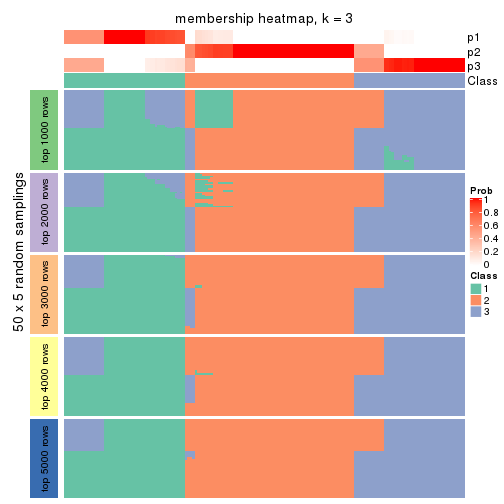</p>

</div>
<div id='tab-SD-NMF-membership-heatmap-3'>
<pre><code class="r">membership_heatmap(res, k = 4)
</code></pre>

<p></p>

</div>
<div id='tab-SD-NMF-membership-heatmap-4'>
<pre><code class="r">membership_heatmap(res, k = 5)
</code></pre>

<p></p>

</div>
<div id='tab-SD-NMF-membership-heatmap-5'>
<pre><code class="r">membership_heatmap(res, k = 6)
</code></pre>

<p></p>

</div>
</div>

As soon as we have had the classes for columns, we can look for signatures
which are significantly different between classes which can be candidate marks
for certain classes. Following are the heatmaps for signatures.


Signature heatmaps where rows are scaled:


<script>
$( function() {
	$( '#tabs-SD-NMF-get-signatures' ).tabs();
} );
</script>
<div id='tabs-SD-NMF-get-signatures'>
<ul>
<li><a href='#tab-SD-NMF-get-signatures-1'>k = 2</a></li>
<li><a href='#tab-SD-NMF-get-signatures-2'>k = 3</a></li>
<li><a href='#tab-SD-NMF-get-signatures-3'>k = 4</a></li>
<li><a href='#tab-SD-NMF-get-signatures-4'>k = 5</a></li>
<li><a href='#tab-SD-NMF-get-signatures-5'>k = 6</a></li>
</ul>
<div id='tab-SD-NMF-get-signatures-1'>
<pre><code class="r">get_signatures(res, k = 2)
</code></pre>

<p></p>

</div>
<div id='tab-SD-NMF-get-signatures-2'>
<pre><code class="r">get_signatures(res, k = 3)
</code></pre>

<p></p>

</div>
<div id='tab-SD-NMF-get-signatures-3'>
<pre><code class="r">get_signatures(res, k = 4)
</code></pre>

<p></p>

</div>
<div id='tab-SD-NMF-get-signatures-4'>
<pre><code class="r">get_signatures(res, k = 5)
</code></pre>

<p></p>

</div>
<div id='tab-SD-NMF-get-signatures-5'>
<pre><code class="r">get_signatures(res, k = 6)
</code></pre>

<p></p>

</div>
</div>


Signature heatmaps where rows are not scaled:


<script>
$( function() {
	$( '#tabs-SD-NMF-get-signatures-no-scale' ).tabs();
} );
</script>
<div id='tabs-SD-NMF-get-signatures-no-scale'>
<ul>
<li><a href='#tab-SD-NMF-get-signatures-no-scale-1'>k = 2</a></li>
<li><a href='#tab-SD-NMF-get-signatures-no-scale-2'>k = 3</a></li>
<li><a href='#tab-SD-NMF-get-signatures-no-scale-3'>k = 4</a></li>
<li><a href='#tab-SD-NMF-get-signatures-no-scale-4'>k = 5</a></li>
<li><a href='#tab-SD-NMF-get-signatures-no-scale-5'>k = 6</a></li>
</ul>
<div id='tab-SD-NMF-get-signatures-no-scale-1'>
<pre><code class="r">get_signatures(res, k = 2, scale_rows = FALSE)
</code></pre>

<p></p>

</div>
<div id='tab-SD-NMF-get-signatures-no-scale-2'>
<pre><code class="r">get_signatures(res, k = 3, scale_rows = FALSE)
</code></pre>

<p></p>

</div>
<div id='tab-SD-NMF-get-signatures-no-scale-3'>
<pre><code class="r">get_signatures(res, k = 4, scale_rows = FALSE)
</code></pre>

<p></p>

</div>
<div id='tab-SD-NMF-get-signatures-no-scale-4'>
<pre><code class="r">get_signatures(res, k = 5, scale_rows = FALSE)
</code></pre>

<p></p>

</div>
<div id='tab-SD-NMF-get-signatures-no-scale-5'>
<pre><code class="r">get_signatures(res, k = 6, scale_rows = FALSE)
</code></pre>

<p></p>

</div>
</div>


Compare the overlap of signatures from different k:

```r
compare_signatures(res)
```


`get_signature()` returns a data frame invisibly. TO get the list of signatures, the function
call should be assigned to a variable explicitly. In following code, if `plot` argument is set
to `FALSE`, no heatmap is plotted while only the differential analysis is performed.

```r
# code only for demonstration
tb = get_signature(res, k = ..., plot = FALSE)
```

An example of the output of `tb` is:

```
#>   which_row         fdr    mean_1    mean_2 scaled_mean_1 scaled_mean_2 km
#> 1        38 0.042760348  8.373488  9.131774    -0.5533452     0.5164555  1
#> 2        40 0.018707592  7.106213  8.469186    -0.6173731     0.5762149  1
#> 3        55 0.019134737 10.221463 11.207825    -0.6159697     0.5749050  1
#> 4        59 0.006059896  5.921854  7.869574    -0.6899429     0.6439467  1
#> 5        60 0.018055526  8.928898 10.211722    -0.6204761     0.5791110  1
#> 6        98 0.009384629 15.714769 14.887706     0.6635654    -0.6193277  2
...
```

The columns in `tb` are:

1. `which_row`: row indices corresponding to the input matrix.
2. `fdr`: FDR for the differential test. 
3. `mean_x`: The mean value in group x.
4. `scaled_mean_x`: The mean value in group x after rows are scaled.
5. `km`: Row groups if k-means clustering is applied to rows.


UMAP plot which shows how samples are separated.


<script>
$( function() {
	$( '#tabs-SD-NMF-dimension-reduction' ).tabs();
} );
</script>
<div id='tabs-SD-NMF-dimension-reduction'>
<ul>
<li><a href='#tab-SD-NMF-dimension-reduction-1'>k = 2</a></li>
<li><a href='#tab-SD-NMF-dimension-reduction-2'>k = 3</a></li>
<li><a href='#tab-SD-NMF-dimension-reduction-3'>k = 4</a></li>
<li><a href='#tab-SD-NMF-dimension-reduction-4'>k = 5</a></li>
<li><a href='#tab-SD-NMF-dimension-reduction-5'>k = 6</a></li>
</ul>
<div id='tab-SD-NMF-dimension-reduction-1'>
<pre><code class="r">dimension_reduction(res, k = 2, method = &quot;UMAP&quot;)
</code></pre>

<p></p>

</div>
<div id='tab-SD-NMF-dimension-reduction-2'>
<pre><code class="r">dimension_reduction(res, k = 3, method = &quot;UMAP&quot;)
</code></pre>

<p></p>

</div>
<div id='tab-SD-NMF-dimension-reduction-3'>
<pre><code class="r">dimension_reduction(res, k = 4, method = &quot;UMAP&quot;)
</code></pre>

<p></p>

</div>
<div id='tab-SD-NMF-dimension-reduction-4'>
<pre><code class="r">dimension_reduction(res, k = 5, method = &quot;UMAP&quot;)
</code></pre>

<p></p>

</div>
<div id='tab-SD-NMF-dimension-reduction-5'>
<pre><code class="r">dimension_reduction(res, k = 6, method = &quot;UMAP&quot;)
</code></pre>

<p></p>

</div>
</div>


Following heatmap shows how subgroups are split when increasing `k`:

```r
collect_classes(res)
```


If matrix rows can be associated to genes, consider to use `GO_Enrichment(res,
...)` to perform function enrichment for the signature genes.


 

---------------------------------------------------


### CV:hclust


The object with results only for a single top-value method and a single partition method 
can be extracted as:

```r
res = res_list["CV", "hclust"]
# you can also extract it by
# res = res_list["CV:hclust"]
```

A summary of `res` and all the functions that can be applied to it:

```r
res
```

```
#> A 'ConsensusPartition' object with k = 2, 3, 4, 5, 6.
#>   On a matrix with 15185 rows and 159 columns.
#>   Top rows (1000, 2000, 3000, 4000, 5000) are extracted by 'CV' method.
#>   Subgroups are detected by 'hclust' method.
#>   Performed in total 1250 partitions by row resampling.
#>   Best k for subgroups seems to be 5.
#> 
#> Following methods can be applied to this 'ConsensusPartition' object:
#>  [1] "cola_report"             "collect_classes"         "collect_plots"          
#>  [4] "collect_stats"           "colnames"                "compare_signatures"     
#>  [7] "consensus_heatmap"       "dimension_reduction"     "functional_enrichment"  
#> [10] "get_anno_col"            "get_anno"                "get_classes"            
#> [13] "get_consensus"           "get_matrix"              "get_membership"         
#> [16] "get_param"               "get_signatures"          "get_stats"              
#> [19] "is_best_k"               "is_stable_k"             "membership_heatmap"     
#> [22] "ncol"                    "nrow"                    "plot_ecdf"              
#> [25] "rownames"                "select_partition_number" "show"                   
#> [28] "suggest_best_k"          "test_to_known_factors"
```

`collect_plots()` function collects all the plots made from `res` for all `k` (number of partitions)
into one single page to provide an easy and fast comparison between different `k`.

```r
collect_plots(res)
```


The plots are:

- The first row: a plot of the ECDF (Empirical cumulative distribution
  function) curves of the consensus matrix for each `k` and the heatmap of
  predicted classes for each `k`.
- The second row: heatmaps of the consensus matrix for each `k`.
- The third row: heatmaps of the membership matrix for each `k`.
- The fouth row: heatmaps of the signatures for each `k`.

All the plots in panels can be made by individual functions and they are
plotted later in this section.

`select_partition_number()` produces several plots showing different
statistics for choosing "optimized" `k`. There are following statistics:

- ECDF curves of the consensus matrix for each `k`;
- 1-PAC. [The PAC
  score](https://en.wikipedia.org/wiki/Consensus_clustering#Over-interpretation_potential_of_consensus_clustering)
  measures the proportion of the ambiguous subgrouping.
- Mean silhouette score.
- Concordance. The mean probability of fiting the consensus class ids in all
  partitions.
- Area increased. Denote $A_k$ as the area under the ECDF curve for current
  `k`, the area increased is defined as $A_k - A_{k-1}$.
- Rand index. The percent of pairs of samples that are both in a same cluster
  or both are not in a same cluster in the partition of k and k-1.
- Jaccard index. The ratio of pairs of samples are both in a same cluster in
  the partition of k and k-1 and the pairs of samples are both in a same
  cluster in the partition k or k-1.

The detailed explanations of these statistics can be found in [the cola
vignette](http://bioconductor.org/packages/devel/bioc/vignettes/cola/inst/doc/cola.html#toc_13).

Generally speaking, lower PAC score, higher mean silhouette score or higher
concordance corresponds to better partition. Rand index and Jaccard index
measure how similar the current partition is compared to partition with `k-1`.
If they are too similar, we won't accept `k` is better than `k-1`.

```r
select_partition_number(res)
```


The numeric values for all these statistics can be obtained by `get_stats()`.

```r
get_stats(res)
```

```
#>   k 1-PAC mean_silhouette concordance area_increased  Rand Jaccard
#> 2 2 0.515           0.767       0.909         0.4712 0.519   0.519
#> 3 3 0.577           0.700       0.789         0.3683 0.780   0.605
#> 4 4 0.781           0.895       0.937         0.1558 0.878   0.676
#> 5 5 0.859           0.934       0.935         0.0520 0.962   0.850
#> 6 6 0.838           0.923       0.937         0.0518 0.959   0.812
```

`suggest_best_k()` suggests the best $k$ based on these statistics. The rules are as follows:

- All $k$ with Jaccard index larger than 0.95 are removed because the increase of
  the partition number does not provides enough extra information. If all $k$ are removed,
  the best $k$ is assigned by `NA`.
- For $k$ with 1-PAC larger than 0.9, the maximal $k$ is taken as the "best k". Other $k$ is called "optional k".
- If it does not fit the second rule. The $k$ with the highest vote of highest
  1-PAC, mean silhouette and concordance is taken as the "best k".

```r
suggest_best_k(res)
```

```
#> [1] 5
```


Following shows the table of the partitions (You need to click the **show/hide
code output** link to see it). The membership matrix (columns with name `p*`)
is inferred by
[`clue::cl_consensus()`](https://www.rdocumentation.org/link/cl_consensus?package=clue)
function with the `SE` method. Basically the value in the membership matrix
represents the probability to belong to a certain group. The finall class
label for an item is determined with the group with highest probability it
belongs to.

In `get_classes()` function, the entropy is calculated from the membership
matrix and the silhouette score is calculated from the consensus matrix.


<script>
$( function() {
	$( '#tabs-CV-hclust-get-classes' ).tabs();
} );
</script>
<div id='tabs-CV-hclust-get-classes'>
<ul>
<li><a href='#tab-CV-hclust-get-classes-1'>k = 2</a></li>
<li><a href='#tab-CV-hclust-get-classes-2'>k = 3</a></li>
<li><a href='#tab-CV-hclust-get-classes-3'>k = 4</a></li>
<li><a href='#tab-CV-hclust-get-classes-4'>k = 5</a></li>
<li><a href='#tab-CV-hclust-get-classes-5'>k = 6</a></li>
</ul>

<div id='tab-CV-hclust-get-classes-1'>
<p><a id='tab-CV-hclust-get-classes-1-a' style='color:#0366d6' href='#'>show/hide code output</a></p>
<pre><code class="r">cbind(get_classes(res, k = 2), get_membership(res, k = 2))
</code></pre>

<pre><code>#&gt;            class entropy silhouette    p1    p2
#&gt; SRR1706767     1   0.000      0.891 1.000 0.000
#&gt; SRR1706768     1   0.000      0.891 1.000 0.000
#&gt; SRR1706769     1   0.000      0.891 1.000 0.000
#&gt; SRR1706770     1   0.000      0.891 1.000 0.000
#&gt; SRR1706771     1   0.000      0.891 1.000 0.000
#&gt; SRR1706772     1   0.000      0.891 1.000 0.000
#&gt; SRR1706773     1   0.000      0.891 1.000 0.000
#&gt; SRR1706774     1   0.000      0.891 1.000 0.000
#&gt; SRR1706775     2   0.482      0.822 0.104 0.896
#&gt; SRR1706776     2   0.482      0.822 0.104 0.896
#&gt; SRR1706777     2   0.482      0.822 0.104 0.896
#&gt; SRR1706778     2   0.482      0.822 0.104 0.896
#&gt; SRR1706779     2   0.000      0.886 0.000 1.000
#&gt; SRR1706780     2   0.000      0.886 0.000 1.000
#&gt; SRR1706781     2   0.000      0.886 0.000 1.000
#&gt; SRR1706782     2   0.000      0.886 0.000 1.000
#&gt; SRR1706783     2   0.000      0.886 0.000 1.000
#&gt; SRR1706784     2   0.000      0.886 0.000 1.000
#&gt; SRR1706785     2   0.000      0.886 0.000 1.000
#&gt; SRR1706786     2   0.000      0.886 0.000 1.000
#&gt; SRR1706787     1   0.000      0.891 1.000 0.000
#&gt; SRR1706788     1   0.000      0.891 1.000 0.000
#&gt; SRR1706789     1   0.000      0.891 1.000 0.000
#&gt; SRR1706790     1   0.000      0.891 1.000 0.000
#&gt; SRR1706791     1   0.000      0.891 1.000 0.000
#&gt; SRR1706792     1   0.000      0.891 1.000 0.000
#&gt; SRR1706793     1   0.000      0.891 1.000 0.000
#&gt; SRR1706794     1   0.000      0.891 1.000 0.000
#&gt; SRR1706795     2   0.482      0.822 0.104 0.896
#&gt; SRR1706796     2   0.482      0.822 0.104 0.896
#&gt; SRR1706797     2   0.482      0.822 0.104 0.896
#&gt; SRR1706798     2   0.482      0.822 0.104 0.896
#&gt; SRR1706799     2   0.000      0.886 0.000 1.000
#&gt; SRR1706800     2   0.000      0.886 0.000 1.000
#&gt; SRR1706801     2   0.000      0.886 0.000 1.000
#&gt; SRR1706802     2   0.000      0.886 0.000 1.000
#&gt; SRR1706803     2   0.000      0.886 0.000 1.000
#&gt; SRR1706804     2   0.000      0.886 0.000 1.000
#&gt; SRR1706805     2   0.000      0.886 0.000 1.000
#&gt; SRR1706806     2   0.000      0.886 0.000 1.000
#&gt; SRR1706811     1   0.000      0.891 1.000 0.000
#&gt; SRR1706812     1   0.000      0.891 1.000 0.000
#&gt; SRR1706813     1   0.000      0.891 1.000 0.000
#&gt; SRR1706814     1   0.000      0.891 1.000 0.000
#&gt; SRR1706807     1   0.000      0.891 1.000 0.000
#&gt; SRR1706808     1   0.000      0.891 1.000 0.000
#&gt; SRR1706809     1   0.000      0.891 1.000 0.000
#&gt; SRR1706810     1   0.000      0.891 1.000 0.000
#&gt; SRR1706815     2   0.482      0.822 0.104 0.896
#&gt; SRR1706816     2   0.482      0.822 0.104 0.896
#&gt; SRR1706817     2   0.482      0.822 0.104 0.896
#&gt; SRR1706818     2   0.482      0.822 0.104 0.896
#&gt; SRR1706819     2   0.000      0.886 0.000 1.000
#&gt; SRR1706820     2   0.000      0.886 0.000 1.000
#&gt; SRR1706821     2   0.000      0.886 0.000 1.000
#&gt; SRR1706822     2   0.000      0.886 0.000 1.000
#&gt; SRR1706823     2   0.000      0.886 0.000 1.000
#&gt; SRR1706824     2   0.000      0.886 0.000 1.000
#&gt; SRR1706825     2   0.000      0.886 0.000 1.000
#&gt; SRR1706826     2   0.000      0.886 0.000 1.000
#&gt; SRR1706827     1   0.000      0.891 1.000 0.000
#&gt; SRR1706828     1   0.000      0.891 1.000 0.000
#&gt; SRR1706829     1   0.000      0.891 1.000 0.000
#&gt; SRR1706830     1   0.000      0.891 1.000 0.000
#&gt; SRR1706835     2   0.482      0.822 0.104 0.896
#&gt; SRR1706836     2   0.482      0.822 0.104 0.896
#&gt; SRR1706837     2   0.482      0.822 0.104 0.896
#&gt; SRR1706838     2   0.482      0.822 0.104 0.896
#&gt; SRR1706831     1   0.000      0.891 1.000 0.000
#&gt; SRR1706832     1   0.000      0.891 1.000 0.000
#&gt; SRR1706833     1   0.000      0.891 1.000 0.000
#&gt; SRR1706834     1   0.000      0.891 1.000 0.000
#&gt; SRR1706839     2   0.000      0.886 0.000 1.000
#&gt; SRR1706840     2   0.000      0.886 0.000 1.000
#&gt; SRR1706841     2   0.000      0.886 0.000 1.000
#&gt; SRR1706842     2   0.000      0.886 0.000 1.000
#&gt; SRR1706847     1   0.000      0.891 1.000 0.000
#&gt; SRR1706848     1   0.000      0.891 1.000 0.000
#&gt; SRR1706849     1   0.000      0.891 1.000 0.000
#&gt; SRR1706850     1   0.000      0.891 1.000 0.000
#&gt; SRR1706843     2   0.000      0.886 0.000 1.000
#&gt; SRR1706844     2   0.000      0.886 0.000 1.000
#&gt; SRR1706845     2   0.000      0.886 0.000 1.000
#&gt; SRR1706846     2   0.000      0.886 0.000 1.000
#&gt; SRR1706851     1   0.925      0.513 0.660 0.340
#&gt; SRR1706852     1   0.925      0.513 0.660 0.340
#&gt; SRR1706853     1   0.925      0.513 0.660 0.340
#&gt; SRR1706854     1   0.925      0.513 0.660 0.340
#&gt; SRR1706855     2   0.995      0.129 0.460 0.540
#&gt; SRR1706856     2   0.995      0.129 0.460 0.540
#&gt; SRR1706857     2   0.995      0.129 0.460 0.540
#&gt; SRR1706858     2   0.995      0.129 0.460 0.540
#&gt; SRR1706859     2   0.000      0.886 0.000 1.000
#&gt; SRR1706860     2   0.000      0.886 0.000 1.000
#&gt; SRR1706861     2   0.000      0.886 0.000 1.000
#&gt; SRR1706862     2   0.000      0.886 0.000 1.000
#&gt; SRR1706867     1   0.000      0.891 1.000 0.000
#&gt; SRR1706869     1   0.000      0.891 1.000 0.000
#&gt; SRR1706870     1   0.000      0.891 1.000 0.000
#&gt; SRR1706863     2   0.000      0.886 0.000 1.000
#&gt; SRR1706864     2   0.000      0.886 0.000 1.000
#&gt; SRR1706865     2   0.000      0.886 0.000 1.000
#&gt; SRR1706866     2   0.000      0.886 0.000 1.000
#&gt; SRR1706871     1   0.925      0.513 0.660 0.340
#&gt; SRR1706872     1   0.925      0.513 0.660 0.340
#&gt; SRR1706873     1   0.925      0.513 0.660 0.340
#&gt; SRR1706874     1   0.925      0.513 0.660 0.340
#&gt; SRR1706879     2   0.000      0.886 0.000 1.000
#&gt; SRR1706880     2   0.000      0.886 0.000 1.000
#&gt; SRR1706881     2   0.000      0.886 0.000 1.000
#&gt; SRR1706882     2   0.000      0.886 0.000 1.000
#&gt; SRR1706883     2   0.000      0.886 0.000 1.000
#&gt; SRR1706884     2   0.000      0.886 0.000 1.000
#&gt; SRR1706885     2   0.000      0.886 0.000 1.000
#&gt; SRR1706886     2   0.000      0.886 0.000 1.000
#&gt; SRR1706875     2   0.995      0.129 0.460 0.540
#&gt; SRR1706876     2   0.995      0.129 0.460 0.540
#&gt; SRR1706877     2   0.995      0.129 0.460 0.540
#&gt; SRR1706878     2   0.995      0.129 0.460 0.540
#&gt; SRR1706887     1   0.000      0.891 1.000 0.000
#&gt; SRR1706888     1   0.000      0.891 1.000 0.000
#&gt; SRR1706889     1   0.000      0.891 1.000 0.000
#&gt; SRR1706890     1   0.000      0.891 1.000 0.000
#&gt; SRR1706891     1   0.925      0.513 0.660 0.340
#&gt; SRR1706892     1   0.925      0.513 0.660 0.340
#&gt; SRR1706893     1   0.925      0.513 0.660 0.340
#&gt; SRR1706894     1   0.925      0.513 0.660 0.340
#&gt; SRR1706895     2   0.995      0.129 0.460 0.540
#&gt; SRR1706896     2   0.995      0.129 0.460 0.540
#&gt; SRR1706897     2   0.995      0.129 0.460 0.540
#&gt; SRR1706898     2   0.995      0.129 0.460 0.540
#&gt; SRR1706899     2   0.000      0.886 0.000 1.000
#&gt; SRR1706900     2   0.000      0.886 0.000 1.000
#&gt; SRR1706901     2   0.000      0.886 0.000 1.000
#&gt; SRR1706902     2   0.000      0.886 0.000 1.000
#&gt; SRR1706907     1   0.000      0.891 1.000 0.000
#&gt; SRR1706908     1   0.000      0.891 1.000 0.000
#&gt; SRR1706909     1   0.000      0.891 1.000 0.000
#&gt; SRR1706910     1   0.000      0.891 1.000 0.000
#&gt; SRR1706903     2   0.000      0.886 0.000 1.000
#&gt; SRR1706904     2   0.000      0.886 0.000 1.000
#&gt; SRR1706905     2   0.000      0.886 0.000 1.000
#&gt; SRR1706906     2   0.000      0.886 0.000 1.000
#&gt; SRR1706911     1   0.925      0.513 0.660 0.340
#&gt; SRR1706912     1   0.925      0.513 0.660 0.340
#&gt; SRR1706913     1   0.925      0.513 0.660 0.340
#&gt; SRR1706914     1   0.925      0.513 0.660 0.340
#&gt; SRR1706919     2   0.000      0.886 0.000 1.000
#&gt; SRR1706920     2   0.000      0.886 0.000 1.000
#&gt; SRR1706921     2   0.000      0.886 0.000 1.000
#&gt; SRR1706922     2   0.000      0.886 0.000 1.000
#&gt; SRR1706915     2   0.995      0.129 0.460 0.540
#&gt; SRR1706916     2   0.995      0.129 0.460 0.540
#&gt; SRR1706917     2   0.995      0.129 0.460 0.540
#&gt; SRR1706918     2   0.995      0.129 0.460 0.540
#&gt; SRR1706923     2   0.000      0.886 0.000 1.000
#&gt; SRR1706924     2   0.000      0.886 0.000 1.000
#&gt; SRR1706925     2   0.000      0.886 0.000 1.000
#&gt; SRR1706926     2   0.000      0.886 0.000 1.000
</code></pre>

<script>
$('#tab-CV-hclust-get-classes-1-a').parent().next().next().hide();
$('#tab-CV-hclust-get-classes-1-a').click(function(){
  $('#tab-CV-hclust-get-classes-1-a').parent().next().next().toggle();
  return(false);
});
</script>
</div>

<div id='tab-CV-hclust-get-classes-2'>
<p><a id='tab-CV-hclust-get-classes-2-a' style='color:#0366d6' href='#'>show/hide code output</a></p>
<pre><code class="r">cbind(get_classes(res, k = 3), get_membership(res, k = 3))
</code></pre>

<pre><code>#&gt;            class entropy silhouette    p1    p2    p3
#&gt; SRR1706767     1  0.0000      0.997 1.000 0.000 0.000
#&gt; SRR1706768     1  0.0000      0.997 1.000 0.000 0.000
#&gt; SRR1706769     1  0.0000      0.997 1.000 0.000 0.000
#&gt; SRR1706770     1  0.0000      0.997 1.000 0.000 0.000
#&gt; SRR1706771     1  0.0237      0.997 0.996 0.000 0.004
#&gt; SRR1706772     1  0.0237      0.997 0.996 0.000 0.004
#&gt; SRR1706773     1  0.0237      0.997 0.996 0.000 0.004
#&gt; SRR1706774     1  0.0237      0.997 0.996 0.000 0.004
#&gt; SRR1706775     2  0.3193      0.698 0.100 0.896 0.004
#&gt; SRR1706776     2  0.3193      0.698 0.100 0.896 0.004
#&gt; SRR1706777     2  0.3193      0.698 0.100 0.896 0.004
#&gt; SRR1706778     2  0.3193      0.698 0.100 0.896 0.004
#&gt; SRR1706779     2  0.0000      0.748 0.000 1.000 0.000
#&gt; SRR1706780     2  0.0000      0.748 0.000 1.000 0.000
#&gt; SRR1706781     2  0.0000      0.748 0.000 1.000 0.000
#&gt; SRR1706782     2  0.0000      0.748 0.000 1.000 0.000
#&gt; SRR1706783     2  0.0000      0.748 0.000 1.000 0.000
#&gt; SRR1706784     2  0.0000      0.748 0.000 1.000 0.000
#&gt; SRR1706785     2  0.0000      0.748 0.000 1.000 0.000
#&gt; SRR1706786     2  0.0000      0.748 0.000 1.000 0.000
#&gt; SRR1706787     1  0.0000      0.997 1.000 0.000 0.000
#&gt; SRR1706788     1  0.0000      0.997 1.000 0.000 0.000
#&gt; SRR1706789     1  0.0000      0.997 1.000 0.000 0.000
#&gt; SRR1706790     1  0.0000      0.997 1.000 0.000 0.000
#&gt; SRR1706791     1  0.0237      0.997 0.996 0.000 0.004
#&gt; SRR1706792     1  0.0237      0.997 0.996 0.000 0.004
#&gt; SRR1706793     1  0.0237      0.997 0.996 0.000 0.004
#&gt; SRR1706794     1  0.0237      0.997 0.996 0.000 0.004
#&gt; SRR1706795     2  0.3193      0.698 0.100 0.896 0.004
#&gt; SRR1706796     2  0.3193      0.698 0.100 0.896 0.004
#&gt; SRR1706797     2  0.3193      0.698 0.100 0.896 0.004
#&gt; SRR1706798     2  0.3193      0.698 0.100 0.896 0.004
#&gt; SRR1706799     2  0.0000      0.748 0.000 1.000 0.000
#&gt; SRR1706800     2  0.0000      0.748 0.000 1.000 0.000
#&gt; SRR1706801     2  0.0000      0.748 0.000 1.000 0.000
#&gt; SRR1706802     2  0.0000      0.748 0.000 1.000 0.000
#&gt; SRR1706803     2  0.0000      0.748 0.000 1.000 0.000
#&gt; SRR1706804     2  0.0000      0.748 0.000 1.000 0.000
#&gt; SRR1706805     2  0.0000      0.748 0.000 1.000 0.000
#&gt; SRR1706806     2  0.0000      0.748 0.000 1.000 0.000
#&gt; SRR1706811     1  0.0237      0.997 0.996 0.000 0.004
#&gt; SRR1706812     1  0.0237      0.997 0.996 0.000 0.004
#&gt; SRR1706813     1  0.0237      0.997 0.996 0.000 0.004
#&gt; SRR1706814     1  0.0237      0.997 0.996 0.000 0.004
#&gt; SRR1706807     1  0.0000      0.997 1.000 0.000 0.000
#&gt; SRR1706808     1  0.0000      0.997 1.000 0.000 0.000
#&gt; SRR1706809     1  0.0000      0.997 1.000 0.000 0.000
#&gt; SRR1706810     1  0.0000      0.997 1.000 0.000 0.000
#&gt; SRR1706815     2  0.3193      0.698 0.100 0.896 0.004
#&gt; SRR1706816     2  0.3193      0.698 0.100 0.896 0.004
#&gt; SRR1706817     2  0.3193      0.698 0.100 0.896 0.004
#&gt; SRR1706818     2  0.3193      0.698 0.100 0.896 0.004
#&gt; SRR1706819     2  0.0000      0.748 0.000 1.000 0.000
#&gt; SRR1706820     2  0.0000      0.748 0.000 1.000 0.000
#&gt; SRR1706821     2  0.0000      0.748 0.000 1.000 0.000
#&gt; SRR1706822     2  0.0000      0.748 0.000 1.000 0.000
#&gt; SRR1706823     2  0.0000      0.748 0.000 1.000 0.000
#&gt; SRR1706824     2  0.0000      0.748 0.000 1.000 0.000
#&gt; SRR1706825     2  0.0000      0.748 0.000 1.000 0.000
#&gt; SRR1706826     2  0.0000      0.748 0.000 1.000 0.000
#&gt; SRR1706827     1  0.0000      0.997 1.000 0.000 0.000
#&gt; SRR1706828     1  0.0000      0.997 1.000 0.000 0.000
#&gt; SRR1706829     1  0.0000      0.997 1.000 0.000 0.000
#&gt; SRR1706830     1  0.0000      0.997 1.000 0.000 0.000
#&gt; SRR1706835     2  0.3193      0.698 0.100 0.896 0.004
#&gt; SRR1706836     2  0.3193      0.698 0.100 0.896 0.004
#&gt; SRR1706837     2  0.3193      0.698 0.100 0.896 0.004
#&gt; SRR1706838     2  0.3193      0.698 0.100 0.896 0.004
#&gt; SRR1706831     1  0.0237      0.997 0.996 0.000 0.004
#&gt; SRR1706832     1  0.0237      0.997 0.996 0.000 0.004
#&gt; SRR1706833     1  0.0237      0.997 0.996 0.000 0.004
#&gt; SRR1706834     1  0.0237      0.997 0.996 0.000 0.004
#&gt; SRR1706839     2  0.0000      0.748 0.000 1.000 0.000
#&gt; SRR1706840     2  0.0000      0.748 0.000 1.000 0.000
#&gt; SRR1706841     2  0.0000      0.748 0.000 1.000 0.000
#&gt; SRR1706842     2  0.0000      0.748 0.000 1.000 0.000
#&gt; SRR1706847     3  0.6305      0.325 0.484 0.000 0.516
#&gt; SRR1706848     3  0.6305      0.325 0.484 0.000 0.516
#&gt; SRR1706849     3  0.6305      0.325 0.484 0.000 0.516
#&gt; SRR1706850     3  0.6305      0.325 0.484 0.000 0.516
#&gt; SRR1706843     2  0.0000      0.748 0.000 1.000 0.000
#&gt; SRR1706844     2  0.0000      0.748 0.000 1.000 0.000
#&gt; SRR1706845     2  0.0000      0.748 0.000 1.000 0.000
#&gt; SRR1706846     2  0.0000      0.748 0.000 1.000 0.000
#&gt; SRR1706851     3  0.3686      0.736 0.140 0.000 0.860
#&gt; SRR1706852     3  0.3686      0.736 0.140 0.000 0.860
#&gt; SRR1706853     3  0.3686      0.736 0.140 0.000 0.860
#&gt; SRR1706854     3  0.3686      0.736 0.140 0.000 0.860
#&gt; SRR1706855     3  0.2066      0.663 0.000 0.060 0.940
#&gt; SRR1706856     3  0.2066      0.663 0.000 0.060 0.940
#&gt; SRR1706857     3  0.2066      0.663 0.000 0.060 0.940
#&gt; SRR1706858     3  0.2066      0.663 0.000 0.060 0.940
#&gt; SRR1706859     2  0.6302      0.533 0.000 0.520 0.480
#&gt; SRR1706860     2  0.6302      0.533 0.000 0.520 0.480
#&gt; SRR1706861     2  0.6302      0.533 0.000 0.520 0.480
#&gt; SRR1706862     2  0.6302      0.533 0.000 0.520 0.480
#&gt; SRR1706867     3  0.6305      0.325 0.484 0.000 0.516
#&gt; SRR1706869     3  0.6305      0.325 0.484 0.000 0.516
#&gt; SRR1706870     3  0.6305      0.325 0.484 0.000 0.516
#&gt; SRR1706863     2  0.6302      0.533 0.000 0.520 0.480
#&gt; SRR1706864     2  0.6302      0.533 0.000 0.520 0.480
#&gt; SRR1706865     2  0.6302      0.533 0.000 0.520 0.480
#&gt; SRR1706866     2  0.6302      0.533 0.000 0.520 0.480
#&gt; SRR1706871     3  0.3686      0.736 0.140 0.000 0.860
#&gt; SRR1706872     3  0.3686      0.736 0.140 0.000 0.860
#&gt; SRR1706873     3  0.3686      0.736 0.140 0.000 0.860
#&gt; SRR1706874     3  0.3686      0.736 0.140 0.000 0.860
#&gt; SRR1706879     2  0.6302      0.533 0.000 0.520 0.480
#&gt; SRR1706880     2  0.6302      0.533 0.000 0.520 0.480
#&gt; SRR1706881     2  0.6302      0.533 0.000 0.520 0.480
#&gt; SRR1706882     2  0.6302      0.533 0.000 0.520 0.480
#&gt; SRR1706883     2  0.6302      0.533 0.000 0.520 0.480
#&gt; SRR1706884     2  0.6302      0.533 0.000 0.520 0.480
#&gt; SRR1706885     2  0.6302      0.533 0.000 0.520 0.480
#&gt; SRR1706886     2  0.6302      0.533 0.000 0.520 0.480
#&gt; SRR1706875     3  0.2066      0.663 0.000 0.060 0.940
#&gt; SRR1706876     3  0.2066      0.663 0.000 0.060 0.940
#&gt; SRR1706877     3  0.2066      0.663 0.000 0.060 0.940
#&gt; SRR1706878     3  0.2066      0.663 0.000 0.060 0.940
#&gt; SRR1706887     3  0.6305      0.325 0.484 0.000 0.516
#&gt; SRR1706888     3  0.6305      0.325 0.484 0.000 0.516
#&gt; SRR1706889     3  0.6305      0.325 0.484 0.000 0.516
#&gt; SRR1706890     3  0.6305      0.325 0.484 0.000 0.516
#&gt; SRR1706891     3  0.3686      0.736 0.140 0.000 0.860
#&gt; SRR1706892     3  0.3686      0.736 0.140 0.000 0.860
#&gt; SRR1706893     3  0.3686      0.736 0.140 0.000 0.860
#&gt; SRR1706894     3  0.3686      0.736 0.140 0.000 0.860
#&gt; SRR1706895     3  0.2066      0.663 0.000 0.060 0.940
#&gt; SRR1706896     3  0.2066      0.663 0.000 0.060 0.940
#&gt; SRR1706897     3  0.2066      0.663 0.000 0.060 0.940
#&gt; SRR1706898     3  0.2066      0.663 0.000 0.060 0.940
#&gt; SRR1706899     2  0.6302      0.533 0.000 0.520 0.480
#&gt; SRR1706900     2  0.6302      0.533 0.000 0.520 0.480
#&gt; SRR1706901     2  0.6302      0.533 0.000 0.520 0.480
#&gt; SRR1706902     2  0.6302      0.533 0.000 0.520 0.480
#&gt; SRR1706907     3  0.6305      0.325 0.484 0.000 0.516
#&gt; SRR1706908     3  0.6305      0.325 0.484 0.000 0.516
#&gt; SRR1706909     3  0.6305      0.325 0.484 0.000 0.516
#&gt; SRR1706910     3  0.6305      0.325 0.484 0.000 0.516
#&gt; SRR1706903     2  0.6302      0.533 0.000 0.520 0.480
#&gt; SRR1706904     2  0.6302      0.533 0.000 0.520 0.480
#&gt; SRR1706905     2  0.6302      0.533 0.000 0.520 0.480
#&gt; SRR1706906     2  0.6302      0.533 0.000 0.520 0.480
#&gt; SRR1706911     3  0.3686      0.736 0.140 0.000 0.860
#&gt; SRR1706912     3  0.3686      0.736 0.140 0.000 0.860
#&gt; SRR1706913     3  0.3686      0.736 0.140 0.000 0.860
#&gt; SRR1706914     3  0.3686      0.736 0.140 0.000 0.860
#&gt; SRR1706919     2  0.6302      0.533 0.000 0.520 0.480
#&gt; SRR1706920     2  0.6302      0.533 0.000 0.520 0.480
#&gt; SRR1706921     2  0.6302      0.533 0.000 0.520 0.480
#&gt; SRR1706922     2  0.6302      0.533 0.000 0.520 0.480
#&gt; SRR1706915     3  0.2066      0.663 0.000 0.060 0.940
#&gt; SRR1706916     3  0.2066      0.663 0.000 0.060 0.940
#&gt; SRR1706917     3  0.2066      0.663 0.000 0.060 0.940
#&gt; SRR1706918     3  0.2066      0.663 0.000 0.060 0.940
#&gt; SRR1706923     2  0.6302      0.533 0.000 0.520 0.480
#&gt; SRR1706924     2  0.6302      0.533 0.000 0.520 0.480
#&gt; SRR1706925     2  0.6302      0.533 0.000 0.520 0.480
#&gt; SRR1706926     2  0.6302      0.533 0.000 0.520 0.480
</code></pre>

<script>
$('#tab-CV-hclust-get-classes-2-a').parent().next().next().hide();
$('#tab-CV-hclust-get-classes-2-a').click(function(){
  $('#tab-CV-hclust-get-classes-2-a').parent().next().next().toggle();
  return(false);
});
</script>
</div>

<div id='tab-CV-hclust-get-classes-3'>
<p><a id='tab-CV-hclust-get-classes-3-a' style='color:#0366d6' href='#'>show/hide code output</a></p>
<pre><code class="r">cbind(get_classes(res, k = 4), get_membership(res, k = 4))
</code></pre>

<pre><code>#&gt;            class entropy silhouette    p1  p2    p3    p4
#&gt; SRR1706767     4  0.0000      0.997 0.000 0.0 0.000 1.000
#&gt; SRR1706768     4  0.0000      0.997 0.000 0.0 0.000 1.000
#&gt; SRR1706769     4  0.0000      0.997 0.000 0.0 0.000 1.000
#&gt; SRR1706770     4  0.0000      0.997 0.000 0.0 0.000 1.000
#&gt; SRR1706771     4  0.0188      0.997 0.000 0.0 0.004 0.996
#&gt; SRR1706772     4  0.0188      0.997 0.000 0.0 0.004 0.996
#&gt; SRR1706773     4  0.0188      0.997 0.000 0.0 0.004 0.996
#&gt; SRR1706774     4  0.0188      0.997 0.000 0.0 0.004 0.996
#&gt; SRR1706775     1  0.2530      0.923 0.896 0.0 0.004 0.100
#&gt; SRR1706776     1  0.2530      0.923 0.896 0.0 0.004 0.100
#&gt; SRR1706777     1  0.2530      0.923 0.896 0.0 0.004 0.100
#&gt; SRR1706778     1  0.2530      0.923 0.896 0.0 0.004 0.100
#&gt; SRR1706779     1  0.0000      0.964 1.000 0.0 0.000 0.000
#&gt; SRR1706780     1  0.0000      0.964 1.000 0.0 0.000 0.000
#&gt; SRR1706781     1  0.0000      0.964 1.000 0.0 0.000 0.000
#&gt; SRR1706782     1  0.0000      0.964 1.000 0.0 0.000 0.000
#&gt; SRR1706783     1  0.0000      0.964 1.000 0.0 0.000 0.000
#&gt; SRR1706784     1  0.0000      0.964 1.000 0.0 0.000 0.000
#&gt; SRR1706785     1  0.0000      0.964 1.000 0.0 0.000 0.000
#&gt; SRR1706786     1  0.0000      0.964 1.000 0.0 0.000 0.000
#&gt; SRR1706787     4  0.0000      0.997 0.000 0.0 0.000 1.000
#&gt; SRR1706788     4  0.0000      0.997 0.000 0.0 0.000 1.000
#&gt; SRR1706789     4  0.0000      0.997 0.000 0.0 0.000 1.000
#&gt; SRR1706790     4  0.0000      0.997 0.000 0.0 0.000 1.000
#&gt; SRR1706791     4  0.0188      0.997 0.000 0.0 0.004 0.996
#&gt; SRR1706792     4  0.0188      0.997 0.000 0.0 0.004 0.996
#&gt; SRR1706793     4  0.0188      0.997 0.000 0.0 0.004 0.996
#&gt; SRR1706794     4  0.0188      0.997 0.000 0.0 0.004 0.996
#&gt; SRR1706795     1  0.2530      0.923 0.896 0.0 0.004 0.100
#&gt; SRR1706796     1  0.2530      0.923 0.896 0.0 0.004 0.100
#&gt; SRR1706797     1  0.2530      0.923 0.896 0.0 0.004 0.100
#&gt; SRR1706798     1  0.2530      0.923 0.896 0.0 0.004 0.100
#&gt; SRR1706799     1  0.0000      0.964 1.000 0.0 0.000 0.000
#&gt; SRR1706800     1  0.0000      0.964 1.000 0.0 0.000 0.000
#&gt; SRR1706801     1  0.0000      0.964 1.000 0.0 0.000 0.000
#&gt; SRR1706802     1  0.0000      0.964 1.000 0.0 0.000 0.000
#&gt; SRR1706803     1  0.0000      0.964 1.000 0.0 0.000 0.000
#&gt; SRR1706804     1  0.0000      0.964 1.000 0.0 0.000 0.000
#&gt; SRR1706805     1  0.0000      0.964 1.000 0.0 0.000 0.000
#&gt; SRR1706806     1  0.0000      0.964 1.000 0.0 0.000 0.000
#&gt; SRR1706811     4  0.0188      0.997 0.000 0.0 0.004 0.996
#&gt; SRR1706812     4  0.0188      0.997 0.000 0.0 0.004 0.996
#&gt; SRR1706813     4  0.0188      0.997 0.000 0.0 0.004 0.996
#&gt; SRR1706814     4  0.0188      0.997 0.000 0.0 0.004 0.996
#&gt; SRR1706807     4  0.0000      0.997 0.000 0.0 0.000 1.000
#&gt; SRR1706808     4  0.0000      0.997 0.000 0.0 0.000 1.000
#&gt; SRR1706809     4  0.0000      0.997 0.000 0.0 0.000 1.000
#&gt; SRR1706810     4  0.0000      0.997 0.000 0.0 0.000 1.000
#&gt; SRR1706815     1  0.2530      0.923 0.896 0.0 0.004 0.100
#&gt; SRR1706816     1  0.2530      0.923 0.896 0.0 0.004 0.100
#&gt; SRR1706817     1  0.2530      0.923 0.896 0.0 0.004 0.100
#&gt; SRR1706818     1  0.2530      0.923 0.896 0.0 0.004 0.100
#&gt; SRR1706819     1  0.0000      0.964 1.000 0.0 0.000 0.000
#&gt; SRR1706820     1  0.0000      0.964 1.000 0.0 0.000 0.000
#&gt; SRR1706821     1  0.0000      0.964 1.000 0.0 0.000 0.000
#&gt; SRR1706822     1  0.0000      0.964 1.000 0.0 0.000 0.000
#&gt; SRR1706823     1  0.0000      0.964 1.000 0.0 0.000 0.000
#&gt; SRR1706824     1  0.0000      0.964 1.000 0.0 0.000 0.000
#&gt; SRR1706825     1  0.0000      0.964 1.000 0.0 0.000 0.000
#&gt; SRR1706826     1  0.0000      0.964 1.000 0.0 0.000 0.000
#&gt; SRR1706827     4  0.0000      0.997 0.000 0.0 0.000 1.000
#&gt; SRR1706828     4  0.0000      0.997 0.000 0.0 0.000 1.000
#&gt; SRR1706829     4  0.0000      0.997 0.000 0.0 0.000 1.000
#&gt; SRR1706830     4  0.0000      0.997 0.000 0.0 0.000 1.000
#&gt; SRR1706835     1  0.2530      0.923 0.896 0.0 0.004 0.100
#&gt; SRR1706836     1  0.2530      0.923 0.896 0.0 0.004 0.100
#&gt; SRR1706837     1  0.2530      0.923 0.896 0.0 0.004 0.100
#&gt; SRR1706838     1  0.2530      0.923 0.896 0.0 0.004 0.100
#&gt; SRR1706831     4  0.0188      0.997 0.000 0.0 0.004 0.996
#&gt; SRR1706832     4  0.0188      0.997 0.000 0.0 0.004 0.996
#&gt; SRR1706833     4  0.0188      0.997 0.000 0.0 0.004 0.996
#&gt; SRR1706834     4  0.0188      0.997 0.000 0.0 0.004 0.996
#&gt; SRR1706839     1  0.0000      0.964 1.000 0.0 0.000 0.000
#&gt; SRR1706840     1  0.0000      0.964 1.000 0.0 0.000 0.000
#&gt; SRR1706841     1  0.0000      0.964 1.000 0.0 0.000 0.000
#&gt; SRR1706842     1  0.0000      0.964 1.000 0.0 0.000 0.000
#&gt; SRR1706847     3  0.4643      0.569 0.000 0.0 0.656 0.344
#&gt; SRR1706848     3  0.4643      0.569 0.000 0.0 0.656 0.344
#&gt; SRR1706849     3  0.4643      0.569 0.000 0.0 0.656 0.344
#&gt; SRR1706850     3  0.4643      0.569 0.000 0.0 0.656 0.344
#&gt; SRR1706843     1  0.0000      0.964 1.000 0.0 0.000 0.000
#&gt; SRR1706844     1  0.0000      0.964 1.000 0.0 0.000 0.000
#&gt; SRR1706845     1  0.0000      0.964 1.000 0.0 0.000 0.000
#&gt; SRR1706846     1  0.0000      0.964 1.000 0.0 0.000 0.000
#&gt; SRR1706851     3  0.0000      0.791 0.000 0.0 1.000 0.000
#&gt; SRR1706852     3  0.0000      0.791 0.000 0.0 1.000 0.000
#&gt; SRR1706853     3  0.0000      0.791 0.000 0.0 1.000 0.000
#&gt; SRR1706854     3  0.0000      0.791 0.000 0.0 1.000 0.000
#&gt; SRR1706855     3  0.3610      0.720 0.000 0.2 0.800 0.000
#&gt; SRR1706856     3  0.3610      0.720 0.000 0.2 0.800 0.000
#&gt; SRR1706857     3  0.3610      0.720 0.000 0.2 0.800 0.000
#&gt; SRR1706858     3  0.3610      0.720 0.000 0.2 0.800 0.000
#&gt; SRR1706859     2  0.0000      1.000 0.000 1.0 0.000 0.000
#&gt; SRR1706860     2  0.0000      1.000 0.000 1.0 0.000 0.000
#&gt; SRR1706861     2  0.0000      1.000 0.000 1.0 0.000 0.000
#&gt; SRR1706862     2  0.0000      1.000 0.000 1.0 0.000 0.000
#&gt; SRR1706867     3  0.4643      0.569 0.000 0.0 0.656 0.344
#&gt; SRR1706869     3  0.4643      0.569 0.000 0.0 0.656 0.344
#&gt; SRR1706870     3  0.4643      0.569 0.000 0.0 0.656 0.344
#&gt; SRR1706863     2  0.0000      1.000 0.000 1.0 0.000 0.000
#&gt; SRR1706864     2  0.0000      1.000 0.000 1.0 0.000 0.000
#&gt; SRR1706865     2  0.0000      1.000 0.000 1.0 0.000 0.000
#&gt; SRR1706866     2  0.0000      1.000 0.000 1.0 0.000 0.000
#&gt; SRR1706871     3  0.0000      0.791 0.000 0.0 1.000 0.000
#&gt; SRR1706872     3  0.0000      0.791 0.000 0.0 1.000 0.000
#&gt; SRR1706873     3  0.0000      0.791 0.000 0.0 1.000 0.000
#&gt; SRR1706874     3  0.0000      0.791 0.000 0.0 1.000 0.000
#&gt; SRR1706879     2  0.0000      1.000 0.000 1.0 0.000 0.000
#&gt; SRR1706880     2  0.0000      1.000 0.000 1.0 0.000 0.000
#&gt; SRR1706881     2  0.0000      1.000 0.000 1.0 0.000 0.000
#&gt; SRR1706882     2  0.0000      1.000 0.000 1.0 0.000 0.000
#&gt; SRR1706883     2  0.0000      1.000 0.000 1.0 0.000 0.000
#&gt; SRR1706884     2  0.0000      1.000 0.000 1.0 0.000 0.000
#&gt; SRR1706885     2  0.0000      1.000 0.000 1.0 0.000 0.000
#&gt; SRR1706886     2  0.0000      1.000 0.000 1.0 0.000 0.000
#&gt; SRR1706875     3  0.3610      0.720 0.000 0.2 0.800 0.000
#&gt; SRR1706876     3  0.3610      0.720 0.000 0.2 0.800 0.000
#&gt; SRR1706877     3  0.3610      0.720 0.000 0.2 0.800 0.000
#&gt; SRR1706878     3  0.3610      0.720 0.000 0.2 0.800 0.000
#&gt; SRR1706887     3  0.4643      0.569 0.000 0.0 0.656 0.344
#&gt; SRR1706888     3  0.4643      0.569 0.000 0.0 0.656 0.344
#&gt; SRR1706889     3  0.4643      0.569 0.000 0.0 0.656 0.344
#&gt; SRR1706890     3  0.4643      0.569 0.000 0.0 0.656 0.344
#&gt; SRR1706891     3  0.0000      0.791 0.000 0.0 1.000 0.000
#&gt; SRR1706892     3  0.0000      0.791 0.000 0.0 1.000 0.000
#&gt; SRR1706893     3  0.0000      0.791 0.000 0.0 1.000 0.000
#&gt; SRR1706894     3  0.0000      0.791 0.000 0.0 1.000 0.000
#&gt; SRR1706895     3  0.3610      0.720 0.000 0.2 0.800 0.000
#&gt; SRR1706896     3  0.3610      0.720 0.000 0.2 0.800 0.000
#&gt; SRR1706897     3  0.3610      0.720 0.000 0.2 0.800 0.000
#&gt; SRR1706898     3  0.3610      0.720 0.000 0.2 0.800 0.000
#&gt; SRR1706899     2  0.0000      1.000 0.000 1.0 0.000 0.000
#&gt; SRR1706900     2  0.0000      1.000 0.000 1.0 0.000 0.000
#&gt; SRR1706901     2  0.0000      1.000 0.000 1.0 0.000 0.000
#&gt; SRR1706902     2  0.0000      1.000 0.000 1.0 0.000 0.000
#&gt; SRR1706907     3  0.4643      0.569 0.000 0.0 0.656 0.344
#&gt; SRR1706908     3  0.4643      0.569 0.000 0.0 0.656 0.344
#&gt; SRR1706909     3  0.4643      0.569 0.000 0.0 0.656 0.344
#&gt; SRR1706910     3  0.4643      0.569 0.000 0.0 0.656 0.344
#&gt; SRR1706903     2  0.0000      1.000 0.000 1.0 0.000 0.000
#&gt; SRR1706904     2  0.0000      1.000 0.000 1.0 0.000 0.000
#&gt; SRR1706905     2  0.0000      1.000 0.000 1.0 0.000 0.000
#&gt; SRR1706906     2  0.0000      1.000 0.000 1.0 0.000 0.000
#&gt; SRR1706911     3  0.0000      0.791 0.000 0.0 1.000 0.000
#&gt; SRR1706912     3  0.0000      0.791 0.000 0.0 1.000 0.000
#&gt; SRR1706913     3  0.0000      0.791 0.000 0.0 1.000 0.000
#&gt; SRR1706914     3  0.0000      0.791 0.000 0.0 1.000 0.000
#&gt; SRR1706919     2  0.0000      1.000 0.000 1.0 0.000 0.000
#&gt; SRR1706920     2  0.0000      1.000 0.000 1.0 0.000 0.000
#&gt; SRR1706921     2  0.0000      1.000 0.000 1.0 0.000 0.000
#&gt; SRR1706922     2  0.0000      1.000 0.000 1.0 0.000 0.000
#&gt; SRR1706915     3  0.3610      0.720 0.000 0.2 0.800 0.000
#&gt; SRR1706916     3  0.3610      0.720 0.000 0.2 0.800 0.000
#&gt; SRR1706917     3  0.3610      0.720 0.000 0.2 0.800 0.000
#&gt; SRR1706918     3  0.3610      0.720 0.000 0.2 0.800 0.000
#&gt; SRR1706923     2  0.0000      1.000 0.000 1.0 0.000 0.000
#&gt; SRR1706924     2  0.0000      1.000 0.000 1.0 0.000 0.000
#&gt; SRR1706925     2  0.0000      1.000 0.000 1.0 0.000 0.000
#&gt; SRR1706926     2  0.0000      1.000 0.000 1.0 0.000 0.000
</code></pre>

<script>
$('#tab-CV-hclust-get-classes-3-a').parent().next().next().hide();
$('#tab-CV-hclust-get-classes-3-a').click(function(){
  $('#tab-CV-hclust-get-classes-3-a').parent().next().next().toggle();
  return(false);
});
</script>
</div>

<div id='tab-CV-hclust-get-classes-4'>
<p><a id='tab-CV-hclust-get-classes-4-a' style='color:#0366d6' href='#'>show/hide code output</a></p>
<pre><code class="r">cbind(get_classes(res, k = 5), get_membership(res, k = 5))
</code></pre>

<pre><code>#&gt;            class entropy silhouette    p1    p2    p3    p4    p5
#&gt; SRR1706767     4  0.0162      0.966 0.000 0.000 0.000 0.996 0.004
#&gt; SRR1706768     4  0.0162      0.966 0.000 0.000 0.000 0.996 0.004
#&gt; SRR1706769     4  0.0162      0.966 0.000 0.000 0.000 0.996 0.004
#&gt; SRR1706770     4  0.0162      0.966 0.000 0.000 0.000 0.996 0.004
#&gt; SRR1706771     4  0.1410      0.966 0.000 0.000 0.060 0.940 0.000
#&gt; SRR1706772     4  0.1410      0.966 0.000 0.000 0.060 0.940 0.000
#&gt; SRR1706773     4  0.1410      0.966 0.000 0.000 0.060 0.940 0.000
#&gt; SRR1706774     4  0.1410      0.966 0.000 0.000 0.060 0.940 0.000
#&gt; SRR1706775     1  0.2645      0.917 0.888 0.000 0.068 0.044 0.000
#&gt; SRR1706776     1  0.2645      0.917 0.888 0.000 0.068 0.044 0.000
#&gt; SRR1706777     1  0.2645      0.917 0.888 0.000 0.068 0.044 0.000
#&gt; SRR1706778     1  0.2645      0.917 0.888 0.000 0.068 0.044 0.000
#&gt; SRR1706779     1  0.0000      0.956 1.000 0.000 0.000 0.000 0.000
#&gt; SRR1706780     1  0.0000      0.956 1.000 0.000 0.000 0.000 0.000
#&gt; SRR1706781     1  0.0000      0.956 1.000 0.000 0.000 0.000 0.000
#&gt; SRR1706782     1  0.0000      0.956 1.000 0.000 0.000 0.000 0.000
#&gt; SRR1706783     1  0.0510      0.954 0.984 0.000 0.016 0.000 0.000
#&gt; SRR1706784     1  0.0510      0.954 0.984 0.000 0.016 0.000 0.000
#&gt; SRR1706785     1  0.0510      0.954 0.984 0.000 0.016 0.000 0.000
#&gt; SRR1706786     1  0.0510      0.954 0.984 0.000 0.016 0.000 0.000
#&gt; SRR1706787     4  0.0162      0.966 0.000 0.000 0.000 0.996 0.004
#&gt; SRR1706788     4  0.0162      0.966 0.000 0.000 0.000 0.996 0.004
#&gt; SRR1706789     4  0.0162      0.966 0.000 0.000 0.000 0.996 0.004
#&gt; SRR1706790     4  0.0162      0.966 0.000 0.000 0.000 0.996 0.004
#&gt; SRR1706791     4  0.1410      0.966 0.000 0.000 0.060 0.940 0.000
#&gt; SRR1706792     4  0.1410      0.966 0.000 0.000 0.060 0.940 0.000
#&gt; SRR1706793     4  0.1410      0.966 0.000 0.000 0.060 0.940 0.000
#&gt; SRR1706794     4  0.1410      0.966 0.000 0.000 0.060 0.940 0.000
#&gt; SRR1706795     1  0.2645      0.917 0.888 0.000 0.068 0.044 0.000
#&gt; SRR1706796     1  0.2645      0.917 0.888 0.000 0.068 0.044 0.000
#&gt; SRR1706797     1  0.2645      0.917 0.888 0.000 0.068 0.044 0.000
#&gt; SRR1706798     1  0.2645      0.917 0.888 0.000 0.068 0.044 0.000
#&gt; SRR1706799     1  0.0000      0.956 1.000 0.000 0.000 0.000 0.000
#&gt; SRR1706800     1  0.0000      0.956 1.000 0.000 0.000 0.000 0.000
#&gt; SRR1706801     1  0.0000      0.956 1.000 0.000 0.000 0.000 0.000
#&gt; SRR1706802     1  0.0000      0.956 1.000 0.000 0.000 0.000 0.000
#&gt; SRR1706803     1  0.0510      0.954 0.984 0.000 0.016 0.000 0.000
#&gt; SRR1706804     1  0.0510      0.954 0.984 0.000 0.016 0.000 0.000
#&gt; SRR1706805     1  0.0510      0.954 0.984 0.000 0.016 0.000 0.000
#&gt; SRR1706806     1  0.0510      0.954 0.984 0.000 0.016 0.000 0.000
#&gt; SRR1706811     4  0.1410      0.966 0.000 0.000 0.060 0.940 0.000
#&gt; SRR1706812     4  0.1410      0.966 0.000 0.000 0.060 0.940 0.000
#&gt; SRR1706813     4  0.1410      0.966 0.000 0.000 0.060 0.940 0.000
#&gt; SRR1706814     4  0.1410      0.966 0.000 0.000 0.060 0.940 0.000
#&gt; SRR1706807     4  0.0162      0.966 0.000 0.000 0.000 0.996 0.004
#&gt; SRR1706808     4  0.0162      0.966 0.000 0.000 0.000 0.996 0.004
#&gt; SRR1706809     4  0.0162      0.966 0.000 0.000 0.000 0.996 0.004
#&gt; SRR1706810     4  0.0162      0.966 0.000 0.000 0.000 0.996 0.004
#&gt; SRR1706815     1  0.2645      0.917 0.888 0.000 0.068 0.044 0.000
#&gt; SRR1706816     1  0.2645      0.917 0.888 0.000 0.068 0.044 0.000
#&gt; SRR1706817     1  0.2645      0.917 0.888 0.000 0.068 0.044 0.000
#&gt; SRR1706818     1  0.2645      0.917 0.888 0.000 0.068 0.044 0.000
#&gt; SRR1706819     1  0.0000      0.956 1.000 0.000 0.000 0.000 0.000
#&gt; SRR1706820     1  0.0000      0.956 1.000 0.000 0.000 0.000 0.000
#&gt; SRR1706821     1  0.0000      0.956 1.000 0.000 0.000 0.000 0.000
#&gt; SRR1706822     1  0.0000      0.956 1.000 0.000 0.000 0.000 0.000
#&gt; SRR1706823     1  0.0510      0.954 0.984 0.000 0.016 0.000 0.000
#&gt; SRR1706824     1  0.0510      0.954 0.984 0.000 0.016 0.000 0.000
#&gt; SRR1706825     1  0.0510      0.954 0.984 0.000 0.016 0.000 0.000
#&gt; SRR1706826     1  0.0510      0.954 0.984 0.000 0.016 0.000 0.000
#&gt; SRR1706827     4  0.0162      0.966 0.000 0.000 0.000 0.996 0.004
#&gt; SRR1706828     4  0.0162      0.966 0.000 0.000 0.000 0.996 0.004
#&gt; SRR1706829     4  0.0162      0.966 0.000 0.000 0.000 0.996 0.004
#&gt; SRR1706830     4  0.0162      0.966 0.000 0.000 0.000 0.996 0.004
#&gt; SRR1706835     1  0.2645      0.917 0.888 0.000 0.068 0.044 0.000
#&gt; SRR1706836     1  0.2645      0.917 0.888 0.000 0.068 0.044 0.000
#&gt; SRR1706837     1  0.2645      0.917 0.888 0.000 0.068 0.044 0.000
#&gt; SRR1706838     1  0.2645      0.917 0.888 0.000 0.068 0.044 0.000
#&gt; SRR1706831     4  0.1410      0.966 0.000 0.000 0.060 0.940 0.000
#&gt; SRR1706832     4  0.1410      0.966 0.000 0.000 0.060 0.940 0.000
#&gt; SRR1706833     4  0.1410      0.966 0.000 0.000 0.060 0.940 0.000
#&gt; SRR1706834     4  0.1410      0.966 0.000 0.000 0.060 0.940 0.000
#&gt; SRR1706839     1  0.0000      0.956 1.000 0.000 0.000 0.000 0.000
#&gt; SRR1706840     1  0.0000      0.956 1.000 0.000 0.000 0.000 0.000
#&gt; SRR1706841     1  0.0000      0.956 1.000 0.000 0.000 0.000 0.000
#&gt; SRR1706842     1  0.0000      0.956 1.000 0.000 0.000 0.000 0.000
#&gt; SRR1706847     5  0.0000      1.000 0.000 0.000 0.000 0.000 1.000
#&gt; SRR1706848     5  0.0000      1.000 0.000 0.000 0.000 0.000 1.000
#&gt; SRR1706849     5  0.0000      1.000 0.000 0.000 0.000 0.000 1.000
#&gt; SRR1706850     5  0.0000      1.000 0.000 0.000 0.000 0.000 1.000
#&gt; SRR1706843     1  0.0510      0.954 0.984 0.000 0.016 0.000 0.000
#&gt; SRR1706844     1  0.0510      0.954 0.984 0.000 0.016 0.000 0.000
#&gt; SRR1706845     1  0.0510      0.954 0.984 0.000 0.016 0.000 0.000
#&gt; SRR1706846     1  0.0510      0.954 0.984 0.000 0.016 0.000 0.000
#&gt; SRR1706851     3  0.3109      0.847 0.000 0.000 0.800 0.000 0.200
#&gt; SRR1706852     3  0.3109      0.847 0.000 0.000 0.800 0.000 0.200
#&gt; SRR1706853     3  0.3109      0.847 0.000 0.000 0.800 0.000 0.200
#&gt; SRR1706854     3  0.3109      0.847 0.000 0.000 0.800 0.000 0.200
#&gt; SRR1706855     3  0.1792      0.863 0.000 0.084 0.916 0.000 0.000
#&gt; SRR1706856     3  0.1792      0.863 0.000 0.084 0.916 0.000 0.000
#&gt; SRR1706857     3  0.1792      0.863 0.000 0.084 0.916 0.000 0.000
#&gt; SRR1706858     3  0.1792      0.863 0.000 0.084 0.916 0.000 0.000
#&gt; SRR1706859     2  0.2230      0.938 0.000 0.884 0.116 0.000 0.000
#&gt; SRR1706860     2  0.2230      0.938 0.000 0.884 0.116 0.000 0.000
#&gt; SRR1706861     2  0.2230      0.938 0.000 0.884 0.116 0.000 0.000
#&gt; SRR1706862     2  0.2230      0.938 0.000 0.884 0.116 0.000 0.000
#&gt; SRR1706867     5  0.0000      1.000 0.000 0.000 0.000 0.000 1.000
#&gt; SRR1706869     5  0.0000      1.000 0.000 0.000 0.000 0.000 1.000
#&gt; SRR1706870     5  0.0000      1.000 0.000 0.000 0.000 0.000 1.000
#&gt; SRR1706863     2  0.0000      0.938 0.000 1.000 0.000 0.000 0.000
#&gt; SRR1706864     2  0.0000      0.938 0.000 1.000 0.000 0.000 0.000
#&gt; SRR1706865     2  0.0000      0.938 0.000 1.000 0.000 0.000 0.000
#&gt; SRR1706866     2  0.0000      0.938 0.000 1.000 0.000 0.000 0.000
#&gt; SRR1706871     3  0.3109      0.847 0.000 0.000 0.800 0.000 0.200
#&gt; SRR1706872     3  0.3109      0.847 0.000 0.000 0.800 0.000 0.200
#&gt; SRR1706873     3  0.3109      0.847 0.000 0.000 0.800 0.000 0.200
#&gt; SRR1706874     3  0.3109      0.847 0.000 0.000 0.800 0.000 0.200
#&gt; SRR1706879     2  0.2230      0.938 0.000 0.884 0.116 0.000 0.000
#&gt; SRR1706880     2  0.2230      0.938 0.000 0.884 0.116 0.000 0.000
#&gt; SRR1706881     2  0.2230      0.938 0.000 0.884 0.116 0.000 0.000
#&gt; SRR1706882     2  0.2230      0.938 0.000 0.884 0.116 0.000 0.000
#&gt; SRR1706883     2  0.0000      0.938 0.000 1.000 0.000 0.000 0.000
#&gt; SRR1706884     2  0.0000      0.938 0.000 1.000 0.000 0.000 0.000
#&gt; SRR1706885     2  0.0000      0.938 0.000 1.000 0.000 0.000 0.000
#&gt; SRR1706886     2  0.0000      0.938 0.000 1.000 0.000 0.000 0.000
#&gt; SRR1706875     3  0.1792      0.863 0.000 0.084 0.916 0.000 0.000
#&gt; SRR1706876     3  0.1792      0.863 0.000 0.084 0.916 0.000 0.000
#&gt; SRR1706877     3  0.1792      0.863 0.000 0.084 0.916 0.000 0.000
#&gt; SRR1706878     3  0.1792      0.863 0.000 0.084 0.916 0.000 0.000
#&gt; SRR1706887     5  0.0000      1.000 0.000 0.000 0.000 0.000 1.000
#&gt; SRR1706888     5  0.0000      1.000 0.000 0.000 0.000 0.000 1.000
#&gt; SRR1706889     5  0.0000      1.000 0.000 0.000 0.000 0.000 1.000
#&gt; SRR1706890     5  0.0000      1.000 0.000 0.000 0.000 0.000 1.000
#&gt; SRR1706891     3  0.3109      0.847 0.000 0.000 0.800 0.000 0.200
#&gt; SRR1706892     3  0.3109      0.847 0.000 0.000 0.800 0.000 0.200
#&gt; SRR1706893     3  0.3109      0.847 0.000 0.000 0.800 0.000 0.200
#&gt; SRR1706894     3  0.3109      0.847 0.000 0.000 0.800 0.000 0.200
#&gt; SRR1706895     3  0.1792      0.863 0.000 0.084 0.916 0.000 0.000
#&gt; SRR1706896     3  0.1792      0.863 0.000 0.084 0.916 0.000 0.000
#&gt; SRR1706897     3  0.1792      0.863 0.000 0.084 0.916 0.000 0.000
#&gt; SRR1706898     3  0.1792      0.863 0.000 0.084 0.916 0.000 0.000
#&gt; SRR1706899     2  0.2230      0.938 0.000 0.884 0.116 0.000 0.000
#&gt; SRR1706900     2  0.2230      0.938 0.000 0.884 0.116 0.000 0.000
#&gt; SRR1706901     2  0.2230      0.938 0.000 0.884 0.116 0.000 0.000
#&gt; SRR1706902     2  0.2230      0.938 0.000 0.884 0.116 0.000 0.000
#&gt; SRR1706907     5  0.0000      1.000 0.000 0.000 0.000 0.000 1.000
#&gt; SRR1706908     5  0.0000      1.000 0.000 0.000 0.000 0.000 1.000
#&gt; SRR1706909     5  0.0000      1.000 0.000 0.000 0.000 0.000 1.000
#&gt; SRR1706910     5  0.0000      1.000 0.000 0.000 0.000 0.000 1.000
#&gt; SRR1706903     2  0.0000      0.938 0.000 1.000 0.000 0.000 0.000
#&gt; SRR1706904     2  0.0000      0.938 0.000 1.000 0.000 0.000 0.000
#&gt; SRR1706905     2  0.0000      0.938 0.000 1.000 0.000 0.000 0.000
#&gt; SRR1706906     2  0.0000      0.938 0.000 1.000 0.000 0.000 0.000
#&gt; SRR1706911     3  0.3109      0.847 0.000 0.000 0.800 0.000 0.200
#&gt; SRR1706912     3  0.3109      0.847 0.000 0.000 0.800 0.000 0.200
#&gt; SRR1706913     3  0.3109      0.847 0.000 0.000 0.800 0.000 0.200
#&gt; SRR1706914     3  0.3109      0.847 0.000 0.000 0.800 0.000 0.200
#&gt; SRR1706919     2  0.2230      0.938 0.000 0.884 0.116 0.000 0.000
#&gt; SRR1706920     2  0.2230      0.938 0.000 0.884 0.116 0.000 0.000
#&gt; SRR1706921     2  0.2230      0.938 0.000 0.884 0.116 0.000 0.000
#&gt; SRR1706922     2  0.2230      0.938 0.000 0.884 0.116 0.000 0.000
#&gt; SRR1706915     3  0.1792      0.863 0.000 0.084 0.916 0.000 0.000
#&gt; SRR1706916     3  0.1792      0.863 0.000 0.084 0.916 0.000 0.000
#&gt; SRR1706917     3  0.1792      0.863 0.000 0.084 0.916 0.000 0.000
#&gt; SRR1706918     3  0.1792      0.863 0.000 0.084 0.916 0.000 0.000
#&gt; SRR1706923     2  0.0000      0.938 0.000 1.000 0.000 0.000 0.000
#&gt; SRR1706924     2  0.0000      0.938 0.000 1.000 0.000 0.000 0.000
#&gt; SRR1706925     2  0.0000      0.938 0.000 1.000 0.000 0.000 0.000
#&gt; SRR1706926     2  0.0000      0.938 0.000 1.000 0.000 0.000 0.000
</code></pre>

<script>
$('#tab-CV-hclust-get-classes-4-a').parent().next().next().hide();
$('#tab-CV-hclust-get-classes-4-a').click(function(){
  $('#tab-CV-hclust-get-classes-4-a').parent().next().next().toggle();
  return(false);
});
</script>
</div>

<div id='tab-CV-hclust-get-classes-5'>
<p><a id='tab-CV-hclust-get-classes-5-a' style='color:#0366d6' href='#'>show/hide code output</a></p>
<pre><code class="r">cbind(get_classes(res, k = 6), get_membership(res, k = 6))
</code></pre>

<pre><code>#&gt;            class entropy silhouette   p1  p2  p3    p4    p5  p6
#&gt; SRR1706767     4   0.000      0.944 0.00 0.0 0.0 1.000 0.000 0.0
#&gt; SRR1706768     4   0.000      0.944 0.00 0.0 0.0 1.000 0.000 0.0
#&gt; SRR1706769     4   0.000      0.944 0.00 0.0 0.0 1.000 0.000 0.0
#&gt; SRR1706770     4   0.000      0.944 0.00 0.0 0.0 1.000 0.000 0.0
#&gt; SRR1706771     4   0.186      0.944 0.00 0.0 0.0 0.896 0.104 0.0
#&gt; SRR1706772     4   0.186      0.944 0.00 0.0 0.0 0.896 0.104 0.0
#&gt; SRR1706773     4   0.186      0.944 0.00 0.0 0.0 0.896 0.104 0.0
#&gt; SRR1706774     4   0.186      0.944 0.00 0.0 0.0 0.896 0.104 0.0
#&gt; SRR1706775     5   0.000      0.925 0.00 0.0 0.0 0.000 1.000 0.0
#&gt; SRR1706776     5   0.000      0.925 0.00 0.0 0.0 0.000 1.000 0.0
#&gt; SRR1706777     5   0.000      0.925 0.00 0.0 0.0 0.000 1.000 0.0
#&gt; SRR1706778     5   0.000      0.925 0.00 0.0 0.0 0.000 1.000 0.0
#&gt; SRR1706779     5   0.205      0.921 0.12 0.0 0.0 0.000 0.880 0.0
#&gt; SRR1706780     5   0.205      0.921 0.12 0.0 0.0 0.000 0.880 0.0
#&gt; SRR1706781     5   0.205      0.921 0.12 0.0 0.0 0.000 0.880 0.0
#&gt; SRR1706782     5   0.205      0.921 0.12 0.0 0.0 0.000 0.880 0.0
#&gt; SRR1706783     1   0.000      1.000 1.00 0.0 0.0 0.000 0.000 0.0
#&gt; SRR1706784     1   0.000      1.000 1.00 0.0 0.0 0.000 0.000 0.0
#&gt; SRR1706785     1   0.000      1.000 1.00 0.0 0.0 0.000 0.000 0.0
#&gt; SRR1706786     1   0.000      1.000 1.00 0.0 0.0 0.000 0.000 0.0
#&gt; SRR1706787     4   0.000      0.944 0.00 0.0 0.0 1.000 0.000 0.0
#&gt; SRR1706788     4   0.000      0.944 0.00 0.0 0.0 1.000 0.000 0.0
#&gt; SRR1706789     4   0.000      0.944 0.00 0.0 0.0 1.000 0.000 0.0
#&gt; SRR1706790     4   0.000      0.944 0.00 0.0 0.0 1.000 0.000 0.0
#&gt; SRR1706791     4   0.186      0.944 0.00 0.0 0.0 0.896 0.104 0.0
#&gt; SRR1706792     4   0.186      0.944 0.00 0.0 0.0 0.896 0.104 0.0
#&gt; SRR1706793     4   0.186      0.944 0.00 0.0 0.0 0.896 0.104 0.0
#&gt; SRR1706794     4   0.186      0.944 0.00 0.0 0.0 0.896 0.104 0.0
#&gt; SRR1706795     5   0.000      0.925 0.00 0.0 0.0 0.000 1.000 0.0
#&gt; SRR1706796     5   0.000      0.925 0.00 0.0 0.0 0.000 1.000 0.0
#&gt; SRR1706797     5   0.000      0.925 0.00 0.0 0.0 0.000 1.000 0.0
#&gt; SRR1706798     5   0.000      0.925 0.00 0.0 0.0 0.000 1.000 0.0
#&gt; SRR1706799     5   0.205      0.921 0.12 0.0 0.0 0.000 0.880 0.0
#&gt; SRR1706800     5   0.205      0.921 0.12 0.0 0.0 0.000 0.880 0.0
#&gt; SRR1706801     5   0.205      0.921 0.12 0.0 0.0 0.000 0.880 0.0
#&gt; SRR1706802     5   0.205      0.921 0.12 0.0 0.0 0.000 0.880 0.0
#&gt; SRR1706803     1   0.000      1.000 1.00 0.0 0.0 0.000 0.000 0.0
#&gt; SRR1706804     1   0.000      1.000 1.00 0.0 0.0 0.000 0.000 0.0
#&gt; SRR1706805     1   0.000      1.000 1.00 0.0 0.0 0.000 0.000 0.0
#&gt; SRR1706806     1   0.000      1.000 1.00 0.0 0.0 0.000 0.000 0.0
#&gt; SRR1706811     4   0.186      0.944 0.00 0.0 0.0 0.896 0.104 0.0
#&gt; SRR1706812     4   0.186      0.944 0.00 0.0 0.0 0.896 0.104 0.0
#&gt; SRR1706813     4   0.186      0.944 0.00 0.0 0.0 0.896 0.104 0.0
#&gt; SRR1706814     4   0.186      0.944 0.00 0.0 0.0 0.896 0.104 0.0
#&gt; SRR1706807     4   0.000      0.944 0.00 0.0 0.0 1.000 0.000 0.0
#&gt; SRR1706808     4   0.000      0.944 0.00 0.0 0.0 1.000 0.000 0.0
#&gt; SRR1706809     4   0.000      0.944 0.00 0.0 0.0 1.000 0.000 0.0
#&gt; SRR1706810     4   0.000      0.944 0.00 0.0 0.0 1.000 0.000 0.0
#&gt; SRR1706815     5   0.000      0.925 0.00 0.0 0.0 0.000 1.000 0.0
#&gt; SRR1706816     5   0.000      0.925 0.00 0.0 0.0 0.000 1.000 0.0
#&gt; SRR1706817     5   0.000      0.925 0.00 0.0 0.0 0.000 1.000 0.0
#&gt; SRR1706818     5   0.000      0.925 0.00 0.0 0.0 0.000 1.000 0.0
#&gt; SRR1706819     5   0.205      0.921 0.12 0.0 0.0 0.000 0.880 0.0
#&gt; SRR1706820     5   0.205      0.921 0.12 0.0 0.0 0.000 0.880 0.0
#&gt; SRR1706821     5   0.205      0.921 0.12 0.0 0.0 0.000 0.880 0.0
#&gt; SRR1706822     5   0.205      0.921 0.12 0.0 0.0 0.000 0.880 0.0
#&gt; SRR1706823     1   0.000      1.000 1.00 0.0 0.0 0.000 0.000 0.0
#&gt; SRR1706824     1   0.000      1.000 1.00 0.0 0.0 0.000 0.000 0.0
#&gt; SRR1706825     1   0.000      1.000 1.00 0.0 0.0 0.000 0.000 0.0
#&gt; SRR1706826     1   0.000      1.000 1.00 0.0 0.0 0.000 0.000 0.0
#&gt; SRR1706827     4   0.000      0.944 0.00 0.0 0.0 1.000 0.000 0.0
#&gt; SRR1706828     4   0.000      0.944 0.00 0.0 0.0 1.000 0.000 0.0
#&gt; SRR1706829     4   0.000      0.944 0.00 0.0 0.0 1.000 0.000 0.0
#&gt; SRR1706830     4   0.000      0.944 0.00 0.0 0.0 1.000 0.000 0.0
#&gt; SRR1706835     5   0.000      0.925 0.00 0.0 0.0 0.000 1.000 0.0
#&gt; SRR1706836     5   0.000      0.925 0.00 0.0 0.0 0.000 1.000 0.0
#&gt; SRR1706837     5   0.000      0.925 0.00 0.0 0.0 0.000 1.000 0.0
#&gt; SRR1706838     5   0.000      0.925 0.00 0.0 0.0 0.000 1.000 0.0
#&gt; SRR1706831     4   0.186      0.944 0.00 0.0 0.0 0.896 0.104 0.0
#&gt; SRR1706832     4   0.186      0.944 0.00 0.0 0.0 0.896 0.104 0.0
#&gt; SRR1706833     4   0.186      0.944 0.00 0.0 0.0 0.896 0.104 0.0
#&gt; SRR1706834     4   0.186      0.944 0.00 0.0 0.0 0.896 0.104 0.0
#&gt; SRR1706839     5   0.205      0.921 0.12 0.0 0.0 0.000 0.880 0.0
#&gt; SRR1706840     5   0.205      0.921 0.12 0.0 0.0 0.000 0.880 0.0
#&gt; SRR1706841     5   0.205      0.921 0.12 0.0 0.0 0.000 0.880 0.0
#&gt; SRR1706842     5   0.205      0.921 0.12 0.0 0.0 0.000 0.880 0.0
#&gt; SRR1706847     3   0.000      1.000 0.00 0.0 1.0 0.000 0.000 0.0
#&gt; SRR1706848     3   0.000      1.000 0.00 0.0 1.0 0.000 0.000 0.0
#&gt; SRR1706849     3   0.000      1.000 0.00 0.0 1.0 0.000 0.000 0.0
#&gt; SRR1706850     3   0.000      1.000 0.00 0.0 1.0 0.000 0.000 0.0
#&gt; SRR1706843     1   0.000      1.000 1.00 0.0 0.0 0.000 0.000 0.0
#&gt; SRR1706844     1   0.000      1.000 1.00 0.0 0.0 0.000 0.000 0.0
#&gt; SRR1706845     1   0.000      1.000 1.00 0.0 0.0 0.000 0.000 0.0
#&gt; SRR1706846     1   0.000      1.000 1.00 0.0 0.0 0.000 0.000 0.0
#&gt; SRR1706851     6   0.279      0.851 0.00 0.0 0.2 0.000 0.000 0.8
#&gt; SRR1706852     6   0.279      0.851 0.00 0.0 0.2 0.000 0.000 0.8
#&gt; SRR1706853     6   0.279      0.851 0.00 0.0 0.2 0.000 0.000 0.8
#&gt; SRR1706854     6   0.279      0.851 0.00 0.0 0.2 0.000 0.000 0.8
#&gt; SRR1706855     6   0.000      0.866 0.00 0.0 0.0 0.000 0.000 1.0
#&gt; SRR1706856     6   0.000      0.866 0.00 0.0 0.0 0.000 0.000 1.0
#&gt; SRR1706857     6   0.000      0.866 0.00 0.0 0.0 0.000 0.000 1.0
#&gt; SRR1706858     6   0.000      0.866 0.00 0.0 0.0 0.000 0.000 1.0
#&gt; SRR1706859     2   0.279      0.890 0.00 0.8 0.0 0.000 0.000 0.2
#&gt; SRR1706860     2   0.279      0.890 0.00 0.8 0.0 0.000 0.000 0.2
#&gt; SRR1706861     2   0.279      0.890 0.00 0.8 0.0 0.000 0.000 0.2
#&gt; SRR1706862     2   0.279      0.890 0.00 0.8 0.0 0.000 0.000 0.2
#&gt; SRR1706867     3   0.000      1.000 0.00 0.0 1.0 0.000 0.000 0.0
#&gt; SRR1706869     3   0.000      1.000 0.00 0.0 1.0 0.000 0.000 0.0
#&gt; SRR1706870     3   0.000      1.000 0.00 0.0 1.0 0.000 0.000 0.0
#&gt; SRR1706863     2   0.000      0.889 0.00 1.0 0.0 0.000 0.000 0.0
#&gt; SRR1706864     2   0.000      0.889 0.00 1.0 0.0 0.000 0.000 0.0
#&gt; SRR1706865     2   0.000      0.889 0.00 1.0 0.0 0.000 0.000 0.0
#&gt; SRR1706866     2   0.000      0.889 0.00 1.0 0.0 0.000 0.000 0.0
#&gt; SRR1706871     6   0.279      0.851 0.00 0.0 0.2 0.000 0.000 0.8
#&gt; SRR1706872     6   0.279      0.851 0.00 0.0 0.2 0.000 0.000 0.8
#&gt; SRR1706873     6   0.279      0.851 0.00 0.0 0.2 0.000 0.000 0.8
#&gt; SRR1706874     6   0.279      0.851 0.00 0.0 0.2 0.000 0.000 0.8
#&gt; SRR1706879     2   0.279      0.890 0.00 0.8 0.0 0.000 0.000 0.2
#&gt; SRR1706880     2   0.279      0.890 0.00 0.8 0.0 0.000 0.000 0.2
#&gt; SRR1706881     2   0.279      0.890 0.00 0.8 0.0 0.000 0.000 0.2
#&gt; SRR1706882     2   0.279      0.890 0.00 0.8 0.0 0.000 0.000 0.2
#&gt; SRR1706883     2   0.000      0.889 0.00 1.0 0.0 0.000 0.000 0.0
#&gt; SRR1706884     2   0.000      0.889 0.00 1.0 0.0 0.000 0.000 0.0
#&gt; SRR1706885     2   0.000      0.889 0.00 1.0 0.0 0.000 0.000 0.0
#&gt; SRR1706886     2   0.000      0.889 0.00 1.0 0.0 0.000 0.000 0.0
#&gt; SRR1706875     6   0.000      0.866 0.00 0.0 0.0 0.000 0.000 1.0
#&gt; SRR1706876     6   0.000      0.866 0.00 0.0 0.0 0.000 0.000 1.0
#&gt; SRR1706877     6   0.000      0.866 0.00 0.0 0.0 0.000 0.000 1.0
#&gt; SRR1706878     6   0.000      0.866 0.00 0.0 0.0 0.000 0.000 1.0
#&gt; SRR1706887     3   0.000      1.000 0.00 0.0 1.0 0.000 0.000 0.0
#&gt; SRR1706888     3   0.000      1.000 0.00 0.0 1.0 0.000 0.000 0.0
#&gt; SRR1706889     3   0.000      1.000 0.00 0.0 1.0 0.000 0.000 0.0
#&gt; SRR1706890     3   0.000      1.000 0.00 0.0 1.0 0.000 0.000 0.0
#&gt; SRR1706891     6   0.279      0.851 0.00 0.0 0.2 0.000 0.000 0.8
#&gt; SRR1706892     6   0.279      0.851 0.00 0.0 0.2 0.000 0.000 0.8
#&gt; SRR1706893     6   0.279      0.851 0.00 0.0 0.2 0.000 0.000 0.8
#&gt; SRR1706894     6   0.279      0.851 0.00 0.0 0.2 0.000 0.000 0.8
#&gt; SRR1706895     6   0.000      0.866 0.00 0.0 0.0 0.000 0.000 1.0
#&gt; SRR1706896     6   0.000      0.866 0.00 0.0 0.0 0.000 0.000 1.0
#&gt; SRR1706897     6   0.000      0.866 0.00 0.0 0.0 0.000 0.000 1.0
#&gt; SRR1706898     6   0.000      0.866 0.00 0.0 0.0 0.000 0.000 1.0
#&gt; SRR1706899     2   0.279      0.890 0.00 0.8 0.0 0.000 0.000 0.2
#&gt; SRR1706900     2   0.279      0.890 0.00 0.8 0.0 0.000 0.000 0.2
#&gt; SRR1706901     2   0.279      0.890 0.00 0.8 0.0 0.000 0.000 0.2
#&gt; SRR1706902     2   0.279      0.890 0.00 0.8 0.0 0.000 0.000 0.2
#&gt; SRR1706907     3   0.000      1.000 0.00 0.0 1.0 0.000 0.000 0.0
#&gt; SRR1706908     3   0.000      1.000 0.00 0.0 1.0 0.000 0.000 0.0
#&gt; SRR1706909     3   0.000      1.000 0.00 0.0 1.0 0.000 0.000 0.0
#&gt; SRR1706910     3   0.000      1.000 0.00 0.0 1.0 0.000 0.000 0.0
#&gt; SRR1706903     2   0.000      0.889 0.00 1.0 0.0 0.000 0.000 0.0
#&gt; SRR1706904     2   0.000      0.889 0.00 1.0 0.0 0.000 0.000 0.0
#&gt; SRR1706905     2   0.000      0.889 0.00 1.0 0.0 0.000 0.000 0.0
#&gt; SRR1706906     2   0.000      0.889 0.00 1.0 0.0 0.000 0.000 0.0
#&gt; SRR1706911     6   0.279      0.851 0.00 0.0 0.2 0.000 0.000 0.8
#&gt; SRR1706912     6   0.279      0.851 0.00 0.0 0.2 0.000 0.000 0.8
#&gt; SRR1706913     6   0.279      0.851 0.00 0.0 0.2 0.000 0.000 0.8
#&gt; SRR1706914     6   0.279      0.851 0.00 0.0 0.2 0.000 0.000 0.8
#&gt; SRR1706919     2   0.279      0.890 0.00 0.8 0.0 0.000 0.000 0.2
#&gt; SRR1706920     2   0.279      0.890 0.00 0.8 0.0 0.000 0.000 0.2
#&gt; SRR1706921     2   0.279      0.890 0.00 0.8 0.0 0.000 0.000 0.2
#&gt; SRR1706922     2   0.279      0.890 0.00 0.8 0.0 0.000 0.000 0.2
#&gt; SRR1706915     6   0.000      0.866 0.00 0.0 0.0 0.000 0.000 1.0
#&gt; SRR1706916     6   0.000      0.866 0.00 0.0 0.0 0.000 0.000 1.0
#&gt; SRR1706917     6   0.000      0.866 0.00 0.0 0.0 0.000 0.000 1.0
#&gt; SRR1706918     6   0.000      0.866 0.00 0.0 0.0 0.000 0.000 1.0
#&gt; SRR1706923     2   0.000      0.889 0.00 1.0 0.0 0.000 0.000 0.0
#&gt; SRR1706924     2   0.000      0.889 0.00 1.0 0.0 0.000 0.000 0.0
#&gt; SRR1706925     2   0.000      0.889 0.00 1.0 0.0 0.000 0.000 0.0
#&gt; SRR1706926     2   0.000      0.889 0.00 1.0 0.0 0.000 0.000 0.0
</code></pre>

<script>
$('#tab-CV-hclust-get-classes-5-a').parent().next().next().hide();
$('#tab-CV-hclust-get-classes-5-a').click(function(){
  $('#tab-CV-hclust-get-classes-5-a').parent().next().next().toggle();
  return(false);
});
</script>
</div>
</div>

Heatmaps for the consensus matrix. It visualizes the probability of two
samples to be in a same group.


<script>
$( function() {
	$( '#tabs-CV-hclust-consensus-heatmap' ).tabs();
} );
</script>
<div id='tabs-CV-hclust-consensus-heatmap'>
<ul>
<li><a href='#tab-CV-hclust-consensus-heatmap-1'>k = 2</a></li>
<li><a href='#tab-CV-hclust-consensus-heatmap-2'>k = 3</a></li>
<li><a href='#tab-CV-hclust-consensus-heatmap-3'>k = 4</a></li>
<li><a href='#tab-CV-hclust-consensus-heatmap-4'>k = 5</a></li>
<li><a href='#tab-CV-hclust-consensus-heatmap-5'>k = 6</a></li>
</ul>
<div id='tab-CV-hclust-consensus-heatmap-1'>
<pre><code class="r">consensus_heatmap(res, k = 2)
</code></pre>

<p></p>

</div>
<div id='tab-CV-hclust-consensus-heatmap-2'>
<pre><code class="r">consensus_heatmap(res, k = 3)
</code></pre>

<p></p>

</div>
<div id='tab-CV-hclust-consensus-heatmap-3'>
<pre><code class="r">consensus_heatmap(res, k = 4)
</code></pre>

<p></p>

</div>
<div id='tab-CV-hclust-consensus-heatmap-4'>
<pre><code class="r">consensus_heatmap(res, k = 5)
</code></pre>

<p></p>

</div>
<div id='tab-CV-hclust-consensus-heatmap-5'>
<pre><code class="r">consensus_heatmap(res, k = 6)
</code></pre>

<p></p>

</div>
</div>

Heatmaps for the membership of samples in all partitions to see how consistent they are:


<script>
$( function() {
	$( '#tabs-CV-hclust-membership-heatmap' ).tabs();
} );
</script>
<div id='tabs-CV-hclust-membership-heatmap'>
<ul>
<li><a href='#tab-CV-hclust-membership-heatmap-1'>k = 2</a></li>
<li><a href='#tab-CV-hclust-membership-heatmap-2'>k = 3</a></li>
<li><a href='#tab-CV-hclust-membership-heatmap-3'>k = 4</a></li>
<li><a href='#tab-CV-hclust-membership-heatmap-4'>k = 5</a></li>
<li><a href='#tab-CV-hclust-membership-heatmap-5'>k = 6</a></li>
</ul>
<div id='tab-CV-hclust-membership-heatmap-1'>
<pre><code class="r">membership_heatmap(res, k = 2)
</code></pre>

<p></p>

</div>
<div id='tab-CV-hclust-membership-heatmap-2'>
<pre><code class="r">membership_heatmap(res, k = 3)
</code></pre>

<p></p>

</div>
<div id='tab-CV-hclust-membership-heatmap-3'>
<pre><code class="r">membership_heatmap(res, k = 4)
</code></pre>

<p></p>

</div>
<div id='tab-CV-hclust-membership-heatmap-4'>
<pre><code class="r">membership_heatmap(res, k = 5)
</code></pre>

<p></p>

</div>
<div id='tab-CV-hclust-membership-heatmap-5'>
<pre><code class="r">membership_heatmap(res, k = 6)
</code></pre>

<p></p>

</div>
</div>

As soon as we have had the classes for columns, we can look for signatures
which are significantly different between classes which can be candidate marks
for certain classes. Following are the heatmaps for signatures.


Signature heatmaps where rows are scaled:


<script>
$( function() {
	$( '#tabs-CV-hclust-get-signatures' ).tabs();
} );
</script>
<div id='tabs-CV-hclust-get-signatures'>
<ul>
<li><a href='#tab-CV-hclust-get-signatures-1'>k = 2</a></li>
<li><a href='#tab-CV-hclust-get-signatures-2'>k = 3</a></li>
<li><a href='#tab-CV-hclust-get-signatures-3'>k = 4</a></li>
<li><a href='#tab-CV-hclust-get-signatures-4'>k = 5</a></li>
<li><a href='#tab-CV-hclust-get-signatures-5'>k = 6</a></li>
</ul>
<div id='tab-CV-hclust-get-signatures-1'>
<pre><code class="r">get_signatures(res, k = 2)
</code></pre>

<p></p>

</div>
<div id='tab-CV-hclust-get-signatures-2'>
<pre><code class="r">get_signatures(res, k = 3)
</code></pre>

<p></p>

</div>
<div id='tab-CV-hclust-get-signatures-3'>
<pre><code class="r">get_signatures(res, k = 4)
</code></pre>

<p></p>

</div>
<div id='tab-CV-hclust-get-signatures-4'>
<pre><code class="r">get_signatures(res, k = 5)
</code></pre>

<p></p>

</div>
<div id='tab-CV-hclust-get-signatures-5'>
<pre><code class="r">get_signatures(res, k = 6)
</code></pre>

<p></p>

</div>
</div>


Signature heatmaps where rows are not scaled:


<script>
$( function() {
	$( '#tabs-CV-hclust-get-signatures-no-scale' ).tabs();
} );
</script>
<div id='tabs-CV-hclust-get-signatures-no-scale'>
<ul>
<li><a href='#tab-CV-hclust-get-signatures-no-scale-1'>k = 2</a></li>
<li><a href='#tab-CV-hclust-get-signatures-no-scale-2'>k = 3</a></li>
<li><a href='#tab-CV-hclust-get-signatures-no-scale-3'>k = 4</a></li>
<li><a href='#tab-CV-hclust-get-signatures-no-scale-4'>k = 5</a></li>
<li><a href='#tab-CV-hclust-get-signatures-no-scale-5'>k = 6</a></li>
</ul>
<div id='tab-CV-hclust-get-signatures-no-scale-1'>
<pre><code class="r">get_signatures(res, k = 2, scale_rows = FALSE)
</code></pre>

<p></p>

</div>
<div id='tab-CV-hclust-get-signatures-no-scale-2'>
<pre><code class="r">get_signatures(res, k = 3, scale_rows = FALSE)
</code></pre>

<p></p>

</div>
<div id='tab-CV-hclust-get-signatures-no-scale-3'>
<pre><code class="r">get_signatures(res, k = 4, scale_rows = FALSE)
</code></pre>

<p></p>

</div>
<div id='tab-CV-hclust-get-signatures-no-scale-4'>
<pre><code class="r">get_signatures(res, k = 5, scale_rows = FALSE)
</code></pre>

<p></p>

</div>
<div id='tab-CV-hclust-get-signatures-no-scale-5'>
<pre><code class="r">get_signatures(res, k = 6, scale_rows = FALSE)
</code></pre>

<p></p>

</div>
</div>


Compare the overlap of signatures from different k:

```r
compare_signatures(res)
```


`get_signature()` returns a data frame invisibly. TO get the list of signatures, the function
call should be assigned to a variable explicitly. In following code, if `plot` argument is set
to `FALSE`, no heatmap is plotted while only the differential analysis is performed.

```r
# code only for demonstration
tb = get_signature(res, k = ..., plot = FALSE)
```

An example of the output of `tb` is:

```
#>   which_row         fdr    mean_1    mean_2 scaled_mean_1 scaled_mean_2 km
#> 1        38 0.042760348  8.373488  9.131774    -0.5533452     0.5164555  1
#> 2        40 0.018707592  7.106213  8.469186    -0.6173731     0.5762149  1
#> 3        55 0.019134737 10.221463 11.207825    -0.6159697     0.5749050  1
#> 4        59 0.006059896  5.921854  7.869574    -0.6899429     0.6439467  1
#> 5        60 0.018055526  8.928898 10.211722    -0.6204761     0.5791110  1
#> 6        98 0.009384629 15.714769 14.887706     0.6635654    -0.6193277  2
...
```

The columns in `tb` are:

1. `which_row`: row indices corresponding to the input matrix.
2. `fdr`: FDR for the differential test. 
3. `mean_x`: The mean value in group x.
4. `scaled_mean_x`: The mean value in group x after rows are scaled.
5. `km`: Row groups if k-means clustering is applied to rows.


UMAP plot which shows how samples are separated.


<script>
$( function() {
	$( '#tabs-CV-hclust-dimension-reduction' ).tabs();
} );
</script>
<div id='tabs-CV-hclust-dimension-reduction'>
<ul>
<li><a href='#tab-CV-hclust-dimension-reduction-1'>k = 2</a></li>
<li><a href='#tab-CV-hclust-dimension-reduction-2'>k = 3</a></li>
<li><a href='#tab-CV-hclust-dimension-reduction-3'>k = 4</a></li>
<li><a href='#tab-CV-hclust-dimension-reduction-4'>k = 5</a></li>
<li><a href='#tab-CV-hclust-dimension-reduction-5'>k = 6</a></li>
</ul>
<div id='tab-CV-hclust-dimension-reduction-1'>
<pre><code class="r">dimension_reduction(res, k = 2, method = &quot;UMAP&quot;)
</code></pre>

<p></p>

</div>
<div id='tab-CV-hclust-dimension-reduction-2'>
<pre><code class="r">dimension_reduction(res, k = 3, method = &quot;UMAP&quot;)
</code></pre>

<p></p>

</div>
<div id='tab-CV-hclust-dimension-reduction-3'>
<pre><code class="r">dimension_reduction(res, k = 4, method = &quot;UMAP&quot;)
</code></pre>

<p></p>

</div>
<div id='tab-CV-hclust-dimension-reduction-4'>
<pre><code class="r">dimension_reduction(res, k = 5, method = &quot;UMAP&quot;)
</code></pre>

<p></p>

</div>
<div id='tab-CV-hclust-dimension-reduction-5'>
<pre><code class="r">dimension_reduction(res, k = 6, method = &quot;UMAP&quot;)
</code></pre>

<p></p>

</div>
</div>


Following heatmap shows how subgroups are split when increasing `k`:

```r
collect_classes(res)
```


If matrix rows can be associated to genes, consider to use `GO_Enrichment(res,
...)` to perform function enrichment for the signature genes.


 

---------------------------------------------------


### CV:kmeans


The object with results only for a single top-value method and a single partition method 
can be extracted as:

```r
res = res_list["CV", "kmeans"]
# you can also extract it by
# res = res_list["CV:kmeans"]
```

A summary of `res` and all the functions that can be applied to it:

```r
res
```

```
#> A 'ConsensusPartition' object with k = 2, 3, 4, 5, 6.
#>   On a matrix with 15185 rows and 159 columns.
#>   Top rows (1000, 2000, 3000, 4000, 5000) are extracted by 'CV' method.
#>   Subgroups are detected by 'kmeans' method.
#>   Performed in total 1250 partitions by row resampling.
#>   Best k for subgroups seems to be 2.
#> 
#> Following methods can be applied to this 'ConsensusPartition' object:
#>  [1] "cola_report"             "collect_classes"         "collect_plots"          
#>  [4] "collect_stats"           "colnames"                "compare_signatures"     
#>  [7] "consensus_heatmap"       "dimension_reduction"     "functional_enrichment"  
#> [10] "get_anno_col"            "get_anno"                "get_classes"            
#> [13] "get_consensus"           "get_matrix"              "get_membership"         
#> [16] "get_param"               "get_signatures"          "get_stats"              
#> [19] "is_best_k"               "is_stable_k"             "membership_heatmap"     
#> [22] "ncol"                    "nrow"                    "plot_ecdf"              
#> [25] "rownames"                "select_partition_number" "show"                   
#> [28] "suggest_best_k"          "test_to_known_factors"
```

`collect_plots()` function collects all the plots made from `res` for all `k` (number of partitions)
into one single page to provide an easy and fast comparison between different `k`.

```r
collect_plots(res)
```


The plots are:

- The first row: a plot of the ECDF (Empirical cumulative distribution
  function) curves of the consensus matrix for each `k` and the heatmap of
  predicted classes for each `k`.
- The second row: heatmaps of the consensus matrix for each `k`.
- The third row: heatmaps of the membership matrix for each `k`.
- The fouth row: heatmaps of the signatures for each `k`.

All the plots in panels can be made by individual functions and they are
plotted later in this section.

`select_partition_number()` produces several plots showing different
statistics for choosing "optimized" `k`. There are following statistics:

- ECDF curves of the consensus matrix for each `k`;
- 1-PAC. [The PAC
  score](https://en.wikipedia.org/wiki/Consensus_clustering#Over-interpretation_potential_of_consensus_clustering)
  measures the proportion of the ambiguous subgrouping.
- Mean silhouette score.
- Concordance. The mean probability of fiting the consensus class ids in all
  partitions.
- Area increased. Denote $A_k$ as the area under the ECDF curve for current
  `k`, the area increased is defined as $A_k - A_{k-1}$.
- Rand index. The percent of pairs of samples that are both in a same cluster
  or both are not in a same cluster in the partition of k and k-1.
- Jaccard index. The ratio of pairs of samples are both in a same cluster in
  the partition of k and k-1 and the pairs of samples are both in a same
  cluster in the partition k or k-1.

The detailed explanations of these statistics can be found in [the cola
vignette](http://bioconductor.org/packages/devel/bioc/vignettes/cola/inst/doc/cola.html#toc_13).

Generally speaking, lower PAC score, higher mean silhouette score or higher
concordance corresponds to better partition. Rand index and Jaccard index
measure how similar the current partition is compared to partition with `k-1`.
If they are too similar, we won't accept `k` is better than `k-1`.

```r
select_partition_number(res)
```


The numeric values for all these statistics can be obtained by `get_stats()`.

```r
get_stats(res)
```

```
#>   k 1-PAC mean_silhouette concordance area_increased  Rand Jaccard
#> 2 2 0.426           0.719       0.852         0.4969 0.497   0.497
#> 3 3 0.516           0.593       0.790         0.3161 0.702   0.470
#> 4 4 0.662           0.765       0.829         0.1187 0.890   0.684
#> 5 5 0.720           0.422       0.604         0.0600 0.874   0.590
#> 6 6 0.758           0.649       0.692         0.0409 0.869   0.541
```

`suggest_best_k()` suggests the best $k$ based on these statistics. The rules are as follows:

- All $k$ with Jaccard index larger than 0.95 are removed because the increase of
  the partition number does not provides enough extra information. If all $k$ are removed,
  the best $k$ is assigned by `NA`.
- For $k$ with 1-PAC larger than 0.9, the maximal $k$ is taken as the "best k". Other $k$ is called "optional k".
- If it does not fit the second rule. The $k$ with the highest vote of highest
  1-PAC, mean silhouette and concordance is taken as the "best k".

```r
suggest_best_k(res)
```

```
#> [1] 2
```


Following shows the table of the partitions (You need to click the **show/hide
code output** link to see it). The membership matrix (columns with name `p*`)
is inferred by
[`clue::cl_consensus()`](https://www.rdocumentation.org/link/cl_consensus?package=clue)
function with the `SE` method. Basically the value in the membership matrix
represents the probability to belong to a certain group. The finall class
label for an item is determined with the group with highest probability it
belongs to.

In `get_classes()` function, the entropy is calculated from the membership
matrix and the silhouette score is calculated from the consensus matrix.


<script>
$( function() {
	$( '#tabs-CV-kmeans-get-classes' ).tabs();
} );
</script>
<div id='tabs-CV-kmeans-get-classes'>
<ul>
<li><a href='#tab-CV-kmeans-get-classes-1'>k = 2</a></li>
<li><a href='#tab-CV-kmeans-get-classes-2'>k = 3</a></li>
<li><a href='#tab-CV-kmeans-get-classes-3'>k = 4</a></li>
<li><a href='#tab-CV-kmeans-get-classes-4'>k = 5</a></li>
<li><a href='#tab-CV-kmeans-get-classes-5'>k = 6</a></li>
</ul>

<div id='tab-CV-kmeans-get-classes-1'>
<p><a id='tab-CV-kmeans-get-classes-1-a' style='color:#0366d6' href='#'>show/hide code output</a></p>
<pre><code class="r">cbind(get_classes(res, k = 2), get_membership(res, k = 2))
</code></pre>

<pre><code>#&gt;            class entropy silhouette    p1    p2
#&gt; SRR1706767     1   0.000      0.828 1.000 0.000
#&gt; SRR1706768     1   0.000      0.828 1.000 0.000
#&gt; SRR1706769     1   0.000      0.828 1.000 0.000
#&gt; SRR1706770     1   0.000      0.828 1.000 0.000
#&gt; SRR1706771     1   0.000      0.828 1.000 0.000
#&gt; SRR1706772     1   0.000      0.828 1.000 0.000
#&gt; SRR1706773     1   0.000      0.828 1.000 0.000
#&gt; SRR1706774     1   0.000      0.828 1.000 0.000
#&gt; SRR1706775     1   0.000      0.828 1.000 0.000
#&gt; SRR1706776     1   0.000      0.828 1.000 0.000
#&gt; SRR1706777     1   0.000      0.828 1.000 0.000
#&gt; SRR1706778     1   0.000      0.828 1.000 0.000
#&gt; SRR1706779     2   0.998      0.467 0.476 0.524
#&gt; SRR1706780     2   0.998      0.467 0.476 0.524
#&gt; SRR1706781     2   0.998      0.467 0.476 0.524
#&gt; SRR1706782     2   0.998      0.467 0.476 0.524
#&gt; SRR1706783     2   0.952      0.605 0.372 0.628
#&gt; SRR1706784     2   0.952      0.605 0.372 0.628
#&gt; SRR1706785     2   0.952      0.605 0.372 0.628
#&gt; SRR1706786     2   0.952      0.605 0.372 0.628
#&gt; SRR1706787     1   0.000      0.828 1.000 0.000
#&gt; SRR1706788     1   0.000      0.828 1.000 0.000
#&gt; SRR1706789     1   0.000      0.828 1.000 0.000
#&gt; SRR1706790     1   0.000      0.828 1.000 0.000
#&gt; SRR1706791     1   0.000      0.828 1.000 0.000
#&gt; SRR1706792     1   0.000      0.828 1.000 0.000
#&gt; SRR1706793     1   0.000      0.828 1.000 0.000
#&gt; SRR1706794     1   0.000      0.828 1.000 0.000
#&gt; SRR1706795     1   0.000      0.828 1.000 0.000
#&gt; SRR1706796     1   0.000      0.828 1.000 0.000
#&gt; SRR1706797     1   0.000      0.828 1.000 0.000
#&gt; SRR1706798     1   0.000      0.828 1.000 0.000
#&gt; SRR1706799     2   0.998      0.467 0.476 0.524
#&gt; SRR1706800     2   0.998      0.467 0.476 0.524
#&gt; SRR1706801     2   0.998      0.467 0.476 0.524
#&gt; SRR1706802     2   0.998      0.467 0.476 0.524
#&gt; SRR1706803     2   0.952      0.605 0.372 0.628
#&gt; SRR1706804     2   0.952      0.605 0.372 0.628
#&gt; SRR1706805     2   0.952      0.605 0.372 0.628
#&gt; SRR1706806     2   0.952      0.605 0.372 0.628
#&gt; SRR1706811     1   0.000      0.828 1.000 0.000
#&gt; SRR1706812     1   0.000      0.828 1.000 0.000
#&gt; SRR1706813     1   0.000      0.828 1.000 0.000
#&gt; SRR1706814     1   0.000      0.828 1.000 0.000
#&gt; SRR1706807     1   0.000      0.828 1.000 0.000
#&gt; SRR1706808     1   0.000      0.828 1.000 0.000
#&gt; SRR1706809     1   0.000      0.828 1.000 0.000
#&gt; SRR1706810     1   0.000      0.828 1.000 0.000
#&gt; SRR1706815     1   0.000      0.828 1.000 0.000
#&gt; SRR1706816     1   0.000      0.828 1.000 0.000
#&gt; SRR1706817     1   0.000      0.828 1.000 0.000
#&gt; SRR1706818     1   0.000      0.828 1.000 0.000
#&gt; SRR1706819     2   0.992      0.512 0.448 0.552
#&gt; SRR1706820     2   0.992      0.512 0.448 0.552
#&gt; SRR1706821     2   0.992      0.512 0.448 0.552
#&gt; SRR1706822     2   0.992      0.512 0.448 0.552
#&gt; SRR1706823     2   0.952      0.605 0.372 0.628
#&gt; SRR1706824     2   0.952      0.605 0.372 0.628
#&gt; SRR1706825     2   0.952      0.605 0.372 0.628
#&gt; SRR1706826     2   0.952      0.605 0.372 0.628
#&gt; SRR1706827     1   0.000      0.828 1.000 0.000
#&gt; SRR1706828     1   0.000      0.828 1.000 0.000
#&gt; SRR1706829     1   0.000      0.828 1.000 0.000
#&gt; SRR1706830     1   0.000      0.828 1.000 0.000
#&gt; SRR1706835     1   0.000      0.828 1.000 0.000
#&gt; SRR1706836     1   0.000      0.828 1.000 0.000
#&gt; SRR1706837     1   0.000      0.828 1.000 0.000
#&gt; SRR1706838     1   0.000      0.828 1.000 0.000
#&gt; SRR1706831     1   0.000      0.828 1.000 0.000
#&gt; SRR1706832     1   0.000      0.828 1.000 0.000
#&gt; SRR1706833     1   0.000      0.828 1.000 0.000
#&gt; SRR1706834     1   0.000      0.828 1.000 0.000
#&gt; SRR1706839     2   0.998      0.467 0.476 0.524
#&gt; SRR1706840     2   0.998      0.467 0.476 0.524
#&gt; SRR1706841     2   0.998      0.467 0.476 0.524
#&gt; SRR1706842     2   0.998      0.467 0.476 0.524
#&gt; SRR1706847     1   0.802      0.711 0.756 0.244
#&gt; SRR1706848     1   0.802      0.711 0.756 0.244
#&gt; SRR1706849     1   0.802      0.711 0.756 0.244
#&gt; SRR1706850     1   0.802      0.711 0.756 0.244
#&gt; SRR1706843     2   0.952      0.605 0.372 0.628
#&gt; SRR1706844     2   0.952      0.605 0.372 0.628
#&gt; SRR1706845     2   0.952      0.605 0.372 0.628
#&gt; SRR1706846     2   0.952      0.605 0.372 0.628
#&gt; SRR1706851     1   0.973      0.542 0.596 0.404
#&gt; SRR1706852     1   0.973      0.542 0.596 0.404
#&gt; SRR1706853     1   0.973      0.542 0.596 0.404
#&gt; SRR1706854     1   0.973      0.542 0.596 0.404
#&gt; SRR1706855     2   0.000      0.789 0.000 1.000
#&gt; SRR1706856     2   0.000      0.789 0.000 1.000
#&gt; SRR1706857     2   0.000      0.789 0.000 1.000
#&gt; SRR1706858     2   0.000      0.789 0.000 1.000
#&gt; SRR1706859     2   0.000      0.789 0.000 1.000
#&gt; SRR1706860     2   0.000      0.789 0.000 1.000
#&gt; SRR1706861     2   0.000      0.789 0.000 1.000
#&gt; SRR1706862     2   0.000      0.789 0.000 1.000
#&gt; SRR1706867     1   0.795      0.715 0.760 0.240
#&gt; SRR1706869     1   0.795      0.715 0.760 0.240
#&gt; SRR1706870     1   0.795      0.715 0.760 0.240
#&gt; SRR1706863     2   0.000      0.789 0.000 1.000
#&gt; SRR1706864     2   0.000      0.789 0.000 1.000
#&gt; SRR1706865     2   0.000      0.789 0.000 1.000
#&gt; SRR1706866     2   0.000      0.789 0.000 1.000
#&gt; SRR1706871     1   0.973      0.542 0.596 0.404
#&gt; SRR1706872     1   0.973      0.542 0.596 0.404
#&gt; SRR1706873     1   0.973      0.542 0.596 0.404
#&gt; SRR1706874     1   0.973      0.542 0.596 0.404
#&gt; SRR1706879     2   0.000      0.789 0.000 1.000
#&gt; SRR1706880     2   0.000      0.789 0.000 1.000
#&gt; SRR1706881     2   0.000      0.789 0.000 1.000
#&gt; SRR1706882     2   0.000      0.789 0.000 1.000
#&gt; SRR1706883     2   0.000      0.789 0.000 1.000
#&gt; SRR1706884     2   0.000      0.789 0.000 1.000
#&gt; SRR1706885     2   0.000      0.789 0.000 1.000
#&gt; SRR1706886     2   0.000      0.789 0.000 1.000
#&gt; SRR1706875     2   0.000      0.789 0.000 1.000
#&gt; SRR1706876     2   0.000      0.789 0.000 1.000
#&gt; SRR1706877     2   0.000      0.789 0.000 1.000
#&gt; SRR1706878     2   0.000      0.789 0.000 1.000
#&gt; SRR1706887     1   0.795      0.715 0.760 0.240
#&gt; SRR1706888     1   0.795      0.715 0.760 0.240
#&gt; SRR1706889     1   0.795      0.715 0.760 0.240
#&gt; SRR1706890     1   0.795      0.715 0.760 0.240
#&gt; SRR1706891     1   0.973      0.542 0.596 0.404
#&gt; SRR1706892     1   0.973      0.542 0.596 0.404
#&gt; SRR1706893     1   0.973      0.542 0.596 0.404
#&gt; SRR1706894     1   0.973      0.542 0.596 0.404
#&gt; SRR1706895     2   0.000      0.789 0.000 1.000
#&gt; SRR1706896     2   0.000      0.789 0.000 1.000
#&gt; SRR1706897     2   0.000      0.789 0.000 1.000
#&gt; SRR1706898     2   0.000      0.789 0.000 1.000
#&gt; SRR1706899     2   0.000      0.789 0.000 1.000
#&gt; SRR1706900     2   0.000      0.789 0.000 1.000
#&gt; SRR1706901     2   0.000      0.789 0.000 1.000
#&gt; SRR1706902     2   0.000      0.789 0.000 1.000
#&gt; SRR1706907     1   0.795      0.715 0.760 0.240
#&gt; SRR1706908     1   0.795      0.715 0.760 0.240
#&gt; SRR1706909     1   0.795      0.715 0.760 0.240
#&gt; SRR1706910     1   0.795      0.715 0.760 0.240
#&gt; SRR1706903     2   0.000      0.789 0.000 1.000
#&gt; SRR1706904     2   0.000      0.789 0.000 1.000
#&gt; SRR1706905     2   0.000      0.789 0.000 1.000
#&gt; SRR1706906     2   0.000      0.789 0.000 1.000
#&gt; SRR1706911     1   0.973      0.542 0.596 0.404
#&gt; SRR1706912     1   0.973      0.542 0.596 0.404
#&gt; SRR1706913     1   0.973      0.542 0.596 0.404
#&gt; SRR1706914     1   0.973      0.542 0.596 0.404
#&gt; SRR1706919     2   0.000      0.789 0.000 1.000
#&gt; SRR1706920     2   0.000      0.789 0.000 1.000
#&gt; SRR1706921     2   0.000      0.789 0.000 1.000
#&gt; SRR1706922     2   0.000      0.789 0.000 1.000
#&gt; SRR1706915     2   0.000      0.789 0.000 1.000
#&gt; SRR1706916     2   0.000      0.789 0.000 1.000
#&gt; SRR1706917     2   0.000      0.789 0.000 1.000
#&gt; SRR1706918     2   0.000      0.789 0.000 1.000
#&gt; SRR1706923     2   0.000      0.789 0.000 1.000
#&gt; SRR1706924     2   0.000      0.789 0.000 1.000
#&gt; SRR1706925     2   0.000      0.789 0.000 1.000
#&gt; SRR1706926     2   0.000      0.789 0.000 1.000
</code></pre>

<script>
$('#tab-CV-kmeans-get-classes-1-a').parent().next().next().hide();
$('#tab-CV-kmeans-get-classes-1-a').click(function(){
  $('#tab-CV-kmeans-get-classes-1-a').parent().next().next().toggle();
  return(false);
});
</script>
</div>

<div id='tab-CV-kmeans-get-classes-2'>
<p><a id='tab-CV-kmeans-get-classes-2-a' style='color:#0366d6' href='#'>show/hide code output</a></p>
<pre><code class="r">cbind(get_classes(res, k = 3), get_membership(res, k = 3))
</code></pre>

<pre><code>#&gt;            class entropy silhouette    p1    p2    p3
#&gt; SRR1706767     3  0.6180      0.403 0.416 0.000 0.584
#&gt; SRR1706768     3  0.6180      0.403 0.416 0.000 0.584
#&gt; SRR1706769     3  0.6180      0.403 0.416 0.000 0.584
#&gt; SRR1706770     3  0.6180      0.403 0.416 0.000 0.584
#&gt; SRR1706771     1  0.6309     -0.273 0.500 0.000 0.500
#&gt; SRR1706772     1  0.6309     -0.273 0.500 0.000 0.500
#&gt; SRR1706773     3  0.6309      0.246 0.500 0.000 0.500
#&gt; SRR1706774     3  0.6309      0.246 0.500 0.000 0.500
#&gt; SRR1706775     1  0.0892      0.682 0.980 0.000 0.020
#&gt; SRR1706776     1  0.0892      0.682 0.980 0.000 0.020
#&gt; SRR1706777     1  0.0892      0.682 0.980 0.000 0.020
#&gt; SRR1706778     1  0.0892      0.682 0.980 0.000 0.020
#&gt; SRR1706779     1  0.3816      0.737 0.852 0.148 0.000
#&gt; SRR1706780     1  0.3816      0.737 0.852 0.148 0.000
#&gt; SRR1706781     1  0.3816      0.737 0.852 0.148 0.000
#&gt; SRR1706782     1  0.3816      0.737 0.852 0.148 0.000
#&gt; SRR1706783     1  0.5497      0.672 0.708 0.292 0.000
#&gt; SRR1706784     1  0.5497      0.672 0.708 0.292 0.000
#&gt; SRR1706785     1  0.5497      0.672 0.708 0.292 0.000
#&gt; SRR1706786     1  0.5497      0.672 0.708 0.292 0.000
#&gt; SRR1706787     3  0.6180      0.403 0.416 0.000 0.584
#&gt; SRR1706788     3  0.6180      0.403 0.416 0.000 0.584
#&gt; SRR1706789     3  0.6180      0.403 0.416 0.000 0.584
#&gt; SRR1706790     3  0.6180      0.403 0.416 0.000 0.584
#&gt; SRR1706791     1  0.6309     -0.273 0.500 0.000 0.500
#&gt; SRR1706792     1  0.6309     -0.273 0.500 0.000 0.500
#&gt; SRR1706793     1  0.6309     -0.273 0.500 0.000 0.500
#&gt; SRR1706794     3  0.6309      0.246 0.500 0.000 0.500
#&gt; SRR1706795     1  0.0892      0.682 0.980 0.000 0.020
#&gt; SRR1706796     1  0.0892      0.682 0.980 0.000 0.020
#&gt; SRR1706797     1  0.0892      0.682 0.980 0.000 0.020
#&gt; SRR1706798     1  0.0892      0.682 0.980 0.000 0.020
#&gt; SRR1706799     1  0.3816      0.737 0.852 0.148 0.000
#&gt; SRR1706800     1  0.3816      0.737 0.852 0.148 0.000
#&gt; SRR1706801     1  0.3816      0.737 0.852 0.148 0.000
#&gt; SRR1706802     1  0.3816      0.737 0.852 0.148 0.000
#&gt; SRR1706803     1  0.5497      0.672 0.708 0.292 0.000
#&gt; SRR1706804     1  0.5497      0.672 0.708 0.292 0.000
#&gt; SRR1706805     1  0.5497      0.672 0.708 0.292 0.000
#&gt; SRR1706806     1  0.5497      0.672 0.708 0.292 0.000
#&gt; SRR1706811     3  0.6309      0.246 0.500 0.000 0.500
#&gt; SRR1706812     1  0.6309     -0.273 0.500 0.000 0.500
#&gt; SRR1706813     1  0.6309     -0.273 0.500 0.000 0.500
#&gt; SRR1706814     1  0.6309     -0.273 0.500 0.000 0.500
#&gt; SRR1706807     3  0.6180      0.403 0.416 0.000 0.584
#&gt; SRR1706808     3  0.6180      0.403 0.416 0.000 0.584
#&gt; SRR1706809     3  0.6180      0.403 0.416 0.000 0.584
#&gt; SRR1706810     3  0.6180      0.403 0.416 0.000 0.584
#&gt; SRR1706815     1  0.0892      0.682 0.980 0.000 0.020
#&gt; SRR1706816     1  0.0892      0.682 0.980 0.000 0.020
#&gt; SRR1706817     1  0.0892      0.682 0.980 0.000 0.020
#&gt; SRR1706818     1  0.0892      0.682 0.980 0.000 0.020
#&gt; SRR1706819     1  0.3816      0.737 0.852 0.148 0.000
#&gt; SRR1706820     1  0.3816      0.737 0.852 0.148 0.000
#&gt; SRR1706821     1  0.3816      0.737 0.852 0.148 0.000
#&gt; SRR1706822     1  0.3816      0.737 0.852 0.148 0.000
#&gt; SRR1706823     1  0.5497      0.672 0.708 0.292 0.000
#&gt; SRR1706824     1  0.5497      0.672 0.708 0.292 0.000
#&gt; SRR1706825     1  0.5497      0.672 0.708 0.292 0.000
#&gt; SRR1706826     1  0.5497      0.672 0.708 0.292 0.000
#&gt; SRR1706827     3  0.6180      0.403 0.416 0.000 0.584
#&gt; SRR1706828     3  0.6180      0.403 0.416 0.000 0.584
#&gt; SRR1706829     3  0.6180      0.403 0.416 0.000 0.584
#&gt; SRR1706830     3  0.6180      0.403 0.416 0.000 0.584
#&gt; SRR1706835     1  0.0892      0.682 0.980 0.000 0.020
#&gt; SRR1706836     1  0.0892      0.682 0.980 0.000 0.020
#&gt; SRR1706837     1  0.0892      0.682 0.980 0.000 0.020
#&gt; SRR1706838     1  0.0892      0.682 0.980 0.000 0.020
#&gt; SRR1706831     1  0.6309     -0.273 0.500 0.000 0.500
#&gt; SRR1706832     3  0.6309      0.246 0.500 0.000 0.500
#&gt; SRR1706833     1  0.6309     -0.273 0.500 0.000 0.500
#&gt; SRR1706834     3  0.6309      0.246 0.500 0.000 0.500
#&gt; SRR1706839     1  0.3816      0.737 0.852 0.148 0.000
#&gt; SRR1706840     1  0.3816      0.737 0.852 0.148 0.000
#&gt; SRR1706841     1  0.3816      0.737 0.852 0.148 0.000
#&gt; SRR1706842     1  0.3816      0.737 0.852 0.148 0.000
#&gt; SRR1706847     3  0.0424      0.632 0.000 0.008 0.992
#&gt; SRR1706848     3  0.0424      0.632 0.000 0.008 0.992
#&gt; SRR1706849     3  0.0424      0.632 0.000 0.008 0.992
#&gt; SRR1706850     3  0.0424      0.632 0.000 0.008 0.992
#&gt; SRR1706843     1  0.5497      0.672 0.708 0.292 0.000
#&gt; SRR1706844     1  0.5497      0.672 0.708 0.292 0.000
#&gt; SRR1706845     1  0.5497      0.672 0.708 0.292 0.000
#&gt; SRR1706846     1  0.5497      0.672 0.708 0.292 0.000
#&gt; SRR1706851     3  0.6487      0.383 0.032 0.268 0.700
#&gt; SRR1706852     3  0.6487      0.383 0.032 0.268 0.700
#&gt; SRR1706853     3  0.6487      0.383 0.032 0.268 0.700
#&gt; SRR1706854     3  0.6487      0.383 0.032 0.268 0.700
#&gt; SRR1706855     2  0.6187      0.747 0.028 0.724 0.248
#&gt; SRR1706856     2  0.6187      0.747 0.028 0.724 0.248
#&gt; SRR1706857     2  0.6187      0.747 0.028 0.724 0.248
#&gt; SRR1706858     2  0.6187      0.747 0.028 0.724 0.248
#&gt; SRR1706859     2  0.0983      0.882 0.004 0.980 0.016
#&gt; SRR1706860     2  0.0983      0.882 0.004 0.980 0.016
#&gt; SRR1706861     2  0.0983      0.882 0.004 0.980 0.016
#&gt; SRR1706862     2  0.0983      0.882 0.004 0.980 0.016
#&gt; SRR1706867     3  0.0424      0.632 0.000 0.008 0.992
#&gt; SRR1706869     3  0.0424      0.632 0.000 0.008 0.992
#&gt; SRR1706870     3  0.0424      0.632 0.000 0.008 0.992
#&gt; SRR1706863     2  0.0592      0.874 0.012 0.988 0.000
#&gt; SRR1706864     2  0.0592      0.874 0.012 0.988 0.000
#&gt; SRR1706865     2  0.0592      0.874 0.012 0.988 0.000
#&gt; SRR1706866     2  0.0592      0.874 0.012 0.988 0.000
#&gt; SRR1706871     3  0.6487      0.383 0.032 0.268 0.700
#&gt; SRR1706872     3  0.6487      0.383 0.032 0.268 0.700
#&gt; SRR1706873     3  0.6487      0.383 0.032 0.268 0.700
#&gt; SRR1706874     3  0.6487      0.383 0.032 0.268 0.700
#&gt; SRR1706879     2  0.0983      0.882 0.004 0.980 0.016
#&gt; SRR1706880     2  0.0983      0.882 0.004 0.980 0.016
#&gt; SRR1706881     2  0.0983      0.882 0.004 0.980 0.016
#&gt; SRR1706882     2  0.0983      0.882 0.004 0.980 0.016
#&gt; SRR1706883     2  0.0592      0.874 0.012 0.988 0.000
#&gt; SRR1706884     2  0.0592      0.874 0.012 0.988 0.000
#&gt; SRR1706885     2  0.0592      0.874 0.012 0.988 0.000
#&gt; SRR1706886     2  0.0592      0.874 0.012 0.988 0.000
#&gt; SRR1706875     2  0.6187      0.747 0.028 0.724 0.248
#&gt; SRR1706876     2  0.6187      0.747 0.028 0.724 0.248
#&gt; SRR1706877     2  0.6187      0.747 0.028 0.724 0.248
#&gt; SRR1706878     2  0.6187      0.747 0.028 0.724 0.248
#&gt; SRR1706887     3  0.0424      0.632 0.000 0.008 0.992
#&gt; SRR1706888     3  0.0424      0.632 0.000 0.008 0.992
#&gt; SRR1706889     3  0.0424      0.632 0.000 0.008 0.992
#&gt; SRR1706890     3  0.0424      0.632 0.000 0.008 0.992
#&gt; SRR1706891     3  0.6487      0.383 0.032 0.268 0.700
#&gt; SRR1706892     3  0.6487      0.383 0.032 0.268 0.700
#&gt; SRR1706893     3  0.6487      0.383 0.032 0.268 0.700
#&gt; SRR1706894     3  0.6487      0.383 0.032 0.268 0.700
#&gt; SRR1706895     2  0.6187      0.747 0.028 0.724 0.248
#&gt; SRR1706896     2  0.6187      0.747 0.028 0.724 0.248
#&gt; SRR1706897     2  0.6187      0.747 0.028 0.724 0.248
#&gt; SRR1706898     2  0.6187      0.747 0.028 0.724 0.248
#&gt; SRR1706899     2  0.0983      0.882 0.004 0.980 0.016
#&gt; SRR1706900     2  0.0983      0.882 0.004 0.980 0.016
#&gt; SRR1706901     2  0.0983      0.882 0.004 0.980 0.016
#&gt; SRR1706902     2  0.0983      0.882 0.004 0.980 0.016
#&gt; SRR1706907     3  0.0424      0.632 0.000 0.008 0.992
#&gt; SRR1706908     3  0.0424      0.632 0.000 0.008 0.992
#&gt; SRR1706909     3  0.0424      0.632 0.000 0.008 0.992
#&gt; SRR1706910     3  0.0424      0.632 0.000 0.008 0.992
#&gt; SRR1706903     2  0.0592      0.874 0.012 0.988 0.000
#&gt; SRR1706904     2  0.0592      0.874 0.012 0.988 0.000
#&gt; SRR1706905     2  0.0592      0.874 0.012 0.988 0.000
#&gt; SRR1706906     2  0.0592      0.874 0.012 0.988 0.000
#&gt; SRR1706911     3  0.6487      0.383 0.032 0.268 0.700
#&gt; SRR1706912     3  0.6487      0.383 0.032 0.268 0.700
#&gt; SRR1706913     3  0.6487      0.383 0.032 0.268 0.700
#&gt; SRR1706914     3  0.6487      0.383 0.032 0.268 0.700
#&gt; SRR1706919     2  0.0983      0.882 0.004 0.980 0.016
#&gt; SRR1706920     2  0.0983      0.882 0.004 0.980 0.016
#&gt; SRR1706921     2  0.0983      0.882 0.004 0.980 0.016
#&gt; SRR1706922     2  0.0983      0.882 0.004 0.980 0.016
#&gt; SRR1706915     2  0.6187      0.747 0.028 0.724 0.248
#&gt; SRR1706916     2  0.6187      0.747 0.028 0.724 0.248
#&gt; SRR1706917     2  0.6187      0.747 0.028 0.724 0.248
#&gt; SRR1706918     2  0.6187      0.747 0.028 0.724 0.248
#&gt; SRR1706923     2  0.0592      0.874 0.012 0.988 0.000
#&gt; SRR1706924     2  0.0592      0.874 0.012 0.988 0.000
#&gt; SRR1706925     2  0.0592      0.874 0.012 0.988 0.000
#&gt; SRR1706926     2  0.0592      0.874 0.012 0.988 0.000
</code></pre>

<script>
$('#tab-CV-kmeans-get-classes-2-a').parent().next().next().hide();
$('#tab-CV-kmeans-get-classes-2-a').click(function(){
  $('#tab-CV-kmeans-get-classes-2-a').parent().next().next().toggle();
  return(false);
});
</script>
</div>

<div id='tab-CV-kmeans-get-classes-3'>
<p><a id='tab-CV-kmeans-get-classes-3-a' style='color:#0366d6' href='#'>show/hide code output</a></p>
<pre><code class="r">cbind(get_classes(res, k = 4), get_membership(res, k = 4))
</code></pre>

<pre><code>#&gt;            class entropy silhouette    p1    p2    p3    p4
#&gt; SRR1706767     4  0.4401      0.925 0.112 0.000 0.076 0.812
#&gt; SRR1706768     4  0.4401      0.925 0.112 0.000 0.076 0.812
#&gt; SRR1706769     4  0.4401      0.925 0.112 0.000 0.076 0.812
#&gt; SRR1706770     4  0.4401      0.925 0.112 0.000 0.076 0.812
#&gt; SRR1706771     4  0.3606      0.922 0.140 0.000 0.020 0.840
#&gt; SRR1706772     4  0.3606      0.922 0.140 0.000 0.020 0.840
#&gt; SRR1706773     4  0.3606      0.922 0.140 0.000 0.020 0.840
#&gt; SRR1706774     4  0.3606      0.922 0.140 0.000 0.020 0.840
#&gt; SRR1706775     1  0.5018      0.574 0.656 0.000 0.012 0.332
#&gt; SRR1706776     1  0.5018      0.574 0.656 0.000 0.012 0.332
#&gt; SRR1706777     1  0.5018      0.574 0.656 0.000 0.012 0.332
#&gt; SRR1706778     1  0.5018      0.574 0.656 0.000 0.012 0.332
#&gt; SRR1706779     1  0.0336      0.834 0.992 0.000 0.000 0.008
#&gt; SRR1706780     1  0.0336      0.834 0.992 0.000 0.000 0.008
#&gt; SRR1706781     1  0.0336      0.834 0.992 0.000 0.000 0.008
#&gt; SRR1706782     1  0.0336      0.834 0.992 0.000 0.000 0.008
#&gt; SRR1706783     1  0.1624      0.825 0.952 0.028 0.020 0.000
#&gt; SRR1706784     1  0.1624      0.825 0.952 0.028 0.020 0.000
#&gt; SRR1706785     1  0.1624      0.825 0.952 0.028 0.020 0.000
#&gt; SRR1706786     1  0.1624      0.825 0.952 0.028 0.020 0.000
#&gt; SRR1706787     4  0.4401      0.925 0.112 0.000 0.076 0.812
#&gt; SRR1706788     4  0.4401      0.925 0.112 0.000 0.076 0.812
#&gt; SRR1706789     4  0.4401      0.925 0.112 0.000 0.076 0.812
#&gt; SRR1706790     4  0.4401      0.925 0.112 0.000 0.076 0.812
#&gt; SRR1706791     4  0.3606      0.922 0.140 0.000 0.020 0.840
#&gt; SRR1706792     4  0.3606      0.922 0.140 0.000 0.020 0.840
#&gt; SRR1706793     4  0.3606      0.922 0.140 0.000 0.020 0.840
#&gt; SRR1706794     4  0.3606      0.922 0.140 0.000 0.020 0.840
#&gt; SRR1706795     1  0.5018      0.574 0.656 0.000 0.012 0.332
#&gt; SRR1706796     1  0.5018      0.574 0.656 0.000 0.012 0.332
#&gt; SRR1706797     1  0.5018      0.574 0.656 0.000 0.012 0.332
#&gt; SRR1706798     1  0.5018      0.574 0.656 0.000 0.012 0.332
#&gt; SRR1706799     1  0.0336      0.834 0.992 0.000 0.000 0.008
#&gt; SRR1706800     1  0.0336      0.834 0.992 0.000 0.000 0.008
#&gt; SRR1706801     1  0.0336      0.834 0.992 0.000 0.000 0.008
#&gt; SRR1706802     1  0.0336      0.834 0.992 0.000 0.000 0.008
#&gt; SRR1706803     1  0.1624      0.825 0.952 0.028 0.020 0.000
#&gt; SRR1706804     1  0.1624      0.825 0.952 0.028 0.020 0.000
#&gt; SRR1706805     1  0.1624      0.825 0.952 0.028 0.020 0.000
#&gt; SRR1706806     1  0.1624      0.825 0.952 0.028 0.020 0.000
#&gt; SRR1706811     4  0.3606      0.922 0.140 0.000 0.020 0.840
#&gt; SRR1706812     4  0.3606      0.922 0.140 0.000 0.020 0.840
#&gt; SRR1706813     4  0.3606      0.922 0.140 0.000 0.020 0.840
#&gt; SRR1706814     4  0.3606      0.922 0.140 0.000 0.020 0.840
#&gt; SRR1706807     4  0.4401      0.925 0.112 0.000 0.076 0.812
#&gt; SRR1706808     4  0.4401      0.925 0.112 0.000 0.076 0.812
#&gt; SRR1706809     4  0.4401      0.925 0.112 0.000 0.076 0.812
#&gt; SRR1706810     4  0.4401      0.925 0.112 0.000 0.076 0.812
#&gt; SRR1706815     1  0.4999      0.580 0.660 0.000 0.012 0.328
#&gt; SRR1706816     1  0.4999      0.580 0.660 0.000 0.012 0.328
#&gt; SRR1706817     1  0.4978      0.584 0.664 0.000 0.012 0.324
#&gt; SRR1706818     1  0.4978      0.584 0.664 0.000 0.012 0.324
#&gt; SRR1706819     1  0.0524      0.833 0.988 0.000 0.004 0.008
#&gt; SRR1706820     1  0.0524      0.833 0.988 0.000 0.004 0.008
#&gt; SRR1706821     1  0.0524      0.833 0.988 0.000 0.004 0.008
#&gt; SRR1706822     1  0.0524      0.833 0.988 0.000 0.004 0.008
#&gt; SRR1706823     1  0.1624      0.825 0.952 0.028 0.020 0.000
#&gt; SRR1706824     1  0.1624      0.825 0.952 0.028 0.020 0.000
#&gt; SRR1706825     1  0.1624      0.825 0.952 0.028 0.020 0.000
#&gt; SRR1706826     1  0.1624      0.825 0.952 0.028 0.020 0.000
#&gt; SRR1706827     4  0.4401      0.925 0.112 0.000 0.076 0.812
#&gt; SRR1706828     4  0.4401      0.925 0.112 0.000 0.076 0.812
#&gt; SRR1706829     4  0.4401      0.925 0.112 0.000 0.076 0.812
#&gt; SRR1706830     4  0.4401      0.925 0.112 0.000 0.076 0.812
#&gt; SRR1706835     1  0.5018      0.574 0.656 0.000 0.012 0.332
#&gt; SRR1706836     1  0.5018      0.574 0.656 0.000 0.012 0.332
#&gt; SRR1706837     1  0.5018      0.574 0.656 0.000 0.012 0.332
#&gt; SRR1706838     1  0.5018      0.574 0.656 0.000 0.012 0.332
#&gt; SRR1706831     4  0.3606      0.922 0.140 0.000 0.020 0.840
#&gt; SRR1706832     4  0.3606      0.922 0.140 0.000 0.020 0.840
#&gt; SRR1706833     4  0.3606      0.922 0.140 0.000 0.020 0.840
#&gt; SRR1706834     4  0.3606      0.922 0.140 0.000 0.020 0.840
#&gt; SRR1706839     1  0.0336      0.834 0.992 0.000 0.000 0.008
#&gt; SRR1706840     1  0.0336      0.834 0.992 0.000 0.000 0.008
#&gt; SRR1706841     1  0.0336      0.834 0.992 0.000 0.000 0.008
#&gt; SRR1706842     1  0.0336      0.834 0.992 0.000 0.000 0.008
#&gt; SRR1706847     3  0.4535      0.784 0.000 0.016 0.744 0.240
#&gt; SRR1706848     3  0.4535      0.784 0.000 0.016 0.744 0.240
#&gt; SRR1706849     3  0.4535      0.784 0.000 0.016 0.744 0.240
#&gt; SRR1706850     3  0.4535      0.784 0.000 0.016 0.744 0.240
#&gt; SRR1706843     1  0.1624      0.825 0.952 0.028 0.020 0.000
#&gt; SRR1706844     1  0.1624      0.825 0.952 0.028 0.020 0.000
#&gt; SRR1706845     1  0.1624      0.825 0.952 0.028 0.020 0.000
#&gt; SRR1706846     1  0.1624      0.825 0.952 0.028 0.020 0.000
#&gt; SRR1706851     3  0.2741      0.780 0.000 0.096 0.892 0.012
#&gt; SRR1706852     3  0.2741      0.780 0.000 0.096 0.892 0.012
#&gt; SRR1706853     3  0.2741      0.780 0.000 0.096 0.892 0.012
#&gt; SRR1706854     3  0.2741      0.780 0.000 0.096 0.892 0.012
#&gt; SRR1706855     2  0.5478      0.438 0.000 0.540 0.444 0.016
#&gt; SRR1706856     2  0.5478      0.438 0.000 0.540 0.444 0.016
#&gt; SRR1706857     2  0.5478      0.438 0.000 0.540 0.444 0.016
#&gt; SRR1706858     2  0.5478      0.438 0.000 0.540 0.444 0.016
#&gt; SRR1706859     2  0.1174      0.793 0.020 0.968 0.012 0.000
#&gt; SRR1706860     2  0.1174      0.793 0.020 0.968 0.012 0.000
#&gt; SRR1706861     2  0.1174      0.793 0.020 0.968 0.012 0.000
#&gt; SRR1706862     2  0.1174      0.793 0.020 0.968 0.012 0.000
#&gt; SRR1706867     3  0.4535      0.782 0.000 0.016 0.744 0.240
#&gt; SRR1706869     3  0.4535      0.782 0.000 0.016 0.744 0.240
#&gt; SRR1706870     3  0.4535      0.782 0.000 0.016 0.744 0.240
#&gt; SRR1706863     2  0.2317      0.785 0.036 0.928 0.004 0.032
#&gt; SRR1706864     2  0.2317      0.785 0.036 0.928 0.004 0.032
#&gt; SRR1706865     2  0.2317      0.785 0.036 0.928 0.004 0.032
#&gt; SRR1706866     2  0.2317      0.785 0.036 0.928 0.004 0.032
#&gt; SRR1706871     3  0.2611      0.781 0.000 0.096 0.896 0.008
#&gt; SRR1706872     3  0.2611      0.781 0.000 0.096 0.896 0.008
#&gt; SRR1706873     3  0.2611      0.781 0.000 0.096 0.896 0.008
#&gt; SRR1706874     3  0.2611      0.781 0.000 0.096 0.896 0.008
#&gt; SRR1706879     2  0.1174      0.793 0.020 0.968 0.012 0.000
#&gt; SRR1706880     2  0.1174      0.793 0.020 0.968 0.012 0.000
#&gt; SRR1706881     2  0.1174      0.793 0.020 0.968 0.012 0.000
#&gt; SRR1706882     2  0.1174      0.793 0.020 0.968 0.012 0.000
#&gt; SRR1706883     2  0.2317      0.785 0.036 0.928 0.004 0.032
#&gt; SRR1706884     2  0.2317      0.785 0.036 0.928 0.004 0.032
#&gt; SRR1706885     2  0.2317      0.785 0.036 0.928 0.004 0.032
#&gt; SRR1706886     2  0.2317      0.785 0.036 0.928 0.004 0.032
#&gt; SRR1706875     2  0.5478      0.438 0.000 0.540 0.444 0.016
#&gt; SRR1706876     2  0.5478      0.438 0.000 0.540 0.444 0.016
#&gt; SRR1706877     2  0.5478      0.438 0.000 0.540 0.444 0.016
#&gt; SRR1706878     2  0.5478      0.438 0.000 0.540 0.444 0.016
#&gt; SRR1706887     3  0.4642      0.781 0.000 0.020 0.740 0.240
#&gt; SRR1706888     3  0.4642      0.781 0.000 0.020 0.740 0.240
#&gt; SRR1706889     3  0.4642      0.781 0.000 0.020 0.740 0.240
#&gt; SRR1706890     3  0.4642      0.781 0.000 0.020 0.740 0.240
#&gt; SRR1706891     3  0.2611      0.780 0.000 0.096 0.896 0.008
#&gt; SRR1706892     3  0.2611      0.780 0.000 0.096 0.896 0.008
#&gt; SRR1706893     3  0.2611      0.780 0.000 0.096 0.896 0.008
#&gt; SRR1706894     3  0.2611      0.780 0.000 0.096 0.896 0.008
#&gt; SRR1706895     2  0.5842      0.422 0.000 0.520 0.448 0.032
#&gt; SRR1706896     2  0.5842      0.422 0.000 0.520 0.448 0.032
#&gt; SRR1706897     2  0.5842      0.422 0.000 0.520 0.448 0.032
#&gt; SRR1706898     2  0.5842      0.422 0.000 0.520 0.448 0.032
#&gt; SRR1706899     2  0.2221      0.788 0.020 0.936 0.020 0.024
#&gt; SRR1706900     2  0.2221      0.788 0.020 0.936 0.020 0.024
#&gt; SRR1706901     2  0.2221      0.788 0.020 0.936 0.020 0.024
#&gt; SRR1706902     2  0.2221      0.788 0.020 0.936 0.020 0.024
#&gt; SRR1706907     3  0.4535      0.782 0.000 0.016 0.744 0.240
#&gt; SRR1706908     3  0.4535      0.782 0.000 0.016 0.744 0.240
#&gt; SRR1706909     3  0.4535      0.782 0.000 0.016 0.744 0.240
#&gt; SRR1706910     3  0.4535      0.782 0.000 0.016 0.744 0.240
#&gt; SRR1706903     2  0.3120      0.777 0.036 0.896 0.012 0.056
#&gt; SRR1706904     2  0.3120      0.777 0.036 0.896 0.012 0.056
#&gt; SRR1706905     2  0.3120      0.777 0.036 0.896 0.012 0.056
#&gt; SRR1706906     2  0.3120      0.777 0.036 0.896 0.012 0.056
#&gt; SRR1706911     3  0.2611      0.781 0.000 0.096 0.896 0.008
#&gt; SRR1706912     3  0.2611      0.781 0.000 0.096 0.896 0.008
#&gt; SRR1706913     3  0.2611      0.781 0.000 0.096 0.896 0.008
#&gt; SRR1706914     3  0.2611      0.781 0.000 0.096 0.896 0.008
#&gt; SRR1706919     2  0.1174      0.793 0.020 0.968 0.012 0.000
#&gt; SRR1706920     2  0.1174      0.793 0.020 0.968 0.012 0.000
#&gt; SRR1706921     2  0.1174      0.793 0.020 0.968 0.012 0.000
#&gt; SRR1706922     2  0.1174      0.793 0.020 0.968 0.012 0.000
#&gt; SRR1706915     2  0.5478      0.438 0.000 0.540 0.444 0.016
#&gt; SRR1706916     2  0.5478      0.438 0.000 0.540 0.444 0.016
#&gt; SRR1706917     2  0.5478      0.438 0.000 0.540 0.444 0.016
#&gt; SRR1706918     2  0.5478      0.438 0.000 0.540 0.444 0.016
#&gt; SRR1706923     2  0.2317      0.785 0.036 0.928 0.004 0.032
#&gt; SRR1706924     2  0.2317      0.785 0.036 0.928 0.004 0.032
#&gt; SRR1706925     2  0.2317      0.785 0.036 0.928 0.004 0.032
#&gt; SRR1706926     2  0.2317      0.785 0.036 0.928 0.004 0.032
</code></pre>

<script>
$('#tab-CV-kmeans-get-classes-3-a').parent().next().next().hide();
$('#tab-CV-kmeans-get-classes-3-a').click(function(){
  $('#tab-CV-kmeans-get-classes-3-a').parent().next().next().toggle();
  return(false);
});
</script>
</div>

<div id='tab-CV-kmeans-get-classes-4'>
<p><a id='tab-CV-kmeans-get-classes-4-a' style='color:#0366d6' href='#'>show/hide code output</a></p>
<pre><code class="r">cbind(get_classes(res, k = 5), get_membership(res, k = 5))
</code></pre>

<pre><code>#&gt;            class entropy silhouette    p1    p2    p3    p4    p5
#&gt; SRR1706767     4  0.4040      0.983 0.276 0.000 0.000 0.712 0.012
#&gt; SRR1706768     4  0.4040      0.983 0.276 0.000 0.000 0.712 0.012
#&gt; SRR1706769     4  0.4040      0.983 0.276 0.000 0.000 0.712 0.012
#&gt; SRR1706770     4  0.4040      0.983 0.276 0.000 0.000 0.712 0.012
#&gt; SRR1706771     1  0.4876     -0.427 0.544 0.000 0.008 0.436 0.012
#&gt; SRR1706772     1  0.4876     -0.427 0.544 0.000 0.008 0.436 0.012
#&gt; SRR1706773     1  0.4876     -0.427 0.544 0.000 0.008 0.436 0.012
#&gt; SRR1706774     1  0.4876     -0.427 0.544 0.000 0.008 0.436 0.012
#&gt; SRR1706775     1  0.0324      0.416 0.992 0.000 0.004 0.004 0.000
#&gt; SRR1706776     1  0.0324      0.416 0.992 0.000 0.004 0.004 0.000
#&gt; SRR1706777     1  0.0324      0.416 0.992 0.000 0.004 0.004 0.000
#&gt; SRR1706778     1  0.0324      0.416 0.992 0.000 0.004 0.004 0.000
#&gt; SRR1706779     1  0.5069     -0.626 0.520 0.008 0.020 0.000 0.452
#&gt; SRR1706780     1  0.5069     -0.626 0.520 0.008 0.020 0.000 0.452
#&gt; SRR1706781     1  0.5069     -0.626 0.520 0.008 0.020 0.000 0.452
#&gt; SRR1706782     1  0.5069     -0.626 0.520 0.008 0.020 0.000 0.452
#&gt; SRR1706783     5  0.4182      0.999 0.352 0.004 0.000 0.000 0.644
#&gt; SRR1706784     5  0.4182      0.999 0.352 0.004 0.000 0.000 0.644
#&gt; SRR1706785     5  0.4182      0.999 0.352 0.004 0.000 0.000 0.644
#&gt; SRR1706786     5  0.4182      0.999 0.352 0.004 0.000 0.000 0.644
#&gt; SRR1706787     4  0.3684      0.994 0.280 0.000 0.000 0.720 0.000
#&gt; SRR1706788     4  0.3684      0.994 0.280 0.000 0.000 0.720 0.000
#&gt; SRR1706789     4  0.3684      0.994 0.280 0.000 0.000 0.720 0.000
#&gt; SRR1706790     4  0.3684      0.994 0.280 0.000 0.000 0.720 0.000
#&gt; SRR1706791     1  0.4415     -0.425 0.552 0.000 0.004 0.444 0.000
#&gt; SRR1706792     1  0.4415     -0.425 0.552 0.000 0.004 0.444 0.000
#&gt; SRR1706793     1  0.4415     -0.425 0.552 0.000 0.004 0.444 0.000
#&gt; SRR1706794     1  0.4415     -0.425 0.552 0.000 0.004 0.444 0.000
#&gt; SRR1706795     1  0.0162      0.417 0.996 0.000 0.004 0.000 0.000
#&gt; SRR1706796     1  0.0162      0.417 0.996 0.000 0.004 0.000 0.000
#&gt; SRR1706797     1  0.0162      0.417 0.996 0.000 0.004 0.000 0.000
#&gt; SRR1706798     1  0.0162      0.417 0.996 0.000 0.004 0.000 0.000
#&gt; SRR1706799     1  0.5069     -0.626 0.520 0.008 0.020 0.000 0.452
#&gt; SRR1706800     1  0.5069     -0.626 0.520 0.008 0.020 0.000 0.452
#&gt; SRR1706801     1  0.5069     -0.626 0.520 0.008 0.020 0.000 0.452
#&gt; SRR1706802     1  0.5069     -0.626 0.520 0.008 0.020 0.000 0.452
#&gt; SRR1706803     5  0.4182      0.999 0.352 0.004 0.000 0.000 0.644
#&gt; SRR1706804     5  0.4182      0.999 0.352 0.004 0.000 0.000 0.644
#&gt; SRR1706805     5  0.4182      0.999 0.352 0.004 0.000 0.000 0.644
#&gt; SRR1706806     5  0.4182      0.999 0.352 0.004 0.000 0.000 0.644
#&gt; SRR1706811     1  0.4397     -0.409 0.564 0.000 0.004 0.432 0.000
#&gt; SRR1706812     1  0.4397     -0.409 0.564 0.000 0.004 0.432 0.000
#&gt; SRR1706813     1  0.4397     -0.409 0.564 0.000 0.004 0.432 0.000
#&gt; SRR1706814     1  0.4397     -0.409 0.564 0.000 0.004 0.432 0.000
#&gt; SRR1706807     4  0.3684      0.994 0.280 0.000 0.000 0.720 0.000
#&gt; SRR1706808     4  0.3684      0.994 0.280 0.000 0.000 0.720 0.000
#&gt; SRR1706809     4  0.3684      0.994 0.280 0.000 0.000 0.720 0.000
#&gt; SRR1706810     4  0.3684      0.994 0.280 0.000 0.000 0.720 0.000
#&gt; SRR1706815     1  0.0324      0.412 0.992 0.000 0.004 0.000 0.004
#&gt; SRR1706816     1  0.0324      0.412 0.992 0.000 0.004 0.000 0.004
#&gt; SRR1706817     1  0.0324      0.412 0.992 0.000 0.004 0.000 0.004
#&gt; SRR1706818     1  0.0451      0.407 0.988 0.000 0.004 0.000 0.008
#&gt; SRR1706819     1  0.5153     -0.648 0.508 0.008 0.024 0.000 0.460
#&gt; SRR1706820     1  0.5153     -0.648 0.508 0.008 0.024 0.000 0.460
#&gt; SRR1706821     1  0.5153     -0.648 0.508 0.008 0.024 0.000 0.460
#&gt; SRR1706822     1  0.5153     -0.648 0.508 0.008 0.024 0.000 0.460
#&gt; SRR1706823     5  0.4333      0.996 0.352 0.004 0.004 0.000 0.640
#&gt; SRR1706824     5  0.4333      0.996 0.352 0.004 0.004 0.000 0.640
#&gt; SRR1706825     5  0.4333      0.996 0.352 0.004 0.004 0.000 0.640
#&gt; SRR1706826     5  0.4333      0.996 0.352 0.004 0.004 0.000 0.640
#&gt; SRR1706827     4  0.3684      0.994 0.280 0.000 0.000 0.720 0.000
#&gt; SRR1706828     4  0.3684      0.994 0.280 0.000 0.000 0.720 0.000
#&gt; SRR1706829     4  0.3684      0.994 0.280 0.000 0.000 0.720 0.000
#&gt; SRR1706830     4  0.3684      0.994 0.280 0.000 0.000 0.720 0.000
#&gt; SRR1706835     1  0.0000      0.418 1.000 0.000 0.000 0.000 0.000
#&gt; SRR1706836     1  0.0000      0.418 1.000 0.000 0.000 0.000 0.000
#&gt; SRR1706837     1  0.0000      0.418 1.000 0.000 0.000 0.000 0.000
#&gt; SRR1706838     1  0.0000      0.418 1.000 0.000 0.000 0.000 0.000
#&gt; SRR1706831     1  0.4415     -0.425 0.552 0.000 0.004 0.444 0.000
#&gt; SRR1706832     1  0.4415     -0.425 0.552 0.000 0.004 0.444 0.000
#&gt; SRR1706833     1  0.4415     -0.425 0.552 0.000 0.004 0.444 0.000
#&gt; SRR1706834     1  0.4415     -0.425 0.552 0.000 0.004 0.444 0.000
#&gt; SRR1706839     1  0.5069     -0.626 0.520 0.008 0.020 0.000 0.452
#&gt; SRR1706840     1  0.5069     -0.626 0.520 0.008 0.020 0.000 0.452
#&gt; SRR1706841     1  0.5069     -0.626 0.520 0.008 0.020 0.000 0.452
#&gt; SRR1706842     1  0.5069     -0.626 0.520 0.008 0.020 0.000 0.452
#&gt; SRR1706847     3  0.5708      0.669 0.000 0.000 0.588 0.300 0.112
#&gt; SRR1706848     3  0.5708      0.669 0.000 0.000 0.588 0.300 0.112
#&gt; SRR1706849     3  0.5708      0.669 0.000 0.000 0.588 0.300 0.112
#&gt; SRR1706850     3  0.5708      0.669 0.000 0.000 0.588 0.300 0.112
#&gt; SRR1706843     5  0.4182      0.999 0.352 0.004 0.000 0.000 0.644
#&gt; SRR1706844     5  0.4182      0.999 0.352 0.004 0.000 0.000 0.644
#&gt; SRR1706845     5  0.4182      0.999 0.352 0.004 0.000 0.000 0.644
#&gt; SRR1706846     5  0.4182      0.999 0.352 0.004 0.000 0.000 0.644
#&gt; SRR1706851     3  0.2321      0.691 0.000 0.044 0.916 0.024 0.016
#&gt; SRR1706852     3  0.2321      0.691 0.000 0.044 0.916 0.024 0.016
#&gt; SRR1706853     3  0.2321      0.691 0.000 0.044 0.916 0.024 0.016
#&gt; SRR1706854     3  0.2321      0.691 0.000 0.044 0.916 0.024 0.016
#&gt; SRR1706855     2  0.6464      0.213 0.000 0.464 0.424 0.044 0.068
#&gt; SRR1706856     2  0.6464      0.213 0.000 0.464 0.424 0.044 0.068
#&gt; SRR1706857     2  0.6464      0.213 0.000 0.464 0.424 0.044 0.068
#&gt; SRR1706858     2  0.6464      0.213 0.000 0.464 0.424 0.044 0.068
#&gt; SRR1706859     2  0.0162      0.721 0.000 0.996 0.000 0.004 0.000
#&gt; SRR1706860     2  0.0162      0.721 0.000 0.996 0.000 0.004 0.000
#&gt; SRR1706861     2  0.0162      0.721 0.000 0.996 0.000 0.004 0.000
#&gt; SRR1706862     2  0.0162      0.721 0.000 0.996 0.000 0.004 0.000
#&gt; SRR1706867     3  0.5596      0.669 0.000 0.000 0.596 0.304 0.100
#&gt; SRR1706869     3  0.5596      0.669 0.000 0.000 0.596 0.304 0.100
#&gt; SRR1706870     3  0.5596      0.669 0.000 0.000 0.596 0.304 0.100
#&gt; SRR1706863     2  0.4479      0.696 0.000 0.744 0.000 0.072 0.184
#&gt; SRR1706864     2  0.4479      0.696 0.000 0.744 0.000 0.072 0.184
#&gt; SRR1706865     2  0.4479      0.696 0.000 0.744 0.000 0.072 0.184
#&gt; SRR1706866     2  0.4479      0.696 0.000 0.744 0.000 0.072 0.184
#&gt; SRR1706871     3  0.1121      0.704 0.000 0.044 0.956 0.000 0.000
#&gt; SRR1706872     3  0.1121      0.704 0.000 0.044 0.956 0.000 0.000
#&gt; SRR1706873     3  0.1121      0.704 0.000 0.044 0.956 0.000 0.000
#&gt; SRR1706874     3  0.1121      0.704 0.000 0.044 0.956 0.000 0.000
#&gt; SRR1706879     2  0.0000      0.721 0.000 1.000 0.000 0.000 0.000
#&gt; SRR1706880     2  0.0000      0.721 0.000 1.000 0.000 0.000 0.000
#&gt; SRR1706881     2  0.0000      0.721 0.000 1.000 0.000 0.000 0.000
#&gt; SRR1706882     2  0.0000      0.721 0.000 1.000 0.000 0.000 0.000
#&gt; SRR1706883     2  0.4421      0.696 0.000 0.748 0.000 0.068 0.184
#&gt; SRR1706884     2  0.4421      0.696 0.000 0.748 0.000 0.068 0.184
#&gt; SRR1706885     2  0.4421      0.696 0.000 0.748 0.000 0.068 0.184
#&gt; SRR1706886     2  0.4421      0.696 0.000 0.748 0.000 0.068 0.184
#&gt; SRR1706875     2  0.6188      0.217 0.000 0.472 0.432 0.024 0.072
#&gt; SRR1706876     2  0.6188      0.217 0.000 0.472 0.432 0.024 0.072
#&gt; SRR1706877     2  0.6188      0.217 0.000 0.472 0.432 0.024 0.072
#&gt; SRR1706878     2  0.6188      0.217 0.000 0.472 0.432 0.024 0.072
#&gt; SRR1706887     3  0.5596      0.669 0.000 0.000 0.596 0.304 0.100
#&gt; SRR1706888     3  0.5596      0.669 0.000 0.000 0.596 0.304 0.100
#&gt; SRR1706889     3  0.5596      0.669 0.000 0.000 0.596 0.304 0.100
#&gt; SRR1706890     3  0.5596      0.669 0.000 0.000 0.596 0.304 0.100
#&gt; SRR1706891     3  0.0963      0.704 0.000 0.036 0.964 0.000 0.000
#&gt; SRR1706892     3  0.0963      0.704 0.000 0.036 0.964 0.000 0.000
#&gt; SRR1706893     3  0.0963      0.704 0.000 0.036 0.964 0.000 0.000
#&gt; SRR1706894     3  0.0963      0.704 0.000 0.036 0.964 0.000 0.000
#&gt; SRR1706895     3  0.6658     -0.213 0.000 0.428 0.444 0.048 0.080
#&gt; SRR1706896     3  0.6658     -0.213 0.000 0.428 0.444 0.048 0.080
#&gt; SRR1706897     3  0.6658     -0.213 0.000 0.428 0.444 0.048 0.080
#&gt; SRR1706898     3  0.6658     -0.213 0.000 0.428 0.444 0.048 0.080
#&gt; SRR1706899     2  0.1854      0.710 0.000 0.936 0.008 0.036 0.020
#&gt; SRR1706900     2  0.1854      0.710 0.000 0.936 0.008 0.036 0.020
#&gt; SRR1706901     2  0.1854      0.710 0.000 0.936 0.008 0.036 0.020
#&gt; SRR1706902     2  0.1854      0.710 0.000 0.936 0.008 0.036 0.020
#&gt; SRR1706907     3  0.5596      0.669 0.000 0.000 0.596 0.304 0.100
#&gt; SRR1706908     3  0.5596      0.669 0.000 0.000 0.596 0.304 0.100
#&gt; SRR1706909     3  0.5596      0.669 0.000 0.000 0.596 0.304 0.100
#&gt; SRR1706910     3  0.5596      0.669 0.000 0.000 0.596 0.304 0.100
#&gt; SRR1706903     2  0.5092      0.684 0.000 0.708 0.008 0.092 0.192
#&gt; SRR1706904     2  0.5092      0.684 0.000 0.708 0.008 0.092 0.192
#&gt; SRR1706905     2  0.5092      0.684 0.000 0.708 0.008 0.092 0.192
#&gt; SRR1706906     2  0.5092      0.684 0.000 0.708 0.008 0.092 0.192
#&gt; SRR1706911     3  0.1121      0.704 0.000 0.044 0.956 0.000 0.000
#&gt; SRR1706912     3  0.1121      0.704 0.000 0.044 0.956 0.000 0.000
#&gt; SRR1706913     3  0.1121      0.704 0.000 0.044 0.956 0.000 0.000
#&gt; SRR1706914     3  0.1121      0.704 0.000 0.044 0.956 0.000 0.000
#&gt; SRR1706919     2  0.0162      0.721 0.000 0.996 0.000 0.000 0.004
#&gt; SRR1706920     2  0.0162      0.721 0.000 0.996 0.000 0.000 0.004
#&gt; SRR1706921     2  0.0162      0.721 0.000 0.996 0.000 0.000 0.004
#&gt; SRR1706922     2  0.0162      0.721 0.000 0.996 0.000 0.000 0.004
#&gt; SRR1706915     2  0.6188      0.217 0.000 0.472 0.432 0.024 0.072
#&gt; SRR1706916     2  0.6188      0.217 0.000 0.472 0.432 0.024 0.072
#&gt; SRR1706917     2  0.6188      0.217 0.000 0.472 0.432 0.024 0.072
#&gt; SRR1706918     2  0.6188      0.217 0.000 0.472 0.432 0.024 0.072
#&gt; SRR1706923     2  0.4455      0.696 0.000 0.744 0.000 0.068 0.188
#&gt; SRR1706924     2  0.4455      0.696 0.000 0.744 0.000 0.068 0.188
#&gt; SRR1706925     2  0.4455      0.696 0.000 0.744 0.000 0.068 0.188
#&gt; SRR1706926     2  0.4455      0.696 0.000 0.744 0.000 0.068 0.188
</code></pre>

<script>
$('#tab-CV-kmeans-get-classes-4-a').parent().next().next().hide();
$('#tab-CV-kmeans-get-classes-4-a').click(function(){
  $('#tab-CV-kmeans-get-classes-4-a').parent().next().next().toggle();
  return(false);
});
</script>
</div>

<div id='tab-CV-kmeans-get-classes-5'>
<p><a id='tab-CV-kmeans-get-classes-5-a' style='color:#0366d6' href='#'>show/hide code output</a></p>
<pre><code class="r">cbind(get_classes(res, k = 6), get_membership(res, k = 6))
</code></pre>

<pre><code>#&gt;            class entropy silhouette    p1    p2 p3    p4    p5    p6
#&gt; SRR1706767     4  0.1452    0.75681 0.020 0.000 NA 0.948 0.012 0.000
#&gt; SRR1706768     4  0.1452    0.75681 0.020 0.000 NA 0.948 0.012 0.000
#&gt; SRR1706769     4  0.1452    0.75681 0.020 0.000 NA 0.948 0.012 0.000
#&gt; SRR1706770     4  0.1452    0.75681 0.020 0.000 NA 0.948 0.012 0.000
#&gt; SRR1706771     4  0.5333    0.69700 0.024 0.000 NA 0.604 0.292 0.000
#&gt; SRR1706772     4  0.5333    0.69700 0.024 0.000 NA 0.604 0.292 0.000
#&gt; SRR1706773     4  0.5333    0.69700 0.024 0.000 NA 0.604 0.292 0.000
#&gt; SRR1706774     4  0.5333    0.69700 0.024 0.000 NA 0.604 0.292 0.000
#&gt; SRR1706775     5  0.5172    0.97651 0.228 0.000 NA 0.128 0.636 0.000
#&gt; SRR1706776     5  0.5172    0.97651 0.228 0.000 NA 0.128 0.636 0.000
#&gt; SRR1706777     5  0.5172    0.97651 0.228 0.000 NA 0.128 0.636 0.000
#&gt; SRR1706778     5  0.5172    0.97651 0.228 0.000 NA 0.128 0.636 0.000
#&gt; SRR1706779     1  0.4871    0.70236 0.652 0.000 NA 0.000 0.224 0.000
#&gt; SRR1706780     1  0.4871    0.70236 0.652 0.000 NA 0.000 0.224 0.000
#&gt; SRR1706781     1  0.4871    0.70236 0.652 0.000 NA 0.000 0.224 0.000
#&gt; SRR1706782     1  0.4871    0.70236 0.652 0.000 NA 0.000 0.224 0.000
#&gt; SRR1706783     1  0.0291    0.75958 0.992 0.000 NA 0.000 0.000 0.004
#&gt; SRR1706784     1  0.0291    0.75958 0.992 0.000 NA 0.000 0.000 0.004
#&gt; SRR1706785     1  0.0291    0.75958 0.992 0.000 NA 0.000 0.000 0.004
#&gt; SRR1706786     1  0.0291    0.75958 0.992 0.000 NA 0.000 0.000 0.004
#&gt; SRR1706787     4  0.0547    0.76405 0.020 0.000 NA 0.980 0.000 0.000
#&gt; SRR1706788     4  0.0547    0.76405 0.020 0.000 NA 0.980 0.000 0.000
#&gt; SRR1706789     4  0.0547    0.76405 0.020 0.000 NA 0.980 0.000 0.000
#&gt; SRR1706790     4  0.0547    0.76405 0.020 0.000 NA 0.980 0.000 0.000
#&gt; SRR1706791     4  0.5090    0.70328 0.024 0.000 NA 0.624 0.292 0.000
#&gt; SRR1706792     4  0.5090    0.70328 0.024 0.000 NA 0.624 0.292 0.000
#&gt; SRR1706793     4  0.5090    0.70328 0.024 0.000 NA 0.624 0.292 0.000
#&gt; SRR1706794     4  0.5090    0.70328 0.024 0.000 NA 0.624 0.292 0.000
#&gt; SRR1706795     5  0.5350    0.97816 0.228 0.000 NA 0.128 0.628 0.000
#&gt; SRR1706796     5  0.5350    0.97816 0.228 0.000 NA 0.128 0.628 0.000
#&gt; SRR1706797     5  0.5350    0.97816 0.228 0.000 NA 0.128 0.628 0.000
#&gt; SRR1706798     5  0.5350    0.97816 0.228 0.000 NA 0.128 0.628 0.000
#&gt; SRR1706799     1  0.4871    0.70236 0.652 0.000 NA 0.000 0.224 0.000
#&gt; SRR1706800     1  0.4871    0.70236 0.652 0.000 NA 0.000 0.224 0.000
#&gt; SRR1706801     1  0.4871    0.70236 0.652 0.000 NA 0.000 0.224 0.000
#&gt; SRR1706802     1  0.4871    0.70236 0.652 0.000 NA 0.000 0.224 0.000
#&gt; SRR1706803     1  0.0260    0.75957 0.992 0.000 NA 0.000 0.000 0.000
#&gt; SRR1706804     1  0.0260    0.75957 0.992 0.000 NA 0.000 0.000 0.000
#&gt; SRR1706805     1  0.0260    0.75957 0.992 0.000 NA 0.000 0.000 0.000
#&gt; SRR1706806     1  0.0260    0.75957 0.992 0.000 NA 0.000 0.000 0.000
#&gt; SRR1706811     4  0.5155    0.68942 0.024 0.000 NA 0.608 0.308 0.000
#&gt; SRR1706812     4  0.5155    0.68942 0.024 0.000 NA 0.608 0.308 0.000
#&gt; SRR1706813     4  0.5155    0.68942 0.024 0.000 NA 0.608 0.308 0.000
#&gt; SRR1706814     4  0.5155    0.68942 0.024 0.000 NA 0.608 0.308 0.000
#&gt; SRR1706807     4  0.0951    0.76277 0.020 0.000 NA 0.968 0.004 0.000
#&gt; SRR1706808     4  0.0951    0.76277 0.020 0.000 NA 0.968 0.004 0.000
#&gt; SRR1706809     4  0.0951    0.76277 0.020 0.000 NA 0.968 0.004 0.000
#&gt; SRR1706810     4  0.0951    0.76277 0.020 0.000 NA 0.968 0.004 0.000
#&gt; SRR1706815     5  0.5628    0.96645 0.232 0.000 NA 0.124 0.612 0.000
#&gt; SRR1706816     5  0.5628    0.96645 0.232 0.000 NA 0.124 0.612 0.000
#&gt; SRR1706817     5  0.5628    0.96645 0.232 0.000 NA 0.124 0.612 0.000
#&gt; SRR1706818     5  0.5614    0.95997 0.236 0.000 NA 0.120 0.612 0.000
#&gt; SRR1706819     1  0.5027    0.70085 0.640 0.000 NA 0.000 0.200 0.000
#&gt; SRR1706820     1  0.5027    0.70085 0.640 0.000 NA 0.000 0.200 0.000
#&gt; SRR1706821     1  0.5027    0.70085 0.640 0.000 NA 0.000 0.200 0.000
#&gt; SRR1706822     1  0.5027    0.70085 0.640 0.000 NA 0.000 0.200 0.000
#&gt; SRR1706823     1  0.1477    0.74531 0.940 0.000 NA 0.000 0.008 0.004
#&gt; SRR1706824     1  0.1477    0.74531 0.940 0.000 NA 0.000 0.008 0.004
#&gt; SRR1706825     1  0.1477    0.74531 0.940 0.000 NA 0.000 0.008 0.004
#&gt; SRR1706826     1  0.1477    0.74531 0.940 0.000 NA 0.000 0.008 0.004
#&gt; SRR1706827     4  0.0547    0.76405 0.020 0.000 NA 0.980 0.000 0.000
#&gt; SRR1706828     4  0.0547    0.76405 0.020 0.000 NA 0.980 0.000 0.000
#&gt; SRR1706829     4  0.0547    0.76405 0.020 0.000 NA 0.980 0.000 0.000
#&gt; SRR1706830     4  0.0547    0.76405 0.020 0.000 NA 0.980 0.000 0.000
#&gt; SRR1706835     5  0.4932    0.97720 0.228 0.000 NA 0.128 0.644 0.000
#&gt; SRR1706836     5  0.4932    0.97720 0.228 0.000 NA 0.128 0.644 0.000
#&gt; SRR1706837     5  0.4932    0.97720 0.228 0.000 NA 0.128 0.644 0.000
#&gt; SRR1706838     5  0.4932    0.97720 0.228 0.000 NA 0.128 0.644 0.000
#&gt; SRR1706831     4  0.5090    0.70328 0.024 0.000 NA 0.624 0.292 0.000
#&gt; SRR1706832     4  0.5090    0.70328 0.024 0.000 NA 0.624 0.292 0.000
#&gt; SRR1706833     4  0.5090    0.70328 0.024 0.000 NA 0.624 0.292 0.000
#&gt; SRR1706834     4  0.5090    0.70328 0.024 0.000 NA 0.624 0.292 0.000
#&gt; SRR1706839     1  0.4871    0.70236 0.652 0.000 NA 0.000 0.224 0.000
#&gt; SRR1706840     1  0.4871    0.70236 0.652 0.000 NA 0.000 0.224 0.000
#&gt; SRR1706841     1  0.4871    0.70236 0.652 0.000 NA 0.000 0.224 0.000
#&gt; SRR1706842     1  0.4871    0.70236 0.652 0.000 NA 0.000 0.224 0.000
#&gt; SRR1706847     6  0.6742    0.57121 0.000 0.000 NA 0.176 0.140 0.528
#&gt; SRR1706848     6  0.6742    0.57121 0.000 0.000 NA 0.176 0.140 0.528
#&gt; SRR1706849     6  0.6742    0.57121 0.000 0.000 NA 0.176 0.140 0.528
#&gt; SRR1706850     6  0.6742    0.57121 0.000 0.000 NA 0.176 0.140 0.528
#&gt; SRR1706843     1  0.0000    0.75977 1.000 0.000 NA 0.000 0.000 0.000
#&gt; SRR1706844     1  0.0000    0.75977 1.000 0.000 NA 0.000 0.000 0.000
#&gt; SRR1706845     1  0.0000    0.75977 1.000 0.000 NA 0.000 0.000 0.000
#&gt; SRR1706846     1  0.0000    0.75977 1.000 0.000 NA 0.000 0.000 0.000
#&gt; SRR1706851     6  0.2307    0.62417 0.000 0.012 NA 0.000 0.024 0.900
#&gt; SRR1706852     6  0.2307    0.62417 0.000 0.012 NA 0.000 0.024 0.900
#&gt; SRR1706853     6  0.2307    0.62417 0.000 0.012 NA 0.000 0.024 0.900
#&gt; SRR1706854     6  0.2307    0.62417 0.000 0.012 NA 0.000 0.024 0.900
#&gt; SRR1706855     2  0.6885   -0.01724 0.000 0.380 NA 0.000 0.072 0.368
#&gt; SRR1706856     2  0.6885   -0.01724 0.000 0.380 NA 0.000 0.072 0.368
#&gt; SRR1706857     2  0.6885   -0.01724 0.000 0.380 NA 0.000 0.072 0.368
#&gt; SRR1706858     2  0.6885   -0.01724 0.000 0.380 NA 0.000 0.072 0.368
#&gt; SRR1706859     2  0.0632    0.71063 0.000 0.976 NA 0.000 0.000 0.000
#&gt; SRR1706860     2  0.0632    0.71063 0.000 0.976 NA 0.000 0.000 0.000
#&gt; SRR1706861     2  0.0632    0.71063 0.000 0.976 NA 0.000 0.000 0.000
#&gt; SRR1706862     2  0.0632    0.71063 0.000 0.976 NA 0.000 0.000 0.000
#&gt; SRR1706867     6  0.6717    0.56737 0.000 0.000 NA 0.188 0.160 0.528
#&gt; SRR1706869     6  0.6717    0.56737 0.000 0.000 NA 0.188 0.160 0.528
#&gt; SRR1706870     6  0.6717    0.56737 0.000 0.000 NA 0.188 0.160 0.528
#&gt; SRR1706863     2  0.3955    0.70110 0.008 0.648 NA 0.000 0.004 0.000
#&gt; SRR1706864     2  0.3955    0.70110 0.008 0.648 NA 0.000 0.004 0.000
#&gt; SRR1706865     2  0.3955    0.70110 0.008 0.648 NA 0.000 0.004 0.000
#&gt; SRR1706866     2  0.3955    0.70110 0.008 0.648 NA 0.000 0.004 0.000
#&gt; SRR1706871     6  0.0363    0.64076 0.000 0.012 NA 0.000 0.000 0.988
#&gt; SRR1706872     6  0.0363    0.64076 0.000 0.012 NA 0.000 0.000 0.988
#&gt; SRR1706873     6  0.0363    0.64076 0.000 0.012 NA 0.000 0.000 0.988
#&gt; SRR1706874     6  0.0363    0.64076 0.000 0.012 NA 0.000 0.000 0.988
#&gt; SRR1706879     2  0.0146    0.71426 0.000 0.996 NA 0.004 0.000 0.000
#&gt; SRR1706880     2  0.0146    0.71426 0.000 0.996 NA 0.004 0.000 0.000
#&gt; SRR1706881     2  0.0146    0.71426 0.000 0.996 NA 0.004 0.000 0.000
#&gt; SRR1706882     2  0.0146    0.71426 0.000 0.996 NA 0.004 0.000 0.000
#&gt; SRR1706883     2  0.3910    0.70311 0.008 0.660 NA 0.000 0.004 0.000
#&gt; SRR1706884     2  0.3910    0.70311 0.008 0.660 NA 0.000 0.004 0.000
#&gt; SRR1706885     2  0.3910    0.70311 0.008 0.660 NA 0.000 0.004 0.000
#&gt; SRR1706886     2  0.3910    0.70311 0.008 0.660 NA 0.000 0.004 0.000
#&gt; SRR1706875     2  0.6697   -0.02786 0.000 0.388 NA 0.000 0.060 0.388
#&gt; SRR1706876     6  0.6697   -0.02277 0.000 0.388 NA 0.000 0.060 0.388
#&gt; SRR1706877     2  0.6697   -0.02786 0.000 0.388 NA 0.000 0.060 0.388
#&gt; SRR1706878     2  0.6697   -0.02786 0.000 0.388 NA 0.000 0.060 0.388
#&gt; SRR1706887     6  0.6749    0.56682 0.000 0.000 NA 0.188 0.160 0.524
#&gt; SRR1706888     6  0.6749    0.56682 0.000 0.000 NA 0.188 0.160 0.524
#&gt; SRR1706889     6  0.6749    0.56682 0.000 0.000 NA 0.188 0.160 0.524
#&gt; SRR1706890     6  0.6749    0.56682 0.000 0.000 NA 0.188 0.160 0.524
#&gt; SRR1706891     6  0.0912    0.63905 0.000 0.008 NA 0.004 0.012 0.972
#&gt; SRR1706892     6  0.0912    0.63905 0.000 0.008 NA 0.004 0.012 0.972
#&gt; SRR1706893     6  0.0912    0.63905 0.000 0.008 NA 0.004 0.012 0.972
#&gt; SRR1706894     6  0.0912    0.63905 0.000 0.008 NA 0.004 0.012 0.972
#&gt; SRR1706895     6  0.7040   -0.00108 0.000 0.356 NA 0.004 0.084 0.392
#&gt; SRR1706896     6  0.7040   -0.00108 0.000 0.356 NA 0.004 0.084 0.392
#&gt; SRR1706897     6  0.7040   -0.00108 0.000 0.356 NA 0.004 0.084 0.392
#&gt; SRR1706898     6  0.7040   -0.00108 0.000 0.356 NA 0.004 0.084 0.392
#&gt; SRR1706899     2  0.2450    0.69468 0.000 0.892 NA 0.004 0.068 0.004
#&gt; SRR1706900     2  0.2450    0.69468 0.000 0.892 NA 0.004 0.068 0.004
#&gt; SRR1706901     2  0.2450    0.69468 0.000 0.892 NA 0.004 0.068 0.004
#&gt; SRR1706902     2  0.2450    0.69468 0.000 0.892 NA 0.004 0.068 0.004
#&gt; SRR1706907     6  0.6717    0.56737 0.000 0.000 NA 0.188 0.160 0.528
#&gt; SRR1706908     6  0.6717    0.56737 0.000 0.000 NA 0.188 0.160 0.528
#&gt; SRR1706909     6  0.6717    0.56737 0.000 0.000 NA 0.188 0.160 0.528
#&gt; SRR1706910     6  0.6717    0.56737 0.000 0.000 NA 0.188 0.160 0.528
#&gt; SRR1706903     2  0.4780    0.68977 0.008 0.612 NA 0.000 0.040 0.004
#&gt; SRR1706904     2  0.4780    0.68977 0.008 0.612 NA 0.000 0.040 0.004
#&gt; SRR1706905     2  0.4780    0.68977 0.008 0.612 NA 0.000 0.040 0.004
#&gt; SRR1706906     2  0.4780    0.68977 0.008 0.612 NA 0.000 0.040 0.004
#&gt; SRR1706911     6  0.0508    0.64074 0.000 0.012 NA 0.000 0.000 0.984
#&gt; SRR1706912     6  0.0508    0.64074 0.000 0.012 NA 0.000 0.000 0.984
#&gt; SRR1706913     6  0.0508    0.64074 0.000 0.012 NA 0.000 0.000 0.984
#&gt; SRR1706914     6  0.0508    0.64074 0.000 0.012 NA 0.000 0.000 0.984
#&gt; SRR1706919     2  0.0000    0.71424 0.000 1.000 NA 0.000 0.000 0.000
#&gt; SRR1706920     2  0.0000    0.71424 0.000 1.000 NA 0.000 0.000 0.000
#&gt; SRR1706921     2  0.0000    0.71424 0.000 1.000 NA 0.000 0.000 0.000
#&gt; SRR1706922     2  0.0000    0.71424 0.000 1.000 NA 0.000 0.000 0.000
#&gt; SRR1706915     6  0.6716   -0.01724 0.000 0.384 NA 0.000 0.060 0.388
#&gt; SRR1706916     6  0.6716   -0.01724 0.000 0.384 NA 0.000 0.060 0.388
#&gt; SRR1706917     6  0.6716   -0.01724 0.000 0.384 NA 0.000 0.060 0.388
#&gt; SRR1706918     6  0.6716   -0.01724 0.000 0.384 NA 0.000 0.060 0.388
#&gt; SRR1706923     2  0.3789    0.70311 0.008 0.660 NA 0.000 0.000 0.000
#&gt; SRR1706924     2  0.3789    0.70311 0.008 0.660 NA 0.000 0.000 0.000
#&gt; SRR1706925     2  0.3789    0.70311 0.008 0.660 NA 0.000 0.000 0.000
#&gt; SRR1706926     2  0.3789    0.70311 0.008 0.660 NA 0.000 0.000 0.000
</code></pre>

<script>
$('#tab-CV-kmeans-get-classes-5-a').parent().next().next().hide();
$('#tab-CV-kmeans-get-classes-5-a').click(function(){
  $('#tab-CV-kmeans-get-classes-5-a').parent().next().next().toggle();
  return(false);
});
</script>
</div>
</div>

Heatmaps for the consensus matrix. It visualizes the probability of two
samples to be in a same group.


<script>
$( function() {
	$( '#tabs-CV-kmeans-consensus-heatmap' ).tabs();
} );
</script>
<div id='tabs-CV-kmeans-consensus-heatmap'>
<ul>
<li><a href='#tab-CV-kmeans-consensus-heatmap-1'>k = 2</a></li>
<li><a href='#tab-CV-kmeans-consensus-heatmap-2'>k = 3</a></li>
<li><a href='#tab-CV-kmeans-consensus-heatmap-3'>k = 4</a></li>
<li><a href='#tab-CV-kmeans-consensus-heatmap-4'>k = 5</a></li>
<li><a href='#tab-CV-kmeans-consensus-heatmap-5'>k = 6</a></li>
</ul>
<div id='tab-CV-kmeans-consensus-heatmap-1'>
<pre><code class="r">consensus_heatmap(res, k = 2)
</code></pre>

<p></p>

</div>
<div id='tab-CV-kmeans-consensus-heatmap-2'>
<pre><code class="r">consensus_heatmap(res, k = 3)
</code></pre>

<p></p>

</div>
<div id='tab-CV-kmeans-consensus-heatmap-3'>
<pre><code class="r">consensus_heatmap(res, k = 4)
</code></pre>

<p></p>

</div>
<div id='tab-CV-kmeans-consensus-heatmap-4'>
<pre><code class="r">consensus_heatmap(res, k = 5)
</code></pre>

<p></p>

</div>
<div id='tab-CV-kmeans-consensus-heatmap-5'>
<pre><code class="r">consensus_heatmap(res, k = 6)
</code></pre>

<p></p>

</div>
</div>

Heatmaps for the membership of samples in all partitions to see how consistent they are:


<script>
$( function() {
	$( '#tabs-CV-kmeans-membership-heatmap' ).tabs();
} );
</script>
<div id='tabs-CV-kmeans-membership-heatmap'>
<ul>
<li><a href='#tab-CV-kmeans-membership-heatmap-1'>k = 2</a></li>
<li><a href='#tab-CV-kmeans-membership-heatmap-2'>k = 3</a></li>
<li><a href='#tab-CV-kmeans-membership-heatmap-3'>k = 4</a></li>
<li><a href='#tab-CV-kmeans-membership-heatmap-4'>k = 5</a></li>
<li><a href='#tab-CV-kmeans-membership-heatmap-5'>k = 6</a></li>
</ul>
<div id='tab-CV-kmeans-membership-heatmap-1'>
<pre><code class="r">membership_heatmap(res, k = 2)
</code></pre>

<p></p>

</div>
<div id='tab-CV-kmeans-membership-heatmap-2'>
<pre><code class="r">membership_heatmap(res, k = 3)
</code></pre>

<p></p>

</div>
<div id='tab-CV-kmeans-membership-heatmap-3'>
<pre><code class="r">membership_heatmap(res, k = 4)
</code></pre>

<p></p>

</div>
<div id='tab-CV-kmeans-membership-heatmap-4'>
<pre><code class="r">membership_heatmap(res, k = 5)
</code></pre>

<p></p>

</div>
<div id='tab-CV-kmeans-membership-heatmap-5'>
<pre><code class="r">membership_heatmap(res, k = 6)
</code></pre>

<p></p>

</div>
</div>

As soon as we have had the classes for columns, we can look for signatures
which are significantly different between classes which can be candidate marks
for certain classes. Following are the heatmaps for signatures.


Signature heatmaps where rows are scaled:


<script>
$( function() {
	$( '#tabs-CV-kmeans-get-signatures' ).tabs();
} );
</script>
<div id='tabs-CV-kmeans-get-signatures'>
<ul>
<li><a href='#tab-CV-kmeans-get-signatures-1'>k = 2</a></li>
<li><a href='#tab-CV-kmeans-get-signatures-2'>k = 3</a></li>
<li><a href='#tab-CV-kmeans-get-signatures-3'>k = 4</a></li>
<li><a href='#tab-CV-kmeans-get-signatures-4'>k = 5</a></li>
<li><a href='#tab-CV-kmeans-get-signatures-5'>k = 6</a></li>
</ul>
<div id='tab-CV-kmeans-get-signatures-1'>
<pre><code class="r">get_signatures(res, k = 2)
</code></pre>

<p></p>

</div>
<div id='tab-CV-kmeans-get-signatures-2'>
<pre><code class="r">get_signatures(res, k = 3)
</code></pre>

<p></p>

</div>
<div id='tab-CV-kmeans-get-signatures-3'>
<pre><code class="r">get_signatures(res, k = 4)
</code></pre>

<p></p>

</div>
<div id='tab-CV-kmeans-get-signatures-4'>
<pre><code class="r">get_signatures(res, k = 5)
</code></pre>

<p></p>

</div>
<div id='tab-CV-kmeans-get-signatures-5'>
<pre><code class="r">get_signatures(res, k = 6)
</code></pre>

<p></p>

</div>
</div>


Signature heatmaps where rows are not scaled:


<script>
$( function() {
	$( '#tabs-CV-kmeans-get-signatures-no-scale' ).tabs();
} );
</script>
<div id='tabs-CV-kmeans-get-signatures-no-scale'>
<ul>
<li><a href='#tab-CV-kmeans-get-signatures-no-scale-1'>k = 2</a></li>
<li><a href='#tab-CV-kmeans-get-signatures-no-scale-2'>k = 3</a></li>
<li><a href='#tab-CV-kmeans-get-signatures-no-scale-3'>k = 4</a></li>
<li><a href='#tab-CV-kmeans-get-signatures-no-scale-4'>k = 5</a></li>
<li><a href='#tab-CV-kmeans-get-signatures-no-scale-5'>k = 6</a></li>
</ul>
<div id='tab-CV-kmeans-get-signatures-no-scale-1'>
<pre><code class="r">get_signatures(res, k = 2, scale_rows = FALSE)
</code></pre>

<p></p>

</div>
<div id='tab-CV-kmeans-get-signatures-no-scale-2'>
<pre><code class="r">get_signatures(res, k = 3, scale_rows = FALSE)
</code></pre>

<p></p>

</div>
<div id='tab-CV-kmeans-get-signatures-no-scale-3'>
<pre><code class="r">get_signatures(res, k = 4, scale_rows = FALSE)
</code></pre>

<p></p>

</div>
<div id='tab-CV-kmeans-get-signatures-no-scale-4'>
<pre><code class="r">get_signatures(res, k = 5, scale_rows = FALSE)
</code></pre>

<p></p>

</div>
<div id='tab-CV-kmeans-get-signatures-no-scale-5'>
<pre><code class="r">get_signatures(res, k = 6, scale_rows = FALSE)
</code></pre>

<p></p>

</div>
</div>


Compare the overlap of signatures from different k:

```r
compare_signatures(res)
```


`get_signature()` returns a data frame invisibly. TO get the list of signatures, the function
call should be assigned to a variable explicitly. In following code, if `plot` argument is set
to `FALSE`, no heatmap is plotted while only the differential analysis is performed.

```r
# code only for demonstration
tb = get_signature(res, k = ..., plot = FALSE)
```

An example of the output of `tb` is:

```
#>   which_row         fdr    mean_1    mean_2 scaled_mean_1 scaled_mean_2 km
#> 1        38 0.042760348  8.373488  9.131774    -0.5533452     0.5164555  1
#> 2        40 0.018707592  7.106213  8.469186    -0.6173731     0.5762149  1
#> 3        55 0.019134737 10.221463 11.207825    -0.6159697     0.5749050  1
#> 4        59 0.006059896  5.921854  7.869574    -0.6899429     0.6439467  1
#> 5        60 0.018055526  8.928898 10.211722    -0.6204761     0.5791110  1
#> 6        98 0.009384629 15.714769 14.887706     0.6635654    -0.6193277  2
...
```

The columns in `tb` are:

1. `which_row`: row indices corresponding to the input matrix.
2. `fdr`: FDR for the differential test. 
3. `mean_x`: The mean value in group x.
4. `scaled_mean_x`: The mean value in group x after rows are scaled.
5. `km`: Row groups if k-means clustering is applied to rows.


UMAP plot which shows how samples are separated.


<script>
$( function() {
	$( '#tabs-CV-kmeans-dimension-reduction' ).tabs();
} );
</script>
<div id='tabs-CV-kmeans-dimension-reduction'>
<ul>
<li><a href='#tab-CV-kmeans-dimension-reduction-1'>k = 2</a></li>
<li><a href='#tab-CV-kmeans-dimension-reduction-2'>k = 3</a></li>
<li><a href='#tab-CV-kmeans-dimension-reduction-3'>k = 4</a></li>
<li><a href='#tab-CV-kmeans-dimension-reduction-4'>k = 5</a></li>
<li><a href='#tab-CV-kmeans-dimension-reduction-5'>k = 6</a></li>
</ul>
<div id='tab-CV-kmeans-dimension-reduction-1'>
<pre><code class="r">dimension_reduction(res, k = 2, method = &quot;UMAP&quot;)
</code></pre>

<p></p>

</div>
<div id='tab-CV-kmeans-dimension-reduction-2'>
<pre><code class="r">dimension_reduction(res, k = 3, method = &quot;UMAP&quot;)
</code></pre>

<p></p>

</div>
<div id='tab-CV-kmeans-dimension-reduction-3'>
<pre><code class="r">dimension_reduction(res, k = 4, method = &quot;UMAP&quot;)
</code></pre>

<p></p>

</div>
<div id='tab-CV-kmeans-dimension-reduction-4'>
<pre><code class="r">dimension_reduction(res, k = 5, method = &quot;UMAP&quot;)
</code></pre>

<p></p>

</div>
<div id='tab-CV-kmeans-dimension-reduction-5'>
<pre><code class="r">dimension_reduction(res, k = 6, method = &quot;UMAP&quot;)
</code></pre>

<p></p>

</div>
</div>


Following heatmap shows how subgroups are split when increasing `k`:

```r
collect_classes(res)
```


If matrix rows can be associated to genes, consider to use `GO_Enrichment(res,
...)` to perform function enrichment for the signature genes.


 

---------------------------------------------------


### CV:skmeans**


The object with results only for a single top-value method and a single partition method 
can be extracted as:

```r
res = res_list["CV", "skmeans"]
# you can also extract it by
# res = res_list["CV:skmeans"]
```

A summary of `res` and all the functions that can be applied to it:

```r
res
```

```
#> A 'ConsensusPartition' object with k = 2, 3, 4, 5, 6.
#>   On a matrix with 15185 rows and 159 columns.
#>   Top rows (1000, 2000, 3000, 4000, 5000) are extracted by 'CV' method.
#>   Subgroups are detected by 'skmeans' method.
#>   Performed in total 1250 partitions by row resampling.
#>   Best k for subgroups seems to be 6.
#> 
#> Following methods can be applied to this 'ConsensusPartition' object:
#>  [1] "cola_report"             "collect_classes"         "collect_plots"          
#>  [4] "collect_stats"           "colnames"                "compare_signatures"     
#>  [7] "consensus_heatmap"       "dimension_reduction"     "functional_enrichment"  
#> [10] "get_anno_col"            "get_anno"                "get_classes"            
#> [13] "get_consensus"           "get_matrix"              "get_membership"         
#> [16] "get_param"               "get_signatures"          "get_stats"              
#> [19] "is_best_k"               "is_stable_k"             "membership_heatmap"     
#> [22] "ncol"                    "nrow"                    "plot_ecdf"              
#> [25] "rownames"                "select_partition_number" "show"                   
#> [28] "suggest_best_k"          "test_to_known_factors"
```

`collect_plots()` function collects all the plots made from `res` for all `k` (number of partitions)
into one single page to provide an easy and fast comparison between different `k`.

```r
collect_plots(res)
```


The plots are:

- The first row: a plot of the ECDF (Empirical cumulative distribution
  function) curves of the consensus matrix for each `k` and the heatmap of
  predicted classes for each `k`.
- The second row: heatmaps of the consensus matrix for each `k`.
- The third row: heatmaps of the membership matrix for each `k`.
- The fouth row: heatmaps of the signatures for each `k`.

All the plots in panels can be made by individual functions and they are
plotted later in this section.

`select_partition_number()` produces several plots showing different
statistics for choosing "optimized" `k`. There are following statistics:

- ECDF curves of the consensus matrix for each `k`;
- 1-PAC. [The PAC
  score](https://en.wikipedia.org/wiki/Consensus_clustering#Over-interpretation_potential_of_consensus_clustering)
  measures the proportion of the ambiguous subgrouping.
- Mean silhouette score.
- Concordance. The mean probability of fiting the consensus class ids in all
  partitions.
- Area increased. Denote $A_k$ as the area under the ECDF curve for current
  `k`, the area increased is defined as $A_k - A_{k-1}$.
- Rand index. The percent of pairs of samples that are both in a same cluster
  or both are not in a same cluster in the partition of k and k-1.
- Jaccard index. The ratio of pairs of samples are both in a same cluster in
  the partition of k and k-1 and the pairs of samples are both in a same
  cluster in the partition k or k-1.

The detailed explanations of these statistics can be found in [the cola
vignette](http://bioconductor.org/packages/devel/bioc/vignettes/cola/inst/doc/cola.html#toc_13).

Generally speaking, lower PAC score, higher mean silhouette score or higher
concordance corresponds to better partition. Rand index and Jaccard index
measure how similar the current partition is compared to partition with `k-1`.
If they are too similar, we won't accept `k` is better than `k-1`.

```r
select_partition_number(res)
```


The numeric values for all these statistics can be obtained by `get_stats()`.

```r
get_stats(res)
```

```
#>   k 1-PAC mean_silhouette concordance area_increased  Rand Jaccard
#> 2 2 1.000           0.982       0.986         0.5036 0.497   0.497
#> 3 3 0.879           0.897       0.947         0.3172 0.763   0.557
#> 4 4 1.000           0.994       0.996         0.1221 0.800   0.495
#> 5 5 1.000           0.990       0.984         0.0544 0.959   0.841
#> 6 6 0.995           0.989       0.976         0.0484 0.959   0.811
```

`suggest_best_k()` suggests the best $k$ based on these statistics. The rules are as follows:

- All $k$ with Jaccard index larger than 0.95 are removed because the increase of
  the partition number does not provides enough extra information. If all $k$ are removed,
  the best $k$ is assigned by `NA`.
- For $k$ with 1-PAC larger than 0.9, the maximal $k$ is taken as the "best k". Other $k$ is called "optional k".
- If it does not fit the second rule. The $k$ with the highest vote of highest
  1-PAC, mean silhouette and concordance is taken as the "best k".

```r
suggest_best_k(res)
```

```
#> [1] 6
#> attr(,"optional")
#> [1] 2 4 5
```

There is also optional best $k$ = 2 4 5 that is worth to check.

Following shows the table of the partitions (You need to click the **show/hide
code output** link to see it). The membership matrix (columns with name `p*`)
is inferred by
[`clue::cl_consensus()`](https://www.rdocumentation.org/link/cl_consensus?package=clue)
function with the `SE` method. Basically the value in the membership matrix
represents the probability to belong to a certain group. The finall class
label for an item is determined with the group with highest probability it
belongs to.

In `get_classes()` function, the entropy is calculated from the membership
matrix and the silhouette score is calculated from the consensus matrix.


<script>
$( function() {
	$( '#tabs-CV-skmeans-get-classes' ).tabs();
} );
</script>
<div id='tabs-CV-skmeans-get-classes'>
<ul>
<li><a href='#tab-CV-skmeans-get-classes-1'>k = 2</a></li>
<li><a href='#tab-CV-skmeans-get-classes-2'>k = 3</a></li>
<li><a href='#tab-CV-skmeans-get-classes-3'>k = 4</a></li>
<li><a href='#tab-CV-skmeans-get-classes-4'>k = 5</a></li>
<li><a href='#tab-CV-skmeans-get-classes-5'>k = 6</a></li>
</ul>

<div id='tab-CV-skmeans-get-classes-1'>
<p><a id='tab-CV-skmeans-get-classes-1-a' style='color:#0366d6' href='#'>show/hide code output</a></p>
<pre><code class="r">cbind(get_classes(res, k = 2), get_membership(res, k = 2))
</code></pre>

<pre><code>#&gt;            class entropy silhouette    p1    p2
#&gt; SRR1706767     1   0.000      0.985 1.000 0.000
#&gt; SRR1706768     1   0.000      0.985 1.000 0.000
#&gt; SRR1706769     1   0.000      0.985 1.000 0.000
#&gt; SRR1706770     1   0.000      0.985 1.000 0.000
#&gt; SRR1706771     1   0.000      0.985 1.000 0.000
#&gt; SRR1706772     1   0.000      0.985 1.000 0.000
#&gt; SRR1706773     1   0.000      0.985 1.000 0.000
#&gt; SRR1706774     1   0.000      0.985 1.000 0.000
#&gt; SRR1706775     1   0.000      0.985 1.000 0.000
#&gt; SRR1706776     1   0.000      0.985 1.000 0.000
#&gt; SRR1706777     1   0.000      0.985 1.000 0.000
#&gt; SRR1706778     1   0.000      0.985 1.000 0.000
#&gt; SRR1706779     1   0.224      0.977 0.964 0.036
#&gt; SRR1706780     1   0.224      0.977 0.964 0.036
#&gt; SRR1706781     1   0.224      0.977 0.964 0.036
#&gt; SRR1706782     1   0.224      0.977 0.964 0.036
#&gt; SRR1706783     1   0.224      0.977 0.964 0.036
#&gt; SRR1706784     1   0.224      0.977 0.964 0.036
#&gt; SRR1706785     1   0.224      0.977 0.964 0.036
#&gt; SRR1706786     1   0.224      0.977 0.964 0.036
#&gt; SRR1706787     1   0.000      0.985 1.000 0.000
#&gt; SRR1706788     1   0.000      0.985 1.000 0.000
#&gt; SRR1706789     1   0.000      0.985 1.000 0.000
#&gt; SRR1706790     1   0.000      0.985 1.000 0.000
#&gt; SRR1706791     1   0.000      0.985 1.000 0.000
#&gt; SRR1706792     1   0.000      0.985 1.000 0.000
#&gt; SRR1706793     1   0.000      0.985 1.000 0.000
#&gt; SRR1706794     1   0.000      0.985 1.000 0.000
#&gt; SRR1706795     1   0.000      0.985 1.000 0.000
#&gt; SRR1706796     1   0.000      0.985 1.000 0.000
#&gt; SRR1706797     1   0.000      0.985 1.000 0.000
#&gt; SRR1706798     1   0.000      0.985 1.000 0.000
#&gt; SRR1706799     1   0.224      0.977 0.964 0.036
#&gt; SRR1706800     1   0.224      0.977 0.964 0.036
#&gt; SRR1706801     1   0.224      0.977 0.964 0.036
#&gt; SRR1706802     1   0.224      0.977 0.964 0.036
#&gt; SRR1706803     1   0.224      0.977 0.964 0.036
#&gt; SRR1706804     1   0.224      0.977 0.964 0.036
#&gt; SRR1706805     1   0.224      0.977 0.964 0.036
#&gt; SRR1706806     1   0.224      0.977 0.964 0.036
#&gt; SRR1706811     1   0.000      0.985 1.000 0.000
#&gt; SRR1706812     1   0.000      0.985 1.000 0.000
#&gt; SRR1706813     1   0.000      0.985 1.000 0.000
#&gt; SRR1706814     1   0.000      0.985 1.000 0.000
#&gt; SRR1706807     1   0.000      0.985 1.000 0.000
#&gt; SRR1706808     1   0.000      0.985 1.000 0.000
#&gt; SRR1706809     1   0.000      0.985 1.000 0.000
#&gt; SRR1706810     1   0.000      0.985 1.000 0.000
#&gt; SRR1706815     1   0.000      0.985 1.000 0.000
#&gt; SRR1706816     1   0.000      0.985 1.000 0.000
#&gt; SRR1706817     1   0.000      0.985 1.000 0.000
#&gt; SRR1706818     1   0.000      0.985 1.000 0.000
#&gt; SRR1706819     1   0.224      0.977 0.964 0.036
#&gt; SRR1706820     1   0.224      0.977 0.964 0.036
#&gt; SRR1706821     1   0.224      0.977 0.964 0.036
#&gt; SRR1706822     1   0.224      0.977 0.964 0.036
#&gt; SRR1706823     1   0.224      0.977 0.964 0.036
#&gt; SRR1706824     1   0.224      0.977 0.964 0.036
#&gt; SRR1706825     1   0.224      0.977 0.964 0.036
#&gt; SRR1706826     1   0.224      0.977 0.964 0.036
#&gt; SRR1706827     1   0.000      0.985 1.000 0.000
#&gt; SRR1706828     1   0.000      0.985 1.000 0.000
#&gt; SRR1706829     1   0.000      0.985 1.000 0.000
#&gt; SRR1706830     1   0.000      0.985 1.000 0.000
#&gt; SRR1706835     1   0.000      0.985 1.000 0.000
#&gt; SRR1706836     1   0.000      0.985 1.000 0.000
#&gt; SRR1706837     1   0.000      0.985 1.000 0.000
#&gt; SRR1706838     1   0.000      0.985 1.000 0.000
#&gt; SRR1706831     1   0.000      0.985 1.000 0.000
#&gt; SRR1706832     1   0.000      0.985 1.000 0.000
#&gt; SRR1706833     1   0.000      0.985 1.000 0.000
#&gt; SRR1706834     1   0.000      0.985 1.000 0.000
#&gt; SRR1706839     1   0.224      0.977 0.964 0.036
#&gt; SRR1706840     1   0.224      0.977 0.964 0.036
#&gt; SRR1706841     1   0.224      0.977 0.964 0.036
#&gt; SRR1706842     1   0.224      0.977 0.964 0.036
#&gt; SRR1706847     2   0.224      0.977 0.036 0.964
#&gt; SRR1706848     2   0.224      0.977 0.036 0.964
#&gt; SRR1706849     2   0.224      0.977 0.036 0.964
#&gt; SRR1706850     2   0.224      0.977 0.036 0.964
#&gt; SRR1706843     1   0.224      0.977 0.964 0.036
#&gt; SRR1706844     1   0.224      0.977 0.964 0.036
#&gt; SRR1706845     1   0.224      0.977 0.964 0.036
#&gt; SRR1706846     1   0.224      0.977 0.964 0.036
#&gt; SRR1706851     2   0.224      0.977 0.036 0.964
#&gt; SRR1706852     2   0.224      0.977 0.036 0.964
#&gt; SRR1706853     2   0.224      0.977 0.036 0.964
#&gt; SRR1706854     2   0.224      0.977 0.036 0.964
#&gt; SRR1706855     2   0.000      0.985 0.000 1.000
#&gt; SRR1706856     2   0.000      0.985 0.000 1.000
#&gt; SRR1706857     2   0.000      0.985 0.000 1.000
#&gt; SRR1706858     2   0.000      0.985 0.000 1.000
#&gt; SRR1706859     2   0.000      0.985 0.000 1.000
#&gt; SRR1706860     2   0.000      0.985 0.000 1.000
#&gt; SRR1706861     2   0.000      0.985 0.000 1.000
#&gt; SRR1706862     2   0.000      0.985 0.000 1.000
#&gt; SRR1706867     2   0.224      0.977 0.036 0.964
#&gt; SRR1706869     2   0.224      0.977 0.036 0.964
#&gt; SRR1706870     2   0.224      0.977 0.036 0.964
#&gt; SRR1706863     2   0.000      0.985 0.000 1.000
#&gt; SRR1706864     2   0.000      0.985 0.000 1.000
#&gt; SRR1706865     2   0.000      0.985 0.000 1.000
#&gt; SRR1706866     2   0.000      0.985 0.000 1.000
#&gt; SRR1706871     2   0.224      0.977 0.036 0.964
#&gt; SRR1706872     2   0.224      0.977 0.036 0.964
#&gt; SRR1706873     2   0.224      0.977 0.036 0.964
#&gt; SRR1706874     2   0.224      0.977 0.036 0.964
#&gt; SRR1706879     2   0.000      0.985 0.000 1.000
#&gt; SRR1706880     2   0.000      0.985 0.000 1.000
#&gt; SRR1706881     2   0.000      0.985 0.000 1.000
#&gt; SRR1706882     2   0.000      0.985 0.000 1.000
#&gt; SRR1706883     2   0.000      0.985 0.000 1.000
#&gt; SRR1706884     2   0.000      0.985 0.000 1.000
#&gt; SRR1706885     2   0.000      0.985 0.000 1.000
#&gt; SRR1706886     2   0.000      0.985 0.000 1.000
#&gt; SRR1706875     2   0.000      0.985 0.000 1.000
#&gt; SRR1706876     2   0.000      0.985 0.000 1.000
#&gt; SRR1706877     2   0.000      0.985 0.000 1.000
#&gt; SRR1706878     2   0.000      0.985 0.000 1.000
#&gt; SRR1706887     2   0.224      0.977 0.036 0.964
#&gt; SRR1706888     2   0.224      0.977 0.036 0.964
#&gt; SRR1706889     2   0.224      0.977 0.036 0.964
#&gt; SRR1706890     2   0.224      0.977 0.036 0.964
#&gt; SRR1706891     2   0.224      0.977 0.036 0.964
#&gt; SRR1706892     2   0.224      0.977 0.036 0.964
#&gt; SRR1706893     2   0.224      0.977 0.036 0.964
#&gt; SRR1706894     2   0.224      0.977 0.036 0.964
#&gt; SRR1706895     2   0.000      0.985 0.000 1.000
#&gt; SRR1706896     2   0.000      0.985 0.000 1.000
#&gt; SRR1706897     2   0.000      0.985 0.000 1.000
#&gt; SRR1706898     2   0.000      0.985 0.000 1.000
#&gt; SRR1706899     2   0.000      0.985 0.000 1.000
#&gt; SRR1706900     2   0.000      0.985 0.000 1.000
#&gt; SRR1706901     2   0.000      0.985 0.000 1.000
#&gt; SRR1706902     2   0.000      0.985 0.000 1.000
#&gt; SRR1706907     2   0.224      0.977 0.036 0.964
#&gt; SRR1706908     2   0.224      0.977 0.036 0.964
#&gt; SRR1706909     2   0.224      0.977 0.036 0.964
#&gt; SRR1706910     2   0.224      0.977 0.036 0.964
#&gt; SRR1706903     2   0.000      0.985 0.000 1.000
#&gt; SRR1706904     2   0.000      0.985 0.000 1.000
#&gt; SRR1706905     2   0.000      0.985 0.000 1.000
#&gt; SRR1706906     2   0.000      0.985 0.000 1.000
#&gt; SRR1706911     2   0.224      0.977 0.036 0.964
#&gt; SRR1706912     2   0.224      0.977 0.036 0.964
#&gt; SRR1706913     2   0.224      0.977 0.036 0.964
#&gt; SRR1706914     2   0.224      0.977 0.036 0.964
#&gt; SRR1706919     2   0.000      0.985 0.000 1.000
#&gt; SRR1706920     2   0.000      0.985 0.000 1.000
#&gt; SRR1706921     2   0.000      0.985 0.000 1.000
#&gt; SRR1706922     2   0.000      0.985 0.000 1.000
#&gt; SRR1706915     2   0.000      0.985 0.000 1.000
#&gt; SRR1706916     2   0.000      0.985 0.000 1.000
#&gt; SRR1706917     2   0.000      0.985 0.000 1.000
#&gt; SRR1706918     2   0.000      0.985 0.000 1.000
#&gt; SRR1706923     2   0.000      0.985 0.000 1.000
#&gt; SRR1706924     2   0.000      0.985 0.000 1.000
#&gt; SRR1706925     2   0.000      0.985 0.000 1.000
#&gt; SRR1706926     2   0.000      0.985 0.000 1.000
</code></pre>

<script>
$('#tab-CV-skmeans-get-classes-1-a').parent().next().next().hide();
$('#tab-CV-skmeans-get-classes-1-a').click(function(){
  $('#tab-CV-skmeans-get-classes-1-a').parent().next().next().toggle();
  return(false);
});
</script>
</div>

<div id='tab-CV-skmeans-get-classes-2'>
<p><a id='tab-CV-skmeans-get-classes-2-a' style='color:#0366d6' href='#'>show/hide code output</a></p>
<pre><code class="r">cbind(get_classes(res, k = 3), get_membership(res, k = 3))
</code></pre>

<pre><code>#&gt;            class entropy silhouette    p1    p2    p3
#&gt; SRR1706767     3  0.1163      0.985 0.028 0.000 0.972
#&gt; SRR1706768     3  0.1163      0.985 0.028 0.000 0.972
#&gt; SRR1706769     3  0.1163      0.985 0.028 0.000 0.972
#&gt; SRR1706770     3  0.1163      0.985 0.028 0.000 0.972
#&gt; SRR1706771     3  0.1411      0.982 0.036 0.000 0.964
#&gt; SRR1706772     3  0.1411      0.982 0.036 0.000 0.964
#&gt; SRR1706773     3  0.1411      0.982 0.036 0.000 0.964
#&gt; SRR1706774     3  0.1411      0.982 0.036 0.000 0.964
#&gt; SRR1706775     1  0.0237      0.997 0.996 0.000 0.004
#&gt; SRR1706776     1  0.0237      0.997 0.996 0.000 0.004
#&gt; SRR1706777     1  0.0237      0.997 0.996 0.000 0.004
#&gt; SRR1706778     1  0.0237      0.997 0.996 0.000 0.004
#&gt; SRR1706779     1  0.0000      0.998 1.000 0.000 0.000
#&gt; SRR1706780     1  0.0000      0.998 1.000 0.000 0.000
#&gt; SRR1706781     1  0.0000      0.998 1.000 0.000 0.000
#&gt; SRR1706782     1  0.0000      0.998 1.000 0.000 0.000
#&gt; SRR1706783     1  0.0000      0.998 1.000 0.000 0.000
#&gt; SRR1706784     1  0.0000      0.998 1.000 0.000 0.000
#&gt; SRR1706785     1  0.0000      0.998 1.000 0.000 0.000
#&gt; SRR1706786     1  0.0000      0.998 1.000 0.000 0.000
#&gt; SRR1706787     3  0.1163      0.985 0.028 0.000 0.972
#&gt; SRR1706788     3  0.1163      0.985 0.028 0.000 0.972
#&gt; SRR1706789     3  0.1163      0.985 0.028 0.000 0.972
#&gt; SRR1706790     3  0.1163      0.985 0.028 0.000 0.972
#&gt; SRR1706791     3  0.1411      0.982 0.036 0.000 0.964
#&gt; SRR1706792     3  0.1411      0.982 0.036 0.000 0.964
#&gt; SRR1706793     3  0.1411      0.982 0.036 0.000 0.964
#&gt; SRR1706794     3  0.1411      0.982 0.036 0.000 0.964
#&gt; SRR1706795     1  0.0237      0.997 0.996 0.000 0.004
#&gt; SRR1706796     1  0.0237      0.997 0.996 0.000 0.004
#&gt; SRR1706797     1  0.0237      0.997 0.996 0.000 0.004
#&gt; SRR1706798     1  0.0237      0.997 0.996 0.000 0.004
#&gt; SRR1706799     1  0.0000      0.998 1.000 0.000 0.000
#&gt; SRR1706800     1  0.0000      0.998 1.000 0.000 0.000
#&gt; SRR1706801     1  0.0000      0.998 1.000 0.000 0.000
#&gt; SRR1706802     1  0.0000      0.998 1.000 0.000 0.000
#&gt; SRR1706803     1  0.0000      0.998 1.000 0.000 0.000
#&gt; SRR1706804     1  0.0000      0.998 1.000 0.000 0.000
#&gt; SRR1706805     1  0.0000      0.998 1.000 0.000 0.000
#&gt; SRR1706806     1  0.0000      0.998 1.000 0.000 0.000
#&gt; SRR1706811     3  0.1411      0.982 0.036 0.000 0.964
#&gt; SRR1706812     3  0.1411      0.982 0.036 0.000 0.964
#&gt; SRR1706813     3  0.1411      0.982 0.036 0.000 0.964
#&gt; SRR1706814     3  0.1411      0.982 0.036 0.000 0.964
#&gt; SRR1706807     3  0.1163      0.985 0.028 0.000 0.972
#&gt; SRR1706808     3  0.1163      0.985 0.028 0.000 0.972
#&gt; SRR1706809     3  0.1163      0.985 0.028 0.000 0.972
#&gt; SRR1706810     3  0.1163      0.985 0.028 0.000 0.972
#&gt; SRR1706815     1  0.0237      0.997 0.996 0.000 0.004
#&gt; SRR1706816     1  0.0237      0.997 0.996 0.000 0.004
#&gt; SRR1706817     1  0.0237      0.997 0.996 0.000 0.004
#&gt; SRR1706818     1  0.0237      0.997 0.996 0.000 0.004
#&gt; SRR1706819     1  0.0000      0.998 1.000 0.000 0.000
#&gt; SRR1706820     1  0.0000      0.998 1.000 0.000 0.000
#&gt; SRR1706821     1  0.0000      0.998 1.000 0.000 0.000
#&gt; SRR1706822     1  0.0000      0.998 1.000 0.000 0.000
#&gt; SRR1706823     1  0.0000      0.998 1.000 0.000 0.000
#&gt; SRR1706824     1  0.0000      0.998 1.000 0.000 0.000
#&gt; SRR1706825     1  0.0000      0.998 1.000 0.000 0.000
#&gt; SRR1706826     1  0.0000      0.998 1.000 0.000 0.000
#&gt; SRR1706827     3  0.1163      0.985 0.028 0.000 0.972
#&gt; SRR1706828     3  0.1163      0.985 0.028 0.000 0.972
#&gt; SRR1706829     3  0.1163      0.985 0.028 0.000 0.972
#&gt; SRR1706830     3  0.1163      0.985 0.028 0.000 0.972
#&gt; SRR1706835     1  0.0237      0.997 0.996 0.000 0.004
#&gt; SRR1706836     1  0.0237      0.997 0.996 0.000 0.004
#&gt; SRR1706837     1  0.0237      0.997 0.996 0.000 0.004
#&gt; SRR1706838     1  0.0237      0.997 0.996 0.000 0.004
#&gt; SRR1706831     3  0.1411      0.982 0.036 0.000 0.964
#&gt; SRR1706832     3  0.1411      0.982 0.036 0.000 0.964
#&gt; SRR1706833     3  0.1411      0.982 0.036 0.000 0.964
#&gt; SRR1706834     3  0.1411      0.982 0.036 0.000 0.964
#&gt; SRR1706839     1  0.0000      0.998 1.000 0.000 0.000
#&gt; SRR1706840     1  0.0000      0.998 1.000 0.000 0.000
#&gt; SRR1706841     1  0.0000      0.998 1.000 0.000 0.000
#&gt; SRR1706842     1  0.0000      0.998 1.000 0.000 0.000
#&gt; SRR1706847     3  0.0237      0.971 0.000 0.004 0.996
#&gt; SRR1706848     3  0.0237      0.971 0.000 0.004 0.996
#&gt; SRR1706849     3  0.0237      0.971 0.000 0.004 0.996
#&gt; SRR1706850     3  0.0237      0.971 0.000 0.004 0.996
#&gt; SRR1706843     1  0.0000      0.998 1.000 0.000 0.000
#&gt; SRR1706844     1  0.0000      0.998 1.000 0.000 0.000
#&gt; SRR1706845     1  0.0000      0.998 1.000 0.000 0.000
#&gt; SRR1706846     1  0.0000      0.998 1.000 0.000 0.000
#&gt; SRR1706851     2  0.6252      0.406 0.000 0.556 0.444
#&gt; SRR1706852     2  0.6252      0.406 0.000 0.556 0.444
#&gt; SRR1706853     2  0.6252      0.406 0.000 0.556 0.444
#&gt; SRR1706854     2  0.6252      0.406 0.000 0.556 0.444
#&gt; SRR1706855     2  0.0000      0.877 0.000 1.000 0.000
#&gt; SRR1706856     2  0.0000      0.877 0.000 1.000 0.000
#&gt; SRR1706857     2  0.0000      0.877 0.000 1.000 0.000
#&gt; SRR1706858     2  0.0000      0.877 0.000 1.000 0.000
#&gt; SRR1706859     2  0.0237      0.878 0.004 0.996 0.000
#&gt; SRR1706860     2  0.0237      0.878 0.004 0.996 0.000
#&gt; SRR1706861     2  0.0237      0.878 0.004 0.996 0.000
#&gt; SRR1706862     2  0.0237      0.878 0.004 0.996 0.000
#&gt; SRR1706867     3  0.0237      0.971 0.000 0.004 0.996
#&gt; SRR1706869     3  0.0237      0.971 0.000 0.004 0.996
#&gt; SRR1706870     3  0.0237      0.971 0.000 0.004 0.996
#&gt; SRR1706863     2  0.0237      0.878 0.004 0.996 0.000
#&gt; SRR1706864     2  0.0237      0.878 0.004 0.996 0.000
#&gt; SRR1706865     2  0.0237      0.878 0.004 0.996 0.000
#&gt; SRR1706866     2  0.0237      0.878 0.004 0.996 0.000
#&gt; SRR1706871     2  0.6252      0.406 0.000 0.556 0.444
#&gt; SRR1706872     2  0.6252      0.406 0.000 0.556 0.444
#&gt; SRR1706873     2  0.6252      0.406 0.000 0.556 0.444
#&gt; SRR1706874     2  0.6252      0.406 0.000 0.556 0.444
#&gt; SRR1706879     2  0.0237      0.878 0.004 0.996 0.000
#&gt; SRR1706880     2  0.0237      0.878 0.004 0.996 0.000
#&gt; SRR1706881     2  0.0237      0.878 0.004 0.996 0.000
#&gt; SRR1706882     2  0.0237      0.878 0.004 0.996 0.000
#&gt; SRR1706883     2  0.0237      0.878 0.004 0.996 0.000
#&gt; SRR1706884     2  0.0237      0.878 0.004 0.996 0.000
#&gt; SRR1706885     2  0.0237      0.878 0.004 0.996 0.000
#&gt; SRR1706886     2  0.0237      0.878 0.004 0.996 0.000
#&gt; SRR1706875     2  0.0000      0.877 0.000 1.000 0.000
#&gt; SRR1706876     2  0.0000      0.877 0.000 1.000 0.000
#&gt; SRR1706877     2  0.0000      0.877 0.000 1.000 0.000
#&gt; SRR1706878     2  0.0000      0.877 0.000 1.000 0.000
#&gt; SRR1706887     3  0.0237      0.971 0.000 0.004 0.996
#&gt; SRR1706888     3  0.0237      0.971 0.000 0.004 0.996
#&gt; SRR1706889     3  0.0237      0.971 0.000 0.004 0.996
#&gt; SRR1706890     3  0.0237      0.971 0.000 0.004 0.996
#&gt; SRR1706891     2  0.6252      0.406 0.000 0.556 0.444
#&gt; SRR1706892     2  0.6252      0.406 0.000 0.556 0.444
#&gt; SRR1706893     2  0.6252      0.406 0.000 0.556 0.444
#&gt; SRR1706894     2  0.6252      0.406 0.000 0.556 0.444
#&gt; SRR1706895     2  0.0000      0.877 0.000 1.000 0.000
#&gt; SRR1706896     2  0.0000      0.877 0.000 1.000 0.000
#&gt; SRR1706897     2  0.0000      0.877 0.000 1.000 0.000
#&gt; SRR1706898     2  0.0000      0.877 0.000 1.000 0.000
#&gt; SRR1706899     2  0.0237      0.878 0.004 0.996 0.000
#&gt; SRR1706900     2  0.0237      0.878 0.004 0.996 0.000
#&gt; SRR1706901     2  0.0237      0.878 0.004 0.996 0.000
#&gt; SRR1706902     2  0.0237      0.878 0.004 0.996 0.000
#&gt; SRR1706907     3  0.0237      0.971 0.000 0.004 0.996
#&gt; SRR1706908     3  0.0237      0.971 0.000 0.004 0.996
#&gt; SRR1706909     3  0.0237      0.971 0.000 0.004 0.996
#&gt; SRR1706910     3  0.0237      0.971 0.000 0.004 0.996
#&gt; SRR1706903     2  0.0237      0.878 0.004 0.996 0.000
#&gt; SRR1706904     2  0.0237      0.878 0.004 0.996 0.000
#&gt; SRR1706905     2  0.0237      0.878 0.004 0.996 0.000
#&gt; SRR1706906     2  0.0237      0.878 0.004 0.996 0.000
#&gt; SRR1706911     2  0.6252      0.406 0.000 0.556 0.444
#&gt; SRR1706912     2  0.6252      0.406 0.000 0.556 0.444
#&gt; SRR1706913     2  0.6252      0.406 0.000 0.556 0.444
#&gt; SRR1706914     2  0.6252      0.406 0.000 0.556 0.444
#&gt; SRR1706919     2  0.0237      0.878 0.004 0.996 0.000
#&gt; SRR1706920     2  0.0237      0.878 0.004 0.996 0.000
#&gt; SRR1706921     2  0.0237      0.878 0.004 0.996 0.000
#&gt; SRR1706922     2  0.0237      0.878 0.004 0.996 0.000
#&gt; SRR1706915     2  0.0000      0.877 0.000 1.000 0.000
#&gt; SRR1706916     2  0.0000      0.877 0.000 1.000 0.000
#&gt; SRR1706917     2  0.0000      0.877 0.000 1.000 0.000
#&gt; SRR1706918     2  0.0000      0.877 0.000 1.000 0.000
#&gt; SRR1706923     2  0.0237      0.878 0.004 0.996 0.000
#&gt; SRR1706924     2  0.0237      0.878 0.004 0.996 0.000
#&gt; SRR1706925     2  0.0237      0.878 0.004 0.996 0.000
#&gt; SRR1706926     2  0.0237      0.878 0.004 0.996 0.000
</code></pre>

<script>
$('#tab-CV-skmeans-get-classes-2-a').parent().next().next().hide();
$('#tab-CV-skmeans-get-classes-2-a').click(function(){
  $('#tab-CV-skmeans-get-classes-2-a').parent().next().next().toggle();
  return(false);
});
</script>
</div>

<div id='tab-CV-skmeans-get-classes-3'>
<p><a id='tab-CV-skmeans-get-classes-3-a' style='color:#0366d6' href='#'>show/hide code output</a></p>
<pre><code class="r">cbind(get_classes(res, k = 4), get_membership(res, k = 4))
</code></pre>

<pre><code>#&gt;            class entropy silhouette    p1    p2    p3    p4
#&gt; SRR1706767     4  0.0000      0.990 0.000 0.000 0.000 1.000
#&gt; SRR1706768     4  0.0000      0.990 0.000 0.000 0.000 1.000
#&gt; SRR1706769     4  0.0000      0.990 0.000 0.000 0.000 1.000
#&gt; SRR1706770     4  0.0000      0.990 0.000 0.000 0.000 1.000
#&gt; SRR1706771     4  0.0000      0.990 0.000 0.000 0.000 1.000
#&gt; SRR1706772     4  0.0000      0.990 0.000 0.000 0.000 1.000
#&gt; SRR1706773     4  0.0000      0.990 0.000 0.000 0.000 1.000
#&gt; SRR1706774     4  0.0000      0.990 0.000 0.000 0.000 1.000
#&gt; SRR1706775     4  0.0188      0.989 0.004 0.000 0.000 0.996
#&gt; SRR1706776     4  0.0188      0.989 0.004 0.000 0.000 0.996
#&gt; SRR1706777     4  0.0188      0.989 0.004 0.000 0.000 0.996
#&gt; SRR1706778     4  0.0188      0.989 0.004 0.000 0.000 0.996
#&gt; SRR1706779     1  0.0000      1.000 1.000 0.000 0.000 0.000
#&gt; SRR1706780     1  0.0000      1.000 1.000 0.000 0.000 0.000
#&gt; SRR1706781     1  0.0000      1.000 1.000 0.000 0.000 0.000
#&gt; SRR1706782     1  0.0000      1.000 1.000 0.000 0.000 0.000
#&gt; SRR1706783     1  0.0000      1.000 1.000 0.000 0.000 0.000
#&gt; SRR1706784     1  0.0000      1.000 1.000 0.000 0.000 0.000
#&gt; SRR1706785     1  0.0000      1.000 1.000 0.000 0.000 0.000
#&gt; SRR1706786     1  0.0000      1.000 1.000 0.000 0.000 0.000
#&gt; SRR1706787     4  0.0000      0.990 0.000 0.000 0.000 1.000
#&gt; SRR1706788     4  0.0000      0.990 0.000 0.000 0.000 1.000
#&gt; SRR1706789     4  0.0000      0.990 0.000 0.000 0.000 1.000
#&gt; SRR1706790     4  0.0000      0.990 0.000 0.000 0.000 1.000
#&gt; SRR1706791     4  0.0000      0.990 0.000 0.000 0.000 1.000
#&gt; SRR1706792     4  0.0000      0.990 0.000 0.000 0.000 1.000
#&gt; SRR1706793     4  0.0000      0.990 0.000 0.000 0.000 1.000
#&gt; SRR1706794     4  0.0000      0.990 0.000 0.000 0.000 1.000
#&gt; SRR1706795     4  0.1474      0.955 0.052 0.000 0.000 0.948
#&gt; SRR1706796     4  0.1474      0.955 0.052 0.000 0.000 0.948
#&gt; SRR1706797     4  0.1474      0.955 0.052 0.000 0.000 0.948
#&gt; SRR1706798     4  0.1474      0.955 0.052 0.000 0.000 0.948
#&gt; SRR1706799     1  0.0000      1.000 1.000 0.000 0.000 0.000
#&gt; SRR1706800     1  0.0000      1.000 1.000 0.000 0.000 0.000
#&gt; SRR1706801     1  0.0000      1.000 1.000 0.000 0.000 0.000
#&gt; SRR1706802     1  0.0000      1.000 1.000 0.000 0.000 0.000
#&gt; SRR1706803     1  0.0000      1.000 1.000 0.000 0.000 0.000
#&gt; SRR1706804     1  0.0000      1.000 1.000 0.000 0.000 0.000
#&gt; SRR1706805     1  0.0000      1.000 1.000 0.000 0.000 0.000
#&gt; SRR1706806     1  0.0000      1.000 1.000 0.000 0.000 0.000
#&gt; SRR1706811     4  0.0000      0.990 0.000 0.000 0.000 1.000
#&gt; SRR1706812     4  0.0000      0.990 0.000 0.000 0.000 1.000
#&gt; SRR1706813     4  0.0000      0.990 0.000 0.000 0.000 1.000
#&gt; SRR1706814     4  0.0000      0.990 0.000 0.000 0.000 1.000
#&gt; SRR1706807     4  0.0000      0.990 0.000 0.000 0.000 1.000
#&gt; SRR1706808     4  0.0000      0.990 0.000 0.000 0.000 1.000
#&gt; SRR1706809     4  0.0000      0.990 0.000 0.000 0.000 1.000
#&gt; SRR1706810     4  0.0000      0.990 0.000 0.000 0.000 1.000
#&gt; SRR1706815     4  0.1474      0.955 0.052 0.000 0.000 0.948
#&gt; SRR1706816     4  0.1474      0.955 0.052 0.000 0.000 0.948
#&gt; SRR1706817     4  0.1474      0.955 0.052 0.000 0.000 0.948
#&gt; SRR1706818     4  0.1474      0.955 0.052 0.000 0.000 0.948
#&gt; SRR1706819     1  0.0000      1.000 1.000 0.000 0.000 0.000
#&gt; SRR1706820     1  0.0000      1.000 1.000 0.000 0.000 0.000
#&gt; SRR1706821     1  0.0000      1.000 1.000 0.000 0.000 0.000
#&gt; SRR1706822     1  0.0000      1.000 1.000 0.000 0.000 0.000
#&gt; SRR1706823     1  0.0000      1.000 1.000 0.000 0.000 0.000
#&gt; SRR1706824     1  0.0000      1.000 1.000 0.000 0.000 0.000
#&gt; SRR1706825     1  0.0000      1.000 1.000 0.000 0.000 0.000
#&gt; SRR1706826     1  0.0000      1.000 1.000 0.000 0.000 0.000
#&gt; SRR1706827     4  0.0000      0.990 0.000 0.000 0.000 1.000
#&gt; SRR1706828     4  0.0000      0.990 0.000 0.000 0.000 1.000
#&gt; SRR1706829     4  0.0000      0.990 0.000 0.000 0.000 1.000
#&gt; SRR1706830     4  0.0000      0.990 0.000 0.000 0.000 1.000
#&gt; SRR1706835     4  0.0188      0.989 0.004 0.000 0.000 0.996
#&gt; SRR1706836     4  0.0188      0.989 0.004 0.000 0.000 0.996
#&gt; SRR1706837     4  0.0188      0.989 0.004 0.000 0.000 0.996
#&gt; SRR1706838     4  0.0188      0.989 0.004 0.000 0.000 0.996
#&gt; SRR1706831     4  0.0000      0.990 0.000 0.000 0.000 1.000
#&gt; SRR1706832     4  0.0000      0.990 0.000 0.000 0.000 1.000
#&gt; SRR1706833     4  0.0000      0.990 0.000 0.000 0.000 1.000
#&gt; SRR1706834     4  0.0000      0.990 0.000 0.000 0.000 1.000
#&gt; SRR1706839     1  0.0000      1.000 1.000 0.000 0.000 0.000
#&gt; SRR1706840     1  0.0000      1.000 1.000 0.000 0.000 0.000
#&gt; SRR1706841     1  0.0000      1.000 1.000 0.000 0.000 0.000
#&gt; SRR1706842     1  0.0000      1.000 1.000 0.000 0.000 0.000
#&gt; SRR1706847     3  0.0188      0.998 0.000 0.000 0.996 0.004
#&gt; SRR1706848     3  0.0188      0.998 0.000 0.000 0.996 0.004
#&gt; SRR1706849     3  0.0188      0.998 0.000 0.000 0.996 0.004
#&gt; SRR1706850     3  0.0188      0.998 0.000 0.000 0.996 0.004
#&gt; SRR1706843     1  0.0000      1.000 1.000 0.000 0.000 0.000
#&gt; SRR1706844     1  0.0000      1.000 1.000 0.000 0.000 0.000
#&gt; SRR1706845     1  0.0000      1.000 1.000 0.000 0.000 0.000
#&gt; SRR1706846     1  0.0000      1.000 1.000 0.000 0.000 0.000
#&gt; SRR1706851     3  0.0000      0.998 0.000 0.000 1.000 0.000
#&gt; SRR1706852     3  0.0000      0.998 0.000 0.000 1.000 0.000
#&gt; SRR1706853     3  0.0000      0.998 0.000 0.000 1.000 0.000
#&gt; SRR1706854     3  0.0000      0.998 0.000 0.000 1.000 0.000
#&gt; SRR1706855     2  0.0188      0.998 0.000 0.996 0.004 0.000
#&gt; SRR1706856     2  0.0188      0.998 0.000 0.996 0.004 0.000
#&gt; SRR1706857     2  0.0188      0.998 0.000 0.996 0.004 0.000
#&gt; SRR1706858     2  0.0188      0.998 0.000 0.996 0.004 0.000
#&gt; SRR1706859     2  0.0000      0.999 0.000 1.000 0.000 0.000
#&gt; SRR1706860     2  0.0000      0.999 0.000 1.000 0.000 0.000
#&gt; SRR1706861     2  0.0000      0.999 0.000 1.000 0.000 0.000
#&gt; SRR1706862     2  0.0000      0.999 0.000 1.000 0.000 0.000
#&gt; SRR1706867     3  0.0188      0.998 0.000 0.000 0.996 0.004
#&gt; SRR1706869     3  0.0188      0.998 0.000 0.000 0.996 0.004
#&gt; SRR1706870     3  0.0188      0.998 0.000 0.000 0.996 0.004
#&gt; SRR1706863     2  0.0000      0.999 0.000 1.000 0.000 0.000
#&gt; SRR1706864     2  0.0000      0.999 0.000 1.000 0.000 0.000
#&gt; SRR1706865     2  0.0000      0.999 0.000 1.000 0.000 0.000
#&gt; SRR1706866     2  0.0000      0.999 0.000 1.000 0.000 0.000
#&gt; SRR1706871     3  0.0000      0.998 0.000 0.000 1.000 0.000
#&gt; SRR1706872     3  0.0000      0.998 0.000 0.000 1.000 0.000
#&gt; SRR1706873     3  0.0000      0.998 0.000 0.000 1.000 0.000
#&gt; SRR1706874     3  0.0000      0.998 0.000 0.000 1.000 0.000
#&gt; SRR1706879     2  0.0000      0.999 0.000 1.000 0.000 0.000
#&gt; SRR1706880     2  0.0000      0.999 0.000 1.000 0.000 0.000
#&gt; SRR1706881     2  0.0000      0.999 0.000 1.000 0.000 0.000
#&gt; SRR1706882     2  0.0000      0.999 0.000 1.000 0.000 0.000
#&gt; SRR1706883     2  0.0000      0.999 0.000 1.000 0.000 0.000
#&gt; SRR1706884     2  0.0000      0.999 0.000 1.000 0.000 0.000
#&gt; SRR1706885     2  0.0000      0.999 0.000 1.000 0.000 0.000
#&gt; SRR1706886     2  0.0000      0.999 0.000 1.000 0.000 0.000
#&gt; SRR1706875     2  0.0188      0.998 0.000 0.996 0.004 0.000
#&gt; SRR1706876     2  0.0188      0.998 0.000 0.996 0.004 0.000
#&gt; SRR1706877     2  0.0188      0.998 0.000 0.996 0.004 0.000
#&gt; SRR1706878     2  0.0188      0.998 0.000 0.996 0.004 0.000
#&gt; SRR1706887     3  0.0188      0.998 0.000 0.000 0.996 0.004
#&gt; SRR1706888     3  0.0188      0.998 0.000 0.000 0.996 0.004
#&gt; SRR1706889     3  0.0188      0.998 0.000 0.000 0.996 0.004
#&gt; SRR1706890     3  0.0188      0.998 0.000 0.000 0.996 0.004
#&gt; SRR1706891     3  0.0000      0.998 0.000 0.000 1.000 0.000
#&gt; SRR1706892     3  0.0000      0.998 0.000 0.000 1.000 0.000
#&gt; SRR1706893     3  0.0000      0.998 0.000 0.000 1.000 0.000
#&gt; SRR1706894     3  0.0000      0.998 0.000 0.000 1.000 0.000
#&gt; SRR1706895     2  0.0188      0.998 0.000 0.996 0.004 0.000
#&gt; SRR1706896     2  0.0188      0.998 0.000 0.996 0.004 0.000
#&gt; SRR1706897     2  0.0188      0.998 0.000 0.996 0.004 0.000
#&gt; SRR1706898     2  0.0188      0.998 0.000 0.996 0.004 0.000
#&gt; SRR1706899     2  0.0000      0.999 0.000 1.000 0.000 0.000
#&gt; SRR1706900     2  0.0000      0.999 0.000 1.000 0.000 0.000
#&gt; SRR1706901     2  0.0000      0.999 0.000 1.000 0.000 0.000
#&gt; SRR1706902     2  0.0000      0.999 0.000 1.000 0.000 0.000
#&gt; SRR1706907     3  0.0188      0.998 0.000 0.000 0.996 0.004
#&gt; SRR1706908     3  0.0188      0.998 0.000 0.000 0.996 0.004
#&gt; SRR1706909     3  0.0188      0.998 0.000 0.000 0.996 0.004
#&gt; SRR1706910     3  0.0188      0.998 0.000 0.000 0.996 0.004
#&gt; SRR1706903     2  0.0000      0.999 0.000 1.000 0.000 0.000
#&gt; SRR1706904     2  0.0000      0.999 0.000 1.000 0.000 0.000
#&gt; SRR1706905     2  0.0000      0.999 0.000 1.000 0.000 0.000
#&gt; SRR1706906     2  0.0000      0.999 0.000 1.000 0.000 0.000
#&gt; SRR1706911     3  0.0000      0.998 0.000 0.000 1.000 0.000
#&gt; SRR1706912     3  0.0000      0.998 0.000 0.000 1.000 0.000
#&gt; SRR1706913     3  0.0000      0.998 0.000 0.000 1.000 0.000
#&gt; SRR1706914     3  0.0000      0.998 0.000 0.000 1.000 0.000
#&gt; SRR1706919     2  0.0000      0.999 0.000 1.000 0.000 0.000
#&gt; SRR1706920     2  0.0000      0.999 0.000 1.000 0.000 0.000
#&gt; SRR1706921     2  0.0000      0.999 0.000 1.000 0.000 0.000
#&gt; SRR1706922     2  0.0000      0.999 0.000 1.000 0.000 0.000
#&gt; SRR1706915     2  0.0188      0.998 0.000 0.996 0.004 0.000
#&gt; SRR1706916     2  0.0188      0.998 0.000 0.996 0.004 0.000
#&gt; SRR1706917     2  0.0188      0.998 0.000 0.996 0.004 0.000
#&gt; SRR1706918     2  0.0188      0.998 0.000 0.996 0.004 0.000
#&gt; SRR1706923     2  0.0000      0.999 0.000 1.000 0.000 0.000
#&gt; SRR1706924     2  0.0000      0.999 0.000 1.000 0.000 0.000
#&gt; SRR1706925     2  0.0000      0.999 0.000 1.000 0.000 0.000
#&gt; SRR1706926     2  0.0000      0.999 0.000 1.000 0.000 0.000
</code></pre>

<script>
$('#tab-CV-skmeans-get-classes-3-a').parent().next().next().hide();
$('#tab-CV-skmeans-get-classes-3-a').click(function(){
  $('#tab-CV-skmeans-get-classes-3-a').parent().next().next().toggle();
  return(false);
});
</script>
</div>

<div id='tab-CV-skmeans-get-classes-4'>
<p><a id='tab-CV-skmeans-get-classes-4-a' style='color:#0366d6' href='#'>show/hide code output</a></p>
<pre><code class="r">cbind(get_classes(res, k = 5), get_membership(res, k = 5))
</code></pre>

<pre><code>#&gt;            class entropy silhouette    p1   p2 p3    p4   p5
#&gt; SRR1706767     4   0.000      1.000 0.000 0.00  0 1.000 0.00
#&gt; SRR1706768     4   0.000      1.000 0.000 0.00  0 1.000 0.00
#&gt; SRR1706769     4   0.000      1.000 0.000 0.00  0 1.000 0.00
#&gt; SRR1706770     4   0.000      1.000 0.000 0.00  0 1.000 0.00
#&gt; SRR1706771     4   0.000      1.000 0.000 0.00  0 1.000 0.00
#&gt; SRR1706772     4   0.000      1.000 0.000 0.00  0 1.000 0.00
#&gt; SRR1706773     4   0.000      1.000 0.000 0.00  0 1.000 0.00
#&gt; SRR1706774     4   0.000      1.000 0.000 0.00  0 1.000 0.00
#&gt; SRR1706775     5   0.173      0.996 0.000 0.00  0 0.080 0.92
#&gt; SRR1706776     5   0.173      0.996 0.000 0.00  0 0.080 0.92
#&gt; SRR1706777     5   0.173      0.996 0.000 0.00  0 0.080 0.92
#&gt; SRR1706778     5   0.173      0.996 0.000 0.00  0 0.080 0.92
#&gt; SRR1706779     1   0.000      1.000 1.000 0.00  0 0.000 0.00
#&gt; SRR1706780     1   0.000      1.000 1.000 0.00  0 0.000 0.00
#&gt; SRR1706781     1   0.000      1.000 1.000 0.00  0 0.000 0.00
#&gt; SRR1706782     1   0.000      1.000 1.000 0.00  0 0.000 0.00
#&gt; SRR1706783     1   0.000      1.000 1.000 0.00  0 0.000 0.00
#&gt; SRR1706784     1   0.000      1.000 1.000 0.00  0 0.000 0.00
#&gt; SRR1706785     1   0.000      1.000 1.000 0.00  0 0.000 0.00
#&gt; SRR1706786     1   0.000      1.000 1.000 0.00  0 0.000 0.00
#&gt; SRR1706787     4   0.000      1.000 0.000 0.00  0 1.000 0.00
#&gt; SRR1706788     4   0.000      1.000 0.000 0.00  0 1.000 0.00
#&gt; SRR1706789     4   0.000      1.000 0.000 0.00  0 1.000 0.00
#&gt; SRR1706790     4   0.000      1.000 0.000 0.00  0 1.000 0.00
#&gt; SRR1706791     4   0.000      1.000 0.000 0.00  0 1.000 0.00
#&gt; SRR1706792     4   0.000      1.000 0.000 0.00  0 1.000 0.00
#&gt; SRR1706793     4   0.000      1.000 0.000 0.00  0 1.000 0.00
#&gt; SRR1706794     4   0.000      1.000 0.000 0.00  0 1.000 0.00
#&gt; SRR1706795     5   0.183      0.996 0.004 0.00  0 0.076 0.92
#&gt; SRR1706796     5   0.183      0.996 0.004 0.00  0 0.076 0.92
#&gt; SRR1706797     5   0.183      0.996 0.004 0.00  0 0.076 0.92
#&gt; SRR1706798     5   0.183      0.996 0.004 0.00  0 0.076 0.92
#&gt; SRR1706799     1   0.000      1.000 1.000 0.00  0 0.000 0.00
#&gt; SRR1706800     1   0.000      1.000 1.000 0.00  0 0.000 0.00
#&gt; SRR1706801     1   0.000      1.000 1.000 0.00  0 0.000 0.00
#&gt; SRR1706802     1   0.000      1.000 1.000 0.00  0 0.000 0.00
#&gt; SRR1706803     1   0.000      1.000 1.000 0.00  0 0.000 0.00
#&gt; SRR1706804     1   0.000      1.000 1.000 0.00  0 0.000 0.00
#&gt; SRR1706805     1   0.000      1.000 1.000 0.00  0 0.000 0.00
#&gt; SRR1706806     1   0.000      1.000 1.000 0.00  0 0.000 0.00
#&gt; SRR1706811     4   0.000      1.000 0.000 0.00  0 1.000 0.00
#&gt; SRR1706812     4   0.000      1.000 0.000 0.00  0 1.000 0.00
#&gt; SRR1706813     4   0.000      1.000 0.000 0.00  0 1.000 0.00
#&gt; SRR1706814     4   0.000      1.000 0.000 0.00  0 1.000 0.00
#&gt; SRR1706807     4   0.000      1.000 0.000 0.00  0 1.000 0.00
#&gt; SRR1706808     4   0.000      1.000 0.000 0.00  0 1.000 0.00
#&gt; SRR1706809     4   0.000      1.000 0.000 0.00  0 1.000 0.00
#&gt; SRR1706810     4   0.000      1.000 0.000 0.00  0 1.000 0.00
#&gt; SRR1706815     5   0.189      0.993 0.008 0.00  0 0.072 0.92
#&gt; SRR1706816     5   0.189      0.993 0.008 0.00  0 0.072 0.92
#&gt; SRR1706817     5   0.189      0.993 0.008 0.00  0 0.072 0.92
#&gt; SRR1706818     5   0.189      0.993 0.008 0.00  0 0.072 0.92
#&gt; SRR1706819     1   0.000      1.000 1.000 0.00  0 0.000 0.00
#&gt; SRR1706820     1   0.000      1.000 1.000 0.00  0 0.000 0.00
#&gt; SRR1706821     1   0.000      1.000 1.000 0.00  0 0.000 0.00
#&gt; SRR1706822     1   0.000      1.000 1.000 0.00  0 0.000 0.00
#&gt; SRR1706823     1   0.000      1.000 1.000 0.00  0 0.000 0.00
#&gt; SRR1706824     1   0.000      1.000 1.000 0.00  0 0.000 0.00
#&gt; SRR1706825     1   0.000      1.000 1.000 0.00  0 0.000 0.00
#&gt; SRR1706826     1   0.000      1.000 1.000 0.00  0 0.000 0.00
#&gt; SRR1706827     4   0.000      1.000 0.000 0.00  0 1.000 0.00
#&gt; SRR1706828     4   0.000      1.000 0.000 0.00  0 1.000 0.00
#&gt; SRR1706829     4   0.000      1.000 0.000 0.00  0 1.000 0.00
#&gt; SRR1706830     4   0.000      1.000 0.000 0.00  0 1.000 0.00
#&gt; SRR1706835     5   0.173      0.996 0.000 0.00  0 0.080 0.92
#&gt; SRR1706836     5   0.173      0.996 0.000 0.00  0 0.080 0.92
#&gt; SRR1706837     5   0.173      0.996 0.000 0.00  0 0.080 0.92
#&gt; SRR1706838     5   0.173      0.996 0.000 0.00  0 0.080 0.92
#&gt; SRR1706831     4   0.000      1.000 0.000 0.00  0 1.000 0.00
#&gt; SRR1706832     4   0.000      1.000 0.000 0.00  0 1.000 0.00
#&gt; SRR1706833     4   0.000      1.000 0.000 0.00  0 1.000 0.00
#&gt; SRR1706834     4   0.000      1.000 0.000 0.00  0 1.000 0.00
#&gt; SRR1706839     1   0.000      1.000 1.000 0.00  0 0.000 0.00
#&gt; SRR1706840     1   0.000      1.000 1.000 0.00  0 0.000 0.00
#&gt; SRR1706841     1   0.000      1.000 1.000 0.00  0 0.000 0.00
#&gt; SRR1706842     1   0.000      1.000 1.000 0.00  0 0.000 0.00
#&gt; SRR1706847     3   0.000      1.000 0.000 0.00  1 0.000 0.00
#&gt; SRR1706848     3   0.000      1.000 0.000 0.00  1 0.000 0.00
#&gt; SRR1706849     3   0.000      1.000 0.000 0.00  1 0.000 0.00
#&gt; SRR1706850     3   0.000      1.000 0.000 0.00  1 0.000 0.00
#&gt; SRR1706843     1   0.000      1.000 1.000 0.00  0 0.000 0.00
#&gt; SRR1706844     1   0.000      1.000 1.000 0.00  0 0.000 0.00
#&gt; SRR1706845     1   0.000      1.000 1.000 0.00  0 0.000 0.00
#&gt; SRR1706846     1   0.000      1.000 1.000 0.00  0 0.000 0.00
#&gt; SRR1706851     3   0.000      1.000 0.000 0.00  1 0.000 0.00
#&gt; SRR1706852     3   0.000      1.000 0.000 0.00  1 0.000 0.00
#&gt; SRR1706853     3   0.000      1.000 0.000 0.00  1 0.000 0.00
#&gt; SRR1706854     3   0.000      1.000 0.000 0.00  1 0.000 0.00
#&gt; SRR1706855     2   0.173      0.951 0.000 0.92  0 0.000 0.08
#&gt; SRR1706856     2   0.173      0.951 0.000 0.92  0 0.000 0.08
#&gt; SRR1706857     2   0.173      0.951 0.000 0.92  0 0.000 0.08
#&gt; SRR1706858     2   0.173      0.951 0.000 0.92  0 0.000 0.08
#&gt; SRR1706859     2   0.000      0.976 0.000 1.00  0 0.000 0.00
#&gt; SRR1706860     2   0.000      0.976 0.000 1.00  0 0.000 0.00
#&gt; SRR1706861     2   0.000      0.976 0.000 1.00  0 0.000 0.00
#&gt; SRR1706862     2   0.000      0.976 0.000 1.00  0 0.000 0.00
#&gt; SRR1706867     3   0.000      1.000 0.000 0.00  1 0.000 0.00
#&gt; SRR1706869     3   0.000      1.000 0.000 0.00  1 0.000 0.00
#&gt; SRR1706870     3   0.000      1.000 0.000 0.00  1 0.000 0.00
#&gt; SRR1706863     2   0.000      0.976 0.000 1.00  0 0.000 0.00
#&gt; SRR1706864     2   0.000      0.976 0.000 1.00  0 0.000 0.00
#&gt; SRR1706865     2   0.000      0.976 0.000 1.00  0 0.000 0.00
#&gt; SRR1706866     2   0.000      0.976 0.000 1.00  0 0.000 0.00
#&gt; SRR1706871     3   0.000      1.000 0.000 0.00  1 0.000 0.00
#&gt; SRR1706872     3   0.000      1.000 0.000 0.00  1 0.000 0.00
#&gt; SRR1706873     3   0.000      1.000 0.000 0.00  1 0.000 0.00
#&gt; SRR1706874     3   0.000      1.000 0.000 0.00  1 0.000 0.00
#&gt; SRR1706879     2   0.000      0.976 0.000 1.00  0 0.000 0.00
#&gt; SRR1706880     2   0.000      0.976 0.000 1.00  0 0.000 0.00
#&gt; SRR1706881     2   0.000      0.976 0.000 1.00  0 0.000 0.00
#&gt; SRR1706882     2   0.000      0.976 0.000 1.00  0 0.000 0.00
#&gt; SRR1706883     2   0.000      0.976 0.000 1.00  0 0.000 0.00
#&gt; SRR1706884     2   0.000      0.976 0.000 1.00  0 0.000 0.00
#&gt; SRR1706885     2   0.000      0.976 0.000 1.00  0 0.000 0.00
#&gt; SRR1706886     2   0.000      0.976 0.000 1.00  0 0.000 0.00
#&gt; SRR1706875     2   0.173      0.951 0.000 0.92  0 0.000 0.08
#&gt; SRR1706876     2   0.173      0.951 0.000 0.92  0 0.000 0.08
#&gt; SRR1706877     2   0.173      0.951 0.000 0.92  0 0.000 0.08
#&gt; SRR1706878     2   0.173      0.951 0.000 0.92  0 0.000 0.08
#&gt; SRR1706887     3   0.000      1.000 0.000 0.00  1 0.000 0.00
#&gt; SRR1706888     3   0.000      1.000 0.000 0.00  1 0.000 0.00
#&gt; SRR1706889     3   0.000      1.000 0.000 0.00  1 0.000 0.00
#&gt; SRR1706890     3   0.000      1.000 0.000 0.00  1 0.000 0.00
#&gt; SRR1706891     3   0.000      1.000 0.000 0.00  1 0.000 0.00
#&gt; SRR1706892     3   0.000      1.000 0.000 0.00  1 0.000 0.00
#&gt; SRR1706893     3   0.000      1.000 0.000 0.00  1 0.000 0.00
#&gt; SRR1706894     3   0.000      1.000 0.000 0.00  1 0.000 0.00
#&gt; SRR1706895     2   0.173      0.951 0.000 0.92  0 0.000 0.08
#&gt; SRR1706896     2   0.173      0.951 0.000 0.92  0 0.000 0.08
#&gt; SRR1706897     2   0.173      0.951 0.000 0.92  0 0.000 0.08
#&gt; SRR1706898     2   0.173      0.951 0.000 0.92  0 0.000 0.08
#&gt; SRR1706899     2   0.000      0.976 0.000 1.00  0 0.000 0.00
#&gt; SRR1706900     2   0.000      0.976 0.000 1.00  0 0.000 0.00
#&gt; SRR1706901     2   0.000      0.976 0.000 1.00  0 0.000 0.00
#&gt; SRR1706902     2   0.000      0.976 0.000 1.00  0 0.000 0.00
#&gt; SRR1706907     3   0.000      1.000 0.000 0.00  1 0.000 0.00
#&gt; SRR1706908     3   0.000      1.000 0.000 0.00  1 0.000 0.00
#&gt; SRR1706909     3   0.000      1.000 0.000 0.00  1 0.000 0.00
#&gt; SRR1706910     3   0.000      1.000 0.000 0.00  1 0.000 0.00
#&gt; SRR1706903     2   0.000      0.976 0.000 1.00  0 0.000 0.00
#&gt; SRR1706904     2   0.000      0.976 0.000 1.00  0 0.000 0.00
#&gt; SRR1706905     2   0.000      0.976 0.000 1.00  0 0.000 0.00
#&gt; SRR1706906     2   0.000      0.976 0.000 1.00  0 0.000 0.00
#&gt; SRR1706911     3   0.000      1.000 0.000 0.00  1 0.000 0.00
#&gt; SRR1706912     3   0.000      1.000 0.000 0.00  1 0.000 0.00
#&gt; SRR1706913     3   0.000      1.000 0.000 0.00  1 0.000 0.00
#&gt; SRR1706914     3   0.000      1.000 0.000 0.00  1 0.000 0.00
#&gt; SRR1706919     2   0.000      0.976 0.000 1.00  0 0.000 0.00
#&gt; SRR1706920     2   0.000      0.976 0.000 1.00  0 0.000 0.00
#&gt; SRR1706921     2   0.000      0.976 0.000 1.00  0 0.000 0.00
#&gt; SRR1706922     2   0.000      0.976 0.000 1.00  0 0.000 0.00
#&gt; SRR1706915     2   0.173      0.951 0.000 0.92  0 0.000 0.08
#&gt; SRR1706916     2   0.173      0.951 0.000 0.92  0 0.000 0.08
#&gt; SRR1706917     2   0.173      0.951 0.000 0.92  0 0.000 0.08
#&gt; SRR1706918     2   0.173      0.951 0.000 0.92  0 0.000 0.08
#&gt; SRR1706923     2   0.000      0.976 0.000 1.00  0 0.000 0.00
#&gt; SRR1706924     2   0.000      0.976 0.000 1.00  0 0.000 0.00
#&gt; SRR1706925     2   0.000      0.976 0.000 1.00  0 0.000 0.00
#&gt; SRR1706926     2   0.000      0.976 0.000 1.00  0 0.000 0.00
</code></pre>

<script>
$('#tab-CV-skmeans-get-classes-4-a').parent().next().next().hide();
$('#tab-CV-skmeans-get-classes-4-a').click(function(){
  $('#tab-CV-skmeans-get-classes-4-a').parent().next().next().toggle();
  return(false);
});
</script>
</div>

<div id='tab-CV-skmeans-get-classes-5'>
<p><a id='tab-CV-skmeans-get-classes-5-a' style='color:#0366d6' href='#'>show/hide code output</a></p>
<pre><code class="r">cbind(get_classes(res, k = 6), get_membership(res, k = 6))
</code></pre>

<pre><code>#&gt;            class entropy silhouette    p1    p2    p3    p4    p5    p6
#&gt; SRR1706767     4  0.0260      0.996 0.000 0.000 0.000 0.992 0.000 0.008
#&gt; SRR1706768     4  0.0260      0.996 0.000 0.000 0.000 0.992 0.000 0.008
#&gt; SRR1706769     4  0.0260      0.996 0.000 0.000 0.000 0.992 0.000 0.008
#&gt; SRR1706770     4  0.0260      0.996 0.000 0.000 0.000 0.992 0.000 0.008
#&gt; SRR1706771     4  0.0000      0.996 0.000 0.000 0.000 1.000 0.000 0.000
#&gt; SRR1706772     4  0.0000      0.996 0.000 0.000 0.000 1.000 0.000 0.000
#&gt; SRR1706773     4  0.0000      0.996 0.000 0.000 0.000 1.000 0.000 0.000
#&gt; SRR1706774     4  0.0000      0.996 0.000 0.000 0.000 1.000 0.000 0.000
#&gt; SRR1706775     5  0.1010      0.997 0.000 0.000 0.000 0.036 0.960 0.004
#&gt; SRR1706776     5  0.1010      0.997 0.000 0.000 0.000 0.036 0.960 0.004
#&gt; SRR1706777     5  0.1010      0.997 0.000 0.000 0.000 0.036 0.960 0.004
#&gt; SRR1706778     5  0.1010      0.997 0.000 0.000 0.000 0.036 0.960 0.004
#&gt; SRR1706779     1  0.0363      0.995 0.988 0.000 0.000 0.000 0.000 0.012
#&gt; SRR1706780     1  0.0363      0.995 0.988 0.000 0.000 0.000 0.000 0.012
#&gt; SRR1706781     1  0.0363      0.995 0.988 0.000 0.000 0.000 0.000 0.012
#&gt; SRR1706782     1  0.0363      0.995 0.988 0.000 0.000 0.000 0.000 0.012
#&gt; SRR1706783     1  0.0000      0.995 1.000 0.000 0.000 0.000 0.000 0.000
#&gt; SRR1706784     1  0.0000      0.995 1.000 0.000 0.000 0.000 0.000 0.000
#&gt; SRR1706785     1  0.0000      0.995 1.000 0.000 0.000 0.000 0.000 0.000
#&gt; SRR1706786     1  0.0000      0.995 1.000 0.000 0.000 0.000 0.000 0.000
#&gt; SRR1706787     4  0.0260      0.996 0.000 0.000 0.000 0.992 0.000 0.008
#&gt; SRR1706788     4  0.0260      0.996 0.000 0.000 0.000 0.992 0.000 0.008
#&gt; SRR1706789     4  0.0260      0.996 0.000 0.000 0.000 0.992 0.000 0.008
#&gt; SRR1706790     4  0.0260      0.996 0.000 0.000 0.000 0.992 0.000 0.008
#&gt; SRR1706791     4  0.0000      0.996 0.000 0.000 0.000 1.000 0.000 0.000
#&gt; SRR1706792     4  0.0000      0.996 0.000 0.000 0.000 1.000 0.000 0.000
#&gt; SRR1706793     4  0.0000      0.996 0.000 0.000 0.000 1.000 0.000 0.000
#&gt; SRR1706794     4  0.0000      0.996 0.000 0.000 0.000 1.000 0.000 0.000
#&gt; SRR1706795     5  0.0865      0.997 0.000 0.000 0.000 0.036 0.964 0.000
#&gt; SRR1706796     5  0.0865      0.997 0.000 0.000 0.000 0.036 0.964 0.000
#&gt; SRR1706797     5  0.0865      0.997 0.000 0.000 0.000 0.036 0.964 0.000
#&gt; SRR1706798     5  0.0865      0.997 0.000 0.000 0.000 0.036 0.964 0.000
#&gt; SRR1706799     1  0.0363      0.995 0.988 0.000 0.000 0.000 0.000 0.012
#&gt; SRR1706800     1  0.0363      0.995 0.988 0.000 0.000 0.000 0.000 0.012
#&gt; SRR1706801     1  0.0363      0.995 0.988 0.000 0.000 0.000 0.000 0.012
#&gt; SRR1706802     1  0.0363      0.995 0.988 0.000 0.000 0.000 0.000 0.012
#&gt; SRR1706803     1  0.0000      0.995 1.000 0.000 0.000 0.000 0.000 0.000
#&gt; SRR1706804     1  0.0000      0.995 1.000 0.000 0.000 0.000 0.000 0.000
#&gt; SRR1706805     1  0.0000      0.995 1.000 0.000 0.000 0.000 0.000 0.000
#&gt; SRR1706806     1  0.0000      0.995 1.000 0.000 0.000 0.000 0.000 0.000
#&gt; SRR1706811     4  0.0000      0.996 0.000 0.000 0.000 1.000 0.000 0.000
#&gt; SRR1706812     4  0.0000      0.996 0.000 0.000 0.000 1.000 0.000 0.000
#&gt; SRR1706813     4  0.0000      0.996 0.000 0.000 0.000 1.000 0.000 0.000
#&gt; SRR1706814     4  0.0000      0.996 0.000 0.000 0.000 1.000 0.000 0.000
#&gt; SRR1706807     4  0.0260      0.996 0.000 0.000 0.000 0.992 0.000 0.008
#&gt; SRR1706808     4  0.0260      0.996 0.000 0.000 0.000 0.992 0.000 0.008
#&gt; SRR1706809     4  0.0260      0.996 0.000 0.000 0.000 0.992 0.000 0.008
#&gt; SRR1706810     4  0.0260      0.996 0.000 0.000 0.000 0.992 0.000 0.008
#&gt; SRR1706815     5  0.1080      0.993 0.004 0.000 0.000 0.032 0.960 0.004
#&gt; SRR1706816     5  0.1010      0.996 0.000 0.000 0.000 0.036 0.960 0.004
#&gt; SRR1706817     5  0.1080      0.993 0.004 0.000 0.000 0.032 0.960 0.004
#&gt; SRR1706818     5  0.1080      0.993 0.004 0.000 0.000 0.032 0.960 0.004
#&gt; SRR1706819     1  0.0363      0.995 0.988 0.000 0.000 0.000 0.000 0.012
#&gt; SRR1706820     1  0.0363      0.995 0.988 0.000 0.000 0.000 0.000 0.012
#&gt; SRR1706821     1  0.0363      0.995 0.988 0.000 0.000 0.000 0.000 0.012
#&gt; SRR1706822     1  0.0363      0.995 0.988 0.000 0.000 0.000 0.000 0.012
#&gt; SRR1706823     1  0.0000      0.995 1.000 0.000 0.000 0.000 0.000 0.000
#&gt; SRR1706824     1  0.0000      0.995 1.000 0.000 0.000 0.000 0.000 0.000
#&gt; SRR1706825     1  0.0000      0.995 1.000 0.000 0.000 0.000 0.000 0.000
#&gt; SRR1706826     1  0.0000      0.995 1.000 0.000 0.000 0.000 0.000 0.000
#&gt; SRR1706827     4  0.0260      0.996 0.000 0.000 0.000 0.992 0.000 0.008
#&gt; SRR1706828     4  0.0260      0.996 0.000 0.000 0.000 0.992 0.000 0.008
#&gt; SRR1706829     4  0.0260      0.996 0.000 0.000 0.000 0.992 0.000 0.008
#&gt; SRR1706830     4  0.0260      0.996 0.000 0.000 0.000 0.992 0.000 0.008
#&gt; SRR1706835     5  0.0865      0.997 0.000 0.000 0.000 0.036 0.964 0.000
#&gt; SRR1706836     5  0.0865      0.997 0.000 0.000 0.000 0.036 0.964 0.000
#&gt; SRR1706837     5  0.0865      0.997 0.000 0.000 0.000 0.036 0.964 0.000
#&gt; SRR1706838     5  0.0865      0.997 0.000 0.000 0.000 0.036 0.964 0.000
#&gt; SRR1706831     4  0.0000      0.996 0.000 0.000 0.000 1.000 0.000 0.000
#&gt; SRR1706832     4  0.0000      0.996 0.000 0.000 0.000 1.000 0.000 0.000
#&gt; SRR1706833     4  0.0000      0.996 0.000 0.000 0.000 1.000 0.000 0.000
#&gt; SRR1706834     4  0.0000      0.996 0.000 0.000 0.000 1.000 0.000 0.000
#&gt; SRR1706839     1  0.0363      0.995 0.988 0.000 0.000 0.000 0.000 0.012
#&gt; SRR1706840     1  0.0363      0.995 0.988 0.000 0.000 0.000 0.000 0.012
#&gt; SRR1706841     1  0.0363      0.995 0.988 0.000 0.000 0.000 0.000 0.012
#&gt; SRR1706842     1  0.0363      0.995 0.988 0.000 0.000 0.000 0.000 0.012
#&gt; SRR1706847     3  0.0000      0.956 0.000 0.000 1.000 0.000 0.000 0.000
#&gt; SRR1706848     3  0.0000      0.956 0.000 0.000 1.000 0.000 0.000 0.000
#&gt; SRR1706849     3  0.0000      0.956 0.000 0.000 1.000 0.000 0.000 0.000
#&gt; SRR1706850     3  0.0000      0.956 0.000 0.000 1.000 0.000 0.000 0.000
#&gt; SRR1706843     1  0.0000      0.995 1.000 0.000 0.000 0.000 0.000 0.000
#&gt; SRR1706844     1  0.0000      0.995 1.000 0.000 0.000 0.000 0.000 0.000
#&gt; SRR1706845     1  0.0000      0.995 1.000 0.000 0.000 0.000 0.000 0.000
#&gt; SRR1706846     1  0.0000      0.995 1.000 0.000 0.000 0.000 0.000 0.000
#&gt; SRR1706851     3  0.2179      0.957 0.000 0.000 0.900 0.000 0.036 0.064
#&gt; SRR1706852     3  0.2179      0.957 0.000 0.000 0.900 0.000 0.036 0.064
#&gt; SRR1706853     3  0.2179      0.957 0.000 0.000 0.900 0.000 0.036 0.064
#&gt; SRR1706854     3  0.2179      0.957 0.000 0.000 0.900 0.000 0.036 0.064
#&gt; SRR1706855     6  0.1663      0.997 0.000 0.088 0.000 0.000 0.000 0.912
#&gt; SRR1706856     6  0.1663      0.997 0.000 0.088 0.000 0.000 0.000 0.912
#&gt; SRR1706857     6  0.1663      0.997 0.000 0.088 0.000 0.000 0.000 0.912
#&gt; SRR1706858     6  0.1663      0.997 0.000 0.088 0.000 0.000 0.000 0.912
#&gt; SRR1706859     2  0.0000      1.000 0.000 1.000 0.000 0.000 0.000 0.000
#&gt; SRR1706860     2  0.0000      1.000 0.000 1.000 0.000 0.000 0.000 0.000
#&gt; SRR1706861     2  0.0000      1.000 0.000 1.000 0.000 0.000 0.000 0.000
#&gt; SRR1706862     2  0.0000      1.000 0.000 1.000 0.000 0.000 0.000 0.000
#&gt; SRR1706867     3  0.0000      0.956 0.000 0.000 1.000 0.000 0.000 0.000
#&gt; SRR1706869     3  0.0000      0.956 0.000 0.000 1.000 0.000 0.000 0.000
#&gt; SRR1706870     3  0.0000      0.956 0.000 0.000 1.000 0.000 0.000 0.000
#&gt; SRR1706863     2  0.0000      1.000 0.000 1.000 0.000 0.000 0.000 0.000
#&gt; SRR1706864     2  0.0000      1.000 0.000 1.000 0.000 0.000 0.000 0.000
#&gt; SRR1706865     2  0.0000      1.000 0.000 1.000 0.000 0.000 0.000 0.000
#&gt; SRR1706866     2  0.0000      1.000 0.000 1.000 0.000 0.000 0.000 0.000
#&gt; SRR1706871     3  0.2119      0.958 0.000 0.000 0.904 0.000 0.036 0.060
#&gt; SRR1706872     3  0.2119      0.958 0.000 0.000 0.904 0.000 0.036 0.060
#&gt; SRR1706873     3  0.2119      0.958 0.000 0.000 0.904 0.000 0.036 0.060
#&gt; SRR1706874     3  0.2119      0.958 0.000 0.000 0.904 0.000 0.036 0.060
#&gt; SRR1706879     2  0.0000      1.000 0.000 1.000 0.000 0.000 0.000 0.000
#&gt; SRR1706880     2  0.0000      1.000 0.000 1.000 0.000 0.000 0.000 0.000
#&gt; SRR1706881     2  0.0000      1.000 0.000 1.000 0.000 0.000 0.000 0.000
#&gt; SRR1706882     2  0.0000      1.000 0.000 1.000 0.000 0.000 0.000 0.000
#&gt; SRR1706883     2  0.0000      1.000 0.000 1.000 0.000 0.000 0.000 0.000
#&gt; SRR1706884     2  0.0000      1.000 0.000 1.000 0.000 0.000 0.000 0.000
#&gt; SRR1706885     2  0.0000      1.000 0.000 1.000 0.000 0.000 0.000 0.000
#&gt; SRR1706886     2  0.0000      1.000 0.000 1.000 0.000 0.000 0.000 0.000
#&gt; SRR1706875     6  0.1663      0.997 0.000 0.088 0.000 0.000 0.000 0.912
#&gt; SRR1706876     6  0.1663      0.997 0.000 0.088 0.000 0.000 0.000 0.912
#&gt; SRR1706877     6  0.1663      0.997 0.000 0.088 0.000 0.000 0.000 0.912
#&gt; SRR1706878     6  0.1663      0.997 0.000 0.088 0.000 0.000 0.000 0.912
#&gt; SRR1706887     3  0.0000      0.956 0.000 0.000 1.000 0.000 0.000 0.000
#&gt; SRR1706888     3  0.0000      0.956 0.000 0.000 1.000 0.000 0.000 0.000
#&gt; SRR1706889     3  0.0000      0.956 0.000 0.000 1.000 0.000 0.000 0.000
#&gt; SRR1706890     3  0.0000      0.956 0.000 0.000 1.000 0.000 0.000 0.000
#&gt; SRR1706891     3  0.2237      0.956 0.000 0.000 0.896 0.000 0.036 0.068
#&gt; SRR1706892     3  0.2237      0.956 0.000 0.000 0.896 0.000 0.036 0.068
#&gt; SRR1706893     3  0.2237      0.956 0.000 0.000 0.896 0.000 0.036 0.068
#&gt; SRR1706894     3  0.2237      0.956 0.000 0.000 0.896 0.000 0.036 0.068
#&gt; SRR1706895     6  0.1556      0.992 0.000 0.080 0.000 0.000 0.000 0.920
#&gt; SRR1706896     6  0.1556      0.992 0.000 0.080 0.000 0.000 0.000 0.920
#&gt; SRR1706897     6  0.1556      0.992 0.000 0.080 0.000 0.000 0.000 0.920
#&gt; SRR1706898     6  0.1556      0.992 0.000 0.080 0.000 0.000 0.000 0.920
#&gt; SRR1706899     2  0.0000      1.000 0.000 1.000 0.000 0.000 0.000 0.000
#&gt; SRR1706900     2  0.0000      1.000 0.000 1.000 0.000 0.000 0.000 0.000
#&gt; SRR1706901     2  0.0000      1.000 0.000 1.000 0.000 0.000 0.000 0.000
#&gt; SRR1706902     2  0.0000      1.000 0.000 1.000 0.000 0.000 0.000 0.000
#&gt; SRR1706907     3  0.0000      0.956 0.000 0.000 1.000 0.000 0.000 0.000
#&gt; SRR1706908     3  0.0000      0.956 0.000 0.000 1.000 0.000 0.000 0.000
#&gt; SRR1706909     3  0.0000      0.956 0.000 0.000 1.000 0.000 0.000 0.000
#&gt; SRR1706910     3  0.0000      0.956 0.000 0.000 1.000 0.000 0.000 0.000
#&gt; SRR1706903     2  0.0000      1.000 0.000 1.000 0.000 0.000 0.000 0.000
#&gt; SRR1706904     2  0.0000      1.000 0.000 1.000 0.000 0.000 0.000 0.000
#&gt; SRR1706905     2  0.0000      1.000 0.000 1.000 0.000 0.000 0.000 0.000
#&gt; SRR1706906     2  0.0000      1.000 0.000 1.000 0.000 0.000 0.000 0.000
#&gt; SRR1706911     3  0.2119      0.958 0.000 0.000 0.904 0.000 0.036 0.060
#&gt; SRR1706912     3  0.2119      0.958 0.000 0.000 0.904 0.000 0.036 0.060
#&gt; SRR1706913     3  0.2119      0.958 0.000 0.000 0.904 0.000 0.036 0.060
#&gt; SRR1706914     3  0.2119      0.958 0.000 0.000 0.904 0.000 0.036 0.060
#&gt; SRR1706919     2  0.0000      1.000 0.000 1.000 0.000 0.000 0.000 0.000
#&gt; SRR1706920     2  0.0000      1.000 0.000 1.000 0.000 0.000 0.000 0.000
#&gt; SRR1706921     2  0.0000      1.000 0.000 1.000 0.000 0.000 0.000 0.000
#&gt; SRR1706922     2  0.0000      1.000 0.000 1.000 0.000 0.000 0.000 0.000
#&gt; SRR1706915     6  0.1663      0.997 0.000 0.088 0.000 0.000 0.000 0.912
#&gt; SRR1706916     6  0.1663      0.997 0.000 0.088 0.000 0.000 0.000 0.912
#&gt; SRR1706917     6  0.1663      0.997 0.000 0.088 0.000 0.000 0.000 0.912
#&gt; SRR1706918     6  0.1663      0.997 0.000 0.088 0.000 0.000 0.000 0.912
#&gt; SRR1706923     2  0.0000      1.000 0.000 1.000 0.000 0.000 0.000 0.000
#&gt; SRR1706924     2  0.0000      1.000 0.000 1.000 0.000 0.000 0.000 0.000
#&gt; SRR1706925     2  0.0000      1.000 0.000 1.000 0.000 0.000 0.000 0.000
#&gt; SRR1706926     2  0.0000      1.000 0.000 1.000 0.000 0.000 0.000 0.000
</code></pre>

<script>
$('#tab-CV-skmeans-get-classes-5-a').parent().next().next().hide();
$('#tab-CV-skmeans-get-classes-5-a').click(function(){
  $('#tab-CV-skmeans-get-classes-5-a').parent().next().next().toggle();
  return(false);
});
</script>
</div>
</div>

Heatmaps for the consensus matrix. It visualizes the probability of two
samples to be in a same group.


<script>
$( function() {
	$( '#tabs-CV-skmeans-consensus-heatmap' ).tabs();
} );
</script>
<div id='tabs-CV-skmeans-consensus-heatmap'>
<ul>
<li><a href='#tab-CV-skmeans-consensus-heatmap-1'>k = 2</a></li>
<li><a href='#tab-CV-skmeans-consensus-heatmap-2'>k = 3</a></li>
<li><a href='#tab-CV-skmeans-consensus-heatmap-3'>k = 4</a></li>
<li><a href='#tab-CV-skmeans-consensus-heatmap-4'>k = 5</a></li>
<li><a href='#tab-CV-skmeans-consensus-heatmap-5'>k = 6</a></li>
</ul>
<div id='tab-CV-skmeans-consensus-heatmap-1'>
<pre><code class="r">consensus_heatmap(res, k = 2)
</code></pre>

<p></p>

</div>
<div id='tab-CV-skmeans-consensus-heatmap-2'>
<pre><code class="r">consensus_heatmap(res, k = 3)
</code></pre>

<p></p>

</div>
<div id='tab-CV-skmeans-consensus-heatmap-3'>
<pre><code class="r">consensus_heatmap(res, k = 4)
</code></pre>

<p></p>

</div>
<div id='tab-CV-skmeans-consensus-heatmap-4'>
<pre><code class="r">consensus_heatmap(res, k = 5)
</code></pre>

<p></p>

</div>
<div id='tab-CV-skmeans-consensus-heatmap-5'>
<pre><code class="r">consensus_heatmap(res, k = 6)
</code></pre>

<p></p>

</div>
</div>

Heatmaps for the membership of samples in all partitions to see how consistent they are:


<script>
$( function() {
	$( '#tabs-CV-skmeans-membership-heatmap' ).tabs();
} );
</script>
<div id='tabs-CV-skmeans-membership-heatmap'>
<ul>
<li><a href='#tab-CV-skmeans-membership-heatmap-1'>k = 2</a></li>
<li><a href='#tab-CV-skmeans-membership-heatmap-2'>k = 3</a></li>
<li><a href='#tab-CV-skmeans-membership-heatmap-3'>k = 4</a></li>
<li><a href='#tab-CV-skmeans-membership-heatmap-4'>k = 5</a></li>
<li><a href='#tab-CV-skmeans-membership-heatmap-5'>k = 6</a></li>
</ul>
<div id='tab-CV-skmeans-membership-heatmap-1'>
<pre><code class="r">membership_heatmap(res, k = 2)
</code></pre>

<p></p>

</div>
<div id='tab-CV-skmeans-membership-heatmap-2'>
<pre><code class="r">membership_heatmap(res, k = 3)
</code></pre>

<p></p>

</div>
<div id='tab-CV-skmeans-membership-heatmap-3'>
<pre><code class="r">membership_heatmap(res, k = 4)
</code></pre>

<p></p>

</div>
<div id='tab-CV-skmeans-membership-heatmap-4'>
<pre><code class="r">membership_heatmap(res, k = 5)
</code></pre>

<p></p>

</div>
<div id='tab-CV-skmeans-membership-heatmap-5'>
<pre><code class="r">membership_heatmap(res, k = 6)
</code></pre>

<p></p>

</div>
</div>

As soon as we have had the classes for columns, we can look for signatures
which are significantly different between classes which can be candidate marks
for certain classes. Following are the heatmaps for signatures.


Signature heatmaps where rows are scaled:


<script>
$( function() {
	$( '#tabs-CV-skmeans-get-signatures' ).tabs();
} );
</script>
<div id='tabs-CV-skmeans-get-signatures'>
<ul>
<li><a href='#tab-CV-skmeans-get-signatures-1'>k = 2</a></li>
<li><a href='#tab-CV-skmeans-get-signatures-2'>k = 3</a></li>
<li><a href='#tab-CV-skmeans-get-signatures-3'>k = 4</a></li>
<li><a href='#tab-CV-skmeans-get-signatures-4'>k = 5</a></li>
<li><a href='#tab-CV-skmeans-get-signatures-5'>k = 6</a></li>
</ul>
<div id='tab-CV-skmeans-get-signatures-1'>
<pre><code class="r">get_signatures(res, k = 2)
</code></pre>

<p></p>

</div>
<div id='tab-CV-skmeans-get-signatures-2'>
<pre><code class="r">get_signatures(res, k = 3)
</code></pre>

<p></p>

</div>
<div id='tab-CV-skmeans-get-signatures-3'>
<pre><code class="r">get_signatures(res, k = 4)
</code></pre>

<p></p>

</div>
<div id='tab-CV-skmeans-get-signatures-4'>
<pre><code class="r">get_signatures(res, k = 5)
</code></pre>

<p>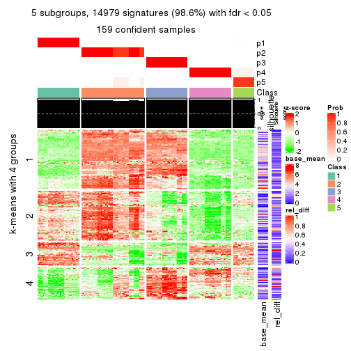</p>

</div>
<div id='tab-CV-skmeans-get-signatures-5'>
<pre><code class="r">get_signatures(res, k = 6)
</code></pre>

<p></p>

</div>
</div>


Signature heatmaps where rows are not scaled:


<script>
$( function() {
	$( '#tabs-CV-skmeans-get-signatures-no-scale' ).tabs();
} );
</script>
<div id='tabs-CV-skmeans-get-signatures-no-scale'>
<ul>
<li><a href='#tab-CV-skmeans-get-signatures-no-scale-1'>k = 2</a></li>
<li><a href='#tab-CV-skmeans-get-signatures-no-scale-2'>k = 3</a></li>
<li><a href='#tab-CV-skmeans-get-signatures-no-scale-3'>k = 4</a></li>
<li><a href='#tab-CV-skmeans-get-signatures-no-scale-4'>k = 5</a></li>
<li><a href='#tab-CV-skmeans-get-signatures-no-scale-5'>k = 6</a></li>
</ul>
<div id='tab-CV-skmeans-get-signatures-no-scale-1'>
<pre><code class="r">get_signatures(res, k = 2, scale_rows = FALSE)
</code></pre>

<p></p>

</div>
<div id='tab-CV-skmeans-get-signatures-no-scale-2'>
<pre><code class="r">get_signatures(res, k = 3, scale_rows = FALSE)
</code></pre>

<p></p>

</div>
<div id='tab-CV-skmeans-get-signatures-no-scale-3'>
<pre><code class="r">get_signatures(res, k = 4, scale_rows = FALSE)
</code></pre>

<p></p>

</div>
<div id='tab-CV-skmeans-get-signatures-no-scale-4'>
<pre><code class="r">get_signatures(res, k = 5, scale_rows = FALSE)
</code></pre>

<p></p>

</div>
<div id='tab-CV-skmeans-get-signatures-no-scale-5'>
<pre><code class="r">get_signatures(res, k = 6, scale_rows = FALSE)
</code></pre>

<p></p>

</div>
</div>


Compare the overlap of signatures from different k:

```r
compare_signatures(res)
```


`get_signature()` returns a data frame invisibly. TO get the list of signatures, the function
call should be assigned to a variable explicitly. In following code, if `plot` argument is set
to `FALSE`, no heatmap is plotted while only the differential analysis is performed.

```r
# code only for demonstration
tb = get_signature(res, k = ..., plot = FALSE)
```

An example of the output of `tb` is:

```
#>   which_row         fdr    mean_1    mean_2 scaled_mean_1 scaled_mean_2 km
#> 1        38 0.042760348  8.373488  9.131774    -0.5533452     0.5164555  1
#> 2        40 0.018707592  7.106213  8.469186    -0.6173731     0.5762149  1
#> 3        55 0.019134737 10.221463 11.207825    -0.6159697     0.5749050  1
#> 4        59 0.006059896  5.921854  7.869574    -0.6899429     0.6439467  1
#> 5        60 0.018055526  8.928898 10.211722    -0.6204761     0.5791110  1
#> 6        98 0.009384629 15.714769 14.887706     0.6635654    -0.6193277  2
...
```

The columns in `tb` are:

1. `which_row`: row indices corresponding to the input matrix.
2. `fdr`: FDR for the differential test. 
3. `mean_x`: The mean value in group x.
4. `scaled_mean_x`: The mean value in group x after rows are scaled.
5. `km`: Row groups if k-means clustering is applied to rows.


UMAP plot which shows how samples are separated.


<script>
$( function() {
	$( '#tabs-CV-skmeans-dimension-reduction' ).tabs();
} );
</script>
<div id='tabs-CV-skmeans-dimension-reduction'>
<ul>
<li><a href='#tab-CV-skmeans-dimension-reduction-1'>k = 2</a></li>
<li><a href='#tab-CV-skmeans-dimension-reduction-2'>k = 3</a></li>
<li><a href='#tab-CV-skmeans-dimension-reduction-3'>k = 4</a></li>
<li><a href='#tab-CV-skmeans-dimension-reduction-4'>k = 5</a></li>
<li><a href='#tab-CV-skmeans-dimension-reduction-5'>k = 6</a></li>
</ul>
<div id='tab-CV-skmeans-dimension-reduction-1'>
<pre><code class="r">dimension_reduction(res, k = 2, method = &quot;UMAP&quot;)
</code></pre>

<p></p>

</div>
<div id='tab-CV-skmeans-dimension-reduction-2'>
<pre><code class="r">dimension_reduction(res, k = 3, method = &quot;UMAP&quot;)
</code></pre>

<p></p>

</div>
<div id='tab-CV-skmeans-dimension-reduction-3'>
<pre><code class="r">dimension_reduction(res, k = 4, method = &quot;UMAP&quot;)
</code></pre>

<p>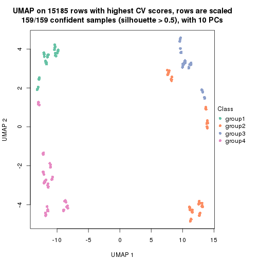</p>

</div>
<div id='tab-CV-skmeans-dimension-reduction-4'>
<pre><code class="r">dimension_reduction(res, k = 5, method = &quot;UMAP&quot;)
</code></pre>

<p></p>

</div>
<div id='tab-CV-skmeans-dimension-reduction-5'>
<pre><code class="r">dimension_reduction(res, k = 6, method = &quot;UMAP&quot;)
</code></pre>

<p></p>

</div>
</div>


Following heatmap shows how subgroups are split when increasing `k`:

```r
collect_classes(res)
```


If matrix rows can be associated to genes, consider to use `GO_Enrichment(res,
...)` to perform function enrichment for the signature genes.


 

---------------------------------------------------


### CV:pam*


The object with results only for a single top-value method and a single partition method 
can be extracted as:

```r
res = res_list["CV", "pam"]
# you can also extract it by
# res = res_list["CV:pam"]
```

A summary of `res` and all the functions that can be applied to it:

```r
res
```

```
#> A 'ConsensusPartition' object with k = 2, 3, 4, 5, 6.
#>   On a matrix with 15185 rows and 159 columns.
#>   Top rows (1000, 2000, 3000, 4000, 5000) are extracted by 'CV' method.
#>   Subgroups are detected by 'pam' method.
#>   Performed in total 1250 partitions by row resampling.
#>   Best k for subgroups seems to be 6.
#> 
#> Following methods can be applied to this 'ConsensusPartition' object:
#>  [1] "cola_report"             "collect_classes"         "collect_plots"          
#>  [4] "collect_stats"           "colnames"                "compare_signatures"     
#>  [7] "consensus_heatmap"       "dimension_reduction"     "functional_enrichment"  
#> [10] "get_anno_col"            "get_anno"                "get_classes"            
#> [13] "get_consensus"           "get_matrix"              "get_membership"         
#> [16] "get_param"               "get_signatures"          "get_stats"              
#> [19] "is_best_k"               "is_stable_k"             "membership_heatmap"     
#> [22] "ncol"                    "nrow"                    "plot_ecdf"              
#> [25] "rownames"                "select_partition_number" "show"                   
#> [28] "suggest_best_k"          "test_to_known_factors"
```

`collect_plots()` function collects all the plots made from `res` for all `k` (number of partitions)
into one single page to provide an easy and fast comparison between different `k`.

```r
collect_plots(res)
```

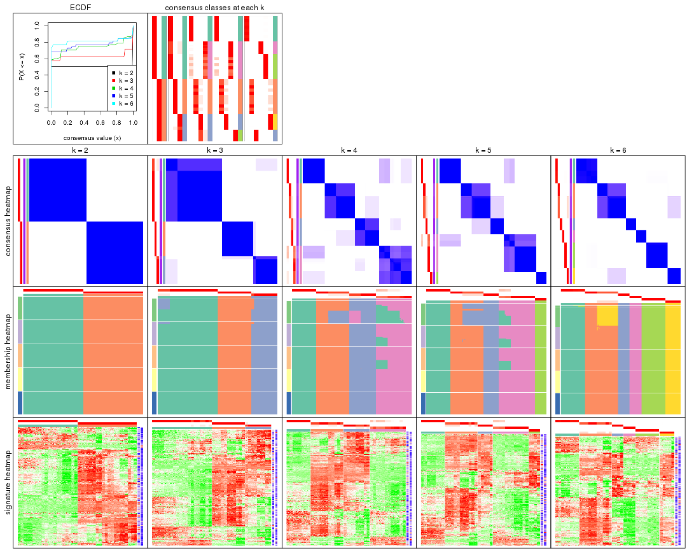

The plots are:

- The first row: a plot of the ECDF (Empirical cumulative distribution
  function) curves of the consensus matrix for each `k` and the heatmap of
  predicted classes for each `k`.
- The second row: heatmaps of the consensus matrix for each `k`.
- The third row: heatmaps of the membership matrix for each `k`.
- The fouth row: heatmaps of the signatures for each `k`.

All the plots in panels can be made by individual functions and they are
plotted later in this section.

`select_partition_number()` produces several plots showing different
statistics for choosing "optimized" `k`. There are following statistics:

- ECDF curves of the consensus matrix for each `k`;
- 1-PAC. [The PAC
  score](https://en.wikipedia.org/wiki/Consensus_clustering#Over-interpretation_potential_of_consensus_clustering)
  measures the proportion of the ambiguous subgrouping.
- Mean silhouette score.
- Concordance. The mean probability of fiting the consensus class ids in all
  partitions.
- Area increased. Denote $A_k$ as the area under the ECDF curve for current
  `k`, the area increased is defined as $A_k - A_{k-1}$.
- Rand index. The percent of pairs of samples that are both in a same cluster
  or both are not in a same cluster in the partition of k and k-1.
- Jaccard index. The ratio of pairs of samples are both in a same cluster in
  the partition of k and k-1 and the pairs of samples are both in a same
  cluster in the partition k or k-1.

The detailed explanations of these statistics can be found in [the cola
vignette](http://bioconductor.org/packages/devel/bioc/vignettes/cola/inst/doc/cola.html#toc_13).

Generally speaking, lower PAC score, higher mean silhouette score or higher
concordance corresponds to better partition. Rand index and Jaccard index
measure how similar the current partition is compared to partition with `k-1`.
If they are too similar, we won't accept `k` is better than `k-1`.

```r
select_partition_number(res)
```


The numeric values for all these statistics can be obtained by `get_stats()`.

```r
get_stats(res)
```

```
#>   k 1-PAC mean_silhouette concordance area_increased  Rand Jaccard
#> 2 2 1.000           1.000       1.000         0.5036 0.497   0.497
#> 3 3 0.873           0.976       0.986         0.2512 0.877   0.753
#> 4 4 0.764           0.917       0.925         0.1789 0.878   0.673
#> 5 5 0.866           0.921       0.939         0.0376 0.976   0.905
#> 6 6 0.920           0.968       0.966         0.0523 0.959   0.821
```

`suggest_best_k()` suggests the best $k$ based on these statistics. The rules are as follows:

- All $k$ with Jaccard index larger than 0.95 are removed because the increase of
  the partition number does not provides enough extra information. If all $k$ are removed,
  the best $k$ is assigned by `NA`.
- For $k$ with 1-PAC larger than 0.9, the maximal $k$ is taken as the "best k". Other $k$ is called "optional k".
- If it does not fit the second rule. The $k$ with the highest vote of highest
  1-PAC, mean silhouette and concordance is taken as the "best k".

```r
suggest_best_k(res)
```

```
#> [1] 6
#> attr(,"optional")
#> [1] 2
```

There is also optional best $k$ = 2 that is worth to check.

Following shows the table of the partitions (You need to click the **show/hide
code output** link to see it). The membership matrix (columns with name `p*`)
is inferred by
[`clue::cl_consensus()`](https://www.rdocumentation.org/link/cl_consensus?package=clue)
function with the `SE` method. Basically the value in the membership matrix
represents the probability to belong to a certain group. The finall class
label for an item is determined with the group with highest probability it
belongs to.

In `get_classes()` function, the entropy is calculated from the membership
matrix and the silhouette score is calculated from the consensus matrix.


<script>
$( function() {
	$( '#tabs-CV-pam-get-classes' ).tabs();
} );
</script>
<div id='tabs-CV-pam-get-classes'>
<ul>
<li><a href='#tab-CV-pam-get-classes-1'>k = 2</a></li>
<li><a href='#tab-CV-pam-get-classes-2'>k = 3</a></li>
<li><a href='#tab-CV-pam-get-classes-3'>k = 4</a></li>
<li><a href='#tab-CV-pam-get-classes-4'>k = 5</a></li>
<li><a href='#tab-CV-pam-get-classes-5'>k = 6</a></li>
</ul>

<div id='tab-CV-pam-get-classes-1'>
<p><a id='tab-CV-pam-get-classes-1-a' style='color:#0366d6' href='#'>show/hide code output</a></p>
<pre><code class="r">cbind(get_classes(res, k = 2), get_membership(res, k = 2))
</code></pre>

<pre><code>#&gt;            class entropy silhouette p1 p2
#&gt; SRR1706767     1       0          1  1  0
#&gt; SRR1706768     1       0          1  1  0
#&gt; SRR1706769     1       0          1  1  0
#&gt; SRR1706770     1       0          1  1  0
#&gt; SRR1706771     1       0          1  1  0
#&gt; SRR1706772     1       0          1  1  0
#&gt; SRR1706773     1       0          1  1  0
#&gt; SRR1706774     1       0          1  1  0
#&gt; SRR1706775     1       0          1  1  0
#&gt; SRR1706776     1       0          1  1  0
#&gt; SRR1706777     1       0          1  1  0
#&gt; SRR1706778     1       0          1  1  0
#&gt; SRR1706779     1       0          1  1  0
#&gt; SRR1706780     1       0          1  1  0
#&gt; SRR1706781     1       0          1  1  0
#&gt; SRR1706782     1       0          1  1  0
#&gt; SRR1706783     1       0          1  1  0
#&gt; SRR1706784     1       0          1  1  0
#&gt; SRR1706785     1       0          1  1  0
#&gt; SRR1706786     1       0          1  1  0
#&gt; SRR1706787     1       0          1  1  0
#&gt; SRR1706788     1       0          1  1  0
#&gt; SRR1706789     1       0          1  1  0
#&gt; SRR1706790     1       0          1  1  0
#&gt; SRR1706791     1       0          1  1  0
#&gt; SRR1706792     1       0          1  1  0
#&gt; SRR1706793     1       0          1  1  0
#&gt; SRR1706794     1       0          1  1  0
#&gt; SRR1706795     1       0          1  1  0
#&gt; SRR1706796     1       0          1  1  0
#&gt; SRR1706797     1       0          1  1  0
#&gt; SRR1706798     1       0          1  1  0
#&gt; SRR1706799     1       0          1  1  0
#&gt; SRR1706800     1       0          1  1  0
#&gt; SRR1706801     1       0          1  1  0
#&gt; SRR1706802     1       0          1  1  0
#&gt; SRR1706803     1       0          1  1  0
#&gt; SRR1706804     1       0          1  1  0
#&gt; SRR1706805     1       0          1  1  0
#&gt; SRR1706806     1       0          1  1  0
#&gt; SRR1706811     1       0          1  1  0
#&gt; SRR1706812     1       0          1  1  0
#&gt; SRR1706813     1       0          1  1  0
#&gt; SRR1706814     1       0          1  1  0
#&gt; SRR1706807     1       0          1  1  0
#&gt; SRR1706808     1       0          1  1  0
#&gt; SRR1706809     1       0          1  1  0
#&gt; SRR1706810     1       0          1  1  0
#&gt; SRR1706815     1       0          1  1  0
#&gt; SRR1706816     1       0          1  1  0
#&gt; SRR1706817     1       0          1  1  0
#&gt; SRR1706818     1       0          1  1  0
#&gt; SRR1706819     1       0          1  1  0
#&gt; SRR1706820     1       0          1  1  0
#&gt; SRR1706821     1       0          1  1  0
#&gt; SRR1706822     1       0          1  1  0
#&gt; SRR1706823     1       0          1  1  0
#&gt; SRR1706824     1       0          1  1  0
#&gt; SRR1706825     1       0          1  1  0
#&gt; SRR1706826     1       0          1  1  0
#&gt; SRR1706827     1       0          1  1  0
#&gt; SRR1706828     1       0          1  1  0
#&gt; SRR1706829     1       0          1  1  0
#&gt; SRR1706830     1       0          1  1  0
#&gt; SRR1706835     1       0          1  1  0
#&gt; SRR1706836     1       0          1  1  0
#&gt; SRR1706837     1       0          1  1  0
#&gt; SRR1706838     1       0          1  1  0
#&gt; SRR1706831     1       0          1  1  0
#&gt; SRR1706832     1       0          1  1  0
#&gt; SRR1706833     1       0          1  1  0
#&gt; SRR1706834     1       0          1  1  0
#&gt; SRR1706839     1       0          1  1  0
#&gt; SRR1706840     1       0          1  1  0
#&gt; SRR1706841     1       0          1  1  0
#&gt; SRR1706842     1       0          1  1  0
#&gt; SRR1706847     2       0          1  0  1
#&gt; SRR1706848     2       0          1  0  1
#&gt; SRR1706849     2       0          1  0  1
#&gt; SRR1706850     2       0          1  0  1
#&gt; SRR1706843     1       0          1  1  0
#&gt; SRR1706844     1       0          1  1  0
#&gt; SRR1706845     1       0          1  1  0
#&gt; SRR1706846     1       0          1  1  0
#&gt; SRR1706851     2       0          1  0  1
#&gt; SRR1706852     2       0          1  0  1
#&gt; SRR1706853     2       0          1  0  1
#&gt; SRR1706854     2       0          1  0  1
#&gt; SRR1706855     2       0          1  0  1
#&gt; SRR1706856     2       0          1  0  1
#&gt; SRR1706857     2       0          1  0  1
#&gt; SRR1706858     2       0          1  0  1
#&gt; SRR1706859     2       0          1  0  1
#&gt; SRR1706860     2       0          1  0  1
#&gt; SRR1706861     2       0          1  0  1
#&gt; SRR1706862     2       0          1  0  1
#&gt; SRR1706867     2       0          1  0  1
#&gt; SRR1706869     2       0          1  0  1
#&gt; SRR1706870     2       0          1  0  1
#&gt; SRR1706863     2       0          1  0  1
#&gt; SRR1706864     2       0          1  0  1
#&gt; SRR1706865     2       0          1  0  1
#&gt; SRR1706866     2       0          1  0  1
#&gt; SRR1706871     2       0          1  0  1
#&gt; SRR1706872     2       0          1  0  1
#&gt; SRR1706873     2       0          1  0  1
#&gt; SRR1706874     2       0          1  0  1
#&gt; SRR1706879     2       0          1  0  1
#&gt; SRR1706880     2       0          1  0  1
#&gt; SRR1706881     2       0          1  0  1
#&gt; SRR1706882     2       0          1  0  1
#&gt; SRR1706883     2       0          1  0  1
#&gt; SRR1706884     2       0          1  0  1
#&gt; SRR1706885     2       0          1  0  1
#&gt; SRR1706886     2       0          1  0  1
#&gt; SRR1706875     2       0          1  0  1
#&gt; SRR1706876     2       0          1  0  1
#&gt; SRR1706877     2       0          1  0  1
#&gt; SRR1706878     2       0          1  0  1
#&gt; SRR1706887     2       0          1  0  1
#&gt; SRR1706888     2       0          1  0  1
#&gt; SRR1706889     2       0          1  0  1
#&gt; SRR1706890     2       0          1  0  1
#&gt; SRR1706891     2       0          1  0  1
#&gt; SRR1706892     2       0          1  0  1
#&gt; SRR1706893     2       0          1  0  1
#&gt; SRR1706894     2       0          1  0  1
#&gt; SRR1706895     2       0          1  0  1
#&gt; SRR1706896     2       0          1  0  1
#&gt; SRR1706897     2       0          1  0  1
#&gt; SRR1706898     2       0          1  0  1
#&gt; SRR1706899     2       0          1  0  1
#&gt; SRR1706900     2       0          1  0  1
#&gt; SRR1706901     2       0          1  0  1
#&gt; SRR1706902     2       0          1  0  1
#&gt; SRR1706907     2       0          1  0  1
#&gt; SRR1706908     2       0          1  0  1
#&gt; SRR1706909     2       0          1  0  1
#&gt; SRR1706910     2       0          1  0  1
#&gt; SRR1706903     2       0          1  0  1
#&gt; SRR1706904     2       0          1  0  1
#&gt; SRR1706905     2       0          1  0  1
#&gt; SRR1706906     2       0          1  0  1
#&gt; SRR1706911     2       0          1  0  1
#&gt; SRR1706912     2       0          1  0  1
#&gt; SRR1706913     2       0          1  0  1
#&gt; SRR1706914     2       0          1  0  1
#&gt; SRR1706919     2       0          1  0  1
#&gt; SRR1706920     2       0          1  0  1
#&gt; SRR1706921     2       0          1  0  1
#&gt; SRR1706922     2       0          1  0  1
#&gt; SRR1706915     2       0          1  0  1
#&gt; SRR1706916     2       0          1  0  1
#&gt; SRR1706917     2       0          1  0  1
#&gt; SRR1706918     2       0          1  0  1
#&gt; SRR1706923     2       0          1  0  1
#&gt; SRR1706924     2       0          1  0  1
#&gt; SRR1706925     2       0          1  0  1
#&gt; SRR1706926     2       0          1  0  1
</code></pre>

<script>
$('#tab-CV-pam-get-classes-1-a').parent().next().next().hide();
$('#tab-CV-pam-get-classes-1-a').click(function(){
  $('#tab-CV-pam-get-classes-1-a').parent().next().next().toggle();
  return(false);
});
</script>
</div>

<div id='tab-CV-pam-get-classes-2'>
<p><a id='tab-CV-pam-get-classes-2-a' style='color:#0366d6' href='#'>show/hide code output</a></p>
<pre><code class="r">cbind(get_classes(res, k = 3), get_membership(res, k = 3))
</code></pre>

<pre><code>#&gt;            class entropy silhouette    p1    p2    p3
#&gt; SRR1706767     1   0.312      0.904 0.892 0.000 0.108
#&gt; SRR1706768     1   0.312      0.904 0.892 0.000 0.108
#&gt; SRR1706769     1   0.312      0.904 0.892 0.000 0.108
#&gt; SRR1706770     1   0.312      0.904 0.892 0.000 0.108
#&gt; SRR1706771     1   0.000      0.978 1.000 0.000 0.000
#&gt; SRR1706772     1   0.000      0.978 1.000 0.000 0.000
#&gt; SRR1706773     1   0.000      0.978 1.000 0.000 0.000
#&gt; SRR1706774     1   0.000      0.978 1.000 0.000 0.000
#&gt; SRR1706775     1   0.000      0.978 1.000 0.000 0.000
#&gt; SRR1706776     1   0.000      0.978 1.000 0.000 0.000
#&gt; SRR1706777     1   0.000      0.978 1.000 0.000 0.000
#&gt; SRR1706778     1   0.000      0.978 1.000 0.000 0.000
#&gt; SRR1706779     1   0.000      0.978 1.000 0.000 0.000
#&gt; SRR1706780     1   0.000      0.978 1.000 0.000 0.000
#&gt; SRR1706781     1   0.000      0.978 1.000 0.000 0.000
#&gt; SRR1706782     1   0.000      0.978 1.000 0.000 0.000
#&gt; SRR1706783     1   0.000      0.978 1.000 0.000 0.000
#&gt; SRR1706784     1   0.000      0.978 1.000 0.000 0.000
#&gt; SRR1706785     1   0.000      0.978 1.000 0.000 0.000
#&gt; SRR1706786     1   0.000      0.978 1.000 0.000 0.000
#&gt; SRR1706787     1   0.312      0.904 0.892 0.000 0.108
#&gt; SRR1706788     1   0.312      0.904 0.892 0.000 0.108
#&gt; SRR1706789     1   0.312      0.904 0.892 0.000 0.108
#&gt; SRR1706790     1   0.312      0.904 0.892 0.000 0.108
#&gt; SRR1706791     1   0.000      0.978 1.000 0.000 0.000
#&gt; SRR1706792     1   0.000      0.978 1.000 0.000 0.000
#&gt; SRR1706793     1   0.000      0.978 1.000 0.000 0.000
#&gt; SRR1706794     1   0.000      0.978 1.000 0.000 0.000
#&gt; SRR1706795     1   0.000      0.978 1.000 0.000 0.000
#&gt; SRR1706796     1   0.000      0.978 1.000 0.000 0.000
#&gt; SRR1706797     1   0.000      0.978 1.000 0.000 0.000
#&gt; SRR1706798     1   0.000      0.978 1.000 0.000 0.000
#&gt; SRR1706799     1   0.000      0.978 1.000 0.000 0.000
#&gt; SRR1706800     1   0.000      0.978 1.000 0.000 0.000
#&gt; SRR1706801     1   0.000      0.978 1.000 0.000 0.000
#&gt; SRR1706802     1   0.000      0.978 1.000 0.000 0.000
#&gt; SRR1706803     1   0.000      0.978 1.000 0.000 0.000
#&gt; SRR1706804     1   0.000      0.978 1.000 0.000 0.000
#&gt; SRR1706805     1   0.000      0.978 1.000 0.000 0.000
#&gt; SRR1706806     1   0.000      0.978 1.000 0.000 0.000
#&gt; SRR1706811     1   0.000      0.978 1.000 0.000 0.000
#&gt; SRR1706812     1   0.000      0.978 1.000 0.000 0.000
#&gt; SRR1706813     1   0.000      0.978 1.000 0.000 0.000
#&gt; SRR1706814     1   0.000      0.978 1.000 0.000 0.000
#&gt; SRR1706807     1   0.304      0.907 0.896 0.000 0.104
#&gt; SRR1706808     1   0.312      0.904 0.892 0.000 0.108
#&gt; SRR1706809     1   0.312      0.904 0.892 0.000 0.108
#&gt; SRR1706810     1   0.304      0.907 0.896 0.000 0.104
#&gt; SRR1706815     1   0.000      0.978 1.000 0.000 0.000
#&gt; SRR1706816     1   0.000      0.978 1.000 0.000 0.000
#&gt; SRR1706817     1   0.000      0.978 1.000 0.000 0.000
#&gt; SRR1706818     1   0.000      0.978 1.000 0.000 0.000
#&gt; SRR1706819     1   0.000      0.978 1.000 0.000 0.000
#&gt; SRR1706820     1   0.000      0.978 1.000 0.000 0.000
#&gt; SRR1706821     1   0.000      0.978 1.000 0.000 0.000
#&gt; SRR1706822     1   0.000      0.978 1.000 0.000 0.000
#&gt; SRR1706823     1   0.000      0.978 1.000 0.000 0.000
#&gt; SRR1706824     1   0.000      0.978 1.000 0.000 0.000
#&gt; SRR1706825     1   0.000      0.978 1.000 0.000 0.000
#&gt; SRR1706826     1   0.000      0.978 1.000 0.000 0.000
#&gt; SRR1706827     1   0.312      0.904 0.892 0.000 0.108
#&gt; SRR1706828     1   0.312      0.904 0.892 0.000 0.108
#&gt; SRR1706829     1   0.312      0.904 0.892 0.000 0.108
#&gt; SRR1706830     1   0.312      0.904 0.892 0.000 0.108
#&gt; SRR1706835     1   0.000      0.978 1.000 0.000 0.000
#&gt; SRR1706836     1   0.000      0.978 1.000 0.000 0.000
#&gt; SRR1706837     1   0.000      0.978 1.000 0.000 0.000
#&gt; SRR1706838     1   0.000      0.978 1.000 0.000 0.000
#&gt; SRR1706831     1   0.000      0.978 1.000 0.000 0.000
#&gt; SRR1706832     1   0.000      0.978 1.000 0.000 0.000
#&gt; SRR1706833     1   0.000      0.978 1.000 0.000 0.000
#&gt; SRR1706834     1   0.000      0.978 1.000 0.000 0.000
#&gt; SRR1706839     1   0.000      0.978 1.000 0.000 0.000
#&gt; SRR1706840     1   0.000      0.978 1.000 0.000 0.000
#&gt; SRR1706841     1   0.000      0.978 1.000 0.000 0.000
#&gt; SRR1706842     1   0.000      0.978 1.000 0.000 0.000
#&gt; SRR1706847     3   0.000      0.986 0.000 0.000 1.000
#&gt; SRR1706848     3   0.000      0.986 0.000 0.000 1.000
#&gt; SRR1706849     3   0.000      0.986 0.000 0.000 1.000
#&gt; SRR1706850     3   0.000      0.986 0.000 0.000 1.000
#&gt; SRR1706843     1   0.000      0.978 1.000 0.000 0.000
#&gt; SRR1706844     1   0.000      0.978 1.000 0.000 0.000
#&gt; SRR1706845     1   0.000      0.978 1.000 0.000 0.000
#&gt; SRR1706846     1   0.000      0.978 1.000 0.000 0.000
#&gt; SRR1706851     3   0.000      0.986 0.000 0.000 1.000
#&gt; SRR1706852     3   0.000      0.986 0.000 0.000 1.000
#&gt; SRR1706853     3   0.000      0.986 0.000 0.000 1.000
#&gt; SRR1706854     3   0.000      0.986 0.000 0.000 1.000
#&gt; SRR1706855     2   0.000      1.000 0.000 1.000 0.000
#&gt; SRR1706856     2   0.000      1.000 0.000 1.000 0.000
#&gt; SRR1706857     2   0.000      1.000 0.000 1.000 0.000
#&gt; SRR1706858     2   0.000      1.000 0.000 1.000 0.000
#&gt; SRR1706859     2   0.000      1.000 0.000 1.000 0.000
#&gt; SRR1706860     2   0.000      1.000 0.000 1.000 0.000
#&gt; SRR1706861     2   0.000      1.000 0.000 1.000 0.000
#&gt; SRR1706862     2   0.000      1.000 0.000 1.000 0.000
#&gt; SRR1706867     3   0.000      0.986 0.000 0.000 1.000
#&gt; SRR1706869     3   0.000      0.986 0.000 0.000 1.000
#&gt; SRR1706870     3   0.000      0.986 0.000 0.000 1.000
#&gt; SRR1706863     2   0.000      1.000 0.000 1.000 0.000
#&gt; SRR1706864     2   0.000      1.000 0.000 1.000 0.000
#&gt; SRR1706865     2   0.000      1.000 0.000 1.000 0.000
#&gt; SRR1706866     2   0.000      1.000 0.000 1.000 0.000
#&gt; SRR1706871     3   0.000      0.986 0.000 0.000 1.000
#&gt; SRR1706872     3   0.000      0.986 0.000 0.000 1.000
#&gt; SRR1706873     3   0.000      0.986 0.000 0.000 1.000
#&gt; SRR1706874     3   0.000      0.986 0.000 0.000 1.000
#&gt; SRR1706879     2   0.000      1.000 0.000 1.000 0.000
#&gt; SRR1706880     2   0.000      1.000 0.000 1.000 0.000
#&gt; SRR1706881     2   0.000      1.000 0.000 1.000 0.000
#&gt; SRR1706882     2   0.000      1.000 0.000 1.000 0.000
#&gt; SRR1706883     2   0.000      1.000 0.000 1.000 0.000
#&gt; SRR1706884     2   0.000      1.000 0.000 1.000 0.000
#&gt; SRR1706885     2   0.000      1.000 0.000 1.000 0.000
#&gt; SRR1706886     2   0.000      1.000 0.000 1.000 0.000
#&gt; SRR1706875     2   0.000      1.000 0.000 1.000 0.000
#&gt; SRR1706876     2   0.000      1.000 0.000 1.000 0.000
#&gt; SRR1706877     2   0.000      1.000 0.000 1.000 0.000
#&gt; SRR1706878     2   0.000      1.000 0.000 1.000 0.000
#&gt; SRR1706887     3   0.000      0.986 0.000 0.000 1.000
#&gt; SRR1706888     3   0.000      0.986 0.000 0.000 1.000
#&gt; SRR1706889     3   0.000      0.986 0.000 0.000 1.000
#&gt; SRR1706890     3   0.000      0.986 0.000 0.000 1.000
#&gt; SRR1706891     3   0.000      0.986 0.000 0.000 1.000
#&gt; SRR1706892     3   0.000      0.986 0.000 0.000 1.000
#&gt; SRR1706893     3   0.000      0.986 0.000 0.000 1.000
#&gt; SRR1706894     3   0.000      0.986 0.000 0.000 1.000
#&gt; SRR1706895     2   0.000      1.000 0.000 1.000 0.000
#&gt; SRR1706896     2   0.000      1.000 0.000 1.000 0.000
#&gt; SRR1706897     2   0.000      1.000 0.000 1.000 0.000
#&gt; SRR1706898     2   0.000      1.000 0.000 1.000 0.000
#&gt; SRR1706899     2   0.000      1.000 0.000 1.000 0.000
#&gt; SRR1706900     2   0.000      1.000 0.000 1.000 0.000
#&gt; SRR1706901     2   0.000      1.000 0.000 1.000 0.000
#&gt; SRR1706902     2   0.000      1.000 0.000 1.000 0.000
#&gt; SRR1706907     3   0.000      0.986 0.000 0.000 1.000
#&gt; SRR1706908     3   0.000      0.986 0.000 0.000 1.000
#&gt; SRR1706909     3   0.000      0.986 0.000 0.000 1.000
#&gt; SRR1706910     3   0.000      0.986 0.000 0.000 1.000
#&gt; SRR1706903     2   0.000      1.000 0.000 1.000 0.000
#&gt; SRR1706904     2   0.000      1.000 0.000 1.000 0.000
#&gt; SRR1706905     2   0.000      1.000 0.000 1.000 0.000
#&gt; SRR1706906     2   0.000      1.000 0.000 1.000 0.000
#&gt; SRR1706911     3   0.000      0.986 0.000 0.000 1.000
#&gt; SRR1706912     3   0.000      0.986 0.000 0.000 1.000
#&gt; SRR1706913     3   0.000      0.986 0.000 0.000 1.000
#&gt; SRR1706914     3   0.000      0.986 0.000 0.000 1.000
#&gt; SRR1706919     2   0.000      1.000 0.000 1.000 0.000
#&gt; SRR1706920     2   0.000      1.000 0.000 1.000 0.000
#&gt; SRR1706921     2   0.000      1.000 0.000 1.000 0.000
#&gt; SRR1706922     2   0.000      1.000 0.000 1.000 0.000
#&gt; SRR1706915     3   0.319      0.875 0.000 0.112 0.888
#&gt; SRR1706916     3   0.312      0.879 0.000 0.108 0.892
#&gt; SRR1706917     3   0.312      0.879 0.000 0.108 0.892
#&gt; SRR1706918     3   0.312      0.879 0.000 0.108 0.892
#&gt; SRR1706923     2   0.000      1.000 0.000 1.000 0.000
#&gt; SRR1706924     2   0.000      1.000 0.000 1.000 0.000
#&gt; SRR1706925     2   0.000      1.000 0.000 1.000 0.000
#&gt; SRR1706926     2   0.000      1.000 0.000 1.000 0.000
</code></pre>

<script>
$('#tab-CV-pam-get-classes-2-a').parent().next().next().hide();
$('#tab-CV-pam-get-classes-2-a').click(function(){
  $('#tab-CV-pam-get-classes-2-a').parent().next().next().toggle();
  return(false);
});
</script>
</div>

<div id='tab-CV-pam-get-classes-3'>
<p><a id='tab-CV-pam-get-classes-3-a' style='color:#0366d6' href='#'>show/hide code output</a></p>
<pre><code class="r">cbind(get_classes(res, k = 4), get_membership(res, k = 4))
</code></pre>

<pre><code>#&gt;            class entropy silhouette    p1    p2    p3    p4
#&gt; SRR1706767     4  0.0000      0.835 0.000 0.000 0.000 1.000
#&gt; SRR1706768     4  0.0000      0.835 0.000 0.000 0.000 1.000
#&gt; SRR1706769     4  0.0000      0.835 0.000 0.000 0.000 1.000
#&gt; SRR1706770     4  0.0000      0.835 0.000 0.000 0.000 1.000
#&gt; SRR1706771     4  0.2530      0.870 0.112 0.000 0.000 0.888
#&gt; SRR1706772     4  0.2530      0.870 0.112 0.000 0.000 0.888
#&gt; SRR1706773     4  0.2530      0.870 0.112 0.000 0.000 0.888
#&gt; SRR1706774     4  0.2530      0.870 0.112 0.000 0.000 0.888
#&gt; SRR1706775     4  0.4454      0.763 0.308 0.000 0.000 0.692
#&gt; SRR1706776     4  0.4477      0.759 0.312 0.000 0.000 0.688
#&gt; SRR1706777     4  0.4454      0.763 0.308 0.000 0.000 0.692
#&gt; SRR1706778     4  0.4500      0.755 0.316 0.000 0.000 0.684
#&gt; SRR1706779     1  0.0000      1.000 1.000 0.000 0.000 0.000
#&gt; SRR1706780     1  0.0000      1.000 1.000 0.000 0.000 0.000
#&gt; SRR1706781     1  0.0000      1.000 1.000 0.000 0.000 0.000
#&gt; SRR1706782     1  0.0000      1.000 1.000 0.000 0.000 0.000
#&gt; SRR1706783     1  0.0000      1.000 1.000 0.000 0.000 0.000
#&gt; SRR1706784     1  0.0000      1.000 1.000 0.000 0.000 0.000
#&gt; SRR1706785     1  0.0000      1.000 1.000 0.000 0.000 0.000
#&gt; SRR1706786     1  0.0000      1.000 1.000 0.000 0.000 0.000
#&gt; SRR1706787     4  0.0000      0.835 0.000 0.000 0.000 1.000
#&gt; SRR1706788     4  0.0921      0.848 0.028 0.000 0.000 0.972
#&gt; SRR1706789     4  0.0336      0.839 0.008 0.000 0.000 0.992
#&gt; SRR1706790     4  0.0188      0.837 0.004 0.000 0.000 0.996
#&gt; SRR1706791     4  0.2530      0.870 0.112 0.000 0.000 0.888
#&gt; SRR1706792     4  0.2530      0.870 0.112 0.000 0.000 0.888
#&gt; SRR1706793     4  0.2530      0.870 0.112 0.000 0.000 0.888
#&gt; SRR1706794     4  0.2530      0.870 0.112 0.000 0.000 0.888
#&gt; SRR1706795     4  0.4585      0.737 0.332 0.000 0.000 0.668
#&gt; SRR1706796     4  0.4585      0.737 0.332 0.000 0.000 0.668
#&gt; SRR1706797     4  0.4585      0.737 0.332 0.000 0.000 0.668
#&gt; SRR1706798     4  0.4585      0.737 0.332 0.000 0.000 0.668
#&gt; SRR1706799     1  0.0000      1.000 1.000 0.000 0.000 0.000
#&gt; SRR1706800     1  0.0000      1.000 1.000 0.000 0.000 0.000
#&gt; SRR1706801     1  0.0000      1.000 1.000 0.000 0.000 0.000
#&gt; SRR1706802     1  0.0000      1.000 1.000 0.000 0.000 0.000
#&gt; SRR1706803     1  0.0000      1.000 1.000 0.000 0.000 0.000
#&gt; SRR1706804     1  0.0000      1.000 1.000 0.000 0.000 0.000
#&gt; SRR1706805     1  0.0000      1.000 1.000 0.000 0.000 0.000
#&gt; SRR1706806     1  0.0000      1.000 1.000 0.000 0.000 0.000
#&gt; SRR1706811     4  0.2530      0.870 0.112 0.000 0.000 0.888
#&gt; SRR1706812     4  0.2530      0.870 0.112 0.000 0.000 0.888
#&gt; SRR1706813     4  0.2530      0.870 0.112 0.000 0.000 0.888
#&gt; SRR1706814     4  0.2530      0.870 0.112 0.000 0.000 0.888
#&gt; SRR1706807     4  0.1022      0.850 0.032 0.000 0.000 0.968
#&gt; SRR1706808     4  0.1118      0.851 0.036 0.000 0.000 0.964
#&gt; SRR1706809     4  0.0817      0.846 0.024 0.000 0.000 0.976
#&gt; SRR1706810     4  0.1211      0.852 0.040 0.000 0.000 0.960
#&gt; SRR1706815     4  0.4585      0.737 0.332 0.000 0.000 0.668
#&gt; SRR1706816     4  0.4585      0.737 0.332 0.000 0.000 0.668
#&gt; SRR1706817     4  0.4585      0.737 0.332 0.000 0.000 0.668
#&gt; SRR1706818     4  0.4585      0.737 0.332 0.000 0.000 0.668
#&gt; SRR1706819     1  0.0000      1.000 1.000 0.000 0.000 0.000
#&gt; SRR1706820     1  0.0000      1.000 1.000 0.000 0.000 0.000
#&gt; SRR1706821     1  0.0000      1.000 1.000 0.000 0.000 0.000
#&gt; SRR1706822     1  0.0000      1.000 1.000 0.000 0.000 0.000
#&gt; SRR1706823     1  0.0000      1.000 1.000 0.000 0.000 0.000
#&gt; SRR1706824     1  0.0000      1.000 1.000 0.000 0.000 0.000
#&gt; SRR1706825     1  0.0000      1.000 1.000 0.000 0.000 0.000
#&gt; SRR1706826     1  0.0000      1.000 1.000 0.000 0.000 0.000
#&gt; SRR1706827     4  0.0000      0.835 0.000 0.000 0.000 1.000
#&gt; SRR1706828     4  0.0000      0.835 0.000 0.000 0.000 1.000
#&gt; SRR1706829     4  0.0000      0.835 0.000 0.000 0.000 1.000
#&gt; SRR1706830     4  0.0000      0.835 0.000 0.000 0.000 1.000
#&gt; SRR1706835     4  0.4454      0.763 0.308 0.000 0.000 0.692
#&gt; SRR1706836     4  0.4454      0.763 0.308 0.000 0.000 0.692
#&gt; SRR1706837     4  0.4454      0.763 0.308 0.000 0.000 0.692
#&gt; SRR1706838     4  0.4454      0.763 0.308 0.000 0.000 0.692
#&gt; SRR1706831     4  0.2530      0.870 0.112 0.000 0.000 0.888
#&gt; SRR1706832     4  0.2530      0.870 0.112 0.000 0.000 0.888
#&gt; SRR1706833     4  0.2530      0.870 0.112 0.000 0.000 0.888
#&gt; SRR1706834     4  0.2530      0.870 0.112 0.000 0.000 0.888
#&gt; SRR1706839     1  0.0000      1.000 1.000 0.000 0.000 0.000
#&gt; SRR1706840     1  0.0000      1.000 1.000 0.000 0.000 0.000
#&gt; SRR1706841     1  0.0000      1.000 1.000 0.000 0.000 0.000
#&gt; SRR1706842     1  0.0000      1.000 1.000 0.000 0.000 0.000
#&gt; SRR1706847     3  0.2530      0.928 0.000 0.000 0.888 0.112
#&gt; SRR1706848     3  0.2530      0.928 0.000 0.000 0.888 0.112
#&gt; SRR1706849     3  0.2530      0.928 0.000 0.000 0.888 0.112
#&gt; SRR1706850     3  0.2530      0.928 0.000 0.000 0.888 0.112
#&gt; SRR1706843     1  0.0000      1.000 1.000 0.000 0.000 0.000
#&gt; SRR1706844     1  0.0000      1.000 1.000 0.000 0.000 0.000
#&gt; SRR1706845     1  0.0000      1.000 1.000 0.000 0.000 0.000
#&gt; SRR1706846     1  0.0000      1.000 1.000 0.000 0.000 0.000
#&gt; SRR1706851     3  0.0000      0.946 0.000 0.000 1.000 0.000
#&gt; SRR1706852     3  0.0000      0.946 0.000 0.000 1.000 0.000
#&gt; SRR1706853     3  0.0000      0.946 0.000 0.000 1.000 0.000
#&gt; SRR1706854     3  0.0000      0.946 0.000 0.000 1.000 0.000
#&gt; SRR1706855     2  0.2530      0.958 0.000 0.888 0.112 0.000
#&gt; SRR1706856     2  0.2530      0.958 0.000 0.888 0.112 0.000
#&gt; SRR1706857     2  0.2530      0.958 0.000 0.888 0.112 0.000
#&gt; SRR1706858     2  0.2530      0.958 0.000 0.888 0.112 0.000
#&gt; SRR1706859     2  0.2530      0.958 0.000 0.888 0.112 0.000
#&gt; SRR1706860     2  0.2530      0.958 0.000 0.888 0.112 0.000
#&gt; SRR1706861     2  0.2530      0.958 0.000 0.888 0.112 0.000
#&gt; SRR1706862     2  0.2530      0.958 0.000 0.888 0.112 0.000
#&gt; SRR1706867     3  0.2530      0.928 0.000 0.000 0.888 0.112
#&gt; SRR1706869     3  0.2530      0.928 0.000 0.000 0.888 0.112
#&gt; SRR1706870     3  0.2530      0.928 0.000 0.000 0.888 0.112
#&gt; SRR1706863     2  0.0000      0.929 0.000 1.000 0.000 0.000
#&gt; SRR1706864     2  0.0000      0.929 0.000 1.000 0.000 0.000
#&gt; SRR1706865     2  0.0000      0.929 0.000 1.000 0.000 0.000
#&gt; SRR1706866     2  0.0000      0.929 0.000 1.000 0.000 0.000
#&gt; SRR1706871     3  0.0000      0.946 0.000 0.000 1.000 0.000
#&gt; SRR1706872     3  0.0000      0.946 0.000 0.000 1.000 0.000
#&gt; SRR1706873     3  0.0000      0.946 0.000 0.000 1.000 0.000
#&gt; SRR1706874     3  0.0000      0.946 0.000 0.000 1.000 0.000
#&gt; SRR1706879     2  0.2530      0.958 0.000 0.888 0.112 0.000
#&gt; SRR1706880     2  0.2530      0.958 0.000 0.888 0.112 0.000
#&gt; SRR1706881     2  0.2530      0.958 0.000 0.888 0.112 0.000
#&gt; SRR1706882     2  0.2345      0.956 0.000 0.900 0.100 0.000
#&gt; SRR1706883     2  0.0000      0.929 0.000 1.000 0.000 0.000
#&gt; SRR1706884     2  0.0000      0.929 0.000 1.000 0.000 0.000
#&gt; SRR1706885     2  0.0000      0.929 0.000 1.000 0.000 0.000
#&gt; SRR1706886     2  0.0000      0.929 0.000 1.000 0.000 0.000
#&gt; SRR1706875     2  0.2530      0.958 0.000 0.888 0.112 0.000
#&gt; SRR1706876     2  0.2530      0.958 0.000 0.888 0.112 0.000
#&gt; SRR1706877     2  0.2530      0.958 0.000 0.888 0.112 0.000
#&gt; SRR1706878     2  0.2530      0.958 0.000 0.888 0.112 0.000
#&gt; SRR1706887     3  0.2530      0.928 0.000 0.000 0.888 0.112
#&gt; SRR1706888     3  0.2530      0.928 0.000 0.000 0.888 0.112
#&gt; SRR1706889     3  0.2530      0.928 0.000 0.000 0.888 0.112
#&gt; SRR1706890     3  0.2530      0.928 0.000 0.000 0.888 0.112
#&gt; SRR1706891     3  0.0000      0.946 0.000 0.000 1.000 0.000
#&gt; SRR1706892     3  0.0000      0.946 0.000 0.000 1.000 0.000
#&gt; SRR1706893     3  0.0000      0.946 0.000 0.000 1.000 0.000
#&gt; SRR1706894     3  0.0000      0.946 0.000 0.000 1.000 0.000
#&gt; SRR1706895     2  0.2530      0.958 0.000 0.888 0.112 0.000
#&gt; SRR1706896     2  0.2530      0.958 0.000 0.888 0.112 0.000
#&gt; SRR1706897     2  0.2530      0.958 0.000 0.888 0.112 0.000
#&gt; SRR1706898     2  0.2530      0.958 0.000 0.888 0.112 0.000
#&gt; SRR1706899     2  0.2530      0.958 0.000 0.888 0.112 0.000
#&gt; SRR1706900     2  0.2530      0.958 0.000 0.888 0.112 0.000
#&gt; SRR1706901     2  0.2530      0.958 0.000 0.888 0.112 0.000
#&gt; SRR1706902     2  0.2530      0.958 0.000 0.888 0.112 0.000
#&gt; SRR1706907     3  0.2530      0.928 0.000 0.000 0.888 0.112
#&gt; SRR1706908     3  0.2530      0.928 0.000 0.000 0.888 0.112
#&gt; SRR1706909     3  0.2530      0.928 0.000 0.000 0.888 0.112
#&gt; SRR1706910     3  0.2530      0.928 0.000 0.000 0.888 0.112
#&gt; SRR1706903     2  0.0000      0.929 0.000 1.000 0.000 0.000
#&gt; SRR1706904     2  0.0000      0.929 0.000 1.000 0.000 0.000
#&gt; SRR1706905     2  0.0000      0.929 0.000 1.000 0.000 0.000
#&gt; SRR1706906     2  0.0000      0.929 0.000 1.000 0.000 0.000
#&gt; SRR1706911     3  0.0000      0.946 0.000 0.000 1.000 0.000
#&gt; SRR1706912     3  0.0000      0.946 0.000 0.000 1.000 0.000
#&gt; SRR1706913     3  0.0000      0.946 0.000 0.000 1.000 0.000
#&gt; SRR1706914     3  0.0000      0.946 0.000 0.000 1.000 0.000
#&gt; SRR1706919     2  0.2530      0.958 0.000 0.888 0.112 0.000
#&gt; SRR1706920     2  0.2530      0.958 0.000 0.888 0.112 0.000
#&gt; SRR1706921     2  0.2530      0.958 0.000 0.888 0.112 0.000
#&gt; SRR1706922     2  0.2530      0.958 0.000 0.888 0.112 0.000
#&gt; SRR1706915     3  0.0188      0.942 0.000 0.004 0.996 0.000
#&gt; SRR1706916     3  0.0000      0.946 0.000 0.000 1.000 0.000
#&gt; SRR1706917     3  0.0000      0.946 0.000 0.000 1.000 0.000
#&gt; SRR1706918     3  0.0000      0.946 0.000 0.000 1.000 0.000
#&gt; SRR1706923     2  0.0000      0.929 0.000 1.000 0.000 0.000
#&gt; SRR1706924     2  0.0000      0.929 0.000 1.000 0.000 0.000
#&gt; SRR1706925     2  0.0000      0.929 0.000 1.000 0.000 0.000
#&gt; SRR1706926     2  0.0000      0.929 0.000 1.000 0.000 0.000
</code></pre>

<script>
$('#tab-CV-pam-get-classes-3-a').parent().next().next().hide();
$('#tab-CV-pam-get-classes-3-a').click(function(){
  $('#tab-CV-pam-get-classes-3-a').parent().next().next().toggle();
  return(false);
});
</script>
</div>

<div id='tab-CV-pam-get-classes-4'>
<p><a id='tab-CV-pam-get-classes-4-a' style='color:#0366d6' href='#'>show/hide code output</a></p>
<pre><code class="r">cbind(get_classes(res, k = 5), get_membership(res, k = 5))
</code></pre>

<pre><code>#&gt;            class entropy silhouette    p1    p2    p3    p4 p5
#&gt; SRR1706767     4  0.0000      0.890 0.000 0.000 0.000 1.000  0
#&gt; SRR1706768     4  0.0000      0.890 0.000 0.000 0.000 1.000  0
#&gt; SRR1706769     4  0.0000      0.890 0.000 0.000 0.000 1.000  0
#&gt; SRR1706770     4  0.0000      0.890 0.000 0.000 0.000 1.000  0
#&gt; SRR1706771     4  0.0000      0.890 0.000 0.000 0.000 1.000  0
#&gt; SRR1706772     4  0.0000      0.890 0.000 0.000 0.000 1.000  0
#&gt; SRR1706773     4  0.0000      0.890 0.000 0.000 0.000 1.000  0
#&gt; SRR1706774     4  0.0000      0.890 0.000 0.000 0.000 1.000  0
#&gt; SRR1706775     4  0.3452      0.764 0.244 0.000 0.000 0.756  0
#&gt; SRR1706776     4  0.3480      0.760 0.248 0.000 0.000 0.752  0
#&gt; SRR1706777     4  0.3452      0.764 0.244 0.000 0.000 0.756  0
#&gt; SRR1706778     4  0.3561      0.748 0.260 0.000 0.000 0.740  0
#&gt; SRR1706779     1  0.0000      1.000 1.000 0.000 0.000 0.000  0
#&gt; SRR1706780     1  0.0000      1.000 1.000 0.000 0.000 0.000  0
#&gt; SRR1706781     1  0.0000      1.000 1.000 0.000 0.000 0.000  0
#&gt; SRR1706782     1  0.0000      1.000 1.000 0.000 0.000 0.000  0
#&gt; SRR1706783     1  0.0000      1.000 1.000 0.000 0.000 0.000  0
#&gt; SRR1706784     1  0.0000      1.000 1.000 0.000 0.000 0.000  0
#&gt; SRR1706785     1  0.0000      1.000 1.000 0.000 0.000 0.000  0
#&gt; SRR1706786     1  0.0000      1.000 1.000 0.000 0.000 0.000  0
#&gt; SRR1706787     4  0.0000      0.890 0.000 0.000 0.000 1.000  0
#&gt; SRR1706788     4  0.0000      0.890 0.000 0.000 0.000 1.000  0
#&gt; SRR1706789     4  0.0000      0.890 0.000 0.000 0.000 1.000  0
#&gt; SRR1706790     4  0.0000      0.890 0.000 0.000 0.000 1.000  0
#&gt; SRR1706791     4  0.0000      0.890 0.000 0.000 0.000 1.000  0
#&gt; SRR1706792     4  0.0000      0.890 0.000 0.000 0.000 1.000  0
#&gt; SRR1706793     4  0.0000      0.890 0.000 0.000 0.000 1.000  0
#&gt; SRR1706794     4  0.0000      0.890 0.000 0.000 0.000 1.000  0
#&gt; SRR1706795     4  0.3796      0.704 0.300 0.000 0.000 0.700  0
#&gt; SRR1706796     4  0.3796      0.704 0.300 0.000 0.000 0.700  0
#&gt; SRR1706797     4  0.3796      0.704 0.300 0.000 0.000 0.700  0
#&gt; SRR1706798     4  0.3796      0.704 0.300 0.000 0.000 0.700  0
#&gt; SRR1706799     1  0.0000      1.000 1.000 0.000 0.000 0.000  0
#&gt; SRR1706800     1  0.0000      1.000 1.000 0.000 0.000 0.000  0
#&gt; SRR1706801     1  0.0000      1.000 1.000 0.000 0.000 0.000  0
#&gt; SRR1706802     1  0.0000      1.000 1.000 0.000 0.000 0.000  0
#&gt; SRR1706803     1  0.0000      1.000 1.000 0.000 0.000 0.000  0
#&gt; SRR1706804     1  0.0000      1.000 1.000 0.000 0.000 0.000  0
#&gt; SRR1706805     1  0.0000      1.000 1.000 0.000 0.000 0.000  0
#&gt; SRR1706806     1  0.0000      1.000 1.000 0.000 0.000 0.000  0
#&gt; SRR1706811     4  0.0000      0.890 0.000 0.000 0.000 1.000  0
#&gt; SRR1706812     4  0.0000      0.890 0.000 0.000 0.000 1.000  0
#&gt; SRR1706813     4  0.0000      0.890 0.000 0.000 0.000 1.000  0
#&gt; SRR1706814     4  0.0000      0.890 0.000 0.000 0.000 1.000  0
#&gt; SRR1706807     4  0.0000      0.890 0.000 0.000 0.000 1.000  0
#&gt; SRR1706808     4  0.0000      0.890 0.000 0.000 0.000 1.000  0
#&gt; SRR1706809     4  0.0000      0.890 0.000 0.000 0.000 1.000  0
#&gt; SRR1706810     4  0.0000      0.890 0.000 0.000 0.000 1.000  0
#&gt; SRR1706815     4  0.3796      0.704 0.300 0.000 0.000 0.700  0
#&gt; SRR1706816     4  0.3796      0.704 0.300 0.000 0.000 0.700  0
#&gt; SRR1706817     4  0.3796      0.704 0.300 0.000 0.000 0.700  0
#&gt; SRR1706818     4  0.3796      0.704 0.300 0.000 0.000 0.700  0
#&gt; SRR1706819     1  0.0000      1.000 1.000 0.000 0.000 0.000  0
#&gt; SRR1706820     1  0.0000      1.000 1.000 0.000 0.000 0.000  0
#&gt; SRR1706821     1  0.0000      1.000 1.000 0.000 0.000 0.000  0
#&gt; SRR1706822     1  0.0000      1.000 1.000 0.000 0.000 0.000  0
#&gt; SRR1706823     1  0.0000      1.000 1.000 0.000 0.000 0.000  0
#&gt; SRR1706824     1  0.0000      1.000 1.000 0.000 0.000 0.000  0
#&gt; SRR1706825     1  0.0000      1.000 1.000 0.000 0.000 0.000  0
#&gt; SRR1706826     1  0.0000      1.000 1.000 0.000 0.000 0.000  0
#&gt; SRR1706827     4  0.0000      0.890 0.000 0.000 0.000 1.000  0
#&gt; SRR1706828     4  0.0000      0.890 0.000 0.000 0.000 1.000  0
#&gt; SRR1706829     4  0.0000      0.890 0.000 0.000 0.000 1.000  0
#&gt; SRR1706830     4  0.0000      0.890 0.000 0.000 0.000 1.000  0
#&gt; SRR1706835     4  0.3452      0.764 0.244 0.000 0.000 0.756  0
#&gt; SRR1706836     4  0.3452      0.764 0.244 0.000 0.000 0.756  0
#&gt; SRR1706837     4  0.3452      0.764 0.244 0.000 0.000 0.756  0
#&gt; SRR1706838     4  0.3452      0.764 0.244 0.000 0.000 0.756  0
#&gt; SRR1706831     4  0.0000      0.890 0.000 0.000 0.000 1.000  0
#&gt; SRR1706832     4  0.0000      0.890 0.000 0.000 0.000 1.000  0
#&gt; SRR1706833     4  0.0000      0.890 0.000 0.000 0.000 1.000  0
#&gt; SRR1706834     4  0.0000      0.890 0.000 0.000 0.000 1.000  0
#&gt; SRR1706839     1  0.0000      1.000 1.000 0.000 0.000 0.000  0
#&gt; SRR1706840     1  0.0000      1.000 1.000 0.000 0.000 0.000  0
#&gt; SRR1706841     1  0.0000      1.000 1.000 0.000 0.000 0.000  0
#&gt; SRR1706842     1  0.0000      1.000 1.000 0.000 0.000 0.000  0
#&gt; SRR1706847     5  0.0000      1.000 0.000 0.000 0.000 0.000  1
#&gt; SRR1706848     5  0.0000      1.000 0.000 0.000 0.000 0.000  1
#&gt; SRR1706849     5  0.0000      1.000 0.000 0.000 0.000 0.000  1
#&gt; SRR1706850     5  0.0000      1.000 0.000 0.000 0.000 0.000  1
#&gt; SRR1706843     1  0.0000      1.000 1.000 0.000 0.000 0.000  0
#&gt; SRR1706844     1  0.0000      1.000 1.000 0.000 0.000 0.000  0
#&gt; SRR1706845     1  0.0000      1.000 1.000 0.000 0.000 0.000  0
#&gt; SRR1706846     1  0.0000      1.000 1.000 0.000 0.000 0.000  0
#&gt; SRR1706851     3  0.0000      1.000 0.000 0.000 1.000 0.000  0
#&gt; SRR1706852     3  0.0000      1.000 0.000 0.000 1.000 0.000  0
#&gt; SRR1706853     3  0.0000      1.000 0.000 0.000 1.000 0.000  0
#&gt; SRR1706854     3  0.0000      1.000 0.000 0.000 1.000 0.000  0
#&gt; SRR1706855     2  0.3003      0.912 0.000 0.812 0.188 0.000  0
#&gt; SRR1706856     2  0.3003      0.912 0.000 0.812 0.188 0.000  0
#&gt; SRR1706857     2  0.3003      0.912 0.000 0.812 0.188 0.000  0
#&gt; SRR1706858     2  0.3003      0.912 0.000 0.812 0.188 0.000  0
#&gt; SRR1706859     2  0.3003      0.912 0.000 0.812 0.188 0.000  0
#&gt; SRR1706860     2  0.3003      0.912 0.000 0.812 0.188 0.000  0
#&gt; SRR1706861     2  0.3003      0.912 0.000 0.812 0.188 0.000  0
#&gt; SRR1706862     2  0.3003      0.912 0.000 0.812 0.188 0.000  0
#&gt; SRR1706867     5  0.0000      1.000 0.000 0.000 0.000 0.000  1
#&gt; SRR1706869     5  0.0000      1.000 0.000 0.000 0.000 0.000  1
#&gt; SRR1706870     5  0.0000      1.000 0.000 0.000 0.000 0.000  1
#&gt; SRR1706863     2  0.0000      0.857 0.000 1.000 0.000 0.000  0
#&gt; SRR1706864     2  0.0000      0.857 0.000 1.000 0.000 0.000  0
#&gt; SRR1706865     2  0.0000      0.857 0.000 1.000 0.000 0.000  0
#&gt; SRR1706866     2  0.0000      0.857 0.000 1.000 0.000 0.000  0
#&gt; SRR1706871     3  0.0000      1.000 0.000 0.000 1.000 0.000  0
#&gt; SRR1706872     3  0.0000      1.000 0.000 0.000 1.000 0.000  0
#&gt; SRR1706873     3  0.0000      1.000 0.000 0.000 1.000 0.000  0
#&gt; SRR1706874     3  0.0000      1.000 0.000 0.000 1.000 0.000  0
#&gt; SRR1706879     2  0.3003      0.912 0.000 0.812 0.188 0.000  0
#&gt; SRR1706880     2  0.3003      0.912 0.000 0.812 0.188 0.000  0
#&gt; SRR1706881     2  0.3003      0.912 0.000 0.812 0.188 0.000  0
#&gt; SRR1706882     2  0.2891      0.909 0.000 0.824 0.176 0.000  0
#&gt; SRR1706883     2  0.0000      0.857 0.000 1.000 0.000 0.000  0
#&gt; SRR1706884     2  0.0000      0.857 0.000 1.000 0.000 0.000  0
#&gt; SRR1706885     2  0.0000      0.857 0.000 1.000 0.000 0.000  0
#&gt; SRR1706886     2  0.0000      0.857 0.000 1.000 0.000 0.000  0
#&gt; SRR1706875     2  0.3003      0.912 0.000 0.812 0.188 0.000  0
#&gt; SRR1706876     2  0.3003      0.912 0.000 0.812 0.188 0.000  0
#&gt; SRR1706877     2  0.3039      0.909 0.000 0.808 0.192 0.000  0
#&gt; SRR1706878     2  0.3003      0.912 0.000 0.812 0.188 0.000  0
#&gt; SRR1706887     5  0.0000      1.000 0.000 0.000 0.000 0.000  1
#&gt; SRR1706888     5  0.0000      1.000 0.000 0.000 0.000 0.000  1
#&gt; SRR1706889     5  0.0000      1.000 0.000 0.000 0.000 0.000  1
#&gt; SRR1706890     5  0.0000      1.000 0.000 0.000 0.000 0.000  1
#&gt; SRR1706891     3  0.0000      1.000 0.000 0.000 1.000 0.000  0
#&gt; SRR1706892     3  0.0000      1.000 0.000 0.000 1.000 0.000  0
#&gt; SRR1706893     3  0.0000      1.000 0.000 0.000 1.000 0.000  0
#&gt; SRR1706894     3  0.0000      1.000 0.000 0.000 1.000 0.000  0
#&gt; SRR1706895     2  0.3039      0.909 0.000 0.808 0.192 0.000  0
#&gt; SRR1706896     2  0.3242      0.886 0.000 0.784 0.216 0.000  0
#&gt; SRR1706897     2  0.3003      0.912 0.000 0.812 0.188 0.000  0
#&gt; SRR1706898     2  0.3003      0.912 0.000 0.812 0.188 0.000  0
#&gt; SRR1706899     2  0.3003      0.912 0.000 0.812 0.188 0.000  0
#&gt; SRR1706900     2  0.3003      0.912 0.000 0.812 0.188 0.000  0
#&gt; SRR1706901     2  0.3003      0.912 0.000 0.812 0.188 0.000  0
#&gt; SRR1706902     2  0.3003      0.912 0.000 0.812 0.188 0.000  0
#&gt; SRR1706907     5  0.0000      1.000 0.000 0.000 0.000 0.000  1
#&gt; SRR1706908     5  0.0000      1.000 0.000 0.000 0.000 0.000  1
#&gt; SRR1706909     5  0.0000      1.000 0.000 0.000 0.000 0.000  1
#&gt; SRR1706910     5  0.0000      1.000 0.000 0.000 0.000 0.000  1
#&gt; SRR1706903     2  0.0000      0.857 0.000 1.000 0.000 0.000  0
#&gt; SRR1706904     2  0.0000      0.857 0.000 1.000 0.000 0.000  0
#&gt; SRR1706905     2  0.0000      0.857 0.000 1.000 0.000 0.000  0
#&gt; SRR1706906     2  0.0000      0.857 0.000 1.000 0.000 0.000  0
#&gt; SRR1706911     3  0.0000      1.000 0.000 0.000 1.000 0.000  0
#&gt; SRR1706912     3  0.0000      1.000 0.000 0.000 1.000 0.000  0
#&gt; SRR1706913     3  0.0000      1.000 0.000 0.000 1.000 0.000  0
#&gt; SRR1706914     3  0.0000      1.000 0.000 0.000 1.000 0.000  0
#&gt; SRR1706919     2  0.3003      0.912 0.000 0.812 0.188 0.000  0
#&gt; SRR1706920     2  0.3003      0.912 0.000 0.812 0.188 0.000  0
#&gt; SRR1706921     2  0.3003      0.912 0.000 0.812 0.188 0.000  0
#&gt; SRR1706922     2  0.3003      0.912 0.000 0.812 0.188 0.000  0
#&gt; SRR1706915     3  0.0162      0.995 0.000 0.004 0.996 0.000  0
#&gt; SRR1706916     3  0.0000      1.000 0.000 0.000 1.000 0.000  0
#&gt; SRR1706917     3  0.0000      1.000 0.000 0.000 1.000 0.000  0
#&gt; SRR1706918     3  0.0000      1.000 0.000 0.000 1.000 0.000  0
#&gt; SRR1706923     2  0.0000      0.857 0.000 1.000 0.000 0.000  0
#&gt; SRR1706924     2  0.0000      0.857 0.000 1.000 0.000 0.000  0
#&gt; SRR1706925     2  0.0000      0.857 0.000 1.000 0.000 0.000  0
#&gt; SRR1706926     2  0.0000      0.857 0.000 1.000 0.000 0.000  0
</code></pre>

<script>
$('#tab-CV-pam-get-classes-4-a').parent().next().next().hide();
$('#tab-CV-pam-get-classes-4-a').click(function(){
  $('#tab-CV-pam-get-classes-4-a').parent().next().next().toggle();
  return(false);
});
</script>
</div>

<div id='tab-CV-pam-get-classes-5'>
<p><a id='tab-CV-pam-get-classes-5-a' style='color:#0366d6' href='#'>show/hide code output</a></p>
<pre><code class="r">cbind(get_classes(res, k = 6), get_membership(res, k = 6))
</code></pre>

<pre><code>#&gt;            class entropy silhouette    p1    p2 p3    p4    p5    p6
#&gt; SRR1706767     4  0.0000      1.000 0.000 0.000  0 1.000 0.000 0.000
#&gt; SRR1706768     4  0.0000      1.000 0.000 0.000  0 1.000 0.000 0.000
#&gt; SRR1706769     4  0.0000      1.000 0.000 0.000  0 1.000 0.000 0.000
#&gt; SRR1706770     4  0.0000      1.000 0.000 0.000  0 1.000 0.000 0.000
#&gt; SRR1706771     5  0.0000      1.000 0.000 0.000  0 0.000 1.000 0.000
#&gt; SRR1706772     5  0.0000      1.000 0.000 0.000  0 0.000 1.000 0.000
#&gt; SRR1706773     5  0.0000      1.000 0.000 0.000  0 0.000 1.000 0.000
#&gt; SRR1706774     5  0.0000      1.000 0.000 0.000  0 0.000 1.000 0.000
#&gt; SRR1706775     5  0.0000      1.000 0.000 0.000  0 0.000 1.000 0.000
#&gt; SRR1706776     5  0.0000      1.000 0.000 0.000  0 0.000 1.000 0.000
#&gt; SRR1706777     5  0.0000      1.000 0.000 0.000  0 0.000 1.000 0.000
#&gt; SRR1706778     5  0.0000      1.000 0.000 0.000  0 0.000 1.000 0.000
#&gt; SRR1706779     1  0.0363      0.992 0.988 0.000  0 0.000 0.012 0.000
#&gt; SRR1706780     1  0.0363      0.992 0.988 0.000  0 0.000 0.012 0.000
#&gt; SRR1706781     1  0.0363      0.992 0.988 0.000  0 0.000 0.012 0.000
#&gt; SRR1706782     1  0.0363      0.992 0.988 0.000  0 0.000 0.012 0.000
#&gt; SRR1706783     1  0.0000      0.994 1.000 0.000  0 0.000 0.000 0.000
#&gt; SRR1706784     1  0.0000      0.994 1.000 0.000  0 0.000 0.000 0.000
#&gt; SRR1706785     1  0.0000      0.994 1.000 0.000  0 0.000 0.000 0.000
#&gt; SRR1706786     1  0.0000      0.994 1.000 0.000  0 0.000 0.000 0.000
#&gt; SRR1706787     4  0.0000      1.000 0.000 0.000  0 1.000 0.000 0.000
#&gt; SRR1706788     4  0.0000      1.000 0.000 0.000  0 1.000 0.000 0.000
#&gt; SRR1706789     4  0.0000      1.000 0.000 0.000  0 1.000 0.000 0.000
#&gt; SRR1706790     4  0.0000      1.000 0.000 0.000  0 1.000 0.000 0.000
#&gt; SRR1706791     5  0.0000      1.000 0.000 0.000  0 0.000 1.000 0.000
#&gt; SRR1706792     5  0.0000      1.000 0.000 0.000  0 0.000 1.000 0.000
#&gt; SRR1706793     5  0.0000      1.000 0.000 0.000  0 0.000 1.000 0.000
#&gt; SRR1706794     5  0.0000      1.000 0.000 0.000  0 0.000 1.000 0.000
#&gt; SRR1706795     5  0.0000      1.000 0.000 0.000  0 0.000 1.000 0.000
#&gt; SRR1706796     5  0.0000      1.000 0.000 0.000  0 0.000 1.000 0.000
#&gt; SRR1706797     5  0.0000      1.000 0.000 0.000  0 0.000 1.000 0.000
#&gt; SRR1706798     5  0.0000      1.000 0.000 0.000  0 0.000 1.000 0.000
#&gt; SRR1706799     1  0.0260      0.994 0.992 0.000  0 0.000 0.008 0.000
#&gt; SRR1706800     1  0.0260      0.994 0.992 0.000  0 0.000 0.008 0.000
#&gt; SRR1706801     1  0.0260      0.994 0.992 0.000  0 0.000 0.008 0.000
#&gt; SRR1706802     1  0.0363      0.992 0.988 0.000  0 0.000 0.012 0.000
#&gt; SRR1706803     1  0.0000      0.994 1.000 0.000  0 0.000 0.000 0.000
#&gt; SRR1706804     1  0.0000      0.994 1.000 0.000  0 0.000 0.000 0.000
#&gt; SRR1706805     1  0.0000      0.994 1.000 0.000  0 0.000 0.000 0.000
#&gt; SRR1706806     1  0.0000      0.994 1.000 0.000  0 0.000 0.000 0.000
#&gt; SRR1706811     5  0.0000      1.000 0.000 0.000  0 0.000 1.000 0.000
#&gt; SRR1706812     5  0.0000      1.000 0.000 0.000  0 0.000 1.000 0.000
#&gt; SRR1706813     5  0.0000      1.000 0.000 0.000  0 0.000 1.000 0.000
#&gt; SRR1706814     5  0.0000      1.000 0.000 0.000  0 0.000 1.000 0.000
#&gt; SRR1706807     4  0.0000      1.000 0.000 0.000  0 1.000 0.000 0.000
#&gt; SRR1706808     4  0.0000      1.000 0.000 0.000  0 1.000 0.000 0.000
#&gt; SRR1706809     4  0.0000      1.000 0.000 0.000  0 1.000 0.000 0.000
#&gt; SRR1706810     4  0.0000      1.000 0.000 0.000  0 1.000 0.000 0.000
#&gt; SRR1706815     5  0.0000      1.000 0.000 0.000  0 0.000 1.000 0.000
#&gt; SRR1706816     5  0.0000      1.000 0.000 0.000  0 0.000 1.000 0.000
#&gt; SRR1706817     5  0.0000      1.000 0.000 0.000  0 0.000 1.000 0.000
#&gt; SRR1706818     5  0.0000      1.000 0.000 0.000  0 0.000 1.000 0.000
#&gt; SRR1706819     1  0.0260      0.994 0.992 0.000  0 0.000 0.008 0.000
#&gt; SRR1706820     1  0.0260      0.994 0.992 0.000  0 0.000 0.008 0.000
#&gt; SRR1706821     1  0.0260      0.994 0.992 0.000  0 0.000 0.008 0.000
#&gt; SRR1706822     1  0.0260      0.994 0.992 0.000  0 0.000 0.008 0.000
#&gt; SRR1706823     1  0.0000      0.994 1.000 0.000  0 0.000 0.000 0.000
#&gt; SRR1706824     1  0.0000      0.994 1.000 0.000  0 0.000 0.000 0.000
#&gt; SRR1706825     1  0.0000      0.994 1.000 0.000  0 0.000 0.000 0.000
#&gt; SRR1706826     1  0.0000      0.994 1.000 0.000  0 0.000 0.000 0.000
#&gt; SRR1706827     4  0.0000      1.000 0.000 0.000  0 1.000 0.000 0.000
#&gt; SRR1706828     4  0.0000      1.000 0.000 0.000  0 1.000 0.000 0.000
#&gt; SRR1706829     4  0.0000      1.000 0.000 0.000  0 1.000 0.000 0.000
#&gt; SRR1706830     4  0.0000      1.000 0.000 0.000  0 1.000 0.000 0.000
#&gt; SRR1706835     5  0.0000      1.000 0.000 0.000  0 0.000 1.000 0.000
#&gt; SRR1706836     5  0.0000      1.000 0.000 0.000  0 0.000 1.000 0.000
#&gt; SRR1706837     5  0.0000      1.000 0.000 0.000  0 0.000 1.000 0.000
#&gt; SRR1706838     5  0.0000      1.000 0.000 0.000  0 0.000 1.000 0.000
#&gt; SRR1706831     5  0.0146      0.996 0.000 0.000  0 0.004 0.996 0.000
#&gt; SRR1706832     5  0.0146      0.996 0.000 0.000  0 0.004 0.996 0.000
#&gt; SRR1706833     5  0.0146      0.996 0.000 0.000  0 0.004 0.996 0.000
#&gt; SRR1706834     5  0.0000      1.000 0.000 0.000  0 0.000 1.000 0.000
#&gt; SRR1706839     1  0.0363      0.992 0.988 0.000  0 0.000 0.012 0.000
#&gt; SRR1706840     1  0.0363      0.992 0.988 0.000  0 0.000 0.012 0.000
#&gt; SRR1706841     1  0.0363      0.992 0.988 0.000  0 0.000 0.012 0.000
#&gt; SRR1706842     1  0.0363      0.992 0.988 0.000  0 0.000 0.012 0.000
#&gt; SRR1706847     3  0.0000      1.000 0.000 0.000  1 0.000 0.000 0.000
#&gt; SRR1706848     3  0.0000      1.000 0.000 0.000  1 0.000 0.000 0.000
#&gt; SRR1706849     3  0.0000      1.000 0.000 0.000  1 0.000 0.000 0.000
#&gt; SRR1706850     3  0.0000      1.000 0.000 0.000  1 0.000 0.000 0.000
#&gt; SRR1706843     1  0.0000      0.994 1.000 0.000  0 0.000 0.000 0.000
#&gt; SRR1706844     1  0.0000      0.994 1.000 0.000  0 0.000 0.000 0.000
#&gt; SRR1706845     1  0.0000      0.994 1.000 0.000  0 0.000 0.000 0.000
#&gt; SRR1706846     1  0.0000      0.994 1.000 0.000  0 0.000 0.000 0.000
#&gt; SRR1706851     6  0.0000      1.000 0.000 0.000  0 0.000 0.000 1.000
#&gt; SRR1706852     6  0.0000      1.000 0.000 0.000  0 0.000 0.000 1.000
#&gt; SRR1706853     6  0.0000      1.000 0.000 0.000  0 0.000 0.000 1.000
#&gt; SRR1706854     6  0.0000      1.000 0.000 0.000  0 0.000 0.000 1.000
#&gt; SRR1706855     2  0.2697      0.912 0.000 0.812  0 0.000 0.000 0.188
#&gt; SRR1706856     2  0.2697      0.912 0.000 0.812  0 0.000 0.000 0.188
#&gt; SRR1706857     2  0.2697      0.912 0.000 0.812  0 0.000 0.000 0.188
#&gt; SRR1706858     2  0.2697      0.912 0.000 0.812  0 0.000 0.000 0.188
#&gt; SRR1706859     2  0.2697      0.912 0.000 0.812  0 0.000 0.000 0.188
#&gt; SRR1706860     2  0.2697      0.912 0.000 0.812  0 0.000 0.000 0.188
#&gt; SRR1706861     2  0.2697      0.912 0.000 0.812  0 0.000 0.000 0.188
#&gt; SRR1706862     2  0.2697      0.912 0.000 0.812  0 0.000 0.000 0.188
#&gt; SRR1706867     3  0.0000      1.000 0.000 0.000  1 0.000 0.000 0.000
#&gt; SRR1706869     3  0.0000      1.000 0.000 0.000  1 0.000 0.000 0.000
#&gt; SRR1706870     3  0.0000      1.000 0.000 0.000  1 0.000 0.000 0.000
#&gt; SRR1706863     2  0.0000      0.857 0.000 1.000  0 0.000 0.000 0.000
#&gt; SRR1706864     2  0.0000      0.857 0.000 1.000  0 0.000 0.000 0.000
#&gt; SRR1706865     2  0.0000      0.857 0.000 1.000  0 0.000 0.000 0.000
#&gt; SRR1706866     2  0.0000      0.857 0.000 1.000  0 0.000 0.000 0.000
#&gt; SRR1706871     6  0.0000      1.000 0.000 0.000  0 0.000 0.000 1.000
#&gt; SRR1706872     6  0.0000      1.000 0.000 0.000  0 0.000 0.000 1.000
#&gt; SRR1706873     6  0.0000      1.000 0.000 0.000  0 0.000 0.000 1.000
#&gt; SRR1706874     6  0.0000      1.000 0.000 0.000  0 0.000 0.000 1.000
#&gt; SRR1706879     2  0.2697      0.912 0.000 0.812  0 0.000 0.000 0.188
#&gt; SRR1706880     2  0.2697      0.912 0.000 0.812  0 0.000 0.000 0.188
#&gt; SRR1706881     2  0.2697      0.912 0.000 0.812  0 0.000 0.000 0.188
#&gt; SRR1706882     2  0.2597      0.909 0.000 0.824  0 0.000 0.000 0.176
#&gt; SRR1706883     2  0.0000      0.857 0.000 1.000  0 0.000 0.000 0.000
#&gt; SRR1706884     2  0.0000      0.857 0.000 1.000  0 0.000 0.000 0.000
#&gt; SRR1706885     2  0.0000      0.857 0.000 1.000  0 0.000 0.000 0.000
#&gt; SRR1706886     2  0.0000      0.857 0.000 1.000  0 0.000 0.000 0.000
#&gt; SRR1706875     2  0.2697      0.912 0.000 0.812  0 0.000 0.000 0.188
#&gt; SRR1706876     2  0.2697      0.912 0.000 0.812  0 0.000 0.000 0.188
#&gt; SRR1706877     2  0.2730      0.909 0.000 0.808  0 0.000 0.000 0.192
#&gt; SRR1706878     2  0.2697      0.912 0.000 0.812  0 0.000 0.000 0.188
#&gt; SRR1706887     3  0.0000      1.000 0.000 0.000  1 0.000 0.000 0.000
#&gt; SRR1706888     3  0.0000      1.000 0.000 0.000  1 0.000 0.000 0.000
#&gt; SRR1706889     3  0.0000      1.000 0.000 0.000  1 0.000 0.000 0.000
#&gt; SRR1706890     3  0.0000      1.000 0.000 0.000  1 0.000 0.000 0.000
#&gt; SRR1706891     6  0.0000      1.000 0.000 0.000  0 0.000 0.000 1.000
#&gt; SRR1706892     6  0.0000      1.000 0.000 0.000  0 0.000 0.000 1.000
#&gt; SRR1706893     6  0.0000      1.000 0.000 0.000  0 0.000 0.000 1.000
#&gt; SRR1706894     6  0.0000      1.000 0.000 0.000  0 0.000 0.000 1.000
#&gt; SRR1706895     2  0.2730      0.909 0.000 0.808  0 0.000 0.000 0.192
#&gt; SRR1706896     2  0.2912      0.886 0.000 0.784  0 0.000 0.000 0.216
#&gt; SRR1706897     2  0.2697      0.912 0.000 0.812  0 0.000 0.000 0.188
#&gt; SRR1706898     2  0.2697      0.912 0.000 0.812  0 0.000 0.000 0.188
#&gt; SRR1706899     2  0.2697      0.912 0.000 0.812  0 0.000 0.000 0.188
#&gt; SRR1706900     2  0.2697      0.912 0.000 0.812  0 0.000 0.000 0.188
#&gt; SRR1706901     2  0.2697      0.912 0.000 0.812  0 0.000 0.000 0.188
#&gt; SRR1706902     2  0.2697      0.912 0.000 0.812  0 0.000 0.000 0.188
#&gt; SRR1706907     3  0.0000      1.000 0.000 0.000  1 0.000 0.000 0.000
#&gt; SRR1706908     3  0.0000      1.000 0.000 0.000  1 0.000 0.000 0.000
#&gt; SRR1706909     3  0.0000      1.000 0.000 0.000  1 0.000 0.000 0.000
#&gt; SRR1706910     3  0.0000      1.000 0.000 0.000  1 0.000 0.000 0.000
#&gt; SRR1706903     2  0.0000      0.857 0.000 1.000  0 0.000 0.000 0.000
#&gt; SRR1706904     2  0.0000      0.857 0.000 1.000  0 0.000 0.000 0.000
#&gt; SRR1706905     2  0.0000      0.857 0.000 1.000  0 0.000 0.000 0.000
#&gt; SRR1706906     2  0.0000      0.857 0.000 1.000  0 0.000 0.000 0.000
#&gt; SRR1706911     6  0.0000      1.000 0.000 0.000  0 0.000 0.000 1.000
#&gt; SRR1706912     6  0.0000      1.000 0.000 0.000  0 0.000 0.000 1.000
#&gt; SRR1706913     6  0.0000      1.000 0.000 0.000  0 0.000 0.000 1.000
#&gt; SRR1706914     6  0.0000      1.000 0.000 0.000  0 0.000 0.000 1.000
#&gt; SRR1706919     2  0.2697      0.912 0.000 0.812  0 0.000 0.000 0.188
#&gt; SRR1706920     2  0.2697      0.912 0.000 0.812  0 0.000 0.000 0.188
#&gt; SRR1706921     2  0.2697      0.912 0.000 0.812  0 0.000 0.000 0.188
#&gt; SRR1706922     2  0.2697      0.912 0.000 0.812  0 0.000 0.000 0.188
#&gt; SRR1706915     6  0.0146      0.995 0.000 0.004  0 0.000 0.000 0.996
#&gt; SRR1706916     6  0.0000      1.000 0.000 0.000  0 0.000 0.000 1.000
#&gt; SRR1706917     6  0.0000      1.000 0.000 0.000  0 0.000 0.000 1.000
#&gt; SRR1706918     6  0.0000      1.000 0.000 0.000  0 0.000 0.000 1.000
#&gt; SRR1706923     2  0.0000      0.857 0.000 1.000  0 0.000 0.000 0.000
#&gt; SRR1706924     2  0.0000      0.857 0.000 1.000  0 0.000 0.000 0.000
#&gt; SRR1706925     2  0.0000      0.857 0.000 1.000  0 0.000 0.000 0.000
#&gt; SRR1706926     2  0.0000      0.857 0.000 1.000  0 0.000 0.000 0.000
</code></pre>

<script>
$('#tab-CV-pam-get-classes-5-a').parent().next().next().hide();
$('#tab-CV-pam-get-classes-5-a').click(function(){
  $('#tab-CV-pam-get-classes-5-a').parent().next().next().toggle();
  return(false);
});
</script>
</div>
</div>

Heatmaps for the consensus matrix. It visualizes the probability of two
samples to be in a same group.


<script>
$( function() {
	$( '#tabs-CV-pam-consensus-heatmap' ).tabs();
} );
</script>
<div id='tabs-CV-pam-consensus-heatmap'>
<ul>
<li><a href='#tab-CV-pam-consensus-heatmap-1'>k = 2</a></li>
<li><a href='#tab-CV-pam-consensus-heatmap-2'>k = 3</a></li>
<li><a href='#tab-CV-pam-consensus-heatmap-3'>k = 4</a></li>
<li><a href='#tab-CV-pam-consensus-heatmap-4'>k = 5</a></li>
<li><a href='#tab-CV-pam-consensus-heatmap-5'>k = 6</a></li>
</ul>
<div id='tab-CV-pam-consensus-heatmap-1'>
<pre><code class="r">consensus_heatmap(res, k = 2)
</code></pre>

<p></p>

</div>
<div id='tab-CV-pam-consensus-heatmap-2'>
<pre><code class="r">consensus_heatmap(res, k = 3)
</code></pre>

<p></p>

</div>
<div id='tab-CV-pam-consensus-heatmap-3'>
<pre><code class="r">consensus_heatmap(res, k = 4)
</code></pre>

<p></p>

</div>
<div id='tab-CV-pam-consensus-heatmap-4'>
<pre><code class="r">consensus_heatmap(res, k = 5)
</code></pre>

<p></p>

</div>
<div id='tab-CV-pam-consensus-heatmap-5'>
<pre><code class="r">consensus_heatmap(res, k = 6)
</code></pre>

<p></p>

</div>
</div>

Heatmaps for the membership of samples in all partitions to see how consistent they are:


<script>
$( function() {
	$( '#tabs-CV-pam-membership-heatmap' ).tabs();
} );
</script>
<div id='tabs-CV-pam-membership-heatmap'>
<ul>
<li><a href='#tab-CV-pam-membership-heatmap-1'>k = 2</a></li>
<li><a href='#tab-CV-pam-membership-heatmap-2'>k = 3</a></li>
<li><a href='#tab-CV-pam-membership-heatmap-3'>k = 4</a></li>
<li><a href='#tab-CV-pam-membership-heatmap-4'>k = 5</a></li>
<li><a href='#tab-CV-pam-membership-heatmap-5'>k = 6</a></li>
</ul>
<div id='tab-CV-pam-membership-heatmap-1'>
<pre><code class="r">membership_heatmap(res, k = 2)
</code></pre>

<p></p>

</div>
<div id='tab-CV-pam-membership-heatmap-2'>
<pre><code class="r">membership_heatmap(res, k = 3)
</code></pre>

<p></p>

</div>
<div id='tab-CV-pam-membership-heatmap-3'>
<pre><code class="r">membership_heatmap(res, k = 4)
</code></pre>

<p></p>

</div>
<div id='tab-CV-pam-membership-heatmap-4'>
<pre><code class="r">membership_heatmap(res, k = 5)
</code></pre>

<p></p>

</div>
<div id='tab-CV-pam-membership-heatmap-5'>
<pre><code class="r">membership_heatmap(res, k = 6)
</code></pre>

<p>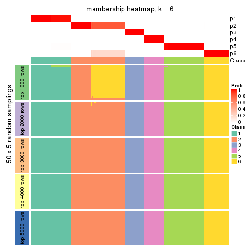</p>

</div>
</div>

As soon as we have had the classes for columns, we can look for signatures
which are significantly different between classes which can be candidate marks
for certain classes. Following are the heatmaps for signatures.


Signature heatmaps where rows are scaled:


<script>
$( function() {
	$( '#tabs-CV-pam-get-signatures' ).tabs();
} );
</script>
<div id='tabs-CV-pam-get-signatures'>
<ul>
<li><a href='#tab-CV-pam-get-signatures-1'>k = 2</a></li>
<li><a href='#tab-CV-pam-get-signatures-2'>k = 3</a></li>
<li><a href='#tab-CV-pam-get-signatures-3'>k = 4</a></li>
<li><a href='#tab-CV-pam-get-signatures-4'>k = 5</a></li>
<li><a href='#tab-CV-pam-get-signatures-5'>k = 6</a></li>
</ul>
<div id='tab-CV-pam-get-signatures-1'>
<pre><code class="r">get_signatures(res, k = 2)
</code></pre>

<p></p>

</div>
<div id='tab-CV-pam-get-signatures-2'>
<pre><code class="r">get_signatures(res, k = 3)
</code></pre>

<p></p>

</div>
<div id='tab-CV-pam-get-signatures-3'>
<pre><code class="r">get_signatures(res, k = 4)
</code></pre>

<p></p>

</div>
<div id='tab-CV-pam-get-signatures-4'>
<pre><code class="r">get_signatures(res, k = 5)
</code></pre>

<p></p>

</div>
<div id='tab-CV-pam-get-signatures-5'>
<pre><code class="r">get_signatures(res, k = 6)
</code></pre>

<p></p>

</div>
</div>


Signature heatmaps where rows are not scaled:


<script>
$( function() {
	$( '#tabs-CV-pam-get-signatures-no-scale' ).tabs();
} );
</script>
<div id='tabs-CV-pam-get-signatures-no-scale'>
<ul>
<li><a href='#tab-CV-pam-get-signatures-no-scale-1'>k = 2</a></li>
<li><a href='#tab-CV-pam-get-signatures-no-scale-2'>k = 3</a></li>
<li><a href='#tab-CV-pam-get-signatures-no-scale-3'>k = 4</a></li>
<li><a href='#tab-CV-pam-get-signatures-no-scale-4'>k = 5</a></li>
<li><a href='#tab-CV-pam-get-signatures-no-scale-5'>k = 6</a></li>
</ul>
<div id='tab-CV-pam-get-signatures-no-scale-1'>
<pre><code class="r">get_signatures(res, k = 2, scale_rows = FALSE)
</code></pre>

<p></p>

</div>
<div id='tab-CV-pam-get-signatures-no-scale-2'>
<pre><code class="r">get_signatures(res, k = 3, scale_rows = FALSE)
</code></pre>

<p></p>

</div>
<div id='tab-CV-pam-get-signatures-no-scale-3'>
<pre><code class="r">get_signatures(res, k = 4, scale_rows = FALSE)
</code></pre>

<p></p>

</div>
<div id='tab-CV-pam-get-signatures-no-scale-4'>
<pre><code class="r">get_signatures(res, k = 5, scale_rows = FALSE)
</code></pre>

<p></p>

</div>
<div id='tab-CV-pam-get-signatures-no-scale-5'>
<pre><code class="r">get_signatures(res, k = 6, scale_rows = FALSE)
</code></pre>

<p>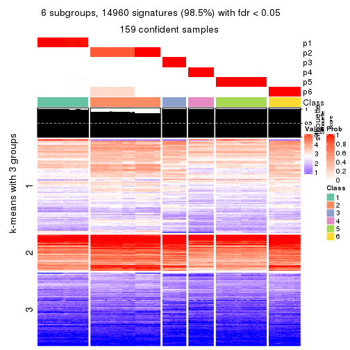</p>

</div>
</div>


Compare the overlap of signatures from different k:

```r
compare_signatures(res)
```


`get_signature()` returns a data frame invisibly. TO get the list of signatures, the function
call should be assigned to a variable explicitly. In following code, if `plot` argument is set
to `FALSE`, no heatmap is plotted while only the differential analysis is performed.

```r
# code only for demonstration
tb = get_signature(res, k = ..., plot = FALSE)
```

An example of the output of `tb` is:

```
#>   which_row         fdr    mean_1    mean_2 scaled_mean_1 scaled_mean_2 km
#> 1        38 0.042760348  8.373488  9.131774    -0.5533452     0.5164555  1
#> 2        40 0.018707592  7.106213  8.469186    -0.6173731     0.5762149  1
#> 3        55 0.019134737 10.221463 11.207825    -0.6159697     0.5749050  1
#> 4        59 0.006059896  5.921854  7.869574    -0.6899429     0.6439467  1
#> 5        60 0.018055526  8.928898 10.211722    -0.6204761     0.5791110  1
#> 6        98 0.009384629 15.714769 14.887706     0.6635654    -0.6193277  2
...
```

The columns in `tb` are:

1. `which_row`: row indices corresponding to the input matrix.
2. `fdr`: FDR for the differential test. 
3. `mean_x`: The mean value in group x.
4. `scaled_mean_x`: The mean value in group x after rows are scaled.
5. `km`: Row groups if k-means clustering is applied to rows.


UMAP plot which shows how samples are separated.


<script>
$( function() {
	$( '#tabs-CV-pam-dimension-reduction' ).tabs();
} );
</script>
<div id='tabs-CV-pam-dimension-reduction'>
<ul>
<li><a href='#tab-CV-pam-dimension-reduction-1'>k = 2</a></li>
<li><a href='#tab-CV-pam-dimension-reduction-2'>k = 3</a></li>
<li><a href='#tab-CV-pam-dimension-reduction-3'>k = 4</a></li>
<li><a href='#tab-CV-pam-dimension-reduction-4'>k = 5</a></li>
<li><a href='#tab-CV-pam-dimension-reduction-5'>k = 6</a></li>
</ul>
<div id='tab-CV-pam-dimension-reduction-1'>
<pre><code class="r">dimension_reduction(res, k = 2, method = &quot;UMAP&quot;)
</code></pre>

<p></p>

</div>
<div id='tab-CV-pam-dimension-reduction-2'>
<pre><code class="r">dimension_reduction(res, k = 3, method = &quot;UMAP&quot;)
</code></pre>

<p></p>

</div>
<div id='tab-CV-pam-dimension-reduction-3'>
<pre><code class="r">dimension_reduction(res, k = 4, method = &quot;UMAP&quot;)
</code></pre>

<p></p>

</div>
<div id='tab-CV-pam-dimension-reduction-4'>
<pre><code class="r">dimension_reduction(res, k = 5, method = &quot;UMAP&quot;)
</code></pre>

<p></p>

</div>
<div id='tab-CV-pam-dimension-reduction-5'>
<pre><code class="r">dimension_reduction(res, k = 6, method = &quot;UMAP&quot;)
</code></pre>

<p></p>

</div>
</div>


Following heatmap shows how subgroups are split when increasing `k`:

```r
collect_classes(res)
```


If matrix rows can be associated to genes, consider to use `GO_Enrichment(res,
...)` to perform function enrichment for the signature genes.


 

---------------------------------------------------


### CV:mclust**


The object with results only for a single top-value method and a single partition method 
can be extracted as:

```r
res = res_list["CV", "mclust"]
# you can also extract it by
# res = res_list["CV:mclust"]
```

A summary of `res` and all the functions that can be applied to it:

```r
res
```

```
#> A 'ConsensusPartition' object with k = 2, 3, 4, 5, 6.
#>   On a matrix with 15185 rows and 159 columns.
#>   Top rows (1000, 2000, 3000, 4000, 5000) are extracted by 'CV' method.
#>   Subgroups are detected by 'mclust' method.
#>   Performed in total 1250 partitions by row resampling.
#>   Best k for subgroups seems to be 2.
#> 
#> Following methods can be applied to this 'ConsensusPartition' object:
#>  [1] "cola_report"             "collect_classes"         "collect_plots"          
#>  [4] "collect_stats"           "colnames"                "compare_signatures"     
#>  [7] "consensus_heatmap"       "dimension_reduction"     "functional_enrichment"  
#> [10] "get_anno_col"            "get_anno"                "get_classes"            
#> [13] "get_consensus"           "get_matrix"              "get_membership"         
#> [16] "get_param"               "get_signatures"          "get_stats"              
#> [19] "is_best_k"               "is_stable_k"             "membership_heatmap"     
#> [22] "ncol"                    "nrow"                    "plot_ecdf"              
#> [25] "rownames"                "select_partition_number" "show"                   
#> [28] "suggest_best_k"          "test_to_known_factors"
```

`collect_plots()` function collects all the plots made from `res` for all `k` (number of partitions)
into one single page to provide an easy and fast comparison between different `k`.

```r
collect_plots(res)
```


The plots are:

- The first row: a plot of the ECDF (Empirical cumulative distribution
  function) curves of the consensus matrix for each `k` and the heatmap of
  predicted classes for each `k`.
- The second row: heatmaps of the consensus matrix for each `k`.
- The third row: heatmaps of the membership matrix for each `k`.
- The fouth row: heatmaps of the signatures for each `k`.

All the plots in panels can be made by individual functions and they are
plotted later in this section.

`select_partition_number()` produces several plots showing different
statistics for choosing "optimized" `k`. There are following statistics:

- ECDF curves of the consensus matrix for each `k`;
- 1-PAC. [The PAC
  score](https://en.wikipedia.org/wiki/Consensus_clustering#Over-interpretation_potential_of_consensus_clustering)
  measures the proportion of the ambiguous subgrouping.
- Mean silhouette score.
- Concordance. The mean probability of fiting the consensus class ids in all
  partitions.
- Area increased. Denote $A_k$ as the area under the ECDF curve for current
  `k`, the area increased is defined as $A_k - A_{k-1}$.
- Rand index. The percent of pairs of samples that are both in a same cluster
  or both are not in a same cluster in the partition of k and k-1.
- Jaccard index. The ratio of pairs of samples are both in a same cluster in
  the partition of k and k-1 and the pairs of samples are both in a same
  cluster in the partition k or k-1.

The detailed explanations of these statistics can be found in [the cola
vignette](http://bioconductor.org/packages/devel/bioc/vignettes/cola/inst/doc/cola.html#toc_13).

Generally speaking, lower PAC score, higher mean silhouette score or higher
concordance corresponds to better partition. Rand index and Jaccard index
measure how similar the current partition is compared to partition with `k-1`.
If they are too similar, we won't accept `k` is better than `k-1`.

```r
select_partition_number(res)
```


The numeric values for all these statistics can be obtained by `get_stats()`.

```r
get_stats(res)
```

```
#>   k 1-PAC mean_silhouette concordance area_increased  Rand Jaccard
#> 2 2 1.000           1.000       1.000         0.5036 0.497   0.497
#> 3 3 0.666           0.732       0.816         0.2178 0.878   0.754
#> 4 4 0.553           0.542       0.729         0.1356 0.858   0.672
#> 5 5 0.566           0.413       0.649         0.0953 0.739   0.380
#> 6 6 0.677           0.579       0.720         0.0384 0.792   0.380
```

`suggest_best_k()` suggests the best $k$ based on these statistics. The rules are as follows:

- All $k$ with Jaccard index larger than 0.95 are removed because the increase of
  the partition number does not provides enough extra information. If all $k$ are removed,
  the best $k$ is assigned by `NA`.
- For $k$ with 1-PAC larger than 0.9, the maximal $k$ is taken as the "best k". Other $k$ is called "optional k".
- If it does not fit the second rule. The $k$ with the highest vote of highest
  1-PAC, mean silhouette and concordance is taken as the "best k".

```r
suggest_best_k(res)
```

```
#> [1] 2
```


Following shows the table of the partitions (You need to click the **show/hide
code output** link to see it). The membership matrix (columns with name `p*`)
is inferred by
[`clue::cl_consensus()`](https://www.rdocumentation.org/link/cl_consensus?package=clue)
function with the `SE` method. Basically the value in the membership matrix
represents the probability to belong to a certain group. The finall class
label for an item is determined with the group with highest probability it
belongs to.

In `get_classes()` function, the entropy is calculated from the membership
matrix and the silhouette score is calculated from the consensus matrix.


<script>
$( function() {
	$( '#tabs-CV-mclust-get-classes' ).tabs();
} );
</script>
<div id='tabs-CV-mclust-get-classes'>
<ul>
<li><a href='#tab-CV-mclust-get-classes-1'>k = 2</a></li>
<li><a href='#tab-CV-mclust-get-classes-2'>k = 3</a></li>
<li><a href='#tab-CV-mclust-get-classes-3'>k = 4</a></li>
<li><a href='#tab-CV-mclust-get-classes-4'>k = 5</a></li>
<li><a href='#tab-CV-mclust-get-classes-5'>k = 6</a></li>
</ul>

<div id='tab-CV-mclust-get-classes-1'>
<p><a id='tab-CV-mclust-get-classes-1-a' style='color:#0366d6' href='#'>show/hide code output</a></p>
<pre><code class="r">cbind(get_classes(res, k = 2), get_membership(res, k = 2))
</code></pre>

<pre><code>#&gt;            class entropy silhouette p1 p2
#&gt; SRR1706767     1       0          1  1  0
#&gt; SRR1706768     1       0          1  1  0
#&gt; SRR1706769     1       0          1  1  0
#&gt; SRR1706770     1       0          1  1  0
#&gt; SRR1706771     1       0          1  1  0
#&gt; SRR1706772     1       0          1  1  0
#&gt; SRR1706773     1       0          1  1  0
#&gt; SRR1706774     1       0          1  1  0
#&gt; SRR1706775     1       0          1  1  0
#&gt; SRR1706776     1       0          1  1  0
#&gt; SRR1706777     1       0          1  1  0
#&gt; SRR1706778     1       0          1  1  0
#&gt; SRR1706779     1       0          1  1  0
#&gt; SRR1706780     1       0          1  1  0
#&gt; SRR1706781     1       0          1  1  0
#&gt; SRR1706782     1       0          1  1  0
#&gt; SRR1706783     1       0          1  1  0
#&gt; SRR1706784     1       0          1  1  0
#&gt; SRR1706785     1       0          1  1  0
#&gt; SRR1706786     1       0          1  1  0
#&gt; SRR1706787     1       0          1  1  0
#&gt; SRR1706788     1       0          1  1  0
#&gt; SRR1706789     1       0          1  1  0
#&gt; SRR1706790     1       0          1  1  0
#&gt; SRR1706791     1       0          1  1  0
#&gt; SRR1706792     1       0          1  1  0
#&gt; SRR1706793     1       0          1  1  0
#&gt; SRR1706794     1       0          1  1  0
#&gt; SRR1706795     1       0          1  1  0
#&gt; SRR1706796     1       0          1  1  0
#&gt; SRR1706797     1       0          1  1  0
#&gt; SRR1706798     1       0          1  1  0
#&gt; SRR1706799     1       0          1  1  0
#&gt; SRR1706800     1       0          1  1  0
#&gt; SRR1706801     1       0          1  1  0
#&gt; SRR1706802     1       0          1  1  0
#&gt; SRR1706803     1       0          1  1  0
#&gt; SRR1706804     1       0          1  1  0
#&gt; SRR1706805     1       0          1  1  0
#&gt; SRR1706806     1       0          1  1  0
#&gt; SRR1706811     1       0          1  1  0
#&gt; SRR1706812     1       0          1  1  0
#&gt; SRR1706813     1       0          1  1  0
#&gt; SRR1706814     1       0          1  1  0
#&gt; SRR1706807     1       0          1  1  0
#&gt; SRR1706808     1       0          1  1  0
#&gt; SRR1706809     1       0          1  1  0
#&gt; SRR1706810     1       0          1  1  0
#&gt; SRR1706815     1       0          1  1  0
#&gt; SRR1706816     1       0          1  1  0
#&gt; SRR1706817     1       0          1  1  0
#&gt; SRR1706818     1       0          1  1  0
#&gt; SRR1706819     1       0          1  1  0
#&gt; SRR1706820     1       0          1  1  0
#&gt; SRR1706821     1       0          1  1  0
#&gt; SRR1706822     1       0          1  1  0
#&gt; SRR1706823     1       0          1  1  0
#&gt; SRR1706824     1       0          1  1  0
#&gt; SRR1706825     1       0          1  1  0
#&gt; SRR1706826     1       0          1  1  0
#&gt; SRR1706827     1       0          1  1  0
#&gt; SRR1706828     1       0          1  1  0
#&gt; SRR1706829     1       0          1  1  0
#&gt; SRR1706830     1       0          1  1  0
#&gt; SRR1706835     1       0          1  1  0
#&gt; SRR1706836     1       0          1  1  0
#&gt; SRR1706837     1       0          1  1  0
#&gt; SRR1706838     1       0          1  1  0
#&gt; SRR1706831     1       0          1  1  0
#&gt; SRR1706832     1       0          1  1  0
#&gt; SRR1706833     1       0          1  1  0
#&gt; SRR1706834     1       0          1  1  0
#&gt; SRR1706839     1       0          1  1  0
#&gt; SRR1706840     1       0          1  1  0
#&gt; SRR1706841     1       0          1  1  0
#&gt; SRR1706842     1       0          1  1  0
#&gt; SRR1706847     2       0          1  0  1
#&gt; SRR1706848     2       0          1  0  1
#&gt; SRR1706849     2       0          1  0  1
#&gt; SRR1706850     2       0          1  0  1
#&gt; SRR1706843     1       0          1  1  0
#&gt; SRR1706844     1       0          1  1  0
#&gt; SRR1706845     1       0          1  1  0
#&gt; SRR1706846     1       0          1  1  0
#&gt; SRR1706851     2       0          1  0  1
#&gt; SRR1706852     2       0          1  0  1
#&gt; SRR1706853     2       0          1  0  1
#&gt; SRR1706854     2       0          1  0  1
#&gt; SRR1706855     2       0          1  0  1
#&gt; SRR1706856     2       0          1  0  1
#&gt; SRR1706857     2       0          1  0  1
#&gt; SRR1706858     2       0          1  0  1
#&gt; SRR1706859     2       0          1  0  1
#&gt; SRR1706860     2       0          1  0  1
#&gt; SRR1706861     2       0          1  0  1
#&gt; SRR1706862     2       0          1  0  1
#&gt; SRR1706867     2       0          1  0  1
#&gt; SRR1706869     2       0          1  0  1
#&gt; SRR1706870     2       0          1  0  1
#&gt; SRR1706863     2       0          1  0  1
#&gt; SRR1706864     2       0          1  0  1
#&gt; SRR1706865     2       0          1  0  1
#&gt; SRR1706866     2       0          1  0  1
#&gt; SRR1706871     2       0          1  0  1
#&gt; SRR1706872     2       0          1  0  1
#&gt; SRR1706873     2       0          1  0  1
#&gt; SRR1706874     2       0          1  0  1
#&gt; SRR1706879     2       0          1  0  1
#&gt; SRR1706880     2       0          1  0  1
#&gt; SRR1706881     2       0          1  0  1
#&gt; SRR1706882     2       0          1  0  1
#&gt; SRR1706883     2       0          1  0  1
#&gt; SRR1706884     2       0          1  0  1
#&gt; SRR1706885     2       0          1  0  1
#&gt; SRR1706886     2       0          1  0  1
#&gt; SRR1706875     2       0          1  0  1
#&gt; SRR1706876     2       0          1  0  1
#&gt; SRR1706877     2       0          1  0  1
#&gt; SRR1706878     2       0          1  0  1
#&gt; SRR1706887     2       0          1  0  1
#&gt; SRR1706888     2       0          1  0  1
#&gt; SRR1706889     2       0          1  0  1
#&gt; SRR1706890     2       0          1  0  1
#&gt; SRR1706891     2       0          1  0  1
#&gt; SRR1706892     2       0          1  0  1
#&gt; SRR1706893     2       0          1  0  1
#&gt; SRR1706894     2       0          1  0  1
#&gt; SRR1706895     2       0          1  0  1
#&gt; SRR1706896     2       0          1  0  1
#&gt; SRR1706897     2       0          1  0  1
#&gt; SRR1706898     2       0          1  0  1
#&gt; SRR1706899     2       0          1  0  1
#&gt; SRR1706900     2       0          1  0  1
#&gt; SRR1706901     2       0          1  0  1
#&gt; SRR1706902     2       0          1  0  1
#&gt; SRR1706907     2       0          1  0  1
#&gt; SRR1706908     2       0          1  0  1
#&gt; SRR1706909     2       0          1  0  1
#&gt; SRR1706910     2       0          1  0  1
#&gt; SRR1706903     2       0          1  0  1
#&gt; SRR1706904     2       0          1  0  1
#&gt; SRR1706905     2       0          1  0  1
#&gt; SRR1706906     2       0          1  0  1
#&gt; SRR1706911     2       0          1  0  1
#&gt; SRR1706912     2       0          1  0  1
#&gt; SRR1706913     2       0          1  0  1
#&gt; SRR1706914     2       0          1  0  1
#&gt; SRR1706919     2       0          1  0  1
#&gt; SRR1706920     2       0          1  0  1
#&gt; SRR1706921     2       0          1  0  1
#&gt; SRR1706922     2       0          1  0  1
#&gt; SRR1706915     2       0          1  0  1
#&gt; SRR1706916     2       0          1  0  1
#&gt; SRR1706917     2       0          1  0  1
#&gt; SRR1706918     2       0          1  0  1
#&gt; SRR1706923     2       0          1  0  1
#&gt; SRR1706924     2       0          1  0  1
#&gt; SRR1706925     2       0          1  0  1
#&gt; SRR1706926     2       0          1  0  1
</code></pre>

<script>
$('#tab-CV-mclust-get-classes-1-a').parent().next().next().hide();
$('#tab-CV-mclust-get-classes-1-a').click(function(){
  $('#tab-CV-mclust-get-classes-1-a').parent().next().next().toggle();
  return(false);
});
</script>
</div>

<div id='tab-CV-mclust-get-classes-2'>
<p><a id='tab-CV-mclust-get-classes-2-a' style='color:#0366d6' href='#'>show/hide code output</a></p>
<pre><code class="r">cbind(get_classes(res, k = 3), get_membership(res, k = 3))
</code></pre>

<pre><code>#&gt;            class entropy silhouette    p1    p2    p3
#&gt; SRR1706767     1  0.6045      0.141 0.620 0.000 0.380
#&gt; SRR1706768     1  0.6045      0.141 0.620 0.000 0.380
#&gt; SRR1706769     1  0.6045      0.141 0.620 0.000 0.380
#&gt; SRR1706770     1  0.6045      0.141 0.620 0.000 0.380
#&gt; SRR1706771     1  0.6045      0.141 0.620 0.000 0.380
#&gt; SRR1706772     1  0.6045      0.141 0.620 0.000 0.380
#&gt; SRR1706773     1  0.6045      0.141 0.620 0.000 0.380
#&gt; SRR1706774     1  0.6062      0.129 0.616 0.000 0.384
#&gt; SRR1706775     1  0.6062      0.128 0.616 0.000 0.384
#&gt; SRR1706776     1  0.6045      0.141 0.620 0.000 0.380
#&gt; SRR1706777     1  0.6062      0.129 0.616 0.000 0.384
#&gt; SRR1706778     1  0.6079      0.114 0.612 0.000 0.388
#&gt; SRR1706779     3  0.6302      0.593 0.480 0.000 0.520
#&gt; SRR1706780     3  0.6302      0.593 0.480 0.000 0.520
#&gt; SRR1706781     3  0.6302      0.593 0.480 0.000 0.520
#&gt; SRR1706782     3  0.6302      0.593 0.480 0.000 0.520
#&gt; SRR1706783     3  0.5058      0.727 0.244 0.000 0.756
#&gt; SRR1706784     3  0.5016      0.728 0.240 0.000 0.760
#&gt; SRR1706785     3  0.5016      0.728 0.240 0.000 0.760
#&gt; SRR1706786     3  0.5016      0.728 0.240 0.000 0.760
#&gt; SRR1706787     1  0.0237      0.669 0.996 0.000 0.004
#&gt; SRR1706788     1  0.0237      0.669 0.996 0.000 0.004
#&gt; SRR1706789     1  0.0237      0.669 0.996 0.000 0.004
#&gt; SRR1706790     1  0.0237      0.669 0.996 0.000 0.004
#&gt; SRR1706791     1  0.2066      0.699 0.940 0.000 0.060
#&gt; SRR1706792     1  0.2066      0.699 0.940 0.000 0.060
#&gt; SRR1706793     1  0.2066      0.699 0.940 0.000 0.060
#&gt; SRR1706794     1  0.2066      0.699 0.940 0.000 0.060
#&gt; SRR1706795     1  0.2796      0.694 0.908 0.000 0.092
#&gt; SRR1706796     1  0.4002      0.644 0.840 0.000 0.160
#&gt; SRR1706797     1  0.3038      0.688 0.896 0.000 0.104
#&gt; SRR1706798     1  0.2878      0.692 0.904 0.000 0.096
#&gt; SRR1706799     3  0.6302      0.593 0.480 0.000 0.520
#&gt; SRR1706800     3  0.6302      0.593 0.480 0.000 0.520
#&gt; SRR1706801     3  0.6302      0.593 0.480 0.000 0.520
#&gt; SRR1706802     3  0.6302      0.593 0.480 0.000 0.520
#&gt; SRR1706803     3  0.5016      0.728 0.240 0.000 0.760
#&gt; SRR1706804     3  0.5016      0.728 0.240 0.000 0.760
#&gt; SRR1706805     3  0.5016      0.728 0.240 0.000 0.760
#&gt; SRR1706806     3  0.5016      0.728 0.240 0.000 0.760
#&gt; SRR1706811     1  0.4178      0.633 0.828 0.000 0.172
#&gt; SRR1706812     1  0.4062      0.643 0.836 0.000 0.164
#&gt; SRR1706813     1  0.4062      0.643 0.836 0.000 0.164
#&gt; SRR1706814     1  0.4062      0.643 0.836 0.000 0.164
#&gt; SRR1706807     1  0.0237      0.669 0.996 0.000 0.004
#&gt; SRR1706808     1  0.0237      0.669 0.996 0.000 0.004
#&gt; SRR1706809     1  0.0237      0.669 0.996 0.000 0.004
#&gt; SRR1706810     1  0.0237      0.669 0.996 0.000 0.004
#&gt; SRR1706815     1  0.6079      0.114 0.612 0.000 0.388
#&gt; SRR1706816     1  0.6079      0.114 0.612 0.000 0.388
#&gt; SRR1706817     1  0.6079      0.114 0.612 0.000 0.388
#&gt; SRR1706818     1  0.6079      0.114 0.612 0.000 0.388
#&gt; SRR1706819     3  0.6302      0.593 0.480 0.000 0.520
#&gt; SRR1706820     3  0.6305      0.579 0.484 0.000 0.516
#&gt; SRR1706821     3  0.6302      0.593 0.480 0.000 0.520
#&gt; SRR1706822     3  0.6305      0.579 0.484 0.000 0.516
#&gt; SRR1706823     3  0.5016      0.728 0.240 0.000 0.760
#&gt; SRR1706824     3  0.5016      0.728 0.240 0.000 0.760
#&gt; SRR1706825     3  0.5016      0.728 0.240 0.000 0.760
#&gt; SRR1706826     3  0.5016      0.728 0.240 0.000 0.760
#&gt; SRR1706827     1  0.0237      0.669 0.996 0.000 0.004
#&gt; SRR1706828     1  0.0237      0.669 0.996 0.000 0.004
#&gt; SRR1706829     1  0.0237      0.669 0.996 0.000 0.004
#&gt; SRR1706830     1  0.0237      0.669 0.996 0.000 0.004
#&gt; SRR1706835     1  0.2711      0.695 0.912 0.000 0.088
#&gt; SRR1706836     1  0.3941      0.652 0.844 0.000 0.156
#&gt; SRR1706837     1  0.3619      0.669 0.864 0.000 0.136
#&gt; SRR1706838     1  0.3038      0.689 0.896 0.000 0.104
#&gt; SRR1706831     1  0.2066      0.699 0.940 0.000 0.060
#&gt; SRR1706832     1  0.2066      0.699 0.940 0.000 0.060
#&gt; SRR1706833     1  0.2066      0.699 0.940 0.000 0.060
#&gt; SRR1706834     1  0.2066      0.699 0.940 0.000 0.060
#&gt; SRR1706839     3  0.6302      0.593 0.480 0.000 0.520
#&gt; SRR1706840     3  0.6302      0.593 0.480 0.000 0.520
#&gt; SRR1706841     3  0.6302      0.593 0.480 0.000 0.520
#&gt; SRR1706842     3  0.6302      0.593 0.480 0.000 0.520
#&gt; SRR1706847     2  0.0592      0.926 0.000 0.988 0.012
#&gt; SRR1706848     2  0.0592      0.926 0.000 0.988 0.012
#&gt; SRR1706849     2  0.0592      0.926 0.000 0.988 0.012
#&gt; SRR1706850     2  0.0592      0.926 0.000 0.988 0.012
#&gt; SRR1706843     3  0.5016      0.728 0.240 0.000 0.760
#&gt; SRR1706844     3  0.5016      0.728 0.240 0.000 0.760
#&gt; SRR1706845     3  0.5016      0.728 0.240 0.000 0.760
#&gt; SRR1706846     3  0.5016      0.728 0.240 0.000 0.760
#&gt; SRR1706851     2  0.0000      0.927 0.000 1.000 0.000
#&gt; SRR1706852     2  0.0000      0.927 0.000 1.000 0.000
#&gt; SRR1706853     2  0.0000      0.927 0.000 1.000 0.000
#&gt; SRR1706854     2  0.0000      0.927 0.000 1.000 0.000
#&gt; SRR1706855     2  0.0237      0.927 0.000 0.996 0.004
#&gt; SRR1706856     2  0.0237      0.927 0.000 0.996 0.004
#&gt; SRR1706857     2  0.0237      0.927 0.000 0.996 0.004
#&gt; SRR1706858     2  0.0237      0.927 0.000 0.996 0.004
#&gt; SRR1706859     2  0.1753      0.923 0.000 0.952 0.048
#&gt; SRR1706860     2  0.1753      0.923 0.000 0.952 0.048
#&gt; SRR1706861     2  0.1753      0.923 0.000 0.952 0.048
#&gt; SRR1706862     2  0.1753      0.923 0.000 0.952 0.048
#&gt; SRR1706867     2  0.3083      0.902 0.060 0.916 0.024
#&gt; SRR1706869     2  0.3083      0.902 0.060 0.916 0.024
#&gt; SRR1706870     2  0.3083      0.902 0.060 0.916 0.024
#&gt; SRR1706863     2  0.4974      0.867 0.000 0.764 0.236
#&gt; SRR1706864     2  0.4974      0.867 0.000 0.764 0.236
#&gt; SRR1706865     2  0.4974      0.867 0.000 0.764 0.236
#&gt; SRR1706866     2  0.4974      0.867 0.000 0.764 0.236
#&gt; SRR1706871     2  0.0747      0.925 0.000 0.984 0.016
#&gt; SRR1706872     2  0.0747      0.925 0.000 0.984 0.016
#&gt; SRR1706873     2  0.0747      0.925 0.000 0.984 0.016
#&gt; SRR1706874     2  0.0747      0.925 0.000 0.984 0.016
#&gt; SRR1706879     2  0.4002      0.900 0.000 0.840 0.160
#&gt; SRR1706880     2  0.4002      0.900 0.000 0.840 0.160
#&gt; SRR1706881     2  0.4002      0.900 0.000 0.840 0.160
#&gt; SRR1706882     2  0.4002      0.900 0.000 0.840 0.160
#&gt; SRR1706883     2  0.4974      0.867 0.000 0.764 0.236
#&gt; SRR1706884     2  0.4974      0.867 0.000 0.764 0.236
#&gt; SRR1706885     2  0.4974      0.867 0.000 0.764 0.236
#&gt; SRR1706886     2  0.4974      0.867 0.000 0.764 0.236
#&gt; SRR1706875     2  0.0592      0.928 0.000 0.988 0.012
#&gt; SRR1706876     2  0.0592      0.928 0.000 0.988 0.012
#&gt; SRR1706877     2  0.0424      0.928 0.000 0.992 0.008
#&gt; SRR1706878     2  0.0592      0.928 0.000 0.988 0.012
#&gt; SRR1706887     2  0.3791      0.896 0.060 0.892 0.048
#&gt; SRR1706888     2  0.3791      0.896 0.060 0.892 0.048
#&gt; SRR1706889     2  0.3791      0.896 0.060 0.892 0.048
#&gt; SRR1706890     2  0.3791      0.896 0.060 0.892 0.048
#&gt; SRR1706891     2  0.1643      0.922 0.000 0.956 0.044
#&gt; SRR1706892     2  0.1643      0.922 0.000 0.956 0.044
#&gt; SRR1706893     2  0.1643      0.922 0.000 0.956 0.044
#&gt; SRR1706894     2  0.1643      0.922 0.000 0.956 0.044
#&gt; SRR1706895     2  0.3340      0.918 0.000 0.880 0.120
#&gt; SRR1706896     2  0.3340      0.918 0.000 0.880 0.120
#&gt; SRR1706897     2  0.3340      0.918 0.000 0.880 0.120
#&gt; SRR1706898     2  0.3340      0.918 0.000 0.880 0.120
#&gt; SRR1706899     2  0.4121      0.905 0.000 0.832 0.168
#&gt; SRR1706900     2  0.4121      0.905 0.000 0.832 0.168
#&gt; SRR1706901     2  0.4121      0.905 0.000 0.832 0.168
#&gt; SRR1706902     2  0.4121      0.905 0.000 0.832 0.168
#&gt; SRR1706907     2  0.3083      0.902 0.060 0.916 0.024
#&gt; SRR1706908     2  0.3083      0.902 0.060 0.916 0.024
#&gt; SRR1706909     2  0.3083      0.902 0.060 0.916 0.024
#&gt; SRR1706910     2  0.3083      0.902 0.060 0.916 0.024
#&gt; SRR1706903     2  0.4702      0.880 0.000 0.788 0.212
#&gt; SRR1706904     2  0.4702      0.880 0.000 0.788 0.212
#&gt; SRR1706905     2  0.4702      0.880 0.000 0.788 0.212
#&gt; SRR1706906     2  0.4702      0.880 0.000 0.788 0.212
#&gt; SRR1706911     2  0.0747      0.925 0.000 0.984 0.016
#&gt; SRR1706912     2  0.0747      0.925 0.000 0.984 0.016
#&gt; SRR1706913     2  0.0747      0.925 0.000 0.984 0.016
#&gt; SRR1706914     2  0.0747      0.925 0.000 0.984 0.016
#&gt; SRR1706919     2  0.4002      0.900 0.000 0.840 0.160
#&gt; SRR1706920     2  0.4002      0.900 0.000 0.840 0.160
#&gt; SRR1706921     2  0.4002      0.900 0.000 0.840 0.160
#&gt; SRR1706922     2  0.4002      0.900 0.000 0.840 0.160
#&gt; SRR1706915     2  0.0747      0.928 0.000 0.984 0.016
#&gt; SRR1706916     2  0.0592      0.928 0.000 0.988 0.012
#&gt; SRR1706917     2  0.0592      0.928 0.000 0.988 0.012
#&gt; SRR1706918     2  0.0747      0.928 0.000 0.984 0.016
#&gt; SRR1706923     2  0.4974      0.867 0.000 0.764 0.236
#&gt; SRR1706924     2  0.4974      0.867 0.000 0.764 0.236
#&gt; SRR1706925     2  0.4974      0.867 0.000 0.764 0.236
#&gt; SRR1706926     2  0.4974      0.867 0.000 0.764 0.236
</code></pre>

<script>
$('#tab-CV-mclust-get-classes-2-a').parent().next().next().hide();
$('#tab-CV-mclust-get-classes-2-a').click(function(){
  $('#tab-CV-mclust-get-classes-2-a').parent().next().next().toggle();
  return(false);
});
</script>
</div>

<div id='tab-CV-mclust-get-classes-3'>
<p><a id='tab-CV-mclust-get-classes-3-a' style='color:#0366d6' href='#'>show/hide code output</a></p>
<pre><code class="r">cbind(get_classes(res, k = 4), get_membership(res, k = 4))
</code></pre>

<pre><code>#&gt;            class entropy silhouette    p1    p2    p3    p4
#&gt; SRR1706767     4  0.6875     0.4311 0.368 0.112 0.000 0.520
#&gt; SRR1706768     4  0.6875     0.4311 0.368 0.112 0.000 0.520
#&gt; SRR1706769     4  0.6875     0.4311 0.368 0.112 0.000 0.520
#&gt; SRR1706770     4  0.6875     0.4311 0.368 0.112 0.000 0.520
#&gt; SRR1706771     4  0.5284     0.4650 0.368 0.016 0.000 0.616
#&gt; SRR1706772     4  0.5284     0.4650 0.368 0.016 0.000 0.616
#&gt; SRR1706773     4  0.5284     0.4650 0.368 0.016 0.000 0.616
#&gt; SRR1706774     4  0.5284     0.4650 0.368 0.016 0.000 0.616
#&gt; SRR1706775     4  0.5099     0.4588 0.380 0.008 0.000 0.612
#&gt; SRR1706776     4  0.5099     0.4588 0.380 0.008 0.000 0.612
#&gt; SRR1706777     4  0.5099     0.4588 0.380 0.008 0.000 0.612
#&gt; SRR1706778     4  0.5099     0.4588 0.380 0.008 0.000 0.612
#&gt; SRR1706779     4  0.4989     0.2425 0.472 0.000 0.000 0.528
#&gt; SRR1706780     4  0.4992     0.2351 0.476 0.000 0.000 0.524
#&gt; SRR1706781     4  0.4994     0.2240 0.480 0.000 0.000 0.520
#&gt; SRR1706782     4  0.4989     0.2425 0.472 0.000 0.000 0.528
#&gt; SRR1706783     1  0.4669     0.9361 0.780 0.052 0.000 0.168
#&gt; SRR1706784     1  0.4532     0.9537 0.792 0.052 0.000 0.156
#&gt; SRR1706785     1  0.4532     0.9537 0.792 0.052 0.000 0.156
#&gt; SRR1706786     1  0.4532     0.9537 0.792 0.052 0.000 0.156
#&gt; SRR1706787     4  0.3601     0.5582 0.084 0.056 0.000 0.860
#&gt; SRR1706788     4  0.3601     0.5582 0.084 0.056 0.000 0.860
#&gt; SRR1706789     4  0.3601     0.5582 0.084 0.056 0.000 0.860
#&gt; SRR1706790     4  0.3601     0.5582 0.084 0.056 0.000 0.860
#&gt; SRR1706791     4  0.0000     0.6169 0.000 0.000 0.000 1.000
#&gt; SRR1706792     4  0.0000     0.6169 0.000 0.000 0.000 1.000
#&gt; SRR1706793     4  0.0000     0.6169 0.000 0.000 0.000 1.000
#&gt; SRR1706794     4  0.0000     0.6169 0.000 0.000 0.000 1.000
#&gt; SRR1706795     4  0.1474     0.6232 0.052 0.000 0.000 0.948
#&gt; SRR1706796     4  0.2408     0.6222 0.104 0.000 0.000 0.896
#&gt; SRR1706797     4  0.1716     0.6238 0.064 0.000 0.000 0.936
#&gt; SRR1706798     4  0.1474     0.6232 0.052 0.000 0.000 0.948
#&gt; SRR1706799     4  0.5000     0.1610 0.500 0.000 0.000 0.500
#&gt; SRR1706800     4  0.5000     0.1610 0.500 0.000 0.000 0.500
#&gt; SRR1706801     4  0.5000     0.1610 0.500 0.000 0.000 0.500
#&gt; SRR1706802     4  0.5000     0.1610 0.500 0.000 0.000 0.500
#&gt; SRR1706803     1  0.4532     0.9537 0.792 0.052 0.000 0.156
#&gt; SRR1706804     1  0.4532     0.9537 0.792 0.052 0.000 0.156
#&gt; SRR1706805     1  0.4532     0.9537 0.792 0.052 0.000 0.156
#&gt; SRR1706806     1  0.4532     0.9537 0.792 0.052 0.000 0.156
#&gt; SRR1706811     4  0.2921     0.6166 0.140 0.000 0.000 0.860
#&gt; SRR1706812     4  0.2868     0.6178 0.136 0.000 0.000 0.864
#&gt; SRR1706813     4  0.2868     0.6178 0.136 0.000 0.000 0.864
#&gt; SRR1706814     4  0.2868     0.6178 0.136 0.000 0.000 0.864
#&gt; SRR1706807     4  0.3601     0.5582 0.084 0.056 0.000 0.860
#&gt; SRR1706808     4  0.3601     0.5582 0.084 0.056 0.000 0.860
#&gt; SRR1706809     4  0.3601     0.5582 0.084 0.056 0.000 0.860
#&gt; SRR1706810     4  0.3601     0.5582 0.084 0.056 0.000 0.860
#&gt; SRR1706815     4  0.4624     0.4983 0.340 0.000 0.000 0.660
#&gt; SRR1706816     4  0.4761     0.4628 0.372 0.000 0.000 0.628
#&gt; SRR1706817     4  0.4697     0.4826 0.356 0.000 0.000 0.644
#&gt; SRR1706818     4  0.4679     0.4868 0.352 0.000 0.000 0.648
#&gt; SRR1706819     4  0.5000     0.1732 0.496 0.000 0.000 0.504
#&gt; SRR1706820     4  0.4998     0.2001 0.488 0.000 0.000 0.512
#&gt; SRR1706821     4  0.4994     0.2223 0.480 0.000 0.000 0.520
#&gt; SRR1706822     4  0.4998     0.2000 0.488 0.000 0.000 0.512
#&gt; SRR1706823     1  0.4578     0.9502 0.788 0.052 0.000 0.160
#&gt; SRR1706824     1  0.4578     0.9502 0.788 0.052 0.000 0.160
#&gt; SRR1706825     1  0.4624     0.9451 0.784 0.052 0.000 0.164
#&gt; SRR1706826     1  0.4578     0.9502 0.788 0.052 0.000 0.160
#&gt; SRR1706827     4  0.3601     0.5582 0.084 0.056 0.000 0.860
#&gt; SRR1706828     4  0.3601     0.5582 0.084 0.056 0.000 0.860
#&gt; SRR1706829     4  0.3601     0.5582 0.084 0.056 0.000 0.860
#&gt; SRR1706830     4  0.3601     0.5582 0.084 0.056 0.000 0.860
#&gt; SRR1706835     4  0.1557     0.6241 0.056 0.000 0.000 0.944
#&gt; SRR1706836     4  0.3024     0.6142 0.148 0.000 0.000 0.852
#&gt; SRR1706837     4  0.2760     0.6196 0.128 0.000 0.000 0.872
#&gt; SRR1706838     4  0.2216     0.6239 0.092 0.000 0.000 0.908
#&gt; SRR1706831     4  0.0000     0.6169 0.000 0.000 0.000 1.000
#&gt; SRR1706832     4  0.0000     0.6169 0.000 0.000 0.000 1.000
#&gt; SRR1706833     4  0.0000     0.6169 0.000 0.000 0.000 1.000
#&gt; SRR1706834     4  0.0000     0.6169 0.000 0.000 0.000 1.000
#&gt; SRR1706839     4  0.5000     0.1610 0.500 0.000 0.000 0.500
#&gt; SRR1706840     1  0.5000    -0.2229 0.500 0.000 0.000 0.500
#&gt; SRR1706841     4  0.5000     0.1732 0.496 0.000 0.000 0.504
#&gt; SRR1706842     4  0.5000     0.1610 0.500 0.000 0.000 0.500
#&gt; SRR1706847     3  0.4440     0.6387 0.136 0.060 0.804 0.000
#&gt; SRR1706848     3  0.4440     0.6387 0.136 0.060 0.804 0.000
#&gt; SRR1706849     3  0.4440     0.6387 0.136 0.060 0.804 0.000
#&gt; SRR1706850     3  0.4440     0.6387 0.136 0.060 0.804 0.000
#&gt; SRR1706843     1  0.4532     0.9537 0.792 0.052 0.000 0.156
#&gt; SRR1706844     1  0.4532     0.9537 0.792 0.052 0.000 0.156
#&gt; SRR1706845     1  0.4532     0.9537 0.792 0.052 0.000 0.156
#&gt; SRR1706846     1  0.4532     0.9537 0.792 0.052 0.000 0.156
#&gt; SRR1706851     3  0.4415     0.6228 0.056 0.140 0.804 0.000
#&gt; SRR1706852     3  0.4415     0.6228 0.056 0.140 0.804 0.000
#&gt; SRR1706853     3  0.4415     0.6228 0.056 0.140 0.804 0.000
#&gt; SRR1706854     3  0.4415     0.6228 0.056 0.140 0.804 0.000
#&gt; SRR1706855     3  0.4934     0.4920 0.028 0.252 0.720 0.000
#&gt; SRR1706856     3  0.4934     0.4920 0.028 0.252 0.720 0.000
#&gt; SRR1706857     3  0.4934     0.4920 0.028 0.252 0.720 0.000
#&gt; SRR1706858     3  0.4934     0.4920 0.028 0.252 0.720 0.000
#&gt; SRR1706859     3  0.5343     0.1971 0.028 0.316 0.656 0.000
#&gt; SRR1706860     3  0.5343     0.1971 0.028 0.316 0.656 0.000
#&gt; SRR1706861     3  0.5343     0.1971 0.028 0.316 0.656 0.000
#&gt; SRR1706862     3  0.5343     0.1971 0.028 0.316 0.656 0.000
#&gt; SRR1706867     3  0.4706     0.6141 0.140 0.072 0.788 0.000
#&gt; SRR1706869     3  0.4706     0.6141 0.140 0.072 0.788 0.000
#&gt; SRR1706870     3  0.4706     0.6141 0.140 0.072 0.788 0.000
#&gt; SRR1706863     2  0.4585     0.9994 0.000 0.668 0.332 0.000
#&gt; SRR1706864     2  0.4761     0.9931 0.004 0.664 0.332 0.000
#&gt; SRR1706865     2  0.4585     0.9994 0.000 0.668 0.332 0.000
#&gt; SRR1706866     2  0.4585     0.9994 0.000 0.668 0.332 0.000
#&gt; SRR1706871     3  0.0000     0.6713 0.000 0.000 1.000 0.000
#&gt; SRR1706872     3  0.0000     0.6713 0.000 0.000 1.000 0.000
#&gt; SRR1706873     3  0.0000     0.6713 0.000 0.000 1.000 0.000
#&gt; SRR1706874     3  0.0000     0.6713 0.000 0.000 1.000 0.000
#&gt; SRR1706879     3  0.4925    -0.3044 0.000 0.428 0.572 0.000
#&gt; SRR1706880     3  0.4933    -0.3127 0.000 0.432 0.568 0.000
#&gt; SRR1706881     3  0.4925    -0.3044 0.000 0.428 0.572 0.000
#&gt; SRR1706882     3  0.4933    -0.3127 0.000 0.432 0.568 0.000
#&gt; SRR1706883     2  0.4585     0.9994 0.000 0.668 0.332 0.000
#&gt; SRR1706884     2  0.4585     0.9994 0.000 0.668 0.332 0.000
#&gt; SRR1706885     2  0.4585     0.9994 0.000 0.668 0.332 0.000
#&gt; SRR1706886     2  0.4585     0.9994 0.000 0.668 0.332 0.000
#&gt; SRR1706875     3  0.1584     0.6584 0.012 0.036 0.952 0.000
#&gt; SRR1706876     3  0.1584     0.6584 0.012 0.036 0.952 0.000
#&gt; SRR1706877     3  0.1584     0.6584 0.012 0.036 0.952 0.000
#&gt; SRR1706878     3  0.1584     0.6584 0.012 0.036 0.952 0.000
#&gt; SRR1706887     3  0.5905     0.5773 0.144 0.156 0.700 0.000
#&gt; SRR1706888     3  0.5905     0.5773 0.144 0.156 0.700 0.000
#&gt; SRR1706889     3  0.5905     0.5773 0.144 0.156 0.700 0.000
#&gt; SRR1706890     3  0.5905     0.5773 0.144 0.156 0.700 0.000
#&gt; SRR1706891     3  0.3399     0.6517 0.040 0.092 0.868 0.000
#&gt; SRR1706892     3  0.3399     0.6517 0.040 0.092 0.868 0.000
#&gt; SRR1706893     3  0.3399     0.6517 0.040 0.092 0.868 0.000
#&gt; SRR1706894     3  0.3399     0.6517 0.040 0.092 0.868 0.000
#&gt; SRR1706895     3  0.3224     0.6480 0.016 0.120 0.864 0.000
#&gt; SRR1706896     3  0.3224     0.6480 0.016 0.120 0.864 0.000
#&gt; SRR1706897     3  0.3224     0.6480 0.016 0.120 0.864 0.000
#&gt; SRR1706898     3  0.3224     0.6480 0.016 0.120 0.864 0.000
#&gt; SRR1706899     3  0.4630     0.5144 0.016 0.252 0.732 0.000
#&gt; SRR1706900     3  0.4630     0.5144 0.016 0.252 0.732 0.000
#&gt; SRR1706901     3  0.4630     0.5144 0.016 0.252 0.732 0.000
#&gt; SRR1706902     3  0.4630     0.5144 0.016 0.252 0.732 0.000
#&gt; SRR1706907     3  0.4706     0.6141 0.140 0.072 0.788 0.000
#&gt; SRR1706908     3  0.4706     0.6141 0.140 0.072 0.788 0.000
#&gt; SRR1706909     3  0.4706     0.6141 0.140 0.072 0.788 0.000
#&gt; SRR1706910     3  0.4706     0.6141 0.140 0.072 0.788 0.000
#&gt; SRR1706903     3  0.5500    -0.0118 0.016 0.464 0.520 0.000
#&gt; SRR1706904     3  0.5500    -0.0118 0.016 0.464 0.520 0.000
#&gt; SRR1706905     3  0.5500    -0.0118 0.016 0.464 0.520 0.000
#&gt; SRR1706906     3  0.5500    -0.0118 0.016 0.464 0.520 0.000
#&gt; SRR1706911     3  0.0000     0.6713 0.000 0.000 1.000 0.000
#&gt; SRR1706912     3  0.0188     0.6716 0.004 0.000 0.996 0.000
#&gt; SRR1706913     3  0.0000     0.6713 0.000 0.000 1.000 0.000
#&gt; SRR1706914     3  0.0000     0.6713 0.000 0.000 1.000 0.000
#&gt; SRR1706919     3  0.4925    -0.3044 0.000 0.428 0.572 0.000
#&gt; SRR1706920     3  0.4925    -0.3044 0.000 0.428 0.572 0.000
#&gt; SRR1706921     3  0.4925    -0.3044 0.000 0.428 0.572 0.000
#&gt; SRR1706922     3  0.4925    -0.3044 0.000 0.428 0.572 0.000
#&gt; SRR1706915     3  0.1302     0.6584 0.000 0.044 0.956 0.000
#&gt; SRR1706916     3  0.1118     0.6600 0.000 0.036 0.964 0.000
#&gt; SRR1706917     3  0.1211     0.6599 0.000 0.040 0.960 0.000
#&gt; SRR1706918     3  0.1211     0.6599 0.000 0.040 0.960 0.000
#&gt; SRR1706923     2  0.4585     0.9994 0.000 0.668 0.332 0.000
#&gt; SRR1706924     2  0.4585     0.9994 0.000 0.668 0.332 0.000
#&gt; SRR1706925     2  0.4585     0.9994 0.000 0.668 0.332 0.000
#&gt; SRR1706926     2  0.4585     0.9994 0.000 0.668 0.332 0.000
</code></pre>

<script>
$('#tab-CV-mclust-get-classes-3-a').parent().next().next().hide();
$('#tab-CV-mclust-get-classes-3-a').click(function(){
  $('#tab-CV-mclust-get-classes-3-a').parent().next().next().toggle();
  return(false);
});
</script>
</div>

<div id='tab-CV-mclust-get-classes-4'>
<p><a id='tab-CV-mclust-get-classes-4-a' style='color:#0366d6' href='#'>show/hide code output</a></p>
<pre><code class="r">cbind(get_classes(res, k = 5), get_membership(res, k = 5))
</code></pre>

<pre><code>#&gt;            class entropy silhouette    p1    p2    p3    p4    p5
#&gt; SRR1706767     1  0.5632     0.1266 0.588 0.008 0.000 0.332 0.072
#&gt; SRR1706768     1  0.5632     0.1266 0.588 0.008 0.000 0.332 0.072
#&gt; SRR1706769     1  0.5632     0.1266 0.588 0.008 0.000 0.332 0.072
#&gt; SRR1706770     1  0.5617     0.1357 0.592 0.008 0.000 0.328 0.072
#&gt; SRR1706771     1  0.4252     0.4028 0.784 0.008 0.000 0.144 0.064
#&gt; SRR1706772     1  0.4167     0.4128 0.792 0.008 0.000 0.136 0.064
#&gt; SRR1706773     1  0.4210     0.4079 0.788 0.008 0.000 0.140 0.064
#&gt; SRR1706774     1  0.4210     0.4079 0.788 0.008 0.000 0.140 0.064
#&gt; SRR1706775     1  0.3814     0.4331 0.816 0.004 0.000 0.116 0.064
#&gt; SRR1706776     1  0.3862     0.4292 0.812 0.004 0.000 0.120 0.064
#&gt; SRR1706777     1  0.3765     0.4367 0.820 0.004 0.000 0.112 0.064
#&gt; SRR1706778     1  0.3715     0.4401 0.824 0.004 0.000 0.108 0.064
#&gt; SRR1706779     1  0.1124     0.4935 0.960 0.000 0.000 0.036 0.004
#&gt; SRR1706780     1  0.0992     0.4978 0.968 0.000 0.000 0.024 0.008
#&gt; SRR1706781     1  0.1168     0.4956 0.960 0.000 0.000 0.032 0.008
#&gt; SRR1706782     1  0.1082     0.4967 0.964 0.000 0.000 0.028 0.008
#&gt; SRR1706783     1  0.7735     0.3832 0.408 0.064 0.000 0.260 0.268
#&gt; SRR1706784     1  0.7755     0.3799 0.400 0.064 0.000 0.264 0.272
#&gt; SRR1706785     1  0.7745     0.3816 0.404 0.064 0.000 0.260 0.272
#&gt; SRR1706786     1  0.7745     0.3828 0.404 0.064 0.000 0.260 0.272
#&gt; SRR1706787     4  0.1792     0.6890 0.084 0.000 0.000 0.916 0.000
#&gt; SRR1706788     4  0.1792     0.6890 0.084 0.000 0.000 0.916 0.000
#&gt; SRR1706789     4  0.1792     0.6890 0.084 0.000 0.000 0.916 0.000
#&gt; SRR1706790     4  0.1792     0.6890 0.084 0.000 0.000 0.916 0.000
#&gt; SRR1706791     4  0.4219     0.5297 0.416 0.000 0.000 0.584 0.000
#&gt; SRR1706792     4  0.4219     0.5297 0.416 0.000 0.000 0.584 0.000
#&gt; SRR1706793     4  0.4201     0.5408 0.408 0.000 0.000 0.592 0.000
#&gt; SRR1706794     4  0.4219     0.5297 0.416 0.000 0.000 0.584 0.000
#&gt; SRR1706795     1  0.4262    -0.1376 0.560 0.000 0.000 0.440 0.000
#&gt; SRR1706796     1  0.4201    -0.0384 0.592 0.000 0.000 0.408 0.000
#&gt; SRR1706797     1  0.4256    -0.1225 0.564 0.000 0.000 0.436 0.000
#&gt; SRR1706798     1  0.4262    -0.1343 0.560 0.000 0.000 0.440 0.000
#&gt; SRR1706799     1  0.2890     0.4416 0.836 0.000 0.000 0.160 0.004
#&gt; SRR1706800     1  0.3086     0.4264 0.816 0.000 0.000 0.180 0.004
#&gt; SRR1706801     1  0.2890     0.4416 0.836 0.000 0.000 0.160 0.004
#&gt; SRR1706802     1  0.3048     0.4298 0.820 0.000 0.000 0.176 0.004
#&gt; SRR1706803     1  0.7733     0.3877 0.408 0.064 0.000 0.256 0.272
#&gt; SRR1706804     1  0.7722     0.3902 0.412 0.064 0.000 0.252 0.272
#&gt; SRR1706805     1  0.7668     0.3948 0.428 0.064 0.000 0.236 0.272
#&gt; SRR1706806     1  0.7696     0.3914 0.420 0.064 0.000 0.244 0.272
#&gt; SRR1706811     4  0.4452     0.3570 0.496 0.000 0.000 0.500 0.004
#&gt; SRR1706812     1  0.4452    -0.3843 0.500 0.000 0.000 0.496 0.004
#&gt; SRR1706813     4  0.4452     0.3570 0.496 0.000 0.000 0.500 0.004
#&gt; SRR1706814     4  0.4452     0.3570 0.496 0.000 0.000 0.500 0.004
#&gt; SRR1706807     4  0.1851     0.6884 0.088 0.000 0.000 0.912 0.000
#&gt; SRR1706808     4  0.1851     0.6884 0.088 0.000 0.000 0.912 0.000
#&gt; SRR1706809     4  0.1851     0.6884 0.088 0.000 0.000 0.912 0.000
#&gt; SRR1706810     4  0.1908     0.6879 0.092 0.000 0.000 0.908 0.000
#&gt; SRR1706815     1  0.2179     0.4382 0.888 0.000 0.000 0.112 0.000
#&gt; SRR1706816     1  0.2179     0.4382 0.888 0.000 0.000 0.112 0.000
#&gt; SRR1706817     1  0.2179     0.4382 0.888 0.000 0.000 0.112 0.000
#&gt; SRR1706818     1  0.2179     0.4382 0.888 0.000 0.000 0.112 0.000
#&gt; SRR1706819     1  0.0609     0.5007 0.980 0.000 0.000 0.020 0.000
#&gt; SRR1706820     1  0.1270     0.5000 0.948 0.000 0.000 0.052 0.000
#&gt; SRR1706821     1  0.0404     0.5003 0.988 0.000 0.000 0.012 0.000
#&gt; SRR1706822     1  0.1357     0.5008 0.948 0.000 0.000 0.048 0.004
#&gt; SRR1706823     1  0.7784     0.3761 0.388 0.064 0.000 0.276 0.272
#&gt; SRR1706824     1  0.7784     0.3761 0.388 0.064 0.000 0.276 0.272
#&gt; SRR1706825     1  0.7784     0.3761 0.388 0.064 0.000 0.276 0.272
#&gt; SRR1706826     1  0.7784     0.3761 0.388 0.064 0.000 0.276 0.272
#&gt; SRR1706827     4  0.1792     0.6890 0.084 0.000 0.000 0.916 0.000
#&gt; SRR1706828     4  0.1792     0.6890 0.084 0.000 0.000 0.916 0.000
#&gt; SRR1706829     4  0.1792     0.6890 0.084 0.000 0.000 0.916 0.000
#&gt; SRR1706830     4  0.1792     0.6890 0.084 0.000 0.000 0.916 0.000
#&gt; SRR1706835     1  0.4287    -0.2182 0.540 0.000 0.000 0.460 0.000
#&gt; SRR1706836     1  0.4359    -0.0583 0.584 0.000 0.000 0.412 0.004
#&gt; SRR1706837     1  0.4420    -0.1840 0.548 0.000 0.000 0.448 0.004
#&gt; SRR1706838     1  0.4410    -0.1541 0.556 0.000 0.000 0.440 0.004
#&gt; SRR1706831     4  0.4201     0.5408 0.408 0.000 0.000 0.592 0.000
#&gt; SRR1706832     4  0.4201     0.5408 0.408 0.000 0.000 0.592 0.000
#&gt; SRR1706833     4  0.4201     0.5408 0.408 0.000 0.000 0.592 0.000
#&gt; SRR1706834     4  0.4201     0.5408 0.408 0.000 0.000 0.592 0.000
#&gt; SRR1706839     1  0.3010     0.4333 0.824 0.000 0.000 0.172 0.004
#&gt; SRR1706840     1  0.2930     0.4390 0.832 0.000 0.000 0.164 0.004
#&gt; SRR1706841     1  0.3231     0.4117 0.800 0.000 0.000 0.196 0.004
#&gt; SRR1706842     1  0.3010     0.4329 0.824 0.000 0.000 0.172 0.004
#&gt; SRR1706847     5  0.5851     0.6025 0.000 0.000 0.272 0.140 0.588
#&gt; SRR1706848     5  0.5851     0.6025 0.000 0.000 0.272 0.140 0.588
#&gt; SRR1706849     5  0.5851     0.6025 0.000 0.000 0.272 0.140 0.588
#&gt; SRR1706850     5  0.5851     0.6025 0.000 0.000 0.272 0.140 0.588
#&gt; SRR1706843     1  0.7652     0.3949 0.432 0.064 0.000 0.232 0.272
#&gt; SRR1706844     1  0.7765     0.3808 0.396 0.064 0.000 0.268 0.272
#&gt; SRR1706845     1  0.7745     0.3855 0.404 0.064 0.000 0.260 0.272
#&gt; SRR1706846     1  0.7696     0.3909 0.420 0.064 0.000 0.244 0.272
#&gt; SRR1706851     5  0.3910     0.8016 0.000 0.008 0.272 0.000 0.720
#&gt; SRR1706852     5  0.3910     0.8016 0.000 0.008 0.272 0.000 0.720
#&gt; SRR1706853     5  0.3910     0.8016 0.000 0.008 0.272 0.000 0.720
#&gt; SRR1706854     5  0.3910     0.8016 0.000 0.008 0.272 0.000 0.720
#&gt; SRR1706855     5  0.5028     0.8102 0.000 0.072 0.260 0.000 0.668
#&gt; SRR1706856     5  0.5028     0.8102 0.000 0.072 0.260 0.000 0.668
#&gt; SRR1706857     5  0.5028     0.8102 0.000 0.072 0.260 0.000 0.668
#&gt; SRR1706858     5  0.5028     0.8102 0.000 0.072 0.260 0.000 0.668
#&gt; SRR1706859     5  0.6139     0.7323 0.004 0.148 0.288 0.000 0.560
#&gt; SRR1706860     5  0.6139     0.7323 0.004 0.148 0.288 0.000 0.560
#&gt; SRR1706861     5  0.6139     0.7323 0.004 0.148 0.288 0.000 0.560
#&gt; SRR1706862     5  0.6139     0.7323 0.004 0.148 0.288 0.000 0.560
#&gt; SRR1706867     3  0.8272     0.3312 0.000 0.208 0.372 0.272 0.148
#&gt; SRR1706869     3  0.8272     0.3312 0.000 0.208 0.372 0.272 0.148
#&gt; SRR1706870     3  0.8272     0.3312 0.000 0.208 0.372 0.272 0.148
#&gt; SRR1706863     2  0.3116     0.5555 0.000 0.860 0.076 0.000 0.064
#&gt; SRR1706864     2  0.3242     0.5538 0.000 0.852 0.076 0.000 0.072
#&gt; SRR1706865     2  0.3116     0.5555 0.000 0.860 0.076 0.000 0.064
#&gt; SRR1706866     2  0.3116     0.5555 0.000 0.860 0.076 0.000 0.064
#&gt; SRR1706871     3  0.5693     0.2828 0.000 0.236 0.620 0.000 0.144
#&gt; SRR1706872     3  0.5693     0.2828 0.000 0.236 0.620 0.000 0.144
#&gt; SRR1706873     3  0.5693     0.2828 0.000 0.236 0.620 0.000 0.144
#&gt; SRR1706874     3  0.5693     0.2828 0.000 0.236 0.620 0.000 0.144
#&gt; SRR1706879     2  0.5443     0.4721 0.000 0.604 0.312 0.000 0.084
#&gt; SRR1706880     2  0.5443     0.4721 0.000 0.604 0.312 0.000 0.084
#&gt; SRR1706881     2  0.5443     0.4721 0.000 0.604 0.312 0.000 0.084
#&gt; SRR1706882     2  0.5443     0.4721 0.000 0.604 0.312 0.000 0.084
#&gt; SRR1706883     2  0.3116     0.5555 0.000 0.860 0.076 0.000 0.064
#&gt; SRR1706884     2  0.3116     0.5555 0.000 0.860 0.076 0.000 0.064
#&gt; SRR1706885     2  0.3116     0.5555 0.000 0.860 0.076 0.000 0.064
#&gt; SRR1706886     2  0.3116     0.5555 0.000 0.860 0.076 0.000 0.064
#&gt; SRR1706875     2  0.6557     0.2818 0.000 0.428 0.368 0.000 0.204
#&gt; SRR1706876     2  0.6557     0.2818 0.000 0.428 0.368 0.000 0.204
#&gt; SRR1706877     2  0.6557     0.2818 0.000 0.428 0.368 0.000 0.204
#&gt; SRR1706878     2  0.6557     0.2818 0.000 0.428 0.368 0.000 0.204
#&gt; SRR1706887     3  0.3790     0.3528 0.000 0.000 0.724 0.272 0.004
#&gt; SRR1706888     3  0.3790     0.3528 0.000 0.000 0.724 0.272 0.004
#&gt; SRR1706889     3  0.3790     0.3528 0.000 0.000 0.724 0.272 0.004
#&gt; SRR1706890     3  0.3790     0.3528 0.000 0.000 0.724 0.272 0.004
#&gt; SRR1706891     3  0.0290     0.4129 0.000 0.008 0.992 0.000 0.000
#&gt; SRR1706892     3  0.0290     0.4129 0.000 0.008 0.992 0.000 0.000
#&gt; SRR1706893     3  0.0290     0.4129 0.000 0.008 0.992 0.000 0.000
#&gt; SRR1706894     3  0.0290     0.4129 0.000 0.008 0.992 0.000 0.000
#&gt; SRR1706895     3  0.1851     0.3880 0.000 0.088 0.912 0.000 0.000
#&gt; SRR1706896     3  0.2471     0.3283 0.000 0.136 0.864 0.000 0.000
#&gt; SRR1706897     3  0.2179     0.3616 0.000 0.112 0.888 0.000 0.000
#&gt; SRR1706898     3  0.2329     0.3462 0.000 0.124 0.876 0.000 0.000
#&gt; SRR1706899     3  0.3707     0.0741 0.000 0.284 0.716 0.000 0.000
#&gt; SRR1706900     3  0.3707     0.0741 0.000 0.284 0.716 0.000 0.000
#&gt; SRR1706901     3  0.3707     0.0741 0.000 0.284 0.716 0.000 0.000
#&gt; SRR1706902     3  0.3707     0.0741 0.000 0.284 0.716 0.000 0.000
#&gt; SRR1706907     3  0.8316     0.3281 0.000 0.208 0.364 0.272 0.156
#&gt; SRR1706908     3  0.8316     0.3281 0.000 0.208 0.364 0.272 0.156
#&gt; SRR1706909     3  0.8316     0.3281 0.000 0.208 0.364 0.272 0.156
#&gt; SRR1706910     3  0.8316     0.3281 0.000 0.208 0.364 0.272 0.156
#&gt; SRR1706903     2  0.4302     0.1694 0.000 0.520 0.480 0.000 0.000
#&gt; SRR1706904     2  0.4302     0.1694 0.000 0.520 0.480 0.000 0.000
#&gt; SRR1706905     2  0.4302     0.1694 0.000 0.520 0.480 0.000 0.000
#&gt; SRR1706906     2  0.4302     0.1694 0.000 0.520 0.480 0.000 0.000
#&gt; SRR1706911     3  0.5831     0.2625 0.000 0.236 0.604 0.000 0.160
#&gt; SRR1706912     3  0.5831     0.2625 0.000 0.236 0.604 0.000 0.160
#&gt; SRR1706913     3  0.5831     0.2625 0.000 0.236 0.604 0.000 0.160
#&gt; SRR1706914     3  0.5831     0.2625 0.000 0.236 0.604 0.000 0.160
#&gt; SRR1706919     2  0.5443     0.4721 0.000 0.604 0.312 0.000 0.084
#&gt; SRR1706920     2  0.5491     0.4693 0.000 0.600 0.312 0.000 0.088
#&gt; SRR1706921     2  0.5491     0.4688 0.000 0.600 0.312 0.000 0.088
#&gt; SRR1706922     2  0.5443     0.4721 0.000 0.604 0.312 0.000 0.084
#&gt; SRR1706915     2  0.6325     0.2294 0.000 0.424 0.420 0.000 0.156
#&gt; SRR1706916     2  0.6300     0.2347 0.000 0.428 0.420 0.000 0.152
#&gt; SRR1706917     2  0.6325     0.2294 0.000 0.424 0.420 0.000 0.156
#&gt; SRR1706918     2  0.6325     0.2294 0.000 0.424 0.420 0.000 0.156
#&gt; SRR1706923     2  0.3116     0.5555 0.000 0.860 0.076 0.000 0.064
#&gt; SRR1706924     2  0.3116     0.5555 0.000 0.860 0.076 0.000 0.064
#&gt; SRR1706925     2  0.3116     0.5555 0.000 0.860 0.076 0.000 0.064
#&gt; SRR1706926     2  0.3116     0.5555 0.000 0.860 0.076 0.000 0.064
</code></pre>

<script>
$('#tab-CV-mclust-get-classes-4-a').parent().next().next().hide();
$('#tab-CV-mclust-get-classes-4-a').click(function(){
  $('#tab-CV-mclust-get-classes-4-a').parent().next().next().toggle();
  return(false);
});
</script>
</div>

<div id='tab-CV-mclust-get-classes-5'>
<p><a id='tab-CV-mclust-get-classes-5-a' style='color:#0366d6' href='#'>show/hide code output</a></p>
<pre><code class="r">cbind(get_classes(res, k = 6), get_membership(res, k = 6))
</code></pre>

<pre><code>#&gt;            class entropy silhouette    p1    p2    p3    p4    p5    p6
#&gt; SRR1706767     5  0.4280     0.6124 0.012 0.088 0.032 0.080 0.788 0.000
#&gt; SRR1706768     5  0.4280     0.6124 0.012 0.088 0.032 0.080 0.788 0.000
#&gt; SRR1706769     5  0.4280     0.6124 0.012 0.088 0.032 0.080 0.788 0.000
#&gt; SRR1706770     5  0.4280     0.6124 0.012 0.088 0.032 0.080 0.788 0.000
#&gt; SRR1706771     5  0.2715     0.6597 0.012 0.088 0.028 0.000 0.872 0.000
#&gt; SRR1706772     5  0.2715     0.6597 0.012 0.088 0.028 0.000 0.872 0.000
#&gt; SRR1706773     5  0.2715     0.6597 0.012 0.088 0.028 0.000 0.872 0.000
#&gt; SRR1706774     5  0.2715     0.6597 0.012 0.088 0.028 0.000 0.872 0.000
#&gt; SRR1706775     5  0.2231     0.6809 0.016 0.048 0.028 0.000 0.908 0.000
#&gt; SRR1706776     5  0.2231     0.6809 0.016 0.048 0.028 0.000 0.908 0.000
#&gt; SRR1706777     5  0.2231     0.6809 0.016 0.048 0.028 0.000 0.908 0.000
#&gt; SRR1706778     5  0.2318     0.6813 0.020 0.048 0.028 0.000 0.904 0.000
#&gt; SRR1706779     5  0.3956     0.6372 0.204 0.008 0.000 0.040 0.748 0.000
#&gt; SRR1706780     5  0.3956     0.6372 0.204 0.008 0.000 0.040 0.748 0.000
#&gt; SRR1706781     5  0.4020     0.6384 0.204 0.008 0.000 0.044 0.744 0.000
#&gt; SRR1706782     5  0.3956     0.6372 0.204 0.008 0.000 0.040 0.748 0.000
#&gt; SRR1706783     1  0.2191     0.9825 0.876 0.000 0.000 0.004 0.120 0.000
#&gt; SRR1706784     1  0.2263     0.9801 0.884 0.000 0.000 0.016 0.100 0.000
#&gt; SRR1706785     1  0.2100     0.9844 0.884 0.000 0.000 0.004 0.112 0.000
#&gt; SRR1706786     1  0.2212     0.9843 0.880 0.000 0.000 0.008 0.112 0.000
#&gt; SRR1706787     4  0.0146     0.9975 0.000 0.000 0.000 0.996 0.004 0.000
#&gt; SRR1706788     4  0.0146     0.9975 0.000 0.000 0.000 0.996 0.004 0.000
#&gt; SRR1706789     4  0.0146     0.9975 0.000 0.000 0.000 0.996 0.004 0.000
#&gt; SRR1706790     4  0.0146     0.9975 0.000 0.000 0.000 0.996 0.004 0.000
#&gt; SRR1706791     5  0.3854     0.4106 0.000 0.000 0.000 0.464 0.536 0.000
#&gt; SRR1706792     5  0.3854     0.4106 0.000 0.000 0.000 0.464 0.536 0.000
#&gt; SRR1706793     5  0.3854     0.4106 0.000 0.000 0.000 0.464 0.536 0.000
#&gt; SRR1706794     5  0.3854     0.4106 0.000 0.000 0.000 0.464 0.536 0.000
#&gt; SRR1706795     5  0.3699     0.5865 0.004 0.000 0.000 0.336 0.660 0.000
#&gt; SRR1706796     5  0.3409     0.6106 0.000 0.000 0.000 0.300 0.700 0.000
#&gt; SRR1706797     5  0.3699     0.5865 0.004 0.000 0.000 0.336 0.660 0.000
#&gt; SRR1706798     5  0.3563     0.5872 0.000 0.000 0.000 0.336 0.664 0.000
#&gt; SRR1706799     5  0.4305     0.6372 0.216 0.000 0.000 0.076 0.708 0.000
#&gt; SRR1706800     5  0.4305     0.6372 0.216 0.000 0.000 0.076 0.708 0.000
#&gt; SRR1706801     5  0.4305     0.6372 0.216 0.000 0.000 0.076 0.708 0.000
#&gt; SRR1706802     5  0.4305     0.6372 0.216 0.000 0.000 0.076 0.708 0.000
#&gt; SRR1706803     1  0.2446     0.9723 0.864 0.000 0.000 0.012 0.124 0.000
#&gt; SRR1706804     1  0.2100     0.9848 0.884 0.000 0.000 0.004 0.112 0.000
#&gt; SRR1706805     1  0.2100     0.9848 0.884 0.000 0.000 0.004 0.112 0.000
#&gt; SRR1706806     1  0.2003     0.9823 0.884 0.000 0.000 0.000 0.116 0.000
#&gt; SRR1706811     5  0.4236     0.5880 0.036 0.000 0.000 0.308 0.656 0.000
#&gt; SRR1706812     5  0.4236     0.5880 0.036 0.000 0.000 0.308 0.656 0.000
#&gt; SRR1706813     5  0.4236     0.5880 0.036 0.000 0.000 0.308 0.656 0.000
#&gt; SRR1706814     5  0.4236     0.5880 0.036 0.000 0.000 0.308 0.656 0.000
#&gt; SRR1706807     4  0.0146     0.9975 0.000 0.000 0.000 0.996 0.004 0.000
#&gt; SRR1706808     4  0.0146     0.9975 0.000 0.000 0.000 0.996 0.004 0.000
#&gt; SRR1706809     4  0.0260     0.9955 0.000 0.000 0.000 0.992 0.008 0.000
#&gt; SRR1706810     4  0.0363     0.9921 0.000 0.000 0.000 0.988 0.012 0.000
#&gt; SRR1706815     5  0.1088     0.7083 0.016 0.000 0.000 0.024 0.960 0.000
#&gt; SRR1706816     5  0.0603     0.7032 0.016 0.000 0.000 0.004 0.980 0.000
#&gt; SRR1706817     5  0.0717     0.7045 0.016 0.000 0.000 0.008 0.976 0.000
#&gt; SRR1706818     5  0.0717     0.7045 0.016 0.000 0.000 0.008 0.976 0.000
#&gt; SRR1706819     5  0.3168     0.6343 0.192 0.000 0.000 0.016 0.792 0.000
#&gt; SRR1706820     5  0.3523     0.6519 0.180 0.000 0.000 0.040 0.780 0.000
#&gt; SRR1706821     5  0.2572     0.6589 0.136 0.000 0.000 0.012 0.852 0.000
#&gt; SRR1706822     5  0.3551     0.6450 0.192 0.000 0.000 0.036 0.772 0.000
#&gt; SRR1706823     1  0.2383     0.9740 0.880 0.000 0.000 0.024 0.096 0.000
#&gt; SRR1706824     1  0.2432     0.9750 0.876 0.000 0.000 0.024 0.100 0.000
#&gt; SRR1706825     1  0.2311     0.9802 0.880 0.000 0.000 0.016 0.104 0.000
#&gt; SRR1706826     1  0.2462     0.9706 0.876 0.000 0.000 0.028 0.096 0.000
#&gt; SRR1706827     4  0.0363     0.9916 0.000 0.000 0.000 0.988 0.012 0.000
#&gt; SRR1706828     4  0.0146     0.9975 0.000 0.000 0.000 0.996 0.004 0.000
#&gt; SRR1706829     4  0.0146     0.9975 0.000 0.000 0.000 0.996 0.004 0.000
#&gt; SRR1706830     4  0.0260     0.9955 0.000 0.000 0.000 0.992 0.008 0.000
#&gt; SRR1706835     5  0.3668     0.5964 0.004 0.000 0.000 0.328 0.668 0.000
#&gt; SRR1706836     5  0.3886     0.6477 0.028 0.000 0.000 0.264 0.708 0.000
#&gt; SRR1706837     5  0.4066     0.6402 0.036 0.000 0.000 0.272 0.692 0.000
#&gt; SRR1706838     5  0.3952     0.6118 0.020 0.000 0.000 0.308 0.672 0.000
#&gt; SRR1706831     5  0.3854     0.4106 0.000 0.000 0.000 0.464 0.536 0.000
#&gt; SRR1706832     5  0.3854     0.4106 0.000 0.000 0.000 0.464 0.536 0.000
#&gt; SRR1706833     5  0.3854     0.4106 0.000 0.000 0.000 0.464 0.536 0.000
#&gt; SRR1706834     5  0.3854     0.4106 0.000 0.000 0.000 0.464 0.536 0.000
#&gt; SRR1706839     5  0.4305     0.6372 0.216 0.000 0.000 0.076 0.708 0.000
#&gt; SRR1706840     5  0.4305     0.6372 0.216 0.000 0.000 0.076 0.708 0.000
#&gt; SRR1706841     5  0.4305     0.6372 0.216 0.000 0.000 0.076 0.708 0.000
#&gt; SRR1706842     5  0.4305     0.6372 0.216 0.000 0.000 0.076 0.708 0.000
#&gt; SRR1706847     6  0.7273     0.2601 0.104 0.304 0.192 0.004 0.000 0.396
#&gt; SRR1706848     6  0.7273     0.2601 0.104 0.304 0.192 0.004 0.000 0.396
#&gt; SRR1706849     6  0.7273     0.2601 0.104 0.304 0.192 0.004 0.000 0.396
#&gt; SRR1706850     6  0.7273     0.2601 0.104 0.304 0.192 0.004 0.000 0.396
#&gt; SRR1706843     1  0.2146     0.9842 0.880 0.000 0.000 0.004 0.116 0.000
#&gt; SRR1706844     1  0.2212     0.9847 0.880 0.000 0.000 0.008 0.112 0.000
#&gt; SRR1706845     1  0.2146     0.9838 0.880 0.000 0.000 0.004 0.116 0.000
#&gt; SRR1706846     1  0.2212     0.9847 0.880 0.000 0.000 0.008 0.112 0.000
#&gt; SRR1706851     6  0.6841     0.3806 0.112 0.340 0.076 0.004 0.008 0.460
#&gt; SRR1706852     6  0.6841     0.3806 0.112 0.340 0.076 0.004 0.008 0.460
#&gt; SRR1706853     6  0.6841     0.3806 0.112 0.340 0.076 0.004 0.008 0.460
#&gt; SRR1706854     6  0.6841     0.3806 0.112 0.340 0.076 0.004 0.008 0.460
#&gt; SRR1706855     6  0.6145     0.3949 0.092 0.372 0.056 0.000 0.000 0.480
#&gt; SRR1706856     6  0.6145     0.3949 0.092 0.372 0.056 0.000 0.000 0.480
#&gt; SRR1706857     6  0.6145     0.3949 0.092 0.372 0.056 0.000 0.000 0.480
#&gt; SRR1706858     6  0.6145     0.3949 0.092 0.372 0.056 0.000 0.000 0.480
#&gt; SRR1706859     6  0.4127     0.4516 0.004 0.400 0.008 0.000 0.000 0.588
#&gt; SRR1706860     6  0.4127     0.4516 0.004 0.400 0.008 0.000 0.000 0.588
#&gt; SRR1706861     6  0.4127     0.4516 0.004 0.400 0.008 0.000 0.000 0.588
#&gt; SRR1706862     6  0.4127     0.4516 0.004 0.400 0.008 0.000 0.000 0.588
#&gt; SRR1706867     3  0.4761     0.4040 0.012 0.024 0.628 0.012 0.000 0.324
#&gt; SRR1706869     3  0.4761     0.4040 0.012 0.024 0.628 0.012 0.000 0.324
#&gt; SRR1706870     3  0.4761     0.4040 0.012 0.024 0.628 0.012 0.000 0.324
#&gt; SRR1706863     2  0.3823     0.9943 0.000 0.564 0.000 0.000 0.000 0.436
#&gt; SRR1706864     2  0.3828     0.9881 0.000 0.560 0.000 0.000 0.000 0.440
#&gt; SRR1706865     2  0.3823     0.9943 0.000 0.564 0.000 0.000 0.000 0.436
#&gt; SRR1706866     2  0.3823     0.9943 0.000 0.564 0.000 0.000 0.000 0.436
#&gt; SRR1706871     6  0.3971     0.3420 0.004 0.016 0.272 0.004 0.000 0.704
#&gt; SRR1706872     6  0.3971     0.3420 0.004 0.016 0.272 0.004 0.000 0.704
#&gt; SRR1706873     6  0.3971     0.3420 0.004 0.016 0.272 0.004 0.000 0.704
#&gt; SRR1706874     6  0.3971     0.3420 0.004 0.016 0.272 0.004 0.000 0.704
#&gt; SRR1706879     6  0.1007     0.4426 0.000 0.044 0.000 0.000 0.000 0.956
#&gt; SRR1706880     6  0.1007     0.4426 0.000 0.044 0.000 0.000 0.000 0.956
#&gt; SRR1706881     6  0.1007     0.4426 0.000 0.044 0.000 0.000 0.000 0.956
#&gt; SRR1706882     6  0.1007     0.4426 0.000 0.044 0.000 0.000 0.000 0.956
#&gt; SRR1706883     2  0.3817     0.9970 0.000 0.568 0.000 0.000 0.000 0.432
#&gt; SRR1706884     2  0.3817     0.9970 0.000 0.568 0.000 0.000 0.000 0.432
#&gt; SRR1706885     2  0.3817     0.9970 0.000 0.568 0.000 0.000 0.000 0.432
#&gt; SRR1706886     2  0.3817     0.9970 0.000 0.568 0.000 0.000 0.000 0.432
#&gt; SRR1706875     6  0.0520     0.4964 0.000 0.008 0.008 0.000 0.000 0.984
#&gt; SRR1706876     6  0.0520     0.4964 0.000 0.008 0.008 0.000 0.000 0.984
#&gt; SRR1706877     6  0.0520     0.4964 0.000 0.008 0.008 0.000 0.000 0.984
#&gt; SRR1706878     6  0.0520     0.4964 0.000 0.008 0.008 0.000 0.000 0.984
#&gt; SRR1706887     3  0.1196     0.4997 0.000 0.000 0.952 0.008 0.000 0.040
#&gt; SRR1706888     3  0.1196     0.4997 0.000 0.000 0.952 0.008 0.000 0.040
#&gt; SRR1706889     3  0.1196     0.4997 0.000 0.000 0.952 0.008 0.000 0.040
#&gt; SRR1706890     3  0.1196     0.4997 0.000 0.000 0.952 0.008 0.000 0.040
#&gt; SRR1706891     3  0.3563     0.2583 0.000 0.000 0.664 0.000 0.000 0.336
#&gt; SRR1706892     3  0.3563     0.2583 0.000 0.000 0.664 0.000 0.000 0.336
#&gt; SRR1706893     3  0.3563     0.2583 0.000 0.000 0.664 0.000 0.000 0.336
#&gt; SRR1706894     3  0.3563     0.2583 0.000 0.000 0.664 0.000 0.000 0.336
#&gt; SRR1706895     6  0.4407    -0.0374 0.000 0.024 0.484 0.000 0.000 0.492
#&gt; SRR1706896     6  0.4406    -0.0260 0.000 0.024 0.476 0.000 0.000 0.500
#&gt; SRR1706897     6  0.4407    -0.0312 0.000 0.024 0.480 0.000 0.000 0.496
#&gt; SRR1706898     6  0.4407    -0.0312 0.000 0.024 0.480 0.000 0.000 0.496
#&gt; SRR1706899     6  0.4561     0.0568 0.000 0.040 0.392 0.000 0.000 0.568
#&gt; SRR1706900     6  0.4561     0.0568 0.000 0.040 0.392 0.000 0.000 0.568
#&gt; SRR1706901     6  0.4561     0.0568 0.000 0.040 0.392 0.000 0.000 0.568
#&gt; SRR1706902     6  0.4561     0.0568 0.000 0.040 0.392 0.000 0.000 0.568
#&gt; SRR1706907     3  0.4761     0.4040 0.012 0.024 0.628 0.012 0.000 0.324
#&gt; SRR1706908     3  0.4761     0.4040 0.012 0.024 0.628 0.012 0.000 0.324
#&gt; SRR1706909     3  0.4761     0.4040 0.012 0.024 0.628 0.012 0.000 0.324
#&gt; SRR1706910     3  0.4761     0.4040 0.012 0.024 0.628 0.012 0.000 0.324
#&gt; SRR1706903     3  0.6085    -0.2531 0.000 0.288 0.392 0.000 0.000 0.320
#&gt; SRR1706904     3  0.6085    -0.2531 0.000 0.288 0.392 0.000 0.000 0.320
#&gt; SRR1706905     3  0.6085    -0.2531 0.000 0.288 0.392 0.000 0.000 0.320
#&gt; SRR1706906     3  0.6085    -0.2531 0.000 0.288 0.392 0.000 0.000 0.320
#&gt; SRR1706911     6  0.3971     0.3420 0.004 0.016 0.272 0.004 0.000 0.704
#&gt; SRR1706912     6  0.3950     0.3468 0.004 0.016 0.268 0.004 0.000 0.708
#&gt; SRR1706913     6  0.3971     0.3420 0.004 0.016 0.272 0.004 0.000 0.704
#&gt; SRR1706914     6  0.3971     0.3420 0.004 0.016 0.272 0.004 0.000 0.704
#&gt; SRR1706919     6  0.1007     0.4426 0.000 0.044 0.000 0.000 0.000 0.956
#&gt; SRR1706920     6  0.1007     0.4426 0.000 0.044 0.000 0.000 0.000 0.956
#&gt; SRR1706921     6  0.1007     0.4426 0.000 0.044 0.000 0.000 0.000 0.956
#&gt; SRR1706922     6  0.1007     0.4426 0.000 0.044 0.000 0.000 0.000 0.956
#&gt; SRR1706915     6  0.0458     0.4959 0.000 0.000 0.016 0.000 0.000 0.984
#&gt; SRR1706916     6  0.0458     0.4959 0.000 0.000 0.016 0.000 0.000 0.984
#&gt; SRR1706917     6  0.0458     0.4959 0.000 0.000 0.016 0.000 0.000 0.984
#&gt; SRR1706918     6  0.0458     0.4959 0.000 0.000 0.016 0.000 0.000 0.984
#&gt; SRR1706923     2  0.3817     0.9970 0.000 0.568 0.000 0.000 0.000 0.432
#&gt; SRR1706924     2  0.3817     0.9970 0.000 0.568 0.000 0.000 0.000 0.432
#&gt; SRR1706925     2  0.3817     0.9970 0.000 0.568 0.000 0.000 0.000 0.432
#&gt; SRR1706926     2  0.3817     0.9970 0.000 0.568 0.000 0.000 0.000 0.432
</code></pre>

<script>
$('#tab-CV-mclust-get-classes-5-a').parent().next().next().hide();
$('#tab-CV-mclust-get-classes-5-a').click(function(){
  $('#tab-CV-mclust-get-classes-5-a').parent().next().next().toggle();
  return(false);
});
</script>
</div>
</div>

Heatmaps for the consensus matrix. It visualizes the probability of two
samples to be in a same group.


<script>
$( function() {
	$( '#tabs-CV-mclust-consensus-heatmap' ).tabs();
} );
</script>
<div id='tabs-CV-mclust-consensus-heatmap'>
<ul>
<li><a href='#tab-CV-mclust-consensus-heatmap-1'>k = 2</a></li>
<li><a href='#tab-CV-mclust-consensus-heatmap-2'>k = 3</a></li>
<li><a href='#tab-CV-mclust-consensus-heatmap-3'>k = 4</a></li>
<li><a href='#tab-CV-mclust-consensus-heatmap-4'>k = 5</a></li>
<li><a href='#tab-CV-mclust-consensus-heatmap-5'>k = 6</a></li>
</ul>
<div id='tab-CV-mclust-consensus-heatmap-1'>
<pre><code class="r">consensus_heatmap(res, k = 2)
</code></pre>

<p></p>

</div>
<div id='tab-CV-mclust-consensus-heatmap-2'>
<pre><code class="r">consensus_heatmap(res, k = 3)
</code></pre>

<p></p>

</div>
<div id='tab-CV-mclust-consensus-heatmap-3'>
<pre><code class="r">consensus_heatmap(res, k = 4)
</code></pre>

<p></p>

</div>
<div id='tab-CV-mclust-consensus-heatmap-4'>
<pre><code class="r">consensus_heatmap(res, k = 5)
</code></pre>

<p></p>

</div>
<div id='tab-CV-mclust-consensus-heatmap-5'>
<pre><code class="r">consensus_heatmap(res, k = 6)
</code></pre>

<p></p>

</div>
</div>

Heatmaps for the membership of samples in all partitions to see how consistent they are:


<script>
$( function() {
	$( '#tabs-CV-mclust-membership-heatmap' ).tabs();
} );
</script>
<div id='tabs-CV-mclust-membership-heatmap'>
<ul>
<li><a href='#tab-CV-mclust-membership-heatmap-1'>k = 2</a></li>
<li><a href='#tab-CV-mclust-membership-heatmap-2'>k = 3</a></li>
<li><a href='#tab-CV-mclust-membership-heatmap-3'>k = 4</a></li>
<li><a href='#tab-CV-mclust-membership-heatmap-4'>k = 5</a></li>
<li><a href='#tab-CV-mclust-membership-heatmap-5'>k = 6</a></li>
</ul>
<div id='tab-CV-mclust-membership-heatmap-1'>
<pre><code class="r">membership_heatmap(res, k = 2)
</code></pre>

<p></p>

</div>
<div id='tab-CV-mclust-membership-heatmap-2'>
<pre><code class="r">membership_heatmap(res, k = 3)
</code></pre>

<p></p>

</div>
<div id='tab-CV-mclust-membership-heatmap-3'>
<pre><code class="r">membership_heatmap(res, k = 4)
</code></pre>

<p></p>

</div>
<div id='tab-CV-mclust-membership-heatmap-4'>
<pre><code class="r">membership_heatmap(res, k = 5)
</code></pre>

<p></p>

</div>
<div id='tab-CV-mclust-membership-heatmap-5'>
<pre><code class="r">membership_heatmap(res, k = 6)
</code></pre>

<p></p>

</div>
</div>

As soon as we have had the classes for columns, we can look for signatures
which are significantly different between classes which can be candidate marks
for certain classes. Following are the heatmaps for signatures.


Signature heatmaps where rows are scaled:


<script>
$( function() {
	$( '#tabs-CV-mclust-get-signatures' ).tabs();
} );
</script>
<div id='tabs-CV-mclust-get-signatures'>
<ul>
<li><a href='#tab-CV-mclust-get-signatures-1'>k = 2</a></li>
<li><a href='#tab-CV-mclust-get-signatures-2'>k = 3</a></li>
<li><a href='#tab-CV-mclust-get-signatures-3'>k = 4</a></li>
<li><a href='#tab-CV-mclust-get-signatures-4'>k = 5</a></li>
<li><a href='#tab-CV-mclust-get-signatures-5'>k = 6</a></li>
</ul>
<div id='tab-CV-mclust-get-signatures-1'>
<pre><code class="r">get_signatures(res, k = 2)
</code></pre>

<p></p>

</div>
<div id='tab-CV-mclust-get-signatures-2'>
<pre><code class="r">get_signatures(res, k = 3)
</code></pre>

<p></p>

</div>
<div id='tab-CV-mclust-get-signatures-3'>
<pre><code class="r">get_signatures(res, k = 4)
</code></pre>

<p></p>

</div>
<div id='tab-CV-mclust-get-signatures-4'>
<pre><code class="r">get_signatures(res, k = 5)
</code></pre>

<p></p>

</div>
<div id='tab-CV-mclust-get-signatures-5'>
<pre><code class="r">get_signatures(res, k = 6)
</code></pre>

<p>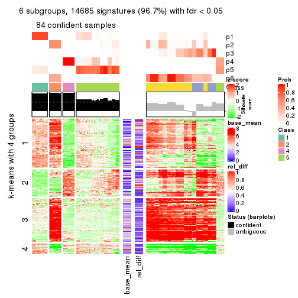</p>

</div>
</div>


Signature heatmaps where rows are not scaled:


<script>
$( function() {
	$( '#tabs-CV-mclust-get-signatures-no-scale' ).tabs();
} );
</script>
<div id='tabs-CV-mclust-get-signatures-no-scale'>
<ul>
<li><a href='#tab-CV-mclust-get-signatures-no-scale-1'>k = 2</a></li>
<li><a href='#tab-CV-mclust-get-signatures-no-scale-2'>k = 3</a></li>
<li><a href='#tab-CV-mclust-get-signatures-no-scale-3'>k = 4</a></li>
<li><a href='#tab-CV-mclust-get-signatures-no-scale-4'>k = 5</a></li>
<li><a href='#tab-CV-mclust-get-signatures-no-scale-5'>k = 6</a></li>
</ul>
<div id='tab-CV-mclust-get-signatures-no-scale-1'>
<pre><code class="r">get_signatures(res, k = 2, scale_rows = FALSE)
</code></pre>

<p></p>

</div>
<div id='tab-CV-mclust-get-signatures-no-scale-2'>
<pre><code class="r">get_signatures(res, k = 3, scale_rows = FALSE)
</code></pre>

<p></p>

</div>
<div id='tab-CV-mclust-get-signatures-no-scale-3'>
<pre><code class="r">get_signatures(res, k = 4, scale_rows = FALSE)
</code></pre>

<p></p>

</div>
<div id='tab-CV-mclust-get-signatures-no-scale-4'>
<pre><code class="r">get_signatures(res, k = 5, scale_rows = FALSE)
</code></pre>

<p></p>

</div>
<div id='tab-CV-mclust-get-signatures-no-scale-5'>
<pre><code class="r">get_signatures(res, k = 6, scale_rows = FALSE)
</code></pre>

<p></p>

</div>
</div>


Compare the overlap of signatures from different k:

```r
compare_signatures(res)
```


`get_signature()` returns a data frame invisibly. TO get the list of signatures, the function
call should be assigned to a variable explicitly. In following code, if `plot` argument is set
to `FALSE`, no heatmap is plotted while only the differential analysis is performed.

```r
# code only for demonstration
tb = get_signature(res, k = ..., plot = FALSE)
```

An example of the output of `tb` is:

```
#>   which_row         fdr    mean_1    mean_2 scaled_mean_1 scaled_mean_2 km
#> 1        38 0.042760348  8.373488  9.131774    -0.5533452     0.5164555  1
#> 2        40 0.018707592  7.106213  8.469186    -0.6173731     0.5762149  1
#> 3        55 0.019134737 10.221463 11.207825    -0.6159697     0.5749050  1
#> 4        59 0.006059896  5.921854  7.869574    -0.6899429     0.6439467  1
#> 5        60 0.018055526  8.928898 10.211722    -0.6204761     0.5791110  1
#> 6        98 0.009384629 15.714769 14.887706     0.6635654    -0.6193277  2
...
```

The columns in `tb` are:

1. `which_row`: row indices corresponding to the input matrix.
2. `fdr`: FDR for the differential test. 
3. `mean_x`: The mean value in group x.
4. `scaled_mean_x`: The mean value in group x after rows are scaled.
5. `km`: Row groups if k-means clustering is applied to rows.


UMAP plot which shows how samples are separated.


<script>
$( function() {
	$( '#tabs-CV-mclust-dimension-reduction' ).tabs();
} );
</script>
<div id='tabs-CV-mclust-dimension-reduction'>
<ul>
<li><a href='#tab-CV-mclust-dimension-reduction-1'>k = 2</a></li>
<li><a href='#tab-CV-mclust-dimension-reduction-2'>k = 3</a></li>
<li><a href='#tab-CV-mclust-dimension-reduction-3'>k = 4</a></li>
<li><a href='#tab-CV-mclust-dimension-reduction-4'>k = 5</a></li>
<li><a href='#tab-CV-mclust-dimension-reduction-5'>k = 6</a></li>
</ul>
<div id='tab-CV-mclust-dimension-reduction-1'>
<pre><code class="r">dimension_reduction(res, k = 2, method = &quot;UMAP&quot;)
</code></pre>

<p></p>

</div>
<div id='tab-CV-mclust-dimension-reduction-2'>
<pre><code class="r">dimension_reduction(res, k = 3, method = &quot;UMAP&quot;)
</code></pre>

<p>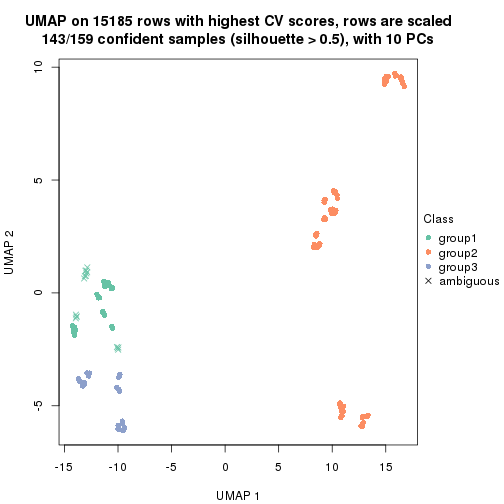</p>

</div>
<div id='tab-CV-mclust-dimension-reduction-3'>
<pre><code class="r">dimension_reduction(res, k = 4, method = &quot;UMAP&quot;)
</code></pre>

<p></p>

</div>
<div id='tab-CV-mclust-dimension-reduction-4'>
<pre><code class="r">dimension_reduction(res, k = 5, method = &quot;UMAP&quot;)
</code></pre>

<p></p>

</div>
<div id='tab-CV-mclust-dimension-reduction-5'>
<pre><code class="r">dimension_reduction(res, k = 6, method = &quot;UMAP&quot;)
</code></pre>

<p></p>

</div>
</div>


Following heatmap shows how subgroups are split when increasing `k`:

```r
collect_classes(res)
```


If matrix rows can be associated to genes, consider to use `GO_Enrichment(res,
...)` to perform function enrichment for the signature genes.


 

---------------------------------------------------


### CV:NMF


The object with results only for a single top-value method and a single partition method 
can be extracted as:

```r
res = res_list["CV", "NMF"]
# you can also extract it by
# res = res_list["CV:NMF"]
```

A summary of `res` and all the functions that can be applied to it:

```r
res
```

```
#> A 'ConsensusPartition' object with k = 2, 3, 4, 5, 6.
#>   On a matrix with 15185 rows and 159 columns.
#>   Top rows (1000, 2000, 3000, 4000, 5000) are extracted by 'CV' method.
#>   Subgroups are detected by 'NMF' method.
#>   Performed in total 1250 partitions by row resampling.
#>   Best k for subgroups seems to be 2.
#> 
#> Following methods can be applied to this 'ConsensusPartition' object:
#>  [1] "cola_report"             "collect_classes"         "collect_plots"          
#>  [4] "collect_stats"           "colnames"                "compare_signatures"     
#>  [7] "consensus_heatmap"       "dimension_reduction"     "functional_enrichment"  
#> [10] "get_anno_col"            "get_anno"                "get_classes"            
#> [13] "get_consensus"           "get_matrix"              "get_membership"         
#> [16] "get_param"               "get_signatures"          "get_stats"              
#> [19] "is_best_k"               "is_stable_k"             "membership_heatmap"     
#> [22] "ncol"                    "nrow"                    "plot_ecdf"              
#> [25] "rownames"                "select_partition_number" "show"                   
#> [28] "suggest_best_k"          "test_to_known_factors"
```

`collect_plots()` function collects all the plots made from `res` for all `k` (number of partitions)
into one single page to provide an easy and fast comparison between different `k`.

```r
collect_plots(res)
```


The plots are:

- The first row: a plot of the ECDF (Empirical cumulative distribution
  function) curves of the consensus matrix for each `k` and the heatmap of
  predicted classes for each `k`.
- The second row: heatmaps of the consensus matrix for each `k`.
- The third row: heatmaps of the membership matrix for each `k`.
- The fouth row: heatmaps of the signatures for each `k`.

All the plots in panels can be made by individual functions and they are
plotted later in this section.

`select_partition_number()` produces several plots showing different
statistics for choosing "optimized" `k`. There are following statistics:

- ECDF curves of the consensus matrix for each `k`;
- 1-PAC. [The PAC
  score](https://en.wikipedia.org/wiki/Consensus_clustering#Over-interpretation_potential_of_consensus_clustering)
  measures the proportion of the ambiguous subgrouping.
- Mean silhouette score.
- Concordance. The mean probability of fiting the consensus class ids in all
  partitions.
- Area increased. Denote $A_k$ as the area under the ECDF curve for current
  `k`, the area increased is defined as $A_k - A_{k-1}$.
- Rand index. The percent of pairs of samples that are both in a same cluster
  or both are not in a same cluster in the partition of k and k-1.
- Jaccard index. The ratio of pairs of samples are both in a same cluster in
  the partition of k and k-1 and the pairs of samples are both in a same
  cluster in the partition k or k-1.

The detailed explanations of these statistics can be found in [the cola
vignette](http://bioconductor.org/packages/devel/bioc/vignettes/cola/inst/doc/cola.html#toc_13).

Generally speaking, lower PAC score, higher mean silhouette score or higher
concordance corresponds to better partition. Rand index and Jaccard index
measure how similar the current partition is compared to partition with `k-1`.
If they are too similar, we won't accept `k` is better than `k-1`.

```r
select_partition_number(res)
```


The numeric values for all these statistics can be obtained by `get_stats()`.

```r
get_stats(res)
```

```
#>   k 1-PAC mean_silhouette concordance area_increased  Rand Jaccard
#> 2 2 0.725           0.893       0.946         0.4936 0.503   0.503
#> 3 3 0.568           0.711       0.808         0.3266 0.671   0.438
#> 4 4 0.690           0.838       0.853         0.1227 0.877   0.657
#> 5 5 0.891           0.905       0.922         0.0230 1.000   1.000
#> 6 6 0.854           0.893       0.914         0.0195 1.000   1.000
```

`suggest_best_k()` suggests the best $k$ based on these statistics. The rules are as follows:

- All $k$ with Jaccard index larger than 0.95 are removed because the increase of
  the partition number does not provides enough extra information. If all $k$ are removed,
  the best $k$ is assigned by `NA`.
- For $k$ with 1-PAC larger than 0.9, the maximal $k$ is taken as the "best k". Other $k$ is called "optional k".
- If it does not fit the second rule. The $k$ with the highest vote of highest
  1-PAC, mean silhouette and concordance is taken as the "best k".

```r
suggest_best_k(res)
```

```
#> [1] 2
```


Following shows the table of the partitions (You need to click the **show/hide
code output** link to see it). The membership matrix (columns with name `p*`)
is inferred by
[`clue::cl_consensus()`](https://www.rdocumentation.org/link/cl_consensus?package=clue)
function with the `SE` method. Basically the value in the membership matrix
represents the probability to belong to a certain group. The finall class
label for an item is determined with the group with highest probability it
belongs to.

In `get_classes()` function, the entropy is calculated from the membership
matrix and the silhouette score is calculated from the consensus matrix.


<script>
$( function() {
	$( '#tabs-CV-NMF-get-classes' ).tabs();
} );
</script>
<div id='tabs-CV-NMF-get-classes'>
<ul>
<li><a href='#tab-CV-NMF-get-classes-1'>k = 2</a></li>
<li><a href='#tab-CV-NMF-get-classes-2'>k = 3</a></li>
<li><a href='#tab-CV-NMF-get-classes-3'>k = 4</a></li>
<li><a href='#tab-CV-NMF-get-classes-4'>k = 5</a></li>
<li><a href='#tab-CV-NMF-get-classes-5'>k = 6</a></li>
</ul>

<div id='tab-CV-NMF-get-classes-1'>
<p><a id='tab-CV-NMF-get-classes-1-a' style='color:#0366d6' href='#'>show/hide code output</a></p>
<pre><code class="r">cbind(get_classes(res, k = 2), get_membership(res, k = 2))
</code></pre>

<pre><code>#&gt;            class entropy silhouette    p1    p2
#&gt; SRR1706767     1   0.000      0.922 1.000 0.000
#&gt; SRR1706768     1   0.000      0.922 1.000 0.000
#&gt; SRR1706769     1   0.000      0.922 1.000 0.000
#&gt; SRR1706770     1   0.000      0.922 1.000 0.000
#&gt; SRR1706771     1   0.000      0.922 1.000 0.000
#&gt; SRR1706772     1   0.000      0.922 1.000 0.000
#&gt; SRR1706773     1   0.000      0.922 1.000 0.000
#&gt; SRR1706774     1   0.000      0.922 1.000 0.000
#&gt; SRR1706775     1   0.855      0.610 0.720 0.280
#&gt; SRR1706776     1   0.844      0.625 0.728 0.272
#&gt; SRR1706777     1   0.563      0.828 0.868 0.132
#&gt; SRR1706778     1   0.932      0.457 0.652 0.348
#&gt; SRR1706779     2   0.141      0.952 0.020 0.980
#&gt; SRR1706780     2   0.141      0.952 0.020 0.980
#&gt; SRR1706781     2   0.141      0.952 0.020 0.980
#&gt; SRR1706782     2   0.141      0.952 0.020 0.980
#&gt; SRR1706783     2   0.141      0.952 0.020 0.980
#&gt; SRR1706784     2   0.141      0.952 0.020 0.980
#&gt; SRR1706785     2   0.141      0.952 0.020 0.980
#&gt; SRR1706786     2   0.141      0.952 0.020 0.980
#&gt; SRR1706787     1   0.000      0.922 1.000 0.000
#&gt; SRR1706788     1   0.000      0.922 1.000 0.000
#&gt; SRR1706789     1   0.000      0.922 1.000 0.000
#&gt; SRR1706790     1   0.000      0.922 1.000 0.000
#&gt; SRR1706791     1   0.000      0.922 1.000 0.000
#&gt; SRR1706792     1   0.000      0.922 1.000 0.000
#&gt; SRR1706793     1   0.000      0.922 1.000 0.000
#&gt; SRR1706794     1   0.000      0.922 1.000 0.000
#&gt; SRR1706795     2   0.939      0.491 0.356 0.644
#&gt; SRR1706796     2   0.925      0.525 0.340 0.660
#&gt; SRR1706797     2   0.961      0.424 0.384 0.616
#&gt; SRR1706798     2   0.936      0.500 0.352 0.648
#&gt; SRR1706799     2   0.141      0.952 0.020 0.980
#&gt; SRR1706800     2   0.141      0.952 0.020 0.980
#&gt; SRR1706801     2   0.141      0.952 0.020 0.980
#&gt; SRR1706802     2   0.141      0.952 0.020 0.980
#&gt; SRR1706803     2   0.141      0.952 0.020 0.980
#&gt; SRR1706804     2   0.141      0.952 0.020 0.980
#&gt; SRR1706805     2   0.141      0.952 0.020 0.980
#&gt; SRR1706806     2   0.141      0.952 0.020 0.980
#&gt; SRR1706811     1   0.000      0.922 1.000 0.000
#&gt; SRR1706812     1   0.000      0.922 1.000 0.000
#&gt; SRR1706813     1   0.000      0.922 1.000 0.000
#&gt; SRR1706814     1   0.000      0.922 1.000 0.000
#&gt; SRR1706807     1   0.000      0.922 1.000 0.000
#&gt; SRR1706808     1   0.000      0.922 1.000 0.000
#&gt; SRR1706809     1   0.000      0.922 1.000 0.000
#&gt; SRR1706810     1   0.000      0.922 1.000 0.000
#&gt; SRR1706815     2   0.936      0.500 0.352 0.648
#&gt; SRR1706816     2   0.973      0.371 0.404 0.596
#&gt; SRR1706817     2   0.925      0.525 0.340 0.660
#&gt; SRR1706818     2   0.917      0.540 0.332 0.668
#&gt; SRR1706819     2   0.141      0.952 0.020 0.980
#&gt; SRR1706820     2   0.141      0.952 0.020 0.980
#&gt; SRR1706821     2   0.141      0.952 0.020 0.980
#&gt; SRR1706822     2   0.141      0.952 0.020 0.980
#&gt; SRR1706823     2   0.141      0.952 0.020 0.980
#&gt; SRR1706824     2   0.141      0.952 0.020 0.980
#&gt; SRR1706825     2   0.141      0.952 0.020 0.980
#&gt; SRR1706826     2   0.141      0.952 0.020 0.980
#&gt; SRR1706827     1   0.000      0.922 1.000 0.000
#&gt; SRR1706828     1   0.000      0.922 1.000 0.000
#&gt; SRR1706829     1   0.000      0.922 1.000 0.000
#&gt; SRR1706830     1   0.000      0.922 1.000 0.000
#&gt; SRR1706835     1   0.563      0.828 0.868 0.132
#&gt; SRR1706836     1   0.781      0.695 0.768 0.232
#&gt; SRR1706837     1   0.482      0.855 0.896 0.104
#&gt; SRR1706838     1   0.430      0.868 0.912 0.088
#&gt; SRR1706831     1   0.000      0.922 1.000 0.000
#&gt; SRR1706832     1   0.000      0.922 1.000 0.000
#&gt; SRR1706833     1   0.000      0.922 1.000 0.000
#&gt; SRR1706834     1   0.000      0.922 1.000 0.000
#&gt; SRR1706839     2   0.224      0.942 0.036 0.964
#&gt; SRR1706840     2   0.184      0.948 0.028 0.972
#&gt; SRR1706841     2   0.163      0.950 0.024 0.976
#&gt; SRR1706842     2   0.204      0.945 0.032 0.968
#&gt; SRR1706847     1   0.141      0.919 0.980 0.020
#&gt; SRR1706848     1   0.141      0.919 0.980 0.020
#&gt; SRR1706849     1   0.141      0.919 0.980 0.020
#&gt; SRR1706850     1   0.141      0.919 0.980 0.020
#&gt; SRR1706843     2   0.141      0.952 0.020 0.980
#&gt; SRR1706844     2   0.141      0.952 0.020 0.980
#&gt; SRR1706845     2   0.141      0.952 0.020 0.980
#&gt; SRR1706846     2   0.141      0.952 0.020 0.980
#&gt; SRR1706851     1   0.671      0.824 0.824 0.176
#&gt; SRR1706852     1   0.680      0.820 0.820 0.180
#&gt; SRR1706853     1   0.680      0.820 0.820 0.180
#&gt; SRR1706854     1   0.680      0.820 0.820 0.180
#&gt; SRR1706855     2   0.000      0.956 0.000 1.000
#&gt; SRR1706856     2   0.000      0.956 0.000 1.000
#&gt; SRR1706857     2   0.000      0.956 0.000 1.000
#&gt; SRR1706858     2   0.000      0.956 0.000 1.000
#&gt; SRR1706859     2   0.000      0.956 0.000 1.000
#&gt; SRR1706860     2   0.000      0.956 0.000 1.000
#&gt; SRR1706861     2   0.000      0.956 0.000 1.000
#&gt; SRR1706862     2   0.000      0.956 0.000 1.000
#&gt; SRR1706867     1   0.141      0.919 0.980 0.020
#&gt; SRR1706869     1   0.141      0.919 0.980 0.020
#&gt; SRR1706870     1   0.141      0.919 0.980 0.020
#&gt; SRR1706863     2   0.000      0.956 0.000 1.000
#&gt; SRR1706864     2   0.000      0.956 0.000 1.000
#&gt; SRR1706865     2   0.000      0.956 0.000 1.000
#&gt; SRR1706866     2   0.000      0.956 0.000 1.000
#&gt; SRR1706871     1   0.689      0.816 0.816 0.184
#&gt; SRR1706872     1   0.697      0.812 0.812 0.188
#&gt; SRR1706873     1   0.722      0.799 0.800 0.200
#&gt; SRR1706874     1   0.697      0.812 0.812 0.188
#&gt; SRR1706879     2   0.000      0.956 0.000 1.000
#&gt; SRR1706880     2   0.000      0.956 0.000 1.000
#&gt; SRR1706881     2   0.000      0.956 0.000 1.000
#&gt; SRR1706882     2   0.000      0.956 0.000 1.000
#&gt; SRR1706883     2   0.000      0.956 0.000 1.000
#&gt; SRR1706884     2   0.000      0.956 0.000 1.000
#&gt; SRR1706885     2   0.000      0.956 0.000 1.000
#&gt; SRR1706886     2   0.000      0.956 0.000 1.000
#&gt; SRR1706875     2   0.000      0.956 0.000 1.000
#&gt; SRR1706876     2   0.000      0.956 0.000 1.000
#&gt; SRR1706877     2   0.000      0.956 0.000 1.000
#&gt; SRR1706878     2   0.000      0.956 0.000 1.000
#&gt; SRR1706887     1   0.141      0.919 0.980 0.020
#&gt; SRR1706888     1   0.141      0.919 0.980 0.020
#&gt; SRR1706889     1   0.141      0.919 0.980 0.020
#&gt; SRR1706890     1   0.141      0.919 0.980 0.020
#&gt; SRR1706891     1   0.855      0.686 0.720 0.280
#&gt; SRR1706892     1   0.821      0.724 0.744 0.256
#&gt; SRR1706893     1   0.788      0.753 0.764 0.236
#&gt; SRR1706894     1   0.781      0.759 0.768 0.232
#&gt; SRR1706895     2   0.000      0.956 0.000 1.000
#&gt; SRR1706896     2   0.000      0.956 0.000 1.000
#&gt; SRR1706897     2   0.000      0.956 0.000 1.000
#&gt; SRR1706898     2   0.000      0.956 0.000 1.000
#&gt; SRR1706899     2   0.000      0.956 0.000 1.000
#&gt; SRR1706900     2   0.000      0.956 0.000 1.000
#&gt; SRR1706901     2   0.000      0.956 0.000 1.000
#&gt; SRR1706902     2   0.000      0.956 0.000 1.000
#&gt; SRR1706907     1   0.141      0.919 0.980 0.020
#&gt; SRR1706908     1   0.141      0.919 0.980 0.020
#&gt; SRR1706909     1   0.141      0.919 0.980 0.020
#&gt; SRR1706910     1   0.141      0.919 0.980 0.020
#&gt; SRR1706903     2   0.000      0.956 0.000 1.000
#&gt; SRR1706904     2   0.000      0.956 0.000 1.000
#&gt; SRR1706905     2   0.000      0.956 0.000 1.000
#&gt; SRR1706906     2   0.000      0.956 0.000 1.000
#&gt; SRR1706911     1   0.662      0.828 0.828 0.172
#&gt; SRR1706912     1   0.671      0.824 0.824 0.176
#&gt; SRR1706913     1   0.653      0.831 0.832 0.168
#&gt; SRR1706914     1   0.653      0.831 0.832 0.168
#&gt; SRR1706919     2   0.000      0.956 0.000 1.000
#&gt; SRR1706920     2   0.000      0.956 0.000 1.000
#&gt; SRR1706921     2   0.000      0.956 0.000 1.000
#&gt; SRR1706922     2   0.000      0.956 0.000 1.000
#&gt; SRR1706915     2   0.000      0.956 0.000 1.000
#&gt; SRR1706916     2   0.000      0.956 0.000 1.000
#&gt; SRR1706917     2   0.000      0.956 0.000 1.000
#&gt; SRR1706918     2   0.000      0.956 0.000 1.000
#&gt; SRR1706923     2   0.000      0.956 0.000 1.000
#&gt; SRR1706924     2   0.000      0.956 0.000 1.000
#&gt; SRR1706925     2   0.000      0.956 0.000 1.000
#&gt; SRR1706926     2   0.000      0.956 0.000 1.000
</code></pre>

<script>
$('#tab-CV-NMF-get-classes-1-a').parent().next().next().hide();
$('#tab-CV-NMF-get-classes-1-a').click(function(){
  $('#tab-CV-NMF-get-classes-1-a').parent().next().next().toggle();
  return(false);
});
</script>
</div>

<div id='tab-CV-NMF-get-classes-2'>
<p><a id='tab-CV-NMF-get-classes-2-a' style='color:#0366d6' href='#'>show/hide code output</a></p>
<pre><code class="r">cbind(get_classes(res, k = 3), get_membership(res, k = 3))
</code></pre>

<pre><code>#&gt;            class entropy silhouette    p1    p2    p3
#&gt; SRR1706767     3   0.597      0.500 0.364 0.000 0.636
#&gt; SRR1706768     3   0.601      0.491 0.372 0.000 0.628
#&gt; SRR1706769     3   0.595      0.505 0.360 0.000 0.640
#&gt; SRR1706770     3   0.601      0.491 0.372 0.000 0.628
#&gt; SRR1706771     1   0.000      0.820 1.000 0.000 0.000
#&gt; SRR1706772     1   0.000      0.820 1.000 0.000 0.000
#&gt; SRR1706773     1   0.000      0.820 1.000 0.000 0.000
#&gt; SRR1706774     1   0.000      0.820 1.000 0.000 0.000
#&gt; SRR1706775     1   0.000      0.820 1.000 0.000 0.000
#&gt; SRR1706776     1   0.000      0.820 1.000 0.000 0.000
#&gt; SRR1706777     1   0.000      0.820 1.000 0.000 0.000
#&gt; SRR1706778     1   0.000      0.820 1.000 0.000 0.000
#&gt; SRR1706779     1   0.348      0.808 0.872 0.128 0.000
#&gt; SRR1706780     1   0.341      0.809 0.876 0.124 0.000
#&gt; SRR1706781     1   0.341      0.809 0.876 0.124 0.000
#&gt; SRR1706782     1   0.327      0.811 0.884 0.116 0.000
#&gt; SRR1706783     1   0.601      0.627 0.628 0.372 0.000
#&gt; SRR1706784     1   0.610      0.595 0.608 0.392 0.000
#&gt; SRR1706785     1   0.599      0.633 0.632 0.368 0.000
#&gt; SRR1706786     1   0.606      0.609 0.616 0.384 0.000
#&gt; SRR1706787     3   0.627      0.374 0.452 0.000 0.548
#&gt; SRR1706788     3   0.631      0.285 0.492 0.000 0.508
#&gt; SRR1706789     3   0.630      0.324 0.476 0.000 0.524
#&gt; SRR1706790     3   0.627      0.374 0.452 0.000 0.548
#&gt; SRR1706791     1   0.000      0.820 1.000 0.000 0.000
#&gt; SRR1706792     1   0.000      0.820 1.000 0.000 0.000
#&gt; SRR1706793     1   0.000      0.820 1.000 0.000 0.000
#&gt; SRR1706794     1   0.000      0.820 1.000 0.000 0.000
#&gt; SRR1706795     1   0.000      0.820 1.000 0.000 0.000
#&gt; SRR1706796     1   0.000      0.820 1.000 0.000 0.000
#&gt; SRR1706797     1   0.000      0.820 1.000 0.000 0.000
#&gt; SRR1706798     1   0.000      0.820 1.000 0.000 0.000
#&gt; SRR1706799     1   0.334      0.810 0.880 0.120 0.000
#&gt; SRR1706800     1   0.424      0.788 0.824 0.176 0.000
#&gt; SRR1706801     1   0.355      0.806 0.868 0.132 0.000
#&gt; SRR1706802     1   0.382      0.800 0.852 0.148 0.000
#&gt; SRR1706803     1   0.593      0.649 0.644 0.356 0.000
#&gt; SRR1706804     1   0.597      0.639 0.636 0.364 0.000
#&gt; SRR1706805     1   0.606      0.608 0.616 0.384 0.000
#&gt; SRR1706806     1   0.595      0.644 0.640 0.360 0.000
#&gt; SRR1706811     1   0.000      0.820 1.000 0.000 0.000
#&gt; SRR1706812     1   0.000      0.820 1.000 0.000 0.000
#&gt; SRR1706813     1   0.000      0.820 1.000 0.000 0.000
#&gt; SRR1706814     1   0.000      0.820 1.000 0.000 0.000
#&gt; SRR1706807     3   0.631      0.296 0.488 0.000 0.512
#&gt; SRR1706808     3   0.631      0.275 0.496 0.000 0.504
#&gt; SRR1706809     1   0.631     -0.280 0.504 0.000 0.496
#&gt; SRR1706810     1   0.631     -0.291 0.500 0.000 0.500
#&gt; SRR1706815     1   0.000      0.820 1.000 0.000 0.000
#&gt; SRR1706816     1   0.000      0.820 1.000 0.000 0.000
#&gt; SRR1706817     1   0.000      0.820 1.000 0.000 0.000
#&gt; SRR1706818     1   0.000      0.820 1.000 0.000 0.000
#&gt; SRR1706819     1   0.470      0.769 0.788 0.212 0.000
#&gt; SRR1706820     1   0.455      0.776 0.800 0.200 0.000
#&gt; SRR1706821     1   0.450      0.778 0.804 0.196 0.000
#&gt; SRR1706822     1   0.455      0.776 0.800 0.200 0.000
#&gt; SRR1706823     1   0.595      0.644 0.640 0.360 0.000
#&gt; SRR1706824     1   0.595      0.644 0.640 0.360 0.000
#&gt; SRR1706825     1   0.593      0.649 0.644 0.356 0.000
#&gt; SRR1706826     1   0.597      0.639 0.636 0.364 0.000
#&gt; SRR1706827     3   0.629      0.342 0.468 0.000 0.532
#&gt; SRR1706828     3   0.628      0.359 0.460 0.000 0.540
#&gt; SRR1706829     3   0.624      0.395 0.440 0.000 0.560
#&gt; SRR1706830     3   0.625      0.387 0.444 0.000 0.556
#&gt; SRR1706835     1   0.000      0.820 1.000 0.000 0.000
#&gt; SRR1706836     1   0.000      0.820 1.000 0.000 0.000
#&gt; SRR1706837     1   0.000      0.820 1.000 0.000 0.000
#&gt; SRR1706838     1   0.000      0.820 1.000 0.000 0.000
#&gt; SRR1706831     1   0.000      0.820 1.000 0.000 0.000
#&gt; SRR1706832     1   0.000      0.820 1.000 0.000 0.000
#&gt; SRR1706833     1   0.000      0.820 1.000 0.000 0.000
#&gt; SRR1706834     1   0.000      0.820 1.000 0.000 0.000
#&gt; SRR1706839     1   0.327      0.811 0.884 0.116 0.000
#&gt; SRR1706840     1   0.312      0.812 0.892 0.108 0.000
#&gt; SRR1706841     1   0.296      0.813 0.900 0.100 0.000
#&gt; SRR1706842     1   0.304      0.813 0.896 0.104 0.000
#&gt; SRR1706847     3   0.000      0.713 0.000 0.000 1.000
#&gt; SRR1706848     3   0.000      0.713 0.000 0.000 1.000
#&gt; SRR1706849     3   0.000      0.713 0.000 0.000 1.000
#&gt; SRR1706850     3   0.000      0.713 0.000 0.000 1.000
#&gt; SRR1706843     1   0.593      0.649 0.644 0.356 0.000
#&gt; SRR1706844     1   0.593      0.649 0.644 0.356 0.000
#&gt; SRR1706845     1   0.593      0.649 0.644 0.356 0.000
#&gt; SRR1706846     1   0.593      0.649 0.644 0.356 0.000
#&gt; SRR1706851     3   0.460      0.600 0.000 0.204 0.796
#&gt; SRR1706852     3   0.475      0.586 0.000 0.216 0.784
#&gt; SRR1706853     3   0.465      0.596 0.000 0.208 0.792
#&gt; SRR1706854     3   0.470      0.591 0.000 0.212 0.788
#&gt; SRR1706855     2   0.533      0.692 0.000 0.728 0.272
#&gt; SRR1706856     2   0.529      0.697 0.000 0.732 0.268
#&gt; SRR1706857     2   0.529      0.697 0.000 0.732 0.268
#&gt; SRR1706858     2   0.529      0.697 0.000 0.732 0.268
#&gt; SRR1706859     2   0.000      0.883 0.000 1.000 0.000
#&gt; SRR1706860     2   0.000      0.883 0.000 1.000 0.000
#&gt; SRR1706861     2   0.000      0.883 0.000 1.000 0.000
#&gt; SRR1706862     2   0.000      0.883 0.000 1.000 0.000
#&gt; SRR1706867     3   0.000      0.713 0.000 0.000 1.000
#&gt; SRR1706869     3   0.000      0.713 0.000 0.000 1.000
#&gt; SRR1706870     3   0.000      0.713 0.000 0.000 1.000
#&gt; SRR1706863     2   0.000      0.883 0.000 1.000 0.000
#&gt; SRR1706864     2   0.000      0.883 0.000 1.000 0.000
#&gt; SRR1706865     2   0.000      0.883 0.000 1.000 0.000
#&gt; SRR1706866     2   0.000      0.883 0.000 1.000 0.000
#&gt; SRR1706871     3   0.475      0.587 0.000 0.216 0.784
#&gt; SRR1706872     3   0.493      0.564 0.000 0.232 0.768
#&gt; SRR1706873     3   0.489      0.570 0.000 0.228 0.772
#&gt; SRR1706874     3   0.475      0.587 0.000 0.216 0.784
#&gt; SRR1706879     2   0.000      0.883 0.000 1.000 0.000
#&gt; SRR1706880     2   0.000      0.883 0.000 1.000 0.000
#&gt; SRR1706881     2   0.000      0.883 0.000 1.000 0.000
#&gt; SRR1706882     2   0.000      0.883 0.000 1.000 0.000
#&gt; SRR1706883     2   0.000      0.883 0.000 1.000 0.000
#&gt; SRR1706884     2   0.000      0.883 0.000 1.000 0.000
#&gt; SRR1706885     2   0.000      0.883 0.000 1.000 0.000
#&gt; SRR1706886     2   0.000      0.883 0.000 1.000 0.000
#&gt; SRR1706875     2   0.510      0.719 0.000 0.752 0.248
#&gt; SRR1706876     2   0.493      0.732 0.000 0.768 0.232
#&gt; SRR1706877     2   0.510      0.719 0.000 0.752 0.248
#&gt; SRR1706878     2   0.497      0.729 0.000 0.764 0.236
#&gt; SRR1706887     3   0.000      0.713 0.000 0.000 1.000
#&gt; SRR1706888     3   0.000      0.713 0.000 0.000 1.000
#&gt; SRR1706889     3   0.000      0.713 0.000 0.000 1.000
#&gt; SRR1706890     3   0.000      0.713 0.000 0.000 1.000
#&gt; SRR1706891     3   0.573      0.392 0.000 0.324 0.676
#&gt; SRR1706892     3   0.573      0.392 0.000 0.324 0.676
#&gt; SRR1706893     3   0.565      0.419 0.000 0.312 0.688
#&gt; SRR1706894     3   0.573      0.392 0.000 0.324 0.676
#&gt; SRR1706895     2   0.506      0.722 0.000 0.756 0.244
#&gt; SRR1706896     2   0.522      0.707 0.000 0.740 0.260
#&gt; SRR1706897     2   0.522      0.707 0.000 0.740 0.260
#&gt; SRR1706898     2   0.518      0.711 0.000 0.744 0.256
#&gt; SRR1706899     2   0.000      0.883 0.000 1.000 0.000
#&gt; SRR1706900     2   0.000      0.883 0.000 1.000 0.000
#&gt; SRR1706901     2   0.000      0.883 0.000 1.000 0.000
#&gt; SRR1706902     2   0.000      0.883 0.000 1.000 0.000
#&gt; SRR1706907     3   0.000      0.713 0.000 0.000 1.000
#&gt; SRR1706908     3   0.000      0.713 0.000 0.000 1.000
#&gt; SRR1706909     3   0.000      0.713 0.000 0.000 1.000
#&gt; SRR1706910     3   0.000      0.713 0.000 0.000 1.000
#&gt; SRR1706903     2   0.000      0.883 0.000 1.000 0.000
#&gt; SRR1706904     2   0.000      0.883 0.000 1.000 0.000
#&gt; SRR1706905     2   0.000      0.883 0.000 1.000 0.000
#&gt; SRR1706906     2   0.000      0.883 0.000 1.000 0.000
#&gt; SRR1706911     3   0.435      0.618 0.000 0.184 0.816
#&gt; SRR1706912     3   0.440      0.615 0.000 0.188 0.812
#&gt; SRR1706913     3   0.424      0.624 0.000 0.176 0.824
#&gt; SRR1706914     3   0.424      0.624 0.000 0.176 0.824
#&gt; SRR1706919     2   0.000      0.883 0.000 1.000 0.000
#&gt; SRR1706920     2   0.000      0.883 0.000 1.000 0.000
#&gt; SRR1706921     2   0.000      0.883 0.000 1.000 0.000
#&gt; SRR1706922     2   0.000      0.883 0.000 1.000 0.000
#&gt; SRR1706915     2   0.533      0.692 0.000 0.728 0.272
#&gt; SRR1706916     2   0.533      0.692 0.000 0.728 0.272
#&gt; SRR1706917     2   0.533      0.692 0.000 0.728 0.272
#&gt; SRR1706918     2   0.533      0.692 0.000 0.728 0.272
#&gt; SRR1706923     2   0.000      0.883 0.000 1.000 0.000
#&gt; SRR1706924     2   0.000      0.883 0.000 1.000 0.000
#&gt; SRR1706925     2   0.000      0.883 0.000 1.000 0.000
#&gt; SRR1706926     2   0.000      0.883 0.000 1.000 0.000
</code></pre>

<script>
$('#tab-CV-NMF-get-classes-2-a').parent().next().next().hide();
$('#tab-CV-NMF-get-classes-2-a').click(function(){
  $('#tab-CV-NMF-get-classes-2-a').parent().next().next().toggle();
  return(false);
});
</script>
</div>

<div id='tab-CV-NMF-get-classes-3'>
<p><a id='tab-CV-NMF-get-classes-3-a' style='color:#0366d6' href='#'>show/hide code output</a></p>
<pre><code class="r">cbind(get_classes(res, k = 4), get_membership(res, k = 4))
</code></pre>

<pre><code>#&gt;            class entropy silhouette    p1    p2    p3    p4
#&gt; SRR1706767     4  0.0921      0.855 0.000 0.000 0.028 0.972
#&gt; SRR1706768     4  0.0921      0.855 0.000 0.000 0.028 0.972
#&gt; SRR1706769     4  0.0921      0.855 0.000 0.000 0.028 0.972
#&gt; SRR1706770     4  0.0921      0.855 0.000 0.000 0.028 0.972
#&gt; SRR1706771     4  0.1042      0.859 0.008 0.000 0.020 0.972
#&gt; SRR1706772     4  0.1042      0.859 0.008 0.000 0.020 0.972
#&gt; SRR1706773     4  0.1004      0.862 0.024 0.000 0.004 0.972
#&gt; SRR1706774     4  0.0921      0.863 0.028 0.000 0.000 0.972
#&gt; SRR1706775     1  0.0779      0.760 0.980 0.016 0.000 0.004
#&gt; SRR1706776     1  0.0817      0.767 0.976 0.024 0.000 0.000
#&gt; SRR1706777     1  0.0336      0.756 0.992 0.008 0.000 0.000
#&gt; SRR1706778     1  0.0469      0.760 0.988 0.012 0.000 0.000
#&gt; SRR1706779     1  0.4331      0.849 0.712 0.288 0.000 0.000
#&gt; SRR1706780     1  0.4331      0.849 0.712 0.288 0.000 0.000
#&gt; SRR1706781     1  0.4331      0.849 0.712 0.288 0.000 0.000
#&gt; SRR1706782     1  0.4331      0.849 0.712 0.288 0.000 0.000
#&gt; SRR1706783     1  0.4406      0.843 0.700 0.300 0.000 0.000
#&gt; SRR1706784     1  0.4406      0.843 0.700 0.300 0.000 0.000
#&gt; SRR1706785     1  0.4406      0.843 0.700 0.300 0.000 0.000
#&gt; SRR1706786     1  0.4406      0.843 0.700 0.300 0.000 0.000
#&gt; SRR1706787     4  0.0921      0.855 0.000 0.000 0.028 0.972
#&gt; SRR1706788     4  0.1059      0.861 0.016 0.000 0.012 0.972
#&gt; SRR1706789     4  0.0921      0.855 0.000 0.000 0.028 0.972
#&gt; SRR1706790     4  0.0921      0.855 0.000 0.000 0.028 0.972
#&gt; SRR1706791     4  0.4304      0.802 0.284 0.000 0.000 0.716
#&gt; SRR1706792     4  0.4356      0.798 0.292 0.000 0.000 0.708
#&gt; SRR1706793     4  0.4277      0.805 0.280 0.000 0.000 0.720
#&gt; SRR1706794     4  0.4406      0.793 0.300 0.000 0.000 0.700
#&gt; SRR1706795     1  0.0336      0.756 0.992 0.008 0.000 0.000
#&gt; SRR1706796     1  0.0336      0.756 0.992 0.008 0.000 0.000
#&gt; SRR1706797     1  0.0469      0.760 0.988 0.012 0.000 0.000
#&gt; SRR1706798     1  0.0336      0.756 0.992 0.008 0.000 0.000
#&gt; SRR1706799     1  0.4222      0.851 0.728 0.272 0.000 0.000
#&gt; SRR1706800     1  0.4304      0.850 0.716 0.284 0.000 0.000
#&gt; SRR1706801     1  0.4250      0.851 0.724 0.276 0.000 0.000
#&gt; SRR1706802     1  0.4277      0.850 0.720 0.280 0.000 0.000
#&gt; SRR1706803     1  0.4406      0.843 0.700 0.300 0.000 0.000
#&gt; SRR1706804     1  0.4406      0.843 0.700 0.300 0.000 0.000
#&gt; SRR1706805     1  0.4406      0.843 0.700 0.300 0.000 0.000
#&gt; SRR1706806     1  0.4406      0.843 0.700 0.300 0.000 0.000
#&gt; SRR1706811     4  0.4406      0.793 0.300 0.000 0.000 0.700
#&gt; SRR1706812     4  0.4406      0.793 0.300 0.000 0.000 0.700
#&gt; SRR1706813     4  0.4406      0.793 0.300 0.000 0.000 0.700
#&gt; SRR1706814     4  0.4406      0.793 0.300 0.000 0.000 0.700
#&gt; SRR1706807     4  0.1854      0.863 0.048 0.000 0.012 0.940
#&gt; SRR1706808     4  0.2546      0.861 0.092 0.000 0.008 0.900
#&gt; SRR1706809     4  0.2675      0.860 0.100 0.000 0.008 0.892
#&gt; SRR1706810     4  0.3249      0.852 0.140 0.000 0.008 0.852
#&gt; SRR1706815     1  0.0336      0.744 0.992 0.000 0.000 0.008
#&gt; SRR1706816     1  0.0336      0.744 0.992 0.000 0.000 0.008
#&gt; SRR1706817     1  0.1302      0.710 0.956 0.000 0.000 0.044
#&gt; SRR1706818     1  0.0336      0.744 0.992 0.000 0.000 0.008
#&gt; SRR1706819     1  0.2973      0.825 0.856 0.144 0.000 0.000
#&gt; SRR1706820     1  0.3024      0.827 0.852 0.148 0.000 0.000
#&gt; SRR1706821     1  0.1637      0.787 0.940 0.060 0.000 0.000
#&gt; SRR1706822     1  0.3024      0.827 0.852 0.148 0.000 0.000
#&gt; SRR1706823     1  0.4382      0.845 0.704 0.296 0.000 0.000
#&gt; SRR1706824     1  0.4382      0.845 0.704 0.296 0.000 0.000
#&gt; SRR1706825     1  0.4356      0.847 0.708 0.292 0.000 0.000
#&gt; SRR1706826     1  0.4382      0.845 0.704 0.296 0.000 0.000
#&gt; SRR1706827     4  0.0921      0.855 0.000 0.000 0.028 0.972
#&gt; SRR1706828     4  0.0921      0.855 0.000 0.000 0.028 0.972
#&gt; SRR1706829     4  0.0921      0.855 0.000 0.000 0.028 0.972
#&gt; SRR1706830     4  0.1004      0.857 0.004 0.000 0.024 0.972
#&gt; SRR1706835     1  0.0336      0.744 0.992 0.000 0.000 0.008
#&gt; SRR1706836     1  0.1211      0.714 0.960 0.000 0.000 0.040
#&gt; SRR1706837     1  0.1389      0.705 0.952 0.000 0.000 0.048
#&gt; SRR1706838     1  0.2081      0.658 0.916 0.000 0.000 0.084
#&gt; SRR1706831     4  0.3764      0.833 0.216 0.000 0.000 0.784
#&gt; SRR1706832     4  0.4040      0.820 0.248 0.000 0.000 0.752
#&gt; SRR1706833     4  0.3569      0.839 0.196 0.000 0.000 0.804
#&gt; SRR1706834     4  0.3907      0.827 0.232 0.000 0.000 0.768
#&gt; SRR1706839     1  0.4250      0.851 0.724 0.276 0.000 0.000
#&gt; SRR1706840     1  0.4222      0.851 0.728 0.272 0.000 0.000
#&gt; SRR1706841     1  0.4277      0.850 0.720 0.280 0.000 0.000
#&gt; SRR1706842     1  0.4250      0.851 0.724 0.276 0.000 0.000
#&gt; SRR1706847     3  0.4193      0.817 0.000 0.000 0.732 0.268
#&gt; SRR1706848     3  0.4164      0.821 0.000 0.000 0.736 0.264
#&gt; SRR1706849     3  0.4193      0.817 0.000 0.000 0.732 0.268
#&gt; SRR1706850     3  0.4193      0.817 0.000 0.000 0.732 0.268
#&gt; SRR1706843     1  0.4406      0.843 0.700 0.300 0.000 0.000
#&gt; SRR1706844     1  0.4406      0.843 0.700 0.300 0.000 0.000
#&gt; SRR1706845     1  0.4406      0.843 0.700 0.300 0.000 0.000
#&gt; SRR1706846     1  0.4406      0.843 0.700 0.300 0.000 0.000
#&gt; SRR1706851     3  0.2216      0.892 0.000 0.000 0.908 0.092
#&gt; SRR1706852     3  0.2011      0.891 0.000 0.000 0.920 0.080
#&gt; SRR1706853     3  0.2216      0.892 0.000 0.000 0.908 0.092
#&gt; SRR1706854     3  0.2281      0.892 0.000 0.000 0.904 0.096
#&gt; SRR1706855     2  0.3486      0.825 0.000 0.812 0.188 0.000
#&gt; SRR1706856     2  0.3982      0.797 0.000 0.776 0.220 0.004
#&gt; SRR1706857     2  0.3668      0.823 0.000 0.808 0.188 0.004
#&gt; SRR1706858     2  0.3528      0.822 0.000 0.808 0.192 0.000
#&gt; SRR1706859     2  0.0000      0.888 0.000 1.000 0.000 0.000
#&gt; SRR1706860     2  0.0000      0.888 0.000 1.000 0.000 0.000
#&gt; SRR1706861     2  0.0000      0.888 0.000 1.000 0.000 0.000
#&gt; SRR1706862     2  0.0000      0.888 0.000 1.000 0.000 0.000
#&gt; SRR1706867     3  0.4072      0.832 0.000 0.000 0.748 0.252
#&gt; SRR1706869     3  0.4164      0.821 0.000 0.000 0.736 0.264
#&gt; SRR1706870     3  0.4134      0.825 0.000 0.000 0.740 0.260
#&gt; SRR1706863     2  0.0000      0.888 0.000 1.000 0.000 0.000
#&gt; SRR1706864     2  0.0000      0.888 0.000 1.000 0.000 0.000
#&gt; SRR1706865     2  0.0000      0.888 0.000 1.000 0.000 0.000
#&gt; SRR1706866     2  0.0000      0.888 0.000 1.000 0.000 0.000
#&gt; SRR1706871     3  0.0921      0.879 0.000 0.000 0.972 0.028
#&gt; SRR1706872     3  0.1022      0.881 0.000 0.000 0.968 0.032
#&gt; SRR1706873     3  0.1022      0.881 0.000 0.000 0.968 0.032
#&gt; SRR1706874     3  0.1118      0.883 0.000 0.000 0.964 0.036
#&gt; SRR1706879     2  0.0000      0.888 0.000 1.000 0.000 0.000
#&gt; SRR1706880     2  0.0000      0.888 0.000 1.000 0.000 0.000
#&gt; SRR1706881     2  0.0000      0.888 0.000 1.000 0.000 0.000
#&gt; SRR1706882     2  0.0000      0.888 0.000 1.000 0.000 0.000
#&gt; SRR1706883     2  0.0000      0.888 0.000 1.000 0.000 0.000
#&gt; SRR1706884     2  0.0000      0.888 0.000 1.000 0.000 0.000
#&gt; SRR1706885     2  0.0000      0.888 0.000 1.000 0.000 0.000
#&gt; SRR1706886     2  0.0000      0.888 0.000 1.000 0.000 0.000
#&gt; SRR1706875     2  0.3444      0.827 0.000 0.816 0.184 0.000
#&gt; SRR1706876     2  0.3444      0.827 0.000 0.816 0.184 0.000
#&gt; SRR1706877     2  0.3710      0.820 0.000 0.804 0.192 0.004
#&gt; SRR1706878     2  0.3528      0.822 0.000 0.808 0.192 0.000
#&gt; SRR1706887     3  0.2530      0.890 0.000 0.000 0.888 0.112
#&gt; SRR1706888     3  0.2921      0.884 0.000 0.000 0.860 0.140
#&gt; SRR1706889     3  0.2704      0.888 0.000 0.000 0.876 0.124
#&gt; SRR1706890     3  0.2973      0.883 0.000 0.000 0.856 0.144
#&gt; SRR1706891     3  0.0000      0.862 0.000 0.000 1.000 0.000
#&gt; SRR1706892     3  0.0000      0.862 0.000 0.000 1.000 0.000
#&gt; SRR1706893     3  0.0000      0.862 0.000 0.000 1.000 0.000
#&gt; SRR1706894     3  0.0000      0.862 0.000 0.000 1.000 0.000
#&gt; SRR1706895     2  0.4882      0.732 0.000 0.708 0.272 0.020
#&gt; SRR1706896     2  0.4776      0.737 0.000 0.712 0.272 0.016
#&gt; SRR1706897     2  0.4882      0.732 0.000 0.708 0.272 0.020
#&gt; SRR1706898     2  0.4882      0.732 0.000 0.708 0.272 0.020
#&gt; SRR1706899     2  0.3142      0.852 0.000 0.860 0.132 0.008
#&gt; SRR1706900     2  0.2593      0.864 0.000 0.892 0.104 0.004
#&gt; SRR1706901     2  0.2654      0.863 0.000 0.888 0.108 0.004
#&gt; SRR1706902     2  0.2530      0.865 0.000 0.896 0.100 0.004
#&gt; SRR1706907     3  0.4040      0.835 0.000 0.000 0.752 0.248
#&gt; SRR1706908     3  0.3942      0.843 0.000 0.000 0.764 0.236
#&gt; SRR1706909     3  0.3975      0.841 0.000 0.000 0.760 0.240
#&gt; SRR1706910     3  0.3907      0.845 0.000 0.000 0.768 0.232
#&gt; SRR1706903     2  0.0000      0.888 0.000 1.000 0.000 0.000
#&gt; SRR1706904     2  0.0000      0.888 0.000 1.000 0.000 0.000
#&gt; SRR1706905     2  0.0188      0.886 0.000 0.996 0.000 0.004
#&gt; SRR1706906     2  0.0000      0.888 0.000 1.000 0.000 0.000
#&gt; SRR1706911     3  0.1211      0.884 0.000 0.000 0.960 0.040
#&gt; SRR1706912     3  0.1022      0.881 0.000 0.000 0.968 0.032
#&gt; SRR1706913     3  0.1118      0.883 0.000 0.000 0.964 0.036
#&gt; SRR1706914     3  0.1118      0.883 0.000 0.000 0.964 0.036
#&gt; SRR1706919     2  0.0000      0.888 0.000 1.000 0.000 0.000
#&gt; SRR1706920     2  0.0000      0.888 0.000 1.000 0.000 0.000
#&gt; SRR1706921     2  0.0000      0.888 0.000 1.000 0.000 0.000
#&gt; SRR1706922     2  0.0000      0.888 0.000 1.000 0.000 0.000
#&gt; SRR1706915     2  0.4452      0.757 0.000 0.732 0.260 0.008
#&gt; SRR1706916     2  0.4283      0.764 0.000 0.740 0.256 0.004
#&gt; SRR1706917     2  0.4372      0.752 0.000 0.728 0.268 0.004
#&gt; SRR1706918     2  0.4343      0.756 0.000 0.732 0.264 0.004
#&gt; SRR1706923     2  0.0000      0.888 0.000 1.000 0.000 0.000
#&gt; SRR1706924     2  0.0000      0.888 0.000 1.000 0.000 0.000
#&gt; SRR1706925     2  0.0000      0.888 0.000 1.000 0.000 0.000
#&gt; SRR1706926     2  0.0000      0.888 0.000 1.000 0.000 0.000
</code></pre>

<script>
$('#tab-CV-NMF-get-classes-3-a').parent().next().next().hide();
$('#tab-CV-NMF-get-classes-3-a').click(function(){
  $('#tab-CV-NMF-get-classes-3-a').parent().next().next().toggle();
  return(false);
});
</script>
</div>

<div id='tab-CV-NMF-get-classes-4'>
<p><a id='tab-CV-NMF-get-classes-4-a' style='color:#0366d6' href='#'>show/hide code output</a></p>
<pre><code class="r">cbind(get_classes(res, k = 5), get_membership(res, k = 5))
</code></pre>

<pre><code>#&gt;            class entropy silhouette    p1    p2    p3    p4 p5
#&gt; SRR1706767     4  0.1484      0.947 0.000 0.000 0.008 0.944 NA
#&gt; SRR1706768     4  0.1557      0.946 0.000 0.000 0.008 0.940 NA
#&gt; SRR1706769     4  0.1697      0.944 0.000 0.000 0.008 0.932 NA
#&gt; SRR1706770     4  0.1408      0.949 0.000 0.000 0.008 0.948 NA
#&gt; SRR1706771     4  0.3038      0.916 0.040 0.000 0.008 0.872 NA
#&gt; SRR1706772     4  0.2992      0.917 0.044 0.000 0.008 0.876 NA
#&gt; SRR1706773     4  0.3325      0.897 0.056 0.000 0.008 0.856 NA
#&gt; SRR1706774     4  0.2838      0.921 0.036 0.000 0.008 0.884 NA
#&gt; SRR1706775     1  0.5022      0.645 0.672 0.016 0.000 0.276 NA
#&gt; SRR1706776     1  0.4829      0.651 0.684 0.012 0.000 0.272 NA
#&gt; SRR1706777     1  0.4824      0.663 0.688 0.016 0.000 0.268 NA
#&gt; SRR1706778     1  0.5184      0.643 0.668 0.016 0.000 0.268 NA
#&gt; SRR1706779     1  0.1670      0.923 0.936 0.052 0.000 0.000 NA
#&gt; SRR1706780     1  0.1670      0.923 0.936 0.052 0.000 0.000 NA
#&gt; SRR1706781     1  0.1670      0.923 0.936 0.052 0.000 0.000 NA
#&gt; SRR1706782     1  0.1670      0.923 0.936 0.052 0.000 0.000 NA
#&gt; SRR1706783     1  0.1341      0.922 0.944 0.056 0.000 0.000 NA
#&gt; SRR1706784     1  0.1502      0.922 0.940 0.056 0.000 0.000 NA
#&gt; SRR1706785     1  0.1502      0.922 0.940 0.056 0.000 0.000 NA
#&gt; SRR1706786     1  0.1502      0.922 0.940 0.056 0.000 0.000 NA
#&gt; SRR1706787     4  0.0566      0.955 0.000 0.000 0.012 0.984 NA
#&gt; SRR1706788     4  0.0566      0.955 0.000 0.000 0.012 0.984 NA
#&gt; SRR1706789     4  0.0807      0.955 0.000 0.000 0.012 0.976 NA
#&gt; SRR1706790     4  0.0693      0.955 0.000 0.000 0.012 0.980 NA
#&gt; SRR1706791     4  0.1741      0.946 0.040 0.000 0.000 0.936 NA
#&gt; SRR1706792     4  0.1386      0.949 0.032 0.000 0.000 0.952 NA
#&gt; SRR1706793     4  0.1485      0.949 0.032 0.000 0.000 0.948 NA
#&gt; SRR1706794     4  0.1399      0.949 0.028 0.000 0.000 0.952 NA
#&gt; SRR1706795     1  0.1877      0.892 0.924 0.000 0.000 0.064 NA
#&gt; SRR1706796     1  0.2037      0.894 0.920 0.004 0.000 0.064 NA
#&gt; SRR1706797     1  0.1764      0.891 0.928 0.000 0.000 0.064 NA
#&gt; SRR1706798     1  0.2228      0.887 0.908 0.004 0.000 0.076 NA
#&gt; SRR1706799     1  0.1243      0.922 0.960 0.028 0.000 0.004 NA
#&gt; SRR1706800     1  0.1285      0.923 0.956 0.036 0.000 0.004 NA
#&gt; SRR1706801     1  0.1251      0.923 0.956 0.036 0.000 0.000 NA
#&gt; SRR1706802     1  0.1243      0.921 0.960 0.028 0.000 0.004 NA
#&gt; SRR1706803     1  0.1628      0.922 0.936 0.056 0.000 0.000 NA
#&gt; SRR1706804     1  0.1740      0.922 0.932 0.056 0.000 0.000 NA
#&gt; SRR1706805     1  0.1628      0.922 0.936 0.056 0.000 0.000 NA
#&gt; SRR1706806     1  0.1740      0.922 0.932 0.056 0.000 0.000 NA
#&gt; SRR1706811     4  0.2450      0.937 0.052 0.000 0.000 0.900 NA
#&gt; SRR1706812     4  0.2450      0.937 0.048 0.000 0.000 0.900 NA
#&gt; SRR1706813     4  0.2378      0.937 0.048 0.000 0.000 0.904 NA
#&gt; SRR1706814     4  0.2376      0.937 0.052 0.000 0.000 0.904 NA
#&gt; SRR1706807     4  0.1364      0.952 0.000 0.000 0.012 0.952 NA
#&gt; SRR1706808     4  0.1444      0.951 0.000 0.000 0.012 0.948 NA
#&gt; SRR1706809     4  0.1364      0.952 0.000 0.000 0.012 0.952 NA
#&gt; SRR1706810     4  0.1364      0.952 0.000 0.000 0.012 0.952 NA
#&gt; SRR1706815     1  0.1845      0.893 0.928 0.000 0.000 0.056 NA
#&gt; SRR1706816     1  0.1893      0.896 0.928 0.000 0.000 0.048 NA
#&gt; SRR1706817     1  0.2136      0.875 0.904 0.000 0.000 0.088 NA
#&gt; SRR1706818     1  0.1741      0.899 0.936 0.000 0.000 0.040 NA
#&gt; SRR1706819     1  0.1568      0.918 0.944 0.020 0.000 0.000 NA
#&gt; SRR1706820     1  0.1469      0.916 0.948 0.016 0.000 0.000 NA
#&gt; SRR1706821     1  0.1251      0.913 0.956 0.008 0.000 0.000 NA
#&gt; SRR1706822     1  0.1568      0.918 0.944 0.020 0.000 0.000 NA
#&gt; SRR1706823     1  0.2370      0.919 0.904 0.056 0.000 0.000 NA
#&gt; SRR1706824     1  0.2370      0.919 0.904 0.056 0.000 0.000 NA
#&gt; SRR1706825     1  0.2370      0.919 0.904 0.056 0.000 0.000 NA
#&gt; SRR1706826     1  0.2370      0.919 0.904 0.056 0.000 0.000 NA
#&gt; SRR1706827     4  0.0912      0.954 0.000 0.000 0.012 0.972 NA
#&gt; SRR1706828     4  0.1012      0.954 0.000 0.000 0.012 0.968 NA
#&gt; SRR1706829     4  0.1012      0.954 0.000 0.000 0.012 0.968 NA
#&gt; SRR1706830     4  0.0807      0.955 0.000 0.000 0.012 0.976 NA
#&gt; SRR1706835     1  0.3123      0.785 0.812 0.000 0.000 0.184 NA
#&gt; SRR1706836     1  0.3231      0.770 0.800 0.000 0.000 0.196 NA
#&gt; SRR1706837     1  0.3461      0.735 0.772 0.000 0.000 0.224 NA
#&gt; SRR1706838     1  0.4046      0.619 0.696 0.000 0.000 0.296 NA
#&gt; SRR1706831     4  0.1412      0.952 0.036 0.000 0.004 0.952 NA
#&gt; SRR1706832     4  0.1364      0.949 0.036 0.000 0.000 0.952 NA
#&gt; SRR1706833     4  0.1455      0.954 0.032 0.000 0.008 0.952 NA
#&gt; SRR1706834     4  0.1331      0.950 0.040 0.000 0.000 0.952 NA
#&gt; SRR1706839     1  0.1251      0.923 0.956 0.036 0.000 0.000 NA
#&gt; SRR1706840     1  0.1251      0.923 0.956 0.036 0.000 0.000 NA
#&gt; SRR1706841     1  0.1124      0.923 0.960 0.036 0.000 0.000 NA
#&gt; SRR1706842     1  0.1285      0.923 0.956 0.036 0.000 0.004 NA
#&gt; SRR1706847     3  0.2708      0.932 0.000 0.000 0.884 0.044 NA
#&gt; SRR1706848     3  0.2580      0.935 0.000 0.000 0.892 0.044 NA
#&gt; SRR1706849     3  0.2708      0.932 0.000 0.000 0.884 0.044 NA
#&gt; SRR1706850     3  0.2645      0.934 0.000 0.000 0.888 0.044 NA
#&gt; SRR1706843     1  0.1502      0.922 0.940 0.056 0.000 0.000 NA
#&gt; SRR1706844     1  0.1502      0.922 0.940 0.056 0.000 0.000 NA
#&gt; SRR1706845     1  0.1502      0.922 0.940 0.056 0.000 0.000 NA
#&gt; SRR1706846     1  0.1502      0.922 0.940 0.056 0.000 0.000 NA
#&gt; SRR1706851     3  0.4234      0.885 0.000 0.012 0.776 0.040 NA
#&gt; SRR1706852     3  0.4138      0.894 0.000 0.016 0.792 0.040 NA
#&gt; SRR1706853     3  0.4334      0.883 0.000 0.016 0.772 0.040 NA
#&gt; SRR1706854     3  0.4515      0.877 0.000 0.024 0.764 0.040 NA
#&gt; SRR1706855     2  0.4930      0.612 0.000 0.676 0.268 0.004 NA
#&gt; SRR1706856     2  0.4533      0.652 0.000 0.704 0.260 0.004 NA
#&gt; SRR1706857     2  0.4726      0.641 0.000 0.696 0.256 0.004 NA
#&gt; SRR1706858     2  0.4649      0.662 0.000 0.708 0.244 0.004 NA
#&gt; SRR1706859     2  0.0671      0.933 0.004 0.980 0.000 0.000 NA
#&gt; SRR1706860     2  0.0671      0.933 0.004 0.980 0.000 0.000 NA
#&gt; SRR1706861     2  0.0671      0.933 0.004 0.980 0.000 0.000 NA
#&gt; SRR1706862     2  0.0671      0.933 0.004 0.980 0.000 0.000 NA
#&gt; SRR1706867     3  0.1701      0.947 0.000 0.000 0.936 0.048 NA
#&gt; SRR1706869     3  0.1597      0.946 0.000 0.000 0.940 0.048 NA
#&gt; SRR1706870     3  0.1484      0.946 0.000 0.000 0.944 0.048 NA
#&gt; SRR1706863     2  0.0324      0.934 0.004 0.992 0.000 0.000 NA
#&gt; SRR1706864     2  0.0324      0.934 0.004 0.992 0.000 0.000 NA
#&gt; SRR1706865     2  0.0324      0.934 0.004 0.992 0.000 0.000 NA
#&gt; SRR1706866     2  0.0324      0.934 0.004 0.992 0.000 0.000 NA
#&gt; SRR1706871     3  0.1012      0.941 0.000 0.020 0.968 0.000 NA
#&gt; SRR1706872     3  0.1012      0.941 0.000 0.020 0.968 0.000 NA
#&gt; SRR1706873     3  0.1117      0.941 0.000 0.020 0.964 0.000 NA
#&gt; SRR1706874     3  0.1012      0.941 0.000 0.020 0.968 0.000 NA
#&gt; SRR1706879     2  0.0000      0.935 0.000 1.000 0.000 0.000 NA
#&gt; SRR1706880     2  0.0000      0.935 0.000 1.000 0.000 0.000 NA
#&gt; SRR1706881     2  0.0162      0.934 0.000 0.996 0.000 0.000 NA
#&gt; SRR1706882     2  0.0000      0.935 0.000 1.000 0.000 0.000 NA
#&gt; SRR1706883     2  0.0162      0.934 0.004 0.996 0.000 0.000 NA
#&gt; SRR1706884     2  0.0324      0.934 0.004 0.992 0.000 0.000 NA
#&gt; SRR1706885     2  0.0162      0.934 0.004 0.996 0.000 0.000 NA
#&gt; SRR1706886     2  0.0324      0.934 0.004 0.992 0.000 0.000 NA
#&gt; SRR1706875     2  0.1357      0.920 0.000 0.948 0.048 0.000 NA
#&gt; SRR1706876     2  0.1484      0.919 0.000 0.944 0.048 0.000 NA
#&gt; SRR1706877     2  0.1430      0.918 0.000 0.944 0.052 0.000 NA
#&gt; SRR1706878     2  0.1341      0.918 0.000 0.944 0.056 0.000 NA
#&gt; SRR1706887     3  0.1493      0.949 0.000 0.000 0.948 0.028 NA
#&gt; SRR1706888     3  0.1661      0.948 0.000 0.000 0.940 0.036 NA
#&gt; SRR1706889     3  0.1399      0.949 0.000 0.000 0.952 0.028 NA
#&gt; SRR1706890     3  0.1582      0.950 0.000 0.000 0.944 0.028 NA
#&gt; SRR1706891     3  0.2318      0.930 0.008 0.020 0.916 0.004 NA
#&gt; SRR1706892     3  0.2246      0.932 0.008 0.020 0.920 0.004 NA
#&gt; SRR1706893     3  0.2246      0.932 0.008 0.020 0.920 0.004 NA
#&gt; SRR1706894     3  0.2318      0.930 0.008 0.020 0.916 0.004 NA
#&gt; SRR1706895     2  0.1940      0.913 0.008 0.936 0.028 0.004 NA
#&gt; SRR1706896     2  0.1940      0.913 0.008 0.936 0.028 0.004 NA
#&gt; SRR1706897     2  0.1940      0.913 0.008 0.936 0.028 0.004 NA
#&gt; SRR1706898     2  0.1940      0.913 0.008 0.936 0.028 0.004 NA
#&gt; SRR1706899     2  0.1631      0.920 0.004 0.948 0.024 0.004 NA
#&gt; SRR1706900     2  0.1631      0.920 0.004 0.948 0.024 0.004 NA
#&gt; SRR1706901     2  0.1631      0.920 0.004 0.948 0.024 0.004 NA
#&gt; SRR1706902     2  0.1631      0.920 0.004 0.948 0.024 0.004 NA
#&gt; SRR1706907     3  0.1444      0.948 0.000 0.000 0.948 0.040 NA
#&gt; SRR1706908     3  0.1205      0.949 0.000 0.000 0.956 0.040 NA
#&gt; SRR1706909     3  0.1205      0.949 0.000 0.000 0.956 0.040 NA
#&gt; SRR1706910     3  0.1331      0.949 0.000 0.000 0.952 0.040 NA
#&gt; SRR1706903     2  0.0451      0.934 0.004 0.988 0.000 0.000 NA
#&gt; SRR1706904     2  0.0451      0.934 0.004 0.988 0.000 0.000 NA
#&gt; SRR1706905     2  0.0451      0.934 0.004 0.988 0.000 0.000 NA
#&gt; SRR1706906     2  0.0613      0.934 0.004 0.984 0.004 0.000 NA
#&gt; SRR1706911     3  0.1299      0.950 0.000 0.008 0.960 0.012 NA
#&gt; SRR1706912     3  0.1095      0.948 0.000 0.012 0.968 0.008 NA
#&gt; SRR1706913     3  0.1173      0.950 0.000 0.004 0.964 0.012 NA
#&gt; SRR1706914     3  0.0613      0.948 0.000 0.004 0.984 0.004 NA
#&gt; SRR1706919     2  0.0451      0.934 0.004 0.988 0.000 0.000 NA
#&gt; SRR1706920     2  0.0162      0.935 0.000 0.996 0.000 0.000 NA
#&gt; SRR1706921     2  0.0162      0.935 0.000 0.996 0.000 0.000 NA
#&gt; SRR1706922     2  0.0451      0.934 0.004 0.988 0.000 0.000 NA
#&gt; SRR1706915     2  0.3750      0.745 0.000 0.756 0.232 0.000 NA
#&gt; SRR1706916     2  0.3890      0.715 0.000 0.736 0.252 0.000 NA
#&gt; SRR1706917     2  0.3582      0.757 0.000 0.768 0.224 0.000 NA
#&gt; SRR1706918     2  0.4270      0.606 0.000 0.668 0.320 0.000 NA
#&gt; SRR1706923     2  0.0324      0.934 0.004 0.992 0.000 0.000 NA
#&gt; SRR1706924     2  0.0324      0.934 0.004 0.992 0.000 0.000 NA
#&gt; SRR1706925     2  0.0451      0.934 0.004 0.988 0.000 0.000 NA
#&gt; SRR1706926     2  0.0451      0.935 0.004 0.988 0.000 0.000 NA
</code></pre>

<script>
$('#tab-CV-NMF-get-classes-4-a').parent().next().next().hide();
$('#tab-CV-NMF-get-classes-4-a').click(function(){
  $('#tab-CV-NMF-get-classes-4-a').parent().next().next().toggle();
  return(false);
});
</script>
</div>

<div id='tab-CV-NMF-get-classes-5'>
<p><a id='tab-CV-NMF-get-classes-5-a' style='color:#0366d6' href='#'>show/hide code output</a></p>
<pre><code class="r">cbind(get_classes(res, k = 6), get_membership(res, k = 6))
</code></pre>

<pre><code>#&gt;            class entropy silhouette    p1    p2    p3    p4 p5    p6
#&gt; SRR1706767     4  0.1779      0.947 0.000 0.000 0.000 0.920 NA 0.064
#&gt; SRR1706768     4  0.1779      0.948 0.000 0.000 0.000 0.920 NA 0.064
#&gt; SRR1706769     4  0.1779      0.948 0.000 0.000 0.000 0.920 NA 0.064
#&gt; SRR1706770     4  0.1657      0.950 0.000 0.000 0.000 0.928 NA 0.056
#&gt; SRR1706771     4  0.2834      0.915 0.020 0.000 0.000 0.864 NA 0.096
#&gt; SRR1706772     4  0.3058      0.904 0.024 0.000 0.000 0.848 NA 0.108
#&gt; SRR1706773     4  0.2816      0.918 0.024 0.000 0.000 0.868 NA 0.088
#&gt; SRR1706774     4  0.3067      0.902 0.020 0.000 0.000 0.844 NA 0.116
#&gt; SRR1706775     1  0.3520      0.798 0.776 0.000 0.000 0.188 NA 0.036
#&gt; SRR1706776     1  0.3543      0.786 0.768 0.000 0.000 0.200 NA 0.032
#&gt; SRR1706777     1  0.3649      0.785 0.764 0.000 0.000 0.196 NA 0.040
#&gt; SRR1706778     1  0.3827      0.808 0.776 0.000 0.000 0.164 NA 0.052
#&gt; SRR1706779     1  0.1480      0.926 0.940 0.000 0.000 0.000 NA 0.020
#&gt; SRR1706780     1  0.1789      0.921 0.924 0.000 0.000 0.000 NA 0.032
#&gt; SRR1706781     1  0.1564      0.925 0.936 0.000 0.000 0.000 NA 0.024
#&gt; SRR1706782     1  0.1480      0.926 0.940 0.000 0.000 0.000 NA 0.020
#&gt; SRR1706783     1  0.0260      0.936 0.992 0.000 0.000 0.000 NA 0.000
#&gt; SRR1706784     1  0.0260      0.936 0.992 0.000 0.000 0.000 NA 0.000
#&gt; SRR1706785     1  0.0260      0.936 0.992 0.000 0.000 0.000 NA 0.000
#&gt; SRR1706786     1  0.0260      0.936 0.992 0.000 0.000 0.000 NA 0.000
#&gt; SRR1706787     4  0.0000      0.974 0.000 0.000 0.000 1.000 NA 0.000
#&gt; SRR1706788     4  0.0000      0.974 0.000 0.000 0.000 1.000 NA 0.000
#&gt; SRR1706789     4  0.0000      0.974 0.000 0.000 0.000 1.000 NA 0.000
#&gt; SRR1706790     4  0.0000      0.974 0.000 0.000 0.000 1.000 NA 0.000
#&gt; SRR1706791     4  0.0653      0.973 0.004 0.000 0.000 0.980 NA 0.004
#&gt; SRR1706792     4  0.0603      0.973 0.000 0.000 0.000 0.980 NA 0.004
#&gt; SRR1706793     4  0.0603      0.973 0.000 0.000 0.000 0.980 NA 0.004
#&gt; SRR1706794     4  0.0603      0.973 0.000 0.000 0.000 0.980 NA 0.004
#&gt; SRR1706795     1  0.1444      0.914 0.928 0.000 0.000 0.072 NA 0.000
#&gt; SRR1706796     1  0.1788      0.911 0.916 0.000 0.000 0.076 NA 0.004
#&gt; SRR1706797     1  0.1765      0.900 0.904 0.000 0.000 0.096 NA 0.000
#&gt; SRR1706798     1  0.1863      0.895 0.896 0.000 0.000 0.104 NA 0.000
#&gt; SRR1706799     1  0.0146      0.936 0.996 0.000 0.000 0.000 NA 0.000
#&gt; SRR1706800     1  0.0260      0.936 0.992 0.000 0.000 0.000 NA 0.000
#&gt; SRR1706801     1  0.0146      0.936 0.996 0.000 0.000 0.000 NA 0.000
#&gt; SRR1706802     1  0.0146      0.936 0.996 0.000 0.000 0.000 NA 0.000
#&gt; SRR1706803     1  0.0146      0.935 0.996 0.000 0.000 0.000 NA 0.000
#&gt; SRR1706804     1  0.0260      0.936 0.992 0.000 0.000 0.000 NA 0.000
#&gt; SRR1706805     1  0.0146      0.935 0.996 0.000 0.000 0.000 NA 0.000
#&gt; SRR1706806     1  0.0260      0.936 0.992 0.000 0.000 0.000 NA 0.000
#&gt; SRR1706811     4  0.0632      0.970 0.000 0.000 0.000 0.976 NA 0.000
#&gt; SRR1706812     4  0.0632      0.970 0.000 0.000 0.000 0.976 NA 0.000
#&gt; SRR1706813     4  0.0632      0.970 0.000 0.000 0.000 0.976 NA 0.000
#&gt; SRR1706814     4  0.0777      0.971 0.000 0.000 0.000 0.972 NA 0.004
#&gt; SRR1706807     4  0.0260      0.973 0.000 0.000 0.000 0.992 NA 0.000
#&gt; SRR1706808     4  0.0363      0.973 0.000 0.000 0.000 0.988 NA 0.000
#&gt; SRR1706809     4  0.0363      0.973 0.000 0.000 0.000 0.988 NA 0.000
#&gt; SRR1706810     4  0.0458      0.972 0.000 0.000 0.000 0.984 NA 0.000
#&gt; SRR1706815     1  0.2361      0.901 0.884 0.000 0.000 0.088 NA 0.000
#&gt; SRR1706816     1  0.2201      0.907 0.896 0.000 0.000 0.076 NA 0.000
#&gt; SRR1706817     1  0.3065      0.849 0.820 0.000 0.000 0.152 NA 0.000
#&gt; SRR1706818     1  0.1908      0.917 0.916 0.000 0.000 0.056 NA 0.000
#&gt; SRR1706819     1  0.0713      0.932 0.972 0.000 0.000 0.000 NA 0.000
#&gt; SRR1706820     1  0.0713      0.932 0.972 0.000 0.000 0.000 NA 0.000
#&gt; SRR1706821     1  0.0713      0.932 0.972 0.000 0.000 0.000 NA 0.000
#&gt; SRR1706822     1  0.0790      0.932 0.968 0.000 0.000 0.000 NA 0.000
#&gt; SRR1706823     1  0.0790      0.932 0.968 0.000 0.000 0.000 NA 0.000
#&gt; SRR1706824     1  0.0790      0.932 0.968 0.000 0.000 0.000 NA 0.000
#&gt; SRR1706825     1  0.0790      0.932 0.968 0.000 0.000 0.000 NA 0.000
#&gt; SRR1706826     1  0.0790      0.932 0.968 0.000 0.000 0.000 NA 0.000
#&gt; SRR1706827     4  0.0000      0.974 0.000 0.000 0.000 1.000 NA 0.000
#&gt; SRR1706828     4  0.0000      0.974 0.000 0.000 0.000 1.000 NA 0.000
#&gt; SRR1706829     4  0.0000      0.974 0.000 0.000 0.000 1.000 NA 0.000
#&gt; SRR1706830     4  0.0000      0.974 0.000 0.000 0.000 1.000 NA 0.000
#&gt; SRR1706835     1  0.3081      0.783 0.776 0.000 0.000 0.220 NA 0.000
#&gt; SRR1706836     1  0.2964      0.803 0.792 0.000 0.000 0.204 NA 0.000
#&gt; SRR1706837     1  0.3360      0.721 0.732 0.000 0.000 0.264 NA 0.000
#&gt; SRR1706838     1  0.3725      0.625 0.676 0.000 0.000 0.316 NA 0.000
#&gt; SRR1706831     4  0.0508      0.973 0.000 0.000 0.000 0.984 NA 0.004
#&gt; SRR1706832     4  0.0508      0.973 0.000 0.000 0.000 0.984 NA 0.004
#&gt; SRR1706833     4  0.0508      0.973 0.000 0.000 0.000 0.984 NA 0.004
#&gt; SRR1706834     4  0.0603      0.973 0.000 0.000 0.000 0.980 NA 0.004
#&gt; SRR1706839     1  0.0547      0.935 0.980 0.000 0.000 0.000 NA 0.000
#&gt; SRR1706840     1  0.0713      0.934 0.972 0.000 0.000 0.000 NA 0.000
#&gt; SRR1706841     1  0.0865      0.932 0.964 0.000 0.000 0.000 NA 0.000
#&gt; SRR1706842     1  0.0458      0.935 0.984 0.000 0.000 0.000 NA 0.000
#&gt; SRR1706847     3  0.2416      0.882 0.000 0.000 0.844 0.000 NA 0.156
#&gt; SRR1706848     3  0.2178      0.892 0.000 0.000 0.868 0.000 NA 0.132
#&gt; SRR1706849     3  0.3309      0.823 0.000 0.000 0.720 0.000 NA 0.280
#&gt; SRR1706850     3  0.2969      0.851 0.000 0.000 0.776 0.000 NA 0.224
#&gt; SRR1706843     1  0.0000      0.935 1.000 0.000 0.000 0.000 NA 0.000
#&gt; SRR1706844     1  0.0146      0.935 0.996 0.000 0.000 0.000 NA 0.000
#&gt; SRR1706845     1  0.0146      0.935 0.996 0.000 0.000 0.000 NA 0.000
#&gt; SRR1706846     1  0.0000      0.935 1.000 0.000 0.000 0.000 NA 0.000
#&gt; SRR1706851     3  0.3986      0.745 0.000 0.004 0.608 0.000 NA 0.384
#&gt; SRR1706852     3  0.3634      0.803 0.000 0.008 0.696 0.000 NA 0.296
#&gt; SRR1706853     3  0.3805      0.784 0.000 0.004 0.664 0.000 NA 0.328
#&gt; SRR1706854     3  0.4109      0.736 0.000 0.004 0.596 0.000 NA 0.392
#&gt; SRR1706855     2  0.4276      0.770 0.000 0.756 0.160 0.000 NA 0.056
#&gt; SRR1706856     2  0.3930      0.787 0.000 0.780 0.152 0.000 NA 0.048
#&gt; SRR1706857     2  0.4021      0.790 0.000 0.780 0.144 0.000 NA 0.044
#&gt; SRR1706858     2  0.3966      0.783 0.000 0.776 0.156 0.000 NA 0.048
#&gt; SRR1706859     2  0.1297      0.888 0.000 0.948 0.000 0.000 NA 0.012
#&gt; SRR1706860     2  0.1643      0.883 0.000 0.924 0.000 0.000 NA 0.008
#&gt; SRR1706861     2  0.1219      0.888 0.000 0.948 0.000 0.000 NA 0.004
#&gt; SRR1706862     2  0.1010      0.889 0.000 0.960 0.000 0.000 NA 0.004
#&gt; SRR1706867     3  0.0405      0.933 0.000 0.000 0.988 0.000 NA 0.008
#&gt; SRR1706869     3  0.0405      0.933 0.000 0.000 0.988 0.000 NA 0.008
#&gt; SRR1706870     3  0.0291      0.933 0.000 0.000 0.992 0.000 NA 0.004
#&gt; SRR1706863     2  0.0363      0.890 0.000 0.988 0.000 0.000 NA 0.000
#&gt; SRR1706864     2  0.0458      0.891 0.000 0.984 0.000 0.000 NA 0.000
#&gt; SRR1706865     2  0.0146      0.890 0.000 0.996 0.000 0.000 NA 0.000
#&gt; SRR1706866     2  0.0260      0.890 0.000 0.992 0.000 0.000 NA 0.000
#&gt; SRR1706871     3  0.0520      0.933 0.000 0.000 0.984 0.000 NA 0.008
#&gt; SRR1706872     3  0.0551      0.932 0.000 0.004 0.984 0.000 NA 0.008
#&gt; SRR1706873     3  0.0405      0.934 0.000 0.000 0.988 0.000 NA 0.004
#&gt; SRR1706874     3  0.0622      0.933 0.000 0.000 0.980 0.000 NA 0.008
#&gt; SRR1706879     2  0.0260      0.890 0.000 0.992 0.000 0.000 NA 0.000
#&gt; SRR1706880     2  0.0291      0.890 0.000 0.992 0.000 0.000 NA 0.004
#&gt; SRR1706881     2  0.0603      0.889 0.000 0.980 0.000 0.000 NA 0.016
#&gt; SRR1706882     2  0.0508      0.890 0.000 0.984 0.000 0.000 NA 0.012
#&gt; SRR1706883     2  0.0405      0.890 0.000 0.988 0.000 0.000 NA 0.004
#&gt; SRR1706884     2  0.0806      0.889 0.000 0.972 0.000 0.000 NA 0.020
#&gt; SRR1706885     2  0.0520      0.890 0.000 0.984 0.000 0.000 NA 0.008
#&gt; SRR1706886     2  0.0547      0.891 0.000 0.980 0.000 0.000 NA 0.000
#&gt; SRR1706875     2  0.2062      0.867 0.000 0.900 0.088 0.000 NA 0.004
#&gt; SRR1706876     2  0.2002      0.872 0.000 0.908 0.076 0.000 NA 0.012
#&gt; SRR1706877     2  0.1956      0.870 0.000 0.908 0.080 0.000 NA 0.004
#&gt; SRR1706878     2  0.1918      0.868 0.000 0.904 0.088 0.000 NA 0.008
#&gt; SRR1706887     3  0.0520      0.933 0.000 0.000 0.984 0.000 NA 0.008
#&gt; SRR1706888     3  0.0520      0.933 0.000 0.000 0.984 0.000 NA 0.008
#&gt; SRR1706889     3  0.0520      0.933 0.000 0.000 0.984 0.000 NA 0.008
#&gt; SRR1706890     3  0.0520      0.933 0.000 0.000 0.984 0.000 NA 0.008
#&gt; SRR1706891     3  0.2290      0.896 0.000 0.004 0.892 0.000 NA 0.084
#&gt; SRR1706892     3  0.2149      0.900 0.000 0.004 0.900 0.000 NA 0.080
#&gt; SRR1706893     3  0.2149      0.900 0.000 0.004 0.900 0.000 NA 0.080
#&gt; SRR1706894     3  0.2320      0.898 0.000 0.004 0.892 0.000 NA 0.080
#&gt; SRR1706895     2  0.4172      0.798 0.000 0.724 0.000 0.000 NA 0.204
#&gt; SRR1706896     2  0.4172      0.798 0.000 0.724 0.000 0.000 NA 0.204
#&gt; SRR1706897     2  0.4310      0.797 0.000 0.720 0.004 0.000 NA 0.204
#&gt; SRR1706898     2  0.4310      0.797 0.000 0.720 0.004 0.000 NA 0.204
#&gt; SRR1706899     2  0.3907      0.815 0.000 0.756 0.000 0.000 NA 0.176
#&gt; SRR1706900     2  0.3907      0.815 0.000 0.756 0.000 0.000 NA 0.176
#&gt; SRR1706901     2  0.3907      0.815 0.000 0.756 0.000 0.000 NA 0.176
#&gt; SRR1706902     2  0.3907      0.815 0.000 0.756 0.000 0.000 NA 0.176
#&gt; SRR1706907     3  0.0260      0.933 0.000 0.000 0.992 0.000 NA 0.000
#&gt; SRR1706908     3  0.0260      0.933 0.000 0.000 0.992 0.000 NA 0.000
#&gt; SRR1706909     3  0.0260      0.933 0.000 0.000 0.992 0.000 NA 0.000
#&gt; SRR1706910     3  0.0405      0.934 0.000 0.000 0.988 0.000 NA 0.004
#&gt; SRR1706903     2  0.3395      0.840 0.000 0.808 0.000 0.000 NA 0.132
#&gt; SRR1706904     2  0.3453      0.840 0.000 0.804 0.000 0.000 NA 0.132
#&gt; SRR1706905     2  0.3395      0.840 0.000 0.808 0.000 0.000 NA 0.132
#&gt; SRR1706906     2  0.3354      0.842 0.000 0.812 0.000 0.000 NA 0.128
#&gt; SRR1706911     3  0.0520      0.933 0.000 0.000 0.984 0.000 NA 0.008
#&gt; SRR1706912     3  0.0405      0.933 0.000 0.000 0.988 0.000 NA 0.004
#&gt; SRR1706913     3  0.0622      0.933 0.000 0.000 0.980 0.000 NA 0.008
#&gt; SRR1706914     3  0.0508      0.933 0.000 0.000 0.984 0.000 NA 0.004
#&gt; SRR1706919     2  0.1267      0.883 0.000 0.940 0.000 0.000 NA 0.000
#&gt; SRR1706920     2  0.1204      0.885 0.000 0.944 0.000 0.000 NA 0.000
#&gt; SRR1706921     2  0.1007      0.886 0.000 0.956 0.000 0.000 NA 0.000
#&gt; SRR1706922     2  0.1267      0.883 0.000 0.940 0.000 0.000 NA 0.000
#&gt; SRR1706915     2  0.3917      0.630 0.000 0.692 0.284 0.000 NA 0.000
#&gt; SRR1706916     2  0.4028      0.583 0.000 0.668 0.308 0.000 NA 0.000
#&gt; SRR1706917     2  0.3608      0.661 0.000 0.716 0.272 0.000 NA 0.000
#&gt; SRR1706918     2  0.4438      0.521 0.000 0.628 0.328 0.000 NA 0.000
#&gt; SRR1706923     2  0.0547      0.889 0.000 0.980 0.000 0.000 NA 0.000
#&gt; SRR1706924     2  0.0363      0.890 0.000 0.988 0.000 0.000 NA 0.000
#&gt; SRR1706925     2  0.0790      0.888 0.000 0.968 0.000 0.000 NA 0.000
#&gt; SRR1706926     2  0.0865      0.887 0.000 0.964 0.000 0.000 NA 0.000
</code></pre>

<script>
$('#tab-CV-NMF-get-classes-5-a').parent().next().next().hide();
$('#tab-CV-NMF-get-classes-5-a').click(function(){
  $('#tab-CV-NMF-get-classes-5-a').parent().next().next().toggle();
  return(false);
});
</script>
</div>
</div>

Heatmaps for the consensus matrix. It visualizes the probability of two
samples to be in a same group.


<script>
$( function() {
	$( '#tabs-CV-NMF-consensus-heatmap' ).tabs();
} );
</script>
<div id='tabs-CV-NMF-consensus-heatmap'>
<ul>
<li><a href='#tab-CV-NMF-consensus-heatmap-1'>k = 2</a></li>
<li><a href='#tab-CV-NMF-consensus-heatmap-2'>k = 3</a></li>
<li><a href='#tab-CV-NMF-consensus-heatmap-3'>k = 4</a></li>
<li><a href='#tab-CV-NMF-consensus-heatmap-4'>k = 5</a></li>
<li><a href='#tab-CV-NMF-consensus-heatmap-5'>k = 6</a></li>
</ul>
<div id='tab-CV-NMF-consensus-heatmap-1'>
<pre><code class="r">consensus_heatmap(res, k = 2)
</code></pre>

<p></p>

</div>
<div id='tab-CV-NMF-consensus-heatmap-2'>
<pre><code class="r">consensus_heatmap(res, k = 3)
</code></pre>

<p></p>

</div>
<div id='tab-CV-NMF-consensus-heatmap-3'>
<pre><code class="r">consensus_heatmap(res, k = 4)
</code></pre>

<p></p>

</div>
<div id='tab-CV-NMF-consensus-heatmap-4'>
<pre><code class="r">consensus_heatmap(res, k = 5)
</code></pre>

<p></p>

</div>
<div id='tab-CV-NMF-consensus-heatmap-5'>
<pre><code class="r">consensus_heatmap(res, k = 6)
</code></pre>

<p></p>

</div>
</div>

Heatmaps for the membership of samples in all partitions to see how consistent they are:


<script>
$( function() {
	$( '#tabs-CV-NMF-membership-heatmap' ).tabs();
} );
</script>
<div id='tabs-CV-NMF-membership-heatmap'>
<ul>
<li><a href='#tab-CV-NMF-membership-heatmap-1'>k = 2</a></li>
<li><a href='#tab-CV-NMF-membership-heatmap-2'>k = 3</a></li>
<li><a href='#tab-CV-NMF-membership-heatmap-3'>k = 4</a></li>
<li><a href='#tab-CV-NMF-membership-heatmap-4'>k = 5</a></li>
<li><a href='#tab-CV-NMF-membership-heatmap-5'>k = 6</a></li>
</ul>
<div id='tab-CV-NMF-membership-heatmap-1'>
<pre><code class="r">membership_heatmap(res, k = 2)
</code></pre>

<p></p>

</div>
<div id='tab-CV-NMF-membership-heatmap-2'>
<pre><code class="r">membership_heatmap(res, k = 3)
</code></pre>

<p></p>

</div>
<div id='tab-CV-NMF-membership-heatmap-3'>
<pre><code class="r">membership_heatmap(res, k = 4)
</code></pre>

<p></p>

</div>
<div id='tab-CV-NMF-membership-heatmap-4'>
<pre><code class="r">membership_heatmap(res, k = 5)
</code></pre>

<p></p>

</div>
<div id='tab-CV-NMF-membership-heatmap-5'>
<pre><code class="r">membership_heatmap(res, k = 6)
</code></pre>

<p></p>

</div>
</div>

As soon as we have had the classes for columns, we can look for signatures
which are significantly different between classes which can be candidate marks
for certain classes. Following are the heatmaps for signatures.


Signature heatmaps where rows are scaled:


<script>
$( function() {
	$( '#tabs-CV-NMF-get-signatures' ).tabs();
} );
</script>
<div id='tabs-CV-NMF-get-signatures'>
<ul>
<li><a href='#tab-CV-NMF-get-signatures-1'>k = 2</a></li>
<li><a href='#tab-CV-NMF-get-signatures-2'>k = 3</a></li>
<li><a href='#tab-CV-NMF-get-signatures-3'>k = 4</a></li>
<li><a href='#tab-CV-NMF-get-signatures-4'>k = 5</a></li>
<li><a href='#tab-CV-NMF-get-signatures-5'>k = 6</a></li>
</ul>
<div id='tab-CV-NMF-get-signatures-1'>
<pre><code class="r">get_signatures(res, k = 2)
</code></pre>

<p></p>

</div>
<div id='tab-CV-NMF-get-signatures-2'>
<pre><code class="r">get_signatures(res, k = 3)
</code></pre>

<p></p>

</div>
<div id='tab-CV-NMF-get-signatures-3'>
<pre><code class="r">get_signatures(res, k = 4)
</code></pre>

<p></p>

</div>
<div id='tab-CV-NMF-get-signatures-4'>
<pre><code class="r">get_signatures(res, k = 5)
</code></pre>

<p></p>

</div>
<div id='tab-CV-NMF-get-signatures-5'>
<pre><code class="r">get_signatures(res, k = 6)
</code></pre>

<p></p>

</div>
</div>


Signature heatmaps where rows are not scaled:


<script>
$( function() {
	$( '#tabs-CV-NMF-get-signatures-no-scale' ).tabs();
} );
</script>
<div id='tabs-CV-NMF-get-signatures-no-scale'>
<ul>
<li><a href='#tab-CV-NMF-get-signatures-no-scale-1'>k = 2</a></li>
<li><a href='#tab-CV-NMF-get-signatures-no-scale-2'>k = 3</a></li>
<li><a href='#tab-CV-NMF-get-signatures-no-scale-3'>k = 4</a></li>
<li><a href='#tab-CV-NMF-get-signatures-no-scale-4'>k = 5</a></li>
<li><a href='#tab-CV-NMF-get-signatures-no-scale-5'>k = 6</a></li>
</ul>
<div id='tab-CV-NMF-get-signatures-no-scale-1'>
<pre><code class="r">get_signatures(res, k = 2, scale_rows = FALSE)
</code></pre>

<p></p>

</div>
<div id='tab-CV-NMF-get-signatures-no-scale-2'>
<pre><code class="r">get_signatures(res, k = 3, scale_rows = FALSE)
</code></pre>

<p></p>

</div>
<div id='tab-CV-NMF-get-signatures-no-scale-3'>
<pre><code class="r">get_signatures(res, k = 4, scale_rows = FALSE)
</code></pre>

<p></p>

</div>
<div id='tab-CV-NMF-get-signatures-no-scale-4'>
<pre><code class="r">get_signatures(res, k = 5, scale_rows = FALSE)
</code></pre>

<p></p>

</div>
<div id='tab-CV-NMF-get-signatures-no-scale-5'>
<pre><code class="r">get_signatures(res, k = 6, scale_rows = FALSE)
</code></pre>

<p></p>

</div>
</div>


Compare the overlap of signatures from different k:

```r
compare_signatures(res)
```


`get_signature()` returns a data frame invisibly. TO get the list of signatures, the function
call should be assigned to a variable explicitly. In following code, if `plot` argument is set
to `FALSE`, no heatmap is plotted while only the differential analysis is performed.

```r
# code only for demonstration
tb = get_signature(res, k = ..., plot = FALSE)
```

An example of the output of `tb` is:

```
#>   which_row         fdr    mean_1    mean_2 scaled_mean_1 scaled_mean_2 km
#> 1        38 0.042760348  8.373488  9.131774    -0.5533452     0.5164555  1
#> 2        40 0.018707592  7.106213  8.469186    -0.6173731     0.5762149  1
#> 3        55 0.019134737 10.221463 11.207825    -0.6159697     0.5749050  1
#> 4        59 0.006059896  5.921854  7.869574    -0.6899429     0.6439467  1
#> 5        60 0.018055526  8.928898 10.211722    -0.6204761     0.5791110  1
#> 6        98 0.009384629 15.714769 14.887706     0.6635654    -0.6193277  2
...
```

The columns in `tb` are:

1. `which_row`: row indices corresponding to the input matrix.
2. `fdr`: FDR for the differential test. 
3. `mean_x`: The mean value in group x.
4. `scaled_mean_x`: The mean value in group x after rows are scaled.
5. `km`: Row groups if k-means clustering is applied to rows.


UMAP plot which shows how samples are separated.


<script>
$( function() {
	$( '#tabs-CV-NMF-dimension-reduction' ).tabs();
} );
</script>
<div id='tabs-CV-NMF-dimension-reduction'>
<ul>
<li><a href='#tab-CV-NMF-dimension-reduction-1'>k = 2</a></li>
<li><a href='#tab-CV-NMF-dimension-reduction-2'>k = 3</a></li>
<li><a href='#tab-CV-NMF-dimension-reduction-3'>k = 4</a></li>
<li><a href='#tab-CV-NMF-dimension-reduction-4'>k = 5</a></li>
<li><a href='#tab-CV-NMF-dimension-reduction-5'>k = 6</a></li>
</ul>
<div id='tab-CV-NMF-dimension-reduction-1'>
<pre><code class="r">dimension_reduction(res, k = 2, method = &quot;UMAP&quot;)
</code></pre>

<p></p>

</div>
<div id='tab-CV-NMF-dimension-reduction-2'>
<pre><code class="r">dimension_reduction(res, k = 3, method = &quot;UMAP&quot;)
</code></pre>

<p></p>

</div>
<div id='tab-CV-NMF-dimension-reduction-3'>
<pre><code class="r">dimension_reduction(res, k = 4, method = &quot;UMAP&quot;)
</code></pre>

<p></p>

</div>
<div id='tab-CV-NMF-dimension-reduction-4'>
<pre><code class="r">dimension_reduction(res, k = 5, method = &quot;UMAP&quot;)
</code></pre>

<p></p>

</div>
<div id='tab-CV-NMF-dimension-reduction-5'>
<pre><code class="r">dimension_reduction(res, k = 6, method = &quot;UMAP&quot;)
</code></pre>

<p></p>

</div>
</div>


Following heatmap shows how subgroups are split when increasing `k`:

```r
collect_classes(res)
```


If matrix rows can be associated to genes, consider to use `GO_Enrichment(res,
...)` to perform function enrichment for the signature genes.


 

---------------------------------------------------


### MAD:hclust**


The object with results only for a single top-value method and a single partition method 
can be extracted as:

```r
res = res_list["MAD", "hclust"]
# you can also extract it by
# res = res_list["MAD:hclust"]
```

A summary of `res` and all the functions that can be applied to it:

```r
res
```

```
#> A 'ConsensusPartition' object with k = 2, 3, 4, 5, 6.
#>   On a matrix with 15185 rows and 159 columns.
#>   Top rows (1000, 2000, 3000, 4000, 5000) are extracted by 'MAD' method.
#>   Subgroups are detected by 'hclust' method.
#>   Performed in total 1250 partitions by row resampling.
#>   Best k for subgroups seems to be 6.
#> 
#> Following methods can be applied to this 'ConsensusPartition' object:
#>  [1] "cola_report"             "collect_classes"         "collect_plots"          
#>  [4] "collect_stats"           "colnames"                "compare_signatures"     
#>  [7] "consensus_heatmap"       "dimension_reduction"     "functional_enrichment"  
#> [10] "get_anno_col"            "get_anno"                "get_classes"            
#> [13] "get_consensus"           "get_matrix"              "get_membership"         
#> [16] "get_param"               "get_signatures"          "get_stats"              
#> [19] "is_best_k"               "is_stable_k"             "membership_heatmap"     
#> [22] "ncol"                    "nrow"                    "plot_ecdf"              
#> [25] "rownames"                "select_partition_number" "show"                   
#> [28] "suggest_best_k"          "test_to_known_factors"
```

`collect_plots()` function collects all the plots made from `res` for all `k` (number of partitions)
into one single page to provide an easy and fast comparison between different `k`.

```r
collect_plots(res)
```


The plots are:

- The first row: a plot of the ECDF (Empirical cumulative distribution
  function) curves of the consensus matrix for each `k` and the heatmap of
  predicted classes for each `k`.
- The second row: heatmaps of the consensus matrix for each `k`.
- The third row: heatmaps of the membership matrix for each `k`.
- The fouth row: heatmaps of the signatures for each `k`.

All the plots in panels can be made by individual functions and they are
plotted later in this section.

`select_partition_number()` produces several plots showing different
statistics for choosing "optimized" `k`. There are following statistics:

- ECDF curves of the consensus matrix for each `k`;
- 1-PAC. [The PAC
  score](https://en.wikipedia.org/wiki/Consensus_clustering#Over-interpretation_potential_of_consensus_clustering)
  measures the proportion of the ambiguous subgrouping.
- Mean silhouette score.
- Concordance. The mean probability of fiting the consensus class ids in all
  partitions.
- Area increased. Denote $A_k$ as the area under the ECDF curve for current
  `k`, the area increased is defined as $A_k - A_{k-1}$.
- Rand index. The percent of pairs of samples that are both in a same cluster
  or both are not in a same cluster in the partition of k and k-1.
- Jaccard index. The ratio of pairs of samples are both in a same cluster in
  the partition of k and k-1 and the pairs of samples are both in a same
  cluster in the partition k or k-1.

The detailed explanations of these statistics can be found in [the cola
vignette](http://bioconductor.org/packages/devel/bioc/vignettes/cola/inst/doc/cola.html#toc_13).

Generally speaking, lower PAC score, higher mean silhouette score or higher
concordance corresponds to better partition. Rand index and Jaccard index
measure how similar the current partition is compared to partition with `k-1`.
If they are too similar, we won't accept `k` is better than `k-1`.

```r
select_partition_number(res)
```


The numeric values for all these statistics can be obtained by `get_stats()`.

```r
get_stats(res)
```

```
#>   k 1-PAC mean_silhouette concordance area_increased  Rand Jaccard
#> 2 2     1           1.000       1.000         0.5036 0.497   0.497
#> 3 3     1           0.996       0.997         0.2351 0.882   0.762
#> 4 4     1           0.990       0.993         0.1964 0.878   0.677
#> 5 5     1           0.984       0.984         0.0546 0.959   0.841
#> 6 6     1           0.984       0.986         0.0519 0.959   0.811
```

`suggest_best_k()` suggests the best $k$ based on these statistics. The rules are as follows:

- All $k$ with Jaccard index larger than 0.95 are removed because the increase of
  the partition number does not provides enough extra information. If all $k$ are removed,
  the best $k$ is assigned by `NA`.
- For $k$ with 1-PAC larger than 0.9, the maximal $k$ is taken as the "best k". Other $k$ is called "optional k".
- If it does not fit the second rule. The $k$ with the highest vote of highest
  1-PAC, mean silhouette and concordance is taken as the "best k".

```r
suggest_best_k(res)
```

```
#> [1] 6
#> attr(,"optional")
#> [1] 2 3 4 5
```

There is also optional best $k$ = 2 3 4 5 that is worth to check.

Following shows the table of the partitions (You need to click the **show/hide
code output** link to see it). The membership matrix (columns with name `p*`)
is inferred by
[`clue::cl_consensus()`](https://www.rdocumentation.org/link/cl_consensus?package=clue)
function with the `SE` method. Basically the value in the membership matrix
represents the probability to belong to a certain group. The finall class
label for an item is determined with the group with highest probability it
belongs to.

In `get_classes()` function, the entropy is calculated from the membership
matrix and the silhouette score is calculated from the consensus matrix.


<script>
$( function() {
	$( '#tabs-MAD-hclust-get-classes' ).tabs();
} );
</script>
<div id='tabs-MAD-hclust-get-classes'>
<ul>
<li><a href='#tab-MAD-hclust-get-classes-1'>k = 2</a></li>
<li><a href='#tab-MAD-hclust-get-classes-2'>k = 3</a></li>
<li><a href='#tab-MAD-hclust-get-classes-3'>k = 4</a></li>
<li><a href='#tab-MAD-hclust-get-classes-4'>k = 5</a></li>
<li><a href='#tab-MAD-hclust-get-classes-5'>k = 6</a></li>
</ul>

<div id='tab-MAD-hclust-get-classes-1'>
<p><a id='tab-MAD-hclust-get-classes-1-a' style='color:#0366d6' href='#'>show/hide code output</a></p>
<pre><code class="r">cbind(get_classes(res, k = 2), get_membership(res, k = 2))
</code></pre>

<pre><code>#&gt;            class entropy silhouette p1 p2
#&gt; SRR1706767     1       0          1  1  0
#&gt; SRR1706768     1       0          1  1  0
#&gt; SRR1706769     1       0          1  1  0
#&gt; SRR1706770     1       0          1  1  0
#&gt; SRR1706771     1       0          1  1  0
#&gt; SRR1706772     1       0          1  1  0
#&gt; SRR1706773     1       0          1  1  0
#&gt; SRR1706774     1       0          1  1  0
#&gt; SRR1706775     1       0          1  1  0
#&gt; SRR1706776     1       0          1  1  0
#&gt; SRR1706777     1       0          1  1  0
#&gt; SRR1706778     1       0          1  1  0
#&gt; SRR1706779     1       0          1  1  0
#&gt; SRR1706780     1       0          1  1  0
#&gt; SRR1706781     1       0          1  1  0
#&gt; SRR1706782     1       0          1  1  0
#&gt; SRR1706783     1       0          1  1  0
#&gt; SRR1706784     1       0          1  1  0
#&gt; SRR1706785     1       0          1  1  0
#&gt; SRR1706786     1       0          1  1  0
#&gt; SRR1706787     1       0          1  1  0
#&gt; SRR1706788     1       0          1  1  0
#&gt; SRR1706789     1       0          1  1  0
#&gt; SRR1706790     1       0          1  1  0
#&gt; SRR1706791     1       0          1  1  0
#&gt; SRR1706792     1       0          1  1  0
#&gt; SRR1706793     1       0          1  1  0
#&gt; SRR1706794     1       0          1  1  0
#&gt; SRR1706795     1       0          1  1  0
#&gt; SRR1706796     1       0          1  1  0
#&gt; SRR1706797     1       0          1  1  0
#&gt; SRR1706798     1       0          1  1  0
#&gt; SRR1706799     1       0          1  1  0
#&gt; SRR1706800     1       0          1  1  0
#&gt; SRR1706801     1       0          1  1  0
#&gt; SRR1706802     1       0          1  1  0
#&gt; SRR1706803     1       0          1  1  0
#&gt; SRR1706804     1       0          1  1  0
#&gt; SRR1706805     1       0          1  1  0
#&gt; SRR1706806     1       0          1  1  0
#&gt; SRR1706811     1       0          1  1  0
#&gt; SRR1706812     1       0          1  1  0
#&gt; SRR1706813     1       0          1  1  0
#&gt; SRR1706814     1       0          1  1  0
#&gt; SRR1706807     1       0          1  1  0
#&gt; SRR1706808     1       0          1  1  0
#&gt; SRR1706809     1       0          1  1  0
#&gt; SRR1706810     1       0          1  1  0
#&gt; SRR1706815     1       0          1  1  0
#&gt; SRR1706816     1       0          1  1  0
#&gt; SRR1706817     1       0          1  1  0
#&gt; SRR1706818     1       0          1  1  0
#&gt; SRR1706819     1       0          1  1  0
#&gt; SRR1706820     1       0          1  1  0
#&gt; SRR1706821     1       0          1  1  0
#&gt; SRR1706822     1       0          1  1  0
#&gt; SRR1706823     1       0          1  1  0
#&gt; SRR1706824     1       0          1  1  0
#&gt; SRR1706825     1       0          1  1  0
#&gt; SRR1706826     1       0          1  1  0
#&gt; SRR1706827     1       0          1  1  0
#&gt; SRR1706828     1       0          1  1  0
#&gt; SRR1706829     1       0          1  1  0
#&gt; SRR1706830     1       0          1  1  0
#&gt; SRR1706835     1       0          1  1  0
#&gt; SRR1706836     1       0          1  1  0
#&gt; SRR1706837     1       0          1  1  0
#&gt; SRR1706838     1       0          1  1  0
#&gt; SRR1706831     1       0          1  1  0
#&gt; SRR1706832     1       0          1  1  0
#&gt; SRR1706833     1       0          1  1  0
#&gt; SRR1706834     1       0          1  1  0
#&gt; SRR1706839     1       0          1  1  0
#&gt; SRR1706840     1       0          1  1  0
#&gt; SRR1706841     1       0          1  1  0
#&gt; SRR1706842     1       0          1  1  0
#&gt; SRR1706847     2       0          1  0  1
#&gt; SRR1706848     2       0          1  0  1
#&gt; SRR1706849     2       0          1  0  1
#&gt; SRR1706850     2       0          1  0  1
#&gt; SRR1706843     1       0          1  1  0
#&gt; SRR1706844     1       0          1  1  0
#&gt; SRR1706845     1       0          1  1  0
#&gt; SRR1706846     1       0          1  1  0
#&gt; SRR1706851     2       0          1  0  1
#&gt; SRR1706852     2       0          1  0  1
#&gt; SRR1706853     2       0          1  0  1
#&gt; SRR1706854     2       0          1  0  1
#&gt; SRR1706855     2       0          1  0  1
#&gt; SRR1706856     2       0          1  0  1
#&gt; SRR1706857     2       0          1  0  1
#&gt; SRR1706858     2       0          1  0  1
#&gt; SRR1706859     2       0          1  0  1
#&gt; SRR1706860     2       0          1  0  1
#&gt; SRR1706861     2       0          1  0  1
#&gt; SRR1706862     2       0          1  0  1
#&gt; SRR1706867     2       0          1  0  1
#&gt; SRR1706869     2       0          1  0  1
#&gt; SRR1706870     2       0          1  0  1
#&gt; SRR1706863     2       0          1  0  1
#&gt; SRR1706864     2       0          1  0  1
#&gt; SRR1706865     2       0          1  0  1
#&gt; SRR1706866     2       0          1  0  1
#&gt; SRR1706871     2       0          1  0  1
#&gt; SRR1706872     2       0          1  0  1
#&gt; SRR1706873     2       0          1  0  1
#&gt; SRR1706874     2       0          1  0  1
#&gt; SRR1706879     2       0          1  0  1
#&gt; SRR1706880     2       0          1  0  1
#&gt; SRR1706881     2       0          1  0  1
#&gt; SRR1706882     2       0          1  0  1
#&gt; SRR1706883     2       0          1  0  1
#&gt; SRR1706884     2       0          1  0  1
#&gt; SRR1706885     2       0          1  0  1
#&gt; SRR1706886     2       0          1  0  1
#&gt; SRR1706875     2       0          1  0  1
#&gt; SRR1706876     2       0          1  0  1
#&gt; SRR1706877     2       0          1  0  1
#&gt; SRR1706878     2       0          1  0  1
#&gt; SRR1706887     2       0          1  0  1
#&gt; SRR1706888     2       0          1  0  1
#&gt; SRR1706889     2       0          1  0  1
#&gt; SRR1706890     2       0          1  0  1
#&gt; SRR1706891     2       0          1  0  1
#&gt; SRR1706892     2       0          1  0  1
#&gt; SRR1706893     2       0          1  0  1
#&gt; SRR1706894     2       0          1  0  1
#&gt; SRR1706895     2       0          1  0  1
#&gt; SRR1706896     2       0          1  0  1
#&gt; SRR1706897     2       0          1  0  1
#&gt; SRR1706898     2       0          1  0  1
#&gt; SRR1706899     2       0          1  0  1
#&gt; SRR1706900     2       0          1  0  1
#&gt; SRR1706901     2       0          1  0  1
#&gt; SRR1706902     2       0          1  0  1
#&gt; SRR1706907     2       0          1  0  1
#&gt; SRR1706908     2       0          1  0  1
#&gt; SRR1706909     2       0          1  0  1
#&gt; SRR1706910     2       0          1  0  1
#&gt; SRR1706903     2       0          1  0  1
#&gt; SRR1706904     2       0          1  0  1
#&gt; SRR1706905     2       0          1  0  1
#&gt; SRR1706906     2       0          1  0  1
#&gt; SRR1706911     2       0          1  0  1
#&gt; SRR1706912     2       0          1  0  1
#&gt; SRR1706913     2       0          1  0  1
#&gt; SRR1706914     2       0          1  0  1
#&gt; SRR1706919     2       0          1  0  1
#&gt; SRR1706920     2       0          1  0  1
#&gt; SRR1706921     2       0          1  0  1
#&gt; SRR1706922     2       0          1  0  1
#&gt; SRR1706915     2       0          1  0  1
#&gt; SRR1706916     2       0          1  0  1
#&gt; SRR1706917     2       0          1  0  1
#&gt; SRR1706918     2       0          1  0  1
#&gt; SRR1706923     2       0          1  0  1
#&gt; SRR1706924     2       0          1  0  1
#&gt; SRR1706925     2       0          1  0  1
#&gt; SRR1706926     2       0          1  0  1
</code></pre>

<script>
$('#tab-MAD-hclust-get-classes-1-a').parent().next().next().hide();
$('#tab-MAD-hclust-get-classes-1-a').click(function(){
  $('#tab-MAD-hclust-get-classes-1-a').parent().next().next().toggle();
  return(false);
});
</script>
</div>

<div id='tab-MAD-hclust-get-classes-2'>
<p><a id='tab-MAD-hclust-get-classes-2-a' style='color:#0366d6' href='#'>show/hide code output</a></p>
<pre><code class="r">cbind(get_classes(res, k = 3), get_membership(res, k = 3))
</code></pre>

<pre><code>#&gt;            class entropy silhouette p1    p2    p3
#&gt; SRR1706767     1   0.000      1.000  1 0.000 0.000
#&gt; SRR1706768     1   0.000      1.000  1 0.000 0.000
#&gt; SRR1706769     1   0.000      1.000  1 0.000 0.000
#&gt; SRR1706770     1   0.000      1.000  1 0.000 0.000
#&gt; SRR1706771     1   0.000      1.000  1 0.000 0.000
#&gt; SRR1706772     1   0.000      1.000  1 0.000 0.000
#&gt; SRR1706773     1   0.000      1.000  1 0.000 0.000
#&gt; SRR1706774     1   0.000      1.000  1 0.000 0.000
#&gt; SRR1706775     1   0.000      1.000  1 0.000 0.000
#&gt; SRR1706776     1   0.000      1.000  1 0.000 0.000
#&gt; SRR1706777     1   0.000      1.000  1 0.000 0.000
#&gt; SRR1706778     1   0.000      1.000  1 0.000 0.000
#&gt; SRR1706779     1   0.000      1.000  1 0.000 0.000
#&gt; SRR1706780     1   0.000      1.000  1 0.000 0.000
#&gt; SRR1706781     1   0.000      1.000  1 0.000 0.000
#&gt; SRR1706782     1   0.000      1.000  1 0.000 0.000
#&gt; SRR1706783     1   0.000      1.000  1 0.000 0.000
#&gt; SRR1706784     1   0.000      1.000  1 0.000 0.000
#&gt; SRR1706785     1   0.000      1.000  1 0.000 0.000
#&gt; SRR1706786     1   0.000      1.000  1 0.000 0.000
#&gt; SRR1706787     1   0.000      1.000  1 0.000 0.000
#&gt; SRR1706788     1   0.000      1.000  1 0.000 0.000
#&gt; SRR1706789     1   0.000      1.000  1 0.000 0.000
#&gt; SRR1706790     1   0.000      1.000  1 0.000 0.000
#&gt; SRR1706791     1   0.000      1.000  1 0.000 0.000
#&gt; SRR1706792     1   0.000      1.000  1 0.000 0.000
#&gt; SRR1706793     1   0.000      1.000  1 0.000 0.000
#&gt; SRR1706794     1   0.000      1.000  1 0.000 0.000
#&gt; SRR1706795     1   0.000      1.000  1 0.000 0.000
#&gt; SRR1706796     1   0.000      1.000  1 0.000 0.000
#&gt; SRR1706797     1   0.000      1.000  1 0.000 0.000
#&gt; SRR1706798     1   0.000      1.000  1 0.000 0.000
#&gt; SRR1706799     1   0.000      1.000  1 0.000 0.000
#&gt; SRR1706800     1   0.000      1.000  1 0.000 0.000
#&gt; SRR1706801     1   0.000      1.000  1 0.000 0.000
#&gt; SRR1706802     1   0.000      1.000  1 0.000 0.000
#&gt; SRR1706803     1   0.000      1.000  1 0.000 0.000
#&gt; SRR1706804     1   0.000      1.000  1 0.000 0.000
#&gt; SRR1706805     1   0.000      1.000  1 0.000 0.000
#&gt; SRR1706806     1   0.000      1.000  1 0.000 0.000
#&gt; SRR1706811     1   0.000      1.000  1 0.000 0.000
#&gt; SRR1706812     1   0.000      1.000  1 0.000 0.000
#&gt; SRR1706813     1   0.000      1.000  1 0.000 0.000
#&gt; SRR1706814     1   0.000      1.000  1 0.000 0.000
#&gt; SRR1706807     1   0.000      1.000  1 0.000 0.000
#&gt; SRR1706808     1   0.000      1.000  1 0.000 0.000
#&gt; SRR1706809     1   0.000      1.000  1 0.000 0.000
#&gt; SRR1706810     1   0.000      1.000  1 0.000 0.000
#&gt; SRR1706815     1   0.000      1.000  1 0.000 0.000
#&gt; SRR1706816     1   0.000      1.000  1 0.000 0.000
#&gt; SRR1706817     1   0.000      1.000  1 0.000 0.000
#&gt; SRR1706818     1   0.000      1.000  1 0.000 0.000
#&gt; SRR1706819     1   0.000      1.000  1 0.000 0.000
#&gt; SRR1706820     1   0.000      1.000  1 0.000 0.000
#&gt; SRR1706821     1   0.000      1.000  1 0.000 0.000
#&gt; SRR1706822     1   0.000      1.000  1 0.000 0.000
#&gt; SRR1706823     1   0.000      1.000  1 0.000 0.000
#&gt; SRR1706824     1   0.000      1.000  1 0.000 0.000
#&gt; SRR1706825     1   0.000      1.000  1 0.000 0.000
#&gt; SRR1706826     1   0.000      1.000  1 0.000 0.000
#&gt; SRR1706827     1   0.000      1.000  1 0.000 0.000
#&gt; SRR1706828     1   0.000      1.000  1 0.000 0.000
#&gt; SRR1706829     1   0.000      1.000  1 0.000 0.000
#&gt; SRR1706830     1   0.000      1.000  1 0.000 0.000
#&gt; SRR1706835     1   0.000      1.000  1 0.000 0.000
#&gt; SRR1706836     1   0.000      1.000  1 0.000 0.000
#&gt; SRR1706837     1   0.000      1.000  1 0.000 0.000
#&gt; SRR1706838     1   0.000      1.000  1 0.000 0.000
#&gt; SRR1706831     1   0.000      1.000  1 0.000 0.000
#&gt; SRR1706832     1   0.000      1.000  1 0.000 0.000
#&gt; SRR1706833     1   0.000      1.000  1 0.000 0.000
#&gt; SRR1706834     1   0.000      1.000  1 0.000 0.000
#&gt; SRR1706839     1   0.000      1.000  1 0.000 0.000
#&gt; SRR1706840     1   0.000      1.000  1 0.000 0.000
#&gt; SRR1706841     1   0.000      1.000  1 0.000 0.000
#&gt; SRR1706842     1   0.000      1.000  1 0.000 0.000
#&gt; SRR1706847     3   0.000      1.000  0 0.000 1.000
#&gt; SRR1706848     3   0.000      1.000  0 0.000 1.000
#&gt; SRR1706849     3   0.000      1.000  0 0.000 1.000
#&gt; SRR1706850     3   0.000      1.000  0 0.000 1.000
#&gt; SRR1706843     1   0.000      1.000  1 0.000 0.000
#&gt; SRR1706844     1   0.000      1.000  1 0.000 0.000
#&gt; SRR1706845     1   0.000      1.000  1 0.000 0.000
#&gt; SRR1706846     1   0.000      1.000  1 0.000 0.000
#&gt; SRR1706851     3   0.000      1.000  0 0.000 1.000
#&gt; SRR1706852     3   0.000      1.000  0 0.000 1.000
#&gt; SRR1706853     3   0.000      1.000  0 0.000 1.000
#&gt; SRR1706854     3   0.000      1.000  0 0.000 1.000
#&gt; SRR1706855     2   0.129      0.977  0 0.968 0.032
#&gt; SRR1706856     2   0.129      0.977  0 0.968 0.032
#&gt; SRR1706857     2   0.129      0.977  0 0.968 0.032
#&gt; SRR1706858     2   0.129      0.977  0 0.968 0.032
#&gt; SRR1706859     2   0.000      0.989  0 1.000 0.000
#&gt; SRR1706860     2   0.000      0.989  0 1.000 0.000
#&gt; SRR1706861     2   0.000      0.989  0 1.000 0.000
#&gt; SRR1706862     2   0.000      0.989  0 1.000 0.000
#&gt; SRR1706867     3   0.000      1.000  0 0.000 1.000
#&gt; SRR1706869     3   0.000      1.000  0 0.000 1.000
#&gt; SRR1706870     3   0.000      1.000  0 0.000 1.000
#&gt; SRR1706863     2   0.000      0.989  0 1.000 0.000
#&gt; SRR1706864     2   0.000      0.989  0 1.000 0.000
#&gt; SRR1706865     2   0.000      0.989  0 1.000 0.000
#&gt; SRR1706866     2   0.000      0.989  0 1.000 0.000
#&gt; SRR1706871     3   0.000      1.000  0 0.000 1.000
#&gt; SRR1706872     3   0.000      1.000  0 0.000 1.000
#&gt; SRR1706873     3   0.000      1.000  0 0.000 1.000
#&gt; SRR1706874     3   0.000      1.000  0 0.000 1.000
#&gt; SRR1706879     2   0.000      0.989  0 1.000 0.000
#&gt; SRR1706880     2   0.000      0.989  0 1.000 0.000
#&gt; SRR1706881     2   0.000      0.989  0 1.000 0.000
#&gt; SRR1706882     2   0.000      0.989  0 1.000 0.000
#&gt; SRR1706883     2   0.000      0.989  0 1.000 0.000
#&gt; SRR1706884     2   0.000      0.989  0 1.000 0.000
#&gt; SRR1706885     2   0.000      0.989  0 1.000 0.000
#&gt; SRR1706886     2   0.000      0.989  0 1.000 0.000
#&gt; SRR1706875     2   0.129      0.977  0 0.968 0.032
#&gt; SRR1706876     2   0.129      0.977  0 0.968 0.032
#&gt; SRR1706877     2   0.129      0.977  0 0.968 0.032
#&gt; SRR1706878     2   0.129      0.977  0 0.968 0.032
#&gt; SRR1706887     3   0.000      1.000  0 0.000 1.000
#&gt; SRR1706888     3   0.000      1.000  0 0.000 1.000
#&gt; SRR1706889     3   0.000      1.000  0 0.000 1.000
#&gt; SRR1706890     3   0.000      1.000  0 0.000 1.000
#&gt; SRR1706891     3   0.000      1.000  0 0.000 1.000
#&gt; SRR1706892     3   0.000      1.000  0 0.000 1.000
#&gt; SRR1706893     3   0.000      1.000  0 0.000 1.000
#&gt; SRR1706894     3   0.000      1.000  0 0.000 1.000
#&gt; SRR1706895     2   0.129      0.977  0 0.968 0.032
#&gt; SRR1706896     2   0.129      0.977  0 0.968 0.032
#&gt; SRR1706897     2   0.129      0.977  0 0.968 0.032
#&gt; SRR1706898     2   0.129      0.977  0 0.968 0.032
#&gt; SRR1706899     2   0.000      0.989  0 1.000 0.000
#&gt; SRR1706900     2   0.000      0.989  0 1.000 0.000
#&gt; SRR1706901     2   0.000      0.989  0 1.000 0.000
#&gt; SRR1706902     2   0.000      0.989  0 1.000 0.000
#&gt; SRR1706907     3   0.000      1.000  0 0.000 1.000
#&gt; SRR1706908     3   0.000      1.000  0 0.000 1.000
#&gt; SRR1706909     3   0.000      1.000  0 0.000 1.000
#&gt; SRR1706910     3   0.000      1.000  0 0.000 1.000
#&gt; SRR1706903     2   0.000      0.989  0 1.000 0.000
#&gt; SRR1706904     2   0.000      0.989  0 1.000 0.000
#&gt; SRR1706905     2   0.000      0.989  0 1.000 0.000
#&gt; SRR1706906     2   0.000      0.989  0 1.000 0.000
#&gt; SRR1706911     3   0.000      1.000  0 0.000 1.000
#&gt; SRR1706912     3   0.000      1.000  0 0.000 1.000
#&gt; SRR1706913     3   0.000      1.000  0 0.000 1.000
#&gt; SRR1706914     3   0.000      1.000  0 0.000 1.000
#&gt; SRR1706919     2   0.000      0.989  0 1.000 0.000
#&gt; SRR1706920     2   0.000      0.989  0 1.000 0.000
#&gt; SRR1706921     2   0.000      0.989  0 1.000 0.000
#&gt; SRR1706922     2   0.000      0.989  0 1.000 0.000
#&gt; SRR1706915     2   0.129      0.977  0 0.968 0.032
#&gt; SRR1706916     2   0.129      0.977  0 0.968 0.032
#&gt; SRR1706917     2   0.129      0.977  0 0.968 0.032
#&gt; SRR1706918     2   0.129      0.977  0 0.968 0.032
#&gt; SRR1706923     2   0.000      0.989  0 1.000 0.000
#&gt; SRR1706924     2   0.000      0.989  0 1.000 0.000
#&gt; SRR1706925     2   0.000      0.989  0 1.000 0.000
#&gt; SRR1706926     2   0.000      0.989  0 1.000 0.000
</code></pre>

<script>
$('#tab-MAD-hclust-get-classes-2-a').parent().next().next().hide();
$('#tab-MAD-hclust-get-classes-2-a').click(function(){
  $('#tab-MAD-hclust-get-classes-2-a').parent().next().next().toggle();
  return(false);
});
</script>
</div>

<div id='tab-MAD-hclust-get-classes-3'>
<p><a id='tab-MAD-hclust-get-classes-3-a' style='color:#0366d6' href='#'>show/hide code output</a></p>
<pre><code class="r">cbind(get_classes(res, k = 4), get_membership(res, k = 4))
</code></pre>

<pre><code>#&gt;            class entropy silhouette   p1    p2    p3   p4
#&gt; SRR1706767     4   0.000      1.000 0.00 0.000 0.000 1.00
#&gt; SRR1706768     4   0.000      1.000 0.00 0.000 0.000 1.00
#&gt; SRR1706769     4   0.000      1.000 0.00 0.000 0.000 1.00
#&gt; SRR1706770     4   0.000      1.000 0.00 0.000 0.000 1.00
#&gt; SRR1706771     4   0.000      1.000 0.00 0.000 0.000 1.00
#&gt; SRR1706772     4   0.000      1.000 0.00 0.000 0.000 1.00
#&gt; SRR1706773     4   0.000      1.000 0.00 0.000 0.000 1.00
#&gt; SRR1706774     4   0.000      1.000 0.00 0.000 0.000 1.00
#&gt; SRR1706775     1   0.121      0.972 0.96 0.000 0.000 0.04
#&gt; SRR1706776     1   0.121      0.972 0.96 0.000 0.000 0.04
#&gt; SRR1706777     1   0.121      0.972 0.96 0.000 0.000 0.04
#&gt; SRR1706778     1   0.121      0.972 0.96 0.000 0.000 0.04
#&gt; SRR1706779     1   0.000      0.986 1.00 0.000 0.000 0.00
#&gt; SRR1706780     1   0.000      0.986 1.00 0.000 0.000 0.00
#&gt; SRR1706781     1   0.000      0.986 1.00 0.000 0.000 0.00
#&gt; SRR1706782     1   0.000      0.986 1.00 0.000 0.000 0.00
#&gt; SRR1706783     1   0.000      0.986 1.00 0.000 0.000 0.00
#&gt; SRR1706784     1   0.000      0.986 1.00 0.000 0.000 0.00
#&gt; SRR1706785     1   0.000      0.986 1.00 0.000 0.000 0.00
#&gt; SRR1706786     1   0.000      0.986 1.00 0.000 0.000 0.00
#&gt; SRR1706787     4   0.000      1.000 0.00 0.000 0.000 1.00
#&gt; SRR1706788     4   0.000      1.000 0.00 0.000 0.000 1.00
#&gt; SRR1706789     4   0.000      1.000 0.00 0.000 0.000 1.00
#&gt; SRR1706790     4   0.000      1.000 0.00 0.000 0.000 1.00
#&gt; SRR1706791     4   0.000      1.000 0.00 0.000 0.000 1.00
#&gt; SRR1706792     4   0.000      1.000 0.00 0.000 0.000 1.00
#&gt; SRR1706793     4   0.000      1.000 0.00 0.000 0.000 1.00
#&gt; SRR1706794     4   0.000      1.000 0.00 0.000 0.000 1.00
#&gt; SRR1706795     1   0.121      0.972 0.96 0.000 0.000 0.04
#&gt; SRR1706796     1   0.121      0.972 0.96 0.000 0.000 0.04
#&gt; SRR1706797     1   0.121      0.972 0.96 0.000 0.000 0.04
#&gt; SRR1706798     1   0.121      0.972 0.96 0.000 0.000 0.04
#&gt; SRR1706799     1   0.000      0.986 1.00 0.000 0.000 0.00
#&gt; SRR1706800     1   0.000      0.986 1.00 0.000 0.000 0.00
#&gt; SRR1706801     1   0.000      0.986 1.00 0.000 0.000 0.00
#&gt; SRR1706802     1   0.000      0.986 1.00 0.000 0.000 0.00
#&gt; SRR1706803     1   0.000      0.986 1.00 0.000 0.000 0.00
#&gt; SRR1706804     1   0.000      0.986 1.00 0.000 0.000 0.00
#&gt; SRR1706805     1   0.000      0.986 1.00 0.000 0.000 0.00
#&gt; SRR1706806     1   0.000      0.986 1.00 0.000 0.000 0.00
#&gt; SRR1706811     4   0.000      1.000 0.00 0.000 0.000 1.00
#&gt; SRR1706812     4   0.000      1.000 0.00 0.000 0.000 1.00
#&gt; SRR1706813     4   0.000      1.000 0.00 0.000 0.000 1.00
#&gt; SRR1706814     4   0.000      1.000 0.00 0.000 0.000 1.00
#&gt; SRR1706807     4   0.000      1.000 0.00 0.000 0.000 1.00
#&gt; SRR1706808     4   0.000      1.000 0.00 0.000 0.000 1.00
#&gt; SRR1706809     4   0.000      1.000 0.00 0.000 0.000 1.00
#&gt; SRR1706810     4   0.000      1.000 0.00 0.000 0.000 1.00
#&gt; SRR1706815     1   0.121      0.972 0.96 0.000 0.000 0.04
#&gt; SRR1706816     1   0.121      0.972 0.96 0.000 0.000 0.04
#&gt; SRR1706817     1   0.121      0.972 0.96 0.000 0.000 0.04
#&gt; SRR1706818     1   0.121      0.972 0.96 0.000 0.000 0.04
#&gt; SRR1706819     1   0.000      0.986 1.00 0.000 0.000 0.00
#&gt; SRR1706820     1   0.000      0.986 1.00 0.000 0.000 0.00
#&gt; SRR1706821     1   0.000      0.986 1.00 0.000 0.000 0.00
#&gt; SRR1706822     1   0.000      0.986 1.00 0.000 0.000 0.00
#&gt; SRR1706823     1   0.000      0.986 1.00 0.000 0.000 0.00
#&gt; SRR1706824     1   0.000      0.986 1.00 0.000 0.000 0.00
#&gt; SRR1706825     1   0.000      0.986 1.00 0.000 0.000 0.00
#&gt; SRR1706826     1   0.000      0.986 1.00 0.000 0.000 0.00
#&gt; SRR1706827     4   0.000      1.000 0.00 0.000 0.000 1.00
#&gt; SRR1706828     4   0.000      1.000 0.00 0.000 0.000 1.00
#&gt; SRR1706829     4   0.000      1.000 0.00 0.000 0.000 1.00
#&gt; SRR1706830     4   0.000      1.000 0.00 0.000 0.000 1.00
#&gt; SRR1706835     1   0.121      0.972 0.96 0.000 0.000 0.04
#&gt; SRR1706836     1   0.121      0.972 0.96 0.000 0.000 0.04
#&gt; SRR1706837     1   0.121      0.972 0.96 0.000 0.000 0.04
#&gt; SRR1706838     1   0.121      0.972 0.96 0.000 0.000 0.04
#&gt; SRR1706831     4   0.000      1.000 0.00 0.000 0.000 1.00
#&gt; SRR1706832     4   0.000      1.000 0.00 0.000 0.000 1.00
#&gt; SRR1706833     4   0.000      1.000 0.00 0.000 0.000 1.00
#&gt; SRR1706834     4   0.000      1.000 0.00 0.000 0.000 1.00
#&gt; SRR1706839     1   0.000      0.986 1.00 0.000 0.000 0.00
#&gt; SRR1706840     1   0.000      0.986 1.00 0.000 0.000 0.00
#&gt; SRR1706841     1   0.000      0.986 1.00 0.000 0.000 0.00
#&gt; SRR1706842     1   0.000      0.986 1.00 0.000 0.000 0.00
#&gt; SRR1706847     3   0.000      1.000 0.00 0.000 1.000 0.00
#&gt; SRR1706848     3   0.000      1.000 0.00 0.000 1.000 0.00
#&gt; SRR1706849     3   0.000      1.000 0.00 0.000 1.000 0.00
#&gt; SRR1706850     3   0.000      1.000 0.00 0.000 1.000 0.00
#&gt; SRR1706843     1   0.000      0.986 1.00 0.000 0.000 0.00
#&gt; SRR1706844     1   0.000      0.986 1.00 0.000 0.000 0.00
#&gt; SRR1706845     1   0.000      0.986 1.00 0.000 0.000 0.00
#&gt; SRR1706846     1   0.000      0.986 1.00 0.000 0.000 0.00
#&gt; SRR1706851     3   0.000      1.000 0.00 0.000 1.000 0.00
#&gt; SRR1706852     3   0.000      1.000 0.00 0.000 1.000 0.00
#&gt; SRR1706853     3   0.000      1.000 0.00 0.000 1.000 0.00
#&gt; SRR1706854     3   0.000      1.000 0.00 0.000 1.000 0.00
#&gt; SRR1706855     2   0.102      0.977 0.00 0.968 0.032 0.00
#&gt; SRR1706856     2   0.102      0.977 0.00 0.968 0.032 0.00
#&gt; SRR1706857     2   0.102      0.977 0.00 0.968 0.032 0.00
#&gt; SRR1706858     2   0.102      0.977 0.00 0.968 0.032 0.00
#&gt; SRR1706859     2   0.000      0.989 0.00 1.000 0.000 0.00
#&gt; SRR1706860     2   0.000      0.989 0.00 1.000 0.000 0.00
#&gt; SRR1706861     2   0.000      0.989 0.00 1.000 0.000 0.00
#&gt; SRR1706862     2   0.000      0.989 0.00 1.000 0.000 0.00
#&gt; SRR1706867     3   0.000      1.000 0.00 0.000 1.000 0.00
#&gt; SRR1706869     3   0.000      1.000 0.00 0.000 1.000 0.00
#&gt; SRR1706870     3   0.000      1.000 0.00 0.000 1.000 0.00
#&gt; SRR1706863     2   0.000      0.989 0.00 1.000 0.000 0.00
#&gt; SRR1706864     2   0.000      0.989 0.00 1.000 0.000 0.00
#&gt; SRR1706865     2   0.000      0.989 0.00 1.000 0.000 0.00
#&gt; SRR1706866     2   0.000      0.989 0.00 1.000 0.000 0.00
#&gt; SRR1706871     3   0.000      1.000 0.00 0.000 1.000 0.00
#&gt; SRR1706872     3   0.000      1.000 0.00 0.000 1.000 0.00
#&gt; SRR1706873     3   0.000      1.000 0.00 0.000 1.000 0.00
#&gt; SRR1706874     3   0.000      1.000 0.00 0.000 1.000 0.00
#&gt; SRR1706879     2   0.000      0.989 0.00 1.000 0.000 0.00
#&gt; SRR1706880     2   0.000      0.989 0.00 1.000 0.000 0.00
#&gt; SRR1706881     2   0.000      0.989 0.00 1.000 0.000 0.00
#&gt; SRR1706882     2   0.000      0.989 0.00 1.000 0.000 0.00
#&gt; SRR1706883     2   0.000      0.989 0.00 1.000 0.000 0.00
#&gt; SRR1706884     2   0.000      0.989 0.00 1.000 0.000 0.00
#&gt; SRR1706885     2   0.000      0.989 0.00 1.000 0.000 0.00
#&gt; SRR1706886     2   0.000      0.989 0.00 1.000 0.000 0.00
#&gt; SRR1706875     2   0.102      0.977 0.00 0.968 0.032 0.00
#&gt; SRR1706876     2   0.102      0.977 0.00 0.968 0.032 0.00
#&gt; SRR1706877     2   0.102      0.977 0.00 0.968 0.032 0.00
#&gt; SRR1706878     2   0.102      0.977 0.00 0.968 0.032 0.00
#&gt; SRR1706887     3   0.000      1.000 0.00 0.000 1.000 0.00
#&gt; SRR1706888     3   0.000      1.000 0.00 0.000 1.000 0.00
#&gt; SRR1706889     3   0.000      1.000 0.00 0.000 1.000 0.00
#&gt; SRR1706890     3   0.000      1.000 0.00 0.000 1.000 0.00
#&gt; SRR1706891     3   0.000      1.000 0.00 0.000 1.000 0.00
#&gt; SRR1706892     3   0.000      1.000 0.00 0.000 1.000 0.00
#&gt; SRR1706893     3   0.000      1.000 0.00 0.000 1.000 0.00
#&gt; SRR1706894     3   0.000      1.000 0.00 0.000 1.000 0.00
#&gt; SRR1706895     2   0.102      0.977 0.00 0.968 0.032 0.00
#&gt; SRR1706896     2   0.102      0.977 0.00 0.968 0.032 0.00
#&gt; SRR1706897     2   0.102      0.977 0.00 0.968 0.032 0.00
#&gt; SRR1706898     2   0.102      0.977 0.00 0.968 0.032 0.00
#&gt; SRR1706899     2   0.000      0.989 0.00 1.000 0.000 0.00
#&gt; SRR1706900     2   0.000      0.989 0.00 1.000 0.000 0.00
#&gt; SRR1706901     2   0.000      0.989 0.00 1.000 0.000 0.00
#&gt; SRR1706902     2   0.000      0.989 0.00 1.000 0.000 0.00
#&gt; SRR1706907     3   0.000      1.000 0.00 0.000 1.000 0.00
#&gt; SRR1706908     3   0.000      1.000 0.00 0.000 1.000 0.00
#&gt; SRR1706909     3   0.000      1.000 0.00 0.000 1.000 0.00
#&gt; SRR1706910     3   0.000      1.000 0.00 0.000 1.000 0.00
#&gt; SRR1706903     2   0.000      0.989 0.00 1.000 0.000 0.00
#&gt; SRR1706904     2   0.000      0.989 0.00 1.000 0.000 0.00
#&gt; SRR1706905     2   0.000      0.989 0.00 1.000 0.000 0.00
#&gt; SRR1706906     2   0.000      0.989 0.00 1.000 0.000 0.00
#&gt; SRR1706911     3   0.000      1.000 0.00 0.000 1.000 0.00
#&gt; SRR1706912     3   0.000      1.000 0.00 0.000 1.000 0.00
#&gt; SRR1706913     3   0.000      1.000 0.00 0.000 1.000 0.00
#&gt; SRR1706914     3   0.000      1.000 0.00 0.000 1.000 0.00
#&gt; SRR1706919     2   0.000      0.989 0.00 1.000 0.000 0.00
#&gt; SRR1706920     2   0.000      0.989 0.00 1.000 0.000 0.00
#&gt; SRR1706921     2   0.000      0.989 0.00 1.000 0.000 0.00
#&gt; SRR1706922     2   0.000      0.989 0.00 1.000 0.000 0.00
#&gt; SRR1706915     2   0.102      0.977 0.00 0.968 0.032 0.00
#&gt; SRR1706916     2   0.102      0.977 0.00 0.968 0.032 0.00
#&gt; SRR1706917     2   0.102      0.977 0.00 0.968 0.032 0.00
#&gt; SRR1706918     2   0.102      0.977 0.00 0.968 0.032 0.00
#&gt; SRR1706923     2   0.000      0.989 0.00 1.000 0.000 0.00
#&gt; SRR1706924     2   0.000      0.989 0.00 1.000 0.000 0.00
#&gt; SRR1706925     2   0.000      0.989 0.00 1.000 0.000 0.00
#&gt; SRR1706926     2   0.000      0.989 0.00 1.000 0.000 0.00
</code></pre>

<script>
$('#tab-MAD-hclust-get-classes-3-a').parent().next().next().hide();
$('#tab-MAD-hclust-get-classes-3-a').click(function(){
  $('#tab-MAD-hclust-get-classes-3-a').parent().next().next().toggle();
  return(false);
});
</script>
</div>

<div id='tab-MAD-hclust-get-classes-4'>
<p><a id='tab-MAD-hclust-get-classes-4-a' style='color:#0366d6' href='#'>show/hide code output</a></p>
<pre><code class="r">cbind(get_classes(res, k = 5), get_membership(res, k = 5))
</code></pre>

<pre><code>#&gt;            class entropy silhouette   p1    p2    p3    p4    p5
#&gt; SRR1706767     4  0.0000      0.985 0.00 0.000 0.000 1.000 0.000
#&gt; SRR1706768     4  0.0000      0.985 0.00 0.000 0.000 1.000 0.000
#&gt; SRR1706769     4  0.0000      0.985 0.00 0.000 0.000 1.000 0.000
#&gt; SRR1706770     4  0.0000      0.985 0.00 0.000 0.000 1.000 0.000
#&gt; SRR1706771     4  0.0794      0.985 0.00 0.000 0.000 0.972 0.028
#&gt; SRR1706772     4  0.0794      0.985 0.00 0.000 0.000 0.972 0.028
#&gt; SRR1706773     4  0.0794      0.985 0.00 0.000 0.000 0.972 0.028
#&gt; SRR1706774     4  0.0794      0.985 0.00 0.000 0.000 0.972 0.028
#&gt; SRR1706775     1  0.1195      0.972 0.96 0.000 0.000 0.012 0.028
#&gt; SRR1706776     1  0.1195      0.972 0.96 0.000 0.000 0.012 0.028
#&gt; SRR1706777     1  0.1195      0.972 0.96 0.000 0.000 0.012 0.028
#&gt; SRR1706778     1  0.1195      0.972 0.96 0.000 0.000 0.012 0.028
#&gt; SRR1706779     1  0.0000      0.986 1.00 0.000 0.000 0.000 0.000
#&gt; SRR1706780     1  0.0000      0.986 1.00 0.000 0.000 0.000 0.000
#&gt; SRR1706781     1  0.0000      0.986 1.00 0.000 0.000 0.000 0.000
#&gt; SRR1706782     1  0.0000      0.986 1.00 0.000 0.000 0.000 0.000
#&gt; SRR1706783     1  0.0000      0.986 1.00 0.000 0.000 0.000 0.000
#&gt; SRR1706784     1  0.0000      0.986 1.00 0.000 0.000 0.000 0.000
#&gt; SRR1706785     1  0.0000      0.986 1.00 0.000 0.000 0.000 0.000
#&gt; SRR1706786     1  0.0000      0.986 1.00 0.000 0.000 0.000 0.000
#&gt; SRR1706787     4  0.0000      0.985 0.00 0.000 0.000 1.000 0.000
#&gt; SRR1706788     4  0.0000      0.985 0.00 0.000 0.000 1.000 0.000
#&gt; SRR1706789     4  0.0000      0.985 0.00 0.000 0.000 1.000 0.000
#&gt; SRR1706790     4  0.0000      0.985 0.00 0.000 0.000 1.000 0.000
#&gt; SRR1706791     4  0.0794      0.985 0.00 0.000 0.000 0.972 0.028
#&gt; SRR1706792     4  0.0794      0.985 0.00 0.000 0.000 0.972 0.028
#&gt; SRR1706793     4  0.0794      0.985 0.00 0.000 0.000 0.972 0.028
#&gt; SRR1706794     4  0.0794      0.985 0.00 0.000 0.000 0.972 0.028
#&gt; SRR1706795     1  0.1195      0.972 0.96 0.000 0.000 0.012 0.028
#&gt; SRR1706796     1  0.1195      0.972 0.96 0.000 0.000 0.012 0.028
#&gt; SRR1706797     1  0.1195      0.972 0.96 0.000 0.000 0.012 0.028
#&gt; SRR1706798     1  0.1195      0.972 0.96 0.000 0.000 0.012 0.028
#&gt; SRR1706799     1  0.0000      0.986 1.00 0.000 0.000 0.000 0.000
#&gt; SRR1706800     1  0.0000      0.986 1.00 0.000 0.000 0.000 0.000
#&gt; SRR1706801     1  0.0000      0.986 1.00 0.000 0.000 0.000 0.000
#&gt; SRR1706802     1  0.0000      0.986 1.00 0.000 0.000 0.000 0.000
#&gt; SRR1706803     1  0.0000      0.986 1.00 0.000 0.000 0.000 0.000
#&gt; SRR1706804     1  0.0000      0.986 1.00 0.000 0.000 0.000 0.000
#&gt; SRR1706805     1  0.0000      0.986 1.00 0.000 0.000 0.000 0.000
#&gt; SRR1706806     1  0.0000      0.986 1.00 0.000 0.000 0.000 0.000
#&gt; SRR1706811     4  0.0794      0.985 0.00 0.000 0.000 0.972 0.028
#&gt; SRR1706812     4  0.0794      0.985 0.00 0.000 0.000 0.972 0.028
#&gt; SRR1706813     4  0.0794      0.985 0.00 0.000 0.000 0.972 0.028
#&gt; SRR1706814     4  0.0794      0.985 0.00 0.000 0.000 0.972 0.028
#&gt; SRR1706807     4  0.0000      0.985 0.00 0.000 0.000 1.000 0.000
#&gt; SRR1706808     4  0.0000      0.985 0.00 0.000 0.000 1.000 0.000
#&gt; SRR1706809     4  0.0000      0.985 0.00 0.000 0.000 1.000 0.000
#&gt; SRR1706810     4  0.0000      0.985 0.00 0.000 0.000 1.000 0.000
#&gt; SRR1706815     1  0.1195      0.972 0.96 0.000 0.000 0.012 0.028
#&gt; SRR1706816     1  0.1195      0.972 0.96 0.000 0.000 0.012 0.028
#&gt; SRR1706817     1  0.1195      0.972 0.96 0.000 0.000 0.012 0.028
#&gt; SRR1706818     1  0.1195      0.972 0.96 0.000 0.000 0.012 0.028
#&gt; SRR1706819     1  0.0000      0.986 1.00 0.000 0.000 0.000 0.000
#&gt; SRR1706820     1  0.0000      0.986 1.00 0.000 0.000 0.000 0.000
#&gt; SRR1706821     1  0.0000      0.986 1.00 0.000 0.000 0.000 0.000
#&gt; SRR1706822     1  0.0000      0.986 1.00 0.000 0.000 0.000 0.000
#&gt; SRR1706823     1  0.0000      0.986 1.00 0.000 0.000 0.000 0.000
#&gt; SRR1706824     1  0.0000      0.986 1.00 0.000 0.000 0.000 0.000
#&gt; SRR1706825     1  0.0000      0.986 1.00 0.000 0.000 0.000 0.000
#&gt; SRR1706826     1  0.0000      0.986 1.00 0.000 0.000 0.000 0.000
#&gt; SRR1706827     4  0.0000      0.985 0.00 0.000 0.000 1.000 0.000
#&gt; SRR1706828     4  0.0000      0.985 0.00 0.000 0.000 1.000 0.000
#&gt; SRR1706829     4  0.0000      0.985 0.00 0.000 0.000 1.000 0.000
#&gt; SRR1706830     4  0.0000      0.985 0.00 0.000 0.000 1.000 0.000
#&gt; SRR1706835     1  0.1195      0.972 0.96 0.000 0.000 0.012 0.028
#&gt; SRR1706836     1  0.1195      0.972 0.96 0.000 0.000 0.012 0.028
#&gt; SRR1706837     1  0.1195      0.972 0.96 0.000 0.000 0.012 0.028
#&gt; SRR1706838     1  0.1195      0.972 0.96 0.000 0.000 0.012 0.028
#&gt; SRR1706831     4  0.0794      0.985 0.00 0.000 0.000 0.972 0.028
#&gt; SRR1706832     4  0.0794      0.985 0.00 0.000 0.000 0.972 0.028
#&gt; SRR1706833     4  0.0794      0.985 0.00 0.000 0.000 0.972 0.028
#&gt; SRR1706834     4  0.0794      0.985 0.00 0.000 0.000 0.972 0.028
#&gt; SRR1706839     1  0.0000      0.986 1.00 0.000 0.000 0.000 0.000
#&gt; SRR1706840     1  0.0000      0.986 1.00 0.000 0.000 0.000 0.000
#&gt; SRR1706841     1  0.0000      0.986 1.00 0.000 0.000 0.000 0.000
#&gt; SRR1706842     1  0.0000      0.986 1.00 0.000 0.000 0.000 0.000
#&gt; SRR1706847     3  0.0000      0.983 0.00 0.000 1.000 0.000 0.000
#&gt; SRR1706848     3  0.0000      0.983 0.00 0.000 1.000 0.000 0.000
#&gt; SRR1706849     3  0.0000      0.983 0.00 0.000 1.000 0.000 0.000
#&gt; SRR1706850     3  0.0000      0.983 0.00 0.000 1.000 0.000 0.000
#&gt; SRR1706843     1  0.0000      0.986 1.00 0.000 0.000 0.000 0.000
#&gt; SRR1706844     1  0.0000      0.986 1.00 0.000 0.000 0.000 0.000
#&gt; SRR1706845     1  0.0000      0.986 1.00 0.000 0.000 0.000 0.000
#&gt; SRR1706846     1  0.0000      0.986 1.00 0.000 0.000 0.000 0.000
#&gt; SRR1706851     3  0.0880      0.984 0.00 0.032 0.968 0.000 0.000
#&gt; SRR1706852     3  0.0880      0.984 0.00 0.032 0.968 0.000 0.000
#&gt; SRR1706853     3  0.0880      0.984 0.00 0.032 0.968 0.000 0.000
#&gt; SRR1706854     3  0.0880      0.984 0.00 0.032 0.968 0.000 0.000
#&gt; SRR1706855     2  0.0000      0.980 0.00 1.000 0.000 0.000 0.000
#&gt; SRR1706856     2  0.0000      0.980 0.00 1.000 0.000 0.000 0.000
#&gt; SRR1706857     2  0.0000      0.980 0.00 1.000 0.000 0.000 0.000
#&gt; SRR1706858     2  0.0000      0.980 0.00 1.000 0.000 0.000 0.000
#&gt; SRR1706859     2  0.0880      0.980 0.00 0.968 0.000 0.000 0.032
#&gt; SRR1706860     2  0.0880      0.980 0.00 0.968 0.000 0.000 0.032
#&gt; SRR1706861     2  0.0880      0.980 0.00 0.968 0.000 0.000 0.032
#&gt; SRR1706862     2  0.0880      0.980 0.00 0.968 0.000 0.000 0.032
#&gt; SRR1706867     3  0.0000      0.983 0.00 0.000 1.000 0.000 0.000
#&gt; SRR1706869     3  0.0000      0.983 0.00 0.000 1.000 0.000 0.000
#&gt; SRR1706870     3  0.0000      0.983 0.00 0.000 1.000 0.000 0.000
#&gt; SRR1706863     5  0.0794      1.000 0.00 0.028 0.000 0.000 0.972
#&gt; SRR1706864     5  0.0794      1.000 0.00 0.028 0.000 0.000 0.972
#&gt; SRR1706865     5  0.0794      1.000 0.00 0.028 0.000 0.000 0.972
#&gt; SRR1706866     5  0.0794      1.000 0.00 0.028 0.000 0.000 0.972
#&gt; SRR1706871     3  0.0880      0.984 0.00 0.032 0.968 0.000 0.000
#&gt; SRR1706872     3  0.0880      0.984 0.00 0.032 0.968 0.000 0.000
#&gt; SRR1706873     3  0.0880      0.984 0.00 0.032 0.968 0.000 0.000
#&gt; SRR1706874     3  0.0880      0.984 0.00 0.032 0.968 0.000 0.000
#&gt; SRR1706879     2  0.0880      0.980 0.00 0.968 0.000 0.000 0.032
#&gt; SRR1706880     2  0.0880      0.980 0.00 0.968 0.000 0.000 0.032
#&gt; SRR1706881     2  0.0880      0.980 0.00 0.968 0.000 0.000 0.032
#&gt; SRR1706882     2  0.0880      0.980 0.00 0.968 0.000 0.000 0.032
#&gt; SRR1706883     5  0.0794      1.000 0.00 0.028 0.000 0.000 0.972
#&gt; SRR1706884     5  0.0794      1.000 0.00 0.028 0.000 0.000 0.972
#&gt; SRR1706885     5  0.0794      1.000 0.00 0.028 0.000 0.000 0.972
#&gt; SRR1706886     5  0.0794      1.000 0.00 0.028 0.000 0.000 0.972
#&gt; SRR1706875     2  0.0000      0.980 0.00 1.000 0.000 0.000 0.000
#&gt; SRR1706876     2  0.0000      0.980 0.00 1.000 0.000 0.000 0.000
#&gt; SRR1706877     2  0.0000      0.980 0.00 1.000 0.000 0.000 0.000
#&gt; SRR1706878     2  0.0000      0.980 0.00 1.000 0.000 0.000 0.000
#&gt; SRR1706887     3  0.0000      0.983 0.00 0.000 1.000 0.000 0.000
#&gt; SRR1706888     3  0.0000      0.983 0.00 0.000 1.000 0.000 0.000
#&gt; SRR1706889     3  0.0000      0.983 0.00 0.000 1.000 0.000 0.000
#&gt; SRR1706890     3  0.0000      0.983 0.00 0.000 1.000 0.000 0.000
#&gt; SRR1706891     3  0.0880      0.984 0.00 0.032 0.968 0.000 0.000
#&gt; SRR1706892     3  0.0880      0.984 0.00 0.032 0.968 0.000 0.000
#&gt; SRR1706893     3  0.0880      0.984 0.00 0.032 0.968 0.000 0.000
#&gt; SRR1706894     3  0.0880      0.984 0.00 0.032 0.968 0.000 0.000
#&gt; SRR1706895     2  0.0000      0.980 0.00 1.000 0.000 0.000 0.000
#&gt; SRR1706896     2  0.0000      0.980 0.00 1.000 0.000 0.000 0.000
#&gt; SRR1706897     2  0.0000      0.980 0.00 1.000 0.000 0.000 0.000
#&gt; SRR1706898     2  0.0000      0.980 0.00 1.000 0.000 0.000 0.000
#&gt; SRR1706899     2  0.0880      0.980 0.00 0.968 0.000 0.000 0.032
#&gt; SRR1706900     2  0.0880      0.980 0.00 0.968 0.000 0.000 0.032
#&gt; SRR1706901     2  0.0880      0.980 0.00 0.968 0.000 0.000 0.032
#&gt; SRR1706902     2  0.0880      0.980 0.00 0.968 0.000 0.000 0.032
#&gt; SRR1706907     3  0.0000      0.983 0.00 0.000 1.000 0.000 0.000
#&gt; SRR1706908     3  0.0000      0.983 0.00 0.000 1.000 0.000 0.000
#&gt; SRR1706909     3  0.0000      0.983 0.00 0.000 1.000 0.000 0.000
#&gt; SRR1706910     3  0.0000      0.983 0.00 0.000 1.000 0.000 0.000
#&gt; SRR1706903     5  0.0794      1.000 0.00 0.028 0.000 0.000 0.972
#&gt; SRR1706904     5  0.0794      1.000 0.00 0.028 0.000 0.000 0.972
#&gt; SRR1706905     5  0.0794      1.000 0.00 0.028 0.000 0.000 0.972
#&gt; SRR1706906     5  0.0794      1.000 0.00 0.028 0.000 0.000 0.972
#&gt; SRR1706911     3  0.0880      0.984 0.00 0.032 0.968 0.000 0.000
#&gt; SRR1706912     3  0.0880      0.984 0.00 0.032 0.968 0.000 0.000
#&gt; SRR1706913     3  0.0880      0.984 0.00 0.032 0.968 0.000 0.000
#&gt; SRR1706914     3  0.0880      0.984 0.00 0.032 0.968 0.000 0.000
#&gt; SRR1706919     2  0.0880      0.980 0.00 0.968 0.000 0.000 0.032
#&gt; SRR1706920     2  0.0880      0.980 0.00 0.968 0.000 0.000 0.032
#&gt; SRR1706921     2  0.0880      0.980 0.00 0.968 0.000 0.000 0.032
#&gt; SRR1706922     2  0.0880      0.980 0.00 0.968 0.000 0.000 0.032
#&gt; SRR1706915     2  0.0000      0.980 0.00 1.000 0.000 0.000 0.000
#&gt; SRR1706916     2  0.0000      0.980 0.00 1.000 0.000 0.000 0.000
#&gt; SRR1706917     2  0.0000      0.980 0.00 1.000 0.000 0.000 0.000
#&gt; SRR1706918     2  0.0000      0.980 0.00 1.000 0.000 0.000 0.000
#&gt; SRR1706923     5  0.0794      1.000 0.00 0.028 0.000 0.000 0.972
#&gt; SRR1706924     5  0.0794      1.000 0.00 0.028 0.000 0.000 0.972
#&gt; SRR1706925     5  0.0794      1.000 0.00 0.028 0.000 0.000 0.972
#&gt; SRR1706926     5  0.0794      1.000 0.00 0.028 0.000 0.000 0.972
</code></pre>

<script>
$('#tab-MAD-hclust-get-classes-4-a').parent().next().next().hide();
$('#tab-MAD-hclust-get-classes-4-a').click(function(){
  $('#tab-MAD-hclust-get-classes-4-a').parent().next().next().toggle();
  return(false);
});
</script>
</div>

<div id='tab-MAD-hclust-get-classes-5'>
<p><a id='tab-MAD-hclust-get-classes-5-a' style='color:#0366d6' href='#'>show/hide code output</a></p>
<pre><code class="r">cbind(get_classes(res, k = 6), get_membership(res, k = 6))
</code></pre>

<pre><code>#&gt;            class entropy silhouette   p1    p2    p3   p4   p5    p6
#&gt; SRR1706767     4  0.0000      0.979 0.00 0.000 0.000 1.00 0.00 0.000
#&gt; SRR1706768     4  0.0000      0.979 0.00 0.000 0.000 1.00 0.00 0.000
#&gt; SRR1706769     4  0.0000      0.979 0.00 0.000 0.000 1.00 0.00 0.000
#&gt; SRR1706770     4  0.0000      0.979 0.00 0.000 0.000 1.00 0.00 0.000
#&gt; SRR1706771     4  0.0937      0.979 0.00 0.000 0.000 0.96 0.04 0.000
#&gt; SRR1706772     4  0.0937      0.979 0.00 0.000 0.000 0.96 0.04 0.000
#&gt; SRR1706773     4  0.0937      0.979 0.00 0.000 0.000 0.96 0.04 0.000
#&gt; SRR1706774     4  0.0937      0.979 0.00 0.000 0.000 0.96 0.04 0.000
#&gt; SRR1706775     5  0.0000      0.976 0.00 0.000 0.000 0.00 1.00 0.000
#&gt; SRR1706776     5  0.0000      0.976 0.00 0.000 0.000 0.00 1.00 0.000
#&gt; SRR1706777     5  0.0000      0.976 0.00 0.000 0.000 0.00 1.00 0.000
#&gt; SRR1706778     5  0.0000      0.976 0.00 0.000 0.000 0.00 1.00 0.000
#&gt; SRR1706779     5  0.0937      0.975 0.04 0.000 0.000 0.00 0.96 0.000
#&gt; SRR1706780     5  0.0937      0.975 0.04 0.000 0.000 0.00 0.96 0.000
#&gt; SRR1706781     5  0.0937      0.975 0.04 0.000 0.000 0.00 0.96 0.000
#&gt; SRR1706782     5  0.0937      0.975 0.04 0.000 0.000 0.00 0.96 0.000
#&gt; SRR1706783     1  0.0000      1.000 1.00 0.000 0.000 0.00 0.00 0.000
#&gt; SRR1706784     1  0.0000      1.000 1.00 0.000 0.000 0.00 0.00 0.000
#&gt; SRR1706785     1  0.0000      1.000 1.00 0.000 0.000 0.00 0.00 0.000
#&gt; SRR1706786     1  0.0000      1.000 1.00 0.000 0.000 0.00 0.00 0.000
#&gt; SRR1706787     4  0.0000      0.979 0.00 0.000 0.000 1.00 0.00 0.000
#&gt; SRR1706788     4  0.0000      0.979 0.00 0.000 0.000 1.00 0.00 0.000
#&gt; SRR1706789     4  0.0000      0.979 0.00 0.000 0.000 1.00 0.00 0.000
#&gt; SRR1706790     4  0.0000      0.979 0.00 0.000 0.000 1.00 0.00 0.000
#&gt; SRR1706791     4  0.0937      0.979 0.00 0.000 0.000 0.96 0.04 0.000
#&gt; SRR1706792     4  0.0937      0.979 0.00 0.000 0.000 0.96 0.04 0.000
#&gt; SRR1706793     4  0.0937      0.979 0.00 0.000 0.000 0.96 0.04 0.000
#&gt; SRR1706794     4  0.0937      0.979 0.00 0.000 0.000 0.96 0.04 0.000
#&gt; SRR1706795     5  0.0000      0.976 0.00 0.000 0.000 0.00 1.00 0.000
#&gt; SRR1706796     5  0.0000      0.976 0.00 0.000 0.000 0.00 1.00 0.000
#&gt; SRR1706797     5  0.0000      0.976 0.00 0.000 0.000 0.00 1.00 0.000
#&gt; SRR1706798     5  0.0000      0.976 0.00 0.000 0.000 0.00 1.00 0.000
#&gt; SRR1706799     5  0.0937      0.975 0.04 0.000 0.000 0.00 0.96 0.000
#&gt; SRR1706800     5  0.0937      0.975 0.04 0.000 0.000 0.00 0.96 0.000
#&gt; SRR1706801     5  0.0937      0.975 0.04 0.000 0.000 0.00 0.96 0.000
#&gt; SRR1706802     5  0.0937      0.975 0.04 0.000 0.000 0.00 0.96 0.000
#&gt; SRR1706803     1  0.0000      1.000 1.00 0.000 0.000 0.00 0.00 0.000
#&gt; SRR1706804     1  0.0000      1.000 1.00 0.000 0.000 0.00 0.00 0.000
#&gt; SRR1706805     1  0.0000      1.000 1.00 0.000 0.000 0.00 0.00 0.000
#&gt; SRR1706806     1  0.0000      1.000 1.00 0.000 0.000 0.00 0.00 0.000
#&gt; SRR1706811     4  0.0937      0.979 0.00 0.000 0.000 0.96 0.04 0.000
#&gt; SRR1706812     4  0.0937      0.979 0.00 0.000 0.000 0.96 0.04 0.000
#&gt; SRR1706813     4  0.0937      0.979 0.00 0.000 0.000 0.96 0.04 0.000
#&gt; SRR1706814     4  0.0937      0.979 0.00 0.000 0.000 0.96 0.04 0.000
#&gt; SRR1706807     4  0.0000      0.979 0.00 0.000 0.000 1.00 0.00 0.000
#&gt; SRR1706808     4  0.0000      0.979 0.00 0.000 0.000 1.00 0.00 0.000
#&gt; SRR1706809     4  0.0000      0.979 0.00 0.000 0.000 1.00 0.00 0.000
#&gt; SRR1706810     4  0.0000      0.979 0.00 0.000 0.000 1.00 0.00 0.000
#&gt; SRR1706815     5  0.0000      0.976 0.00 0.000 0.000 0.00 1.00 0.000
#&gt; SRR1706816     5  0.0000      0.976 0.00 0.000 0.000 0.00 1.00 0.000
#&gt; SRR1706817     5  0.0000      0.976 0.00 0.000 0.000 0.00 1.00 0.000
#&gt; SRR1706818     5  0.0000      0.976 0.00 0.000 0.000 0.00 1.00 0.000
#&gt; SRR1706819     5  0.0937      0.975 0.04 0.000 0.000 0.00 0.96 0.000
#&gt; SRR1706820     5  0.0937      0.975 0.04 0.000 0.000 0.00 0.96 0.000
#&gt; SRR1706821     5  0.0937      0.975 0.04 0.000 0.000 0.00 0.96 0.000
#&gt; SRR1706822     5  0.0937      0.975 0.04 0.000 0.000 0.00 0.96 0.000
#&gt; SRR1706823     1  0.0000      1.000 1.00 0.000 0.000 0.00 0.00 0.000
#&gt; SRR1706824     1  0.0000      1.000 1.00 0.000 0.000 0.00 0.00 0.000
#&gt; SRR1706825     1  0.0000      1.000 1.00 0.000 0.000 0.00 0.00 0.000
#&gt; SRR1706826     1  0.0000      1.000 1.00 0.000 0.000 0.00 0.00 0.000
#&gt; SRR1706827     4  0.0000      0.979 0.00 0.000 0.000 1.00 0.00 0.000
#&gt; SRR1706828     4  0.0000      0.979 0.00 0.000 0.000 1.00 0.00 0.000
#&gt; SRR1706829     4  0.0000      0.979 0.00 0.000 0.000 1.00 0.00 0.000
#&gt; SRR1706830     4  0.0000      0.979 0.00 0.000 0.000 1.00 0.00 0.000
#&gt; SRR1706835     5  0.0000      0.976 0.00 0.000 0.000 0.00 1.00 0.000
#&gt; SRR1706836     5  0.0000      0.976 0.00 0.000 0.000 0.00 1.00 0.000
#&gt; SRR1706837     5  0.0000      0.976 0.00 0.000 0.000 0.00 1.00 0.000
#&gt; SRR1706838     5  0.0000      0.976 0.00 0.000 0.000 0.00 1.00 0.000
#&gt; SRR1706831     4  0.0937      0.979 0.00 0.000 0.000 0.96 0.04 0.000
#&gt; SRR1706832     4  0.0937      0.979 0.00 0.000 0.000 0.96 0.04 0.000
#&gt; SRR1706833     4  0.0937      0.979 0.00 0.000 0.000 0.96 0.04 0.000
#&gt; SRR1706834     4  0.0937      0.979 0.00 0.000 0.000 0.96 0.04 0.000
#&gt; SRR1706839     5  0.0937      0.975 0.04 0.000 0.000 0.00 0.96 0.000
#&gt; SRR1706840     5  0.0937      0.975 0.04 0.000 0.000 0.00 0.96 0.000
#&gt; SRR1706841     5  0.0937      0.975 0.04 0.000 0.000 0.00 0.96 0.000
#&gt; SRR1706842     5  0.0937      0.975 0.04 0.000 0.000 0.00 0.96 0.000
#&gt; SRR1706847     3  0.0000      0.983 0.00 0.000 1.000 0.00 0.00 0.000
#&gt; SRR1706848     3  0.0000      0.983 0.00 0.000 1.000 0.00 0.00 0.000
#&gt; SRR1706849     3  0.0000      0.983 0.00 0.000 1.000 0.00 0.00 0.000
#&gt; SRR1706850     3  0.0000      0.983 0.00 0.000 1.000 0.00 0.00 0.000
#&gt; SRR1706843     1  0.0000      1.000 1.00 0.000 0.000 0.00 0.00 0.000
#&gt; SRR1706844     1  0.0000      1.000 1.00 0.000 0.000 0.00 0.00 0.000
#&gt; SRR1706845     1  0.0000      1.000 1.00 0.000 0.000 0.00 0.00 0.000
#&gt; SRR1706846     1  0.0000      1.000 1.00 0.000 0.000 0.00 0.00 0.000
#&gt; SRR1706851     3  0.0790      0.984 0.00 0.000 0.968 0.00 0.00 0.032
#&gt; SRR1706852     3  0.0790      0.984 0.00 0.000 0.968 0.00 0.00 0.032
#&gt; SRR1706853     3  0.0790      0.984 0.00 0.000 0.968 0.00 0.00 0.032
#&gt; SRR1706854     3  0.0790      0.984 0.00 0.000 0.968 0.00 0.00 0.032
#&gt; SRR1706855     6  0.0000      0.981 0.00 0.000 0.000 0.00 0.00 1.000
#&gt; SRR1706856     6  0.0000      0.981 0.00 0.000 0.000 0.00 0.00 1.000
#&gt; SRR1706857     6  0.0000      0.981 0.00 0.000 0.000 0.00 0.00 1.000
#&gt; SRR1706858     6  0.0000      0.981 0.00 0.000 0.000 0.00 0.00 1.000
#&gt; SRR1706859     6  0.0790      0.980 0.00 0.032 0.000 0.00 0.00 0.968
#&gt; SRR1706860     6  0.0790      0.980 0.00 0.032 0.000 0.00 0.00 0.968
#&gt; SRR1706861     6  0.0790      0.980 0.00 0.032 0.000 0.00 0.00 0.968
#&gt; SRR1706862     6  0.0790      0.980 0.00 0.032 0.000 0.00 0.00 0.968
#&gt; SRR1706867     3  0.0000      0.983 0.00 0.000 1.000 0.00 0.00 0.000
#&gt; SRR1706869     3  0.0000      0.983 0.00 0.000 1.000 0.00 0.00 0.000
#&gt; SRR1706870     3  0.0000      0.983 0.00 0.000 1.000 0.00 0.00 0.000
#&gt; SRR1706863     2  0.0000      1.000 0.00 1.000 0.000 0.00 0.00 0.000
#&gt; SRR1706864     2  0.0000      1.000 0.00 1.000 0.000 0.00 0.00 0.000
#&gt; SRR1706865     2  0.0000      1.000 0.00 1.000 0.000 0.00 0.00 0.000
#&gt; SRR1706866     2  0.0000      1.000 0.00 1.000 0.000 0.00 0.00 0.000
#&gt; SRR1706871     3  0.0790      0.984 0.00 0.000 0.968 0.00 0.00 0.032
#&gt; SRR1706872     3  0.0790      0.984 0.00 0.000 0.968 0.00 0.00 0.032
#&gt; SRR1706873     3  0.0790      0.984 0.00 0.000 0.968 0.00 0.00 0.032
#&gt; SRR1706874     3  0.0790      0.984 0.00 0.000 0.968 0.00 0.00 0.032
#&gt; SRR1706879     6  0.0790      0.980 0.00 0.032 0.000 0.00 0.00 0.968
#&gt; SRR1706880     6  0.0790      0.980 0.00 0.032 0.000 0.00 0.00 0.968
#&gt; SRR1706881     6  0.0790      0.980 0.00 0.032 0.000 0.00 0.00 0.968
#&gt; SRR1706882     6  0.0790      0.980 0.00 0.032 0.000 0.00 0.00 0.968
#&gt; SRR1706883     2  0.0000      1.000 0.00 1.000 0.000 0.00 0.00 0.000
#&gt; SRR1706884     2  0.0000      1.000 0.00 1.000 0.000 0.00 0.00 0.000
#&gt; SRR1706885     2  0.0000      1.000 0.00 1.000 0.000 0.00 0.00 0.000
#&gt; SRR1706886     2  0.0000      1.000 0.00 1.000 0.000 0.00 0.00 0.000
#&gt; SRR1706875     6  0.0000      0.981 0.00 0.000 0.000 0.00 0.00 1.000
#&gt; SRR1706876     6  0.0000      0.981 0.00 0.000 0.000 0.00 0.00 1.000
#&gt; SRR1706877     6  0.0000      0.981 0.00 0.000 0.000 0.00 0.00 1.000
#&gt; SRR1706878     6  0.0000      0.981 0.00 0.000 0.000 0.00 0.00 1.000
#&gt; SRR1706887     3  0.0000      0.983 0.00 0.000 1.000 0.00 0.00 0.000
#&gt; SRR1706888     3  0.0000      0.983 0.00 0.000 1.000 0.00 0.00 0.000
#&gt; SRR1706889     3  0.0000      0.983 0.00 0.000 1.000 0.00 0.00 0.000
#&gt; SRR1706890     3  0.0000      0.983 0.00 0.000 1.000 0.00 0.00 0.000
#&gt; SRR1706891     3  0.0790      0.984 0.00 0.000 0.968 0.00 0.00 0.032
#&gt; SRR1706892     3  0.0790      0.984 0.00 0.000 0.968 0.00 0.00 0.032
#&gt; SRR1706893     3  0.0790      0.984 0.00 0.000 0.968 0.00 0.00 0.032
#&gt; SRR1706894     3  0.0790      0.984 0.00 0.000 0.968 0.00 0.00 0.032
#&gt; SRR1706895     6  0.0000      0.981 0.00 0.000 0.000 0.00 0.00 1.000
#&gt; SRR1706896     6  0.0000      0.981 0.00 0.000 0.000 0.00 0.00 1.000
#&gt; SRR1706897     6  0.0000      0.981 0.00 0.000 0.000 0.00 0.00 1.000
#&gt; SRR1706898     6  0.0000      0.981 0.00 0.000 0.000 0.00 0.00 1.000
#&gt; SRR1706899     6  0.0790      0.980 0.00 0.032 0.000 0.00 0.00 0.968
#&gt; SRR1706900     6  0.0790      0.980 0.00 0.032 0.000 0.00 0.00 0.968
#&gt; SRR1706901     6  0.0790      0.980 0.00 0.032 0.000 0.00 0.00 0.968
#&gt; SRR1706902     6  0.0790      0.980 0.00 0.032 0.000 0.00 0.00 0.968
#&gt; SRR1706907     3  0.0000      0.983 0.00 0.000 1.000 0.00 0.00 0.000
#&gt; SRR1706908     3  0.0000      0.983 0.00 0.000 1.000 0.00 0.00 0.000
#&gt; SRR1706909     3  0.0000      0.983 0.00 0.000 1.000 0.00 0.00 0.000
#&gt; SRR1706910     3  0.0000      0.983 0.00 0.000 1.000 0.00 0.00 0.000
#&gt; SRR1706903     2  0.0000      1.000 0.00 1.000 0.000 0.00 0.00 0.000
#&gt; SRR1706904     2  0.0000      1.000 0.00 1.000 0.000 0.00 0.00 0.000
#&gt; SRR1706905     2  0.0000      1.000 0.00 1.000 0.000 0.00 0.00 0.000
#&gt; SRR1706906     2  0.0000      1.000 0.00 1.000 0.000 0.00 0.00 0.000
#&gt; SRR1706911     3  0.0790      0.984 0.00 0.000 0.968 0.00 0.00 0.032
#&gt; SRR1706912     3  0.0790      0.984 0.00 0.000 0.968 0.00 0.00 0.032
#&gt; SRR1706913     3  0.0790      0.984 0.00 0.000 0.968 0.00 0.00 0.032
#&gt; SRR1706914     3  0.0790      0.984 0.00 0.000 0.968 0.00 0.00 0.032
#&gt; SRR1706919     6  0.0790      0.980 0.00 0.032 0.000 0.00 0.00 0.968
#&gt; SRR1706920     6  0.0790      0.980 0.00 0.032 0.000 0.00 0.00 0.968
#&gt; SRR1706921     6  0.0790      0.980 0.00 0.032 0.000 0.00 0.00 0.968
#&gt; SRR1706922     6  0.0790      0.980 0.00 0.032 0.000 0.00 0.00 0.968
#&gt; SRR1706915     6  0.0000      0.981 0.00 0.000 0.000 0.00 0.00 1.000
#&gt; SRR1706916     6  0.0000      0.981 0.00 0.000 0.000 0.00 0.00 1.000
#&gt; SRR1706917     6  0.0000      0.981 0.00 0.000 0.000 0.00 0.00 1.000
#&gt; SRR1706918     6  0.0000      0.981 0.00 0.000 0.000 0.00 0.00 1.000
#&gt; SRR1706923     2  0.0000      1.000 0.00 1.000 0.000 0.00 0.00 0.000
#&gt; SRR1706924     2  0.0000      1.000 0.00 1.000 0.000 0.00 0.00 0.000
#&gt; SRR1706925     2  0.0000      1.000 0.00 1.000 0.000 0.00 0.00 0.000
#&gt; SRR1706926     2  0.0000      1.000 0.00 1.000 0.000 0.00 0.00 0.000
</code></pre>

<script>
$('#tab-MAD-hclust-get-classes-5-a').parent().next().next().hide();
$('#tab-MAD-hclust-get-classes-5-a').click(function(){
  $('#tab-MAD-hclust-get-classes-5-a').parent().next().next().toggle();
  return(false);
});
</script>
</div>
</div>

Heatmaps for the consensus matrix. It visualizes the probability of two
samples to be in a same group.


<script>
$( function() {
	$( '#tabs-MAD-hclust-consensus-heatmap' ).tabs();
} );
</script>
<div id='tabs-MAD-hclust-consensus-heatmap'>
<ul>
<li><a href='#tab-MAD-hclust-consensus-heatmap-1'>k = 2</a></li>
<li><a href='#tab-MAD-hclust-consensus-heatmap-2'>k = 3</a></li>
<li><a href='#tab-MAD-hclust-consensus-heatmap-3'>k = 4</a></li>
<li><a href='#tab-MAD-hclust-consensus-heatmap-4'>k = 5</a></li>
<li><a href='#tab-MAD-hclust-consensus-heatmap-5'>k = 6</a></li>
</ul>
<div id='tab-MAD-hclust-consensus-heatmap-1'>
<pre><code class="r">consensus_heatmap(res, k = 2)
</code></pre>

<p></p>

</div>
<div id='tab-MAD-hclust-consensus-heatmap-2'>
<pre><code class="r">consensus_heatmap(res, k = 3)
</code></pre>

<p></p>

</div>
<div id='tab-MAD-hclust-consensus-heatmap-3'>
<pre><code class="r">consensus_heatmap(res, k = 4)
</code></pre>

<p></p>

</div>
<div id='tab-MAD-hclust-consensus-heatmap-4'>
<pre><code class="r">consensus_heatmap(res, k = 5)
</code></pre>

<p></p>

</div>
<div id='tab-MAD-hclust-consensus-heatmap-5'>
<pre><code class="r">consensus_heatmap(res, k = 6)
</code></pre>

<p>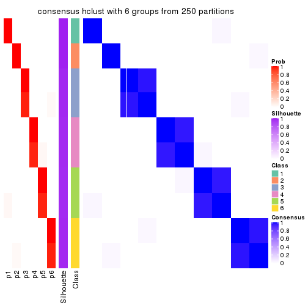</p>

</div>
</div>

Heatmaps for the membership of samples in all partitions to see how consistent they are:


<script>
$( function() {
	$( '#tabs-MAD-hclust-membership-heatmap' ).tabs();
} );
</script>
<div id='tabs-MAD-hclust-membership-heatmap'>
<ul>
<li><a href='#tab-MAD-hclust-membership-heatmap-1'>k = 2</a></li>
<li><a href='#tab-MAD-hclust-membership-heatmap-2'>k = 3</a></li>
<li><a href='#tab-MAD-hclust-membership-heatmap-3'>k = 4</a></li>
<li><a href='#tab-MAD-hclust-membership-heatmap-4'>k = 5</a></li>
<li><a href='#tab-MAD-hclust-membership-heatmap-5'>k = 6</a></li>
</ul>
<div id='tab-MAD-hclust-membership-heatmap-1'>
<pre><code class="r">membership_heatmap(res, k = 2)
</code></pre>

<p></p>

</div>
<div id='tab-MAD-hclust-membership-heatmap-2'>
<pre><code class="r">membership_heatmap(res, k = 3)
</code></pre>

<p></p>

</div>
<div id='tab-MAD-hclust-membership-heatmap-3'>
<pre><code class="r">membership_heatmap(res, k = 4)
</code></pre>

<p></p>

</div>
<div id='tab-MAD-hclust-membership-heatmap-4'>
<pre><code class="r">membership_heatmap(res, k = 5)
</code></pre>

<p></p>

</div>
<div id='tab-MAD-hclust-membership-heatmap-5'>
<pre><code class="r">membership_heatmap(res, k = 6)
</code></pre>

<p></p>

</div>
</div>

As soon as we have had the classes for columns, we can look for signatures
which are significantly different between classes which can be candidate marks
for certain classes. Following are the heatmaps for signatures.


Signature heatmaps where rows are scaled:


<script>
$( function() {
	$( '#tabs-MAD-hclust-get-signatures' ).tabs();
} );
</script>
<div id='tabs-MAD-hclust-get-signatures'>
<ul>
<li><a href='#tab-MAD-hclust-get-signatures-1'>k = 2</a></li>
<li><a href='#tab-MAD-hclust-get-signatures-2'>k = 3</a></li>
<li><a href='#tab-MAD-hclust-get-signatures-3'>k = 4</a></li>
<li><a href='#tab-MAD-hclust-get-signatures-4'>k = 5</a></li>
<li><a href='#tab-MAD-hclust-get-signatures-5'>k = 6</a></li>
</ul>
<div id='tab-MAD-hclust-get-signatures-1'>
<pre><code class="r">get_signatures(res, k = 2)
</code></pre>

<p></p>

</div>
<div id='tab-MAD-hclust-get-signatures-2'>
<pre><code class="r">get_signatures(res, k = 3)
</code></pre>

<p></p>

</div>
<div id='tab-MAD-hclust-get-signatures-3'>
<pre><code class="r">get_signatures(res, k = 4)
</code></pre>

<p></p>

</div>
<div id='tab-MAD-hclust-get-signatures-4'>
<pre><code class="r">get_signatures(res, k = 5)
</code></pre>

<p></p>

</div>
<div id='tab-MAD-hclust-get-signatures-5'>
<pre><code class="r">get_signatures(res, k = 6)
</code></pre>

<p></p>

</div>
</div>


Signature heatmaps where rows are not scaled:


<script>
$( function() {
	$( '#tabs-MAD-hclust-get-signatures-no-scale' ).tabs();
} );
</script>
<div id='tabs-MAD-hclust-get-signatures-no-scale'>
<ul>
<li><a href='#tab-MAD-hclust-get-signatures-no-scale-1'>k = 2</a></li>
<li><a href='#tab-MAD-hclust-get-signatures-no-scale-2'>k = 3</a></li>
<li><a href='#tab-MAD-hclust-get-signatures-no-scale-3'>k = 4</a></li>
<li><a href='#tab-MAD-hclust-get-signatures-no-scale-4'>k = 5</a></li>
<li><a href='#tab-MAD-hclust-get-signatures-no-scale-5'>k = 6</a></li>
</ul>
<div id='tab-MAD-hclust-get-signatures-no-scale-1'>
<pre><code class="r">get_signatures(res, k = 2, scale_rows = FALSE)
</code></pre>

<p></p>

</div>
<div id='tab-MAD-hclust-get-signatures-no-scale-2'>
<pre><code class="r">get_signatures(res, k = 3, scale_rows = FALSE)
</code></pre>

<p></p>

</div>
<div id='tab-MAD-hclust-get-signatures-no-scale-3'>
<pre><code class="r">get_signatures(res, k = 4, scale_rows = FALSE)
</code></pre>

<p></p>

</div>
<div id='tab-MAD-hclust-get-signatures-no-scale-4'>
<pre><code class="r">get_signatures(res, k = 5, scale_rows = FALSE)
</code></pre>

<p></p>

</div>
<div id='tab-MAD-hclust-get-signatures-no-scale-5'>
<pre><code class="r">get_signatures(res, k = 6, scale_rows = FALSE)
</code></pre>

<p></p>

</div>
</div>


Compare the overlap of signatures from different k:

```r
compare_signatures(res)
```


`get_signature()` returns a data frame invisibly. TO get the list of signatures, the function
call should be assigned to a variable explicitly. In following code, if `plot` argument is set
to `FALSE`, no heatmap is plotted while only the differential analysis is performed.

```r
# code only for demonstration
tb = get_signature(res, k = ..., plot = FALSE)
```

An example of the output of `tb` is:

```
#>   which_row         fdr    mean_1    mean_2 scaled_mean_1 scaled_mean_2 km
#> 1        38 0.042760348  8.373488  9.131774    -0.5533452     0.5164555  1
#> 2        40 0.018707592  7.106213  8.469186    -0.6173731     0.5762149  1
#> 3        55 0.019134737 10.221463 11.207825    -0.6159697     0.5749050  1
#> 4        59 0.006059896  5.921854  7.869574    -0.6899429     0.6439467  1
#> 5        60 0.018055526  8.928898 10.211722    -0.6204761     0.5791110  1
#> 6        98 0.009384629 15.714769 14.887706     0.6635654    -0.6193277  2
...
```

The columns in `tb` are:

1. `which_row`: row indices corresponding to the input matrix.
2. `fdr`: FDR for the differential test. 
3. `mean_x`: The mean value in group x.
4. `scaled_mean_x`: The mean value in group x after rows are scaled.
5. `km`: Row groups if k-means clustering is applied to rows.


UMAP plot which shows how samples are separated.


<script>
$( function() {
	$( '#tabs-MAD-hclust-dimension-reduction' ).tabs();
} );
</script>
<div id='tabs-MAD-hclust-dimension-reduction'>
<ul>
<li><a href='#tab-MAD-hclust-dimension-reduction-1'>k = 2</a></li>
<li><a href='#tab-MAD-hclust-dimension-reduction-2'>k = 3</a></li>
<li><a href='#tab-MAD-hclust-dimension-reduction-3'>k = 4</a></li>
<li><a href='#tab-MAD-hclust-dimension-reduction-4'>k = 5</a></li>
<li><a href='#tab-MAD-hclust-dimension-reduction-5'>k = 6</a></li>
</ul>
<div id='tab-MAD-hclust-dimension-reduction-1'>
<pre><code class="r">dimension_reduction(res, k = 2, method = &quot;UMAP&quot;)
</code></pre>

<p></p>

</div>
<div id='tab-MAD-hclust-dimension-reduction-2'>
<pre><code class="r">dimension_reduction(res, k = 3, method = &quot;UMAP&quot;)
</code></pre>

<p></p>

</div>
<div id='tab-MAD-hclust-dimension-reduction-3'>
<pre><code class="r">dimension_reduction(res, k = 4, method = &quot;UMAP&quot;)
</code></pre>

<p></p>

</div>
<div id='tab-MAD-hclust-dimension-reduction-4'>
<pre><code class="r">dimension_reduction(res, k = 5, method = &quot;UMAP&quot;)
</code></pre>

<p></p>

</div>
<div id='tab-MAD-hclust-dimension-reduction-5'>
<pre><code class="r">dimension_reduction(res, k = 6, method = &quot;UMAP&quot;)
</code></pre>

<p>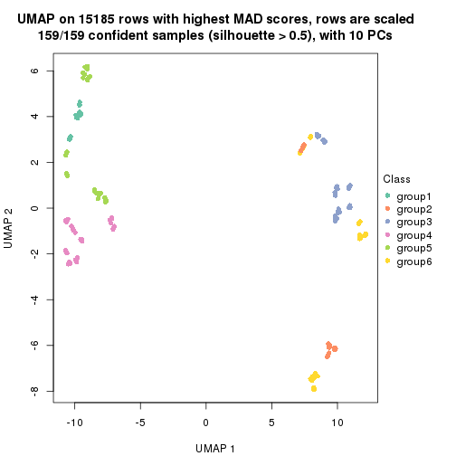</p>

</div>
</div>


Following heatmap shows how subgroups are split when increasing `k`:

```r
collect_classes(res)
```


If matrix rows can be associated to genes, consider to use `GO_Enrichment(res,
...)` to perform function enrichment for the signature genes.


 

---------------------------------------------------


### MAD:kmeans**


The object with results only for a single top-value method and a single partition method 
can be extracted as:

```r
res = res_list["MAD", "kmeans"]
# you can also extract it by
# res = res_list["MAD:kmeans"]
```

A summary of `res` and all the functions that can be applied to it:

```r
res
```

```
#> A 'ConsensusPartition' object with k = 2, 3, 4, 5, 6.
#>   On a matrix with 15185 rows and 159 columns.
#>   Top rows (1000, 2000, 3000, 4000, 5000) are extracted by 'MAD' method.
#>   Subgroups are detected by 'kmeans' method.
#>   Performed in total 1250 partitions by row resampling.
#>   Best k for subgroups seems to be 2.
#> 
#> Following methods can be applied to this 'ConsensusPartition' object:
#>  [1] "cola_report"             "collect_classes"         "collect_plots"          
#>  [4] "collect_stats"           "colnames"                "compare_signatures"     
#>  [7] "consensus_heatmap"       "dimension_reduction"     "functional_enrichment"  
#> [10] "get_anno_col"            "get_anno"                "get_classes"            
#> [13] "get_consensus"           "get_matrix"              "get_membership"         
#> [16] "get_param"               "get_signatures"          "get_stats"              
#> [19] "is_best_k"               "is_stable_k"             "membership_heatmap"     
#> [22] "ncol"                    "nrow"                    "plot_ecdf"              
#> [25] "rownames"                "select_partition_number" "show"                   
#> [28] "suggest_best_k"          "test_to_known_factors"
```

`collect_plots()` function collects all the plots made from `res` for all `k` (number of partitions)
into one single page to provide an easy and fast comparison between different `k`.

```r
collect_plots(res)
```


The plots are:

- The first row: a plot of the ECDF (Empirical cumulative distribution
  function) curves of the consensus matrix for each `k` and the heatmap of
  predicted classes for each `k`.
- The second row: heatmaps of the consensus matrix for each `k`.
- The third row: heatmaps of the membership matrix for each `k`.
- The fouth row: heatmaps of the signatures for each `k`.

All the plots in panels can be made by individual functions and they are
plotted later in this section.

`select_partition_number()` produces several plots showing different
statistics for choosing "optimized" `k`. There are following statistics:

- ECDF curves of the consensus matrix for each `k`;
- 1-PAC. [The PAC
  score](https://en.wikipedia.org/wiki/Consensus_clustering#Over-interpretation_potential_of_consensus_clustering)
  measures the proportion of the ambiguous subgrouping.
- Mean silhouette score.
- Concordance. The mean probability of fiting the consensus class ids in all
  partitions.
- Area increased. Denote $A_k$ as the area under the ECDF curve for current
  `k`, the area increased is defined as $A_k - A_{k-1}$.
- Rand index. The percent of pairs of samples that are both in a same cluster
  or both are not in a same cluster in the partition of k and k-1.
- Jaccard index. The ratio of pairs of samples are both in a same cluster in
  the partition of k and k-1 and the pairs of samples are both in a same
  cluster in the partition k or k-1.

The detailed explanations of these statistics can be found in [the cola
vignette](http://bioconductor.org/packages/devel/bioc/vignettes/cola/inst/doc/cola.html#toc_13).

Generally speaking, lower PAC score, higher mean silhouette score or higher
concordance corresponds to better partition. Rand index and Jaccard index
measure how similar the current partition is compared to partition with `k-1`.
If they are too similar, we won't accept `k` is better than `k-1`.

```r
select_partition_number(res)
```


The numeric values for all these statistics can be obtained by `get_stats()`.

```r
get_stats(res)
```

```
#>   k 1-PAC mean_silhouette concordance area_increased  Rand Jaccard
#> 2 2 1.000           1.000       1.000         0.5036 0.497   0.497
#> 3 3 0.670           0.353       0.761         0.2434 0.976   0.952
#> 4 4 0.642           0.754       0.771         0.1316 0.755   0.497
#> 5 5 0.664           0.672       0.712         0.0793 0.918   0.725
#> 6 6 0.717           0.520       0.612         0.0362 0.875   0.558
```

`suggest_best_k()` suggests the best $k$ based on these statistics. The rules are as follows:

- All $k$ with Jaccard index larger than 0.95 are removed because the increase of
  the partition number does not provides enough extra information. If all $k$ are removed,
  the best $k$ is assigned by `NA`.
- For $k$ with 1-PAC larger than 0.9, the maximal $k$ is taken as the "best k". Other $k$ is called "optional k".
- If it does not fit the second rule. The $k$ with the highest vote of highest
  1-PAC, mean silhouette and concordance is taken as the "best k".

```r
suggest_best_k(res)
```

```
#> [1] 2
```


Following shows the table of the partitions (You need to click the **show/hide
code output** link to see it). The membership matrix (columns with name `p*`)
is inferred by
[`clue::cl_consensus()`](https://www.rdocumentation.org/link/cl_consensus?package=clue)
function with the `SE` method. Basically the value in the membership matrix
represents the probability to belong to a certain group. The finall class
label for an item is determined with the group with highest probability it
belongs to.

In `get_classes()` function, the entropy is calculated from the membership
matrix and the silhouette score is calculated from the consensus matrix.


<script>
$( function() {
	$( '#tabs-MAD-kmeans-get-classes' ).tabs();
} );
</script>
<div id='tabs-MAD-kmeans-get-classes'>
<ul>
<li><a href='#tab-MAD-kmeans-get-classes-1'>k = 2</a></li>
<li><a href='#tab-MAD-kmeans-get-classes-2'>k = 3</a></li>
<li><a href='#tab-MAD-kmeans-get-classes-3'>k = 4</a></li>
<li><a href='#tab-MAD-kmeans-get-classes-4'>k = 5</a></li>
<li><a href='#tab-MAD-kmeans-get-classes-5'>k = 6</a></li>
</ul>

<div id='tab-MAD-kmeans-get-classes-1'>
<p><a id='tab-MAD-kmeans-get-classes-1-a' style='color:#0366d6' href='#'>show/hide code output</a></p>
<pre><code class="r">cbind(get_classes(res, k = 2), get_membership(res, k = 2))
</code></pre>

<pre><code>#&gt;            class entropy silhouette p1 p2
#&gt; SRR1706767     1       0          1  1  0
#&gt; SRR1706768     1       0          1  1  0
#&gt; SRR1706769     1       0          1  1  0
#&gt; SRR1706770     1       0          1  1  0
#&gt; SRR1706771     1       0          1  1  0
#&gt; SRR1706772     1       0          1  1  0
#&gt; SRR1706773     1       0          1  1  0
#&gt; SRR1706774     1       0          1  1  0
#&gt; SRR1706775     1       0          1  1  0
#&gt; SRR1706776     1       0          1  1  0
#&gt; SRR1706777     1       0          1  1  0
#&gt; SRR1706778     1       0          1  1  0
#&gt; SRR1706779     1       0          1  1  0
#&gt; SRR1706780     1       0          1  1  0
#&gt; SRR1706781     1       0          1  1  0
#&gt; SRR1706782     1       0          1  1  0
#&gt; SRR1706783     1       0          1  1  0
#&gt; SRR1706784     1       0          1  1  0
#&gt; SRR1706785     1       0          1  1  0
#&gt; SRR1706786     1       0          1  1  0
#&gt; SRR1706787     1       0          1  1  0
#&gt; SRR1706788     1       0          1  1  0
#&gt; SRR1706789     1       0          1  1  0
#&gt; SRR1706790     1       0          1  1  0
#&gt; SRR1706791     1       0          1  1  0
#&gt; SRR1706792     1       0          1  1  0
#&gt; SRR1706793     1       0          1  1  0
#&gt; SRR1706794     1       0          1  1  0
#&gt; SRR1706795     1       0          1  1  0
#&gt; SRR1706796     1       0          1  1  0
#&gt; SRR1706797     1       0          1  1  0
#&gt; SRR1706798     1       0          1  1  0
#&gt; SRR1706799     1       0          1  1  0
#&gt; SRR1706800     1       0          1  1  0
#&gt; SRR1706801     1       0          1  1  0
#&gt; SRR1706802     1       0          1  1  0
#&gt; SRR1706803     1       0          1  1  0
#&gt; SRR1706804     1       0          1  1  0
#&gt; SRR1706805     1       0          1  1  0
#&gt; SRR1706806     1       0          1  1  0
#&gt; SRR1706811     1       0          1  1  0
#&gt; SRR1706812     1       0          1  1  0
#&gt; SRR1706813     1       0          1  1  0
#&gt; SRR1706814     1       0          1  1  0
#&gt; SRR1706807     1       0          1  1  0
#&gt; SRR1706808     1       0          1  1  0
#&gt; SRR1706809     1       0          1  1  0
#&gt; SRR1706810     1       0          1  1  0
#&gt; SRR1706815     1       0          1  1  0
#&gt; SRR1706816     1       0          1  1  0
#&gt; SRR1706817     1       0          1  1  0
#&gt; SRR1706818     1       0          1  1  0
#&gt; SRR1706819     1       0          1  1  0
#&gt; SRR1706820     1       0          1  1  0
#&gt; SRR1706821     1       0          1  1  0
#&gt; SRR1706822     1       0          1  1  0
#&gt; SRR1706823     1       0          1  1  0
#&gt; SRR1706824     1       0          1  1  0
#&gt; SRR1706825     1       0          1  1  0
#&gt; SRR1706826     1       0          1  1  0
#&gt; SRR1706827     1       0          1  1  0
#&gt; SRR1706828     1       0          1  1  0
#&gt; SRR1706829     1       0          1  1  0
#&gt; SRR1706830     1       0          1  1  0
#&gt; SRR1706835     1       0          1  1  0
#&gt; SRR1706836     1       0          1  1  0
#&gt; SRR1706837     1       0          1  1  0
#&gt; SRR1706838     1       0          1  1  0
#&gt; SRR1706831     1       0          1  1  0
#&gt; SRR1706832     1       0          1  1  0
#&gt; SRR1706833     1       0          1  1  0
#&gt; SRR1706834     1       0          1  1  0
#&gt; SRR1706839     1       0          1  1  0
#&gt; SRR1706840     1       0          1  1  0
#&gt; SRR1706841     1       0          1  1  0
#&gt; SRR1706842     1       0          1  1  0
#&gt; SRR1706847     2       0          1  0  1
#&gt; SRR1706848     2       0          1  0  1
#&gt; SRR1706849     2       0          1  0  1
#&gt; SRR1706850     2       0          1  0  1
#&gt; SRR1706843     1       0          1  1  0
#&gt; SRR1706844     1       0          1  1  0
#&gt; SRR1706845     1       0          1  1  0
#&gt; SRR1706846     1       0          1  1  0
#&gt; SRR1706851     2       0          1  0  1
#&gt; SRR1706852     2       0          1  0  1
#&gt; SRR1706853     2       0          1  0  1
#&gt; SRR1706854     2       0          1  0  1
#&gt; SRR1706855     2       0          1  0  1
#&gt; SRR1706856     2       0          1  0  1
#&gt; SRR1706857     2       0          1  0  1
#&gt; SRR1706858     2       0          1  0  1
#&gt; SRR1706859     2       0          1  0  1
#&gt; SRR1706860     2       0          1  0  1
#&gt; SRR1706861     2       0          1  0  1
#&gt; SRR1706862     2       0          1  0  1
#&gt; SRR1706867     2       0          1  0  1
#&gt; SRR1706869     2       0          1  0  1
#&gt; SRR1706870     2       0          1  0  1
#&gt; SRR1706863     2       0          1  0  1
#&gt; SRR1706864     2       0          1  0  1
#&gt; SRR1706865     2       0          1  0  1
#&gt; SRR1706866     2       0          1  0  1
#&gt; SRR1706871     2       0          1  0  1
#&gt; SRR1706872     2       0          1  0  1
#&gt; SRR1706873     2       0          1  0  1
#&gt; SRR1706874     2       0          1  0  1
#&gt; SRR1706879     2       0          1  0  1
#&gt; SRR1706880     2       0          1  0  1
#&gt; SRR1706881     2       0          1  0  1
#&gt; SRR1706882     2       0          1  0  1
#&gt; SRR1706883     2       0          1  0  1
#&gt; SRR1706884     2       0          1  0  1
#&gt; SRR1706885     2       0          1  0  1
#&gt; SRR1706886     2       0          1  0  1
#&gt; SRR1706875     2       0          1  0  1
#&gt; SRR1706876     2       0          1  0  1
#&gt; SRR1706877     2       0          1  0  1
#&gt; SRR1706878     2       0          1  0  1
#&gt; SRR1706887     2       0          1  0  1
#&gt; SRR1706888     2       0          1  0  1
#&gt; SRR1706889     2       0          1  0  1
#&gt; SRR1706890     2       0          1  0  1
#&gt; SRR1706891     2       0          1  0  1
#&gt; SRR1706892     2       0          1  0  1
#&gt; SRR1706893     2       0          1  0  1
#&gt; SRR1706894     2       0          1  0  1
#&gt; SRR1706895     2       0          1  0  1
#&gt; SRR1706896     2       0          1  0  1
#&gt; SRR1706897     2       0          1  0  1
#&gt; SRR1706898     2       0          1  0  1
#&gt; SRR1706899     2       0          1  0  1
#&gt; SRR1706900     2       0          1  0  1
#&gt; SRR1706901     2       0          1  0  1
#&gt; SRR1706902     2       0          1  0  1
#&gt; SRR1706907     2       0          1  0  1
#&gt; SRR1706908     2       0          1  0  1
#&gt; SRR1706909     2       0          1  0  1
#&gt; SRR1706910     2       0          1  0  1
#&gt; SRR1706903     2       0          1  0  1
#&gt; SRR1706904     2       0          1  0  1
#&gt; SRR1706905     2       0          1  0  1
#&gt; SRR1706906     2       0          1  0  1
#&gt; SRR1706911     2       0          1  0  1
#&gt; SRR1706912     2       0          1  0  1
#&gt; SRR1706913     2       0          1  0  1
#&gt; SRR1706914     2       0          1  0  1
#&gt; SRR1706919     2       0          1  0  1
#&gt; SRR1706920     2       0          1  0  1
#&gt; SRR1706921     2       0          1  0  1
#&gt; SRR1706922     2       0          1  0  1
#&gt; SRR1706915     2       0          1  0  1
#&gt; SRR1706916     2       0          1  0  1
#&gt; SRR1706917     2       0          1  0  1
#&gt; SRR1706918     2       0          1  0  1
#&gt; SRR1706923     2       0          1  0  1
#&gt; SRR1706924     2       0          1  0  1
#&gt; SRR1706925     2       0          1  0  1
#&gt; SRR1706926     2       0          1  0  1
</code></pre>

<script>
$('#tab-MAD-kmeans-get-classes-1-a').parent().next().next().hide();
$('#tab-MAD-kmeans-get-classes-1-a').click(function(){
  $('#tab-MAD-kmeans-get-classes-1-a').parent().next().next().toggle();
  return(false);
});
</script>
</div>

<div id='tab-MAD-kmeans-get-classes-2'>
<p><a id='tab-MAD-kmeans-get-classes-2-a' style='color:#0366d6' href='#'>show/hide code output</a></p>
<pre><code class="r">cbind(get_classes(res, k = 3), get_membership(res, k = 3))
</code></pre>

<pre><code>#&gt;            class entropy silhouette    p1    p2    p3
#&gt; SRR1706767     1  0.6302     0.7920 0.520 0.000 0.480
#&gt; SRR1706768     1  0.6302     0.7920 0.520 0.000 0.480
#&gt; SRR1706769     1  0.6302     0.7920 0.520 0.000 0.480
#&gt; SRR1706770     1  0.6302     0.7920 0.520 0.000 0.480
#&gt; SRR1706771     1  0.6280     0.7995 0.540 0.000 0.460
#&gt; SRR1706772     1  0.6280     0.7995 0.540 0.000 0.460
#&gt; SRR1706773     1  0.6280     0.7995 0.540 0.000 0.460
#&gt; SRR1706774     1  0.6280     0.7995 0.540 0.000 0.460
#&gt; SRR1706775     1  0.5098     0.8260 0.752 0.000 0.248
#&gt; SRR1706776     1  0.5098     0.8260 0.752 0.000 0.248
#&gt; SRR1706777     1  0.5098     0.8260 0.752 0.000 0.248
#&gt; SRR1706778     1  0.5098     0.8260 0.752 0.000 0.248
#&gt; SRR1706779     1  0.0000     0.7943 1.000 0.000 0.000
#&gt; SRR1706780     1  0.0000     0.7943 1.000 0.000 0.000
#&gt; SRR1706781     1  0.0000     0.7943 1.000 0.000 0.000
#&gt; SRR1706782     1  0.0000     0.7943 1.000 0.000 0.000
#&gt; SRR1706783     1  0.0892     0.7869 0.980 0.000 0.020
#&gt; SRR1706784     1  0.0892     0.7869 0.980 0.000 0.020
#&gt; SRR1706785     1  0.0892     0.7869 0.980 0.000 0.020
#&gt; SRR1706786     1  0.0892     0.7869 0.980 0.000 0.020
#&gt; SRR1706787     1  0.6302     0.7920 0.520 0.000 0.480
#&gt; SRR1706788     1  0.6302     0.7920 0.520 0.000 0.480
#&gt; SRR1706789     1  0.6302     0.7920 0.520 0.000 0.480
#&gt; SRR1706790     1  0.6302     0.7920 0.520 0.000 0.480
#&gt; SRR1706791     1  0.6280     0.7995 0.540 0.000 0.460
#&gt; SRR1706792     1  0.6280     0.7995 0.540 0.000 0.460
#&gt; SRR1706793     1  0.6280     0.7995 0.540 0.000 0.460
#&gt; SRR1706794     1  0.6280     0.7995 0.540 0.000 0.460
#&gt; SRR1706795     1  0.5098     0.8260 0.752 0.000 0.248
#&gt; SRR1706796     1  0.5098     0.8260 0.752 0.000 0.248
#&gt; SRR1706797     1  0.5098     0.8260 0.752 0.000 0.248
#&gt; SRR1706798     1  0.5098     0.8260 0.752 0.000 0.248
#&gt; SRR1706799     1  0.0000     0.7943 1.000 0.000 0.000
#&gt; SRR1706800     1  0.0000     0.7943 1.000 0.000 0.000
#&gt; SRR1706801     1  0.0000     0.7943 1.000 0.000 0.000
#&gt; SRR1706802     1  0.0000     0.7943 1.000 0.000 0.000
#&gt; SRR1706803     1  0.0892     0.7869 0.980 0.000 0.020
#&gt; SRR1706804     1  0.0892     0.7869 0.980 0.000 0.020
#&gt; SRR1706805     1  0.0892     0.7869 0.980 0.000 0.020
#&gt; SRR1706806     1  0.0892     0.7869 0.980 0.000 0.020
#&gt; SRR1706811     1  0.6291     0.7984 0.532 0.000 0.468
#&gt; SRR1706812     1  0.6291     0.7984 0.532 0.000 0.468
#&gt; SRR1706813     1  0.6291     0.7984 0.532 0.000 0.468
#&gt; SRR1706814     1  0.6291     0.7984 0.532 0.000 0.468
#&gt; SRR1706807     1  0.6307     0.7900 0.512 0.000 0.488
#&gt; SRR1706808     1  0.6307     0.7900 0.512 0.000 0.488
#&gt; SRR1706809     1  0.6307     0.7900 0.512 0.000 0.488
#&gt; SRR1706810     1  0.6307     0.7900 0.512 0.000 0.488
#&gt; SRR1706815     1  0.5138     0.8254 0.748 0.000 0.252
#&gt; SRR1706816     1  0.5138     0.8254 0.748 0.000 0.252
#&gt; SRR1706817     1  0.5138     0.8254 0.748 0.000 0.252
#&gt; SRR1706818     1  0.5138     0.8254 0.748 0.000 0.252
#&gt; SRR1706819     1  0.0424     0.7931 0.992 0.000 0.008
#&gt; SRR1706820     1  0.0424     0.7931 0.992 0.000 0.008
#&gt; SRR1706821     1  0.0424     0.7931 0.992 0.000 0.008
#&gt; SRR1706822     1  0.0424     0.7931 0.992 0.000 0.008
#&gt; SRR1706823     1  0.1163     0.7848 0.972 0.000 0.028
#&gt; SRR1706824     1  0.1163     0.7848 0.972 0.000 0.028
#&gt; SRR1706825     1  0.1163     0.7848 0.972 0.000 0.028
#&gt; SRR1706826     1  0.1163     0.7848 0.972 0.000 0.028
#&gt; SRR1706827     1  0.6302     0.7920 0.520 0.000 0.480
#&gt; SRR1706828     1  0.6302     0.7920 0.520 0.000 0.480
#&gt; SRR1706829     1  0.6302     0.7920 0.520 0.000 0.480
#&gt; SRR1706830     1  0.6302     0.7920 0.520 0.000 0.480
#&gt; SRR1706835     1  0.5098     0.8260 0.752 0.000 0.248
#&gt; SRR1706836     1  0.5098     0.8260 0.752 0.000 0.248
#&gt; SRR1706837     1  0.5098     0.8260 0.752 0.000 0.248
#&gt; SRR1706838     1  0.5098     0.8260 0.752 0.000 0.248
#&gt; SRR1706831     1  0.6280     0.7995 0.540 0.000 0.460
#&gt; SRR1706832     1  0.6280     0.7995 0.540 0.000 0.460
#&gt; SRR1706833     1  0.6280     0.7995 0.540 0.000 0.460
#&gt; SRR1706834     1  0.6280     0.7995 0.540 0.000 0.460
#&gt; SRR1706839     1  0.0000     0.7943 1.000 0.000 0.000
#&gt; SRR1706840     1  0.0000     0.7943 1.000 0.000 0.000
#&gt; SRR1706841     1  0.0000     0.7943 1.000 0.000 0.000
#&gt; SRR1706842     1  0.0000     0.7943 1.000 0.000 0.000
#&gt; SRR1706847     2  0.2711     0.4260 0.000 0.912 0.088
#&gt; SRR1706848     2  0.2711     0.4260 0.000 0.912 0.088
#&gt; SRR1706849     2  0.2711     0.4260 0.000 0.912 0.088
#&gt; SRR1706850     2  0.2711     0.4260 0.000 0.912 0.088
#&gt; SRR1706843     1  0.0892     0.7869 0.980 0.000 0.020
#&gt; SRR1706844     1  0.0892     0.7869 0.980 0.000 0.020
#&gt; SRR1706845     1  0.0892     0.7869 0.980 0.000 0.020
#&gt; SRR1706846     1  0.0892     0.7869 0.980 0.000 0.020
#&gt; SRR1706851     2  0.0000     0.4392 0.000 1.000 0.000
#&gt; SRR1706852     2  0.0000     0.4392 0.000 1.000 0.000
#&gt; SRR1706853     2  0.0000     0.4392 0.000 1.000 0.000
#&gt; SRR1706854     2  0.0000     0.4392 0.000 1.000 0.000
#&gt; SRR1706855     2  0.5363     0.0231 0.000 0.724 0.276
#&gt; SRR1706856     2  0.5363     0.0231 0.000 0.724 0.276
#&gt; SRR1706857     2  0.5363     0.0231 0.000 0.724 0.276
#&gt; SRR1706858     2  0.5363     0.0231 0.000 0.724 0.276
#&gt; SRR1706859     2  0.6295    -0.8819 0.000 0.528 0.472
#&gt; SRR1706860     2  0.6295    -0.8819 0.000 0.528 0.472
#&gt; SRR1706861     2  0.6295    -0.8819 0.000 0.528 0.472
#&gt; SRR1706862     2  0.6295    -0.8819 0.000 0.528 0.472
#&gt; SRR1706867     2  0.2711     0.4260 0.000 0.912 0.088
#&gt; SRR1706869     2  0.2711     0.4260 0.000 0.912 0.088
#&gt; SRR1706870     2  0.2711     0.4260 0.000 0.912 0.088
#&gt; SRR1706863     2  0.6308    -0.9501 0.000 0.508 0.492
#&gt; SRR1706864     2  0.6308    -0.9501 0.000 0.508 0.492
#&gt; SRR1706865     2  0.6308    -0.9501 0.000 0.508 0.492
#&gt; SRR1706866     2  0.6308    -0.9501 0.000 0.508 0.492
#&gt; SRR1706871     2  0.0000     0.4392 0.000 1.000 0.000
#&gt; SRR1706872     2  0.0000     0.4392 0.000 1.000 0.000
#&gt; SRR1706873     2  0.0000     0.4392 0.000 1.000 0.000
#&gt; SRR1706874     2  0.0000     0.4392 0.000 1.000 0.000
#&gt; SRR1706879     2  0.6295    -0.8819 0.000 0.528 0.472
#&gt; SRR1706880     2  0.6295    -0.8819 0.000 0.528 0.472
#&gt; SRR1706881     2  0.6295    -0.8819 0.000 0.528 0.472
#&gt; SRR1706882     2  0.6295    -0.8819 0.000 0.528 0.472
#&gt; SRR1706883     2  0.6308    -0.9501 0.000 0.508 0.492
#&gt; SRR1706884     2  0.6308    -0.9501 0.000 0.508 0.492
#&gt; SRR1706885     2  0.6308    -0.9501 0.000 0.508 0.492
#&gt; SRR1706886     2  0.6308    -0.9501 0.000 0.508 0.492
#&gt; SRR1706875     2  0.5363     0.0231 0.000 0.724 0.276
#&gt; SRR1706876     2  0.5363     0.0231 0.000 0.724 0.276
#&gt; SRR1706877     2  0.5363     0.0231 0.000 0.724 0.276
#&gt; SRR1706878     2  0.5363     0.0231 0.000 0.724 0.276
#&gt; SRR1706887     2  0.2959     0.4210 0.000 0.900 0.100
#&gt; SRR1706888     2  0.2959     0.4210 0.000 0.900 0.100
#&gt; SRR1706889     2  0.2959     0.4210 0.000 0.900 0.100
#&gt; SRR1706890     2  0.2959     0.4210 0.000 0.900 0.100
#&gt; SRR1706891     2  0.0592     0.4366 0.000 0.988 0.012
#&gt; SRR1706892     2  0.0592     0.4366 0.000 0.988 0.012
#&gt; SRR1706893     2  0.0592     0.4366 0.000 0.988 0.012
#&gt; SRR1706894     2  0.0592     0.4366 0.000 0.988 0.012
#&gt; SRR1706895     2  0.5465     0.0139 0.000 0.712 0.288
#&gt; SRR1706896     2  0.5465     0.0139 0.000 0.712 0.288
#&gt; SRR1706897     2  0.5465     0.0139 0.000 0.712 0.288
#&gt; SRR1706898     2  0.5465     0.0139 0.000 0.712 0.288
#&gt; SRR1706899     2  0.6305    -0.9068 0.000 0.516 0.484
#&gt; SRR1706900     2  0.6305    -0.9068 0.000 0.516 0.484
#&gt; SRR1706901     2  0.6305    -0.9068 0.000 0.516 0.484
#&gt; SRR1706902     2  0.6305    -0.9068 0.000 0.516 0.484
#&gt; SRR1706907     2  0.2711     0.4260 0.000 0.912 0.088
#&gt; SRR1706908     2  0.2711     0.4260 0.000 0.912 0.088
#&gt; SRR1706909     2  0.2711     0.4260 0.000 0.912 0.088
#&gt; SRR1706910     2  0.2711     0.4260 0.000 0.912 0.088
#&gt; SRR1706903     3  0.6309     1.0000 0.000 0.496 0.504
#&gt; SRR1706904     3  0.6309     1.0000 0.000 0.496 0.504
#&gt; SRR1706905     3  0.6309     1.0000 0.000 0.496 0.504
#&gt; SRR1706906     3  0.6309     1.0000 0.000 0.496 0.504
#&gt; SRR1706911     2  0.0000     0.4392 0.000 1.000 0.000
#&gt; SRR1706912     2  0.0000     0.4392 0.000 1.000 0.000
#&gt; SRR1706913     2  0.0000     0.4392 0.000 1.000 0.000
#&gt; SRR1706914     2  0.0000     0.4392 0.000 1.000 0.000
#&gt; SRR1706919     2  0.6295    -0.8819 0.000 0.528 0.472
#&gt; SRR1706920     2  0.6295    -0.8819 0.000 0.528 0.472
#&gt; SRR1706921     2  0.6295    -0.8819 0.000 0.528 0.472
#&gt; SRR1706922     2  0.6295    -0.8819 0.000 0.528 0.472
#&gt; SRR1706915     2  0.5363     0.0231 0.000 0.724 0.276
#&gt; SRR1706916     2  0.5363     0.0231 0.000 0.724 0.276
#&gt; SRR1706917     2  0.5363     0.0231 0.000 0.724 0.276
#&gt; SRR1706918     2  0.5363     0.0231 0.000 0.724 0.276
#&gt; SRR1706923     2  0.6308    -0.9501 0.000 0.508 0.492
#&gt; SRR1706924     2  0.6308    -0.9501 0.000 0.508 0.492
#&gt; SRR1706925     2  0.6308    -0.9501 0.000 0.508 0.492
#&gt; SRR1706926     2  0.6308    -0.9501 0.000 0.508 0.492
</code></pre>

<script>
$('#tab-MAD-kmeans-get-classes-2-a').parent().next().next().hide();
$('#tab-MAD-kmeans-get-classes-2-a').click(function(){
  $('#tab-MAD-kmeans-get-classes-2-a').parent().next().next().toggle();
  return(false);
});
</script>
</div>

<div id='tab-MAD-kmeans-get-classes-3'>
<p><a id='tab-MAD-kmeans-get-classes-3-a' style='color:#0366d6' href='#'>show/hide code output</a></p>
<pre><code class="r">cbind(get_classes(res, k = 4), get_membership(res, k = 4))
</code></pre>

<pre><code>#&gt;            class entropy silhouette    p1    p2    p3    p4
#&gt; SRR1706767     4  0.5864      0.941 0.264 0.000 0.072 0.664
#&gt; SRR1706768     4  0.5864      0.941 0.264 0.000 0.072 0.664
#&gt; SRR1706769     4  0.5864      0.941 0.264 0.000 0.072 0.664
#&gt; SRR1706770     4  0.5864      0.941 0.264 0.000 0.072 0.664
#&gt; SRR1706771     4  0.4748      0.939 0.268 0.000 0.016 0.716
#&gt; SRR1706772     4  0.4748      0.939 0.268 0.000 0.016 0.716
#&gt; SRR1706773     4  0.4748      0.939 0.268 0.000 0.016 0.716
#&gt; SRR1706774     4  0.4748      0.939 0.268 0.000 0.016 0.716
#&gt; SRR1706775     1  0.5442      0.374 0.636 0.000 0.028 0.336
#&gt; SRR1706776     1  0.5442      0.374 0.636 0.000 0.028 0.336
#&gt; SRR1706777     1  0.5442      0.374 0.636 0.000 0.028 0.336
#&gt; SRR1706778     1  0.5442      0.374 0.636 0.000 0.028 0.336
#&gt; SRR1706779     1  0.0469      0.783 0.988 0.000 0.000 0.012
#&gt; SRR1706780     1  0.0469      0.783 0.988 0.000 0.000 0.012
#&gt; SRR1706781     1  0.0469      0.783 0.988 0.000 0.000 0.012
#&gt; SRR1706782     1  0.0469      0.783 0.988 0.000 0.000 0.012
#&gt; SRR1706783     1  0.1557      0.774 0.944 0.000 0.056 0.000
#&gt; SRR1706784     1  0.1557      0.774 0.944 0.000 0.056 0.000
#&gt; SRR1706785     1  0.1557      0.774 0.944 0.000 0.056 0.000
#&gt; SRR1706786     1  0.1557      0.774 0.944 0.000 0.056 0.000
#&gt; SRR1706787     4  0.5592      0.945 0.264 0.000 0.056 0.680
#&gt; SRR1706788     4  0.5592      0.945 0.264 0.000 0.056 0.680
#&gt; SRR1706789     4  0.5592      0.945 0.264 0.000 0.056 0.680
#&gt; SRR1706790     4  0.5592      0.945 0.264 0.000 0.056 0.680
#&gt; SRR1706791     4  0.4193      0.942 0.268 0.000 0.000 0.732
#&gt; SRR1706792     4  0.4193      0.942 0.268 0.000 0.000 0.732
#&gt; SRR1706793     4  0.4193      0.942 0.268 0.000 0.000 0.732
#&gt; SRR1706794     4  0.4193      0.942 0.268 0.000 0.000 0.732
#&gt; SRR1706795     1  0.5368      0.372 0.636 0.000 0.024 0.340
#&gt; SRR1706796     1  0.5368      0.372 0.636 0.000 0.024 0.340
#&gt; SRR1706797     1  0.5368      0.372 0.636 0.000 0.024 0.340
#&gt; SRR1706798     1  0.5368      0.372 0.636 0.000 0.024 0.340
#&gt; SRR1706799     1  0.0469      0.783 0.988 0.000 0.000 0.012
#&gt; SRR1706800     1  0.0469      0.783 0.988 0.000 0.000 0.012
#&gt; SRR1706801     1  0.0469      0.783 0.988 0.000 0.000 0.012
#&gt; SRR1706802     1  0.0469      0.783 0.988 0.000 0.000 0.012
#&gt; SRR1706803     1  0.1557      0.774 0.944 0.000 0.056 0.000
#&gt; SRR1706804     1  0.1557      0.774 0.944 0.000 0.056 0.000
#&gt; SRR1706805     1  0.1557      0.774 0.944 0.000 0.056 0.000
#&gt; SRR1706806     1  0.1557      0.774 0.944 0.000 0.056 0.000
#&gt; SRR1706811     4  0.4599      0.929 0.248 0.000 0.016 0.736
#&gt; SRR1706812     4  0.4599      0.929 0.248 0.000 0.016 0.736
#&gt; SRR1706813     4  0.4599      0.929 0.248 0.000 0.016 0.736
#&gt; SRR1706814     4  0.4599      0.929 0.248 0.000 0.016 0.736
#&gt; SRR1706807     4  0.5657      0.927 0.244 0.000 0.068 0.688
#&gt; SRR1706808     4  0.5657      0.927 0.244 0.000 0.068 0.688
#&gt; SRR1706809     4  0.5657      0.927 0.244 0.000 0.068 0.688
#&gt; SRR1706810     4  0.5657      0.927 0.244 0.000 0.068 0.688
#&gt; SRR1706815     1  0.5839      0.356 0.604 0.000 0.044 0.352
#&gt; SRR1706816     1  0.5839      0.356 0.604 0.000 0.044 0.352
#&gt; SRR1706817     1  0.5839      0.356 0.604 0.000 0.044 0.352
#&gt; SRR1706818     1  0.5839      0.356 0.604 0.000 0.044 0.352
#&gt; SRR1706819     1  0.1488      0.774 0.956 0.000 0.012 0.032
#&gt; SRR1706820     1  0.1488      0.774 0.956 0.000 0.012 0.032
#&gt; SRR1706821     1  0.1488      0.774 0.956 0.000 0.012 0.032
#&gt; SRR1706822     1  0.1488      0.774 0.956 0.000 0.012 0.032
#&gt; SRR1706823     1  0.2489      0.760 0.912 0.000 0.068 0.020
#&gt; SRR1706824     1  0.2489      0.760 0.912 0.000 0.068 0.020
#&gt; SRR1706825     1  0.2489      0.760 0.912 0.000 0.068 0.020
#&gt; SRR1706826     1  0.2489      0.760 0.912 0.000 0.068 0.020
#&gt; SRR1706827     4  0.5592      0.945 0.264 0.000 0.056 0.680
#&gt; SRR1706828     4  0.5592      0.945 0.264 0.000 0.056 0.680
#&gt; SRR1706829     4  0.5592      0.945 0.264 0.000 0.056 0.680
#&gt; SRR1706830     4  0.5592      0.945 0.264 0.000 0.056 0.680
#&gt; SRR1706835     1  0.5368      0.372 0.636 0.000 0.024 0.340
#&gt; SRR1706836     1  0.5368      0.372 0.636 0.000 0.024 0.340
#&gt; SRR1706837     1  0.5368      0.372 0.636 0.000 0.024 0.340
#&gt; SRR1706838     1  0.5368      0.372 0.636 0.000 0.024 0.340
#&gt; SRR1706831     4  0.4193      0.942 0.268 0.000 0.000 0.732
#&gt; SRR1706832     4  0.4193      0.942 0.268 0.000 0.000 0.732
#&gt; SRR1706833     4  0.4193      0.942 0.268 0.000 0.000 0.732
#&gt; SRR1706834     4  0.4193      0.942 0.268 0.000 0.000 0.732
#&gt; SRR1706839     1  0.0469      0.783 0.988 0.000 0.000 0.012
#&gt; SRR1706840     1  0.0469      0.783 0.988 0.000 0.000 0.012
#&gt; SRR1706841     1  0.0469      0.783 0.988 0.000 0.000 0.012
#&gt; SRR1706842     1  0.0469      0.783 0.988 0.000 0.000 0.012
#&gt; SRR1706847     3  0.5376      0.910 0.000 0.176 0.736 0.088
#&gt; SRR1706848     3  0.5376      0.910 0.000 0.176 0.736 0.088
#&gt; SRR1706849     3  0.5376      0.910 0.000 0.176 0.736 0.088
#&gt; SRR1706850     3  0.5376      0.910 0.000 0.176 0.736 0.088
#&gt; SRR1706843     1  0.1557      0.774 0.944 0.000 0.056 0.000
#&gt; SRR1706844     1  0.1557      0.774 0.944 0.000 0.056 0.000
#&gt; SRR1706845     1  0.1557      0.774 0.944 0.000 0.056 0.000
#&gt; SRR1706846     1  0.1557      0.774 0.944 0.000 0.056 0.000
#&gt; SRR1706851     3  0.4175      0.905 0.000 0.212 0.776 0.012
#&gt; SRR1706852     3  0.4175      0.905 0.000 0.212 0.776 0.012
#&gt; SRR1706853     3  0.4175      0.905 0.000 0.212 0.776 0.012
#&gt; SRR1706854     3  0.4175      0.905 0.000 0.212 0.776 0.012
#&gt; SRR1706855     2  0.6058      0.419 0.000 0.604 0.336 0.060
#&gt; SRR1706856     2  0.6058      0.419 0.000 0.604 0.336 0.060
#&gt; SRR1706857     2  0.6058      0.419 0.000 0.604 0.336 0.060
#&gt; SRR1706858     2  0.6058      0.419 0.000 0.604 0.336 0.060
#&gt; SRR1706859     2  0.0188      0.777 0.000 0.996 0.004 0.000
#&gt; SRR1706860     2  0.0188      0.777 0.000 0.996 0.004 0.000
#&gt; SRR1706861     2  0.0188      0.777 0.000 0.996 0.004 0.000
#&gt; SRR1706862     2  0.0188      0.777 0.000 0.996 0.004 0.000
#&gt; SRR1706867     3  0.5314      0.911 0.000 0.176 0.740 0.084
#&gt; SRR1706869     3  0.5314      0.911 0.000 0.176 0.740 0.084
#&gt; SRR1706870     3  0.5314      0.911 0.000 0.176 0.740 0.084
#&gt; SRR1706863     2  0.2081      0.764 0.000 0.916 0.000 0.084
#&gt; SRR1706864     2  0.2081      0.764 0.000 0.916 0.000 0.084
#&gt; SRR1706865     2  0.2081      0.764 0.000 0.916 0.000 0.084
#&gt; SRR1706866     2  0.2081      0.764 0.000 0.916 0.000 0.084
#&gt; SRR1706871     3  0.3726      0.911 0.000 0.212 0.788 0.000
#&gt; SRR1706872     3  0.3726      0.911 0.000 0.212 0.788 0.000
#&gt; SRR1706873     3  0.3726      0.911 0.000 0.212 0.788 0.000
#&gt; SRR1706874     3  0.3726      0.911 0.000 0.212 0.788 0.000
#&gt; SRR1706879     2  0.0188      0.777 0.000 0.996 0.004 0.000
#&gt; SRR1706880     2  0.0188      0.777 0.000 0.996 0.004 0.000
#&gt; SRR1706881     2  0.0188      0.777 0.000 0.996 0.004 0.000
#&gt; SRR1706882     2  0.0188      0.777 0.000 0.996 0.004 0.000
#&gt; SRR1706883     2  0.2081      0.764 0.000 0.916 0.000 0.084
#&gt; SRR1706884     2  0.2081      0.764 0.000 0.916 0.000 0.084
#&gt; SRR1706885     2  0.2081      0.764 0.000 0.916 0.000 0.084
#&gt; SRR1706886     2  0.2081      0.764 0.000 0.916 0.000 0.084
#&gt; SRR1706875     2  0.6091      0.403 0.000 0.596 0.344 0.060
#&gt; SRR1706876     2  0.6091      0.403 0.000 0.596 0.344 0.060
#&gt; SRR1706877     2  0.6091      0.403 0.000 0.596 0.344 0.060
#&gt; SRR1706878     2  0.6091      0.403 0.000 0.596 0.344 0.060
#&gt; SRR1706887     3  0.5309      0.902 0.000 0.164 0.744 0.092
#&gt; SRR1706888     3  0.5309      0.902 0.000 0.164 0.744 0.092
#&gt; SRR1706889     3  0.5309      0.902 0.000 0.164 0.744 0.092
#&gt; SRR1706890     3  0.5309      0.902 0.000 0.164 0.744 0.092
#&gt; SRR1706891     3  0.3933      0.906 0.000 0.200 0.792 0.008
#&gt; SRR1706892     3  0.3933      0.906 0.000 0.200 0.792 0.008
#&gt; SRR1706893     3  0.3933      0.906 0.000 0.200 0.792 0.008
#&gt; SRR1706894     3  0.3933      0.906 0.000 0.200 0.792 0.008
#&gt; SRR1706895     2  0.6263      0.392 0.000 0.576 0.356 0.068
#&gt; SRR1706896     2  0.6263      0.392 0.000 0.576 0.356 0.068
#&gt; SRR1706897     2  0.6263      0.392 0.000 0.576 0.356 0.068
#&gt; SRR1706898     2  0.6263      0.392 0.000 0.576 0.356 0.068
#&gt; SRR1706899     2  0.1975      0.763 0.000 0.936 0.016 0.048
#&gt; SRR1706900     2  0.1975      0.763 0.000 0.936 0.016 0.048
#&gt; SRR1706901     2  0.1975      0.763 0.000 0.936 0.016 0.048
#&gt; SRR1706902     2  0.1975      0.763 0.000 0.936 0.016 0.048
#&gt; SRR1706907     3  0.5314      0.911 0.000 0.176 0.740 0.084
#&gt; SRR1706908     3  0.5314      0.911 0.000 0.176 0.740 0.084
#&gt; SRR1706909     3  0.5314      0.911 0.000 0.176 0.740 0.084
#&gt; SRR1706910     3  0.5314      0.911 0.000 0.176 0.740 0.084
#&gt; SRR1706903     2  0.2676      0.757 0.000 0.896 0.012 0.092
#&gt; SRR1706904     2  0.2676      0.757 0.000 0.896 0.012 0.092
#&gt; SRR1706905     2  0.2676      0.757 0.000 0.896 0.012 0.092
#&gt; SRR1706906     2  0.2676      0.757 0.000 0.896 0.012 0.092
#&gt; SRR1706911     3  0.3726      0.911 0.000 0.212 0.788 0.000
#&gt; SRR1706912     3  0.3726      0.911 0.000 0.212 0.788 0.000
#&gt; SRR1706913     3  0.3726      0.911 0.000 0.212 0.788 0.000
#&gt; SRR1706914     3  0.3726      0.911 0.000 0.212 0.788 0.000
#&gt; SRR1706919     2  0.0188      0.777 0.000 0.996 0.004 0.000
#&gt; SRR1706920     2  0.0188      0.777 0.000 0.996 0.004 0.000
#&gt; SRR1706921     2  0.0188      0.777 0.000 0.996 0.004 0.000
#&gt; SRR1706922     2  0.0188      0.777 0.000 0.996 0.004 0.000
#&gt; SRR1706915     2  0.6091      0.403 0.000 0.596 0.344 0.060
#&gt; SRR1706916     2  0.6091      0.403 0.000 0.596 0.344 0.060
#&gt; SRR1706917     2  0.6091      0.403 0.000 0.596 0.344 0.060
#&gt; SRR1706918     2  0.6091      0.403 0.000 0.596 0.344 0.060
#&gt; SRR1706923     2  0.2081      0.764 0.000 0.916 0.000 0.084
#&gt; SRR1706924     2  0.2081      0.764 0.000 0.916 0.000 0.084
#&gt; SRR1706925     2  0.2081      0.764 0.000 0.916 0.000 0.084
#&gt; SRR1706926     2  0.2081      0.764 0.000 0.916 0.000 0.084
</code></pre>

<script>
$('#tab-MAD-kmeans-get-classes-3-a').parent().next().next().hide();
$('#tab-MAD-kmeans-get-classes-3-a').click(function(){
  $('#tab-MAD-kmeans-get-classes-3-a').parent().next().next().toggle();
  return(false);
});
</script>
</div>

<div id='tab-MAD-kmeans-get-classes-4'>
<p><a id='tab-MAD-kmeans-get-classes-4-a' style='color:#0366d6' href='#'>show/hide code output</a></p>
<pre><code class="r">cbind(get_classes(res, k = 5), get_membership(res, k = 5))
</code></pre>

<pre><code>#&gt;            class entropy silhouette    p1    p2    p3    p4    p5
#&gt; SRR1706767     4  0.5935      0.678 0.108 0.000 0.040 0.664 0.188
#&gt; SRR1706768     4  0.5935      0.678 0.108 0.000 0.040 0.664 0.188
#&gt; SRR1706769     4  0.5935      0.678 0.108 0.000 0.040 0.664 0.188
#&gt; SRR1706770     4  0.5935      0.678 0.108 0.000 0.040 0.664 0.188
#&gt; SRR1706771     4  0.2445      0.709 0.108 0.000 0.004 0.884 0.004
#&gt; SRR1706772     4  0.2445      0.709 0.108 0.000 0.004 0.884 0.004
#&gt; SRR1706773     4  0.2445      0.709 0.108 0.000 0.004 0.884 0.004
#&gt; SRR1706774     4  0.2445      0.709 0.108 0.000 0.004 0.884 0.004
#&gt; SRR1706775     4  0.6740      0.278 0.328 0.000 0.000 0.404 0.268
#&gt; SRR1706776     4  0.6740      0.278 0.328 0.000 0.000 0.404 0.268
#&gt; SRR1706777     4  0.6740      0.278 0.328 0.000 0.000 0.404 0.268
#&gt; SRR1706778     4  0.6740      0.278 0.328 0.000 0.000 0.404 0.268
#&gt; SRR1706779     1  0.3554      0.850 0.776 0.000 0.004 0.004 0.216
#&gt; SRR1706780     1  0.3554      0.850 0.776 0.000 0.004 0.004 0.216
#&gt; SRR1706781     1  0.3554      0.850 0.776 0.000 0.004 0.004 0.216
#&gt; SRR1706782     1  0.3554      0.850 0.776 0.000 0.004 0.004 0.216
#&gt; SRR1706783     1  0.0000      0.857 1.000 0.000 0.000 0.000 0.000
#&gt; SRR1706784     1  0.0000      0.857 1.000 0.000 0.000 0.000 0.000
#&gt; SRR1706785     1  0.0000      0.857 1.000 0.000 0.000 0.000 0.000
#&gt; SRR1706786     1  0.0000      0.857 1.000 0.000 0.000 0.000 0.000
#&gt; SRR1706787     4  0.5775      0.678 0.108 0.000 0.028 0.668 0.196
#&gt; SRR1706788     4  0.5775      0.678 0.108 0.000 0.028 0.668 0.196
#&gt; SRR1706789     4  0.5775      0.678 0.108 0.000 0.028 0.668 0.196
#&gt; SRR1706790     4  0.5775      0.678 0.108 0.000 0.028 0.668 0.196
#&gt; SRR1706791     4  0.2127      0.709 0.108 0.000 0.000 0.892 0.000
#&gt; SRR1706792     4  0.2127      0.709 0.108 0.000 0.000 0.892 0.000
#&gt; SRR1706793     4  0.2127      0.709 0.108 0.000 0.000 0.892 0.000
#&gt; SRR1706794     4  0.2127      0.709 0.108 0.000 0.000 0.892 0.000
#&gt; SRR1706795     4  0.6740      0.278 0.328 0.000 0.000 0.404 0.268
#&gt; SRR1706796     4  0.6740      0.278 0.328 0.000 0.000 0.404 0.268
#&gt; SRR1706797     4  0.6740      0.278 0.328 0.000 0.000 0.404 0.268
#&gt; SRR1706798     4  0.6740      0.278 0.328 0.000 0.000 0.404 0.268
#&gt; SRR1706799     1  0.3554      0.850 0.776 0.000 0.004 0.004 0.216
#&gt; SRR1706800     1  0.3554      0.850 0.776 0.000 0.004 0.004 0.216
#&gt; SRR1706801     1  0.3554      0.850 0.776 0.000 0.004 0.004 0.216
#&gt; SRR1706802     1  0.3554      0.850 0.776 0.000 0.004 0.004 0.216
#&gt; SRR1706803     1  0.0000      0.857 1.000 0.000 0.000 0.000 0.000
#&gt; SRR1706804     1  0.0000      0.857 1.000 0.000 0.000 0.000 0.000
#&gt; SRR1706805     1  0.0000      0.857 1.000 0.000 0.000 0.000 0.000
#&gt; SRR1706806     1  0.0000      0.857 1.000 0.000 0.000 0.000 0.000
#&gt; SRR1706811     4  0.3019      0.707 0.108 0.000 0.016 0.864 0.012
#&gt; SRR1706812     4  0.3019      0.707 0.108 0.000 0.016 0.864 0.012
#&gt; SRR1706813     4  0.3019      0.707 0.108 0.000 0.016 0.864 0.012
#&gt; SRR1706814     4  0.3019      0.707 0.108 0.000 0.016 0.864 0.012
#&gt; SRR1706807     4  0.5834      0.676 0.108 0.000 0.028 0.660 0.204
#&gt; SRR1706808     4  0.5834      0.676 0.108 0.000 0.028 0.660 0.204
#&gt; SRR1706809     4  0.5834      0.676 0.108 0.000 0.028 0.660 0.204
#&gt; SRR1706810     4  0.5834      0.676 0.108 0.000 0.028 0.660 0.204
#&gt; SRR1706815     4  0.7251      0.266 0.320 0.000 0.020 0.380 0.280
#&gt; SRR1706816     4  0.7251      0.266 0.320 0.000 0.020 0.380 0.280
#&gt; SRR1706817     4  0.7251      0.266 0.320 0.000 0.020 0.380 0.280
#&gt; SRR1706818     4  0.7251      0.266 0.320 0.000 0.020 0.380 0.280
#&gt; SRR1706819     1  0.3671      0.844 0.756 0.000 0.008 0.000 0.236
#&gt; SRR1706820     1  0.3671      0.844 0.756 0.000 0.008 0.000 0.236
#&gt; SRR1706821     1  0.3671      0.844 0.756 0.000 0.008 0.000 0.236
#&gt; SRR1706822     1  0.3671      0.844 0.756 0.000 0.008 0.000 0.236
#&gt; SRR1706823     1  0.0771      0.849 0.976 0.000 0.004 0.000 0.020
#&gt; SRR1706824     1  0.0771      0.849 0.976 0.000 0.004 0.000 0.020
#&gt; SRR1706825     1  0.0771      0.849 0.976 0.000 0.004 0.000 0.020
#&gt; SRR1706826     1  0.0771      0.849 0.976 0.000 0.004 0.000 0.020
#&gt; SRR1706827     4  0.5775      0.678 0.108 0.000 0.028 0.668 0.196
#&gt; SRR1706828     4  0.5775      0.678 0.108 0.000 0.028 0.668 0.196
#&gt; SRR1706829     4  0.5775      0.678 0.108 0.000 0.028 0.668 0.196
#&gt; SRR1706830     4  0.5775      0.678 0.108 0.000 0.028 0.668 0.196
#&gt; SRR1706835     4  0.6740      0.278 0.328 0.000 0.000 0.404 0.268
#&gt; SRR1706836     4  0.6740      0.278 0.328 0.000 0.000 0.404 0.268
#&gt; SRR1706837     4  0.6740      0.278 0.328 0.000 0.000 0.404 0.268
#&gt; SRR1706838     4  0.6740      0.278 0.328 0.000 0.000 0.404 0.268
#&gt; SRR1706831     4  0.2127      0.709 0.108 0.000 0.000 0.892 0.000
#&gt; SRR1706832     4  0.2127      0.709 0.108 0.000 0.000 0.892 0.000
#&gt; SRR1706833     4  0.2127      0.709 0.108 0.000 0.000 0.892 0.000
#&gt; SRR1706834     4  0.2127      0.709 0.108 0.000 0.000 0.892 0.000
#&gt; SRR1706839     1  0.3554      0.850 0.776 0.000 0.004 0.004 0.216
#&gt; SRR1706840     1  0.3554      0.850 0.776 0.000 0.004 0.004 0.216
#&gt; SRR1706841     1  0.3554      0.850 0.776 0.000 0.004 0.004 0.216
#&gt; SRR1706842     1  0.3554      0.850 0.776 0.000 0.004 0.004 0.216
#&gt; SRR1706847     3  0.5482      0.825 0.000 0.092 0.636 0.004 0.268
#&gt; SRR1706848     3  0.5482      0.825 0.000 0.092 0.636 0.004 0.268
#&gt; SRR1706849     3  0.5482      0.825 0.000 0.092 0.636 0.004 0.268
#&gt; SRR1706850     3  0.5482      0.825 0.000 0.092 0.636 0.004 0.268
#&gt; SRR1706843     1  0.0000      0.857 1.000 0.000 0.000 0.000 0.000
#&gt; SRR1706844     1  0.0000      0.857 1.000 0.000 0.000 0.000 0.000
#&gt; SRR1706845     1  0.0000      0.857 1.000 0.000 0.000 0.000 0.000
#&gt; SRR1706846     1  0.0000      0.857 1.000 0.000 0.000 0.000 0.000
#&gt; SRR1706851     3  0.2249      0.822 0.000 0.096 0.896 0.000 0.008
#&gt; SRR1706852     3  0.2249      0.822 0.000 0.096 0.896 0.000 0.008
#&gt; SRR1706853     3  0.2249      0.822 0.000 0.096 0.896 0.000 0.008
#&gt; SRR1706854     3  0.2249      0.822 0.000 0.096 0.896 0.000 0.008
#&gt; SRR1706855     2  0.6030      0.324 0.000 0.496 0.420 0.024 0.060
#&gt; SRR1706856     2  0.6030      0.324 0.000 0.496 0.420 0.024 0.060
#&gt; SRR1706857     2  0.6030      0.324 0.000 0.496 0.420 0.024 0.060
#&gt; SRR1706858     2  0.6030      0.324 0.000 0.496 0.420 0.024 0.060
#&gt; SRR1706859     2  0.0162      0.721 0.000 0.996 0.004 0.000 0.000
#&gt; SRR1706860     2  0.0162      0.721 0.000 0.996 0.004 0.000 0.000
#&gt; SRR1706861     2  0.0162      0.721 0.000 0.996 0.004 0.000 0.000
#&gt; SRR1706862     2  0.0162      0.721 0.000 0.996 0.004 0.000 0.000
#&gt; SRR1706867     3  0.5331      0.825 0.000 0.092 0.640 0.000 0.268
#&gt; SRR1706869     3  0.5331      0.825 0.000 0.092 0.640 0.000 0.268
#&gt; SRR1706870     3  0.5331      0.825 0.000 0.092 0.640 0.000 0.268
#&gt; SRR1706863     2  0.3409      0.698 0.000 0.824 0.000 0.032 0.144
#&gt; SRR1706864     2  0.3409      0.698 0.000 0.824 0.000 0.032 0.144
#&gt; SRR1706865     2  0.3409      0.698 0.000 0.824 0.000 0.032 0.144
#&gt; SRR1706866     2  0.3409      0.698 0.000 0.824 0.000 0.032 0.144
#&gt; SRR1706871     3  0.1965      0.825 0.000 0.096 0.904 0.000 0.000
#&gt; SRR1706872     3  0.1965      0.825 0.000 0.096 0.904 0.000 0.000
#&gt; SRR1706873     3  0.1965      0.825 0.000 0.096 0.904 0.000 0.000
#&gt; SRR1706874     3  0.1965      0.825 0.000 0.096 0.904 0.000 0.000
#&gt; SRR1706879     2  0.0162      0.721 0.000 0.996 0.004 0.000 0.000
#&gt; SRR1706880     2  0.0162      0.721 0.000 0.996 0.004 0.000 0.000
#&gt; SRR1706881     2  0.0162      0.721 0.000 0.996 0.004 0.000 0.000
#&gt; SRR1706882     2  0.0162      0.721 0.000 0.996 0.004 0.000 0.000
#&gt; SRR1706883     2  0.3409      0.698 0.000 0.824 0.000 0.032 0.144
#&gt; SRR1706884     2  0.3409      0.698 0.000 0.824 0.000 0.032 0.144
#&gt; SRR1706885     2  0.3409      0.698 0.000 0.824 0.000 0.032 0.144
#&gt; SRR1706886     2  0.3409      0.698 0.000 0.824 0.000 0.032 0.144
#&gt; SRR1706875     2  0.6030      0.324 0.000 0.496 0.420 0.024 0.060
#&gt; SRR1706876     2  0.6030      0.324 0.000 0.496 0.420 0.024 0.060
#&gt; SRR1706877     2  0.6030      0.324 0.000 0.496 0.420 0.024 0.060
#&gt; SRR1706878     2  0.6030      0.324 0.000 0.496 0.420 0.024 0.060
#&gt; SRR1706887     3  0.5062      0.812 0.000 0.068 0.656 0.000 0.276
#&gt; SRR1706888     3  0.5062      0.812 0.000 0.068 0.656 0.000 0.276
#&gt; SRR1706889     3  0.5062      0.812 0.000 0.068 0.656 0.000 0.276
#&gt; SRR1706890     3  0.5062      0.812 0.000 0.068 0.656 0.000 0.276
#&gt; SRR1706891     3  0.2403      0.810 0.000 0.072 0.904 0.012 0.012
#&gt; SRR1706892     3  0.2403      0.810 0.000 0.072 0.904 0.012 0.012
#&gt; SRR1706893     3  0.2403      0.810 0.000 0.072 0.904 0.012 0.012
#&gt; SRR1706894     3  0.2403      0.810 0.000 0.072 0.904 0.012 0.012
#&gt; SRR1706895     2  0.6544      0.294 0.000 0.444 0.436 0.040 0.080
#&gt; SRR1706896     2  0.6544      0.294 0.000 0.444 0.436 0.040 0.080
#&gt; SRR1706897     2  0.6544      0.294 0.000 0.444 0.436 0.040 0.080
#&gt; SRR1706898     2  0.6544      0.294 0.000 0.444 0.436 0.040 0.080
#&gt; SRR1706899     2  0.2902      0.703 0.000 0.888 0.028 0.028 0.056
#&gt; SRR1706900     2  0.2902      0.703 0.000 0.888 0.028 0.028 0.056
#&gt; SRR1706901     2  0.2902      0.703 0.000 0.888 0.028 0.028 0.056
#&gt; SRR1706902     2  0.2902      0.703 0.000 0.888 0.028 0.028 0.056
#&gt; SRR1706907     3  0.5331      0.825 0.000 0.092 0.640 0.000 0.268
#&gt; SRR1706908     3  0.5331      0.825 0.000 0.092 0.640 0.000 0.268
#&gt; SRR1706909     3  0.5331      0.825 0.000 0.092 0.640 0.000 0.268
#&gt; SRR1706910     3  0.5331      0.825 0.000 0.092 0.640 0.000 0.268
#&gt; SRR1706903     2  0.4622      0.682 0.000 0.768 0.024 0.060 0.148
#&gt; SRR1706904     2  0.4622      0.682 0.000 0.768 0.024 0.060 0.148
#&gt; SRR1706905     2  0.4622      0.682 0.000 0.768 0.024 0.060 0.148
#&gt; SRR1706906     2  0.4622      0.682 0.000 0.768 0.024 0.060 0.148
#&gt; SRR1706911     3  0.1965      0.825 0.000 0.096 0.904 0.000 0.000
#&gt; SRR1706912     3  0.1965      0.825 0.000 0.096 0.904 0.000 0.000
#&gt; SRR1706913     3  0.1965      0.825 0.000 0.096 0.904 0.000 0.000
#&gt; SRR1706914     3  0.1965      0.825 0.000 0.096 0.904 0.000 0.000
#&gt; SRR1706919     2  0.0162      0.721 0.000 0.996 0.004 0.000 0.000
#&gt; SRR1706920     2  0.0162      0.721 0.000 0.996 0.004 0.000 0.000
#&gt; SRR1706921     2  0.0162      0.721 0.000 0.996 0.004 0.000 0.000
#&gt; SRR1706922     2  0.0162      0.721 0.000 0.996 0.004 0.000 0.000
#&gt; SRR1706915     2  0.6030      0.324 0.000 0.496 0.420 0.024 0.060
#&gt; SRR1706916     2  0.6030      0.324 0.000 0.496 0.420 0.024 0.060
#&gt; SRR1706917     2  0.6030      0.324 0.000 0.496 0.420 0.024 0.060
#&gt; SRR1706918     2  0.6030      0.324 0.000 0.496 0.420 0.024 0.060
#&gt; SRR1706923     2  0.3409      0.698 0.000 0.824 0.000 0.032 0.144
#&gt; SRR1706924     2  0.3409      0.698 0.000 0.824 0.000 0.032 0.144
#&gt; SRR1706925     2  0.3409      0.698 0.000 0.824 0.000 0.032 0.144
#&gt; SRR1706926     2  0.3409      0.698 0.000 0.824 0.000 0.032 0.144
</code></pre>

<script>
$('#tab-MAD-kmeans-get-classes-4-a').parent().next().next().hide();
$('#tab-MAD-kmeans-get-classes-4-a').click(function(){
  $('#tab-MAD-kmeans-get-classes-4-a').parent().next().next().toggle();
  return(false);
});
</script>
</div>

<div id='tab-MAD-kmeans-get-classes-5'>
<p><a id='tab-MAD-kmeans-get-classes-5-a' style='color:#0366d6' href='#'>show/hide code output</a></p>
<pre><code class="r">cbind(get_classes(res, k = 6), get_membership(res, k = 6))
</code></pre>

<pre><code>#&gt;            class entropy silhouette    p1    p2    p3    p4    p5    p6
#&gt; SRR1706767     4  0.1003     0.7444 0.000 0.004 0.028 0.964 0.004 0.000
#&gt; SRR1706768     4  0.1003     0.7444 0.000 0.004 0.028 0.964 0.004 0.000
#&gt; SRR1706769     4  0.1003     0.7444 0.000 0.004 0.028 0.964 0.004 0.000
#&gt; SRR1706770     4  0.1003     0.7444 0.000 0.004 0.028 0.964 0.004 0.000
#&gt; SRR1706771     4  0.4976     0.6802 0.000 0.012 0.088 0.652 0.248 0.000
#&gt; SRR1706772     4  0.4976     0.6802 0.000 0.012 0.088 0.652 0.248 0.000
#&gt; SRR1706773     4  0.4976     0.6802 0.000 0.012 0.088 0.652 0.248 0.000
#&gt; SRR1706774     4  0.4976     0.6802 0.000 0.012 0.088 0.652 0.248 0.000
#&gt; SRR1706775     5  0.5462     0.9638 0.128 0.004 0.016 0.224 0.628 0.000
#&gt; SRR1706776     5  0.5462     0.9638 0.128 0.004 0.016 0.224 0.628 0.000
#&gt; SRR1706777     5  0.5462     0.9638 0.128 0.004 0.016 0.224 0.628 0.000
#&gt; SRR1706778     5  0.5462     0.9638 0.128 0.004 0.016 0.224 0.628 0.000
#&gt; SRR1706779     1  0.6053     0.7270 0.600 0.004 0.076 0.096 0.224 0.000
#&gt; SRR1706780     1  0.6053     0.7270 0.600 0.004 0.076 0.096 0.224 0.000
#&gt; SRR1706781     1  0.6053     0.7270 0.600 0.004 0.076 0.096 0.224 0.000
#&gt; SRR1706782     1  0.6053     0.7270 0.600 0.004 0.076 0.096 0.224 0.000
#&gt; SRR1706783     1  0.1765     0.7800 0.904 0.000 0.000 0.096 0.000 0.000
#&gt; SRR1706784     1  0.1765     0.7800 0.904 0.000 0.000 0.096 0.000 0.000
#&gt; SRR1706785     1  0.1765     0.7800 0.904 0.000 0.000 0.096 0.000 0.000
#&gt; SRR1706786     1  0.1765     0.7800 0.904 0.000 0.000 0.096 0.000 0.000
#&gt; SRR1706787     4  0.0146     0.7470 0.000 0.004 0.000 0.996 0.000 0.000
#&gt; SRR1706788     4  0.0146     0.7470 0.000 0.004 0.000 0.996 0.000 0.000
#&gt; SRR1706789     4  0.0146     0.7470 0.000 0.004 0.000 0.996 0.000 0.000
#&gt; SRR1706790     4  0.0146     0.7470 0.000 0.004 0.000 0.996 0.000 0.000
#&gt; SRR1706791     4  0.4707     0.6812 0.000 0.000 0.092 0.656 0.252 0.000
#&gt; SRR1706792     4  0.4707     0.6812 0.000 0.000 0.092 0.656 0.252 0.000
#&gt; SRR1706793     4  0.4707     0.6812 0.000 0.000 0.092 0.656 0.252 0.000
#&gt; SRR1706794     4  0.4707     0.6812 0.000 0.000 0.092 0.656 0.252 0.000
#&gt; SRR1706795     5  0.4908     0.9713 0.128 0.000 0.000 0.224 0.648 0.000
#&gt; SRR1706796     5  0.4908     0.9713 0.128 0.000 0.000 0.224 0.648 0.000
#&gt; SRR1706797     5  0.4908     0.9713 0.128 0.000 0.000 0.224 0.648 0.000
#&gt; SRR1706798     5  0.4908     0.9713 0.128 0.000 0.000 0.224 0.648 0.000
#&gt; SRR1706799     1  0.5973     0.7252 0.600 0.004 0.064 0.096 0.236 0.000
#&gt; SRR1706800     1  0.5973     0.7252 0.600 0.004 0.064 0.096 0.236 0.000
#&gt; SRR1706801     1  0.5973     0.7252 0.600 0.004 0.064 0.096 0.236 0.000
#&gt; SRR1706802     1  0.5973     0.7252 0.600 0.004 0.064 0.096 0.236 0.000
#&gt; SRR1706803     1  0.1765     0.7800 0.904 0.000 0.000 0.096 0.000 0.000
#&gt; SRR1706804     1  0.1765     0.7800 0.904 0.000 0.000 0.096 0.000 0.000
#&gt; SRR1706805     1  0.1765     0.7800 0.904 0.000 0.000 0.096 0.000 0.000
#&gt; SRR1706806     1  0.1765     0.7800 0.904 0.000 0.000 0.096 0.000 0.000
#&gt; SRR1706811     4  0.5067     0.6530 0.000 0.000 0.120 0.612 0.268 0.000
#&gt; SRR1706812     4  0.5067     0.6530 0.000 0.000 0.120 0.612 0.268 0.000
#&gt; SRR1706813     4  0.5067     0.6530 0.000 0.000 0.120 0.612 0.268 0.000
#&gt; SRR1706814     4  0.5067     0.6530 0.000 0.000 0.120 0.612 0.268 0.000
#&gt; SRR1706807     4  0.1138     0.7359 0.000 0.004 0.012 0.960 0.024 0.000
#&gt; SRR1706808     4  0.1138     0.7359 0.000 0.004 0.012 0.960 0.024 0.000
#&gt; SRR1706809     4  0.1138     0.7359 0.000 0.004 0.012 0.960 0.024 0.000
#&gt; SRR1706810     4  0.1138     0.7359 0.000 0.004 0.012 0.960 0.024 0.000
#&gt; SRR1706815     5  0.5819     0.9310 0.120 0.008 0.040 0.208 0.624 0.000
#&gt; SRR1706816     5  0.5819     0.9310 0.120 0.008 0.040 0.208 0.624 0.000
#&gt; SRR1706817     5  0.5819     0.9310 0.120 0.008 0.040 0.208 0.624 0.000
#&gt; SRR1706818     5  0.5819     0.9310 0.120 0.008 0.040 0.208 0.624 0.000
#&gt; SRR1706819     1  0.6718     0.7033 0.552 0.020 0.104 0.096 0.228 0.000
#&gt; SRR1706820     1  0.6718     0.7033 0.552 0.020 0.104 0.096 0.228 0.000
#&gt; SRR1706821     1  0.6718     0.7033 0.552 0.020 0.104 0.096 0.228 0.000
#&gt; SRR1706822     1  0.6718     0.7033 0.552 0.020 0.104 0.096 0.228 0.000
#&gt; SRR1706823     1  0.3542     0.7567 0.832 0.012 0.044 0.096 0.016 0.000
#&gt; SRR1706824     1  0.3542     0.7567 0.832 0.012 0.044 0.096 0.016 0.000
#&gt; SRR1706825     1  0.3542     0.7567 0.832 0.012 0.044 0.096 0.016 0.000
#&gt; SRR1706826     1  0.3542     0.7567 0.832 0.012 0.044 0.096 0.016 0.000
#&gt; SRR1706827     4  0.0260     0.7471 0.000 0.000 0.008 0.992 0.000 0.000
#&gt; SRR1706828     4  0.0260     0.7471 0.000 0.000 0.008 0.992 0.000 0.000
#&gt; SRR1706829     4  0.0260     0.7471 0.000 0.000 0.008 0.992 0.000 0.000
#&gt; SRR1706830     4  0.0260     0.7471 0.000 0.000 0.008 0.992 0.000 0.000
#&gt; SRR1706835     5  0.4908     0.9713 0.128 0.000 0.000 0.224 0.648 0.000
#&gt; SRR1706836     5  0.4908     0.9713 0.128 0.000 0.000 0.224 0.648 0.000
#&gt; SRR1706837     5  0.4908     0.9713 0.128 0.000 0.000 0.224 0.648 0.000
#&gt; SRR1706838     5  0.4908     0.9713 0.128 0.000 0.000 0.224 0.648 0.000
#&gt; SRR1706831     4  0.4707     0.6812 0.000 0.000 0.092 0.656 0.252 0.000
#&gt; SRR1706832     4  0.4707     0.6812 0.000 0.000 0.092 0.656 0.252 0.000
#&gt; SRR1706833     4  0.4707     0.6812 0.000 0.000 0.092 0.656 0.252 0.000
#&gt; SRR1706834     4  0.4707     0.6812 0.000 0.000 0.092 0.656 0.252 0.000
#&gt; SRR1706839     1  0.5994     0.7216 0.596 0.004 0.064 0.096 0.240 0.000
#&gt; SRR1706840     1  0.5994     0.7216 0.596 0.004 0.064 0.096 0.240 0.000
#&gt; SRR1706841     1  0.5994     0.7216 0.596 0.004 0.064 0.096 0.240 0.000
#&gt; SRR1706842     1  0.5994     0.7216 0.596 0.004 0.064 0.096 0.240 0.000
#&gt; SRR1706847     2  0.6304    -0.9485 0.016 0.412 0.404 0.000 0.008 0.160
#&gt; SRR1706848     2  0.6304    -0.9485 0.016 0.412 0.404 0.000 0.008 0.160
#&gt; SRR1706849     2  0.6304    -0.9485 0.016 0.412 0.404 0.000 0.008 0.160
#&gt; SRR1706850     2  0.6304    -0.9485 0.016 0.412 0.404 0.000 0.008 0.160
#&gt; SRR1706843     1  0.1765     0.7800 0.904 0.000 0.000 0.096 0.000 0.000
#&gt; SRR1706844     1  0.1765     0.7800 0.904 0.000 0.000 0.096 0.000 0.000
#&gt; SRR1706845     1  0.1765     0.7800 0.904 0.000 0.000 0.096 0.000 0.000
#&gt; SRR1706846     1  0.1765     0.7800 0.904 0.000 0.000 0.096 0.000 0.000
#&gt; SRR1706851     2  0.5689    -0.2570 0.004 0.480 0.056 0.000 0.036 0.424
#&gt; SRR1706852     2  0.5689    -0.2570 0.004 0.480 0.056 0.000 0.036 0.424
#&gt; SRR1706853     2  0.5689    -0.2570 0.004 0.480 0.056 0.000 0.036 0.424
#&gt; SRR1706854     2  0.5689    -0.2570 0.004 0.480 0.056 0.000 0.036 0.424
#&gt; SRR1706855     6  0.0000     0.6020 0.000 0.000 0.000 0.000 0.000 1.000
#&gt; SRR1706856     6  0.0000     0.6020 0.000 0.000 0.000 0.000 0.000 1.000
#&gt; SRR1706857     6  0.0000     0.6020 0.000 0.000 0.000 0.000 0.000 1.000
#&gt; SRR1706858     6  0.0000     0.6020 0.000 0.000 0.000 0.000 0.000 1.000
#&gt; SRR1706859     6  0.4517     0.5942 0.024 0.444 0.004 0.000 0.000 0.528
#&gt; SRR1706860     6  0.4517     0.5942 0.024 0.444 0.004 0.000 0.000 0.528
#&gt; SRR1706861     6  0.4517     0.5942 0.024 0.444 0.004 0.000 0.000 0.528
#&gt; SRR1706862     6  0.4517     0.5942 0.024 0.444 0.004 0.000 0.000 0.528
#&gt; SRR1706867     3  0.5955     0.9624 0.004 0.408 0.424 0.000 0.004 0.160
#&gt; SRR1706869     3  0.5955     0.9624 0.004 0.408 0.424 0.000 0.004 0.160
#&gt; SRR1706870     3  0.5955     0.9624 0.004 0.408 0.424 0.000 0.004 0.160
#&gt; SRR1706863     2  0.7434    -0.0250 0.000 0.388 0.160 0.000 0.212 0.240
#&gt; SRR1706864     2  0.7434    -0.0250 0.000 0.388 0.160 0.000 0.212 0.240
#&gt; SRR1706865     2  0.7434    -0.0250 0.000 0.388 0.160 0.000 0.212 0.240
#&gt; SRR1706866     2  0.7434    -0.0250 0.000 0.388 0.160 0.000 0.212 0.240
#&gt; SRR1706871     2  0.5635    -0.2609 0.000 0.480 0.068 0.000 0.032 0.420
#&gt; SRR1706872     2  0.5635    -0.2609 0.000 0.480 0.068 0.000 0.032 0.420
#&gt; SRR1706873     2  0.5635    -0.2609 0.000 0.480 0.068 0.000 0.032 0.420
#&gt; SRR1706874     2  0.5635    -0.2609 0.000 0.480 0.068 0.000 0.032 0.420
#&gt; SRR1706879     6  0.4517     0.5942 0.024 0.444 0.004 0.000 0.000 0.528
#&gt; SRR1706880     6  0.4517     0.5942 0.024 0.444 0.004 0.000 0.000 0.528
#&gt; SRR1706881     6  0.4517     0.5942 0.024 0.444 0.004 0.000 0.000 0.528
#&gt; SRR1706882     6  0.4517     0.5942 0.024 0.444 0.004 0.000 0.000 0.528
#&gt; SRR1706883     2  0.7439    -0.0238 0.000 0.388 0.164 0.000 0.208 0.240
#&gt; SRR1706884     2  0.7439    -0.0238 0.000 0.388 0.164 0.000 0.208 0.240
#&gt; SRR1706885     2  0.7439    -0.0238 0.000 0.388 0.164 0.000 0.208 0.240
#&gt; SRR1706886     2  0.7439    -0.0238 0.000 0.388 0.164 0.000 0.208 0.240
#&gt; SRR1706875     6  0.0000     0.6020 0.000 0.000 0.000 0.000 0.000 1.000
#&gt; SRR1706876     6  0.0000     0.6020 0.000 0.000 0.000 0.000 0.000 1.000
#&gt; SRR1706877     6  0.0000     0.6020 0.000 0.000 0.000 0.000 0.000 1.000
#&gt; SRR1706878     6  0.0000     0.6020 0.000 0.000 0.000 0.000 0.000 1.000
#&gt; SRR1706887     3  0.6194     0.9403 0.012 0.400 0.436 0.000 0.012 0.140
#&gt; SRR1706888     3  0.6194     0.9403 0.012 0.400 0.436 0.000 0.012 0.140
#&gt; SRR1706889     3  0.6194     0.9403 0.012 0.400 0.436 0.000 0.012 0.140
#&gt; SRR1706890     3  0.6194     0.9403 0.012 0.400 0.436 0.000 0.012 0.140
#&gt; SRR1706891     2  0.6484    -0.2983 0.008 0.464 0.100 0.000 0.060 0.368
#&gt; SRR1706892     2  0.6484    -0.2983 0.008 0.464 0.100 0.000 0.060 0.368
#&gt; SRR1706893     2  0.6484    -0.2983 0.008 0.464 0.100 0.000 0.060 0.368
#&gt; SRR1706894     2  0.6484    -0.2983 0.008 0.464 0.100 0.000 0.060 0.368
#&gt; SRR1706895     6  0.2874     0.5701 0.024 0.024 0.044 0.000 0.024 0.884
#&gt; SRR1706896     6  0.2874     0.5701 0.024 0.024 0.044 0.000 0.024 0.884
#&gt; SRR1706897     6  0.2874     0.5701 0.024 0.024 0.044 0.000 0.024 0.884
#&gt; SRR1706898     6  0.2874     0.5701 0.024 0.024 0.044 0.000 0.024 0.884
#&gt; SRR1706899     6  0.6049     0.5676 0.048 0.384 0.048 0.000 0.020 0.500
#&gt; SRR1706900     6  0.6049     0.5676 0.048 0.384 0.048 0.000 0.020 0.500
#&gt; SRR1706901     6  0.6049     0.5676 0.048 0.384 0.048 0.000 0.020 0.500
#&gt; SRR1706902     6  0.6049     0.5676 0.048 0.384 0.048 0.000 0.020 0.500
#&gt; SRR1706907     3  0.5703     0.9602 0.000 0.412 0.428 0.000 0.000 0.160
#&gt; SRR1706908     3  0.5703     0.9602 0.000 0.412 0.428 0.000 0.000 0.160
#&gt; SRR1706909     3  0.5703     0.9602 0.000 0.412 0.428 0.000 0.000 0.160
#&gt; SRR1706910     3  0.5703     0.9602 0.000 0.412 0.428 0.000 0.000 0.160
#&gt; SRR1706903     2  0.7806    -0.0517 0.016 0.380 0.220 0.000 0.172 0.212
#&gt; SRR1706904     2  0.7806    -0.0517 0.016 0.380 0.220 0.000 0.172 0.212
#&gt; SRR1706905     2  0.7806    -0.0517 0.016 0.380 0.220 0.000 0.172 0.212
#&gt; SRR1706906     2  0.7806    -0.0517 0.016 0.380 0.220 0.000 0.172 0.212
#&gt; SRR1706911     2  0.5635    -0.2609 0.000 0.480 0.068 0.000 0.032 0.420
#&gt; SRR1706912     2  0.5635    -0.2609 0.000 0.480 0.068 0.000 0.032 0.420
#&gt; SRR1706913     2  0.5635    -0.2609 0.000 0.480 0.068 0.000 0.032 0.420
#&gt; SRR1706914     2  0.5635    -0.2609 0.000 0.480 0.068 0.000 0.032 0.420
#&gt; SRR1706919     6  0.4517     0.5942 0.024 0.444 0.004 0.000 0.000 0.528
#&gt; SRR1706920     6  0.4517     0.5942 0.024 0.444 0.004 0.000 0.000 0.528
#&gt; SRR1706921     6  0.4517     0.5942 0.024 0.444 0.004 0.000 0.000 0.528
#&gt; SRR1706922     6  0.4517     0.5942 0.024 0.444 0.004 0.000 0.000 0.528
#&gt; SRR1706915     6  0.0000     0.6020 0.000 0.000 0.000 0.000 0.000 1.000
#&gt; SRR1706916     6  0.0000     0.6020 0.000 0.000 0.000 0.000 0.000 1.000
#&gt; SRR1706917     6  0.0000     0.6020 0.000 0.000 0.000 0.000 0.000 1.000
#&gt; SRR1706918     6  0.0000     0.6020 0.000 0.000 0.000 0.000 0.000 1.000
#&gt; SRR1706923     2  0.7439    -0.0238 0.000 0.388 0.164 0.000 0.208 0.240
#&gt; SRR1706924     2  0.7439    -0.0238 0.000 0.388 0.164 0.000 0.208 0.240
#&gt; SRR1706925     2  0.7439    -0.0238 0.000 0.388 0.164 0.000 0.208 0.240
#&gt; SRR1706926     2  0.7439    -0.0238 0.000 0.388 0.164 0.000 0.208 0.240
</code></pre>

<script>
$('#tab-MAD-kmeans-get-classes-5-a').parent().next().next().hide();
$('#tab-MAD-kmeans-get-classes-5-a').click(function(){
  $('#tab-MAD-kmeans-get-classes-5-a').parent().next().next().toggle();
  return(false);
});
</script>
</div>
</div>

Heatmaps for the consensus matrix. It visualizes the probability of two
samples to be in a same group.


<script>
$( function() {
	$( '#tabs-MAD-kmeans-consensus-heatmap' ).tabs();
} );
</script>
<div id='tabs-MAD-kmeans-consensus-heatmap'>
<ul>
<li><a href='#tab-MAD-kmeans-consensus-heatmap-1'>k = 2</a></li>
<li><a href='#tab-MAD-kmeans-consensus-heatmap-2'>k = 3</a></li>
<li><a href='#tab-MAD-kmeans-consensus-heatmap-3'>k = 4</a></li>
<li><a href='#tab-MAD-kmeans-consensus-heatmap-4'>k = 5</a></li>
<li><a href='#tab-MAD-kmeans-consensus-heatmap-5'>k = 6</a></li>
</ul>
<div id='tab-MAD-kmeans-consensus-heatmap-1'>
<pre><code class="r">consensus_heatmap(res, k = 2)
</code></pre>

<p></p>

</div>
<div id='tab-MAD-kmeans-consensus-heatmap-2'>
<pre><code class="r">consensus_heatmap(res, k = 3)
</code></pre>

<p></p>

</div>
<div id='tab-MAD-kmeans-consensus-heatmap-3'>
<pre><code class="r">consensus_heatmap(res, k = 4)
</code></pre>

<p>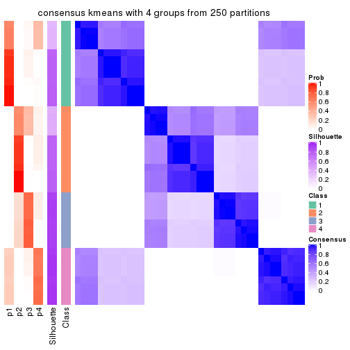</p>

</div>
<div id='tab-MAD-kmeans-consensus-heatmap-4'>
<pre><code class="r">consensus_heatmap(res, k = 5)
</code></pre>

<p></p>

</div>
<div id='tab-MAD-kmeans-consensus-heatmap-5'>
<pre><code class="r">consensus_heatmap(res, k = 6)
</code></pre>

<p></p>

</div>
</div>

Heatmaps for the membership of samples in all partitions to see how consistent they are:


<script>
$( function() {
	$( '#tabs-MAD-kmeans-membership-heatmap' ).tabs();
} );
</script>
<div id='tabs-MAD-kmeans-membership-heatmap'>
<ul>
<li><a href='#tab-MAD-kmeans-membership-heatmap-1'>k = 2</a></li>
<li><a href='#tab-MAD-kmeans-membership-heatmap-2'>k = 3</a></li>
<li><a href='#tab-MAD-kmeans-membership-heatmap-3'>k = 4</a></li>
<li><a href='#tab-MAD-kmeans-membership-heatmap-4'>k = 5</a></li>
<li><a href='#tab-MAD-kmeans-membership-heatmap-5'>k = 6</a></li>
</ul>
<div id='tab-MAD-kmeans-membership-heatmap-1'>
<pre><code class="r">membership_heatmap(res, k = 2)
</code></pre>

<p></p>

</div>
<div id='tab-MAD-kmeans-membership-heatmap-2'>
<pre><code class="r">membership_heatmap(res, k = 3)
</code></pre>

<p></p>

</div>
<div id='tab-MAD-kmeans-membership-heatmap-3'>
<pre><code class="r">membership_heatmap(res, k = 4)
</code></pre>

<p></p>

</div>
<div id='tab-MAD-kmeans-membership-heatmap-4'>
<pre><code class="r">membership_heatmap(res, k = 5)
</code></pre>

<p></p>

</div>
<div id='tab-MAD-kmeans-membership-heatmap-5'>
<pre><code class="r">membership_heatmap(res, k = 6)
</code></pre>

<p></p>

</div>
</div>

As soon as we have had the classes for columns, we can look for signatures
which are significantly different between classes which can be candidate marks
for certain classes. Following are the heatmaps for signatures.


Signature heatmaps where rows are scaled:


<script>
$( function() {
	$( '#tabs-MAD-kmeans-get-signatures' ).tabs();
} );
</script>
<div id='tabs-MAD-kmeans-get-signatures'>
<ul>
<li><a href='#tab-MAD-kmeans-get-signatures-1'>k = 2</a></li>
<li><a href='#tab-MAD-kmeans-get-signatures-2'>k = 3</a></li>
<li><a href='#tab-MAD-kmeans-get-signatures-3'>k = 4</a></li>
<li><a href='#tab-MAD-kmeans-get-signatures-4'>k = 5</a></li>
<li><a href='#tab-MAD-kmeans-get-signatures-5'>k = 6</a></li>
</ul>
<div id='tab-MAD-kmeans-get-signatures-1'>
<pre><code class="r">get_signatures(res, k = 2)
</code></pre>

<p></p>

</div>
<div id='tab-MAD-kmeans-get-signatures-2'>
<pre><code class="r">get_signatures(res, k = 3)
</code></pre>

<p></p>

</div>
<div id='tab-MAD-kmeans-get-signatures-3'>
<pre><code class="r">get_signatures(res, k = 4)
</code></pre>

<p></p>

</div>
<div id='tab-MAD-kmeans-get-signatures-4'>
<pre><code class="r">get_signatures(res, k = 5)
</code></pre>

<p></p>

</div>
<div id='tab-MAD-kmeans-get-signatures-5'>
<pre><code class="r">get_signatures(res, k = 6)
</code></pre>

<p></p>

</div>
</div>


Signature heatmaps where rows are not scaled:


<script>
$( function() {
	$( '#tabs-MAD-kmeans-get-signatures-no-scale' ).tabs();
} );
</script>
<div id='tabs-MAD-kmeans-get-signatures-no-scale'>
<ul>
<li><a href='#tab-MAD-kmeans-get-signatures-no-scale-1'>k = 2</a></li>
<li><a href='#tab-MAD-kmeans-get-signatures-no-scale-2'>k = 3</a></li>
<li><a href='#tab-MAD-kmeans-get-signatures-no-scale-3'>k = 4</a></li>
<li><a href='#tab-MAD-kmeans-get-signatures-no-scale-4'>k = 5</a></li>
<li><a href='#tab-MAD-kmeans-get-signatures-no-scale-5'>k = 6</a></li>
</ul>
<div id='tab-MAD-kmeans-get-signatures-no-scale-1'>
<pre><code class="r">get_signatures(res, k = 2, scale_rows = FALSE)
</code></pre>

<p></p>

</div>
<div id='tab-MAD-kmeans-get-signatures-no-scale-2'>
<pre><code class="r">get_signatures(res, k = 3, scale_rows = FALSE)
</code></pre>

<p></p>

</div>
<div id='tab-MAD-kmeans-get-signatures-no-scale-3'>
<pre><code class="r">get_signatures(res, k = 4, scale_rows = FALSE)
</code></pre>

<p></p>

</div>
<div id='tab-MAD-kmeans-get-signatures-no-scale-4'>
<pre><code class="r">get_signatures(res, k = 5, scale_rows = FALSE)
</code></pre>

<p></p>

</div>
<div id='tab-MAD-kmeans-get-signatures-no-scale-5'>
<pre><code class="r">get_signatures(res, k = 6, scale_rows = FALSE)
</code></pre>

<p></p>

</div>
</div>


Compare the overlap of signatures from different k:

```r
compare_signatures(res)
```


`get_signature()` returns a data frame invisibly. TO get the list of signatures, the function
call should be assigned to a variable explicitly. In following code, if `plot` argument is set
to `FALSE`, no heatmap is plotted while only the differential analysis is performed.

```r
# code only for demonstration
tb = get_signature(res, k = ..., plot = FALSE)
```

An example of the output of `tb` is:

```
#>   which_row         fdr    mean_1    mean_2 scaled_mean_1 scaled_mean_2 km
#> 1        38 0.042760348  8.373488  9.131774    -0.5533452     0.5164555  1
#> 2        40 0.018707592  7.106213  8.469186    -0.6173731     0.5762149  1
#> 3        55 0.019134737 10.221463 11.207825    -0.6159697     0.5749050  1
#> 4        59 0.006059896  5.921854  7.869574    -0.6899429     0.6439467  1
#> 5        60 0.018055526  8.928898 10.211722    -0.6204761     0.5791110  1
#> 6        98 0.009384629 15.714769 14.887706     0.6635654    -0.6193277  2
...
```

The columns in `tb` are:

1. `which_row`: row indices corresponding to the input matrix.
2. `fdr`: FDR for the differential test. 
3. `mean_x`: The mean value in group x.
4. `scaled_mean_x`: The mean value in group x after rows are scaled.
5. `km`: Row groups if k-means clustering is applied to rows.


UMAP plot which shows how samples are separated.


<script>
$( function() {
	$( '#tabs-MAD-kmeans-dimension-reduction' ).tabs();
} );
</script>
<div id='tabs-MAD-kmeans-dimension-reduction'>
<ul>
<li><a href='#tab-MAD-kmeans-dimension-reduction-1'>k = 2</a></li>
<li><a href='#tab-MAD-kmeans-dimension-reduction-2'>k = 3</a></li>
<li><a href='#tab-MAD-kmeans-dimension-reduction-3'>k = 4</a></li>
<li><a href='#tab-MAD-kmeans-dimension-reduction-4'>k = 5</a></li>
<li><a href='#tab-MAD-kmeans-dimension-reduction-5'>k = 6</a></li>
</ul>
<div id='tab-MAD-kmeans-dimension-reduction-1'>
<pre><code class="r">dimension_reduction(res, k = 2, method = &quot;UMAP&quot;)
</code></pre>

<p></p>

</div>
<div id='tab-MAD-kmeans-dimension-reduction-2'>
<pre><code class="r">dimension_reduction(res, k = 3, method = &quot;UMAP&quot;)
</code></pre>

<p></p>

</div>
<div id='tab-MAD-kmeans-dimension-reduction-3'>
<pre><code class="r">dimension_reduction(res, k = 4, method = &quot;UMAP&quot;)
</code></pre>

<p></p>

</div>
<div id='tab-MAD-kmeans-dimension-reduction-4'>
<pre><code class="r">dimension_reduction(res, k = 5, method = &quot;UMAP&quot;)
</code></pre>

<p></p>

</div>
<div id='tab-MAD-kmeans-dimension-reduction-5'>
<pre><code class="r">dimension_reduction(res, k = 6, method = &quot;UMAP&quot;)
</code></pre>

<p></p>

</div>
</div>


Following heatmap shows how subgroups are split when increasing `k`:

```r
collect_classes(res)
```


If matrix rows can be associated to genes, consider to use `GO_Enrichment(res,
...)` to perform function enrichment for the signature genes.


 

---------------------------------------------------


### MAD:skmeans**


The object with results only for a single top-value method and a single partition method 
can be extracted as:

```r
res = res_list["MAD", "skmeans"]
# you can also extract it by
# res = res_list["MAD:skmeans"]
```

A summary of `res` and all the functions that can be applied to it:

```r
res
```

```
#> A 'ConsensusPartition' object with k = 2, 3, 4, 5, 6.
#>   On a matrix with 15185 rows and 159 columns.
#>   Top rows (1000, 2000, 3000, 4000, 5000) are extracted by 'MAD' method.
#>   Subgroups are detected by 'skmeans' method.
#>   Performed in total 1250 partitions by row resampling.
#>   Best k for subgroups seems to be 4.
#> 
#> Following methods can be applied to this 'ConsensusPartition' object:
#>  [1] "cola_report"             "collect_classes"         "collect_plots"          
#>  [4] "collect_stats"           "colnames"                "compare_signatures"     
#>  [7] "consensus_heatmap"       "dimension_reduction"     "functional_enrichment"  
#> [10] "get_anno_col"            "get_anno"                "get_classes"            
#> [13] "get_consensus"           "get_matrix"              "get_membership"         
#> [16] "get_param"               "get_signatures"          "get_stats"              
#> [19] "is_best_k"               "is_stable_k"             "membership_heatmap"     
#> [22] "ncol"                    "nrow"                    "plot_ecdf"              
#> [25] "rownames"                "select_partition_number" "show"                   
#> [28] "suggest_best_k"          "test_to_known_factors"
```

`collect_plots()` function collects all the plots made from `res` for all `k` (number of partitions)
into one single page to provide an easy and fast comparison between different `k`.

```r
collect_plots(res)
```


The plots are:

- The first row: a plot of the ECDF (Empirical cumulative distribution
  function) curves of the consensus matrix for each `k` and the heatmap of
  predicted classes for each `k`.
- The second row: heatmaps of the consensus matrix for each `k`.
- The third row: heatmaps of the membership matrix for each `k`.
- The fouth row: heatmaps of the signatures for each `k`.

All the plots in panels can be made by individual functions and they are
plotted later in this section.

`select_partition_number()` produces several plots showing different
statistics for choosing "optimized" `k`. There are following statistics:

- ECDF curves of the consensus matrix for each `k`;
- 1-PAC. [The PAC
  score](https://en.wikipedia.org/wiki/Consensus_clustering#Over-interpretation_potential_of_consensus_clustering)
  measures the proportion of the ambiguous subgrouping.
- Mean silhouette score.
- Concordance. The mean probability of fiting the consensus class ids in all
  partitions.
- Area increased. Denote $A_k$ as the area under the ECDF curve for current
  `k`, the area increased is defined as $A_k - A_{k-1}$.
- Rand index. The percent of pairs of samples that are both in a same cluster
  or both are not in a same cluster in the partition of k and k-1.
- Jaccard index. The ratio of pairs of samples are both in a same cluster in
  the partition of k and k-1 and the pairs of samples are both in a same
  cluster in the partition k or k-1.

The detailed explanations of these statistics can be found in [the cola
vignette](http://bioconductor.org/packages/devel/bioc/vignettes/cola/inst/doc/cola.html#toc_13).

Generally speaking, lower PAC score, higher mean silhouette score or higher
concordance corresponds to better partition. Rand index and Jaccard index
measure how similar the current partition is compared to partition with `k-1`.
If they are too similar, we won't accept `k` is better than `k-1`.

```r
select_partition_number(res)
```


The numeric values for all these statistics can be obtained by `get_stats()`.

```r
get_stats(res)
```

```
#>   k 1-PAC mean_silhouette concordance area_increased  Rand Jaccard
#> 2 2 1.000           1.000       1.000         0.5036 0.497   0.497
#> 3 3 1.000           0.992       0.984         0.2353 0.882   0.762
#> 4 4 1.000           0.991       0.992         0.1951 0.878   0.677
#> 5 5 0.838           0.373       0.623         0.0548 0.837   0.486
#> 6 6 0.859           0.888       0.907         0.0501 0.838   0.415
```

`suggest_best_k()` suggests the best $k$ based on these statistics. The rules are as follows:

- All $k$ with Jaccard index larger than 0.95 are removed because the increase of
  the partition number does not provides enough extra information. If all $k$ are removed,
  the best $k$ is assigned by `NA`.
- For $k$ with 1-PAC larger than 0.9, the maximal $k$ is taken as the "best k". Other $k$ is called "optional k".
- If it does not fit the second rule. The $k$ with the highest vote of highest
  1-PAC, mean silhouette and concordance is taken as the "best k".

```r
suggest_best_k(res)
```

```
#> [1] 4
#> attr(,"optional")
#> [1] 2 3
```

There is also optional best $k$ = 2 3 that is worth to check.

Following shows the table of the partitions (You need to click the **show/hide
code output** link to see it). The membership matrix (columns with name `p*`)
is inferred by
[`clue::cl_consensus()`](https://www.rdocumentation.org/link/cl_consensus?package=clue)
function with the `SE` method. Basically the value in the membership matrix
represents the probability to belong to a certain group. The finall class
label for an item is determined with the group with highest probability it
belongs to.

In `get_classes()` function, the entropy is calculated from the membership
matrix and the silhouette score is calculated from the consensus matrix.


<script>
$( function() {
	$( '#tabs-MAD-skmeans-get-classes' ).tabs();
} );
</script>
<div id='tabs-MAD-skmeans-get-classes'>
<ul>
<li><a href='#tab-MAD-skmeans-get-classes-1'>k = 2</a></li>
<li><a href='#tab-MAD-skmeans-get-classes-2'>k = 3</a></li>
<li><a href='#tab-MAD-skmeans-get-classes-3'>k = 4</a></li>
<li><a href='#tab-MAD-skmeans-get-classes-4'>k = 5</a></li>
<li><a href='#tab-MAD-skmeans-get-classes-5'>k = 6</a></li>
</ul>

<div id='tab-MAD-skmeans-get-classes-1'>
<p><a id='tab-MAD-skmeans-get-classes-1-a' style='color:#0366d6' href='#'>show/hide code output</a></p>
<pre><code class="r">cbind(get_classes(res, k = 2), get_membership(res, k = 2))
</code></pre>

<pre><code>#&gt;            class entropy silhouette p1 p2
#&gt; SRR1706767     1       0          1  1  0
#&gt; SRR1706768     1       0          1  1  0
#&gt; SRR1706769     1       0          1  1  0
#&gt; SRR1706770     1       0          1  1  0
#&gt; SRR1706771     1       0          1  1  0
#&gt; SRR1706772     1       0          1  1  0
#&gt; SRR1706773     1       0          1  1  0
#&gt; SRR1706774     1       0          1  1  0
#&gt; SRR1706775     1       0          1  1  0
#&gt; SRR1706776     1       0          1  1  0
#&gt; SRR1706777     1       0          1  1  0
#&gt; SRR1706778     1       0          1  1  0
#&gt; SRR1706779     1       0          1  1  0
#&gt; SRR1706780     1       0          1  1  0
#&gt; SRR1706781     1       0          1  1  0
#&gt; SRR1706782     1       0          1  1  0
#&gt; SRR1706783     1       0          1  1  0
#&gt; SRR1706784     1       0          1  1  0
#&gt; SRR1706785     1       0          1  1  0
#&gt; SRR1706786     1       0          1  1  0
#&gt; SRR1706787     1       0          1  1  0
#&gt; SRR1706788     1       0          1  1  0
#&gt; SRR1706789     1       0          1  1  0
#&gt; SRR1706790     1       0          1  1  0
#&gt; SRR1706791     1       0          1  1  0
#&gt; SRR1706792     1       0          1  1  0
#&gt; SRR1706793     1       0          1  1  0
#&gt; SRR1706794     1       0          1  1  0
#&gt; SRR1706795     1       0          1  1  0
#&gt; SRR1706796     1       0          1  1  0
#&gt; SRR1706797     1       0          1  1  0
#&gt; SRR1706798     1       0          1  1  0
#&gt; SRR1706799     1       0          1  1  0
#&gt; SRR1706800     1       0          1  1  0
#&gt; SRR1706801     1       0          1  1  0
#&gt; SRR1706802     1       0          1  1  0
#&gt; SRR1706803     1       0          1  1  0
#&gt; SRR1706804     1       0          1  1  0
#&gt; SRR1706805     1       0          1  1  0
#&gt; SRR1706806     1       0          1  1  0
#&gt; SRR1706811     1       0          1  1  0
#&gt; SRR1706812     1       0          1  1  0
#&gt; SRR1706813     1       0          1  1  0
#&gt; SRR1706814     1       0          1  1  0
#&gt; SRR1706807     1       0          1  1  0
#&gt; SRR1706808     1       0          1  1  0
#&gt; SRR1706809     1       0          1  1  0
#&gt; SRR1706810     1       0          1  1  0
#&gt; SRR1706815     1       0          1  1  0
#&gt; SRR1706816     1       0          1  1  0
#&gt; SRR1706817     1       0          1  1  0
#&gt; SRR1706818     1       0          1  1  0
#&gt; SRR1706819     1       0          1  1  0
#&gt; SRR1706820     1       0          1  1  0
#&gt; SRR1706821     1       0          1  1  0
#&gt; SRR1706822     1       0          1  1  0
#&gt; SRR1706823     1       0          1  1  0
#&gt; SRR1706824     1       0          1  1  0
#&gt; SRR1706825     1       0          1  1  0
#&gt; SRR1706826     1       0          1  1  0
#&gt; SRR1706827     1       0          1  1  0
#&gt; SRR1706828     1       0          1  1  0
#&gt; SRR1706829     1       0          1  1  0
#&gt; SRR1706830     1       0          1  1  0
#&gt; SRR1706835     1       0          1  1  0
#&gt; SRR1706836     1       0          1  1  0
#&gt; SRR1706837     1       0          1  1  0
#&gt; SRR1706838     1       0          1  1  0
#&gt; SRR1706831     1       0          1  1  0
#&gt; SRR1706832     1       0          1  1  0
#&gt; SRR1706833     1       0          1  1  0
#&gt; SRR1706834     1       0          1  1  0
#&gt; SRR1706839     1       0          1  1  0
#&gt; SRR1706840     1       0          1  1  0
#&gt; SRR1706841     1       0          1  1  0
#&gt; SRR1706842     1       0          1  1  0
#&gt; SRR1706847     2       0          1  0  1
#&gt; SRR1706848     2       0          1  0  1
#&gt; SRR1706849     2       0          1  0  1
#&gt; SRR1706850     2       0          1  0  1
#&gt; SRR1706843     1       0          1  1  0
#&gt; SRR1706844     1       0          1  1  0
#&gt; SRR1706845     1       0          1  1  0
#&gt; SRR1706846     1       0          1  1  0
#&gt; SRR1706851     2       0          1  0  1
#&gt; SRR1706852     2       0          1  0  1
#&gt; SRR1706853     2       0          1  0  1
#&gt; SRR1706854     2       0          1  0  1
#&gt; SRR1706855     2       0          1  0  1
#&gt; SRR1706856     2       0          1  0  1
#&gt; SRR1706857     2       0          1  0  1
#&gt; SRR1706858     2       0          1  0  1
#&gt; SRR1706859     2       0          1  0  1
#&gt; SRR1706860     2       0          1  0  1
#&gt; SRR1706861     2       0          1  0  1
#&gt; SRR1706862     2       0          1  0  1
#&gt; SRR1706867     2       0          1  0  1
#&gt; SRR1706869     2       0          1  0  1
#&gt; SRR1706870     2       0          1  0  1
#&gt; SRR1706863     2       0          1  0  1
#&gt; SRR1706864     2       0          1  0  1
#&gt; SRR1706865     2       0          1  0  1
#&gt; SRR1706866     2       0          1  0  1
#&gt; SRR1706871     2       0          1  0  1
#&gt; SRR1706872     2       0          1  0  1
#&gt; SRR1706873     2       0          1  0  1
#&gt; SRR1706874     2       0          1  0  1
#&gt; SRR1706879     2       0          1  0  1
#&gt; SRR1706880     2       0          1  0  1
#&gt; SRR1706881     2       0          1  0  1
#&gt; SRR1706882     2       0          1  0  1
#&gt; SRR1706883     2       0          1  0  1
#&gt; SRR1706884     2       0          1  0  1
#&gt; SRR1706885     2       0          1  0  1
#&gt; SRR1706886     2       0          1  0  1
#&gt; SRR1706875     2       0          1  0  1
#&gt; SRR1706876     2       0          1  0  1
#&gt; SRR1706877     2       0          1  0  1
#&gt; SRR1706878     2       0          1  0  1
#&gt; SRR1706887     2       0          1  0  1
#&gt; SRR1706888     2       0          1  0  1
#&gt; SRR1706889     2       0          1  0  1
#&gt; SRR1706890     2       0          1  0  1
#&gt; SRR1706891     2       0          1  0  1
#&gt; SRR1706892     2       0          1  0  1
#&gt; SRR1706893     2       0          1  0  1
#&gt; SRR1706894     2       0          1  0  1
#&gt; SRR1706895     2       0          1  0  1
#&gt; SRR1706896     2       0          1  0  1
#&gt; SRR1706897     2       0          1  0  1
#&gt; SRR1706898     2       0          1  0  1
#&gt; SRR1706899     2       0          1  0  1
#&gt; SRR1706900     2       0          1  0  1
#&gt; SRR1706901     2       0          1  0  1
#&gt; SRR1706902     2       0          1  0  1
#&gt; SRR1706907     2       0          1  0  1
#&gt; SRR1706908     2       0          1  0  1
#&gt; SRR1706909     2       0          1  0  1
#&gt; SRR1706910     2       0          1  0  1
#&gt; SRR1706903     2       0          1  0  1
#&gt; SRR1706904     2       0          1  0  1
#&gt; SRR1706905     2       0          1  0  1
#&gt; SRR1706906     2       0          1  0  1
#&gt; SRR1706911     2       0          1  0  1
#&gt; SRR1706912     2       0          1  0  1
#&gt; SRR1706913     2       0          1  0  1
#&gt; SRR1706914     2       0          1  0  1
#&gt; SRR1706919     2       0          1  0  1
#&gt; SRR1706920     2       0          1  0  1
#&gt; SRR1706921     2       0          1  0  1
#&gt; SRR1706922     2       0          1  0  1
#&gt; SRR1706915     2       0          1  0  1
#&gt; SRR1706916     2       0          1  0  1
#&gt; SRR1706917     2       0          1  0  1
#&gt; SRR1706918     2       0          1  0  1
#&gt; SRR1706923     2       0          1  0  1
#&gt; SRR1706924     2       0          1  0  1
#&gt; SRR1706925     2       0          1  0  1
#&gt; SRR1706926     2       0          1  0  1
</code></pre>

<script>
$('#tab-MAD-skmeans-get-classes-1-a').parent().next().next().hide();
$('#tab-MAD-skmeans-get-classes-1-a').click(function(){
  $('#tab-MAD-skmeans-get-classes-1-a').parent().next().next().toggle();
  return(false);
});
</script>
</div>

<div id='tab-MAD-skmeans-get-classes-2'>
<p><a id='tab-MAD-skmeans-get-classes-2-a' style='color:#0366d6' href='#'>show/hide code output</a></p>
<pre><code class="r">cbind(get_classes(res, k = 3), get_membership(res, k = 3))
</code></pre>

<pre><code>#&gt;            class entropy silhouette   p1   p2   p3
#&gt; SRR1706767     1   0.000      0.986 1.00 0.00 0.00
#&gt; SRR1706768     1   0.000      0.986 1.00 0.00 0.00
#&gt; SRR1706769     1   0.000      0.986 1.00 0.00 0.00
#&gt; SRR1706770     1   0.000      0.986 1.00 0.00 0.00
#&gt; SRR1706771     1   0.000      0.986 1.00 0.00 0.00
#&gt; SRR1706772     1   0.000      0.986 1.00 0.00 0.00
#&gt; SRR1706773     1   0.000      0.986 1.00 0.00 0.00
#&gt; SRR1706774     1   0.000      0.986 1.00 0.00 0.00
#&gt; SRR1706775     1   0.000      0.986 1.00 0.00 0.00
#&gt; SRR1706776     1   0.000      0.986 1.00 0.00 0.00
#&gt; SRR1706777     1   0.000      0.986 1.00 0.00 0.00
#&gt; SRR1706778     1   0.000      0.986 1.00 0.00 0.00
#&gt; SRR1706779     1   0.153      0.979 0.96 0.00 0.04
#&gt; SRR1706780     1   0.153      0.979 0.96 0.00 0.04
#&gt; SRR1706781     1   0.153      0.979 0.96 0.00 0.04
#&gt; SRR1706782     1   0.153      0.979 0.96 0.00 0.04
#&gt; SRR1706783     1   0.153      0.979 0.96 0.00 0.04
#&gt; SRR1706784     1   0.153      0.979 0.96 0.00 0.04
#&gt; SRR1706785     1   0.153      0.979 0.96 0.00 0.04
#&gt; SRR1706786     1   0.153      0.979 0.96 0.00 0.04
#&gt; SRR1706787     1   0.000      0.986 1.00 0.00 0.00
#&gt; SRR1706788     1   0.000      0.986 1.00 0.00 0.00
#&gt; SRR1706789     1   0.000      0.986 1.00 0.00 0.00
#&gt; SRR1706790     1   0.000      0.986 1.00 0.00 0.00
#&gt; SRR1706791     1   0.000      0.986 1.00 0.00 0.00
#&gt; SRR1706792     1   0.000      0.986 1.00 0.00 0.00
#&gt; SRR1706793     1   0.000      0.986 1.00 0.00 0.00
#&gt; SRR1706794     1   0.000      0.986 1.00 0.00 0.00
#&gt; SRR1706795     1   0.000      0.986 1.00 0.00 0.00
#&gt; SRR1706796     1   0.000      0.986 1.00 0.00 0.00
#&gt; SRR1706797     1   0.000      0.986 1.00 0.00 0.00
#&gt; SRR1706798     1   0.000      0.986 1.00 0.00 0.00
#&gt; SRR1706799     1   0.153      0.979 0.96 0.00 0.04
#&gt; SRR1706800     1   0.153      0.979 0.96 0.00 0.04
#&gt; SRR1706801     1   0.153      0.979 0.96 0.00 0.04
#&gt; SRR1706802     1   0.153      0.979 0.96 0.00 0.04
#&gt; SRR1706803     1   0.153      0.979 0.96 0.00 0.04
#&gt; SRR1706804     1   0.153      0.979 0.96 0.00 0.04
#&gt; SRR1706805     1   0.153      0.979 0.96 0.00 0.04
#&gt; SRR1706806     1   0.153      0.979 0.96 0.00 0.04
#&gt; SRR1706811     1   0.000      0.986 1.00 0.00 0.00
#&gt; SRR1706812     1   0.000      0.986 1.00 0.00 0.00
#&gt; SRR1706813     1   0.000      0.986 1.00 0.00 0.00
#&gt; SRR1706814     1   0.000      0.986 1.00 0.00 0.00
#&gt; SRR1706807     1   0.000      0.986 1.00 0.00 0.00
#&gt; SRR1706808     1   0.000      0.986 1.00 0.00 0.00
#&gt; SRR1706809     1   0.000      0.986 1.00 0.00 0.00
#&gt; SRR1706810     1   0.000      0.986 1.00 0.00 0.00
#&gt; SRR1706815     1   0.000      0.986 1.00 0.00 0.00
#&gt; SRR1706816     1   0.000      0.986 1.00 0.00 0.00
#&gt; SRR1706817     1   0.000      0.986 1.00 0.00 0.00
#&gt; SRR1706818     1   0.000      0.986 1.00 0.00 0.00
#&gt; SRR1706819     1   0.153      0.979 0.96 0.00 0.04
#&gt; SRR1706820     1   0.153      0.979 0.96 0.00 0.04
#&gt; SRR1706821     1   0.153      0.979 0.96 0.00 0.04
#&gt; SRR1706822     1   0.153      0.979 0.96 0.00 0.04
#&gt; SRR1706823     1   0.153      0.979 0.96 0.00 0.04
#&gt; SRR1706824     1   0.153      0.979 0.96 0.00 0.04
#&gt; SRR1706825     1   0.153      0.979 0.96 0.00 0.04
#&gt; SRR1706826     1   0.153      0.979 0.96 0.00 0.04
#&gt; SRR1706827     1   0.000      0.986 1.00 0.00 0.00
#&gt; SRR1706828     1   0.000      0.986 1.00 0.00 0.00
#&gt; SRR1706829     1   0.000      0.986 1.00 0.00 0.00
#&gt; SRR1706830     1   0.000      0.986 1.00 0.00 0.00
#&gt; SRR1706835     1   0.000      0.986 1.00 0.00 0.00
#&gt; SRR1706836     1   0.000      0.986 1.00 0.00 0.00
#&gt; SRR1706837     1   0.000      0.986 1.00 0.00 0.00
#&gt; SRR1706838     1   0.000      0.986 1.00 0.00 0.00
#&gt; SRR1706831     1   0.000      0.986 1.00 0.00 0.00
#&gt; SRR1706832     1   0.000      0.986 1.00 0.00 0.00
#&gt; SRR1706833     1   0.000      0.986 1.00 0.00 0.00
#&gt; SRR1706834     1   0.000      0.986 1.00 0.00 0.00
#&gt; SRR1706839     1   0.153      0.979 0.96 0.00 0.04
#&gt; SRR1706840     1   0.153      0.979 0.96 0.00 0.04
#&gt; SRR1706841     1   0.153      0.979 0.96 0.00 0.04
#&gt; SRR1706842     1   0.153      0.979 0.96 0.00 0.04
#&gt; SRR1706847     3   0.153      1.000 0.00 0.04 0.96
#&gt; SRR1706848     3   0.153      1.000 0.00 0.04 0.96
#&gt; SRR1706849     3   0.153      1.000 0.00 0.04 0.96
#&gt; SRR1706850     3   0.153      1.000 0.00 0.04 0.96
#&gt; SRR1706843     1   0.153      0.979 0.96 0.00 0.04
#&gt; SRR1706844     1   0.153      0.979 0.96 0.00 0.04
#&gt; SRR1706845     1   0.153      0.979 0.96 0.00 0.04
#&gt; SRR1706846     1   0.153      0.979 0.96 0.00 0.04
#&gt; SRR1706851     3   0.153      1.000 0.00 0.04 0.96
#&gt; SRR1706852     3   0.153      1.000 0.00 0.04 0.96
#&gt; SRR1706853     3   0.153      1.000 0.00 0.04 0.96
#&gt; SRR1706854     3   0.153      1.000 0.00 0.04 0.96
#&gt; SRR1706855     2   0.000      1.000 0.00 1.00 0.00
#&gt; SRR1706856     2   0.000      1.000 0.00 1.00 0.00
#&gt; SRR1706857     2   0.000      1.000 0.00 1.00 0.00
#&gt; SRR1706858     2   0.000      1.000 0.00 1.00 0.00
#&gt; SRR1706859     2   0.000      1.000 0.00 1.00 0.00
#&gt; SRR1706860     2   0.000      1.000 0.00 1.00 0.00
#&gt; SRR1706861     2   0.000      1.000 0.00 1.00 0.00
#&gt; SRR1706862     2   0.000      1.000 0.00 1.00 0.00
#&gt; SRR1706867     3   0.153      1.000 0.00 0.04 0.96
#&gt; SRR1706869     3   0.153      1.000 0.00 0.04 0.96
#&gt; SRR1706870     3   0.153      1.000 0.00 0.04 0.96
#&gt; SRR1706863     2   0.000      1.000 0.00 1.00 0.00
#&gt; SRR1706864     2   0.000      1.000 0.00 1.00 0.00
#&gt; SRR1706865     2   0.000      1.000 0.00 1.00 0.00
#&gt; SRR1706866     2   0.000      1.000 0.00 1.00 0.00
#&gt; SRR1706871     3   0.153      1.000 0.00 0.04 0.96
#&gt; SRR1706872     3   0.153      1.000 0.00 0.04 0.96
#&gt; SRR1706873     3   0.153      1.000 0.00 0.04 0.96
#&gt; SRR1706874     3   0.153      1.000 0.00 0.04 0.96
#&gt; SRR1706879     2   0.000      1.000 0.00 1.00 0.00
#&gt; SRR1706880     2   0.000      1.000 0.00 1.00 0.00
#&gt; SRR1706881     2   0.000      1.000 0.00 1.00 0.00
#&gt; SRR1706882     2   0.000      1.000 0.00 1.00 0.00
#&gt; SRR1706883     2   0.000      1.000 0.00 1.00 0.00
#&gt; SRR1706884     2   0.000      1.000 0.00 1.00 0.00
#&gt; SRR1706885     2   0.000      1.000 0.00 1.00 0.00
#&gt; SRR1706886     2   0.000      1.000 0.00 1.00 0.00
#&gt; SRR1706875     2   0.000      1.000 0.00 1.00 0.00
#&gt; SRR1706876     2   0.000      1.000 0.00 1.00 0.00
#&gt; SRR1706877     2   0.000      1.000 0.00 1.00 0.00
#&gt; SRR1706878     2   0.000      1.000 0.00 1.00 0.00
#&gt; SRR1706887     3   0.153      1.000 0.00 0.04 0.96
#&gt; SRR1706888     3   0.153      1.000 0.00 0.04 0.96
#&gt; SRR1706889     3   0.153      1.000 0.00 0.04 0.96
#&gt; SRR1706890     3   0.153      1.000 0.00 0.04 0.96
#&gt; SRR1706891     3   0.153      1.000 0.00 0.04 0.96
#&gt; SRR1706892     3   0.153      1.000 0.00 0.04 0.96
#&gt; SRR1706893     3   0.153      1.000 0.00 0.04 0.96
#&gt; SRR1706894     3   0.153      1.000 0.00 0.04 0.96
#&gt; SRR1706895     2   0.000      1.000 0.00 1.00 0.00
#&gt; SRR1706896     2   0.000      1.000 0.00 1.00 0.00
#&gt; SRR1706897     2   0.000      1.000 0.00 1.00 0.00
#&gt; SRR1706898     2   0.000      1.000 0.00 1.00 0.00
#&gt; SRR1706899     2   0.000      1.000 0.00 1.00 0.00
#&gt; SRR1706900     2   0.000      1.000 0.00 1.00 0.00
#&gt; SRR1706901     2   0.000      1.000 0.00 1.00 0.00
#&gt; SRR1706902     2   0.000      1.000 0.00 1.00 0.00
#&gt; SRR1706907     3   0.153      1.000 0.00 0.04 0.96
#&gt; SRR1706908     3   0.153      1.000 0.00 0.04 0.96
#&gt; SRR1706909     3   0.153      1.000 0.00 0.04 0.96
#&gt; SRR1706910     3   0.153      1.000 0.00 0.04 0.96
#&gt; SRR1706903     2   0.000      1.000 0.00 1.00 0.00
#&gt; SRR1706904     2   0.000      1.000 0.00 1.00 0.00
#&gt; SRR1706905     2   0.000      1.000 0.00 1.00 0.00
#&gt; SRR1706906     2   0.000      1.000 0.00 1.00 0.00
#&gt; SRR1706911     3   0.153      1.000 0.00 0.04 0.96
#&gt; SRR1706912     3   0.153      1.000 0.00 0.04 0.96
#&gt; SRR1706913     3   0.153      1.000 0.00 0.04 0.96
#&gt; SRR1706914     3   0.153      1.000 0.00 0.04 0.96
#&gt; SRR1706919     2   0.000      1.000 0.00 1.00 0.00
#&gt; SRR1706920     2   0.000      1.000 0.00 1.00 0.00
#&gt; SRR1706921     2   0.000      1.000 0.00 1.00 0.00
#&gt; SRR1706922     2   0.000      1.000 0.00 1.00 0.00
#&gt; SRR1706915     2   0.000      1.000 0.00 1.00 0.00
#&gt; SRR1706916     2   0.000      1.000 0.00 1.00 0.00
#&gt; SRR1706917     2   0.000      1.000 0.00 1.00 0.00
#&gt; SRR1706918     2   0.000      1.000 0.00 1.00 0.00
#&gt; SRR1706923     2   0.000      1.000 0.00 1.00 0.00
#&gt; SRR1706924     2   0.000      1.000 0.00 1.00 0.00
#&gt; SRR1706925     2   0.000      1.000 0.00 1.00 0.00
#&gt; SRR1706926     2   0.000      1.000 0.00 1.00 0.00
</code></pre>

<script>
$('#tab-MAD-skmeans-get-classes-2-a').parent().next().next().hide();
$('#tab-MAD-skmeans-get-classes-2-a').click(function(){
  $('#tab-MAD-skmeans-get-classes-2-a').parent().next().next().toggle();
  return(false);
});
</script>
</div>

<div id='tab-MAD-skmeans-get-classes-3'>
<p><a id='tab-MAD-skmeans-get-classes-3-a' style='color:#0366d6' href='#'>show/hide code output</a></p>
<pre><code class="r">cbind(get_classes(res, k = 4), get_membership(res, k = 4))
</code></pre>

<pre><code>#&gt;            class entropy silhouette    p1    p2    p3    p4
#&gt; SRR1706767     4  0.0000      0.983 0.000 0.000 0.000 1.000
#&gt; SRR1706768     4  0.0000      0.983 0.000 0.000 0.000 1.000
#&gt; SRR1706769     4  0.0000      0.983 0.000 0.000 0.000 1.000
#&gt; SRR1706770     4  0.0000      0.983 0.000 0.000 0.000 1.000
#&gt; SRR1706771     4  0.0000      0.983 0.000 0.000 0.000 1.000
#&gt; SRR1706772     4  0.0000      0.983 0.000 0.000 0.000 1.000
#&gt; SRR1706773     4  0.0000      0.983 0.000 0.000 0.000 1.000
#&gt; SRR1706774     4  0.0000      0.983 0.000 0.000 0.000 1.000
#&gt; SRR1706775     4  0.1389      0.965 0.048 0.000 0.000 0.952
#&gt; SRR1706776     4  0.1389      0.965 0.048 0.000 0.000 0.952
#&gt; SRR1706777     4  0.1389      0.965 0.048 0.000 0.000 0.952
#&gt; SRR1706778     4  0.1389      0.965 0.048 0.000 0.000 0.952
#&gt; SRR1706779     1  0.0336      1.000 0.992 0.000 0.000 0.008
#&gt; SRR1706780     1  0.0336      1.000 0.992 0.000 0.000 0.008
#&gt; SRR1706781     1  0.0336      1.000 0.992 0.000 0.000 0.008
#&gt; SRR1706782     1  0.0336      1.000 0.992 0.000 0.000 0.008
#&gt; SRR1706783     1  0.0336      1.000 0.992 0.000 0.000 0.008
#&gt; SRR1706784     1  0.0336      1.000 0.992 0.000 0.000 0.008
#&gt; SRR1706785     1  0.0336      1.000 0.992 0.000 0.000 0.008
#&gt; SRR1706786     1  0.0336      1.000 0.992 0.000 0.000 0.008
#&gt; SRR1706787     4  0.0000      0.983 0.000 0.000 0.000 1.000
#&gt; SRR1706788     4  0.0000      0.983 0.000 0.000 0.000 1.000
#&gt; SRR1706789     4  0.0000      0.983 0.000 0.000 0.000 1.000
#&gt; SRR1706790     4  0.0000      0.983 0.000 0.000 0.000 1.000
#&gt; SRR1706791     4  0.0000      0.983 0.000 0.000 0.000 1.000
#&gt; SRR1706792     4  0.0000      0.983 0.000 0.000 0.000 1.000
#&gt; SRR1706793     4  0.0000      0.983 0.000 0.000 0.000 1.000
#&gt; SRR1706794     4  0.0000      0.983 0.000 0.000 0.000 1.000
#&gt; SRR1706795     4  0.1389      0.965 0.048 0.000 0.000 0.952
#&gt; SRR1706796     4  0.1389      0.965 0.048 0.000 0.000 0.952
#&gt; SRR1706797     4  0.1389      0.965 0.048 0.000 0.000 0.952
#&gt; SRR1706798     4  0.1389      0.965 0.048 0.000 0.000 0.952
#&gt; SRR1706799     1  0.0336      1.000 0.992 0.000 0.000 0.008
#&gt; SRR1706800     1  0.0336      1.000 0.992 0.000 0.000 0.008
#&gt; SRR1706801     1  0.0336      1.000 0.992 0.000 0.000 0.008
#&gt; SRR1706802     1  0.0336      1.000 0.992 0.000 0.000 0.008
#&gt; SRR1706803     1  0.0336      1.000 0.992 0.000 0.000 0.008
#&gt; SRR1706804     1  0.0336      1.000 0.992 0.000 0.000 0.008
#&gt; SRR1706805     1  0.0336      1.000 0.992 0.000 0.000 0.008
#&gt; SRR1706806     1  0.0336      1.000 0.992 0.000 0.000 0.008
#&gt; SRR1706811     4  0.0000      0.983 0.000 0.000 0.000 1.000
#&gt; SRR1706812     4  0.0000      0.983 0.000 0.000 0.000 1.000
#&gt; SRR1706813     4  0.0000      0.983 0.000 0.000 0.000 1.000
#&gt; SRR1706814     4  0.0000      0.983 0.000 0.000 0.000 1.000
#&gt; SRR1706807     4  0.0000      0.983 0.000 0.000 0.000 1.000
#&gt; SRR1706808     4  0.0000      0.983 0.000 0.000 0.000 1.000
#&gt; SRR1706809     4  0.0000      0.983 0.000 0.000 0.000 1.000
#&gt; SRR1706810     4  0.0000      0.983 0.000 0.000 0.000 1.000
#&gt; SRR1706815     4  0.1389      0.965 0.048 0.000 0.000 0.952
#&gt; SRR1706816     4  0.1389      0.965 0.048 0.000 0.000 0.952
#&gt; SRR1706817     4  0.1389      0.965 0.048 0.000 0.000 0.952
#&gt; SRR1706818     4  0.1389      0.965 0.048 0.000 0.000 0.952
#&gt; SRR1706819     1  0.0336      1.000 0.992 0.000 0.000 0.008
#&gt; SRR1706820     1  0.0336      1.000 0.992 0.000 0.000 0.008
#&gt; SRR1706821     1  0.0336      1.000 0.992 0.000 0.000 0.008
#&gt; SRR1706822     1  0.0336      1.000 0.992 0.000 0.000 0.008
#&gt; SRR1706823     1  0.0336      1.000 0.992 0.000 0.000 0.008
#&gt; SRR1706824     1  0.0336      1.000 0.992 0.000 0.000 0.008
#&gt; SRR1706825     1  0.0336      1.000 0.992 0.000 0.000 0.008
#&gt; SRR1706826     1  0.0336      1.000 0.992 0.000 0.000 0.008
#&gt; SRR1706827     4  0.0000      0.983 0.000 0.000 0.000 1.000
#&gt; SRR1706828     4  0.0000      0.983 0.000 0.000 0.000 1.000
#&gt; SRR1706829     4  0.0000      0.983 0.000 0.000 0.000 1.000
#&gt; SRR1706830     4  0.0000      0.983 0.000 0.000 0.000 1.000
#&gt; SRR1706835     4  0.1389      0.965 0.048 0.000 0.000 0.952
#&gt; SRR1706836     4  0.1389      0.965 0.048 0.000 0.000 0.952
#&gt; SRR1706837     4  0.1389      0.965 0.048 0.000 0.000 0.952
#&gt; SRR1706838     4  0.1389      0.965 0.048 0.000 0.000 0.952
#&gt; SRR1706831     4  0.0000      0.983 0.000 0.000 0.000 1.000
#&gt; SRR1706832     4  0.0000      0.983 0.000 0.000 0.000 1.000
#&gt; SRR1706833     4  0.0000      0.983 0.000 0.000 0.000 1.000
#&gt; SRR1706834     4  0.0000      0.983 0.000 0.000 0.000 1.000
#&gt; SRR1706839     1  0.0336      1.000 0.992 0.000 0.000 0.008
#&gt; SRR1706840     1  0.0336      1.000 0.992 0.000 0.000 0.008
#&gt; SRR1706841     1  0.0336      1.000 0.992 0.000 0.000 0.008
#&gt; SRR1706842     1  0.0336      1.000 0.992 0.000 0.000 0.008
#&gt; SRR1706847     3  0.0336      0.996 0.008 0.000 0.992 0.000
#&gt; SRR1706848     3  0.0336      0.996 0.008 0.000 0.992 0.000
#&gt; SRR1706849     3  0.0336      0.996 0.008 0.000 0.992 0.000
#&gt; SRR1706850     3  0.0336      0.996 0.008 0.000 0.992 0.000
#&gt; SRR1706843     1  0.0336      1.000 0.992 0.000 0.000 0.008
#&gt; SRR1706844     1  0.0336      1.000 0.992 0.000 0.000 0.008
#&gt; SRR1706845     1  0.0336      1.000 0.992 0.000 0.000 0.008
#&gt; SRR1706846     1  0.0336      1.000 0.992 0.000 0.000 0.008
#&gt; SRR1706851     3  0.0000      0.997 0.000 0.000 1.000 0.000
#&gt; SRR1706852     3  0.0000      0.997 0.000 0.000 1.000 0.000
#&gt; SRR1706853     3  0.0000      0.997 0.000 0.000 1.000 0.000
#&gt; SRR1706854     3  0.0000      0.997 0.000 0.000 1.000 0.000
#&gt; SRR1706855     2  0.0336      0.995 0.000 0.992 0.008 0.000
#&gt; SRR1706856     2  0.0336      0.995 0.000 0.992 0.008 0.000
#&gt; SRR1706857     2  0.0336      0.995 0.000 0.992 0.008 0.000
#&gt; SRR1706858     2  0.0336      0.995 0.000 0.992 0.008 0.000
#&gt; SRR1706859     2  0.0000      0.998 0.000 1.000 0.000 0.000
#&gt; SRR1706860     2  0.0000      0.998 0.000 1.000 0.000 0.000
#&gt; SRR1706861     2  0.0000      0.998 0.000 1.000 0.000 0.000
#&gt; SRR1706862     2  0.0000      0.998 0.000 1.000 0.000 0.000
#&gt; SRR1706867     3  0.0336      0.996 0.008 0.000 0.992 0.000
#&gt; SRR1706869     3  0.0336      0.996 0.008 0.000 0.992 0.000
#&gt; SRR1706870     3  0.0336      0.996 0.008 0.000 0.992 0.000
#&gt; SRR1706863     2  0.0000      0.998 0.000 1.000 0.000 0.000
#&gt; SRR1706864     2  0.0000      0.998 0.000 1.000 0.000 0.000
#&gt; SRR1706865     2  0.0000      0.998 0.000 1.000 0.000 0.000
#&gt; SRR1706866     2  0.0000      0.998 0.000 1.000 0.000 0.000
#&gt; SRR1706871     3  0.0000      0.997 0.000 0.000 1.000 0.000
#&gt; SRR1706872     3  0.0000      0.997 0.000 0.000 1.000 0.000
#&gt; SRR1706873     3  0.0000      0.997 0.000 0.000 1.000 0.000
#&gt; SRR1706874     3  0.0000      0.997 0.000 0.000 1.000 0.000
#&gt; SRR1706879     2  0.0000      0.998 0.000 1.000 0.000 0.000
#&gt; SRR1706880     2  0.0000      0.998 0.000 1.000 0.000 0.000
#&gt; SRR1706881     2  0.0000      0.998 0.000 1.000 0.000 0.000
#&gt; SRR1706882     2  0.0000      0.998 0.000 1.000 0.000 0.000
#&gt; SRR1706883     2  0.0000      0.998 0.000 1.000 0.000 0.000
#&gt; SRR1706884     2  0.0000      0.998 0.000 1.000 0.000 0.000
#&gt; SRR1706885     2  0.0000      0.998 0.000 1.000 0.000 0.000
#&gt; SRR1706886     2  0.0000      0.998 0.000 1.000 0.000 0.000
#&gt; SRR1706875     2  0.0336      0.995 0.000 0.992 0.008 0.000
#&gt; SRR1706876     2  0.0336      0.995 0.000 0.992 0.008 0.000
#&gt; SRR1706877     2  0.0336      0.995 0.000 0.992 0.008 0.000
#&gt; SRR1706878     2  0.0336      0.995 0.000 0.992 0.008 0.000
#&gt; SRR1706887     3  0.0336      0.996 0.008 0.000 0.992 0.000
#&gt; SRR1706888     3  0.0336      0.996 0.008 0.000 0.992 0.000
#&gt; SRR1706889     3  0.0336      0.996 0.008 0.000 0.992 0.000
#&gt; SRR1706890     3  0.0336      0.996 0.008 0.000 0.992 0.000
#&gt; SRR1706891     3  0.0000      0.997 0.000 0.000 1.000 0.000
#&gt; SRR1706892     3  0.0000      0.997 0.000 0.000 1.000 0.000
#&gt; SRR1706893     3  0.0000      0.997 0.000 0.000 1.000 0.000
#&gt; SRR1706894     3  0.0000      0.997 0.000 0.000 1.000 0.000
#&gt; SRR1706895     2  0.0336      0.995 0.000 0.992 0.008 0.000
#&gt; SRR1706896     2  0.0336      0.995 0.000 0.992 0.008 0.000
#&gt; SRR1706897     2  0.0336      0.995 0.000 0.992 0.008 0.000
#&gt; SRR1706898     2  0.0336      0.995 0.000 0.992 0.008 0.000
#&gt; SRR1706899     2  0.0000      0.998 0.000 1.000 0.000 0.000
#&gt; SRR1706900     2  0.0000      0.998 0.000 1.000 0.000 0.000
#&gt; SRR1706901     2  0.0000      0.998 0.000 1.000 0.000 0.000
#&gt; SRR1706902     2  0.0000      0.998 0.000 1.000 0.000 0.000
#&gt; SRR1706907     3  0.0336      0.996 0.008 0.000 0.992 0.000
#&gt; SRR1706908     3  0.0336      0.996 0.008 0.000 0.992 0.000
#&gt; SRR1706909     3  0.0336      0.996 0.008 0.000 0.992 0.000
#&gt; SRR1706910     3  0.0336      0.996 0.008 0.000 0.992 0.000
#&gt; SRR1706903     2  0.0000      0.998 0.000 1.000 0.000 0.000
#&gt; SRR1706904     2  0.0000      0.998 0.000 1.000 0.000 0.000
#&gt; SRR1706905     2  0.0000      0.998 0.000 1.000 0.000 0.000
#&gt; SRR1706906     2  0.0000      0.998 0.000 1.000 0.000 0.000
#&gt; SRR1706911     3  0.0000      0.997 0.000 0.000 1.000 0.000
#&gt; SRR1706912     3  0.0000      0.997 0.000 0.000 1.000 0.000
#&gt; SRR1706913     3  0.0000      0.997 0.000 0.000 1.000 0.000
#&gt; SRR1706914     3  0.0000      0.997 0.000 0.000 1.000 0.000
#&gt; SRR1706919     2  0.0000      0.998 0.000 1.000 0.000 0.000
#&gt; SRR1706920     2  0.0000      0.998 0.000 1.000 0.000 0.000
#&gt; SRR1706921     2  0.0000      0.998 0.000 1.000 0.000 0.000
#&gt; SRR1706922     2  0.0000      0.998 0.000 1.000 0.000 0.000
#&gt; SRR1706915     2  0.0336      0.995 0.000 0.992 0.008 0.000
#&gt; SRR1706916     2  0.0336      0.995 0.000 0.992 0.008 0.000
#&gt; SRR1706917     2  0.0336      0.995 0.000 0.992 0.008 0.000
#&gt; SRR1706918     2  0.0336      0.995 0.000 0.992 0.008 0.000
#&gt; SRR1706923     2  0.0000      0.998 0.000 1.000 0.000 0.000
#&gt; SRR1706924     2  0.0000      0.998 0.000 1.000 0.000 0.000
#&gt; SRR1706925     2  0.0000      0.998 0.000 1.000 0.000 0.000
#&gt; SRR1706926     2  0.0000      0.998 0.000 1.000 0.000 0.000
</code></pre>

<script>
$('#tab-MAD-skmeans-get-classes-3-a').parent().next().next().hide();
$('#tab-MAD-skmeans-get-classes-3-a').click(function(){
  $('#tab-MAD-skmeans-get-classes-3-a').parent().next().next().toggle();
  return(false);
});
</script>
</div>

<div id='tab-MAD-skmeans-get-classes-4'>
<p><a id='tab-MAD-skmeans-get-classes-4-a' style='color:#0366d6' href='#'>show/hide code output</a></p>
<pre><code class="r">cbind(get_classes(res, k = 5), get_membership(res, k = 5))
</code></pre>

<pre><code>#&gt;            class entropy silhouette    p1    p2    p3    p4    p5
#&gt; SRR1706767     4   0.429      0.287 0.468 0.000 0.000 0.532 0.000
#&gt; SRR1706768     4   0.429      0.287 0.468 0.000 0.000 0.532 0.000
#&gt; SRR1706769     4   0.429      0.287 0.468 0.000 0.000 0.532 0.000
#&gt; SRR1706770     4   0.429      0.287 0.468 0.000 0.000 0.532 0.000
#&gt; SRR1706771     4   0.430      0.285 0.472 0.000 0.000 0.528 0.000
#&gt; SRR1706772     4   0.430      0.285 0.472 0.000 0.000 0.528 0.000
#&gt; SRR1706773     4   0.430      0.285 0.472 0.000 0.000 0.528 0.000
#&gt; SRR1706774     4   0.430      0.285 0.472 0.000 0.000 0.528 0.000
#&gt; SRR1706775     1   0.000      1.000 1.000 0.000 0.000 0.000 0.000
#&gt; SRR1706776     1   0.000      1.000 1.000 0.000 0.000 0.000 0.000
#&gt; SRR1706777     1   0.000      1.000 1.000 0.000 0.000 0.000 0.000
#&gt; SRR1706778     1   0.000      1.000 1.000 0.000 0.000 0.000 0.000
#&gt; SRR1706779     4   0.643     -0.160 0.184 0.000 0.000 0.468 0.348
#&gt; SRR1706780     4   0.643     -0.160 0.184 0.000 0.000 0.468 0.348
#&gt; SRR1706781     4   0.643     -0.160 0.184 0.000 0.000 0.468 0.348
#&gt; SRR1706782     4   0.643     -0.160 0.184 0.000 0.000 0.468 0.348
#&gt; SRR1706783     5   0.524      0.268 0.044 0.000 0.000 0.468 0.488
#&gt; SRR1706784     5   0.524      0.268 0.044 0.000 0.000 0.468 0.488
#&gt; SRR1706785     5   0.524      0.268 0.044 0.000 0.000 0.468 0.488
#&gt; SRR1706786     5   0.524      0.268 0.044 0.000 0.000 0.468 0.488
#&gt; SRR1706787     4   0.429      0.287 0.468 0.000 0.000 0.532 0.000
#&gt; SRR1706788     4   0.429      0.287 0.468 0.000 0.000 0.532 0.000
#&gt; SRR1706789     4   0.429      0.287 0.468 0.000 0.000 0.532 0.000
#&gt; SRR1706790     4   0.429      0.287 0.468 0.000 0.000 0.532 0.000
#&gt; SRR1706791     4   0.430      0.285 0.472 0.000 0.000 0.528 0.000
#&gt; SRR1706792     4   0.430      0.285 0.472 0.000 0.000 0.528 0.000
#&gt; SRR1706793     4   0.430      0.285 0.472 0.000 0.000 0.528 0.000
#&gt; SRR1706794     4   0.430      0.285 0.472 0.000 0.000 0.528 0.000
#&gt; SRR1706795     1   0.000      1.000 1.000 0.000 0.000 0.000 0.000
#&gt; SRR1706796     1   0.000      1.000 1.000 0.000 0.000 0.000 0.000
#&gt; SRR1706797     1   0.000      1.000 1.000 0.000 0.000 0.000 0.000
#&gt; SRR1706798     1   0.000      1.000 1.000 0.000 0.000 0.000 0.000
#&gt; SRR1706799     4   0.643     -0.160 0.184 0.000 0.000 0.468 0.348
#&gt; SRR1706800     4   0.643     -0.160 0.184 0.000 0.000 0.468 0.348
#&gt; SRR1706801     4   0.643     -0.160 0.184 0.000 0.000 0.468 0.348
#&gt; SRR1706802     4   0.643     -0.160 0.184 0.000 0.000 0.468 0.348
#&gt; SRR1706803     5   0.524      0.268 0.044 0.000 0.000 0.468 0.488
#&gt; SRR1706804     5   0.524      0.268 0.044 0.000 0.000 0.468 0.488
#&gt; SRR1706805     5   0.524      0.268 0.044 0.000 0.000 0.468 0.488
#&gt; SRR1706806     5   0.524      0.268 0.044 0.000 0.000 0.468 0.488
#&gt; SRR1706811     4   0.430      0.285 0.472 0.000 0.000 0.528 0.000
#&gt; SRR1706812     4   0.430      0.285 0.472 0.000 0.000 0.528 0.000
#&gt; SRR1706813     4   0.430      0.285 0.472 0.000 0.000 0.528 0.000
#&gt; SRR1706814     4   0.430      0.285 0.472 0.000 0.000 0.528 0.000
#&gt; SRR1706807     4   0.429      0.287 0.468 0.000 0.000 0.532 0.000
#&gt; SRR1706808     4   0.429      0.287 0.468 0.000 0.000 0.532 0.000
#&gt; SRR1706809     4   0.429      0.287 0.468 0.000 0.000 0.532 0.000
#&gt; SRR1706810     4   0.429      0.287 0.468 0.000 0.000 0.532 0.000
#&gt; SRR1706815     1   0.000      1.000 1.000 0.000 0.000 0.000 0.000
#&gt; SRR1706816     1   0.000      1.000 1.000 0.000 0.000 0.000 0.000
#&gt; SRR1706817     1   0.000      1.000 1.000 0.000 0.000 0.000 0.000
#&gt; SRR1706818     1   0.000      1.000 1.000 0.000 0.000 0.000 0.000
#&gt; SRR1706819     4   0.641     -0.163 0.180 0.000 0.000 0.468 0.352
#&gt; SRR1706820     4   0.641     -0.163 0.180 0.000 0.000 0.468 0.352
#&gt; SRR1706821     4   0.641     -0.163 0.180 0.000 0.000 0.468 0.352
#&gt; SRR1706822     4   0.641     -0.163 0.180 0.000 0.000 0.468 0.352
#&gt; SRR1706823     5   0.524      0.268 0.044 0.000 0.000 0.468 0.488
#&gt; SRR1706824     5   0.524      0.268 0.044 0.000 0.000 0.468 0.488
#&gt; SRR1706825     5   0.524      0.268 0.044 0.000 0.000 0.468 0.488
#&gt; SRR1706826     5   0.524      0.268 0.044 0.000 0.000 0.468 0.488
#&gt; SRR1706827     4   0.429      0.287 0.468 0.000 0.000 0.532 0.000
#&gt; SRR1706828     4   0.429      0.287 0.468 0.000 0.000 0.532 0.000
#&gt; SRR1706829     4   0.429      0.287 0.468 0.000 0.000 0.532 0.000
#&gt; SRR1706830     4   0.429      0.287 0.468 0.000 0.000 0.532 0.000
#&gt; SRR1706835     1   0.000      1.000 1.000 0.000 0.000 0.000 0.000
#&gt; SRR1706836     1   0.000      1.000 1.000 0.000 0.000 0.000 0.000
#&gt; SRR1706837     1   0.000      1.000 1.000 0.000 0.000 0.000 0.000
#&gt; SRR1706838     1   0.000      1.000 1.000 0.000 0.000 0.000 0.000
#&gt; SRR1706831     4   0.430      0.285 0.472 0.000 0.000 0.528 0.000
#&gt; SRR1706832     4   0.430      0.285 0.472 0.000 0.000 0.528 0.000
#&gt; SRR1706833     4   0.430      0.285 0.472 0.000 0.000 0.528 0.000
#&gt; SRR1706834     4   0.430      0.285 0.472 0.000 0.000 0.528 0.000
#&gt; SRR1706839     4   0.643     -0.160 0.184 0.000 0.000 0.468 0.348
#&gt; SRR1706840     4   0.643     -0.160 0.184 0.000 0.000 0.468 0.348
#&gt; SRR1706841     4   0.643     -0.160 0.184 0.000 0.000 0.468 0.348
#&gt; SRR1706842     4   0.643     -0.160 0.184 0.000 0.000 0.468 0.348
#&gt; SRR1706847     3   0.000      0.730 0.000 0.000 1.000 0.000 0.000
#&gt; SRR1706848     3   0.000      0.730 0.000 0.000 1.000 0.000 0.000
#&gt; SRR1706849     3   0.000      0.730 0.000 0.000 1.000 0.000 0.000
#&gt; SRR1706850     3   0.000      0.730 0.000 0.000 1.000 0.000 0.000
#&gt; SRR1706843     5   0.524      0.268 0.044 0.000 0.000 0.468 0.488
#&gt; SRR1706844     5   0.524      0.268 0.044 0.000 0.000 0.468 0.488
#&gt; SRR1706845     5   0.524      0.268 0.044 0.000 0.000 0.468 0.488
#&gt; SRR1706846     5   0.524      0.268 0.044 0.000 0.000 0.468 0.488
#&gt; SRR1706851     3   0.430      0.716 0.000 0.484 0.516 0.000 0.000
#&gt; SRR1706852     3   0.430      0.716 0.000 0.484 0.516 0.000 0.000
#&gt; SRR1706853     3   0.430      0.716 0.000 0.484 0.516 0.000 0.000
#&gt; SRR1706854     3   0.430      0.716 0.000 0.484 0.516 0.000 0.000
#&gt; SRR1706855     2   0.000      0.622 0.000 1.000 0.000 0.000 0.000
#&gt; SRR1706856     2   0.000      0.622 0.000 1.000 0.000 0.000 0.000
#&gt; SRR1706857     2   0.000      0.622 0.000 1.000 0.000 0.000 0.000
#&gt; SRR1706858     2   0.000      0.622 0.000 1.000 0.000 0.000 0.000
#&gt; SRR1706859     2   0.431      0.500 0.000 0.508 0.000 0.000 0.492
#&gt; SRR1706860     2   0.431      0.500 0.000 0.508 0.000 0.000 0.492
#&gt; SRR1706861     2   0.431      0.500 0.000 0.508 0.000 0.000 0.492
#&gt; SRR1706862     2   0.431      0.500 0.000 0.508 0.000 0.000 0.492
#&gt; SRR1706867     3   0.000      0.730 0.000 0.000 1.000 0.000 0.000
#&gt; SRR1706869     3   0.000      0.730 0.000 0.000 1.000 0.000 0.000
#&gt; SRR1706870     3   0.000      0.730 0.000 0.000 1.000 0.000 0.000
#&gt; SRR1706863     5   0.430     -0.500 0.000 0.488 0.000 0.000 0.512
#&gt; SRR1706864     5   0.430     -0.500 0.000 0.488 0.000 0.000 0.512
#&gt; SRR1706865     5   0.430     -0.500 0.000 0.488 0.000 0.000 0.512
#&gt; SRR1706866     5   0.430     -0.500 0.000 0.488 0.000 0.000 0.512
#&gt; SRR1706871     3   0.430      0.716 0.000 0.484 0.516 0.000 0.000
#&gt; SRR1706872     3   0.430      0.716 0.000 0.484 0.516 0.000 0.000
#&gt; SRR1706873     3   0.430      0.716 0.000 0.484 0.516 0.000 0.000
#&gt; SRR1706874     3   0.430      0.716 0.000 0.484 0.516 0.000 0.000
#&gt; SRR1706879     2   0.431      0.500 0.000 0.508 0.000 0.000 0.492
#&gt; SRR1706880     2   0.431      0.500 0.000 0.508 0.000 0.000 0.492
#&gt; SRR1706881     2   0.431      0.500 0.000 0.508 0.000 0.000 0.492
#&gt; SRR1706882     2   0.431      0.500 0.000 0.508 0.000 0.000 0.492
#&gt; SRR1706883     5   0.430     -0.500 0.000 0.488 0.000 0.000 0.512
#&gt; SRR1706884     5   0.430     -0.500 0.000 0.488 0.000 0.000 0.512
#&gt; SRR1706885     5   0.430     -0.500 0.000 0.488 0.000 0.000 0.512
#&gt; SRR1706886     5   0.430     -0.500 0.000 0.488 0.000 0.000 0.512
#&gt; SRR1706875     2   0.000      0.622 0.000 1.000 0.000 0.000 0.000
#&gt; SRR1706876     2   0.000      0.622 0.000 1.000 0.000 0.000 0.000
#&gt; SRR1706877     2   0.000      0.622 0.000 1.000 0.000 0.000 0.000
#&gt; SRR1706878     2   0.000      0.622 0.000 1.000 0.000 0.000 0.000
#&gt; SRR1706887     3   0.000      0.730 0.000 0.000 1.000 0.000 0.000
#&gt; SRR1706888     3   0.000      0.730 0.000 0.000 1.000 0.000 0.000
#&gt; SRR1706889     3   0.000      0.730 0.000 0.000 1.000 0.000 0.000
#&gt; SRR1706890     3   0.000      0.730 0.000 0.000 1.000 0.000 0.000
#&gt; SRR1706891     3   0.430      0.716 0.000 0.484 0.516 0.000 0.000
#&gt; SRR1706892     3   0.430      0.716 0.000 0.484 0.516 0.000 0.000
#&gt; SRR1706893     3   0.430      0.716 0.000 0.484 0.516 0.000 0.000
#&gt; SRR1706894     3   0.430      0.716 0.000 0.484 0.516 0.000 0.000
#&gt; SRR1706895     2   0.000      0.622 0.000 1.000 0.000 0.000 0.000
#&gt; SRR1706896     2   0.000      0.622 0.000 1.000 0.000 0.000 0.000
#&gt; SRR1706897     2   0.000      0.622 0.000 1.000 0.000 0.000 0.000
#&gt; SRR1706898     2   0.000      0.622 0.000 1.000 0.000 0.000 0.000
#&gt; SRR1706899     2   0.431      0.500 0.000 0.508 0.000 0.000 0.492
#&gt; SRR1706900     2   0.431      0.500 0.000 0.508 0.000 0.000 0.492
#&gt; SRR1706901     2   0.431      0.500 0.000 0.508 0.000 0.000 0.492
#&gt; SRR1706902     2   0.431      0.500 0.000 0.508 0.000 0.000 0.492
#&gt; SRR1706907     3   0.000      0.730 0.000 0.000 1.000 0.000 0.000
#&gt; SRR1706908     3   0.000      0.730 0.000 0.000 1.000 0.000 0.000
#&gt; SRR1706909     3   0.000      0.730 0.000 0.000 1.000 0.000 0.000
#&gt; SRR1706910     3   0.000      0.730 0.000 0.000 1.000 0.000 0.000
#&gt; SRR1706903     5   0.430     -0.500 0.000 0.488 0.000 0.000 0.512
#&gt; SRR1706904     5   0.430     -0.500 0.000 0.488 0.000 0.000 0.512
#&gt; SRR1706905     5   0.430     -0.500 0.000 0.488 0.000 0.000 0.512
#&gt; SRR1706906     5   0.430     -0.500 0.000 0.488 0.000 0.000 0.512
#&gt; SRR1706911     3   0.430      0.716 0.000 0.484 0.516 0.000 0.000
#&gt; SRR1706912     3   0.430      0.716 0.000 0.484 0.516 0.000 0.000
#&gt; SRR1706913     3   0.430      0.716 0.000 0.484 0.516 0.000 0.000
#&gt; SRR1706914     3   0.430      0.716 0.000 0.484 0.516 0.000 0.000
#&gt; SRR1706919     2   0.431      0.500 0.000 0.508 0.000 0.000 0.492
#&gt; SRR1706920     2   0.431      0.500 0.000 0.508 0.000 0.000 0.492
#&gt; SRR1706921     2   0.431      0.500 0.000 0.508 0.000 0.000 0.492
#&gt; SRR1706922     2   0.431      0.500 0.000 0.508 0.000 0.000 0.492
#&gt; SRR1706915     2   0.000      0.622 0.000 1.000 0.000 0.000 0.000
#&gt; SRR1706916     2   0.000      0.622 0.000 1.000 0.000 0.000 0.000
#&gt; SRR1706917     2   0.000      0.622 0.000 1.000 0.000 0.000 0.000
#&gt; SRR1706918     2   0.000      0.622 0.000 1.000 0.000 0.000 0.000
#&gt; SRR1706923     5   0.430     -0.500 0.000 0.488 0.000 0.000 0.512
#&gt; SRR1706924     5   0.430     -0.500 0.000 0.488 0.000 0.000 0.512
#&gt; SRR1706925     5   0.430     -0.500 0.000 0.488 0.000 0.000 0.512
#&gt; SRR1706926     5   0.430     -0.500 0.000 0.488 0.000 0.000 0.512
</code></pre>

<script>
$('#tab-MAD-skmeans-get-classes-4-a').parent().next().next().hide();
$('#tab-MAD-skmeans-get-classes-4-a').click(function(){
  $('#tab-MAD-skmeans-get-classes-4-a').parent().next().next().toggle();
  return(false);
});
</script>
</div>

<div id='tab-MAD-skmeans-get-classes-5'>
<p><a id='tab-MAD-skmeans-get-classes-5-a' style='color:#0366d6' href='#'>show/hide code output</a></p>
<pre><code class="r">cbind(get_classes(res, k = 6), get_membership(res, k = 6))
</code></pre>

<pre><code>#&gt;            class entropy silhouette    p1    p2    p3    p4    p5    p6
#&gt; SRR1706767     4  0.0000      0.960 0.000 0.000 0.000 1.000 0.000 0.000
#&gt; SRR1706768     4  0.0000      0.960 0.000 0.000 0.000 1.000 0.000 0.000
#&gt; SRR1706769     4  0.0000      0.960 0.000 0.000 0.000 1.000 0.000 0.000
#&gt; SRR1706770     4  0.0000      0.960 0.000 0.000 0.000 1.000 0.000 0.000
#&gt; SRR1706771     4  0.1444      0.959 0.000 0.000 0.000 0.928 0.072 0.000
#&gt; SRR1706772     4  0.1444      0.959 0.000 0.000 0.000 0.928 0.072 0.000
#&gt; SRR1706773     4  0.1444      0.959 0.000 0.000 0.000 0.928 0.072 0.000
#&gt; SRR1706774     4  0.1444      0.959 0.000 0.000 0.000 0.928 0.072 0.000
#&gt; SRR1706775     5  0.4332      1.000 0.316 0.000 0.000 0.040 0.644 0.000
#&gt; SRR1706776     5  0.4332      1.000 0.316 0.000 0.000 0.040 0.644 0.000
#&gt; SRR1706777     5  0.4332      1.000 0.316 0.000 0.000 0.040 0.644 0.000
#&gt; SRR1706778     5  0.4332      1.000 0.316 0.000 0.000 0.040 0.644 0.000
#&gt; SRR1706779     1  0.0363      0.736 0.988 0.000 0.000 0.000 0.012 0.000
#&gt; SRR1706780     1  0.0363      0.736 0.988 0.000 0.000 0.000 0.012 0.000
#&gt; SRR1706781     1  0.0363      0.736 0.988 0.000 0.000 0.000 0.012 0.000
#&gt; SRR1706782     1  0.0363      0.736 0.988 0.000 0.000 0.000 0.012 0.000
#&gt; SRR1706783     1  0.3986      0.793 0.664 0.000 0.000 0.000 0.316 0.020
#&gt; SRR1706784     1  0.3986      0.793 0.664 0.000 0.000 0.000 0.316 0.020
#&gt; SRR1706785     1  0.3986      0.793 0.664 0.000 0.000 0.000 0.316 0.020
#&gt; SRR1706786     1  0.3986      0.793 0.664 0.000 0.000 0.000 0.316 0.020
#&gt; SRR1706787     4  0.0000      0.960 0.000 0.000 0.000 1.000 0.000 0.000
#&gt; SRR1706788     4  0.0000      0.960 0.000 0.000 0.000 1.000 0.000 0.000
#&gt; SRR1706789     4  0.0000      0.960 0.000 0.000 0.000 1.000 0.000 0.000
#&gt; SRR1706790     4  0.0000      0.960 0.000 0.000 0.000 1.000 0.000 0.000
#&gt; SRR1706791     4  0.1444      0.959 0.000 0.000 0.000 0.928 0.072 0.000
#&gt; SRR1706792     4  0.1444      0.959 0.000 0.000 0.000 0.928 0.072 0.000
#&gt; SRR1706793     4  0.1444      0.959 0.000 0.000 0.000 0.928 0.072 0.000
#&gt; SRR1706794     4  0.1444      0.959 0.000 0.000 0.000 0.928 0.072 0.000
#&gt; SRR1706795     5  0.4332      1.000 0.316 0.000 0.000 0.040 0.644 0.000
#&gt; SRR1706796     5  0.4332      1.000 0.316 0.000 0.000 0.040 0.644 0.000
#&gt; SRR1706797     5  0.4332      1.000 0.316 0.000 0.000 0.040 0.644 0.000
#&gt; SRR1706798     5  0.4332      1.000 0.316 0.000 0.000 0.040 0.644 0.000
#&gt; SRR1706799     1  0.0363      0.736 0.988 0.000 0.000 0.000 0.012 0.000
#&gt; SRR1706800     1  0.0363      0.736 0.988 0.000 0.000 0.000 0.012 0.000
#&gt; SRR1706801     1  0.0363      0.736 0.988 0.000 0.000 0.000 0.012 0.000
#&gt; SRR1706802     1  0.0363      0.736 0.988 0.000 0.000 0.000 0.012 0.000
#&gt; SRR1706803     1  0.3986      0.793 0.664 0.000 0.000 0.000 0.316 0.020
#&gt; SRR1706804     1  0.3986      0.793 0.664 0.000 0.000 0.000 0.316 0.020
#&gt; SRR1706805     1  0.3986      0.793 0.664 0.000 0.000 0.000 0.316 0.020
#&gt; SRR1706806     1  0.3986      0.793 0.664 0.000 0.000 0.000 0.316 0.020
#&gt; SRR1706811     4  0.1444      0.959 0.000 0.000 0.000 0.928 0.072 0.000
#&gt; SRR1706812     4  0.1444      0.959 0.000 0.000 0.000 0.928 0.072 0.000
#&gt; SRR1706813     4  0.1444      0.959 0.000 0.000 0.000 0.928 0.072 0.000
#&gt; SRR1706814     4  0.1444      0.959 0.000 0.000 0.000 0.928 0.072 0.000
#&gt; SRR1706807     4  0.0000      0.960 0.000 0.000 0.000 1.000 0.000 0.000
#&gt; SRR1706808     4  0.0000      0.960 0.000 0.000 0.000 1.000 0.000 0.000
#&gt; SRR1706809     4  0.0000      0.960 0.000 0.000 0.000 1.000 0.000 0.000
#&gt; SRR1706810     4  0.0000      0.960 0.000 0.000 0.000 1.000 0.000 0.000
#&gt; SRR1706815     5  0.4332      1.000 0.316 0.000 0.000 0.040 0.644 0.000
#&gt; SRR1706816     5  0.4332      1.000 0.316 0.000 0.000 0.040 0.644 0.000
#&gt; SRR1706817     5  0.4332      1.000 0.316 0.000 0.000 0.040 0.644 0.000
#&gt; SRR1706818     5  0.4332      1.000 0.316 0.000 0.000 0.040 0.644 0.000
#&gt; SRR1706819     1  0.0000      0.741 1.000 0.000 0.000 0.000 0.000 0.000
#&gt; SRR1706820     1  0.0000      0.741 1.000 0.000 0.000 0.000 0.000 0.000
#&gt; SRR1706821     1  0.0000      0.741 1.000 0.000 0.000 0.000 0.000 0.000
#&gt; SRR1706822     1  0.0000      0.741 1.000 0.000 0.000 0.000 0.000 0.000
#&gt; SRR1706823     1  0.3986      0.793 0.664 0.000 0.000 0.000 0.316 0.020
#&gt; SRR1706824     1  0.3986      0.793 0.664 0.000 0.000 0.000 0.316 0.020
#&gt; SRR1706825     1  0.3986      0.793 0.664 0.000 0.000 0.000 0.316 0.020
#&gt; SRR1706826     1  0.3986      0.793 0.664 0.000 0.000 0.000 0.316 0.020
#&gt; SRR1706827     4  0.0000      0.960 0.000 0.000 0.000 1.000 0.000 0.000
#&gt; SRR1706828     4  0.0000      0.960 0.000 0.000 0.000 1.000 0.000 0.000
#&gt; SRR1706829     4  0.0000      0.960 0.000 0.000 0.000 1.000 0.000 0.000
#&gt; SRR1706830     4  0.0000      0.960 0.000 0.000 0.000 1.000 0.000 0.000
#&gt; SRR1706835     5  0.4332      1.000 0.316 0.000 0.000 0.040 0.644 0.000
#&gt; SRR1706836     5  0.4332      1.000 0.316 0.000 0.000 0.040 0.644 0.000
#&gt; SRR1706837     5  0.4332      1.000 0.316 0.000 0.000 0.040 0.644 0.000
#&gt; SRR1706838     5  0.4332      1.000 0.316 0.000 0.000 0.040 0.644 0.000
#&gt; SRR1706831     4  0.1444      0.959 0.000 0.000 0.000 0.928 0.072 0.000
#&gt; SRR1706832     4  0.1444      0.959 0.000 0.000 0.000 0.928 0.072 0.000
#&gt; SRR1706833     4  0.1444      0.959 0.000 0.000 0.000 0.928 0.072 0.000
#&gt; SRR1706834     4  0.1444      0.959 0.000 0.000 0.000 0.928 0.072 0.000
#&gt; SRR1706839     1  0.0363      0.736 0.988 0.000 0.000 0.000 0.012 0.000
#&gt; SRR1706840     1  0.0363      0.736 0.988 0.000 0.000 0.000 0.012 0.000
#&gt; SRR1706841     1  0.0363      0.736 0.988 0.000 0.000 0.000 0.012 0.000
#&gt; SRR1706842     1  0.0363      0.736 0.988 0.000 0.000 0.000 0.012 0.000
#&gt; SRR1706847     3  0.0000      1.000 0.000 0.000 1.000 0.000 0.000 0.000
#&gt; SRR1706848     3  0.0000      1.000 0.000 0.000 1.000 0.000 0.000 0.000
#&gt; SRR1706849     3  0.0000      1.000 0.000 0.000 1.000 0.000 0.000 0.000
#&gt; SRR1706850     3  0.0000      1.000 0.000 0.000 1.000 0.000 0.000 0.000
#&gt; SRR1706843     1  0.3986      0.793 0.664 0.000 0.000 0.000 0.316 0.020
#&gt; SRR1706844     1  0.3986      0.793 0.664 0.000 0.000 0.000 0.316 0.020
#&gt; SRR1706845     1  0.3986      0.793 0.664 0.000 0.000 0.000 0.316 0.020
#&gt; SRR1706846     1  0.3986      0.793 0.664 0.000 0.000 0.000 0.316 0.020
#&gt; SRR1706851     6  0.4127      0.757 0.000 0.000 0.284 0.000 0.036 0.680
#&gt; SRR1706852     6  0.4127      0.757 0.000 0.000 0.284 0.000 0.036 0.680
#&gt; SRR1706853     6  0.4127      0.757 0.000 0.000 0.284 0.000 0.036 0.680
#&gt; SRR1706854     6  0.4127      0.757 0.000 0.000 0.284 0.000 0.036 0.680
#&gt; SRR1706855     6  0.0632      0.800 0.000 0.024 0.000 0.000 0.000 0.976
#&gt; SRR1706856     6  0.0632      0.800 0.000 0.024 0.000 0.000 0.000 0.976
#&gt; SRR1706857     6  0.0632      0.800 0.000 0.024 0.000 0.000 0.000 0.976
#&gt; SRR1706858     6  0.0632      0.800 0.000 0.024 0.000 0.000 0.000 0.976
#&gt; SRR1706859     2  0.1863      0.944 0.000 0.896 0.000 0.000 0.000 0.104
#&gt; SRR1706860     2  0.1863      0.944 0.000 0.896 0.000 0.000 0.000 0.104
#&gt; SRR1706861     2  0.1863      0.944 0.000 0.896 0.000 0.000 0.000 0.104
#&gt; SRR1706862     2  0.1863      0.944 0.000 0.896 0.000 0.000 0.000 0.104
#&gt; SRR1706867     3  0.0000      1.000 0.000 0.000 1.000 0.000 0.000 0.000
#&gt; SRR1706869     3  0.0000      1.000 0.000 0.000 1.000 0.000 0.000 0.000
#&gt; SRR1706870     3  0.0000      1.000 0.000 0.000 1.000 0.000 0.000 0.000
#&gt; SRR1706863     2  0.0000      0.944 0.000 1.000 0.000 0.000 0.000 0.000
#&gt; SRR1706864     2  0.0000      0.944 0.000 1.000 0.000 0.000 0.000 0.000
#&gt; SRR1706865     2  0.0000      0.944 0.000 1.000 0.000 0.000 0.000 0.000
#&gt; SRR1706866     2  0.0000      0.944 0.000 1.000 0.000 0.000 0.000 0.000
#&gt; SRR1706871     6  0.4201      0.748 0.000 0.000 0.300 0.000 0.036 0.664
#&gt; SRR1706872     6  0.4201      0.748 0.000 0.000 0.300 0.000 0.036 0.664
#&gt; SRR1706873     6  0.4201      0.748 0.000 0.000 0.300 0.000 0.036 0.664
#&gt; SRR1706874     6  0.4201      0.748 0.000 0.000 0.300 0.000 0.036 0.664
#&gt; SRR1706879     2  0.1863      0.944 0.000 0.896 0.000 0.000 0.000 0.104
#&gt; SRR1706880     2  0.1863      0.944 0.000 0.896 0.000 0.000 0.000 0.104
#&gt; SRR1706881     2  0.1863      0.944 0.000 0.896 0.000 0.000 0.000 0.104
#&gt; SRR1706882     2  0.1863      0.944 0.000 0.896 0.000 0.000 0.000 0.104
#&gt; SRR1706883     2  0.0000      0.944 0.000 1.000 0.000 0.000 0.000 0.000
#&gt; SRR1706884     2  0.0000      0.944 0.000 1.000 0.000 0.000 0.000 0.000
#&gt; SRR1706885     2  0.0000      0.944 0.000 1.000 0.000 0.000 0.000 0.000
#&gt; SRR1706886     2  0.0000      0.944 0.000 1.000 0.000 0.000 0.000 0.000
#&gt; SRR1706875     6  0.0632      0.800 0.000 0.024 0.000 0.000 0.000 0.976
#&gt; SRR1706876     6  0.0632      0.800 0.000 0.024 0.000 0.000 0.000 0.976
#&gt; SRR1706877     6  0.0632      0.800 0.000 0.024 0.000 0.000 0.000 0.976
#&gt; SRR1706878     6  0.0632      0.800 0.000 0.024 0.000 0.000 0.000 0.976
#&gt; SRR1706887     3  0.0000      1.000 0.000 0.000 1.000 0.000 0.000 0.000
#&gt; SRR1706888     3  0.0000      1.000 0.000 0.000 1.000 0.000 0.000 0.000
#&gt; SRR1706889     3  0.0000      1.000 0.000 0.000 1.000 0.000 0.000 0.000
#&gt; SRR1706890     3  0.0000      1.000 0.000 0.000 1.000 0.000 0.000 0.000
#&gt; SRR1706891     6  0.4229      0.751 0.000 0.000 0.292 0.000 0.040 0.668
#&gt; SRR1706892     6  0.4229      0.751 0.000 0.000 0.292 0.000 0.040 0.668
#&gt; SRR1706893     6  0.4229      0.751 0.000 0.000 0.292 0.000 0.040 0.668
#&gt; SRR1706894     6  0.4229      0.751 0.000 0.000 0.292 0.000 0.040 0.668
#&gt; SRR1706895     6  0.0692      0.798 0.000 0.020 0.000 0.000 0.004 0.976
#&gt; SRR1706896     6  0.0692      0.798 0.000 0.020 0.000 0.000 0.004 0.976
#&gt; SRR1706897     6  0.0692      0.798 0.000 0.020 0.000 0.000 0.004 0.976
#&gt; SRR1706898     6  0.0692      0.798 0.000 0.020 0.000 0.000 0.004 0.976
#&gt; SRR1706899     2  0.1910      0.942 0.000 0.892 0.000 0.000 0.000 0.108
#&gt; SRR1706900     2  0.1910      0.942 0.000 0.892 0.000 0.000 0.000 0.108
#&gt; SRR1706901     2  0.1910      0.942 0.000 0.892 0.000 0.000 0.000 0.108
#&gt; SRR1706902     2  0.1910      0.942 0.000 0.892 0.000 0.000 0.000 0.108
#&gt; SRR1706907     3  0.0000      1.000 0.000 0.000 1.000 0.000 0.000 0.000
#&gt; SRR1706908     3  0.0000      1.000 0.000 0.000 1.000 0.000 0.000 0.000
#&gt; SRR1706909     3  0.0000      1.000 0.000 0.000 1.000 0.000 0.000 0.000
#&gt; SRR1706910     3  0.0000      1.000 0.000 0.000 1.000 0.000 0.000 0.000
#&gt; SRR1706903     2  0.0000      0.944 0.000 1.000 0.000 0.000 0.000 0.000
#&gt; SRR1706904     2  0.0000      0.944 0.000 1.000 0.000 0.000 0.000 0.000
#&gt; SRR1706905     2  0.0000      0.944 0.000 1.000 0.000 0.000 0.000 0.000
#&gt; SRR1706906     2  0.0000      0.944 0.000 1.000 0.000 0.000 0.000 0.000
#&gt; SRR1706911     6  0.4201      0.748 0.000 0.000 0.300 0.000 0.036 0.664
#&gt; SRR1706912     6  0.4201      0.748 0.000 0.000 0.300 0.000 0.036 0.664
#&gt; SRR1706913     6  0.4201      0.748 0.000 0.000 0.300 0.000 0.036 0.664
#&gt; SRR1706914     6  0.4201      0.748 0.000 0.000 0.300 0.000 0.036 0.664
#&gt; SRR1706919     2  0.1863      0.944 0.000 0.896 0.000 0.000 0.000 0.104
#&gt; SRR1706920     2  0.1863      0.944 0.000 0.896 0.000 0.000 0.000 0.104
#&gt; SRR1706921     2  0.1863      0.944 0.000 0.896 0.000 0.000 0.000 0.104
#&gt; SRR1706922     2  0.1863      0.944 0.000 0.896 0.000 0.000 0.000 0.104
#&gt; SRR1706915     6  0.0632      0.800 0.000 0.024 0.000 0.000 0.000 0.976
#&gt; SRR1706916     6  0.0632      0.800 0.000 0.024 0.000 0.000 0.000 0.976
#&gt; SRR1706917     6  0.0632      0.800 0.000 0.024 0.000 0.000 0.000 0.976
#&gt; SRR1706918     6  0.0632      0.800 0.000 0.024 0.000 0.000 0.000 0.976
#&gt; SRR1706923     2  0.0000      0.944 0.000 1.000 0.000 0.000 0.000 0.000
#&gt; SRR1706924     2  0.0000      0.944 0.000 1.000 0.000 0.000 0.000 0.000
#&gt; SRR1706925     2  0.0000      0.944 0.000 1.000 0.000 0.000 0.000 0.000
#&gt; SRR1706926     2  0.0000      0.944 0.000 1.000 0.000 0.000 0.000 0.000
</code></pre>

<script>
$('#tab-MAD-skmeans-get-classes-5-a').parent().next().next().hide();
$('#tab-MAD-skmeans-get-classes-5-a').click(function(){
  $('#tab-MAD-skmeans-get-classes-5-a').parent().next().next().toggle();
  return(false);
});
</script>
</div>
</div>

Heatmaps for the consensus matrix. It visualizes the probability of two
samples to be in a same group.


<script>
$( function() {
	$( '#tabs-MAD-skmeans-consensus-heatmap' ).tabs();
} );
</script>
<div id='tabs-MAD-skmeans-consensus-heatmap'>
<ul>
<li><a href='#tab-MAD-skmeans-consensus-heatmap-1'>k = 2</a></li>
<li><a href='#tab-MAD-skmeans-consensus-heatmap-2'>k = 3</a></li>
<li><a href='#tab-MAD-skmeans-consensus-heatmap-3'>k = 4</a></li>
<li><a href='#tab-MAD-skmeans-consensus-heatmap-4'>k = 5</a></li>
<li><a href='#tab-MAD-skmeans-consensus-heatmap-5'>k = 6</a></li>
</ul>
<div id='tab-MAD-skmeans-consensus-heatmap-1'>
<pre><code class="r">consensus_heatmap(res, k = 2)
</code></pre>

<p></p>

</div>
<div id='tab-MAD-skmeans-consensus-heatmap-2'>
<pre><code class="r">consensus_heatmap(res, k = 3)
</code></pre>

<p></p>

</div>
<div id='tab-MAD-skmeans-consensus-heatmap-3'>
<pre><code class="r">consensus_heatmap(res, k = 4)
</code></pre>

<p></p>

</div>
<div id='tab-MAD-skmeans-consensus-heatmap-4'>
<pre><code class="r">consensus_heatmap(res, k = 5)
</code></pre>

<p></p>

</div>
<div id='tab-MAD-skmeans-consensus-heatmap-5'>
<pre><code class="r">consensus_heatmap(res, k = 6)
</code></pre>

<p></p>

</div>
</div>

Heatmaps for the membership of samples in all partitions to see how consistent they are:


<script>
$( function() {
	$( '#tabs-MAD-skmeans-membership-heatmap' ).tabs();
} );
</script>
<div id='tabs-MAD-skmeans-membership-heatmap'>
<ul>
<li><a href='#tab-MAD-skmeans-membership-heatmap-1'>k = 2</a></li>
<li><a href='#tab-MAD-skmeans-membership-heatmap-2'>k = 3</a></li>
<li><a href='#tab-MAD-skmeans-membership-heatmap-3'>k = 4</a></li>
<li><a href='#tab-MAD-skmeans-membership-heatmap-4'>k = 5</a></li>
<li><a href='#tab-MAD-skmeans-membership-heatmap-5'>k = 6</a></li>
</ul>
<div id='tab-MAD-skmeans-membership-heatmap-1'>
<pre><code class="r">membership_heatmap(res, k = 2)
</code></pre>

<p></p>

</div>
<div id='tab-MAD-skmeans-membership-heatmap-2'>
<pre><code class="r">membership_heatmap(res, k = 3)
</code></pre>

<p></p>

</div>
<div id='tab-MAD-skmeans-membership-heatmap-3'>
<pre><code class="r">membership_heatmap(res, k = 4)
</code></pre>

<p></p>

</div>
<div id='tab-MAD-skmeans-membership-heatmap-4'>
<pre><code class="r">membership_heatmap(res, k = 5)
</code></pre>

<p></p>

</div>
<div id='tab-MAD-skmeans-membership-heatmap-5'>
<pre><code class="r">membership_heatmap(res, k = 6)
</code></pre>

<p></p>

</div>
</div>

As soon as we have had the classes for columns, we can look for signatures
which are significantly different between classes which can be candidate marks
for certain classes. Following are the heatmaps for signatures.


Signature heatmaps where rows are scaled:


<script>
$( function() {
	$( '#tabs-MAD-skmeans-get-signatures' ).tabs();
} );
</script>
<div id='tabs-MAD-skmeans-get-signatures'>
<ul>
<li><a href='#tab-MAD-skmeans-get-signatures-1'>k = 2</a></li>
<li><a href='#tab-MAD-skmeans-get-signatures-2'>k = 3</a></li>
<li><a href='#tab-MAD-skmeans-get-signatures-3'>k = 4</a></li>
<li><a href='#tab-MAD-skmeans-get-signatures-4'>k = 5</a></li>
<li><a href='#tab-MAD-skmeans-get-signatures-5'>k = 6</a></li>
</ul>
<div id='tab-MAD-skmeans-get-signatures-1'>
<pre><code class="r">get_signatures(res, k = 2)
</code></pre>

<p></p>

</div>
<div id='tab-MAD-skmeans-get-signatures-2'>
<pre><code class="r">get_signatures(res, k = 3)
</code></pre>

<p></p>

</div>
<div id='tab-MAD-skmeans-get-signatures-3'>
<pre><code class="r">get_signatures(res, k = 4)
</code></pre>

<p></p>

</div>
<div id='tab-MAD-skmeans-get-signatures-4'>
<pre><code class="r">get_signatures(res, k = 5)
</code></pre>

<p></p>

</div>
<div id='tab-MAD-skmeans-get-signatures-5'>
<pre><code class="r">get_signatures(res, k = 6)
</code></pre>

<p></p>

</div>
</div>


Signature heatmaps where rows are not scaled:


<script>
$( function() {
	$( '#tabs-MAD-skmeans-get-signatures-no-scale' ).tabs();
} );
</script>
<div id='tabs-MAD-skmeans-get-signatures-no-scale'>
<ul>
<li><a href='#tab-MAD-skmeans-get-signatures-no-scale-1'>k = 2</a></li>
<li><a href='#tab-MAD-skmeans-get-signatures-no-scale-2'>k = 3</a></li>
<li><a href='#tab-MAD-skmeans-get-signatures-no-scale-3'>k = 4</a></li>
<li><a href='#tab-MAD-skmeans-get-signatures-no-scale-4'>k = 5</a></li>
<li><a href='#tab-MAD-skmeans-get-signatures-no-scale-5'>k = 6</a></li>
</ul>
<div id='tab-MAD-skmeans-get-signatures-no-scale-1'>
<pre><code class="r">get_signatures(res, k = 2, scale_rows = FALSE)
</code></pre>

<p></p>

</div>
<div id='tab-MAD-skmeans-get-signatures-no-scale-2'>
<pre><code class="r">get_signatures(res, k = 3, scale_rows = FALSE)
</code></pre>

<p></p>

</div>
<div id='tab-MAD-skmeans-get-signatures-no-scale-3'>
<pre><code class="r">get_signatures(res, k = 4, scale_rows = FALSE)
</code></pre>

<p></p>

</div>
<div id='tab-MAD-skmeans-get-signatures-no-scale-4'>
<pre><code class="r">get_signatures(res, k = 5, scale_rows = FALSE)
</code></pre>

<p></p>

</div>
<div id='tab-MAD-skmeans-get-signatures-no-scale-5'>
<pre><code class="r">get_signatures(res, k = 6, scale_rows = FALSE)
</code></pre>

<p></p>

</div>
</div>


Compare the overlap of signatures from different k:

```r
compare_signatures(res)
```


`get_signature()` returns a data frame invisibly. TO get the list of signatures, the function
call should be assigned to a variable explicitly. In following code, if `plot` argument is set
to `FALSE`, no heatmap is plotted while only the differential analysis is performed.

```r
# code only for demonstration
tb = get_signature(res, k = ..., plot = FALSE)
```

An example of the output of `tb` is:

```
#>   which_row         fdr    mean_1    mean_2 scaled_mean_1 scaled_mean_2 km
#> 1        38 0.042760348  8.373488  9.131774    -0.5533452     0.5164555  1
#> 2        40 0.018707592  7.106213  8.469186    -0.6173731     0.5762149  1
#> 3        55 0.019134737 10.221463 11.207825    -0.6159697     0.5749050  1
#> 4        59 0.006059896  5.921854  7.869574    -0.6899429     0.6439467  1
#> 5        60 0.018055526  8.928898 10.211722    -0.6204761     0.5791110  1
#> 6        98 0.009384629 15.714769 14.887706     0.6635654    -0.6193277  2
...
```

The columns in `tb` are:

1. `which_row`: row indices corresponding to the input matrix.
2. `fdr`: FDR for the differential test. 
3. `mean_x`: The mean value in group x.
4. `scaled_mean_x`: The mean value in group x after rows are scaled.
5. `km`: Row groups if k-means clustering is applied to rows.


UMAP plot which shows how samples are separated.


<script>
$( function() {
	$( '#tabs-MAD-skmeans-dimension-reduction' ).tabs();
} );
</script>
<div id='tabs-MAD-skmeans-dimension-reduction'>
<ul>
<li><a href='#tab-MAD-skmeans-dimension-reduction-1'>k = 2</a></li>
<li><a href='#tab-MAD-skmeans-dimension-reduction-2'>k = 3</a></li>
<li><a href='#tab-MAD-skmeans-dimension-reduction-3'>k = 4</a></li>
<li><a href='#tab-MAD-skmeans-dimension-reduction-4'>k = 5</a></li>
<li><a href='#tab-MAD-skmeans-dimension-reduction-5'>k = 6</a></li>
</ul>
<div id='tab-MAD-skmeans-dimension-reduction-1'>
<pre><code class="r">dimension_reduction(res, k = 2, method = &quot;UMAP&quot;)
</code></pre>

<p></p>

</div>
<div id='tab-MAD-skmeans-dimension-reduction-2'>
<pre><code class="r">dimension_reduction(res, k = 3, method = &quot;UMAP&quot;)
</code></pre>

<p></p>

</div>
<div id='tab-MAD-skmeans-dimension-reduction-3'>
<pre><code class="r">dimension_reduction(res, k = 4, method = &quot;UMAP&quot;)
</code></pre>

<p></p>

</div>
<div id='tab-MAD-skmeans-dimension-reduction-4'>
<pre><code class="r">dimension_reduction(res, k = 5, method = &quot;UMAP&quot;)
</code></pre>

<p></p>

</div>
<div id='tab-MAD-skmeans-dimension-reduction-5'>
<pre><code class="r">dimension_reduction(res, k = 6, method = &quot;UMAP&quot;)
</code></pre>

<p></p>

</div>
</div>


Following heatmap shows how subgroups are split when increasing `k`:

```r
collect_classes(res)
```

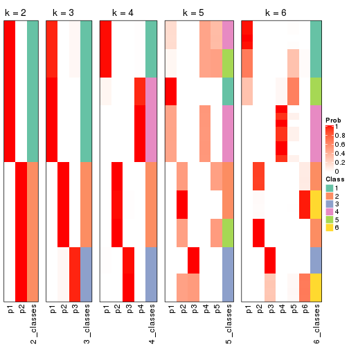


If matrix rows can be associated to genes, consider to use `GO_Enrichment(res,
...)` to perform function enrichment for the signature genes.


 

---------------------------------------------------


### MAD:pam*


The object with results only for a single top-value method and a single partition method 
can be extracted as:

```r
res = res_list["MAD", "pam"]
# you can also extract it by
# res = res_list["MAD:pam"]
```

A summary of `res` and all the functions that can be applied to it:

```r
res
```

```
#> A 'ConsensusPartition' object with k = 2, 3, 4, 5, 6.
#>   On a matrix with 15185 rows and 159 columns.
#>   Top rows (1000, 2000, 3000, 4000, 5000) are extracted by 'MAD' method.
#>   Subgroups are detected by 'pam' method.
#>   Performed in total 1250 partitions by row resampling.
#>   Best k for subgroups seems to be 5.
#> 
#> Following methods can be applied to this 'ConsensusPartition' object:
#>  [1] "cola_report"             "collect_classes"         "collect_plots"          
#>  [4] "collect_stats"           "colnames"                "compare_signatures"     
#>  [7] "consensus_heatmap"       "dimension_reduction"     "functional_enrichment"  
#> [10] "get_anno_col"            "get_anno"                "get_classes"            
#> [13] "get_consensus"           "get_matrix"              "get_membership"         
#> [16] "get_param"               "get_signatures"          "get_stats"              
#> [19] "is_best_k"               "is_stable_k"             "membership_heatmap"     
#> [22] "ncol"                    "nrow"                    "plot_ecdf"              
#> [25] "rownames"                "select_partition_number" "show"                   
#> [28] "suggest_best_k"          "test_to_known_factors"
```

`collect_plots()` function collects all the plots made from `res` for all `k` (number of partitions)
into one single page to provide an easy and fast comparison between different `k`.

```r
collect_plots(res)
```


The plots are:

- The first row: a plot of the ECDF (Empirical cumulative distribution
  function) curves of the consensus matrix for each `k` and the heatmap of
  predicted classes for each `k`.
- The second row: heatmaps of the consensus matrix for each `k`.
- The third row: heatmaps of the membership matrix for each `k`.
- The fouth row: heatmaps of the signatures for each `k`.

All the plots in panels can be made by individual functions and they are
plotted later in this section.

`select_partition_number()` produces several plots showing different
statistics for choosing "optimized" `k`. There are following statistics:

- ECDF curves of the consensus matrix for each `k`;
- 1-PAC. [The PAC
  score](https://en.wikipedia.org/wiki/Consensus_clustering#Over-interpretation_potential_of_consensus_clustering)
  measures the proportion of the ambiguous subgrouping.
- Mean silhouette score.
- Concordance. The mean probability of fiting the consensus class ids in all
  partitions.
- Area increased. Denote $A_k$ as the area under the ECDF curve for current
  `k`, the area increased is defined as $A_k - A_{k-1}$.
- Rand index. The percent of pairs of samples that are both in a same cluster
  or both are not in a same cluster in the partition of k and k-1.
- Jaccard index. The ratio of pairs of samples are both in a same cluster in
  the partition of k and k-1 and the pairs of samples are both in a same
  cluster in the partition k or k-1.

The detailed explanations of these statistics can be found in [the cola
vignette](http://bioconductor.org/packages/devel/bioc/vignettes/cola/inst/doc/cola.html#toc_13).

Generally speaking, lower PAC score, higher mean silhouette score or higher
concordance corresponds to better partition. Rand index and Jaccard index
measure how similar the current partition is compared to partition with `k-1`.
If they are too similar, we won't accept `k` is better than `k-1`.

```r
select_partition_number(res)
```


The numeric values for all these statistics can be obtained by `get_stats()`.

```r
get_stats(res)
```

```
#>   k 1-PAC mean_silhouette concordance area_increased  Rand Jaccard
#> 2 2 1.000           1.000       1.000         0.5036 0.497   0.497
#> 3 3 0.751           0.901       0.812         0.2460 0.877   0.753
#> 4 4 1.000           0.997       0.997         0.1978 0.874   0.663
#> 5 5 0.930           0.895       0.924         0.0269 0.896   0.644
#> 6 6 0.860           0.866       0.908         0.0277 0.894   0.619
```

`suggest_best_k()` suggests the best $k$ based on these statistics. The rules are as follows:

- All $k$ with Jaccard index larger than 0.95 are removed because the increase of
  the partition number does not provides enough extra information. If all $k$ are removed,
  the best $k$ is assigned by `NA`.
- For $k$ with 1-PAC larger than 0.9, the maximal $k$ is taken as the "best k". Other $k$ is called "optional k".
- If it does not fit the second rule. The $k$ with the highest vote of highest
  1-PAC, mean silhouette and concordance is taken as the "best k".

```r
suggest_best_k(res)
```

```
#> [1] 5
#> attr(,"optional")
#> [1] 2 4
```

There is also optional best $k$ = 2 4 that is worth to check.

Following shows the table of the partitions (You need to click the **show/hide
code output** link to see it). The membership matrix (columns with name `p*`)
is inferred by
[`clue::cl_consensus()`](https://www.rdocumentation.org/link/cl_consensus?package=clue)
function with the `SE` method. Basically the value in the membership matrix
represents the probability to belong to a certain group. The finall class
label for an item is determined with the group with highest probability it
belongs to.

In `get_classes()` function, the entropy is calculated from the membership
matrix and the silhouette score is calculated from the consensus matrix.


<script>
$( function() {
	$( '#tabs-MAD-pam-get-classes' ).tabs();
} );
</script>
<div id='tabs-MAD-pam-get-classes'>
<ul>
<li><a href='#tab-MAD-pam-get-classes-1'>k = 2</a></li>
<li><a href='#tab-MAD-pam-get-classes-2'>k = 3</a></li>
<li><a href='#tab-MAD-pam-get-classes-3'>k = 4</a></li>
<li><a href='#tab-MAD-pam-get-classes-4'>k = 5</a></li>
<li><a href='#tab-MAD-pam-get-classes-5'>k = 6</a></li>
</ul>

<div id='tab-MAD-pam-get-classes-1'>
<p><a id='tab-MAD-pam-get-classes-1-a' style='color:#0366d6' href='#'>show/hide code output</a></p>
<pre><code class="r">cbind(get_classes(res, k = 2), get_membership(res, k = 2))
</code></pre>

<pre><code>#&gt;            class entropy silhouette p1 p2
#&gt; SRR1706767     1       0          1  1  0
#&gt; SRR1706768     1       0          1  1  0
#&gt; SRR1706769     1       0          1  1  0
#&gt; SRR1706770     1       0          1  1  0
#&gt; SRR1706771     1       0          1  1  0
#&gt; SRR1706772     1       0          1  1  0
#&gt; SRR1706773     1       0          1  1  0
#&gt; SRR1706774     1       0          1  1  0
#&gt; SRR1706775     1       0          1  1  0
#&gt; SRR1706776     1       0          1  1  0
#&gt; SRR1706777     1       0          1  1  0
#&gt; SRR1706778     1       0          1  1  0
#&gt; SRR1706779     1       0          1  1  0
#&gt; SRR1706780     1       0          1  1  0
#&gt; SRR1706781     1       0          1  1  0
#&gt; SRR1706782     1       0          1  1  0
#&gt; SRR1706783     1       0          1  1  0
#&gt; SRR1706784     1       0          1  1  0
#&gt; SRR1706785     1       0          1  1  0
#&gt; SRR1706786     1       0          1  1  0
#&gt; SRR1706787     1       0          1  1  0
#&gt; SRR1706788     1       0          1  1  0
#&gt; SRR1706789     1       0          1  1  0
#&gt; SRR1706790     1       0          1  1  0
#&gt; SRR1706791     1       0          1  1  0
#&gt; SRR1706792     1       0          1  1  0
#&gt; SRR1706793     1       0          1  1  0
#&gt; SRR1706794     1       0          1  1  0
#&gt; SRR1706795     1       0          1  1  0
#&gt; SRR1706796     1       0          1  1  0
#&gt; SRR1706797     1       0          1  1  0
#&gt; SRR1706798     1       0          1  1  0
#&gt; SRR1706799     1       0          1  1  0
#&gt; SRR1706800     1       0          1  1  0
#&gt; SRR1706801     1       0          1  1  0
#&gt; SRR1706802     1       0          1  1  0
#&gt; SRR1706803     1       0          1  1  0
#&gt; SRR1706804     1       0          1  1  0
#&gt; SRR1706805     1       0          1  1  0
#&gt; SRR1706806     1       0          1  1  0
#&gt; SRR1706811     1       0          1  1  0
#&gt; SRR1706812     1       0          1  1  0
#&gt; SRR1706813     1       0          1  1  0
#&gt; SRR1706814     1       0          1  1  0
#&gt; SRR1706807     1       0          1  1  0
#&gt; SRR1706808     1       0          1  1  0
#&gt; SRR1706809     1       0          1  1  0
#&gt; SRR1706810     1       0          1  1  0
#&gt; SRR1706815     1       0          1  1  0
#&gt; SRR1706816     1       0          1  1  0
#&gt; SRR1706817     1       0          1  1  0
#&gt; SRR1706818     1       0          1  1  0
#&gt; SRR1706819     1       0          1  1  0
#&gt; SRR1706820     1       0          1  1  0
#&gt; SRR1706821     1       0          1  1  0
#&gt; SRR1706822     1       0          1  1  0
#&gt; SRR1706823     1       0          1  1  0
#&gt; SRR1706824     1       0          1  1  0
#&gt; SRR1706825     1       0          1  1  0
#&gt; SRR1706826     1       0          1  1  0
#&gt; SRR1706827     1       0          1  1  0
#&gt; SRR1706828     1       0          1  1  0
#&gt; SRR1706829     1       0          1  1  0
#&gt; SRR1706830     1       0          1  1  0
#&gt; SRR1706835     1       0          1  1  0
#&gt; SRR1706836     1       0          1  1  0
#&gt; SRR1706837     1       0          1  1  0
#&gt; SRR1706838     1       0          1  1  0
#&gt; SRR1706831     1       0          1  1  0
#&gt; SRR1706832     1       0          1  1  0
#&gt; SRR1706833     1       0          1  1  0
#&gt; SRR1706834     1       0          1  1  0
#&gt; SRR1706839     1       0          1  1  0
#&gt; SRR1706840     1       0          1  1  0
#&gt; SRR1706841     1       0          1  1  0
#&gt; SRR1706842     1       0          1  1  0
#&gt; SRR1706847     2       0          1  0  1
#&gt; SRR1706848     2       0          1  0  1
#&gt; SRR1706849     2       0          1  0  1
#&gt; SRR1706850     2       0          1  0  1
#&gt; SRR1706843     1       0          1  1  0
#&gt; SRR1706844     1       0          1  1  0
#&gt; SRR1706845     1       0          1  1  0
#&gt; SRR1706846     1       0          1  1  0
#&gt; SRR1706851     2       0          1  0  1
#&gt; SRR1706852     2       0          1  0  1
#&gt; SRR1706853     2       0          1  0  1
#&gt; SRR1706854     2       0          1  0  1
#&gt; SRR1706855     2       0          1  0  1
#&gt; SRR1706856     2       0          1  0  1
#&gt; SRR1706857     2       0          1  0  1
#&gt; SRR1706858     2       0          1  0  1
#&gt; SRR1706859     2       0          1  0  1
#&gt; SRR1706860     2       0          1  0  1
#&gt; SRR1706861     2       0          1  0  1
#&gt; SRR1706862     2       0          1  0  1
#&gt; SRR1706867     2       0          1  0  1
#&gt; SRR1706869     2       0          1  0  1
#&gt; SRR1706870     2       0          1  0  1
#&gt; SRR1706863     2       0          1  0  1
#&gt; SRR1706864     2       0          1  0  1
#&gt; SRR1706865     2       0          1  0  1
#&gt; SRR1706866     2       0          1  0  1
#&gt; SRR1706871     2       0          1  0  1
#&gt; SRR1706872     2       0          1  0  1
#&gt; SRR1706873     2       0          1  0  1
#&gt; SRR1706874     2       0          1  0  1
#&gt; SRR1706879     2       0          1  0  1
#&gt; SRR1706880     2       0          1  0  1
#&gt; SRR1706881     2       0          1  0  1
#&gt; SRR1706882     2       0          1  0  1
#&gt; SRR1706883     2       0          1  0  1
#&gt; SRR1706884     2       0          1  0  1
#&gt; SRR1706885     2       0          1  0  1
#&gt; SRR1706886     2       0          1  0  1
#&gt; SRR1706875     2       0          1  0  1
#&gt; SRR1706876     2       0          1  0  1
#&gt; SRR1706877     2       0          1  0  1
#&gt; SRR1706878     2       0          1  0  1
#&gt; SRR1706887     2       0          1  0  1
#&gt; SRR1706888     2       0          1  0  1
#&gt; SRR1706889     2       0          1  0  1
#&gt; SRR1706890     2       0          1  0  1
#&gt; SRR1706891     2       0          1  0  1
#&gt; SRR1706892     2       0          1  0  1
#&gt; SRR1706893     2       0          1  0  1
#&gt; SRR1706894     2       0          1  0  1
#&gt; SRR1706895     2       0          1  0  1
#&gt; SRR1706896     2       0          1  0  1
#&gt; SRR1706897     2       0          1  0  1
#&gt; SRR1706898     2       0          1  0  1
#&gt; SRR1706899     2       0          1  0  1
#&gt; SRR1706900     2       0          1  0  1
#&gt; SRR1706901     2       0          1  0  1
#&gt; SRR1706902     2       0          1  0  1
#&gt; SRR1706907     2       0          1  0  1
#&gt; SRR1706908     2       0          1  0  1
#&gt; SRR1706909     2       0          1  0  1
#&gt; SRR1706910     2       0          1  0  1
#&gt; SRR1706903     2       0          1  0  1
#&gt; SRR1706904     2       0          1  0  1
#&gt; SRR1706905     2       0          1  0  1
#&gt; SRR1706906     2       0          1  0  1
#&gt; SRR1706911     2       0          1  0  1
#&gt; SRR1706912     2       0          1  0  1
#&gt; SRR1706913     2       0          1  0  1
#&gt; SRR1706914     2       0          1  0  1
#&gt; SRR1706919     2       0          1  0  1
#&gt; SRR1706920     2       0          1  0  1
#&gt; SRR1706921     2       0          1  0  1
#&gt; SRR1706922     2       0          1  0  1
#&gt; SRR1706915     2       0          1  0  1
#&gt; SRR1706916     2       0          1  0  1
#&gt; SRR1706917     2       0          1  0  1
#&gt; SRR1706918     2       0          1  0  1
#&gt; SRR1706923     2       0          1  0  1
#&gt; SRR1706924     2       0          1  0  1
#&gt; SRR1706925     2       0          1  0  1
#&gt; SRR1706926     2       0          1  0  1
</code></pre>

<script>
$('#tab-MAD-pam-get-classes-1-a').parent().next().next().hide();
$('#tab-MAD-pam-get-classes-1-a').click(function(){
  $('#tab-MAD-pam-get-classes-1-a').parent().next().next().toggle();
  return(false);
});
</script>
</div>

<div id='tab-MAD-pam-get-classes-2'>
<p><a id='tab-MAD-pam-get-classes-2-a' style='color:#0366d6' href='#'>show/hide code output</a></p>
<pre><code class="r">cbind(get_classes(res, k = 3), get_membership(res, k = 3))
</code></pre>

<pre><code>#&gt;            class entropy silhouette   p1    p2    p3
#&gt; SRR1706767     1  0.0000      0.784 1.00 0.000 0.000
#&gt; SRR1706768     1  0.0000      0.784 1.00 0.000 0.000
#&gt; SRR1706769     1  0.0000      0.784 1.00 0.000 0.000
#&gt; SRR1706770     1  0.0000      0.784 1.00 0.000 0.000
#&gt; SRR1706771     1  0.0000      0.784 1.00 0.000 0.000
#&gt; SRR1706772     1  0.0000      0.784 1.00 0.000 0.000
#&gt; SRR1706773     1  0.0000      0.784 1.00 0.000 0.000
#&gt; SRR1706774     1  0.0000      0.784 1.00 0.000 0.000
#&gt; SRR1706775     1  0.6192      0.828 0.58 0.420 0.000
#&gt; SRR1706776     1  0.6192      0.828 0.58 0.420 0.000
#&gt; SRR1706777     1  0.6192      0.828 0.58 0.420 0.000
#&gt; SRR1706778     1  0.6192      0.828 0.58 0.420 0.000
#&gt; SRR1706779     1  0.6192      0.828 0.58 0.420 0.000
#&gt; SRR1706780     1  0.6192      0.828 0.58 0.420 0.000
#&gt; SRR1706781     1  0.6192      0.828 0.58 0.420 0.000
#&gt; SRR1706782     1  0.6192      0.828 0.58 0.420 0.000
#&gt; SRR1706783     1  0.6192      0.828 0.58 0.420 0.000
#&gt; SRR1706784     1  0.6192      0.828 0.58 0.420 0.000
#&gt; SRR1706785     1  0.6192      0.828 0.58 0.420 0.000
#&gt; SRR1706786     1  0.6192      0.828 0.58 0.420 0.000
#&gt; SRR1706787     1  0.0000      0.784 1.00 0.000 0.000
#&gt; SRR1706788     1  0.0000      0.784 1.00 0.000 0.000
#&gt; SRR1706789     1  0.0000      0.784 1.00 0.000 0.000
#&gt; SRR1706790     1  0.0000      0.784 1.00 0.000 0.000
#&gt; SRR1706791     1  0.0000      0.784 1.00 0.000 0.000
#&gt; SRR1706792     1  0.0000      0.784 1.00 0.000 0.000
#&gt; SRR1706793     1  0.0000      0.784 1.00 0.000 0.000
#&gt; SRR1706794     1  0.0000      0.784 1.00 0.000 0.000
#&gt; SRR1706795     1  0.6192      0.828 0.58 0.420 0.000
#&gt; SRR1706796     1  0.6192      0.828 0.58 0.420 0.000
#&gt; SRR1706797     1  0.6192      0.828 0.58 0.420 0.000
#&gt; SRR1706798     1  0.6192      0.828 0.58 0.420 0.000
#&gt; SRR1706799     1  0.6192      0.828 0.58 0.420 0.000
#&gt; SRR1706800     1  0.6192      0.828 0.58 0.420 0.000
#&gt; SRR1706801     1  0.6192      0.828 0.58 0.420 0.000
#&gt; SRR1706802     1  0.6192      0.828 0.58 0.420 0.000
#&gt; SRR1706803     1  0.6192      0.828 0.58 0.420 0.000
#&gt; SRR1706804     1  0.6192      0.828 0.58 0.420 0.000
#&gt; SRR1706805     1  0.6192      0.828 0.58 0.420 0.000
#&gt; SRR1706806     1  0.6192      0.828 0.58 0.420 0.000
#&gt; SRR1706811     1  0.0000      0.784 1.00 0.000 0.000
#&gt; SRR1706812     1  0.0000      0.784 1.00 0.000 0.000
#&gt; SRR1706813     1  0.0000      0.784 1.00 0.000 0.000
#&gt; SRR1706814     1  0.0000      0.784 1.00 0.000 0.000
#&gt; SRR1706807     1  0.0000      0.784 1.00 0.000 0.000
#&gt; SRR1706808     1  0.0000      0.784 1.00 0.000 0.000
#&gt; SRR1706809     1  0.0000      0.784 1.00 0.000 0.000
#&gt; SRR1706810     1  0.0000      0.784 1.00 0.000 0.000
#&gt; SRR1706815     1  0.6192      0.828 0.58 0.420 0.000
#&gt; SRR1706816     1  0.6192      0.828 0.58 0.420 0.000
#&gt; SRR1706817     1  0.6192      0.828 0.58 0.420 0.000
#&gt; SRR1706818     1  0.6192      0.828 0.58 0.420 0.000
#&gt; SRR1706819     1  0.6192      0.828 0.58 0.420 0.000
#&gt; SRR1706820     1  0.6192      0.828 0.58 0.420 0.000
#&gt; SRR1706821     1  0.6192      0.828 0.58 0.420 0.000
#&gt; SRR1706822     1  0.6192      0.828 0.58 0.420 0.000
#&gt; SRR1706823     1  0.6192      0.828 0.58 0.420 0.000
#&gt; SRR1706824     1  0.6192      0.828 0.58 0.420 0.000
#&gt; SRR1706825     1  0.6192      0.828 0.58 0.420 0.000
#&gt; SRR1706826     1  0.6192      0.828 0.58 0.420 0.000
#&gt; SRR1706827     1  0.0000      0.784 1.00 0.000 0.000
#&gt; SRR1706828     1  0.0000      0.784 1.00 0.000 0.000
#&gt; SRR1706829     1  0.0000      0.784 1.00 0.000 0.000
#&gt; SRR1706830     1  0.0000      0.784 1.00 0.000 0.000
#&gt; SRR1706835     1  0.0000      0.784 1.00 0.000 0.000
#&gt; SRR1706836     1  0.0000      0.784 1.00 0.000 0.000
#&gt; SRR1706837     1  0.0000      0.784 1.00 0.000 0.000
#&gt; SRR1706838     1  0.0000      0.784 1.00 0.000 0.000
#&gt; SRR1706831     1  0.0000      0.784 1.00 0.000 0.000
#&gt; SRR1706832     1  0.0000      0.784 1.00 0.000 0.000
#&gt; SRR1706833     1  0.0000      0.784 1.00 0.000 0.000
#&gt; SRR1706834     1  0.0000      0.784 1.00 0.000 0.000
#&gt; SRR1706839     1  0.6192      0.828 0.58 0.420 0.000
#&gt; SRR1706840     1  0.6192      0.828 0.58 0.420 0.000
#&gt; SRR1706841     1  0.6192      0.828 0.58 0.420 0.000
#&gt; SRR1706842     1  0.6192      0.828 0.58 0.420 0.000
#&gt; SRR1706847     3  0.0000      0.997 0.00 0.000 1.000
#&gt; SRR1706848     3  0.0000      0.997 0.00 0.000 1.000
#&gt; SRR1706849     3  0.0000      0.997 0.00 0.000 1.000
#&gt; SRR1706850     3  0.0000      0.997 0.00 0.000 1.000
#&gt; SRR1706843     1  0.6192      0.828 0.58 0.420 0.000
#&gt; SRR1706844     1  0.6192      0.828 0.58 0.420 0.000
#&gt; SRR1706845     1  0.6192      0.828 0.58 0.420 0.000
#&gt; SRR1706846     1  0.6192      0.828 0.58 0.420 0.000
#&gt; SRR1706851     3  0.0000      0.997 0.00 0.000 1.000
#&gt; SRR1706852     3  0.0000      0.997 0.00 0.000 1.000
#&gt; SRR1706853     3  0.0000      0.997 0.00 0.000 1.000
#&gt; SRR1706854     3  0.0000      0.997 0.00 0.000 1.000
#&gt; SRR1706855     2  0.6192      0.998 0.00 0.580 0.420
#&gt; SRR1706856     2  0.6192      0.998 0.00 0.580 0.420
#&gt; SRR1706857     2  0.6192      0.998 0.00 0.580 0.420
#&gt; SRR1706858     2  0.6192      0.998 0.00 0.580 0.420
#&gt; SRR1706859     2  0.6192      0.998 0.00 0.580 0.420
#&gt; SRR1706860     2  0.6192      0.998 0.00 0.580 0.420
#&gt; SRR1706861     2  0.6192      0.998 0.00 0.580 0.420
#&gt; SRR1706862     2  0.6192      0.998 0.00 0.580 0.420
#&gt; SRR1706867     3  0.0000      0.997 0.00 0.000 1.000
#&gt; SRR1706869     3  0.0000      0.997 0.00 0.000 1.000
#&gt; SRR1706870     3  0.0000      0.997 0.00 0.000 1.000
#&gt; SRR1706863     2  0.6192      0.998 0.00 0.580 0.420
#&gt; SRR1706864     2  0.6192      0.998 0.00 0.580 0.420
#&gt; SRR1706865     2  0.6192      0.998 0.00 0.580 0.420
#&gt; SRR1706866     2  0.6192      0.998 0.00 0.580 0.420
#&gt; SRR1706871     3  0.0000      0.997 0.00 0.000 1.000
#&gt; SRR1706872     3  0.0000      0.997 0.00 0.000 1.000
#&gt; SRR1706873     3  0.0000      0.997 0.00 0.000 1.000
#&gt; SRR1706874     3  0.0000      0.997 0.00 0.000 1.000
#&gt; SRR1706879     2  0.6192      0.998 0.00 0.580 0.420
#&gt; SRR1706880     2  0.6192      0.998 0.00 0.580 0.420
#&gt; SRR1706881     2  0.6192      0.998 0.00 0.580 0.420
#&gt; SRR1706882     2  0.6192      0.998 0.00 0.580 0.420
#&gt; SRR1706883     2  0.6192      0.998 0.00 0.580 0.420
#&gt; SRR1706884     2  0.6192      0.998 0.00 0.580 0.420
#&gt; SRR1706885     2  0.6192      0.998 0.00 0.580 0.420
#&gt; SRR1706886     2  0.6192      0.998 0.00 0.580 0.420
#&gt; SRR1706875     2  0.6235      0.973 0.00 0.564 0.436
#&gt; SRR1706876     2  0.6244      0.967 0.00 0.560 0.440
#&gt; SRR1706877     2  0.6215      0.986 0.00 0.572 0.428
#&gt; SRR1706878     2  0.6215      0.986 0.00 0.572 0.428
#&gt; SRR1706887     3  0.0000      0.997 0.00 0.000 1.000
#&gt; SRR1706888     3  0.0000      0.997 0.00 0.000 1.000
#&gt; SRR1706889     3  0.0000      0.997 0.00 0.000 1.000
#&gt; SRR1706890     3  0.0000      0.997 0.00 0.000 1.000
#&gt; SRR1706891     3  0.0000      0.997 0.00 0.000 1.000
#&gt; SRR1706892     3  0.0000      0.997 0.00 0.000 1.000
#&gt; SRR1706893     3  0.0000      0.997 0.00 0.000 1.000
#&gt; SRR1706894     3  0.0000      0.997 0.00 0.000 1.000
#&gt; SRR1706895     2  0.6192      0.998 0.00 0.580 0.420
#&gt; SRR1706896     2  0.6192      0.998 0.00 0.580 0.420
#&gt; SRR1706897     2  0.6192      0.998 0.00 0.580 0.420
#&gt; SRR1706898     2  0.6192      0.998 0.00 0.580 0.420
#&gt; SRR1706899     2  0.6192      0.998 0.00 0.580 0.420
#&gt; SRR1706900     2  0.6192      0.998 0.00 0.580 0.420
#&gt; SRR1706901     2  0.6192      0.998 0.00 0.580 0.420
#&gt; SRR1706902     2  0.6192      0.998 0.00 0.580 0.420
#&gt; SRR1706907     3  0.0000      0.997 0.00 0.000 1.000
#&gt; SRR1706908     3  0.0000      0.997 0.00 0.000 1.000
#&gt; SRR1706909     3  0.0000      0.997 0.00 0.000 1.000
#&gt; SRR1706910     3  0.0000      0.997 0.00 0.000 1.000
#&gt; SRR1706903     2  0.6192      0.998 0.00 0.580 0.420
#&gt; SRR1706904     2  0.6192      0.998 0.00 0.580 0.420
#&gt; SRR1706905     2  0.6192      0.998 0.00 0.580 0.420
#&gt; SRR1706906     2  0.6192      0.998 0.00 0.580 0.420
#&gt; SRR1706911     3  0.0000      0.997 0.00 0.000 1.000
#&gt; SRR1706912     3  0.0000      0.997 0.00 0.000 1.000
#&gt; SRR1706913     3  0.0000      0.997 0.00 0.000 1.000
#&gt; SRR1706914     3  0.0000      0.997 0.00 0.000 1.000
#&gt; SRR1706919     2  0.6192      0.998 0.00 0.580 0.420
#&gt; SRR1706920     2  0.6192      0.998 0.00 0.580 0.420
#&gt; SRR1706921     2  0.6192      0.998 0.00 0.580 0.420
#&gt; SRR1706922     2  0.6192      0.998 0.00 0.580 0.420
#&gt; SRR1706915     3  0.0592      0.980 0.00 0.012 0.988
#&gt; SRR1706916     3  0.0592      0.980 0.00 0.012 0.988
#&gt; SRR1706917     3  0.0892      0.967 0.00 0.020 0.980
#&gt; SRR1706918     3  0.0592      0.980 0.00 0.012 0.988
#&gt; SRR1706923     2  0.6192      0.998 0.00 0.580 0.420
#&gt; SRR1706924     2  0.6192      0.998 0.00 0.580 0.420
#&gt; SRR1706925     2  0.6192      0.998 0.00 0.580 0.420
#&gt; SRR1706926     2  0.6192      0.998 0.00 0.580 0.420
</code></pre>

<script>
$('#tab-MAD-pam-get-classes-2-a').parent().next().next().hide();
$('#tab-MAD-pam-get-classes-2-a').click(function(){
  $('#tab-MAD-pam-get-classes-2-a').parent().next().next().toggle();
  return(false);
});
</script>
</div>

<div id='tab-MAD-pam-get-classes-3'>
<p><a id='tab-MAD-pam-get-classes-3-a' style='color:#0366d6' href='#'>show/hide code output</a></p>
<pre><code class="r">cbind(get_classes(res, k = 4), get_membership(res, k = 4))
</code></pre>

<pre><code>#&gt;            class entropy silhouette    p1    p2    p3    p4
#&gt; SRR1706767     4  0.0188      0.999 0.004 0.000 0.000 0.996
#&gt; SRR1706768     4  0.0188      0.999 0.004 0.000 0.000 0.996
#&gt; SRR1706769     4  0.0188      0.999 0.004 0.000 0.000 0.996
#&gt; SRR1706770     4  0.0188      0.999 0.004 0.000 0.000 0.996
#&gt; SRR1706771     4  0.0188      0.999 0.004 0.000 0.000 0.996
#&gt; SRR1706772     4  0.0188      0.999 0.004 0.000 0.000 0.996
#&gt; SRR1706773     4  0.0188      0.999 0.004 0.000 0.000 0.996
#&gt; SRR1706774     4  0.0188      0.999 0.004 0.000 0.000 0.996
#&gt; SRR1706775     1  0.0000      1.000 1.000 0.000 0.000 0.000
#&gt; SRR1706776     1  0.0000      1.000 1.000 0.000 0.000 0.000
#&gt; SRR1706777     1  0.0000      1.000 1.000 0.000 0.000 0.000
#&gt; SRR1706778     1  0.0000      1.000 1.000 0.000 0.000 0.000
#&gt; SRR1706779     1  0.0000      1.000 1.000 0.000 0.000 0.000
#&gt; SRR1706780     1  0.0000      1.000 1.000 0.000 0.000 0.000
#&gt; SRR1706781     1  0.0000      1.000 1.000 0.000 0.000 0.000
#&gt; SRR1706782     1  0.0000      1.000 1.000 0.000 0.000 0.000
#&gt; SRR1706783     1  0.0000      1.000 1.000 0.000 0.000 0.000
#&gt; SRR1706784     1  0.0000      1.000 1.000 0.000 0.000 0.000
#&gt; SRR1706785     1  0.0000      1.000 1.000 0.000 0.000 0.000
#&gt; SRR1706786     1  0.0000      1.000 1.000 0.000 0.000 0.000
#&gt; SRR1706787     4  0.0188      0.999 0.004 0.000 0.000 0.996
#&gt; SRR1706788     4  0.0188      0.999 0.004 0.000 0.000 0.996
#&gt; SRR1706789     4  0.0188      0.999 0.004 0.000 0.000 0.996
#&gt; SRR1706790     4  0.0188      0.999 0.004 0.000 0.000 0.996
#&gt; SRR1706791     4  0.0188      0.999 0.004 0.000 0.000 0.996
#&gt; SRR1706792     4  0.0188      0.999 0.004 0.000 0.000 0.996
#&gt; SRR1706793     4  0.0188      0.999 0.004 0.000 0.000 0.996
#&gt; SRR1706794     4  0.0188      0.999 0.004 0.000 0.000 0.996
#&gt; SRR1706795     1  0.0000      1.000 1.000 0.000 0.000 0.000
#&gt; SRR1706796     1  0.0000      1.000 1.000 0.000 0.000 0.000
#&gt; SRR1706797     1  0.0000      1.000 1.000 0.000 0.000 0.000
#&gt; SRR1706798     1  0.0000      1.000 1.000 0.000 0.000 0.000
#&gt; SRR1706799     1  0.0000      1.000 1.000 0.000 0.000 0.000
#&gt; SRR1706800     1  0.0000      1.000 1.000 0.000 0.000 0.000
#&gt; SRR1706801     1  0.0000      1.000 1.000 0.000 0.000 0.000
#&gt; SRR1706802     1  0.0000      1.000 1.000 0.000 0.000 0.000
#&gt; SRR1706803     1  0.0000      1.000 1.000 0.000 0.000 0.000
#&gt; SRR1706804     1  0.0000      1.000 1.000 0.000 0.000 0.000
#&gt; SRR1706805     1  0.0000      1.000 1.000 0.000 0.000 0.000
#&gt; SRR1706806     1  0.0000      1.000 1.000 0.000 0.000 0.000
#&gt; SRR1706811     4  0.0188      0.999 0.004 0.000 0.000 0.996
#&gt; SRR1706812     4  0.0188      0.999 0.004 0.000 0.000 0.996
#&gt; SRR1706813     4  0.0188      0.999 0.004 0.000 0.000 0.996
#&gt; SRR1706814     4  0.0188      0.999 0.004 0.000 0.000 0.996
#&gt; SRR1706807     4  0.0188      0.999 0.004 0.000 0.000 0.996
#&gt; SRR1706808     4  0.0188      0.999 0.004 0.000 0.000 0.996
#&gt; SRR1706809     4  0.0188      0.999 0.004 0.000 0.000 0.996
#&gt; SRR1706810     4  0.0188      0.999 0.004 0.000 0.000 0.996
#&gt; SRR1706815     1  0.0000      1.000 1.000 0.000 0.000 0.000
#&gt; SRR1706816     1  0.0000      1.000 1.000 0.000 0.000 0.000
#&gt; SRR1706817     1  0.0000      1.000 1.000 0.000 0.000 0.000
#&gt; SRR1706818     1  0.0000      1.000 1.000 0.000 0.000 0.000
#&gt; SRR1706819     1  0.0000      1.000 1.000 0.000 0.000 0.000
#&gt; SRR1706820     1  0.0000      1.000 1.000 0.000 0.000 0.000
#&gt; SRR1706821     1  0.0000      1.000 1.000 0.000 0.000 0.000
#&gt; SRR1706822     1  0.0000      1.000 1.000 0.000 0.000 0.000
#&gt; SRR1706823     1  0.0000      1.000 1.000 0.000 0.000 0.000
#&gt; SRR1706824     1  0.0000      1.000 1.000 0.000 0.000 0.000
#&gt; SRR1706825     1  0.0000      1.000 1.000 0.000 0.000 0.000
#&gt; SRR1706826     1  0.0000      1.000 1.000 0.000 0.000 0.000
#&gt; SRR1706827     4  0.0188      0.999 0.004 0.000 0.000 0.996
#&gt; SRR1706828     4  0.0188      0.999 0.004 0.000 0.000 0.996
#&gt; SRR1706829     4  0.0188      0.999 0.004 0.000 0.000 0.996
#&gt; SRR1706830     4  0.0188      0.999 0.004 0.000 0.000 0.996
#&gt; SRR1706835     4  0.0469      0.992 0.012 0.000 0.000 0.988
#&gt; SRR1706836     4  0.0469      0.992 0.012 0.000 0.000 0.988
#&gt; SRR1706837     4  0.0469      0.992 0.012 0.000 0.000 0.988
#&gt; SRR1706838     4  0.0469      0.992 0.012 0.000 0.000 0.988
#&gt; SRR1706831     4  0.0188      0.999 0.004 0.000 0.000 0.996
#&gt; SRR1706832     4  0.0188      0.999 0.004 0.000 0.000 0.996
#&gt; SRR1706833     4  0.0188      0.999 0.004 0.000 0.000 0.996
#&gt; SRR1706834     4  0.0188      0.999 0.004 0.000 0.000 0.996
#&gt; SRR1706839     1  0.0000      1.000 1.000 0.000 0.000 0.000
#&gt; SRR1706840     1  0.0000      1.000 1.000 0.000 0.000 0.000
#&gt; SRR1706841     1  0.0000      1.000 1.000 0.000 0.000 0.000
#&gt; SRR1706842     1  0.0000      1.000 1.000 0.000 0.000 0.000
#&gt; SRR1706847     3  0.0000      0.996 0.000 0.000 1.000 0.000
#&gt; SRR1706848     3  0.0000      0.996 0.000 0.000 1.000 0.000
#&gt; SRR1706849     3  0.0000      0.996 0.000 0.000 1.000 0.000
#&gt; SRR1706850     3  0.0000      0.996 0.000 0.000 1.000 0.000
#&gt; SRR1706843     1  0.0000      1.000 1.000 0.000 0.000 0.000
#&gt; SRR1706844     1  0.0000      1.000 1.000 0.000 0.000 0.000
#&gt; SRR1706845     1  0.0000      1.000 1.000 0.000 0.000 0.000
#&gt; SRR1706846     1  0.0000      1.000 1.000 0.000 0.000 0.000
#&gt; SRR1706851     3  0.0188      0.996 0.000 0.004 0.996 0.000
#&gt; SRR1706852     3  0.0188      0.996 0.000 0.004 0.996 0.000
#&gt; SRR1706853     3  0.0188      0.996 0.000 0.004 0.996 0.000
#&gt; SRR1706854     3  0.0188      0.996 0.000 0.004 0.996 0.000
#&gt; SRR1706855     2  0.0000      0.997 0.000 1.000 0.000 0.000
#&gt; SRR1706856     2  0.0000      0.997 0.000 1.000 0.000 0.000
#&gt; SRR1706857     2  0.0000      0.997 0.000 1.000 0.000 0.000
#&gt; SRR1706858     2  0.0000      0.997 0.000 1.000 0.000 0.000
#&gt; SRR1706859     2  0.0000      0.997 0.000 1.000 0.000 0.000
#&gt; SRR1706860     2  0.0000      0.997 0.000 1.000 0.000 0.000
#&gt; SRR1706861     2  0.0000      0.997 0.000 1.000 0.000 0.000
#&gt; SRR1706862     2  0.0000      0.997 0.000 1.000 0.000 0.000
#&gt; SRR1706867     3  0.0000      0.996 0.000 0.000 1.000 0.000
#&gt; SRR1706869     3  0.0000      0.996 0.000 0.000 1.000 0.000
#&gt; SRR1706870     3  0.0000      0.996 0.000 0.000 1.000 0.000
#&gt; SRR1706863     2  0.0188      0.997 0.000 0.996 0.000 0.004
#&gt; SRR1706864     2  0.0188      0.997 0.000 0.996 0.000 0.004
#&gt; SRR1706865     2  0.0188      0.997 0.000 0.996 0.000 0.004
#&gt; SRR1706866     2  0.0188      0.997 0.000 0.996 0.000 0.004
#&gt; SRR1706871     3  0.0188      0.996 0.000 0.004 0.996 0.000
#&gt; SRR1706872     3  0.0188      0.996 0.000 0.004 0.996 0.000
#&gt; SRR1706873     3  0.0188      0.996 0.000 0.004 0.996 0.000
#&gt; SRR1706874     3  0.0188      0.996 0.000 0.004 0.996 0.000
#&gt; SRR1706879     2  0.0000      0.997 0.000 1.000 0.000 0.000
#&gt; SRR1706880     2  0.0000      0.997 0.000 1.000 0.000 0.000
#&gt; SRR1706881     2  0.0000      0.997 0.000 1.000 0.000 0.000
#&gt; SRR1706882     2  0.0000      0.997 0.000 1.000 0.000 0.000
#&gt; SRR1706883     2  0.0188      0.997 0.000 0.996 0.000 0.004
#&gt; SRR1706884     2  0.0188      0.997 0.000 0.996 0.000 0.004
#&gt; SRR1706885     2  0.0188      0.997 0.000 0.996 0.000 0.004
#&gt; SRR1706886     2  0.0188      0.997 0.000 0.996 0.000 0.004
#&gt; SRR1706875     2  0.0592      0.984 0.000 0.984 0.016 0.000
#&gt; SRR1706876     2  0.0707      0.981 0.000 0.980 0.020 0.000
#&gt; SRR1706877     2  0.0336      0.991 0.000 0.992 0.008 0.000
#&gt; SRR1706878     2  0.0336      0.991 0.000 0.992 0.008 0.000
#&gt; SRR1706887     3  0.0000      0.996 0.000 0.000 1.000 0.000
#&gt; SRR1706888     3  0.0000      0.996 0.000 0.000 1.000 0.000
#&gt; SRR1706889     3  0.0000      0.996 0.000 0.000 1.000 0.000
#&gt; SRR1706890     3  0.0000      0.996 0.000 0.000 1.000 0.000
#&gt; SRR1706891     3  0.0188      0.996 0.000 0.004 0.996 0.000
#&gt; SRR1706892     3  0.0188      0.996 0.000 0.004 0.996 0.000
#&gt; SRR1706893     3  0.0188      0.996 0.000 0.004 0.996 0.000
#&gt; SRR1706894     3  0.0188      0.996 0.000 0.004 0.996 0.000
#&gt; SRR1706895     2  0.0000      0.997 0.000 1.000 0.000 0.000
#&gt; SRR1706896     2  0.0000      0.997 0.000 1.000 0.000 0.000
#&gt; SRR1706897     2  0.0000      0.997 0.000 1.000 0.000 0.000
#&gt; SRR1706898     2  0.0000      0.997 0.000 1.000 0.000 0.000
#&gt; SRR1706899     2  0.0000      0.997 0.000 1.000 0.000 0.000
#&gt; SRR1706900     2  0.0000      0.997 0.000 1.000 0.000 0.000
#&gt; SRR1706901     2  0.0000      0.997 0.000 1.000 0.000 0.000
#&gt; SRR1706902     2  0.0000      0.997 0.000 1.000 0.000 0.000
#&gt; SRR1706907     3  0.0000      0.996 0.000 0.000 1.000 0.000
#&gt; SRR1706908     3  0.0000      0.996 0.000 0.000 1.000 0.000
#&gt; SRR1706909     3  0.0000      0.996 0.000 0.000 1.000 0.000
#&gt; SRR1706910     3  0.0000      0.996 0.000 0.000 1.000 0.000
#&gt; SRR1706903     2  0.0188      0.997 0.000 0.996 0.000 0.004
#&gt; SRR1706904     2  0.0188      0.997 0.000 0.996 0.000 0.004
#&gt; SRR1706905     2  0.0188      0.997 0.000 0.996 0.000 0.004
#&gt; SRR1706906     2  0.0188      0.997 0.000 0.996 0.000 0.004
#&gt; SRR1706911     3  0.0188      0.996 0.000 0.004 0.996 0.000
#&gt; SRR1706912     3  0.0188      0.996 0.000 0.004 0.996 0.000
#&gt; SRR1706913     3  0.0188      0.996 0.000 0.004 0.996 0.000
#&gt; SRR1706914     3  0.0188      0.996 0.000 0.004 0.996 0.000
#&gt; SRR1706919     2  0.0000      0.997 0.000 1.000 0.000 0.000
#&gt; SRR1706920     2  0.0000      0.997 0.000 1.000 0.000 0.000
#&gt; SRR1706921     2  0.0000      0.997 0.000 1.000 0.000 0.000
#&gt; SRR1706922     2  0.0000      0.997 0.000 1.000 0.000 0.000
#&gt; SRR1706915     3  0.0707      0.983 0.000 0.020 0.980 0.000
#&gt; SRR1706916     3  0.0707      0.983 0.000 0.020 0.980 0.000
#&gt; SRR1706917     3  0.0921      0.976 0.000 0.028 0.972 0.000
#&gt; SRR1706918     3  0.0707      0.983 0.000 0.020 0.980 0.000
#&gt; SRR1706923     2  0.0188      0.997 0.000 0.996 0.000 0.004
#&gt; SRR1706924     2  0.0188      0.997 0.000 0.996 0.000 0.004
#&gt; SRR1706925     2  0.0188      0.997 0.000 0.996 0.000 0.004
#&gt; SRR1706926     2  0.0188      0.997 0.000 0.996 0.000 0.004
</code></pre>

<script>
$('#tab-MAD-pam-get-classes-3-a').parent().next().next().hide();
$('#tab-MAD-pam-get-classes-3-a').click(function(){
  $('#tab-MAD-pam-get-classes-3-a').parent().next().next().toggle();
  return(false);
});
</script>
</div>

<div id='tab-MAD-pam-get-classes-4'>
<p><a id='tab-MAD-pam-get-classes-4-a' style='color:#0366d6' href='#'>show/hide code output</a></p>
<pre><code class="r">cbind(get_classes(res, k = 5), get_membership(res, k = 5))
</code></pre>

<pre><code>#&gt;            class entropy silhouette    p1    p2    p3    p4    p5
#&gt; SRR1706767     4  0.0000      0.999 0.000 0.000 0.000 1.000 0.000
#&gt; SRR1706768     4  0.0000      0.999 0.000 0.000 0.000 1.000 0.000
#&gt; SRR1706769     4  0.0000      0.999 0.000 0.000 0.000 1.000 0.000
#&gt; SRR1706770     4  0.0000      0.999 0.000 0.000 0.000 1.000 0.000
#&gt; SRR1706771     4  0.0000      0.999 0.000 0.000 0.000 1.000 0.000
#&gt; SRR1706772     4  0.0000      0.999 0.000 0.000 0.000 1.000 0.000
#&gt; SRR1706773     4  0.0000      0.999 0.000 0.000 0.000 1.000 0.000
#&gt; SRR1706774     4  0.0000      0.999 0.000 0.000 0.000 1.000 0.000
#&gt; SRR1706775     1  0.0000      1.000 1.000 0.000 0.000 0.000 0.000
#&gt; SRR1706776     1  0.0000      1.000 1.000 0.000 0.000 0.000 0.000
#&gt; SRR1706777     1  0.0000      1.000 1.000 0.000 0.000 0.000 0.000
#&gt; SRR1706778     1  0.0000      1.000 1.000 0.000 0.000 0.000 0.000
#&gt; SRR1706779     1  0.0000      1.000 1.000 0.000 0.000 0.000 0.000
#&gt; SRR1706780     1  0.0000      1.000 1.000 0.000 0.000 0.000 0.000
#&gt; SRR1706781     1  0.0000      1.000 1.000 0.000 0.000 0.000 0.000
#&gt; SRR1706782     1  0.0000      1.000 1.000 0.000 0.000 0.000 0.000
#&gt; SRR1706783     1  0.0000      1.000 1.000 0.000 0.000 0.000 0.000
#&gt; SRR1706784     1  0.0000      1.000 1.000 0.000 0.000 0.000 0.000
#&gt; SRR1706785     1  0.0000      1.000 1.000 0.000 0.000 0.000 0.000
#&gt; SRR1706786     1  0.0000      1.000 1.000 0.000 0.000 0.000 0.000
#&gt; SRR1706787     4  0.0000      0.999 0.000 0.000 0.000 1.000 0.000
#&gt; SRR1706788     4  0.0000      0.999 0.000 0.000 0.000 1.000 0.000
#&gt; SRR1706789     4  0.0000      0.999 0.000 0.000 0.000 1.000 0.000
#&gt; SRR1706790     4  0.0000      0.999 0.000 0.000 0.000 1.000 0.000
#&gt; SRR1706791     4  0.0000      0.999 0.000 0.000 0.000 1.000 0.000
#&gt; SRR1706792     4  0.0000      0.999 0.000 0.000 0.000 1.000 0.000
#&gt; SRR1706793     4  0.0000      0.999 0.000 0.000 0.000 1.000 0.000
#&gt; SRR1706794     4  0.0000      0.999 0.000 0.000 0.000 1.000 0.000
#&gt; SRR1706795     1  0.0000      1.000 1.000 0.000 0.000 0.000 0.000
#&gt; SRR1706796     1  0.0000      1.000 1.000 0.000 0.000 0.000 0.000
#&gt; SRR1706797     1  0.0000      1.000 1.000 0.000 0.000 0.000 0.000
#&gt; SRR1706798     1  0.0000      1.000 1.000 0.000 0.000 0.000 0.000
#&gt; SRR1706799     1  0.0000      1.000 1.000 0.000 0.000 0.000 0.000
#&gt; SRR1706800     1  0.0000      1.000 1.000 0.000 0.000 0.000 0.000
#&gt; SRR1706801     1  0.0000      1.000 1.000 0.000 0.000 0.000 0.000
#&gt; SRR1706802     1  0.0000      1.000 1.000 0.000 0.000 0.000 0.000
#&gt; SRR1706803     1  0.0000      1.000 1.000 0.000 0.000 0.000 0.000
#&gt; SRR1706804     1  0.0000      1.000 1.000 0.000 0.000 0.000 0.000
#&gt; SRR1706805     1  0.0000      1.000 1.000 0.000 0.000 0.000 0.000
#&gt; SRR1706806     1  0.0000      1.000 1.000 0.000 0.000 0.000 0.000
#&gt; SRR1706811     4  0.0000      0.999 0.000 0.000 0.000 1.000 0.000
#&gt; SRR1706812     4  0.0000      0.999 0.000 0.000 0.000 1.000 0.000
#&gt; SRR1706813     4  0.0000      0.999 0.000 0.000 0.000 1.000 0.000
#&gt; SRR1706814     4  0.0000      0.999 0.000 0.000 0.000 1.000 0.000
#&gt; SRR1706807     4  0.0000      0.999 0.000 0.000 0.000 1.000 0.000
#&gt; SRR1706808     4  0.0000      0.999 0.000 0.000 0.000 1.000 0.000
#&gt; SRR1706809     4  0.0000      0.999 0.000 0.000 0.000 1.000 0.000
#&gt; SRR1706810     4  0.0000      0.999 0.000 0.000 0.000 1.000 0.000
#&gt; SRR1706815     1  0.0000      1.000 1.000 0.000 0.000 0.000 0.000
#&gt; SRR1706816     1  0.0000      1.000 1.000 0.000 0.000 0.000 0.000
#&gt; SRR1706817     1  0.0000      1.000 1.000 0.000 0.000 0.000 0.000
#&gt; SRR1706818     1  0.0000      1.000 1.000 0.000 0.000 0.000 0.000
#&gt; SRR1706819     1  0.0000      1.000 1.000 0.000 0.000 0.000 0.000
#&gt; SRR1706820     1  0.0000      1.000 1.000 0.000 0.000 0.000 0.000
#&gt; SRR1706821     1  0.0000      1.000 1.000 0.000 0.000 0.000 0.000
#&gt; SRR1706822     1  0.0000      1.000 1.000 0.000 0.000 0.000 0.000
#&gt; SRR1706823     1  0.0000      1.000 1.000 0.000 0.000 0.000 0.000
#&gt; SRR1706824     1  0.0000      1.000 1.000 0.000 0.000 0.000 0.000
#&gt; SRR1706825     1  0.0000      1.000 1.000 0.000 0.000 0.000 0.000
#&gt; SRR1706826     1  0.0000      1.000 1.000 0.000 0.000 0.000 0.000
#&gt; SRR1706827     4  0.0000      0.999 0.000 0.000 0.000 1.000 0.000
#&gt; SRR1706828     4  0.0000      0.999 0.000 0.000 0.000 1.000 0.000
#&gt; SRR1706829     4  0.0000      0.999 0.000 0.000 0.000 1.000 0.000
#&gt; SRR1706830     4  0.0000      0.999 0.000 0.000 0.000 1.000 0.000
#&gt; SRR1706835     4  0.0290      0.991 0.008 0.000 0.000 0.992 0.000
#&gt; SRR1706836     4  0.0290      0.991 0.008 0.000 0.000 0.992 0.000
#&gt; SRR1706837     4  0.0290      0.991 0.008 0.000 0.000 0.992 0.000
#&gt; SRR1706838     4  0.0290      0.991 0.008 0.000 0.000 0.992 0.000
#&gt; SRR1706831     4  0.0000      0.999 0.000 0.000 0.000 1.000 0.000
#&gt; SRR1706832     4  0.0000      0.999 0.000 0.000 0.000 1.000 0.000
#&gt; SRR1706833     4  0.0000      0.999 0.000 0.000 0.000 1.000 0.000
#&gt; SRR1706834     4  0.0000      0.999 0.000 0.000 0.000 1.000 0.000
#&gt; SRR1706839     1  0.0000      1.000 1.000 0.000 0.000 0.000 0.000
#&gt; SRR1706840     1  0.0000      1.000 1.000 0.000 0.000 0.000 0.000
#&gt; SRR1706841     1  0.0000      1.000 1.000 0.000 0.000 0.000 0.000
#&gt; SRR1706842     1  0.0000      1.000 1.000 0.000 0.000 0.000 0.000
#&gt; SRR1706847     3  0.4192      1.000 0.000 0.000 0.596 0.000 0.404
#&gt; SRR1706848     3  0.4192      1.000 0.000 0.000 0.596 0.000 0.404
#&gt; SRR1706849     3  0.4192      1.000 0.000 0.000 0.596 0.000 0.404
#&gt; SRR1706850     3  0.4192      1.000 0.000 0.000 0.596 0.000 0.404
#&gt; SRR1706843     1  0.0000      1.000 1.000 0.000 0.000 0.000 0.000
#&gt; SRR1706844     1  0.0000      1.000 1.000 0.000 0.000 0.000 0.000
#&gt; SRR1706845     1  0.0000      1.000 1.000 0.000 0.000 0.000 0.000
#&gt; SRR1706846     1  0.0000      1.000 1.000 0.000 0.000 0.000 0.000
#&gt; SRR1706851     2  0.4192      0.675 0.000 0.596 0.404 0.000 0.000
#&gt; SRR1706852     2  0.4192      0.675 0.000 0.596 0.404 0.000 0.000
#&gt; SRR1706853     2  0.4192      0.675 0.000 0.596 0.404 0.000 0.000
#&gt; SRR1706854     2  0.4192      0.675 0.000 0.596 0.404 0.000 0.000
#&gt; SRR1706855     2  0.0000      0.685 0.000 1.000 0.000 0.000 0.000
#&gt; SRR1706856     2  0.0000      0.685 0.000 1.000 0.000 0.000 0.000
#&gt; SRR1706857     2  0.0000      0.685 0.000 1.000 0.000 0.000 0.000
#&gt; SRR1706858     2  0.0000      0.685 0.000 1.000 0.000 0.000 0.000
#&gt; SRR1706859     2  0.2690      0.371 0.000 0.844 0.000 0.000 0.156
#&gt; SRR1706860     2  0.2690      0.371 0.000 0.844 0.000 0.000 0.156
#&gt; SRR1706861     2  0.2471      0.425 0.000 0.864 0.000 0.000 0.136
#&gt; SRR1706862     2  0.2813      0.334 0.000 0.832 0.000 0.000 0.168
#&gt; SRR1706867     3  0.4192      1.000 0.000 0.000 0.596 0.000 0.404
#&gt; SRR1706869     3  0.4192      1.000 0.000 0.000 0.596 0.000 0.404
#&gt; SRR1706870     3  0.4192      1.000 0.000 0.000 0.596 0.000 0.404
#&gt; SRR1706863     5  0.4192      1.000 0.000 0.404 0.000 0.000 0.596
#&gt; SRR1706864     5  0.4192      1.000 0.000 0.404 0.000 0.000 0.596
#&gt; SRR1706865     5  0.4192      1.000 0.000 0.404 0.000 0.000 0.596
#&gt; SRR1706866     5  0.4192      1.000 0.000 0.404 0.000 0.000 0.596
#&gt; SRR1706871     2  0.4192      0.675 0.000 0.596 0.404 0.000 0.000
#&gt; SRR1706872     2  0.4192      0.675 0.000 0.596 0.404 0.000 0.000
#&gt; SRR1706873     2  0.4192      0.675 0.000 0.596 0.404 0.000 0.000
#&gt; SRR1706874     2  0.4192      0.675 0.000 0.596 0.404 0.000 0.000
#&gt; SRR1706879     2  0.0000      0.685 0.000 1.000 0.000 0.000 0.000
#&gt; SRR1706880     2  0.0000      0.685 0.000 1.000 0.000 0.000 0.000
#&gt; SRR1706881     2  0.0000      0.685 0.000 1.000 0.000 0.000 0.000
#&gt; SRR1706882     2  0.0000      0.685 0.000 1.000 0.000 0.000 0.000
#&gt; SRR1706883     5  0.4192      1.000 0.000 0.404 0.000 0.000 0.596
#&gt; SRR1706884     5  0.4192      1.000 0.000 0.404 0.000 0.000 0.596
#&gt; SRR1706885     5  0.4192      1.000 0.000 0.404 0.000 0.000 0.596
#&gt; SRR1706886     5  0.4192      1.000 0.000 0.404 0.000 0.000 0.596
#&gt; SRR1706875     2  0.0000      0.685 0.000 1.000 0.000 0.000 0.000
#&gt; SRR1706876     2  0.0000      0.685 0.000 1.000 0.000 0.000 0.000
#&gt; SRR1706877     2  0.0000      0.685 0.000 1.000 0.000 0.000 0.000
#&gt; SRR1706878     2  0.0000      0.685 0.000 1.000 0.000 0.000 0.000
#&gt; SRR1706887     3  0.4192      1.000 0.000 0.000 0.596 0.000 0.404
#&gt; SRR1706888     3  0.4192      1.000 0.000 0.000 0.596 0.000 0.404
#&gt; SRR1706889     3  0.4192      1.000 0.000 0.000 0.596 0.000 0.404
#&gt; SRR1706890     3  0.4192      1.000 0.000 0.000 0.596 0.000 0.404
#&gt; SRR1706891     2  0.4192      0.675 0.000 0.596 0.404 0.000 0.000
#&gt; SRR1706892     2  0.4192      0.675 0.000 0.596 0.404 0.000 0.000
#&gt; SRR1706893     2  0.4192      0.675 0.000 0.596 0.404 0.000 0.000
#&gt; SRR1706894     2  0.4192      0.675 0.000 0.596 0.404 0.000 0.000
#&gt; SRR1706895     2  0.0000      0.685 0.000 1.000 0.000 0.000 0.000
#&gt; SRR1706896     2  0.0000      0.685 0.000 1.000 0.000 0.000 0.000
#&gt; SRR1706897     2  0.0000      0.685 0.000 1.000 0.000 0.000 0.000
#&gt; SRR1706898     2  0.0000      0.685 0.000 1.000 0.000 0.000 0.000
#&gt; SRR1706899     2  0.0000      0.685 0.000 1.000 0.000 0.000 0.000
#&gt; SRR1706900     2  0.0290      0.674 0.000 0.992 0.000 0.000 0.008
#&gt; SRR1706901     2  0.0162      0.680 0.000 0.996 0.000 0.000 0.004
#&gt; SRR1706902     2  0.0000      0.685 0.000 1.000 0.000 0.000 0.000
#&gt; SRR1706907     3  0.4192      1.000 0.000 0.000 0.596 0.000 0.404
#&gt; SRR1706908     3  0.4192      1.000 0.000 0.000 0.596 0.000 0.404
#&gt; SRR1706909     3  0.4192      1.000 0.000 0.000 0.596 0.000 0.404
#&gt; SRR1706910     3  0.4192      1.000 0.000 0.000 0.596 0.000 0.404
#&gt; SRR1706903     5  0.4192      1.000 0.000 0.404 0.000 0.000 0.596
#&gt; SRR1706904     5  0.4192      1.000 0.000 0.404 0.000 0.000 0.596
#&gt; SRR1706905     5  0.4192      1.000 0.000 0.404 0.000 0.000 0.596
#&gt; SRR1706906     5  0.4192      1.000 0.000 0.404 0.000 0.000 0.596
#&gt; SRR1706911     2  0.4192      0.675 0.000 0.596 0.404 0.000 0.000
#&gt; SRR1706912     2  0.4192      0.675 0.000 0.596 0.404 0.000 0.000
#&gt; SRR1706913     2  0.4192      0.675 0.000 0.596 0.404 0.000 0.000
#&gt; SRR1706914     2  0.4192      0.675 0.000 0.596 0.404 0.000 0.000
#&gt; SRR1706919     2  0.0000      0.685 0.000 1.000 0.000 0.000 0.000
#&gt; SRR1706920     2  0.0000      0.685 0.000 1.000 0.000 0.000 0.000
#&gt; SRR1706921     2  0.0000      0.685 0.000 1.000 0.000 0.000 0.000
#&gt; SRR1706922     2  0.0000      0.685 0.000 1.000 0.000 0.000 0.000
#&gt; SRR1706915     2  0.4138      0.677 0.000 0.616 0.384 0.000 0.000
#&gt; SRR1706916     2  0.4161      0.676 0.000 0.608 0.392 0.000 0.000
#&gt; SRR1706917     2  0.4150      0.677 0.000 0.612 0.388 0.000 0.000
#&gt; SRR1706918     2  0.4150      0.677 0.000 0.612 0.388 0.000 0.000
#&gt; SRR1706923     5  0.4192      1.000 0.000 0.404 0.000 0.000 0.596
#&gt; SRR1706924     5  0.4192      1.000 0.000 0.404 0.000 0.000 0.596
#&gt; SRR1706925     5  0.4192      1.000 0.000 0.404 0.000 0.000 0.596
#&gt; SRR1706926     5  0.4192      1.000 0.000 0.404 0.000 0.000 0.596
</code></pre>

<script>
$('#tab-MAD-pam-get-classes-4-a').parent().next().next().hide();
$('#tab-MAD-pam-get-classes-4-a').click(function(){
  $('#tab-MAD-pam-get-classes-4-a').parent().next().next().toggle();
  return(false);
});
</script>
</div>

<div id='tab-MAD-pam-get-classes-5'>
<p><a id='tab-MAD-pam-get-classes-5-a' style='color:#0366d6' href='#'>show/hide code output</a></p>
<pre><code class="r">cbind(get_classes(res, k = 6), get_membership(res, k = 6))
</code></pre>

<pre><code>#&gt;            class entropy silhouette    p1    p2 p3    p4    p5    p6
#&gt; SRR1706767     4  0.0000      1.000 0.000 0.000  0 1.000 0.000 0.000
#&gt; SRR1706768     4  0.0000      1.000 0.000 0.000  0 1.000 0.000 0.000
#&gt; SRR1706769     4  0.0000      1.000 0.000 0.000  0 1.000 0.000 0.000
#&gt; SRR1706770     4  0.0000      1.000 0.000 0.000  0 1.000 0.000 0.000
#&gt; SRR1706771     5  0.0000      0.942 0.000 0.000  0 0.000 1.000 0.000
#&gt; SRR1706772     5  0.0000      0.942 0.000 0.000  0 0.000 1.000 0.000
#&gt; SRR1706773     5  0.0000      0.942 0.000 0.000  0 0.000 1.000 0.000
#&gt; SRR1706774     5  0.0000      0.942 0.000 0.000  0 0.000 1.000 0.000
#&gt; SRR1706775     5  0.0000      0.942 0.000 0.000  0 0.000 1.000 0.000
#&gt; SRR1706776     5  0.0000      0.942 0.000 0.000  0 0.000 1.000 0.000
#&gt; SRR1706777     5  0.0000      0.942 0.000 0.000  0 0.000 1.000 0.000
#&gt; SRR1706778     5  0.0000      0.942 0.000 0.000  0 0.000 1.000 0.000
#&gt; SRR1706779     5  0.2048      0.877 0.120 0.000  0 0.000 0.880 0.000
#&gt; SRR1706780     5  0.2092      0.874 0.124 0.000  0 0.000 0.876 0.000
#&gt; SRR1706781     5  0.2135      0.871 0.128 0.000  0 0.000 0.872 0.000
#&gt; SRR1706782     5  0.2092      0.874 0.124 0.000  0 0.000 0.876 0.000
#&gt; SRR1706783     1  0.0000      1.000 1.000 0.000  0 0.000 0.000 0.000
#&gt; SRR1706784     1  0.0000      1.000 1.000 0.000  0 0.000 0.000 0.000
#&gt; SRR1706785     1  0.0000      1.000 1.000 0.000  0 0.000 0.000 0.000
#&gt; SRR1706786     1  0.0000      1.000 1.000 0.000  0 0.000 0.000 0.000
#&gt; SRR1706787     4  0.0000      1.000 0.000 0.000  0 1.000 0.000 0.000
#&gt; SRR1706788     4  0.0000      1.000 0.000 0.000  0 1.000 0.000 0.000
#&gt; SRR1706789     4  0.0000      1.000 0.000 0.000  0 1.000 0.000 0.000
#&gt; SRR1706790     4  0.0000      1.000 0.000 0.000  0 1.000 0.000 0.000
#&gt; SRR1706791     5  0.0000      0.942 0.000 0.000  0 0.000 1.000 0.000
#&gt; SRR1706792     5  0.0000      0.942 0.000 0.000  0 0.000 1.000 0.000
#&gt; SRR1706793     5  0.0000      0.942 0.000 0.000  0 0.000 1.000 0.000
#&gt; SRR1706794     5  0.0000      0.942 0.000 0.000  0 0.000 1.000 0.000
#&gt; SRR1706795     5  0.0000      0.942 0.000 0.000  0 0.000 1.000 0.000
#&gt; SRR1706796     5  0.0000      0.942 0.000 0.000  0 0.000 1.000 0.000
#&gt; SRR1706797     5  0.0000      0.942 0.000 0.000  0 0.000 1.000 0.000
#&gt; SRR1706798     5  0.0000      0.942 0.000 0.000  0 0.000 1.000 0.000
#&gt; SRR1706799     5  0.2340      0.855 0.148 0.000  0 0.000 0.852 0.000
#&gt; SRR1706800     5  0.2260      0.862 0.140 0.000  0 0.000 0.860 0.000
#&gt; SRR1706801     5  0.2416      0.848 0.156 0.000  0 0.000 0.844 0.000
#&gt; SRR1706802     5  0.2135      0.871 0.128 0.000  0 0.000 0.872 0.000
#&gt; SRR1706803     1  0.0000      1.000 1.000 0.000  0 0.000 0.000 0.000
#&gt; SRR1706804     1  0.0000      1.000 1.000 0.000  0 0.000 0.000 0.000
#&gt; SRR1706805     1  0.0000      1.000 1.000 0.000  0 0.000 0.000 0.000
#&gt; SRR1706806     1  0.0000      1.000 1.000 0.000  0 0.000 0.000 0.000
#&gt; SRR1706811     5  0.0000      0.942 0.000 0.000  0 0.000 1.000 0.000
#&gt; SRR1706812     5  0.0000      0.942 0.000 0.000  0 0.000 1.000 0.000
#&gt; SRR1706813     5  0.0000      0.942 0.000 0.000  0 0.000 1.000 0.000
#&gt; SRR1706814     5  0.0000      0.942 0.000 0.000  0 0.000 1.000 0.000
#&gt; SRR1706807     4  0.0000      1.000 0.000 0.000  0 1.000 0.000 0.000
#&gt; SRR1706808     4  0.0000      1.000 0.000 0.000  0 1.000 0.000 0.000
#&gt; SRR1706809     4  0.0000      1.000 0.000 0.000  0 1.000 0.000 0.000
#&gt; SRR1706810     4  0.0000      1.000 0.000 0.000  0 1.000 0.000 0.000
#&gt; SRR1706815     5  0.0000      0.942 0.000 0.000  0 0.000 1.000 0.000
#&gt; SRR1706816     5  0.0000      0.942 0.000 0.000  0 0.000 1.000 0.000
#&gt; SRR1706817     5  0.0000      0.942 0.000 0.000  0 0.000 1.000 0.000
#&gt; SRR1706818     5  0.0000      0.942 0.000 0.000  0 0.000 1.000 0.000
#&gt; SRR1706819     5  0.2454      0.844 0.160 0.000  0 0.000 0.840 0.000
#&gt; SRR1706820     5  0.2340      0.855 0.148 0.000  0 0.000 0.852 0.000
#&gt; SRR1706821     5  0.2454      0.844 0.160 0.000  0 0.000 0.840 0.000
#&gt; SRR1706822     5  0.2491      0.840 0.164 0.000  0 0.000 0.836 0.000
#&gt; SRR1706823     1  0.0000      1.000 1.000 0.000  0 0.000 0.000 0.000
#&gt; SRR1706824     1  0.0000      1.000 1.000 0.000  0 0.000 0.000 0.000
#&gt; SRR1706825     1  0.0000      1.000 1.000 0.000  0 0.000 0.000 0.000
#&gt; SRR1706826     1  0.0000      1.000 1.000 0.000  0 0.000 0.000 0.000
#&gt; SRR1706827     4  0.0000      1.000 0.000 0.000  0 1.000 0.000 0.000
#&gt; SRR1706828     4  0.0000      1.000 0.000 0.000  0 1.000 0.000 0.000
#&gt; SRR1706829     4  0.0000      1.000 0.000 0.000  0 1.000 0.000 0.000
#&gt; SRR1706830     4  0.0000      1.000 0.000 0.000  0 1.000 0.000 0.000
#&gt; SRR1706835     5  0.0000      0.942 0.000 0.000  0 0.000 1.000 0.000
#&gt; SRR1706836     5  0.0000      0.942 0.000 0.000  0 0.000 1.000 0.000
#&gt; SRR1706837     5  0.0000      0.942 0.000 0.000  0 0.000 1.000 0.000
#&gt; SRR1706838     5  0.0000      0.942 0.000 0.000  0 0.000 1.000 0.000
#&gt; SRR1706831     5  0.3023      0.707 0.000 0.000  0 0.232 0.768 0.000
#&gt; SRR1706832     5  0.3023      0.707 0.000 0.000  0 0.232 0.768 0.000
#&gt; SRR1706833     5  0.3050      0.701 0.000 0.000  0 0.236 0.764 0.000
#&gt; SRR1706834     5  0.2823      0.747 0.000 0.000  0 0.204 0.796 0.000
#&gt; SRR1706839     5  0.0000      0.942 0.000 0.000  0 0.000 1.000 0.000
#&gt; SRR1706840     5  0.0000      0.942 0.000 0.000  0 0.000 1.000 0.000
#&gt; SRR1706841     5  0.0000      0.942 0.000 0.000  0 0.000 1.000 0.000
#&gt; SRR1706842     5  0.0000      0.942 0.000 0.000  0 0.000 1.000 0.000
#&gt; SRR1706847     3  0.0000      1.000 0.000 0.000  1 0.000 0.000 0.000
#&gt; SRR1706848     3  0.0000      1.000 0.000 0.000  1 0.000 0.000 0.000
#&gt; SRR1706849     3  0.0000      1.000 0.000 0.000  1 0.000 0.000 0.000
#&gt; SRR1706850     3  0.0000      1.000 0.000 0.000  1 0.000 0.000 0.000
#&gt; SRR1706843     1  0.0000      1.000 1.000 0.000  0 0.000 0.000 0.000
#&gt; SRR1706844     1  0.0000      1.000 1.000 0.000  0 0.000 0.000 0.000
#&gt; SRR1706845     1  0.0000      1.000 1.000 0.000  0 0.000 0.000 0.000
#&gt; SRR1706846     1  0.0000      1.000 1.000 0.000  0 0.000 0.000 0.000
#&gt; SRR1706851     6  0.3765      0.675 0.000 0.404  0 0.000 0.000 0.596
#&gt; SRR1706852     6  0.3765      0.675 0.000 0.404  0 0.000 0.000 0.596
#&gt; SRR1706853     6  0.3765      0.675 0.000 0.404  0 0.000 0.000 0.596
#&gt; SRR1706854     6  0.3765      0.675 0.000 0.404  0 0.000 0.000 0.596
#&gt; SRR1706855     6  0.0000      0.685 0.000 0.000  0 0.000 0.000 1.000
#&gt; SRR1706856     6  0.0000      0.685 0.000 0.000  0 0.000 0.000 1.000
#&gt; SRR1706857     6  0.0000      0.685 0.000 0.000  0 0.000 0.000 1.000
#&gt; SRR1706858     6  0.0000      0.685 0.000 0.000  0 0.000 0.000 1.000
#&gt; SRR1706859     6  0.2416      0.371 0.000 0.156  0 0.000 0.000 0.844
#&gt; SRR1706860     6  0.2416      0.371 0.000 0.156  0 0.000 0.000 0.844
#&gt; SRR1706861     6  0.2219      0.425 0.000 0.136  0 0.000 0.000 0.864
#&gt; SRR1706862     6  0.2527      0.334 0.000 0.168  0 0.000 0.000 0.832
#&gt; SRR1706867     3  0.0000      1.000 0.000 0.000  1 0.000 0.000 0.000
#&gt; SRR1706869     3  0.0000      1.000 0.000 0.000  1 0.000 0.000 0.000
#&gt; SRR1706870     3  0.0000      1.000 0.000 0.000  1 0.000 0.000 0.000
#&gt; SRR1706863     2  0.3765      1.000 0.000 0.596  0 0.000 0.000 0.404
#&gt; SRR1706864     2  0.3765      1.000 0.000 0.596  0 0.000 0.000 0.404
#&gt; SRR1706865     2  0.3765      1.000 0.000 0.596  0 0.000 0.000 0.404
#&gt; SRR1706866     2  0.3765      1.000 0.000 0.596  0 0.000 0.000 0.404
#&gt; SRR1706871     6  0.3765      0.675 0.000 0.404  0 0.000 0.000 0.596
#&gt; SRR1706872     6  0.3765      0.675 0.000 0.404  0 0.000 0.000 0.596
#&gt; SRR1706873     6  0.3765      0.675 0.000 0.404  0 0.000 0.000 0.596
#&gt; SRR1706874     6  0.3765      0.675 0.000 0.404  0 0.000 0.000 0.596
#&gt; SRR1706879     6  0.0000      0.685 0.000 0.000  0 0.000 0.000 1.000
#&gt; SRR1706880     6  0.0000      0.685 0.000 0.000  0 0.000 0.000 1.000
#&gt; SRR1706881     6  0.0000      0.685 0.000 0.000  0 0.000 0.000 1.000
#&gt; SRR1706882     6  0.0000      0.685 0.000 0.000  0 0.000 0.000 1.000
#&gt; SRR1706883     2  0.3765      1.000 0.000 0.596  0 0.000 0.000 0.404
#&gt; SRR1706884     2  0.3765      1.000 0.000 0.596  0 0.000 0.000 0.404
#&gt; SRR1706885     2  0.3765      1.000 0.000 0.596  0 0.000 0.000 0.404
#&gt; SRR1706886     2  0.3765      1.000 0.000 0.596  0 0.000 0.000 0.404
#&gt; SRR1706875     6  0.0000      0.685 0.000 0.000  0 0.000 0.000 1.000
#&gt; SRR1706876     6  0.0000      0.685 0.000 0.000  0 0.000 0.000 1.000
#&gt; SRR1706877     6  0.0000      0.685 0.000 0.000  0 0.000 0.000 1.000
#&gt; SRR1706878     6  0.0000      0.685 0.000 0.000  0 0.000 0.000 1.000
#&gt; SRR1706887     3  0.0000      1.000 0.000 0.000  1 0.000 0.000 0.000
#&gt; SRR1706888     3  0.0000      1.000 0.000 0.000  1 0.000 0.000 0.000
#&gt; SRR1706889     3  0.0000      1.000 0.000 0.000  1 0.000 0.000 0.000
#&gt; SRR1706890     3  0.0000      1.000 0.000 0.000  1 0.000 0.000 0.000
#&gt; SRR1706891     6  0.3765      0.675 0.000 0.404  0 0.000 0.000 0.596
#&gt; SRR1706892     6  0.3765      0.675 0.000 0.404  0 0.000 0.000 0.596
#&gt; SRR1706893     6  0.3765      0.675 0.000 0.404  0 0.000 0.000 0.596
#&gt; SRR1706894     6  0.3765      0.675 0.000 0.404  0 0.000 0.000 0.596
#&gt; SRR1706895     6  0.0000      0.685 0.000 0.000  0 0.000 0.000 1.000
#&gt; SRR1706896     6  0.0000      0.685 0.000 0.000  0 0.000 0.000 1.000
#&gt; SRR1706897     6  0.0000      0.685 0.000 0.000  0 0.000 0.000 1.000
#&gt; SRR1706898     6  0.0000      0.685 0.000 0.000  0 0.000 0.000 1.000
#&gt; SRR1706899     6  0.0000      0.685 0.000 0.000  0 0.000 0.000 1.000
#&gt; SRR1706900     6  0.0260      0.674 0.000 0.008  0 0.000 0.000 0.992
#&gt; SRR1706901     6  0.0146      0.680 0.000 0.004  0 0.000 0.000 0.996
#&gt; SRR1706902     6  0.0000      0.685 0.000 0.000  0 0.000 0.000 1.000
#&gt; SRR1706907     3  0.0000      1.000 0.000 0.000  1 0.000 0.000 0.000
#&gt; SRR1706908     3  0.0000      1.000 0.000 0.000  1 0.000 0.000 0.000
#&gt; SRR1706909     3  0.0000      1.000 0.000 0.000  1 0.000 0.000 0.000
#&gt; SRR1706910     3  0.0000      1.000 0.000 0.000  1 0.000 0.000 0.000
#&gt; SRR1706903     2  0.3765      1.000 0.000 0.596  0 0.000 0.000 0.404
#&gt; SRR1706904     2  0.3765      1.000 0.000 0.596  0 0.000 0.000 0.404
#&gt; SRR1706905     2  0.3765      1.000 0.000 0.596  0 0.000 0.000 0.404
#&gt; SRR1706906     2  0.3765      1.000 0.000 0.596  0 0.000 0.000 0.404
#&gt; SRR1706911     6  0.3765      0.675 0.000 0.404  0 0.000 0.000 0.596
#&gt; SRR1706912     6  0.3765      0.675 0.000 0.404  0 0.000 0.000 0.596
#&gt; SRR1706913     6  0.3765      0.675 0.000 0.404  0 0.000 0.000 0.596
#&gt; SRR1706914     6  0.3765      0.675 0.000 0.404  0 0.000 0.000 0.596
#&gt; SRR1706919     6  0.0000      0.685 0.000 0.000  0 0.000 0.000 1.000
#&gt; SRR1706920     6  0.0000      0.685 0.000 0.000  0 0.000 0.000 1.000
#&gt; SRR1706921     6  0.0000      0.685 0.000 0.000  0 0.000 0.000 1.000
#&gt; SRR1706922     6  0.0000      0.685 0.000 0.000  0 0.000 0.000 1.000
#&gt; SRR1706915     6  0.3717      0.677 0.000 0.384  0 0.000 0.000 0.616
#&gt; SRR1706916     6  0.3737      0.676 0.000 0.392  0 0.000 0.000 0.608
#&gt; SRR1706917     6  0.3727      0.677 0.000 0.388  0 0.000 0.000 0.612
#&gt; SRR1706918     6  0.3727      0.677 0.000 0.388  0 0.000 0.000 0.612
#&gt; SRR1706923     2  0.3765      1.000 0.000 0.596  0 0.000 0.000 0.404
#&gt; SRR1706924     2  0.3765      1.000 0.000 0.596  0 0.000 0.000 0.404
#&gt; SRR1706925     2  0.3765      1.000 0.000 0.596  0 0.000 0.000 0.404
#&gt; SRR1706926     2  0.3765      1.000 0.000 0.596  0 0.000 0.000 0.404
</code></pre>

<script>
$('#tab-MAD-pam-get-classes-5-a').parent().next().next().hide();
$('#tab-MAD-pam-get-classes-5-a').click(function(){
  $('#tab-MAD-pam-get-classes-5-a').parent().next().next().toggle();
  return(false);
});
</script>
</div>
</div>

Heatmaps for the consensus matrix. It visualizes the probability of two
samples to be in a same group.


<script>
$( function() {
	$( '#tabs-MAD-pam-consensus-heatmap' ).tabs();
} );
</script>
<div id='tabs-MAD-pam-consensus-heatmap'>
<ul>
<li><a href='#tab-MAD-pam-consensus-heatmap-1'>k = 2</a></li>
<li><a href='#tab-MAD-pam-consensus-heatmap-2'>k = 3</a></li>
<li><a href='#tab-MAD-pam-consensus-heatmap-3'>k = 4</a></li>
<li><a href='#tab-MAD-pam-consensus-heatmap-4'>k = 5</a></li>
<li><a href='#tab-MAD-pam-consensus-heatmap-5'>k = 6</a></li>
</ul>
<div id='tab-MAD-pam-consensus-heatmap-1'>
<pre><code class="r">consensus_heatmap(res, k = 2)
</code></pre>

<p></p>

</div>
<div id='tab-MAD-pam-consensus-heatmap-2'>
<pre><code class="r">consensus_heatmap(res, k = 3)
</code></pre>

<p></p>

</div>
<div id='tab-MAD-pam-consensus-heatmap-3'>
<pre><code class="r">consensus_heatmap(res, k = 4)
</code></pre>

<p></p>

</div>
<div id='tab-MAD-pam-consensus-heatmap-4'>
<pre><code class="r">consensus_heatmap(res, k = 5)
</code></pre>

<p></p>

</div>
<div id='tab-MAD-pam-consensus-heatmap-5'>
<pre><code class="r">consensus_heatmap(res, k = 6)
</code></pre>

<p></p>

</div>
</div>

Heatmaps for the membership of samples in all partitions to see how consistent they are:


<script>
$( function() {
	$( '#tabs-MAD-pam-membership-heatmap' ).tabs();
} );
</script>
<div id='tabs-MAD-pam-membership-heatmap'>
<ul>
<li><a href='#tab-MAD-pam-membership-heatmap-1'>k = 2</a></li>
<li><a href='#tab-MAD-pam-membership-heatmap-2'>k = 3</a></li>
<li><a href='#tab-MAD-pam-membership-heatmap-3'>k = 4</a></li>
<li><a href='#tab-MAD-pam-membership-heatmap-4'>k = 5</a></li>
<li><a href='#tab-MAD-pam-membership-heatmap-5'>k = 6</a></li>
</ul>
<div id='tab-MAD-pam-membership-heatmap-1'>
<pre><code class="r">membership_heatmap(res, k = 2)
</code></pre>

<p></p>

</div>
<div id='tab-MAD-pam-membership-heatmap-2'>
<pre><code class="r">membership_heatmap(res, k = 3)
</code></pre>

<p>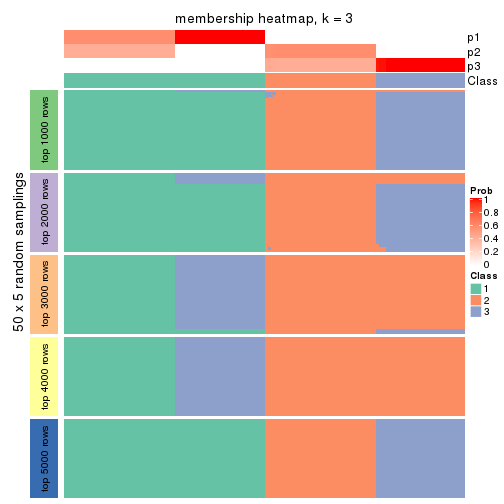</p>

</div>
<div id='tab-MAD-pam-membership-heatmap-3'>
<pre><code class="r">membership_heatmap(res, k = 4)
</code></pre>

<p></p>

</div>
<div id='tab-MAD-pam-membership-heatmap-4'>
<pre><code class="r">membership_heatmap(res, k = 5)
</code></pre>

<p></p>

</div>
<div id='tab-MAD-pam-membership-heatmap-5'>
<pre><code class="r">membership_heatmap(res, k = 6)
</code></pre>

<p></p>

</div>
</div>

As soon as we have had the classes for columns, we can look for signatures
which are significantly different between classes which can be candidate marks
for certain classes. Following are the heatmaps for signatures.


Signature heatmaps where rows are scaled:


<script>
$( function() {
	$( '#tabs-MAD-pam-get-signatures' ).tabs();
} );
</script>
<div id='tabs-MAD-pam-get-signatures'>
<ul>
<li><a href='#tab-MAD-pam-get-signatures-1'>k = 2</a></li>
<li><a href='#tab-MAD-pam-get-signatures-2'>k = 3</a></li>
<li><a href='#tab-MAD-pam-get-signatures-3'>k = 4</a></li>
<li><a href='#tab-MAD-pam-get-signatures-4'>k = 5</a></li>
<li><a href='#tab-MAD-pam-get-signatures-5'>k = 6</a></li>
</ul>
<div id='tab-MAD-pam-get-signatures-1'>
<pre><code class="r">get_signatures(res, k = 2)
</code></pre>

<p></p>

</div>
<div id='tab-MAD-pam-get-signatures-2'>
<pre><code class="r">get_signatures(res, k = 3)
</code></pre>

<p></p>

</div>
<div id='tab-MAD-pam-get-signatures-3'>
<pre><code class="r">get_signatures(res, k = 4)
</code></pre>

<p></p>

</div>
<div id='tab-MAD-pam-get-signatures-4'>
<pre><code class="r">get_signatures(res, k = 5)
</code></pre>

<p></p>

</div>
<div id='tab-MAD-pam-get-signatures-5'>
<pre><code class="r">get_signatures(res, k = 6)
</code></pre>

<p>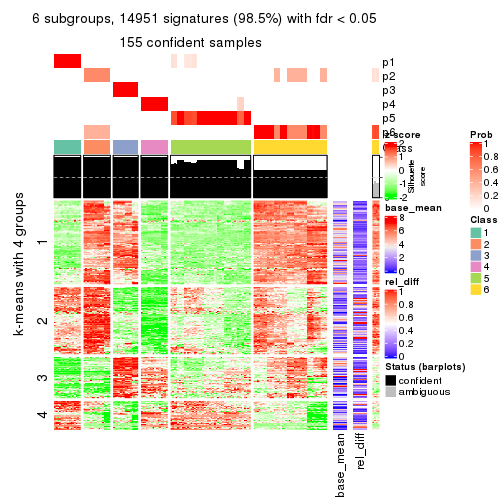</p>

</div>
</div>


Signature heatmaps where rows are not scaled:


<script>
$( function() {
	$( '#tabs-MAD-pam-get-signatures-no-scale' ).tabs();
} );
</script>
<div id='tabs-MAD-pam-get-signatures-no-scale'>
<ul>
<li><a href='#tab-MAD-pam-get-signatures-no-scale-1'>k = 2</a></li>
<li><a href='#tab-MAD-pam-get-signatures-no-scale-2'>k = 3</a></li>
<li><a href='#tab-MAD-pam-get-signatures-no-scale-3'>k = 4</a></li>
<li><a href='#tab-MAD-pam-get-signatures-no-scale-4'>k = 5</a></li>
<li><a href='#tab-MAD-pam-get-signatures-no-scale-5'>k = 6</a></li>
</ul>
<div id='tab-MAD-pam-get-signatures-no-scale-1'>
<pre><code class="r">get_signatures(res, k = 2, scale_rows = FALSE)
</code></pre>

<p></p>

</div>
<div id='tab-MAD-pam-get-signatures-no-scale-2'>
<pre><code class="r">get_signatures(res, k = 3, scale_rows = FALSE)
</code></pre>

<p></p>

</div>
<div id='tab-MAD-pam-get-signatures-no-scale-3'>
<pre><code class="r">get_signatures(res, k = 4, scale_rows = FALSE)
</code></pre>

<p></p>

</div>
<div id='tab-MAD-pam-get-signatures-no-scale-4'>
<pre><code class="r">get_signatures(res, k = 5, scale_rows = FALSE)
</code></pre>

<p></p>

</div>
<div id='tab-MAD-pam-get-signatures-no-scale-5'>
<pre><code class="r">get_signatures(res, k = 6, scale_rows = FALSE)
</code></pre>

<p></p>

</div>
</div>


Compare the overlap of signatures from different k:

```r
compare_signatures(res)
```


`get_signature()` returns a data frame invisibly. TO get the list of signatures, the function
call should be assigned to a variable explicitly. In following code, if `plot` argument is set
to `FALSE`, no heatmap is plotted while only the differential analysis is performed.

```r
# code only for demonstration
tb = get_signature(res, k = ..., plot = FALSE)
```

An example of the output of `tb` is:

```
#>   which_row         fdr    mean_1    mean_2 scaled_mean_1 scaled_mean_2 km
#> 1        38 0.042760348  8.373488  9.131774    -0.5533452     0.5164555  1
#> 2        40 0.018707592  7.106213  8.469186    -0.6173731     0.5762149  1
#> 3        55 0.019134737 10.221463 11.207825    -0.6159697     0.5749050  1
#> 4        59 0.006059896  5.921854  7.869574    -0.6899429     0.6439467  1
#> 5        60 0.018055526  8.928898 10.211722    -0.6204761     0.5791110  1
#> 6        98 0.009384629 15.714769 14.887706     0.6635654    -0.6193277  2
...
```

The columns in `tb` are:

1. `which_row`: row indices corresponding to the input matrix.
2. `fdr`: FDR for the differential test. 
3. `mean_x`: The mean value in group x.
4. `scaled_mean_x`: The mean value in group x after rows are scaled.
5. `km`: Row groups if k-means clustering is applied to rows.


UMAP plot which shows how samples are separated.


<script>
$( function() {
	$( '#tabs-MAD-pam-dimension-reduction' ).tabs();
} );
</script>
<div id='tabs-MAD-pam-dimension-reduction'>
<ul>
<li><a href='#tab-MAD-pam-dimension-reduction-1'>k = 2</a></li>
<li><a href='#tab-MAD-pam-dimension-reduction-2'>k = 3</a></li>
<li><a href='#tab-MAD-pam-dimension-reduction-3'>k = 4</a></li>
<li><a href='#tab-MAD-pam-dimension-reduction-4'>k = 5</a></li>
<li><a href='#tab-MAD-pam-dimension-reduction-5'>k = 6</a></li>
</ul>
<div id='tab-MAD-pam-dimension-reduction-1'>
<pre><code class="r">dimension_reduction(res, k = 2, method = &quot;UMAP&quot;)
</code></pre>

<p></p>

</div>
<div id='tab-MAD-pam-dimension-reduction-2'>
<pre><code class="r">dimension_reduction(res, k = 3, method = &quot;UMAP&quot;)
</code></pre>

<p></p>

</div>
<div id='tab-MAD-pam-dimension-reduction-3'>
<pre><code class="r">dimension_reduction(res, k = 4, method = &quot;UMAP&quot;)
</code></pre>

<p></p>

</div>
<div id='tab-MAD-pam-dimension-reduction-4'>
<pre><code class="r">dimension_reduction(res, k = 5, method = &quot;UMAP&quot;)
</code></pre>

<p></p>

</div>
<div id='tab-MAD-pam-dimension-reduction-5'>
<pre><code class="r">dimension_reduction(res, k = 6, method = &quot;UMAP&quot;)
</code></pre>

<p></p>

</div>
</div>


Following heatmap shows how subgroups are split when increasing `k`:

```r
collect_classes(res)
```


If matrix rows can be associated to genes, consider to use `GO_Enrichment(res,
...)` to perform function enrichment for the signature genes.


 

---------------------------------------------------


### MAD:mclust**


The object with results only for a single top-value method and a single partition method 
can be extracted as:

```r
res = res_list["MAD", "mclust"]
# you can also extract it by
# res = res_list["MAD:mclust"]
```

A summary of `res` and all the functions that can be applied to it:

```r
res
```

```
#> A 'ConsensusPartition' object with k = 2, 3, 4, 5, 6.
#>   On a matrix with 15185 rows and 159 columns.
#>   Top rows (1000, 2000, 3000, 4000, 5000) are extracted by 'MAD' method.
#>   Subgroups are detected by 'mclust' method.
#>   Performed in total 1250 partitions by row resampling.
#>   Best k for subgroups seems to be 2.
#> 
#> Following methods can be applied to this 'ConsensusPartition' object:
#>  [1] "cola_report"             "collect_classes"         "collect_plots"          
#>  [4] "collect_stats"           "colnames"                "compare_signatures"     
#>  [7] "consensus_heatmap"       "dimension_reduction"     "functional_enrichment"  
#> [10] "get_anno_col"            "get_anno"                "get_classes"            
#> [13] "get_consensus"           "get_matrix"              "get_membership"         
#> [16] "get_param"               "get_signatures"          "get_stats"              
#> [19] "is_best_k"               "is_stable_k"             "membership_heatmap"     
#> [22] "ncol"                    "nrow"                    "plot_ecdf"              
#> [25] "rownames"                "select_partition_number" "show"                   
#> [28] "suggest_best_k"          "test_to_known_factors"
```

`collect_plots()` function collects all the plots made from `res` for all `k` (number of partitions)
into one single page to provide an easy and fast comparison between different `k`.

```r
collect_plots(res)
```


The plots are:

- The first row: a plot of the ECDF (Empirical cumulative distribution
  function) curves of the consensus matrix for each `k` and the heatmap of
  predicted classes for each `k`.
- The second row: heatmaps of the consensus matrix for each `k`.
- The third row: heatmaps of the membership matrix for each `k`.
- The fouth row: heatmaps of the signatures for each `k`.

All the plots in panels can be made by individual functions and they are
plotted later in this section.

`select_partition_number()` produces several plots showing different
statistics for choosing "optimized" `k`. There are following statistics:

- ECDF curves of the consensus matrix for each `k`;
- 1-PAC. [The PAC
  score](https://en.wikipedia.org/wiki/Consensus_clustering#Over-interpretation_potential_of_consensus_clustering)
  measures the proportion of the ambiguous subgrouping.
- Mean silhouette score.
- Concordance. The mean probability of fiting the consensus class ids in all
  partitions.
- Area increased. Denote $A_k$ as the area under the ECDF curve for current
  `k`, the area increased is defined as $A_k - A_{k-1}$.
- Rand index. The percent of pairs of samples that are both in a same cluster
  or both are not in a same cluster in the partition of k and k-1.
- Jaccard index. The ratio of pairs of samples are both in a same cluster in
  the partition of k and k-1 and the pairs of samples are both in a same
  cluster in the partition k or k-1.

The detailed explanations of these statistics can be found in [the cola
vignette](http://bioconductor.org/packages/devel/bioc/vignettes/cola/inst/doc/cola.html#toc_13).

Generally speaking, lower PAC score, higher mean silhouette score or higher
concordance corresponds to better partition. Rand index and Jaccard index
measure how similar the current partition is compared to partition with `k-1`.
If they are too similar, we won't accept `k` is better than `k-1`.

```r
select_partition_number(res)
```


The numeric values for all these statistics can be obtained by `get_stats()`.

```r
get_stats(res)
```

```
#>   k 1-PAC mean_silhouette concordance area_increased  Rand Jaccard
#> 2 2 1.000           1.000       1.000          0.504 0.497   0.497
#> 3 3 0.734           0.866       0.911          0.215 0.906   0.811
#> 4 4 0.668           0.769       0.830          0.128 0.934   0.836
#> 5 5 0.715           0.698       0.794          0.121 0.884   0.656
#> 6 6 0.755           0.686       0.789          0.051 0.944   0.751
```

`suggest_best_k()` suggests the best $k$ based on these statistics. The rules are as follows:

- All $k$ with Jaccard index larger than 0.95 are removed because the increase of
  the partition number does not provides enough extra information. If all $k$ are removed,
  the best $k$ is assigned by `NA`.
- For $k$ with 1-PAC larger than 0.9, the maximal $k$ is taken as the "best k". Other $k$ is called "optional k".
- If it does not fit the second rule. The $k$ with the highest vote of highest
  1-PAC, mean silhouette and concordance is taken as the "best k".

```r
suggest_best_k(res)
```

```
#> [1] 2
```


Following shows the table of the partitions (You need to click the **show/hide
code output** link to see it). The membership matrix (columns with name `p*`)
is inferred by
[`clue::cl_consensus()`](https://www.rdocumentation.org/link/cl_consensus?package=clue)
function with the `SE` method. Basically the value in the membership matrix
represents the probability to belong to a certain group. The finall class
label for an item is determined with the group with highest probability it
belongs to.

In `get_classes()` function, the entropy is calculated from the membership
matrix and the silhouette score is calculated from the consensus matrix.


<script>
$( function() {
	$( '#tabs-MAD-mclust-get-classes' ).tabs();
} );
</script>
<div id='tabs-MAD-mclust-get-classes'>
<ul>
<li><a href='#tab-MAD-mclust-get-classes-1'>k = 2</a></li>
<li><a href='#tab-MAD-mclust-get-classes-2'>k = 3</a></li>
<li><a href='#tab-MAD-mclust-get-classes-3'>k = 4</a></li>
<li><a href='#tab-MAD-mclust-get-classes-4'>k = 5</a></li>
<li><a href='#tab-MAD-mclust-get-classes-5'>k = 6</a></li>
</ul>

<div id='tab-MAD-mclust-get-classes-1'>
<p><a id='tab-MAD-mclust-get-classes-1-a' style='color:#0366d6' href='#'>show/hide code output</a></p>
<pre><code class="r">cbind(get_classes(res, k = 2), get_membership(res, k = 2))
</code></pre>

<pre><code>#&gt;            class entropy silhouette p1 p2
#&gt; SRR1706767     1       0          1  1  0
#&gt; SRR1706768     1       0          1  1  0
#&gt; SRR1706769     1       0          1  1  0
#&gt; SRR1706770     1       0          1  1  0
#&gt; SRR1706771     1       0          1  1  0
#&gt; SRR1706772     1       0          1  1  0
#&gt; SRR1706773     1       0          1  1  0
#&gt; SRR1706774     1       0          1  1  0
#&gt; SRR1706775     1       0          1  1  0
#&gt; SRR1706776     1       0          1  1  0
#&gt; SRR1706777     1       0          1  1  0
#&gt; SRR1706778     1       0          1  1  0
#&gt; SRR1706779     1       0          1  1  0
#&gt; SRR1706780     1       0          1  1  0
#&gt; SRR1706781     1       0          1  1  0
#&gt; SRR1706782     1       0          1  1  0
#&gt; SRR1706783     1       0          1  1  0
#&gt; SRR1706784     1       0          1  1  0
#&gt; SRR1706785     1       0          1  1  0
#&gt; SRR1706786     1       0          1  1  0
#&gt; SRR1706787     1       0          1  1  0
#&gt; SRR1706788     1       0          1  1  0
#&gt; SRR1706789     1       0          1  1  0
#&gt; SRR1706790     1       0          1  1  0
#&gt; SRR1706791     1       0          1  1  0
#&gt; SRR1706792     1       0          1  1  0
#&gt; SRR1706793     1       0          1  1  0
#&gt; SRR1706794     1       0          1  1  0
#&gt; SRR1706795     1       0          1  1  0
#&gt; SRR1706796     1       0          1  1  0
#&gt; SRR1706797     1       0          1  1  0
#&gt; SRR1706798     1       0          1  1  0
#&gt; SRR1706799     1       0          1  1  0
#&gt; SRR1706800     1       0          1  1  0
#&gt; SRR1706801     1       0          1  1  0
#&gt; SRR1706802     1       0          1  1  0
#&gt; SRR1706803     1       0          1  1  0
#&gt; SRR1706804     1       0          1  1  0
#&gt; SRR1706805     1       0          1  1  0
#&gt; SRR1706806     1       0          1  1  0
#&gt; SRR1706811     1       0          1  1  0
#&gt; SRR1706812     1       0          1  1  0
#&gt; SRR1706813     1       0          1  1  0
#&gt; SRR1706814     1       0          1  1  0
#&gt; SRR1706807     1       0          1  1  0
#&gt; SRR1706808     1       0          1  1  0
#&gt; SRR1706809     1       0          1  1  0
#&gt; SRR1706810     1       0          1  1  0
#&gt; SRR1706815     1       0          1  1  0
#&gt; SRR1706816     1       0          1  1  0
#&gt; SRR1706817     1       0          1  1  0
#&gt; SRR1706818     1       0          1  1  0
#&gt; SRR1706819     1       0          1  1  0
#&gt; SRR1706820     1       0          1  1  0
#&gt; SRR1706821     1       0          1  1  0
#&gt; SRR1706822     1       0          1  1  0
#&gt; SRR1706823     1       0          1  1  0
#&gt; SRR1706824     1       0          1  1  0
#&gt; SRR1706825     1       0          1  1  0
#&gt; SRR1706826     1       0          1  1  0
#&gt; SRR1706827     1       0          1  1  0
#&gt; SRR1706828     1       0          1  1  0
#&gt; SRR1706829     1       0          1  1  0
#&gt; SRR1706830     1       0          1  1  0
#&gt; SRR1706835     1       0          1  1  0
#&gt; SRR1706836     1       0          1  1  0
#&gt; SRR1706837     1       0          1  1  0
#&gt; SRR1706838     1       0          1  1  0
#&gt; SRR1706831     1       0          1  1  0
#&gt; SRR1706832     1       0          1  1  0
#&gt; SRR1706833     1       0          1  1  0
#&gt; SRR1706834     1       0          1  1  0
#&gt; SRR1706839     1       0          1  1  0
#&gt; SRR1706840     1       0          1  1  0
#&gt; SRR1706841     1       0          1  1  0
#&gt; SRR1706842     1       0          1  1  0
#&gt; SRR1706847     2       0          1  0  1
#&gt; SRR1706848     2       0          1  0  1
#&gt; SRR1706849     2       0          1  0  1
#&gt; SRR1706850     2       0          1  0  1
#&gt; SRR1706843     1       0          1  1  0
#&gt; SRR1706844     1       0          1  1  0
#&gt; SRR1706845     1       0          1  1  0
#&gt; SRR1706846     1       0          1  1  0
#&gt; SRR1706851     2       0          1  0  1
#&gt; SRR1706852     2       0          1  0  1
#&gt; SRR1706853     2       0          1  0  1
#&gt; SRR1706854     2       0          1  0  1
#&gt; SRR1706855     2       0          1  0  1
#&gt; SRR1706856     2       0          1  0  1
#&gt; SRR1706857     2       0          1  0  1
#&gt; SRR1706858     2       0          1  0  1
#&gt; SRR1706859     2       0          1  0  1
#&gt; SRR1706860     2       0          1  0  1
#&gt; SRR1706861     2       0          1  0  1
#&gt; SRR1706862     2       0          1  0  1
#&gt; SRR1706867     2       0          1  0  1
#&gt; SRR1706869     2       0          1  0  1
#&gt; SRR1706870     2       0          1  0  1
#&gt; SRR1706863     2       0          1  0  1
#&gt; SRR1706864     2       0          1  0  1
#&gt; SRR1706865     2       0          1  0  1
#&gt; SRR1706866     2       0          1  0  1
#&gt; SRR1706871     2       0          1  0  1
#&gt; SRR1706872     2       0          1  0  1
#&gt; SRR1706873     2       0          1  0  1
#&gt; SRR1706874     2       0          1  0  1
#&gt; SRR1706879     2       0          1  0  1
#&gt; SRR1706880     2       0          1  0  1
#&gt; SRR1706881     2       0          1  0  1
#&gt; SRR1706882     2       0          1  0  1
#&gt; SRR1706883     2       0          1  0  1
#&gt; SRR1706884     2       0          1  0  1
#&gt; SRR1706885     2       0          1  0  1
#&gt; SRR1706886     2       0          1  0  1
#&gt; SRR1706875     2       0          1  0  1
#&gt; SRR1706876     2       0          1  0  1
#&gt; SRR1706877     2       0          1  0  1
#&gt; SRR1706878     2       0          1  0  1
#&gt; SRR1706887     2       0          1  0  1
#&gt; SRR1706888     2       0          1  0  1
#&gt; SRR1706889     2       0          1  0  1
#&gt; SRR1706890     2       0          1  0  1
#&gt; SRR1706891     2       0          1  0  1
#&gt; SRR1706892     2       0          1  0  1
#&gt; SRR1706893     2       0          1  0  1
#&gt; SRR1706894     2       0          1  0  1
#&gt; SRR1706895     2       0          1  0  1
#&gt; SRR1706896     2       0          1  0  1
#&gt; SRR1706897     2       0          1  0  1
#&gt; SRR1706898     2       0          1  0  1
#&gt; SRR1706899     2       0          1  0  1
#&gt; SRR1706900     2       0          1  0  1
#&gt; SRR1706901     2       0          1  0  1
#&gt; SRR1706902     2       0          1  0  1
#&gt; SRR1706907     2       0          1  0  1
#&gt; SRR1706908     2       0          1  0  1
#&gt; SRR1706909     2       0          1  0  1
#&gt; SRR1706910     2       0          1  0  1
#&gt; SRR1706903     2       0          1  0  1
#&gt; SRR1706904     2       0          1  0  1
#&gt; SRR1706905     2       0          1  0  1
#&gt; SRR1706906     2       0          1  0  1
#&gt; SRR1706911     2       0          1  0  1
#&gt; SRR1706912     2       0          1  0  1
#&gt; SRR1706913     2       0          1  0  1
#&gt; SRR1706914     2       0          1  0  1
#&gt; SRR1706919     2       0          1  0  1
#&gt; SRR1706920     2       0          1  0  1
#&gt; SRR1706921     2       0          1  0  1
#&gt; SRR1706922     2       0          1  0  1
#&gt; SRR1706915     2       0          1  0  1
#&gt; SRR1706916     2       0          1  0  1
#&gt; SRR1706917     2       0          1  0  1
#&gt; SRR1706918     2       0          1  0  1
#&gt; SRR1706923     2       0          1  0  1
#&gt; SRR1706924     2       0          1  0  1
#&gt; SRR1706925     2       0          1  0  1
#&gt; SRR1706926     2       0          1  0  1
</code></pre>

<script>
$('#tab-MAD-mclust-get-classes-1-a').parent().next().next().hide();
$('#tab-MAD-mclust-get-classes-1-a').click(function(){
  $('#tab-MAD-mclust-get-classes-1-a').parent().next().next().toggle();
  return(false);
});
</script>
</div>

<div id='tab-MAD-mclust-get-classes-2'>
<p><a id='tab-MAD-mclust-get-classes-2-a' style='color:#0366d6' href='#'>show/hide code output</a></p>
<pre><code class="r">cbind(get_classes(res, k = 3), get_membership(res, k = 3))
</code></pre>

<pre><code>#&gt;            class entropy silhouette    p1    p2    p3
#&gt; SRR1706767     1  0.0424      0.952 0.992 0.000 0.008
#&gt; SRR1706768     1  0.0424      0.952 0.992 0.000 0.008
#&gt; SRR1706769     1  0.0424      0.952 0.992 0.000 0.008
#&gt; SRR1706770     1  0.0424      0.952 0.992 0.000 0.008
#&gt; SRR1706771     1  0.0000      0.954 1.000 0.000 0.000
#&gt; SRR1706772     1  0.0000      0.954 1.000 0.000 0.000
#&gt; SRR1706773     1  0.0000      0.954 1.000 0.000 0.000
#&gt; SRR1706774     1  0.0000      0.954 1.000 0.000 0.000
#&gt; SRR1706775     1  0.0000      0.954 1.000 0.000 0.000
#&gt; SRR1706776     1  0.0000      0.954 1.000 0.000 0.000
#&gt; SRR1706777     1  0.0000      0.954 1.000 0.000 0.000
#&gt; SRR1706778     1  0.0000      0.954 1.000 0.000 0.000
#&gt; SRR1706779     1  0.0000      0.954 1.000 0.000 0.000
#&gt; SRR1706780     1  0.0000      0.954 1.000 0.000 0.000
#&gt; SRR1706781     1  0.0000      0.954 1.000 0.000 0.000
#&gt; SRR1706782     1  0.0000      0.954 1.000 0.000 0.000
#&gt; SRR1706783     1  0.4796      0.801 0.780 0.000 0.220
#&gt; SRR1706784     1  0.4796      0.801 0.780 0.000 0.220
#&gt; SRR1706785     1  0.4796      0.801 0.780 0.000 0.220
#&gt; SRR1706786     1  0.4796      0.801 0.780 0.000 0.220
#&gt; SRR1706787     1  0.0424      0.952 0.992 0.000 0.008
#&gt; SRR1706788     1  0.0424      0.952 0.992 0.000 0.008
#&gt; SRR1706789     1  0.0424      0.952 0.992 0.000 0.008
#&gt; SRR1706790     1  0.0424      0.952 0.992 0.000 0.008
#&gt; SRR1706791     1  0.0000      0.954 1.000 0.000 0.000
#&gt; SRR1706792     1  0.0000      0.954 1.000 0.000 0.000
#&gt; SRR1706793     1  0.0000      0.954 1.000 0.000 0.000
#&gt; SRR1706794     1  0.0000      0.954 1.000 0.000 0.000
#&gt; SRR1706795     1  0.0424      0.951 0.992 0.000 0.008
#&gt; SRR1706796     1  0.0424      0.951 0.992 0.000 0.008
#&gt; SRR1706797     1  0.0424      0.951 0.992 0.000 0.008
#&gt; SRR1706798     1  0.0424      0.951 0.992 0.000 0.008
#&gt; SRR1706799     1  0.0000      0.954 1.000 0.000 0.000
#&gt; SRR1706800     1  0.0000      0.954 1.000 0.000 0.000
#&gt; SRR1706801     1  0.0000      0.954 1.000 0.000 0.000
#&gt; SRR1706802     1  0.0000      0.954 1.000 0.000 0.000
#&gt; SRR1706803     1  0.4702      0.806 0.788 0.000 0.212
#&gt; SRR1706804     1  0.4702      0.806 0.788 0.000 0.212
#&gt; SRR1706805     1  0.4702      0.806 0.788 0.000 0.212
#&gt; SRR1706806     1  0.4702      0.806 0.788 0.000 0.212
#&gt; SRR1706811     1  0.0000      0.954 1.000 0.000 0.000
#&gt; SRR1706812     1  0.0000      0.954 1.000 0.000 0.000
#&gt; SRR1706813     1  0.0000      0.954 1.000 0.000 0.000
#&gt; SRR1706814     1  0.0000      0.954 1.000 0.000 0.000
#&gt; SRR1706807     1  0.0424      0.952 0.992 0.000 0.008
#&gt; SRR1706808     1  0.0424      0.952 0.992 0.000 0.008
#&gt; SRR1706809     1  0.0424      0.952 0.992 0.000 0.008
#&gt; SRR1706810     1  0.0424      0.952 0.992 0.000 0.008
#&gt; SRR1706815     1  0.0000      0.954 1.000 0.000 0.000
#&gt; SRR1706816     1  0.0000      0.954 1.000 0.000 0.000
#&gt; SRR1706817     1  0.0000      0.954 1.000 0.000 0.000
#&gt; SRR1706818     1  0.0000      0.954 1.000 0.000 0.000
#&gt; SRR1706819     1  0.0000      0.954 1.000 0.000 0.000
#&gt; SRR1706820     1  0.0000      0.954 1.000 0.000 0.000
#&gt; SRR1706821     1  0.0000      0.954 1.000 0.000 0.000
#&gt; SRR1706822     1  0.0000      0.954 1.000 0.000 0.000
#&gt; SRR1706823     1  0.4702      0.806 0.788 0.000 0.212
#&gt; SRR1706824     1  0.4702      0.806 0.788 0.000 0.212
#&gt; SRR1706825     1  0.4702      0.806 0.788 0.000 0.212
#&gt; SRR1706826     1  0.4702      0.806 0.788 0.000 0.212
#&gt; SRR1706827     1  0.0592      0.951 0.988 0.000 0.012
#&gt; SRR1706828     1  0.0424      0.952 0.992 0.000 0.008
#&gt; SRR1706829     1  0.0424      0.952 0.992 0.000 0.008
#&gt; SRR1706830     1  0.0424      0.952 0.992 0.000 0.008
#&gt; SRR1706835     1  0.0000      0.954 1.000 0.000 0.000
#&gt; SRR1706836     1  0.0000      0.954 1.000 0.000 0.000
#&gt; SRR1706837     1  0.0000      0.954 1.000 0.000 0.000
#&gt; SRR1706838     1  0.0000      0.954 1.000 0.000 0.000
#&gt; SRR1706831     1  0.0000      0.954 1.000 0.000 0.000
#&gt; SRR1706832     1  0.0000      0.954 1.000 0.000 0.000
#&gt; SRR1706833     1  0.0000      0.954 1.000 0.000 0.000
#&gt; SRR1706834     1  0.0000      0.954 1.000 0.000 0.000
#&gt; SRR1706839     1  0.0000      0.954 1.000 0.000 0.000
#&gt; SRR1706840     1  0.0000      0.954 1.000 0.000 0.000
#&gt; SRR1706841     1  0.0000      0.954 1.000 0.000 0.000
#&gt; SRR1706842     1  0.0000      0.954 1.000 0.000 0.000
#&gt; SRR1706847     2  0.3686      0.782 0.000 0.860 0.140
#&gt; SRR1706848     2  0.3686      0.782 0.000 0.860 0.140
#&gt; SRR1706849     2  0.3686      0.782 0.000 0.860 0.140
#&gt; SRR1706850     2  0.3686      0.782 0.000 0.860 0.140
#&gt; SRR1706843     1  0.4702      0.806 0.788 0.000 0.212
#&gt; SRR1706844     1  0.4750      0.804 0.784 0.000 0.216
#&gt; SRR1706845     1  0.4750      0.804 0.784 0.000 0.216
#&gt; SRR1706846     1  0.4702      0.806 0.788 0.000 0.212
#&gt; SRR1706851     2  0.0000      0.858 0.000 1.000 0.000
#&gt; SRR1706852     2  0.0000      0.858 0.000 1.000 0.000
#&gt; SRR1706853     2  0.0000      0.858 0.000 1.000 0.000
#&gt; SRR1706854     2  0.0000      0.858 0.000 1.000 0.000
#&gt; SRR1706855     2  0.0000      0.858 0.000 1.000 0.000
#&gt; SRR1706856     2  0.0000      0.858 0.000 1.000 0.000
#&gt; SRR1706857     2  0.0000      0.858 0.000 1.000 0.000
#&gt; SRR1706858     2  0.0000      0.858 0.000 1.000 0.000
#&gt; SRR1706859     2  0.1163      0.854 0.000 0.972 0.028
#&gt; SRR1706860     2  0.1163      0.854 0.000 0.972 0.028
#&gt; SRR1706861     2  0.1163      0.854 0.000 0.972 0.028
#&gt; SRR1706862     2  0.1163      0.854 0.000 0.972 0.028
#&gt; SRR1706867     2  0.3686      0.782 0.000 0.860 0.140
#&gt; SRR1706869     2  0.3686      0.782 0.000 0.860 0.140
#&gt; SRR1706870     2  0.3686      0.782 0.000 0.860 0.140
#&gt; SRR1706863     2  0.6079      0.586 0.000 0.612 0.388
#&gt; SRR1706864     2  0.6079      0.586 0.000 0.612 0.388
#&gt; SRR1706865     2  0.6079      0.586 0.000 0.612 0.388
#&gt; SRR1706866     2  0.6079      0.586 0.000 0.612 0.388
#&gt; SRR1706871     2  0.0000      0.858 0.000 1.000 0.000
#&gt; SRR1706872     2  0.0000      0.858 0.000 1.000 0.000
#&gt; SRR1706873     2  0.0000      0.858 0.000 1.000 0.000
#&gt; SRR1706874     2  0.0000      0.858 0.000 1.000 0.000
#&gt; SRR1706879     2  0.1163      0.854 0.000 0.972 0.028
#&gt; SRR1706880     2  0.1163      0.854 0.000 0.972 0.028
#&gt; SRR1706881     2  0.1163      0.854 0.000 0.972 0.028
#&gt; SRR1706882     2  0.1163      0.854 0.000 0.972 0.028
#&gt; SRR1706883     2  0.6079      0.586 0.000 0.612 0.388
#&gt; SRR1706884     2  0.6079      0.586 0.000 0.612 0.388
#&gt; SRR1706885     2  0.6079      0.586 0.000 0.612 0.388
#&gt; SRR1706886     2  0.6079      0.586 0.000 0.612 0.388
#&gt; SRR1706875     2  0.0000      0.858 0.000 1.000 0.000
#&gt; SRR1706876     2  0.0000      0.858 0.000 1.000 0.000
#&gt; SRR1706877     2  0.0000      0.858 0.000 1.000 0.000
#&gt; SRR1706878     2  0.0000      0.858 0.000 1.000 0.000
#&gt; SRR1706887     3  0.5178      0.899 0.000 0.256 0.744
#&gt; SRR1706888     3  0.5178      0.899 0.000 0.256 0.744
#&gt; SRR1706889     3  0.5178      0.899 0.000 0.256 0.744
#&gt; SRR1706890     3  0.5178      0.899 0.000 0.256 0.744
#&gt; SRR1706891     3  0.5138      0.906 0.000 0.252 0.748
#&gt; SRR1706892     3  0.5138      0.906 0.000 0.252 0.748
#&gt; SRR1706893     3  0.5138      0.906 0.000 0.252 0.748
#&gt; SRR1706894     3  0.5138      0.906 0.000 0.252 0.748
#&gt; SRR1706895     3  0.5098      0.907 0.000 0.248 0.752
#&gt; SRR1706896     3  0.5098      0.907 0.000 0.248 0.752
#&gt; SRR1706897     3  0.5098      0.907 0.000 0.248 0.752
#&gt; SRR1706898     3  0.5098      0.907 0.000 0.248 0.752
#&gt; SRR1706899     3  0.4796      0.898 0.000 0.220 0.780
#&gt; SRR1706900     3  0.4796      0.898 0.000 0.220 0.780
#&gt; SRR1706901     3  0.4796      0.898 0.000 0.220 0.780
#&gt; SRR1706902     3  0.4796      0.898 0.000 0.220 0.780
#&gt; SRR1706907     2  0.3686      0.782 0.000 0.860 0.140
#&gt; SRR1706908     2  0.3686      0.782 0.000 0.860 0.140
#&gt; SRR1706909     2  0.3686      0.782 0.000 0.860 0.140
#&gt; SRR1706910     2  0.3686      0.782 0.000 0.860 0.140
#&gt; SRR1706903     3  0.1031      0.728 0.000 0.024 0.976
#&gt; SRR1706904     3  0.1031      0.728 0.000 0.024 0.976
#&gt; SRR1706905     3  0.1031      0.728 0.000 0.024 0.976
#&gt; SRR1706906     3  0.1031      0.728 0.000 0.024 0.976
#&gt; SRR1706911     2  0.0000      0.858 0.000 1.000 0.000
#&gt; SRR1706912     2  0.0000      0.858 0.000 1.000 0.000
#&gt; SRR1706913     2  0.0000      0.858 0.000 1.000 0.000
#&gt; SRR1706914     2  0.0000      0.858 0.000 1.000 0.000
#&gt; SRR1706919     2  0.1163      0.854 0.000 0.972 0.028
#&gt; SRR1706920     2  0.1163      0.854 0.000 0.972 0.028
#&gt; SRR1706921     2  0.1163      0.854 0.000 0.972 0.028
#&gt; SRR1706922     2  0.1163      0.854 0.000 0.972 0.028
#&gt; SRR1706915     2  0.0000      0.858 0.000 1.000 0.000
#&gt; SRR1706916     2  0.0000      0.858 0.000 1.000 0.000
#&gt; SRR1706917     2  0.0000      0.858 0.000 1.000 0.000
#&gt; SRR1706918     2  0.0000      0.858 0.000 1.000 0.000
#&gt; SRR1706923     2  0.6079      0.586 0.000 0.612 0.388
#&gt; SRR1706924     2  0.6079      0.586 0.000 0.612 0.388
#&gt; SRR1706925     2  0.6079      0.586 0.000 0.612 0.388
#&gt; SRR1706926     2  0.6079      0.586 0.000 0.612 0.388
</code></pre>

<script>
$('#tab-MAD-mclust-get-classes-2-a').parent().next().next().hide();
$('#tab-MAD-mclust-get-classes-2-a').click(function(){
  $('#tab-MAD-mclust-get-classes-2-a').parent().next().next().toggle();
  return(false);
});
</script>
</div>

<div id='tab-MAD-mclust-get-classes-3'>
<p><a id='tab-MAD-mclust-get-classes-3-a' style='color:#0366d6' href='#'>show/hide code output</a></p>
<pre><code class="r">cbind(get_classes(res, k = 4), get_membership(res, k = 4))
</code></pre>

<pre><code>#&gt;            class entropy silhouette    p1    p2    p3    p4
#&gt; SRR1706767     1  0.4817      0.680 0.612 0.000 0.388 0.000
#&gt; SRR1706768     1  0.4817      0.680 0.612 0.000 0.388 0.000
#&gt; SRR1706769     1  0.4817      0.680 0.612 0.000 0.388 0.000
#&gt; SRR1706770     1  0.4817      0.680 0.612 0.000 0.388 0.000
#&gt; SRR1706771     1  0.1474      0.861 0.948 0.000 0.052 0.000
#&gt; SRR1706772     1  0.1557      0.860 0.944 0.000 0.056 0.000
#&gt; SRR1706773     1  0.1557      0.860 0.944 0.000 0.056 0.000
#&gt; SRR1706774     1  0.1557      0.860 0.944 0.000 0.056 0.000
#&gt; SRR1706775     1  0.0188      0.867 0.996 0.000 0.004 0.000
#&gt; SRR1706776     1  0.0188      0.867 0.996 0.000 0.004 0.000
#&gt; SRR1706777     1  0.0188      0.867 0.996 0.000 0.004 0.000
#&gt; SRR1706778     1  0.0188      0.867 0.996 0.000 0.004 0.000
#&gt; SRR1706779     1  0.0188      0.867 0.996 0.000 0.004 0.000
#&gt; SRR1706780     1  0.0188      0.867 0.996 0.000 0.004 0.000
#&gt; SRR1706781     1  0.0188      0.867 0.996 0.000 0.004 0.000
#&gt; SRR1706782     1  0.0188      0.867 0.996 0.000 0.004 0.000
#&gt; SRR1706783     1  0.5095      0.760 0.752 0.204 0.020 0.024
#&gt; SRR1706784     1  0.5095      0.760 0.752 0.204 0.020 0.024
#&gt; SRR1706785     1  0.5095      0.760 0.752 0.204 0.020 0.024
#&gt; SRR1706786     1  0.5095      0.760 0.752 0.204 0.020 0.024
#&gt; SRR1706787     1  0.4817      0.680 0.612 0.000 0.388 0.000
#&gt; SRR1706788     1  0.4817      0.680 0.612 0.000 0.388 0.000
#&gt; SRR1706789     1  0.4817      0.680 0.612 0.000 0.388 0.000
#&gt; SRR1706790     1  0.4817      0.680 0.612 0.000 0.388 0.000
#&gt; SRR1706791     1  0.1474      0.861 0.948 0.000 0.052 0.000
#&gt; SRR1706792     1  0.1474      0.861 0.948 0.000 0.052 0.000
#&gt; SRR1706793     1  0.1474      0.861 0.948 0.000 0.052 0.000
#&gt; SRR1706794     1  0.1557      0.860 0.944 0.000 0.056 0.000
#&gt; SRR1706795     1  0.0188      0.867 0.996 0.000 0.004 0.000
#&gt; SRR1706796     1  0.0188      0.867 0.996 0.000 0.004 0.000
#&gt; SRR1706797     1  0.0188      0.867 0.996 0.000 0.004 0.000
#&gt; SRR1706798     1  0.0188      0.867 0.996 0.000 0.004 0.000
#&gt; SRR1706799     1  0.0188      0.867 0.996 0.000 0.004 0.000
#&gt; SRR1706800     1  0.0188      0.867 0.996 0.000 0.004 0.000
#&gt; SRR1706801     1  0.0188      0.867 0.996 0.000 0.004 0.000
#&gt; SRR1706802     1  0.0188      0.867 0.996 0.000 0.004 0.000
#&gt; SRR1706803     1  0.5095      0.760 0.752 0.204 0.020 0.024
#&gt; SRR1706804     1  0.5095      0.760 0.752 0.204 0.020 0.024
#&gt; SRR1706805     1  0.5095      0.760 0.752 0.204 0.020 0.024
#&gt; SRR1706806     1  0.5095      0.760 0.752 0.204 0.020 0.024
#&gt; SRR1706811     1  0.1637      0.861 0.940 0.000 0.060 0.000
#&gt; SRR1706812     1  0.1637      0.861 0.940 0.000 0.060 0.000
#&gt; SRR1706813     1  0.1637      0.861 0.940 0.000 0.060 0.000
#&gt; SRR1706814     1  0.1637      0.861 0.940 0.000 0.060 0.000
#&gt; SRR1706807     1  0.4804      0.683 0.616 0.000 0.384 0.000
#&gt; SRR1706808     1  0.4804      0.683 0.616 0.000 0.384 0.000
#&gt; SRR1706809     1  0.4804      0.683 0.616 0.000 0.384 0.000
#&gt; SRR1706810     1  0.4804      0.683 0.616 0.000 0.384 0.000
#&gt; SRR1706815     1  0.0336      0.867 0.992 0.000 0.008 0.000
#&gt; SRR1706816     1  0.0336      0.867 0.992 0.000 0.008 0.000
#&gt; SRR1706817     1  0.0336      0.867 0.992 0.000 0.008 0.000
#&gt; SRR1706818     1  0.0336      0.867 0.992 0.000 0.008 0.000
#&gt; SRR1706819     1  0.0188      0.867 0.996 0.000 0.004 0.000
#&gt; SRR1706820     1  0.0336      0.867 0.992 0.000 0.008 0.000
#&gt; SRR1706821     1  0.0336      0.867 0.992 0.000 0.008 0.000
#&gt; SRR1706822     1  0.0336      0.867 0.992 0.000 0.008 0.000
#&gt; SRR1706823     1  0.4747      0.768 0.764 0.204 0.008 0.024
#&gt; SRR1706824     1  0.4747      0.768 0.764 0.204 0.008 0.024
#&gt; SRR1706825     1  0.4747      0.768 0.764 0.204 0.008 0.024
#&gt; SRR1706826     1  0.4747      0.768 0.764 0.204 0.008 0.024
#&gt; SRR1706827     1  0.4817      0.680 0.612 0.000 0.388 0.000
#&gt; SRR1706828     1  0.4817      0.680 0.612 0.000 0.388 0.000
#&gt; SRR1706829     1  0.4817      0.680 0.612 0.000 0.388 0.000
#&gt; SRR1706830     1  0.4817      0.680 0.612 0.000 0.388 0.000
#&gt; SRR1706835     1  0.0000      0.867 1.000 0.000 0.000 0.000
#&gt; SRR1706836     1  0.0188      0.867 0.996 0.000 0.004 0.000
#&gt; SRR1706837     1  0.0188      0.867 0.996 0.000 0.004 0.000
#&gt; SRR1706838     1  0.0000      0.867 1.000 0.000 0.000 0.000
#&gt; SRR1706831     1  0.1557      0.860 0.944 0.000 0.056 0.000
#&gt; SRR1706832     1  0.1474      0.861 0.948 0.000 0.052 0.000
#&gt; SRR1706833     1  0.1557      0.860 0.944 0.000 0.056 0.000
#&gt; SRR1706834     1  0.1557      0.860 0.944 0.000 0.056 0.000
#&gt; SRR1706839     1  0.0188      0.867 0.996 0.000 0.004 0.000
#&gt; SRR1706840     1  0.0188      0.867 0.996 0.000 0.004 0.000
#&gt; SRR1706841     1  0.0188      0.867 0.996 0.000 0.004 0.000
#&gt; SRR1706842     1  0.0188      0.867 0.996 0.000 0.004 0.000
#&gt; SRR1706847     3  0.4614      0.685 0.000 0.064 0.792 0.144
#&gt; SRR1706848     3  0.4614      0.685 0.000 0.064 0.792 0.144
#&gt; SRR1706849     3  0.4614      0.685 0.000 0.064 0.792 0.144
#&gt; SRR1706850     3  0.4614      0.685 0.000 0.064 0.792 0.144
#&gt; SRR1706843     1  0.5095      0.760 0.752 0.204 0.020 0.024
#&gt; SRR1706844     1  0.5095      0.760 0.752 0.204 0.020 0.024
#&gt; SRR1706845     1  0.5095      0.760 0.752 0.204 0.020 0.024
#&gt; SRR1706846     1  0.5095      0.760 0.752 0.204 0.020 0.024
#&gt; SRR1706851     3  0.6917      0.722 0.000 0.204 0.592 0.204
#&gt; SRR1706852     3  0.6917      0.722 0.000 0.204 0.592 0.204
#&gt; SRR1706853     3  0.6917      0.722 0.000 0.204 0.592 0.204
#&gt; SRR1706854     3  0.6917      0.722 0.000 0.204 0.592 0.204
#&gt; SRR1706855     2  0.3649      0.794 0.000 0.796 0.000 0.204
#&gt; SRR1706856     2  0.3649      0.794 0.000 0.796 0.000 0.204
#&gt; SRR1706857     2  0.3649      0.794 0.000 0.796 0.000 0.204
#&gt; SRR1706858     2  0.3649      0.794 0.000 0.796 0.000 0.204
#&gt; SRR1706859     2  0.3649      0.794 0.000 0.796 0.000 0.204
#&gt; SRR1706860     2  0.3649      0.794 0.000 0.796 0.000 0.204
#&gt; SRR1706861     2  0.3649      0.794 0.000 0.796 0.000 0.204
#&gt; SRR1706862     2  0.3649      0.794 0.000 0.796 0.000 0.204
#&gt; SRR1706867     3  0.4614      0.685 0.000 0.064 0.792 0.144
#&gt; SRR1706869     3  0.4614      0.685 0.000 0.064 0.792 0.144
#&gt; SRR1706870     3  0.4614      0.685 0.000 0.064 0.792 0.144
#&gt; SRR1706863     2  0.3486      0.574 0.000 0.812 0.000 0.188
#&gt; SRR1706864     2  0.3486      0.574 0.000 0.812 0.000 0.188
#&gt; SRR1706865     2  0.3486      0.574 0.000 0.812 0.000 0.188
#&gt; SRR1706866     2  0.3486      0.574 0.000 0.812 0.000 0.188
#&gt; SRR1706871     3  0.6917      0.722 0.000 0.204 0.592 0.204
#&gt; SRR1706872     3  0.6917      0.722 0.000 0.204 0.592 0.204
#&gt; SRR1706873     3  0.6917      0.722 0.000 0.204 0.592 0.204
#&gt; SRR1706874     3  0.6917      0.722 0.000 0.204 0.592 0.204
#&gt; SRR1706879     2  0.3649      0.794 0.000 0.796 0.000 0.204
#&gt; SRR1706880     2  0.3649      0.794 0.000 0.796 0.000 0.204
#&gt; SRR1706881     2  0.3649      0.794 0.000 0.796 0.000 0.204
#&gt; SRR1706882     2  0.3649      0.794 0.000 0.796 0.000 0.204
#&gt; SRR1706883     2  0.3486      0.574 0.000 0.812 0.000 0.188
#&gt; SRR1706884     2  0.3486      0.574 0.000 0.812 0.000 0.188
#&gt; SRR1706885     2  0.3486      0.574 0.000 0.812 0.000 0.188
#&gt; SRR1706886     2  0.3486      0.574 0.000 0.812 0.000 0.188
#&gt; SRR1706875     2  0.3649      0.794 0.000 0.796 0.000 0.204
#&gt; SRR1706876     2  0.3649      0.794 0.000 0.796 0.000 0.204
#&gt; SRR1706877     2  0.3649      0.794 0.000 0.796 0.000 0.204
#&gt; SRR1706878     2  0.3649      0.794 0.000 0.796 0.000 0.204
#&gt; SRR1706887     4  0.4919      0.676 0.000 0.048 0.200 0.752
#&gt; SRR1706888     4  0.4919      0.676 0.000 0.048 0.200 0.752
#&gt; SRR1706889     4  0.4919      0.676 0.000 0.048 0.200 0.752
#&gt; SRR1706890     4  0.4919      0.676 0.000 0.048 0.200 0.752
#&gt; SRR1706891     4  0.0000      0.847 0.000 0.000 0.000 1.000
#&gt; SRR1706892     4  0.0000      0.847 0.000 0.000 0.000 1.000
#&gt; SRR1706893     4  0.0000      0.847 0.000 0.000 0.000 1.000
#&gt; SRR1706894     4  0.0000      0.847 0.000 0.000 0.000 1.000
#&gt; SRR1706895     4  0.0000      0.847 0.000 0.000 0.000 1.000
#&gt; SRR1706896     4  0.0000      0.847 0.000 0.000 0.000 1.000
#&gt; SRR1706897     4  0.0000      0.847 0.000 0.000 0.000 1.000
#&gt; SRR1706898     4  0.0000      0.847 0.000 0.000 0.000 1.000
#&gt; SRR1706899     4  0.0000      0.847 0.000 0.000 0.000 1.000
#&gt; SRR1706900     4  0.0000      0.847 0.000 0.000 0.000 1.000
#&gt; SRR1706901     4  0.0000      0.847 0.000 0.000 0.000 1.000
#&gt; SRR1706902     4  0.0000      0.847 0.000 0.000 0.000 1.000
#&gt; SRR1706907     3  0.4614      0.685 0.000 0.064 0.792 0.144
#&gt; SRR1706908     3  0.4614      0.685 0.000 0.064 0.792 0.144
#&gt; SRR1706909     3  0.4614      0.685 0.000 0.064 0.792 0.144
#&gt; SRR1706910     3  0.4614      0.685 0.000 0.064 0.792 0.144
#&gt; SRR1706903     4  0.4072      0.716 0.000 0.252 0.000 0.748
#&gt; SRR1706904     4  0.4072      0.716 0.000 0.252 0.000 0.748
#&gt; SRR1706905     4  0.4072      0.716 0.000 0.252 0.000 0.748
#&gt; SRR1706906     4  0.4072      0.716 0.000 0.252 0.000 0.748
#&gt; SRR1706911     3  0.6917      0.722 0.000 0.204 0.592 0.204
#&gt; SRR1706912     3  0.6917      0.722 0.000 0.204 0.592 0.204
#&gt; SRR1706913     3  0.6917      0.722 0.000 0.204 0.592 0.204
#&gt; SRR1706914     3  0.6917      0.722 0.000 0.204 0.592 0.204
#&gt; SRR1706919     2  0.3649      0.794 0.000 0.796 0.000 0.204
#&gt; SRR1706920     2  0.3649      0.794 0.000 0.796 0.000 0.204
#&gt; SRR1706921     2  0.3649      0.794 0.000 0.796 0.000 0.204
#&gt; SRR1706922     2  0.3649      0.794 0.000 0.796 0.000 0.204
#&gt; SRR1706915     2  0.5184      0.726 0.000 0.736 0.060 0.204
#&gt; SRR1706916     2  0.5035      0.737 0.000 0.744 0.052 0.204
#&gt; SRR1706917     2  0.5256      0.721 0.000 0.732 0.064 0.204
#&gt; SRR1706918     2  0.5035      0.737 0.000 0.744 0.052 0.204
#&gt; SRR1706923     2  0.3486      0.574 0.000 0.812 0.000 0.188
#&gt; SRR1706924     2  0.3486      0.574 0.000 0.812 0.000 0.188
#&gt; SRR1706925     2  0.3486      0.574 0.000 0.812 0.000 0.188
#&gt; SRR1706926     2  0.3486      0.574 0.000 0.812 0.000 0.188
</code></pre>

<script>
$('#tab-MAD-mclust-get-classes-3-a').parent().next().next().hide();
$('#tab-MAD-mclust-get-classes-3-a').click(function(){
  $('#tab-MAD-mclust-get-classes-3-a').parent().next().next().toggle();
  return(false);
});
</script>
</div>

<div id='tab-MAD-mclust-get-classes-4'>
<p><a id='tab-MAD-mclust-get-classes-4-a' style='color:#0366d6' href='#'>show/hide code output</a></p>
<pre><code class="r">cbind(get_classes(res, k = 5), get_membership(res, k = 5))
</code></pre>

<pre><code>#&gt;            class entropy silhouette    p1    p2    p3    p4  p5
#&gt; SRR1706767     4  0.3109      0.646 0.000 0.000 0.200 0.800 0.0
#&gt; SRR1706768     4  0.3109      0.646 0.000 0.000 0.200 0.800 0.0
#&gt; SRR1706769     4  0.3109      0.646 0.000 0.000 0.200 0.800 0.0
#&gt; SRR1706770     4  0.3109      0.646 0.000 0.000 0.200 0.800 0.0
#&gt; SRR1706771     4  0.4182      0.709 0.400 0.000 0.000 0.600 0.0
#&gt; SRR1706772     4  0.4182      0.709 0.400 0.000 0.000 0.600 0.0
#&gt; SRR1706773     4  0.4182      0.709 0.400 0.000 0.000 0.600 0.0
#&gt; SRR1706774     4  0.4182      0.709 0.400 0.000 0.000 0.600 0.0
#&gt; SRR1706775     1  0.3177      0.439 0.792 0.000 0.000 0.208 0.0
#&gt; SRR1706776     1  0.3210      0.429 0.788 0.000 0.000 0.212 0.0
#&gt; SRR1706777     1  0.3210      0.429 0.788 0.000 0.000 0.212 0.0
#&gt; SRR1706778     1  0.2966      0.495 0.816 0.000 0.000 0.184 0.0
#&gt; SRR1706779     1  0.0000      0.776 1.000 0.000 0.000 0.000 0.0
#&gt; SRR1706780     1  0.0000      0.776 1.000 0.000 0.000 0.000 0.0
#&gt; SRR1706781     1  0.0000      0.776 1.000 0.000 0.000 0.000 0.0
#&gt; SRR1706782     1  0.0000      0.776 1.000 0.000 0.000 0.000 0.0
#&gt; SRR1706783     1  0.5904      0.636 0.600 0.200 0.000 0.200 0.0
#&gt; SRR1706784     1  0.5904      0.636 0.600 0.200 0.000 0.200 0.0
#&gt; SRR1706785     1  0.5904      0.636 0.600 0.200 0.000 0.200 0.0
#&gt; SRR1706786     1  0.5904      0.636 0.600 0.200 0.000 0.200 0.0
#&gt; SRR1706787     4  0.3109      0.646 0.000 0.000 0.200 0.800 0.0
#&gt; SRR1706788     4  0.3109      0.646 0.000 0.000 0.200 0.800 0.0
#&gt; SRR1706789     4  0.3109      0.646 0.000 0.000 0.200 0.800 0.0
#&gt; SRR1706790     4  0.3109      0.646 0.000 0.000 0.200 0.800 0.0
#&gt; SRR1706791     4  0.4182      0.709 0.400 0.000 0.000 0.600 0.0
#&gt; SRR1706792     4  0.4182      0.709 0.400 0.000 0.000 0.600 0.0
#&gt; SRR1706793     4  0.4182      0.709 0.400 0.000 0.000 0.600 0.0
#&gt; SRR1706794     4  0.4182      0.709 0.400 0.000 0.000 0.600 0.0
#&gt; SRR1706795     1  0.0162      0.774 0.996 0.000 0.000 0.004 0.0
#&gt; SRR1706796     1  0.0162      0.774 0.996 0.000 0.000 0.004 0.0
#&gt; SRR1706797     1  0.0162      0.774 0.996 0.000 0.000 0.004 0.0
#&gt; SRR1706798     1  0.0162      0.774 0.996 0.000 0.000 0.004 0.0
#&gt; SRR1706799     1  0.0000      0.776 1.000 0.000 0.000 0.000 0.0
#&gt; SRR1706800     1  0.0000      0.776 1.000 0.000 0.000 0.000 0.0
#&gt; SRR1706801     1  0.0000      0.776 1.000 0.000 0.000 0.000 0.0
#&gt; SRR1706802     1  0.0000      0.776 1.000 0.000 0.000 0.000 0.0
#&gt; SRR1706803     1  0.5904      0.636 0.600 0.200 0.000 0.200 0.0
#&gt; SRR1706804     1  0.5904      0.636 0.600 0.200 0.000 0.200 0.0
#&gt; SRR1706805     1  0.5904      0.636 0.600 0.200 0.000 0.200 0.0
#&gt; SRR1706806     1  0.5904      0.636 0.600 0.200 0.000 0.200 0.0
#&gt; SRR1706811     1  0.0290      0.775 0.992 0.000 0.008 0.000 0.0
#&gt; SRR1706812     1  0.0290      0.775 0.992 0.000 0.008 0.000 0.0
#&gt; SRR1706813     1  0.0290      0.775 0.992 0.000 0.008 0.000 0.0
#&gt; SRR1706814     1  0.0290      0.775 0.992 0.000 0.008 0.000 0.0
#&gt; SRR1706807     1  0.5844      0.469 0.608 0.000 0.208 0.184 0.0
#&gt; SRR1706808     1  0.5844      0.469 0.608 0.000 0.208 0.184 0.0
#&gt; SRR1706809     1  0.5844      0.469 0.608 0.000 0.208 0.184 0.0
#&gt; SRR1706810     1  0.5844      0.469 0.608 0.000 0.208 0.184 0.0
#&gt; SRR1706815     1  0.0290      0.775 0.992 0.000 0.008 0.000 0.0
#&gt; SRR1706816     1  0.0290      0.775 0.992 0.000 0.008 0.000 0.0
#&gt; SRR1706817     1  0.0290      0.775 0.992 0.000 0.008 0.000 0.0
#&gt; SRR1706818     1  0.0290      0.775 0.992 0.000 0.008 0.000 0.0
#&gt; SRR1706819     1  0.0290      0.775 0.992 0.000 0.008 0.000 0.0
#&gt; SRR1706820     1  0.0290      0.775 0.992 0.000 0.008 0.000 0.0
#&gt; SRR1706821     1  0.0290      0.775 0.992 0.000 0.008 0.000 0.0
#&gt; SRR1706822     1  0.0290      0.775 0.992 0.000 0.008 0.000 0.0
#&gt; SRR1706823     1  0.4998      0.690 0.712 0.080 0.008 0.200 0.0
#&gt; SRR1706824     1  0.4998      0.690 0.712 0.080 0.008 0.200 0.0
#&gt; SRR1706825     1  0.4998      0.690 0.712 0.080 0.008 0.200 0.0
#&gt; SRR1706826     1  0.4998      0.690 0.712 0.080 0.008 0.200 0.0
#&gt; SRR1706827     4  0.3109      0.646 0.000 0.000 0.200 0.800 0.0
#&gt; SRR1706828     4  0.3109      0.646 0.000 0.000 0.200 0.800 0.0
#&gt; SRR1706829     4  0.3109      0.646 0.000 0.000 0.200 0.800 0.0
#&gt; SRR1706830     4  0.3109      0.646 0.000 0.000 0.200 0.800 0.0
#&gt; SRR1706835     4  0.4283      0.635 0.456 0.000 0.000 0.544 0.0
#&gt; SRR1706836     4  0.4268      0.655 0.444 0.000 0.000 0.556 0.0
#&gt; SRR1706837     4  0.4278      0.642 0.452 0.000 0.000 0.548 0.0
#&gt; SRR1706838     4  0.4287      0.627 0.460 0.000 0.000 0.540 0.0
#&gt; SRR1706831     4  0.4235      0.680 0.424 0.000 0.000 0.576 0.0
#&gt; SRR1706832     4  0.4182      0.709 0.400 0.000 0.000 0.600 0.0
#&gt; SRR1706833     4  0.4182      0.709 0.400 0.000 0.000 0.600 0.0
#&gt; SRR1706834     4  0.4182      0.709 0.400 0.000 0.000 0.600 0.0
#&gt; SRR1706839     1  0.0000      0.776 1.000 0.000 0.000 0.000 0.0
#&gt; SRR1706840     1  0.0000      0.776 1.000 0.000 0.000 0.000 0.0
#&gt; SRR1706841     1  0.0000      0.776 1.000 0.000 0.000 0.000 0.0
#&gt; SRR1706842     1  0.0000      0.776 1.000 0.000 0.000 0.000 0.0
#&gt; SRR1706847     3  0.0290      0.617 0.000 0.008 0.992 0.000 0.0
#&gt; SRR1706848     3  0.0290      0.617 0.000 0.008 0.992 0.000 0.0
#&gt; SRR1706849     3  0.0290      0.617 0.000 0.008 0.992 0.000 0.0
#&gt; SRR1706850     3  0.0290      0.617 0.000 0.008 0.992 0.000 0.0
#&gt; SRR1706843     1  0.5904      0.636 0.600 0.200 0.000 0.200 0.0
#&gt; SRR1706844     1  0.5904      0.636 0.600 0.200 0.000 0.200 0.0
#&gt; SRR1706845     1  0.5904      0.636 0.600 0.200 0.000 0.200 0.0
#&gt; SRR1706846     1  0.5904      0.636 0.600 0.200 0.000 0.200 0.0
#&gt; SRR1706851     3  0.4446      0.671 0.000 0.008 0.592 0.000 0.4
#&gt; SRR1706852     3  0.4446      0.671 0.000 0.008 0.592 0.000 0.4
#&gt; SRR1706853     3  0.4446      0.671 0.000 0.008 0.592 0.000 0.4
#&gt; SRR1706854     3  0.4446      0.671 0.000 0.008 0.592 0.000 0.4
#&gt; SRR1706855     2  0.4182      0.795 0.000 0.600 0.000 0.000 0.4
#&gt; SRR1706856     2  0.4182      0.795 0.000 0.600 0.000 0.000 0.4
#&gt; SRR1706857     2  0.4182      0.795 0.000 0.600 0.000 0.000 0.4
#&gt; SRR1706858     2  0.4182      0.795 0.000 0.600 0.000 0.000 0.4
#&gt; SRR1706859     2  0.4182      0.795 0.000 0.600 0.000 0.000 0.4
#&gt; SRR1706860     2  0.4182      0.795 0.000 0.600 0.000 0.000 0.4
#&gt; SRR1706861     2  0.4182      0.795 0.000 0.600 0.000 0.000 0.4
#&gt; SRR1706862     2  0.4182      0.795 0.000 0.600 0.000 0.000 0.4
#&gt; SRR1706867     3  0.0290      0.617 0.000 0.008 0.992 0.000 0.0
#&gt; SRR1706869     3  0.0290      0.617 0.000 0.008 0.992 0.000 0.0
#&gt; SRR1706870     3  0.0290      0.617 0.000 0.008 0.992 0.000 0.0
#&gt; SRR1706863     2  0.3109      0.560 0.000 0.800 0.200 0.000 0.0
#&gt; SRR1706864     2  0.3109      0.560 0.000 0.800 0.200 0.000 0.0
#&gt; SRR1706865     2  0.3109      0.560 0.000 0.800 0.200 0.000 0.0
#&gt; SRR1706866     2  0.3109      0.560 0.000 0.800 0.200 0.000 0.0
#&gt; SRR1706871     3  0.4446      0.671 0.000 0.008 0.592 0.000 0.4
#&gt; SRR1706872     3  0.4446      0.671 0.000 0.008 0.592 0.000 0.4
#&gt; SRR1706873     3  0.4446      0.671 0.000 0.008 0.592 0.000 0.4
#&gt; SRR1706874     3  0.4446      0.671 0.000 0.008 0.592 0.000 0.4
#&gt; SRR1706879     2  0.4182      0.795 0.000 0.600 0.000 0.000 0.4
#&gt; SRR1706880     2  0.4182      0.795 0.000 0.600 0.000 0.000 0.4
#&gt; SRR1706881     2  0.4182      0.795 0.000 0.600 0.000 0.000 0.4
#&gt; SRR1706882     2  0.4182      0.795 0.000 0.600 0.000 0.000 0.4
#&gt; SRR1706883     2  0.3109      0.560 0.000 0.800 0.200 0.000 0.0
#&gt; SRR1706884     2  0.3109      0.560 0.000 0.800 0.200 0.000 0.0
#&gt; SRR1706885     2  0.3109      0.560 0.000 0.800 0.200 0.000 0.0
#&gt; SRR1706886     2  0.3109      0.560 0.000 0.800 0.200 0.000 0.0
#&gt; SRR1706875     2  0.4182      0.795 0.000 0.600 0.000 0.000 0.4
#&gt; SRR1706876     2  0.4182      0.795 0.000 0.600 0.000 0.000 0.4
#&gt; SRR1706877     2  0.4182      0.795 0.000 0.600 0.000 0.000 0.4
#&gt; SRR1706878     2  0.4182      0.795 0.000 0.600 0.000 0.000 0.4
#&gt; SRR1706887     5  0.4182      0.698 0.000 0.000 0.400 0.000 0.6
#&gt; SRR1706888     5  0.4182      0.698 0.000 0.000 0.400 0.000 0.6
#&gt; SRR1706889     5  0.4182      0.698 0.000 0.000 0.400 0.000 0.6
#&gt; SRR1706890     5  0.4182      0.698 0.000 0.000 0.400 0.000 0.6
#&gt; SRR1706891     5  0.3109      0.849 0.000 0.000 0.200 0.000 0.8
#&gt; SRR1706892     5  0.3109      0.849 0.000 0.000 0.200 0.000 0.8
#&gt; SRR1706893     5  0.3109      0.849 0.000 0.000 0.200 0.000 0.8
#&gt; SRR1706894     5  0.3109      0.849 0.000 0.000 0.200 0.000 0.8
#&gt; SRR1706895     5  0.3109      0.849 0.000 0.000 0.200 0.000 0.8
#&gt; SRR1706896     5  0.3109      0.849 0.000 0.000 0.200 0.000 0.8
#&gt; SRR1706897     5  0.3109      0.849 0.000 0.000 0.200 0.000 0.8
#&gt; SRR1706898     5  0.3109      0.849 0.000 0.000 0.200 0.000 0.8
#&gt; SRR1706899     5  0.3109      0.849 0.000 0.000 0.200 0.000 0.8
#&gt; SRR1706900     5  0.3109      0.849 0.000 0.000 0.200 0.000 0.8
#&gt; SRR1706901     5  0.3109      0.849 0.000 0.000 0.200 0.000 0.8
#&gt; SRR1706902     5  0.3109      0.849 0.000 0.000 0.200 0.000 0.8
#&gt; SRR1706907     3  0.0290      0.617 0.000 0.008 0.992 0.000 0.0
#&gt; SRR1706908     3  0.0290      0.617 0.000 0.008 0.992 0.000 0.0
#&gt; SRR1706909     3  0.0290      0.617 0.000 0.008 0.992 0.000 0.0
#&gt; SRR1706910     3  0.0290      0.617 0.000 0.008 0.992 0.000 0.0
#&gt; SRR1706903     5  0.5904      0.742 0.000 0.200 0.200 0.000 0.6
#&gt; SRR1706904     5  0.5904      0.742 0.000 0.200 0.200 0.000 0.6
#&gt; SRR1706905     5  0.5904      0.742 0.000 0.200 0.200 0.000 0.6
#&gt; SRR1706906     5  0.5904      0.742 0.000 0.200 0.200 0.000 0.6
#&gt; SRR1706911     3  0.4446      0.671 0.000 0.008 0.592 0.000 0.4
#&gt; SRR1706912     3  0.4446      0.671 0.000 0.008 0.592 0.000 0.4
#&gt; SRR1706913     3  0.4446      0.671 0.000 0.008 0.592 0.000 0.4
#&gt; SRR1706914     3  0.4446      0.671 0.000 0.008 0.592 0.000 0.4
#&gt; SRR1706919     2  0.4182      0.795 0.000 0.600 0.000 0.000 0.4
#&gt; SRR1706920     2  0.4182      0.795 0.000 0.600 0.000 0.000 0.4
#&gt; SRR1706921     2  0.4182      0.795 0.000 0.600 0.000 0.000 0.4
#&gt; SRR1706922     2  0.4182      0.795 0.000 0.600 0.000 0.000 0.4
#&gt; SRR1706915     2  0.5394      0.733 0.000 0.540 0.060 0.000 0.4
#&gt; SRR1706916     2  0.5394      0.733 0.000 0.540 0.060 0.000 0.4
#&gt; SRR1706917     2  0.5447      0.728 0.000 0.536 0.064 0.000 0.4
#&gt; SRR1706918     2  0.5338      0.738 0.000 0.544 0.056 0.000 0.4
#&gt; SRR1706923     2  0.3109      0.560 0.000 0.800 0.200 0.000 0.0
#&gt; SRR1706924     2  0.3109      0.560 0.000 0.800 0.200 0.000 0.0
#&gt; SRR1706925     2  0.3109      0.560 0.000 0.800 0.200 0.000 0.0
#&gt; SRR1706926     2  0.3109      0.560 0.000 0.800 0.200 0.000 0.0
</code></pre>

<script>
$('#tab-MAD-mclust-get-classes-4-a').parent().next().next().hide();
$('#tab-MAD-mclust-get-classes-4-a').click(function(){
  $('#tab-MAD-mclust-get-classes-4-a').parent().next().next().toggle();
  return(false);
});
</script>
</div>

<div id='tab-MAD-mclust-get-classes-5'>
<p><a id='tab-MAD-mclust-get-classes-5-a' style='color:#0366d6' href='#'>show/hide code output</a></p>
<pre><code class="r">cbind(get_classes(res, k = 6), get_membership(res, k = 6))
</code></pre>

<pre><code>#&gt;            class entropy silhouette    p1    p2    p3    p4    p5    p6
#&gt; SRR1706767     4  0.0000      0.635 0.000 0.000 0.000 1.000 0.000 0.000
#&gt; SRR1706768     4  0.0000      0.635 0.000 0.000 0.000 1.000 0.000 0.000
#&gt; SRR1706769     4  0.0000      0.635 0.000 0.000 0.000 1.000 0.000 0.000
#&gt; SRR1706770     4  0.0000      0.635 0.000 0.000 0.000 1.000 0.000 0.000
#&gt; SRR1706771     4  0.3756      0.651 0.400 0.000 0.000 0.600 0.000 0.000
#&gt; SRR1706772     4  0.3756      0.651 0.400 0.000 0.000 0.600 0.000 0.000
#&gt; SRR1706773     4  0.3756      0.651 0.400 0.000 0.000 0.600 0.000 0.000
#&gt; SRR1706774     4  0.3756      0.651 0.400 0.000 0.000 0.600 0.000 0.000
#&gt; SRR1706775     1  0.1663      0.618 0.912 0.000 0.000 0.088 0.000 0.000
#&gt; SRR1706776     1  0.1663      0.618 0.912 0.000 0.000 0.088 0.000 0.000
#&gt; SRR1706777     1  0.1814      0.602 0.900 0.000 0.000 0.100 0.000 0.000
#&gt; SRR1706778     1  0.1610      0.623 0.916 0.000 0.000 0.084 0.000 0.000
#&gt; SRR1706779     1  0.0000      0.707 1.000 0.000 0.000 0.000 0.000 0.000
#&gt; SRR1706780     1  0.0000      0.707 1.000 0.000 0.000 0.000 0.000 0.000
#&gt; SRR1706781     1  0.0000      0.707 1.000 0.000 0.000 0.000 0.000 0.000
#&gt; SRR1706782     1  0.0000      0.707 1.000 0.000 0.000 0.000 0.000 0.000
#&gt; SRR1706783     1  0.4057      0.591 0.600 0.000 0.388 0.000 0.012 0.000
#&gt; SRR1706784     1  0.4057      0.591 0.600 0.000 0.388 0.000 0.012 0.000
#&gt; SRR1706785     1  0.4057      0.591 0.600 0.000 0.388 0.000 0.012 0.000
#&gt; SRR1706786     1  0.4057      0.591 0.600 0.000 0.388 0.000 0.012 0.000
#&gt; SRR1706787     4  0.0000      0.635 0.000 0.000 0.000 1.000 0.000 0.000
#&gt; SRR1706788     4  0.0000      0.635 0.000 0.000 0.000 1.000 0.000 0.000
#&gt; SRR1706789     4  0.0000      0.635 0.000 0.000 0.000 1.000 0.000 0.000
#&gt; SRR1706790     4  0.0000      0.635 0.000 0.000 0.000 1.000 0.000 0.000
#&gt; SRR1706791     4  0.3756      0.651 0.400 0.000 0.000 0.600 0.000 0.000
#&gt; SRR1706792     4  0.3756      0.651 0.400 0.000 0.000 0.600 0.000 0.000
#&gt; SRR1706793     4  0.3756      0.651 0.400 0.000 0.000 0.600 0.000 0.000
#&gt; SRR1706794     4  0.3756      0.651 0.400 0.000 0.000 0.600 0.000 0.000
#&gt; SRR1706795     1  0.0000      0.707 1.000 0.000 0.000 0.000 0.000 0.000
#&gt; SRR1706796     1  0.0000      0.707 1.000 0.000 0.000 0.000 0.000 0.000
#&gt; SRR1706797     1  0.0000      0.707 1.000 0.000 0.000 0.000 0.000 0.000
#&gt; SRR1706798     1  0.0000      0.707 1.000 0.000 0.000 0.000 0.000 0.000
#&gt; SRR1706799     1  0.0000      0.707 1.000 0.000 0.000 0.000 0.000 0.000
#&gt; SRR1706800     1  0.0000      0.707 1.000 0.000 0.000 0.000 0.000 0.000
#&gt; SRR1706801     1  0.0000      0.707 1.000 0.000 0.000 0.000 0.000 0.000
#&gt; SRR1706802     1  0.0000      0.707 1.000 0.000 0.000 0.000 0.000 0.000
#&gt; SRR1706803     1  0.4057      0.591 0.600 0.000 0.388 0.000 0.012 0.000
#&gt; SRR1706804     1  0.4057      0.591 0.600 0.000 0.388 0.000 0.012 0.000
#&gt; SRR1706805     1  0.4057      0.591 0.600 0.000 0.388 0.000 0.012 0.000
#&gt; SRR1706806     1  0.4057      0.591 0.600 0.000 0.388 0.000 0.012 0.000
#&gt; SRR1706811     5  0.3756      0.759 0.400 0.000 0.000 0.000 0.600 0.000
#&gt; SRR1706812     5  0.3756      0.759 0.400 0.000 0.000 0.000 0.600 0.000
#&gt; SRR1706813     5  0.3756      0.759 0.400 0.000 0.000 0.000 0.600 0.000
#&gt; SRR1706814     5  0.3756      0.759 0.400 0.000 0.000 0.000 0.600 0.000
#&gt; SRR1706807     5  0.4131      0.478 0.016 0.000 0.000 0.384 0.600 0.000
#&gt; SRR1706808     5  0.4131      0.478 0.016 0.000 0.000 0.384 0.600 0.000
#&gt; SRR1706809     5  0.4131      0.478 0.016 0.000 0.000 0.384 0.600 0.000
#&gt; SRR1706810     5  0.4131      0.478 0.016 0.000 0.000 0.384 0.600 0.000
#&gt; SRR1706815     5  0.3756      0.759 0.400 0.000 0.000 0.000 0.600 0.000
#&gt; SRR1706816     5  0.3756      0.759 0.400 0.000 0.000 0.000 0.600 0.000
#&gt; SRR1706817     5  0.3756      0.759 0.400 0.000 0.000 0.000 0.600 0.000
#&gt; SRR1706818     5  0.3756      0.759 0.400 0.000 0.000 0.000 0.600 0.000
#&gt; SRR1706819     5  0.3756      0.759 0.400 0.000 0.000 0.000 0.600 0.000
#&gt; SRR1706820     5  0.3756      0.759 0.400 0.000 0.000 0.000 0.600 0.000
#&gt; SRR1706821     5  0.3756      0.759 0.400 0.000 0.000 0.000 0.600 0.000
#&gt; SRR1706822     5  0.3756      0.759 0.400 0.000 0.000 0.000 0.600 0.000
#&gt; SRR1706823     5  0.5067      0.605 0.120 0.000 0.268 0.000 0.612 0.000
#&gt; SRR1706824     5  0.5067      0.605 0.120 0.000 0.268 0.000 0.612 0.000
#&gt; SRR1706825     5  0.5067      0.605 0.120 0.000 0.268 0.000 0.612 0.000
#&gt; SRR1706826     5  0.5067      0.605 0.120 0.000 0.268 0.000 0.612 0.000
#&gt; SRR1706827     4  0.0000      0.635 0.000 0.000 0.000 1.000 0.000 0.000
#&gt; SRR1706828     4  0.0000      0.635 0.000 0.000 0.000 1.000 0.000 0.000
#&gt; SRR1706829     4  0.0000      0.635 0.000 0.000 0.000 1.000 0.000 0.000
#&gt; SRR1706830     4  0.0000      0.635 0.000 0.000 0.000 1.000 0.000 0.000
#&gt; SRR1706835     4  0.3868      0.524 0.496 0.000 0.000 0.504 0.000 0.000
#&gt; SRR1706836     4  0.3854      0.577 0.464 0.000 0.000 0.536 0.000 0.000
#&gt; SRR1706837     4  0.3868      0.524 0.496 0.000 0.000 0.504 0.000 0.000
#&gt; SRR1706838     1  0.3868     -0.531 0.508 0.000 0.000 0.492 0.000 0.000
#&gt; SRR1706831     4  0.3756      0.651 0.400 0.000 0.000 0.600 0.000 0.000
#&gt; SRR1706832     4  0.3756      0.651 0.400 0.000 0.000 0.600 0.000 0.000
#&gt; SRR1706833     4  0.3756      0.651 0.400 0.000 0.000 0.600 0.000 0.000
#&gt; SRR1706834     4  0.3756      0.651 0.400 0.000 0.000 0.600 0.000 0.000
#&gt; SRR1706839     1  0.0000      0.707 1.000 0.000 0.000 0.000 0.000 0.000
#&gt; SRR1706840     1  0.0000      0.707 1.000 0.000 0.000 0.000 0.000 0.000
#&gt; SRR1706841     1  0.0000      0.707 1.000 0.000 0.000 0.000 0.000 0.000
#&gt; SRR1706842     1  0.0000      0.707 1.000 0.000 0.000 0.000 0.000 0.000
#&gt; SRR1706847     6  0.0000      0.641 0.000 0.000 0.000 0.000 0.000 1.000
#&gt; SRR1706848     6  0.0000      0.641 0.000 0.000 0.000 0.000 0.000 1.000
#&gt; SRR1706849     6  0.0000      0.641 0.000 0.000 0.000 0.000 0.000 1.000
#&gt; SRR1706850     6  0.0000      0.641 0.000 0.000 0.000 0.000 0.000 1.000
#&gt; SRR1706843     1  0.4057      0.591 0.600 0.000 0.388 0.000 0.012 0.000
#&gt; SRR1706844     1  0.4057      0.591 0.600 0.000 0.388 0.000 0.012 0.000
#&gt; SRR1706845     1  0.4057      0.591 0.600 0.000 0.388 0.000 0.012 0.000
#&gt; SRR1706846     1  0.4057      0.591 0.600 0.000 0.388 0.000 0.012 0.000
#&gt; SRR1706851     6  0.3756      0.699 0.000 0.400 0.000 0.000 0.000 0.600
#&gt; SRR1706852     6  0.3756      0.699 0.000 0.400 0.000 0.000 0.000 0.600
#&gt; SRR1706853     6  0.3756      0.699 0.000 0.400 0.000 0.000 0.000 0.600
#&gt; SRR1706854     6  0.3756      0.699 0.000 0.400 0.000 0.000 0.000 0.600
#&gt; SRR1706855     2  0.0146      0.802 0.000 0.996 0.000 0.000 0.000 0.004
#&gt; SRR1706856     2  0.0146      0.802 0.000 0.996 0.000 0.000 0.000 0.004
#&gt; SRR1706857     2  0.0146      0.802 0.000 0.996 0.000 0.000 0.000 0.004
#&gt; SRR1706858     2  0.0146      0.802 0.000 0.996 0.000 0.000 0.000 0.004
#&gt; SRR1706859     2  0.0000      0.805 0.000 1.000 0.000 0.000 0.000 0.000
#&gt; SRR1706860     2  0.0000      0.805 0.000 1.000 0.000 0.000 0.000 0.000
#&gt; SRR1706861     2  0.0000      0.805 0.000 1.000 0.000 0.000 0.000 0.000
#&gt; SRR1706862     2  0.0000      0.805 0.000 1.000 0.000 0.000 0.000 0.000
#&gt; SRR1706867     6  0.0000      0.641 0.000 0.000 0.000 0.000 0.000 1.000
#&gt; SRR1706869     6  0.0000      0.641 0.000 0.000 0.000 0.000 0.000 1.000
#&gt; SRR1706870     6  0.0000      0.641 0.000 0.000 0.000 0.000 0.000 1.000
#&gt; SRR1706863     2  0.4057      0.645 0.000 0.600 0.012 0.000 0.388 0.000
#&gt; SRR1706864     2  0.4057      0.645 0.000 0.600 0.012 0.000 0.388 0.000
#&gt; SRR1706865     2  0.4057      0.645 0.000 0.600 0.012 0.000 0.388 0.000
#&gt; SRR1706866     2  0.4057      0.645 0.000 0.600 0.012 0.000 0.388 0.000
#&gt; SRR1706871     6  0.3756      0.699 0.000 0.400 0.000 0.000 0.000 0.600
#&gt; SRR1706872     6  0.3756      0.699 0.000 0.400 0.000 0.000 0.000 0.600
#&gt; SRR1706873     6  0.3756      0.699 0.000 0.400 0.000 0.000 0.000 0.600
#&gt; SRR1706874     6  0.3756      0.699 0.000 0.400 0.000 0.000 0.000 0.600
#&gt; SRR1706879     2  0.0000      0.805 0.000 1.000 0.000 0.000 0.000 0.000
#&gt; SRR1706880     2  0.0000      0.805 0.000 1.000 0.000 0.000 0.000 0.000
#&gt; SRR1706881     2  0.0000      0.805 0.000 1.000 0.000 0.000 0.000 0.000
#&gt; SRR1706882     2  0.0000      0.805 0.000 1.000 0.000 0.000 0.000 0.000
#&gt; SRR1706883     2  0.4057      0.645 0.000 0.600 0.012 0.000 0.388 0.000
#&gt; SRR1706884     2  0.4057      0.645 0.000 0.600 0.012 0.000 0.388 0.000
#&gt; SRR1706885     2  0.4057      0.645 0.000 0.600 0.012 0.000 0.388 0.000
#&gt; SRR1706886     2  0.4057      0.645 0.000 0.600 0.012 0.000 0.388 0.000
#&gt; SRR1706875     2  0.0000      0.805 0.000 1.000 0.000 0.000 0.000 0.000
#&gt; SRR1706876     2  0.0000      0.805 0.000 1.000 0.000 0.000 0.000 0.000
#&gt; SRR1706877     2  0.0000      0.805 0.000 1.000 0.000 0.000 0.000 0.000
#&gt; SRR1706878     2  0.0000      0.805 0.000 1.000 0.000 0.000 0.000 0.000
#&gt; SRR1706887     3  0.3756      0.719 0.000 0.000 0.600 0.000 0.000 0.400
#&gt; SRR1706888     3  0.3756      0.719 0.000 0.000 0.600 0.000 0.000 0.400
#&gt; SRR1706889     3  0.3756      0.719 0.000 0.000 0.600 0.000 0.000 0.400
#&gt; SRR1706890     3  0.3756      0.719 0.000 0.000 0.600 0.000 0.000 0.400
#&gt; SRR1706891     3  0.5227      0.852 0.000 0.200 0.612 0.000 0.000 0.188
#&gt; SRR1706892     3  0.5227      0.852 0.000 0.200 0.612 0.000 0.000 0.188
#&gt; SRR1706893     3  0.5227      0.852 0.000 0.200 0.612 0.000 0.000 0.188
#&gt; SRR1706894     3  0.5227      0.852 0.000 0.200 0.612 0.000 0.000 0.188
#&gt; SRR1706895     3  0.5227      0.852 0.000 0.200 0.612 0.000 0.000 0.188
#&gt; SRR1706896     3  0.5227      0.852 0.000 0.200 0.612 0.000 0.000 0.188
#&gt; SRR1706897     3  0.5227      0.852 0.000 0.200 0.612 0.000 0.000 0.188
#&gt; SRR1706898     3  0.5227      0.852 0.000 0.200 0.612 0.000 0.000 0.188
#&gt; SRR1706899     3  0.5227      0.852 0.000 0.200 0.612 0.000 0.000 0.188
#&gt; SRR1706900     3  0.5227      0.852 0.000 0.200 0.612 0.000 0.000 0.188
#&gt; SRR1706901     3  0.5227      0.852 0.000 0.200 0.612 0.000 0.000 0.188
#&gt; SRR1706902     3  0.5227      0.852 0.000 0.200 0.612 0.000 0.000 0.188
#&gt; SRR1706907     6  0.0000      0.641 0.000 0.000 0.000 0.000 0.000 1.000
#&gt; SRR1706908     6  0.0000      0.641 0.000 0.000 0.000 0.000 0.000 1.000
#&gt; SRR1706909     6  0.0000      0.641 0.000 0.000 0.000 0.000 0.000 1.000
#&gt; SRR1706910     6  0.0000      0.641 0.000 0.000 0.000 0.000 0.000 1.000
#&gt; SRR1706903     3  0.5219      0.738 0.000 0.000 0.612 0.000 0.212 0.176
#&gt; SRR1706904     3  0.5219      0.738 0.000 0.000 0.612 0.000 0.212 0.176
#&gt; SRR1706905     3  0.5219      0.738 0.000 0.000 0.612 0.000 0.212 0.176
#&gt; SRR1706906     3  0.5219      0.738 0.000 0.000 0.612 0.000 0.212 0.176
#&gt; SRR1706911     6  0.3756      0.699 0.000 0.400 0.000 0.000 0.000 0.600
#&gt; SRR1706912     6  0.3756      0.699 0.000 0.400 0.000 0.000 0.000 0.600
#&gt; SRR1706913     6  0.3756      0.699 0.000 0.400 0.000 0.000 0.000 0.600
#&gt; SRR1706914     6  0.3756      0.699 0.000 0.400 0.000 0.000 0.000 0.600
#&gt; SRR1706919     2  0.0000      0.805 0.000 1.000 0.000 0.000 0.000 0.000
#&gt; SRR1706920     2  0.0000      0.805 0.000 1.000 0.000 0.000 0.000 0.000
#&gt; SRR1706921     2  0.0000      0.805 0.000 1.000 0.000 0.000 0.000 0.000
#&gt; SRR1706922     2  0.0000      0.805 0.000 1.000 0.000 0.000 0.000 0.000
#&gt; SRR1706915     2  0.1387      0.732 0.000 0.932 0.000 0.000 0.000 0.068
#&gt; SRR1706916     2  0.1204      0.747 0.000 0.944 0.000 0.000 0.000 0.056
#&gt; SRR1706917     2  0.1444      0.726 0.000 0.928 0.000 0.000 0.000 0.072
#&gt; SRR1706918     2  0.1327      0.737 0.000 0.936 0.000 0.000 0.000 0.064
#&gt; SRR1706923     2  0.4057      0.645 0.000 0.600 0.012 0.000 0.388 0.000
#&gt; SRR1706924     2  0.4057      0.645 0.000 0.600 0.012 0.000 0.388 0.000
#&gt; SRR1706925     2  0.4057      0.645 0.000 0.600 0.012 0.000 0.388 0.000
#&gt; SRR1706926     2  0.4057      0.645 0.000 0.600 0.012 0.000 0.388 0.000
</code></pre>

<script>
$('#tab-MAD-mclust-get-classes-5-a').parent().next().next().hide();
$('#tab-MAD-mclust-get-classes-5-a').click(function(){
  $('#tab-MAD-mclust-get-classes-5-a').parent().next().next().toggle();
  return(false);
});
</script>
</div>
</div>

Heatmaps for the consensus matrix. It visualizes the probability of two
samples to be in a same group.


<script>
$( function() {
	$( '#tabs-MAD-mclust-consensus-heatmap' ).tabs();
} );
</script>
<div id='tabs-MAD-mclust-consensus-heatmap'>
<ul>
<li><a href='#tab-MAD-mclust-consensus-heatmap-1'>k = 2</a></li>
<li><a href='#tab-MAD-mclust-consensus-heatmap-2'>k = 3</a></li>
<li><a href='#tab-MAD-mclust-consensus-heatmap-3'>k = 4</a></li>
<li><a href='#tab-MAD-mclust-consensus-heatmap-4'>k = 5</a></li>
<li><a href='#tab-MAD-mclust-consensus-heatmap-5'>k = 6</a></li>
</ul>
<div id='tab-MAD-mclust-consensus-heatmap-1'>
<pre><code class="r">consensus_heatmap(res, k = 2)
</code></pre>

<p></p>

</div>
<div id='tab-MAD-mclust-consensus-heatmap-2'>
<pre><code class="r">consensus_heatmap(res, k = 3)
</code></pre>

<p></p>

</div>
<div id='tab-MAD-mclust-consensus-heatmap-3'>
<pre><code class="r">consensus_heatmap(res, k = 4)
</code></pre>

<p></p>

</div>
<div id='tab-MAD-mclust-consensus-heatmap-4'>
<pre><code class="r">consensus_heatmap(res, k = 5)
</code></pre>

<p>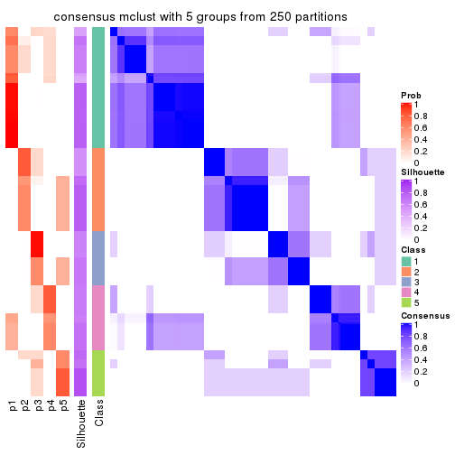</p>

</div>
<div id='tab-MAD-mclust-consensus-heatmap-5'>
<pre><code class="r">consensus_heatmap(res, k = 6)
</code></pre>

<p></p>

</div>
</div>

Heatmaps for the membership of samples in all partitions to see how consistent they are:


<script>
$( function() {
	$( '#tabs-MAD-mclust-membership-heatmap' ).tabs();
} );
</script>
<div id='tabs-MAD-mclust-membership-heatmap'>
<ul>
<li><a href='#tab-MAD-mclust-membership-heatmap-1'>k = 2</a></li>
<li><a href='#tab-MAD-mclust-membership-heatmap-2'>k = 3</a></li>
<li><a href='#tab-MAD-mclust-membership-heatmap-3'>k = 4</a></li>
<li><a href='#tab-MAD-mclust-membership-heatmap-4'>k = 5</a></li>
<li><a href='#tab-MAD-mclust-membership-heatmap-5'>k = 6</a></li>
</ul>
<div id='tab-MAD-mclust-membership-heatmap-1'>
<pre><code class="r">membership_heatmap(res, k = 2)
</code></pre>

<p></p>

</div>
<div id='tab-MAD-mclust-membership-heatmap-2'>
<pre><code class="r">membership_heatmap(res, k = 3)
</code></pre>

<p></p>

</div>
<div id='tab-MAD-mclust-membership-heatmap-3'>
<pre><code class="r">membership_heatmap(res, k = 4)
</code></pre>

<p></p>

</div>
<div id='tab-MAD-mclust-membership-heatmap-4'>
<pre><code class="r">membership_heatmap(res, k = 5)
</code></pre>

<p></p>

</div>
<div id='tab-MAD-mclust-membership-heatmap-5'>
<pre><code class="r">membership_heatmap(res, k = 6)
</code></pre>

<p>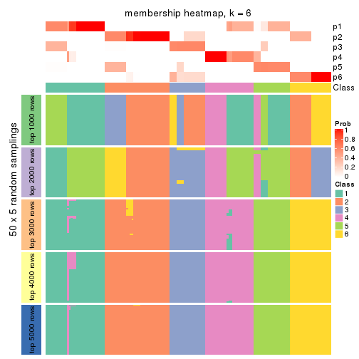</p>

</div>
</div>

As soon as we have had the classes for columns, we can look for signatures
which are significantly different between classes which can be candidate marks
for certain classes. Following are the heatmaps for signatures.


Signature heatmaps where rows are scaled:


<script>
$( function() {
	$( '#tabs-MAD-mclust-get-signatures' ).tabs();
} );
</script>
<div id='tabs-MAD-mclust-get-signatures'>
<ul>
<li><a href='#tab-MAD-mclust-get-signatures-1'>k = 2</a></li>
<li><a href='#tab-MAD-mclust-get-signatures-2'>k = 3</a></li>
<li><a href='#tab-MAD-mclust-get-signatures-3'>k = 4</a></li>
<li><a href='#tab-MAD-mclust-get-signatures-4'>k = 5</a></li>
<li><a href='#tab-MAD-mclust-get-signatures-5'>k = 6</a></li>
</ul>
<div id='tab-MAD-mclust-get-signatures-1'>
<pre><code class="r">get_signatures(res, k = 2)
</code></pre>

<p></p>

</div>
<div id='tab-MAD-mclust-get-signatures-2'>
<pre><code class="r">get_signatures(res, k = 3)
</code></pre>

<p></p>

</div>
<div id='tab-MAD-mclust-get-signatures-3'>
<pre><code class="r">get_signatures(res, k = 4)
</code></pre>

<p></p>

</div>
<div id='tab-MAD-mclust-get-signatures-4'>
<pre><code class="r">get_signatures(res, k = 5)
</code></pre>

<p></p>

</div>
<div id='tab-MAD-mclust-get-signatures-5'>
<pre><code class="r">get_signatures(res, k = 6)
</code></pre>

<p></p>

</div>
</div>


Signature heatmaps where rows are not scaled:


<script>
$( function() {
	$( '#tabs-MAD-mclust-get-signatures-no-scale' ).tabs();
} );
</script>
<div id='tabs-MAD-mclust-get-signatures-no-scale'>
<ul>
<li><a href='#tab-MAD-mclust-get-signatures-no-scale-1'>k = 2</a></li>
<li><a href='#tab-MAD-mclust-get-signatures-no-scale-2'>k = 3</a></li>
<li><a href='#tab-MAD-mclust-get-signatures-no-scale-3'>k = 4</a></li>
<li><a href='#tab-MAD-mclust-get-signatures-no-scale-4'>k = 5</a></li>
<li><a href='#tab-MAD-mclust-get-signatures-no-scale-5'>k = 6</a></li>
</ul>
<div id='tab-MAD-mclust-get-signatures-no-scale-1'>
<pre><code class="r">get_signatures(res, k = 2, scale_rows = FALSE)
</code></pre>

<p></p>

</div>
<div id='tab-MAD-mclust-get-signatures-no-scale-2'>
<pre><code class="r">get_signatures(res, k = 3, scale_rows = FALSE)
</code></pre>

<p></p>

</div>
<div id='tab-MAD-mclust-get-signatures-no-scale-3'>
<pre><code class="r">get_signatures(res, k = 4, scale_rows = FALSE)
</code></pre>

<p>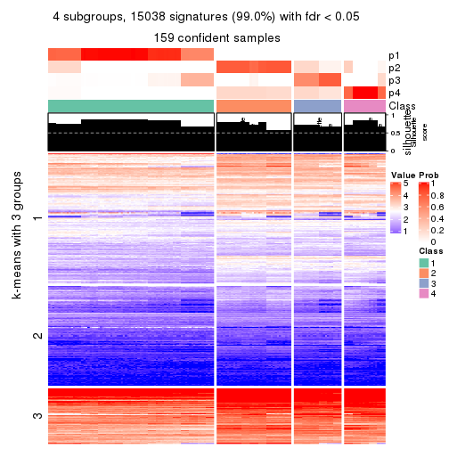</p>

</div>
<div id='tab-MAD-mclust-get-signatures-no-scale-4'>
<pre><code class="r">get_signatures(res, k = 5, scale_rows = FALSE)
</code></pre>

<p></p>

</div>
<div id='tab-MAD-mclust-get-signatures-no-scale-5'>
<pre><code class="r">get_signatures(res, k = 6, scale_rows = FALSE)
</code></pre>

<p></p>

</div>
</div>


Compare the overlap of signatures from different k:

```r
compare_signatures(res)
```


`get_signature()` returns a data frame invisibly. TO get the list of signatures, the function
call should be assigned to a variable explicitly. In following code, if `plot` argument is set
to `FALSE`, no heatmap is plotted while only the differential analysis is performed.

```r
# code only for demonstration
tb = get_signature(res, k = ..., plot = FALSE)
```

An example of the output of `tb` is:

```
#>   which_row         fdr    mean_1    mean_2 scaled_mean_1 scaled_mean_2 km
#> 1        38 0.042760348  8.373488  9.131774    -0.5533452     0.5164555  1
#> 2        40 0.018707592  7.106213  8.469186    -0.6173731     0.5762149  1
#> 3        55 0.019134737 10.221463 11.207825    -0.6159697     0.5749050  1
#> 4        59 0.006059896  5.921854  7.869574    -0.6899429     0.6439467  1
#> 5        60 0.018055526  8.928898 10.211722    -0.6204761     0.5791110  1
#> 6        98 0.009384629 15.714769 14.887706     0.6635654    -0.6193277  2
...
```

The columns in `tb` are:

1. `which_row`: row indices corresponding to the input matrix.
2. `fdr`: FDR for the differential test. 
3. `mean_x`: The mean value in group x.
4. `scaled_mean_x`: The mean value in group x after rows are scaled.
5. `km`: Row groups if k-means clustering is applied to rows.


UMAP plot which shows how samples are separated.


<script>
$( function() {
	$( '#tabs-MAD-mclust-dimension-reduction' ).tabs();
} );
</script>
<div id='tabs-MAD-mclust-dimension-reduction'>
<ul>
<li><a href='#tab-MAD-mclust-dimension-reduction-1'>k = 2</a></li>
<li><a href='#tab-MAD-mclust-dimension-reduction-2'>k = 3</a></li>
<li><a href='#tab-MAD-mclust-dimension-reduction-3'>k = 4</a></li>
<li><a href='#tab-MAD-mclust-dimension-reduction-4'>k = 5</a></li>
<li><a href='#tab-MAD-mclust-dimension-reduction-5'>k = 6</a></li>
</ul>
<div id='tab-MAD-mclust-dimension-reduction-1'>
<pre><code class="r">dimension_reduction(res, k = 2, method = &quot;UMAP&quot;)
</code></pre>

<p></p>

</div>
<div id='tab-MAD-mclust-dimension-reduction-2'>
<pre><code class="r">dimension_reduction(res, k = 3, method = &quot;UMAP&quot;)
</code></pre>

<p></p>

</div>
<div id='tab-MAD-mclust-dimension-reduction-3'>
<pre><code class="r">dimension_reduction(res, k = 4, method = &quot;UMAP&quot;)
</code></pre>

<p></p>

</div>
<div id='tab-MAD-mclust-dimension-reduction-4'>
<pre><code class="r">dimension_reduction(res, k = 5, method = &quot;UMAP&quot;)
</code></pre>

<p></p>

</div>
<div id='tab-MAD-mclust-dimension-reduction-5'>
<pre><code class="r">dimension_reduction(res, k = 6, method = &quot;UMAP&quot;)
</code></pre>

<p></p>

</div>
</div>


Following heatmap shows how subgroups are split when increasing `k`:

```r
collect_classes(res)
```


If matrix rows can be associated to genes, consider to use `GO_Enrichment(res,
...)` to perform function enrichment for the signature genes.


 

---------------------------------------------------


### MAD:NMF**


The object with results only for a single top-value method and a single partition method 
can be extracted as:

```r
res = res_list["MAD", "NMF"]
# you can also extract it by
# res = res_list["MAD:NMF"]
```

A summary of `res` and all the functions that can be applied to it:

```r
res
```

```
#> A 'ConsensusPartition' object with k = 2, 3, 4, 5, 6.
#>   On a matrix with 15185 rows and 159 columns.
#>   Top rows (1000, 2000, 3000, 4000, 5000) are extracted by 'MAD' method.
#>   Subgroups are detected by 'NMF' method.
#>   Performed in total 1250 partitions by row resampling.
#>   Best k for subgroups seems to be 2.
#> 
#> Following methods can be applied to this 'ConsensusPartition' object:
#>  [1] "cola_report"             "collect_classes"         "collect_plots"          
#>  [4] "collect_stats"           "colnames"                "compare_signatures"     
#>  [7] "consensus_heatmap"       "dimension_reduction"     "functional_enrichment"  
#> [10] "get_anno_col"            "get_anno"                "get_classes"            
#> [13] "get_consensus"           "get_matrix"              "get_membership"         
#> [16] "get_param"               "get_signatures"          "get_stats"              
#> [19] "is_best_k"               "is_stable_k"             "membership_heatmap"     
#> [22] "ncol"                    "nrow"                    "plot_ecdf"              
#> [25] "rownames"                "select_partition_number" "show"                   
#> [28] "suggest_best_k"          "test_to_known_factors"
```

`collect_plots()` function collects all the plots made from `res` for all `k` (number of partitions)
into one single page to provide an easy and fast comparison between different `k`.

```r
collect_plots(res)
```


The plots are:

- The first row: a plot of the ECDF (Empirical cumulative distribution
  function) curves of the consensus matrix for each `k` and the heatmap of
  predicted classes for each `k`.
- The second row: heatmaps of the consensus matrix for each `k`.
- The third row: heatmaps of the membership matrix for each `k`.
- The fouth row: heatmaps of the signatures for each `k`.

All the plots in panels can be made by individual functions and they are
plotted later in this section.

`select_partition_number()` produces several plots showing different
statistics for choosing "optimized" `k`. There are following statistics:

- ECDF curves of the consensus matrix for each `k`;
- 1-PAC. [The PAC
  score](https://en.wikipedia.org/wiki/Consensus_clustering#Over-interpretation_potential_of_consensus_clustering)
  measures the proportion of the ambiguous subgrouping.
- Mean silhouette score.
- Concordance. The mean probability of fiting the consensus class ids in all
  partitions.
- Area increased. Denote $A_k$ as the area under the ECDF curve for current
  `k`, the area increased is defined as $A_k - A_{k-1}$.
- Rand index. The percent of pairs of samples that are both in a same cluster
  or both are not in a same cluster in the partition of k and k-1.
- Jaccard index. The ratio of pairs of samples are both in a same cluster in
  the partition of k and k-1 and the pairs of samples are both in a same
  cluster in the partition k or k-1.

The detailed explanations of these statistics can be found in [the cola
vignette](http://bioconductor.org/packages/devel/bioc/vignettes/cola/inst/doc/cola.html#toc_13).

Generally speaking, lower PAC score, higher mean silhouette score or higher
concordance corresponds to better partition. Rand index and Jaccard index
measure how similar the current partition is compared to partition with `k-1`.
If they are too similar, we won't accept `k` is better than `k-1`.

```r
select_partition_number(res)
```


The numeric values for all these statistics can be obtained by `get_stats()`.

```r
get_stats(res)
```

```
#>   k 1-PAC mean_silhouette concordance area_increased  Rand Jaccard
#> 2 2 1.000           1.000       1.000         0.5036 0.497   0.497
#> 3 3 0.754           0.810       0.893         0.2796 0.783   0.589
#> 4 4 0.829           0.930       0.854         0.0865 0.765   0.435
#> 5 5 0.779           0.887       0.848         0.0300 1.000   1.000
#> 6 6 0.684           0.818       0.851         0.0315 0.988   0.953
```

`suggest_best_k()` suggests the best $k$ based on these statistics. The rules are as follows:

- All $k$ with Jaccard index larger than 0.95 are removed because the increase of
  the partition number does not provides enough extra information. If all $k$ are removed,
  the best $k$ is assigned by `NA`.
- For $k$ with 1-PAC larger than 0.9, the maximal $k$ is taken as the "best k". Other $k$ is called "optional k".
- If it does not fit the second rule. The $k$ with the highest vote of highest
  1-PAC, mean silhouette and concordance is taken as the "best k".

```r
suggest_best_k(res)
```

```
#> [1] 2
```


Following shows the table of the partitions (You need to click the **show/hide
code output** link to see it). The membership matrix (columns with name `p*`)
is inferred by
[`clue::cl_consensus()`](https://www.rdocumentation.org/link/cl_consensus?package=clue)
function with the `SE` method. Basically the value in the membership matrix
represents the probability to belong to a certain group. The finall class
label for an item is determined with the group with highest probability it
belongs to.

In `get_classes()` function, the entropy is calculated from the membership
matrix and the silhouette score is calculated from the consensus matrix.


<script>
$( function() {
	$( '#tabs-MAD-NMF-get-classes' ).tabs();
} );
</script>
<div id='tabs-MAD-NMF-get-classes'>
<ul>
<li><a href='#tab-MAD-NMF-get-classes-1'>k = 2</a></li>
<li><a href='#tab-MAD-NMF-get-classes-2'>k = 3</a></li>
<li><a href='#tab-MAD-NMF-get-classes-3'>k = 4</a></li>
<li><a href='#tab-MAD-NMF-get-classes-4'>k = 5</a></li>
<li><a href='#tab-MAD-NMF-get-classes-5'>k = 6</a></li>
</ul>

<div id='tab-MAD-NMF-get-classes-1'>
<p><a id='tab-MAD-NMF-get-classes-1-a' style='color:#0366d6' href='#'>show/hide code output</a></p>
<pre><code class="r">cbind(get_classes(res, k = 2), get_membership(res, k = 2))
</code></pre>

<pre><code>#&gt;            class entropy silhouette p1 p2
#&gt; SRR1706767     1       0          1  1  0
#&gt; SRR1706768     1       0          1  1  0
#&gt; SRR1706769     1       0          1  1  0
#&gt; SRR1706770     1       0          1  1  0
#&gt; SRR1706771     1       0          1  1  0
#&gt; SRR1706772     1       0          1  1  0
#&gt; SRR1706773     1       0          1  1  0
#&gt; SRR1706774     1       0          1  1  0
#&gt; SRR1706775     1       0          1  1  0
#&gt; SRR1706776     1       0          1  1  0
#&gt; SRR1706777     1       0          1  1  0
#&gt; SRR1706778     1       0          1  1  0
#&gt; SRR1706779     1       0          1  1  0
#&gt; SRR1706780     1       0          1  1  0
#&gt; SRR1706781     1       0          1  1  0
#&gt; SRR1706782     1       0          1  1  0
#&gt; SRR1706783     1       0          1  1  0
#&gt; SRR1706784     1       0          1  1  0
#&gt; SRR1706785     1       0          1  1  0
#&gt; SRR1706786     1       0          1  1  0
#&gt; SRR1706787     1       0          1  1  0
#&gt; SRR1706788     1       0          1  1  0
#&gt; SRR1706789     1       0          1  1  0
#&gt; SRR1706790     1       0          1  1  0
#&gt; SRR1706791     1       0          1  1  0
#&gt; SRR1706792     1       0          1  1  0
#&gt; SRR1706793     1       0          1  1  0
#&gt; SRR1706794     1       0          1  1  0
#&gt; SRR1706795     1       0          1  1  0
#&gt; SRR1706796     1       0          1  1  0
#&gt; SRR1706797     1       0          1  1  0
#&gt; SRR1706798     1       0          1  1  0
#&gt; SRR1706799     1       0          1  1  0
#&gt; SRR1706800     1       0          1  1  0
#&gt; SRR1706801     1       0          1  1  0
#&gt; SRR1706802     1       0          1  1  0
#&gt; SRR1706803     1       0          1  1  0
#&gt; SRR1706804     1       0          1  1  0
#&gt; SRR1706805     1       0          1  1  0
#&gt; SRR1706806     1       0          1  1  0
#&gt; SRR1706811     1       0          1  1  0
#&gt; SRR1706812     1       0          1  1  0
#&gt; SRR1706813     1       0          1  1  0
#&gt; SRR1706814     1       0          1  1  0
#&gt; SRR1706807     1       0          1  1  0
#&gt; SRR1706808     1       0          1  1  0
#&gt; SRR1706809     1       0          1  1  0
#&gt; SRR1706810     1       0          1  1  0
#&gt; SRR1706815     1       0          1  1  0
#&gt; SRR1706816     1       0          1  1  0
#&gt; SRR1706817     1       0          1  1  0
#&gt; SRR1706818     1       0          1  1  0
#&gt; SRR1706819     1       0          1  1  0
#&gt; SRR1706820     1       0          1  1  0
#&gt; SRR1706821     1       0          1  1  0
#&gt; SRR1706822     1       0          1  1  0
#&gt; SRR1706823     1       0          1  1  0
#&gt; SRR1706824     1       0          1  1  0
#&gt; SRR1706825     1       0          1  1  0
#&gt; SRR1706826     1       0          1  1  0
#&gt; SRR1706827     1       0          1  1  0
#&gt; SRR1706828     1       0          1  1  0
#&gt; SRR1706829     1       0          1  1  0
#&gt; SRR1706830     1       0          1  1  0
#&gt; SRR1706835     1       0          1  1  0
#&gt; SRR1706836     1       0          1  1  0
#&gt; SRR1706837     1       0          1  1  0
#&gt; SRR1706838     1       0          1  1  0
#&gt; SRR1706831     1       0          1  1  0
#&gt; SRR1706832     1       0          1  1  0
#&gt; SRR1706833     1       0          1  1  0
#&gt; SRR1706834     1       0          1  1  0
#&gt; SRR1706839     1       0          1  1  0
#&gt; SRR1706840     1       0          1  1  0
#&gt; SRR1706841     1       0          1  1  0
#&gt; SRR1706842     1       0          1  1  0
#&gt; SRR1706847     2       0          1  0  1
#&gt; SRR1706848     2       0          1  0  1
#&gt; SRR1706849     2       0          1  0  1
#&gt; SRR1706850     2       0          1  0  1
#&gt; SRR1706843     1       0          1  1  0
#&gt; SRR1706844     1       0          1  1  0
#&gt; SRR1706845     1       0          1  1  0
#&gt; SRR1706846     1       0          1  1  0
#&gt; SRR1706851     2       0          1  0  1
#&gt; SRR1706852     2       0          1  0  1
#&gt; SRR1706853     2       0          1  0  1
#&gt; SRR1706854     2       0          1  0  1
#&gt; SRR1706855     2       0          1  0  1
#&gt; SRR1706856     2       0          1  0  1
#&gt; SRR1706857     2       0          1  0  1
#&gt; SRR1706858     2       0          1  0  1
#&gt; SRR1706859     2       0          1  0  1
#&gt; SRR1706860     2       0          1  0  1
#&gt; SRR1706861     2       0          1  0  1
#&gt; SRR1706862     2       0          1  0  1
#&gt; SRR1706867     2       0          1  0  1
#&gt; SRR1706869     2       0          1  0  1
#&gt; SRR1706870     2       0          1  0  1
#&gt; SRR1706863     2       0          1  0  1
#&gt; SRR1706864     2       0          1  0  1
#&gt; SRR1706865     2       0          1  0  1
#&gt; SRR1706866     2       0          1  0  1
#&gt; SRR1706871     2       0          1  0  1
#&gt; SRR1706872     2       0          1  0  1
#&gt; SRR1706873     2       0          1  0  1
#&gt; SRR1706874     2       0          1  0  1
#&gt; SRR1706879     2       0          1  0  1
#&gt; SRR1706880     2       0          1  0  1
#&gt; SRR1706881     2       0          1  0  1
#&gt; SRR1706882     2       0          1  0  1
#&gt; SRR1706883     2       0          1  0  1
#&gt; SRR1706884     2       0          1  0  1
#&gt; SRR1706885     2       0          1  0  1
#&gt; SRR1706886     2       0          1  0  1
#&gt; SRR1706875     2       0          1  0  1
#&gt; SRR1706876     2       0          1  0  1
#&gt; SRR1706877     2       0          1  0  1
#&gt; SRR1706878     2       0          1  0  1
#&gt; SRR1706887     2       0          1  0  1
#&gt; SRR1706888     2       0          1  0  1
#&gt; SRR1706889     2       0          1  0  1
#&gt; SRR1706890     2       0          1  0  1
#&gt; SRR1706891     2       0          1  0  1
#&gt; SRR1706892     2       0          1  0  1
#&gt; SRR1706893     2       0          1  0  1
#&gt; SRR1706894     2       0          1  0  1
#&gt; SRR1706895     2       0          1  0  1
#&gt; SRR1706896     2       0          1  0  1
#&gt; SRR1706897     2       0          1  0  1
#&gt; SRR1706898     2       0          1  0  1
#&gt; SRR1706899     2       0          1  0  1
#&gt; SRR1706900     2       0          1  0  1
#&gt; SRR1706901     2       0          1  0  1
#&gt; SRR1706902     2       0          1  0  1
#&gt; SRR1706907     2       0          1  0  1
#&gt; SRR1706908     2       0          1  0  1
#&gt; SRR1706909     2       0          1  0  1
#&gt; SRR1706910     2       0          1  0  1
#&gt; SRR1706903     2       0          1  0  1
#&gt; SRR1706904     2       0          1  0  1
#&gt; SRR1706905     2       0          1  0  1
#&gt; SRR1706906     2       0          1  0  1
#&gt; SRR1706911     2       0          1  0  1
#&gt; SRR1706912     2       0          1  0  1
#&gt; SRR1706913     2       0          1  0  1
#&gt; SRR1706914     2       0          1  0  1
#&gt; SRR1706919     2       0          1  0  1
#&gt; SRR1706920     2       0          1  0  1
#&gt; SRR1706921     2       0          1  0  1
#&gt; SRR1706922     2       0          1  0  1
#&gt; SRR1706915     2       0          1  0  1
#&gt; SRR1706916     2       0          1  0  1
#&gt; SRR1706917     2       0          1  0  1
#&gt; SRR1706918     2       0          1  0  1
#&gt; SRR1706923     2       0          1  0  1
#&gt; SRR1706924     2       0          1  0  1
#&gt; SRR1706925     2       0          1  0  1
#&gt; SRR1706926     2       0          1  0  1
</code></pre>

<script>
$('#tab-MAD-NMF-get-classes-1-a').parent().next().next().hide();
$('#tab-MAD-NMF-get-classes-1-a').click(function(){
  $('#tab-MAD-NMF-get-classes-1-a').parent().next().next().toggle();
  return(false);
});
</script>
</div>

<div id='tab-MAD-NMF-get-classes-2'>
<p><a id='tab-MAD-NMF-get-classes-2-a' style='color:#0366d6' href='#'>show/hide code output</a></p>
<pre><code class="r">cbind(get_classes(res, k = 3), get_membership(res, k = 3))
</code></pre>

<pre><code>#&gt;            class entropy silhouette    p1    p2    p3
#&gt; SRR1706767     1  0.0000     0.8134 1.000 0.000 0.000
#&gt; SRR1706768     1  0.0000     0.8134 1.000 0.000 0.000
#&gt; SRR1706769     1  0.0000     0.8134 1.000 0.000 0.000
#&gt; SRR1706770     1  0.0000     0.8134 1.000 0.000 0.000
#&gt; SRR1706771     1  0.4346     0.8252 0.816 0.000 0.184
#&gt; SRR1706772     1  0.4399     0.8238 0.812 0.000 0.188
#&gt; SRR1706773     1  0.4346     0.8252 0.816 0.000 0.184
#&gt; SRR1706774     1  0.4399     0.8238 0.812 0.000 0.188
#&gt; SRR1706775     1  0.6008     0.7214 0.628 0.000 0.372
#&gt; SRR1706776     1  0.6008     0.7214 0.628 0.000 0.372
#&gt; SRR1706777     1  0.6008     0.7214 0.628 0.000 0.372
#&gt; SRR1706778     1  0.6008     0.7214 0.628 0.000 0.372
#&gt; SRR1706779     3  0.2356     0.7483 0.072 0.000 0.928
#&gt; SRR1706780     3  0.2261     0.7520 0.068 0.000 0.932
#&gt; SRR1706781     3  0.2878     0.7198 0.096 0.000 0.904
#&gt; SRR1706782     3  0.2356     0.7483 0.072 0.000 0.928
#&gt; SRR1706783     3  0.0000     0.7966 0.000 0.000 1.000
#&gt; SRR1706784     3  0.0000     0.7966 0.000 0.000 1.000
#&gt; SRR1706785     3  0.0000     0.7966 0.000 0.000 1.000
#&gt; SRR1706786     3  0.0000     0.7966 0.000 0.000 1.000
#&gt; SRR1706787     1  0.0000     0.8134 1.000 0.000 0.000
#&gt; SRR1706788     1  0.0000     0.8134 1.000 0.000 0.000
#&gt; SRR1706789     1  0.0000     0.8134 1.000 0.000 0.000
#&gt; SRR1706790     1  0.0000     0.8134 1.000 0.000 0.000
#&gt; SRR1706791     1  0.4002     0.8319 0.840 0.000 0.160
#&gt; SRR1706792     1  0.3752     0.8343 0.856 0.000 0.144
#&gt; SRR1706793     1  0.4002     0.8319 0.840 0.000 0.160
#&gt; SRR1706794     1  0.3941     0.8326 0.844 0.000 0.156
#&gt; SRR1706795     1  0.6008     0.7214 0.628 0.000 0.372
#&gt; SRR1706796     1  0.6008     0.7214 0.628 0.000 0.372
#&gt; SRR1706797     1  0.6008     0.7214 0.628 0.000 0.372
#&gt; SRR1706798     1  0.6008     0.7214 0.628 0.000 0.372
#&gt; SRR1706799     3  0.2261     0.7519 0.068 0.000 0.932
#&gt; SRR1706800     3  0.2261     0.7519 0.068 0.000 0.932
#&gt; SRR1706801     3  0.2448     0.7440 0.076 0.000 0.924
#&gt; SRR1706802     3  0.2356     0.7483 0.072 0.000 0.928
#&gt; SRR1706803     3  0.0000     0.7966 0.000 0.000 1.000
#&gt; SRR1706804     3  0.0000     0.7966 0.000 0.000 1.000
#&gt; SRR1706805     3  0.0000     0.7966 0.000 0.000 1.000
#&gt; SRR1706806     3  0.0000     0.7966 0.000 0.000 1.000
#&gt; SRR1706811     1  0.2711     0.8334 0.912 0.000 0.088
#&gt; SRR1706812     1  0.2711     0.8334 0.912 0.000 0.088
#&gt; SRR1706813     1  0.2625     0.8327 0.916 0.000 0.084
#&gt; SRR1706814     1  0.2796     0.8339 0.908 0.000 0.092
#&gt; SRR1706807     1  0.0000     0.8134 1.000 0.000 0.000
#&gt; SRR1706808     1  0.0000     0.8134 1.000 0.000 0.000
#&gt; SRR1706809     1  0.0000     0.8134 1.000 0.000 0.000
#&gt; SRR1706810     1  0.0000     0.8134 1.000 0.000 0.000
#&gt; SRR1706815     1  0.6008     0.7214 0.628 0.000 0.372
#&gt; SRR1706816     1  0.6008     0.7214 0.628 0.000 0.372
#&gt; SRR1706817     1  0.6008     0.7214 0.628 0.000 0.372
#&gt; SRR1706818     1  0.6008     0.7214 0.628 0.000 0.372
#&gt; SRR1706819     3  0.0000     0.7966 0.000 0.000 1.000
#&gt; SRR1706820     3  0.0000     0.7966 0.000 0.000 1.000
#&gt; SRR1706821     3  0.0000     0.7966 0.000 0.000 1.000
#&gt; SRR1706822     3  0.0000     0.7966 0.000 0.000 1.000
#&gt; SRR1706823     3  0.0000     0.7966 0.000 0.000 1.000
#&gt; SRR1706824     3  0.0000     0.7966 0.000 0.000 1.000
#&gt; SRR1706825     3  0.0000     0.7966 0.000 0.000 1.000
#&gt; SRR1706826     3  0.0000     0.7966 0.000 0.000 1.000
#&gt; SRR1706827     1  0.0000     0.8134 1.000 0.000 0.000
#&gt; SRR1706828     1  0.0000     0.8134 1.000 0.000 0.000
#&gt; SRR1706829     1  0.0000     0.8134 1.000 0.000 0.000
#&gt; SRR1706830     1  0.0000     0.8134 1.000 0.000 0.000
#&gt; SRR1706835     1  0.6008     0.7214 0.628 0.000 0.372
#&gt; SRR1706836     1  0.6008     0.7214 0.628 0.000 0.372
#&gt; SRR1706837     1  0.6008     0.7214 0.628 0.000 0.372
#&gt; SRR1706838     1  0.6008     0.7214 0.628 0.000 0.372
#&gt; SRR1706831     1  0.3412     0.8357 0.876 0.000 0.124
#&gt; SRR1706832     1  0.3340     0.8356 0.880 0.000 0.120
#&gt; SRR1706833     1  0.3551     0.8356 0.868 0.000 0.132
#&gt; SRR1706834     1  0.3551     0.8356 0.868 0.000 0.132
#&gt; SRR1706839     3  0.3267     0.6916 0.116 0.000 0.884
#&gt; SRR1706840     3  0.3038     0.7091 0.104 0.000 0.896
#&gt; SRR1706841     3  0.3267     0.6916 0.116 0.000 0.884
#&gt; SRR1706842     3  0.3267     0.6916 0.116 0.000 0.884
#&gt; SRR1706847     2  0.0592     0.9549 0.012 0.988 0.000
#&gt; SRR1706848     2  0.0592     0.9549 0.012 0.988 0.000
#&gt; SRR1706849     2  0.0424     0.9577 0.008 0.992 0.000
#&gt; SRR1706850     2  0.0592     0.9549 0.012 0.988 0.000
#&gt; SRR1706843     3  0.0000     0.7966 0.000 0.000 1.000
#&gt; SRR1706844     3  0.0000     0.7966 0.000 0.000 1.000
#&gt; SRR1706845     3  0.0000     0.7966 0.000 0.000 1.000
#&gt; SRR1706846     3  0.0000     0.7966 0.000 0.000 1.000
#&gt; SRR1706851     2  0.0000     0.9633 0.000 1.000 0.000
#&gt; SRR1706852     2  0.0000     0.9633 0.000 1.000 0.000
#&gt; SRR1706853     2  0.0000     0.9633 0.000 1.000 0.000
#&gt; SRR1706854     2  0.0000     0.9633 0.000 1.000 0.000
#&gt; SRR1706855     2  0.0000     0.9633 0.000 1.000 0.000
#&gt; SRR1706856     2  0.0000     0.9633 0.000 1.000 0.000
#&gt; SRR1706857     2  0.0000     0.9633 0.000 1.000 0.000
#&gt; SRR1706858     2  0.0000     0.9633 0.000 1.000 0.000
#&gt; SRR1706859     2  0.0000     0.9633 0.000 1.000 0.000
#&gt; SRR1706860     2  0.0000     0.9633 0.000 1.000 0.000
#&gt; SRR1706861     2  0.0000     0.9633 0.000 1.000 0.000
#&gt; SRR1706862     2  0.0000     0.9633 0.000 1.000 0.000
#&gt; SRR1706867     2  0.1529     0.9298 0.040 0.960 0.000
#&gt; SRR1706869     2  0.1529     0.9298 0.040 0.960 0.000
#&gt; SRR1706870     2  0.1529     0.9298 0.040 0.960 0.000
#&gt; SRR1706863     3  0.6008     0.4765 0.000 0.372 0.628
#&gt; SRR1706864     3  0.6008     0.4765 0.000 0.372 0.628
#&gt; SRR1706865     3  0.6008     0.4765 0.000 0.372 0.628
#&gt; SRR1706866     3  0.6008     0.4765 0.000 0.372 0.628
#&gt; SRR1706871     2  0.0000     0.9633 0.000 1.000 0.000
#&gt; SRR1706872     2  0.0000     0.9633 0.000 1.000 0.000
#&gt; SRR1706873     2  0.0000     0.9633 0.000 1.000 0.000
#&gt; SRR1706874     2  0.0000     0.9633 0.000 1.000 0.000
#&gt; SRR1706879     2  0.0000     0.9633 0.000 1.000 0.000
#&gt; SRR1706880     2  0.0000     0.9633 0.000 1.000 0.000
#&gt; SRR1706881     2  0.0000     0.9633 0.000 1.000 0.000
#&gt; SRR1706882     2  0.0000     0.9633 0.000 1.000 0.000
#&gt; SRR1706883     3  0.6008     0.4765 0.000 0.372 0.628
#&gt; SRR1706884     3  0.6008     0.4765 0.000 0.372 0.628
#&gt; SRR1706885     3  0.6008     0.4765 0.000 0.372 0.628
#&gt; SRR1706886     3  0.6008     0.4765 0.000 0.372 0.628
#&gt; SRR1706875     2  0.0000     0.9633 0.000 1.000 0.000
#&gt; SRR1706876     2  0.0000     0.9633 0.000 1.000 0.000
#&gt; SRR1706877     2  0.0000     0.9633 0.000 1.000 0.000
#&gt; SRR1706878     2  0.0000     0.9633 0.000 1.000 0.000
#&gt; SRR1706887     2  0.0000     0.9633 0.000 1.000 0.000
#&gt; SRR1706888     2  0.0000     0.9633 0.000 1.000 0.000
#&gt; SRR1706889     2  0.0000     0.9633 0.000 1.000 0.000
#&gt; SRR1706890     2  0.0000     0.9633 0.000 1.000 0.000
#&gt; SRR1706891     2  0.0000     0.9633 0.000 1.000 0.000
#&gt; SRR1706892     2  0.0000     0.9633 0.000 1.000 0.000
#&gt; SRR1706893     2  0.0000     0.9633 0.000 1.000 0.000
#&gt; SRR1706894     2  0.0000     0.9633 0.000 1.000 0.000
#&gt; SRR1706895     2  0.0000     0.9633 0.000 1.000 0.000
#&gt; SRR1706896     2  0.0000     0.9633 0.000 1.000 0.000
#&gt; SRR1706897     2  0.0000     0.9633 0.000 1.000 0.000
#&gt; SRR1706898     2  0.0000     0.9633 0.000 1.000 0.000
#&gt; SRR1706899     2  0.0000     0.9633 0.000 1.000 0.000
#&gt; SRR1706900     2  0.0000     0.9633 0.000 1.000 0.000
#&gt; SRR1706901     2  0.0000     0.9633 0.000 1.000 0.000
#&gt; SRR1706902     2  0.0000     0.9633 0.000 1.000 0.000
#&gt; SRR1706907     2  0.0892     0.9484 0.020 0.980 0.000
#&gt; SRR1706908     2  0.0892     0.9484 0.020 0.980 0.000
#&gt; SRR1706909     2  0.0747     0.9518 0.016 0.984 0.000
#&gt; SRR1706910     2  0.0747     0.9518 0.016 0.984 0.000
#&gt; SRR1706903     2  0.6280     0.0178 0.000 0.540 0.460
#&gt; SRR1706904     2  0.6291    -0.0141 0.000 0.532 0.468
#&gt; SRR1706905     2  0.6295    -0.0302 0.000 0.528 0.472
#&gt; SRR1706906     2  0.6286     0.0020 0.000 0.536 0.464
#&gt; SRR1706911     2  0.0000     0.9633 0.000 1.000 0.000
#&gt; SRR1706912     2  0.0000     0.9633 0.000 1.000 0.000
#&gt; SRR1706913     2  0.0000     0.9633 0.000 1.000 0.000
#&gt; SRR1706914     2  0.0000     0.9633 0.000 1.000 0.000
#&gt; SRR1706919     2  0.0000     0.9633 0.000 1.000 0.000
#&gt; SRR1706920     2  0.0000     0.9633 0.000 1.000 0.000
#&gt; SRR1706921     2  0.0000     0.9633 0.000 1.000 0.000
#&gt; SRR1706922     2  0.0000     0.9633 0.000 1.000 0.000
#&gt; SRR1706915     2  0.0000     0.9633 0.000 1.000 0.000
#&gt; SRR1706916     2  0.0000     0.9633 0.000 1.000 0.000
#&gt; SRR1706917     2  0.0000     0.9633 0.000 1.000 0.000
#&gt; SRR1706918     2  0.0000     0.9633 0.000 1.000 0.000
#&gt; SRR1706923     3  0.6008     0.4765 0.000 0.372 0.628
#&gt; SRR1706924     3  0.6008     0.4765 0.000 0.372 0.628
#&gt; SRR1706925     3  0.6008     0.4765 0.000 0.372 0.628
#&gt; SRR1706926     3  0.6008     0.4765 0.000 0.372 0.628
</code></pre>

<script>
$('#tab-MAD-NMF-get-classes-2-a').parent().next().next().hide();
$('#tab-MAD-NMF-get-classes-2-a').click(function(){
  $('#tab-MAD-NMF-get-classes-2-a').parent().next().next().toggle();
  return(false);
});
</script>
</div>

<div id='tab-MAD-NMF-get-classes-3'>
<p><a id='tab-MAD-NMF-get-classes-3-a' style='color:#0366d6' href='#'>show/hide code output</a></p>
<pre><code class="r">cbind(get_classes(res, k = 4), get_membership(res, k = 4))
</code></pre>

<pre><code>#&gt;            class entropy silhouette    p1    p2    p3    p4
#&gt; SRR1706767     4  0.0921      0.940 0.000 0.000 0.028 0.972
#&gt; SRR1706768     4  0.1118      0.939 0.000 0.000 0.036 0.964
#&gt; SRR1706769     4  0.0921      0.940 0.000 0.000 0.028 0.972
#&gt; SRR1706770     4  0.0921      0.940 0.000 0.000 0.028 0.972
#&gt; SRR1706771     4  0.2011      0.930 0.000 0.000 0.080 0.920
#&gt; SRR1706772     4  0.2081      0.930 0.000 0.000 0.084 0.916
#&gt; SRR1706773     4  0.2011      0.930 0.000 0.000 0.080 0.920
#&gt; SRR1706774     4  0.2011      0.930 0.000 0.000 0.080 0.920
#&gt; SRR1706775     1  0.3636      0.856 0.820 0.000 0.172 0.008
#&gt; SRR1706776     1  0.3355      0.864 0.836 0.000 0.160 0.004
#&gt; SRR1706777     1  0.3681      0.854 0.816 0.000 0.176 0.008
#&gt; SRR1706778     1  0.3494      0.859 0.824 0.000 0.172 0.004
#&gt; SRR1706779     1  0.0000      0.922 1.000 0.000 0.000 0.000
#&gt; SRR1706780     1  0.0000      0.922 1.000 0.000 0.000 0.000
#&gt; SRR1706781     1  0.0000      0.922 1.000 0.000 0.000 0.000
#&gt; SRR1706782     1  0.0000      0.922 1.000 0.000 0.000 0.000
#&gt; SRR1706783     1  0.0000      0.922 1.000 0.000 0.000 0.000
#&gt; SRR1706784     1  0.0000      0.922 1.000 0.000 0.000 0.000
#&gt; SRR1706785     1  0.0000      0.922 1.000 0.000 0.000 0.000
#&gt; SRR1706786     1  0.0000      0.922 1.000 0.000 0.000 0.000
#&gt; SRR1706787     4  0.0000      0.941 0.000 0.000 0.000 1.000
#&gt; SRR1706788     4  0.0000      0.941 0.000 0.000 0.000 1.000
#&gt; SRR1706789     4  0.0000      0.941 0.000 0.000 0.000 1.000
#&gt; SRR1706790     4  0.0000      0.941 0.000 0.000 0.000 1.000
#&gt; SRR1706791     4  0.2345      0.924 0.000 0.000 0.100 0.900
#&gt; SRR1706792     4  0.2081      0.929 0.000 0.000 0.084 0.916
#&gt; SRR1706793     4  0.2011      0.931 0.000 0.000 0.080 0.920
#&gt; SRR1706794     4  0.2408      0.922 0.000 0.000 0.104 0.896
#&gt; SRR1706795     1  0.3494      0.858 0.824 0.000 0.172 0.004
#&gt; SRR1706796     1  0.3306      0.865 0.840 0.000 0.156 0.004
#&gt; SRR1706797     1  0.3402      0.862 0.832 0.000 0.164 0.004
#&gt; SRR1706798     1  0.3355      0.864 0.836 0.000 0.160 0.004
#&gt; SRR1706799     1  0.0188      0.922 0.996 0.000 0.004 0.000
#&gt; SRR1706800     1  0.0188      0.922 0.996 0.000 0.004 0.000
#&gt; SRR1706801     1  0.0188      0.922 0.996 0.000 0.004 0.000
#&gt; SRR1706802     1  0.0188      0.922 0.996 0.000 0.004 0.000
#&gt; SRR1706803     1  0.0000      0.922 1.000 0.000 0.000 0.000
#&gt; SRR1706804     1  0.0000      0.922 1.000 0.000 0.000 0.000
#&gt; SRR1706805     1  0.0000      0.922 1.000 0.000 0.000 0.000
#&gt; SRR1706806     1  0.0000      0.922 1.000 0.000 0.000 0.000
#&gt; SRR1706811     4  0.4643      0.748 0.000 0.000 0.344 0.656
#&gt; SRR1706812     4  0.4643      0.748 0.000 0.000 0.344 0.656
#&gt; SRR1706813     4  0.4643      0.748 0.000 0.000 0.344 0.656
#&gt; SRR1706814     4  0.4643      0.748 0.000 0.000 0.344 0.656
#&gt; SRR1706807     4  0.0336      0.942 0.000 0.000 0.008 0.992
#&gt; SRR1706808     4  0.0469      0.941 0.000 0.000 0.012 0.988
#&gt; SRR1706809     4  0.0336      0.942 0.000 0.000 0.008 0.992
#&gt; SRR1706810     4  0.0336      0.942 0.000 0.000 0.008 0.992
#&gt; SRR1706815     1  0.7220      0.421 0.472 0.000 0.384 0.144
#&gt; SRR1706816     1  0.7242      0.419 0.476 0.000 0.376 0.148
#&gt; SRR1706817     1  0.7338      0.393 0.464 0.000 0.376 0.160
#&gt; SRR1706818     1  0.7098      0.453 0.492 0.000 0.376 0.132
#&gt; SRR1706819     1  0.0895      0.917 0.976 0.000 0.020 0.004
#&gt; SRR1706820     1  0.0895      0.917 0.976 0.000 0.020 0.004
#&gt; SRR1706821     1  0.0895      0.917 0.976 0.000 0.020 0.004
#&gt; SRR1706822     1  0.0779      0.918 0.980 0.000 0.016 0.004
#&gt; SRR1706823     1  0.0000      0.922 1.000 0.000 0.000 0.000
#&gt; SRR1706824     1  0.0000      0.922 1.000 0.000 0.000 0.000
#&gt; SRR1706825     1  0.0000      0.922 1.000 0.000 0.000 0.000
#&gt; SRR1706826     1  0.0000      0.922 1.000 0.000 0.000 0.000
#&gt; SRR1706827     4  0.0188      0.940 0.000 0.000 0.004 0.996
#&gt; SRR1706828     4  0.0188      0.940 0.000 0.000 0.004 0.996
#&gt; SRR1706829     4  0.0188      0.940 0.000 0.000 0.004 0.996
#&gt; SRR1706830     4  0.0188      0.940 0.000 0.000 0.004 0.996
#&gt; SRR1706835     1  0.4086      0.830 0.776 0.000 0.216 0.008
#&gt; SRR1706836     1  0.3972      0.837 0.788 0.000 0.204 0.008
#&gt; SRR1706837     1  0.4011      0.835 0.784 0.000 0.208 0.008
#&gt; SRR1706838     1  0.4049      0.832 0.780 0.000 0.212 0.008
#&gt; SRR1706831     4  0.1716      0.936 0.000 0.000 0.064 0.936
#&gt; SRR1706832     4  0.1867      0.934 0.000 0.000 0.072 0.928
#&gt; SRR1706833     4  0.2149      0.929 0.000 0.000 0.088 0.912
#&gt; SRR1706834     4  0.2011      0.932 0.000 0.000 0.080 0.920
#&gt; SRR1706839     1  0.0188      0.922 0.996 0.000 0.004 0.000
#&gt; SRR1706840     1  0.0188      0.922 0.996 0.000 0.004 0.000
#&gt; SRR1706841     1  0.0188      0.922 0.996 0.000 0.004 0.000
#&gt; SRR1706842     1  0.0188      0.922 0.996 0.000 0.004 0.000
#&gt; SRR1706847     3  0.5000      1.000 0.000 0.496 0.504 0.000
#&gt; SRR1706848     3  0.5000      1.000 0.000 0.496 0.504 0.000
#&gt; SRR1706849     3  0.5000      1.000 0.000 0.496 0.504 0.000
#&gt; SRR1706850     3  0.5000      1.000 0.000 0.496 0.504 0.000
#&gt; SRR1706843     1  0.0000      0.922 1.000 0.000 0.000 0.000
#&gt; SRR1706844     1  0.0000      0.922 1.000 0.000 0.000 0.000
#&gt; SRR1706845     1  0.0000      0.922 1.000 0.000 0.000 0.000
#&gt; SRR1706846     1  0.0000      0.922 1.000 0.000 0.000 0.000
#&gt; SRR1706851     3  0.5000      1.000 0.000 0.496 0.504 0.000
#&gt; SRR1706852     3  0.5000      1.000 0.000 0.496 0.504 0.000
#&gt; SRR1706853     3  0.5000      1.000 0.000 0.496 0.504 0.000
#&gt; SRR1706854     3  0.5000      1.000 0.000 0.496 0.504 0.000
#&gt; SRR1706855     2  0.0592      0.965 0.000 0.984 0.016 0.000
#&gt; SRR1706856     2  0.0592      0.965 0.000 0.984 0.016 0.000
#&gt; SRR1706857     2  0.0592      0.965 0.000 0.984 0.016 0.000
#&gt; SRR1706858     2  0.0592      0.965 0.000 0.984 0.016 0.000
#&gt; SRR1706859     2  0.0000      0.979 0.000 1.000 0.000 0.000
#&gt; SRR1706860     2  0.0000      0.979 0.000 1.000 0.000 0.000
#&gt; SRR1706861     2  0.0000      0.979 0.000 1.000 0.000 0.000
#&gt; SRR1706862     2  0.0000      0.979 0.000 1.000 0.000 0.000
#&gt; SRR1706867     3  0.5000      1.000 0.000 0.496 0.504 0.000
#&gt; SRR1706869     3  0.5000      1.000 0.000 0.496 0.504 0.000
#&gt; SRR1706870     3  0.5000      1.000 0.000 0.496 0.504 0.000
#&gt; SRR1706863     2  0.0000      0.979 0.000 1.000 0.000 0.000
#&gt; SRR1706864     2  0.0000      0.979 0.000 1.000 0.000 0.000
#&gt; SRR1706865     2  0.0000      0.979 0.000 1.000 0.000 0.000
#&gt; SRR1706866     2  0.0000      0.979 0.000 1.000 0.000 0.000
#&gt; SRR1706871     3  0.5000      1.000 0.000 0.496 0.504 0.000
#&gt; SRR1706872     3  0.5000      1.000 0.000 0.496 0.504 0.000
#&gt; SRR1706873     3  0.5000      1.000 0.000 0.496 0.504 0.000
#&gt; SRR1706874     3  0.5000      1.000 0.000 0.496 0.504 0.000
#&gt; SRR1706879     2  0.0000      0.979 0.000 1.000 0.000 0.000
#&gt; SRR1706880     2  0.0000      0.979 0.000 1.000 0.000 0.000
#&gt; SRR1706881     2  0.0000      0.979 0.000 1.000 0.000 0.000
#&gt; SRR1706882     2  0.0000      0.979 0.000 1.000 0.000 0.000
#&gt; SRR1706883     2  0.0000      0.979 0.000 1.000 0.000 0.000
#&gt; SRR1706884     2  0.0000      0.979 0.000 1.000 0.000 0.000
#&gt; SRR1706885     2  0.0000      0.979 0.000 1.000 0.000 0.000
#&gt; SRR1706886     2  0.0000      0.979 0.000 1.000 0.000 0.000
#&gt; SRR1706875     2  0.0921      0.949 0.000 0.972 0.028 0.000
#&gt; SRR1706876     2  0.0817      0.955 0.000 0.976 0.024 0.000
#&gt; SRR1706877     2  0.0707      0.960 0.000 0.980 0.020 0.000
#&gt; SRR1706878     2  0.1022      0.944 0.000 0.968 0.032 0.000
#&gt; SRR1706887     3  0.5000      1.000 0.000 0.496 0.504 0.000
#&gt; SRR1706888     3  0.5000      1.000 0.000 0.496 0.504 0.000
#&gt; SRR1706889     3  0.5000      1.000 0.000 0.496 0.504 0.000
#&gt; SRR1706890     3  0.5000      1.000 0.000 0.496 0.504 0.000
#&gt; SRR1706891     3  0.5000      1.000 0.000 0.496 0.504 0.000
#&gt; SRR1706892     3  0.5000      1.000 0.000 0.496 0.504 0.000
#&gt; SRR1706893     3  0.5000      1.000 0.000 0.496 0.504 0.000
#&gt; SRR1706894     3  0.5000      1.000 0.000 0.496 0.504 0.000
#&gt; SRR1706895     2  0.0817      0.953 0.000 0.976 0.024 0.000
#&gt; SRR1706896     2  0.1022      0.939 0.000 0.968 0.032 0.000
#&gt; SRR1706897     2  0.1118      0.932 0.000 0.964 0.036 0.000
#&gt; SRR1706898     2  0.0469      0.966 0.000 0.988 0.012 0.000
#&gt; SRR1706899     2  0.0000      0.979 0.000 1.000 0.000 0.000
#&gt; SRR1706900     2  0.0000      0.979 0.000 1.000 0.000 0.000
#&gt; SRR1706901     2  0.0000      0.979 0.000 1.000 0.000 0.000
#&gt; SRR1706902     2  0.0000      0.979 0.000 1.000 0.000 0.000
#&gt; SRR1706907     3  0.5000      1.000 0.000 0.496 0.504 0.000
#&gt; SRR1706908     3  0.5000      1.000 0.000 0.496 0.504 0.000
#&gt; SRR1706909     3  0.5000      1.000 0.000 0.496 0.504 0.000
#&gt; SRR1706910     3  0.5000      1.000 0.000 0.496 0.504 0.000
#&gt; SRR1706903     2  0.0000      0.979 0.000 1.000 0.000 0.000
#&gt; SRR1706904     2  0.0000      0.979 0.000 1.000 0.000 0.000
#&gt; SRR1706905     2  0.0000      0.979 0.000 1.000 0.000 0.000
#&gt; SRR1706906     2  0.0000      0.979 0.000 1.000 0.000 0.000
#&gt; SRR1706911     3  0.5000      1.000 0.000 0.496 0.504 0.000
#&gt; SRR1706912     3  0.5000      1.000 0.000 0.496 0.504 0.000
#&gt; SRR1706913     3  0.5000      1.000 0.000 0.496 0.504 0.000
#&gt; SRR1706914     3  0.5000      1.000 0.000 0.496 0.504 0.000
#&gt; SRR1706919     2  0.0000      0.979 0.000 1.000 0.000 0.000
#&gt; SRR1706920     2  0.0000      0.979 0.000 1.000 0.000 0.000
#&gt; SRR1706921     2  0.0000      0.979 0.000 1.000 0.000 0.000
#&gt; SRR1706922     2  0.0000      0.979 0.000 1.000 0.000 0.000
#&gt; SRR1706915     2  0.1557      0.897 0.000 0.944 0.056 0.000
#&gt; SRR1706916     2  0.2081      0.830 0.000 0.916 0.084 0.000
#&gt; SRR1706917     2  0.1637      0.889 0.000 0.940 0.060 0.000
#&gt; SRR1706918     2  0.1389      0.914 0.000 0.952 0.048 0.000
#&gt; SRR1706923     2  0.0000      0.979 0.000 1.000 0.000 0.000
#&gt; SRR1706924     2  0.0000      0.979 0.000 1.000 0.000 0.000
#&gt; SRR1706925     2  0.0000      0.979 0.000 1.000 0.000 0.000
#&gt; SRR1706926     2  0.0000      0.979 0.000 1.000 0.000 0.000
</code></pre>

<script>
$('#tab-MAD-NMF-get-classes-3-a').parent().next().next().hide();
$('#tab-MAD-NMF-get-classes-3-a').click(function(){
  $('#tab-MAD-NMF-get-classes-3-a').parent().next().next().toggle();
  return(false);
});
</script>
</div>

<div id='tab-MAD-NMF-get-classes-4'>
<p><a id='tab-MAD-NMF-get-classes-4-a' style='color:#0366d6' href='#'>show/hide code output</a></p>
<pre><code class="r">cbind(get_classes(res, k = 5), get_membership(res, k = 5))
</code></pre>

<pre><code>#&gt;            class entropy silhouette    p1    p2    p3    p4 p5
#&gt; SRR1706767     4  0.0000      0.970 0.000 0.000 0.000 1.000 NA
#&gt; SRR1706768     4  0.0162      0.969 0.000 0.000 0.000 0.996 NA
#&gt; SRR1706769     4  0.0162      0.969 0.000 0.000 0.000 0.996 NA
#&gt; SRR1706770     4  0.0162      0.969 0.000 0.000 0.000 0.996 NA
#&gt; SRR1706771     4  0.0771      0.964 0.020 0.000 0.004 0.976 NA
#&gt; SRR1706772     4  0.0771      0.964 0.020 0.000 0.004 0.976 NA
#&gt; SRR1706773     4  0.0771      0.964 0.020 0.000 0.004 0.976 NA
#&gt; SRR1706774     4  0.0609      0.964 0.020 0.000 0.000 0.980 NA
#&gt; SRR1706775     1  0.2390      0.908 0.908 0.000 0.044 0.044 NA
#&gt; SRR1706776     1  0.1996      0.915 0.928 0.000 0.036 0.032 NA
#&gt; SRR1706777     1  0.2609      0.903 0.896 0.000 0.052 0.048 NA
#&gt; SRR1706778     1  0.2078      0.914 0.924 0.000 0.036 0.036 NA
#&gt; SRR1706779     1  0.0510      0.931 0.984 0.000 0.000 0.000 NA
#&gt; SRR1706780     1  0.0510      0.931 0.984 0.000 0.000 0.000 NA
#&gt; SRR1706781     1  0.0404      0.931 0.988 0.000 0.000 0.000 NA
#&gt; SRR1706782     1  0.0510      0.931 0.984 0.000 0.000 0.000 NA
#&gt; SRR1706783     1  0.0162      0.932 0.996 0.000 0.004 0.000 NA
#&gt; SRR1706784     1  0.0162      0.932 0.996 0.000 0.004 0.000 NA
#&gt; SRR1706785     1  0.0162      0.932 0.996 0.000 0.004 0.000 NA
#&gt; SRR1706786     1  0.0162      0.932 0.996 0.000 0.004 0.000 NA
#&gt; SRR1706787     4  0.0000      0.970 0.000 0.000 0.000 1.000 NA
#&gt; SRR1706788     4  0.0000      0.970 0.000 0.000 0.000 1.000 NA
#&gt; SRR1706789     4  0.0000      0.970 0.000 0.000 0.000 1.000 NA
#&gt; SRR1706790     4  0.0000      0.970 0.000 0.000 0.000 1.000 NA
#&gt; SRR1706791     4  0.2199      0.948 0.008 0.000 0.060 0.916 NA
#&gt; SRR1706792     4  0.1988      0.953 0.008 0.000 0.048 0.928 NA
#&gt; SRR1706793     4  0.2131      0.950 0.008 0.000 0.056 0.920 NA
#&gt; SRR1706794     4  0.2131      0.950 0.008 0.000 0.056 0.920 NA
#&gt; SRR1706795     1  0.2854      0.897 0.880 0.000 0.084 0.028 NA
#&gt; SRR1706796     1  0.2609      0.904 0.896 0.000 0.068 0.028 NA
#&gt; SRR1706797     1  0.2673      0.903 0.892 0.000 0.072 0.028 NA
#&gt; SRR1706798     1  0.2795      0.899 0.884 0.000 0.080 0.028 NA
#&gt; SRR1706799     1  0.0162      0.932 0.996 0.000 0.000 0.000 NA
#&gt; SRR1706800     1  0.0162      0.932 0.996 0.000 0.000 0.000 NA
#&gt; SRR1706801     1  0.0162      0.932 0.996 0.000 0.000 0.000 NA
#&gt; SRR1706802     1  0.0162      0.932 0.996 0.000 0.000 0.000 NA
#&gt; SRR1706803     1  0.0162      0.932 0.996 0.000 0.004 0.000 NA
#&gt; SRR1706804     1  0.0162      0.932 0.996 0.000 0.004 0.000 NA
#&gt; SRR1706805     1  0.0162      0.932 0.996 0.000 0.004 0.000 NA
#&gt; SRR1706806     1  0.0162      0.932 0.996 0.000 0.004 0.000 NA
#&gt; SRR1706811     4  0.3129      0.897 0.008 0.000 0.156 0.832 NA
#&gt; SRR1706812     4  0.3129      0.897 0.008 0.000 0.156 0.832 NA
#&gt; SRR1706813     4  0.3087      0.899 0.008 0.000 0.152 0.836 NA
#&gt; SRR1706814     4  0.3129      0.897 0.008 0.000 0.156 0.832 NA
#&gt; SRR1706807     4  0.0671      0.968 0.000 0.000 0.016 0.980 NA
#&gt; SRR1706808     4  0.0671      0.968 0.000 0.000 0.016 0.980 NA
#&gt; SRR1706809     4  0.0671      0.968 0.000 0.000 0.016 0.980 NA
#&gt; SRR1706810     4  0.0510      0.967 0.000 0.000 0.016 0.984 NA
#&gt; SRR1706815     1  0.6336      0.596 0.588 0.000 0.196 0.200 NA
#&gt; SRR1706816     1  0.6281      0.610 0.596 0.000 0.196 0.192 NA
#&gt; SRR1706817     1  0.6271      0.590 0.596 0.000 0.176 0.212 NA
#&gt; SRR1706818     1  0.6155      0.613 0.612 0.000 0.168 0.204 NA
#&gt; SRR1706819     1  0.2136      0.903 0.904 0.000 0.088 0.008 NA
#&gt; SRR1706820     1  0.2136      0.903 0.904 0.000 0.088 0.008 NA
#&gt; SRR1706821     1  0.2136      0.903 0.904 0.000 0.088 0.008 NA
#&gt; SRR1706822     1  0.2136      0.903 0.904 0.000 0.088 0.008 NA
#&gt; SRR1706823     1  0.1952      0.906 0.912 0.004 0.084 0.000 NA
#&gt; SRR1706824     1  0.1952      0.906 0.912 0.004 0.084 0.000 NA
#&gt; SRR1706825     1  0.1952      0.906 0.912 0.004 0.084 0.000 NA
#&gt; SRR1706826     1  0.1952      0.906 0.912 0.004 0.084 0.000 NA
#&gt; SRR1706827     4  0.0000      0.970 0.000 0.000 0.000 1.000 NA
#&gt; SRR1706828     4  0.0000      0.970 0.000 0.000 0.000 1.000 NA
#&gt; SRR1706829     4  0.0000      0.970 0.000 0.000 0.000 1.000 NA
#&gt; SRR1706830     4  0.0000      0.970 0.000 0.000 0.000 1.000 NA
#&gt; SRR1706835     1  0.3963      0.863 0.820 0.000 0.104 0.056 NA
#&gt; SRR1706836     1  0.3504      0.878 0.844 0.000 0.100 0.044 NA
#&gt; SRR1706837     1  0.3504      0.878 0.844 0.000 0.100 0.044 NA
#&gt; SRR1706838     1  0.3678      0.873 0.836 0.000 0.100 0.048 NA
#&gt; SRR1706831     4  0.1186      0.965 0.008 0.000 0.020 0.964 NA
#&gt; SRR1706832     4  0.1393      0.963 0.008 0.000 0.024 0.956 NA
#&gt; SRR1706833     4  0.1393      0.963 0.008 0.000 0.024 0.956 NA
#&gt; SRR1706834     4  0.1280      0.964 0.008 0.000 0.024 0.960 NA
#&gt; SRR1706839     1  0.0451      0.931 0.988 0.000 0.000 0.004 NA
#&gt; SRR1706840     1  0.0290      0.931 0.992 0.000 0.000 0.000 NA
#&gt; SRR1706841     1  0.0566      0.930 0.984 0.000 0.000 0.004 NA
#&gt; SRR1706842     1  0.0451      0.931 0.988 0.000 0.000 0.004 NA
#&gt; SRR1706847     3  0.4238      0.939 0.000 0.368 0.628 0.000 NA
#&gt; SRR1706848     3  0.4238      0.939 0.000 0.368 0.628 0.000 NA
#&gt; SRR1706849     3  0.4238      0.939 0.000 0.368 0.628 0.000 NA
#&gt; SRR1706850     3  0.4238      0.939 0.000 0.368 0.628 0.000 NA
#&gt; SRR1706843     1  0.0162      0.932 0.996 0.000 0.004 0.000 NA
#&gt; SRR1706844     1  0.0162      0.932 0.996 0.000 0.004 0.000 NA
#&gt; SRR1706845     1  0.0162      0.932 0.996 0.000 0.004 0.000 NA
#&gt; SRR1706846     1  0.0162      0.932 0.996 0.000 0.004 0.000 NA
#&gt; SRR1706851     3  0.4651      0.933 0.000 0.372 0.608 0.000 NA
#&gt; SRR1706852     3  0.4651      0.933 0.000 0.372 0.608 0.000 NA
#&gt; SRR1706853     3  0.4651      0.933 0.000 0.372 0.608 0.000 NA
#&gt; SRR1706854     3  0.4651      0.933 0.000 0.372 0.608 0.000 NA
#&gt; SRR1706855     2  0.3695      0.809 0.000 0.800 0.036 0.000 NA
#&gt; SRR1706856     2  0.3695      0.809 0.000 0.800 0.036 0.000 NA
#&gt; SRR1706857     2  0.3695      0.809 0.000 0.800 0.036 0.000 NA
#&gt; SRR1706858     2  0.3848      0.802 0.000 0.788 0.040 0.000 NA
#&gt; SRR1706859     2  0.0000      0.865 0.000 1.000 0.000 0.000 NA
#&gt; SRR1706860     2  0.0162      0.863 0.000 0.996 0.004 0.000 NA
#&gt; SRR1706861     2  0.0000      0.865 0.000 1.000 0.000 0.000 NA
#&gt; SRR1706862     2  0.0000      0.865 0.000 1.000 0.000 0.000 NA
#&gt; SRR1706867     3  0.4341      0.937 0.000 0.364 0.628 0.000 NA
#&gt; SRR1706869     3  0.4341      0.937 0.000 0.364 0.628 0.000 NA
#&gt; SRR1706870     3  0.4341      0.937 0.000 0.364 0.628 0.000 NA
#&gt; SRR1706863     2  0.0000      0.865 0.000 1.000 0.000 0.000 NA
#&gt; SRR1706864     2  0.0000      0.865 0.000 1.000 0.000 0.000 NA
#&gt; SRR1706865     2  0.0000      0.865 0.000 1.000 0.000 0.000 NA
#&gt; SRR1706866     2  0.0000      0.865 0.000 1.000 0.000 0.000 NA
#&gt; SRR1706871     3  0.4238      0.939 0.000 0.368 0.628 0.000 NA
#&gt; SRR1706872     3  0.4354      0.939 0.000 0.368 0.624 0.000 NA
#&gt; SRR1706873     3  0.4238      0.939 0.000 0.368 0.628 0.000 NA
#&gt; SRR1706874     3  0.4354      0.939 0.000 0.368 0.624 0.000 NA
#&gt; SRR1706879     2  0.0000      0.865 0.000 1.000 0.000 0.000 NA
#&gt; SRR1706880     2  0.0000      0.865 0.000 1.000 0.000 0.000 NA
#&gt; SRR1706881     2  0.0000      0.865 0.000 1.000 0.000 0.000 NA
#&gt; SRR1706882     2  0.0000      0.865 0.000 1.000 0.000 0.000 NA
#&gt; SRR1706883     2  0.0000      0.865 0.000 1.000 0.000 0.000 NA
#&gt; SRR1706884     2  0.0000      0.865 0.000 1.000 0.000 0.000 NA
#&gt; SRR1706885     2  0.0000      0.865 0.000 1.000 0.000 0.000 NA
#&gt; SRR1706886     2  0.0000      0.865 0.000 1.000 0.000 0.000 NA
#&gt; SRR1706875     2  0.3019      0.835 0.000 0.864 0.048 0.000 NA
#&gt; SRR1706876     2  0.2889      0.839 0.000 0.872 0.044 0.000 NA
#&gt; SRR1706877     2  0.2889      0.839 0.000 0.872 0.044 0.000 NA
#&gt; SRR1706878     2  0.2962      0.836 0.000 0.868 0.048 0.000 NA
#&gt; SRR1706887     3  0.4908      0.917 0.000 0.356 0.608 0.000 NA
#&gt; SRR1706888     3  0.4908      0.917 0.000 0.356 0.608 0.000 NA
#&gt; SRR1706889     3  0.4836      0.919 0.000 0.356 0.612 0.000 NA
#&gt; SRR1706890     3  0.4908      0.917 0.000 0.356 0.608 0.000 NA
#&gt; SRR1706891     3  0.6678      0.644 0.000 0.360 0.404 0.000 NA
#&gt; SRR1706892     3  0.6678      0.644 0.000 0.360 0.404 0.000 NA
#&gt; SRR1706893     3  0.6678      0.644 0.000 0.360 0.404 0.000 NA
#&gt; SRR1706894     3  0.6678      0.644 0.000 0.360 0.404 0.000 NA
#&gt; SRR1706895     2  0.4881      0.682 0.004 0.696 0.060 0.000 NA
#&gt; SRR1706896     2  0.4820      0.690 0.004 0.700 0.056 0.000 NA
#&gt; SRR1706897     2  0.4820      0.690 0.004 0.700 0.056 0.000 NA
#&gt; SRR1706898     2  0.4820      0.690 0.004 0.700 0.056 0.000 NA
#&gt; SRR1706899     2  0.3562      0.799 0.000 0.788 0.016 0.000 NA
#&gt; SRR1706900     2  0.3562      0.799 0.000 0.788 0.016 0.000 NA
#&gt; SRR1706901     2  0.3562      0.799 0.000 0.788 0.016 0.000 NA
#&gt; SRR1706902     2  0.3527      0.802 0.000 0.792 0.016 0.000 NA
#&gt; SRR1706907     3  0.4341      0.937 0.000 0.364 0.628 0.000 NA
#&gt; SRR1706908     3  0.4341      0.937 0.000 0.364 0.628 0.000 NA
#&gt; SRR1706909     3  0.4341      0.937 0.000 0.364 0.628 0.000 NA
#&gt; SRR1706910     3  0.4341      0.937 0.000 0.364 0.628 0.000 NA
#&gt; SRR1706903     2  0.2890      0.830 0.000 0.836 0.004 0.000 NA
#&gt; SRR1706904     2  0.2890      0.830 0.000 0.836 0.004 0.000 NA
#&gt; SRR1706905     2  0.2763      0.836 0.000 0.848 0.004 0.000 NA
#&gt; SRR1706906     2  0.2971      0.831 0.000 0.836 0.008 0.000 NA
#&gt; SRR1706911     3  0.4088      0.939 0.000 0.368 0.632 0.000 NA
#&gt; SRR1706912     3  0.4238      0.939 0.000 0.368 0.628 0.000 NA
#&gt; SRR1706913     3  0.4238      0.939 0.000 0.368 0.628 0.000 NA
#&gt; SRR1706914     3  0.4251      0.937 0.000 0.372 0.624 0.000 NA
#&gt; SRR1706919     2  0.0290      0.862 0.000 0.992 0.008 0.000 NA
#&gt; SRR1706920     2  0.0290      0.862 0.000 0.992 0.008 0.000 NA
#&gt; SRR1706921     2  0.0290      0.862 0.000 0.992 0.008 0.000 NA
#&gt; SRR1706922     2  0.0162      0.863 0.000 0.996 0.004 0.000 NA
#&gt; SRR1706915     2  0.3710      0.813 0.000 0.808 0.048 0.000 NA
#&gt; SRR1706916     2  0.3930      0.800 0.000 0.792 0.056 0.000 NA
#&gt; SRR1706917     2  0.3863      0.804 0.000 0.796 0.052 0.000 NA
#&gt; SRR1706918     2  0.3736      0.812 0.000 0.808 0.052 0.000 NA
#&gt; SRR1706923     2  0.0000      0.865 0.000 1.000 0.000 0.000 NA
#&gt; SRR1706924     2  0.0000      0.865 0.000 1.000 0.000 0.000 NA
#&gt; SRR1706925     2  0.0000      0.865 0.000 1.000 0.000 0.000 NA
#&gt; SRR1706926     2  0.0000      0.865 0.000 1.000 0.000 0.000 NA
</code></pre>

<script>
$('#tab-MAD-NMF-get-classes-4-a').parent().next().next().hide();
$('#tab-MAD-NMF-get-classes-4-a').click(function(){
  $('#tab-MAD-NMF-get-classes-4-a').parent().next().next().toggle();
  return(false);
});
</script>
</div>

<div id='tab-MAD-NMF-get-classes-5'>
<p><a id='tab-MAD-NMF-get-classes-5-a' style='color:#0366d6' href='#'>show/hide code output</a></p>
<pre><code class="r">cbind(get_classes(res, k = 6), get_membership(res, k = 6))
</code></pre>

<pre><code>#&gt;            class entropy silhouette    p1    p2    p3    p4 p5 p6
#&gt; SRR1706767     4  0.1745      0.932 0.000 0.000 0.068 0.920 NA NA
#&gt; SRR1706768     4  0.1838      0.930 0.000 0.000 0.068 0.916 NA NA
#&gt; SRR1706769     4  0.1643      0.933 0.000 0.000 0.068 0.924 NA NA
#&gt; SRR1706770     4  0.1838      0.930 0.000 0.000 0.068 0.916 NA NA
#&gt; SRR1706771     4  0.3020      0.904 0.040 0.000 0.064 0.864 NA NA
#&gt; SRR1706772     4  0.3020      0.904 0.040 0.000 0.064 0.864 NA NA
#&gt; SRR1706773     4  0.2950      0.907 0.036 0.000 0.064 0.868 NA NA
#&gt; SRR1706774     4  0.3020      0.904 0.040 0.000 0.064 0.864 NA NA
#&gt; SRR1706775     1  0.4113      0.751 0.748 0.000 0.056 0.188 NA NA
#&gt; SRR1706776     1  0.3812      0.780 0.772 0.000 0.056 0.168 NA NA
#&gt; SRR1706777     1  0.4174      0.741 0.740 0.000 0.056 0.196 NA NA
#&gt; SRR1706778     1  0.3812      0.779 0.772 0.000 0.056 0.168 NA NA
#&gt; SRR1706779     1  0.0458      0.912 0.984 0.000 0.000 0.000 NA NA
#&gt; SRR1706780     1  0.0547      0.912 0.980 0.000 0.000 0.000 NA NA
#&gt; SRR1706781     1  0.0547      0.912 0.980 0.000 0.000 0.000 NA NA
#&gt; SRR1706782     1  0.0547      0.912 0.980 0.000 0.000 0.000 NA NA
#&gt; SRR1706783     1  0.0405      0.913 0.988 0.000 0.004 0.000 NA NA
#&gt; SRR1706784     1  0.0405      0.913 0.988 0.000 0.004 0.000 NA NA
#&gt; SRR1706785     1  0.0405      0.913 0.988 0.000 0.004 0.000 NA NA
#&gt; SRR1706786     1  0.0405      0.913 0.988 0.000 0.004 0.000 NA NA
#&gt; SRR1706787     4  0.0291      0.953 0.000 0.000 0.004 0.992 NA NA
#&gt; SRR1706788     4  0.0291      0.953 0.000 0.000 0.004 0.992 NA NA
#&gt; SRR1706789     4  0.0146      0.953 0.000 0.000 0.004 0.996 NA NA
#&gt; SRR1706790     4  0.0291      0.953 0.000 0.000 0.004 0.992 NA NA
#&gt; SRR1706791     4  0.0964      0.951 0.004 0.000 0.012 0.968 NA NA
#&gt; SRR1706792     4  0.0779      0.952 0.008 0.000 0.008 0.976 NA NA
#&gt; SRR1706793     4  0.0870      0.952 0.004 0.000 0.012 0.972 NA NA
#&gt; SRR1706794     4  0.1026      0.951 0.008 0.000 0.008 0.968 NA NA
#&gt; SRR1706795     1  0.2615      0.851 0.852 0.000 0.000 0.136 NA NA
#&gt; SRR1706796     1  0.2362      0.855 0.860 0.000 0.000 0.136 NA NA
#&gt; SRR1706797     1  0.2462      0.855 0.860 0.000 0.000 0.132 NA NA
#&gt; SRR1706798     1  0.2584      0.848 0.848 0.000 0.000 0.144 NA NA
#&gt; SRR1706799     1  0.0000      0.913 1.000 0.000 0.000 0.000 NA NA
#&gt; SRR1706800     1  0.0000      0.913 1.000 0.000 0.000 0.000 NA NA
#&gt; SRR1706801     1  0.0000      0.913 1.000 0.000 0.000 0.000 NA NA
#&gt; SRR1706802     1  0.0000      0.913 1.000 0.000 0.000 0.000 NA NA
#&gt; SRR1706803     1  0.0405      0.913 0.988 0.000 0.004 0.000 NA NA
#&gt; SRR1706804     1  0.0405      0.913 0.988 0.000 0.004 0.000 NA NA
#&gt; SRR1706805     1  0.0405      0.913 0.988 0.000 0.004 0.000 NA NA
#&gt; SRR1706806     1  0.0405      0.913 0.988 0.000 0.004 0.000 NA NA
#&gt; SRR1706811     4  0.3298      0.884 0.024 0.004 0.012 0.836 NA NA
#&gt; SRR1706812     4  0.3492      0.875 0.032 0.004 0.012 0.824 NA NA
#&gt; SRR1706813     4  0.3284      0.881 0.024 0.004 0.008 0.832 NA NA
#&gt; SRR1706814     4  0.3284      0.881 0.024 0.004 0.008 0.832 NA NA
#&gt; SRR1706807     4  0.1364      0.945 0.000 0.000 0.016 0.952 NA NA
#&gt; SRR1706808     4  0.1364      0.945 0.000 0.000 0.016 0.952 NA NA
#&gt; SRR1706809     4  0.1364      0.945 0.000 0.000 0.016 0.952 NA NA
#&gt; SRR1706810     4  0.1364      0.945 0.000 0.000 0.016 0.952 NA NA
#&gt; SRR1706815     1  0.4841      0.764 0.712 0.004 0.008 0.136 NA NA
#&gt; SRR1706816     1  0.4589      0.777 0.728 0.004 0.008 0.132 NA NA
#&gt; SRR1706817     1  0.4879      0.742 0.696 0.004 0.008 0.156 NA NA
#&gt; SRR1706818     1  0.4739      0.762 0.712 0.004 0.008 0.140 NA NA
#&gt; SRR1706819     1  0.2110      0.887 0.900 0.012 0.004 0.000 NA NA
#&gt; SRR1706820     1  0.2203      0.886 0.896 0.016 0.004 0.000 NA NA
#&gt; SRR1706821     1  0.2110      0.887 0.900 0.012 0.004 0.000 NA NA
#&gt; SRR1706822     1  0.2110      0.887 0.900 0.012 0.004 0.000 NA NA
#&gt; SRR1706823     1  0.2203      0.888 0.896 0.016 0.004 0.000 NA NA
#&gt; SRR1706824     1  0.2203      0.888 0.896 0.016 0.004 0.000 NA NA
#&gt; SRR1706825     1  0.2418      0.883 0.884 0.016 0.008 0.000 NA NA
#&gt; SRR1706826     1  0.2255      0.887 0.892 0.016 0.004 0.000 NA NA
#&gt; SRR1706827     4  0.0146      0.953 0.000 0.000 0.004 0.996 NA NA
#&gt; SRR1706828     4  0.0146      0.953 0.000 0.000 0.004 0.996 NA NA
#&gt; SRR1706829     4  0.0146      0.953 0.000 0.000 0.004 0.996 NA NA
#&gt; SRR1706830     4  0.0146      0.953 0.000 0.000 0.004 0.996 NA NA
#&gt; SRR1706835     1  0.3196      0.830 0.816 0.000 0.000 0.156 NA NA
#&gt; SRR1706836     1  0.3546      0.803 0.788 0.000 0.004 0.180 NA NA
#&gt; SRR1706837     1  0.3611      0.795 0.780 0.000 0.004 0.188 NA NA
#&gt; SRR1706838     1  0.3438      0.801 0.788 0.000 0.000 0.184 NA NA
#&gt; SRR1706831     4  0.0436      0.953 0.004 0.000 0.004 0.988 NA NA
#&gt; SRR1706832     4  0.0436      0.953 0.004 0.000 0.004 0.988 NA NA
#&gt; SRR1706833     4  0.0436      0.953 0.004 0.000 0.004 0.988 NA NA
#&gt; SRR1706834     4  0.0551      0.953 0.004 0.000 0.004 0.984 NA NA
#&gt; SRR1706839     1  0.0146      0.913 0.996 0.000 0.000 0.000 NA NA
#&gt; SRR1706840     1  0.0291      0.913 0.992 0.000 0.004 0.000 NA NA
#&gt; SRR1706841     1  0.0291      0.913 0.992 0.000 0.004 0.000 NA NA
#&gt; SRR1706842     1  0.0291      0.913 0.992 0.000 0.004 0.000 NA NA
#&gt; SRR1706847     3  0.4846      0.772 0.000 0.188 0.676 0.000 NA NA
#&gt; SRR1706848     3  0.4882      0.770 0.000 0.188 0.672 0.000 NA NA
#&gt; SRR1706849     3  0.4882      0.769 0.000 0.188 0.672 0.000 NA NA
#&gt; SRR1706850     3  0.4809      0.772 0.000 0.188 0.680 0.000 NA NA
#&gt; SRR1706843     1  0.0405      0.913 0.988 0.000 0.004 0.000 NA NA
#&gt; SRR1706844     1  0.0405      0.913 0.988 0.000 0.004 0.000 NA NA
#&gt; SRR1706845     1  0.0405      0.913 0.988 0.000 0.004 0.000 NA NA
#&gt; SRR1706846     1  0.0405      0.913 0.988 0.000 0.004 0.000 NA NA
#&gt; SRR1706851     3  0.5372      0.745 0.000 0.236 0.600 0.000 NA NA
#&gt; SRR1706852     3  0.5280      0.750 0.000 0.236 0.612 0.000 NA NA
#&gt; SRR1706853     3  0.5383      0.735 0.000 0.244 0.596 0.000 NA NA
#&gt; SRR1706854     3  0.5372      0.745 0.000 0.236 0.600 0.000 NA NA
#&gt; SRR1706855     2  0.3755      0.701 0.000 0.768 0.192 0.000 NA NA
#&gt; SRR1706856     2  0.3858      0.692 0.000 0.760 0.196 0.000 NA NA
#&gt; SRR1706857     2  0.3692      0.709 0.000 0.776 0.184 0.000 NA NA
#&gt; SRR1706858     2  0.3858      0.692 0.000 0.760 0.196 0.000 NA NA
#&gt; SRR1706859     2  0.0909      0.817 0.000 0.968 0.012 0.000 NA NA
#&gt; SRR1706860     2  0.0806      0.817 0.000 0.972 0.008 0.000 NA NA
#&gt; SRR1706861     2  0.0806      0.817 0.000 0.972 0.008 0.000 NA NA
#&gt; SRR1706862     2  0.0806      0.817 0.000 0.972 0.008 0.000 NA NA
#&gt; SRR1706867     3  0.4613      0.829 0.000 0.204 0.704 0.000 NA NA
#&gt; SRR1706869     3  0.4661      0.829 0.000 0.204 0.700 0.000 NA NA
#&gt; SRR1706870     3  0.4613      0.829 0.000 0.204 0.704 0.000 NA NA
#&gt; SRR1706863     2  0.1053      0.809 0.012 0.964 0.004 0.000 NA NA
#&gt; SRR1706864     2  0.1053      0.809 0.012 0.964 0.004 0.000 NA NA
#&gt; SRR1706865     2  0.1138      0.808 0.012 0.960 0.004 0.000 NA NA
#&gt; SRR1706866     2  0.0964      0.810 0.012 0.968 0.004 0.000 NA NA
#&gt; SRR1706871     3  0.3566      0.845 0.000 0.224 0.752 0.000 NA NA
#&gt; SRR1706872     3  0.3566      0.845 0.000 0.224 0.752 0.000 NA NA
#&gt; SRR1706873     3  0.3566      0.845 0.000 0.224 0.752 0.000 NA NA
#&gt; SRR1706874     3  0.3566      0.845 0.000 0.224 0.752 0.000 NA NA
#&gt; SRR1706879     2  0.0806      0.817 0.000 0.972 0.008 0.000 NA NA
#&gt; SRR1706880     2  0.0891      0.816 0.000 0.968 0.008 0.000 NA NA
#&gt; SRR1706881     2  0.0692      0.816 0.000 0.976 0.004 0.000 NA NA
#&gt; SRR1706882     2  0.0909      0.817 0.000 0.968 0.012 0.000 NA NA
#&gt; SRR1706883     2  0.1787      0.786 0.020 0.932 0.016 0.000 NA NA
#&gt; SRR1706884     2  0.1777      0.783 0.024 0.932 0.012 0.000 NA NA
#&gt; SRR1706885     2  0.1851      0.779 0.024 0.928 0.012 0.000 NA NA
#&gt; SRR1706886     2  0.1787      0.786 0.020 0.932 0.016 0.000 NA NA
#&gt; SRR1706875     2  0.3564      0.699 0.000 0.772 0.200 0.000 NA NA
#&gt; SRR1706876     2  0.3502      0.705 0.000 0.780 0.192 0.000 NA NA
#&gt; SRR1706877     2  0.3406      0.720 0.000 0.792 0.180 0.000 NA NA
#&gt; SRR1706878     2  0.3564      0.698 0.000 0.772 0.200 0.000 NA NA
#&gt; SRR1706887     3  0.3770      0.834 0.000 0.212 0.752 0.000 NA NA
#&gt; SRR1706888     3  0.3741      0.832 0.000 0.208 0.756 0.000 NA NA
#&gt; SRR1706889     3  0.3669      0.833 0.000 0.208 0.760 0.000 NA NA
#&gt; SRR1706890     3  0.3669      0.833 0.000 0.208 0.760 0.000 NA NA
#&gt; SRR1706891     3  0.4732      0.764 0.000 0.220 0.668 0.000 NA NA
#&gt; SRR1706892     3  0.4691      0.768 0.000 0.220 0.672 0.000 NA NA
#&gt; SRR1706893     3  0.4732      0.764 0.000 0.220 0.668 0.000 NA NA
#&gt; SRR1706894     3  0.4732      0.764 0.000 0.220 0.668 0.000 NA NA
#&gt; SRR1706895     3  0.5452      0.226 0.000 0.436 0.444 0.000 NA NA
#&gt; SRR1706896     2  0.5578     -0.223 0.000 0.448 0.428 0.000 NA NA
#&gt; SRR1706897     3  0.5452      0.226 0.000 0.436 0.444 0.000 NA NA
#&gt; SRR1706898     2  0.5452     -0.232 0.000 0.444 0.436 0.000 NA NA
#&gt; SRR1706899     2  0.4175      0.699 0.000 0.748 0.172 0.000 NA NA
#&gt; SRR1706900     2  0.4122      0.704 0.000 0.752 0.172 0.000 NA NA
#&gt; SRR1706901     2  0.4122      0.704 0.000 0.752 0.172 0.000 NA NA
#&gt; SRR1706902     2  0.4122      0.704 0.000 0.752 0.172 0.000 NA NA
#&gt; SRR1706907     3  0.4744      0.835 0.000 0.224 0.684 0.000 NA NA
#&gt; SRR1706908     3  0.4744      0.835 0.000 0.224 0.684 0.000 NA NA
#&gt; SRR1706909     3  0.4744      0.835 0.000 0.224 0.684 0.000 NA NA
#&gt; SRR1706910     3  0.4696      0.836 0.000 0.224 0.688 0.000 NA NA
#&gt; SRR1706903     2  0.3266      0.766 0.004 0.824 0.136 0.000 NA NA
#&gt; SRR1706904     2  0.3306      0.763 0.004 0.820 0.140 0.000 NA NA
#&gt; SRR1706905     2  0.3266      0.766 0.004 0.824 0.136 0.000 NA NA
#&gt; SRR1706906     2  0.3266      0.766 0.004 0.824 0.136 0.000 NA NA
#&gt; SRR1706911     3  0.3420      0.841 0.000 0.240 0.748 0.000 NA NA
#&gt; SRR1706912     3  0.3509      0.841 0.000 0.240 0.744 0.000 NA NA
#&gt; SRR1706913     3  0.3420      0.841 0.000 0.240 0.748 0.000 NA NA
#&gt; SRR1706914     3  0.3509      0.842 0.000 0.240 0.744 0.000 NA NA
#&gt; SRR1706919     2  0.1074      0.817 0.000 0.960 0.012 0.000 NA NA
#&gt; SRR1706920     2  0.0909      0.817 0.000 0.968 0.012 0.000 NA NA
#&gt; SRR1706921     2  0.1074      0.817 0.000 0.960 0.012 0.000 NA NA
#&gt; SRR1706922     2  0.0993      0.817 0.000 0.964 0.012 0.000 NA NA
#&gt; SRR1706915     2  0.4091      0.651 0.000 0.736 0.216 0.000 NA NA
#&gt; SRR1706916     2  0.4213      0.635 0.000 0.724 0.224 0.000 NA NA
#&gt; SRR1706917     2  0.4238      0.627 0.000 0.720 0.228 0.000 NA NA
#&gt; SRR1706918     2  0.4132      0.652 0.000 0.736 0.212 0.000 NA NA
#&gt; SRR1706923     2  0.1334      0.794 0.020 0.948 0.000 0.000 NA NA
#&gt; SRR1706924     2  0.1334      0.794 0.020 0.948 0.000 0.000 NA NA
#&gt; SRR1706925     2  0.1257      0.796 0.020 0.952 0.000 0.000 NA NA
#&gt; SRR1706926     2  0.1257      0.797 0.020 0.952 0.000 0.000 NA NA
</code></pre>

<script>
$('#tab-MAD-NMF-get-classes-5-a').parent().next().next().hide();
$('#tab-MAD-NMF-get-classes-5-a').click(function(){
  $('#tab-MAD-NMF-get-classes-5-a').parent().next().next().toggle();
  return(false);
});
</script>
</div>
</div>

Heatmaps for the consensus matrix. It visualizes the probability of two
samples to be in a same group.


<script>
$( function() {
	$( '#tabs-MAD-NMF-consensus-heatmap' ).tabs();
} );
</script>
<div id='tabs-MAD-NMF-consensus-heatmap'>
<ul>
<li><a href='#tab-MAD-NMF-consensus-heatmap-1'>k = 2</a></li>
<li><a href='#tab-MAD-NMF-consensus-heatmap-2'>k = 3</a></li>
<li><a href='#tab-MAD-NMF-consensus-heatmap-3'>k = 4</a></li>
<li><a href='#tab-MAD-NMF-consensus-heatmap-4'>k = 5</a></li>
<li><a href='#tab-MAD-NMF-consensus-heatmap-5'>k = 6</a></li>
</ul>
<div id='tab-MAD-NMF-consensus-heatmap-1'>
<pre><code class="r">consensus_heatmap(res, k = 2)
</code></pre>

<p></p>

</div>
<div id='tab-MAD-NMF-consensus-heatmap-2'>
<pre><code class="r">consensus_heatmap(res, k = 3)
</code></pre>

<p></p>

</div>
<div id='tab-MAD-NMF-consensus-heatmap-3'>
<pre><code class="r">consensus_heatmap(res, k = 4)
</code></pre>

<p></p>

</div>
<div id='tab-MAD-NMF-consensus-heatmap-4'>
<pre><code class="r">consensus_heatmap(res, k = 5)
</code></pre>

<p></p>

</div>
<div id='tab-MAD-NMF-consensus-heatmap-5'>
<pre><code class="r">consensus_heatmap(res, k = 6)
</code></pre>

<p></p>

</div>
</div>

Heatmaps for the membership of samples in all partitions to see how consistent they are:


<script>
$( function() {
	$( '#tabs-MAD-NMF-membership-heatmap' ).tabs();
} );
</script>
<div id='tabs-MAD-NMF-membership-heatmap'>
<ul>
<li><a href='#tab-MAD-NMF-membership-heatmap-1'>k = 2</a></li>
<li><a href='#tab-MAD-NMF-membership-heatmap-2'>k = 3</a></li>
<li><a href='#tab-MAD-NMF-membership-heatmap-3'>k = 4</a></li>
<li><a href='#tab-MAD-NMF-membership-heatmap-4'>k = 5</a></li>
<li><a href='#tab-MAD-NMF-membership-heatmap-5'>k = 6</a></li>
</ul>
<div id='tab-MAD-NMF-membership-heatmap-1'>
<pre><code class="r">membership_heatmap(res, k = 2)
</code></pre>

<p></p>

</div>
<div id='tab-MAD-NMF-membership-heatmap-2'>
<pre><code class="r">membership_heatmap(res, k = 3)
</code></pre>

<p></p>

</div>
<div id='tab-MAD-NMF-membership-heatmap-3'>
<pre><code class="r">membership_heatmap(res, k = 4)
</code></pre>

<p></p>

</div>
<div id='tab-MAD-NMF-membership-heatmap-4'>
<pre><code class="r">membership_heatmap(res, k = 5)
</code></pre>

<p></p>

</div>
<div id='tab-MAD-NMF-membership-heatmap-5'>
<pre><code class="r">membership_heatmap(res, k = 6)
</code></pre>

<p></p>

</div>
</div>

As soon as we have had the classes for columns, we can look for signatures
which are significantly different between classes which can be candidate marks
for certain classes. Following are the heatmaps for signatures.


Signature heatmaps where rows are scaled:


<script>
$( function() {
	$( '#tabs-MAD-NMF-get-signatures' ).tabs();
} );
</script>
<div id='tabs-MAD-NMF-get-signatures'>
<ul>
<li><a href='#tab-MAD-NMF-get-signatures-1'>k = 2</a></li>
<li><a href='#tab-MAD-NMF-get-signatures-2'>k = 3</a></li>
<li><a href='#tab-MAD-NMF-get-signatures-3'>k = 4</a></li>
<li><a href='#tab-MAD-NMF-get-signatures-4'>k = 5</a></li>
<li><a href='#tab-MAD-NMF-get-signatures-5'>k = 6</a></li>
</ul>
<div id='tab-MAD-NMF-get-signatures-1'>
<pre><code class="r">get_signatures(res, k = 2)
</code></pre>

<p></p>

</div>
<div id='tab-MAD-NMF-get-signatures-2'>
<pre><code class="r">get_signatures(res, k = 3)
</code></pre>

<p></p>

</div>
<div id='tab-MAD-NMF-get-signatures-3'>
<pre><code class="r">get_signatures(res, k = 4)
</code></pre>

<p></p>

</div>
<div id='tab-MAD-NMF-get-signatures-4'>
<pre><code class="r">get_signatures(res, k = 5)
</code></pre>

<p></p>

</div>
<div id='tab-MAD-NMF-get-signatures-5'>
<pre><code class="r">get_signatures(res, k = 6)
</code></pre>

<p></p>

</div>
</div>


Signature heatmaps where rows are not scaled:


<script>
$( function() {
	$( '#tabs-MAD-NMF-get-signatures-no-scale' ).tabs();
} );
</script>
<div id='tabs-MAD-NMF-get-signatures-no-scale'>
<ul>
<li><a href='#tab-MAD-NMF-get-signatures-no-scale-1'>k = 2</a></li>
<li><a href='#tab-MAD-NMF-get-signatures-no-scale-2'>k = 3</a></li>
<li><a href='#tab-MAD-NMF-get-signatures-no-scale-3'>k = 4</a></li>
<li><a href='#tab-MAD-NMF-get-signatures-no-scale-4'>k = 5</a></li>
<li><a href='#tab-MAD-NMF-get-signatures-no-scale-5'>k = 6</a></li>
</ul>
<div id='tab-MAD-NMF-get-signatures-no-scale-1'>
<pre><code class="r">get_signatures(res, k = 2, scale_rows = FALSE)
</code></pre>

<p></p>

</div>
<div id='tab-MAD-NMF-get-signatures-no-scale-2'>
<pre><code class="r">get_signatures(res, k = 3, scale_rows = FALSE)
</code></pre>

<p></p>

</div>
<div id='tab-MAD-NMF-get-signatures-no-scale-3'>
<pre><code class="r">get_signatures(res, k = 4, scale_rows = FALSE)
</code></pre>

<p></p>

</div>
<div id='tab-MAD-NMF-get-signatures-no-scale-4'>
<pre><code class="r">get_signatures(res, k = 5, scale_rows = FALSE)
</code></pre>

<p></p>

</div>
<div id='tab-MAD-NMF-get-signatures-no-scale-5'>
<pre><code class="r">get_signatures(res, k = 6, scale_rows = FALSE)
</code></pre>

<p></p>

</div>
</div>


Compare the overlap of signatures from different k:

```r
compare_signatures(res)
```


`get_signature()` returns a data frame invisibly. TO get the list of signatures, the function
call should be assigned to a variable explicitly. In following code, if `plot` argument is set
to `FALSE`, no heatmap is plotted while only the differential analysis is performed.

```r
# code only for demonstration
tb = get_signature(res, k = ..., plot = FALSE)
```

An example of the output of `tb` is:

```
#>   which_row         fdr    mean_1    mean_2 scaled_mean_1 scaled_mean_2 km
#> 1        38 0.042760348  8.373488  9.131774    -0.5533452     0.5164555  1
#> 2        40 0.018707592  7.106213  8.469186    -0.6173731     0.5762149  1
#> 3        55 0.019134737 10.221463 11.207825    -0.6159697     0.5749050  1
#> 4        59 0.006059896  5.921854  7.869574    -0.6899429     0.6439467  1
#> 5        60 0.018055526  8.928898 10.211722    -0.6204761     0.5791110  1
#> 6        98 0.009384629 15.714769 14.887706     0.6635654    -0.6193277  2
...
```

The columns in `tb` are:

1. `which_row`: row indices corresponding to the input matrix.
2. `fdr`: FDR for the differential test. 
3. `mean_x`: The mean value in group x.
4. `scaled_mean_x`: The mean value in group x after rows are scaled.
5. `km`: Row groups if k-means clustering is applied to rows.


UMAP plot which shows how samples are separated.


<script>
$( function() {
	$( '#tabs-MAD-NMF-dimension-reduction' ).tabs();
} );
</script>
<div id='tabs-MAD-NMF-dimension-reduction'>
<ul>
<li><a href='#tab-MAD-NMF-dimension-reduction-1'>k = 2</a></li>
<li><a href='#tab-MAD-NMF-dimension-reduction-2'>k = 3</a></li>
<li><a href='#tab-MAD-NMF-dimension-reduction-3'>k = 4</a></li>
<li><a href='#tab-MAD-NMF-dimension-reduction-4'>k = 5</a></li>
<li><a href='#tab-MAD-NMF-dimension-reduction-5'>k = 6</a></li>
</ul>
<div id='tab-MAD-NMF-dimension-reduction-1'>
<pre><code class="r">dimension_reduction(res, k = 2, method = &quot;UMAP&quot;)
</code></pre>

<p></p>

</div>
<div id='tab-MAD-NMF-dimension-reduction-2'>
<pre><code class="r">dimension_reduction(res, k = 3, method = &quot;UMAP&quot;)
</code></pre>

<p></p>

</div>
<div id='tab-MAD-NMF-dimension-reduction-3'>
<pre><code class="r">dimension_reduction(res, k = 4, method = &quot;UMAP&quot;)
</code></pre>

<p></p>

</div>
<div id='tab-MAD-NMF-dimension-reduction-4'>
<pre><code class="r">dimension_reduction(res, k = 5, method = &quot;UMAP&quot;)
</code></pre>

<p></p>

</div>
<div id='tab-MAD-NMF-dimension-reduction-5'>
<pre><code class="r">dimension_reduction(res, k = 6, method = &quot;UMAP&quot;)
</code></pre>

<p></p>

</div>
</div>


Following heatmap shows how subgroups are split when increasing `k`:

```r
collect_classes(res)
```


If matrix rows can be associated to genes, consider to use `GO_Enrichment(res,
...)` to perform function enrichment for the signature genes.


 

---------------------------------------------------


### ATC:hclust**


The object with results only for a single top-value method and a single partition method 
can be extracted as:

```r
res = res_list["ATC", "hclust"]
# you can also extract it by
# res = res_list["ATC:hclust"]
```

A summary of `res` and all the functions that can be applied to it:

```r
res
```

```
#> A 'ConsensusPartition' object with k = 2, 3, 4, 5, 6.
#>   On a matrix with 15185 rows and 159 columns.
#>   Top rows (1000, 2000, 3000, 4000, 5000) are extracted by 'ATC' method.
#>   Subgroups are detected by 'hclust' method.
#>   Performed in total 1250 partitions by row resampling.
#>   Best k for subgroups seems to be 6.
#> 
#> Following methods can be applied to this 'ConsensusPartition' object:
#>  [1] "cola_report"             "collect_classes"         "collect_plots"          
#>  [4] "collect_stats"           "colnames"                "compare_signatures"     
#>  [7] "consensus_heatmap"       "dimension_reduction"     "functional_enrichment"  
#> [10] "get_anno_col"            "get_anno"                "get_classes"            
#> [13] "get_consensus"           "get_matrix"              "get_membership"         
#> [16] "get_param"               "get_signatures"          "get_stats"              
#> [19] "is_best_k"               "is_stable_k"             "membership_heatmap"     
#> [22] "ncol"                    "nrow"                    "plot_ecdf"              
#> [25] "rownames"                "select_partition_number" "show"                   
#> [28] "suggest_best_k"          "test_to_known_factors"
```

`collect_plots()` function collects all the plots made from `res` for all `k` (number of partitions)
into one single page to provide an easy and fast comparison between different `k`.

```r
collect_plots(res)
```


The plots are:

- The first row: a plot of the ECDF (Empirical cumulative distribution
  function) curves of the consensus matrix for each `k` and the heatmap of
  predicted classes for each `k`.
- The second row: heatmaps of the consensus matrix for each `k`.
- The third row: heatmaps of the membership matrix for each `k`.
- The fouth row: heatmaps of the signatures for each `k`.

All the plots in panels can be made by individual functions and they are
plotted later in this section.

`select_partition_number()` produces several plots showing different
statistics for choosing "optimized" `k`. There are following statistics:

- ECDF curves of the consensus matrix for each `k`;
- 1-PAC. [The PAC
  score](https://en.wikipedia.org/wiki/Consensus_clustering#Over-interpretation_potential_of_consensus_clustering)
  measures the proportion of the ambiguous subgrouping.
- Mean silhouette score.
- Concordance. The mean probability of fiting the consensus class ids in all
  partitions.
- Area increased. Denote $A_k$ as the area under the ECDF curve for current
  `k`, the area increased is defined as $A_k - A_{k-1}$.
- Rand index. The percent of pairs of samples that are both in a same cluster
  or both are not in a same cluster in the partition of k and k-1.
- Jaccard index. The ratio of pairs of samples are both in a same cluster in
  the partition of k and k-1 and the pairs of samples are both in a same
  cluster in the partition k or k-1.

The detailed explanations of these statistics can be found in [the cola
vignette](http://bioconductor.org/packages/devel/bioc/vignettes/cola/inst/doc/cola.html#toc_13).

Generally speaking, lower PAC score, higher mean silhouette score or higher
concordance corresponds to better partition. Rand index and Jaccard index
measure how similar the current partition is compared to partition with `k-1`.
If they are too similar, we won't accept `k` is better than `k-1`.

```r
select_partition_number(res)
```


The numeric values for all these statistics can be obtained by `get_stats()`.

```r
get_stats(res)
```

```
#>   k 1-PAC mean_silhouette concordance area_increased  Rand Jaccard
#> 2 2 1.000           1.000       1.000         0.5036 0.497   0.497
#> 3 3 1.000           0.998       0.999         0.1524 0.924   0.846
#> 4 4 1.000           0.998       0.999         0.2105 0.878   0.709
#> 5 5 1.000           0.999       0.999         0.1154 0.918   0.727
#> 6 6 0.968           0.976       0.983         0.0527 0.959   0.812
```

`suggest_best_k()` suggests the best $k$ based on these statistics. The rules are as follows:

- All $k$ with Jaccard index larger than 0.95 are removed because the increase of
  the partition number does not provides enough extra information. If all $k$ are removed,
  the best $k$ is assigned by `NA`.
- For $k$ with 1-PAC larger than 0.9, the maximal $k$ is taken as the "best k". Other $k$ is called "optional k".
- If it does not fit the second rule. The $k$ with the highest vote of highest
  1-PAC, mean silhouette and concordance is taken as the "best k".

```r
suggest_best_k(res)
```

```
#> [1] 6
#> attr(,"optional")
#> [1] 2 3 4 5
```

There is also optional best $k$ = 2 3 4 5 that is worth to check.

Following shows the table of the partitions (You need to click the **show/hide
code output** link to see it). The membership matrix (columns with name `p*`)
is inferred by
[`clue::cl_consensus()`](https://www.rdocumentation.org/link/cl_consensus?package=clue)
function with the `SE` method. Basically the value in the membership matrix
represents the probability to belong to a certain group. The finall class
label for an item is determined with the group with highest probability it
belongs to.

In `get_classes()` function, the entropy is calculated from the membership
matrix and the silhouette score is calculated from the consensus matrix.


<script>
$( function() {
	$( '#tabs-ATC-hclust-get-classes' ).tabs();
} );
</script>
<div id='tabs-ATC-hclust-get-classes'>
<ul>
<li><a href='#tab-ATC-hclust-get-classes-1'>k = 2</a></li>
<li><a href='#tab-ATC-hclust-get-classes-2'>k = 3</a></li>
<li><a href='#tab-ATC-hclust-get-classes-3'>k = 4</a></li>
<li><a href='#tab-ATC-hclust-get-classes-4'>k = 5</a></li>
<li><a href='#tab-ATC-hclust-get-classes-5'>k = 6</a></li>
</ul>

<div id='tab-ATC-hclust-get-classes-1'>
<p><a id='tab-ATC-hclust-get-classes-1-a' style='color:#0366d6' href='#'>show/hide code output</a></p>
<pre><code class="r">cbind(get_classes(res, k = 2), get_membership(res, k = 2))
</code></pre>

<pre><code>#&gt;            class entropy silhouette p1 p2
#&gt; SRR1706767     1       0          1  1  0
#&gt; SRR1706768     1       0          1  1  0
#&gt; SRR1706769     1       0          1  1  0
#&gt; SRR1706770     1       0          1  1  0
#&gt; SRR1706771     1       0          1  1  0
#&gt; SRR1706772     1       0          1  1  0
#&gt; SRR1706773     1       0          1  1  0
#&gt; SRR1706774     1       0          1  1  0
#&gt; SRR1706775     1       0          1  1  0
#&gt; SRR1706776     1       0          1  1  0
#&gt; SRR1706777     1       0          1  1  0
#&gt; SRR1706778     1       0          1  1  0
#&gt; SRR1706779     1       0          1  1  0
#&gt; SRR1706780     1       0          1  1  0
#&gt; SRR1706781     1       0          1  1  0
#&gt; SRR1706782     1       0          1  1  0
#&gt; SRR1706783     1       0          1  1  0
#&gt; SRR1706784     1       0          1  1  0
#&gt; SRR1706785     1       0          1  1  0
#&gt; SRR1706786     1       0          1  1  0
#&gt; SRR1706787     1       0          1  1  0
#&gt; SRR1706788     1       0          1  1  0
#&gt; SRR1706789     1       0          1  1  0
#&gt; SRR1706790     1       0          1  1  0
#&gt; SRR1706791     1       0          1  1  0
#&gt; SRR1706792     1       0          1  1  0
#&gt; SRR1706793     1       0          1  1  0
#&gt; SRR1706794     1       0          1  1  0
#&gt; SRR1706795     1       0          1  1  0
#&gt; SRR1706796     1       0          1  1  0
#&gt; SRR1706797     1       0          1  1  0
#&gt; SRR1706798     1       0          1  1  0
#&gt; SRR1706799     1       0          1  1  0
#&gt; SRR1706800     1       0          1  1  0
#&gt; SRR1706801     1       0          1  1  0
#&gt; SRR1706802     1       0          1  1  0
#&gt; SRR1706803     1       0          1  1  0
#&gt; SRR1706804     1       0          1  1  0
#&gt; SRR1706805     1       0          1  1  0
#&gt; SRR1706806     1       0          1  1  0
#&gt; SRR1706811     1       0          1  1  0
#&gt; SRR1706812     1       0          1  1  0
#&gt; SRR1706813     1       0          1  1  0
#&gt; SRR1706814     1       0          1  1  0
#&gt; SRR1706807     1       0          1  1  0
#&gt; SRR1706808     1       0          1  1  0
#&gt; SRR1706809     1       0          1  1  0
#&gt; SRR1706810     1       0          1  1  0
#&gt; SRR1706815     1       0          1  1  0
#&gt; SRR1706816     1       0          1  1  0
#&gt; SRR1706817     1       0          1  1  0
#&gt; SRR1706818     1       0          1  1  0
#&gt; SRR1706819     1       0          1  1  0
#&gt; SRR1706820     1       0          1  1  0
#&gt; SRR1706821     1       0          1  1  0
#&gt; SRR1706822     1       0          1  1  0
#&gt; SRR1706823     1       0          1  1  0
#&gt; SRR1706824     1       0          1  1  0
#&gt; SRR1706825     1       0          1  1  0
#&gt; SRR1706826     1       0          1  1  0
#&gt; SRR1706827     1       0          1  1  0
#&gt; SRR1706828     1       0          1  1  0
#&gt; SRR1706829     1       0          1  1  0
#&gt; SRR1706830     1       0          1  1  0
#&gt; SRR1706835     1       0          1  1  0
#&gt; SRR1706836     1       0          1  1  0
#&gt; SRR1706837     1       0          1  1  0
#&gt; SRR1706838     1       0          1  1  0
#&gt; SRR1706831     1       0          1  1  0
#&gt; SRR1706832     1       0          1  1  0
#&gt; SRR1706833     1       0          1  1  0
#&gt; SRR1706834     1       0          1  1  0
#&gt; SRR1706839     1       0          1  1  0
#&gt; SRR1706840     1       0          1  1  0
#&gt; SRR1706841     1       0          1  1  0
#&gt; SRR1706842     1       0          1  1  0
#&gt; SRR1706847     2       0          1  0  1
#&gt; SRR1706848     2       0          1  0  1
#&gt; SRR1706849     2       0          1  0  1
#&gt; SRR1706850     2       0          1  0  1
#&gt; SRR1706843     1       0          1  1  0
#&gt; SRR1706844     1       0          1  1  0
#&gt; SRR1706845     1       0          1  1  0
#&gt; SRR1706846     1       0          1  1  0
#&gt; SRR1706851     2       0          1  0  1
#&gt; SRR1706852     2       0          1  0  1
#&gt; SRR1706853     2       0          1  0  1
#&gt; SRR1706854     2       0          1  0  1
#&gt; SRR1706855     2       0          1  0  1
#&gt; SRR1706856     2       0          1  0  1
#&gt; SRR1706857     2       0          1  0  1
#&gt; SRR1706858     2       0          1  0  1
#&gt; SRR1706859     2       0          1  0  1
#&gt; SRR1706860     2       0          1  0  1
#&gt; SRR1706861     2       0          1  0  1
#&gt; SRR1706862     2       0          1  0  1
#&gt; SRR1706867     2       0          1  0  1
#&gt; SRR1706869     2       0          1  0  1
#&gt; SRR1706870     2       0          1  0  1
#&gt; SRR1706863     2       0          1  0  1
#&gt; SRR1706864     2       0          1  0  1
#&gt; SRR1706865     2       0          1  0  1
#&gt; SRR1706866     2       0          1  0  1
#&gt; SRR1706871     2       0          1  0  1
#&gt; SRR1706872     2       0          1  0  1
#&gt; SRR1706873     2       0          1  0  1
#&gt; SRR1706874     2       0          1  0  1
#&gt; SRR1706879     2       0          1  0  1
#&gt; SRR1706880     2       0          1  0  1
#&gt; SRR1706881     2       0          1  0  1
#&gt; SRR1706882     2       0          1  0  1
#&gt; SRR1706883     2       0          1  0  1
#&gt; SRR1706884     2       0          1  0  1
#&gt; SRR1706885     2       0          1  0  1
#&gt; SRR1706886     2       0          1  0  1
#&gt; SRR1706875     2       0          1  0  1
#&gt; SRR1706876     2       0          1  0  1
#&gt; SRR1706877     2       0          1  0  1
#&gt; SRR1706878     2       0          1  0  1
#&gt; SRR1706887     2       0          1  0  1
#&gt; SRR1706888     2       0          1  0  1
#&gt; SRR1706889     2       0          1  0  1
#&gt; SRR1706890     2       0          1  0  1
#&gt; SRR1706891     2       0          1  0  1
#&gt; SRR1706892     2       0          1  0  1
#&gt; SRR1706893     2       0          1  0  1
#&gt; SRR1706894     2       0          1  0  1
#&gt; SRR1706895     2       0          1  0  1
#&gt; SRR1706896     2       0          1  0  1
#&gt; SRR1706897     2       0          1  0  1
#&gt; SRR1706898     2       0          1  0  1
#&gt; SRR1706899     2       0          1  0  1
#&gt; SRR1706900     2       0          1  0  1
#&gt; SRR1706901     2       0          1  0  1
#&gt; SRR1706902     2       0          1  0  1
#&gt; SRR1706907     2       0          1  0  1
#&gt; SRR1706908     2       0          1  0  1
#&gt; SRR1706909     2       0          1  0  1
#&gt; SRR1706910     2       0          1  0  1
#&gt; SRR1706903     2       0          1  0  1
#&gt; SRR1706904     2       0          1  0  1
#&gt; SRR1706905     2       0          1  0  1
#&gt; SRR1706906     2       0          1  0  1
#&gt; SRR1706911     2       0          1  0  1
#&gt; SRR1706912     2       0          1  0  1
#&gt; SRR1706913     2       0          1  0  1
#&gt; SRR1706914     2       0          1  0  1
#&gt; SRR1706919     2       0          1  0  1
#&gt; SRR1706920     2       0          1  0  1
#&gt; SRR1706921     2       0          1  0  1
#&gt; SRR1706922     2       0          1  0  1
#&gt; SRR1706915     2       0          1  0  1
#&gt; SRR1706916     2       0          1  0  1
#&gt; SRR1706917     2       0          1  0  1
#&gt; SRR1706918     2       0          1  0  1
#&gt; SRR1706923     2       0          1  0  1
#&gt; SRR1706924     2       0          1  0  1
#&gt; SRR1706925     2       0          1  0  1
#&gt; SRR1706926     2       0          1  0  1
</code></pre>

<script>
$('#tab-ATC-hclust-get-classes-1-a').parent().next().next().hide();
$('#tab-ATC-hclust-get-classes-1-a').click(function(){
  $('#tab-ATC-hclust-get-classes-1-a').parent().next().next().toggle();
  return(false);
});
</script>
</div>

<div id='tab-ATC-hclust-get-classes-2'>
<p><a id='tab-ATC-hclust-get-classes-2-a' style='color:#0366d6' href='#'>show/hide code output</a></p>
<pre><code class="r">cbind(get_classes(res, k = 3), get_membership(res, k = 3))
</code></pre>

<pre><code>#&gt;            class entropy silhouette p1    p2    p3
#&gt; SRR1706767     1  0.0000      1.000  1 0.000 0.000
#&gt; SRR1706768     1  0.0000      1.000  1 0.000 0.000
#&gt; SRR1706769     1  0.0000      1.000  1 0.000 0.000
#&gt; SRR1706770     1  0.0000      1.000  1 0.000 0.000
#&gt; SRR1706771     1  0.0000      1.000  1 0.000 0.000
#&gt; SRR1706772     1  0.0000      1.000  1 0.000 0.000
#&gt; SRR1706773     1  0.0000      1.000  1 0.000 0.000
#&gt; SRR1706774     1  0.0000      1.000  1 0.000 0.000
#&gt; SRR1706775     1  0.0000      1.000  1 0.000 0.000
#&gt; SRR1706776     1  0.0000      1.000  1 0.000 0.000
#&gt; SRR1706777     1  0.0000      1.000  1 0.000 0.000
#&gt; SRR1706778     1  0.0000      1.000  1 0.000 0.000
#&gt; SRR1706779     1  0.0000      1.000  1 0.000 0.000
#&gt; SRR1706780     1  0.0000      1.000  1 0.000 0.000
#&gt; SRR1706781     1  0.0000      1.000  1 0.000 0.000
#&gt; SRR1706782     1  0.0000      1.000  1 0.000 0.000
#&gt; SRR1706783     1  0.0000      1.000  1 0.000 0.000
#&gt; SRR1706784     1  0.0000      1.000  1 0.000 0.000
#&gt; SRR1706785     1  0.0000      1.000  1 0.000 0.000
#&gt; SRR1706786     1  0.0000      1.000  1 0.000 0.000
#&gt; SRR1706787     1  0.0000      1.000  1 0.000 0.000
#&gt; SRR1706788     1  0.0000      1.000  1 0.000 0.000
#&gt; SRR1706789     1  0.0000      1.000  1 0.000 0.000
#&gt; SRR1706790     1  0.0000      1.000  1 0.000 0.000
#&gt; SRR1706791     1  0.0000      1.000  1 0.000 0.000
#&gt; SRR1706792     1  0.0000      1.000  1 0.000 0.000
#&gt; SRR1706793     1  0.0000      1.000  1 0.000 0.000
#&gt; SRR1706794     1  0.0000      1.000  1 0.000 0.000
#&gt; SRR1706795     1  0.0000      1.000  1 0.000 0.000
#&gt; SRR1706796     1  0.0000      1.000  1 0.000 0.000
#&gt; SRR1706797     1  0.0000      1.000  1 0.000 0.000
#&gt; SRR1706798     1  0.0000      1.000  1 0.000 0.000
#&gt; SRR1706799     1  0.0000      1.000  1 0.000 0.000
#&gt; SRR1706800     1  0.0000      1.000  1 0.000 0.000
#&gt; SRR1706801     1  0.0000      1.000  1 0.000 0.000
#&gt; SRR1706802     1  0.0000      1.000  1 0.000 0.000
#&gt; SRR1706803     1  0.0000      1.000  1 0.000 0.000
#&gt; SRR1706804     1  0.0000      1.000  1 0.000 0.000
#&gt; SRR1706805     1  0.0000      1.000  1 0.000 0.000
#&gt; SRR1706806     1  0.0000      1.000  1 0.000 0.000
#&gt; SRR1706811     1  0.0000      1.000  1 0.000 0.000
#&gt; SRR1706812     1  0.0000      1.000  1 0.000 0.000
#&gt; SRR1706813     1  0.0000      1.000  1 0.000 0.000
#&gt; SRR1706814     1  0.0000      1.000  1 0.000 0.000
#&gt; SRR1706807     1  0.0000      1.000  1 0.000 0.000
#&gt; SRR1706808     1  0.0000      1.000  1 0.000 0.000
#&gt; SRR1706809     1  0.0000      1.000  1 0.000 0.000
#&gt; SRR1706810     1  0.0000      1.000  1 0.000 0.000
#&gt; SRR1706815     1  0.0000      1.000  1 0.000 0.000
#&gt; SRR1706816     1  0.0000      1.000  1 0.000 0.000
#&gt; SRR1706817     1  0.0000      1.000  1 0.000 0.000
#&gt; SRR1706818     1  0.0000      1.000  1 0.000 0.000
#&gt; SRR1706819     1  0.0000      1.000  1 0.000 0.000
#&gt; SRR1706820     1  0.0000      1.000  1 0.000 0.000
#&gt; SRR1706821     1  0.0000      1.000  1 0.000 0.000
#&gt; SRR1706822     1  0.0000      1.000  1 0.000 0.000
#&gt; SRR1706823     1  0.0000      1.000  1 0.000 0.000
#&gt; SRR1706824     1  0.0000      1.000  1 0.000 0.000
#&gt; SRR1706825     1  0.0000      1.000  1 0.000 0.000
#&gt; SRR1706826     1  0.0000      1.000  1 0.000 0.000
#&gt; SRR1706827     1  0.0000      1.000  1 0.000 0.000
#&gt; SRR1706828     1  0.0000      1.000  1 0.000 0.000
#&gt; SRR1706829     1  0.0000      1.000  1 0.000 0.000
#&gt; SRR1706830     1  0.0000      1.000  1 0.000 0.000
#&gt; SRR1706835     1  0.0000      1.000  1 0.000 0.000
#&gt; SRR1706836     1  0.0000      1.000  1 0.000 0.000
#&gt; SRR1706837     1  0.0000      1.000  1 0.000 0.000
#&gt; SRR1706838     1  0.0000      1.000  1 0.000 0.000
#&gt; SRR1706831     1  0.0000      1.000  1 0.000 0.000
#&gt; SRR1706832     1  0.0000      1.000  1 0.000 0.000
#&gt; SRR1706833     1  0.0000      1.000  1 0.000 0.000
#&gt; SRR1706834     1  0.0000      1.000  1 0.000 0.000
#&gt; SRR1706839     1  0.0000      1.000  1 0.000 0.000
#&gt; SRR1706840     1  0.0000      1.000  1 0.000 0.000
#&gt; SRR1706841     1  0.0000      1.000  1 0.000 0.000
#&gt; SRR1706842     1  0.0000      1.000  1 0.000 0.000
#&gt; SRR1706847     3  0.0000      1.000  0 0.000 1.000
#&gt; SRR1706848     3  0.0000      1.000  0 0.000 1.000
#&gt; SRR1706849     3  0.0000      1.000  0 0.000 1.000
#&gt; SRR1706850     3  0.0000      1.000  0 0.000 1.000
#&gt; SRR1706843     1  0.0000      1.000  1 0.000 0.000
#&gt; SRR1706844     1  0.0000      1.000  1 0.000 0.000
#&gt; SRR1706845     1  0.0000      1.000  1 0.000 0.000
#&gt; SRR1706846     1  0.0000      1.000  1 0.000 0.000
#&gt; SRR1706851     2  0.0592      0.990  0 0.988 0.012
#&gt; SRR1706852     2  0.0592      0.990  0 0.988 0.012
#&gt; SRR1706853     2  0.0592      0.990  0 0.988 0.012
#&gt; SRR1706854     2  0.0592      0.990  0 0.988 0.012
#&gt; SRR1706855     2  0.0000      0.998  0 1.000 0.000
#&gt; SRR1706856     2  0.0000      0.998  0 1.000 0.000
#&gt; SRR1706857     2  0.0000      0.998  0 1.000 0.000
#&gt; SRR1706858     2  0.0000      0.998  0 1.000 0.000
#&gt; SRR1706859     2  0.0000      0.998  0 1.000 0.000
#&gt; SRR1706860     2  0.0000      0.998  0 1.000 0.000
#&gt; SRR1706861     2  0.0000      0.998  0 1.000 0.000
#&gt; SRR1706862     2  0.0000      0.998  0 1.000 0.000
#&gt; SRR1706867     3  0.0000      1.000  0 0.000 1.000
#&gt; SRR1706869     3  0.0000      1.000  0 0.000 1.000
#&gt; SRR1706870     3  0.0000      1.000  0 0.000 1.000
#&gt; SRR1706863     2  0.0000      0.998  0 1.000 0.000
#&gt; SRR1706864     2  0.0000      0.998  0 1.000 0.000
#&gt; SRR1706865     2  0.0000      0.998  0 1.000 0.000
#&gt; SRR1706866     2  0.0000      0.998  0 1.000 0.000
#&gt; SRR1706871     2  0.0592      0.990  0 0.988 0.012
#&gt; SRR1706872     2  0.0592      0.990  0 0.988 0.012
#&gt; SRR1706873     2  0.0592      0.990  0 0.988 0.012
#&gt; SRR1706874     2  0.0592      0.990  0 0.988 0.012
#&gt; SRR1706879     2  0.0000      0.998  0 1.000 0.000
#&gt; SRR1706880     2  0.0000      0.998  0 1.000 0.000
#&gt; SRR1706881     2  0.0000      0.998  0 1.000 0.000
#&gt; SRR1706882     2  0.0000      0.998  0 1.000 0.000
#&gt; SRR1706883     2  0.0000      0.998  0 1.000 0.000
#&gt; SRR1706884     2  0.0000      0.998  0 1.000 0.000
#&gt; SRR1706885     2  0.0000      0.998  0 1.000 0.000
#&gt; SRR1706886     2  0.0000      0.998  0 1.000 0.000
#&gt; SRR1706875     2  0.0000      0.998  0 1.000 0.000
#&gt; SRR1706876     2  0.0000      0.998  0 1.000 0.000
#&gt; SRR1706877     2  0.0000      0.998  0 1.000 0.000
#&gt; SRR1706878     2  0.0000      0.998  0 1.000 0.000
#&gt; SRR1706887     3  0.0000      1.000  0 0.000 1.000
#&gt; SRR1706888     3  0.0000      1.000  0 0.000 1.000
#&gt; SRR1706889     3  0.0000      1.000  0 0.000 1.000
#&gt; SRR1706890     3  0.0000      1.000  0 0.000 1.000
#&gt; SRR1706891     2  0.0000      0.998  0 1.000 0.000
#&gt; SRR1706892     2  0.0000      0.998  0 1.000 0.000
#&gt; SRR1706893     2  0.0000      0.998  0 1.000 0.000
#&gt; SRR1706894     2  0.0000      0.998  0 1.000 0.000
#&gt; SRR1706895     2  0.0000      0.998  0 1.000 0.000
#&gt; SRR1706896     2  0.0000      0.998  0 1.000 0.000
#&gt; SRR1706897     2  0.0000      0.998  0 1.000 0.000
#&gt; SRR1706898     2  0.0000      0.998  0 1.000 0.000
#&gt; SRR1706899     2  0.0000      0.998  0 1.000 0.000
#&gt; SRR1706900     2  0.0000      0.998  0 1.000 0.000
#&gt; SRR1706901     2  0.0000      0.998  0 1.000 0.000
#&gt; SRR1706902     2  0.0000      0.998  0 1.000 0.000
#&gt; SRR1706907     3  0.0000      1.000  0 0.000 1.000
#&gt; SRR1706908     3  0.0000      1.000  0 0.000 1.000
#&gt; SRR1706909     3  0.0000      1.000  0 0.000 1.000
#&gt; SRR1706910     3  0.0000      1.000  0 0.000 1.000
#&gt; SRR1706903     2  0.0000      0.998  0 1.000 0.000
#&gt; SRR1706904     2  0.0000      0.998  0 1.000 0.000
#&gt; SRR1706905     2  0.0000      0.998  0 1.000 0.000
#&gt; SRR1706906     2  0.0000      0.998  0 1.000 0.000
#&gt; SRR1706911     2  0.0592      0.990  0 0.988 0.012
#&gt; SRR1706912     2  0.0592      0.990  0 0.988 0.012
#&gt; SRR1706913     2  0.0592      0.990  0 0.988 0.012
#&gt; SRR1706914     2  0.0592      0.990  0 0.988 0.012
#&gt; SRR1706919     2  0.0000      0.998  0 1.000 0.000
#&gt; SRR1706920     2  0.0000      0.998  0 1.000 0.000
#&gt; SRR1706921     2  0.0000      0.998  0 1.000 0.000
#&gt; SRR1706922     2  0.0000      0.998  0 1.000 0.000
#&gt; SRR1706915     2  0.0000      0.998  0 1.000 0.000
#&gt; SRR1706916     2  0.0000      0.998  0 1.000 0.000
#&gt; SRR1706917     2  0.0000      0.998  0 1.000 0.000
#&gt; SRR1706918     2  0.0000      0.998  0 1.000 0.000
#&gt; SRR1706923     2  0.0000      0.998  0 1.000 0.000
#&gt; SRR1706924     2  0.0000      0.998  0 1.000 0.000
#&gt; SRR1706925     2  0.0000      0.998  0 1.000 0.000
#&gt; SRR1706926     2  0.0000      0.998  0 1.000 0.000
</code></pre>

<script>
$('#tab-ATC-hclust-get-classes-2-a').parent().next().next().hide();
$('#tab-ATC-hclust-get-classes-2-a').click(function(){
  $('#tab-ATC-hclust-get-classes-2-a').parent().next().next().toggle();
  return(false);
});
</script>
</div>

<div id='tab-ATC-hclust-get-classes-3'>
<p><a id='tab-ATC-hclust-get-classes-3-a' style='color:#0366d6' href='#'>show/hide code output</a></p>
<pre><code class="r">cbind(get_classes(res, k = 4), get_membership(res, k = 4))
</code></pre>

<pre><code>#&gt;            class entropy silhouette p1    p2    p3 p4
#&gt; SRR1706767     4  0.0000      1.000  0 0.000 0.000  1
#&gt; SRR1706768     4  0.0000      1.000  0 0.000 0.000  1
#&gt; SRR1706769     4  0.0000      1.000  0 0.000 0.000  1
#&gt; SRR1706770     4  0.0000      1.000  0 0.000 0.000  1
#&gt; SRR1706771     4  0.0000      1.000  0 0.000 0.000  1
#&gt; SRR1706772     4  0.0000      1.000  0 0.000 0.000  1
#&gt; SRR1706773     4  0.0000      1.000  0 0.000 0.000  1
#&gt; SRR1706774     4  0.0000      1.000  0 0.000 0.000  1
#&gt; SRR1706775     1  0.0000      1.000  1 0.000 0.000  0
#&gt; SRR1706776     1  0.0000      1.000  1 0.000 0.000  0
#&gt; SRR1706777     1  0.0000      1.000  1 0.000 0.000  0
#&gt; SRR1706778     1  0.0000      1.000  1 0.000 0.000  0
#&gt; SRR1706779     1  0.0000      1.000  1 0.000 0.000  0
#&gt; SRR1706780     1  0.0000      1.000  1 0.000 0.000  0
#&gt; SRR1706781     1  0.0000      1.000  1 0.000 0.000  0
#&gt; SRR1706782     1  0.0000      1.000  1 0.000 0.000  0
#&gt; SRR1706783     1  0.0000      1.000  1 0.000 0.000  0
#&gt; SRR1706784     1  0.0000      1.000  1 0.000 0.000  0
#&gt; SRR1706785     1  0.0000      1.000  1 0.000 0.000  0
#&gt; SRR1706786     1  0.0000      1.000  1 0.000 0.000  0
#&gt; SRR1706787     4  0.0000      1.000  0 0.000 0.000  1
#&gt; SRR1706788     4  0.0000      1.000  0 0.000 0.000  1
#&gt; SRR1706789     4  0.0000      1.000  0 0.000 0.000  1
#&gt; SRR1706790     4  0.0000      1.000  0 0.000 0.000  1
#&gt; SRR1706791     4  0.0000      1.000  0 0.000 0.000  1
#&gt; SRR1706792     4  0.0000      1.000  0 0.000 0.000  1
#&gt; SRR1706793     4  0.0000      1.000  0 0.000 0.000  1
#&gt; SRR1706794     4  0.0000      1.000  0 0.000 0.000  1
#&gt; SRR1706795     1  0.0000      1.000  1 0.000 0.000  0
#&gt; SRR1706796     1  0.0000      1.000  1 0.000 0.000  0
#&gt; SRR1706797     1  0.0000      1.000  1 0.000 0.000  0
#&gt; SRR1706798     1  0.0000      1.000  1 0.000 0.000  0
#&gt; SRR1706799     1  0.0000      1.000  1 0.000 0.000  0
#&gt; SRR1706800     1  0.0000      1.000  1 0.000 0.000  0
#&gt; SRR1706801     1  0.0000      1.000  1 0.000 0.000  0
#&gt; SRR1706802     1  0.0000      1.000  1 0.000 0.000  0
#&gt; SRR1706803     1  0.0000      1.000  1 0.000 0.000  0
#&gt; SRR1706804     1  0.0000      1.000  1 0.000 0.000  0
#&gt; SRR1706805     1  0.0000      1.000  1 0.000 0.000  0
#&gt; SRR1706806     1  0.0000      1.000  1 0.000 0.000  0
#&gt; SRR1706811     4  0.0000      1.000  0 0.000 0.000  1
#&gt; SRR1706812     4  0.0000      1.000  0 0.000 0.000  1
#&gt; SRR1706813     4  0.0000      1.000  0 0.000 0.000  1
#&gt; SRR1706814     4  0.0000      1.000  0 0.000 0.000  1
#&gt; SRR1706807     4  0.0000      1.000  0 0.000 0.000  1
#&gt; SRR1706808     4  0.0000      1.000  0 0.000 0.000  1
#&gt; SRR1706809     4  0.0000      1.000  0 0.000 0.000  1
#&gt; SRR1706810     4  0.0000      1.000  0 0.000 0.000  1
#&gt; SRR1706815     1  0.0000      1.000  1 0.000 0.000  0
#&gt; SRR1706816     1  0.0000      1.000  1 0.000 0.000  0
#&gt; SRR1706817     1  0.0000      1.000  1 0.000 0.000  0
#&gt; SRR1706818     1  0.0000      1.000  1 0.000 0.000  0
#&gt; SRR1706819     1  0.0000      1.000  1 0.000 0.000  0
#&gt; SRR1706820     1  0.0000      1.000  1 0.000 0.000  0
#&gt; SRR1706821     1  0.0000      1.000  1 0.000 0.000  0
#&gt; SRR1706822     1  0.0000      1.000  1 0.000 0.000  0
#&gt; SRR1706823     1  0.0000      1.000  1 0.000 0.000  0
#&gt; SRR1706824     1  0.0000      1.000  1 0.000 0.000  0
#&gt; SRR1706825     1  0.0000      1.000  1 0.000 0.000  0
#&gt; SRR1706826     1  0.0000      1.000  1 0.000 0.000  0
#&gt; SRR1706827     4  0.0000      1.000  0 0.000 0.000  1
#&gt; SRR1706828     4  0.0000      1.000  0 0.000 0.000  1
#&gt; SRR1706829     4  0.0000      1.000  0 0.000 0.000  1
#&gt; SRR1706830     4  0.0000      1.000  0 0.000 0.000  1
#&gt; SRR1706835     1  0.0000      1.000  1 0.000 0.000  0
#&gt; SRR1706836     1  0.0000      1.000  1 0.000 0.000  0
#&gt; SRR1706837     1  0.0000      1.000  1 0.000 0.000  0
#&gt; SRR1706838     1  0.0000      1.000  1 0.000 0.000  0
#&gt; SRR1706831     4  0.0000      1.000  0 0.000 0.000  1
#&gt; SRR1706832     4  0.0000      1.000  0 0.000 0.000  1
#&gt; SRR1706833     4  0.0000      1.000  0 0.000 0.000  1
#&gt; SRR1706834     4  0.0000      1.000  0 0.000 0.000  1
#&gt; SRR1706839     1  0.0000      1.000  1 0.000 0.000  0
#&gt; SRR1706840     1  0.0000      1.000  1 0.000 0.000  0
#&gt; SRR1706841     1  0.0000      1.000  1 0.000 0.000  0
#&gt; SRR1706842     1  0.0000      1.000  1 0.000 0.000  0
#&gt; SRR1706847     3  0.0000      1.000  0 0.000 1.000  0
#&gt; SRR1706848     3  0.0000      1.000  0 0.000 1.000  0
#&gt; SRR1706849     3  0.0000      1.000  0 0.000 1.000  0
#&gt; SRR1706850     3  0.0000      1.000  0 0.000 1.000  0
#&gt; SRR1706843     1  0.0000      1.000  1 0.000 0.000  0
#&gt; SRR1706844     1  0.0000      1.000  1 0.000 0.000  0
#&gt; SRR1706845     1  0.0000      1.000  1 0.000 0.000  0
#&gt; SRR1706846     1  0.0000      1.000  1 0.000 0.000  0
#&gt; SRR1706851     2  0.0469      0.990  0 0.988 0.012  0
#&gt; SRR1706852     2  0.0469      0.990  0 0.988 0.012  0
#&gt; SRR1706853     2  0.0469      0.990  0 0.988 0.012  0
#&gt; SRR1706854     2  0.0469      0.990  0 0.988 0.012  0
#&gt; SRR1706855     2  0.0000      0.998  0 1.000 0.000  0
#&gt; SRR1706856     2  0.0000      0.998  0 1.000 0.000  0
#&gt; SRR1706857     2  0.0000      0.998  0 1.000 0.000  0
#&gt; SRR1706858     2  0.0000      0.998  0 1.000 0.000  0
#&gt; SRR1706859     2  0.0000      0.998  0 1.000 0.000  0
#&gt; SRR1706860     2  0.0000      0.998  0 1.000 0.000  0
#&gt; SRR1706861     2  0.0000      0.998  0 1.000 0.000  0
#&gt; SRR1706862     2  0.0000      0.998  0 1.000 0.000  0
#&gt; SRR1706867     3  0.0000      1.000  0 0.000 1.000  0
#&gt; SRR1706869     3  0.0000      1.000  0 0.000 1.000  0
#&gt; SRR1706870     3  0.0000      1.000  0 0.000 1.000  0
#&gt; SRR1706863     2  0.0000      0.998  0 1.000 0.000  0
#&gt; SRR1706864     2  0.0000      0.998  0 1.000 0.000  0
#&gt; SRR1706865     2  0.0000      0.998  0 1.000 0.000  0
#&gt; SRR1706866     2  0.0000      0.998  0 1.000 0.000  0
#&gt; SRR1706871     2  0.0469      0.990  0 0.988 0.012  0
#&gt; SRR1706872     2  0.0469      0.990  0 0.988 0.012  0
#&gt; SRR1706873     2  0.0469      0.990  0 0.988 0.012  0
#&gt; SRR1706874     2  0.0469      0.990  0 0.988 0.012  0
#&gt; SRR1706879     2  0.0000      0.998  0 1.000 0.000  0
#&gt; SRR1706880     2  0.0000      0.998  0 1.000 0.000  0
#&gt; SRR1706881     2  0.0000      0.998  0 1.000 0.000  0
#&gt; SRR1706882     2  0.0000      0.998  0 1.000 0.000  0
#&gt; SRR1706883     2  0.0000      0.998  0 1.000 0.000  0
#&gt; SRR1706884     2  0.0000      0.998  0 1.000 0.000  0
#&gt; SRR1706885     2  0.0000      0.998  0 1.000 0.000  0
#&gt; SRR1706886     2  0.0000      0.998  0 1.000 0.000  0
#&gt; SRR1706875     2  0.0000      0.998  0 1.000 0.000  0
#&gt; SRR1706876     2  0.0000      0.998  0 1.000 0.000  0
#&gt; SRR1706877     2  0.0000      0.998  0 1.000 0.000  0
#&gt; SRR1706878     2  0.0000      0.998  0 1.000 0.000  0
#&gt; SRR1706887     3  0.0000      1.000  0 0.000 1.000  0
#&gt; SRR1706888     3  0.0000      1.000  0 0.000 1.000  0
#&gt; SRR1706889     3  0.0000      1.000  0 0.000 1.000  0
#&gt; SRR1706890     3  0.0000      1.000  0 0.000 1.000  0
#&gt; SRR1706891     2  0.0000      0.998  0 1.000 0.000  0
#&gt; SRR1706892     2  0.0000      0.998  0 1.000 0.000  0
#&gt; SRR1706893     2  0.0000      0.998  0 1.000 0.000  0
#&gt; SRR1706894     2  0.0000      0.998  0 1.000 0.000  0
#&gt; SRR1706895     2  0.0000      0.998  0 1.000 0.000  0
#&gt; SRR1706896     2  0.0000      0.998  0 1.000 0.000  0
#&gt; SRR1706897     2  0.0000      0.998  0 1.000 0.000  0
#&gt; SRR1706898     2  0.0000      0.998  0 1.000 0.000  0
#&gt; SRR1706899     2  0.0000      0.998  0 1.000 0.000  0
#&gt; SRR1706900     2  0.0000      0.998  0 1.000 0.000  0
#&gt; SRR1706901     2  0.0000      0.998  0 1.000 0.000  0
#&gt; SRR1706902     2  0.0000      0.998  0 1.000 0.000  0
#&gt; SRR1706907     3  0.0000      1.000  0 0.000 1.000  0
#&gt; SRR1706908     3  0.0000      1.000  0 0.000 1.000  0
#&gt; SRR1706909     3  0.0000      1.000  0 0.000 1.000  0
#&gt; SRR1706910     3  0.0000      1.000  0 0.000 1.000  0
#&gt; SRR1706903     2  0.0000      0.998  0 1.000 0.000  0
#&gt; SRR1706904     2  0.0000      0.998  0 1.000 0.000  0
#&gt; SRR1706905     2  0.0000      0.998  0 1.000 0.000  0
#&gt; SRR1706906     2  0.0000      0.998  0 1.000 0.000  0
#&gt; SRR1706911     2  0.0469      0.990  0 0.988 0.012  0
#&gt; SRR1706912     2  0.0469      0.990  0 0.988 0.012  0
#&gt; SRR1706913     2  0.0469      0.990  0 0.988 0.012  0
#&gt; SRR1706914     2  0.0469      0.990  0 0.988 0.012  0
#&gt; SRR1706919     2  0.0000      0.998  0 1.000 0.000  0
#&gt; SRR1706920     2  0.0000      0.998  0 1.000 0.000  0
#&gt; SRR1706921     2  0.0000      0.998  0 1.000 0.000  0
#&gt; SRR1706922     2  0.0000      0.998  0 1.000 0.000  0
#&gt; SRR1706915     2  0.0000      0.998  0 1.000 0.000  0
#&gt; SRR1706916     2  0.0000      0.998  0 1.000 0.000  0
#&gt; SRR1706917     2  0.0000      0.998  0 1.000 0.000  0
#&gt; SRR1706918     2  0.0000      0.998  0 1.000 0.000  0
#&gt; SRR1706923     2  0.0000      0.998  0 1.000 0.000  0
#&gt; SRR1706924     2  0.0000      0.998  0 1.000 0.000  0
#&gt; SRR1706925     2  0.0000      0.998  0 1.000 0.000  0
#&gt; SRR1706926     2  0.0000      0.998  0 1.000 0.000  0
</code></pre>

<script>
$('#tab-ATC-hclust-get-classes-3-a').parent().next().next().hide();
$('#tab-ATC-hclust-get-classes-3-a').click(function(){
  $('#tab-ATC-hclust-get-classes-3-a').parent().next().next().toggle();
  return(false);
});
</script>
</div>

<div id='tab-ATC-hclust-get-classes-4'>
<p><a id='tab-ATC-hclust-get-classes-4-a' style='color:#0366d6' href='#'>show/hide code output</a></p>
<pre><code class="r">cbind(get_classes(res, k = 5), get_membership(res, k = 5))
</code></pre>

<pre><code>#&gt;            class entropy silhouette p1 p2    p3 p4    p5
#&gt; SRR1706767     4  0.0000      1.000  0  0 0.000  1 0.000
#&gt; SRR1706768     4  0.0000      1.000  0  0 0.000  1 0.000
#&gt; SRR1706769     4  0.0000      1.000  0  0 0.000  1 0.000
#&gt; SRR1706770     4  0.0000      1.000  0  0 0.000  1 0.000
#&gt; SRR1706771     4  0.0000      1.000  0  0 0.000  1 0.000
#&gt; SRR1706772     4  0.0000      1.000  0  0 0.000  1 0.000
#&gt; SRR1706773     4  0.0000      1.000  0  0 0.000  1 0.000
#&gt; SRR1706774     4  0.0000      1.000  0  0 0.000  1 0.000
#&gt; SRR1706775     1  0.0000      1.000  1  0 0.000  0 0.000
#&gt; SRR1706776     1  0.0000      1.000  1  0 0.000  0 0.000
#&gt; SRR1706777     1  0.0000      1.000  1  0 0.000  0 0.000
#&gt; SRR1706778     1  0.0000      1.000  1  0 0.000  0 0.000
#&gt; SRR1706779     1  0.0000      1.000  1  0 0.000  0 0.000
#&gt; SRR1706780     1  0.0000      1.000  1  0 0.000  0 0.000
#&gt; SRR1706781     1  0.0000      1.000  1  0 0.000  0 0.000
#&gt; SRR1706782     1  0.0000      1.000  1  0 0.000  0 0.000
#&gt; SRR1706783     1  0.0000      1.000  1  0 0.000  0 0.000
#&gt; SRR1706784     1  0.0000      1.000  1  0 0.000  0 0.000
#&gt; SRR1706785     1  0.0000      1.000  1  0 0.000  0 0.000
#&gt; SRR1706786     1  0.0000      1.000  1  0 0.000  0 0.000
#&gt; SRR1706787     4  0.0000      1.000  0  0 0.000  1 0.000
#&gt; SRR1706788     4  0.0000      1.000  0  0 0.000  1 0.000
#&gt; SRR1706789     4  0.0000      1.000  0  0 0.000  1 0.000
#&gt; SRR1706790     4  0.0000      1.000  0  0 0.000  1 0.000
#&gt; SRR1706791     4  0.0000      1.000  0  0 0.000  1 0.000
#&gt; SRR1706792     4  0.0000      1.000  0  0 0.000  1 0.000
#&gt; SRR1706793     4  0.0000      1.000  0  0 0.000  1 0.000
#&gt; SRR1706794     4  0.0000      1.000  0  0 0.000  1 0.000
#&gt; SRR1706795     1  0.0000      1.000  1  0 0.000  0 0.000
#&gt; SRR1706796     1  0.0000      1.000  1  0 0.000  0 0.000
#&gt; SRR1706797     1  0.0000      1.000  1  0 0.000  0 0.000
#&gt; SRR1706798     1  0.0000      1.000  1  0 0.000  0 0.000
#&gt; SRR1706799     1  0.0000      1.000  1  0 0.000  0 0.000
#&gt; SRR1706800     1  0.0000      1.000  1  0 0.000  0 0.000
#&gt; SRR1706801     1  0.0000      1.000  1  0 0.000  0 0.000
#&gt; SRR1706802     1  0.0000      1.000  1  0 0.000  0 0.000
#&gt; SRR1706803     1  0.0000      1.000  1  0 0.000  0 0.000
#&gt; SRR1706804     1  0.0000      1.000  1  0 0.000  0 0.000
#&gt; SRR1706805     1  0.0000      1.000  1  0 0.000  0 0.000
#&gt; SRR1706806     1  0.0000      1.000  1  0 0.000  0 0.000
#&gt; SRR1706811     4  0.0000      1.000  0  0 0.000  1 0.000
#&gt; SRR1706812     4  0.0000      1.000  0  0 0.000  1 0.000
#&gt; SRR1706813     4  0.0000      1.000  0  0 0.000  1 0.000
#&gt; SRR1706814     4  0.0000      1.000  0  0 0.000  1 0.000
#&gt; SRR1706807     4  0.0000      1.000  0  0 0.000  1 0.000
#&gt; SRR1706808     4  0.0000      1.000  0  0 0.000  1 0.000
#&gt; SRR1706809     4  0.0000      1.000  0  0 0.000  1 0.000
#&gt; SRR1706810     4  0.0000      1.000  0  0 0.000  1 0.000
#&gt; SRR1706815     1  0.0000      1.000  1  0 0.000  0 0.000
#&gt; SRR1706816     1  0.0000      1.000  1  0 0.000  0 0.000
#&gt; SRR1706817     1  0.0000      1.000  1  0 0.000  0 0.000
#&gt; SRR1706818     1  0.0000      1.000  1  0 0.000  0 0.000
#&gt; SRR1706819     1  0.0000      1.000  1  0 0.000  0 0.000
#&gt; SRR1706820     1  0.0000      1.000  1  0 0.000  0 0.000
#&gt; SRR1706821     1  0.0000      1.000  1  0 0.000  0 0.000
#&gt; SRR1706822     1  0.0000      1.000  1  0 0.000  0 0.000
#&gt; SRR1706823     1  0.0000      1.000  1  0 0.000  0 0.000
#&gt; SRR1706824     1  0.0000      1.000  1  0 0.000  0 0.000
#&gt; SRR1706825     1  0.0000      1.000  1  0 0.000  0 0.000
#&gt; SRR1706826     1  0.0000      1.000  1  0 0.000  0 0.000
#&gt; SRR1706827     4  0.0000      1.000  0  0 0.000  1 0.000
#&gt; SRR1706828     4  0.0000      1.000  0  0 0.000  1 0.000
#&gt; SRR1706829     4  0.0000      1.000  0  0 0.000  1 0.000
#&gt; SRR1706830     4  0.0000      1.000  0  0 0.000  1 0.000
#&gt; SRR1706835     1  0.0000      1.000  1  0 0.000  0 0.000
#&gt; SRR1706836     1  0.0000      1.000  1  0 0.000  0 0.000
#&gt; SRR1706837     1  0.0000      1.000  1  0 0.000  0 0.000
#&gt; SRR1706838     1  0.0000      1.000  1  0 0.000  0 0.000
#&gt; SRR1706831     4  0.0000      1.000  0  0 0.000  1 0.000
#&gt; SRR1706832     4  0.0000      1.000  0  0 0.000  1 0.000
#&gt; SRR1706833     4  0.0000      1.000  0  0 0.000  1 0.000
#&gt; SRR1706834     4  0.0000      1.000  0  0 0.000  1 0.000
#&gt; SRR1706839     1  0.0000      1.000  1  0 0.000  0 0.000
#&gt; SRR1706840     1  0.0000      1.000  1  0 0.000  0 0.000
#&gt; SRR1706841     1  0.0000      1.000  1  0 0.000  0 0.000
#&gt; SRR1706842     1  0.0000      1.000  1  0 0.000  0 0.000
#&gt; SRR1706847     5  0.0000      1.000  0  0 0.000  0 1.000
#&gt; SRR1706848     5  0.0000      1.000  0  0 0.000  0 1.000
#&gt; SRR1706849     5  0.0000      1.000  0  0 0.000  0 1.000
#&gt; SRR1706850     5  0.0000      1.000  0  0 0.000  0 1.000
#&gt; SRR1706843     1  0.0000      1.000  1  0 0.000  0 0.000
#&gt; SRR1706844     1  0.0000      1.000  1  0 0.000  0 0.000
#&gt; SRR1706845     1  0.0000      1.000  1  0 0.000  0 0.000
#&gt; SRR1706846     1  0.0000      1.000  1  0 0.000  0 0.000
#&gt; SRR1706851     3  0.0404      0.992  0  0 0.988  0 0.012
#&gt; SRR1706852     3  0.0404      0.992  0  0 0.988  0 0.012
#&gt; SRR1706853     3  0.0404      0.992  0  0 0.988  0 0.012
#&gt; SRR1706854     3  0.0404      0.992  0  0 0.988  0 0.012
#&gt; SRR1706855     3  0.0000      0.995  0  0 1.000  0 0.000
#&gt; SRR1706856     3  0.0000      0.995  0  0 1.000  0 0.000
#&gt; SRR1706857     3  0.0000      0.995  0  0 1.000  0 0.000
#&gt; SRR1706858     3  0.0000      0.995  0  0 1.000  0 0.000
#&gt; SRR1706859     2  0.0000      1.000  0  1 0.000  0 0.000
#&gt; SRR1706860     2  0.0000      1.000  0  1 0.000  0 0.000
#&gt; SRR1706861     2  0.0000      1.000  0  1 0.000  0 0.000
#&gt; SRR1706862     2  0.0000      1.000  0  1 0.000  0 0.000
#&gt; SRR1706867     5  0.0000      1.000  0  0 0.000  0 1.000
#&gt; SRR1706869     5  0.0000      1.000  0  0 0.000  0 1.000
#&gt; SRR1706870     5  0.0000      1.000  0  0 0.000  0 1.000
#&gt; SRR1706863     2  0.0000      1.000  0  1 0.000  0 0.000
#&gt; SRR1706864     2  0.0000      1.000  0  1 0.000  0 0.000
#&gt; SRR1706865     2  0.0000      1.000  0  1 0.000  0 0.000
#&gt; SRR1706866     2  0.0000      1.000  0  1 0.000  0 0.000
#&gt; SRR1706871     3  0.0404      0.992  0  0 0.988  0 0.012
#&gt; SRR1706872     3  0.0404      0.992  0  0 0.988  0 0.012
#&gt; SRR1706873     3  0.0404      0.992  0  0 0.988  0 0.012
#&gt; SRR1706874     3  0.0404      0.992  0  0 0.988  0 0.012
#&gt; SRR1706879     2  0.0000      1.000  0  1 0.000  0 0.000
#&gt; SRR1706880     2  0.0000      1.000  0  1 0.000  0 0.000
#&gt; SRR1706881     2  0.0000      1.000  0  1 0.000  0 0.000
#&gt; SRR1706882     2  0.0000      1.000  0  1 0.000  0 0.000
#&gt; SRR1706883     2  0.0000      1.000  0  1 0.000  0 0.000
#&gt; SRR1706884     2  0.0000      1.000  0  1 0.000  0 0.000
#&gt; SRR1706885     2  0.0000      1.000  0  1 0.000  0 0.000
#&gt; SRR1706886     2  0.0000      1.000  0  1 0.000  0 0.000
#&gt; SRR1706875     3  0.0000      0.995  0  0 1.000  0 0.000
#&gt; SRR1706876     3  0.0000      0.995  0  0 1.000  0 0.000
#&gt; SRR1706877     3  0.0000      0.995  0  0 1.000  0 0.000
#&gt; SRR1706878     3  0.0000      0.995  0  0 1.000  0 0.000
#&gt; SRR1706887     5  0.0000      1.000  0  0 0.000  0 1.000
#&gt; SRR1706888     5  0.0000      1.000  0  0 0.000  0 1.000
#&gt; SRR1706889     5  0.0000      1.000  0  0 0.000  0 1.000
#&gt; SRR1706890     5  0.0000      1.000  0  0 0.000  0 1.000
#&gt; SRR1706891     3  0.0000      0.995  0  0 1.000  0 0.000
#&gt; SRR1706892     3  0.0000      0.995  0  0 1.000  0 0.000
#&gt; SRR1706893     3  0.0000      0.995  0  0 1.000  0 0.000
#&gt; SRR1706894     3  0.0000      0.995  0  0 1.000  0 0.000
#&gt; SRR1706895     3  0.0000      0.995  0  0 1.000  0 0.000
#&gt; SRR1706896     3  0.0000      0.995  0  0 1.000  0 0.000
#&gt; SRR1706897     3  0.0000      0.995  0  0 1.000  0 0.000
#&gt; SRR1706898     3  0.0000      0.995  0  0 1.000  0 0.000
#&gt; SRR1706899     2  0.0000      1.000  0  1 0.000  0 0.000
#&gt; SRR1706900     2  0.0000      1.000  0  1 0.000  0 0.000
#&gt; SRR1706901     2  0.0000      1.000  0  1 0.000  0 0.000
#&gt; SRR1706902     2  0.0000      1.000  0  1 0.000  0 0.000
#&gt; SRR1706907     5  0.0000      1.000  0  0 0.000  0 1.000
#&gt; SRR1706908     5  0.0000      1.000  0  0 0.000  0 1.000
#&gt; SRR1706909     5  0.0000      1.000  0  0 0.000  0 1.000
#&gt; SRR1706910     5  0.0000      1.000  0  0 0.000  0 1.000
#&gt; SRR1706903     2  0.0000      1.000  0  1 0.000  0 0.000
#&gt; SRR1706904     2  0.0000      1.000  0  1 0.000  0 0.000
#&gt; SRR1706905     2  0.0000      1.000  0  1 0.000  0 0.000
#&gt; SRR1706906     2  0.0000      1.000  0  1 0.000  0 0.000
#&gt; SRR1706911     3  0.0404      0.992  0  0 0.988  0 0.012
#&gt; SRR1706912     3  0.0404      0.992  0  0 0.988  0 0.012
#&gt; SRR1706913     3  0.0404      0.992  0  0 0.988  0 0.012
#&gt; SRR1706914     3  0.0404      0.992  0  0 0.988  0 0.012
#&gt; SRR1706919     2  0.0000      1.000  0  1 0.000  0 0.000
#&gt; SRR1706920     2  0.0000      1.000  0  1 0.000  0 0.000
#&gt; SRR1706921     2  0.0000      1.000  0  1 0.000  0 0.000
#&gt; SRR1706922     2  0.0000      1.000  0  1 0.000  0 0.000
#&gt; SRR1706915     3  0.0000      0.995  0  0 1.000  0 0.000
#&gt; SRR1706916     3  0.0000      0.995  0  0 1.000  0 0.000
#&gt; SRR1706917     3  0.0000      0.995  0  0 1.000  0 0.000
#&gt; SRR1706918     3  0.0000      0.995  0  0 1.000  0 0.000
#&gt; SRR1706923     2  0.0000      1.000  0  1 0.000  0 0.000
#&gt; SRR1706924     2  0.0000      1.000  0  1 0.000  0 0.000
#&gt; SRR1706925     2  0.0000      1.000  0  1 0.000  0 0.000
#&gt; SRR1706926     2  0.0000      1.000  0  1 0.000  0 0.000
</code></pre>

<script>
$('#tab-ATC-hclust-get-classes-4-a').parent().next().next().hide();
$('#tab-ATC-hclust-get-classes-4-a').click(function(){
  $('#tab-ATC-hclust-get-classes-4-a').parent().next().next().toggle();
  return(false);
});
</script>
</div>

<div id='tab-ATC-hclust-get-classes-5'>
<p><a id='tab-ATC-hclust-get-classes-5-a' style='color:#0366d6' href='#'>show/hide code output</a></p>
<pre><code class="r">cbind(get_classes(res, k = 6), get_membership(res, k = 6))
</code></pre>

<pre><code>#&gt;            class entropy silhouette    p1 p2    p3 p4    p5    p6
#&gt; SRR1706767     4  0.0000      1.000 0.000  0 0.000  1 0.000 0.000
#&gt; SRR1706768     4  0.0000      1.000 0.000  0 0.000  1 0.000 0.000
#&gt; SRR1706769     4  0.0000      1.000 0.000  0 0.000  1 0.000 0.000
#&gt; SRR1706770     4  0.0000      1.000 0.000  0 0.000  1 0.000 0.000
#&gt; SRR1706771     4  0.0000      1.000 0.000  0 0.000  1 0.000 0.000
#&gt; SRR1706772     4  0.0000      1.000 0.000  0 0.000  1 0.000 0.000
#&gt; SRR1706773     4  0.0000      1.000 0.000  0 0.000  1 0.000 0.000
#&gt; SRR1706774     4  0.0000      1.000 0.000  0 0.000  1 0.000 0.000
#&gt; SRR1706775     5  0.0000      0.913 0.000  0 0.000  0 1.000 0.000
#&gt; SRR1706776     5  0.0000      0.913 0.000  0 0.000  0 1.000 0.000
#&gt; SRR1706777     5  0.0000      0.913 0.000  0 0.000  0 1.000 0.000
#&gt; SRR1706778     5  0.0000      0.913 0.000  0 0.000  0 1.000 0.000
#&gt; SRR1706779     5  0.2092      0.902 0.124  0 0.000  0 0.876 0.000
#&gt; SRR1706780     5  0.2092      0.902 0.124  0 0.000  0 0.876 0.000
#&gt; SRR1706781     5  0.2092      0.902 0.124  0 0.000  0 0.876 0.000
#&gt; SRR1706782     5  0.2092      0.902 0.124  0 0.000  0 0.876 0.000
#&gt; SRR1706783     1  0.0000      1.000 1.000  0 0.000  0 0.000 0.000
#&gt; SRR1706784     1  0.0000      1.000 1.000  0 0.000  0 0.000 0.000
#&gt; SRR1706785     1  0.0000      1.000 1.000  0 0.000  0 0.000 0.000
#&gt; SRR1706786     1  0.0000      1.000 1.000  0 0.000  0 0.000 0.000
#&gt; SRR1706787     4  0.0000      1.000 0.000  0 0.000  1 0.000 0.000
#&gt; SRR1706788     4  0.0000      1.000 0.000  0 0.000  1 0.000 0.000
#&gt; SRR1706789     4  0.0000      1.000 0.000  0 0.000  1 0.000 0.000
#&gt; SRR1706790     4  0.0000      1.000 0.000  0 0.000  1 0.000 0.000
#&gt; SRR1706791     4  0.0000      1.000 0.000  0 0.000  1 0.000 0.000
#&gt; SRR1706792     4  0.0000      1.000 0.000  0 0.000  1 0.000 0.000
#&gt; SRR1706793     4  0.0000      1.000 0.000  0 0.000  1 0.000 0.000
#&gt; SRR1706794     4  0.0000      1.000 0.000  0 0.000  1 0.000 0.000
#&gt; SRR1706795     5  0.0000      0.913 0.000  0 0.000  0 1.000 0.000
#&gt; SRR1706796     5  0.0000      0.913 0.000  0 0.000  0 1.000 0.000
#&gt; SRR1706797     5  0.0000      0.913 0.000  0 0.000  0 1.000 0.000
#&gt; SRR1706798     5  0.0000      0.913 0.000  0 0.000  0 1.000 0.000
#&gt; SRR1706799     5  0.2092      0.902 0.124  0 0.000  0 0.876 0.000
#&gt; SRR1706800     5  0.2092      0.902 0.124  0 0.000  0 0.876 0.000
#&gt; SRR1706801     5  0.2092      0.902 0.124  0 0.000  0 0.876 0.000
#&gt; SRR1706802     5  0.2092      0.902 0.124  0 0.000  0 0.876 0.000
#&gt; SRR1706803     1  0.0000      1.000 1.000  0 0.000  0 0.000 0.000
#&gt; SRR1706804     1  0.0000      1.000 1.000  0 0.000  0 0.000 0.000
#&gt; SRR1706805     1  0.0000      1.000 1.000  0 0.000  0 0.000 0.000
#&gt; SRR1706806     1  0.0000      1.000 1.000  0 0.000  0 0.000 0.000
#&gt; SRR1706811     4  0.0000      1.000 0.000  0 0.000  1 0.000 0.000
#&gt; SRR1706812     4  0.0000      1.000 0.000  0 0.000  1 0.000 0.000
#&gt; SRR1706813     4  0.0000      1.000 0.000  0 0.000  1 0.000 0.000
#&gt; SRR1706814     4  0.0000      1.000 0.000  0 0.000  1 0.000 0.000
#&gt; SRR1706807     4  0.0000      1.000 0.000  0 0.000  1 0.000 0.000
#&gt; SRR1706808     4  0.0000      1.000 0.000  0 0.000  1 0.000 0.000
#&gt; SRR1706809     4  0.0000      1.000 0.000  0 0.000  1 0.000 0.000
#&gt; SRR1706810     4  0.0000      1.000 0.000  0 0.000  1 0.000 0.000
#&gt; SRR1706815     5  0.0000      0.913 0.000  0 0.000  0 1.000 0.000
#&gt; SRR1706816     5  0.0000      0.913 0.000  0 0.000  0 1.000 0.000
#&gt; SRR1706817     5  0.0000      0.913 0.000  0 0.000  0 1.000 0.000
#&gt; SRR1706818     5  0.0000      0.913 0.000  0 0.000  0 1.000 0.000
#&gt; SRR1706819     5  0.3309      0.742 0.280  0 0.000  0 0.720 0.000
#&gt; SRR1706820     5  0.3309      0.742 0.280  0 0.000  0 0.720 0.000
#&gt; SRR1706821     5  0.3309      0.742 0.280  0 0.000  0 0.720 0.000
#&gt; SRR1706822     5  0.3309      0.742 0.280  0 0.000  0 0.720 0.000
#&gt; SRR1706823     1  0.0000      1.000 1.000  0 0.000  0 0.000 0.000
#&gt; SRR1706824     1  0.0000      1.000 1.000  0 0.000  0 0.000 0.000
#&gt; SRR1706825     1  0.0000      1.000 1.000  0 0.000  0 0.000 0.000
#&gt; SRR1706826     1  0.0000      1.000 1.000  0 0.000  0 0.000 0.000
#&gt; SRR1706827     4  0.0000      1.000 0.000  0 0.000  1 0.000 0.000
#&gt; SRR1706828     4  0.0000      1.000 0.000  0 0.000  1 0.000 0.000
#&gt; SRR1706829     4  0.0000      1.000 0.000  0 0.000  1 0.000 0.000
#&gt; SRR1706830     4  0.0000      1.000 0.000  0 0.000  1 0.000 0.000
#&gt; SRR1706835     5  0.0000      0.913 0.000  0 0.000  0 1.000 0.000
#&gt; SRR1706836     5  0.0000      0.913 0.000  0 0.000  0 1.000 0.000
#&gt; SRR1706837     5  0.0000      0.913 0.000  0 0.000  0 1.000 0.000
#&gt; SRR1706838     5  0.0000      0.913 0.000  0 0.000  0 1.000 0.000
#&gt; SRR1706831     4  0.0000      1.000 0.000  0 0.000  1 0.000 0.000
#&gt; SRR1706832     4  0.0000      1.000 0.000  0 0.000  1 0.000 0.000
#&gt; SRR1706833     4  0.0000      1.000 0.000  0 0.000  1 0.000 0.000
#&gt; SRR1706834     4  0.0000      1.000 0.000  0 0.000  1 0.000 0.000
#&gt; SRR1706839     5  0.2092      0.902 0.124  0 0.000  0 0.876 0.000
#&gt; SRR1706840     5  0.2092      0.902 0.124  0 0.000  0 0.876 0.000
#&gt; SRR1706841     5  0.2092      0.902 0.124  0 0.000  0 0.876 0.000
#&gt; SRR1706842     5  0.2092      0.902 0.124  0 0.000  0 0.876 0.000
#&gt; SRR1706847     3  0.0000      1.000 0.000  0 1.000  0 0.000 0.000
#&gt; SRR1706848     3  0.0000      1.000 0.000  0 1.000  0 0.000 0.000
#&gt; SRR1706849     3  0.0000      1.000 0.000  0 1.000  0 0.000 0.000
#&gt; SRR1706850     3  0.0000      1.000 0.000  0 1.000  0 0.000 0.000
#&gt; SRR1706843     1  0.0000      1.000 1.000  0 0.000  0 0.000 0.000
#&gt; SRR1706844     1  0.0000      1.000 1.000  0 0.000  0 0.000 0.000
#&gt; SRR1706845     1  0.0000      1.000 1.000  0 0.000  0 0.000 0.000
#&gt; SRR1706846     1  0.0000      1.000 1.000  0 0.000  0 0.000 0.000
#&gt; SRR1706851     6  0.0363      0.992 0.000  0 0.012  0 0.000 0.988
#&gt; SRR1706852     6  0.0363      0.992 0.000  0 0.012  0 0.000 0.988
#&gt; SRR1706853     6  0.0363      0.992 0.000  0 0.012  0 0.000 0.988
#&gt; SRR1706854     6  0.0363      0.992 0.000  0 0.012  0 0.000 0.988
#&gt; SRR1706855     6  0.0000      0.995 0.000  0 0.000  0 0.000 1.000
#&gt; SRR1706856     6  0.0000      0.995 0.000  0 0.000  0 0.000 1.000
#&gt; SRR1706857     6  0.0000      0.995 0.000  0 0.000  0 0.000 1.000
#&gt; SRR1706858     6  0.0000      0.995 0.000  0 0.000  0 0.000 1.000
#&gt; SRR1706859     2  0.0000      1.000 0.000  1 0.000  0 0.000 0.000
#&gt; SRR1706860     2  0.0000      1.000 0.000  1 0.000  0 0.000 0.000
#&gt; SRR1706861     2  0.0000      1.000 0.000  1 0.000  0 0.000 0.000
#&gt; SRR1706862     2  0.0000      1.000 0.000  1 0.000  0 0.000 0.000
#&gt; SRR1706867     3  0.0000      1.000 0.000  0 1.000  0 0.000 0.000
#&gt; SRR1706869     3  0.0000      1.000 0.000  0 1.000  0 0.000 0.000
#&gt; SRR1706870     3  0.0000      1.000 0.000  0 1.000  0 0.000 0.000
#&gt; SRR1706863     2  0.0000      1.000 0.000  1 0.000  0 0.000 0.000
#&gt; SRR1706864     2  0.0000      1.000 0.000  1 0.000  0 0.000 0.000
#&gt; SRR1706865     2  0.0000      1.000 0.000  1 0.000  0 0.000 0.000
#&gt; SRR1706866     2  0.0000      1.000 0.000  1 0.000  0 0.000 0.000
#&gt; SRR1706871     6  0.0363      0.992 0.000  0 0.012  0 0.000 0.988
#&gt; SRR1706872     6  0.0363      0.992 0.000  0 0.012  0 0.000 0.988
#&gt; SRR1706873     6  0.0363      0.992 0.000  0 0.012  0 0.000 0.988
#&gt; SRR1706874     6  0.0363      0.992 0.000  0 0.012  0 0.000 0.988
#&gt; SRR1706879     2  0.0000      1.000 0.000  1 0.000  0 0.000 0.000
#&gt; SRR1706880     2  0.0000      1.000 0.000  1 0.000  0 0.000 0.000
#&gt; SRR1706881     2  0.0000      1.000 0.000  1 0.000  0 0.000 0.000
#&gt; SRR1706882     2  0.0000      1.000 0.000  1 0.000  0 0.000 0.000
#&gt; SRR1706883     2  0.0000      1.000 0.000  1 0.000  0 0.000 0.000
#&gt; SRR1706884     2  0.0000      1.000 0.000  1 0.000  0 0.000 0.000
#&gt; SRR1706885     2  0.0000      1.000 0.000  1 0.000  0 0.000 0.000
#&gt; SRR1706886     2  0.0000      1.000 0.000  1 0.000  0 0.000 0.000
#&gt; SRR1706875     6  0.0000      0.995 0.000  0 0.000  0 0.000 1.000
#&gt; SRR1706876     6  0.0000      0.995 0.000  0 0.000  0 0.000 1.000
#&gt; SRR1706877     6  0.0000      0.995 0.000  0 0.000  0 0.000 1.000
#&gt; SRR1706878     6  0.0000      0.995 0.000  0 0.000  0 0.000 1.000
#&gt; SRR1706887     3  0.0000      1.000 0.000  0 1.000  0 0.000 0.000
#&gt; SRR1706888     3  0.0000      1.000 0.000  0 1.000  0 0.000 0.000
#&gt; SRR1706889     3  0.0000      1.000 0.000  0 1.000  0 0.000 0.000
#&gt; SRR1706890     3  0.0000      1.000 0.000  0 1.000  0 0.000 0.000
#&gt; SRR1706891     6  0.0000      0.995 0.000  0 0.000  0 0.000 1.000
#&gt; SRR1706892     6  0.0000      0.995 0.000  0 0.000  0 0.000 1.000
#&gt; SRR1706893     6  0.0000      0.995 0.000  0 0.000  0 0.000 1.000
#&gt; SRR1706894     6  0.0000      0.995 0.000  0 0.000  0 0.000 1.000
#&gt; SRR1706895     6  0.0000      0.995 0.000  0 0.000  0 0.000 1.000
#&gt; SRR1706896     6  0.0000      0.995 0.000  0 0.000  0 0.000 1.000
#&gt; SRR1706897     6  0.0000      0.995 0.000  0 0.000  0 0.000 1.000
#&gt; SRR1706898     6  0.0000      0.995 0.000  0 0.000  0 0.000 1.000
#&gt; SRR1706899     2  0.0000      1.000 0.000  1 0.000  0 0.000 0.000
#&gt; SRR1706900     2  0.0000      1.000 0.000  1 0.000  0 0.000 0.000
#&gt; SRR1706901     2  0.0000      1.000 0.000  1 0.000  0 0.000 0.000
#&gt; SRR1706902     2  0.0000      1.000 0.000  1 0.000  0 0.000 0.000
#&gt; SRR1706907     3  0.0000      1.000 0.000  0 1.000  0 0.000 0.000
#&gt; SRR1706908     3  0.0000      1.000 0.000  0 1.000  0 0.000 0.000
#&gt; SRR1706909     3  0.0000      1.000 0.000  0 1.000  0 0.000 0.000
#&gt; SRR1706910     3  0.0000      1.000 0.000  0 1.000  0 0.000 0.000
#&gt; SRR1706903     2  0.0000      1.000 0.000  1 0.000  0 0.000 0.000
#&gt; SRR1706904     2  0.0000      1.000 0.000  1 0.000  0 0.000 0.000
#&gt; SRR1706905     2  0.0000      1.000 0.000  1 0.000  0 0.000 0.000
#&gt; SRR1706906     2  0.0000      1.000 0.000  1 0.000  0 0.000 0.000
#&gt; SRR1706911     6  0.0363      0.992 0.000  0 0.012  0 0.000 0.988
#&gt; SRR1706912     6  0.0363      0.992 0.000  0 0.012  0 0.000 0.988
#&gt; SRR1706913     6  0.0363      0.992 0.000  0 0.012  0 0.000 0.988
#&gt; SRR1706914     6  0.0363      0.992 0.000  0 0.012  0 0.000 0.988
#&gt; SRR1706919     2  0.0000      1.000 0.000  1 0.000  0 0.000 0.000
#&gt; SRR1706920     2  0.0000      1.000 0.000  1 0.000  0 0.000 0.000
#&gt; SRR1706921     2  0.0000      1.000 0.000  1 0.000  0 0.000 0.000
#&gt; SRR1706922     2  0.0000      1.000 0.000  1 0.000  0 0.000 0.000
#&gt; SRR1706915     6  0.0000      0.995 0.000  0 0.000  0 0.000 1.000
#&gt; SRR1706916     6  0.0000      0.995 0.000  0 0.000  0 0.000 1.000
#&gt; SRR1706917     6  0.0000      0.995 0.000  0 0.000  0 0.000 1.000
#&gt; SRR1706918     6  0.0000      0.995 0.000  0 0.000  0 0.000 1.000
#&gt; SRR1706923     2  0.0000      1.000 0.000  1 0.000  0 0.000 0.000
#&gt; SRR1706924     2  0.0000      1.000 0.000  1 0.000  0 0.000 0.000
#&gt; SRR1706925     2  0.0000      1.000 0.000  1 0.000  0 0.000 0.000
#&gt; SRR1706926     2  0.0000      1.000 0.000  1 0.000  0 0.000 0.000
</code></pre>

<script>
$('#tab-ATC-hclust-get-classes-5-a').parent().next().next().hide();
$('#tab-ATC-hclust-get-classes-5-a').click(function(){
  $('#tab-ATC-hclust-get-classes-5-a').parent().next().next().toggle();
  return(false);
});
</script>
</div>
</div>

Heatmaps for the consensus matrix. It visualizes the probability of two
samples to be in a same group.


<script>
$( function() {
	$( '#tabs-ATC-hclust-consensus-heatmap' ).tabs();
} );
</script>
<div id='tabs-ATC-hclust-consensus-heatmap'>
<ul>
<li><a href='#tab-ATC-hclust-consensus-heatmap-1'>k = 2</a></li>
<li><a href='#tab-ATC-hclust-consensus-heatmap-2'>k = 3</a></li>
<li><a href='#tab-ATC-hclust-consensus-heatmap-3'>k = 4</a></li>
<li><a href='#tab-ATC-hclust-consensus-heatmap-4'>k = 5</a></li>
<li><a href='#tab-ATC-hclust-consensus-heatmap-5'>k = 6</a></li>
</ul>
<div id='tab-ATC-hclust-consensus-heatmap-1'>
<pre><code class="r">consensus_heatmap(res, k = 2)
</code></pre>

<p></p>

</div>
<div id='tab-ATC-hclust-consensus-heatmap-2'>
<pre><code class="r">consensus_heatmap(res, k = 3)
</code></pre>

<p></p>

</div>
<div id='tab-ATC-hclust-consensus-heatmap-3'>
<pre><code class="r">consensus_heatmap(res, k = 4)
</code></pre>

<p></p>

</div>
<div id='tab-ATC-hclust-consensus-heatmap-4'>
<pre><code class="r">consensus_heatmap(res, k = 5)
</code></pre>

<p></p>

</div>
<div id='tab-ATC-hclust-consensus-heatmap-5'>
<pre><code class="r">consensus_heatmap(res, k = 6)
</code></pre>

<p></p>

</div>
</div>

Heatmaps for the membership of samples in all partitions to see how consistent they are:


<script>
$( function() {
	$( '#tabs-ATC-hclust-membership-heatmap' ).tabs();
} );
</script>
<div id='tabs-ATC-hclust-membership-heatmap'>
<ul>
<li><a href='#tab-ATC-hclust-membership-heatmap-1'>k = 2</a></li>
<li><a href='#tab-ATC-hclust-membership-heatmap-2'>k = 3</a></li>
<li><a href='#tab-ATC-hclust-membership-heatmap-3'>k = 4</a></li>
<li><a href='#tab-ATC-hclust-membership-heatmap-4'>k = 5</a></li>
<li><a href='#tab-ATC-hclust-membership-heatmap-5'>k = 6</a></li>
</ul>
<div id='tab-ATC-hclust-membership-heatmap-1'>
<pre><code class="r">membership_heatmap(res, k = 2)
</code></pre>

<p></p>

</div>
<div id='tab-ATC-hclust-membership-heatmap-2'>
<pre><code class="r">membership_heatmap(res, k = 3)
</code></pre>

<p></p>

</div>
<div id='tab-ATC-hclust-membership-heatmap-3'>
<pre><code class="r">membership_heatmap(res, k = 4)
</code></pre>

<p></p>

</div>
<div id='tab-ATC-hclust-membership-heatmap-4'>
<pre><code class="r">membership_heatmap(res, k = 5)
</code></pre>

<p></p>

</div>
<div id='tab-ATC-hclust-membership-heatmap-5'>
<pre><code class="r">membership_heatmap(res, k = 6)
</code></pre>

<p></p>

</div>
</div>

As soon as we have had the classes for columns, we can look for signatures
which are significantly different between classes which can be candidate marks
for certain classes. Following are the heatmaps for signatures.


Signature heatmaps where rows are scaled:


<script>
$( function() {
	$( '#tabs-ATC-hclust-get-signatures' ).tabs();
} );
</script>
<div id='tabs-ATC-hclust-get-signatures'>
<ul>
<li><a href='#tab-ATC-hclust-get-signatures-1'>k = 2</a></li>
<li><a href='#tab-ATC-hclust-get-signatures-2'>k = 3</a></li>
<li><a href='#tab-ATC-hclust-get-signatures-3'>k = 4</a></li>
<li><a href='#tab-ATC-hclust-get-signatures-4'>k = 5</a></li>
<li><a href='#tab-ATC-hclust-get-signatures-5'>k = 6</a></li>
</ul>
<div id='tab-ATC-hclust-get-signatures-1'>
<pre><code class="r">get_signatures(res, k = 2)
</code></pre>

<p></p>

</div>
<div id='tab-ATC-hclust-get-signatures-2'>
<pre><code class="r">get_signatures(res, k = 3)
</code></pre>

<p>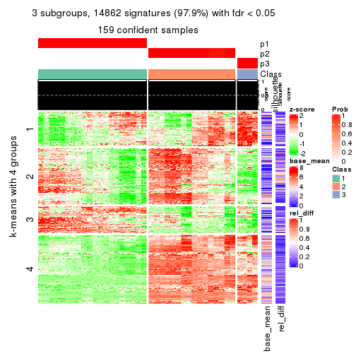</p>

</div>
<div id='tab-ATC-hclust-get-signatures-3'>
<pre><code class="r">get_signatures(res, k = 4)
</code></pre>

<p></p>

</div>
<div id='tab-ATC-hclust-get-signatures-4'>
<pre><code class="r">get_signatures(res, k = 5)
</code></pre>

<p></p>

</div>
<div id='tab-ATC-hclust-get-signatures-5'>
<pre><code class="r">get_signatures(res, k = 6)
</code></pre>

<p></p>

</div>
</div>


Signature heatmaps where rows are not scaled:


<script>
$( function() {
	$( '#tabs-ATC-hclust-get-signatures-no-scale' ).tabs();
} );
</script>
<div id='tabs-ATC-hclust-get-signatures-no-scale'>
<ul>
<li><a href='#tab-ATC-hclust-get-signatures-no-scale-1'>k = 2</a></li>
<li><a href='#tab-ATC-hclust-get-signatures-no-scale-2'>k = 3</a></li>
<li><a href='#tab-ATC-hclust-get-signatures-no-scale-3'>k = 4</a></li>
<li><a href='#tab-ATC-hclust-get-signatures-no-scale-4'>k = 5</a></li>
<li><a href='#tab-ATC-hclust-get-signatures-no-scale-5'>k = 6</a></li>
</ul>
<div id='tab-ATC-hclust-get-signatures-no-scale-1'>
<pre><code class="r">get_signatures(res, k = 2, scale_rows = FALSE)
</code></pre>

<p></p>

</div>
<div id='tab-ATC-hclust-get-signatures-no-scale-2'>
<pre><code class="r">get_signatures(res, k = 3, scale_rows = FALSE)
</code></pre>

<p></p>

</div>
<div id='tab-ATC-hclust-get-signatures-no-scale-3'>
<pre><code class="r">get_signatures(res, k = 4, scale_rows = FALSE)
</code></pre>

<p></p>

</div>
<div id='tab-ATC-hclust-get-signatures-no-scale-4'>
<pre><code class="r">get_signatures(res, k = 5, scale_rows = FALSE)
</code></pre>

<p></p>

</div>
<div id='tab-ATC-hclust-get-signatures-no-scale-5'>
<pre><code class="r">get_signatures(res, k = 6, scale_rows = FALSE)
</code></pre>

<p></p>

</div>
</div>


Compare the overlap of signatures from different k:

```r
compare_signatures(res)
```


`get_signature()` returns a data frame invisibly. TO get the list of signatures, the function
call should be assigned to a variable explicitly. In following code, if `plot` argument is set
to `FALSE`, no heatmap is plotted while only the differential analysis is performed.

```r
# code only for demonstration
tb = get_signature(res, k = ..., plot = FALSE)
```

An example of the output of `tb` is:

```
#>   which_row         fdr    mean_1    mean_2 scaled_mean_1 scaled_mean_2 km
#> 1        38 0.042760348  8.373488  9.131774    -0.5533452     0.5164555  1
#> 2        40 0.018707592  7.106213  8.469186    -0.6173731     0.5762149  1
#> 3        55 0.019134737 10.221463 11.207825    -0.6159697     0.5749050  1
#> 4        59 0.006059896  5.921854  7.869574    -0.6899429     0.6439467  1
#> 5        60 0.018055526  8.928898 10.211722    -0.6204761     0.5791110  1
#> 6        98 0.009384629 15.714769 14.887706     0.6635654    -0.6193277  2
...
```

The columns in `tb` are:

1. `which_row`: row indices corresponding to the input matrix.
2. `fdr`: FDR for the differential test. 
3. `mean_x`: The mean value in group x.
4. `scaled_mean_x`: The mean value in group x after rows are scaled.
5. `km`: Row groups if k-means clustering is applied to rows.


UMAP plot which shows how samples are separated.


<script>
$( function() {
	$( '#tabs-ATC-hclust-dimension-reduction' ).tabs();
} );
</script>
<div id='tabs-ATC-hclust-dimension-reduction'>
<ul>
<li><a href='#tab-ATC-hclust-dimension-reduction-1'>k = 2</a></li>
<li><a href='#tab-ATC-hclust-dimension-reduction-2'>k = 3</a></li>
<li><a href='#tab-ATC-hclust-dimension-reduction-3'>k = 4</a></li>
<li><a href='#tab-ATC-hclust-dimension-reduction-4'>k = 5</a></li>
<li><a href='#tab-ATC-hclust-dimension-reduction-5'>k = 6</a></li>
</ul>
<div id='tab-ATC-hclust-dimension-reduction-1'>
<pre><code class="r">dimension_reduction(res, k = 2, method = &quot;UMAP&quot;)
</code></pre>

<p></p>

</div>
<div id='tab-ATC-hclust-dimension-reduction-2'>
<pre><code class="r">dimension_reduction(res, k = 3, method = &quot;UMAP&quot;)
</code></pre>

<p></p>

</div>
<div id='tab-ATC-hclust-dimension-reduction-3'>
<pre><code class="r">dimension_reduction(res, k = 4, method = &quot;UMAP&quot;)
</code></pre>

<p>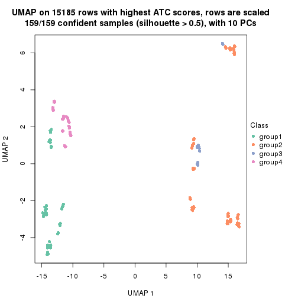</p>

</div>
<div id='tab-ATC-hclust-dimension-reduction-4'>
<pre><code class="r">dimension_reduction(res, k = 5, method = &quot;UMAP&quot;)
</code></pre>

<p></p>

</div>
<div id='tab-ATC-hclust-dimension-reduction-5'>
<pre><code class="r">dimension_reduction(res, k = 6, method = &quot;UMAP&quot;)
</code></pre>

<p></p>

</div>
</div>


Following heatmap shows how subgroups are split when increasing `k`:

```r
collect_classes(res)
```


If matrix rows can be associated to genes, consider to use `GO_Enrichment(res,
...)` to perform function enrichment for the signature genes.


 

---------------------------------------------------


### ATC:kmeans**


The object with results only for a single top-value method and a single partition method 
can be extracted as:

```r
res = res_list["ATC", "kmeans"]
# you can also extract it by
# res = res_list["ATC:kmeans"]
```

A summary of `res` and all the functions that can be applied to it:

```r
res
```

```
#> A 'ConsensusPartition' object with k = 2, 3, 4, 5, 6.
#>   On a matrix with 15185 rows and 159 columns.
#>   Top rows (1000, 2000, 3000, 4000, 5000) are extracted by 'ATC' method.
#>   Subgroups are detected by 'kmeans' method.
#>   Performed in total 1250 partitions by row resampling.
#>   Best k for subgroups seems to be 2.
#> 
#> Following methods can be applied to this 'ConsensusPartition' object:
#>  [1] "cola_report"             "collect_classes"         "collect_plots"          
#>  [4] "collect_stats"           "colnames"                "compare_signatures"     
#>  [7] "consensus_heatmap"       "dimension_reduction"     "functional_enrichment"  
#> [10] "get_anno_col"            "get_anno"                "get_classes"            
#> [13] "get_consensus"           "get_matrix"              "get_membership"         
#> [16] "get_param"               "get_signatures"          "get_stats"              
#> [19] "is_best_k"               "is_stable_k"             "membership_heatmap"     
#> [22] "ncol"                    "nrow"                    "plot_ecdf"              
#> [25] "rownames"                "select_partition_number" "show"                   
#> [28] "suggest_best_k"          "test_to_known_factors"
```

`collect_plots()` function collects all the plots made from `res` for all `k` (number of partitions)
into one single page to provide an easy and fast comparison between different `k`.

```r
collect_plots(res)
```


The plots are:

- The first row: a plot of the ECDF (Empirical cumulative distribution
  function) curves of the consensus matrix for each `k` and the heatmap of
  predicted classes for each `k`.
- The second row: heatmaps of the consensus matrix for each `k`.
- The third row: heatmaps of the membership matrix for each `k`.
- The fouth row: heatmaps of the signatures for each `k`.

All the plots in panels can be made by individual functions and they are
plotted later in this section.

`select_partition_number()` produces several plots showing different
statistics for choosing "optimized" `k`. There are following statistics:

- ECDF curves of the consensus matrix for each `k`;
- 1-PAC. [The PAC
  score](https://en.wikipedia.org/wiki/Consensus_clustering#Over-interpretation_potential_of_consensus_clustering)
  measures the proportion of the ambiguous subgrouping.
- Mean silhouette score.
- Concordance. The mean probability of fiting the consensus class ids in all
  partitions.
- Area increased. Denote $A_k$ as the area under the ECDF curve for current
  `k`, the area increased is defined as $A_k - A_{k-1}$.
- Rand index. The percent of pairs of samples that are both in a same cluster
  or both are not in a same cluster in the partition of k and k-1.
- Jaccard index. The ratio of pairs of samples are both in a same cluster in
  the partition of k and k-1 and the pairs of samples are both in a same
  cluster in the partition k or k-1.

The detailed explanations of these statistics can be found in [the cola
vignette](http://bioconductor.org/packages/devel/bioc/vignettes/cola/inst/doc/cola.html#toc_13).

Generally speaking, lower PAC score, higher mean silhouette score or higher
concordance corresponds to better partition. Rand index and Jaccard index
measure how similar the current partition is compared to partition with `k-1`.
If they are too similar, we won't accept `k` is better than `k-1`.

```r
select_partition_number(res)
```


The numeric values for all these statistics can be obtained by `get_stats()`.

```r
get_stats(res)
```

```
#>   k 1-PAC mean_silhouette concordance area_increased  Rand Jaccard
#> 2 2 1.000           1.000       1.000         0.5036 0.497   0.497
#> 3 3 0.753           0.492       0.801         0.2374 0.954   0.908
#> 4 4 0.660           0.876       0.809         0.1207 0.775   0.516
#> 5 5 0.592           0.679       0.700         0.0665 0.959   0.841
#> 6 6 0.573           0.726       0.720         0.0535 0.925   0.707
```

`suggest_best_k()` suggests the best $k$ based on these statistics. The rules are as follows:

- All $k$ with Jaccard index larger than 0.95 are removed because the increase of
  the partition number does not provides enough extra information. If all $k$ are removed,
  the best $k$ is assigned by `NA`.
- For $k$ with 1-PAC larger than 0.9, the maximal $k$ is taken as the "best k". Other $k$ is called "optional k".
- If it does not fit the second rule. The $k$ with the highest vote of highest
  1-PAC, mean silhouette and concordance is taken as the "best k".

```r
suggest_best_k(res)
```

```
#> [1] 2
```


Following shows the table of the partitions (You need to click the **show/hide
code output** link to see it). The membership matrix (columns with name `p*`)
is inferred by
[`clue::cl_consensus()`](https://www.rdocumentation.org/link/cl_consensus?package=clue)
function with the `SE` method. Basically the value in the membership matrix
represents the probability to belong to a certain group. The finall class
label for an item is determined with the group with highest probability it
belongs to.

In `get_classes()` function, the entropy is calculated from the membership
matrix and the silhouette score is calculated from the consensus matrix.


<script>
$( function() {
	$( '#tabs-ATC-kmeans-get-classes' ).tabs();
} );
</script>
<div id='tabs-ATC-kmeans-get-classes'>
<ul>
<li><a href='#tab-ATC-kmeans-get-classes-1'>k = 2</a></li>
<li><a href='#tab-ATC-kmeans-get-classes-2'>k = 3</a></li>
<li><a href='#tab-ATC-kmeans-get-classes-3'>k = 4</a></li>
<li><a href='#tab-ATC-kmeans-get-classes-4'>k = 5</a></li>
<li><a href='#tab-ATC-kmeans-get-classes-5'>k = 6</a></li>
</ul>

<div id='tab-ATC-kmeans-get-classes-1'>
<p><a id='tab-ATC-kmeans-get-classes-1-a' style='color:#0366d6' href='#'>show/hide code output</a></p>
<pre><code class="r">cbind(get_classes(res, k = 2), get_membership(res, k = 2))
</code></pre>

<pre><code>#&gt;            class entropy silhouette p1 p2
#&gt; SRR1706767     1       0          1  1  0
#&gt; SRR1706768     1       0          1  1  0
#&gt; SRR1706769     1       0          1  1  0
#&gt; SRR1706770     1       0          1  1  0
#&gt; SRR1706771     1       0          1  1  0
#&gt; SRR1706772     1       0          1  1  0
#&gt; SRR1706773     1       0          1  1  0
#&gt; SRR1706774     1       0          1  1  0
#&gt; SRR1706775     1       0          1  1  0
#&gt; SRR1706776     1       0          1  1  0
#&gt; SRR1706777     1       0          1  1  0
#&gt; SRR1706778     1       0          1  1  0
#&gt; SRR1706779     1       0          1  1  0
#&gt; SRR1706780     1       0          1  1  0
#&gt; SRR1706781     1       0          1  1  0
#&gt; SRR1706782     1       0          1  1  0
#&gt; SRR1706783     1       0          1  1  0
#&gt; SRR1706784     1       0          1  1  0
#&gt; SRR1706785     1       0          1  1  0
#&gt; SRR1706786     1       0          1  1  0
#&gt; SRR1706787     1       0          1  1  0
#&gt; SRR1706788     1       0          1  1  0
#&gt; SRR1706789     1       0          1  1  0
#&gt; SRR1706790     1       0          1  1  0
#&gt; SRR1706791     1       0          1  1  0
#&gt; SRR1706792     1       0          1  1  0
#&gt; SRR1706793     1       0          1  1  0
#&gt; SRR1706794     1       0          1  1  0
#&gt; SRR1706795     1       0          1  1  0
#&gt; SRR1706796     1       0          1  1  0
#&gt; SRR1706797     1       0          1  1  0
#&gt; SRR1706798     1       0          1  1  0
#&gt; SRR1706799     1       0          1  1  0
#&gt; SRR1706800     1       0          1  1  0
#&gt; SRR1706801     1       0          1  1  0
#&gt; SRR1706802     1       0          1  1  0
#&gt; SRR1706803     1       0          1  1  0
#&gt; SRR1706804     1       0          1  1  0
#&gt; SRR1706805     1       0          1  1  0
#&gt; SRR1706806     1       0          1  1  0
#&gt; SRR1706811     1       0          1  1  0
#&gt; SRR1706812     1       0          1  1  0
#&gt; SRR1706813     1       0          1  1  0
#&gt; SRR1706814     1       0          1  1  0
#&gt; SRR1706807     1       0          1  1  0
#&gt; SRR1706808     1       0          1  1  0
#&gt; SRR1706809     1       0          1  1  0
#&gt; SRR1706810     1       0          1  1  0
#&gt; SRR1706815     1       0          1  1  0
#&gt; SRR1706816     1       0          1  1  0
#&gt; SRR1706817     1       0          1  1  0
#&gt; SRR1706818     1       0          1  1  0
#&gt; SRR1706819     1       0          1  1  0
#&gt; SRR1706820     1       0          1  1  0
#&gt; SRR1706821     1       0          1  1  0
#&gt; SRR1706822     1       0          1  1  0
#&gt; SRR1706823     1       0          1  1  0
#&gt; SRR1706824     1       0          1  1  0
#&gt; SRR1706825     1       0          1  1  0
#&gt; SRR1706826     1       0          1  1  0
#&gt; SRR1706827     1       0          1  1  0
#&gt; SRR1706828     1       0          1  1  0
#&gt; SRR1706829     1       0          1  1  0
#&gt; SRR1706830     1       0          1  1  0
#&gt; SRR1706835     1       0          1  1  0
#&gt; SRR1706836     1       0          1  1  0
#&gt; SRR1706837     1       0          1  1  0
#&gt; SRR1706838     1       0          1  1  0
#&gt; SRR1706831     1       0          1  1  0
#&gt; SRR1706832     1       0          1  1  0
#&gt; SRR1706833     1       0          1  1  0
#&gt; SRR1706834     1       0          1  1  0
#&gt; SRR1706839     1       0          1  1  0
#&gt; SRR1706840     1       0          1  1  0
#&gt; SRR1706841     1       0          1  1  0
#&gt; SRR1706842     1       0          1  1  0
#&gt; SRR1706847     2       0          1  0  1
#&gt; SRR1706848     2       0          1  0  1
#&gt; SRR1706849     2       0          1  0  1
#&gt; SRR1706850     2       0          1  0  1
#&gt; SRR1706843     1       0          1  1  0
#&gt; SRR1706844     1       0          1  1  0
#&gt; SRR1706845     1       0          1  1  0
#&gt; SRR1706846     1       0          1  1  0
#&gt; SRR1706851     2       0          1  0  1
#&gt; SRR1706852     2       0          1  0  1
#&gt; SRR1706853     2       0          1  0  1
#&gt; SRR1706854     2       0          1  0  1
#&gt; SRR1706855     2       0          1  0  1
#&gt; SRR1706856     2       0          1  0  1
#&gt; SRR1706857     2       0          1  0  1
#&gt; SRR1706858     2       0          1  0  1
#&gt; SRR1706859     2       0          1  0  1
#&gt; SRR1706860     2       0          1  0  1
#&gt; SRR1706861     2       0          1  0  1
#&gt; SRR1706862     2       0          1  0  1
#&gt; SRR1706867     2       0          1  0  1
#&gt; SRR1706869     2       0          1  0  1
#&gt; SRR1706870     2       0          1  0  1
#&gt; SRR1706863     2       0          1  0  1
#&gt; SRR1706864     2       0          1  0  1
#&gt; SRR1706865     2       0          1  0  1
#&gt; SRR1706866     2       0          1  0  1
#&gt; SRR1706871     2       0          1  0  1
#&gt; SRR1706872     2       0          1  0  1
#&gt; SRR1706873     2       0          1  0  1
#&gt; SRR1706874     2       0          1  0  1
#&gt; SRR1706879     2       0          1  0  1
#&gt; SRR1706880     2       0          1  0  1
#&gt; SRR1706881     2       0          1  0  1
#&gt; SRR1706882     2       0          1  0  1
#&gt; SRR1706883     2       0          1  0  1
#&gt; SRR1706884     2       0          1  0  1
#&gt; SRR1706885     2       0          1  0  1
#&gt; SRR1706886     2       0          1  0  1
#&gt; SRR1706875     2       0          1  0  1
#&gt; SRR1706876     2       0          1  0  1
#&gt; SRR1706877     2       0          1  0  1
#&gt; SRR1706878     2       0          1  0  1
#&gt; SRR1706887     2       0          1  0  1
#&gt; SRR1706888     2       0          1  0  1
#&gt; SRR1706889     2       0          1  0  1
#&gt; SRR1706890     2       0          1  0  1
#&gt; SRR1706891     2       0          1  0  1
#&gt; SRR1706892     2       0          1  0  1
#&gt; SRR1706893     2       0          1  0  1
#&gt; SRR1706894     2       0          1  0  1
#&gt; SRR1706895     2       0          1  0  1
#&gt; SRR1706896     2       0          1  0  1
#&gt; SRR1706897     2       0          1  0  1
#&gt; SRR1706898     2       0          1  0  1
#&gt; SRR1706899     2       0          1  0  1
#&gt; SRR1706900     2       0          1  0  1
#&gt; SRR1706901     2       0          1  0  1
#&gt; SRR1706902     2       0          1  0  1
#&gt; SRR1706907     2       0          1  0  1
#&gt; SRR1706908     2       0          1  0  1
#&gt; SRR1706909     2       0          1  0  1
#&gt; SRR1706910     2       0          1  0  1
#&gt; SRR1706903     2       0          1  0  1
#&gt; SRR1706904     2       0          1  0  1
#&gt; SRR1706905     2       0          1  0  1
#&gt; SRR1706906     2       0          1  0  1
#&gt; SRR1706911     2       0          1  0  1
#&gt; SRR1706912     2       0          1  0  1
#&gt; SRR1706913     2       0          1  0  1
#&gt; SRR1706914     2       0          1  0  1
#&gt; SRR1706919     2       0          1  0  1
#&gt; SRR1706920     2       0          1  0  1
#&gt; SRR1706921     2       0          1  0  1
#&gt; SRR1706922     2       0          1  0  1
#&gt; SRR1706915     2       0          1  0  1
#&gt; SRR1706916     2       0          1  0  1
#&gt; SRR1706917     2       0          1  0  1
#&gt; SRR1706918     2       0          1  0  1
#&gt; SRR1706923     2       0          1  0  1
#&gt; SRR1706924     2       0          1  0  1
#&gt; SRR1706925     2       0          1  0  1
#&gt; SRR1706926     2       0          1  0  1
</code></pre>

<script>
$('#tab-ATC-kmeans-get-classes-1-a').parent().next().next().hide();
$('#tab-ATC-kmeans-get-classes-1-a').click(function(){
  $('#tab-ATC-kmeans-get-classes-1-a').parent().next().next().toggle();
  return(false);
});
</script>
</div>

<div id='tab-ATC-kmeans-get-classes-2'>
<p><a id='tab-ATC-kmeans-get-classes-2-a' style='color:#0366d6' href='#'>show/hide code output</a></p>
<pre><code class="r">cbind(get_classes(res, k = 3), get_membership(res, k = 3))
</code></pre>

<pre><code>#&gt;            class entropy silhouette    p1    p2    p3
#&gt; SRR1706767     1  0.6308     -0.911 0.508 0.000 0.492
#&gt; SRR1706768     1  0.6308     -0.911 0.508 0.000 0.492
#&gt; SRR1706769     1  0.6308     -0.911 0.508 0.000 0.492
#&gt; SRR1706770     1  0.6308     -0.911 0.508 0.000 0.492
#&gt; SRR1706771     1  0.6308     -0.911 0.508 0.000 0.492
#&gt; SRR1706772     1  0.6308     -0.911 0.508 0.000 0.492
#&gt; SRR1706773     1  0.6308     -0.911 0.508 0.000 0.492
#&gt; SRR1706774     1  0.6308     -0.911 0.508 0.000 0.492
#&gt; SRR1706775     1  0.2066      0.589 0.940 0.000 0.060
#&gt; SRR1706776     1  0.2066      0.589 0.940 0.000 0.060
#&gt; SRR1706777     1  0.2066      0.589 0.940 0.000 0.060
#&gt; SRR1706778     1  0.2066      0.589 0.940 0.000 0.060
#&gt; SRR1706779     1  0.0000      0.629 1.000 0.000 0.000
#&gt; SRR1706780     1  0.0000      0.629 1.000 0.000 0.000
#&gt; SRR1706781     1  0.0000      0.629 1.000 0.000 0.000
#&gt; SRR1706782     1  0.0000      0.629 1.000 0.000 0.000
#&gt; SRR1706783     1  0.0592      0.626 0.988 0.000 0.012
#&gt; SRR1706784     1  0.0592      0.626 0.988 0.000 0.012
#&gt; SRR1706785     1  0.0592      0.626 0.988 0.000 0.012
#&gt; SRR1706786     1  0.0592      0.626 0.988 0.000 0.012
#&gt; SRR1706787     1  0.6308     -0.911 0.508 0.000 0.492
#&gt; SRR1706788     1  0.6308     -0.911 0.508 0.000 0.492
#&gt; SRR1706789     1  0.6308     -0.911 0.508 0.000 0.492
#&gt; SRR1706790     1  0.6308     -0.911 0.508 0.000 0.492
#&gt; SRR1706791     1  0.6308     -0.911 0.508 0.000 0.492
#&gt; SRR1706792     1  0.6308     -0.911 0.508 0.000 0.492
#&gt; SRR1706793     1  0.6308     -0.911 0.508 0.000 0.492
#&gt; SRR1706794     1  0.6308     -0.911 0.508 0.000 0.492
#&gt; SRR1706795     1  0.0747      0.623 0.984 0.000 0.016
#&gt; SRR1706796     1  0.0747      0.623 0.984 0.000 0.016
#&gt; SRR1706797     1  0.0747      0.623 0.984 0.000 0.016
#&gt; SRR1706798     1  0.0747      0.623 0.984 0.000 0.016
#&gt; SRR1706799     1  0.0000      0.629 1.000 0.000 0.000
#&gt; SRR1706800     1  0.0000      0.629 1.000 0.000 0.000
#&gt; SRR1706801     1  0.0000      0.629 1.000 0.000 0.000
#&gt; SRR1706802     1  0.0000      0.629 1.000 0.000 0.000
#&gt; SRR1706803     1  0.0592      0.626 0.988 0.000 0.012
#&gt; SRR1706804     1  0.0592      0.626 0.988 0.000 0.012
#&gt; SRR1706805     1  0.0592      0.626 0.988 0.000 0.012
#&gt; SRR1706806     1  0.0592      0.626 0.988 0.000 0.012
#&gt; SRR1706811     3  0.6302      1.000 0.480 0.000 0.520
#&gt; SRR1706812     3  0.6302      1.000 0.480 0.000 0.520
#&gt; SRR1706813     3  0.6302      1.000 0.480 0.000 0.520
#&gt; SRR1706814     3  0.6302      1.000 0.480 0.000 0.520
#&gt; SRR1706807     3  0.6302      1.000 0.480 0.000 0.520
#&gt; SRR1706808     3  0.6302      1.000 0.480 0.000 0.520
#&gt; SRR1706809     3  0.6302      1.000 0.480 0.000 0.520
#&gt; SRR1706810     3  0.6302      1.000 0.480 0.000 0.520
#&gt; SRR1706815     1  0.2711      0.580 0.912 0.000 0.088
#&gt; SRR1706816     1  0.2711      0.580 0.912 0.000 0.088
#&gt; SRR1706817     1  0.2711      0.580 0.912 0.000 0.088
#&gt; SRR1706818     1  0.2711      0.580 0.912 0.000 0.088
#&gt; SRR1706819     1  0.1163      0.615 0.972 0.000 0.028
#&gt; SRR1706820     1  0.1163      0.615 0.972 0.000 0.028
#&gt; SRR1706821     1  0.1163      0.615 0.972 0.000 0.028
#&gt; SRR1706822     1  0.1163      0.615 0.972 0.000 0.028
#&gt; SRR1706823     1  0.1529      0.609 0.960 0.000 0.040
#&gt; SRR1706824     1  0.1529      0.609 0.960 0.000 0.040
#&gt; SRR1706825     1  0.1529      0.609 0.960 0.000 0.040
#&gt; SRR1706826     1  0.1529      0.609 0.960 0.000 0.040
#&gt; SRR1706827     1  0.6308     -0.911 0.508 0.000 0.492
#&gt; SRR1706828     1  0.6308     -0.911 0.508 0.000 0.492
#&gt; SRR1706829     1  0.6308     -0.911 0.508 0.000 0.492
#&gt; SRR1706830     1  0.6308     -0.911 0.508 0.000 0.492
#&gt; SRR1706835     1  0.2066      0.589 0.940 0.000 0.060
#&gt; SRR1706836     1  0.2066      0.589 0.940 0.000 0.060
#&gt; SRR1706837     1  0.2066      0.589 0.940 0.000 0.060
#&gt; SRR1706838     1  0.2066      0.589 0.940 0.000 0.060
#&gt; SRR1706831     1  0.6308     -0.911 0.508 0.000 0.492
#&gt; SRR1706832     1  0.6308     -0.911 0.508 0.000 0.492
#&gt; SRR1706833     1  0.6308     -0.911 0.508 0.000 0.492
#&gt; SRR1706834     1  0.6308     -0.911 0.508 0.000 0.492
#&gt; SRR1706839     1  0.0000      0.629 1.000 0.000 0.000
#&gt; SRR1706840     1  0.0000      0.629 1.000 0.000 0.000
#&gt; SRR1706841     1  0.0000      0.629 1.000 0.000 0.000
#&gt; SRR1706842     1  0.0000      0.629 1.000 0.000 0.000
#&gt; SRR1706847     2  0.6291      0.724 0.000 0.532 0.468
#&gt; SRR1706848     2  0.6291      0.724 0.000 0.532 0.468
#&gt; SRR1706849     2  0.6291      0.724 0.000 0.532 0.468
#&gt; SRR1706850     2  0.6291      0.724 0.000 0.532 0.468
#&gt; SRR1706843     1  0.0592      0.626 0.988 0.000 0.012
#&gt; SRR1706844     1  0.0592      0.626 0.988 0.000 0.012
#&gt; SRR1706845     1  0.0592      0.626 0.988 0.000 0.012
#&gt; SRR1706846     1  0.0592      0.626 0.988 0.000 0.012
#&gt; SRR1706851     2  0.6274      0.730 0.000 0.544 0.456
#&gt; SRR1706852     2  0.6274      0.730 0.000 0.544 0.456
#&gt; SRR1706853     2  0.6274      0.730 0.000 0.544 0.456
#&gt; SRR1706854     2  0.6274      0.730 0.000 0.544 0.456
#&gt; SRR1706855     2  0.0000      0.835 0.000 1.000 0.000
#&gt; SRR1706856     2  0.0000      0.835 0.000 1.000 0.000
#&gt; SRR1706857     2  0.0000      0.835 0.000 1.000 0.000
#&gt; SRR1706858     2  0.0000      0.835 0.000 1.000 0.000
#&gt; SRR1706859     2  0.0000      0.835 0.000 1.000 0.000
#&gt; SRR1706860     2  0.0000      0.835 0.000 1.000 0.000
#&gt; SRR1706861     2  0.0000      0.835 0.000 1.000 0.000
#&gt; SRR1706862     2  0.0000      0.835 0.000 1.000 0.000
#&gt; SRR1706867     2  0.6291      0.724 0.000 0.532 0.468
#&gt; SRR1706869     2  0.6291      0.724 0.000 0.532 0.468
#&gt; SRR1706870     2  0.6291      0.724 0.000 0.532 0.468
#&gt; SRR1706863     2  0.0000      0.835 0.000 1.000 0.000
#&gt; SRR1706864     2  0.0000      0.835 0.000 1.000 0.000
#&gt; SRR1706865     2  0.0000      0.835 0.000 1.000 0.000
#&gt; SRR1706866     2  0.0000      0.835 0.000 1.000 0.000
#&gt; SRR1706871     2  0.6274      0.730 0.000 0.544 0.456
#&gt; SRR1706872     2  0.6274      0.730 0.000 0.544 0.456
#&gt; SRR1706873     2  0.6274      0.730 0.000 0.544 0.456
#&gt; SRR1706874     2  0.6274      0.730 0.000 0.544 0.456
#&gt; SRR1706879     2  0.0000      0.835 0.000 1.000 0.000
#&gt; SRR1706880     2  0.0000      0.835 0.000 1.000 0.000
#&gt; SRR1706881     2  0.0000      0.835 0.000 1.000 0.000
#&gt; SRR1706882     2  0.0000      0.835 0.000 1.000 0.000
#&gt; SRR1706883     2  0.0000      0.835 0.000 1.000 0.000
#&gt; SRR1706884     2  0.0000      0.835 0.000 1.000 0.000
#&gt; SRR1706885     2  0.0000      0.835 0.000 1.000 0.000
#&gt; SRR1706886     2  0.0000      0.835 0.000 1.000 0.000
#&gt; SRR1706875     2  0.0000      0.835 0.000 1.000 0.000
#&gt; SRR1706876     2  0.0000      0.835 0.000 1.000 0.000
#&gt; SRR1706877     2  0.0000      0.835 0.000 1.000 0.000
#&gt; SRR1706878     2  0.0000      0.835 0.000 1.000 0.000
#&gt; SRR1706887     2  0.6302      0.720 0.000 0.520 0.480
#&gt; SRR1706888     2  0.6302      0.720 0.000 0.520 0.480
#&gt; SRR1706889     2  0.6302      0.720 0.000 0.520 0.480
#&gt; SRR1706890     2  0.6302      0.720 0.000 0.520 0.480
#&gt; SRR1706891     2  0.6291      0.727 0.000 0.532 0.468
#&gt; SRR1706892     2  0.6291      0.727 0.000 0.532 0.468
#&gt; SRR1706893     2  0.6291      0.727 0.000 0.532 0.468
#&gt; SRR1706894     2  0.6291      0.727 0.000 0.532 0.468
#&gt; SRR1706895     2  0.0592      0.832 0.000 0.988 0.012
#&gt; SRR1706896     2  0.0592      0.832 0.000 0.988 0.012
#&gt; SRR1706897     2  0.0592      0.832 0.000 0.988 0.012
#&gt; SRR1706898     2  0.0592      0.832 0.000 0.988 0.012
#&gt; SRR1706899     2  0.0592      0.832 0.000 0.988 0.012
#&gt; SRR1706900     2  0.0592      0.832 0.000 0.988 0.012
#&gt; SRR1706901     2  0.0592      0.832 0.000 0.988 0.012
#&gt; SRR1706902     2  0.0592      0.832 0.000 0.988 0.012
#&gt; SRR1706907     2  0.6291      0.724 0.000 0.532 0.468
#&gt; SRR1706908     2  0.6291      0.724 0.000 0.532 0.468
#&gt; SRR1706909     2  0.6291      0.724 0.000 0.532 0.468
#&gt; SRR1706910     2  0.6291      0.724 0.000 0.532 0.468
#&gt; SRR1706903     2  0.0592      0.832 0.000 0.988 0.012
#&gt; SRR1706904     2  0.0592      0.832 0.000 0.988 0.012
#&gt; SRR1706905     2  0.0592      0.832 0.000 0.988 0.012
#&gt; SRR1706906     2  0.0592      0.832 0.000 0.988 0.012
#&gt; SRR1706911     2  0.6274      0.730 0.000 0.544 0.456
#&gt; SRR1706912     2  0.6274      0.730 0.000 0.544 0.456
#&gt; SRR1706913     2  0.6274      0.730 0.000 0.544 0.456
#&gt; SRR1706914     2  0.6274      0.730 0.000 0.544 0.456
#&gt; SRR1706919     2  0.0000      0.835 0.000 1.000 0.000
#&gt; SRR1706920     2  0.0000      0.835 0.000 1.000 0.000
#&gt; SRR1706921     2  0.0000      0.835 0.000 1.000 0.000
#&gt; SRR1706922     2  0.0000      0.835 0.000 1.000 0.000
#&gt; SRR1706915     2  0.0000      0.835 0.000 1.000 0.000
#&gt; SRR1706916     2  0.0000      0.835 0.000 1.000 0.000
#&gt; SRR1706917     2  0.0000      0.835 0.000 1.000 0.000
#&gt; SRR1706918     2  0.0000      0.835 0.000 1.000 0.000
#&gt; SRR1706923     2  0.0000      0.835 0.000 1.000 0.000
#&gt; SRR1706924     2  0.0000      0.835 0.000 1.000 0.000
#&gt; SRR1706925     2  0.0000      0.835 0.000 1.000 0.000
#&gt; SRR1706926     2  0.0000      0.835 0.000 1.000 0.000
</code></pre>

<script>
$('#tab-ATC-kmeans-get-classes-2-a').parent().next().next().hide();
$('#tab-ATC-kmeans-get-classes-2-a').click(function(){
  $('#tab-ATC-kmeans-get-classes-2-a').parent().next().next().toggle();
  return(false);
});
</script>
</div>

<div id='tab-ATC-kmeans-get-classes-3'>
<p><a id='tab-ATC-kmeans-get-classes-3-a' style='color:#0366d6' href='#'>show/hide code output</a></p>
<pre><code class="r">cbind(get_classes(res, k = 4), get_membership(res, k = 4))
</code></pre>

<pre><code>#&gt;            class entropy silhouette    p1    p2    p3    p4
#&gt; SRR1706767     4  0.6107      0.938 0.264 0.088 0.000 0.648
#&gt; SRR1706768     4  0.6107      0.938 0.264 0.088 0.000 0.648
#&gt; SRR1706769     4  0.6107      0.938 0.264 0.088 0.000 0.648
#&gt; SRR1706770     4  0.6107      0.938 0.264 0.088 0.000 0.648
#&gt; SRR1706771     4  0.4826      0.934 0.264 0.020 0.000 0.716
#&gt; SRR1706772     4  0.4826      0.934 0.264 0.020 0.000 0.716
#&gt; SRR1706773     4  0.4826      0.934 0.264 0.020 0.000 0.716
#&gt; SRR1706774     4  0.4826      0.934 0.264 0.020 0.000 0.716
#&gt; SRR1706775     1  0.5517      0.659 0.724 0.092 0.000 0.184
#&gt; SRR1706776     1  0.5517      0.659 0.724 0.092 0.000 0.184
#&gt; SRR1706777     1  0.5517      0.659 0.724 0.092 0.000 0.184
#&gt; SRR1706778     1  0.5517      0.659 0.724 0.092 0.000 0.184
#&gt; SRR1706779     1  0.0000      0.843 1.000 0.000 0.000 0.000
#&gt; SRR1706780     1  0.0000      0.843 1.000 0.000 0.000 0.000
#&gt; SRR1706781     1  0.0000      0.843 1.000 0.000 0.000 0.000
#&gt; SRR1706782     1  0.0000      0.843 1.000 0.000 0.000 0.000
#&gt; SRR1706783     1  0.2081      0.827 0.916 0.084 0.000 0.000
#&gt; SRR1706784     1  0.2081      0.827 0.916 0.084 0.000 0.000
#&gt; SRR1706785     1  0.2081      0.827 0.916 0.084 0.000 0.000
#&gt; SRR1706786     1  0.2081      0.827 0.916 0.084 0.000 0.000
#&gt; SRR1706787     4  0.5927      0.941 0.264 0.076 0.000 0.660
#&gt; SRR1706788     4  0.5927      0.941 0.264 0.076 0.000 0.660
#&gt; SRR1706789     4  0.5927      0.941 0.264 0.076 0.000 0.660
#&gt; SRR1706790     4  0.5927      0.941 0.264 0.076 0.000 0.660
#&gt; SRR1706791     4  0.4606      0.934 0.264 0.012 0.000 0.724
#&gt; SRR1706792     4  0.4606      0.934 0.264 0.012 0.000 0.724
#&gt; SRR1706793     4  0.4606      0.934 0.264 0.012 0.000 0.724
#&gt; SRR1706794     4  0.4606      0.934 0.264 0.012 0.000 0.724
#&gt; SRR1706795     1  0.4710      0.738 0.792 0.088 0.000 0.120
#&gt; SRR1706796     1  0.4710      0.738 0.792 0.088 0.000 0.120
#&gt; SRR1706797     1  0.4710      0.738 0.792 0.088 0.000 0.120
#&gt; SRR1706798     1  0.4710      0.738 0.792 0.088 0.000 0.120
#&gt; SRR1706799     1  0.0000      0.843 1.000 0.000 0.000 0.000
#&gt; SRR1706800     1  0.0000      0.843 1.000 0.000 0.000 0.000
#&gt; SRR1706801     1  0.0000      0.843 1.000 0.000 0.000 0.000
#&gt; SRR1706802     1  0.0000      0.843 1.000 0.000 0.000 0.000
#&gt; SRR1706803     1  0.2081      0.827 0.916 0.084 0.000 0.000
#&gt; SRR1706804     1  0.2081      0.827 0.916 0.084 0.000 0.000
#&gt; SRR1706805     1  0.2081      0.827 0.916 0.084 0.000 0.000
#&gt; SRR1706806     1  0.2081      0.827 0.916 0.084 0.000 0.000
#&gt; SRR1706811     4  0.4661      0.934 0.256 0.016 0.000 0.728
#&gt; SRR1706812     4  0.4661      0.934 0.256 0.016 0.000 0.728
#&gt; SRR1706813     4  0.4661      0.934 0.256 0.016 0.000 0.728
#&gt; SRR1706814     4  0.4661      0.934 0.256 0.016 0.000 0.728
#&gt; SRR1706807     4  0.6054      0.935 0.256 0.088 0.000 0.656
#&gt; SRR1706808     4  0.6054      0.935 0.256 0.088 0.000 0.656
#&gt; SRR1706809     4  0.6054      0.935 0.256 0.088 0.000 0.656
#&gt; SRR1706810     4  0.6054      0.935 0.256 0.088 0.000 0.656
#&gt; SRR1706815     1  0.6013      0.637 0.684 0.120 0.000 0.196
#&gt; SRR1706816     1  0.6013      0.637 0.684 0.120 0.000 0.196
#&gt; SRR1706817     1  0.6013      0.637 0.684 0.120 0.000 0.196
#&gt; SRR1706818     1  0.6013      0.637 0.684 0.120 0.000 0.196
#&gt; SRR1706819     1  0.1807      0.833 0.940 0.052 0.000 0.008
#&gt; SRR1706820     1  0.1807      0.833 0.940 0.052 0.000 0.008
#&gt; SRR1706821     1  0.1807      0.833 0.940 0.052 0.000 0.008
#&gt; SRR1706822     1  0.1807      0.833 0.940 0.052 0.000 0.008
#&gt; SRR1706823     1  0.2918      0.813 0.876 0.116 0.000 0.008
#&gt; SRR1706824     1  0.2918      0.813 0.876 0.116 0.000 0.008
#&gt; SRR1706825     1  0.2918      0.813 0.876 0.116 0.000 0.008
#&gt; SRR1706826     1  0.2918      0.813 0.876 0.116 0.000 0.008
#&gt; SRR1706827     4  0.5927      0.941 0.264 0.076 0.000 0.660
#&gt; SRR1706828     4  0.5927      0.941 0.264 0.076 0.000 0.660
#&gt; SRR1706829     4  0.5927      0.941 0.264 0.076 0.000 0.660
#&gt; SRR1706830     4  0.5927      0.941 0.264 0.076 0.000 0.660
#&gt; SRR1706835     1  0.5496      0.657 0.724 0.088 0.000 0.188
#&gt; SRR1706836     1  0.5496      0.657 0.724 0.088 0.000 0.188
#&gt; SRR1706837     1  0.5496      0.657 0.724 0.088 0.000 0.188
#&gt; SRR1706838     1  0.5496      0.657 0.724 0.088 0.000 0.188
#&gt; SRR1706831     4  0.4164      0.939 0.264 0.000 0.000 0.736
#&gt; SRR1706832     4  0.4164      0.939 0.264 0.000 0.000 0.736
#&gt; SRR1706833     4  0.4164      0.939 0.264 0.000 0.000 0.736
#&gt; SRR1706834     4  0.4164      0.939 0.264 0.000 0.000 0.736
#&gt; SRR1706839     1  0.0188      0.842 0.996 0.004 0.000 0.000
#&gt; SRR1706840     1  0.0188      0.842 0.996 0.004 0.000 0.000
#&gt; SRR1706841     1  0.0188      0.842 0.996 0.004 0.000 0.000
#&gt; SRR1706842     1  0.0188      0.842 0.996 0.004 0.000 0.000
#&gt; SRR1706847     3  0.1792      0.950 0.000 0.000 0.932 0.068
#&gt; SRR1706848     3  0.1792      0.950 0.000 0.000 0.932 0.068
#&gt; SRR1706849     3  0.1792      0.950 0.000 0.000 0.932 0.068
#&gt; SRR1706850     3  0.1792      0.950 0.000 0.000 0.932 0.068
#&gt; SRR1706843     1  0.2081      0.827 0.916 0.084 0.000 0.000
#&gt; SRR1706844     1  0.2081      0.827 0.916 0.084 0.000 0.000
#&gt; SRR1706845     1  0.2081      0.827 0.916 0.084 0.000 0.000
#&gt; SRR1706846     1  0.2081      0.827 0.916 0.084 0.000 0.000
#&gt; SRR1706851     3  0.0469      0.946 0.000 0.000 0.988 0.012
#&gt; SRR1706852     3  0.0469      0.946 0.000 0.000 0.988 0.012
#&gt; SRR1706853     3  0.0469      0.946 0.000 0.000 0.988 0.012
#&gt; SRR1706854     3  0.0469      0.946 0.000 0.000 0.988 0.012
#&gt; SRR1706855     2  0.6820      0.851 0.000 0.528 0.364 0.108
#&gt; SRR1706856     2  0.6820      0.851 0.000 0.528 0.364 0.108
#&gt; SRR1706857     2  0.6820      0.851 0.000 0.528 0.364 0.108
#&gt; SRR1706858     2  0.6820      0.851 0.000 0.528 0.364 0.108
#&gt; SRR1706859     2  0.4431      0.912 0.000 0.696 0.304 0.000
#&gt; SRR1706860     2  0.4431      0.912 0.000 0.696 0.304 0.000
#&gt; SRR1706861     2  0.4431      0.912 0.000 0.696 0.304 0.000
#&gt; SRR1706862     2  0.4431      0.912 0.000 0.696 0.304 0.000
#&gt; SRR1706867     3  0.1792      0.949 0.000 0.000 0.932 0.068
#&gt; SRR1706869     3  0.1792      0.949 0.000 0.000 0.932 0.068
#&gt; SRR1706870     3  0.1792      0.949 0.000 0.000 0.932 0.068
#&gt; SRR1706863     2  0.4608      0.911 0.000 0.692 0.304 0.004
#&gt; SRR1706864     2  0.4608      0.911 0.000 0.692 0.304 0.004
#&gt; SRR1706865     2  0.4608      0.911 0.000 0.692 0.304 0.004
#&gt; SRR1706866     2  0.4608      0.911 0.000 0.692 0.304 0.004
#&gt; SRR1706871     3  0.0000      0.950 0.000 0.000 1.000 0.000
#&gt; SRR1706872     3  0.0000      0.950 0.000 0.000 1.000 0.000
#&gt; SRR1706873     3  0.0000      0.950 0.000 0.000 1.000 0.000
#&gt; SRR1706874     3  0.0000      0.950 0.000 0.000 1.000 0.000
#&gt; SRR1706879     2  0.5535      0.910 0.000 0.656 0.304 0.040
#&gt; SRR1706880     2  0.5535      0.910 0.000 0.656 0.304 0.040
#&gt; SRR1706881     2  0.5535      0.910 0.000 0.656 0.304 0.040
#&gt; SRR1706882     2  0.5535      0.910 0.000 0.656 0.304 0.040
#&gt; SRR1706883     2  0.4608      0.911 0.000 0.692 0.304 0.004
#&gt; SRR1706884     2  0.4608      0.911 0.000 0.692 0.304 0.004
#&gt; SRR1706885     2  0.4608      0.911 0.000 0.692 0.304 0.004
#&gt; SRR1706886     2  0.4608      0.911 0.000 0.692 0.304 0.004
#&gt; SRR1706875     2  0.6830      0.848 0.000 0.524 0.368 0.108
#&gt; SRR1706876     2  0.6830      0.848 0.000 0.524 0.368 0.108
#&gt; SRR1706877     2  0.6830      0.848 0.000 0.524 0.368 0.108
#&gt; SRR1706878     2  0.6830      0.848 0.000 0.524 0.368 0.108
#&gt; SRR1706887     3  0.2081      0.946 0.000 0.000 0.916 0.084
#&gt; SRR1706888     3  0.2081      0.946 0.000 0.000 0.916 0.084
#&gt; SRR1706889     3  0.2081      0.946 0.000 0.000 0.916 0.084
#&gt; SRR1706890     3  0.2081      0.946 0.000 0.000 0.916 0.084
#&gt; SRR1706891     3  0.1557      0.917 0.000 0.000 0.944 0.056
#&gt; SRR1706892     3  0.1557      0.917 0.000 0.000 0.944 0.056
#&gt; SRR1706893     3  0.1557      0.917 0.000 0.000 0.944 0.056
#&gt; SRR1706894     3  0.1557      0.917 0.000 0.000 0.944 0.056
#&gt; SRR1706895     2  0.7302      0.850 0.000 0.500 0.332 0.168
#&gt; SRR1706896     2  0.7302      0.850 0.000 0.500 0.332 0.168
#&gt; SRR1706897     2  0.7302      0.850 0.000 0.500 0.332 0.168
#&gt; SRR1706898     2  0.7302      0.850 0.000 0.500 0.332 0.168
#&gt; SRR1706899     2  0.5972      0.890 0.000 0.632 0.304 0.064
#&gt; SRR1706900     2  0.5972      0.890 0.000 0.632 0.304 0.064
#&gt; SRR1706901     2  0.5972      0.890 0.000 0.632 0.304 0.064
#&gt; SRR1706902     2  0.5972      0.890 0.000 0.632 0.304 0.064
#&gt; SRR1706907     3  0.1792      0.949 0.000 0.000 0.932 0.068
#&gt; SRR1706908     3  0.1792      0.949 0.000 0.000 0.932 0.068
#&gt; SRR1706909     3  0.1792      0.949 0.000 0.000 0.932 0.068
#&gt; SRR1706910     3  0.1792      0.949 0.000 0.000 0.932 0.068
#&gt; SRR1706903     2  0.5905      0.889 0.000 0.636 0.304 0.060
#&gt; SRR1706904     2  0.5905      0.889 0.000 0.636 0.304 0.060
#&gt; SRR1706905     2  0.5905      0.889 0.000 0.636 0.304 0.060
#&gt; SRR1706906     2  0.5905      0.889 0.000 0.636 0.304 0.060
#&gt; SRR1706911     3  0.0000      0.950 0.000 0.000 1.000 0.000
#&gt; SRR1706912     3  0.0000      0.950 0.000 0.000 1.000 0.000
#&gt; SRR1706913     3  0.0000      0.950 0.000 0.000 1.000 0.000
#&gt; SRR1706914     3  0.0000      0.950 0.000 0.000 1.000 0.000
#&gt; SRR1706919     2  0.5535      0.910 0.000 0.656 0.304 0.040
#&gt; SRR1706920     2  0.5535      0.910 0.000 0.656 0.304 0.040
#&gt; SRR1706921     2  0.5535      0.910 0.000 0.656 0.304 0.040
#&gt; SRR1706922     2  0.5535      0.910 0.000 0.656 0.304 0.040
#&gt; SRR1706915     2  0.6830      0.848 0.000 0.524 0.368 0.108
#&gt; SRR1706916     2  0.6830      0.848 0.000 0.524 0.368 0.108
#&gt; SRR1706917     2  0.6830      0.848 0.000 0.524 0.368 0.108
#&gt; SRR1706918     2  0.6830      0.848 0.000 0.524 0.368 0.108
#&gt; SRR1706923     2  0.4608      0.911 0.000 0.692 0.304 0.004
#&gt; SRR1706924     2  0.4608      0.911 0.000 0.692 0.304 0.004
#&gt; SRR1706925     2  0.4608      0.911 0.000 0.692 0.304 0.004
#&gt; SRR1706926     2  0.4608      0.911 0.000 0.692 0.304 0.004
</code></pre>

<script>
$('#tab-ATC-kmeans-get-classes-3-a').parent().next().next().hide();
$('#tab-ATC-kmeans-get-classes-3-a').click(function(){
  $('#tab-ATC-kmeans-get-classes-3-a').parent().next().next().toggle();
  return(false);
});
</script>
</div>

<div id='tab-ATC-kmeans-get-classes-4'>
<p><a id='tab-ATC-kmeans-get-classes-4-a' style='color:#0366d6' href='#'>show/hide code output</a></p>
<pre><code class="r">cbind(get_classes(res, k = 5), get_membership(res, k = 5))
</code></pre>

<pre><code>#&gt;            class entropy silhouette    p1    p2    p3    p4    p5
#&gt; SRR1706767     4  0.1661      0.876 0.000 0.000 0.036 0.940 0.024
#&gt; SRR1706768     4  0.1661      0.876 0.000 0.000 0.036 0.940 0.024
#&gt; SRR1706769     4  0.1661      0.876 0.000 0.000 0.036 0.940 0.024
#&gt; SRR1706770     4  0.1661      0.876 0.000 0.000 0.036 0.940 0.024
#&gt; SRR1706771     4  0.4314      0.871 0.120 0.000 0.060 0.796 0.024
#&gt; SRR1706772     4  0.4314      0.871 0.120 0.000 0.060 0.796 0.024
#&gt; SRR1706773     4  0.4314      0.871 0.120 0.000 0.060 0.796 0.024
#&gt; SRR1706774     4  0.4314      0.871 0.120 0.000 0.060 0.796 0.024
#&gt; SRR1706775     1  0.3816      0.518 0.696 0.000 0.000 0.304 0.000
#&gt; SRR1706776     1  0.3816      0.518 0.696 0.000 0.000 0.304 0.000
#&gt; SRR1706777     1  0.3816      0.518 0.696 0.000 0.000 0.304 0.000
#&gt; SRR1706778     1  0.3816      0.518 0.696 0.000 0.000 0.304 0.000
#&gt; SRR1706779     1  0.6793     -0.312 0.504 0.000 0.016 0.212 0.268
#&gt; SRR1706780     1  0.6793     -0.312 0.504 0.000 0.016 0.212 0.268
#&gt; SRR1706781     1  0.6793     -0.312 0.504 0.000 0.016 0.212 0.268
#&gt; SRR1706782     1  0.6793     -0.312 0.504 0.000 0.016 0.212 0.268
#&gt; SRR1706783     5  0.6845      0.927 0.380 0.000 0.008 0.212 0.400
#&gt; SRR1706784     5  0.6845      0.927 0.380 0.000 0.008 0.212 0.400
#&gt; SRR1706785     5  0.6845      0.927 0.380 0.000 0.008 0.212 0.400
#&gt; SRR1706786     5  0.6845      0.927 0.380 0.000 0.008 0.212 0.400
#&gt; SRR1706787     4  0.0162      0.886 0.000 0.000 0.004 0.996 0.000
#&gt; SRR1706788     4  0.0162      0.886 0.000 0.000 0.004 0.996 0.000
#&gt; SRR1706789     4  0.0162      0.886 0.000 0.000 0.004 0.996 0.000
#&gt; SRR1706790     4  0.0162      0.886 0.000 0.000 0.004 0.996 0.000
#&gt; SRR1706791     4  0.3433      0.877 0.132 0.000 0.032 0.832 0.004
#&gt; SRR1706792     4  0.3433      0.877 0.132 0.000 0.032 0.832 0.004
#&gt; SRR1706793     4  0.3433      0.877 0.132 0.000 0.032 0.832 0.004
#&gt; SRR1706794     4  0.3433      0.877 0.132 0.000 0.032 0.832 0.004
#&gt; SRR1706795     1  0.3480      0.494 0.752 0.000 0.000 0.248 0.000
#&gt; SRR1706796     1  0.3480      0.494 0.752 0.000 0.000 0.248 0.000
#&gt; SRR1706797     1  0.3480      0.494 0.752 0.000 0.000 0.248 0.000
#&gt; SRR1706798     1  0.3480      0.494 0.752 0.000 0.000 0.248 0.000
#&gt; SRR1706799     1  0.6760     -0.269 0.512 0.000 0.016 0.212 0.260
#&gt; SRR1706800     1  0.6760     -0.269 0.512 0.000 0.016 0.212 0.260
#&gt; SRR1706801     1  0.6760     -0.269 0.512 0.000 0.016 0.212 0.260
#&gt; SRR1706802     1  0.6760     -0.269 0.512 0.000 0.016 0.212 0.260
#&gt; SRR1706803     5  0.6740      0.929 0.380 0.000 0.004 0.212 0.404
#&gt; SRR1706804     5  0.6740      0.929 0.380 0.000 0.004 0.212 0.404
#&gt; SRR1706805     5  0.6740      0.929 0.380 0.000 0.004 0.212 0.404
#&gt; SRR1706806     5  0.6740      0.929 0.380 0.000 0.004 0.212 0.404
#&gt; SRR1706811     4  0.3940      0.872 0.136 0.000 0.044 0.808 0.012
#&gt; SRR1706812     4  0.3940      0.872 0.136 0.000 0.044 0.808 0.012
#&gt; SRR1706813     4  0.3940      0.872 0.136 0.000 0.044 0.808 0.012
#&gt; SRR1706814     4  0.3940      0.872 0.136 0.000 0.044 0.808 0.012
#&gt; SRR1706807     4  0.0968      0.876 0.012 0.000 0.004 0.972 0.012
#&gt; SRR1706808     4  0.0968      0.876 0.012 0.000 0.004 0.972 0.012
#&gt; SRR1706809     4  0.0968      0.876 0.012 0.000 0.004 0.972 0.012
#&gt; SRR1706810     4  0.0968      0.876 0.012 0.000 0.004 0.972 0.012
#&gt; SRR1706815     1  0.5469      0.482 0.644 0.000 0.036 0.284 0.036
#&gt; SRR1706816     1  0.5469      0.482 0.644 0.000 0.036 0.284 0.036
#&gt; SRR1706817     1  0.5469      0.482 0.644 0.000 0.036 0.284 0.036
#&gt; SRR1706818     1  0.5469      0.482 0.644 0.000 0.036 0.284 0.036
#&gt; SRR1706819     1  0.7398     -0.266 0.484 0.000 0.060 0.200 0.256
#&gt; SRR1706820     1  0.7398     -0.266 0.484 0.000 0.060 0.200 0.256
#&gt; SRR1706821     1  0.7398     -0.266 0.484 0.000 0.060 0.200 0.256
#&gt; SRR1706822     1  0.7398     -0.266 0.484 0.000 0.060 0.200 0.256
#&gt; SRR1706823     5  0.7301      0.792 0.356 0.000 0.036 0.200 0.408
#&gt; SRR1706824     5  0.7301      0.792 0.356 0.000 0.036 0.200 0.408
#&gt; SRR1706825     5  0.7301      0.792 0.356 0.000 0.036 0.200 0.408
#&gt; SRR1706826     5  0.7301      0.792 0.356 0.000 0.036 0.200 0.408
#&gt; SRR1706827     4  0.0162      0.885 0.000 0.000 0.000 0.996 0.004
#&gt; SRR1706828     4  0.0162      0.885 0.000 0.000 0.000 0.996 0.004
#&gt; SRR1706829     4  0.0162      0.885 0.000 0.000 0.000 0.996 0.004
#&gt; SRR1706830     4  0.0162      0.885 0.000 0.000 0.000 0.996 0.004
#&gt; SRR1706835     1  0.3816      0.518 0.696 0.000 0.000 0.304 0.000
#&gt; SRR1706836     1  0.3816      0.518 0.696 0.000 0.000 0.304 0.000
#&gt; SRR1706837     1  0.3816      0.518 0.696 0.000 0.000 0.304 0.000
#&gt; SRR1706838     1  0.3816      0.518 0.696 0.000 0.000 0.304 0.000
#&gt; SRR1706831     4  0.3510      0.879 0.128 0.000 0.032 0.832 0.008
#&gt; SRR1706832     4  0.3510      0.879 0.128 0.000 0.032 0.832 0.008
#&gt; SRR1706833     4  0.3510      0.879 0.128 0.000 0.032 0.832 0.008
#&gt; SRR1706834     4  0.3510      0.879 0.128 0.000 0.032 0.832 0.008
#&gt; SRR1706839     1  0.6725     -0.241 0.520 0.000 0.016 0.212 0.252
#&gt; SRR1706840     1  0.6725     -0.241 0.520 0.000 0.016 0.212 0.252
#&gt; SRR1706841     1  0.6725     -0.241 0.520 0.000 0.016 0.212 0.252
#&gt; SRR1706842     1  0.6725     -0.241 0.520 0.000 0.016 0.212 0.252
#&gt; SRR1706847     3  0.6996      0.846 0.088 0.168 0.580 0.000 0.164
#&gt; SRR1706848     3  0.6996      0.846 0.088 0.168 0.580 0.000 0.164
#&gt; SRR1706849     3  0.6996      0.846 0.088 0.168 0.580 0.000 0.164
#&gt; SRR1706850     3  0.6996      0.846 0.088 0.168 0.580 0.000 0.164
#&gt; SRR1706843     5  0.6740      0.929 0.380 0.000 0.004 0.212 0.404
#&gt; SRR1706844     5  0.6740      0.929 0.380 0.000 0.004 0.212 0.404
#&gt; SRR1706845     5  0.6740      0.929 0.380 0.000 0.004 0.212 0.404
#&gt; SRR1706846     5  0.6740      0.929 0.380 0.000 0.004 0.212 0.404
#&gt; SRR1706851     3  0.4642      0.821 0.032 0.168 0.760 0.000 0.040
#&gt; SRR1706852     3  0.4642      0.821 0.032 0.168 0.760 0.000 0.040
#&gt; SRR1706853     3  0.4642      0.821 0.032 0.168 0.760 0.000 0.040
#&gt; SRR1706854     3  0.4642      0.821 0.032 0.168 0.760 0.000 0.040
#&gt; SRR1706855     2  0.6034      0.659 0.036 0.656 0.140 0.000 0.168
#&gt; SRR1706856     2  0.6034      0.659 0.036 0.656 0.140 0.000 0.168
#&gt; SRR1706857     2  0.6034      0.659 0.036 0.656 0.140 0.000 0.168
#&gt; SRR1706858     2  0.6034      0.659 0.036 0.656 0.140 0.000 0.168
#&gt; SRR1706859     2  0.0000      0.824 0.000 1.000 0.000 0.000 0.000
#&gt; SRR1706860     2  0.0000      0.824 0.000 1.000 0.000 0.000 0.000
#&gt; SRR1706861     2  0.0000      0.824 0.000 1.000 0.000 0.000 0.000
#&gt; SRR1706862     2  0.0000      0.824 0.000 1.000 0.000 0.000 0.000
#&gt; SRR1706867     3  0.6729      0.848 0.056 0.168 0.592 0.000 0.184
#&gt; SRR1706869     3  0.6729      0.848 0.056 0.168 0.592 0.000 0.184
#&gt; SRR1706870     3  0.6729      0.848 0.056 0.168 0.592 0.000 0.184
#&gt; SRR1706863     2  0.0671      0.823 0.016 0.980 0.000 0.000 0.004
#&gt; SRR1706864     2  0.0671      0.823 0.016 0.980 0.000 0.000 0.004
#&gt; SRR1706865     2  0.0671      0.823 0.016 0.980 0.000 0.000 0.004
#&gt; SRR1706866     2  0.0671      0.823 0.016 0.980 0.000 0.000 0.004
#&gt; SRR1706871     3  0.2813      0.847 0.000 0.168 0.832 0.000 0.000
#&gt; SRR1706872     3  0.2813      0.847 0.000 0.168 0.832 0.000 0.000
#&gt; SRR1706873     3  0.2813      0.847 0.000 0.168 0.832 0.000 0.000
#&gt; SRR1706874     3  0.2813      0.847 0.000 0.168 0.832 0.000 0.000
#&gt; SRR1706879     2  0.0880      0.823 0.000 0.968 0.000 0.000 0.032
#&gt; SRR1706880     2  0.0880      0.823 0.000 0.968 0.000 0.000 0.032
#&gt; SRR1706881     2  0.0880      0.823 0.000 0.968 0.000 0.000 0.032
#&gt; SRR1706882     2  0.0880      0.823 0.000 0.968 0.000 0.000 0.032
#&gt; SRR1706883     2  0.0671      0.823 0.016 0.980 0.000 0.000 0.004
#&gt; SRR1706884     2  0.0671      0.823 0.016 0.980 0.000 0.000 0.004
#&gt; SRR1706885     2  0.0671      0.823 0.016 0.980 0.000 0.000 0.004
#&gt; SRR1706886     2  0.0671      0.823 0.016 0.980 0.000 0.000 0.004
#&gt; SRR1706875     2  0.6575      0.593 0.036 0.588 0.208 0.000 0.168
#&gt; SRR1706876     2  0.6575      0.593 0.036 0.588 0.208 0.000 0.168
#&gt; SRR1706877     2  0.6575      0.593 0.036 0.588 0.208 0.000 0.168
#&gt; SRR1706878     2  0.6575      0.593 0.036 0.588 0.208 0.000 0.168
#&gt; SRR1706887     3  0.6784      0.843 0.076 0.156 0.600 0.000 0.168
#&gt; SRR1706888     3  0.6784      0.843 0.076 0.156 0.600 0.000 0.168
#&gt; SRR1706889     3  0.6784      0.843 0.076 0.156 0.600 0.000 0.168
#&gt; SRR1706890     3  0.6784      0.843 0.076 0.156 0.600 0.000 0.168
#&gt; SRR1706891     3  0.5605      0.780 0.032 0.156 0.696 0.000 0.116
#&gt; SRR1706892     3  0.5605      0.780 0.032 0.156 0.696 0.000 0.116
#&gt; SRR1706893     3  0.5605      0.780 0.032 0.156 0.696 0.000 0.116
#&gt; SRR1706894     3  0.5605      0.780 0.032 0.156 0.696 0.000 0.116
#&gt; SRR1706895     2  0.5608      0.677 0.016 0.616 0.064 0.000 0.304
#&gt; SRR1706896     2  0.5608      0.677 0.016 0.616 0.064 0.000 0.304
#&gt; SRR1706897     2  0.5608      0.677 0.016 0.616 0.064 0.000 0.304
#&gt; SRR1706898     2  0.5608      0.677 0.016 0.616 0.064 0.000 0.304
#&gt; SRR1706899     2  0.3543      0.772 0.024 0.828 0.012 0.000 0.136
#&gt; SRR1706900     2  0.3543      0.772 0.024 0.828 0.012 0.000 0.136
#&gt; SRR1706901     2  0.3543      0.772 0.024 0.828 0.012 0.000 0.136
#&gt; SRR1706902     2  0.3543      0.772 0.024 0.828 0.012 0.000 0.136
#&gt; SRR1706907     3  0.6729      0.848 0.056 0.168 0.592 0.000 0.184
#&gt; SRR1706908     3  0.6729      0.848 0.056 0.168 0.592 0.000 0.184
#&gt; SRR1706909     3  0.6729      0.848 0.056 0.168 0.592 0.000 0.184
#&gt; SRR1706910     3  0.6729      0.848 0.056 0.168 0.592 0.000 0.184
#&gt; SRR1706903     2  0.3666      0.773 0.032 0.824 0.012 0.000 0.132
#&gt; SRR1706904     2  0.3666      0.773 0.032 0.824 0.012 0.000 0.132
#&gt; SRR1706905     2  0.3666      0.773 0.032 0.824 0.012 0.000 0.132
#&gt; SRR1706906     2  0.3666      0.773 0.032 0.824 0.012 0.000 0.132
#&gt; SRR1706911     3  0.2813      0.847 0.000 0.168 0.832 0.000 0.000
#&gt; SRR1706912     3  0.2813      0.847 0.000 0.168 0.832 0.000 0.000
#&gt; SRR1706913     3  0.2813      0.847 0.000 0.168 0.832 0.000 0.000
#&gt; SRR1706914     3  0.2813      0.847 0.000 0.168 0.832 0.000 0.000
#&gt; SRR1706919     2  0.0880      0.823 0.000 0.968 0.000 0.000 0.032
#&gt; SRR1706920     2  0.0880      0.823 0.000 0.968 0.000 0.000 0.032
#&gt; SRR1706921     2  0.0880      0.823 0.000 0.968 0.000 0.000 0.032
#&gt; SRR1706922     2  0.0880      0.823 0.000 0.968 0.000 0.000 0.032
#&gt; SRR1706915     2  0.6522      0.599 0.036 0.596 0.200 0.000 0.168
#&gt; SRR1706916     2  0.6522      0.599 0.036 0.596 0.200 0.000 0.168
#&gt; SRR1706917     2  0.6522      0.599 0.036 0.596 0.200 0.000 0.168
#&gt; SRR1706918     2  0.6522      0.599 0.036 0.596 0.200 0.000 0.168
#&gt; SRR1706923     2  0.0671      0.823 0.016 0.980 0.000 0.000 0.004
#&gt; SRR1706924     2  0.0671      0.823 0.016 0.980 0.000 0.000 0.004
#&gt; SRR1706925     2  0.0671      0.823 0.016 0.980 0.000 0.000 0.004
#&gt; SRR1706926     2  0.0671      0.823 0.016 0.980 0.000 0.000 0.004
</code></pre>

<script>
$('#tab-ATC-kmeans-get-classes-4-a').parent().next().next().hide();
$('#tab-ATC-kmeans-get-classes-4-a').click(function(){
  $('#tab-ATC-kmeans-get-classes-4-a').parent().next().next().toggle();
  return(false);
});
</script>
</div>

<div id='tab-ATC-kmeans-get-classes-5'>
<p><a id='tab-ATC-kmeans-get-classes-5-a' style='color:#0366d6' href='#'>show/hide code output</a></p>
<pre><code class="r">cbind(get_classes(res, k = 6), get_membership(res, k = 6))
</code></pre>

<pre><code>#&gt;            class entropy silhouette    p1    p2    p3    p4 p5    p6
#&gt; SRR1706767     4  0.4190      0.875 0.000 0.000 0.020 0.756 NA 0.168
#&gt; SRR1706768     4  0.4190      0.875 0.000 0.000 0.020 0.756 NA 0.168
#&gt; SRR1706769     4  0.4190      0.875 0.000 0.000 0.020 0.756 NA 0.168
#&gt; SRR1706770     4  0.4190      0.875 0.000 0.000 0.020 0.756 NA 0.168
#&gt; SRR1706771     4  0.1737      0.870 0.000 0.000 0.008 0.932 NA 0.040
#&gt; SRR1706772     4  0.1737      0.870 0.000 0.000 0.008 0.932 NA 0.040
#&gt; SRR1706773     4  0.1737      0.870 0.000 0.000 0.008 0.932 NA 0.040
#&gt; SRR1706774     4  0.1737      0.870 0.000 0.000 0.008 0.932 NA 0.040
#&gt; SRR1706775     1  0.6856      0.600 0.500 0.000 0.008 0.260 NA 0.088
#&gt; SRR1706776     1  0.6856      0.600 0.500 0.000 0.008 0.260 NA 0.088
#&gt; SRR1706777     1  0.6856      0.600 0.500 0.000 0.008 0.260 NA 0.088
#&gt; SRR1706778     1  0.6856      0.600 0.500 0.000 0.008 0.260 NA 0.088
#&gt; SRR1706779     1  0.2118      0.759 0.888 0.000 0.000 0.104 NA 0.000
#&gt; SRR1706780     1  0.2118      0.759 0.888 0.000 0.000 0.104 NA 0.000
#&gt; SRR1706781     1  0.2118      0.759 0.888 0.000 0.000 0.104 NA 0.000
#&gt; SRR1706782     1  0.2118      0.759 0.888 0.000 0.000 0.104 NA 0.000
#&gt; SRR1706783     1  0.5030      0.713 0.628 0.000 0.004 0.104 NA 0.000
#&gt; SRR1706784     1  0.5030      0.713 0.628 0.000 0.004 0.104 NA 0.000
#&gt; SRR1706785     1  0.5030      0.713 0.628 0.000 0.004 0.104 NA 0.000
#&gt; SRR1706786     1  0.5030      0.713 0.628 0.000 0.004 0.104 NA 0.000
#&gt; SRR1706787     4  0.3565      0.881 0.000 0.000 0.008 0.796 NA 0.156
#&gt; SRR1706788     4  0.3565      0.881 0.000 0.000 0.008 0.796 NA 0.156
#&gt; SRR1706789     4  0.3565      0.881 0.000 0.000 0.008 0.796 NA 0.156
#&gt; SRR1706790     4  0.3565      0.881 0.000 0.000 0.008 0.796 NA 0.156
#&gt; SRR1706791     4  0.0806      0.869 0.000 0.000 0.000 0.972 NA 0.020
#&gt; SRR1706792     4  0.0806      0.869 0.000 0.000 0.000 0.972 NA 0.020
#&gt; SRR1706793     4  0.0806      0.869 0.000 0.000 0.000 0.972 NA 0.020
#&gt; SRR1706794     4  0.0806      0.869 0.000 0.000 0.000 0.972 NA 0.020
#&gt; SRR1706795     1  0.6540      0.649 0.552 0.000 0.004 0.212 NA 0.088
#&gt; SRR1706796     1  0.6540      0.649 0.552 0.000 0.004 0.212 NA 0.088
#&gt; SRR1706797     1  0.6540      0.649 0.552 0.000 0.004 0.212 NA 0.088
#&gt; SRR1706798     1  0.6540      0.649 0.552 0.000 0.004 0.212 NA 0.088
#&gt; SRR1706799     1  0.1863      0.759 0.896 0.000 0.000 0.104 NA 0.000
#&gt; SRR1706800     1  0.1863      0.759 0.896 0.000 0.000 0.104 NA 0.000
#&gt; SRR1706801     1  0.1863      0.759 0.896 0.000 0.000 0.104 NA 0.000
#&gt; SRR1706802     1  0.1863      0.759 0.896 0.000 0.000 0.104 NA 0.000
#&gt; SRR1706803     1  0.4914      0.713 0.628 0.000 0.000 0.104 NA 0.000
#&gt; SRR1706804     1  0.4914      0.713 0.628 0.000 0.000 0.104 NA 0.000
#&gt; SRR1706805     1  0.4914      0.713 0.628 0.000 0.000 0.104 NA 0.000
#&gt; SRR1706806     1  0.4914      0.713 0.628 0.000 0.000 0.104 NA 0.000
#&gt; SRR1706811     4  0.1414      0.871 0.004 0.000 0.012 0.952 NA 0.012
#&gt; SRR1706812     4  0.1414      0.871 0.004 0.000 0.012 0.952 NA 0.012
#&gt; SRR1706813     4  0.1414      0.871 0.004 0.000 0.012 0.952 NA 0.012
#&gt; SRR1706814     4  0.1414      0.871 0.004 0.000 0.012 0.952 NA 0.012
#&gt; SRR1706807     4  0.4064      0.875 0.004 0.000 0.012 0.768 NA 0.164
#&gt; SRR1706808     4  0.4064      0.875 0.004 0.000 0.012 0.768 NA 0.164
#&gt; SRR1706809     4  0.4064      0.875 0.004 0.000 0.012 0.768 NA 0.164
#&gt; SRR1706810     4  0.4064      0.875 0.004 0.000 0.012 0.768 NA 0.164
#&gt; SRR1706815     1  0.7587      0.582 0.452 0.000 0.048 0.256 NA 0.092
#&gt; SRR1706816     1  0.7587      0.582 0.452 0.000 0.048 0.256 NA 0.092
#&gt; SRR1706817     1  0.7587      0.582 0.452 0.000 0.048 0.256 NA 0.092
#&gt; SRR1706818     1  0.7587      0.582 0.452 0.000 0.048 0.256 NA 0.092
#&gt; SRR1706819     1  0.5730      0.733 0.692 0.000 0.044 0.100 NA 0.060
#&gt; SRR1706820     1  0.5730      0.733 0.692 0.000 0.044 0.100 NA 0.060
#&gt; SRR1706821     1  0.5730      0.733 0.692 0.000 0.044 0.100 NA 0.060
#&gt; SRR1706822     1  0.5730      0.733 0.692 0.000 0.044 0.100 NA 0.060
#&gt; SRR1706823     1  0.6134      0.694 0.564 0.000 0.020 0.100 NA 0.032
#&gt; SRR1706824     1  0.6134      0.694 0.564 0.000 0.020 0.100 NA 0.032
#&gt; SRR1706825     1  0.6134      0.694 0.564 0.000 0.020 0.100 NA 0.032
#&gt; SRR1706826     1  0.6134      0.694 0.564 0.000 0.020 0.100 NA 0.032
#&gt; SRR1706827     4  0.3555      0.881 0.000 0.000 0.000 0.780 NA 0.176
#&gt; SRR1706828     4  0.3555      0.881 0.000 0.000 0.000 0.780 NA 0.176
#&gt; SRR1706829     4  0.3555      0.881 0.000 0.000 0.000 0.780 NA 0.176
#&gt; SRR1706830     4  0.3555      0.881 0.000 0.000 0.000 0.780 NA 0.176
#&gt; SRR1706835     1  0.6771      0.599 0.500 0.000 0.004 0.264 NA 0.088
#&gt; SRR1706836     1  0.6771      0.599 0.500 0.000 0.004 0.264 NA 0.088
#&gt; SRR1706837     1  0.6771      0.599 0.500 0.000 0.004 0.264 NA 0.088
#&gt; SRR1706838     1  0.6771      0.599 0.500 0.000 0.004 0.264 NA 0.088
#&gt; SRR1706831     4  0.0603      0.878 0.000 0.000 0.000 0.980 NA 0.016
#&gt; SRR1706832     4  0.0603      0.878 0.000 0.000 0.000 0.980 NA 0.016
#&gt; SRR1706833     4  0.0603      0.878 0.000 0.000 0.000 0.980 NA 0.016
#&gt; SRR1706834     4  0.0603      0.878 0.000 0.000 0.000 0.980 NA 0.016
#&gt; SRR1706839     1  0.2454      0.758 0.876 0.000 0.000 0.104 NA 0.004
#&gt; SRR1706840     1  0.2454      0.758 0.876 0.000 0.000 0.104 NA 0.004
#&gt; SRR1706841     1  0.2454      0.758 0.876 0.000 0.000 0.104 NA 0.004
#&gt; SRR1706842     1  0.2454      0.758 0.876 0.000 0.000 0.104 NA 0.004
#&gt; SRR1706847     3  0.3559      0.784 0.028 0.116 0.824 0.000 NA 0.008
#&gt; SRR1706848     3  0.3559      0.784 0.028 0.116 0.824 0.000 NA 0.008
#&gt; SRR1706849     3  0.3559      0.784 0.028 0.116 0.824 0.000 NA 0.008
#&gt; SRR1706850     3  0.3559      0.784 0.028 0.116 0.824 0.000 NA 0.008
#&gt; SRR1706843     1  0.4914      0.713 0.628 0.000 0.000 0.104 NA 0.000
#&gt; SRR1706844     1  0.4914      0.713 0.628 0.000 0.000 0.104 NA 0.000
#&gt; SRR1706845     1  0.4914      0.713 0.628 0.000 0.000 0.104 NA 0.000
#&gt; SRR1706846     1  0.4914      0.713 0.628 0.000 0.000 0.104 NA 0.000
#&gt; SRR1706851     3  0.6598      0.707 0.028 0.116 0.528 0.000 NA 0.284
#&gt; SRR1706852     3  0.6598      0.707 0.028 0.116 0.528 0.000 NA 0.284
#&gt; SRR1706853     3  0.6598      0.707 0.028 0.116 0.528 0.000 NA 0.284
#&gt; SRR1706854     3  0.6598      0.707 0.028 0.116 0.528 0.000 NA 0.284
#&gt; SRR1706855     6  0.4175      0.918 0.000 0.464 0.000 0.000 NA 0.524
#&gt; SRR1706856     6  0.4175      0.918 0.000 0.464 0.000 0.000 NA 0.524
#&gt; SRR1706857     6  0.4175      0.918 0.000 0.464 0.000 0.000 NA 0.524
#&gt; SRR1706858     6  0.4175      0.918 0.000 0.464 0.000 0.000 NA 0.524
#&gt; SRR1706859     2  0.1167      0.712 0.008 0.960 0.000 0.000 NA 0.012
#&gt; SRR1706860     2  0.1167      0.712 0.008 0.960 0.000 0.000 NA 0.012
#&gt; SRR1706861     2  0.1167      0.712 0.008 0.960 0.000 0.000 NA 0.012
#&gt; SRR1706862     2  0.1167      0.712 0.008 0.960 0.000 0.000 NA 0.012
#&gt; SRR1706867     3  0.2536      0.787 0.000 0.116 0.864 0.000 NA 0.000
#&gt; SRR1706869     3  0.2536      0.787 0.000 0.116 0.864 0.000 NA 0.000
#&gt; SRR1706870     3  0.2536      0.787 0.000 0.116 0.864 0.000 NA 0.000
#&gt; SRR1706863     2  0.0622      0.720 0.008 0.980 0.000 0.000 NA 0.000
#&gt; SRR1706864     2  0.0622      0.720 0.008 0.980 0.000 0.000 NA 0.000
#&gt; SRR1706865     2  0.0622      0.720 0.008 0.980 0.000 0.000 NA 0.000
#&gt; SRR1706866     2  0.0622      0.720 0.008 0.980 0.000 0.000 NA 0.000
#&gt; SRR1706871     3  0.5960      0.758 0.020 0.116 0.608 0.000 NA 0.228
#&gt; SRR1706872     3  0.5960      0.758 0.020 0.116 0.608 0.000 NA 0.228
#&gt; SRR1706873     3  0.5960      0.758 0.020 0.116 0.608 0.000 NA 0.228
#&gt; SRR1706874     3  0.5960      0.758 0.020 0.116 0.608 0.000 NA 0.228
#&gt; SRR1706879     2  0.2342      0.645 0.004 0.888 0.000 0.000 NA 0.088
#&gt; SRR1706880     2  0.2342      0.645 0.004 0.888 0.000 0.000 NA 0.088
#&gt; SRR1706881     2  0.2342      0.645 0.004 0.888 0.000 0.000 NA 0.088
#&gt; SRR1706882     2  0.2342      0.645 0.004 0.888 0.000 0.000 NA 0.088
#&gt; SRR1706883     2  0.0260      0.723 0.000 0.992 0.000 0.000 NA 0.000
#&gt; SRR1706884     2  0.0260      0.723 0.000 0.992 0.000 0.000 NA 0.000
#&gt; SRR1706885     2  0.0260      0.723 0.000 0.992 0.000 0.000 NA 0.000
#&gt; SRR1706886     2  0.0260      0.723 0.000 0.992 0.000 0.000 NA 0.000
#&gt; SRR1706875     6  0.3804      0.957 0.000 0.424 0.000 0.000 NA 0.576
#&gt; SRR1706876     6  0.3804      0.957 0.000 0.424 0.000 0.000 NA 0.576
#&gt; SRR1706877     6  0.3804      0.957 0.000 0.424 0.000 0.000 NA 0.576
#&gt; SRR1706878     6  0.3804      0.957 0.000 0.424 0.000 0.000 NA 0.576
#&gt; SRR1706887     3  0.4354      0.761 0.012 0.108 0.780 0.000 NA 0.032
#&gt; SRR1706888     3  0.4354      0.761 0.012 0.108 0.780 0.000 NA 0.032
#&gt; SRR1706889     3  0.4354      0.761 0.012 0.108 0.780 0.000 NA 0.032
#&gt; SRR1706890     3  0.4354      0.761 0.012 0.108 0.780 0.000 NA 0.032
#&gt; SRR1706891     3  0.7600      0.586 0.048 0.108 0.424 0.000 NA 0.304
#&gt; SRR1706892     3  0.7600      0.586 0.048 0.108 0.424 0.000 NA 0.304
#&gt; SRR1706893     3  0.7600      0.586 0.048 0.108 0.424 0.000 NA 0.304
#&gt; SRR1706894     3  0.7600      0.586 0.048 0.108 0.424 0.000 NA 0.304
#&gt; SRR1706895     2  0.6672     -0.214 0.020 0.408 0.008 0.000 NA 0.300
#&gt; SRR1706896     2  0.6672     -0.214 0.020 0.408 0.008 0.000 NA 0.300
#&gt; SRR1706897     2  0.6672     -0.214 0.020 0.408 0.008 0.000 NA 0.300
#&gt; SRR1706898     2  0.6672     -0.214 0.020 0.408 0.008 0.000 NA 0.300
#&gt; SRR1706899     2  0.4173      0.528 0.000 0.692 0.008 0.000 NA 0.028
#&gt; SRR1706900     2  0.4173      0.528 0.000 0.692 0.008 0.000 NA 0.028
#&gt; SRR1706901     2  0.4173      0.528 0.000 0.692 0.008 0.000 NA 0.028
#&gt; SRR1706902     2  0.4173      0.528 0.000 0.692 0.008 0.000 NA 0.028
#&gt; SRR1706907     3  0.2400      0.788 0.004 0.116 0.872 0.000 NA 0.000
#&gt; SRR1706908     3  0.2400      0.788 0.004 0.116 0.872 0.000 NA 0.000
#&gt; SRR1706909     3  0.2400      0.788 0.004 0.116 0.872 0.000 NA 0.000
#&gt; SRR1706910     3  0.2400      0.788 0.004 0.116 0.872 0.000 NA 0.000
#&gt; SRR1706903     2  0.4172      0.542 0.004 0.704 0.008 0.000 NA 0.024
#&gt; SRR1706904     2  0.4172      0.542 0.004 0.704 0.008 0.000 NA 0.024
#&gt; SRR1706905     2  0.4172      0.542 0.004 0.704 0.008 0.000 NA 0.024
#&gt; SRR1706906     2  0.4172      0.542 0.004 0.704 0.008 0.000 NA 0.024
#&gt; SRR1706911     3  0.5960      0.758 0.020 0.116 0.608 0.000 NA 0.228
#&gt; SRR1706912     3  0.5960      0.758 0.020 0.116 0.608 0.000 NA 0.228
#&gt; SRR1706913     3  0.5960      0.758 0.020 0.116 0.608 0.000 NA 0.228
#&gt; SRR1706914     3  0.5960      0.758 0.020 0.116 0.608 0.000 NA 0.228
#&gt; SRR1706919     2  0.2342      0.645 0.004 0.888 0.000 0.000 NA 0.088
#&gt; SRR1706920     2  0.2342      0.645 0.004 0.888 0.000 0.000 NA 0.088
#&gt; SRR1706921     2  0.2342      0.645 0.004 0.888 0.000 0.000 NA 0.088
#&gt; SRR1706922     2  0.2342      0.645 0.004 0.888 0.000 0.000 NA 0.088
#&gt; SRR1706915     6  0.3937      0.960 0.000 0.424 0.000 0.000 NA 0.572
#&gt; SRR1706916     6  0.3937      0.960 0.000 0.424 0.000 0.000 NA 0.572
#&gt; SRR1706917     6  0.3937      0.960 0.000 0.424 0.000 0.000 NA 0.572
#&gt; SRR1706918     6  0.3937      0.960 0.000 0.424 0.000 0.000 NA 0.572
#&gt; SRR1706923     2  0.0260      0.723 0.000 0.992 0.000 0.000 NA 0.000
#&gt; SRR1706924     2  0.0260      0.723 0.000 0.992 0.000 0.000 NA 0.000
#&gt; SRR1706925     2  0.0260      0.723 0.000 0.992 0.000 0.000 NA 0.000
#&gt; SRR1706926     2  0.0260      0.723 0.000 0.992 0.000 0.000 NA 0.000
</code></pre>

<script>
$('#tab-ATC-kmeans-get-classes-5-a').parent().next().next().hide();
$('#tab-ATC-kmeans-get-classes-5-a').click(function(){
  $('#tab-ATC-kmeans-get-classes-5-a').parent().next().next().toggle();
  return(false);
});
</script>
</div>
</div>

Heatmaps for the consensus matrix. It visualizes the probability of two
samples to be in a same group.


<script>
$( function() {
	$( '#tabs-ATC-kmeans-consensus-heatmap' ).tabs();
} );
</script>
<div id='tabs-ATC-kmeans-consensus-heatmap'>
<ul>
<li><a href='#tab-ATC-kmeans-consensus-heatmap-1'>k = 2</a></li>
<li><a href='#tab-ATC-kmeans-consensus-heatmap-2'>k = 3</a></li>
<li><a href='#tab-ATC-kmeans-consensus-heatmap-3'>k = 4</a></li>
<li><a href='#tab-ATC-kmeans-consensus-heatmap-4'>k = 5</a></li>
<li><a href='#tab-ATC-kmeans-consensus-heatmap-5'>k = 6</a></li>
</ul>
<div id='tab-ATC-kmeans-consensus-heatmap-1'>
<pre><code class="r">consensus_heatmap(res, k = 2)
</code></pre>

<p></p>

</div>
<div id='tab-ATC-kmeans-consensus-heatmap-2'>
<pre><code class="r">consensus_heatmap(res, k = 3)
</code></pre>

<p></p>

</div>
<div id='tab-ATC-kmeans-consensus-heatmap-3'>
<pre><code class="r">consensus_heatmap(res, k = 4)
</code></pre>

<p></p>

</div>
<div id='tab-ATC-kmeans-consensus-heatmap-4'>
<pre><code class="r">consensus_heatmap(res, k = 5)
</code></pre>

<p></p>

</div>
<div id='tab-ATC-kmeans-consensus-heatmap-5'>
<pre><code class="r">consensus_heatmap(res, k = 6)
</code></pre>

<p></p>

</div>
</div>

Heatmaps for the membership of samples in all partitions to see how consistent they are:


<script>
$( function() {
	$( '#tabs-ATC-kmeans-membership-heatmap' ).tabs();
} );
</script>
<div id='tabs-ATC-kmeans-membership-heatmap'>
<ul>
<li><a href='#tab-ATC-kmeans-membership-heatmap-1'>k = 2</a></li>
<li><a href='#tab-ATC-kmeans-membership-heatmap-2'>k = 3</a></li>
<li><a href='#tab-ATC-kmeans-membership-heatmap-3'>k = 4</a></li>
<li><a href='#tab-ATC-kmeans-membership-heatmap-4'>k = 5</a></li>
<li><a href='#tab-ATC-kmeans-membership-heatmap-5'>k = 6</a></li>
</ul>
<div id='tab-ATC-kmeans-membership-heatmap-1'>
<pre><code class="r">membership_heatmap(res, k = 2)
</code></pre>

<p></p>

</div>
<div id='tab-ATC-kmeans-membership-heatmap-2'>
<pre><code class="r">membership_heatmap(res, k = 3)
</code></pre>

<p></p>

</div>
<div id='tab-ATC-kmeans-membership-heatmap-3'>
<pre><code class="r">membership_heatmap(res, k = 4)
</code></pre>

<p></p>

</div>
<div id='tab-ATC-kmeans-membership-heatmap-4'>
<pre><code class="r">membership_heatmap(res, k = 5)
</code></pre>

<p></p>

</div>
<div id='tab-ATC-kmeans-membership-heatmap-5'>
<pre><code class="r">membership_heatmap(res, k = 6)
</code></pre>

<p></p>

</div>
</div>

As soon as we have had the classes for columns, we can look for signatures
which are significantly different between classes which can be candidate marks
for certain classes. Following are the heatmaps for signatures.


Signature heatmaps where rows are scaled:


<script>
$( function() {
	$( '#tabs-ATC-kmeans-get-signatures' ).tabs();
} );
</script>
<div id='tabs-ATC-kmeans-get-signatures'>
<ul>
<li><a href='#tab-ATC-kmeans-get-signatures-1'>k = 2</a></li>
<li><a href='#tab-ATC-kmeans-get-signatures-2'>k = 3</a></li>
<li><a href='#tab-ATC-kmeans-get-signatures-3'>k = 4</a></li>
<li><a href='#tab-ATC-kmeans-get-signatures-4'>k = 5</a></li>
<li><a href='#tab-ATC-kmeans-get-signatures-5'>k = 6</a></li>
</ul>
<div id='tab-ATC-kmeans-get-signatures-1'>
<pre><code class="r">get_signatures(res, k = 2)
</code></pre>

<p></p>

</div>
<div id='tab-ATC-kmeans-get-signatures-2'>
<pre><code class="r">get_signatures(res, k = 3)
</code></pre>

<p></p>

</div>
<div id='tab-ATC-kmeans-get-signatures-3'>
<pre><code class="r">get_signatures(res, k = 4)
</code></pre>

<p></p>

</div>
<div id='tab-ATC-kmeans-get-signatures-4'>
<pre><code class="r">get_signatures(res, k = 5)
</code></pre>

<p></p>

</div>
<div id='tab-ATC-kmeans-get-signatures-5'>
<pre><code class="r">get_signatures(res, k = 6)
</code></pre>

<p></p>

</div>
</div>


Signature heatmaps where rows are not scaled:


<script>
$( function() {
	$( '#tabs-ATC-kmeans-get-signatures-no-scale' ).tabs();
} );
</script>
<div id='tabs-ATC-kmeans-get-signatures-no-scale'>
<ul>
<li><a href='#tab-ATC-kmeans-get-signatures-no-scale-1'>k = 2</a></li>
<li><a href='#tab-ATC-kmeans-get-signatures-no-scale-2'>k = 3</a></li>
<li><a href='#tab-ATC-kmeans-get-signatures-no-scale-3'>k = 4</a></li>
<li><a href='#tab-ATC-kmeans-get-signatures-no-scale-4'>k = 5</a></li>
<li><a href='#tab-ATC-kmeans-get-signatures-no-scale-5'>k = 6</a></li>
</ul>
<div id='tab-ATC-kmeans-get-signatures-no-scale-1'>
<pre><code class="r">get_signatures(res, k = 2, scale_rows = FALSE)
</code></pre>

<p></p>

</div>
<div id='tab-ATC-kmeans-get-signatures-no-scale-2'>
<pre><code class="r">get_signatures(res, k = 3, scale_rows = FALSE)
</code></pre>

<p></p>

</div>
<div id='tab-ATC-kmeans-get-signatures-no-scale-3'>
<pre><code class="r">get_signatures(res, k = 4, scale_rows = FALSE)
</code></pre>

<p></p>

</div>
<div id='tab-ATC-kmeans-get-signatures-no-scale-4'>
<pre><code class="r">get_signatures(res, k = 5, scale_rows = FALSE)
</code></pre>

<p></p>

</div>
<div id='tab-ATC-kmeans-get-signatures-no-scale-5'>
<pre><code class="r">get_signatures(res, k = 6, scale_rows = FALSE)
</code></pre>

<p></p>

</div>
</div>


Compare the overlap of signatures from different k:

```r
compare_signatures(res)
```


`get_signature()` returns a data frame invisibly. TO get the list of signatures, the function
call should be assigned to a variable explicitly. In following code, if `plot` argument is set
to `FALSE`, no heatmap is plotted while only the differential analysis is performed.

```r
# code only for demonstration
tb = get_signature(res, k = ..., plot = FALSE)
```

An example of the output of `tb` is:

```
#>   which_row         fdr    mean_1    mean_2 scaled_mean_1 scaled_mean_2 km
#> 1        38 0.042760348  8.373488  9.131774    -0.5533452     0.5164555  1
#> 2        40 0.018707592  7.106213  8.469186    -0.6173731     0.5762149  1
#> 3        55 0.019134737 10.221463 11.207825    -0.6159697     0.5749050  1
#> 4        59 0.006059896  5.921854  7.869574    -0.6899429     0.6439467  1
#> 5        60 0.018055526  8.928898 10.211722    -0.6204761     0.5791110  1
#> 6        98 0.009384629 15.714769 14.887706     0.6635654    -0.6193277  2
...
```

The columns in `tb` are:

1. `which_row`: row indices corresponding to the input matrix.
2. `fdr`: FDR for the differential test. 
3. `mean_x`: The mean value in group x.
4. `scaled_mean_x`: The mean value in group x after rows are scaled.
5. `km`: Row groups if k-means clustering is applied to rows.


UMAP plot which shows how samples are separated.


<script>
$( function() {
	$( '#tabs-ATC-kmeans-dimension-reduction' ).tabs();
} );
</script>
<div id='tabs-ATC-kmeans-dimension-reduction'>
<ul>
<li><a href='#tab-ATC-kmeans-dimension-reduction-1'>k = 2</a></li>
<li><a href='#tab-ATC-kmeans-dimension-reduction-2'>k = 3</a></li>
<li><a href='#tab-ATC-kmeans-dimension-reduction-3'>k = 4</a></li>
<li><a href='#tab-ATC-kmeans-dimension-reduction-4'>k = 5</a></li>
<li><a href='#tab-ATC-kmeans-dimension-reduction-5'>k = 6</a></li>
</ul>
<div id='tab-ATC-kmeans-dimension-reduction-1'>
<pre><code class="r">dimension_reduction(res, k = 2, method = &quot;UMAP&quot;)
</code></pre>

<p></p>

</div>
<div id='tab-ATC-kmeans-dimension-reduction-2'>
<pre><code class="r">dimension_reduction(res, k = 3, method = &quot;UMAP&quot;)
</code></pre>

<p></p>

</div>
<div id='tab-ATC-kmeans-dimension-reduction-3'>
<pre><code class="r">dimension_reduction(res, k = 4, method = &quot;UMAP&quot;)
</code></pre>

<p></p>

</div>
<div id='tab-ATC-kmeans-dimension-reduction-4'>
<pre><code class="r">dimension_reduction(res, k = 5, method = &quot;UMAP&quot;)
</code></pre>

<p></p>

</div>
<div id='tab-ATC-kmeans-dimension-reduction-5'>
<pre><code class="r">dimension_reduction(res, k = 6, method = &quot;UMAP&quot;)
</code></pre>

<p></p>

</div>
</div>


Following heatmap shows how subgroups are split when increasing `k`:

```r
collect_classes(res)
```

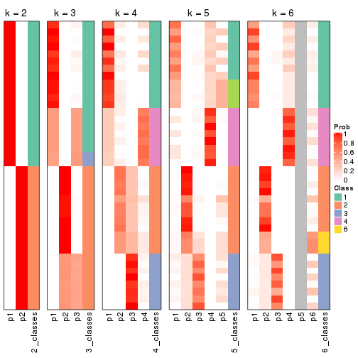


If matrix rows can be associated to genes, consider to use `GO_Enrichment(res,
...)` to perform function enrichment for the signature genes.


 

---------------------------------------------------


### ATC:skmeans*


The object with results only for a single top-value method and a single partition method 
can be extracted as:

```r
res = res_list["ATC", "skmeans"]
# you can also extract it by
# res = res_list["ATC:skmeans"]
```

A summary of `res` and all the functions that can be applied to it:

```r
res
```

```
#> A 'ConsensusPartition' object with k = 2, 3, 4, 5, 6.
#>   On a matrix with 15185 rows and 159 columns.
#>   Top rows (1000, 2000, 3000, 4000, 5000) are extracted by 'ATC' method.
#>   Subgroups are detected by 'skmeans' method.
#>   Performed in total 1250 partitions by row resampling.
#>   Best k for subgroups seems to be 5.
#> 
#> Following methods can be applied to this 'ConsensusPartition' object:
#>  [1] "cola_report"             "collect_classes"         "collect_plots"          
#>  [4] "collect_stats"           "colnames"                "compare_signatures"     
#>  [7] "consensus_heatmap"       "dimension_reduction"     "functional_enrichment"  
#> [10] "get_anno_col"            "get_anno"                "get_classes"            
#> [13] "get_consensus"           "get_matrix"              "get_membership"         
#> [16] "get_param"               "get_signatures"          "get_stats"              
#> [19] "is_best_k"               "is_stable_k"             "membership_heatmap"     
#> [22] "ncol"                    "nrow"                    "plot_ecdf"              
#> [25] "rownames"                "select_partition_number" "show"                   
#> [28] "suggest_best_k"          "test_to_known_factors"
```

`collect_plots()` function collects all the plots made from `res` for all `k` (number of partitions)
into one single page to provide an easy and fast comparison between different `k`.

```r
collect_plots(res)
```


The plots are:

- The first row: a plot of the ECDF (Empirical cumulative distribution
  function) curves of the consensus matrix for each `k` and the heatmap of
  predicted classes for each `k`.
- The second row: heatmaps of the consensus matrix for each `k`.
- The third row: heatmaps of the membership matrix for each `k`.
- The fouth row: heatmaps of the signatures for each `k`.

All the plots in panels can be made by individual functions and they are
plotted later in this section.

`select_partition_number()` produces several plots showing different
statistics for choosing "optimized" `k`. There are following statistics:

- ECDF curves of the consensus matrix for each `k`;
- 1-PAC. [The PAC
  score](https://en.wikipedia.org/wiki/Consensus_clustering#Over-interpretation_potential_of_consensus_clustering)
  measures the proportion of the ambiguous subgrouping.
- Mean silhouette score.
- Concordance. The mean probability of fiting the consensus class ids in all
  partitions.
- Area increased. Denote $A_k$ as the area under the ECDF curve for current
  `k`, the area increased is defined as $A_k - A_{k-1}$.
- Rand index. The percent of pairs of samples that are both in a same cluster
  or both are not in a same cluster in the partition of k and k-1.
- Jaccard index. The ratio of pairs of samples are both in a same cluster in
  the partition of k and k-1 and the pairs of samples are both in a same
  cluster in the partition k or k-1.

The detailed explanations of these statistics can be found in [the cola
vignette](http://bioconductor.org/packages/devel/bioc/vignettes/cola/inst/doc/cola.html#toc_13).

Generally speaking, lower PAC score, higher mean silhouette score or higher
concordance corresponds to better partition. Rand index and Jaccard index
measure how similar the current partition is compared to partition with `k-1`.
If they are too similar, we won't accept `k` is better than `k-1`.

```r
select_partition_number(res)
```


The numeric values for all these statistics can be obtained by `get_stats()`.

```r
get_stats(res)
```

```
#>   k 1-PAC mean_silhouette concordance area_increased  Rand Jaccard
#> 2 2 1.000           1.000       1.000         0.5036 0.497   0.497
#> 3 3 0.920           0.914       0.955         0.1850 0.924   0.846
#> 4 4 0.920           0.907       0.953         0.2035 0.878   0.709
#> 5 5 0.949           0.974       0.959         0.0531 0.939   0.795
#> 6 6 0.870           0.885       0.905         0.0299 1.000   1.000
```

`suggest_best_k()` suggests the best $k$ based on these statistics. The rules are as follows:

- All $k$ with Jaccard index larger than 0.95 are removed because the increase of
  the partition number does not provides enough extra information. If all $k$ are removed,
  the best $k$ is assigned by `NA`.
- For $k$ with 1-PAC larger than 0.9, the maximal $k$ is taken as the "best k". Other $k$ is called "optional k".
- If it does not fit the second rule. The $k$ with the highest vote of highest
  1-PAC, mean silhouette and concordance is taken as the "best k".

```r
suggest_best_k(res)
```

```
#> [1] 5
#> attr(,"optional")
#> [1] 2 3 4
```

There is also optional best $k$ = 2 3 4 that is worth to check.

Following shows the table of the partitions (You need to click the **show/hide
code output** link to see it). The membership matrix (columns with name `p*`)
is inferred by
[`clue::cl_consensus()`](https://www.rdocumentation.org/link/cl_consensus?package=clue)
function with the `SE` method. Basically the value in the membership matrix
represents the probability to belong to a certain group. The finall class
label for an item is determined with the group with highest probability it
belongs to.

In `get_classes()` function, the entropy is calculated from the membership
matrix and the silhouette score is calculated from the consensus matrix.


<script>
$( function() {
	$( '#tabs-ATC-skmeans-get-classes' ).tabs();
} );
</script>
<div id='tabs-ATC-skmeans-get-classes'>
<ul>
<li><a href='#tab-ATC-skmeans-get-classes-1'>k = 2</a></li>
<li><a href='#tab-ATC-skmeans-get-classes-2'>k = 3</a></li>
<li><a href='#tab-ATC-skmeans-get-classes-3'>k = 4</a></li>
<li><a href='#tab-ATC-skmeans-get-classes-4'>k = 5</a></li>
<li><a href='#tab-ATC-skmeans-get-classes-5'>k = 6</a></li>
</ul>

<div id='tab-ATC-skmeans-get-classes-1'>
<p><a id='tab-ATC-skmeans-get-classes-1-a' style='color:#0366d6' href='#'>show/hide code output</a></p>
<pre><code class="r">cbind(get_classes(res, k = 2), get_membership(res, k = 2))
</code></pre>

<pre><code>#&gt;            class entropy silhouette p1 p2
#&gt; SRR1706767     1       0          1  1  0
#&gt; SRR1706768     1       0          1  1  0
#&gt; SRR1706769     1       0          1  1  0
#&gt; SRR1706770     1       0          1  1  0
#&gt; SRR1706771     1       0          1  1  0
#&gt; SRR1706772     1       0          1  1  0
#&gt; SRR1706773     1       0          1  1  0
#&gt; SRR1706774     1       0          1  1  0
#&gt; SRR1706775     1       0          1  1  0
#&gt; SRR1706776     1       0          1  1  0
#&gt; SRR1706777     1       0          1  1  0
#&gt; SRR1706778     1       0          1  1  0
#&gt; SRR1706779     1       0          1  1  0
#&gt; SRR1706780     1       0          1  1  0
#&gt; SRR1706781     1       0          1  1  0
#&gt; SRR1706782     1       0          1  1  0
#&gt; SRR1706783     1       0          1  1  0
#&gt; SRR1706784     1       0          1  1  0
#&gt; SRR1706785     1       0          1  1  0
#&gt; SRR1706786     1       0          1  1  0
#&gt; SRR1706787     1       0          1  1  0
#&gt; SRR1706788     1       0          1  1  0
#&gt; SRR1706789     1       0          1  1  0
#&gt; SRR1706790     1       0          1  1  0
#&gt; SRR1706791     1       0          1  1  0
#&gt; SRR1706792     1       0          1  1  0
#&gt; SRR1706793     1       0          1  1  0
#&gt; SRR1706794     1       0          1  1  0
#&gt; SRR1706795     1       0          1  1  0
#&gt; SRR1706796     1       0          1  1  0
#&gt; SRR1706797     1       0          1  1  0
#&gt; SRR1706798     1       0          1  1  0
#&gt; SRR1706799     1       0          1  1  0
#&gt; SRR1706800     1       0          1  1  0
#&gt; SRR1706801     1       0          1  1  0
#&gt; SRR1706802     1       0          1  1  0
#&gt; SRR1706803     1       0          1  1  0
#&gt; SRR1706804     1       0          1  1  0
#&gt; SRR1706805     1       0          1  1  0
#&gt; SRR1706806     1       0          1  1  0
#&gt; SRR1706811     1       0          1  1  0
#&gt; SRR1706812     1       0          1  1  0
#&gt; SRR1706813     1       0          1  1  0
#&gt; SRR1706814     1       0          1  1  0
#&gt; SRR1706807     1       0          1  1  0
#&gt; SRR1706808     1       0          1  1  0
#&gt; SRR1706809     1       0          1  1  0
#&gt; SRR1706810     1       0          1  1  0
#&gt; SRR1706815     1       0          1  1  0
#&gt; SRR1706816     1       0          1  1  0
#&gt; SRR1706817     1       0          1  1  0
#&gt; SRR1706818     1       0          1  1  0
#&gt; SRR1706819     1       0          1  1  0
#&gt; SRR1706820     1       0          1  1  0
#&gt; SRR1706821     1       0          1  1  0
#&gt; SRR1706822     1       0          1  1  0
#&gt; SRR1706823     1       0          1  1  0
#&gt; SRR1706824     1       0          1  1  0
#&gt; SRR1706825     1       0          1  1  0
#&gt; SRR1706826     1       0          1  1  0
#&gt; SRR1706827     1       0          1  1  0
#&gt; SRR1706828     1       0          1  1  0
#&gt; SRR1706829     1       0          1  1  0
#&gt; SRR1706830     1       0          1  1  0
#&gt; SRR1706835     1       0          1  1  0
#&gt; SRR1706836     1       0          1  1  0
#&gt; SRR1706837     1       0          1  1  0
#&gt; SRR1706838     1       0          1  1  0
#&gt; SRR1706831     1       0          1  1  0
#&gt; SRR1706832     1       0          1  1  0
#&gt; SRR1706833     1       0          1  1  0
#&gt; SRR1706834     1       0          1  1  0
#&gt; SRR1706839     1       0          1  1  0
#&gt; SRR1706840     1       0          1  1  0
#&gt; SRR1706841     1       0          1  1  0
#&gt; SRR1706842     1       0          1  1  0
#&gt; SRR1706847     2       0          1  0  1
#&gt; SRR1706848     2       0          1  0  1
#&gt; SRR1706849     2       0          1  0  1
#&gt; SRR1706850     2       0          1  0  1
#&gt; SRR1706843     1       0          1  1  0
#&gt; SRR1706844     1       0          1  1  0
#&gt; SRR1706845     1       0          1  1  0
#&gt; SRR1706846     1       0          1  1  0
#&gt; SRR1706851     2       0          1  0  1
#&gt; SRR1706852     2       0          1  0  1
#&gt; SRR1706853     2       0          1  0  1
#&gt; SRR1706854     2       0          1  0  1
#&gt; SRR1706855     2       0          1  0  1
#&gt; SRR1706856     2       0          1  0  1
#&gt; SRR1706857     2       0          1  0  1
#&gt; SRR1706858     2       0          1  0  1
#&gt; SRR1706859     2       0          1  0  1
#&gt; SRR1706860     2       0          1  0  1
#&gt; SRR1706861     2       0          1  0  1
#&gt; SRR1706862     2       0          1  0  1
#&gt; SRR1706867     2       0          1  0  1
#&gt; SRR1706869     2       0          1  0  1
#&gt; SRR1706870     2       0          1  0  1
#&gt; SRR1706863     2       0          1  0  1
#&gt; SRR1706864     2       0          1  0  1
#&gt; SRR1706865     2       0          1  0  1
#&gt; SRR1706866     2       0          1  0  1
#&gt; SRR1706871     2       0          1  0  1
#&gt; SRR1706872     2       0          1  0  1
#&gt; SRR1706873     2       0          1  0  1
#&gt; SRR1706874     2       0          1  0  1
#&gt; SRR1706879     2       0          1  0  1
#&gt; SRR1706880     2       0          1  0  1
#&gt; SRR1706881     2       0          1  0  1
#&gt; SRR1706882     2       0          1  0  1
#&gt; SRR1706883     2       0          1  0  1
#&gt; SRR1706884     2       0          1  0  1
#&gt; SRR1706885     2       0          1  0  1
#&gt; SRR1706886     2       0          1  0  1
#&gt; SRR1706875     2       0          1  0  1
#&gt; SRR1706876     2       0          1  0  1
#&gt; SRR1706877     2       0          1  0  1
#&gt; SRR1706878     2       0          1  0  1
#&gt; SRR1706887     2       0          1  0  1
#&gt; SRR1706888     2       0          1  0  1
#&gt; SRR1706889     2       0          1  0  1
#&gt; SRR1706890     2       0          1  0  1
#&gt; SRR1706891     2       0          1  0  1
#&gt; SRR1706892     2       0          1  0  1
#&gt; SRR1706893     2       0          1  0  1
#&gt; SRR1706894     2       0          1  0  1
#&gt; SRR1706895     2       0          1  0  1
#&gt; SRR1706896     2       0          1  0  1
#&gt; SRR1706897     2       0          1  0  1
#&gt; SRR1706898     2       0          1  0  1
#&gt; SRR1706899     2       0          1  0  1
#&gt; SRR1706900     2       0          1  0  1
#&gt; SRR1706901     2       0          1  0  1
#&gt; SRR1706902     2       0          1  0  1
#&gt; SRR1706907     2       0          1  0  1
#&gt; SRR1706908     2       0          1  0  1
#&gt; SRR1706909     2       0          1  0  1
#&gt; SRR1706910     2       0          1  0  1
#&gt; SRR1706903     2       0          1  0  1
#&gt; SRR1706904     2       0          1  0  1
#&gt; SRR1706905     2       0          1  0  1
#&gt; SRR1706906     2       0          1  0  1
#&gt; SRR1706911     2       0          1  0  1
#&gt; SRR1706912     2       0          1  0  1
#&gt; SRR1706913     2       0          1  0  1
#&gt; SRR1706914     2       0          1  0  1
#&gt; SRR1706919     2       0          1  0  1
#&gt; SRR1706920     2       0          1  0  1
#&gt; SRR1706921     2       0          1  0  1
#&gt; SRR1706922     2       0          1  0  1
#&gt; SRR1706915     2       0          1  0  1
#&gt; SRR1706916     2       0          1  0  1
#&gt; SRR1706917     2       0          1  0  1
#&gt; SRR1706918     2       0          1  0  1
#&gt; SRR1706923     2       0          1  0  1
#&gt; SRR1706924     2       0          1  0  1
#&gt; SRR1706925     2       0          1  0  1
#&gt; SRR1706926     2       0          1  0  1
</code></pre>

<script>
$('#tab-ATC-skmeans-get-classes-1-a').parent().next().next().hide();
$('#tab-ATC-skmeans-get-classes-1-a').click(function(){
  $('#tab-ATC-skmeans-get-classes-1-a').parent().next().next().toggle();
  return(false);
});
</script>
</div>

<div id='tab-ATC-skmeans-get-classes-2'>
<p><a id='tab-ATC-skmeans-get-classes-2-a' style='color:#0366d6' href='#'>show/hide code output</a></p>
<pre><code class="r">cbind(get_classes(res, k = 3), get_membership(res, k = 3))
</code></pre>

<pre><code>#&gt;            class entropy silhouette    p1    p2    p3
#&gt; SRR1706767     1   0.000      0.991 1.000 0.000 0.000
#&gt; SRR1706768     1   0.000      0.991 1.000 0.000 0.000
#&gt; SRR1706769     1   0.000      0.991 1.000 0.000 0.000
#&gt; SRR1706770     1   0.000      0.991 1.000 0.000 0.000
#&gt; SRR1706771     1   0.000      0.991 1.000 0.000 0.000
#&gt; SRR1706772     1   0.000      0.991 1.000 0.000 0.000
#&gt; SRR1706773     1   0.000      0.991 1.000 0.000 0.000
#&gt; SRR1706774     1   0.000      0.991 1.000 0.000 0.000
#&gt; SRR1706775     1   0.000      0.991 1.000 0.000 0.000
#&gt; SRR1706776     1   0.000      0.991 1.000 0.000 0.000
#&gt; SRR1706777     1   0.000      0.991 1.000 0.000 0.000
#&gt; SRR1706778     1   0.000      0.991 1.000 0.000 0.000
#&gt; SRR1706779     1   0.103      0.987 0.976 0.000 0.024
#&gt; SRR1706780     1   0.103      0.987 0.976 0.000 0.024
#&gt; SRR1706781     1   0.103      0.987 0.976 0.000 0.024
#&gt; SRR1706782     1   0.103      0.987 0.976 0.000 0.024
#&gt; SRR1706783     1   0.103      0.987 0.976 0.000 0.024
#&gt; SRR1706784     1   0.103      0.987 0.976 0.000 0.024
#&gt; SRR1706785     1   0.103      0.987 0.976 0.000 0.024
#&gt; SRR1706786     1   0.103      0.987 0.976 0.000 0.024
#&gt; SRR1706787     1   0.000      0.991 1.000 0.000 0.000
#&gt; SRR1706788     1   0.000      0.991 1.000 0.000 0.000
#&gt; SRR1706789     1   0.000      0.991 1.000 0.000 0.000
#&gt; SRR1706790     1   0.000      0.991 1.000 0.000 0.000
#&gt; SRR1706791     1   0.000      0.991 1.000 0.000 0.000
#&gt; SRR1706792     1   0.000      0.991 1.000 0.000 0.000
#&gt; SRR1706793     1   0.000      0.991 1.000 0.000 0.000
#&gt; SRR1706794     1   0.000      0.991 1.000 0.000 0.000
#&gt; SRR1706795     1   0.000      0.991 1.000 0.000 0.000
#&gt; SRR1706796     1   0.000      0.991 1.000 0.000 0.000
#&gt; SRR1706797     1   0.000      0.991 1.000 0.000 0.000
#&gt; SRR1706798     1   0.000      0.991 1.000 0.000 0.000
#&gt; SRR1706799     1   0.103      0.987 0.976 0.000 0.024
#&gt; SRR1706800     1   0.103      0.987 0.976 0.000 0.024
#&gt; SRR1706801     1   0.103      0.987 0.976 0.000 0.024
#&gt; SRR1706802     1   0.103      0.987 0.976 0.000 0.024
#&gt; SRR1706803     1   0.103      0.987 0.976 0.000 0.024
#&gt; SRR1706804     1   0.103      0.987 0.976 0.000 0.024
#&gt; SRR1706805     1   0.103      0.987 0.976 0.000 0.024
#&gt; SRR1706806     1   0.103      0.987 0.976 0.000 0.024
#&gt; SRR1706811     1   0.000      0.991 1.000 0.000 0.000
#&gt; SRR1706812     1   0.000      0.991 1.000 0.000 0.000
#&gt; SRR1706813     1   0.000      0.991 1.000 0.000 0.000
#&gt; SRR1706814     1   0.000      0.991 1.000 0.000 0.000
#&gt; SRR1706807     1   0.000      0.991 1.000 0.000 0.000
#&gt; SRR1706808     1   0.000      0.991 1.000 0.000 0.000
#&gt; SRR1706809     1   0.000      0.991 1.000 0.000 0.000
#&gt; SRR1706810     1   0.000      0.991 1.000 0.000 0.000
#&gt; SRR1706815     1   0.000      0.991 1.000 0.000 0.000
#&gt; SRR1706816     1   0.000      0.991 1.000 0.000 0.000
#&gt; SRR1706817     1   0.000      0.991 1.000 0.000 0.000
#&gt; SRR1706818     1   0.000      0.991 1.000 0.000 0.000
#&gt; SRR1706819     1   0.103      0.987 0.976 0.000 0.024
#&gt; SRR1706820     1   0.103      0.987 0.976 0.000 0.024
#&gt; SRR1706821     1   0.103      0.987 0.976 0.000 0.024
#&gt; SRR1706822     1   0.103      0.987 0.976 0.000 0.024
#&gt; SRR1706823     1   0.103      0.987 0.976 0.000 0.024
#&gt; SRR1706824     1   0.103      0.987 0.976 0.000 0.024
#&gt; SRR1706825     1   0.103      0.987 0.976 0.000 0.024
#&gt; SRR1706826     1   0.103      0.987 0.976 0.000 0.024
#&gt; SRR1706827     1   0.000      0.991 1.000 0.000 0.000
#&gt; SRR1706828     1   0.000      0.991 1.000 0.000 0.000
#&gt; SRR1706829     1   0.000      0.991 1.000 0.000 0.000
#&gt; SRR1706830     1   0.000      0.991 1.000 0.000 0.000
#&gt; SRR1706835     1   0.000      0.991 1.000 0.000 0.000
#&gt; SRR1706836     1   0.000      0.991 1.000 0.000 0.000
#&gt; SRR1706837     1   0.000      0.991 1.000 0.000 0.000
#&gt; SRR1706838     1   0.000      0.991 1.000 0.000 0.000
#&gt; SRR1706831     1   0.000      0.991 1.000 0.000 0.000
#&gt; SRR1706832     1   0.000      0.991 1.000 0.000 0.000
#&gt; SRR1706833     1   0.000      0.991 1.000 0.000 0.000
#&gt; SRR1706834     1   0.000      0.991 1.000 0.000 0.000
#&gt; SRR1706839     1   0.103      0.987 0.976 0.000 0.024
#&gt; SRR1706840     1   0.103      0.987 0.976 0.000 0.024
#&gt; SRR1706841     1   0.103      0.987 0.976 0.000 0.024
#&gt; SRR1706842     1   0.103      0.987 0.976 0.000 0.024
#&gt; SRR1706847     3   0.103      1.000 0.000 0.024 0.976
#&gt; SRR1706848     3   0.103      1.000 0.000 0.024 0.976
#&gt; SRR1706849     3   0.103      1.000 0.000 0.024 0.976
#&gt; SRR1706850     3   0.103      1.000 0.000 0.024 0.976
#&gt; SRR1706843     1   0.103      0.987 0.976 0.000 0.024
#&gt; SRR1706844     1   0.103      0.987 0.976 0.000 0.024
#&gt; SRR1706845     1   0.103      0.987 0.976 0.000 0.024
#&gt; SRR1706846     1   0.103      0.987 0.976 0.000 0.024
#&gt; SRR1706851     2   0.603      0.523 0.000 0.624 0.376
#&gt; SRR1706852     2   0.603      0.523 0.000 0.624 0.376
#&gt; SRR1706853     2   0.603      0.523 0.000 0.624 0.376
#&gt; SRR1706854     2   0.603      0.523 0.000 0.624 0.376
#&gt; SRR1706855     2   0.000      0.891 0.000 1.000 0.000
#&gt; SRR1706856     2   0.000      0.891 0.000 1.000 0.000
#&gt; SRR1706857     2   0.000      0.891 0.000 1.000 0.000
#&gt; SRR1706858     2   0.000      0.891 0.000 1.000 0.000
#&gt; SRR1706859     2   0.000      0.891 0.000 1.000 0.000
#&gt; SRR1706860     2   0.000      0.891 0.000 1.000 0.000
#&gt; SRR1706861     2   0.000      0.891 0.000 1.000 0.000
#&gt; SRR1706862     2   0.000      0.891 0.000 1.000 0.000
#&gt; SRR1706867     3   0.103      1.000 0.000 0.024 0.976
#&gt; SRR1706869     3   0.103      1.000 0.000 0.024 0.976
#&gt; SRR1706870     3   0.103      1.000 0.000 0.024 0.976
#&gt; SRR1706863     2   0.000      0.891 0.000 1.000 0.000
#&gt; SRR1706864     2   0.000      0.891 0.000 1.000 0.000
#&gt; SRR1706865     2   0.000      0.891 0.000 1.000 0.000
#&gt; SRR1706866     2   0.000      0.891 0.000 1.000 0.000
#&gt; SRR1706871     2   0.603      0.523 0.000 0.624 0.376
#&gt; SRR1706872     2   0.603      0.523 0.000 0.624 0.376
#&gt; SRR1706873     2   0.603      0.523 0.000 0.624 0.376
#&gt; SRR1706874     2   0.603      0.523 0.000 0.624 0.376
#&gt; SRR1706879     2   0.000      0.891 0.000 1.000 0.000
#&gt; SRR1706880     2   0.000      0.891 0.000 1.000 0.000
#&gt; SRR1706881     2   0.000      0.891 0.000 1.000 0.000
#&gt; SRR1706882     2   0.000      0.891 0.000 1.000 0.000
#&gt; SRR1706883     2   0.000      0.891 0.000 1.000 0.000
#&gt; SRR1706884     2   0.000      0.891 0.000 1.000 0.000
#&gt; SRR1706885     2   0.000      0.891 0.000 1.000 0.000
#&gt; SRR1706886     2   0.000      0.891 0.000 1.000 0.000
#&gt; SRR1706875     2   0.000      0.891 0.000 1.000 0.000
#&gt; SRR1706876     2   0.000      0.891 0.000 1.000 0.000
#&gt; SRR1706877     2   0.000      0.891 0.000 1.000 0.000
#&gt; SRR1706878     2   0.000      0.891 0.000 1.000 0.000
#&gt; SRR1706887     3   0.103      1.000 0.000 0.024 0.976
#&gt; SRR1706888     3   0.103      1.000 0.000 0.024 0.976
#&gt; SRR1706889     3   0.103      1.000 0.000 0.024 0.976
#&gt; SRR1706890     3   0.103      1.000 0.000 0.024 0.976
#&gt; SRR1706891     2   0.603      0.523 0.000 0.624 0.376
#&gt; SRR1706892     2   0.603      0.523 0.000 0.624 0.376
#&gt; SRR1706893     2   0.603      0.523 0.000 0.624 0.376
#&gt; SRR1706894     2   0.603      0.523 0.000 0.624 0.376
#&gt; SRR1706895     2   0.000      0.891 0.000 1.000 0.000
#&gt; SRR1706896     2   0.000      0.891 0.000 1.000 0.000
#&gt; SRR1706897     2   0.000      0.891 0.000 1.000 0.000
#&gt; SRR1706898     2   0.000      0.891 0.000 1.000 0.000
#&gt; SRR1706899     2   0.000      0.891 0.000 1.000 0.000
#&gt; SRR1706900     2   0.000      0.891 0.000 1.000 0.000
#&gt; SRR1706901     2   0.000      0.891 0.000 1.000 0.000
#&gt; SRR1706902     2   0.000      0.891 0.000 1.000 0.000
#&gt; SRR1706907     3   0.103      1.000 0.000 0.024 0.976
#&gt; SRR1706908     3   0.103      1.000 0.000 0.024 0.976
#&gt; SRR1706909     3   0.103      1.000 0.000 0.024 0.976
#&gt; SRR1706910     3   0.103      1.000 0.000 0.024 0.976
#&gt; SRR1706903     2   0.000      0.891 0.000 1.000 0.000
#&gt; SRR1706904     2   0.000      0.891 0.000 1.000 0.000
#&gt; SRR1706905     2   0.000      0.891 0.000 1.000 0.000
#&gt; SRR1706906     2   0.000      0.891 0.000 1.000 0.000
#&gt; SRR1706911     2   0.603      0.523 0.000 0.624 0.376
#&gt; SRR1706912     2   0.603      0.523 0.000 0.624 0.376
#&gt; SRR1706913     2   0.603      0.523 0.000 0.624 0.376
#&gt; SRR1706914     2   0.603      0.523 0.000 0.624 0.376
#&gt; SRR1706919     2   0.000      0.891 0.000 1.000 0.000
#&gt; SRR1706920     2   0.000      0.891 0.000 1.000 0.000
#&gt; SRR1706921     2   0.000      0.891 0.000 1.000 0.000
#&gt; SRR1706922     2   0.000      0.891 0.000 1.000 0.000
#&gt; SRR1706915     2   0.000      0.891 0.000 1.000 0.000
#&gt; SRR1706916     2   0.000      0.891 0.000 1.000 0.000
#&gt; SRR1706917     2   0.000      0.891 0.000 1.000 0.000
#&gt; SRR1706918     2   0.000      0.891 0.000 1.000 0.000
#&gt; SRR1706923     2   0.000      0.891 0.000 1.000 0.000
#&gt; SRR1706924     2   0.000      0.891 0.000 1.000 0.000
#&gt; SRR1706925     2   0.000      0.891 0.000 1.000 0.000
#&gt; SRR1706926     2   0.000      0.891 0.000 1.000 0.000
</code></pre>

<script>
$('#tab-ATC-skmeans-get-classes-2-a').parent().next().next().hide();
$('#tab-ATC-skmeans-get-classes-2-a').click(function(){
  $('#tab-ATC-skmeans-get-classes-2-a').parent().next().next().toggle();
  return(false);
});
</script>
</div>

<div id='tab-ATC-skmeans-get-classes-3'>
<p><a id='tab-ATC-skmeans-get-classes-3-a' style='color:#0366d6' href='#'>show/hide code output</a></p>
<pre><code class="r">cbind(get_classes(res, k = 4), get_membership(res, k = 4))
</code></pre>

<pre><code>#&gt;            class entropy silhouette   p1    p2    p3   p4
#&gt; SRR1706767     4  0.0000      1.000 0.00 0.000 0.000 1.00
#&gt; SRR1706768     4  0.0000      1.000 0.00 0.000 0.000 1.00
#&gt; SRR1706769     4  0.0000      1.000 0.00 0.000 0.000 1.00
#&gt; SRR1706770     4  0.0000      1.000 0.00 0.000 0.000 1.00
#&gt; SRR1706771     4  0.0000      1.000 0.00 0.000 0.000 1.00
#&gt; SRR1706772     4  0.0000      1.000 0.00 0.000 0.000 1.00
#&gt; SRR1706773     4  0.0000      1.000 0.00 0.000 0.000 1.00
#&gt; SRR1706774     4  0.0000      1.000 0.00 0.000 0.000 1.00
#&gt; SRR1706775     4  0.0000      1.000 0.00 0.000 0.000 1.00
#&gt; SRR1706776     4  0.0000      1.000 0.00 0.000 0.000 1.00
#&gt; SRR1706777     4  0.0000      1.000 0.00 0.000 0.000 1.00
#&gt; SRR1706778     4  0.0000      1.000 0.00 0.000 0.000 1.00
#&gt; SRR1706779     1  0.0707      1.000 0.98 0.000 0.000 0.02
#&gt; SRR1706780     1  0.0707      1.000 0.98 0.000 0.000 0.02
#&gt; SRR1706781     1  0.0707      1.000 0.98 0.000 0.000 0.02
#&gt; SRR1706782     1  0.0707      1.000 0.98 0.000 0.000 0.02
#&gt; SRR1706783     1  0.0707      1.000 0.98 0.000 0.000 0.02
#&gt; SRR1706784     1  0.0707      1.000 0.98 0.000 0.000 0.02
#&gt; SRR1706785     1  0.0707      1.000 0.98 0.000 0.000 0.02
#&gt; SRR1706786     1  0.0707      1.000 0.98 0.000 0.000 0.02
#&gt; SRR1706787     4  0.0000      1.000 0.00 0.000 0.000 1.00
#&gt; SRR1706788     4  0.0000      1.000 0.00 0.000 0.000 1.00
#&gt; SRR1706789     4  0.0000      1.000 0.00 0.000 0.000 1.00
#&gt; SRR1706790     4  0.0000      1.000 0.00 0.000 0.000 1.00
#&gt; SRR1706791     4  0.0000      1.000 0.00 0.000 0.000 1.00
#&gt; SRR1706792     4  0.0000      1.000 0.00 0.000 0.000 1.00
#&gt; SRR1706793     4  0.0000      1.000 0.00 0.000 0.000 1.00
#&gt; SRR1706794     4  0.0000      1.000 0.00 0.000 0.000 1.00
#&gt; SRR1706795     4  0.0000      1.000 0.00 0.000 0.000 1.00
#&gt; SRR1706796     4  0.0000      1.000 0.00 0.000 0.000 1.00
#&gt; SRR1706797     4  0.0000      1.000 0.00 0.000 0.000 1.00
#&gt; SRR1706798     4  0.0000      1.000 0.00 0.000 0.000 1.00
#&gt; SRR1706799     1  0.0707      1.000 0.98 0.000 0.000 0.02
#&gt; SRR1706800     1  0.0707      1.000 0.98 0.000 0.000 0.02
#&gt; SRR1706801     1  0.0707      1.000 0.98 0.000 0.000 0.02
#&gt; SRR1706802     1  0.0707      1.000 0.98 0.000 0.000 0.02
#&gt; SRR1706803     1  0.0707      1.000 0.98 0.000 0.000 0.02
#&gt; SRR1706804     1  0.0707      1.000 0.98 0.000 0.000 0.02
#&gt; SRR1706805     1  0.0707      1.000 0.98 0.000 0.000 0.02
#&gt; SRR1706806     1  0.0707      1.000 0.98 0.000 0.000 0.02
#&gt; SRR1706811     4  0.0000      1.000 0.00 0.000 0.000 1.00
#&gt; SRR1706812     4  0.0000      1.000 0.00 0.000 0.000 1.00
#&gt; SRR1706813     4  0.0000      1.000 0.00 0.000 0.000 1.00
#&gt; SRR1706814     4  0.0000      1.000 0.00 0.000 0.000 1.00
#&gt; SRR1706807     4  0.0000      1.000 0.00 0.000 0.000 1.00
#&gt; SRR1706808     4  0.0000      1.000 0.00 0.000 0.000 1.00
#&gt; SRR1706809     4  0.0000      1.000 0.00 0.000 0.000 1.00
#&gt; SRR1706810     4  0.0000      1.000 0.00 0.000 0.000 1.00
#&gt; SRR1706815     4  0.0000      1.000 0.00 0.000 0.000 1.00
#&gt; SRR1706816     4  0.0000      1.000 0.00 0.000 0.000 1.00
#&gt; SRR1706817     4  0.0000      1.000 0.00 0.000 0.000 1.00
#&gt; SRR1706818     4  0.0000      1.000 0.00 0.000 0.000 1.00
#&gt; SRR1706819     1  0.0707      1.000 0.98 0.000 0.000 0.02
#&gt; SRR1706820     1  0.0707      1.000 0.98 0.000 0.000 0.02
#&gt; SRR1706821     1  0.0707      1.000 0.98 0.000 0.000 0.02
#&gt; SRR1706822     1  0.0707      1.000 0.98 0.000 0.000 0.02
#&gt; SRR1706823     1  0.0707      1.000 0.98 0.000 0.000 0.02
#&gt; SRR1706824     1  0.0707      1.000 0.98 0.000 0.000 0.02
#&gt; SRR1706825     1  0.0707      1.000 0.98 0.000 0.000 0.02
#&gt; SRR1706826     1  0.0707      1.000 0.98 0.000 0.000 0.02
#&gt; SRR1706827     4  0.0000      1.000 0.00 0.000 0.000 1.00
#&gt; SRR1706828     4  0.0000      1.000 0.00 0.000 0.000 1.00
#&gt; SRR1706829     4  0.0000      1.000 0.00 0.000 0.000 1.00
#&gt; SRR1706830     4  0.0000      1.000 0.00 0.000 0.000 1.00
#&gt; SRR1706835     4  0.0000      1.000 0.00 0.000 0.000 1.00
#&gt; SRR1706836     4  0.0000      1.000 0.00 0.000 0.000 1.00
#&gt; SRR1706837     4  0.0000      1.000 0.00 0.000 0.000 1.00
#&gt; SRR1706838     4  0.0000      1.000 0.00 0.000 0.000 1.00
#&gt; SRR1706831     4  0.0000      1.000 0.00 0.000 0.000 1.00
#&gt; SRR1706832     4  0.0000      1.000 0.00 0.000 0.000 1.00
#&gt; SRR1706833     4  0.0000      1.000 0.00 0.000 0.000 1.00
#&gt; SRR1706834     4  0.0000      1.000 0.00 0.000 0.000 1.00
#&gt; SRR1706839     1  0.0707      1.000 0.98 0.000 0.000 0.02
#&gt; SRR1706840     1  0.0707      1.000 0.98 0.000 0.000 0.02
#&gt; SRR1706841     1  0.0707      1.000 0.98 0.000 0.000 0.02
#&gt; SRR1706842     1  0.0707      1.000 0.98 0.000 0.000 0.02
#&gt; SRR1706847     3  0.0000      1.000 0.00 0.000 1.000 0.00
#&gt; SRR1706848     3  0.0000      1.000 0.00 0.000 1.000 0.00
#&gt; SRR1706849     3  0.0000      1.000 0.00 0.000 1.000 0.00
#&gt; SRR1706850     3  0.0000      1.000 0.00 0.000 1.000 0.00
#&gt; SRR1706843     1  0.0707      1.000 0.98 0.000 0.000 0.02
#&gt; SRR1706844     1  0.0707      1.000 0.98 0.000 0.000 0.02
#&gt; SRR1706845     1  0.0707      1.000 0.98 0.000 0.000 0.02
#&gt; SRR1706846     1  0.0707      1.000 0.98 0.000 0.000 0.02
#&gt; SRR1706851     2  0.5476      0.460 0.02 0.584 0.396 0.00
#&gt; SRR1706852     2  0.5476      0.460 0.02 0.584 0.396 0.00
#&gt; SRR1706853     2  0.5476      0.460 0.02 0.584 0.396 0.00
#&gt; SRR1706854     2  0.5476      0.460 0.02 0.584 0.396 0.00
#&gt; SRR1706855     2  0.0000      0.880 0.00 1.000 0.000 0.00
#&gt; SRR1706856     2  0.0000      0.880 0.00 1.000 0.000 0.00
#&gt; SRR1706857     2  0.0000      0.880 0.00 1.000 0.000 0.00
#&gt; SRR1706858     2  0.0000      0.880 0.00 1.000 0.000 0.00
#&gt; SRR1706859     2  0.0000      0.880 0.00 1.000 0.000 0.00
#&gt; SRR1706860     2  0.0000      0.880 0.00 1.000 0.000 0.00
#&gt; SRR1706861     2  0.0000      0.880 0.00 1.000 0.000 0.00
#&gt; SRR1706862     2  0.0000      0.880 0.00 1.000 0.000 0.00
#&gt; SRR1706867     3  0.0000      1.000 0.00 0.000 1.000 0.00
#&gt; SRR1706869     3  0.0000      1.000 0.00 0.000 1.000 0.00
#&gt; SRR1706870     3  0.0000      1.000 0.00 0.000 1.000 0.00
#&gt; SRR1706863     2  0.0000      0.880 0.00 1.000 0.000 0.00
#&gt; SRR1706864     2  0.0000      0.880 0.00 1.000 0.000 0.00
#&gt; SRR1706865     2  0.0000      0.880 0.00 1.000 0.000 0.00
#&gt; SRR1706866     2  0.0000      0.880 0.00 1.000 0.000 0.00
#&gt; SRR1706871     2  0.5517      0.434 0.02 0.568 0.412 0.00
#&gt; SRR1706872     2  0.5517      0.434 0.02 0.568 0.412 0.00
#&gt; SRR1706873     2  0.5517      0.434 0.02 0.568 0.412 0.00
#&gt; SRR1706874     2  0.5517      0.434 0.02 0.568 0.412 0.00
#&gt; SRR1706879     2  0.0000      0.880 0.00 1.000 0.000 0.00
#&gt; SRR1706880     2  0.0000      0.880 0.00 1.000 0.000 0.00
#&gt; SRR1706881     2  0.0000      0.880 0.00 1.000 0.000 0.00
#&gt; SRR1706882     2  0.0000      0.880 0.00 1.000 0.000 0.00
#&gt; SRR1706883     2  0.0000      0.880 0.00 1.000 0.000 0.00
#&gt; SRR1706884     2  0.0000      0.880 0.00 1.000 0.000 0.00
#&gt; SRR1706885     2  0.0000      0.880 0.00 1.000 0.000 0.00
#&gt; SRR1706886     2  0.0000      0.880 0.00 1.000 0.000 0.00
#&gt; SRR1706875     2  0.0000      0.880 0.00 1.000 0.000 0.00
#&gt; SRR1706876     2  0.0000      0.880 0.00 1.000 0.000 0.00
#&gt; SRR1706877     2  0.0000      0.880 0.00 1.000 0.000 0.00
#&gt; SRR1706878     2  0.0000      0.880 0.00 1.000 0.000 0.00
#&gt; SRR1706887     3  0.0000      1.000 0.00 0.000 1.000 0.00
#&gt; SRR1706888     3  0.0000      1.000 0.00 0.000 1.000 0.00
#&gt; SRR1706889     3  0.0000      1.000 0.00 0.000 1.000 0.00
#&gt; SRR1706890     3  0.0000      1.000 0.00 0.000 1.000 0.00
#&gt; SRR1706891     2  0.5517      0.434 0.02 0.568 0.412 0.00
#&gt; SRR1706892     2  0.5517      0.434 0.02 0.568 0.412 0.00
#&gt; SRR1706893     2  0.5517      0.434 0.02 0.568 0.412 0.00
#&gt; SRR1706894     2  0.5517      0.434 0.02 0.568 0.412 0.00
#&gt; SRR1706895     2  0.0000      0.880 0.00 1.000 0.000 0.00
#&gt; SRR1706896     2  0.0000      0.880 0.00 1.000 0.000 0.00
#&gt; SRR1706897     2  0.0000      0.880 0.00 1.000 0.000 0.00
#&gt; SRR1706898     2  0.0000      0.880 0.00 1.000 0.000 0.00
#&gt; SRR1706899     2  0.0000      0.880 0.00 1.000 0.000 0.00
#&gt; SRR1706900     2  0.0000      0.880 0.00 1.000 0.000 0.00
#&gt; SRR1706901     2  0.0000      0.880 0.00 1.000 0.000 0.00
#&gt; SRR1706902     2  0.0000      0.880 0.00 1.000 0.000 0.00
#&gt; SRR1706907     3  0.0000      1.000 0.00 0.000 1.000 0.00
#&gt; SRR1706908     3  0.0000      1.000 0.00 0.000 1.000 0.00
#&gt; SRR1706909     3  0.0000      1.000 0.00 0.000 1.000 0.00
#&gt; SRR1706910     3  0.0000      1.000 0.00 0.000 1.000 0.00
#&gt; SRR1706903     2  0.0000      0.880 0.00 1.000 0.000 0.00
#&gt; SRR1706904     2  0.0000      0.880 0.00 1.000 0.000 0.00
#&gt; SRR1706905     2  0.0000      0.880 0.00 1.000 0.000 0.00
#&gt; SRR1706906     2  0.0000      0.880 0.00 1.000 0.000 0.00
#&gt; SRR1706911     2  0.5517      0.434 0.02 0.568 0.412 0.00
#&gt; SRR1706912     2  0.5517      0.434 0.02 0.568 0.412 0.00
#&gt; SRR1706913     2  0.5517      0.434 0.02 0.568 0.412 0.00
#&gt; SRR1706914     2  0.5517      0.434 0.02 0.568 0.412 0.00
#&gt; SRR1706919     2  0.0000      0.880 0.00 1.000 0.000 0.00
#&gt; SRR1706920     2  0.0000      0.880 0.00 1.000 0.000 0.00
#&gt; SRR1706921     2  0.0000      0.880 0.00 1.000 0.000 0.00
#&gt; SRR1706922     2  0.0000      0.880 0.00 1.000 0.000 0.00
#&gt; SRR1706915     2  0.0000      0.880 0.00 1.000 0.000 0.00
#&gt; SRR1706916     2  0.0000      0.880 0.00 1.000 0.000 0.00
#&gt; SRR1706917     2  0.0000      0.880 0.00 1.000 0.000 0.00
#&gt; SRR1706918     2  0.0000      0.880 0.00 1.000 0.000 0.00
#&gt; SRR1706923     2  0.0000      0.880 0.00 1.000 0.000 0.00
#&gt; SRR1706924     2  0.0000      0.880 0.00 1.000 0.000 0.00
#&gt; SRR1706925     2  0.0000      0.880 0.00 1.000 0.000 0.00
#&gt; SRR1706926     2  0.0000      0.880 0.00 1.000 0.000 0.00
</code></pre>

<script>
$('#tab-ATC-skmeans-get-classes-3-a').parent().next().next().hide();
$('#tab-ATC-skmeans-get-classes-3-a').click(function(){
  $('#tab-ATC-skmeans-get-classes-3-a').parent().next().next().toggle();
  return(false);
});
</script>
</div>

<div id='tab-ATC-skmeans-get-classes-4'>
<p><a id='tab-ATC-skmeans-get-classes-4-a' style='color:#0366d6' href='#'>show/hide code output</a></p>
<pre><code class="r">cbind(get_classes(res, k = 5), get_membership(res, k = 5))
</code></pre>

<pre><code>#&gt;            class entropy silhouette    p1    p2    p3    p4    p5
#&gt; SRR1706767     4  0.0000      0.984 0.000 0.000 0.000 1.000 0.000
#&gt; SRR1706768     4  0.0000      0.984 0.000 0.000 0.000 1.000 0.000
#&gt; SRR1706769     4  0.0000      0.984 0.000 0.000 0.000 1.000 0.000
#&gt; SRR1706770     4  0.0000      0.984 0.000 0.000 0.000 1.000 0.000
#&gt; SRR1706771     4  0.0000      0.984 0.000 0.000 0.000 1.000 0.000
#&gt; SRR1706772     4  0.0000      0.984 0.000 0.000 0.000 1.000 0.000
#&gt; SRR1706773     4  0.0000      0.984 0.000 0.000 0.000 1.000 0.000
#&gt; SRR1706774     4  0.0000      0.984 0.000 0.000 0.000 1.000 0.000
#&gt; SRR1706775     4  0.1430      0.958 0.052 0.000 0.004 0.944 0.000
#&gt; SRR1706776     4  0.1430      0.958 0.052 0.000 0.004 0.944 0.000
#&gt; SRR1706777     4  0.1430      0.958 0.052 0.000 0.004 0.944 0.000
#&gt; SRR1706778     4  0.1430      0.958 0.052 0.000 0.004 0.944 0.000
#&gt; SRR1706779     1  0.0000      0.966 1.000 0.000 0.000 0.000 0.000
#&gt; SRR1706780     1  0.0000      0.966 1.000 0.000 0.000 0.000 0.000
#&gt; SRR1706781     1  0.0000      0.966 1.000 0.000 0.000 0.000 0.000
#&gt; SRR1706782     1  0.0000      0.966 1.000 0.000 0.000 0.000 0.000
#&gt; SRR1706783     1  0.1410      0.965 0.940 0.000 0.060 0.000 0.000
#&gt; SRR1706784     1  0.1410      0.965 0.940 0.000 0.060 0.000 0.000
#&gt; SRR1706785     1  0.1410      0.965 0.940 0.000 0.060 0.000 0.000
#&gt; SRR1706786     1  0.1410      0.965 0.940 0.000 0.060 0.000 0.000
#&gt; SRR1706787     4  0.0000      0.984 0.000 0.000 0.000 1.000 0.000
#&gt; SRR1706788     4  0.0000      0.984 0.000 0.000 0.000 1.000 0.000
#&gt; SRR1706789     4  0.0000      0.984 0.000 0.000 0.000 1.000 0.000
#&gt; SRR1706790     4  0.0000      0.984 0.000 0.000 0.000 1.000 0.000
#&gt; SRR1706791     4  0.0000      0.984 0.000 0.000 0.000 1.000 0.000
#&gt; SRR1706792     4  0.0000      0.984 0.000 0.000 0.000 1.000 0.000
#&gt; SRR1706793     4  0.0000      0.984 0.000 0.000 0.000 1.000 0.000
#&gt; SRR1706794     4  0.0000      0.984 0.000 0.000 0.000 1.000 0.000
#&gt; SRR1706795     4  0.1430      0.958 0.052 0.000 0.004 0.944 0.000
#&gt; SRR1706796     4  0.1430      0.958 0.052 0.000 0.004 0.944 0.000
#&gt; SRR1706797     4  0.1430      0.958 0.052 0.000 0.004 0.944 0.000
#&gt; SRR1706798     4  0.1430      0.958 0.052 0.000 0.004 0.944 0.000
#&gt; SRR1706799     1  0.0000      0.966 1.000 0.000 0.000 0.000 0.000
#&gt; SRR1706800     1  0.0000      0.966 1.000 0.000 0.000 0.000 0.000
#&gt; SRR1706801     1  0.0000      0.966 1.000 0.000 0.000 0.000 0.000
#&gt; SRR1706802     1  0.0000      0.966 1.000 0.000 0.000 0.000 0.000
#&gt; SRR1706803     1  0.1410      0.965 0.940 0.000 0.060 0.000 0.000
#&gt; SRR1706804     1  0.1410      0.965 0.940 0.000 0.060 0.000 0.000
#&gt; SRR1706805     1  0.1410      0.965 0.940 0.000 0.060 0.000 0.000
#&gt; SRR1706806     1  0.1410      0.965 0.940 0.000 0.060 0.000 0.000
#&gt; SRR1706811     4  0.0000      0.984 0.000 0.000 0.000 1.000 0.000
#&gt; SRR1706812     4  0.0000      0.984 0.000 0.000 0.000 1.000 0.000
#&gt; SRR1706813     4  0.0000      0.984 0.000 0.000 0.000 1.000 0.000
#&gt; SRR1706814     4  0.0000      0.984 0.000 0.000 0.000 1.000 0.000
#&gt; SRR1706807     4  0.0000      0.984 0.000 0.000 0.000 1.000 0.000
#&gt; SRR1706808     4  0.0000      0.984 0.000 0.000 0.000 1.000 0.000
#&gt; SRR1706809     4  0.0000      0.984 0.000 0.000 0.000 1.000 0.000
#&gt; SRR1706810     4  0.0000      0.984 0.000 0.000 0.000 1.000 0.000
#&gt; SRR1706815     4  0.0671      0.977 0.016 0.000 0.004 0.980 0.000
#&gt; SRR1706816     4  0.0671      0.977 0.016 0.000 0.004 0.980 0.000
#&gt; SRR1706817     4  0.0671      0.977 0.016 0.000 0.004 0.980 0.000
#&gt; SRR1706818     4  0.0671      0.977 0.016 0.000 0.004 0.980 0.000
#&gt; SRR1706819     1  0.0963      0.955 0.964 0.000 0.036 0.000 0.000
#&gt; SRR1706820     1  0.0963      0.955 0.964 0.000 0.036 0.000 0.000
#&gt; SRR1706821     1  0.0963      0.955 0.964 0.000 0.036 0.000 0.000
#&gt; SRR1706822     1  0.0963      0.955 0.964 0.000 0.036 0.000 0.000
#&gt; SRR1706823     1  0.1792      0.958 0.916 0.000 0.084 0.000 0.000
#&gt; SRR1706824     1  0.1792      0.958 0.916 0.000 0.084 0.000 0.000
#&gt; SRR1706825     1  0.1792      0.958 0.916 0.000 0.084 0.000 0.000
#&gt; SRR1706826     1  0.1792      0.958 0.916 0.000 0.084 0.000 0.000
#&gt; SRR1706827     4  0.0000      0.984 0.000 0.000 0.000 1.000 0.000
#&gt; SRR1706828     4  0.0000      0.984 0.000 0.000 0.000 1.000 0.000
#&gt; SRR1706829     4  0.0000      0.984 0.000 0.000 0.000 1.000 0.000
#&gt; SRR1706830     4  0.0000      0.984 0.000 0.000 0.000 1.000 0.000
#&gt; SRR1706835     4  0.1430      0.958 0.052 0.000 0.004 0.944 0.000
#&gt; SRR1706836     4  0.1430      0.958 0.052 0.000 0.004 0.944 0.000
#&gt; SRR1706837     4  0.1430      0.958 0.052 0.000 0.004 0.944 0.000
#&gt; SRR1706838     4  0.1430      0.958 0.052 0.000 0.004 0.944 0.000
#&gt; SRR1706831     4  0.0000      0.984 0.000 0.000 0.000 1.000 0.000
#&gt; SRR1706832     4  0.0000      0.984 0.000 0.000 0.000 1.000 0.000
#&gt; SRR1706833     4  0.0000      0.984 0.000 0.000 0.000 1.000 0.000
#&gt; SRR1706834     4  0.0000      0.984 0.000 0.000 0.000 1.000 0.000
#&gt; SRR1706839     1  0.0000      0.966 1.000 0.000 0.000 0.000 0.000
#&gt; SRR1706840     1  0.0000      0.966 1.000 0.000 0.000 0.000 0.000
#&gt; SRR1706841     1  0.0000      0.966 1.000 0.000 0.000 0.000 0.000
#&gt; SRR1706842     1  0.0000      0.966 1.000 0.000 0.000 0.000 0.000
#&gt; SRR1706847     5  0.1792      0.944 0.000 0.000 0.084 0.000 0.916
#&gt; SRR1706848     5  0.1792      0.944 0.000 0.000 0.084 0.000 0.916
#&gt; SRR1706849     5  0.1792      0.944 0.000 0.000 0.084 0.000 0.916
#&gt; SRR1706850     5  0.1792      0.944 0.000 0.000 0.084 0.000 0.916
#&gt; SRR1706843     1  0.1410      0.965 0.940 0.000 0.060 0.000 0.000
#&gt; SRR1706844     1  0.1410      0.965 0.940 0.000 0.060 0.000 0.000
#&gt; SRR1706845     1  0.1410      0.965 0.940 0.000 0.060 0.000 0.000
#&gt; SRR1706846     1  0.1410      0.965 0.940 0.000 0.060 0.000 0.000
#&gt; SRR1706851     3  0.4367      0.969 0.000 0.192 0.748 0.000 0.060
#&gt; SRR1706852     3  0.4367      0.969 0.000 0.192 0.748 0.000 0.060
#&gt; SRR1706853     3  0.4367      0.969 0.000 0.192 0.748 0.000 0.060
#&gt; SRR1706854     3  0.4367      0.969 0.000 0.192 0.748 0.000 0.060
#&gt; SRR1706855     2  0.0000      0.991 0.000 1.000 0.000 0.000 0.000
#&gt; SRR1706856     2  0.0000      0.991 0.000 1.000 0.000 0.000 0.000
#&gt; SRR1706857     2  0.0000      0.991 0.000 1.000 0.000 0.000 0.000
#&gt; SRR1706858     2  0.0000      0.991 0.000 1.000 0.000 0.000 0.000
#&gt; SRR1706859     2  0.0000      0.991 0.000 1.000 0.000 0.000 0.000
#&gt; SRR1706860     2  0.0000      0.991 0.000 1.000 0.000 0.000 0.000
#&gt; SRR1706861     2  0.0000      0.991 0.000 1.000 0.000 0.000 0.000
#&gt; SRR1706862     2  0.0000      0.991 0.000 1.000 0.000 0.000 0.000
#&gt; SRR1706867     5  0.0000      0.969 0.000 0.000 0.000 0.000 1.000
#&gt; SRR1706869     5  0.0000      0.969 0.000 0.000 0.000 0.000 1.000
#&gt; SRR1706870     5  0.0000      0.969 0.000 0.000 0.000 0.000 1.000
#&gt; SRR1706863     2  0.0000      0.991 0.000 1.000 0.000 0.000 0.000
#&gt; SRR1706864     2  0.0000      0.991 0.000 1.000 0.000 0.000 0.000
#&gt; SRR1706865     2  0.0000      0.991 0.000 1.000 0.000 0.000 0.000
#&gt; SRR1706866     2  0.0000      0.991 0.000 1.000 0.000 0.000 0.000
#&gt; SRR1706871     3  0.4325      0.976 0.000 0.180 0.756 0.000 0.064
#&gt; SRR1706872     3  0.4325      0.976 0.000 0.180 0.756 0.000 0.064
#&gt; SRR1706873     3  0.4325      0.976 0.000 0.180 0.756 0.000 0.064
#&gt; SRR1706874     3  0.4325      0.976 0.000 0.180 0.756 0.000 0.064
#&gt; SRR1706879     2  0.0000      0.991 0.000 1.000 0.000 0.000 0.000
#&gt; SRR1706880     2  0.0000      0.991 0.000 1.000 0.000 0.000 0.000
#&gt; SRR1706881     2  0.0000      0.991 0.000 1.000 0.000 0.000 0.000
#&gt; SRR1706882     2  0.0000      0.991 0.000 1.000 0.000 0.000 0.000
#&gt; SRR1706883     2  0.0000      0.991 0.000 1.000 0.000 0.000 0.000
#&gt; SRR1706884     2  0.0000      0.991 0.000 1.000 0.000 0.000 0.000
#&gt; SRR1706885     2  0.0000      0.991 0.000 1.000 0.000 0.000 0.000
#&gt; SRR1706886     2  0.0000      0.991 0.000 1.000 0.000 0.000 0.000
#&gt; SRR1706875     2  0.0000      0.991 0.000 1.000 0.000 0.000 0.000
#&gt; SRR1706876     2  0.0000      0.991 0.000 1.000 0.000 0.000 0.000
#&gt; SRR1706877     2  0.0000      0.991 0.000 1.000 0.000 0.000 0.000
#&gt; SRR1706878     2  0.0000      0.991 0.000 1.000 0.000 0.000 0.000
#&gt; SRR1706887     5  0.1270      0.953 0.000 0.000 0.052 0.000 0.948
#&gt; SRR1706888     5  0.1270      0.953 0.000 0.000 0.052 0.000 0.948
#&gt; SRR1706889     5  0.1270      0.953 0.000 0.000 0.052 0.000 0.948
#&gt; SRR1706890     5  0.1270      0.953 0.000 0.000 0.052 0.000 0.948
#&gt; SRR1706891     3  0.3236      0.940 0.000 0.152 0.828 0.000 0.020
#&gt; SRR1706892     3  0.3236      0.940 0.000 0.152 0.828 0.000 0.020
#&gt; SRR1706893     3  0.3236      0.940 0.000 0.152 0.828 0.000 0.020
#&gt; SRR1706894     3  0.3236      0.940 0.000 0.152 0.828 0.000 0.020
#&gt; SRR1706895     2  0.1121      0.961 0.000 0.956 0.044 0.000 0.000
#&gt; SRR1706896     2  0.1121      0.961 0.000 0.956 0.044 0.000 0.000
#&gt; SRR1706897     2  0.1121      0.961 0.000 0.956 0.044 0.000 0.000
#&gt; SRR1706898     2  0.1121      0.961 0.000 0.956 0.044 0.000 0.000
#&gt; SRR1706899     2  0.0794      0.973 0.000 0.972 0.028 0.000 0.000
#&gt; SRR1706900     2  0.0794      0.973 0.000 0.972 0.028 0.000 0.000
#&gt; SRR1706901     2  0.0794      0.973 0.000 0.972 0.028 0.000 0.000
#&gt; SRR1706902     2  0.0794      0.973 0.000 0.972 0.028 0.000 0.000
#&gt; SRR1706907     5  0.0000      0.969 0.000 0.000 0.000 0.000 1.000
#&gt; SRR1706908     5  0.0000      0.969 0.000 0.000 0.000 0.000 1.000
#&gt; SRR1706909     5  0.0000      0.969 0.000 0.000 0.000 0.000 1.000
#&gt; SRR1706910     5  0.0000      0.969 0.000 0.000 0.000 0.000 1.000
#&gt; SRR1706903     2  0.0703      0.975 0.000 0.976 0.024 0.000 0.000
#&gt; SRR1706904     2  0.0703      0.975 0.000 0.976 0.024 0.000 0.000
#&gt; SRR1706905     2  0.0703      0.975 0.000 0.976 0.024 0.000 0.000
#&gt; SRR1706906     2  0.0703      0.975 0.000 0.976 0.024 0.000 0.000
#&gt; SRR1706911     3  0.4325      0.976 0.000 0.180 0.756 0.000 0.064
#&gt; SRR1706912     3  0.4325      0.976 0.000 0.180 0.756 0.000 0.064
#&gt; SRR1706913     3  0.4325      0.976 0.000 0.180 0.756 0.000 0.064
#&gt; SRR1706914     3  0.4325      0.976 0.000 0.180 0.756 0.000 0.064
#&gt; SRR1706919     2  0.0000      0.991 0.000 1.000 0.000 0.000 0.000
#&gt; SRR1706920     2  0.0000      0.991 0.000 1.000 0.000 0.000 0.000
#&gt; SRR1706921     2  0.0000      0.991 0.000 1.000 0.000 0.000 0.000
#&gt; SRR1706922     2  0.0000      0.991 0.000 1.000 0.000 0.000 0.000
#&gt; SRR1706915     2  0.0000      0.991 0.000 1.000 0.000 0.000 0.000
#&gt; SRR1706916     2  0.0000      0.991 0.000 1.000 0.000 0.000 0.000
#&gt; SRR1706917     2  0.0000      0.991 0.000 1.000 0.000 0.000 0.000
#&gt; SRR1706918     2  0.0000      0.991 0.000 1.000 0.000 0.000 0.000
#&gt; SRR1706923     2  0.0000      0.991 0.000 1.000 0.000 0.000 0.000
#&gt; SRR1706924     2  0.0000      0.991 0.000 1.000 0.000 0.000 0.000
#&gt; SRR1706925     2  0.0000      0.991 0.000 1.000 0.000 0.000 0.000
#&gt; SRR1706926     2  0.0000      0.991 0.000 1.000 0.000 0.000 0.000
</code></pre>

<script>
$('#tab-ATC-skmeans-get-classes-4-a').parent().next().next().hide();
$('#tab-ATC-skmeans-get-classes-4-a').click(function(){
  $('#tab-ATC-skmeans-get-classes-4-a').parent().next().next().toggle();
  return(false);
});
</script>
</div>

<div id='tab-ATC-skmeans-get-classes-5'>
<p><a id='tab-ATC-skmeans-get-classes-5-a' style='color:#0366d6' href='#'>show/hide code output</a></p>
<pre><code class="r">cbind(get_classes(res, k = 6), get_membership(res, k = 6))
</code></pre>

<pre><code>#&gt;            class entropy silhouette    p1    p2    p3    p4 p5    p6
#&gt; SRR1706767     4  0.0000      0.929 0.000 0.000 0.000 1.000 NA 0.000
#&gt; SRR1706768     4  0.0000      0.929 0.000 0.000 0.000 1.000 NA 0.000
#&gt; SRR1706769     4  0.0000      0.929 0.000 0.000 0.000 1.000 NA 0.000
#&gt; SRR1706770     4  0.0000      0.929 0.000 0.000 0.000 1.000 NA 0.000
#&gt; SRR1706771     4  0.0000      0.929 0.000 0.000 0.000 1.000 NA 0.000
#&gt; SRR1706772     4  0.0000      0.929 0.000 0.000 0.000 1.000 NA 0.000
#&gt; SRR1706773     4  0.0000      0.929 0.000 0.000 0.000 1.000 NA 0.000
#&gt; SRR1706774     4  0.0000      0.929 0.000 0.000 0.000 1.000 NA 0.000
#&gt; SRR1706775     4  0.3374      0.812 0.208 0.000 0.000 0.772 NA 0.000
#&gt; SRR1706776     4  0.3374      0.812 0.208 0.000 0.000 0.772 NA 0.000
#&gt; SRR1706777     4  0.3374      0.812 0.208 0.000 0.000 0.772 NA 0.000
#&gt; SRR1706778     4  0.3374      0.812 0.208 0.000 0.000 0.772 NA 0.000
#&gt; SRR1706779     1  0.0000      0.849 1.000 0.000 0.000 0.000 NA 0.000
#&gt; SRR1706780     1  0.0000      0.849 1.000 0.000 0.000 0.000 NA 0.000
#&gt; SRR1706781     1  0.0000      0.849 1.000 0.000 0.000 0.000 NA 0.000
#&gt; SRR1706782     1  0.0000      0.849 1.000 0.000 0.000 0.000 NA 0.000
#&gt; SRR1706783     1  0.3101      0.842 0.756 0.000 0.000 0.000 NA 0.000
#&gt; SRR1706784     1  0.3101      0.842 0.756 0.000 0.000 0.000 NA 0.000
#&gt; SRR1706785     1  0.3101      0.842 0.756 0.000 0.000 0.000 NA 0.000
#&gt; SRR1706786     1  0.3101      0.842 0.756 0.000 0.000 0.000 NA 0.000
#&gt; SRR1706787     4  0.0000      0.929 0.000 0.000 0.000 1.000 NA 0.000
#&gt; SRR1706788     4  0.0000      0.929 0.000 0.000 0.000 1.000 NA 0.000
#&gt; SRR1706789     4  0.0000      0.929 0.000 0.000 0.000 1.000 NA 0.000
#&gt; SRR1706790     4  0.0000      0.929 0.000 0.000 0.000 1.000 NA 0.000
#&gt; SRR1706791     4  0.0000      0.929 0.000 0.000 0.000 1.000 NA 0.000
#&gt; SRR1706792     4  0.0000      0.929 0.000 0.000 0.000 1.000 NA 0.000
#&gt; SRR1706793     4  0.0000      0.929 0.000 0.000 0.000 1.000 NA 0.000
#&gt; SRR1706794     4  0.0000      0.929 0.000 0.000 0.000 1.000 NA 0.000
#&gt; SRR1706795     4  0.3374      0.812 0.208 0.000 0.000 0.772 NA 0.000
#&gt; SRR1706796     4  0.3374      0.812 0.208 0.000 0.000 0.772 NA 0.000
#&gt; SRR1706797     4  0.3374      0.812 0.208 0.000 0.000 0.772 NA 0.000
#&gt; SRR1706798     4  0.3374      0.812 0.208 0.000 0.000 0.772 NA 0.000
#&gt; SRR1706799     1  0.0000      0.849 1.000 0.000 0.000 0.000 NA 0.000
#&gt; SRR1706800     1  0.0000      0.849 1.000 0.000 0.000 0.000 NA 0.000
#&gt; SRR1706801     1  0.0000      0.849 1.000 0.000 0.000 0.000 NA 0.000
#&gt; SRR1706802     1  0.0000      0.849 1.000 0.000 0.000 0.000 NA 0.000
#&gt; SRR1706803     1  0.3101      0.842 0.756 0.000 0.000 0.000 NA 0.000
#&gt; SRR1706804     1  0.3101      0.842 0.756 0.000 0.000 0.000 NA 0.000
#&gt; SRR1706805     1  0.3101      0.842 0.756 0.000 0.000 0.000 NA 0.000
#&gt; SRR1706806     1  0.3101      0.842 0.756 0.000 0.000 0.000 NA 0.000
#&gt; SRR1706811     4  0.0000      0.929 0.000 0.000 0.000 1.000 NA 0.000
#&gt; SRR1706812     4  0.0000      0.929 0.000 0.000 0.000 1.000 NA 0.000
#&gt; SRR1706813     4  0.0000      0.929 0.000 0.000 0.000 1.000 NA 0.000
#&gt; SRR1706814     4  0.0000      0.929 0.000 0.000 0.000 1.000 NA 0.000
#&gt; SRR1706807     4  0.0000      0.929 0.000 0.000 0.000 1.000 NA 0.000
#&gt; SRR1706808     4  0.0000      0.929 0.000 0.000 0.000 1.000 NA 0.000
#&gt; SRR1706809     4  0.0000      0.929 0.000 0.000 0.000 1.000 NA 0.000
#&gt; SRR1706810     4  0.0000      0.929 0.000 0.000 0.000 1.000 NA 0.000
#&gt; SRR1706815     4  0.2250      0.882 0.092 0.000 0.000 0.888 NA 0.000
#&gt; SRR1706816     4  0.2250      0.882 0.092 0.000 0.000 0.888 NA 0.000
#&gt; SRR1706817     4  0.2250      0.882 0.092 0.000 0.000 0.888 NA 0.000
#&gt; SRR1706818     4  0.2250      0.882 0.092 0.000 0.000 0.888 NA 0.000
#&gt; SRR1706819     1  0.2178      0.793 0.868 0.000 0.000 0.000 NA 0.000
#&gt; SRR1706820     1  0.2178      0.793 0.868 0.000 0.000 0.000 NA 0.000
#&gt; SRR1706821     1  0.2178      0.793 0.868 0.000 0.000 0.000 NA 0.000
#&gt; SRR1706822     1  0.2178      0.793 0.868 0.000 0.000 0.000 NA 0.000
#&gt; SRR1706823     1  0.3499      0.810 0.680 0.000 0.000 0.000 NA 0.000
#&gt; SRR1706824     1  0.3499      0.810 0.680 0.000 0.000 0.000 NA 0.000
#&gt; SRR1706825     1  0.3499      0.810 0.680 0.000 0.000 0.000 NA 0.000
#&gt; SRR1706826     1  0.3499      0.810 0.680 0.000 0.000 0.000 NA 0.000
#&gt; SRR1706827     4  0.0000      0.929 0.000 0.000 0.000 1.000 NA 0.000
#&gt; SRR1706828     4  0.0000      0.929 0.000 0.000 0.000 1.000 NA 0.000
#&gt; SRR1706829     4  0.0000      0.929 0.000 0.000 0.000 1.000 NA 0.000
#&gt; SRR1706830     4  0.0000      0.929 0.000 0.000 0.000 1.000 NA 0.000
#&gt; SRR1706835     4  0.3374      0.812 0.208 0.000 0.000 0.772 NA 0.000
#&gt; SRR1706836     4  0.3374      0.812 0.208 0.000 0.000 0.772 NA 0.000
#&gt; SRR1706837     4  0.3374      0.812 0.208 0.000 0.000 0.772 NA 0.000
#&gt; SRR1706838     4  0.3374      0.812 0.208 0.000 0.000 0.772 NA 0.000
#&gt; SRR1706831     4  0.0000      0.929 0.000 0.000 0.000 1.000 NA 0.000
#&gt; SRR1706832     4  0.0000      0.929 0.000 0.000 0.000 1.000 NA 0.000
#&gt; SRR1706833     4  0.0000      0.929 0.000 0.000 0.000 1.000 NA 0.000
#&gt; SRR1706834     4  0.0000      0.929 0.000 0.000 0.000 1.000 NA 0.000
#&gt; SRR1706839     1  0.0000      0.849 1.000 0.000 0.000 0.000 NA 0.000
#&gt; SRR1706840     1  0.0000      0.849 1.000 0.000 0.000 0.000 NA 0.000
#&gt; SRR1706841     1  0.0000      0.849 1.000 0.000 0.000 0.000 NA 0.000
#&gt; SRR1706842     1  0.0000      0.849 1.000 0.000 0.000 0.000 NA 0.000
#&gt; SRR1706847     3  0.4122      0.779 0.000 0.000 0.704 0.000 NA 0.048
#&gt; SRR1706848     3  0.4122      0.779 0.000 0.000 0.704 0.000 NA 0.048
#&gt; SRR1706849     3  0.4122      0.779 0.000 0.000 0.704 0.000 NA 0.048
#&gt; SRR1706850     3  0.4122      0.779 0.000 0.000 0.704 0.000 NA 0.048
#&gt; SRR1706843     1  0.3101      0.842 0.756 0.000 0.000 0.000 NA 0.000
#&gt; SRR1706844     1  0.3101      0.842 0.756 0.000 0.000 0.000 NA 0.000
#&gt; SRR1706845     1  0.3101      0.842 0.756 0.000 0.000 0.000 NA 0.000
#&gt; SRR1706846     1  0.3101      0.842 0.756 0.000 0.000 0.000 NA 0.000
#&gt; SRR1706851     6  0.5283      0.903 0.000 0.064 0.020 0.000 NA 0.560
#&gt; SRR1706852     6  0.5283      0.903 0.000 0.064 0.020 0.000 NA 0.560
#&gt; SRR1706853     6  0.5283      0.903 0.000 0.064 0.020 0.000 NA 0.560
#&gt; SRR1706854     6  0.5283      0.903 0.000 0.064 0.020 0.000 NA 0.560
#&gt; SRR1706855     2  0.0000      0.963 0.000 1.000 0.000 0.000 NA 0.000
#&gt; SRR1706856     2  0.0000      0.963 0.000 1.000 0.000 0.000 NA 0.000
#&gt; SRR1706857     2  0.0000      0.963 0.000 1.000 0.000 0.000 NA 0.000
#&gt; SRR1706858     2  0.0000      0.963 0.000 1.000 0.000 0.000 NA 0.000
#&gt; SRR1706859     2  0.0000      0.963 0.000 1.000 0.000 0.000 NA 0.000
#&gt; SRR1706860     2  0.0000      0.963 0.000 1.000 0.000 0.000 NA 0.000
#&gt; SRR1706861     2  0.0000      0.963 0.000 1.000 0.000 0.000 NA 0.000
#&gt; SRR1706862     2  0.0000      0.963 0.000 1.000 0.000 0.000 NA 0.000
#&gt; SRR1706867     3  0.0146      0.878 0.000 0.000 0.996 0.000 NA 0.004
#&gt; SRR1706869     3  0.0146      0.878 0.000 0.000 0.996 0.000 NA 0.004
#&gt; SRR1706870     3  0.0146      0.878 0.000 0.000 0.996 0.000 NA 0.004
#&gt; SRR1706863     2  0.0000      0.963 0.000 1.000 0.000 0.000 NA 0.000
#&gt; SRR1706864     2  0.0000      0.963 0.000 1.000 0.000 0.000 NA 0.000
#&gt; SRR1706865     2  0.0000      0.963 0.000 1.000 0.000 0.000 NA 0.000
#&gt; SRR1706866     2  0.0000      0.963 0.000 1.000 0.000 0.000 NA 0.000
#&gt; SRR1706871     6  0.5306      0.904 0.000 0.060 0.024 0.000 NA 0.560
#&gt; SRR1706872     6  0.5306      0.904 0.000 0.060 0.024 0.000 NA 0.560
#&gt; SRR1706873     6  0.5306      0.904 0.000 0.060 0.024 0.000 NA 0.560
#&gt; SRR1706874     6  0.5306      0.904 0.000 0.060 0.024 0.000 NA 0.560
#&gt; SRR1706879     2  0.0000      0.963 0.000 1.000 0.000 0.000 NA 0.000
#&gt; SRR1706880     2  0.0000      0.963 0.000 1.000 0.000 0.000 NA 0.000
#&gt; SRR1706881     2  0.0000      0.963 0.000 1.000 0.000 0.000 NA 0.000
#&gt; SRR1706882     2  0.0000      0.963 0.000 1.000 0.000 0.000 NA 0.000
#&gt; SRR1706883     2  0.0000      0.963 0.000 1.000 0.000 0.000 NA 0.000
#&gt; SRR1706884     2  0.0000      0.963 0.000 1.000 0.000 0.000 NA 0.000
#&gt; SRR1706885     2  0.0000      0.963 0.000 1.000 0.000 0.000 NA 0.000
#&gt; SRR1706886     2  0.0000      0.963 0.000 1.000 0.000 0.000 NA 0.000
#&gt; SRR1706875     2  0.0000      0.963 0.000 1.000 0.000 0.000 NA 0.000
#&gt; SRR1706876     2  0.0000      0.963 0.000 1.000 0.000 0.000 NA 0.000
#&gt; SRR1706877     2  0.0000      0.963 0.000 1.000 0.000 0.000 NA 0.000
#&gt; SRR1706878     2  0.0000      0.963 0.000 1.000 0.000 0.000 NA 0.000
#&gt; SRR1706887     3  0.3221      0.809 0.000 0.000 0.792 0.000 NA 0.188
#&gt; SRR1706888     3  0.3221      0.809 0.000 0.000 0.792 0.000 NA 0.188
#&gt; SRR1706889     3  0.3221      0.809 0.000 0.000 0.792 0.000 NA 0.188
#&gt; SRR1706890     3  0.3221      0.809 0.000 0.000 0.792 0.000 NA 0.188
#&gt; SRR1706891     6  0.1141      0.680 0.000 0.052 0.000 0.000 NA 0.948
#&gt; SRR1706892     6  0.1141      0.680 0.000 0.052 0.000 0.000 NA 0.948
#&gt; SRR1706893     6  0.1141      0.680 0.000 0.052 0.000 0.000 NA 0.948
#&gt; SRR1706894     6  0.1141      0.680 0.000 0.052 0.000 0.000 NA 0.948
#&gt; SRR1706895     2  0.3052      0.791 0.000 0.780 0.000 0.000 NA 0.216
#&gt; SRR1706896     2  0.3052      0.791 0.000 0.780 0.000 0.000 NA 0.216
#&gt; SRR1706897     2  0.3052      0.791 0.000 0.780 0.000 0.000 NA 0.216
#&gt; SRR1706898     2  0.3052      0.791 0.000 0.780 0.000 0.000 NA 0.216
#&gt; SRR1706899     2  0.2595      0.848 0.000 0.836 0.000 0.000 NA 0.160
#&gt; SRR1706900     2  0.2595      0.848 0.000 0.836 0.000 0.000 NA 0.160
#&gt; SRR1706901     2  0.2595      0.848 0.000 0.836 0.000 0.000 NA 0.160
#&gt; SRR1706902     2  0.2595      0.848 0.000 0.836 0.000 0.000 NA 0.160
#&gt; SRR1706907     3  0.0146      0.879 0.000 0.000 0.996 0.000 NA 0.000
#&gt; SRR1706908     3  0.0146      0.879 0.000 0.000 0.996 0.000 NA 0.000
#&gt; SRR1706909     3  0.0146      0.879 0.000 0.000 0.996 0.000 NA 0.000
#&gt; SRR1706910     3  0.0146      0.879 0.000 0.000 0.996 0.000 NA 0.000
#&gt; SRR1706903     2  0.1411      0.926 0.000 0.936 0.000 0.000 NA 0.060
#&gt; SRR1706904     2  0.1411      0.926 0.000 0.936 0.000 0.000 NA 0.060
#&gt; SRR1706905     2  0.1411      0.926 0.000 0.936 0.000 0.000 NA 0.060
#&gt; SRR1706906     2  0.1411      0.926 0.000 0.936 0.000 0.000 NA 0.060
#&gt; SRR1706911     6  0.5306      0.904 0.000 0.060 0.024 0.000 NA 0.560
#&gt; SRR1706912     6  0.5306      0.904 0.000 0.060 0.024 0.000 NA 0.560
#&gt; SRR1706913     6  0.5306      0.904 0.000 0.060 0.024 0.000 NA 0.560
#&gt; SRR1706914     6  0.5306      0.904 0.000 0.060 0.024 0.000 NA 0.560
#&gt; SRR1706919     2  0.0000      0.963 0.000 1.000 0.000 0.000 NA 0.000
#&gt; SRR1706920     2  0.0000      0.963 0.000 1.000 0.000 0.000 NA 0.000
#&gt; SRR1706921     2  0.0000      0.963 0.000 1.000 0.000 0.000 NA 0.000
#&gt; SRR1706922     2  0.0000      0.963 0.000 1.000 0.000 0.000 NA 0.000
#&gt; SRR1706915     2  0.0000      0.963 0.000 1.000 0.000 0.000 NA 0.000
#&gt; SRR1706916     2  0.0000      0.963 0.000 1.000 0.000 0.000 NA 0.000
#&gt; SRR1706917     2  0.0000      0.963 0.000 1.000 0.000 0.000 NA 0.000
#&gt; SRR1706918     2  0.0000      0.963 0.000 1.000 0.000 0.000 NA 0.000
#&gt; SRR1706923     2  0.0000      0.963 0.000 1.000 0.000 0.000 NA 0.000
#&gt; SRR1706924     2  0.0000      0.963 0.000 1.000 0.000 0.000 NA 0.000
#&gt; SRR1706925     2  0.0000      0.963 0.000 1.000 0.000 0.000 NA 0.000
#&gt; SRR1706926     2  0.0000      0.963 0.000 1.000 0.000 0.000 NA 0.000
</code></pre>

<script>
$('#tab-ATC-skmeans-get-classes-5-a').parent().next().next().hide();
$('#tab-ATC-skmeans-get-classes-5-a').click(function(){
  $('#tab-ATC-skmeans-get-classes-5-a').parent().next().next().toggle();
  return(false);
});
</script>
</div>
</div>

Heatmaps for the consensus matrix. It visualizes the probability of two
samples to be in a same group.


<script>
$( function() {
	$( '#tabs-ATC-skmeans-consensus-heatmap' ).tabs();
} );
</script>
<div id='tabs-ATC-skmeans-consensus-heatmap'>
<ul>
<li><a href='#tab-ATC-skmeans-consensus-heatmap-1'>k = 2</a></li>
<li><a href='#tab-ATC-skmeans-consensus-heatmap-2'>k = 3</a></li>
<li><a href='#tab-ATC-skmeans-consensus-heatmap-3'>k = 4</a></li>
<li><a href='#tab-ATC-skmeans-consensus-heatmap-4'>k = 5</a></li>
<li><a href='#tab-ATC-skmeans-consensus-heatmap-5'>k = 6</a></li>
</ul>
<div id='tab-ATC-skmeans-consensus-heatmap-1'>
<pre><code class="r">consensus_heatmap(res, k = 2)
</code></pre>

<p></p>

</div>
<div id='tab-ATC-skmeans-consensus-heatmap-2'>
<pre><code class="r">consensus_heatmap(res, k = 3)
</code></pre>

<p></p>

</div>
<div id='tab-ATC-skmeans-consensus-heatmap-3'>
<pre><code class="r">consensus_heatmap(res, k = 4)
</code></pre>

<p></p>

</div>
<div id='tab-ATC-skmeans-consensus-heatmap-4'>
<pre><code class="r">consensus_heatmap(res, k = 5)
</code></pre>

<p></p>

</div>
<div id='tab-ATC-skmeans-consensus-heatmap-5'>
<pre><code class="r">consensus_heatmap(res, k = 6)
</code></pre>

<p></p>

</div>
</div>

Heatmaps for the membership of samples in all partitions to see how consistent they are:


<script>
$( function() {
	$( '#tabs-ATC-skmeans-membership-heatmap' ).tabs();
} );
</script>
<div id='tabs-ATC-skmeans-membership-heatmap'>
<ul>
<li><a href='#tab-ATC-skmeans-membership-heatmap-1'>k = 2</a></li>
<li><a href='#tab-ATC-skmeans-membership-heatmap-2'>k = 3</a></li>
<li><a href='#tab-ATC-skmeans-membership-heatmap-3'>k = 4</a></li>
<li><a href='#tab-ATC-skmeans-membership-heatmap-4'>k = 5</a></li>
<li><a href='#tab-ATC-skmeans-membership-heatmap-5'>k = 6</a></li>
</ul>
<div id='tab-ATC-skmeans-membership-heatmap-1'>
<pre><code class="r">membership_heatmap(res, k = 2)
</code></pre>

<p></p>

</div>
<div id='tab-ATC-skmeans-membership-heatmap-2'>
<pre><code class="r">membership_heatmap(res, k = 3)
</code></pre>

<p></p>

</div>
<div id='tab-ATC-skmeans-membership-heatmap-3'>
<pre><code class="r">membership_heatmap(res, k = 4)
</code></pre>

<p></p>

</div>
<div id='tab-ATC-skmeans-membership-heatmap-4'>
<pre><code class="r">membership_heatmap(res, k = 5)
</code></pre>

<p></p>

</div>
<div id='tab-ATC-skmeans-membership-heatmap-5'>
<pre><code class="r">membership_heatmap(res, k = 6)
</code></pre>

<p></p>

</div>
</div>

As soon as we have had the classes for columns, we can look for signatures
which are significantly different between classes which can be candidate marks
for certain classes. Following are the heatmaps for signatures.


Signature heatmaps where rows are scaled:


<script>
$( function() {
	$( '#tabs-ATC-skmeans-get-signatures' ).tabs();
} );
</script>
<div id='tabs-ATC-skmeans-get-signatures'>
<ul>
<li><a href='#tab-ATC-skmeans-get-signatures-1'>k = 2</a></li>
<li><a href='#tab-ATC-skmeans-get-signatures-2'>k = 3</a></li>
<li><a href='#tab-ATC-skmeans-get-signatures-3'>k = 4</a></li>
<li><a href='#tab-ATC-skmeans-get-signatures-4'>k = 5</a></li>
<li><a href='#tab-ATC-skmeans-get-signatures-5'>k = 6</a></li>
</ul>
<div id='tab-ATC-skmeans-get-signatures-1'>
<pre><code class="r">get_signatures(res, k = 2)
</code></pre>

<p></p>

</div>
<div id='tab-ATC-skmeans-get-signatures-2'>
<pre><code class="r">get_signatures(res, k = 3)
</code></pre>

<p></p>

</div>
<div id='tab-ATC-skmeans-get-signatures-3'>
<pre><code class="r">get_signatures(res, k = 4)
</code></pre>

<p></p>

</div>
<div id='tab-ATC-skmeans-get-signatures-4'>
<pre><code class="r">get_signatures(res, k = 5)
</code></pre>

<p></p>

</div>
<div id='tab-ATC-skmeans-get-signatures-5'>
<pre><code class="r">get_signatures(res, k = 6)
</code></pre>

<p></p>

</div>
</div>


Signature heatmaps where rows are not scaled:


<script>
$( function() {
	$( '#tabs-ATC-skmeans-get-signatures-no-scale' ).tabs();
} );
</script>
<div id='tabs-ATC-skmeans-get-signatures-no-scale'>
<ul>
<li><a href='#tab-ATC-skmeans-get-signatures-no-scale-1'>k = 2</a></li>
<li><a href='#tab-ATC-skmeans-get-signatures-no-scale-2'>k = 3</a></li>
<li><a href='#tab-ATC-skmeans-get-signatures-no-scale-3'>k = 4</a></li>
<li><a href='#tab-ATC-skmeans-get-signatures-no-scale-4'>k = 5</a></li>
<li><a href='#tab-ATC-skmeans-get-signatures-no-scale-5'>k = 6</a></li>
</ul>
<div id='tab-ATC-skmeans-get-signatures-no-scale-1'>
<pre><code class="r">get_signatures(res, k = 2, scale_rows = FALSE)
</code></pre>

<p></p>

</div>
<div id='tab-ATC-skmeans-get-signatures-no-scale-2'>
<pre><code class="r">get_signatures(res, k = 3, scale_rows = FALSE)
</code></pre>

<p></p>

</div>
<div id='tab-ATC-skmeans-get-signatures-no-scale-3'>
<pre><code class="r">get_signatures(res, k = 4, scale_rows = FALSE)
</code></pre>

<p></p>

</div>
<div id='tab-ATC-skmeans-get-signatures-no-scale-4'>
<pre><code class="r">get_signatures(res, k = 5, scale_rows = FALSE)
</code></pre>

<p></p>

</div>
<div id='tab-ATC-skmeans-get-signatures-no-scale-5'>
<pre><code class="r">get_signatures(res, k = 6, scale_rows = FALSE)
</code></pre>

<p></p>

</div>
</div>


Compare the overlap of signatures from different k:

```r
compare_signatures(res)
```


`get_signature()` returns a data frame invisibly. TO get the list of signatures, the function
call should be assigned to a variable explicitly. In following code, if `plot` argument is set
to `FALSE`, no heatmap is plotted while only the differential analysis is performed.

```r
# code only for demonstration
tb = get_signature(res, k = ..., plot = FALSE)
```

An example of the output of `tb` is:

```
#>   which_row         fdr    mean_1    mean_2 scaled_mean_1 scaled_mean_2 km
#> 1        38 0.042760348  8.373488  9.131774    -0.5533452     0.5164555  1
#> 2        40 0.018707592  7.106213  8.469186    -0.6173731     0.5762149  1
#> 3        55 0.019134737 10.221463 11.207825    -0.6159697     0.5749050  1
#> 4        59 0.006059896  5.921854  7.869574    -0.6899429     0.6439467  1
#> 5        60 0.018055526  8.928898 10.211722    -0.6204761     0.5791110  1
#> 6        98 0.009384629 15.714769 14.887706     0.6635654    -0.6193277  2
...
```

The columns in `tb` are:

1. `which_row`: row indices corresponding to the input matrix.
2. `fdr`: FDR for the differential test. 
3. `mean_x`: The mean value in group x.
4. `scaled_mean_x`: The mean value in group x after rows are scaled.
5. `km`: Row groups if k-means clustering is applied to rows.


UMAP plot which shows how samples are separated.


<script>
$( function() {
	$( '#tabs-ATC-skmeans-dimension-reduction' ).tabs();
} );
</script>
<div id='tabs-ATC-skmeans-dimension-reduction'>
<ul>
<li><a href='#tab-ATC-skmeans-dimension-reduction-1'>k = 2</a></li>
<li><a href='#tab-ATC-skmeans-dimension-reduction-2'>k = 3</a></li>
<li><a href='#tab-ATC-skmeans-dimension-reduction-3'>k = 4</a></li>
<li><a href='#tab-ATC-skmeans-dimension-reduction-4'>k = 5</a></li>
<li><a href='#tab-ATC-skmeans-dimension-reduction-5'>k = 6</a></li>
</ul>
<div id='tab-ATC-skmeans-dimension-reduction-1'>
<pre><code class="r">dimension_reduction(res, k = 2, method = &quot;UMAP&quot;)
</code></pre>

<p></p>

</div>
<div id='tab-ATC-skmeans-dimension-reduction-2'>
<pre><code class="r">dimension_reduction(res, k = 3, method = &quot;UMAP&quot;)
</code></pre>

<p></p>

</div>
<div id='tab-ATC-skmeans-dimension-reduction-3'>
<pre><code class="r">dimension_reduction(res, k = 4, method = &quot;UMAP&quot;)
</code></pre>

<p></p>

</div>
<div id='tab-ATC-skmeans-dimension-reduction-4'>
<pre><code class="r">dimension_reduction(res, k = 5, method = &quot;UMAP&quot;)
</code></pre>

<p></p>

</div>
<div id='tab-ATC-skmeans-dimension-reduction-5'>
<pre><code class="r">dimension_reduction(res, k = 6, method = &quot;UMAP&quot;)
</code></pre>

<p></p>

</div>
</div>


Following heatmap shows how subgroups are split when increasing `k`:

```r
collect_classes(res)
```


If matrix rows can be associated to genes, consider to use `GO_Enrichment(res,
...)` to perform function enrichment for the signature genes.


 

---------------------------------------------------


### ATC:pam**


The object with results only for a single top-value method and a single partition method 
can be extracted as:

```r
res = res_list["ATC", "pam"]
# you can also extract it by
# res = res_list["ATC:pam"]
```

A summary of `res` and all the functions that can be applied to it:

```r
res
```

```
#> A 'ConsensusPartition' object with k = 2, 3, 4, 5, 6.
#>   On a matrix with 15185 rows and 159 columns.
#>   Top rows (1000, 2000, 3000, 4000, 5000) are extracted by 'ATC' method.
#>   Subgroups are detected by 'pam' method.
#>   Performed in total 1250 partitions by row resampling.
#>   Best k for subgroups seems to be 4.
#> 
#> Following methods can be applied to this 'ConsensusPartition' object:
#>  [1] "cola_report"             "collect_classes"         "collect_plots"          
#>  [4] "collect_stats"           "colnames"                "compare_signatures"     
#>  [7] "consensus_heatmap"       "dimension_reduction"     "functional_enrichment"  
#> [10] "get_anno_col"            "get_anno"                "get_classes"            
#> [13] "get_consensus"           "get_matrix"              "get_membership"         
#> [16] "get_param"               "get_signatures"          "get_stats"              
#> [19] "is_best_k"               "is_stable_k"             "membership_heatmap"     
#> [22] "ncol"                    "nrow"                    "plot_ecdf"              
#> [25] "rownames"                "select_partition_number" "show"                   
#> [28] "suggest_best_k"          "test_to_known_factors"
```

`collect_plots()` function collects all the plots made from `res` for all `k` (number of partitions)
into one single page to provide an easy and fast comparison between different `k`.

```r
collect_plots(res)
```


The plots are:

- The first row: a plot of the ECDF (Empirical cumulative distribution
  function) curves of the consensus matrix for each `k` and the heatmap of
  predicted classes for each `k`.
- The second row: heatmaps of the consensus matrix for each `k`.
- The third row: heatmaps of the membership matrix for each `k`.
- The fouth row: heatmaps of the signatures for each `k`.

All the plots in panels can be made by individual functions and they are
plotted later in this section.

`select_partition_number()` produces several plots showing different
statistics for choosing "optimized" `k`. There are following statistics:

- ECDF curves of the consensus matrix for each `k`;
- 1-PAC. [The PAC
  score](https://en.wikipedia.org/wiki/Consensus_clustering#Over-interpretation_potential_of_consensus_clustering)
  measures the proportion of the ambiguous subgrouping.
- Mean silhouette score.
- Concordance. The mean probability of fiting the consensus class ids in all
  partitions.
- Area increased. Denote $A_k$ as the area under the ECDF curve for current
  `k`, the area increased is defined as $A_k - A_{k-1}$.
- Rand index. The percent of pairs of samples that are both in a same cluster
  or both are not in a same cluster in the partition of k and k-1.
- Jaccard index. The ratio of pairs of samples are both in a same cluster in
  the partition of k and k-1 and the pairs of samples are both in a same
  cluster in the partition k or k-1.

The detailed explanations of these statistics can be found in [the cola
vignette](http://bioconductor.org/packages/devel/bioc/vignettes/cola/inst/doc/cola.html#toc_13).

Generally speaking, lower PAC score, higher mean silhouette score or higher
concordance corresponds to better partition. Rand index and Jaccard index
measure how similar the current partition is compared to partition with `k-1`.
If they are too similar, we won't accept `k` is better than `k-1`.

```r
select_partition_number(res)
```


The numeric values for all these statistics can be obtained by `get_stats()`.

```r
get_stats(res)
```

```
#>   k 1-PAC mean_silhouette concordance area_increased  Rand Jaccard
#> 2 2 1.000           1.000       1.000         0.5036 0.497   0.497
#> 3 3 0.749           0.910       0.835         0.2405 0.878   0.754
#> 4 4 1.000           0.983       0.993         0.1959 0.877   0.673
#> 5 5 0.852           0.775       0.871         0.0505 0.983   0.932
#> 6 6 0.857           0.746       0.870         0.0465 0.917   0.677
```

`suggest_best_k()` suggests the best $k$ based on these statistics. The rules are as follows:

- All $k$ with Jaccard index larger than 0.95 are removed because the increase of
  the partition number does not provides enough extra information. If all $k$ are removed,
  the best $k$ is assigned by `NA`.
- For $k$ with 1-PAC larger than 0.9, the maximal $k$ is taken as the "best k". Other $k$ is called "optional k".
- If it does not fit the second rule. The $k$ with the highest vote of highest
  1-PAC, mean silhouette and concordance is taken as the "best k".

```r
suggest_best_k(res)
```

```
#> [1] 4
#> attr(,"optional")
#> [1] 2
```

There is also optional best $k$ = 2 that is worth to check.

Following shows the table of the partitions (You need to click the **show/hide
code output** link to see it). The membership matrix (columns with name `p*`)
is inferred by
[`clue::cl_consensus()`](https://www.rdocumentation.org/link/cl_consensus?package=clue)
function with the `SE` method. Basically the value in the membership matrix
represents the probability to belong to a certain group. The finall class
label for an item is determined with the group with highest probability it
belongs to.

In `get_classes()` function, the entropy is calculated from the membership
matrix and the silhouette score is calculated from the consensus matrix.


<script>
$( function() {
	$( '#tabs-ATC-pam-get-classes' ).tabs();
} );
</script>
<div id='tabs-ATC-pam-get-classes'>
<ul>
<li><a href='#tab-ATC-pam-get-classes-1'>k = 2</a></li>
<li><a href='#tab-ATC-pam-get-classes-2'>k = 3</a></li>
<li><a href='#tab-ATC-pam-get-classes-3'>k = 4</a></li>
<li><a href='#tab-ATC-pam-get-classes-4'>k = 5</a></li>
<li><a href='#tab-ATC-pam-get-classes-5'>k = 6</a></li>
</ul>

<div id='tab-ATC-pam-get-classes-1'>
<p><a id='tab-ATC-pam-get-classes-1-a' style='color:#0366d6' href='#'>show/hide code output</a></p>
<pre><code class="r">cbind(get_classes(res, k = 2), get_membership(res, k = 2))
</code></pre>

<pre><code>#&gt;            class entropy silhouette p1 p2
#&gt; SRR1706767     1       0          1  1  0
#&gt; SRR1706768     1       0          1  1  0
#&gt; SRR1706769     1       0          1  1  0
#&gt; SRR1706770     1       0          1  1  0
#&gt; SRR1706771     1       0          1  1  0
#&gt; SRR1706772     1       0          1  1  0
#&gt; SRR1706773     1       0          1  1  0
#&gt; SRR1706774     1       0          1  1  0
#&gt; SRR1706775     1       0          1  1  0
#&gt; SRR1706776     1       0          1  1  0
#&gt; SRR1706777     1       0          1  1  0
#&gt; SRR1706778     1       0          1  1  0
#&gt; SRR1706779     1       0          1  1  0
#&gt; SRR1706780     1       0          1  1  0
#&gt; SRR1706781     1       0          1  1  0
#&gt; SRR1706782     1       0          1  1  0
#&gt; SRR1706783     1       0          1  1  0
#&gt; SRR1706784     1       0          1  1  0
#&gt; SRR1706785     1       0          1  1  0
#&gt; SRR1706786     1       0          1  1  0
#&gt; SRR1706787     1       0          1  1  0
#&gt; SRR1706788     1       0          1  1  0
#&gt; SRR1706789     1       0          1  1  0
#&gt; SRR1706790     1       0          1  1  0
#&gt; SRR1706791     1       0          1  1  0
#&gt; SRR1706792     1       0          1  1  0
#&gt; SRR1706793     1       0          1  1  0
#&gt; SRR1706794     1       0          1  1  0
#&gt; SRR1706795     1       0          1  1  0
#&gt; SRR1706796     1       0          1  1  0
#&gt; SRR1706797     1       0          1  1  0
#&gt; SRR1706798     1       0          1  1  0
#&gt; SRR1706799     1       0          1  1  0
#&gt; SRR1706800     1       0          1  1  0
#&gt; SRR1706801     1       0          1  1  0
#&gt; SRR1706802     1       0          1  1  0
#&gt; SRR1706803     1       0          1  1  0
#&gt; SRR1706804     1       0          1  1  0
#&gt; SRR1706805     1       0          1  1  0
#&gt; SRR1706806     1       0          1  1  0
#&gt; SRR1706811     1       0          1  1  0
#&gt; SRR1706812     1       0          1  1  0
#&gt; SRR1706813     1       0          1  1  0
#&gt; SRR1706814     1       0          1  1  0
#&gt; SRR1706807     1       0          1  1  0
#&gt; SRR1706808     1       0          1  1  0
#&gt; SRR1706809     1       0          1  1  0
#&gt; SRR1706810     1       0          1  1  0
#&gt; SRR1706815     1       0          1  1  0
#&gt; SRR1706816     1       0          1  1  0
#&gt; SRR1706817     1       0          1  1  0
#&gt; SRR1706818     1       0          1  1  0
#&gt; SRR1706819     1       0          1  1  0
#&gt; SRR1706820     1       0          1  1  0
#&gt; SRR1706821     1       0          1  1  0
#&gt; SRR1706822     1       0          1  1  0
#&gt; SRR1706823     1       0          1  1  0
#&gt; SRR1706824     1       0          1  1  0
#&gt; SRR1706825     1       0          1  1  0
#&gt; SRR1706826     1       0          1  1  0
#&gt; SRR1706827     1       0          1  1  0
#&gt; SRR1706828     1       0          1  1  0
#&gt; SRR1706829     1       0          1  1  0
#&gt; SRR1706830     1       0          1  1  0
#&gt; SRR1706835     1       0          1  1  0
#&gt; SRR1706836     1       0          1  1  0
#&gt; SRR1706837     1       0          1  1  0
#&gt; SRR1706838     1       0          1  1  0
#&gt; SRR1706831     1       0          1  1  0
#&gt; SRR1706832     1       0          1  1  0
#&gt; SRR1706833     1       0          1  1  0
#&gt; SRR1706834     1       0          1  1  0
#&gt; SRR1706839     1       0          1  1  0
#&gt; SRR1706840     1       0          1  1  0
#&gt; SRR1706841     1       0          1  1  0
#&gt; SRR1706842     1       0          1  1  0
#&gt; SRR1706847     2       0          1  0  1
#&gt; SRR1706848     2       0          1  0  1
#&gt; SRR1706849     2       0          1  0  1
#&gt; SRR1706850     2       0          1  0  1
#&gt; SRR1706843     1       0          1  1  0
#&gt; SRR1706844     1       0          1  1  0
#&gt; SRR1706845     1       0          1  1  0
#&gt; SRR1706846     1       0          1  1  0
#&gt; SRR1706851     2       0          1  0  1
#&gt; SRR1706852     2       0          1  0  1
#&gt; SRR1706853     2       0          1  0  1
#&gt; SRR1706854     2       0          1  0  1
#&gt; SRR1706855     2       0          1  0  1
#&gt; SRR1706856     2       0          1  0  1
#&gt; SRR1706857     2       0          1  0  1
#&gt; SRR1706858     2       0          1  0  1
#&gt; SRR1706859     2       0          1  0  1
#&gt; SRR1706860     2       0          1  0  1
#&gt; SRR1706861     2       0          1  0  1
#&gt; SRR1706862     2       0          1  0  1
#&gt; SRR1706867     2       0          1  0  1
#&gt; SRR1706869     2       0          1  0  1
#&gt; SRR1706870     2       0          1  0  1
#&gt; SRR1706863     2       0          1  0  1
#&gt; SRR1706864     2       0          1  0  1
#&gt; SRR1706865     2       0          1  0  1
#&gt; SRR1706866     2       0          1  0  1
#&gt; SRR1706871     2       0          1  0  1
#&gt; SRR1706872     2       0          1  0  1
#&gt; SRR1706873     2       0          1  0  1
#&gt; SRR1706874     2       0          1  0  1
#&gt; SRR1706879     2       0          1  0  1
#&gt; SRR1706880     2       0          1  0  1
#&gt; SRR1706881     2       0          1  0  1
#&gt; SRR1706882     2       0          1  0  1
#&gt; SRR1706883     2       0          1  0  1
#&gt; SRR1706884     2       0          1  0  1
#&gt; SRR1706885     2       0          1  0  1
#&gt; SRR1706886     2       0          1  0  1
#&gt; SRR1706875     2       0          1  0  1
#&gt; SRR1706876     2       0          1  0  1
#&gt; SRR1706877     2       0          1  0  1
#&gt; SRR1706878     2       0          1  0  1
#&gt; SRR1706887     2       0          1  0  1
#&gt; SRR1706888     2       0          1  0  1
#&gt; SRR1706889     2       0          1  0  1
#&gt; SRR1706890     2       0          1  0  1
#&gt; SRR1706891     2       0          1  0  1
#&gt; SRR1706892     2       0          1  0  1
#&gt; SRR1706893     2       0          1  0  1
#&gt; SRR1706894     2       0          1  0  1
#&gt; SRR1706895     2       0          1  0  1
#&gt; SRR1706896     2       0          1  0  1
#&gt; SRR1706897     2       0          1  0  1
#&gt; SRR1706898     2       0          1  0  1
#&gt; SRR1706899     2       0          1  0  1
#&gt; SRR1706900     2       0          1  0  1
#&gt; SRR1706901     2       0          1  0  1
#&gt; SRR1706902     2       0          1  0  1
#&gt; SRR1706907     2       0          1  0  1
#&gt; SRR1706908     2       0          1  0  1
#&gt; SRR1706909     2       0          1  0  1
#&gt; SRR1706910     2       0          1  0  1
#&gt; SRR1706903     2       0          1  0  1
#&gt; SRR1706904     2       0          1  0  1
#&gt; SRR1706905     2       0          1  0  1
#&gt; SRR1706906     2       0          1  0  1
#&gt; SRR1706911     2       0          1  0  1
#&gt; SRR1706912     2       0          1  0  1
#&gt; SRR1706913     2       0          1  0  1
#&gt; SRR1706914     2       0          1  0  1
#&gt; SRR1706919     2       0          1  0  1
#&gt; SRR1706920     2       0          1  0  1
#&gt; SRR1706921     2       0          1  0  1
#&gt; SRR1706922     2       0          1  0  1
#&gt; SRR1706915     2       0          1  0  1
#&gt; SRR1706916     2       0          1  0  1
#&gt; SRR1706917     2       0          1  0  1
#&gt; SRR1706918     2       0          1  0  1
#&gt; SRR1706923     2       0          1  0  1
#&gt; SRR1706924     2       0          1  0  1
#&gt; SRR1706925     2       0          1  0  1
#&gt; SRR1706926     2       0          1  0  1
</code></pre>

<script>
$('#tab-ATC-pam-get-classes-1-a').parent().next().next().hide();
$('#tab-ATC-pam-get-classes-1-a').click(function(){
  $('#tab-ATC-pam-get-classes-1-a').parent().next().next().toggle();
  return(false);
});
</script>
</div>

<div id='tab-ATC-pam-get-classes-2'>
<p><a id='tab-ATC-pam-get-classes-2-a' style='color:#0366d6' href='#'>show/hide code output</a></p>
<pre><code class="r">cbind(get_classes(res, k = 3), get_membership(res, k = 3))
</code></pre>

<pre><code>#&gt;            class entropy silhouette    p1    p2    p3
#&gt; SRR1706767     3  0.0000      1.000 0.000 0.000 1.000
#&gt; SRR1706768     3  0.0000      1.000 0.000 0.000 1.000
#&gt; SRR1706769     3  0.0000      1.000 0.000 0.000 1.000
#&gt; SRR1706770     3  0.0000      1.000 0.000 0.000 1.000
#&gt; SRR1706771     3  0.0000      1.000 0.000 0.000 1.000
#&gt; SRR1706772     3  0.0000      1.000 0.000 0.000 1.000
#&gt; SRR1706773     3  0.0000      1.000 0.000 0.000 1.000
#&gt; SRR1706774     3  0.0000      1.000 0.000 0.000 1.000
#&gt; SRR1706775     1  0.6154      1.000 0.592 0.000 0.408
#&gt; SRR1706776     1  0.6154      1.000 0.592 0.000 0.408
#&gt; SRR1706777     1  0.6154      1.000 0.592 0.000 0.408
#&gt; SRR1706778     1  0.6154      1.000 0.592 0.000 0.408
#&gt; SRR1706779     1  0.6154      1.000 0.592 0.000 0.408
#&gt; SRR1706780     1  0.6154      1.000 0.592 0.000 0.408
#&gt; SRR1706781     1  0.6154      1.000 0.592 0.000 0.408
#&gt; SRR1706782     1  0.6154      1.000 0.592 0.000 0.408
#&gt; SRR1706783     1  0.6154      1.000 0.592 0.000 0.408
#&gt; SRR1706784     1  0.6154      1.000 0.592 0.000 0.408
#&gt; SRR1706785     1  0.6154      1.000 0.592 0.000 0.408
#&gt; SRR1706786     1  0.6154      1.000 0.592 0.000 0.408
#&gt; SRR1706787     3  0.0000      1.000 0.000 0.000 1.000
#&gt; SRR1706788     3  0.0000      1.000 0.000 0.000 1.000
#&gt; SRR1706789     3  0.0000      1.000 0.000 0.000 1.000
#&gt; SRR1706790     3  0.0000      1.000 0.000 0.000 1.000
#&gt; SRR1706791     3  0.0000      1.000 0.000 0.000 1.000
#&gt; SRR1706792     3  0.0000      1.000 0.000 0.000 1.000
#&gt; SRR1706793     3  0.0000      1.000 0.000 0.000 1.000
#&gt; SRR1706794     3  0.0000      1.000 0.000 0.000 1.000
#&gt; SRR1706795     1  0.6154      1.000 0.592 0.000 0.408
#&gt; SRR1706796     1  0.6154      1.000 0.592 0.000 0.408
#&gt; SRR1706797     1  0.6154      1.000 0.592 0.000 0.408
#&gt; SRR1706798     1  0.6154      1.000 0.592 0.000 0.408
#&gt; SRR1706799     1  0.6154      1.000 0.592 0.000 0.408
#&gt; SRR1706800     1  0.6154      1.000 0.592 0.000 0.408
#&gt; SRR1706801     1  0.6154      1.000 0.592 0.000 0.408
#&gt; SRR1706802     1  0.6154      1.000 0.592 0.000 0.408
#&gt; SRR1706803     1  0.6154      1.000 0.592 0.000 0.408
#&gt; SRR1706804     1  0.6154      1.000 0.592 0.000 0.408
#&gt; SRR1706805     1  0.6154      1.000 0.592 0.000 0.408
#&gt; SRR1706806     1  0.6154      1.000 0.592 0.000 0.408
#&gt; SRR1706811     3  0.0000      1.000 0.000 0.000 1.000
#&gt; SRR1706812     3  0.0000      1.000 0.000 0.000 1.000
#&gt; SRR1706813     3  0.0000      1.000 0.000 0.000 1.000
#&gt; SRR1706814     3  0.0000      1.000 0.000 0.000 1.000
#&gt; SRR1706807     3  0.0000      1.000 0.000 0.000 1.000
#&gt; SRR1706808     3  0.0000      1.000 0.000 0.000 1.000
#&gt; SRR1706809     3  0.0000      1.000 0.000 0.000 1.000
#&gt; SRR1706810     3  0.0000      1.000 0.000 0.000 1.000
#&gt; SRR1706815     1  0.6154      1.000 0.592 0.000 0.408
#&gt; SRR1706816     1  0.6154      1.000 0.592 0.000 0.408
#&gt; SRR1706817     1  0.6154      1.000 0.592 0.000 0.408
#&gt; SRR1706818     1  0.6154      1.000 0.592 0.000 0.408
#&gt; SRR1706819     1  0.6154      1.000 0.592 0.000 0.408
#&gt; SRR1706820     1  0.6154      1.000 0.592 0.000 0.408
#&gt; SRR1706821     1  0.6154      1.000 0.592 0.000 0.408
#&gt; SRR1706822     1  0.6154      1.000 0.592 0.000 0.408
#&gt; SRR1706823     1  0.6154      1.000 0.592 0.000 0.408
#&gt; SRR1706824     1  0.6154      1.000 0.592 0.000 0.408
#&gt; SRR1706825     1  0.6154      1.000 0.592 0.000 0.408
#&gt; SRR1706826     1  0.6154      1.000 0.592 0.000 0.408
#&gt; SRR1706827     3  0.0000      1.000 0.000 0.000 1.000
#&gt; SRR1706828     3  0.0000      1.000 0.000 0.000 1.000
#&gt; SRR1706829     3  0.0000      1.000 0.000 0.000 1.000
#&gt; SRR1706830     3  0.0000      1.000 0.000 0.000 1.000
#&gt; SRR1706835     1  0.6154      1.000 0.592 0.000 0.408
#&gt; SRR1706836     1  0.6154      1.000 0.592 0.000 0.408
#&gt; SRR1706837     1  0.6154      1.000 0.592 0.000 0.408
#&gt; SRR1706838     1  0.6154      1.000 0.592 0.000 0.408
#&gt; SRR1706831     3  0.0000      1.000 0.000 0.000 1.000
#&gt; SRR1706832     3  0.0000      1.000 0.000 0.000 1.000
#&gt; SRR1706833     3  0.0000      1.000 0.000 0.000 1.000
#&gt; SRR1706834     3  0.0000      1.000 0.000 0.000 1.000
#&gt; SRR1706839     1  0.6154      1.000 0.592 0.000 0.408
#&gt; SRR1706840     1  0.6154      1.000 0.592 0.000 0.408
#&gt; SRR1706841     1  0.6154      1.000 0.592 0.000 0.408
#&gt; SRR1706842     1  0.6154      1.000 0.592 0.000 0.408
#&gt; SRR1706847     2  0.6154      0.772 0.408 0.592 0.000
#&gt; SRR1706848     2  0.6154      0.772 0.408 0.592 0.000
#&gt; SRR1706849     2  0.6154      0.772 0.408 0.592 0.000
#&gt; SRR1706850     2  0.6154      0.772 0.408 0.592 0.000
#&gt; SRR1706843     1  0.6154      1.000 0.592 0.000 0.408
#&gt; SRR1706844     1  0.6154      1.000 0.592 0.000 0.408
#&gt; SRR1706845     1  0.6154      1.000 0.592 0.000 0.408
#&gt; SRR1706846     1  0.6154      1.000 0.592 0.000 0.408
#&gt; SRR1706851     2  0.6154      0.772 0.408 0.592 0.000
#&gt; SRR1706852     2  0.6154      0.772 0.408 0.592 0.000
#&gt; SRR1706853     2  0.6154      0.772 0.408 0.592 0.000
#&gt; SRR1706854     2  0.6154      0.772 0.408 0.592 0.000
#&gt; SRR1706855     2  0.0000      0.852 0.000 1.000 0.000
#&gt; SRR1706856     2  0.0000      0.852 0.000 1.000 0.000
#&gt; SRR1706857     2  0.0000      0.852 0.000 1.000 0.000
#&gt; SRR1706858     2  0.0000      0.852 0.000 1.000 0.000
#&gt; SRR1706859     2  0.0000      0.852 0.000 1.000 0.000
#&gt; SRR1706860     2  0.0000      0.852 0.000 1.000 0.000
#&gt; SRR1706861     2  0.0000      0.852 0.000 1.000 0.000
#&gt; SRR1706862     2  0.0000      0.852 0.000 1.000 0.000
#&gt; SRR1706867     2  0.6154      0.772 0.408 0.592 0.000
#&gt; SRR1706869     2  0.6154      0.772 0.408 0.592 0.000
#&gt; SRR1706870     2  0.6154      0.772 0.408 0.592 0.000
#&gt; SRR1706863     2  0.0000      0.852 0.000 1.000 0.000
#&gt; SRR1706864     2  0.0000      0.852 0.000 1.000 0.000
#&gt; SRR1706865     2  0.0000      0.852 0.000 1.000 0.000
#&gt; SRR1706866     2  0.0000      0.852 0.000 1.000 0.000
#&gt; SRR1706871     2  0.6154      0.772 0.408 0.592 0.000
#&gt; SRR1706872     2  0.6154      0.772 0.408 0.592 0.000
#&gt; SRR1706873     2  0.6154      0.772 0.408 0.592 0.000
#&gt; SRR1706874     2  0.6154      0.772 0.408 0.592 0.000
#&gt; SRR1706879     2  0.0000      0.852 0.000 1.000 0.000
#&gt; SRR1706880     2  0.0000      0.852 0.000 1.000 0.000
#&gt; SRR1706881     2  0.0000      0.852 0.000 1.000 0.000
#&gt; SRR1706882     2  0.0000      0.852 0.000 1.000 0.000
#&gt; SRR1706883     2  0.0000      0.852 0.000 1.000 0.000
#&gt; SRR1706884     2  0.0000      0.852 0.000 1.000 0.000
#&gt; SRR1706885     2  0.0000      0.852 0.000 1.000 0.000
#&gt; SRR1706886     2  0.0000      0.852 0.000 1.000 0.000
#&gt; SRR1706875     2  0.3879      0.826 0.152 0.848 0.000
#&gt; SRR1706876     2  0.3686      0.828 0.140 0.860 0.000
#&gt; SRR1706877     2  0.0424      0.851 0.008 0.992 0.000
#&gt; SRR1706878     2  0.4002      0.824 0.160 0.840 0.000
#&gt; SRR1706887     2  0.6154      0.772 0.408 0.592 0.000
#&gt; SRR1706888     2  0.6154      0.772 0.408 0.592 0.000
#&gt; SRR1706889     2  0.6154      0.772 0.408 0.592 0.000
#&gt; SRR1706890     2  0.6154      0.772 0.408 0.592 0.000
#&gt; SRR1706891     2  0.6154      0.772 0.408 0.592 0.000
#&gt; SRR1706892     2  0.6154      0.772 0.408 0.592 0.000
#&gt; SRR1706893     2  0.6154      0.772 0.408 0.592 0.000
#&gt; SRR1706894     2  0.6154      0.772 0.408 0.592 0.000
#&gt; SRR1706895     2  0.0000      0.852 0.000 1.000 0.000
#&gt; SRR1706896     2  0.0000      0.852 0.000 1.000 0.000
#&gt; SRR1706897     2  0.0000      0.852 0.000 1.000 0.000
#&gt; SRR1706898     2  0.0000      0.852 0.000 1.000 0.000
#&gt; SRR1706899     2  0.0000      0.852 0.000 1.000 0.000
#&gt; SRR1706900     2  0.0000      0.852 0.000 1.000 0.000
#&gt; SRR1706901     2  0.0000      0.852 0.000 1.000 0.000
#&gt; SRR1706902     2  0.0000      0.852 0.000 1.000 0.000
#&gt; SRR1706907     2  0.6154      0.772 0.408 0.592 0.000
#&gt; SRR1706908     2  0.6154      0.772 0.408 0.592 0.000
#&gt; SRR1706909     2  0.6154      0.772 0.408 0.592 0.000
#&gt; SRR1706910     2  0.6154      0.772 0.408 0.592 0.000
#&gt; SRR1706903     2  0.0000      0.852 0.000 1.000 0.000
#&gt; SRR1706904     2  0.0000      0.852 0.000 1.000 0.000
#&gt; SRR1706905     2  0.0000      0.852 0.000 1.000 0.000
#&gt; SRR1706906     2  0.0000      0.852 0.000 1.000 0.000
#&gt; SRR1706911     2  0.6154      0.772 0.408 0.592 0.000
#&gt; SRR1706912     2  0.6154      0.772 0.408 0.592 0.000
#&gt; SRR1706913     2  0.6154      0.772 0.408 0.592 0.000
#&gt; SRR1706914     2  0.6154      0.772 0.408 0.592 0.000
#&gt; SRR1706919     2  0.0000      0.852 0.000 1.000 0.000
#&gt; SRR1706920     2  0.0000      0.852 0.000 1.000 0.000
#&gt; SRR1706921     2  0.0000      0.852 0.000 1.000 0.000
#&gt; SRR1706922     2  0.0000      0.852 0.000 1.000 0.000
#&gt; SRR1706915     2  0.0000      0.852 0.000 1.000 0.000
#&gt; SRR1706916     2  0.0000      0.852 0.000 1.000 0.000
#&gt; SRR1706917     2  0.0000      0.852 0.000 1.000 0.000
#&gt; SRR1706918     2  0.0000      0.852 0.000 1.000 0.000
#&gt; SRR1706923     2  0.0000      0.852 0.000 1.000 0.000
#&gt; SRR1706924     2  0.0000      0.852 0.000 1.000 0.000
#&gt; SRR1706925     2  0.0000      0.852 0.000 1.000 0.000
#&gt; SRR1706926     2  0.0000      0.852 0.000 1.000 0.000
</code></pre>

<script>
$('#tab-ATC-pam-get-classes-2-a').parent().next().next().hide();
$('#tab-ATC-pam-get-classes-2-a').click(function(){
  $('#tab-ATC-pam-get-classes-2-a').parent().next().next().toggle();
  return(false);
});
</script>
</div>

<div id='tab-ATC-pam-get-classes-3'>
<p><a id='tab-ATC-pam-get-classes-3-a' style='color:#0366d6' href='#'>show/hide code output</a></p>
<pre><code class="r">cbind(get_classes(res, k = 4), get_membership(res, k = 4))
</code></pre>

<pre><code>#&gt;            class entropy silhouette p1    p2    p3 p4
#&gt; SRR1706767     4   0.000      1.000  0 0.000 0.000  1
#&gt; SRR1706768     4   0.000      1.000  0 0.000 0.000  1
#&gt; SRR1706769     4   0.000      1.000  0 0.000 0.000  1
#&gt; SRR1706770     4   0.000      1.000  0 0.000 0.000  1
#&gt; SRR1706771     4   0.000      1.000  0 0.000 0.000  1
#&gt; SRR1706772     4   0.000      1.000  0 0.000 0.000  1
#&gt; SRR1706773     4   0.000      1.000  0 0.000 0.000  1
#&gt; SRR1706774     4   0.000      1.000  0 0.000 0.000  1
#&gt; SRR1706775     1   0.000      1.000  1 0.000 0.000  0
#&gt; SRR1706776     1   0.000      1.000  1 0.000 0.000  0
#&gt; SRR1706777     1   0.000      1.000  1 0.000 0.000  0
#&gt; SRR1706778     1   0.000      1.000  1 0.000 0.000  0
#&gt; SRR1706779     1   0.000      1.000  1 0.000 0.000  0
#&gt; SRR1706780     1   0.000      1.000  1 0.000 0.000  0
#&gt; SRR1706781     1   0.000      1.000  1 0.000 0.000  0
#&gt; SRR1706782     1   0.000      1.000  1 0.000 0.000  0
#&gt; SRR1706783     1   0.000      1.000  1 0.000 0.000  0
#&gt; SRR1706784     1   0.000      1.000  1 0.000 0.000  0
#&gt; SRR1706785     1   0.000      1.000  1 0.000 0.000  0
#&gt; SRR1706786     1   0.000      1.000  1 0.000 0.000  0
#&gt; SRR1706787     4   0.000      1.000  0 0.000 0.000  1
#&gt; SRR1706788     4   0.000      1.000  0 0.000 0.000  1
#&gt; SRR1706789     4   0.000      1.000  0 0.000 0.000  1
#&gt; SRR1706790     4   0.000      1.000  0 0.000 0.000  1
#&gt; SRR1706791     4   0.000      1.000  0 0.000 0.000  1
#&gt; SRR1706792     4   0.000      1.000  0 0.000 0.000  1
#&gt; SRR1706793     4   0.000      1.000  0 0.000 0.000  1
#&gt; SRR1706794     4   0.000      1.000  0 0.000 0.000  1
#&gt; SRR1706795     1   0.000      1.000  1 0.000 0.000  0
#&gt; SRR1706796     1   0.000      1.000  1 0.000 0.000  0
#&gt; SRR1706797     1   0.000      1.000  1 0.000 0.000  0
#&gt; SRR1706798     1   0.000      1.000  1 0.000 0.000  0
#&gt; SRR1706799     1   0.000      1.000  1 0.000 0.000  0
#&gt; SRR1706800     1   0.000      1.000  1 0.000 0.000  0
#&gt; SRR1706801     1   0.000      1.000  1 0.000 0.000  0
#&gt; SRR1706802     1   0.000      1.000  1 0.000 0.000  0
#&gt; SRR1706803     1   0.000      1.000  1 0.000 0.000  0
#&gt; SRR1706804     1   0.000      1.000  1 0.000 0.000  0
#&gt; SRR1706805     1   0.000      1.000  1 0.000 0.000  0
#&gt; SRR1706806     1   0.000      1.000  1 0.000 0.000  0
#&gt; SRR1706811     4   0.000      1.000  0 0.000 0.000  1
#&gt; SRR1706812     4   0.000      1.000  0 0.000 0.000  1
#&gt; SRR1706813     4   0.000      1.000  0 0.000 0.000  1
#&gt; SRR1706814     4   0.000      1.000  0 0.000 0.000  1
#&gt; SRR1706807     4   0.000      1.000  0 0.000 0.000  1
#&gt; SRR1706808     4   0.000      1.000  0 0.000 0.000  1
#&gt; SRR1706809     4   0.000      1.000  0 0.000 0.000  1
#&gt; SRR1706810     4   0.000      1.000  0 0.000 0.000  1
#&gt; SRR1706815     1   0.000      1.000  1 0.000 0.000  0
#&gt; SRR1706816     1   0.000      1.000  1 0.000 0.000  0
#&gt; SRR1706817     1   0.000      1.000  1 0.000 0.000  0
#&gt; SRR1706818     1   0.000      1.000  1 0.000 0.000  0
#&gt; SRR1706819     1   0.000      1.000  1 0.000 0.000  0
#&gt; SRR1706820     1   0.000      1.000  1 0.000 0.000  0
#&gt; SRR1706821     1   0.000      1.000  1 0.000 0.000  0
#&gt; SRR1706822     1   0.000      1.000  1 0.000 0.000  0
#&gt; SRR1706823     1   0.000      1.000  1 0.000 0.000  0
#&gt; SRR1706824     1   0.000      1.000  1 0.000 0.000  0
#&gt; SRR1706825     1   0.000      1.000  1 0.000 0.000  0
#&gt; SRR1706826     1   0.000      1.000  1 0.000 0.000  0
#&gt; SRR1706827     4   0.000      1.000  0 0.000 0.000  1
#&gt; SRR1706828     4   0.000      1.000  0 0.000 0.000  1
#&gt; SRR1706829     4   0.000      1.000  0 0.000 0.000  1
#&gt; SRR1706830     4   0.000      1.000  0 0.000 0.000  1
#&gt; SRR1706835     1   0.000      1.000  1 0.000 0.000  0
#&gt; SRR1706836     1   0.000      1.000  1 0.000 0.000  0
#&gt; SRR1706837     1   0.000      1.000  1 0.000 0.000  0
#&gt; SRR1706838     1   0.000      1.000  1 0.000 0.000  0
#&gt; SRR1706831     4   0.000      1.000  0 0.000 0.000  1
#&gt; SRR1706832     4   0.000      1.000  0 0.000 0.000  1
#&gt; SRR1706833     4   0.000      1.000  0 0.000 0.000  1
#&gt; SRR1706834     4   0.000      1.000  0 0.000 0.000  1
#&gt; SRR1706839     1   0.000      1.000  1 0.000 0.000  0
#&gt; SRR1706840     1   0.000      1.000  1 0.000 0.000  0
#&gt; SRR1706841     1   0.000      1.000  1 0.000 0.000  0
#&gt; SRR1706842     1   0.000      1.000  1 0.000 0.000  0
#&gt; SRR1706847     3   0.000      0.962  0 0.000 1.000  0
#&gt; SRR1706848     3   0.000      0.962  0 0.000 1.000  0
#&gt; SRR1706849     3   0.000      0.962  0 0.000 1.000  0
#&gt; SRR1706850     3   0.000      0.962  0 0.000 1.000  0
#&gt; SRR1706843     1   0.000      1.000  1 0.000 0.000  0
#&gt; SRR1706844     1   0.000      1.000  1 0.000 0.000  0
#&gt; SRR1706845     1   0.000      1.000  1 0.000 0.000  0
#&gt; SRR1706846     1   0.000      1.000  1 0.000 0.000  0
#&gt; SRR1706851     3   0.000      0.962  0 0.000 1.000  0
#&gt; SRR1706852     3   0.000      0.962  0 0.000 1.000  0
#&gt; SRR1706853     3   0.000      0.962  0 0.000 1.000  0
#&gt; SRR1706854     3   0.000      0.962  0 0.000 1.000  0
#&gt; SRR1706855     2   0.000      1.000  0 1.000 0.000  0
#&gt; SRR1706856     2   0.000      1.000  0 1.000 0.000  0
#&gt; SRR1706857     2   0.000      1.000  0 1.000 0.000  0
#&gt; SRR1706858     2   0.000      1.000  0 1.000 0.000  0
#&gt; SRR1706859     2   0.000      1.000  0 1.000 0.000  0
#&gt; SRR1706860     2   0.000      1.000  0 1.000 0.000  0
#&gt; SRR1706861     2   0.000      1.000  0 1.000 0.000  0
#&gt; SRR1706862     2   0.000      1.000  0 1.000 0.000  0
#&gt; SRR1706867     3   0.000      0.962  0 0.000 1.000  0
#&gt; SRR1706869     3   0.000      0.962  0 0.000 1.000  0
#&gt; SRR1706870     3   0.000      0.962  0 0.000 1.000  0
#&gt; SRR1706863     2   0.000      1.000  0 1.000 0.000  0
#&gt; SRR1706864     2   0.000      1.000  0 1.000 0.000  0
#&gt; SRR1706865     2   0.000      1.000  0 1.000 0.000  0
#&gt; SRR1706866     2   0.000      1.000  0 1.000 0.000  0
#&gt; SRR1706871     3   0.000      0.962  0 0.000 1.000  0
#&gt; SRR1706872     3   0.000      0.962  0 0.000 1.000  0
#&gt; SRR1706873     3   0.000      0.962  0 0.000 1.000  0
#&gt; SRR1706874     3   0.000      0.962  0 0.000 1.000  0
#&gt; SRR1706879     2   0.000      1.000  0 1.000 0.000  0
#&gt; SRR1706880     2   0.000      1.000  0 1.000 0.000  0
#&gt; SRR1706881     2   0.000      1.000  0 1.000 0.000  0
#&gt; SRR1706882     2   0.000      1.000  0 1.000 0.000  0
#&gt; SRR1706883     2   0.000      1.000  0 1.000 0.000  0
#&gt; SRR1706884     2   0.000      1.000  0 1.000 0.000  0
#&gt; SRR1706885     2   0.000      1.000  0 1.000 0.000  0
#&gt; SRR1706886     2   0.000      1.000  0 1.000 0.000  0
#&gt; SRR1706875     3   0.410      0.679  0 0.256 0.744  0
#&gt; SRR1706876     3   0.419      0.660  0 0.268 0.732  0
#&gt; SRR1706877     3   0.485      0.382  0 0.400 0.600  0
#&gt; SRR1706878     3   0.404      0.691  0 0.248 0.752  0
#&gt; SRR1706887     3   0.000      0.962  0 0.000 1.000  0
#&gt; SRR1706888     3   0.000      0.962  0 0.000 1.000  0
#&gt; SRR1706889     3   0.000      0.962  0 0.000 1.000  0
#&gt; SRR1706890     3   0.000      0.962  0 0.000 1.000  0
#&gt; SRR1706891     3   0.000      0.962  0 0.000 1.000  0
#&gt; SRR1706892     3   0.000      0.962  0 0.000 1.000  0
#&gt; SRR1706893     3   0.000      0.962  0 0.000 1.000  0
#&gt; SRR1706894     3   0.000      0.962  0 0.000 1.000  0
#&gt; SRR1706895     2   0.000      1.000  0 1.000 0.000  0
#&gt; SRR1706896     2   0.000      1.000  0 1.000 0.000  0
#&gt; SRR1706897     2   0.000      1.000  0 1.000 0.000  0
#&gt; SRR1706898     2   0.000      1.000  0 1.000 0.000  0
#&gt; SRR1706899     2   0.000      1.000  0 1.000 0.000  0
#&gt; SRR1706900     2   0.000      1.000  0 1.000 0.000  0
#&gt; SRR1706901     2   0.000      1.000  0 1.000 0.000  0
#&gt; SRR1706902     2   0.000      1.000  0 1.000 0.000  0
#&gt; SRR1706907     3   0.000      0.962  0 0.000 1.000  0
#&gt; SRR1706908     3   0.000      0.962  0 0.000 1.000  0
#&gt; SRR1706909     3   0.000      0.962  0 0.000 1.000  0
#&gt; SRR1706910     3   0.000      0.962  0 0.000 1.000  0
#&gt; SRR1706903     2   0.000      1.000  0 1.000 0.000  0
#&gt; SRR1706904     2   0.000      1.000  0 1.000 0.000  0
#&gt; SRR1706905     2   0.000      1.000  0 1.000 0.000  0
#&gt; SRR1706906     2   0.000      1.000  0 1.000 0.000  0
#&gt; SRR1706911     3   0.000      0.962  0 0.000 1.000  0
#&gt; SRR1706912     3   0.000      0.962  0 0.000 1.000  0
#&gt; SRR1706913     3   0.000      0.962  0 0.000 1.000  0
#&gt; SRR1706914     3   0.000      0.962  0 0.000 1.000  0
#&gt; SRR1706919     2   0.000      1.000  0 1.000 0.000  0
#&gt; SRR1706920     2   0.000      1.000  0 1.000 0.000  0
#&gt; SRR1706921     2   0.000      1.000  0 1.000 0.000  0
#&gt; SRR1706922     2   0.000      1.000  0 1.000 0.000  0
#&gt; SRR1706915     2   0.000      1.000  0 1.000 0.000  0
#&gt; SRR1706916     2   0.000      1.000  0 1.000 0.000  0
#&gt; SRR1706917     2   0.000      1.000  0 1.000 0.000  0
#&gt; SRR1706918     2   0.000      1.000  0 1.000 0.000  0
#&gt; SRR1706923     2   0.000      1.000  0 1.000 0.000  0
#&gt; SRR1706924     2   0.000      1.000  0 1.000 0.000  0
#&gt; SRR1706925     2   0.000      1.000  0 1.000 0.000  0
#&gt; SRR1706926     2   0.000      1.000  0 1.000 0.000  0
</code></pre>

<script>
$('#tab-ATC-pam-get-classes-3-a').parent().next().next().hide();
$('#tab-ATC-pam-get-classes-3-a').click(function(){
  $('#tab-ATC-pam-get-classes-3-a').parent().next().next().toggle();
  return(false);
});
</script>
</div>

<div id='tab-ATC-pam-get-classes-4'>
<p><a id='tab-ATC-pam-get-classes-4-a' style='color:#0366d6' href='#'>show/hide code output</a></p>
<pre><code class="r">cbind(get_classes(res, k = 5), get_membership(res, k = 5))
</code></pre>

<pre><code>#&gt;            class entropy silhouette    p1    p2    p3    p4    p5
#&gt; SRR1706767     4  0.0000      0.915 0.000 0.000 0.000 1.000 0.000
#&gt; SRR1706768     4  0.0000      0.915 0.000 0.000 0.000 1.000 0.000
#&gt; SRR1706769     4  0.0000      0.915 0.000 0.000 0.000 1.000 0.000
#&gt; SRR1706770     4  0.0000      0.915 0.000 0.000 0.000 1.000 0.000
#&gt; SRR1706771     4  0.3876      0.711 0.000 0.000 0.000 0.684 0.316
#&gt; SRR1706772     4  0.3395      0.778 0.000 0.000 0.000 0.764 0.236
#&gt; SRR1706773     4  0.3424      0.775 0.000 0.000 0.000 0.760 0.240
#&gt; SRR1706774     4  0.1792      0.878 0.000 0.000 0.000 0.916 0.084
#&gt; SRR1706775     1  0.4088      0.783 0.632 0.000 0.000 0.000 0.368
#&gt; SRR1706776     1  0.4088      0.783 0.632 0.000 0.000 0.000 0.368
#&gt; SRR1706777     1  0.4088      0.783 0.632 0.000 0.000 0.000 0.368
#&gt; SRR1706778     1  0.4088      0.783 0.632 0.000 0.000 0.000 0.368
#&gt; SRR1706779     1  0.1197      0.859 0.952 0.000 0.000 0.000 0.048
#&gt; SRR1706780     1  0.1121      0.859 0.956 0.000 0.000 0.000 0.044
#&gt; SRR1706781     1  0.1197      0.859 0.952 0.000 0.000 0.000 0.048
#&gt; SRR1706782     1  0.1197      0.859 0.952 0.000 0.000 0.000 0.048
#&gt; SRR1706783     1  0.0000      0.851 1.000 0.000 0.000 0.000 0.000
#&gt; SRR1706784     1  0.0000      0.851 1.000 0.000 0.000 0.000 0.000
#&gt; SRR1706785     1  0.0000      0.851 1.000 0.000 0.000 0.000 0.000
#&gt; SRR1706786     1  0.0000      0.851 1.000 0.000 0.000 0.000 0.000
#&gt; SRR1706787     4  0.0000      0.915 0.000 0.000 0.000 1.000 0.000
#&gt; SRR1706788     4  0.0000      0.915 0.000 0.000 0.000 1.000 0.000
#&gt; SRR1706789     4  0.0000      0.915 0.000 0.000 0.000 1.000 0.000
#&gt; SRR1706790     4  0.0000      0.915 0.000 0.000 0.000 1.000 0.000
#&gt; SRR1706791     4  0.4088      0.662 0.000 0.000 0.000 0.632 0.368
#&gt; SRR1706792     4  0.4088      0.662 0.000 0.000 0.000 0.632 0.368
#&gt; SRR1706793     4  0.4088      0.662 0.000 0.000 0.000 0.632 0.368
#&gt; SRR1706794     4  0.4088      0.662 0.000 0.000 0.000 0.632 0.368
#&gt; SRR1706795     1  0.4088      0.783 0.632 0.000 0.000 0.000 0.368
#&gt; SRR1706796     1  0.4088      0.783 0.632 0.000 0.000 0.000 0.368
#&gt; SRR1706797     1  0.4088      0.783 0.632 0.000 0.000 0.000 0.368
#&gt; SRR1706798     1  0.4088      0.783 0.632 0.000 0.000 0.000 0.368
#&gt; SRR1706799     1  0.1197      0.859 0.952 0.000 0.000 0.000 0.048
#&gt; SRR1706800     1  0.1197      0.859 0.952 0.000 0.000 0.000 0.048
#&gt; SRR1706801     1  0.1197      0.859 0.952 0.000 0.000 0.000 0.048
#&gt; SRR1706802     1  0.1197      0.859 0.952 0.000 0.000 0.000 0.048
#&gt; SRR1706803     1  0.0000      0.851 1.000 0.000 0.000 0.000 0.000
#&gt; SRR1706804     1  0.0000      0.851 1.000 0.000 0.000 0.000 0.000
#&gt; SRR1706805     1  0.0000      0.851 1.000 0.000 0.000 0.000 0.000
#&gt; SRR1706806     1  0.0000      0.851 1.000 0.000 0.000 0.000 0.000
#&gt; SRR1706811     4  0.0404      0.911 0.000 0.000 0.000 0.988 0.012
#&gt; SRR1706812     4  0.1410      0.891 0.000 0.000 0.000 0.940 0.060
#&gt; SRR1706813     4  0.2377      0.852 0.000 0.000 0.000 0.872 0.128
#&gt; SRR1706814     4  0.0963      0.902 0.000 0.000 0.000 0.964 0.036
#&gt; SRR1706807     4  0.0000      0.915 0.000 0.000 0.000 1.000 0.000
#&gt; SRR1706808     4  0.0000      0.915 0.000 0.000 0.000 1.000 0.000
#&gt; SRR1706809     4  0.0000      0.915 0.000 0.000 0.000 1.000 0.000
#&gt; SRR1706810     4  0.0000      0.915 0.000 0.000 0.000 1.000 0.000
#&gt; SRR1706815     1  0.4088      0.783 0.632 0.000 0.000 0.000 0.368
#&gt; SRR1706816     1  0.4088      0.783 0.632 0.000 0.000 0.000 0.368
#&gt; SRR1706817     1  0.4088      0.783 0.632 0.000 0.000 0.000 0.368
#&gt; SRR1706818     1  0.4088      0.783 0.632 0.000 0.000 0.000 0.368
#&gt; SRR1706819     1  0.1197      0.859 0.952 0.000 0.000 0.000 0.048
#&gt; SRR1706820     1  0.1197      0.859 0.952 0.000 0.000 0.000 0.048
#&gt; SRR1706821     1  0.1197      0.859 0.952 0.000 0.000 0.000 0.048
#&gt; SRR1706822     1  0.1197      0.859 0.952 0.000 0.000 0.000 0.048
#&gt; SRR1706823     1  0.0000      0.851 1.000 0.000 0.000 0.000 0.000
#&gt; SRR1706824     1  0.0000      0.851 1.000 0.000 0.000 0.000 0.000
#&gt; SRR1706825     1  0.0000      0.851 1.000 0.000 0.000 0.000 0.000
#&gt; SRR1706826     1  0.0000      0.851 1.000 0.000 0.000 0.000 0.000
#&gt; SRR1706827     4  0.0000      0.915 0.000 0.000 0.000 1.000 0.000
#&gt; SRR1706828     4  0.0000      0.915 0.000 0.000 0.000 1.000 0.000
#&gt; SRR1706829     4  0.0000      0.915 0.000 0.000 0.000 1.000 0.000
#&gt; SRR1706830     4  0.0000      0.915 0.000 0.000 0.000 1.000 0.000
#&gt; SRR1706835     1  0.4088      0.783 0.632 0.000 0.000 0.000 0.368
#&gt; SRR1706836     1  0.4088      0.783 0.632 0.000 0.000 0.000 0.368
#&gt; SRR1706837     1  0.4088      0.783 0.632 0.000 0.000 0.000 0.368
#&gt; SRR1706838     1  0.4088      0.783 0.632 0.000 0.000 0.000 0.368
#&gt; SRR1706831     4  0.0000      0.915 0.000 0.000 0.000 1.000 0.000
#&gt; SRR1706832     4  0.0000      0.915 0.000 0.000 0.000 1.000 0.000
#&gt; SRR1706833     4  0.0000      0.915 0.000 0.000 0.000 1.000 0.000
#&gt; SRR1706834     4  0.0000      0.915 0.000 0.000 0.000 1.000 0.000
#&gt; SRR1706839     1  0.3274      0.827 0.780 0.000 0.000 0.000 0.220
#&gt; SRR1706840     1  0.3305      0.826 0.776 0.000 0.000 0.000 0.224
#&gt; SRR1706841     1  0.3913      0.797 0.676 0.000 0.000 0.000 0.324
#&gt; SRR1706842     1  0.3274      0.827 0.780 0.000 0.000 0.000 0.220
#&gt; SRR1706847     3  0.0000      0.895 0.000 0.000 1.000 0.000 0.000
#&gt; SRR1706848     3  0.0000      0.895 0.000 0.000 1.000 0.000 0.000
#&gt; SRR1706849     3  0.0000      0.895 0.000 0.000 1.000 0.000 0.000
#&gt; SRR1706850     3  0.0000      0.895 0.000 0.000 1.000 0.000 0.000
#&gt; SRR1706843     1  0.0000      0.851 1.000 0.000 0.000 0.000 0.000
#&gt; SRR1706844     1  0.0000      0.851 1.000 0.000 0.000 0.000 0.000
#&gt; SRR1706845     1  0.0000      0.851 1.000 0.000 0.000 0.000 0.000
#&gt; SRR1706846     1  0.0000      0.851 1.000 0.000 0.000 0.000 0.000
#&gt; SRR1706851     3  0.3003      0.898 0.000 0.000 0.812 0.000 0.188
#&gt; SRR1706852     3  0.3003      0.898 0.000 0.000 0.812 0.000 0.188
#&gt; SRR1706853     3  0.3003      0.898 0.000 0.000 0.812 0.000 0.188
#&gt; SRR1706854     3  0.3003      0.898 0.000 0.000 0.812 0.000 0.188
#&gt; SRR1706855     2  0.4182     -0.153 0.000 0.600 0.000 0.000 0.400
#&gt; SRR1706856     2  0.4182     -0.153 0.000 0.600 0.000 0.000 0.400
#&gt; SRR1706857     2  0.4182     -0.153 0.000 0.600 0.000 0.000 0.400
#&gt; SRR1706858     2  0.4182     -0.153 0.000 0.600 0.000 0.000 0.400
#&gt; SRR1706859     2  0.0000      0.814 0.000 1.000 0.000 0.000 0.000
#&gt; SRR1706860     2  0.0000      0.814 0.000 1.000 0.000 0.000 0.000
#&gt; SRR1706861     2  0.0000      0.814 0.000 1.000 0.000 0.000 0.000
#&gt; SRR1706862     2  0.0000      0.814 0.000 1.000 0.000 0.000 0.000
#&gt; SRR1706867     3  0.0000      0.895 0.000 0.000 1.000 0.000 0.000
#&gt; SRR1706869     3  0.0000      0.895 0.000 0.000 1.000 0.000 0.000
#&gt; SRR1706870     3  0.0000      0.895 0.000 0.000 1.000 0.000 0.000
#&gt; SRR1706863     2  0.0000      0.814 0.000 1.000 0.000 0.000 0.000
#&gt; SRR1706864     2  0.0000      0.814 0.000 1.000 0.000 0.000 0.000
#&gt; SRR1706865     2  0.0000      0.814 0.000 1.000 0.000 0.000 0.000
#&gt; SRR1706866     2  0.0000      0.814 0.000 1.000 0.000 0.000 0.000
#&gt; SRR1706871     3  0.3003      0.898 0.000 0.000 0.812 0.000 0.188
#&gt; SRR1706872     3  0.3003      0.898 0.000 0.000 0.812 0.000 0.188
#&gt; SRR1706873     3  0.3003      0.898 0.000 0.000 0.812 0.000 0.188
#&gt; SRR1706874     3  0.3003      0.898 0.000 0.000 0.812 0.000 0.188
#&gt; SRR1706879     2  0.0000      0.814 0.000 1.000 0.000 0.000 0.000
#&gt; SRR1706880     2  0.0000      0.814 0.000 1.000 0.000 0.000 0.000
#&gt; SRR1706881     2  0.0000      0.814 0.000 1.000 0.000 0.000 0.000
#&gt; SRR1706882     2  0.0000      0.814 0.000 1.000 0.000 0.000 0.000
#&gt; SRR1706883     2  0.0000      0.814 0.000 1.000 0.000 0.000 0.000
#&gt; SRR1706884     2  0.0000      0.814 0.000 1.000 0.000 0.000 0.000
#&gt; SRR1706885     2  0.0000      0.814 0.000 1.000 0.000 0.000 0.000
#&gt; SRR1706886     2  0.0000      0.814 0.000 1.000 0.000 0.000 0.000
#&gt; SRR1706875     5  0.6022      0.751 0.000 0.280 0.156 0.000 0.564
#&gt; SRR1706876     5  0.5867      0.747 0.000 0.268 0.144 0.000 0.588
#&gt; SRR1706877     5  0.4590      0.681 0.000 0.420 0.012 0.000 0.568
#&gt; SRR1706878     5  0.6012      0.739 0.000 0.264 0.164 0.000 0.572
#&gt; SRR1706887     3  0.0000      0.895 0.000 0.000 1.000 0.000 0.000
#&gt; SRR1706888     3  0.0000      0.895 0.000 0.000 1.000 0.000 0.000
#&gt; SRR1706889     3  0.0000      0.895 0.000 0.000 1.000 0.000 0.000
#&gt; SRR1706890     3  0.0000      0.895 0.000 0.000 1.000 0.000 0.000
#&gt; SRR1706891     3  0.3003      0.898 0.000 0.000 0.812 0.000 0.188
#&gt; SRR1706892     3  0.3003      0.898 0.000 0.000 0.812 0.000 0.188
#&gt; SRR1706893     3  0.3003      0.898 0.000 0.000 0.812 0.000 0.188
#&gt; SRR1706894     3  0.3003      0.898 0.000 0.000 0.812 0.000 0.188
#&gt; SRR1706895     2  0.4268     -0.197 0.000 0.556 0.000 0.000 0.444
#&gt; SRR1706896     2  0.4268     -0.197 0.000 0.556 0.000 0.000 0.444
#&gt; SRR1706897     2  0.4268     -0.197 0.000 0.556 0.000 0.000 0.444
#&gt; SRR1706898     2  0.4268     -0.197 0.000 0.556 0.000 0.000 0.444
#&gt; SRR1706899     2  0.1121      0.784 0.000 0.956 0.000 0.000 0.044
#&gt; SRR1706900     2  0.1121      0.784 0.000 0.956 0.000 0.000 0.044
#&gt; SRR1706901     2  0.1121      0.784 0.000 0.956 0.000 0.000 0.044
#&gt; SRR1706902     2  0.1121      0.784 0.000 0.956 0.000 0.000 0.044
#&gt; SRR1706907     3  0.0000      0.895 0.000 0.000 1.000 0.000 0.000
#&gt; SRR1706908     3  0.0000      0.895 0.000 0.000 1.000 0.000 0.000
#&gt; SRR1706909     3  0.0000      0.895 0.000 0.000 1.000 0.000 0.000
#&gt; SRR1706910     3  0.0000      0.895 0.000 0.000 1.000 0.000 0.000
#&gt; SRR1706903     2  0.1121      0.784 0.000 0.956 0.000 0.000 0.044
#&gt; SRR1706904     2  0.1121      0.784 0.000 0.956 0.000 0.000 0.044
#&gt; SRR1706905     2  0.1121      0.784 0.000 0.956 0.000 0.000 0.044
#&gt; SRR1706906     2  0.1121      0.784 0.000 0.956 0.000 0.000 0.044
#&gt; SRR1706911     3  0.3003      0.898 0.000 0.000 0.812 0.000 0.188
#&gt; SRR1706912     3  0.3003      0.898 0.000 0.000 0.812 0.000 0.188
#&gt; SRR1706913     3  0.3003      0.898 0.000 0.000 0.812 0.000 0.188
#&gt; SRR1706914     3  0.3003      0.898 0.000 0.000 0.812 0.000 0.188
#&gt; SRR1706919     2  0.0000      0.814 0.000 1.000 0.000 0.000 0.000
#&gt; SRR1706920     2  0.0000      0.814 0.000 1.000 0.000 0.000 0.000
#&gt; SRR1706921     2  0.0000      0.814 0.000 1.000 0.000 0.000 0.000
#&gt; SRR1706922     2  0.0000      0.814 0.000 1.000 0.000 0.000 0.000
#&gt; SRR1706915     2  0.4201     -0.192 0.000 0.592 0.000 0.000 0.408
#&gt; SRR1706916     5  0.4306      0.534 0.000 0.492 0.000 0.000 0.508
#&gt; SRR1706917     2  0.4182     -0.153 0.000 0.600 0.000 0.000 0.400
#&gt; SRR1706918     5  0.4300      0.584 0.000 0.476 0.000 0.000 0.524
#&gt; SRR1706923     2  0.0000      0.814 0.000 1.000 0.000 0.000 0.000
#&gt; SRR1706924     2  0.0000      0.814 0.000 1.000 0.000 0.000 0.000
#&gt; SRR1706925     2  0.0000      0.814 0.000 1.000 0.000 0.000 0.000
#&gt; SRR1706926     2  0.0000      0.814 0.000 1.000 0.000 0.000 0.000
</code></pre>

<script>
$('#tab-ATC-pam-get-classes-4-a').parent().next().next().hide();
$('#tab-ATC-pam-get-classes-4-a').click(function(){
  $('#tab-ATC-pam-get-classes-4-a').parent().next().next().toggle();
  return(false);
});
</script>
</div>

<div id='tab-ATC-pam-get-classes-5'>
<p><a id='tab-ATC-pam-get-classes-5-a' style='color:#0366d6' href='#'>show/hide code output</a></p>
<pre><code class="r">cbind(get_classes(res, k = 6), get_membership(res, k = 6))
</code></pre>

<pre><code>#&gt;            class entropy silhouette    p1    p2    p3    p4    p5  p6
#&gt; SRR1706767     4  0.0000     0.9546 0.000 0.000 0.000 1.000 0.000 0.0
#&gt; SRR1706768     4  0.0000     0.9546 0.000 0.000 0.000 1.000 0.000 0.0
#&gt; SRR1706769     4  0.0000     0.9546 0.000 0.000 0.000 1.000 0.000 0.0
#&gt; SRR1706770     4  0.0000     0.9546 0.000 0.000 0.000 1.000 0.000 0.0
#&gt; SRR1706771     4  0.3482     0.6387 0.000 0.000 0.000 0.684 0.316 0.0
#&gt; SRR1706772     4  0.3050     0.7431 0.000 0.000 0.000 0.764 0.236 0.0
#&gt; SRR1706773     4  0.3076     0.7375 0.000 0.000 0.000 0.760 0.240 0.0
#&gt; SRR1706774     4  0.1610     0.8966 0.000 0.000 0.000 0.916 0.084 0.0
#&gt; SRR1706775     5  0.0000     0.8362 0.000 0.000 0.000 0.000 1.000 0.0
#&gt; SRR1706776     5  0.0000     0.8362 0.000 0.000 0.000 0.000 1.000 0.0
#&gt; SRR1706777     5  0.0000     0.8362 0.000 0.000 0.000 0.000 1.000 0.0
#&gt; SRR1706778     5  0.0000     0.8362 0.000 0.000 0.000 0.000 1.000 0.0
#&gt; SRR1706779     5  0.3531     0.6516 0.328 0.000 0.000 0.000 0.672 0.0
#&gt; SRR1706780     5  0.3563     0.6414 0.336 0.000 0.000 0.000 0.664 0.0
#&gt; SRR1706781     5  0.3563     0.6418 0.336 0.000 0.000 0.000 0.664 0.0
#&gt; SRR1706782     5  0.3499     0.6603 0.320 0.000 0.000 0.000 0.680 0.0
#&gt; SRR1706783     1  0.1075     1.0000 0.952 0.000 0.000 0.000 0.048 0.0
#&gt; SRR1706784     1  0.1075     1.0000 0.952 0.000 0.000 0.000 0.048 0.0
#&gt; SRR1706785     1  0.1075     1.0000 0.952 0.000 0.000 0.000 0.048 0.0
#&gt; SRR1706786     1  0.1075     1.0000 0.952 0.000 0.000 0.000 0.048 0.0
#&gt; SRR1706787     4  0.0000     0.9546 0.000 0.000 0.000 1.000 0.000 0.0
#&gt; SRR1706788     4  0.0000     0.9546 0.000 0.000 0.000 1.000 0.000 0.0
#&gt; SRR1706789     4  0.0000     0.9546 0.000 0.000 0.000 1.000 0.000 0.0
#&gt; SRR1706790     4  0.0000     0.9546 0.000 0.000 0.000 1.000 0.000 0.0
#&gt; SRR1706791     5  0.1204     0.7931 0.000 0.000 0.000 0.056 0.944 0.0
#&gt; SRR1706792     5  0.1501     0.7783 0.000 0.000 0.000 0.076 0.924 0.0
#&gt; SRR1706793     5  0.1501     0.7783 0.000 0.000 0.000 0.076 0.924 0.0
#&gt; SRR1706794     5  0.1663     0.7678 0.000 0.000 0.000 0.088 0.912 0.0
#&gt; SRR1706795     5  0.0000     0.8362 0.000 0.000 0.000 0.000 1.000 0.0
#&gt; SRR1706796     5  0.0000     0.8362 0.000 0.000 0.000 0.000 1.000 0.0
#&gt; SRR1706797     5  0.0000     0.8362 0.000 0.000 0.000 0.000 1.000 0.0
#&gt; SRR1706798     5  0.0000     0.8362 0.000 0.000 0.000 0.000 1.000 0.0
#&gt; SRR1706799     5  0.3499     0.6603 0.320 0.000 0.000 0.000 0.680 0.0
#&gt; SRR1706800     5  0.3499     0.6603 0.320 0.000 0.000 0.000 0.680 0.0
#&gt; SRR1706801     5  0.3515     0.6561 0.324 0.000 0.000 0.000 0.676 0.0
#&gt; SRR1706802     5  0.3499     0.6603 0.320 0.000 0.000 0.000 0.680 0.0
#&gt; SRR1706803     1  0.1075     1.0000 0.952 0.000 0.000 0.000 0.048 0.0
#&gt; SRR1706804     1  0.1075     1.0000 0.952 0.000 0.000 0.000 0.048 0.0
#&gt; SRR1706805     1  0.1075     1.0000 0.952 0.000 0.000 0.000 0.048 0.0
#&gt; SRR1706806     1  0.1075     1.0000 0.952 0.000 0.000 0.000 0.048 0.0
#&gt; SRR1706811     4  0.0363     0.9481 0.000 0.000 0.000 0.988 0.012 0.0
#&gt; SRR1706812     4  0.1267     0.9162 0.000 0.000 0.000 0.940 0.060 0.0
#&gt; SRR1706813     4  0.2135     0.8574 0.000 0.000 0.000 0.872 0.128 0.0
#&gt; SRR1706814     4  0.0865     0.9335 0.000 0.000 0.000 0.964 0.036 0.0
#&gt; SRR1706807     4  0.0000     0.9546 0.000 0.000 0.000 1.000 0.000 0.0
#&gt; SRR1706808     4  0.0000     0.9546 0.000 0.000 0.000 1.000 0.000 0.0
#&gt; SRR1706809     4  0.0000     0.9546 0.000 0.000 0.000 1.000 0.000 0.0
#&gt; SRR1706810     4  0.0000     0.9546 0.000 0.000 0.000 1.000 0.000 0.0
#&gt; SRR1706815     5  0.0000     0.8362 0.000 0.000 0.000 0.000 1.000 0.0
#&gt; SRR1706816     5  0.0000     0.8362 0.000 0.000 0.000 0.000 1.000 0.0
#&gt; SRR1706817     5  0.0000     0.8362 0.000 0.000 0.000 0.000 1.000 0.0
#&gt; SRR1706818     5  0.0000     0.8362 0.000 0.000 0.000 0.000 1.000 0.0
#&gt; SRR1706819     5  0.3547     0.6465 0.332 0.000 0.000 0.000 0.668 0.0
#&gt; SRR1706820     5  0.3647     0.6035 0.360 0.000 0.000 0.000 0.640 0.0
#&gt; SRR1706821     5  0.3607     0.6229 0.348 0.000 0.000 0.000 0.652 0.0
#&gt; SRR1706822     5  0.3684     0.5826 0.372 0.000 0.000 0.000 0.628 0.0
#&gt; SRR1706823     1  0.1075     1.0000 0.952 0.000 0.000 0.000 0.048 0.0
#&gt; SRR1706824     1  0.1075     1.0000 0.952 0.000 0.000 0.000 0.048 0.0
#&gt; SRR1706825     1  0.1075     1.0000 0.952 0.000 0.000 0.000 0.048 0.0
#&gt; SRR1706826     1  0.1075     1.0000 0.952 0.000 0.000 0.000 0.048 0.0
#&gt; SRR1706827     4  0.0000     0.9546 0.000 0.000 0.000 1.000 0.000 0.0
#&gt; SRR1706828     4  0.0000     0.9546 0.000 0.000 0.000 1.000 0.000 0.0
#&gt; SRR1706829     4  0.0000     0.9546 0.000 0.000 0.000 1.000 0.000 0.0
#&gt; SRR1706830     4  0.0000     0.9546 0.000 0.000 0.000 1.000 0.000 0.0
#&gt; SRR1706835     5  0.0000     0.8362 0.000 0.000 0.000 0.000 1.000 0.0
#&gt; SRR1706836     5  0.0000     0.8362 0.000 0.000 0.000 0.000 1.000 0.0
#&gt; SRR1706837     5  0.0000     0.8362 0.000 0.000 0.000 0.000 1.000 0.0
#&gt; SRR1706838     5  0.0000     0.8362 0.000 0.000 0.000 0.000 1.000 0.0
#&gt; SRR1706831     4  0.0000     0.9546 0.000 0.000 0.000 1.000 0.000 0.0
#&gt; SRR1706832     4  0.0000     0.9546 0.000 0.000 0.000 1.000 0.000 0.0
#&gt; SRR1706833     4  0.0000     0.9546 0.000 0.000 0.000 1.000 0.000 0.0
#&gt; SRR1706834     4  0.0000     0.9546 0.000 0.000 0.000 1.000 0.000 0.0
#&gt; SRR1706839     5  0.2340     0.7842 0.148 0.000 0.000 0.000 0.852 0.0
#&gt; SRR1706840     5  0.2300     0.7862 0.144 0.000 0.000 0.000 0.856 0.0
#&gt; SRR1706841     5  0.1007     0.8253 0.044 0.000 0.000 0.000 0.956 0.0
#&gt; SRR1706842     5  0.2340     0.7842 0.148 0.000 0.000 0.000 0.852 0.0
#&gt; SRR1706847     3  0.3806     0.8580 0.048 0.000 0.752 0.000 0.000 0.2
#&gt; SRR1706848     3  0.3806     0.8580 0.048 0.000 0.752 0.000 0.000 0.2
#&gt; SRR1706849     3  0.3806     0.8580 0.048 0.000 0.752 0.000 0.000 0.2
#&gt; SRR1706850     3  0.3806     0.8580 0.048 0.000 0.752 0.000 0.000 0.2
#&gt; SRR1706843     1  0.1075     1.0000 0.952 0.000 0.000 0.000 0.048 0.0
#&gt; SRR1706844     1  0.1075     1.0000 0.952 0.000 0.000 0.000 0.048 0.0
#&gt; SRR1706845     1  0.1075     1.0000 0.952 0.000 0.000 0.000 0.048 0.0
#&gt; SRR1706846     1  0.1075     1.0000 0.952 0.000 0.000 0.000 0.048 0.0
#&gt; SRR1706851     3  0.0000     0.8636 0.000 0.000 1.000 0.000 0.000 0.0
#&gt; SRR1706852     3  0.0000     0.8636 0.000 0.000 1.000 0.000 0.000 0.0
#&gt; SRR1706853     3  0.0000     0.8636 0.000 0.000 1.000 0.000 0.000 0.0
#&gt; SRR1706854     3  0.0000     0.8636 0.000 0.000 1.000 0.000 0.000 0.0
#&gt; SRR1706855     2  0.3756     0.0548 0.000 0.600 0.000 0.000 0.000 0.4
#&gt; SRR1706856     2  0.3756     0.0548 0.000 0.600 0.000 0.000 0.000 0.4
#&gt; SRR1706857     2  0.3756     0.0548 0.000 0.600 0.000 0.000 0.000 0.4
#&gt; SRR1706858     2  0.3756     0.0548 0.000 0.600 0.000 0.000 0.000 0.4
#&gt; SRR1706859     2  0.0000     0.7165 0.000 1.000 0.000 0.000 0.000 0.0
#&gt; SRR1706860     2  0.0000     0.7165 0.000 1.000 0.000 0.000 0.000 0.0
#&gt; SRR1706861     2  0.0000     0.7165 0.000 1.000 0.000 0.000 0.000 0.0
#&gt; SRR1706862     2  0.0000     0.7165 0.000 1.000 0.000 0.000 0.000 0.0
#&gt; SRR1706867     3  0.3806     0.8580 0.048 0.000 0.752 0.000 0.000 0.2
#&gt; SRR1706869     3  0.3806     0.8580 0.048 0.000 0.752 0.000 0.000 0.2
#&gt; SRR1706870     3  0.3806     0.8580 0.048 0.000 0.752 0.000 0.000 0.2
#&gt; SRR1706863     2  0.0000     0.7165 0.000 1.000 0.000 0.000 0.000 0.0
#&gt; SRR1706864     2  0.0000     0.7165 0.000 1.000 0.000 0.000 0.000 0.0
#&gt; SRR1706865     2  0.0000     0.7165 0.000 1.000 0.000 0.000 0.000 0.0
#&gt; SRR1706866     2  0.0000     0.7165 0.000 1.000 0.000 0.000 0.000 0.0
#&gt; SRR1706871     3  0.0000     0.8636 0.000 0.000 1.000 0.000 0.000 0.0
#&gt; SRR1706872     3  0.0000     0.8636 0.000 0.000 1.000 0.000 0.000 0.0
#&gt; SRR1706873     3  0.0000     0.8636 0.000 0.000 1.000 0.000 0.000 0.0
#&gt; SRR1706874     3  0.0000     0.8636 0.000 0.000 1.000 0.000 0.000 0.0
#&gt; SRR1706879     2  0.0000     0.7165 0.000 1.000 0.000 0.000 0.000 0.0
#&gt; SRR1706880     2  0.0000     0.7165 0.000 1.000 0.000 0.000 0.000 0.0
#&gt; SRR1706881     2  0.0000     0.7165 0.000 1.000 0.000 0.000 0.000 0.0
#&gt; SRR1706882     2  0.0000     0.7165 0.000 1.000 0.000 0.000 0.000 0.0
#&gt; SRR1706883     2  0.0000     0.7165 0.000 1.000 0.000 0.000 0.000 0.0
#&gt; SRR1706884     2  0.0000     0.7165 0.000 1.000 0.000 0.000 0.000 0.0
#&gt; SRR1706885     2  0.0000     0.7165 0.000 1.000 0.000 0.000 0.000 0.0
#&gt; SRR1706886     2  0.0000     0.7165 0.000 1.000 0.000 0.000 0.000 0.0
#&gt; SRR1706875     6  0.6070     0.5139 0.000 0.280 0.320 0.000 0.000 0.4
#&gt; SRR1706876     6  0.6041     0.5126 0.000 0.256 0.344 0.000 0.000 0.4
#&gt; SRR1706877     2  0.5782    -0.3558 0.000 0.424 0.176 0.000 0.000 0.4
#&gt; SRR1706878     6  0.6067     0.5147 0.000 0.276 0.324 0.000 0.000 0.4
#&gt; SRR1706887     3  0.3806     0.8580 0.048 0.000 0.752 0.000 0.000 0.2
#&gt; SRR1706888     3  0.3806     0.8580 0.048 0.000 0.752 0.000 0.000 0.2
#&gt; SRR1706889     3  0.3806     0.8580 0.048 0.000 0.752 0.000 0.000 0.2
#&gt; SRR1706890     3  0.3806     0.8580 0.048 0.000 0.752 0.000 0.000 0.2
#&gt; SRR1706891     3  0.0000     0.8636 0.000 0.000 1.000 0.000 0.000 0.0
#&gt; SRR1706892     3  0.0000     0.8636 0.000 0.000 1.000 0.000 0.000 0.0
#&gt; SRR1706893     3  0.0000     0.8636 0.000 0.000 1.000 0.000 0.000 0.0
#&gt; SRR1706894     3  0.0000     0.8636 0.000 0.000 1.000 0.000 0.000 0.0
#&gt; SRR1706895     6  0.2793     0.6202 0.000 0.200 0.000 0.000 0.000 0.8
#&gt; SRR1706896     6  0.2793     0.6202 0.000 0.200 0.000 0.000 0.000 0.8
#&gt; SRR1706897     6  0.2793     0.6202 0.000 0.200 0.000 0.000 0.000 0.8
#&gt; SRR1706898     6  0.2793     0.6202 0.000 0.200 0.000 0.000 0.000 0.8
#&gt; SRR1706899     2  0.3756     0.2856 0.000 0.600 0.000 0.000 0.000 0.4
#&gt; SRR1706900     2  0.3756     0.2856 0.000 0.600 0.000 0.000 0.000 0.4
#&gt; SRR1706901     2  0.3756     0.2856 0.000 0.600 0.000 0.000 0.000 0.4
#&gt; SRR1706902     2  0.3756     0.2856 0.000 0.600 0.000 0.000 0.000 0.4
#&gt; SRR1706907     3  0.3806     0.8580 0.048 0.000 0.752 0.000 0.000 0.2
#&gt; SRR1706908     3  0.3806     0.8580 0.048 0.000 0.752 0.000 0.000 0.2
#&gt; SRR1706909     3  0.3806     0.8580 0.048 0.000 0.752 0.000 0.000 0.2
#&gt; SRR1706910     3  0.3806     0.8580 0.048 0.000 0.752 0.000 0.000 0.2
#&gt; SRR1706903     2  0.3756     0.2856 0.000 0.600 0.000 0.000 0.000 0.4
#&gt; SRR1706904     2  0.3756     0.2856 0.000 0.600 0.000 0.000 0.000 0.4
#&gt; SRR1706905     2  0.3756     0.2856 0.000 0.600 0.000 0.000 0.000 0.4
#&gt; SRR1706906     2  0.3756     0.2856 0.000 0.600 0.000 0.000 0.000 0.4
#&gt; SRR1706911     3  0.0000     0.8636 0.000 0.000 1.000 0.000 0.000 0.0
#&gt; SRR1706912     3  0.0000     0.8636 0.000 0.000 1.000 0.000 0.000 0.0
#&gt; SRR1706913     3  0.0000     0.8636 0.000 0.000 1.000 0.000 0.000 0.0
#&gt; SRR1706914     3  0.0000     0.8636 0.000 0.000 1.000 0.000 0.000 0.0
#&gt; SRR1706919     2  0.0000     0.7165 0.000 1.000 0.000 0.000 0.000 0.0
#&gt; SRR1706920     2  0.0000     0.7165 0.000 1.000 0.000 0.000 0.000 0.0
#&gt; SRR1706921     2  0.0000     0.7165 0.000 1.000 0.000 0.000 0.000 0.0
#&gt; SRR1706922     2  0.0000     0.7165 0.000 1.000 0.000 0.000 0.000 0.0
#&gt; SRR1706915     2  0.3993     0.0339 0.000 0.592 0.008 0.000 0.000 0.4
#&gt; SRR1706916     2  0.5575    -0.2864 0.000 0.460 0.140 0.000 0.000 0.4
#&gt; SRR1706917     2  0.4388    -0.0140 0.000 0.572 0.028 0.000 0.000 0.4
#&gt; SRR1706918     2  0.5651    -0.3099 0.000 0.448 0.152 0.000 0.000 0.4
#&gt; SRR1706923     2  0.0000     0.7165 0.000 1.000 0.000 0.000 0.000 0.0
#&gt; SRR1706924     2  0.0000     0.7165 0.000 1.000 0.000 0.000 0.000 0.0
#&gt; SRR1706925     2  0.0000     0.7165 0.000 1.000 0.000 0.000 0.000 0.0
#&gt; SRR1706926     2  0.0000     0.7165 0.000 1.000 0.000 0.000 0.000 0.0
</code></pre>

<script>
$('#tab-ATC-pam-get-classes-5-a').parent().next().next().hide();
$('#tab-ATC-pam-get-classes-5-a').click(function(){
  $('#tab-ATC-pam-get-classes-5-a').parent().next().next().toggle();
  return(false);
});
</script>
</div>
</div>

Heatmaps for the consensus matrix. It visualizes the probability of two
samples to be in a same group.


<script>
$( function() {
	$( '#tabs-ATC-pam-consensus-heatmap' ).tabs();
} );
</script>
<div id='tabs-ATC-pam-consensus-heatmap'>
<ul>
<li><a href='#tab-ATC-pam-consensus-heatmap-1'>k = 2</a></li>
<li><a href='#tab-ATC-pam-consensus-heatmap-2'>k = 3</a></li>
<li><a href='#tab-ATC-pam-consensus-heatmap-3'>k = 4</a></li>
<li><a href='#tab-ATC-pam-consensus-heatmap-4'>k = 5</a></li>
<li><a href='#tab-ATC-pam-consensus-heatmap-5'>k = 6</a></li>
</ul>
<div id='tab-ATC-pam-consensus-heatmap-1'>
<pre><code class="r">consensus_heatmap(res, k = 2)
</code></pre>

<p></p>

</div>
<div id='tab-ATC-pam-consensus-heatmap-2'>
<pre><code class="r">consensus_heatmap(res, k = 3)
</code></pre>

<p>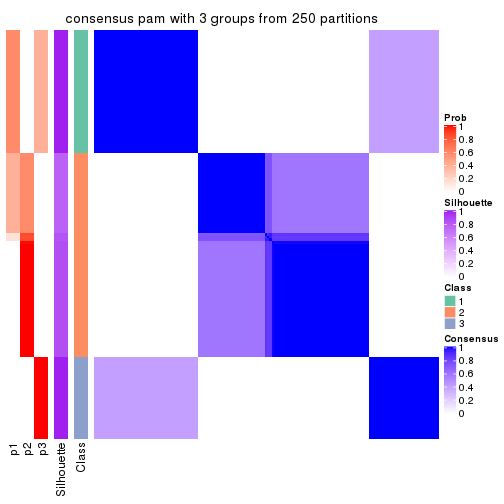</p>

</div>
<div id='tab-ATC-pam-consensus-heatmap-3'>
<pre><code class="r">consensus_heatmap(res, k = 4)
</code></pre>

<p></p>

</div>
<div id='tab-ATC-pam-consensus-heatmap-4'>
<pre><code class="r">consensus_heatmap(res, k = 5)
</code></pre>

<p></p>

</div>
<div id='tab-ATC-pam-consensus-heatmap-5'>
<pre><code class="r">consensus_heatmap(res, k = 6)
</code></pre>

<p></p>

</div>
</div>

Heatmaps for the membership of samples in all partitions to see how consistent they are:


<script>
$( function() {
	$( '#tabs-ATC-pam-membership-heatmap' ).tabs();
} );
</script>
<div id='tabs-ATC-pam-membership-heatmap'>
<ul>
<li><a href='#tab-ATC-pam-membership-heatmap-1'>k = 2</a></li>
<li><a href='#tab-ATC-pam-membership-heatmap-2'>k = 3</a></li>
<li><a href='#tab-ATC-pam-membership-heatmap-3'>k = 4</a></li>
<li><a href='#tab-ATC-pam-membership-heatmap-4'>k = 5</a></li>
<li><a href='#tab-ATC-pam-membership-heatmap-5'>k = 6</a></li>
</ul>
<div id='tab-ATC-pam-membership-heatmap-1'>
<pre><code class="r">membership_heatmap(res, k = 2)
</code></pre>

<p></p>

</div>
<div id='tab-ATC-pam-membership-heatmap-2'>
<pre><code class="r">membership_heatmap(res, k = 3)
</code></pre>

<p></p>

</div>
<div id='tab-ATC-pam-membership-heatmap-3'>
<pre><code class="r">membership_heatmap(res, k = 4)
</code></pre>

<p>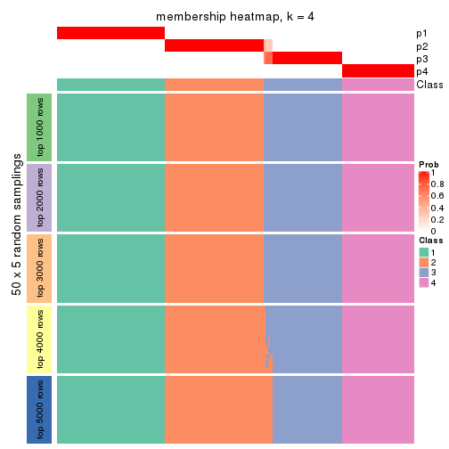</p>

</div>
<div id='tab-ATC-pam-membership-heatmap-4'>
<pre><code class="r">membership_heatmap(res, k = 5)
</code></pre>

<p></p>

</div>
<div id='tab-ATC-pam-membership-heatmap-5'>
<pre><code class="r">membership_heatmap(res, k = 6)
</code></pre>

<p></p>

</div>
</div>

As soon as we have had the classes for columns, we can look for signatures
which are significantly different between classes which can be candidate marks
for certain classes. Following are the heatmaps for signatures.


Signature heatmaps where rows are scaled:


<script>
$( function() {
	$( '#tabs-ATC-pam-get-signatures' ).tabs();
} );
</script>
<div id='tabs-ATC-pam-get-signatures'>
<ul>
<li><a href='#tab-ATC-pam-get-signatures-1'>k = 2</a></li>
<li><a href='#tab-ATC-pam-get-signatures-2'>k = 3</a></li>
<li><a href='#tab-ATC-pam-get-signatures-3'>k = 4</a></li>
<li><a href='#tab-ATC-pam-get-signatures-4'>k = 5</a></li>
<li><a href='#tab-ATC-pam-get-signatures-5'>k = 6</a></li>
</ul>
<div id='tab-ATC-pam-get-signatures-1'>
<pre><code class="r">get_signatures(res, k = 2)
</code></pre>

<p></p>

</div>
<div id='tab-ATC-pam-get-signatures-2'>
<pre><code class="r">get_signatures(res, k = 3)
</code></pre>

<p></p>

</div>
<div id='tab-ATC-pam-get-signatures-3'>
<pre><code class="r">get_signatures(res, k = 4)
</code></pre>

<p></p>

</div>
<div id='tab-ATC-pam-get-signatures-4'>
<pre><code class="r">get_signatures(res, k = 5)
</code></pre>

<p></p>

</div>
<div id='tab-ATC-pam-get-signatures-5'>
<pre><code class="r">get_signatures(res, k = 6)
</code></pre>

<p></p>

</div>
</div>


Signature heatmaps where rows are not scaled:


<script>
$( function() {
	$( '#tabs-ATC-pam-get-signatures-no-scale' ).tabs();
} );
</script>
<div id='tabs-ATC-pam-get-signatures-no-scale'>
<ul>
<li><a href='#tab-ATC-pam-get-signatures-no-scale-1'>k = 2</a></li>
<li><a href='#tab-ATC-pam-get-signatures-no-scale-2'>k = 3</a></li>
<li><a href='#tab-ATC-pam-get-signatures-no-scale-3'>k = 4</a></li>
<li><a href='#tab-ATC-pam-get-signatures-no-scale-4'>k = 5</a></li>
<li><a href='#tab-ATC-pam-get-signatures-no-scale-5'>k = 6</a></li>
</ul>
<div id='tab-ATC-pam-get-signatures-no-scale-1'>
<pre><code class="r">get_signatures(res, k = 2, scale_rows = FALSE)
</code></pre>

<p></p>

</div>
<div id='tab-ATC-pam-get-signatures-no-scale-2'>
<pre><code class="r">get_signatures(res, k = 3, scale_rows = FALSE)
</code></pre>

<p></p>

</div>
<div id='tab-ATC-pam-get-signatures-no-scale-3'>
<pre><code class="r">get_signatures(res, k = 4, scale_rows = FALSE)
</code></pre>

<p></p>

</div>
<div id='tab-ATC-pam-get-signatures-no-scale-4'>
<pre><code class="r">get_signatures(res, k = 5, scale_rows = FALSE)
</code></pre>

<p></p>

</div>
<div id='tab-ATC-pam-get-signatures-no-scale-5'>
<pre><code class="r">get_signatures(res, k = 6, scale_rows = FALSE)
</code></pre>

<p></p>

</div>
</div>


Compare the overlap of signatures from different k:

```r
compare_signatures(res)
```


`get_signature()` returns a data frame invisibly. TO get the list of signatures, the function
call should be assigned to a variable explicitly. In following code, if `plot` argument is set
to `FALSE`, no heatmap is plotted while only the differential analysis is performed.

```r
# code only for demonstration
tb = get_signature(res, k = ..., plot = FALSE)
```

An example of the output of `tb` is:

```
#>   which_row         fdr    mean_1    mean_2 scaled_mean_1 scaled_mean_2 km
#> 1        38 0.042760348  8.373488  9.131774    -0.5533452     0.5164555  1
#> 2        40 0.018707592  7.106213  8.469186    -0.6173731     0.5762149  1
#> 3        55 0.019134737 10.221463 11.207825    -0.6159697     0.5749050  1
#> 4        59 0.006059896  5.921854  7.869574    -0.6899429     0.6439467  1
#> 5        60 0.018055526  8.928898 10.211722    -0.6204761     0.5791110  1
#> 6        98 0.009384629 15.714769 14.887706     0.6635654    -0.6193277  2
...
```

The columns in `tb` are:

1. `which_row`: row indices corresponding to the input matrix.
2. `fdr`: FDR for the differential test. 
3. `mean_x`: The mean value in group x.
4. `scaled_mean_x`: The mean value in group x after rows are scaled.
5. `km`: Row groups if k-means clustering is applied to rows.


UMAP plot which shows how samples are separated.


<script>
$( function() {
	$( '#tabs-ATC-pam-dimension-reduction' ).tabs();
} );
</script>
<div id='tabs-ATC-pam-dimension-reduction'>
<ul>
<li><a href='#tab-ATC-pam-dimension-reduction-1'>k = 2</a></li>
<li><a href='#tab-ATC-pam-dimension-reduction-2'>k = 3</a></li>
<li><a href='#tab-ATC-pam-dimension-reduction-3'>k = 4</a></li>
<li><a href='#tab-ATC-pam-dimension-reduction-4'>k = 5</a></li>
<li><a href='#tab-ATC-pam-dimension-reduction-5'>k = 6</a></li>
</ul>
<div id='tab-ATC-pam-dimension-reduction-1'>
<pre><code class="r">dimension_reduction(res, k = 2, method = &quot;UMAP&quot;)
</code></pre>

<p></p>

</div>
<div id='tab-ATC-pam-dimension-reduction-2'>
<pre><code class="r">dimension_reduction(res, k = 3, method = &quot;UMAP&quot;)
</code></pre>

<p></p>

</div>
<div id='tab-ATC-pam-dimension-reduction-3'>
<pre><code class="r">dimension_reduction(res, k = 4, method = &quot;UMAP&quot;)
</code></pre>

<p></p>

</div>
<div id='tab-ATC-pam-dimension-reduction-4'>
<pre><code class="r">dimension_reduction(res, k = 5, method = &quot;UMAP&quot;)
</code></pre>

<p></p>

</div>
<div id='tab-ATC-pam-dimension-reduction-5'>
<pre><code class="r">dimension_reduction(res, k = 6, method = &quot;UMAP&quot;)
</code></pre>

<p></p>

</div>
</div>


Following heatmap shows how subgroups are split when increasing `k`:

```r
collect_classes(res)
```


If matrix rows can be associated to genes, consider to use `GO_Enrichment(res,
...)` to perform function enrichment for the signature genes.


 

---------------------------------------------------


### ATC:mclust*


The object with results only for a single top-value method and a single partition method 
can be extracted as:

```r
res = res_list["ATC", "mclust"]
# you can also extract it by
# res = res_list["ATC:mclust"]
```

A summary of `res` and all the functions that can be applied to it:

```r
res
```

```
#> A 'ConsensusPartition' object with k = 2, 3, 4, 5, 6.
#>   On a matrix with 15185 rows and 159 columns.
#>   Top rows (1000, 2000, 3000, 4000, 5000) are extracted by 'ATC' method.
#>   Subgroups are detected by 'mclust' method.
#>   Performed in total 1250 partitions by row resampling.
#>   Best k for subgroups seems to be 5.
#> 
#> Following methods can be applied to this 'ConsensusPartition' object:
#>  [1] "cola_report"             "collect_classes"         "collect_plots"          
#>  [4] "collect_stats"           "colnames"                "compare_signatures"     
#>  [7] "consensus_heatmap"       "dimension_reduction"     "functional_enrichment"  
#> [10] "get_anno_col"            "get_anno"                "get_classes"            
#> [13] "get_consensus"           "get_matrix"              "get_membership"         
#> [16] "get_param"               "get_signatures"          "get_stats"              
#> [19] "is_best_k"               "is_stable_k"             "membership_heatmap"     
#> [22] "ncol"                    "nrow"                    "plot_ecdf"              
#> [25] "rownames"                "select_partition_number" "show"                   
#> [28] "suggest_best_k"          "test_to_known_factors"
```

`collect_plots()` function collects all the plots made from `res` for all `k` (number of partitions)
into one single page to provide an easy and fast comparison between different `k`.

```r
collect_plots(res)
```


The plots are:

- The first row: a plot of the ECDF (Empirical cumulative distribution
  function) curves of the consensus matrix for each `k` and the heatmap of
  predicted classes for each `k`.
- The second row: heatmaps of the consensus matrix for each `k`.
- The third row: heatmaps of the membership matrix for each `k`.
- The fouth row: heatmaps of the signatures for each `k`.

All the plots in panels can be made by individual functions and they are
plotted later in this section.

`select_partition_number()` produces several plots showing different
statistics for choosing "optimized" `k`. There are following statistics:

- ECDF curves of the consensus matrix for each `k`;
- 1-PAC. [The PAC
  score](https://en.wikipedia.org/wiki/Consensus_clustering#Over-interpretation_potential_of_consensus_clustering)
  measures the proportion of the ambiguous subgrouping.
- Mean silhouette score.
- Concordance. The mean probability of fiting the consensus class ids in all
  partitions.
- Area increased. Denote $A_k$ as the area under the ECDF curve for current
  `k`, the area increased is defined as $A_k - A_{k-1}$.
- Rand index. The percent of pairs of samples that are both in a same cluster
  or both are not in a same cluster in the partition of k and k-1.
- Jaccard index. The ratio of pairs of samples are both in a same cluster in
  the partition of k and k-1 and the pairs of samples are both in a same
  cluster in the partition k or k-1.

The detailed explanations of these statistics can be found in [the cola
vignette](http://bioconductor.org/packages/devel/bioc/vignettes/cola/inst/doc/cola.html#toc_13).

Generally speaking, lower PAC score, higher mean silhouette score or higher
concordance corresponds to better partition. Rand index and Jaccard index
measure how similar the current partition is compared to partition with `k-1`.
If they are too similar, we won't accept `k` is better than `k-1`.

```r
select_partition_number(res)
```


The numeric values for all these statistics can be obtained by `get_stats()`.

```r
get_stats(res)
```

```
#>   k 1-PAC mean_silhouette concordance area_increased  Rand Jaccard
#> 2 2 1.000           1.000       1.000         0.5036 0.497   0.497
#> 3 3 0.811           0.914       0.888         0.1895 0.904   0.808
#> 4 4 0.839           0.932       0.919         0.1537 0.906   0.766
#> 5 5 0.902           0.910       0.941         0.0976 0.933   0.782
#> 6 6 0.779           0.841       0.845         0.0408 0.979   0.913
```

`suggest_best_k()` suggests the best $k$ based on these statistics. The rules are as follows:

- All $k$ with Jaccard index larger than 0.95 are removed because the increase of
  the partition number does not provides enough extra information. If all $k$ are removed,
  the best $k$ is assigned by `NA`.
- For $k$ with 1-PAC larger than 0.9, the maximal $k$ is taken as the "best k". Other $k$ is called "optional k".
- If it does not fit the second rule. The $k$ with the highest vote of highest
  1-PAC, mean silhouette and concordance is taken as the "best k".

```r
suggest_best_k(res)
```

```
#> [1] 5
#> attr(,"optional")
#> [1] 2
```

There is also optional best $k$ = 2 that is worth to check.

Following shows the table of the partitions (You need to click the **show/hide
code output** link to see it). The membership matrix (columns with name `p*`)
is inferred by
[`clue::cl_consensus()`](https://www.rdocumentation.org/link/cl_consensus?package=clue)
function with the `SE` method. Basically the value in the membership matrix
represents the probability to belong to a certain group. The finall class
label for an item is determined with the group with highest probability it
belongs to.

In `get_classes()` function, the entropy is calculated from the membership
matrix and the silhouette score is calculated from the consensus matrix.


<script>
$( function() {
	$( '#tabs-ATC-mclust-get-classes' ).tabs();
} );
</script>
<div id='tabs-ATC-mclust-get-classes'>
<ul>
<li><a href='#tab-ATC-mclust-get-classes-1'>k = 2</a></li>
<li><a href='#tab-ATC-mclust-get-classes-2'>k = 3</a></li>
<li><a href='#tab-ATC-mclust-get-classes-3'>k = 4</a></li>
<li><a href='#tab-ATC-mclust-get-classes-4'>k = 5</a></li>
<li><a href='#tab-ATC-mclust-get-classes-5'>k = 6</a></li>
</ul>

<div id='tab-ATC-mclust-get-classes-1'>
<p><a id='tab-ATC-mclust-get-classes-1-a' style='color:#0366d6' href='#'>show/hide code output</a></p>
<pre><code class="r">cbind(get_classes(res, k = 2), get_membership(res, k = 2))
</code></pre>

<pre><code>#&gt;            class entropy silhouette p1 p2
#&gt; SRR1706767     1       0          1  1  0
#&gt; SRR1706768     1       0          1  1  0
#&gt; SRR1706769     1       0          1  1  0
#&gt; SRR1706770     1       0          1  1  0
#&gt; SRR1706771     1       0          1  1  0
#&gt; SRR1706772     1       0          1  1  0
#&gt; SRR1706773     1       0          1  1  0
#&gt; SRR1706774     1       0          1  1  0
#&gt; SRR1706775     1       0          1  1  0
#&gt; SRR1706776     1       0          1  1  0
#&gt; SRR1706777     1       0          1  1  0
#&gt; SRR1706778     1       0          1  1  0
#&gt; SRR1706779     1       0          1  1  0
#&gt; SRR1706780     1       0          1  1  0
#&gt; SRR1706781     1       0          1  1  0
#&gt; SRR1706782     1       0          1  1  0
#&gt; SRR1706783     1       0          1  1  0
#&gt; SRR1706784     1       0          1  1  0
#&gt; SRR1706785     1       0          1  1  0
#&gt; SRR1706786     1       0          1  1  0
#&gt; SRR1706787     1       0          1  1  0
#&gt; SRR1706788     1       0          1  1  0
#&gt; SRR1706789     1       0          1  1  0
#&gt; SRR1706790     1       0          1  1  0
#&gt; SRR1706791     1       0          1  1  0
#&gt; SRR1706792     1       0          1  1  0
#&gt; SRR1706793     1       0          1  1  0
#&gt; SRR1706794     1       0          1  1  0
#&gt; SRR1706795     1       0          1  1  0
#&gt; SRR1706796     1       0          1  1  0
#&gt; SRR1706797     1       0          1  1  0
#&gt; SRR1706798     1       0          1  1  0
#&gt; SRR1706799     1       0          1  1  0
#&gt; SRR1706800     1       0          1  1  0
#&gt; SRR1706801     1       0          1  1  0
#&gt; SRR1706802     1       0          1  1  0
#&gt; SRR1706803     1       0          1  1  0
#&gt; SRR1706804     1       0          1  1  0
#&gt; SRR1706805     1       0          1  1  0
#&gt; SRR1706806     1       0          1  1  0
#&gt; SRR1706811     1       0          1  1  0
#&gt; SRR1706812     1       0          1  1  0
#&gt; SRR1706813     1       0          1  1  0
#&gt; SRR1706814     1       0          1  1  0
#&gt; SRR1706807     1       0          1  1  0
#&gt; SRR1706808     1       0          1  1  0
#&gt; SRR1706809     1       0          1  1  0
#&gt; SRR1706810     1       0          1  1  0
#&gt; SRR1706815     1       0          1  1  0
#&gt; SRR1706816     1       0          1  1  0
#&gt; SRR1706817     1       0          1  1  0
#&gt; SRR1706818     1       0          1  1  0
#&gt; SRR1706819     1       0          1  1  0
#&gt; SRR1706820     1       0          1  1  0
#&gt; SRR1706821     1       0          1  1  0
#&gt; SRR1706822     1       0          1  1  0
#&gt; SRR1706823     1       0          1  1  0
#&gt; SRR1706824     1       0          1  1  0
#&gt; SRR1706825     1       0          1  1  0
#&gt; SRR1706826     1       0          1  1  0
#&gt; SRR1706827     1       0          1  1  0
#&gt; SRR1706828     1       0          1  1  0
#&gt; SRR1706829     1       0          1  1  0
#&gt; SRR1706830     1       0          1  1  0
#&gt; SRR1706835     1       0          1  1  0
#&gt; SRR1706836     1       0          1  1  0
#&gt; SRR1706837     1       0          1  1  0
#&gt; SRR1706838     1       0          1  1  0
#&gt; SRR1706831     1       0          1  1  0
#&gt; SRR1706832     1       0          1  1  0
#&gt; SRR1706833     1       0          1  1  0
#&gt; SRR1706834     1       0          1  1  0
#&gt; SRR1706839     1       0          1  1  0
#&gt; SRR1706840     1       0          1  1  0
#&gt; SRR1706841     1       0          1  1  0
#&gt; SRR1706842     1       0          1  1  0
#&gt; SRR1706847     2       0          1  0  1
#&gt; SRR1706848     2       0          1  0  1
#&gt; SRR1706849     2       0          1  0  1
#&gt; SRR1706850     2       0          1  0  1
#&gt; SRR1706843     1       0          1  1  0
#&gt; SRR1706844     1       0          1  1  0
#&gt; SRR1706845     1       0          1  1  0
#&gt; SRR1706846     1       0          1  1  0
#&gt; SRR1706851     2       0          1  0  1
#&gt; SRR1706852     2       0          1  0  1
#&gt; SRR1706853     2       0          1  0  1
#&gt; SRR1706854     2       0          1  0  1
#&gt; SRR1706855     2       0          1  0  1
#&gt; SRR1706856     2       0          1  0  1
#&gt; SRR1706857     2       0          1  0  1
#&gt; SRR1706858     2       0          1  0  1
#&gt; SRR1706859     2       0          1  0  1
#&gt; SRR1706860     2       0          1  0  1
#&gt; SRR1706861     2       0          1  0  1
#&gt; SRR1706862     2       0          1  0  1
#&gt; SRR1706867     2       0          1  0  1
#&gt; SRR1706869     2       0          1  0  1
#&gt; SRR1706870     2       0          1  0  1
#&gt; SRR1706863     2       0          1  0  1
#&gt; SRR1706864     2       0          1  0  1
#&gt; SRR1706865     2       0          1  0  1
#&gt; SRR1706866     2       0          1  0  1
#&gt; SRR1706871     2       0          1  0  1
#&gt; SRR1706872     2       0          1  0  1
#&gt; SRR1706873     2       0          1  0  1
#&gt; SRR1706874     2       0          1  0  1
#&gt; SRR1706879     2       0          1  0  1
#&gt; SRR1706880     2       0          1  0  1
#&gt; SRR1706881     2       0          1  0  1
#&gt; SRR1706882     2       0          1  0  1
#&gt; SRR1706883     2       0          1  0  1
#&gt; SRR1706884     2       0          1  0  1
#&gt; SRR1706885     2       0          1  0  1
#&gt; SRR1706886     2       0          1  0  1
#&gt; SRR1706875     2       0          1  0  1
#&gt; SRR1706876     2       0          1  0  1
#&gt; SRR1706877     2       0          1  0  1
#&gt; SRR1706878     2       0          1  0  1
#&gt; SRR1706887     2       0          1  0  1
#&gt; SRR1706888     2       0          1  0  1
#&gt; SRR1706889     2       0          1  0  1
#&gt; SRR1706890     2       0          1  0  1
#&gt; SRR1706891     2       0          1  0  1
#&gt; SRR1706892     2       0          1  0  1
#&gt; SRR1706893     2       0          1  0  1
#&gt; SRR1706894     2       0          1  0  1
#&gt; SRR1706895     2       0          1  0  1
#&gt; SRR1706896     2       0          1  0  1
#&gt; SRR1706897     2       0          1  0  1
#&gt; SRR1706898     2       0          1  0  1
#&gt; SRR1706899     2       0          1  0  1
#&gt; SRR1706900     2       0          1  0  1
#&gt; SRR1706901     2       0          1  0  1
#&gt; SRR1706902     2       0          1  0  1
#&gt; SRR1706907     2       0          1  0  1
#&gt; SRR1706908     2       0          1  0  1
#&gt; SRR1706909     2       0          1  0  1
#&gt; SRR1706910     2       0          1  0  1
#&gt; SRR1706903     2       0          1  0  1
#&gt; SRR1706904     2       0          1  0  1
#&gt; SRR1706905     2       0          1  0  1
#&gt; SRR1706906     2       0          1  0  1
#&gt; SRR1706911     2       0          1  0  1
#&gt; SRR1706912     2       0          1  0  1
#&gt; SRR1706913     2       0          1  0  1
#&gt; SRR1706914     2       0          1  0  1
#&gt; SRR1706919     2       0          1  0  1
#&gt; SRR1706920     2       0          1  0  1
#&gt; SRR1706921     2       0          1  0  1
#&gt; SRR1706922     2       0          1  0  1
#&gt; SRR1706915     2       0          1  0  1
#&gt; SRR1706916     2       0          1  0  1
#&gt; SRR1706917     2       0          1  0  1
#&gt; SRR1706918     2       0          1  0  1
#&gt; SRR1706923     2       0          1  0  1
#&gt; SRR1706924     2       0          1  0  1
#&gt; SRR1706925     2       0          1  0  1
#&gt; SRR1706926     2       0          1  0  1
</code></pre>

<script>
$('#tab-ATC-mclust-get-classes-1-a').parent().next().next().hide();
$('#tab-ATC-mclust-get-classes-1-a').click(function(){
  $('#tab-ATC-mclust-get-classes-1-a').parent().next().next().toggle();
  return(false);
});
</script>
</div>

<div id='tab-ATC-mclust-get-classes-2'>
<p><a id='tab-ATC-mclust-get-classes-2-a' style='color:#0366d6' href='#'>show/hide code output</a></p>
<pre><code class="r">cbind(get_classes(res, k = 3), get_membership(res, k = 3))
</code></pre>

<pre><code>#&gt;            class entropy silhouette    p1    p2    p3
#&gt; SRR1706767     1  0.0592      0.985 0.988 0.000 0.012
#&gt; SRR1706768     1  0.0592      0.985 0.988 0.000 0.012
#&gt; SRR1706769     1  0.0592      0.985 0.988 0.000 0.012
#&gt; SRR1706770     1  0.0747      0.981 0.984 0.000 0.016
#&gt; SRR1706771     1  0.0592      0.983 0.988 0.000 0.012
#&gt; SRR1706772     1  0.0592      0.983 0.988 0.000 0.012
#&gt; SRR1706773     1  0.0592      0.983 0.988 0.000 0.012
#&gt; SRR1706774     1  0.0592      0.983 0.988 0.000 0.012
#&gt; SRR1706775     1  0.0592      0.983 0.988 0.000 0.012
#&gt; SRR1706776     1  0.0592      0.983 0.988 0.000 0.012
#&gt; SRR1706777     1  0.0424      0.987 0.992 0.000 0.008
#&gt; SRR1706778     1  0.0592      0.983 0.988 0.000 0.012
#&gt; SRR1706779     1  0.0000      0.994 1.000 0.000 0.000
#&gt; SRR1706780     1  0.0000      0.994 1.000 0.000 0.000
#&gt; SRR1706781     1  0.0000      0.994 1.000 0.000 0.000
#&gt; SRR1706782     1  0.0000      0.994 1.000 0.000 0.000
#&gt; SRR1706783     1  0.0747      0.981 0.984 0.000 0.016
#&gt; SRR1706784     1  0.0747      0.981 0.984 0.000 0.016
#&gt; SRR1706785     1  0.0747      0.981 0.984 0.000 0.016
#&gt; SRR1706786     1  0.0747      0.981 0.984 0.000 0.016
#&gt; SRR1706787     1  0.0000      0.994 1.000 0.000 0.000
#&gt; SRR1706788     1  0.0000      0.994 1.000 0.000 0.000
#&gt; SRR1706789     1  0.0000      0.994 1.000 0.000 0.000
#&gt; SRR1706790     1  0.0000      0.994 1.000 0.000 0.000
#&gt; SRR1706791     1  0.0000      0.994 1.000 0.000 0.000
#&gt; SRR1706792     1  0.0000      0.994 1.000 0.000 0.000
#&gt; SRR1706793     1  0.0000      0.994 1.000 0.000 0.000
#&gt; SRR1706794     1  0.0000      0.994 1.000 0.000 0.000
#&gt; SRR1706795     1  0.0000      0.994 1.000 0.000 0.000
#&gt; SRR1706796     1  0.0000      0.994 1.000 0.000 0.000
#&gt; SRR1706797     1  0.0000      0.994 1.000 0.000 0.000
#&gt; SRR1706798     1  0.0000      0.994 1.000 0.000 0.000
#&gt; SRR1706799     1  0.0000      0.994 1.000 0.000 0.000
#&gt; SRR1706800     1  0.0000      0.994 1.000 0.000 0.000
#&gt; SRR1706801     1  0.0000      0.994 1.000 0.000 0.000
#&gt; SRR1706802     1  0.0424      0.988 0.992 0.000 0.008
#&gt; SRR1706803     1  0.0000      0.994 1.000 0.000 0.000
#&gt; SRR1706804     1  0.0000      0.994 1.000 0.000 0.000
#&gt; SRR1706805     1  0.0000      0.994 1.000 0.000 0.000
#&gt; SRR1706806     1  0.0000      0.994 1.000 0.000 0.000
#&gt; SRR1706811     3  0.6244      0.998 0.440 0.000 0.560
#&gt; SRR1706812     3  0.6244      0.998 0.440 0.000 0.560
#&gt; SRR1706813     3  0.6244      0.998 0.440 0.000 0.560
#&gt; SRR1706814     3  0.6244      0.998 0.440 0.000 0.560
#&gt; SRR1706807     3  0.6244      0.998 0.440 0.000 0.560
#&gt; SRR1706808     3  0.6215      0.980 0.428 0.000 0.572
#&gt; SRR1706809     3  0.6215      0.980 0.428 0.000 0.572
#&gt; SRR1706810     3  0.6244      0.998 0.440 0.000 0.560
#&gt; SRR1706815     3  0.6244      0.998 0.440 0.000 0.560
#&gt; SRR1706816     3  0.6244      0.998 0.440 0.000 0.560
#&gt; SRR1706817     3  0.6244      0.998 0.440 0.000 0.560
#&gt; SRR1706818     3  0.6244      0.998 0.440 0.000 0.560
#&gt; SRR1706819     3  0.6244      0.998 0.440 0.000 0.560
#&gt; SRR1706820     3  0.6244      0.998 0.440 0.000 0.560
#&gt; SRR1706821     3  0.6244      0.998 0.440 0.000 0.560
#&gt; SRR1706822     3  0.6244      0.998 0.440 0.000 0.560
#&gt; SRR1706823     3  0.6244      0.998 0.440 0.000 0.560
#&gt; SRR1706824     3  0.6244      0.998 0.440 0.000 0.560
#&gt; SRR1706825     3  0.6244      0.998 0.440 0.000 0.560
#&gt; SRR1706826     3  0.6244      0.998 0.440 0.000 0.560
#&gt; SRR1706827     1  0.0000      0.994 1.000 0.000 0.000
#&gt; SRR1706828     1  0.0000      0.994 1.000 0.000 0.000
#&gt; SRR1706829     1  0.0000      0.994 1.000 0.000 0.000
#&gt; SRR1706830     1  0.0000      0.994 1.000 0.000 0.000
#&gt; SRR1706835     1  0.0000      0.994 1.000 0.000 0.000
#&gt; SRR1706836     1  0.0000      0.994 1.000 0.000 0.000
#&gt; SRR1706837     1  0.0000      0.994 1.000 0.000 0.000
#&gt; SRR1706838     1  0.0000      0.994 1.000 0.000 0.000
#&gt; SRR1706831     1  0.0000      0.994 1.000 0.000 0.000
#&gt; SRR1706832     1  0.0000      0.994 1.000 0.000 0.000
#&gt; SRR1706833     1  0.0000      0.994 1.000 0.000 0.000
#&gt; SRR1706834     1  0.0000      0.994 1.000 0.000 0.000
#&gt; SRR1706839     1  0.0000      0.994 1.000 0.000 0.000
#&gt; SRR1706840     1  0.0000      0.994 1.000 0.000 0.000
#&gt; SRR1706841     1  0.0000      0.994 1.000 0.000 0.000
#&gt; SRR1706842     1  0.0000      0.994 1.000 0.000 0.000
#&gt; SRR1706847     2  0.0000      0.898 0.000 1.000 0.000
#&gt; SRR1706848     2  0.0000      0.898 0.000 1.000 0.000
#&gt; SRR1706849     2  0.0000      0.898 0.000 1.000 0.000
#&gt; SRR1706850     2  0.0000      0.898 0.000 1.000 0.000
#&gt; SRR1706843     1  0.0000      0.994 1.000 0.000 0.000
#&gt; SRR1706844     1  0.0000      0.994 1.000 0.000 0.000
#&gt; SRR1706845     1  0.0000      0.994 1.000 0.000 0.000
#&gt; SRR1706846     1  0.0000      0.994 1.000 0.000 0.000
#&gt; SRR1706851     2  0.0000      0.898 0.000 1.000 0.000
#&gt; SRR1706852     2  0.0000      0.898 0.000 1.000 0.000
#&gt; SRR1706853     2  0.0000      0.898 0.000 1.000 0.000
#&gt; SRR1706854     2  0.0000      0.898 0.000 1.000 0.000
#&gt; SRR1706855     2  0.0237      0.897 0.000 0.996 0.004
#&gt; SRR1706856     2  0.0237      0.897 0.000 0.996 0.004
#&gt; SRR1706857     2  0.0237      0.897 0.000 0.996 0.004
#&gt; SRR1706858     2  0.0000      0.898 0.000 1.000 0.000
#&gt; SRR1706859     2  0.0000      0.898 0.000 1.000 0.000
#&gt; SRR1706860     2  0.0000      0.898 0.000 1.000 0.000
#&gt; SRR1706861     2  0.0000      0.898 0.000 1.000 0.000
#&gt; SRR1706862     2  0.0000      0.898 0.000 1.000 0.000
#&gt; SRR1706867     2  0.0000      0.898 0.000 1.000 0.000
#&gt; SRR1706869     2  0.0000      0.898 0.000 1.000 0.000
#&gt; SRR1706870     2  0.0000      0.898 0.000 1.000 0.000
#&gt; SRR1706863     2  0.0892      0.890 0.000 0.980 0.020
#&gt; SRR1706864     2  0.0747      0.892 0.000 0.984 0.016
#&gt; SRR1706865     2  0.0747      0.892 0.000 0.984 0.016
#&gt; SRR1706866     2  0.0892      0.890 0.000 0.980 0.020
#&gt; SRR1706871     2  0.0000      0.898 0.000 1.000 0.000
#&gt; SRR1706872     2  0.0000      0.898 0.000 1.000 0.000
#&gt; SRR1706873     2  0.0000      0.898 0.000 1.000 0.000
#&gt; SRR1706874     2  0.0000      0.898 0.000 1.000 0.000
#&gt; SRR1706879     2  0.0000      0.898 0.000 1.000 0.000
#&gt; SRR1706880     2  0.0000      0.898 0.000 1.000 0.000
#&gt; SRR1706881     2  0.0000      0.898 0.000 1.000 0.000
#&gt; SRR1706882     2  0.0000      0.898 0.000 1.000 0.000
#&gt; SRR1706883     2  0.0000      0.898 0.000 1.000 0.000
#&gt; SRR1706884     2  0.0000      0.898 0.000 1.000 0.000
#&gt; SRR1706885     2  0.0000      0.898 0.000 1.000 0.000
#&gt; SRR1706886     2  0.0000      0.898 0.000 1.000 0.000
#&gt; SRR1706875     2  0.0000      0.898 0.000 1.000 0.000
#&gt; SRR1706876     2  0.0000      0.898 0.000 1.000 0.000
#&gt; SRR1706877     2  0.0000      0.898 0.000 1.000 0.000
#&gt; SRR1706878     2  0.0000      0.898 0.000 1.000 0.000
#&gt; SRR1706887     2  0.6235      0.652 0.000 0.564 0.436
#&gt; SRR1706888     2  0.6235      0.652 0.000 0.564 0.436
#&gt; SRR1706889     2  0.6235      0.652 0.000 0.564 0.436
#&gt; SRR1706890     2  0.6235      0.652 0.000 0.564 0.436
#&gt; SRR1706891     2  0.6235      0.652 0.000 0.564 0.436
#&gt; SRR1706892     2  0.6235      0.652 0.000 0.564 0.436
#&gt; SRR1706893     2  0.6235      0.652 0.000 0.564 0.436
#&gt; SRR1706894     2  0.6235      0.652 0.000 0.564 0.436
#&gt; SRR1706895     2  0.6235      0.652 0.000 0.564 0.436
#&gt; SRR1706896     2  0.6235      0.652 0.000 0.564 0.436
#&gt; SRR1706897     2  0.6235      0.652 0.000 0.564 0.436
#&gt; SRR1706898     2  0.6235      0.652 0.000 0.564 0.436
#&gt; SRR1706899     2  0.6235      0.652 0.000 0.564 0.436
#&gt; SRR1706900     2  0.6235      0.652 0.000 0.564 0.436
#&gt; SRR1706901     2  0.6235      0.652 0.000 0.564 0.436
#&gt; SRR1706902     2  0.6235      0.652 0.000 0.564 0.436
#&gt; SRR1706907     2  0.0000      0.898 0.000 1.000 0.000
#&gt; SRR1706908     2  0.0000      0.898 0.000 1.000 0.000
#&gt; SRR1706909     2  0.0000      0.898 0.000 1.000 0.000
#&gt; SRR1706910     2  0.0000      0.898 0.000 1.000 0.000
#&gt; SRR1706903     2  0.6235      0.652 0.000 0.564 0.436
#&gt; SRR1706904     2  0.6235      0.652 0.000 0.564 0.436
#&gt; SRR1706905     2  0.6235      0.652 0.000 0.564 0.436
#&gt; SRR1706906     2  0.6235      0.652 0.000 0.564 0.436
#&gt; SRR1706911     2  0.0000      0.898 0.000 1.000 0.000
#&gt; SRR1706912     2  0.0000      0.898 0.000 1.000 0.000
#&gt; SRR1706913     2  0.0000      0.898 0.000 1.000 0.000
#&gt; SRR1706914     2  0.0000      0.898 0.000 1.000 0.000
#&gt; SRR1706919     2  0.0592      0.894 0.000 0.988 0.012
#&gt; SRR1706920     2  0.0237      0.897 0.000 0.996 0.004
#&gt; SRR1706921     2  0.0000      0.898 0.000 1.000 0.000
#&gt; SRR1706922     2  0.0237      0.897 0.000 0.996 0.004
#&gt; SRR1706915     2  0.0000      0.898 0.000 1.000 0.000
#&gt; SRR1706916     2  0.0000      0.898 0.000 1.000 0.000
#&gt; SRR1706917     2  0.0000      0.898 0.000 1.000 0.000
#&gt; SRR1706918     2  0.0000      0.898 0.000 1.000 0.000
#&gt; SRR1706923     2  0.0000      0.898 0.000 1.000 0.000
#&gt; SRR1706924     2  0.0000      0.898 0.000 1.000 0.000
#&gt; SRR1706925     2  0.0000      0.898 0.000 1.000 0.000
#&gt; SRR1706926     2  0.0000      0.898 0.000 1.000 0.000
</code></pre>

<script>
$('#tab-ATC-mclust-get-classes-2-a').parent().next().next().hide();
$('#tab-ATC-mclust-get-classes-2-a').click(function(){
  $('#tab-ATC-mclust-get-classes-2-a').parent().next().next().toggle();
  return(false);
});
</script>
</div>

<div id='tab-ATC-mclust-get-classes-3'>
<p><a id='tab-ATC-mclust-get-classes-3-a' style='color:#0366d6' href='#'>show/hide code output</a></p>
<pre><code class="r">cbind(get_classes(res, k = 4), get_membership(res, k = 4))
</code></pre>

<pre><code>#&gt;            class entropy silhouette    p1    p2    p3    p4
#&gt; SRR1706767     1  0.3123      0.805 0.844 0.000 0.000 0.156
#&gt; SRR1706768     1  0.3123      0.805 0.844 0.000 0.000 0.156
#&gt; SRR1706769     1  0.3123      0.805 0.844 0.000 0.000 0.156
#&gt; SRR1706770     1  0.3219      0.791 0.836 0.000 0.000 0.164
#&gt; SRR1706771     1  0.1716      0.930 0.936 0.000 0.000 0.064
#&gt; SRR1706772     1  0.1637      0.934 0.940 0.000 0.000 0.060
#&gt; SRR1706773     1  0.1557      0.937 0.944 0.000 0.000 0.056
#&gt; SRR1706774     1  0.1637      0.934 0.940 0.000 0.000 0.060
#&gt; SRR1706775     1  0.0188      0.961 0.996 0.000 0.000 0.004
#&gt; SRR1706776     1  0.0188      0.961 0.996 0.000 0.000 0.004
#&gt; SRR1706777     1  0.0188      0.961 0.996 0.000 0.000 0.004
#&gt; SRR1706778     1  0.0188      0.961 0.996 0.000 0.000 0.004
#&gt; SRR1706779     1  0.0336      0.958 0.992 0.000 0.000 0.008
#&gt; SRR1706780     1  0.0336      0.958 0.992 0.000 0.000 0.008
#&gt; SRR1706781     1  0.0336      0.958 0.992 0.000 0.000 0.008
#&gt; SRR1706782     1  0.0336      0.958 0.992 0.000 0.000 0.008
#&gt; SRR1706783     1  0.0592      0.959 0.984 0.000 0.000 0.016
#&gt; SRR1706784     1  0.0592      0.959 0.984 0.000 0.000 0.016
#&gt; SRR1706785     1  0.0592      0.959 0.984 0.000 0.000 0.016
#&gt; SRR1706786     1  0.0592      0.959 0.984 0.000 0.000 0.016
#&gt; SRR1706787     1  0.1637      0.934 0.940 0.000 0.000 0.060
#&gt; SRR1706788     1  0.1637      0.934 0.940 0.000 0.000 0.060
#&gt; SRR1706789     1  0.1637      0.934 0.940 0.000 0.000 0.060
#&gt; SRR1706790     1  0.1637      0.934 0.940 0.000 0.000 0.060
#&gt; SRR1706791     1  0.0188      0.961 0.996 0.000 0.000 0.004
#&gt; SRR1706792     1  0.0188      0.961 0.996 0.000 0.000 0.004
#&gt; SRR1706793     1  0.0336      0.960 0.992 0.000 0.000 0.008
#&gt; SRR1706794     1  0.0469      0.959 0.988 0.000 0.000 0.012
#&gt; SRR1706795     1  0.0188      0.961 0.996 0.000 0.000 0.004
#&gt; SRR1706796     1  0.0188      0.961 0.996 0.000 0.000 0.004
#&gt; SRR1706797     1  0.0188      0.961 0.996 0.000 0.000 0.004
#&gt; SRR1706798     1  0.0188      0.961 0.996 0.000 0.000 0.004
#&gt; SRR1706799     1  0.0336      0.958 0.992 0.000 0.000 0.008
#&gt; SRR1706800     1  0.0336      0.958 0.992 0.000 0.000 0.008
#&gt; SRR1706801     1  0.0336      0.958 0.992 0.000 0.000 0.008
#&gt; SRR1706802     1  0.0336      0.958 0.992 0.000 0.000 0.008
#&gt; SRR1706803     1  0.0336      0.958 0.992 0.000 0.000 0.008
#&gt; SRR1706804     1  0.0336      0.958 0.992 0.000 0.000 0.008
#&gt; SRR1706805     1  0.0336      0.958 0.992 0.000 0.000 0.008
#&gt; SRR1706806     1  0.0336      0.958 0.992 0.000 0.000 0.008
#&gt; SRR1706811     4  0.3907      1.000 0.232 0.000 0.000 0.768
#&gt; SRR1706812     4  0.3907      1.000 0.232 0.000 0.000 0.768
#&gt; SRR1706813     4  0.3907      1.000 0.232 0.000 0.000 0.768
#&gt; SRR1706814     4  0.3907      1.000 0.232 0.000 0.000 0.768
#&gt; SRR1706807     4  0.3907      1.000 0.232 0.000 0.000 0.768
#&gt; SRR1706808     4  0.3907      1.000 0.232 0.000 0.000 0.768
#&gt; SRR1706809     4  0.3907      1.000 0.232 0.000 0.000 0.768
#&gt; SRR1706810     4  0.3907      1.000 0.232 0.000 0.000 0.768
#&gt; SRR1706815     4  0.3907      1.000 0.232 0.000 0.000 0.768
#&gt; SRR1706816     4  0.3907      1.000 0.232 0.000 0.000 0.768
#&gt; SRR1706817     4  0.3907      1.000 0.232 0.000 0.000 0.768
#&gt; SRR1706818     4  0.3907      1.000 0.232 0.000 0.000 0.768
#&gt; SRR1706819     4  0.3907      1.000 0.232 0.000 0.000 0.768
#&gt; SRR1706820     4  0.3907      1.000 0.232 0.000 0.000 0.768
#&gt; SRR1706821     4  0.3907      1.000 0.232 0.000 0.000 0.768
#&gt; SRR1706822     4  0.3907      1.000 0.232 0.000 0.000 0.768
#&gt; SRR1706823     4  0.3907      1.000 0.232 0.000 0.000 0.768
#&gt; SRR1706824     4  0.3907      1.000 0.232 0.000 0.000 0.768
#&gt; SRR1706825     4  0.3907      1.000 0.232 0.000 0.000 0.768
#&gt; SRR1706826     4  0.3907      1.000 0.232 0.000 0.000 0.768
#&gt; SRR1706827     1  0.1637      0.934 0.940 0.000 0.000 0.060
#&gt; SRR1706828     1  0.1637      0.934 0.940 0.000 0.000 0.060
#&gt; SRR1706829     1  0.1637      0.934 0.940 0.000 0.000 0.060
#&gt; SRR1706830     1  0.1637      0.934 0.940 0.000 0.000 0.060
#&gt; SRR1706835     1  0.0188      0.961 0.996 0.000 0.000 0.004
#&gt; SRR1706836     1  0.0188      0.961 0.996 0.000 0.000 0.004
#&gt; SRR1706837     1  0.0188      0.961 0.996 0.000 0.000 0.004
#&gt; SRR1706838     1  0.0188      0.961 0.996 0.000 0.000 0.004
#&gt; SRR1706831     1  0.1637      0.934 0.940 0.000 0.000 0.060
#&gt; SRR1706832     1  0.1637      0.934 0.940 0.000 0.000 0.060
#&gt; SRR1706833     1  0.1637      0.934 0.940 0.000 0.000 0.060
#&gt; SRR1706834     1  0.1637      0.934 0.940 0.000 0.000 0.060
#&gt; SRR1706839     1  0.0188      0.959 0.996 0.000 0.000 0.004
#&gt; SRR1706840     1  0.0000      0.960 1.000 0.000 0.000 0.000
#&gt; SRR1706841     1  0.0000      0.960 1.000 0.000 0.000 0.000
#&gt; SRR1706842     1  0.0000      0.960 1.000 0.000 0.000 0.000
#&gt; SRR1706847     2  0.0000      0.902 0.000 1.000 0.000 0.000
#&gt; SRR1706848     2  0.0000      0.902 0.000 1.000 0.000 0.000
#&gt; SRR1706849     2  0.0000      0.902 0.000 1.000 0.000 0.000
#&gt; SRR1706850     2  0.0000      0.902 0.000 1.000 0.000 0.000
#&gt; SRR1706843     1  0.0336      0.958 0.992 0.000 0.000 0.008
#&gt; SRR1706844     1  0.0336      0.958 0.992 0.000 0.000 0.008
#&gt; SRR1706845     1  0.0336      0.958 0.992 0.000 0.000 0.008
#&gt; SRR1706846     1  0.0336      0.958 0.992 0.000 0.000 0.008
#&gt; SRR1706851     2  0.0000      0.902 0.000 1.000 0.000 0.000
#&gt; SRR1706852     2  0.0000      0.902 0.000 1.000 0.000 0.000
#&gt; SRR1706853     2  0.0000      0.902 0.000 1.000 0.000 0.000
#&gt; SRR1706854     2  0.0000      0.902 0.000 1.000 0.000 0.000
#&gt; SRR1706855     2  0.1637      0.877 0.000 0.940 0.060 0.000
#&gt; SRR1706856     2  0.1637      0.877 0.000 0.940 0.060 0.000
#&gt; SRR1706857     2  0.1637      0.877 0.000 0.940 0.060 0.000
#&gt; SRR1706858     2  0.1637      0.877 0.000 0.940 0.060 0.000
#&gt; SRR1706859     2  0.5361      0.829 0.000 0.716 0.060 0.224
#&gt; SRR1706860     2  0.5361      0.829 0.000 0.716 0.060 0.224
#&gt; SRR1706861     2  0.5361      0.829 0.000 0.716 0.060 0.224
#&gt; SRR1706862     2  0.5361      0.829 0.000 0.716 0.060 0.224
#&gt; SRR1706867     2  0.0000      0.902 0.000 1.000 0.000 0.000
#&gt; SRR1706869     2  0.0000      0.902 0.000 1.000 0.000 0.000
#&gt; SRR1706870     2  0.0000      0.902 0.000 1.000 0.000 0.000
#&gt; SRR1706863     2  0.5500      0.823 0.000 0.708 0.068 0.224
#&gt; SRR1706864     2  0.5500      0.823 0.000 0.708 0.068 0.224
#&gt; SRR1706865     2  0.5500      0.823 0.000 0.708 0.068 0.224
#&gt; SRR1706866     2  0.5500      0.823 0.000 0.708 0.068 0.224
#&gt; SRR1706871     2  0.0000      0.902 0.000 1.000 0.000 0.000
#&gt; SRR1706872     2  0.0000      0.902 0.000 1.000 0.000 0.000
#&gt; SRR1706873     2  0.0000      0.902 0.000 1.000 0.000 0.000
#&gt; SRR1706874     2  0.0000      0.902 0.000 1.000 0.000 0.000
#&gt; SRR1706879     2  0.3837      0.857 0.000 0.776 0.000 0.224
#&gt; SRR1706880     2  0.3837      0.857 0.000 0.776 0.000 0.224
#&gt; SRR1706881     2  0.3837      0.857 0.000 0.776 0.000 0.224
#&gt; SRR1706882     2  0.3837      0.857 0.000 0.776 0.000 0.224
#&gt; SRR1706883     2  0.3837      0.857 0.000 0.776 0.000 0.224
#&gt; SRR1706884     2  0.3837      0.857 0.000 0.776 0.000 0.224
#&gt; SRR1706885     2  0.3837      0.857 0.000 0.776 0.000 0.224
#&gt; SRR1706886     2  0.3837      0.857 0.000 0.776 0.000 0.224
#&gt; SRR1706875     2  0.0000      0.902 0.000 1.000 0.000 0.000
#&gt; SRR1706876     2  0.0000      0.902 0.000 1.000 0.000 0.000
#&gt; SRR1706877     2  0.0000      0.902 0.000 1.000 0.000 0.000
#&gt; SRR1706878     2  0.0000      0.902 0.000 1.000 0.000 0.000
#&gt; SRR1706887     3  0.0000      1.000 0.000 0.000 1.000 0.000
#&gt; SRR1706888     3  0.0000      1.000 0.000 0.000 1.000 0.000
#&gt; SRR1706889     3  0.0000      1.000 0.000 0.000 1.000 0.000
#&gt; SRR1706890     3  0.0000      1.000 0.000 0.000 1.000 0.000
#&gt; SRR1706891     3  0.0000      1.000 0.000 0.000 1.000 0.000
#&gt; SRR1706892     3  0.0000      1.000 0.000 0.000 1.000 0.000
#&gt; SRR1706893     3  0.0000      1.000 0.000 0.000 1.000 0.000
#&gt; SRR1706894     3  0.0000      1.000 0.000 0.000 1.000 0.000
#&gt; SRR1706895     3  0.0000      1.000 0.000 0.000 1.000 0.000
#&gt; SRR1706896     3  0.0000      1.000 0.000 0.000 1.000 0.000
#&gt; SRR1706897     3  0.0000      1.000 0.000 0.000 1.000 0.000
#&gt; SRR1706898     3  0.0000      1.000 0.000 0.000 1.000 0.000
#&gt; SRR1706899     3  0.0000      1.000 0.000 0.000 1.000 0.000
#&gt; SRR1706900     3  0.0000      1.000 0.000 0.000 1.000 0.000
#&gt; SRR1706901     3  0.0000      1.000 0.000 0.000 1.000 0.000
#&gt; SRR1706902     3  0.0000      1.000 0.000 0.000 1.000 0.000
#&gt; SRR1706907     2  0.0000      0.902 0.000 1.000 0.000 0.000
#&gt; SRR1706908     2  0.0000      0.902 0.000 1.000 0.000 0.000
#&gt; SRR1706909     2  0.0000      0.902 0.000 1.000 0.000 0.000
#&gt; SRR1706910     2  0.0000      0.902 0.000 1.000 0.000 0.000
#&gt; SRR1706903     3  0.0000      1.000 0.000 0.000 1.000 0.000
#&gt; SRR1706904     3  0.0000      1.000 0.000 0.000 1.000 0.000
#&gt; SRR1706905     3  0.0000      1.000 0.000 0.000 1.000 0.000
#&gt; SRR1706906     3  0.0000      1.000 0.000 0.000 1.000 0.000
#&gt; SRR1706911     2  0.0000      0.902 0.000 1.000 0.000 0.000
#&gt; SRR1706912     2  0.0000      0.902 0.000 1.000 0.000 0.000
#&gt; SRR1706913     2  0.0000      0.902 0.000 1.000 0.000 0.000
#&gt; SRR1706914     2  0.0000      0.902 0.000 1.000 0.000 0.000
#&gt; SRR1706919     2  0.5361      0.829 0.000 0.716 0.060 0.224
#&gt; SRR1706920     2  0.4609      0.848 0.000 0.752 0.024 0.224
#&gt; SRR1706921     2  0.4799      0.845 0.000 0.744 0.032 0.224
#&gt; SRR1706922     2  0.4609      0.848 0.000 0.752 0.024 0.224
#&gt; SRR1706915     2  0.0336      0.900 0.000 0.992 0.008 0.000
#&gt; SRR1706916     2  0.0469      0.899 0.000 0.988 0.012 0.000
#&gt; SRR1706917     2  0.0336      0.900 0.000 0.992 0.008 0.000
#&gt; SRR1706918     2  0.0469      0.899 0.000 0.988 0.012 0.000
#&gt; SRR1706923     2  0.3837      0.857 0.000 0.776 0.000 0.224
#&gt; SRR1706924     2  0.3837      0.857 0.000 0.776 0.000 0.224
#&gt; SRR1706925     2  0.3837      0.857 0.000 0.776 0.000 0.224
#&gt; SRR1706926     2  0.3837      0.857 0.000 0.776 0.000 0.224
</code></pre>

<script>
$('#tab-ATC-mclust-get-classes-3-a').parent().next().next().hide();
$('#tab-ATC-mclust-get-classes-3-a').click(function(){
  $('#tab-ATC-mclust-get-classes-3-a').parent().next().next().toggle();
  return(false);
});
</script>
</div>

<div id='tab-ATC-mclust-get-classes-4'>
<p><a id='tab-ATC-mclust-get-classes-4-a' style='color:#0366d6' href='#'>show/hide code output</a></p>
<pre><code class="r">cbind(get_classes(res, k = 5), get_membership(res, k = 5))
</code></pre>

<pre><code>#&gt;            class entropy silhouette    p1    p2    p3    p4 p5
#&gt; SRR1706767     1  0.3876      0.601 0.684 0.000 0.000 0.316  0
#&gt; SRR1706768     1  0.3895      0.593 0.680 0.000 0.000 0.320  0
#&gt; SRR1706769     1  0.3895      0.593 0.680 0.000 0.000 0.320  0
#&gt; SRR1706770     1  0.3895      0.593 0.680 0.000 0.000 0.320  0
#&gt; SRR1706771     1  0.1121      0.957 0.956 0.000 0.000 0.044  0
#&gt; SRR1706772     1  0.0963      0.962 0.964 0.000 0.000 0.036  0
#&gt; SRR1706773     1  0.0880      0.963 0.968 0.000 0.000 0.032  0
#&gt; SRR1706774     1  0.1043      0.960 0.960 0.000 0.000 0.040  0
#&gt; SRR1706775     1  0.0703      0.966 0.976 0.000 0.000 0.024  0
#&gt; SRR1706776     1  0.0703      0.966 0.976 0.000 0.000 0.024  0
#&gt; SRR1706777     1  0.0703      0.966 0.976 0.000 0.000 0.024  0
#&gt; SRR1706778     1  0.0703      0.966 0.976 0.000 0.000 0.024  0
#&gt; SRR1706779     1  0.0000      0.963 1.000 0.000 0.000 0.000  0
#&gt; SRR1706780     1  0.0000      0.963 1.000 0.000 0.000 0.000  0
#&gt; SRR1706781     1  0.0000      0.963 1.000 0.000 0.000 0.000  0
#&gt; SRR1706782     1  0.0000      0.963 1.000 0.000 0.000 0.000  0
#&gt; SRR1706783     1  0.0000      0.963 1.000 0.000 0.000 0.000  0
#&gt; SRR1706784     1  0.0000      0.963 1.000 0.000 0.000 0.000  0
#&gt; SRR1706785     1  0.0000      0.963 1.000 0.000 0.000 0.000  0
#&gt; SRR1706786     1  0.0000      0.963 1.000 0.000 0.000 0.000  0
#&gt; SRR1706787     1  0.0963      0.962 0.964 0.000 0.000 0.036  0
#&gt; SRR1706788     1  0.0963      0.962 0.964 0.000 0.000 0.036  0
#&gt; SRR1706789     1  0.0963      0.962 0.964 0.000 0.000 0.036  0
#&gt; SRR1706790     1  0.0963      0.962 0.964 0.000 0.000 0.036  0
#&gt; SRR1706791     1  0.0703      0.966 0.976 0.000 0.000 0.024  0
#&gt; SRR1706792     1  0.0703      0.966 0.976 0.000 0.000 0.024  0
#&gt; SRR1706793     1  0.0703      0.966 0.976 0.000 0.000 0.024  0
#&gt; SRR1706794     1  0.0703      0.966 0.976 0.000 0.000 0.024  0
#&gt; SRR1706795     1  0.0703      0.966 0.976 0.000 0.000 0.024  0
#&gt; SRR1706796     1  0.0703      0.966 0.976 0.000 0.000 0.024  0
#&gt; SRR1706797     1  0.0703      0.966 0.976 0.000 0.000 0.024  0
#&gt; SRR1706798     1  0.0703      0.966 0.976 0.000 0.000 0.024  0
#&gt; SRR1706799     1  0.0000      0.963 1.000 0.000 0.000 0.000  0
#&gt; SRR1706800     1  0.0000      0.963 1.000 0.000 0.000 0.000  0
#&gt; SRR1706801     1  0.0000      0.963 1.000 0.000 0.000 0.000  0
#&gt; SRR1706802     1  0.0000      0.963 1.000 0.000 0.000 0.000  0
#&gt; SRR1706803     1  0.0000      0.963 1.000 0.000 0.000 0.000  0
#&gt; SRR1706804     1  0.0000      0.963 1.000 0.000 0.000 0.000  0
#&gt; SRR1706805     1  0.0000      0.963 1.000 0.000 0.000 0.000  0
#&gt; SRR1706806     1  0.0000      0.963 1.000 0.000 0.000 0.000  0
#&gt; SRR1706811     4  0.0000      1.000 0.000 0.000 0.000 1.000  0
#&gt; SRR1706812     4  0.0000      1.000 0.000 0.000 0.000 1.000  0
#&gt; SRR1706813     4  0.0000      1.000 0.000 0.000 0.000 1.000  0
#&gt; SRR1706814     4  0.0000      1.000 0.000 0.000 0.000 1.000  0
#&gt; SRR1706807     4  0.0000      1.000 0.000 0.000 0.000 1.000  0
#&gt; SRR1706808     4  0.0000      1.000 0.000 0.000 0.000 1.000  0
#&gt; SRR1706809     4  0.0000      1.000 0.000 0.000 0.000 1.000  0
#&gt; SRR1706810     4  0.0000      1.000 0.000 0.000 0.000 1.000  0
#&gt; SRR1706815     4  0.0000      1.000 0.000 0.000 0.000 1.000  0
#&gt; SRR1706816     4  0.0000      1.000 0.000 0.000 0.000 1.000  0
#&gt; SRR1706817     4  0.0000      1.000 0.000 0.000 0.000 1.000  0
#&gt; SRR1706818     4  0.0000      1.000 0.000 0.000 0.000 1.000  0
#&gt; SRR1706819     4  0.0000      1.000 0.000 0.000 0.000 1.000  0
#&gt; SRR1706820     4  0.0000      1.000 0.000 0.000 0.000 1.000  0
#&gt; SRR1706821     4  0.0000      1.000 0.000 0.000 0.000 1.000  0
#&gt; SRR1706822     4  0.0000      1.000 0.000 0.000 0.000 1.000  0
#&gt; SRR1706823     4  0.0000      1.000 0.000 0.000 0.000 1.000  0
#&gt; SRR1706824     4  0.0000      1.000 0.000 0.000 0.000 1.000  0
#&gt; SRR1706825     4  0.0000      1.000 0.000 0.000 0.000 1.000  0
#&gt; SRR1706826     4  0.0000      1.000 0.000 0.000 0.000 1.000  0
#&gt; SRR1706827     1  0.0963      0.962 0.964 0.000 0.000 0.036  0
#&gt; SRR1706828     1  0.0963      0.962 0.964 0.000 0.000 0.036  0
#&gt; SRR1706829     1  0.0963      0.962 0.964 0.000 0.000 0.036  0
#&gt; SRR1706830     1  0.0963      0.962 0.964 0.000 0.000 0.036  0
#&gt; SRR1706835     1  0.0703      0.966 0.976 0.000 0.000 0.024  0
#&gt; SRR1706836     1  0.0703      0.966 0.976 0.000 0.000 0.024  0
#&gt; SRR1706837     1  0.0703      0.966 0.976 0.000 0.000 0.024  0
#&gt; SRR1706838     1  0.0703      0.966 0.976 0.000 0.000 0.024  0
#&gt; SRR1706831     1  0.0963      0.962 0.964 0.000 0.000 0.036  0
#&gt; SRR1706832     1  0.0963      0.962 0.964 0.000 0.000 0.036  0
#&gt; SRR1706833     1  0.0963      0.962 0.964 0.000 0.000 0.036  0
#&gt; SRR1706834     1  0.0963      0.962 0.964 0.000 0.000 0.036  0
#&gt; SRR1706839     1  0.0000      0.963 1.000 0.000 0.000 0.000  0
#&gt; SRR1706840     1  0.0000      0.963 1.000 0.000 0.000 0.000  0
#&gt; SRR1706841     1  0.0162      0.964 0.996 0.000 0.000 0.004  0
#&gt; SRR1706842     1  0.0000      0.963 1.000 0.000 0.000 0.000  0
#&gt; SRR1706847     3  0.2648      0.848 0.000 0.152 0.848 0.000  0
#&gt; SRR1706848     3  0.2648      0.848 0.000 0.152 0.848 0.000  0
#&gt; SRR1706849     3  0.2648      0.848 0.000 0.152 0.848 0.000  0
#&gt; SRR1706850     3  0.2648      0.848 0.000 0.152 0.848 0.000  0
#&gt; SRR1706843     1  0.0000      0.963 1.000 0.000 0.000 0.000  0
#&gt; SRR1706844     1  0.0000      0.963 1.000 0.000 0.000 0.000  0
#&gt; SRR1706845     1  0.0000      0.963 1.000 0.000 0.000 0.000  0
#&gt; SRR1706846     1  0.0000      0.963 1.000 0.000 0.000 0.000  0
#&gt; SRR1706851     3  0.2648      0.848 0.000 0.152 0.848 0.000  0
#&gt; SRR1706852     3  0.2732      0.845 0.000 0.160 0.840 0.000  0
#&gt; SRR1706853     3  0.2690      0.846 0.000 0.156 0.844 0.000  0
#&gt; SRR1706854     3  0.2648      0.848 0.000 0.152 0.848 0.000  0
#&gt; SRR1706855     3  0.3534      0.750 0.000 0.256 0.744 0.000  0
#&gt; SRR1706856     3  0.3534      0.750 0.000 0.256 0.744 0.000  0
#&gt; SRR1706857     3  0.3534      0.750 0.000 0.256 0.744 0.000  0
#&gt; SRR1706858     3  0.3534      0.750 0.000 0.256 0.744 0.000  0
#&gt; SRR1706859     2  0.0510      0.861 0.000 0.984 0.016 0.000  0
#&gt; SRR1706860     2  0.0510      0.861 0.000 0.984 0.016 0.000  0
#&gt; SRR1706861     2  0.0510      0.861 0.000 0.984 0.016 0.000  0
#&gt; SRR1706862     2  0.0510      0.861 0.000 0.984 0.016 0.000  0
#&gt; SRR1706867     3  0.0000      0.852 0.000 0.000 1.000 0.000  0
#&gt; SRR1706869     3  0.0000      0.852 0.000 0.000 1.000 0.000  0
#&gt; SRR1706870     3  0.0000      0.852 0.000 0.000 1.000 0.000  0
#&gt; SRR1706863     2  0.0510      0.861 0.000 0.984 0.016 0.000  0
#&gt; SRR1706864     2  0.0510      0.861 0.000 0.984 0.016 0.000  0
#&gt; SRR1706865     2  0.0510      0.861 0.000 0.984 0.016 0.000  0
#&gt; SRR1706866     2  0.0510      0.861 0.000 0.984 0.016 0.000  0
#&gt; SRR1706871     3  0.0000      0.852 0.000 0.000 1.000 0.000  0
#&gt; SRR1706872     3  0.0000      0.852 0.000 0.000 1.000 0.000  0
#&gt; SRR1706873     3  0.0000      0.852 0.000 0.000 1.000 0.000  0
#&gt; SRR1706874     3  0.0000      0.852 0.000 0.000 1.000 0.000  0
#&gt; SRR1706879     2  0.3452      0.761 0.000 0.756 0.244 0.000  0
#&gt; SRR1706880     2  0.3508      0.749 0.000 0.748 0.252 0.000  0
#&gt; SRR1706881     2  0.3561      0.741 0.000 0.740 0.260 0.000  0
#&gt; SRR1706882     2  0.3534      0.748 0.000 0.744 0.256 0.000  0
#&gt; SRR1706883     2  0.2471      0.817 0.000 0.864 0.136 0.000  0
#&gt; SRR1706884     2  0.2471      0.817 0.000 0.864 0.136 0.000  0
#&gt; SRR1706885     2  0.2471      0.817 0.000 0.864 0.136 0.000  0
#&gt; SRR1706886     2  0.2471      0.817 0.000 0.864 0.136 0.000  0
#&gt; SRR1706875     3  0.0000      0.852 0.000 0.000 1.000 0.000  0
#&gt; SRR1706876     3  0.0000      0.852 0.000 0.000 1.000 0.000  0
#&gt; SRR1706877     3  0.0000      0.852 0.000 0.000 1.000 0.000  0
#&gt; SRR1706878     3  0.0000      0.852 0.000 0.000 1.000 0.000  0
#&gt; SRR1706887     5  0.0000      1.000 0.000 0.000 0.000 0.000  1
#&gt; SRR1706888     5  0.0000      1.000 0.000 0.000 0.000 0.000  1
#&gt; SRR1706889     5  0.0000      1.000 0.000 0.000 0.000 0.000  1
#&gt; SRR1706890     5  0.0000      1.000 0.000 0.000 0.000 0.000  1
#&gt; SRR1706891     5  0.0000      1.000 0.000 0.000 0.000 0.000  1
#&gt; SRR1706892     5  0.0000      1.000 0.000 0.000 0.000 0.000  1
#&gt; SRR1706893     5  0.0000      1.000 0.000 0.000 0.000 0.000  1
#&gt; SRR1706894     5  0.0000      1.000 0.000 0.000 0.000 0.000  1
#&gt; SRR1706895     5  0.0000      1.000 0.000 0.000 0.000 0.000  1
#&gt; SRR1706896     5  0.0000      1.000 0.000 0.000 0.000 0.000  1
#&gt; SRR1706897     5  0.0000      1.000 0.000 0.000 0.000 0.000  1
#&gt; SRR1706898     5  0.0000      1.000 0.000 0.000 0.000 0.000  1
#&gt; SRR1706899     5  0.0000      1.000 0.000 0.000 0.000 0.000  1
#&gt; SRR1706900     5  0.0000      1.000 0.000 0.000 0.000 0.000  1
#&gt; SRR1706901     5  0.0000      1.000 0.000 0.000 0.000 0.000  1
#&gt; SRR1706902     5  0.0000      1.000 0.000 0.000 0.000 0.000  1
#&gt; SRR1706907     3  0.0000      0.852 0.000 0.000 1.000 0.000  0
#&gt; SRR1706908     3  0.0000      0.852 0.000 0.000 1.000 0.000  0
#&gt; SRR1706909     3  0.0000      0.852 0.000 0.000 1.000 0.000  0
#&gt; SRR1706910     3  0.0000      0.852 0.000 0.000 1.000 0.000  0
#&gt; SRR1706903     5  0.0000      1.000 0.000 0.000 0.000 0.000  1
#&gt; SRR1706904     5  0.0000      1.000 0.000 0.000 0.000 0.000  1
#&gt; SRR1706905     5  0.0000      1.000 0.000 0.000 0.000 0.000  1
#&gt; SRR1706906     5  0.0000      1.000 0.000 0.000 0.000 0.000  1
#&gt; SRR1706911     3  0.2329      0.853 0.000 0.124 0.876 0.000  0
#&gt; SRR1706912     3  0.2230      0.855 0.000 0.116 0.884 0.000  0
#&gt; SRR1706913     3  0.2648      0.846 0.000 0.152 0.848 0.000  0
#&gt; SRR1706914     3  0.2127      0.856 0.000 0.108 0.892 0.000  0
#&gt; SRR1706919     2  0.2377      0.862 0.000 0.872 0.128 0.000  0
#&gt; SRR1706920     2  0.2377      0.862 0.000 0.872 0.128 0.000  0
#&gt; SRR1706921     2  0.2377      0.862 0.000 0.872 0.128 0.000  0
#&gt; SRR1706922     2  0.2377      0.862 0.000 0.872 0.128 0.000  0
#&gt; SRR1706915     3  0.4171      0.553 0.000 0.396 0.604 0.000  0
#&gt; SRR1706916     3  0.4030      0.615 0.000 0.352 0.648 0.000  0
#&gt; SRR1706917     3  0.4060      0.606 0.000 0.360 0.640 0.000  0
#&gt; SRR1706918     3  0.4030      0.615 0.000 0.352 0.648 0.000  0
#&gt; SRR1706923     2  0.2773      0.849 0.000 0.836 0.164 0.000  0
#&gt; SRR1706924     2  0.2773      0.849 0.000 0.836 0.164 0.000  0
#&gt; SRR1706925     2  0.2773      0.849 0.000 0.836 0.164 0.000  0
#&gt; SRR1706926     2  0.2891      0.841 0.000 0.824 0.176 0.000  0
</code></pre>

<script>
$('#tab-ATC-mclust-get-classes-4-a').parent().next().next().hide();
$('#tab-ATC-mclust-get-classes-4-a').click(function(){
  $('#tab-ATC-mclust-get-classes-4-a').parent().next().next().toggle();
  return(false);
});
</script>
</div>

<div id='tab-ATC-mclust-get-classes-5'>
<p><a id='tab-ATC-mclust-get-classes-5-a' style='color:#0366d6' href='#'>show/hide code output</a></p>
<pre><code class="r">cbind(get_classes(res, k = 6), get_membership(res, k = 6))
</code></pre>

<pre><code>#&gt;            class entropy silhouette    p1    p2    p3    p4 p5    p6
#&gt; SRR1706767     1  0.5444      0.667 0.576 0.000 0.216 0.208  0 0.000
#&gt; SRR1706768     1  0.5444      0.667 0.576 0.000 0.216 0.208  0 0.000
#&gt; SRR1706769     1  0.5444      0.667 0.576 0.000 0.216 0.208  0 0.000
#&gt; SRR1706770     1  0.5444      0.667 0.576 0.000 0.216 0.208  0 0.000
#&gt; SRR1706771     1  0.3446      0.761 0.692 0.000 0.000 0.308  0 0.000
#&gt; SRR1706772     1  0.3446      0.761 0.692 0.000 0.000 0.308  0 0.000
#&gt; SRR1706773     1  0.3446      0.761 0.692 0.000 0.000 0.308  0 0.000
#&gt; SRR1706774     1  0.3446      0.761 0.692 0.000 0.000 0.308  0 0.000
#&gt; SRR1706775     1  0.3446      0.761 0.692 0.000 0.000 0.308  0 0.000
#&gt; SRR1706776     1  0.3446      0.761 0.692 0.000 0.000 0.308  0 0.000
#&gt; SRR1706777     1  0.3446      0.761 0.692 0.000 0.000 0.308  0 0.000
#&gt; SRR1706778     1  0.3446      0.761 0.692 0.000 0.000 0.308  0 0.000
#&gt; SRR1706779     1  0.0458      0.743 0.984 0.000 0.016 0.000  0 0.000
#&gt; SRR1706780     1  0.0547      0.742 0.980 0.000 0.020 0.000  0 0.000
#&gt; SRR1706781     1  0.0547      0.742 0.980 0.000 0.020 0.000  0 0.000
#&gt; SRR1706782     1  0.0547      0.742 0.980 0.000 0.020 0.000  0 0.000
#&gt; SRR1706783     1  0.0937      0.733 0.960 0.000 0.040 0.000  0 0.000
#&gt; SRR1706784     1  0.0937      0.733 0.960 0.000 0.040 0.000  0 0.000
#&gt; SRR1706785     1  0.0937      0.733 0.960 0.000 0.040 0.000  0 0.000
#&gt; SRR1706786     1  0.0937      0.733 0.960 0.000 0.040 0.000  0 0.000
#&gt; SRR1706787     1  0.5444      0.667 0.576 0.000 0.216 0.208  0 0.000
#&gt; SRR1706788     1  0.5444      0.667 0.576 0.000 0.216 0.208  0 0.000
#&gt; SRR1706789     1  0.5444      0.667 0.576 0.000 0.216 0.208  0 0.000
#&gt; SRR1706790     1  0.5444      0.667 0.576 0.000 0.216 0.208  0 0.000
#&gt; SRR1706791     1  0.3446      0.761 0.692 0.000 0.000 0.308  0 0.000
#&gt; SRR1706792     1  0.3446      0.761 0.692 0.000 0.000 0.308  0 0.000
#&gt; SRR1706793     1  0.3446      0.761 0.692 0.000 0.000 0.308  0 0.000
#&gt; SRR1706794     1  0.3446      0.761 0.692 0.000 0.000 0.308  0 0.000
#&gt; SRR1706795     1  0.3446      0.761 0.692 0.000 0.000 0.308  0 0.000
#&gt; SRR1706796     1  0.3446      0.761 0.692 0.000 0.000 0.308  0 0.000
#&gt; SRR1706797     1  0.3446      0.761 0.692 0.000 0.000 0.308  0 0.000
#&gt; SRR1706798     1  0.3446      0.761 0.692 0.000 0.000 0.308  0 0.000
#&gt; SRR1706799     1  0.0632      0.740 0.976 0.000 0.024 0.000  0 0.000
#&gt; SRR1706800     1  0.0146      0.746 0.996 0.000 0.004 0.000  0 0.000
#&gt; SRR1706801     1  0.0000      0.746 1.000 0.000 0.000 0.000  0 0.000
#&gt; SRR1706802     1  0.0632      0.740 0.976 0.000 0.024 0.000  0 0.000
#&gt; SRR1706803     1  0.0937      0.733 0.960 0.000 0.040 0.000  0 0.000
#&gt; SRR1706804     1  0.0937      0.733 0.960 0.000 0.040 0.000  0 0.000
#&gt; SRR1706805     1  0.1082      0.735 0.956 0.000 0.040 0.004  0 0.000
#&gt; SRR1706806     1  0.0937      0.733 0.960 0.000 0.040 0.000  0 0.000
#&gt; SRR1706811     4  0.0000      0.952 0.000 0.000 0.000 1.000  0 0.000
#&gt; SRR1706812     4  0.0000      0.952 0.000 0.000 0.000 1.000  0 0.000
#&gt; SRR1706813     4  0.0000      0.952 0.000 0.000 0.000 1.000  0 0.000
#&gt; SRR1706814     4  0.0000      0.952 0.000 0.000 0.000 1.000  0 0.000
#&gt; SRR1706807     4  0.2912      0.794 0.000 0.000 0.216 0.784  0 0.000
#&gt; SRR1706808     4  0.2912      0.794 0.000 0.000 0.216 0.784  0 0.000
#&gt; SRR1706809     4  0.2912      0.794 0.000 0.000 0.216 0.784  0 0.000
#&gt; SRR1706810     4  0.2912      0.794 0.000 0.000 0.216 0.784  0 0.000
#&gt; SRR1706815     4  0.0000      0.952 0.000 0.000 0.000 1.000  0 0.000
#&gt; SRR1706816     4  0.0000      0.952 0.000 0.000 0.000 1.000  0 0.000
#&gt; SRR1706817     4  0.0000      0.952 0.000 0.000 0.000 1.000  0 0.000
#&gt; SRR1706818     4  0.0000      0.952 0.000 0.000 0.000 1.000  0 0.000
#&gt; SRR1706819     4  0.0000      0.952 0.000 0.000 0.000 1.000  0 0.000
#&gt; SRR1706820     4  0.0000      0.952 0.000 0.000 0.000 1.000  0 0.000
#&gt; SRR1706821     4  0.0000      0.952 0.000 0.000 0.000 1.000  0 0.000
#&gt; SRR1706822     4  0.0000      0.952 0.000 0.000 0.000 1.000  0 0.000
#&gt; SRR1706823     4  0.0000      0.952 0.000 0.000 0.000 1.000  0 0.000
#&gt; SRR1706824     4  0.0000      0.952 0.000 0.000 0.000 1.000  0 0.000
#&gt; SRR1706825     4  0.0000      0.952 0.000 0.000 0.000 1.000  0 0.000
#&gt; SRR1706826     4  0.0000      0.952 0.000 0.000 0.000 1.000  0 0.000
#&gt; SRR1706827     1  0.5421      0.671 0.580 0.000 0.212 0.208  0 0.000
#&gt; SRR1706828     1  0.5421      0.671 0.580 0.000 0.212 0.208  0 0.000
#&gt; SRR1706829     1  0.5421      0.671 0.580 0.000 0.212 0.208  0 0.000
#&gt; SRR1706830     1  0.5421      0.671 0.580 0.000 0.212 0.208  0 0.000
#&gt; SRR1706835     1  0.3446      0.761 0.692 0.000 0.000 0.308  0 0.000
#&gt; SRR1706836     1  0.3446      0.761 0.692 0.000 0.000 0.308  0 0.000
#&gt; SRR1706837     1  0.3446      0.761 0.692 0.000 0.000 0.308  0 0.000
#&gt; SRR1706838     1  0.3446      0.761 0.692 0.000 0.000 0.308  0 0.000
#&gt; SRR1706831     1  0.3446      0.761 0.692 0.000 0.000 0.308  0 0.000
#&gt; SRR1706832     1  0.3446      0.761 0.692 0.000 0.000 0.308  0 0.000
#&gt; SRR1706833     1  0.3446      0.761 0.692 0.000 0.000 0.308  0 0.000
#&gt; SRR1706834     1  0.3446      0.761 0.692 0.000 0.000 0.308  0 0.000
#&gt; SRR1706839     1  0.0000      0.746 1.000 0.000 0.000 0.000  0 0.000
#&gt; SRR1706840     1  0.0260      0.748 0.992 0.000 0.000 0.008  0 0.000
#&gt; SRR1706841     1  0.0713      0.750 0.972 0.000 0.000 0.028  0 0.000
#&gt; SRR1706842     1  0.0260      0.748 0.992 0.000 0.000 0.008  0 0.000
#&gt; SRR1706847     3  0.3758      0.941 0.000 0.016 0.700 0.000  0 0.284
#&gt; SRR1706848     3  0.3738      0.945 0.000 0.016 0.704 0.000  0 0.280
#&gt; SRR1706849     3  0.3758      0.941 0.000 0.016 0.700 0.000  0 0.284
#&gt; SRR1706850     3  0.3758      0.941 0.000 0.016 0.700 0.000  0 0.284
#&gt; SRR1706843     1  0.0937      0.733 0.960 0.000 0.040 0.000  0 0.000
#&gt; SRR1706844     1  0.0937      0.733 0.960 0.000 0.040 0.000  0 0.000
#&gt; SRR1706845     1  0.0937      0.733 0.960 0.000 0.040 0.000  0 0.000
#&gt; SRR1706846     1  0.0937      0.733 0.960 0.000 0.040 0.000  0 0.000
#&gt; SRR1706851     6  0.0458      0.856 0.000 0.016 0.000 0.000  0 0.984
#&gt; SRR1706852     6  0.0458      0.856 0.000 0.016 0.000 0.000  0 0.984
#&gt; SRR1706853     6  0.0458      0.856 0.000 0.016 0.000 0.000  0 0.984
#&gt; SRR1706854     6  0.0547      0.858 0.000 0.020 0.000 0.000  0 0.980
#&gt; SRR1706855     6  0.2854      0.828 0.000 0.208 0.000 0.000  0 0.792
#&gt; SRR1706856     6  0.2854      0.828 0.000 0.208 0.000 0.000  0 0.792
#&gt; SRR1706857     6  0.2854      0.828 0.000 0.208 0.000 0.000  0 0.792
#&gt; SRR1706858     6  0.2854      0.828 0.000 0.208 0.000 0.000  0 0.792
#&gt; SRR1706859     2  0.1141      0.872 0.000 0.948 0.000 0.000  0 0.052
#&gt; SRR1706860     2  0.1141      0.872 0.000 0.948 0.000 0.000  0 0.052
#&gt; SRR1706861     2  0.1141      0.872 0.000 0.948 0.000 0.000  0 0.052
#&gt; SRR1706862     2  0.1141      0.872 0.000 0.948 0.000 0.000  0 0.052
#&gt; SRR1706867     3  0.3175      0.959 0.000 0.000 0.744 0.000  0 0.256
#&gt; SRR1706869     3  0.3175      0.959 0.000 0.000 0.744 0.000  0 0.256
#&gt; SRR1706870     3  0.3175      0.959 0.000 0.000 0.744 0.000  0 0.256
#&gt; SRR1706863     2  0.1141      0.872 0.000 0.948 0.000 0.000  0 0.052
#&gt; SRR1706864     2  0.1141      0.872 0.000 0.948 0.000 0.000  0 0.052
#&gt; SRR1706865     2  0.1141      0.872 0.000 0.948 0.000 0.000  0 0.052
#&gt; SRR1706866     2  0.1141      0.872 0.000 0.948 0.000 0.000  0 0.052
#&gt; SRR1706871     6  0.1765      0.853 0.000 0.096 0.000 0.000  0 0.904
#&gt; SRR1706872     6  0.1765      0.853 0.000 0.096 0.000 0.000  0 0.904
#&gt; SRR1706873     6  0.1765      0.853 0.000 0.096 0.000 0.000  0 0.904
#&gt; SRR1706874     6  0.1765      0.853 0.000 0.096 0.000 0.000  0 0.904
#&gt; SRR1706879     2  0.2378      0.842 0.000 0.848 0.000 0.000  0 0.152
#&gt; SRR1706880     2  0.2416      0.844 0.000 0.844 0.000 0.000  0 0.156
#&gt; SRR1706881     2  0.2378      0.842 0.000 0.848 0.000 0.000  0 0.152
#&gt; SRR1706882     2  0.2416      0.844 0.000 0.844 0.000 0.000  0 0.156
#&gt; SRR1706883     2  0.2092      0.856 0.000 0.876 0.000 0.000  0 0.124
#&gt; SRR1706884     2  0.2092      0.856 0.000 0.876 0.000 0.000  0 0.124
#&gt; SRR1706885     2  0.2092      0.856 0.000 0.876 0.000 0.000  0 0.124
#&gt; SRR1706886     2  0.2092      0.856 0.000 0.876 0.000 0.000  0 0.124
#&gt; SRR1706875     6  0.0000      0.849 0.000 0.000 0.000 0.000  0 1.000
#&gt; SRR1706876     6  0.0000      0.849 0.000 0.000 0.000 0.000  0 1.000
#&gt; SRR1706877     6  0.0000      0.849 0.000 0.000 0.000 0.000  0 1.000
#&gt; SRR1706878     6  0.0000      0.849 0.000 0.000 0.000 0.000  0 1.000
#&gt; SRR1706887     5  0.0000      1.000 0.000 0.000 0.000 0.000  1 0.000
#&gt; SRR1706888     5  0.0000      1.000 0.000 0.000 0.000 0.000  1 0.000
#&gt; SRR1706889     5  0.0000      1.000 0.000 0.000 0.000 0.000  1 0.000
#&gt; SRR1706890     5  0.0000      1.000 0.000 0.000 0.000 0.000  1 0.000
#&gt; SRR1706891     5  0.0000      1.000 0.000 0.000 0.000 0.000  1 0.000
#&gt; SRR1706892     5  0.0000      1.000 0.000 0.000 0.000 0.000  1 0.000
#&gt; SRR1706893     5  0.0000      1.000 0.000 0.000 0.000 0.000  1 0.000
#&gt; SRR1706894     5  0.0000      1.000 0.000 0.000 0.000 0.000  1 0.000
#&gt; SRR1706895     5  0.0000      1.000 0.000 0.000 0.000 0.000  1 0.000
#&gt; SRR1706896     5  0.0000      1.000 0.000 0.000 0.000 0.000  1 0.000
#&gt; SRR1706897     5  0.0000      1.000 0.000 0.000 0.000 0.000  1 0.000
#&gt; SRR1706898     5  0.0000      1.000 0.000 0.000 0.000 0.000  1 0.000
#&gt; SRR1706899     5  0.0000      1.000 0.000 0.000 0.000 0.000  1 0.000
#&gt; SRR1706900     5  0.0000      1.000 0.000 0.000 0.000 0.000  1 0.000
#&gt; SRR1706901     5  0.0000      1.000 0.000 0.000 0.000 0.000  1 0.000
#&gt; SRR1706902     5  0.0000      1.000 0.000 0.000 0.000 0.000  1 0.000
#&gt; SRR1706907     3  0.3244      0.963 0.000 0.000 0.732 0.000  0 0.268
#&gt; SRR1706908     3  0.3288      0.962 0.000 0.000 0.724 0.000  0 0.276
#&gt; SRR1706909     3  0.3198      0.962 0.000 0.000 0.740 0.000  0 0.260
#&gt; SRR1706910     3  0.3244      0.963 0.000 0.000 0.732 0.000  0 0.268
#&gt; SRR1706903     5  0.0000      1.000 0.000 0.000 0.000 0.000  1 0.000
#&gt; SRR1706904     5  0.0000      1.000 0.000 0.000 0.000 0.000  1 0.000
#&gt; SRR1706905     5  0.0000      1.000 0.000 0.000 0.000 0.000  1 0.000
#&gt; SRR1706906     5  0.0000      1.000 0.000 0.000 0.000 0.000  1 0.000
#&gt; SRR1706911     6  0.1910      0.857 0.000 0.108 0.000 0.000  0 0.892
#&gt; SRR1706912     6  0.2003      0.858 0.000 0.116 0.000 0.000  0 0.884
#&gt; SRR1706913     6  0.2135      0.857 0.000 0.128 0.000 0.000  0 0.872
#&gt; SRR1706914     6  0.1957      0.857 0.000 0.112 0.000 0.000  0 0.888
#&gt; SRR1706919     2  0.2664      0.870 0.000 0.816 0.000 0.000  0 0.184
#&gt; SRR1706920     2  0.2664      0.870 0.000 0.816 0.000 0.000  0 0.184
#&gt; SRR1706921     2  0.2664      0.870 0.000 0.816 0.000 0.000  0 0.184
#&gt; SRR1706922     2  0.2664      0.870 0.000 0.816 0.000 0.000  0 0.184
#&gt; SRR1706915     6  0.2854      0.749 0.000 0.208 0.000 0.000  0 0.792
#&gt; SRR1706916     6  0.2340      0.799 0.000 0.148 0.000 0.000  0 0.852
#&gt; SRR1706917     6  0.2491      0.790 0.000 0.164 0.000 0.000  0 0.836
#&gt; SRR1706918     6  0.2260      0.801 0.000 0.140 0.000 0.000  0 0.860
#&gt; SRR1706923     2  0.2762      0.866 0.000 0.804 0.000 0.000  0 0.196
#&gt; SRR1706924     2  0.2762      0.866 0.000 0.804 0.000 0.000  0 0.196
#&gt; SRR1706925     2  0.2762      0.866 0.000 0.804 0.000 0.000  0 0.196
#&gt; SRR1706926     2  0.2762      0.866 0.000 0.804 0.000 0.000  0 0.196
</code></pre>

<script>
$('#tab-ATC-mclust-get-classes-5-a').parent().next().next().hide();
$('#tab-ATC-mclust-get-classes-5-a').click(function(){
  $('#tab-ATC-mclust-get-classes-5-a').parent().next().next().toggle();
  return(false);
});
</script>
</div>
</div>

Heatmaps for the consensus matrix. It visualizes the probability of two
samples to be in a same group.


<script>
$( function() {
	$( '#tabs-ATC-mclust-consensus-heatmap' ).tabs();
} );
</script>
<div id='tabs-ATC-mclust-consensus-heatmap'>
<ul>
<li><a href='#tab-ATC-mclust-consensus-heatmap-1'>k = 2</a></li>
<li><a href='#tab-ATC-mclust-consensus-heatmap-2'>k = 3</a></li>
<li><a href='#tab-ATC-mclust-consensus-heatmap-3'>k = 4</a></li>
<li><a href='#tab-ATC-mclust-consensus-heatmap-4'>k = 5</a></li>
<li><a href='#tab-ATC-mclust-consensus-heatmap-5'>k = 6</a></li>
</ul>
<div id='tab-ATC-mclust-consensus-heatmap-1'>
<pre><code class="r">consensus_heatmap(res, k = 2)
</code></pre>

<p></p>

</div>
<div id='tab-ATC-mclust-consensus-heatmap-2'>
<pre><code class="r">consensus_heatmap(res, k = 3)
</code></pre>

<p></p>

</div>
<div id='tab-ATC-mclust-consensus-heatmap-3'>
<pre><code class="r">consensus_heatmap(res, k = 4)
</code></pre>

<p></p>

</div>
<div id='tab-ATC-mclust-consensus-heatmap-4'>
<pre><code class="r">consensus_heatmap(res, k = 5)
</code></pre>

<p></p>

</div>
<div id='tab-ATC-mclust-consensus-heatmap-5'>
<pre><code class="r">consensus_heatmap(res, k = 6)
</code></pre>

<p>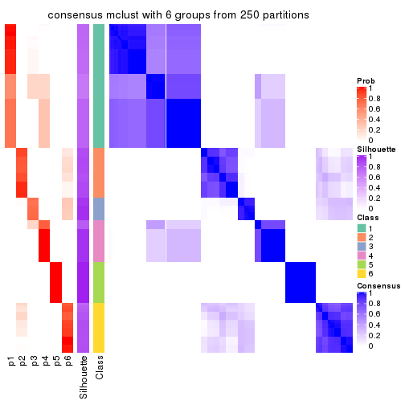</p>

</div>
</div>

Heatmaps for the membership of samples in all partitions to see how consistent they are:


<script>
$( function() {
	$( '#tabs-ATC-mclust-membership-heatmap' ).tabs();
} );
</script>
<div id='tabs-ATC-mclust-membership-heatmap'>
<ul>
<li><a href='#tab-ATC-mclust-membership-heatmap-1'>k = 2</a></li>
<li><a href='#tab-ATC-mclust-membership-heatmap-2'>k = 3</a></li>
<li><a href='#tab-ATC-mclust-membership-heatmap-3'>k = 4</a></li>
<li><a href='#tab-ATC-mclust-membership-heatmap-4'>k = 5</a></li>
<li><a href='#tab-ATC-mclust-membership-heatmap-5'>k = 6</a></li>
</ul>
<div id='tab-ATC-mclust-membership-heatmap-1'>
<pre><code class="r">membership_heatmap(res, k = 2)
</code></pre>

<p></p>

</div>
<div id='tab-ATC-mclust-membership-heatmap-2'>
<pre><code class="r">membership_heatmap(res, k = 3)
</code></pre>

<p></p>

</div>
<div id='tab-ATC-mclust-membership-heatmap-3'>
<pre><code class="r">membership_heatmap(res, k = 4)
</code></pre>

<p></p>

</div>
<div id='tab-ATC-mclust-membership-heatmap-4'>
<pre><code class="r">membership_heatmap(res, k = 5)
</code></pre>

<p></p>

</div>
<div id='tab-ATC-mclust-membership-heatmap-5'>
<pre><code class="r">membership_heatmap(res, k = 6)
</code></pre>

<p></p>

</div>
</div>

As soon as we have had the classes for columns, we can look for signatures
which are significantly different between classes which can be candidate marks
for certain classes. Following are the heatmaps for signatures.


Signature heatmaps where rows are scaled:


<script>
$( function() {
	$( '#tabs-ATC-mclust-get-signatures' ).tabs();
} );
</script>
<div id='tabs-ATC-mclust-get-signatures'>
<ul>
<li><a href='#tab-ATC-mclust-get-signatures-1'>k = 2</a></li>
<li><a href='#tab-ATC-mclust-get-signatures-2'>k = 3</a></li>
<li><a href='#tab-ATC-mclust-get-signatures-3'>k = 4</a></li>
<li><a href='#tab-ATC-mclust-get-signatures-4'>k = 5</a></li>
<li><a href='#tab-ATC-mclust-get-signatures-5'>k = 6</a></li>
</ul>
<div id='tab-ATC-mclust-get-signatures-1'>
<pre><code class="r">get_signatures(res, k = 2)
</code></pre>

<p></p>

</div>
<div id='tab-ATC-mclust-get-signatures-2'>
<pre><code class="r">get_signatures(res, k = 3)
</code></pre>

<p></p>

</div>
<div id='tab-ATC-mclust-get-signatures-3'>
<pre><code class="r">get_signatures(res, k = 4)
</code></pre>

<p></p>

</div>
<div id='tab-ATC-mclust-get-signatures-4'>
<pre><code class="r">get_signatures(res, k = 5)
</code></pre>

<p></p>

</div>
<div id='tab-ATC-mclust-get-signatures-5'>
<pre><code class="r">get_signatures(res, k = 6)
</code></pre>

<p></p>

</div>
</div>


Signature heatmaps where rows are not scaled:


<script>
$( function() {
	$( '#tabs-ATC-mclust-get-signatures-no-scale' ).tabs();
} );
</script>
<div id='tabs-ATC-mclust-get-signatures-no-scale'>
<ul>
<li><a href='#tab-ATC-mclust-get-signatures-no-scale-1'>k = 2</a></li>
<li><a href='#tab-ATC-mclust-get-signatures-no-scale-2'>k = 3</a></li>
<li><a href='#tab-ATC-mclust-get-signatures-no-scale-3'>k = 4</a></li>
<li><a href='#tab-ATC-mclust-get-signatures-no-scale-4'>k = 5</a></li>
<li><a href='#tab-ATC-mclust-get-signatures-no-scale-5'>k = 6</a></li>
</ul>
<div id='tab-ATC-mclust-get-signatures-no-scale-1'>
<pre><code class="r">get_signatures(res, k = 2, scale_rows = FALSE)
</code></pre>

<p></p>

</div>
<div id='tab-ATC-mclust-get-signatures-no-scale-2'>
<pre><code class="r">get_signatures(res, k = 3, scale_rows = FALSE)
</code></pre>

<p></p>

</div>
<div id='tab-ATC-mclust-get-signatures-no-scale-3'>
<pre><code class="r">get_signatures(res, k = 4, scale_rows = FALSE)
</code></pre>

<p>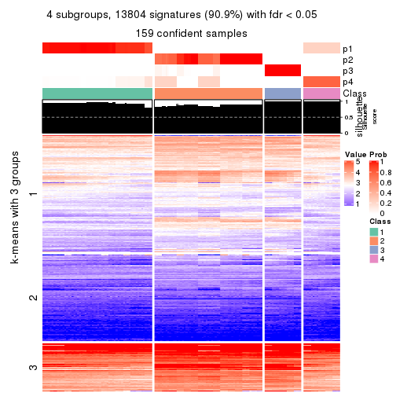</p>

</div>
<div id='tab-ATC-mclust-get-signatures-no-scale-4'>
<pre><code class="r">get_signatures(res, k = 5, scale_rows = FALSE)
</code></pre>

<p></p>

</div>
<div id='tab-ATC-mclust-get-signatures-no-scale-5'>
<pre><code class="r">get_signatures(res, k = 6, scale_rows = FALSE)
</code></pre>

<p></p>

</div>
</div>


Compare the overlap of signatures from different k:

```r
compare_signatures(res)
```


`get_signature()` returns a data frame invisibly. TO get the list of signatures, the function
call should be assigned to a variable explicitly. In following code, if `plot` argument is set
to `FALSE`, no heatmap is plotted while only the differential analysis is performed.

```r
# code only for demonstration
tb = get_signature(res, k = ..., plot = FALSE)
```

An example of the output of `tb` is:

```
#>   which_row         fdr    mean_1    mean_2 scaled_mean_1 scaled_mean_2 km
#> 1        38 0.042760348  8.373488  9.131774    -0.5533452     0.5164555  1
#> 2        40 0.018707592  7.106213  8.469186    -0.6173731     0.5762149  1
#> 3        55 0.019134737 10.221463 11.207825    -0.6159697     0.5749050  1
#> 4        59 0.006059896  5.921854  7.869574    -0.6899429     0.6439467  1
#> 5        60 0.018055526  8.928898 10.211722    -0.6204761     0.5791110  1
#> 6        98 0.009384629 15.714769 14.887706     0.6635654    -0.6193277  2
...
```

The columns in `tb` are:

1. `which_row`: row indices corresponding to the input matrix.
2. `fdr`: FDR for the differential test. 
3. `mean_x`: The mean value in group x.
4. `scaled_mean_x`: The mean value in group x after rows are scaled.
5. `km`: Row groups if k-means clustering is applied to rows.


UMAP plot which shows how samples are separated.


<script>
$( function() {
	$( '#tabs-ATC-mclust-dimension-reduction' ).tabs();
} );
</script>
<div id='tabs-ATC-mclust-dimension-reduction'>
<ul>
<li><a href='#tab-ATC-mclust-dimension-reduction-1'>k = 2</a></li>
<li><a href='#tab-ATC-mclust-dimension-reduction-2'>k = 3</a></li>
<li><a href='#tab-ATC-mclust-dimension-reduction-3'>k = 4</a></li>
<li><a href='#tab-ATC-mclust-dimension-reduction-4'>k = 5</a></li>
<li><a href='#tab-ATC-mclust-dimension-reduction-5'>k = 6</a></li>
</ul>
<div id='tab-ATC-mclust-dimension-reduction-1'>
<pre><code class="r">dimension_reduction(res, k = 2, method = &quot;UMAP&quot;)
</code></pre>

<p></p>

</div>
<div id='tab-ATC-mclust-dimension-reduction-2'>
<pre><code class="r">dimension_reduction(res, k = 3, method = &quot;UMAP&quot;)
</code></pre>

<p></p>

</div>
<div id='tab-ATC-mclust-dimension-reduction-3'>
<pre><code class="r">dimension_reduction(res, k = 4, method = &quot;UMAP&quot;)
</code></pre>

<p></p>

</div>
<div id='tab-ATC-mclust-dimension-reduction-4'>
<pre><code class="r">dimension_reduction(res, k = 5, method = &quot;UMAP&quot;)
</code></pre>

<p></p>

</div>
<div id='tab-ATC-mclust-dimension-reduction-5'>
<pre><code class="r">dimension_reduction(res, k = 6, method = &quot;UMAP&quot;)
</code></pre>

<p></p>

</div>
</div>


Following heatmap shows how subgroups are split when increasing `k`:

```r
collect_classes(res)
```


If matrix rows can be associated to genes, consider to use `GO_Enrichment(res,
...)` to perform function enrichment for the signature genes.


 

---------------------------------------------------


### ATC:NMF**


The object with results only for a single top-value method and a single partition method 
can be extracted as:

```r
res = res_list["ATC", "NMF"]
# you can also extract it by
# res = res_list["ATC:NMF"]
```

A summary of `res` and all the functions that can be applied to it:

```r
res
```

```
#> A 'ConsensusPartition' object with k = 2, 3, 4, 5, 6.
#>   On a matrix with 15185 rows and 159 columns.
#>   Top rows (1000, 2000, 3000, 4000, 5000) are extracted by 'ATC' method.
#>   Subgroups are detected by 'NMF' method.
#>   Performed in total 1250 partitions by row resampling.
#>   Best k for subgroups seems to be 2.
#> 
#> Following methods can be applied to this 'ConsensusPartition' object:
#>  [1] "cola_report"             "collect_classes"         "collect_plots"          
#>  [4] "collect_stats"           "colnames"                "compare_signatures"     
#>  [7] "consensus_heatmap"       "dimension_reduction"     "functional_enrichment"  
#> [10] "get_anno_col"            "get_anno"                "get_classes"            
#> [13] "get_consensus"           "get_matrix"              "get_membership"         
#> [16] "get_param"               "get_signatures"          "get_stats"              
#> [19] "is_best_k"               "is_stable_k"             "membership_heatmap"     
#> [22] "ncol"                    "nrow"                    "plot_ecdf"              
#> [25] "rownames"                "select_partition_number" "show"                   
#> [28] "suggest_best_k"          "test_to_known_factors"
```

`collect_plots()` function collects all the plots made from `res` for all `k` (number of partitions)
into one single page to provide an easy and fast comparison between different `k`.

```r
collect_plots(res)
```


The plots are:

- The first row: a plot of the ECDF (Empirical cumulative distribution
  function) curves of the consensus matrix for each `k` and the heatmap of
  predicted classes for each `k`.
- The second row: heatmaps of the consensus matrix for each `k`.
- The third row: heatmaps of the membership matrix for each `k`.
- The fouth row: heatmaps of the signatures for each `k`.

All the plots in panels can be made by individual functions and they are
plotted later in this section.

`select_partition_number()` produces several plots showing different
statistics for choosing "optimized" `k`. There are following statistics:

- ECDF curves of the consensus matrix for each `k`;
- 1-PAC. [The PAC
  score](https://en.wikipedia.org/wiki/Consensus_clustering#Over-interpretation_potential_of_consensus_clustering)
  measures the proportion of the ambiguous subgrouping.
- Mean silhouette score.
- Concordance. The mean probability of fiting the consensus class ids in all
  partitions.
- Area increased. Denote $A_k$ as the area under the ECDF curve for current
  `k`, the area increased is defined as $A_k - A_{k-1}$.
- Rand index. The percent of pairs of samples that are both in a same cluster
  or both are not in a same cluster in the partition of k and k-1.
- Jaccard index. The ratio of pairs of samples are both in a same cluster in
  the partition of k and k-1 and the pairs of samples are both in a same
  cluster in the partition k or k-1.

The detailed explanations of these statistics can be found in [the cola
vignette](http://bioconductor.org/packages/devel/bioc/vignettes/cola/inst/doc/cola.html#toc_13).

Generally speaking, lower PAC score, higher mean silhouette score or higher
concordance corresponds to better partition. Rand index and Jaccard index
measure how similar the current partition is compared to partition with `k-1`.
If they are too similar, we won't accept `k` is better than `k-1`.

```r
select_partition_number(res)
```


The numeric values for all these statistics can be obtained by `get_stats()`.

```r
get_stats(res)
```

```
#>   k 1-PAC mean_silhouette concordance area_increased  Rand Jaccard
#> 2 2 1.000           1.000       1.000         0.5036 0.497   0.497
#> 3 3 0.770           0.894       0.947         0.2971 0.783   0.589
#> 4 4 0.750           0.804       0.894         0.0169 0.872   0.691
#> 5 5 0.595           0.575       0.824         0.0577 0.940   0.838
#> 6 6 0.612           0.633       0.755         0.0814 0.838   0.545
```

`suggest_best_k()` suggests the best $k$ based on these statistics. The rules are as follows:

- All $k$ with Jaccard index larger than 0.95 are removed because the increase of
  the partition number does not provides enough extra information. If all $k$ are removed,
  the best $k$ is assigned by `NA`.
- For $k$ with 1-PAC larger than 0.9, the maximal $k$ is taken as the "best k". Other $k$ is called "optional k".
- If it does not fit the second rule. The $k$ with the highest vote of highest
  1-PAC, mean silhouette and concordance is taken as the "best k".

```r
suggest_best_k(res)
```

```
#> [1] 2
```


Following shows the table of the partitions (You need to click the **show/hide
code output** link to see it). The membership matrix (columns with name `p*`)
is inferred by
[`clue::cl_consensus()`](https://www.rdocumentation.org/link/cl_consensus?package=clue)
function with the `SE` method. Basically the value in the membership matrix
represents the probability to belong to a certain group. The finall class
label for an item is determined with the group with highest probability it
belongs to.

In `get_classes()` function, the entropy is calculated from the membership
matrix and the silhouette score is calculated from the consensus matrix.


<script>
$( function() {
	$( '#tabs-ATC-NMF-get-classes' ).tabs();
} );
</script>
<div id='tabs-ATC-NMF-get-classes'>
<ul>
<li><a href='#tab-ATC-NMF-get-classes-1'>k = 2</a></li>
<li><a href='#tab-ATC-NMF-get-classes-2'>k = 3</a></li>
<li><a href='#tab-ATC-NMF-get-classes-3'>k = 4</a></li>
<li><a href='#tab-ATC-NMF-get-classes-4'>k = 5</a></li>
<li><a href='#tab-ATC-NMF-get-classes-5'>k = 6</a></li>
</ul>

<div id='tab-ATC-NMF-get-classes-1'>
<p><a id='tab-ATC-NMF-get-classes-1-a' style='color:#0366d6' href='#'>show/hide code output</a></p>
<pre><code class="r">cbind(get_classes(res, k = 2), get_membership(res, k = 2))
</code></pre>

<pre><code>#&gt;            class entropy silhouette p1 p2
#&gt; SRR1706767     1       0          1  1  0
#&gt; SRR1706768     1       0          1  1  0
#&gt; SRR1706769     1       0          1  1  0
#&gt; SRR1706770     1       0          1  1  0
#&gt; SRR1706771     1       0          1  1  0
#&gt; SRR1706772     1       0          1  1  0
#&gt; SRR1706773     1       0          1  1  0
#&gt; SRR1706774     1       0          1  1  0
#&gt; SRR1706775     1       0          1  1  0
#&gt; SRR1706776     1       0          1  1  0
#&gt; SRR1706777     1       0          1  1  0
#&gt; SRR1706778     1       0          1  1  0
#&gt; SRR1706779     1       0          1  1  0
#&gt; SRR1706780     1       0          1  1  0
#&gt; SRR1706781     1       0          1  1  0
#&gt; SRR1706782     1       0          1  1  0
#&gt; SRR1706783     1       0          1  1  0
#&gt; SRR1706784     1       0          1  1  0
#&gt; SRR1706785     1       0          1  1  0
#&gt; SRR1706786     1       0          1  1  0
#&gt; SRR1706787     1       0          1  1  0
#&gt; SRR1706788     1       0          1  1  0
#&gt; SRR1706789     1       0          1  1  0
#&gt; SRR1706790     1       0          1  1  0
#&gt; SRR1706791     1       0          1  1  0
#&gt; SRR1706792     1       0          1  1  0
#&gt; SRR1706793     1       0          1  1  0
#&gt; SRR1706794     1       0          1  1  0
#&gt; SRR1706795     1       0          1  1  0
#&gt; SRR1706796     1       0          1  1  0
#&gt; SRR1706797     1       0          1  1  0
#&gt; SRR1706798     1       0          1  1  0
#&gt; SRR1706799     1       0          1  1  0
#&gt; SRR1706800     1       0          1  1  0
#&gt; SRR1706801     1       0          1  1  0
#&gt; SRR1706802     1       0          1  1  0
#&gt; SRR1706803     1       0          1  1  0
#&gt; SRR1706804     1       0          1  1  0
#&gt; SRR1706805     1       0          1  1  0
#&gt; SRR1706806     1       0          1  1  0
#&gt; SRR1706811     1       0          1  1  0
#&gt; SRR1706812     1       0          1  1  0
#&gt; SRR1706813     1       0          1  1  0
#&gt; SRR1706814     1       0          1  1  0
#&gt; SRR1706807     1       0          1  1  0
#&gt; SRR1706808     1       0          1  1  0
#&gt; SRR1706809     1       0          1  1  0
#&gt; SRR1706810     1       0          1  1  0
#&gt; SRR1706815     1       0          1  1  0
#&gt; SRR1706816     1       0          1  1  0
#&gt; SRR1706817     1       0          1  1  0
#&gt; SRR1706818     1       0          1  1  0
#&gt; SRR1706819     1       0          1  1  0
#&gt; SRR1706820     1       0          1  1  0
#&gt; SRR1706821     1       0          1  1  0
#&gt; SRR1706822     1       0          1  1  0
#&gt; SRR1706823     1       0          1  1  0
#&gt; SRR1706824     1       0          1  1  0
#&gt; SRR1706825     1       0          1  1  0
#&gt; SRR1706826     1       0          1  1  0
#&gt; SRR1706827     1       0          1  1  0
#&gt; SRR1706828     1       0          1  1  0
#&gt; SRR1706829     1       0          1  1  0
#&gt; SRR1706830     1       0          1  1  0
#&gt; SRR1706835     1       0          1  1  0
#&gt; SRR1706836     1       0          1  1  0
#&gt; SRR1706837     1       0          1  1  0
#&gt; SRR1706838     1       0          1  1  0
#&gt; SRR1706831     1       0          1  1  0
#&gt; SRR1706832     1       0          1  1  0
#&gt; SRR1706833     1       0          1  1  0
#&gt; SRR1706834     1       0          1  1  0
#&gt; SRR1706839     1       0          1  1  0
#&gt; SRR1706840     1       0          1  1  0
#&gt; SRR1706841     1       0          1  1  0
#&gt; SRR1706842     1       0          1  1  0
#&gt; SRR1706847     2       0          1  0  1
#&gt; SRR1706848     2       0          1  0  1
#&gt; SRR1706849     2       0          1  0  1
#&gt; SRR1706850     2       0          1  0  1
#&gt; SRR1706843     1       0          1  1  0
#&gt; SRR1706844     1       0          1  1  0
#&gt; SRR1706845     1       0          1  1  0
#&gt; SRR1706846     1       0          1  1  0
#&gt; SRR1706851     2       0          1  0  1
#&gt; SRR1706852     2       0          1  0  1
#&gt; SRR1706853     2       0          1  0  1
#&gt; SRR1706854     2       0          1  0  1
#&gt; SRR1706855     2       0          1  0  1
#&gt; SRR1706856     2       0          1  0  1
#&gt; SRR1706857     2       0          1  0  1
#&gt; SRR1706858     2       0          1  0  1
#&gt; SRR1706859     2       0          1  0  1
#&gt; SRR1706860     2       0          1  0  1
#&gt; SRR1706861     2       0          1  0  1
#&gt; SRR1706862     2       0          1  0  1
#&gt; SRR1706867     2       0          1  0  1
#&gt; SRR1706869     2       0          1  0  1
#&gt; SRR1706870     2       0          1  0  1
#&gt; SRR1706863     2       0          1  0  1
#&gt; SRR1706864     2       0          1  0  1
#&gt; SRR1706865     2       0          1  0  1
#&gt; SRR1706866     2       0          1  0  1
#&gt; SRR1706871     2       0          1  0  1
#&gt; SRR1706872     2       0          1  0  1
#&gt; SRR1706873     2       0          1  0  1
#&gt; SRR1706874     2       0          1  0  1
#&gt; SRR1706879     2       0          1  0  1
#&gt; SRR1706880     2       0          1  0  1
#&gt; SRR1706881     2       0          1  0  1
#&gt; SRR1706882     2       0          1  0  1
#&gt; SRR1706883     2       0          1  0  1
#&gt; SRR1706884     2       0          1  0  1
#&gt; SRR1706885     2       0          1  0  1
#&gt; SRR1706886     2       0          1  0  1
#&gt; SRR1706875     2       0          1  0  1
#&gt; SRR1706876     2       0          1  0  1
#&gt; SRR1706877     2       0          1  0  1
#&gt; SRR1706878     2       0          1  0  1
#&gt; SRR1706887     2       0          1  0  1
#&gt; SRR1706888     2       0          1  0  1
#&gt; SRR1706889     2       0          1  0  1
#&gt; SRR1706890     2       0          1  0  1
#&gt; SRR1706891     2       0          1  0  1
#&gt; SRR1706892     2       0          1  0  1
#&gt; SRR1706893     2       0          1  0  1
#&gt; SRR1706894     2       0          1  0  1
#&gt; SRR1706895     2       0          1  0  1
#&gt; SRR1706896     2       0          1  0  1
#&gt; SRR1706897     2       0          1  0  1
#&gt; SRR1706898     2       0          1  0  1
#&gt; SRR1706899     2       0          1  0  1
#&gt; SRR1706900     2       0          1  0  1
#&gt; SRR1706901     2       0          1  0  1
#&gt; SRR1706902     2       0          1  0  1
#&gt; SRR1706907     2       0          1  0  1
#&gt; SRR1706908     2       0          1  0  1
#&gt; SRR1706909     2       0          1  0  1
#&gt; SRR1706910     2       0          1  0  1
#&gt; SRR1706903     2       0          1  0  1
#&gt; SRR1706904     2       0          1  0  1
#&gt; SRR1706905     2       0          1  0  1
#&gt; SRR1706906     2       0          1  0  1
#&gt; SRR1706911     2       0          1  0  1
#&gt; SRR1706912     2       0          1  0  1
#&gt; SRR1706913     2       0          1  0  1
#&gt; SRR1706914     2       0          1  0  1
#&gt; SRR1706919     2       0          1  0  1
#&gt; SRR1706920     2       0          1  0  1
#&gt; SRR1706921     2       0          1  0  1
#&gt; SRR1706922     2       0          1  0  1
#&gt; SRR1706915     2       0          1  0  1
#&gt; SRR1706916     2       0          1  0  1
#&gt; SRR1706917     2       0          1  0  1
#&gt; SRR1706918     2       0          1  0  1
#&gt; SRR1706923     2       0          1  0  1
#&gt; SRR1706924     2       0          1  0  1
#&gt; SRR1706925     2       0          1  0  1
#&gt; SRR1706926     2       0          1  0  1
</code></pre>

<script>
$('#tab-ATC-NMF-get-classes-1-a').parent().next().next().hide();
$('#tab-ATC-NMF-get-classes-1-a').click(function(){
  $('#tab-ATC-NMF-get-classes-1-a').parent().next().next().toggle();
  return(false);
});
</script>
</div>

<div id='tab-ATC-NMF-get-classes-2'>
<p><a id='tab-ATC-NMF-get-classes-2-a' style='color:#0366d6' href='#'>show/hide code output</a></p>
<pre><code class="r">cbind(get_classes(res, k = 3), get_membership(res, k = 3))
</code></pre>

<pre><code>#&gt;            class entropy silhouette    p1    p2    p3
#&gt; SRR1706767     1  0.0000      0.938 1.000 0.000 0.000
#&gt; SRR1706768     1  0.0000      0.938 1.000 0.000 0.000
#&gt; SRR1706769     1  0.0000      0.938 1.000 0.000 0.000
#&gt; SRR1706770     1  0.0000      0.938 1.000 0.000 0.000
#&gt; SRR1706771     1  0.0000      0.938 1.000 0.000 0.000
#&gt; SRR1706772     1  0.0000      0.938 1.000 0.000 0.000
#&gt; SRR1706773     1  0.0000      0.938 1.000 0.000 0.000
#&gt; SRR1706774     1  0.0000      0.938 1.000 0.000 0.000
#&gt; SRR1706775     1  0.4750      0.803 0.784 0.000 0.216
#&gt; SRR1706776     1  0.4796      0.798 0.780 0.000 0.220
#&gt; SRR1706777     1  0.4399      0.833 0.812 0.000 0.188
#&gt; SRR1706778     1  0.4605      0.816 0.796 0.000 0.204
#&gt; SRR1706779     3  0.0000      0.938 0.000 0.000 1.000
#&gt; SRR1706780     3  0.0000      0.938 0.000 0.000 1.000
#&gt; SRR1706781     3  0.0000      0.938 0.000 0.000 1.000
#&gt; SRR1706782     3  0.0000      0.938 0.000 0.000 1.000
#&gt; SRR1706783     3  0.0000      0.938 0.000 0.000 1.000
#&gt; SRR1706784     3  0.0000      0.938 0.000 0.000 1.000
#&gt; SRR1706785     3  0.0000      0.938 0.000 0.000 1.000
#&gt; SRR1706786     3  0.0000      0.938 0.000 0.000 1.000
#&gt; SRR1706787     1  0.0000      0.938 1.000 0.000 0.000
#&gt; SRR1706788     1  0.0000      0.938 1.000 0.000 0.000
#&gt; SRR1706789     1  0.0000      0.938 1.000 0.000 0.000
#&gt; SRR1706790     1  0.0000      0.938 1.000 0.000 0.000
#&gt; SRR1706791     1  0.0000      0.938 1.000 0.000 0.000
#&gt; SRR1706792     1  0.0000      0.938 1.000 0.000 0.000
#&gt; SRR1706793     1  0.0000      0.938 1.000 0.000 0.000
#&gt; SRR1706794     1  0.0000      0.938 1.000 0.000 0.000
#&gt; SRR1706795     1  0.4555      0.821 0.800 0.000 0.200
#&gt; SRR1706796     1  0.4931      0.781 0.768 0.000 0.232
#&gt; SRR1706797     1  0.4796      0.797 0.780 0.000 0.220
#&gt; SRR1706798     1  0.4842      0.792 0.776 0.000 0.224
#&gt; SRR1706799     3  0.0000      0.938 0.000 0.000 1.000
#&gt; SRR1706800     3  0.0000      0.938 0.000 0.000 1.000
#&gt; SRR1706801     3  0.0000      0.938 0.000 0.000 1.000
#&gt; SRR1706802     3  0.0000      0.938 0.000 0.000 1.000
#&gt; SRR1706803     3  0.0000      0.938 0.000 0.000 1.000
#&gt; SRR1706804     3  0.0000      0.938 0.000 0.000 1.000
#&gt; SRR1706805     3  0.0000      0.938 0.000 0.000 1.000
#&gt; SRR1706806     3  0.0000      0.938 0.000 0.000 1.000
#&gt; SRR1706811     1  0.0000      0.938 1.000 0.000 0.000
#&gt; SRR1706812     1  0.0000      0.938 1.000 0.000 0.000
#&gt; SRR1706813     1  0.0000      0.938 1.000 0.000 0.000
#&gt; SRR1706814     1  0.0000      0.938 1.000 0.000 0.000
#&gt; SRR1706807     1  0.0000      0.938 1.000 0.000 0.000
#&gt; SRR1706808     1  0.0000      0.938 1.000 0.000 0.000
#&gt; SRR1706809     1  0.0000      0.938 1.000 0.000 0.000
#&gt; SRR1706810     1  0.0000      0.938 1.000 0.000 0.000
#&gt; SRR1706815     1  0.3879      0.862 0.848 0.000 0.152
#&gt; SRR1706816     1  0.3619      0.873 0.864 0.000 0.136
#&gt; SRR1706817     1  0.4399      0.830 0.812 0.000 0.188
#&gt; SRR1706818     1  0.3879      0.862 0.848 0.000 0.152
#&gt; SRR1706819     3  0.0000      0.938 0.000 0.000 1.000
#&gt; SRR1706820     3  0.0237      0.935 0.004 0.000 0.996
#&gt; SRR1706821     3  0.0237      0.935 0.004 0.000 0.996
#&gt; SRR1706822     3  0.0000      0.938 0.000 0.000 1.000
#&gt; SRR1706823     3  0.0000      0.938 0.000 0.000 1.000
#&gt; SRR1706824     3  0.0000      0.938 0.000 0.000 1.000
#&gt; SRR1706825     3  0.0000      0.938 0.000 0.000 1.000
#&gt; SRR1706826     3  0.0000      0.938 0.000 0.000 1.000
#&gt; SRR1706827     1  0.0000      0.938 1.000 0.000 0.000
#&gt; SRR1706828     1  0.0000      0.938 1.000 0.000 0.000
#&gt; SRR1706829     1  0.0000      0.938 1.000 0.000 0.000
#&gt; SRR1706830     1  0.0000      0.938 1.000 0.000 0.000
#&gt; SRR1706835     1  0.3340      0.883 0.880 0.000 0.120
#&gt; SRR1706836     1  0.3816      0.866 0.852 0.000 0.148
#&gt; SRR1706837     1  0.3686      0.871 0.860 0.000 0.140
#&gt; SRR1706838     1  0.2959      0.895 0.900 0.000 0.100
#&gt; SRR1706831     1  0.0000      0.938 1.000 0.000 0.000
#&gt; SRR1706832     1  0.0000      0.938 1.000 0.000 0.000
#&gt; SRR1706833     1  0.0000      0.938 1.000 0.000 0.000
#&gt; SRR1706834     1  0.0000      0.938 1.000 0.000 0.000
#&gt; SRR1706839     3  0.0237      0.935 0.004 0.000 0.996
#&gt; SRR1706840     3  0.0000      0.938 0.000 0.000 1.000
#&gt; SRR1706841     3  0.0000      0.938 0.000 0.000 1.000
#&gt; SRR1706842     3  0.0000      0.938 0.000 0.000 1.000
#&gt; SRR1706847     2  0.0000      0.943 0.000 1.000 0.000
#&gt; SRR1706848     2  0.0000      0.943 0.000 1.000 0.000
#&gt; SRR1706849     2  0.0000      0.943 0.000 1.000 0.000
#&gt; SRR1706850     2  0.0000      0.943 0.000 1.000 0.000
#&gt; SRR1706843     3  0.0000      0.938 0.000 0.000 1.000
#&gt; SRR1706844     3  0.0000      0.938 0.000 0.000 1.000
#&gt; SRR1706845     3  0.0000      0.938 0.000 0.000 1.000
#&gt; SRR1706846     3  0.0000      0.938 0.000 0.000 1.000
#&gt; SRR1706851     2  0.0000      0.943 0.000 1.000 0.000
#&gt; SRR1706852     2  0.0000      0.943 0.000 1.000 0.000
#&gt; SRR1706853     2  0.0000      0.943 0.000 1.000 0.000
#&gt; SRR1706854     2  0.0000      0.943 0.000 1.000 0.000
#&gt; SRR1706855     2  0.0000      0.943 0.000 1.000 0.000
#&gt; SRR1706856     2  0.0000      0.943 0.000 1.000 0.000
#&gt; SRR1706857     2  0.0000      0.943 0.000 1.000 0.000
#&gt; SRR1706858     2  0.0000      0.943 0.000 1.000 0.000
#&gt; SRR1706859     2  0.3412      0.860 0.000 0.876 0.124
#&gt; SRR1706860     2  0.3340      0.864 0.000 0.880 0.120
#&gt; SRR1706861     2  0.3340      0.864 0.000 0.880 0.120
#&gt; SRR1706862     2  0.3412      0.860 0.000 0.876 0.124
#&gt; SRR1706867     2  0.0000      0.943 0.000 1.000 0.000
#&gt; SRR1706869     2  0.0000      0.943 0.000 1.000 0.000
#&gt; SRR1706870     2  0.0000      0.943 0.000 1.000 0.000
#&gt; SRR1706863     3  0.5327      0.656 0.000 0.272 0.728
#&gt; SRR1706864     3  0.5291      0.664 0.000 0.268 0.732
#&gt; SRR1706865     3  0.5397      0.642 0.000 0.280 0.720
#&gt; SRR1706866     3  0.5431      0.634 0.000 0.284 0.716
#&gt; SRR1706871     2  0.0000      0.943 0.000 1.000 0.000
#&gt; SRR1706872     2  0.0000      0.943 0.000 1.000 0.000
#&gt; SRR1706873     2  0.0000      0.943 0.000 1.000 0.000
#&gt; SRR1706874     2  0.0000      0.943 0.000 1.000 0.000
#&gt; SRR1706879     2  0.3482      0.856 0.000 0.872 0.128
#&gt; SRR1706880     2  0.3412      0.860 0.000 0.876 0.124
#&gt; SRR1706881     2  0.3482      0.856 0.000 0.872 0.128
#&gt; SRR1706882     2  0.3412      0.860 0.000 0.876 0.124
#&gt; SRR1706883     3  0.3192      0.869 0.000 0.112 0.888
#&gt; SRR1706884     3  0.3116      0.872 0.000 0.108 0.892
#&gt; SRR1706885     3  0.3116      0.872 0.000 0.108 0.892
#&gt; SRR1706886     3  0.3192      0.869 0.000 0.112 0.888
#&gt; SRR1706875     2  0.0000      0.943 0.000 1.000 0.000
#&gt; SRR1706876     2  0.0000      0.943 0.000 1.000 0.000
#&gt; SRR1706877     2  0.0000      0.943 0.000 1.000 0.000
#&gt; SRR1706878     2  0.0000      0.943 0.000 1.000 0.000
#&gt; SRR1706887     2  0.0000      0.943 0.000 1.000 0.000
#&gt; SRR1706888     2  0.0000      0.943 0.000 1.000 0.000
#&gt; SRR1706889     2  0.0000      0.943 0.000 1.000 0.000
#&gt; SRR1706890     2  0.0000      0.943 0.000 1.000 0.000
#&gt; SRR1706891     2  0.0000      0.943 0.000 1.000 0.000
#&gt; SRR1706892     2  0.0000      0.943 0.000 1.000 0.000
#&gt; SRR1706893     2  0.0000      0.943 0.000 1.000 0.000
#&gt; SRR1706894     2  0.0000      0.943 0.000 1.000 0.000
#&gt; SRR1706895     2  0.0000      0.943 0.000 1.000 0.000
#&gt; SRR1706896     2  0.0000      0.943 0.000 1.000 0.000
#&gt; SRR1706897     2  0.0000      0.943 0.000 1.000 0.000
#&gt; SRR1706898     2  0.0000      0.943 0.000 1.000 0.000
#&gt; SRR1706899     2  0.2711      0.891 0.000 0.912 0.088
#&gt; SRR1706900     2  0.2711      0.891 0.000 0.912 0.088
#&gt; SRR1706901     2  0.2796      0.888 0.000 0.908 0.092
#&gt; SRR1706902     2  0.2711      0.891 0.000 0.912 0.088
#&gt; SRR1706907     2  0.0000      0.943 0.000 1.000 0.000
#&gt; SRR1706908     2  0.0000      0.943 0.000 1.000 0.000
#&gt; SRR1706909     2  0.0000      0.943 0.000 1.000 0.000
#&gt; SRR1706910     2  0.0000      0.943 0.000 1.000 0.000
#&gt; SRR1706903     2  0.6215      0.271 0.000 0.572 0.428
#&gt; SRR1706904     2  0.6225      0.258 0.000 0.568 0.432
#&gt; SRR1706905     2  0.6225      0.258 0.000 0.568 0.432
#&gt; SRR1706906     2  0.6215      0.271 0.000 0.572 0.428
#&gt; SRR1706911     2  0.0000      0.943 0.000 1.000 0.000
#&gt; SRR1706912     2  0.0000      0.943 0.000 1.000 0.000
#&gt; SRR1706913     2  0.0000      0.943 0.000 1.000 0.000
#&gt; SRR1706914     2  0.0000      0.943 0.000 1.000 0.000
#&gt; SRR1706919     2  0.2796      0.888 0.000 0.908 0.092
#&gt; SRR1706920     2  0.2537      0.896 0.000 0.920 0.080
#&gt; SRR1706921     2  0.2711      0.891 0.000 0.912 0.088
#&gt; SRR1706922     2  0.2959      0.881 0.000 0.900 0.100
#&gt; SRR1706915     2  0.0000      0.943 0.000 1.000 0.000
#&gt; SRR1706916     2  0.0000      0.943 0.000 1.000 0.000
#&gt; SRR1706917     2  0.0000      0.943 0.000 1.000 0.000
#&gt; SRR1706918     2  0.0000      0.943 0.000 1.000 0.000
#&gt; SRR1706923     3  0.4002      0.821 0.000 0.160 0.840
#&gt; SRR1706924     3  0.4121      0.811 0.000 0.168 0.832
#&gt; SRR1706925     3  0.4002      0.821 0.000 0.160 0.840
#&gt; SRR1706926     3  0.3816      0.834 0.000 0.148 0.852
</code></pre>

<script>
$('#tab-ATC-NMF-get-classes-2-a').parent().next().next().hide();
$('#tab-ATC-NMF-get-classes-2-a').click(function(){
  $('#tab-ATC-NMF-get-classes-2-a').parent().next().next().toggle();
  return(false);
});
</script>
</div>

<div id='tab-ATC-NMF-get-classes-3'>
<p><a id='tab-ATC-NMF-get-classes-3-a' style='color:#0366d6' href='#'>show/hide code output</a></p>
<pre><code class="r">cbind(get_classes(res, k = 4), get_membership(res, k = 4))
</code></pre>

<pre><code>#&gt;            class entropy silhouette    p1    p2 p3    p4
#&gt; SRR1706767     4  0.0000     0.9399 0.000 0.000 NA 1.000
#&gt; SRR1706768     4  0.0000     0.9399 0.000 0.000 NA 1.000
#&gt; SRR1706769     4  0.0000     0.9399 0.000 0.000 NA 1.000
#&gt; SRR1706770     4  0.0000     0.9399 0.000 0.000 NA 1.000
#&gt; SRR1706771     4  0.0817     0.9268 0.024 0.000 NA 0.976
#&gt; SRR1706772     4  0.0707     0.9293 0.020 0.000 NA 0.980
#&gt; SRR1706773     4  0.0817     0.9268 0.024 0.000 NA 0.976
#&gt; SRR1706774     4  0.0817     0.9268 0.024 0.000 NA 0.976
#&gt; SRR1706775     1  0.4277     0.5994 0.720 0.000 NA 0.280
#&gt; SRR1706776     1  0.4103     0.6310 0.744 0.000 NA 0.256
#&gt; SRR1706777     1  0.4304     0.5949 0.716 0.000 NA 0.284
#&gt; SRR1706778     1  0.4522     0.5450 0.680 0.000 NA 0.320
#&gt; SRR1706779     1  0.0188     0.8240 0.996 0.000 NA 0.000
#&gt; SRR1706780     1  0.0188     0.8240 0.996 0.000 NA 0.000
#&gt; SRR1706781     1  0.0188     0.8240 0.996 0.000 NA 0.000
#&gt; SRR1706782     1  0.0188     0.8240 0.996 0.000 NA 0.000
#&gt; SRR1706783     1  0.0188     0.8240 0.996 0.000 NA 0.000
#&gt; SRR1706784     1  0.0000     0.8242 1.000 0.000 NA 0.000
#&gt; SRR1706785     1  0.0188     0.8240 0.996 0.000 NA 0.000
#&gt; SRR1706786     1  0.0188     0.8240 0.996 0.000 NA 0.000
#&gt; SRR1706787     4  0.0000     0.9399 0.000 0.000 NA 1.000
#&gt; SRR1706788     4  0.0000     0.9399 0.000 0.000 NA 1.000
#&gt; SRR1706789     4  0.0000     0.9399 0.000 0.000 NA 1.000
#&gt; SRR1706790     4  0.0000     0.9399 0.000 0.000 NA 1.000
#&gt; SRR1706791     4  0.0469     0.9348 0.012 0.000 NA 0.988
#&gt; SRR1706792     4  0.0336     0.9371 0.008 0.000 NA 0.992
#&gt; SRR1706793     4  0.0336     0.9371 0.008 0.000 NA 0.992
#&gt; SRR1706794     4  0.0336     0.9371 0.008 0.000 NA 0.992
#&gt; SRR1706795     1  0.4431     0.5602 0.696 0.000 NA 0.304
#&gt; SRR1706796     1  0.3975     0.6434 0.760 0.000 NA 0.240
#&gt; SRR1706797     1  0.4250     0.6011 0.724 0.000 NA 0.276
#&gt; SRR1706798     1  0.4331     0.5850 0.712 0.000 NA 0.288
#&gt; SRR1706799     1  0.0000     0.8242 1.000 0.000 NA 0.000
#&gt; SRR1706800     1  0.0000     0.8242 1.000 0.000 NA 0.000
#&gt; SRR1706801     1  0.0000     0.8242 1.000 0.000 NA 0.000
#&gt; SRR1706802     1  0.0188     0.8240 0.996 0.000 NA 0.000
#&gt; SRR1706803     1  0.0188     0.8240 0.996 0.000 NA 0.000
#&gt; SRR1706804     1  0.0188     0.8240 0.996 0.000 NA 0.000
#&gt; SRR1706805     1  0.0188     0.8240 0.996 0.000 NA 0.000
#&gt; SRR1706806     1  0.0188     0.8240 0.996 0.000 NA 0.000
#&gt; SRR1706811     4  0.0817     0.9303 0.000 0.000 NA 0.976
#&gt; SRR1706812     4  0.0921     0.9281 0.000 0.000 NA 0.972
#&gt; SRR1706813     4  0.1022     0.9258 0.000 0.000 NA 0.968
#&gt; SRR1706814     4  0.1022     0.9258 0.000 0.000 NA 0.968
#&gt; SRR1706807     4  0.0188     0.9388 0.000 0.000 NA 0.996
#&gt; SRR1706808     4  0.0188     0.9388 0.000 0.000 NA 0.996
#&gt; SRR1706809     4  0.0188     0.9388 0.000 0.000 NA 0.996
#&gt; SRR1706810     4  0.0188     0.9388 0.000 0.000 NA 0.996
#&gt; SRR1706815     4  0.7438     0.3342 0.244 0.000 NA 0.512
#&gt; SRR1706816     4  0.7438     0.3332 0.244 0.000 NA 0.512
#&gt; SRR1706817     4  0.7437     0.3275 0.248 0.000 NA 0.512
#&gt; SRR1706818     4  0.7362     0.3293 0.256 0.000 NA 0.524
#&gt; SRR1706819     1  0.3764     0.7475 0.784 0.000 NA 0.000
#&gt; SRR1706820     1  0.3726     0.7496 0.788 0.000 NA 0.000
#&gt; SRR1706821     1  0.3688     0.7517 0.792 0.000 NA 0.000
#&gt; SRR1706822     1  0.3726     0.7496 0.788 0.000 NA 0.000
#&gt; SRR1706823     1  0.2921     0.7800 0.860 0.000 NA 0.000
#&gt; SRR1706824     1  0.2921     0.7798 0.860 0.000 NA 0.000
#&gt; SRR1706825     1  0.3400     0.7633 0.820 0.000 NA 0.000
#&gt; SRR1706826     1  0.3123     0.7733 0.844 0.000 NA 0.000
#&gt; SRR1706827     4  0.0000     0.9399 0.000 0.000 NA 1.000
#&gt; SRR1706828     4  0.0000     0.9399 0.000 0.000 NA 1.000
#&gt; SRR1706829     4  0.0000     0.9399 0.000 0.000 NA 1.000
#&gt; SRR1706830     4  0.0000     0.9399 0.000 0.000 NA 1.000
#&gt; SRR1706835     1  0.4994     0.1710 0.520 0.000 NA 0.480
#&gt; SRR1706836     1  0.4925     0.3166 0.572 0.000 NA 0.428
#&gt; SRR1706837     1  0.4955     0.2737 0.556 0.000 NA 0.444
#&gt; SRR1706838     1  0.4981     0.2177 0.536 0.000 NA 0.464
#&gt; SRR1706831     4  0.0000     0.9399 0.000 0.000 NA 1.000
#&gt; SRR1706832     4  0.0000     0.9399 0.000 0.000 NA 1.000
#&gt; SRR1706833     4  0.0000     0.9399 0.000 0.000 NA 1.000
#&gt; SRR1706834     4  0.0188     0.9387 0.004 0.000 NA 0.996
#&gt; SRR1706839     1  0.0188     0.8240 0.996 0.000 NA 0.000
#&gt; SRR1706840     1  0.0188     0.8240 0.996 0.000 NA 0.000
#&gt; SRR1706841     1  0.0000     0.8242 1.000 0.000 NA 0.000
#&gt; SRR1706842     1  0.0188     0.8240 0.996 0.000 NA 0.000
#&gt; SRR1706847     2  0.1637     0.9145 0.000 0.940 NA 0.000
#&gt; SRR1706848     2  0.1557     0.9156 0.000 0.944 NA 0.000
#&gt; SRR1706849     2  0.1557     0.9156 0.000 0.944 NA 0.000
#&gt; SRR1706850     2  0.1557     0.9156 0.000 0.944 NA 0.000
#&gt; SRR1706843     1  0.0000     0.8242 1.000 0.000 NA 0.000
#&gt; SRR1706844     1  0.0188     0.8240 0.996 0.000 NA 0.000
#&gt; SRR1706845     1  0.0000     0.8242 1.000 0.000 NA 0.000
#&gt; SRR1706846     1  0.0000     0.8242 1.000 0.000 NA 0.000
#&gt; SRR1706851     2  0.1389     0.9153 0.000 0.952 NA 0.000
#&gt; SRR1706852     2  0.1302     0.9161 0.000 0.956 NA 0.000
#&gt; SRR1706853     2  0.1389     0.9153 0.000 0.952 NA 0.000
#&gt; SRR1706854     2  0.1302     0.9161 0.000 0.956 NA 0.000
#&gt; SRR1706855     2  0.0592     0.9188 0.000 0.984 NA 0.000
#&gt; SRR1706856     2  0.0469     0.9189 0.000 0.988 NA 0.000
#&gt; SRR1706857     2  0.0469     0.9189 0.000 0.988 NA 0.000
#&gt; SRR1706858     2  0.0469     0.9189 0.000 0.988 NA 0.000
#&gt; SRR1706859     2  0.0672     0.9178 0.008 0.984 NA 0.000
#&gt; SRR1706860     2  0.0672     0.9178 0.008 0.984 NA 0.000
#&gt; SRR1706861     2  0.0672     0.9178 0.008 0.984 NA 0.000
#&gt; SRR1706862     2  0.0779     0.9178 0.004 0.980 NA 0.000
#&gt; SRR1706867     2  0.1302     0.9166 0.000 0.956 NA 0.000
#&gt; SRR1706869     2  0.1389     0.9167 0.000 0.952 NA 0.000
#&gt; SRR1706870     2  0.1389     0.9167 0.000 0.952 NA 0.000
#&gt; SRR1706863     2  0.5062     0.5914 0.284 0.692 NA 0.000
#&gt; SRR1706864     2  0.5157     0.5934 0.284 0.688 NA 0.000
#&gt; SRR1706865     2  0.4983     0.6142 0.272 0.704 NA 0.000
#&gt; SRR1706866     2  0.4898     0.6331 0.260 0.716 NA 0.000
#&gt; SRR1706871     2  0.0921     0.9178 0.000 0.972 NA 0.000
#&gt; SRR1706872     2  0.0921     0.9178 0.000 0.972 NA 0.000
#&gt; SRR1706873     2  0.0921     0.9178 0.000 0.972 NA 0.000
#&gt; SRR1706874     2  0.0817     0.9181 0.000 0.976 NA 0.000
#&gt; SRR1706879     2  0.1109     0.9160 0.004 0.968 NA 0.000
#&gt; SRR1706880     2  0.1356     0.9147 0.008 0.960 NA 0.000
#&gt; SRR1706881     2  0.1356     0.9147 0.008 0.960 NA 0.000
#&gt; SRR1706882     2  0.1109     0.9162 0.004 0.968 NA 0.000
#&gt; SRR1706883     1  0.5848     0.3024 0.584 0.376 NA 0.000
#&gt; SRR1706884     1  0.5596     0.4158 0.632 0.332 NA 0.000
#&gt; SRR1706885     1  0.5677     0.4134 0.628 0.332 NA 0.000
#&gt; SRR1706886     1  0.5645     0.3413 0.604 0.364 NA 0.000
#&gt; SRR1706875     2  0.0921     0.9167 0.000 0.972 NA 0.000
#&gt; SRR1706876     2  0.0469     0.9174 0.000 0.988 NA 0.000
#&gt; SRR1706877     2  0.1022     0.9164 0.000 0.968 NA 0.000
#&gt; SRR1706878     2  0.0817     0.9173 0.000 0.976 NA 0.000
#&gt; SRR1706887     2  0.2281     0.9013 0.000 0.904 NA 0.000
#&gt; SRR1706888     2  0.2281     0.9013 0.000 0.904 NA 0.000
#&gt; SRR1706889     2  0.2281     0.9013 0.000 0.904 NA 0.000
#&gt; SRR1706890     2  0.2281     0.9013 0.000 0.904 NA 0.000
#&gt; SRR1706891     2  0.2408     0.8985 0.000 0.896 NA 0.000
#&gt; SRR1706892     2  0.2408     0.8985 0.000 0.896 NA 0.000
#&gt; SRR1706893     2  0.2408     0.8985 0.000 0.896 NA 0.000
#&gt; SRR1706894     2  0.2408     0.8985 0.000 0.896 NA 0.000
#&gt; SRR1706895     2  0.2408     0.8985 0.000 0.896 NA 0.000
#&gt; SRR1706896     2  0.2408     0.8985 0.000 0.896 NA 0.000
#&gt; SRR1706897     2  0.2408     0.8985 0.000 0.896 NA 0.000
#&gt; SRR1706898     2  0.2408     0.8985 0.000 0.896 NA 0.000
#&gt; SRR1706899     2  0.2530     0.8961 0.000 0.888 NA 0.000
#&gt; SRR1706900     2  0.2530     0.8961 0.000 0.888 NA 0.000
#&gt; SRR1706901     2  0.2530     0.8961 0.000 0.888 NA 0.000
#&gt; SRR1706902     2  0.2530     0.8961 0.000 0.888 NA 0.000
#&gt; SRR1706907     2  0.1118     0.9180 0.000 0.964 NA 0.000
#&gt; SRR1706908     2  0.1118     0.9170 0.000 0.964 NA 0.000
#&gt; SRR1706909     2  0.1211     0.9172 0.000 0.960 NA 0.000
#&gt; SRR1706910     2  0.1118     0.9170 0.000 0.964 NA 0.000
#&gt; SRR1706903     2  0.4727     0.8264 0.100 0.792 NA 0.000
#&gt; SRR1706904     2  0.4786     0.8222 0.104 0.788 NA 0.000
#&gt; SRR1706905     2  0.4786     0.8197 0.108 0.788 NA 0.000
#&gt; SRR1706906     2  0.4605     0.8340 0.092 0.800 NA 0.000
#&gt; SRR1706911     2  0.0592     0.9181 0.000 0.984 NA 0.000
#&gt; SRR1706912     2  0.0469     0.9180 0.000 0.988 NA 0.000
#&gt; SRR1706913     2  0.0592     0.9179 0.000 0.984 NA 0.000
#&gt; SRR1706914     2  0.0592     0.9181 0.000 0.984 NA 0.000
#&gt; SRR1706919     2  0.1902     0.9061 0.004 0.932 NA 0.000
#&gt; SRR1706920     2  0.1867     0.9047 0.000 0.928 NA 0.000
#&gt; SRR1706921     2  0.2266     0.8970 0.004 0.912 NA 0.000
#&gt; SRR1706922     2  0.2081     0.8993 0.000 0.916 NA 0.000
#&gt; SRR1706915     2  0.1637     0.9086 0.000 0.940 NA 0.000
#&gt; SRR1706916     2  0.1474     0.9114 0.000 0.948 NA 0.000
#&gt; SRR1706917     2  0.1474     0.9115 0.000 0.948 NA 0.000
#&gt; SRR1706918     2  0.1557     0.9101 0.000 0.944 NA 0.000
#&gt; SRR1706923     2  0.6077     0.0839 0.460 0.496 NA 0.000
#&gt; SRR1706924     2  0.6148     0.0492 0.468 0.484 NA 0.000
#&gt; SRR1706925     2  0.6074     0.0955 0.456 0.500 NA 0.000
#&gt; SRR1706926     1  0.6265     0.0793 0.500 0.444 NA 0.000
</code></pre>

<script>
$('#tab-ATC-NMF-get-classes-3-a').parent().next().next().hide();
$('#tab-ATC-NMF-get-classes-3-a').click(function(){
  $('#tab-ATC-NMF-get-classes-3-a').parent().next().next().toggle();
  return(false);
});
</script>
</div>

<div id='tab-ATC-NMF-get-classes-4'>
<p><a id='tab-ATC-NMF-get-classes-4-a' style='color:#0366d6' href='#'>show/hide code output</a></p>
<pre><code class="r">cbind(get_classes(res, k = 5), get_membership(res, k = 5))
</code></pre>

<pre><code>#&gt;            class entropy silhouette    p1    p2    p3    p4    p5
#&gt; SRR1706767     4  0.1732     0.8901 0.000 0.000 0.080 0.920 0.000
#&gt; SRR1706768     4  0.1792     0.8887 0.000 0.000 0.084 0.916 0.000
#&gt; SRR1706769     4  0.1792     0.8887 0.000 0.000 0.084 0.916 0.000
#&gt; SRR1706770     4  0.1792     0.8887 0.000 0.000 0.084 0.916 0.000
#&gt; SRR1706771     4  0.2828     0.8658 0.020 0.000 0.104 0.872 0.004
#&gt; SRR1706772     4  0.2464     0.8780 0.012 0.000 0.092 0.892 0.004
#&gt; SRR1706773     4  0.2520     0.8761 0.012 0.000 0.096 0.888 0.004
#&gt; SRR1706774     4  0.2349     0.8815 0.012 0.000 0.084 0.900 0.004
#&gt; SRR1706775     1  0.3550     0.3469 0.760 0.000 0.000 0.236 0.004
#&gt; SRR1706776     1  0.3398     0.3933 0.780 0.000 0.000 0.216 0.004
#&gt; SRR1706777     1  0.3461     0.3739 0.772 0.000 0.000 0.224 0.004
#&gt; SRR1706778     1  0.3689     0.2959 0.740 0.000 0.000 0.256 0.004
#&gt; SRR1706779     1  0.0000     0.7019 1.000 0.000 0.000 0.000 0.000
#&gt; SRR1706780     1  0.0000     0.7019 1.000 0.000 0.000 0.000 0.000
#&gt; SRR1706781     1  0.0000     0.7019 1.000 0.000 0.000 0.000 0.000
#&gt; SRR1706782     1  0.0000     0.7019 1.000 0.000 0.000 0.000 0.000
#&gt; SRR1706783     1  0.0000     0.7019 1.000 0.000 0.000 0.000 0.000
#&gt; SRR1706784     1  0.0000     0.7019 1.000 0.000 0.000 0.000 0.000
#&gt; SRR1706785     1  0.0000     0.7019 1.000 0.000 0.000 0.000 0.000
#&gt; SRR1706786     1  0.0000     0.7019 1.000 0.000 0.000 0.000 0.000
#&gt; SRR1706787     4  0.2813     0.8417 0.000 0.000 0.168 0.832 0.000
#&gt; SRR1706788     4  0.2813     0.8417 0.000 0.000 0.168 0.832 0.000
#&gt; SRR1706789     4  0.2773     0.8445 0.000 0.000 0.164 0.836 0.000
#&gt; SRR1706790     4  0.2773     0.8445 0.000 0.000 0.164 0.836 0.000
#&gt; SRR1706791     4  0.1043     0.8872 0.040 0.000 0.000 0.960 0.000
#&gt; SRR1706792     4  0.0794     0.8964 0.028 0.000 0.000 0.972 0.000
#&gt; SRR1706793     4  0.0290     0.9043 0.008 0.000 0.000 0.992 0.000
#&gt; SRR1706794     4  0.0510     0.9019 0.016 0.000 0.000 0.984 0.000
#&gt; SRR1706795     1  0.1282     0.6632 0.952 0.000 0.004 0.044 0.000
#&gt; SRR1706796     1  0.0880     0.6761 0.968 0.000 0.000 0.032 0.000
#&gt; SRR1706797     1  0.1121     0.6654 0.956 0.000 0.000 0.044 0.000
#&gt; SRR1706798     1  0.1197     0.6610 0.952 0.000 0.000 0.048 0.000
#&gt; SRR1706799     1  0.0000     0.7019 1.000 0.000 0.000 0.000 0.000
#&gt; SRR1706800     1  0.0000     0.7019 1.000 0.000 0.000 0.000 0.000
#&gt; SRR1706801     1  0.0000     0.7019 1.000 0.000 0.000 0.000 0.000
#&gt; SRR1706802     1  0.0000     0.7019 1.000 0.000 0.000 0.000 0.000
#&gt; SRR1706803     1  0.0290     0.6972 0.992 0.000 0.000 0.000 0.008
#&gt; SRR1706804     1  0.0000     0.7019 1.000 0.000 0.000 0.000 0.000
#&gt; SRR1706805     1  0.0162     0.6996 0.996 0.000 0.000 0.000 0.004
#&gt; SRR1706806     1  0.0290     0.6972 0.992 0.000 0.000 0.000 0.008
#&gt; SRR1706811     4  0.3143     0.7847 0.000 0.000 0.000 0.796 0.204
#&gt; SRR1706812     4  0.3003     0.7985 0.000 0.000 0.000 0.812 0.188
#&gt; SRR1706813     4  0.3395     0.7471 0.000 0.000 0.000 0.764 0.236
#&gt; SRR1706814     4  0.3039     0.7944 0.000 0.000 0.000 0.808 0.192
#&gt; SRR1706807     4  0.3037     0.8674 0.000 0.000 0.100 0.860 0.040
#&gt; SRR1706808     4  0.2628     0.8781 0.000 0.000 0.088 0.884 0.028
#&gt; SRR1706809     4  0.2983     0.8697 0.000 0.000 0.096 0.864 0.040
#&gt; SRR1706810     4  0.2927     0.8718 0.000 0.000 0.092 0.868 0.040
#&gt; SRR1706815     5  0.6194     0.9534 0.352 0.000 0.000 0.148 0.500
#&gt; SRR1706816     5  0.6206     0.9473 0.344 0.000 0.000 0.152 0.504
#&gt; SRR1706817     5  0.6194     0.9544 0.352 0.000 0.000 0.148 0.500
#&gt; SRR1706818     5  0.6264     0.8832 0.400 0.000 0.000 0.148 0.452
#&gt; SRR1706819     1  0.4030     0.0193 0.648 0.000 0.000 0.000 0.352
#&gt; SRR1706820     1  0.3999     0.0562 0.656 0.000 0.000 0.000 0.344
#&gt; SRR1706821     1  0.3966     0.0890 0.664 0.000 0.000 0.000 0.336
#&gt; SRR1706822     1  0.3999     0.0539 0.656 0.000 0.000 0.000 0.344
#&gt; SRR1706823     1  0.3480     0.3553 0.752 0.000 0.000 0.000 0.248
#&gt; SRR1706824     1  0.3424     0.3752 0.760 0.000 0.000 0.000 0.240
#&gt; SRR1706825     1  0.3774     0.2197 0.704 0.000 0.000 0.000 0.296
#&gt; SRR1706826     1  0.3586     0.3142 0.736 0.000 0.000 0.000 0.264
#&gt; SRR1706827     4  0.0000     0.9055 0.000 0.000 0.000 1.000 0.000
#&gt; SRR1706828     4  0.0162     0.9056 0.000 0.000 0.004 0.996 0.000
#&gt; SRR1706829     4  0.0000     0.9055 0.000 0.000 0.000 1.000 0.000
#&gt; SRR1706830     4  0.0000     0.9055 0.000 0.000 0.000 1.000 0.000
#&gt; SRR1706835     1  0.2852     0.4798 0.828 0.000 0.000 0.172 0.000
#&gt; SRR1706836     1  0.2280     0.5667 0.880 0.000 0.000 0.120 0.000
#&gt; SRR1706837     1  0.2648     0.5151 0.848 0.000 0.000 0.152 0.000
#&gt; SRR1706838     1  0.2732     0.5005 0.840 0.000 0.000 0.160 0.000
#&gt; SRR1706831     4  0.0000     0.9055 0.000 0.000 0.000 1.000 0.000
#&gt; SRR1706832     4  0.0000     0.9055 0.000 0.000 0.000 1.000 0.000
#&gt; SRR1706833     4  0.0162     0.9051 0.004 0.000 0.000 0.996 0.000
#&gt; SRR1706834     4  0.0000     0.9055 0.000 0.000 0.000 1.000 0.000
#&gt; SRR1706839     1  0.0000     0.7019 1.000 0.000 0.000 0.000 0.000
#&gt; SRR1706840     1  0.0000     0.7019 1.000 0.000 0.000 0.000 0.000
#&gt; SRR1706841     1  0.0000     0.7019 1.000 0.000 0.000 0.000 0.000
#&gt; SRR1706842     1  0.0000     0.7019 1.000 0.000 0.000 0.000 0.000
#&gt; SRR1706847     3  0.4278     0.9650 0.000 0.452 0.548 0.000 0.000
#&gt; SRR1706848     3  0.4256     0.9773 0.000 0.436 0.564 0.000 0.000
#&gt; SRR1706849     3  0.4262     0.9834 0.000 0.440 0.560 0.000 0.000
#&gt; SRR1706850     3  0.4262     0.9831 0.000 0.440 0.560 0.000 0.000
#&gt; SRR1706843     1  0.0000     0.7019 1.000 0.000 0.000 0.000 0.000
#&gt; SRR1706844     1  0.0000     0.7019 1.000 0.000 0.000 0.000 0.000
#&gt; SRR1706845     1  0.0000     0.7019 1.000 0.000 0.000 0.000 0.000
#&gt; SRR1706846     1  0.0000     0.7019 1.000 0.000 0.000 0.000 0.000
#&gt; SRR1706851     2  0.4540    -0.1659 0.000 0.640 0.340 0.000 0.020
#&gt; SRR1706852     2  0.4608    -0.1562 0.000 0.640 0.336 0.000 0.024
#&gt; SRR1706853     2  0.4655    -0.1207 0.000 0.644 0.328 0.000 0.028
#&gt; SRR1706854     2  0.4508    -0.1181 0.000 0.648 0.332 0.000 0.020
#&gt; SRR1706855     2  0.2921     0.5220 0.000 0.856 0.124 0.000 0.020
#&gt; SRR1706856     2  0.2674     0.5338 0.000 0.868 0.120 0.000 0.012
#&gt; SRR1706857     2  0.2777     0.5307 0.000 0.864 0.120 0.000 0.016
#&gt; SRR1706858     2  0.2723     0.5283 0.000 0.864 0.124 0.000 0.012
#&gt; SRR1706859     2  0.4801     0.4648 0.120 0.768 0.036 0.000 0.076
#&gt; SRR1706860     2  0.4813     0.4761 0.104 0.772 0.044 0.000 0.080
#&gt; SRR1706861     2  0.4663     0.4816 0.112 0.780 0.040 0.000 0.068
#&gt; SRR1706862     2  0.4851     0.4727 0.104 0.768 0.040 0.000 0.088
#&gt; SRR1706867     2  0.2660     0.5600 0.000 0.864 0.128 0.000 0.008
#&gt; SRR1706869     2  0.2660     0.5600 0.000 0.864 0.128 0.000 0.008
#&gt; SRR1706870     2  0.2439     0.5680 0.000 0.876 0.120 0.000 0.004
#&gt; SRR1706863     2  0.5597     0.0463 0.448 0.488 0.004 0.000 0.060
#&gt; SRR1706864     2  0.5494     0.0448 0.460 0.484 0.004 0.000 0.052
#&gt; SRR1706865     2  0.5645     0.0558 0.436 0.500 0.008 0.000 0.056
#&gt; SRR1706866     2  0.5596     0.0516 0.444 0.496 0.008 0.000 0.052
#&gt; SRR1706871     2  0.1608     0.5926 0.000 0.928 0.072 0.000 0.000
#&gt; SRR1706872     2  0.1608     0.5926 0.000 0.928 0.072 0.000 0.000
#&gt; SRR1706873     2  0.1544     0.5933 0.000 0.932 0.068 0.000 0.000
#&gt; SRR1706874     2  0.1544     0.5941 0.000 0.932 0.068 0.000 0.000
#&gt; SRR1706879     2  0.5029     0.4354 0.112 0.740 0.020 0.000 0.128
#&gt; SRR1706880     2  0.4889     0.4450 0.108 0.748 0.016 0.000 0.128
#&gt; SRR1706881     2  0.5026     0.4280 0.116 0.736 0.016 0.000 0.132
#&gt; SRR1706882     2  0.4940     0.4432 0.112 0.748 0.020 0.000 0.120
#&gt; SRR1706883     1  0.5880     0.1401 0.568 0.304 0.000 0.000 0.128
#&gt; SRR1706884     1  0.5666     0.1708 0.592 0.300 0.000 0.000 0.108
#&gt; SRR1706885     1  0.5629     0.1664 0.588 0.312 0.000 0.000 0.100
#&gt; SRR1706886     1  0.5724     0.1620 0.584 0.304 0.000 0.000 0.112
#&gt; SRR1706875     2  0.2685     0.5657 0.000 0.880 0.028 0.000 0.092
#&gt; SRR1706876     2  0.2344     0.5812 0.000 0.904 0.032 0.000 0.064
#&gt; SRR1706877     2  0.2735     0.5659 0.000 0.880 0.036 0.000 0.084
#&gt; SRR1706878     2  0.2793     0.5649 0.000 0.876 0.036 0.000 0.088
#&gt; SRR1706887     2  0.3527     0.5283 0.000 0.828 0.116 0.000 0.056
#&gt; SRR1706888     2  0.3527     0.5283 0.000 0.828 0.116 0.000 0.056
#&gt; SRR1706889     2  0.3527     0.5283 0.000 0.828 0.116 0.000 0.056
#&gt; SRR1706890     2  0.3527     0.5283 0.000 0.828 0.116 0.000 0.056
#&gt; SRR1706891     2  0.3281     0.5511 0.000 0.848 0.092 0.000 0.060
#&gt; SRR1706892     2  0.3336     0.5478 0.000 0.844 0.096 0.000 0.060
#&gt; SRR1706893     2  0.3169     0.5565 0.000 0.856 0.084 0.000 0.060
#&gt; SRR1706894     2  0.3336     0.5478 0.000 0.844 0.096 0.000 0.060
#&gt; SRR1706895     2  0.2629     0.5873 0.008 0.896 0.032 0.000 0.064
#&gt; SRR1706896     2  0.2629     0.5873 0.008 0.896 0.032 0.000 0.064
#&gt; SRR1706897     2  0.2629     0.5873 0.008 0.896 0.032 0.000 0.064
#&gt; SRR1706898     2  0.2629     0.5873 0.008 0.896 0.032 0.000 0.064
#&gt; SRR1706899     2  0.3546     0.5698 0.060 0.852 0.024 0.000 0.064
#&gt; SRR1706900     2  0.3674     0.5645 0.064 0.844 0.024 0.000 0.068
#&gt; SRR1706901     2  0.3546     0.5698 0.060 0.852 0.024 0.000 0.064
#&gt; SRR1706902     2  0.3410     0.5780 0.052 0.860 0.024 0.000 0.064
#&gt; SRR1706907     2  0.2020     0.5814 0.000 0.900 0.100 0.000 0.000
#&gt; SRR1706908     2  0.2233     0.5775 0.000 0.892 0.104 0.000 0.004
#&gt; SRR1706909     2  0.2233     0.5782 0.000 0.892 0.104 0.000 0.004
#&gt; SRR1706910     2  0.2358     0.5786 0.000 0.888 0.104 0.000 0.008
#&gt; SRR1706903     2  0.3934     0.4724 0.168 0.792 0.008 0.000 0.032
#&gt; SRR1706904     2  0.4082     0.4486 0.184 0.776 0.008 0.000 0.032
#&gt; SRR1706905     2  0.4160     0.4435 0.184 0.772 0.008 0.000 0.036
#&gt; SRR1706906     2  0.4072     0.4370 0.192 0.772 0.008 0.000 0.028
#&gt; SRR1706911     2  0.2172     0.5839 0.000 0.908 0.076 0.000 0.016
#&gt; SRR1706912     2  0.1956     0.5856 0.000 0.916 0.076 0.000 0.008
#&gt; SRR1706913     2  0.2130     0.5832 0.000 0.908 0.080 0.000 0.012
#&gt; SRR1706914     2  0.1956     0.5856 0.000 0.916 0.076 0.000 0.008
#&gt; SRR1706919     2  0.5129     0.3988 0.068 0.724 0.028 0.000 0.180
#&gt; SRR1706920     2  0.5163     0.3919 0.068 0.720 0.028 0.000 0.184
#&gt; SRR1706921     2  0.5384     0.3330 0.068 0.692 0.028 0.000 0.212
#&gt; SRR1706922     2  0.5389     0.3227 0.072 0.688 0.024 0.000 0.216
#&gt; SRR1706915     2  0.3844     0.4884 0.000 0.804 0.064 0.000 0.132
#&gt; SRR1706916     2  0.3705     0.5035 0.000 0.816 0.064 0.000 0.120
#&gt; SRR1706917     2  0.3657     0.5085 0.000 0.820 0.064 0.000 0.116
#&gt; SRR1706918     2  0.3798     0.4930 0.000 0.808 0.064 0.000 0.128
#&gt; SRR1706923     1  0.6166     0.0723 0.512 0.340 0.000 0.000 0.148
#&gt; SRR1706924     1  0.6310     0.0767 0.516 0.328 0.004 0.000 0.152
#&gt; SRR1706925     1  0.6166     0.0719 0.512 0.340 0.000 0.000 0.148
#&gt; SRR1706926     1  0.6321     0.0808 0.524 0.312 0.004 0.000 0.160
</code></pre>

<script>
$('#tab-ATC-NMF-get-classes-4-a').parent().next().next().hide();
$('#tab-ATC-NMF-get-classes-4-a').click(function(){
  $('#tab-ATC-NMF-get-classes-4-a').parent().next().next().toggle();
  return(false);
});
</script>
</div>

<div id='tab-ATC-NMF-get-classes-5'>
<p><a id='tab-ATC-NMF-get-classes-5-a' style='color:#0366d6' href='#'>show/hide code output</a></p>
<pre><code class="r">cbind(get_classes(res, k = 6), get_membership(res, k = 6))
</code></pre>

<pre><code>#&gt;            class entropy silhouette    p1    p2    p3    p4 p5    p6
#&gt; SRR1706767     4  0.1610     0.8752 0.000 0.000 0.000 0.916 NA 0.084
#&gt; SRR1706768     4  0.1610     0.8752 0.000 0.000 0.000 0.916 NA 0.084
#&gt; SRR1706769     4  0.1610     0.8752 0.000 0.000 0.000 0.916 NA 0.084
#&gt; SRR1706770     4  0.1610     0.8752 0.000 0.000 0.000 0.916 NA 0.084
#&gt; SRR1706771     4  0.3275     0.8425 0.036 0.000 0.000 0.816 NA 0.144
#&gt; SRR1706772     4  0.3065     0.8579 0.052 0.000 0.000 0.844 NA 0.100
#&gt; SRR1706773     4  0.3096     0.8558 0.048 0.000 0.000 0.840 NA 0.108
#&gt; SRR1706774     4  0.3127     0.8552 0.056 0.000 0.000 0.840 NA 0.100
#&gt; SRR1706775     1  0.1364     0.8559 0.944 0.000 0.000 0.048 NA 0.004
#&gt; SRR1706776     1  0.1440     0.8584 0.944 0.004 0.000 0.044 NA 0.004
#&gt; SRR1706777     1  0.1429     0.8532 0.940 0.000 0.000 0.052 NA 0.004
#&gt; SRR1706778     1  0.1493     0.8513 0.936 0.000 0.000 0.056 NA 0.004
#&gt; SRR1706779     1  0.0291     0.8744 0.992 0.000 0.004 0.000 NA 0.004
#&gt; SRR1706780     1  0.0436     0.8748 0.988 0.004 0.004 0.000 NA 0.004
#&gt; SRR1706781     1  0.0436     0.8748 0.988 0.004 0.004 0.000 NA 0.004
#&gt; SRR1706782     1  0.0436     0.8748 0.988 0.004 0.004 0.000 NA 0.004
#&gt; SRR1706783     1  0.0767     0.8745 0.976 0.008 0.004 0.000 NA 0.012
#&gt; SRR1706784     1  0.0767     0.8745 0.976 0.008 0.004 0.000 NA 0.012
#&gt; SRR1706785     1  0.0665     0.8745 0.980 0.008 0.004 0.000 NA 0.008
#&gt; SRR1706786     1  0.0767     0.8745 0.976 0.008 0.004 0.000 NA 0.012
#&gt; SRR1706787     4  0.2679     0.8660 0.000 0.000 0.096 0.868 NA 0.004
#&gt; SRR1706788     4  0.2679     0.8660 0.000 0.000 0.096 0.868 NA 0.004
#&gt; SRR1706789     4  0.2679     0.8660 0.000 0.000 0.096 0.868 NA 0.004
#&gt; SRR1706790     4  0.2679     0.8660 0.000 0.000 0.096 0.868 NA 0.004
#&gt; SRR1706791     4  0.3819     0.7494 0.176 0.000 0.052 0.768 NA 0.000
#&gt; SRR1706792     4  0.3654     0.7880 0.144 0.000 0.060 0.792 NA 0.000
#&gt; SRR1706793     4  0.3381     0.7923 0.148 0.000 0.040 0.808 NA 0.000
#&gt; SRR1706794     4  0.3265     0.8238 0.112 0.000 0.056 0.828 NA 0.000
#&gt; SRR1706795     1  0.1194     0.8695 0.956 0.008 0.000 0.032 NA 0.004
#&gt; SRR1706796     1  0.1261     0.8713 0.956 0.008 0.000 0.028 NA 0.004
#&gt; SRR1706797     1  0.1225     0.8704 0.956 0.004 0.000 0.032 NA 0.004
#&gt; SRR1706798     1  0.1194     0.8695 0.956 0.008 0.000 0.032 NA 0.004
#&gt; SRR1706799     1  0.0692     0.8724 0.976 0.000 0.000 0.000 NA 0.004
#&gt; SRR1706800     1  0.0603     0.8730 0.980 0.000 0.000 0.000 NA 0.004
#&gt; SRR1706801     1  0.0458     0.8729 0.984 0.000 0.000 0.000 NA 0.000
#&gt; SRR1706802     1  0.0458     0.8729 0.984 0.000 0.000 0.000 NA 0.000
#&gt; SRR1706803     1  0.0547     0.8723 0.980 0.000 0.000 0.000 NA 0.000
#&gt; SRR1706804     1  0.0547     0.8723 0.980 0.000 0.000 0.000 NA 0.000
#&gt; SRR1706805     1  0.0547     0.8723 0.980 0.000 0.000 0.000 NA 0.000
#&gt; SRR1706806     1  0.0547     0.8723 0.980 0.000 0.000 0.000 NA 0.000
#&gt; SRR1706811     4  0.3499     0.8116 0.008 0.032 0.000 0.796 NA 0.000
#&gt; SRR1706812     4  0.3534     0.8063 0.008 0.032 0.000 0.792 NA 0.000
#&gt; SRR1706813     4  0.3800     0.7930 0.008 0.048 0.000 0.776 NA 0.000
#&gt; SRR1706814     4  0.3667     0.8018 0.012 0.036 0.000 0.788 NA 0.000
#&gt; SRR1706807     4  0.2445     0.8642 0.000 0.000 0.020 0.872 NA 0.000
#&gt; SRR1706808     4  0.2491     0.8624 0.000 0.000 0.020 0.868 NA 0.000
#&gt; SRR1706809     4  0.2618     0.8612 0.000 0.000 0.024 0.860 NA 0.000
#&gt; SRR1706810     4  0.2445     0.8644 0.000 0.000 0.020 0.872 NA 0.000
#&gt; SRR1706815     2  0.7368    -0.0781 0.316 0.324 0.000 0.112 NA 0.000
#&gt; SRR1706816     1  0.7325     0.0623 0.328 0.316 0.000 0.104 NA 0.000
#&gt; SRR1706817     2  0.7267    -0.0936 0.328 0.328 0.000 0.096 NA 0.000
#&gt; SRR1706818     1  0.7305     0.0992 0.348 0.316 0.000 0.108 NA 0.000
#&gt; SRR1706819     1  0.5468     0.3674 0.540 0.332 0.000 0.000 NA 0.004
#&gt; SRR1706820     1  0.5468     0.3674 0.540 0.332 0.000 0.000 NA 0.004
#&gt; SRR1706821     1  0.5339     0.4198 0.568 0.312 0.000 0.000 NA 0.004
#&gt; SRR1706822     1  0.5457     0.3758 0.544 0.328 0.000 0.000 NA 0.004
#&gt; SRR1706823     1  0.4475     0.6320 0.700 0.200 0.000 0.000 NA 0.000
#&gt; SRR1706824     1  0.4297     0.6630 0.724 0.176 0.000 0.000 NA 0.000
#&gt; SRR1706825     1  0.4769     0.5703 0.656 0.240 0.000 0.000 NA 0.000
#&gt; SRR1706826     1  0.4625     0.6066 0.680 0.216 0.000 0.000 NA 0.000
#&gt; SRR1706827     4  0.1719     0.8781 0.000 0.000 0.060 0.924 NA 0.000
#&gt; SRR1706828     4  0.1863     0.8776 0.000 0.000 0.060 0.920 NA 0.004
#&gt; SRR1706829     4  0.1528     0.8797 0.000 0.000 0.048 0.936 NA 0.000
#&gt; SRR1706830     4  0.1863     0.8776 0.000 0.000 0.060 0.920 NA 0.004
#&gt; SRR1706835     1  0.2259     0.8512 0.908 0.024 0.004 0.056 NA 0.004
#&gt; SRR1706836     1  0.1981     0.8612 0.924 0.020 0.004 0.044 NA 0.004
#&gt; SRR1706837     1  0.2339     0.8495 0.904 0.028 0.004 0.056 NA 0.004
#&gt; SRR1706838     1  0.2259     0.8512 0.908 0.024 0.004 0.056 NA 0.004
#&gt; SRR1706831     4  0.1180     0.8842 0.016 0.012 0.012 0.960 NA 0.000
#&gt; SRR1706832     4  0.1364     0.8838 0.012 0.016 0.020 0.952 NA 0.000
#&gt; SRR1706833     4  0.1414     0.8844 0.012 0.012 0.020 0.952 NA 0.000
#&gt; SRR1706834     4  0.1180     0.8840 0.012 0.012 0.016 0.960 NA 0.000
#&gt; SRR1706839     1  0.0725     0.8740 0.976 0.012 0.000 0.000 NA 0.012
#&gt; SRR1706840     1  0.0725     0.8740 0.976 0.012 0.000 0.000 NA 0.012
#&gt; SRR1706841     1  0.0622     0.8742 0.980 0.012 0.000 0.000 NA 0.008
#&gt; SRR1706842     1  0.0725     0.8740 0.976 0.012 0.000 0.000 NA 0.012
#&gt; SRR1706847     6  0.4419     0.7781 0.000 0.116 0.100 0.000 NA 0.756
#&gt; SRR1706848     6  0.4403     0.7735 0.000 0.112 0.096 0.000 NA 0.760
#&gt; SRR1706849     6  0.4721     0.7685 0.000 0.116 0.092 0.000 NA 0.740
#&gt; SRR1706850     6  0.4373     0.7770 0.000 0.116 0.096 0.000 NA 0.760
#&gt; SRR1706843     1  0.0653     0.8754 0.980 0.012 0.000 0.000 NA 0.004
#&gt; SRR1706844     1  0.0622     0.8747 0.980 0.012 0.000 0.000 NA 0.008
#&gt; SRR1706845     1  0.0653     0.8754 0.980 0.012 0.000 0.000 NA 0.004
#&gt; SRR1706846     1  0.0653     0.8754 0.980 0.012 0.000 0.000 NA 0.004
#&gt; SRR1706851     6  0.5560     0.7289 0.000 0.240 0.112 0.000 NA 0.616
#&gt; SRR1706852     6  0.5657     0.7280 0.000 0.232 0.120 0.000 NA 0.612
#&gt; SRR1706853     6  0.5724     0.7212 0.000 0.240 0.116 0.000 NA 0.604
#&gt; SRR1706854     6  0.5714     0.7137 0.000 0.236 0.124 0.000 NA 0.604
#&gt; SRR1706855     2  0.5958    -0.0251 0.000 0.568 0.260 0.000 NA 0.132
#&gt; SRR1706856     2  0.5672    -0.0677 0.000 0.568 0.296 0.000 NA 0.112
#&gt; SRR1706857     2  0.5766    -0.0644 0.000 0.564 0.284 0.000 NA 0.128
#&gt; SRR1706858     2  0.5852    -0.0693 0.000 0.560 0.280 0.000 NA 0.132
#&gt; SRR1706859     2  0.3344     0.6105 0.104 0.828 0.060 0.000 NA 0.000
#&gt; SRR1706860     2  0.3200     0.6055 0.092 0.840 0.060 0.000 NA 0.000
#&gt; SRR1706861     2  0.3249     0.6077 0.096 0.836 0.060 0.000 NA 0.000
#&gt; SRR1706862     2  0.3200     0.6064 0.092 0.840 0.060 0.000 NA 0.000
#&gt; SRR1706867     3  0.6944     0.3978 0.000 0.208 0.428 0.000 NA 0.076
#&gt; SRR1706869     3  0.6952     0.3909 0.000 0.208 0.424 0.000 NA 0.076
#&gt; SRR1706870     3  0.6941     0.4141 0.000 0.212 0.432 0.000 NA 0.076
#&gt; SRR1706863     2  0.4008     0.6069 0.184 0.760 0.044 0.000 NA 0.004
#&gt; SRR1706864     2  0.4070     0.6050 0.192 0.752 0.044 0.000 NA 0.004
#&gt; SRR1706865     2  0.4008     0.6069 0.184 0.760 0.044 0.000 NA 0.004
#&gt; SRR1706866     2  0.4040     0.6068 0.188 0.756 0.044 0.000 NA 0.004
#&gt; SRR1706871     3  0.6478     0.5702 0.000 0.308 0.488 0.000 NA 0.060
#&gt; SRR1706872     3  0.6524     0.5665 0.000 0.316 0.476 0.000 NA 0.060
#&gt; SRR1706873     3  0.6478     0.5702 0.000 0.308 0.488 0.000 NA 0.060
#&gt; SRR1706874     3  0.6576     0.5641 0.000 0.308 0.476 0.000 NA 0.064
#&gt; SRR1706879     2  0.2933     0.6160 0.096 0.856 0.040 0.000 NA 0.000
#&gt; SRR1706880     2  0.2863     0.6161 0.096 0.860 0.036 0.000 NA 0.000
#&gt; SRR1706881     2  0.3028     0.6178 0.104 0.848 0.040 0.000 NA 0.000
#&gt; SRR1706882     2  0.2933     0.6151 0.096 0.856 0.040 0.000 NA 0.000
#&gt; SRR1706883     2  0.4078     0.5471 0.272 0.700 0.008 0.000 NA 0.004
#&gt; SRR1706884     2  0.3902     0.5670 0.256 0.720 0.008 0.000 NA 0.004
#&gt; SRR1706885     2  0.4095     0.5574 0.260 0.708 0.008 0.000 NA 0.004
#&gt; SRR1706886     2  0.4035     0.5560 0.264 0.708 0.008 0.000 NA 0.004
#&gt; SRR1706875     2  0.5202    -0.0359 0.000 0.588 0.320 0.000 NA 0.012
#&gt; SRR1706876     2  0.5186    -0.1063 0.000 0.572 0.344 0.000 NA 0.012
#&gt; SRR1706877     2  0.5082     0.0358 0.000 0.612 0.300 0.000 NA 0.012
#&gt; SRR1706878     2  0.5174     0.0023 0.000 0.596 0.312 0.000 NA 0.012
#&gt; SRR1706887     3  0.3737     0.6232 0.000 0.188 0.772 0.000 NA 0.024
#&gt; SRR1706888     3  0.3737     0.6232 0.000 0.188 0.772 0.000 NA 0.024
#&gt; SRR1706889     3  0.3769     0.6260 0.000 0.192 0.768 0.000 NA 0.024
#&gt; SRR1706890     3  0.3737     0.6232 0.000 0.188 0.772 0.000 NA 0.024
#&gt; SRR1706891     3  0.2933     0.6296 0.004 0.200 0.796 0.000 NA 0.000
#&gt; SRR1706892     3  0.2902     0.6280 0.004 0.196 0.800 0.000 NA 0.000
#&gt; SRR1706893     3  0.2871     0.6273 0.004 0.192 0.804 0.000 NA 0.000
#&gt; SRR1706894     3  0.2902     0.6280 0.004 0.196 0.800 0.000 NA 0.000
#&gt; SRR1706895     3  0.3935     0.5895 0.012 0.288 0.692 0.000 NA 0.000
#&gt; SRR1706896     3  0.3895     0.5871 0.016 0.284 0.696 0.000 NA 0.000
#&gt; SRR1706897     3  0.4002     0.5875 0.016 0.284 0.692 0.000 NA 0.000
#&gt; SRR1706898     3  0.3982     0.5899 0.016 0.280 0.696 0.000 NA 0.000
#&gt; SRR1706899     3  0.4900     0.4470 0.044 0.372 0.572 0.000 NA 0.000
#&gt; SRR1706900     3  0.4869     0.4670 0.044 0.360 0.584 0.000 NA 0.000
#&gt; SRR1706901     3  0.4880     0.4617 0.044 0.364 0.580 0.000 NA 0.000
#&gt; SRR1706902     3  0.4880     0.4617 0.044 0.364 0.580 0.000 NA 0.000
#&gt; SRR1706907     3  0.7091     0.3681 0.000 0.236 0.388 0.000 NA 0.080
#&gt; SRR1706908     3  0.7032     0.3850 0.000 0.224 0.412 0.000 NA 0.080
#&gt; SRR1706909     3  0.7027     0.3863 0.000 0.220 0.412 0.000 NA 0.080
#&gt; SRR1706910     3  0.7032     0.3858 0.000 0.224 0.412 0.000 NA 0.080
#&gt; SRR1706903     2  0.5473     0.2177 0.108 0.548 0.336 0.000 NA 0.004
#&gt; SRR1706904     2  0.5573     0.1916 0.116 0.528 0.348 0.000 NA 0.004
#&gt; SRR1706905     2  0.5558     0.1808 0.104 0.540 0.344 0.000 NA 0.004
#&gt; SRR1706906     2  0.5604     0.1765 0.108 0.532 0.348 0.000 NA 0.004
#&gt; SRR1706911     3  0.6842     0.4900 0.000 0.356 0.396 0.000 NA 0.068
#&gt; SRR1706912     3  0.6781     0.4972 0.000 0.352 0.408 0.000 NA 0.064
#&gt; SRR1706913     3  0.6772     0.4828 0.000 0.368 0.396 0.000 NA 0.064
#&gt; SRR1706914     3  0.6781     0.4971 0.000 0.352 0.408 0.000 NA 0.064
#&gt; SRR1706919     2  0.2265     0.5976 0.056 0.904 0.012 0.000 NA 0.000
#&gt; SRR1706920     2  0.2445     0.5953 0.056 0.896 0.020 0.000 NA 0.000
#&gt; SRR1706921     2  0.2434     0.5963 0.056 0.896 0.016 0.000 NA 0.000
#&gt; SRR1706922     2  0.2341     0.5958 0.056 0.900 0.012 0.000 NA 0.000
#&gt; SRR1706915     2  0.4667     0.3199 0.000 0.724 0.172 0.000 NA 0.032
#&gt; SRR1706916     2  0.4732     0.2805 0.000 0.704 0.200 0.000 NA 0.024
#&gt; SRR1706917     2  0.4708     0.3429 0.008 0.728 0.168 0.000 NA 0.020
#&gt; SRR1706918     2  0.4615     0.3113 0.000 0.720 0.184 0.000 NA 0.024
#&gt; SRR1706923     2  0.3976     0.5785 0.224 0.740 0.016 0.000 NA 0.004
#&gt; SRR1706924     2  0.3605     0.5799 0.224 0.756 0.008 0.000 NA 0.004
#&gt; SRR1706925     2  0.3970     0.5777 0.224 0.740 0.012 0.000 NA 0.004
#&gt; SRR1706926     2  0.3887     0.5788 0.224 0.744 0.012 0.000 NA 0.004
</code></pre>

<script>
$('#tab-ATC-NMF-get-classes-5-a').parent().next().next().hide();
$('#tab-ATC-NMF-get-classes-5-a').click(function(){
  $('#tab-ATC-NMF-get-classes-5-a').parent().next().next().toggle();
  return(false);
});
</script>
</div>
</div>

Heatmaps for the consensus matrix. It visualizes the probability of two
samples to be in a same group.


<script>
$( function() {
	$( '#tabs-ATC-NMF-consensus-heatmap' ).tabs();
} );
</script>
<div id='tabs-ATC-NMF-consensus-heatmap'>
<ul>
<li><a href='#tab-ATC-NMF-consensus-heatmap-1'>k = 2</a></li>
<li><a href='#tab-ATC-NMF-consensus-heatmap-2'>k = 3</a></li>
<li><a href='#tab-ATC-NMF-consensus-heatmap-3'>k = 4</a></li>
<li><a href='#tab-ATC-NMF-consensus-heatmap-4'>k = 5</a></li>
<li><a href='#tab-ATC-NMF-consensus-heatmap-5'>k = 6</a></li>
</ul>
<div id='tab-ATC-NMF-consensus-heatmap-1'>
<pre><code class="r">consensus_heatmap(res, k = 2)
</code></pre>

<p></p>

</div>
<div id='tab-ATC-NMF-consensus-heatmap-2'>
<pre><code class="r">consensus_heatmap(res, k = 3)
</code></pre>

<p></p>

</div>
<div id='tab-ATC-NMF-consensus-heatmap-3'>
<pre><code class="r">consensus_heatmap(res, k = 4)
</code></pre>

<p></p>

</div>
<div id='tab-ATC-NMF-consensus-heatmap-4'>
<pre><code class="r">consensus_heatmap(res, k = 5)
</code></pre>

<p></p>

</div>
<div id='tab-ATC-NMF-consensus-heatmap-5'>
<pre><code class="r">consensus_heatmap(res, k = 6)
</code></pre>

<p></p>

</div>
</div>

Heatmaps for the membership of samples in all partitions to see how consistent they are:


<script>
$( function() {
	$( '#tabs-ATC-NMF-membership-heatmap' ).tabs();
} );
</script>
<div id='tabs-ATC-NMF-membership-heatmap'>
<ul>
<li><a href='#tab-ATC-NMF-membership-heatmap-1'>k = 2</a></li>
<li><a href='#tab-ATC-NMF-membership-heatmap-2'>k = 3</a></li>
<li><a href='#tab-ATC-NMF-membership-heatmap-3'>k = 4</a></li>
<li><a href='#tab-ATC-NMF-membership-heatmap-4'>k = 5</a></li>
<li><a href='#tab-ATC-NMF-membership-heatmap-5'>k = 6</a></li>
</ul>
<div id='tab-ATC-NMF-membership-heatmap-1'>
<pre><code class="r">membership_heatmap(res, k = 2)
</code></pre>

<p></p>

</div>
<div id='tab-ATC-NMF-membership-heatmap-2'>
<pre><code class="r">membership_heatmap(res, k = 3)
</code></pre>

<p>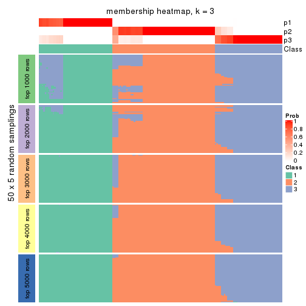</p>

</div>
<div id='tab-ATC-NMF-membership-heatmap-3'>
<pre><code class="r">membership_heatmap(res, k = 4)
</code></pre>

<p></p>

</div>
<div id='tab-ATC-NMF-membership-heatmap-4'>
<pre><code class="r">membership_heatmap(res, k = 5)
</code></pre>

<p></p>

</div>
<div id='tab-ATC-NMF-membership-heatmap-5'>
<pre><code class="r">membership_heatmap(res, k = 6)
</code></pre>

<p></p>

</div>
</div>

As soon as we have had the classes for columns, we can look for signatures
which are significantly different between classes which can be candidate marks
for certain classes. Following are the heatmaps for signatures.


Signature heatmaps where rows are scaled:


<script>
$( function() {
	$( '#tabs-ATC-NMF-get-signatures' ).tabs();
} );
</script>
<div id='tabs-ATC-NMF-get-signatures'>
<ul>
<li><a href='#tab-ATC-NMF-get-signatures-1'>k = 2</a></li>
<li><a href='#tab-ATC-NMF-get-signatures-2'>k = 3</a></li>
<li><a href='#tab-ATC-NMF-get-signatures-3'>k = 4</a></li>
<li><a href='#tab-ATC-NMF-get-signatures-4'>k = 5</a></li>
<li><a href='#tab-ATC-NMF-get-signatures-5'>k = 6</a></li>
</ul>
<div id='tab-ATC-NMF-get-signatures-1'>
<pre><code class="r">get_signatures(res, k = 2)
</code></pre>

<p></p>

</div>
<div id='tab-ATC-NMF-get-signatures-2'>
<pre><code class="r">get_signatures(res, k = 3)
</code></pre>

<p></p>

</div>
<div id='tab-ATC-NMF-get-signatures-3'>
<pre><code class="r">get_signatures(res, k = 4)
</code></pre>

<p></p>

</div>
<div id='tab-ATC-NMF-get-signatures-4'>
<pre><code class="r">get_signatures(res, k = 5)
</code></pre>

<p></p>

</div>
<div id='tab-ATC-NMF-get-signatures-5'>
<pre><code class="r">get_signatures(res, k = 6)
</code></pre>

<p></p>

</div>
</div>


Signature heatmaps where rows are not scaled:


<script>
$( function() {
	$( '#tabs-ATC-NMF-get-signatures-no-scale' ).tabs();
} );
</script>
<div id='tabs-ATC-NMF-get-signatures-no-scale'>
<ul>
<li><a href='#tab-ATC-NMF-get-signatures-no-scale-1'>k = 2</a></li>
<li><a href='#tab-ATC-NMF-get-signatures-no-scale-2'>k = 3</a></li>
<li><a href='#tab-ATC-NMF-get-signatures-no-scale-3'>k = 4</a></li>
<li><a href='#tab-ATC-NMF-get-signatures-no-scale-4'>k = 5</a></li>
<li><a href='#tab-ATC-NMF-get-signatures-no-scale-5'>k = 6</a></li>
</ul>
<div id='tab-ATC-NMF-get-signatures-no-scale-1'>
<pre><code class="r">get_signatures(res, k = 2, scale_rows = FALSE)
</code></pre>

<p></p>

</div>
<div id='tab-ATC-NMF-get-signatures-no-scale-2'>
<pre><code class="r">get_signatures(res, k = 3, scale_rows = FALSE)
</code></pre>

<p></p>

</div>
<div id='tab-ATC-NMF-get-signatures-no-scale-3'>
<pre><code class="r">get_signatures(res, k = 4, scale_rows = FALSE)
</code></pre>

<p>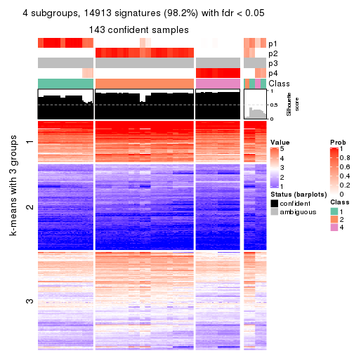</p>

</div>
<div id='tab-ATC-NMF-get-signatures-no-scale-4'>
<pre><code class="r">get_signatures(res, k = 5, scale_rows = FALSE)
</code></pre>

<p></p>

</div>
<div id='tab-ATC-NMF-get-signatures-no-scale-5'>
<pre><code class="r">get_signatures(res, k = 6, scale_rows = FALSE)
</code></pre>

<p></p>

</div>
</div>


Compare the overlap of signatures from different k:

```r
compare_signatures(res)
```


`get_signature()` returns a data frame invisibly. TO get the list of signatures, the function
call should be assigned to a variable explicitly. In following code, if `plot` argument is set
to `FALSE`, no heatmap is plotted while only the differential analysis is performed.

```r
# code only for demonstration
tb = get_signature(res, k = ..., plot = FALSE)
```

An example of the output of `tb` is:

```
#>   which_row         fdr    mean_1    mean_2 scaled_mean_1 scaled_mean_2 km
#> 1        38 0.042760348  8.373488  9.131774    -0.5533452     0.5164555  1
#> 2        40 0.018707592  7.106213  8.469186    -0.6173731     0.5762149  1
#> 3        55 0.019134737 10.221463 11.207825    -0.6159697     0.5749050  1
#> 4        59 0.006059896  5.921854  7.869574    -0.6899429     0.6439467  1
#> 5        60 0.018055526  8.928898 10.211722    -0.6204761     0.5791110  1
#> 6        98 0.009384629 15.714769 14.887706     0.6635654    -0.6193277  2
...
```

The columns in `tb` are:

1. `which_row`: row indices corresponding to the input matrix.
2. `fdr`: FDR for the differential test. 
3. `mean_x`: The mean value in group x.
4. `scaled_mean_x`: The mean value in group x after rows are scaled.
5. `km`: Row groups if k-means clustering is applied to rows.


UMAP plot which shows how samples are separated.


<script>
$( function() {
	$( '#tabs-ATC-NMF-dimension-reduction' ).tabs();
} );
</script>
<div id='tabs-ATC-NMF-dimension-reduction'>
<ul>
<li><a href='#tab-ATC-NMF-dimension-reduction-1'>k = 2</a></li>
<li><a href='#tab-ATC-NMF-dimension-reduction-2'>k = 3</a></li>
<li><a href='#tab-ATC-NMF-dimension-reduction-3'>k = 4</a></li>
<li><a href='#tab-ATC-NMF-dimension-reduction-4'>k = 5</a></li>
<li><a href='#tab-ATC-NMF-dimension-reduction-5'>k = 6</a></li>
</ul>
<div id='tab-ATC-NMF-dimension-reduction-1'>
<pre><code class="r">dimension_reduction(res, k = 2, method = &quot;UMAP&quot;)
</code></pre>

<p></p>

</div>
<div id='tab-ATC-NMF-dimension-reduction-2'>
<pre><code class="r">dimension_reduction(res, k = 3, method = &quot;UMAP&quot;)
</code></pre>

<p></p>

</div>
<div id='tab-ATC-NMF-dimension-reduction-3'>
<pre><code class="r">dimension_reduction(res, k = 4, method = &quot;UMAP&quot;)
</code></pre>

<p></p>

</div>
<div id='tab-ATC-NMF-dimension-reduction-4'>
<pre><code class="r">dimension_reduction(res, k = 5, method = &quot;UMAP&quot;)
</code></pre>

<p></p>

</div>
<div id='tab-ATC-NMF-dimension-reduction-5'>
<pre><code class="r">dimension_reduction(res, k = 6, method = &quot;UMAP&quot;)
</code></pre>

<p></p>

</div>
</div>


Following heatmap shows how subgroups are split when increasing `k`:

```r
collect_classes(res)
```


If matrix rows can be associated to genes, consider to use `GO_Enrichment(res,
...)` to perform function enrichment for the signature genes.


 

## Session info


```r
sessionInfo()
```

```
#> R version 3.6.0 (2019-04-26)
#> Platform: x86_64-pc-linux-gnu (64-bit)
#> Running under: CentOS Linux 7 (Core)
#> 
#> Matrix products: default
#> BLAS:   /usr/lib64/libblas.so.3.4.2
#> LAPACK: /usr/lib64/liblapack.so.3.4.2
#> 
#> locale:
#>  [1] LC_CTYPE=en_US.UTF-8       LC_NUMERIC=C               LC_TIME=en_US.UTF-8       
#>  [4] LC_COLLATE=en_US.UTF-8     LC_MONETARY=en_US.UTF-8    LC_MESSAGES=en_US.UTF-8   
#>  [7] LC_PAPER=en_US.UTF-8       LC_NAME=C                  LC_ADDRESS=C              
#> [10] LC_TELEPHONE=C             LC_MEASUREMENT=en_US.UTF-8 LC_IDENTIFICATION=C       
#> 
#> attached base packages:
#>  [1] grid      parallel  stats4    stats     graphics  grDevices utils     datasets  methods  
#> [10] base     
#> 
#> other attached packages:
#>  [1] genefilter_1.66.0           ComplexHeatmap_2.1.1        markdown_1.1               
#>  [4] knitr_1.26                  cola_1.3.2                  SummarizedExperiment_1.14.1
#>  [7] DelayedArray_0.10.0         BiocParallel_1.18.1         matrixStats_0.55.0         
#> [10] Biobase_2.44.0              GenomicRanges_1.36.1        GenomeInfoDb_1.20.0        
#> [13] IRanges_2.18.3              S4Vectors_0.22.1            BiocGenerics_0.30.0        
#> [16] GetoptLong_0.1.7           
#> 
#> loaded via a namespace (and not attached):
#>  [1] bitops_1.0-6           bit64_0.9-7            doParallel_1.0.15      RColorBrewer_1.1-2    
#>  [5] httr_1.4.1             backports_1.1.5        tools_3.6.0            R6_2.4.1              
#>  [9] DBI_1.0.0              lazyeval_0.2.2         colorspace_1.4-1       withr_2.1.2           
#> [13] tidyselect_0.2.5       gridExtra_2.3          bit_1.1-14             compiler_3.6.0        
#> [17] xml2_1.2.2             microbenchmark_1.4-7   pkgmaker_0.28          slam_0.1-46           
#> [21] scales_1.1.0           NMF_0.23.6             stringr_1.4.0          digest_0.6.23         
#> [25] XVector_0.24.0         pkgconfig_2.0.3        bibtex_0.4.2           highr_0.8             
#> [29] rlang_0.4.2            GlobalOptions_0.1.1    RSQLite_2.1.2          impute_1.58.0         
#> [33] shape_1.4.4            mclust_5.4.5           dendextend_1.12.0      dplyr_0.8.3           
#> [37] RCurl_1.95-4.12        magrittr_1.5           GenomeInfoDbData_1.2.1 Matrix_1.2-17         
#> [41] Rcpp_1.0.3             munsell_0.5.0          viridis_0.5.1          lifecycle_0.1.0       
#> [45] stringi_1.4.3          zlibbioc_1.30.0        plyr_1.8.4             blob_1.2.0            
#> [49] crayon_1.3.4           lattice_0.20-38        splines_3.6.0          annotate_1.62.0       
#> [53] circlize_0.4.9         zeallot_0.1.0          pillar_1.4.2           rjson_0.2.20          
#> [57] rngtools_1.4           reshape2_1.4.3         codetools_0.2-16       XML_3.98-1.20         
#> [61] glue_1.3.1             evaluate_0.14          vctrs_0.2.0            png_0.1-7             
#> [65] foreach_1.4.7          polyclip_1.10-0        gtable_0.3.0           purrr_0.3.3           
#> [69] clue_0.3-57            assertthat_0.2.1       ggplot2_3.2.1          xfun_0.11             
#> [73] gridBase_0.4-7         eulerr_6.0.0           xtable_1.8-4           skmeans_0.2-11        
#> [77] survival_2.44-1.1      viridisLite_0.3.0      tibble_2.1.3           iterators_1.0.12      
#> [81] memoise_1.1.0          AnnotationDbi_1.46.1   registry_0.5-1         GTF_0.0.1             
#> [85] cluster_2.1.0          brew_1.0-6
```


